# جلسه اول: نگارش، درست‌نویسی و اصول نویسندگی

## ۱. جایگاه، ارزش و جغرافیای تاریخی سخن

> [!info] تعریف حکمت سخن
> به تعبیر *فردوسی*، سخن حکمتی الهی است که به عنوان **ودیعه** در وجود انسان‌ها نهاده شده است.

* **ارزش سخن:** عالی‌ترین گواه ارزش قلم و کلام، سوگند صریح خداوند در قرآن کریم است: «ن وَالْقَلَمِ وَمَا يَسْطُرُونَ».

* **کاربرد سخن در جهان:** اصل نیاز به سخن و کاربرد آن در کل بشر **یکسان** است؛ اما *نوع سخن* و شیوه ارتباط بسته به **قوم**، **نژاد**، **محیط زیست** و **طایفه** متغیر است.

* **جغرافیای کهن زبان فارسی:** در عهد **ساسانیان**، پهنه گسترده‌ای تحت نفوذ این زبان بود؛ پایتخت آنان یعنی شهر **تیسفون** در خاک عراق کنونی (که امروزه عربی‌زبان است) کاملاً فارسی‌زبان بوده و هنوز ردپای نام‌های فارسی بر بسیاری از شهرهای آن جغرافیا باقی مانده است.

## ۲. شاخه‌بندی کالبدی کلام پارسی (نظم در برابر نثر)

> [!info] تعریف ریشه‌ای نثر و نظم
>
> * **نثر (در لغت):** به معنی *پراکندن* و *افکندن*.
>
> * **نثر (در اصطلاح):** کلامی روان برای بیان **مقاصد عادی و روزمره**، رها از قید وزن عروضی و قافیه.
>
> * **نظم (در لغت):** به معنی *پیوستن*، گردآوردن و به رشته کشیدن دانه‌ها.
>
> * **نظم (در اصطلاح):** سخنی موزون و مقفا که بر اساس **وزن و قافیه** پرداخته می‌شود.

### مقایسه تحلیلی گونه‌های کلامی و شاخه‌های نثر

| مؤلفه مقایسه            | نثر مرسل (ساده)                     | نثر موزون و مسجع                      | نثر فنی (مصنوع)                        | نظم (شعر)                                 |
| ----------------------- | ----------------------------------- | ------------------------------------- | -------------------------------------- | ----------------------------------------- |
| **تعریف لغوی و بنیاد**  | پراکندن؛ بیان شفاف پیام بدون تکلف   | همنشین با سجع و کلام آهنگین           | آکنده از ترکیبات دور از ذهن و استعاره  | به رشته کشیدن؛ پیوستگی وزنی               |
| **قید وزن و قافیه**     | فاقد وزن عروضی و قافیه الزامی       | دارای قرینه‌های لفظی شبیه قافیه (سجع) | فاقد وزن عروضی اما درگیر صنایع لفظی    | **مقید مطلق** به تقطیع وزنی و هجاهای منظم |
| **سطح مخاطب و فهم**     | همه طبقات (از بی‌سواد تا صاحب‌نظر)  | مخاطبان آشنا با طراوت‌های لفظی گلستان | نخبگان و ادیبان مسلط به واژگان دشوار   | دوستداران هنر کلامی و صور خیال            |
| **کارکرد اصلی متن**     | انتقال مقاصد روزمره، مکاتبات، گزارش | موعظه، گلستان‌نویسی و لطافت نثر       | خودنمایی ادبی، انشا، تاریخ‌نگاری دشوار | انگیزش عاطفی، حماسه، تخیل و تصویرسازی     |
| **نیاز به تفسیر و لغت** | **بی‌نیاز** از مراجعه به فرهنگ لغت  | کم‌نیاز؛ دریافت سریع آهنگ کلام        | **نیازمند دائمی** به رمزگشایی اصطلاحات | نیازمند رمزگشایی استعارات و نمادها        |

> [!tip] نکته طلایی امتحانی درباره گونه نثر
> تمرکز اصلی این درس بر **نثر ساده** است؛ نثری که ویژگی بنیادین آن **فهم همگانی و بدون ابهام** است؛ به گونه‌ای که هر فرد در جامعه با هر سطحی از سواد (بی‌سواد، کم‌سواد، متوسط یا تحصیلات عالی) بدون نیاز به تفسیر اضافی معنای آن را درک کند.

## ۳. جایگاه، تعهد و مشخصات نویسنده کارآمد

نوشته پس از انتشار در قالب مقاله، کتاب، داستان یا گزارش از **مالکیت فردی خارج** شده و مستقیماً با **روح جامعه به‌ویژه نسل جوان** پیوند می‌خورد.

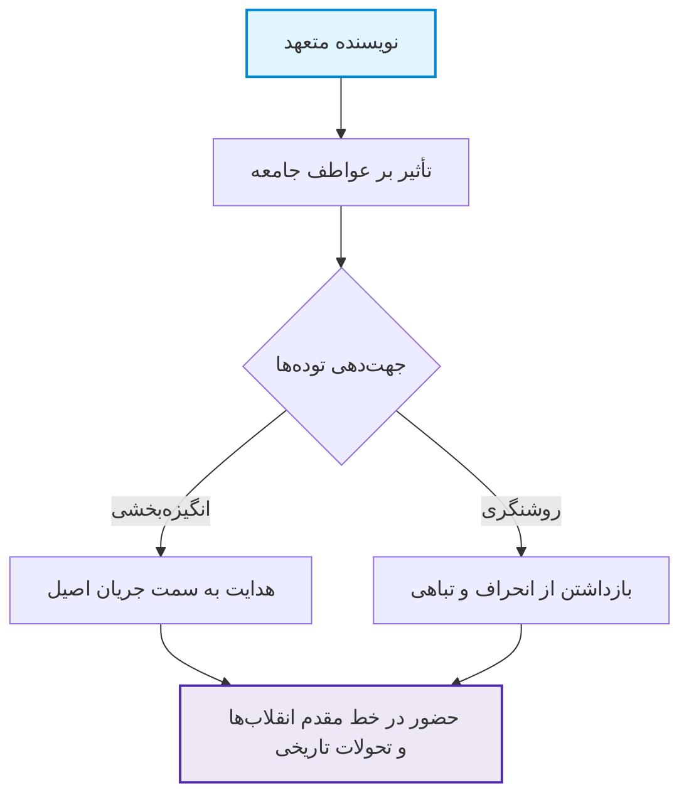
```mermaid
flowchart TD
    A[نویسنده متعهد] --> B[تأثیر بر عواطف جامعه]
    B --> C{جهت‌دهی توده‌ها}
    C -->|انگیزه‌بخشی| D[هدایت به سمت جریان اصیل]
    C -->|روشنگری| E[بازداشتن از انحراف و تباهی]
    D & E --> F[حضور در خط مقدم انقلاب‌ها و تحولات تاریخی]
    
    style A fill:#e1f5fe,stroke:#0288d1,stroke-width:2px;
    style F fill:#ede7f6,stroke:#512da8,stroke-width:2px;

```

### ویژگی‌های دهگانه نویسنده راستین

 1. **روشنی و وسعت اندیشه:** وسعت دید نسبت به جهان پیرامون.

 2. **قدرت تخیل و لطافت ذوق:** بازآفرینی هنرمندانه صحنه‌ها.

 3. **دقت و باریک‌بینی:** دیدن جزئیاتی که عموم مردم از آن غافل‌اند.

 4. **ابتکار و نوجویی:** دوری از تقلید کورکورانه برای مجذوب ساختن مخاطب.

 5. **شناخت ادبیات ملی:** تسلط بر فرهنگ، باورها و آداب و رسوم جامعه هدف.

 6. **تسلط عمیق بر زبان مادری:** درک ارکان، واژگان و ظرفیت‌های زبان مادری.

 7. **ارتباط با زبان‌های خارجی:** تسلط بر **حداقل یک یا دو زبان بیگانه** برای گسترش دیدگاه.

 8. **آگاهی از صنایع سخن:** به کار بردن معتدل آرایه‌ها.

 9. **داشتن درد، هدفمندی و پرهیز از حسد:** دوری از قلم‌فروشی، کینه‌توزی و غرض‌ورزی شخصی.

10. **حقیقت‌محوری:** فدا نکردن حق در برابر منافع گذرا.

> [!warning] تله تستی درباره آرایه‌های ادبی
> استفاده از آرایه‌ها شمشیر دو لبه است؛ **افراط** در استفاده از آرایه‌ها مخاطب را خسته و دلزده کرده و فراری می‌دهد؛ **تفریط** و دوری کامل از زیبایی نیز متن را خشک و دافع می‌سازد. شرط موفقیت رعایت **تعادل** است.

## ۴. ارکان دوقلوی یک نوشته خوب

معیار سنجش نوشته‌های ماندگار (اعم از داستانی، نمایشی، اخلاقی، دینی و اجتماعی) در دو شاخه تحلیل می‌شود:

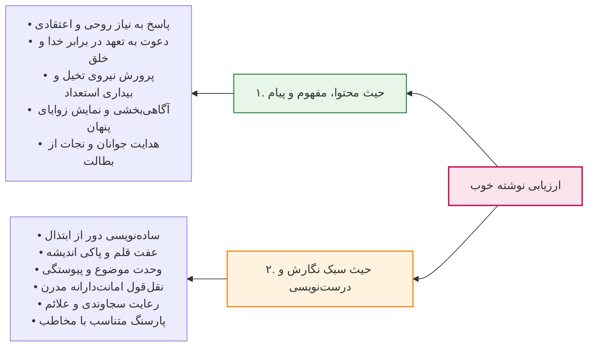
```mermaid
flowchart RL

Writing[ارزیابی نوشته خوب]

Writing --> Content[۱. حیث محتوا، مفهوم و پیام]
Writing --> Style[۲. حیث سبک نگارش و درست‌نویسی]

Content --> C_All["• پاسخ به نیاز روحی و اعتقادی
• دعوت به تعهد در برابر خدا و خلق
• پرورش نیروی تخیل و بیداری استعداد
• آگاهی‌‌بخشی و نمایش زوایای پنهان
• هدایت جوانان و نجات از بطالت"]

Style --> S_All["• ساده‌نویسی دور از ابتذال
• عفت قلم و پاکی اندیشه
• وحدت موضوع و پیوستگی
• نقل‌قول امانت‌دارانه مدرن
• رعایت سجاوندی و علائم
• پارسنگ متناسب با مخاطب"]

style Writing fill:#fce4ec,stroke:#c2185b,stroke-width:2px;
style Content fill:#e8f5e9,stroke:#388e3c,stroke-width:1.5px;
style Style fill:#fff3e0,stroke:#f57c00,stroke-width:1.5px;
```

### الف) ضوابط محتوایی و رسالت پیام

* **پاسخ به نیازهای فطری:** اقناع عطش روحی، معنوی و اعتقادی مخاطبان.

* **ایجاد احساس مسئولیت:** یادآوری تعهد خواننده در پیشگاه **خالق و خلق**.

* **شکوفاسازی اندیشه:** تقویت قوه تخیل، رساندن خواننده به **خودباوری** و برانگیختن ذوق‌های راکد.

* **نمایش ناگفته‌ها:** پرداختن به زاویه‌های تاریک زندگی برای پیشگیری از انحراف مخاطب.

* **جذب سازنده نوجوانان:** نجات قشر جوان از **بطالت و سهل‌انگاری** و تشویق آنان به استمرار مطالعه.

### ب) فهرست پانزده‌گانه سبک نگارش و آیین درست‌نویسی

1. **ساده‌نویسی:** پرهیز از لغات دشوار و معماگونه، به گونه‌ای که نیاز به **فرهنگ لغت یا حل چیستان** نباشد (البته ساده‌نویسی نباید به مرز *ابتذال* برسد).

2. **عفت قلم و پاکی فکر:** پرهیز مطلق از الفاظ رکیک و واژه‌های زننده، زیرا هتاکی اعتبار نویسنده را پایمال و مخاطب را دفع می‌کند.

3. **وحدت موضوع:** حفظ ارتباط طبیعی مفاهیم؛ اگر نویسنده به مطلب فرعی وارد شد، باید بتواند سریعاً و بدون ایجاد سردرگمی، ذهن خواننده را به محور اصلی پیوند بزند.

4. **کاربرد به‌جای صنایع ادبی:** بهره‌گیری هوشمندانه از تشبیه، استعاره، کنایه و تمثیل در حد اعتدال.

5. **نقل صحیح و امانت‌دارانه سخن دیگران:** پرهیز از *سرقت ادبی*؛ آوردن عین سخن درون **گیومه «...»**.

> [!info] تغییر شیوه استناد و ارجاع در پژوهش
>
> * **شیوه سنتی:** ذکر نام اثر و نویسنده در *پاورقی (پانویس)*.
>
> * **شیوه استاندارد و امروزی:** ارجاع **درون‌متنی بلافاصله پس از بسته شدن گیومه داخل پرانتز**، مشتمل بر نام نویسنده، سال انتشار و شماره صفحه: `(نویسنده، سال: ص)`.

 6. **اختصار و ایجاز:** بازگویی مفاهیم در کوتاه‌ترین عبارات و دوری از درازگویی‌های خسته‌کننده.

 7. **پرهیز از مقدمه‌چینی بی‌مورد:** اجتناب از تعارف، قلم‌فرسایی حاشیه‌ای و مداهنه؛ نقش مقدمه صرفاً **آماده‌سازی ذهن مخاطب** است.

 8. **پرهیز از واژگان دشوار و بیگانه:** جایگزین ساختن اصطلاحات دشوار با واژه‌های مأنوس و برابرهای اصیل زبان مادری.

 9. **رعایت املای درست واژگان:** تحقیق پیش از نگارش لغاتی که در رسم‌الخط آنها تردید وجود دارد.

10. **رعایت دقیق قواعد دستوری:** نشاندن ارکان جمله (نهاد، مفعول، متمم، فعل و صفت) در جایگاه دستوری صحیح.

11. **نشانه‌گذاری استاندارد (سجاوندی):** به‌کارگیری دقیق نقطه، ویرگول، علامت سوال و گیومه جهت تسهیل خوانش و ادراک لحن متن.

12. **خوانایی خط:** در نگارش‌های دستی، شرط بنیادین **خوانایی** است؛ خط نیازی به زیبایی هنری ندارد اما اگر ناخوانا باشد مخاطب را دلسرد می‌سازد.

13. **نظم، ترتیب و نظافت ظاهر:** رعایت آراستگی صفحه که نشانگر احترام نویسنده به شخصیت خواننده است.

14. **اختصاص هر بند (پاراگراف) به یک مفهوم مستقل:**

    * کوتاهی و بلندی بند به حجم معنا بستگی دارد (از **یک سطرِ رابط** میان دو بحث تا ده سطر شرحِ تفصیلی).

    * هر بند وظیفه دارد یک فکر یا مقصود مشخص را به سرانجام برساند.

15. **توجه به سطح مخاطب (کالیبراسیون کلام):**

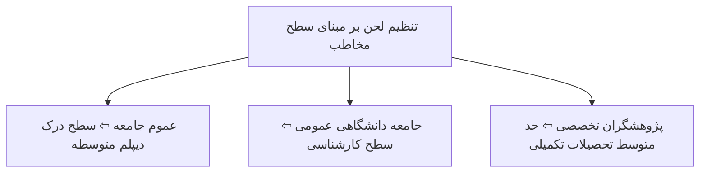
```mermaid
flowchart TD
    Audience[تنظیم لحن بر مبنای سطح مخاطب]
    Audience --> Public[عموم جامعه ⇦ سطح درک دیپلم متوسطه]
    Audience --> Bachelor[جامعه دانشگاهی عمومی ⇦ سطح کارشناسی]
    Audience --> HigherEd[پژوهشگران تخصصی ⇦ حد متوسط تحصیلات تکمیلی]

```

## ۵. دوگانه ارتقای مهارت نگارش

مهارت نویسندگی از طریق دو بازوی اصلی کسب می‌شود که تکرار و مداومت در آنها الزامی است:

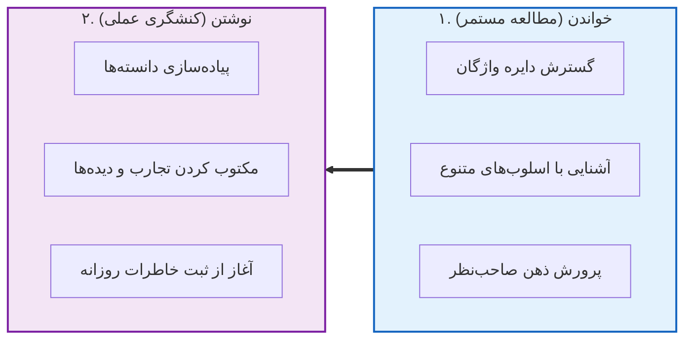
```mermaid
flowchart RL
    subgraph خواندن ["۱. خواندن (مطالعه مستمر)"]
        direction RL
        R1[گسترش دایره واژگان]
        R2[آشنایی با اسلوب‌های متنوع]
        R3[پرورش ذهن صاحب‌نظر]
    end

    subgraph نوشتن ["۲. نوشتن (کنشگری عملی)"]
        direction RL
        W1[پیاده‌سازی دانسته‌ها]
        W2[مکتوب کردن تجارب و دیده‌ها]
        W3[آغاز از ثبت خاطرات روزانه]
    end

    خواندن ==> نوشتن
    style خواندن fill:#e3f2fd,stroke:#1565c0,stroke-width:2px;
    style نوشتن fill:#f3e5f5,stroke:#7b1fa2,stroke-width:2px;

```

> [!warning] تمثیل بسیار مهم امتحانی: نویسندگی به مثابه فن تجربی
> همان‌طور که یک **مکانیک، نقاش یا نوازنده ساز** صرفاً با خواندن صدها کتاب نظری درباره تعمیر، رنگ یا موسیقی به مهارت دست نمی‌یابد و حتماً باید ابزار به دست بگیرد، نویسنده نیز با خواندن صرف کتب ویرایش و نگارش نویسنده نخواهد شد؛ بلکه باید **قلم بر کاغذ بگذارد** و اندیشه‌ها، تجارب و خاطرات روزمره خود را بنویسد.

### پیشینه خاطره‌نگاری و سفرنامه‌نویسی در ارتقای ادب فارسی

بهترین گام عملی برای شروع نویسندگی، **خاطره‌نویسی و سفرنامه‌نویسی** است. شاخص‌ترین الگوها در تاریخ ادبیات عبارتند از:

* **متون کهن:** *سفرنامه ناصرخسرو*.

* **متون معاصر:**

  * آثار *جلال آل‌احمد*: کتاب‌های ماندگار **خسی در میقات** (گزارش حج)، **اورازان** و **تات‌نشین‌های بلوک زهرا**.

  * آثار *محمدابراهیم باستانی پاریزی*: کتاب ارزشمند **از پاریز تا پاریس**.

## ۶. الگوریتم هفت‌مرحله‌ای نگارش علمی، مقاله و گزارش

برای تدوین منسجم یک نوشته پژوهشی یا گزارش رسمی، پیمودن هفت گام الزامی است:

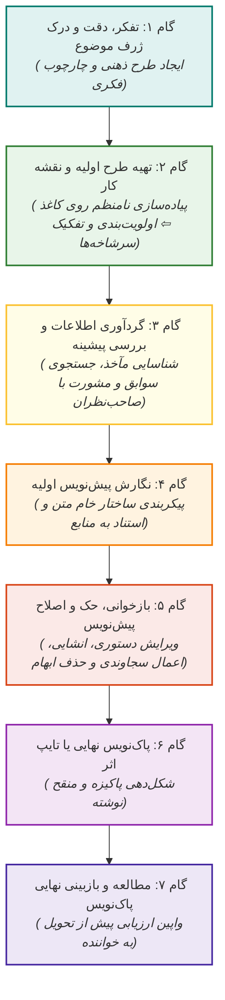
```mermaid
flowchart TD
    Step1["گام ۱: تفکر، دقت و درک ژرف موضوع<br><i>(ایجاد طرح ذهنی و چارچوب فکری)</i>"]
    Step2["گام ۲: تهیه طرح اولیه و نقشه کار<br><i>(پیاده‌سازی نامنظم روی کاغذ ⇦ اولویت‌بندی و تفکیک سرشاخه‌ها)</i>"]
    Step3["گام ۳: گردآوری اطلاعات و بررسی پیشینه<br><i>(شناسایی مآخذ، جستجوی سوابق و مشورت با صاحب‌نظران)</i>"]
    Step4["گام ۴: نگارش پیش‌نویس اولیه<br><i>(پیکربندی ساختار خام متن و استناد به منابع)</i>"]
    Step5["گام ۵: بازخوانی، حک و اصلاح پیش‌نویس<br><i>(ویرایش دستوری، انشایی، اعمال سجاوندی و حذف ابهام)</i>"]
    Step6["گام ۶: پاک‌نویس نهایی یا تایپ اثر<br><i>(شکل‌‌دهی پاکیزه و منقح نوشته)</i>"]
    Step7["گام ۷: مطالعه و بازبینی نهایی پاک‌نویس<br><i>(واپین ارزیابی پیش از تحویل به خواننده)</i>"]

    Step1 --> Step2 --> Step3 --> Step4 --> Step5 --> Step6 --> Step7

    style Step1 fill:#e0f2f1,stroke:#00796b,stroke-width:2px;
    style Step2 fill:#e8f5e9,stroke:#2e7d32,stroke-width:2px;
    style Step3 fill:#fffde7,stroke:#fbc02d,stroke-width:2px;
    style Step4 fill:#fff3e0,stroke:#f57c00,stroke-width:2px;
    style Step5 fill:#fbe9e7,stroke:#d84315,stroke-width:2px;
    style Step6 fill:#f3e5f5,stroke:#8e24aa,stroke-width:2px;
    style Step7 fill:#ede7f6,stroke:#4527a0,stroke-width:2px;

```

### چک‌لیست تلگرافی گام‌های هفت‌گانه

1. **تفکر و دقت:** پیش از اقدام، فهم دقیق هدف نوشته و تعیین زوایای دید الزامی است.

2. **تهیه طرح (نقشه کار):**

   * نوشتن تمامی داده‌ها به همان صورت **نامنظم** بر روی برگه.

   * ساماندهی و چینش منطقی: مشخص کردن تقدم و تاخر، اتصال مفهومی نکات، و جدا کردن نکات اصلی از زیرمجموعه‌ها.

3. **گردآوری اطلاعات:** ارزیابی پیشینه پژوهش، شناخت مآخذ معتبر و هم‌فکری با پیشکسوتان موضوع.

4. **تهیه پیش‌نویس:** تنظیم شاکله متن همراه با مشخص بودن منابع ارجاعی.

5. **اصلاح پیش‌نویس:** بازبینی منتقدانه؛ حذف زواید نارسا، اعمال درست قواعد انشایی، ویرایشی و علائم سجاوندی.

6. **پاک‌نویس یا تایپ:** آماده‌سازی نسخه تمیز و استاندارد.

7. **مطالعه و کنترل نهایی:** واپسین سنجش کیفی نوشته جهت رفع کوچک‌ترین لغزش‌های احتمالی قبل از انتشار نهایی.

# جلسه دوم: روش تحقیق و شیوه‌نامه نگارش گزارش پژوهشی

## ۱. شاخه‌بندی شیوه‌های سه‌گانه پژوهش

> [!abstract] تعریف شیوه تحقیق
> فرایند سیستماتیک برای دستیابی به داده‌ها و منابع معتبر جهت حل مسئله و تدوین پژوهش دانشگاهی متناسب با رشته تحصیلی.

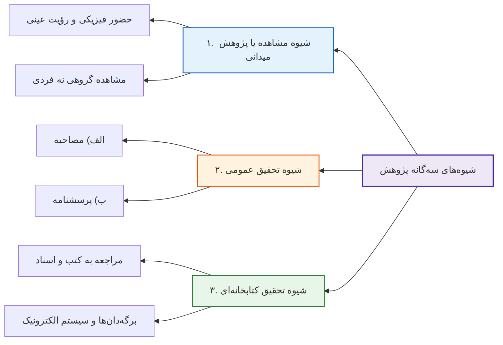
```mermaid
flowchart RL
    Method[شیوه‌های سه‌گانه پژوهش] --> M1[۱. شیوه مشاهده یا پژوهش میدانی]
    Method --> M2[۲. شیوه تحقیق عمومی]
    Method --> M3[۳. شیوه تحقیق کتابخانه‌ای]

    M1 --> M1_1[حضور فیزیکی و رؤیت عینی]
    M1 --> M1_2[مشاهده گروهی نه فردی]
    
    M2 --> M2_A["الف) مصاحبه"]
    M2 --> M2_B["ب) پرسشنامه"]
    
    M3 --> M3_1[مراجعه به کتب و اسناد]
    M3 --> M3_2[برگه‌دان‌ها و سیستم الکترونیک]

    style Method fill:#ede7f6,stroke:#4527a0,stroke-width:2px;
    style M1 fill:#e3f2fd,stroke:#1565c0,stroke-width:1.5px;
    style M2 fill:#fff3e0,stroke:#e65100,stroke-width:1.5px;
    style M3 fill:#e8f5e9,stroke:#2e7d32,stroke-width:1.5px;
```

### مقایسه تطبیقی شیوه‌های سه‌گانه پژوهش

| شیوه پژوهش | ماهیت و سازوکار | ابزار و مصادیق کاربردی | شرایط و الزامات کلیدی | 
| :--- | :--- | :--- | :--- | 
| **تحقیق مشاهده‌ای (میدانی)** | حضور عینی محقق در محل؛ ثبت دیده‌ها با چشم | بازرسی اداری، حسابرسی، مأموریت میدانی | **ثبت فوری و دقیق**، ترجیح کار **گروهی** به فردی (کثرت زوایای دید) | 
| **تحقیق عمومی** | تعامل مستقیم با افراد جامعه هدف | ۱. مصاحبه شفاهی ۲. پرسشنامه کتبی | رعایت اخلاق، بی‌طرفی محقق، ساختارمندی سوالات | 
| **تحقیق کتابخانه‌ای** | پژوهش مبتنی بر مطالعه متون و مآخذ مکتوب/دیجیتال | برگه‌دان، نمایه، اسناد تاریخی، مقالات، اطلس‌ها | نقد مآخذ، گزینش **چاپ انتقادی**، تدوین فیش و آرشیو شخصی | 

---

## ۲. ساختار تحقیق عمومی: فنون مصاحبه و طراحی پرسشنامه

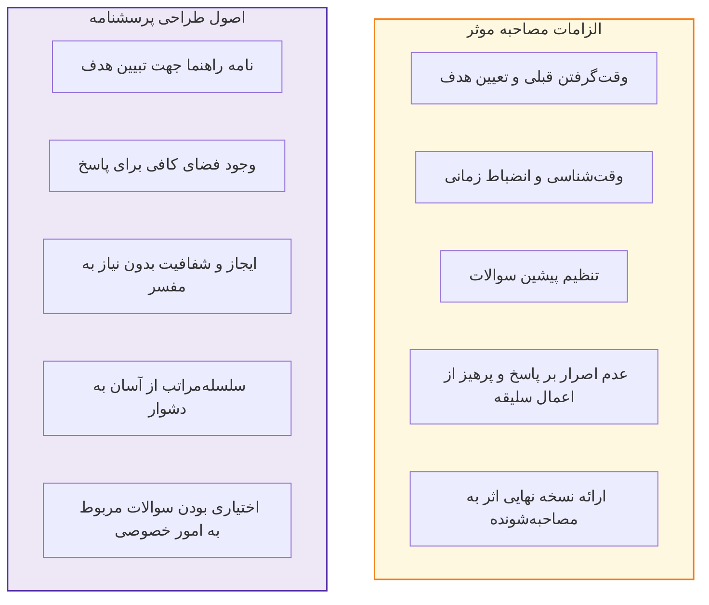
```mermaid
flowchart RL
    subgraph Interview ["الزامات مصاحبه موثر"]
        direction RL
        I1[وقت‌گرفتن قبلی و تعیین هدف]
        I2[وقت‌شناسی و انضباط زمانی]
        I3[تنظیم پیشین سوالات]
        I4[عدم اصرار بر پاسخ و پرهیز از اعمال سلیقه]
        I5[ارائه نسخه نهایی اثر به مصاحبه‌شونده]
    end

    subgraph Questionnaire ["اصول طراحی پرسشنامه"]
        direction RL
        Q1[نامه راهنما جهت تبیین هدف]
        Q2[وجود فضای کافی برای پاسخ]
        Q3[ایجاز و شفافیت بدون نیاز به مفسر]
        Q4[سلسله‌مراتب از آسان به دشوار]
        Q5[اختیاری بودن سوالات مربوط به امور خصوصی]
    end

    Interview ~~~ Questionnaire
    style Interview fill:#fff8e1,stroke:#f57f17,stroke-width:1.5px;
    style Questionnaire fill:#ede7f6,stroke:#512da8,stroke-width:1.5px;
```

> [!tip] ویژگی کلیدی و پیش‌بینی‌نشده در مصاحبه
> بر خلاف مطالعه کتابخانه‌ای، در مصاحبه ممکن است سخنان طرف گفتگو حاوی **اطلاعات بکر و پیش‌بینی‌نشده‌ای** باشد که در فرضیات اولیه محقق نبوده و مسیر تحقیق را بارورتر سازد.

### چک‌لیست ضوابط پرسشنامه و مصاحبه
1. **نامه پیوست پرسشنامه:** درج هدف تحقیق، شیوه تکمیل و راهنمایی پاسخ‌دهنده.
2. **رعایت توالی منطقی:** چینش پرسش‌ها بر پایه پیوستگی موضوعی و توالی **آسان به دشوار**.
3. **آزادی عمل در حریم خصوصی:** دادن حق انتخاب به پاسخ‌دهنده در عدم پاسخ‌گویی به سوالات فردی.
4. **تعهد اخلاقی مصاحبه‌کننده:** امانت‌داری کامل در لحن مصاحبه‌شونده و ارسال نسخه چاپ‌شده یا فایل صوتی/تصویری به وی.

---

## ۳. الگوریتم پژوهش کتابخانه‌ای و بازیابی اسناد

> [!info] تعریف برگه‌دان کتابخانه‌ای
> سامانه‌ای سنتی یا دیجیتال برای ثبت مشخصات هویتی کتاب‌ها بر اساس ترتیب **الفبایی** که دسترسی محقق را از سه درگاه مستقل فراهم می‌کند.

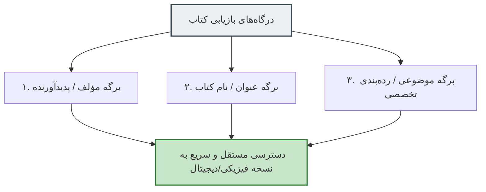
```mermaid
flowchart TD
    Search[درگاه‌های بازیابی کتاب] --> S1[۱. برگه مؤلف / پدیدآورنده]
    Search --> S2[۲. برگه عنوان / نام کتاب]
    Search --> S3[۳. برگه موضوعی / رده‌بندی تخصصی]

    S1 & S2 & S3 --> Access[دسترسی مستقل و سریع به نسخه فیزیکی/دیجیتال]

    style Search fill:#eceff1,stroke:#37474f,stroke-width:2px;
    style Access fill:#c8e6c9,stroke:#2e7d32,stroke-width:2px;
```

> [!important] تمایز نسخ و اولویت مآخذ
> * در صورت تعدد نسخ یک اثر، اولویت با نسخه **تصحیح‌شده، انتقادی و چاپ جدیدتر** است.
> * در مقایسه میان منابع، استفاده از **منبع دست اول (اصیل)** بر منابع دست دوم و سوم الزامی است.
> * برای رفع ابهام در گزینش مآخذ، استعلام از *استاد راهنما یا کتابدار متخصص* ضرورت دارد.

### موازین سنجش ارزش علمی کتب و مقالات
1. **دقت پژوهشی** و اعتبار علمی نویسنده.
2. **تازگی و اصالت** مباحث طرح‌شده.
3. **دامنه و وسعت** پوشش موضوعی.
4. **تناسب مستقیم** محتوا با محور پژوهش جاری.
5. **معیارهای استنادی:** بهره‌گیری از آمار، ارقام، نمودارها و جداول تحلیلی.
6. **فهرست‌های فنی مجهز:** دارا بودن فهرست مندرجات، مآخذ، اعلام (اشخاص، اماکن)، نمایه (*Index*)، تصاویر و جداول.

> [!warning] تله تستی درباره استفاده از منابع متعدد
> گردآوری مطالب از چند مأخذ نباید منجر به **تکرار ملال‌آور** شود؛ برای مثال ذکر تعریف یک واژه از زبان دو نویسنده مختلف در متن مصداق حشو است و پژوهشگر باید به *جامع‌ترین تعریف منفرد* اکتفا کند.

---

## ۴. دانشنامه مراجع، مراکز و بانک‌های اطلاعاتی پژوهش

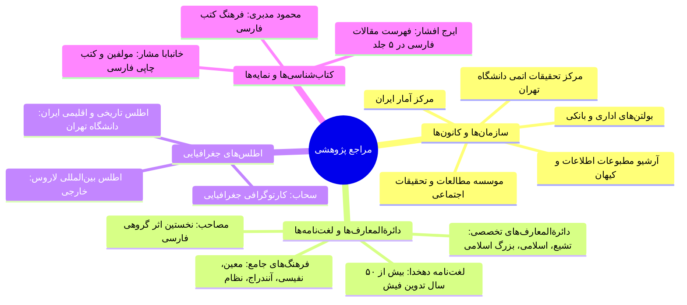
```mermaid
mindmap
  root((مراجع پژوهشی))
    سازمان‌ها و کانون‌ها
      مرکز آمار ایران
      موسسه مطالعات و تحقیقات اجتماعی
      مرکز تحقیقات اتمی دانشگاه تهران
      آرشیو مطبوعات اطلاعات و کیهان
      بولتن‌های اداری و بانکی
    دائرةالمعارف‌ها و لغت‌نامه‌ها
      مصاحب: نخستین اثر گروهی فارسی
      لغت‌نامه دهخدا: بیش از ۵۰ سال تدوین فیش
      دائرةالمعارف‌های تخصصی: تشیع، اسلامی، بزرگ اسلامی
      فرهنگ‌های جامع: معین، نفیسی، آنندراج، نظام
    اطلس‌های جغرافیایی
      سحاب: کارتوگرافی جغرافیایی
      اطلس تاریخی و اقلیمی ایران: دانشگاه تهران
      اطلس بین‌المللی لاروس: خارجی
    کتاب‌شناسی‌ها و نمایه‌ها
      خانبابا مشار: مولفین و کتب چاپی فارسی
      محمود مدبری: فرهنگ کتب فارسی
      ایرج افشار: فهرست مقالات فارسی در ۵ جلد
```

### اطلاعات کلیدی امتحانی درباره مراجع پژوهش

* **دائرةالمعارف مصاحب:** *نخستین دائرةالمعارف فارسی مدرن* با تلاش هیئت دانشمندان زیر نظر *دکتر غلامحسین مصاحب*.
* **لغت‌نامه دهخدا:** حاصل دسترنج *علی‌اکبر دهخدا*؛ گردآوری برگه/فیش‌های آن **بالغ بر ۵۰ سال** زمان برد.
* **فهرست مقالات فارسی:** تألیف ماندگار *ایرج افشار* در **5 جلد**، نمایه‌ساز هزاران مقاله معتبر علمی، ادبی و پژوهشی.
* **مولفین کتب چاپی فارسی:** تدوین شاخص *خانبابا مشار* در **4 جلد**.

---

## ۵. اسلوب فیش‌برداری و تکنیک‌های یادداشت‌برداری

> [!abstract] فیش‌برداری استاندارد
> ثبت نظام‌مند یافته‌های مطالعاتی روی برگه‌های ویژه با ابعاد استاندارد **$7 \times 10$ سانتی‌متر** برای تسهیل بازخوانی، طبقه‌بندی و بایگانی داده‌ها.

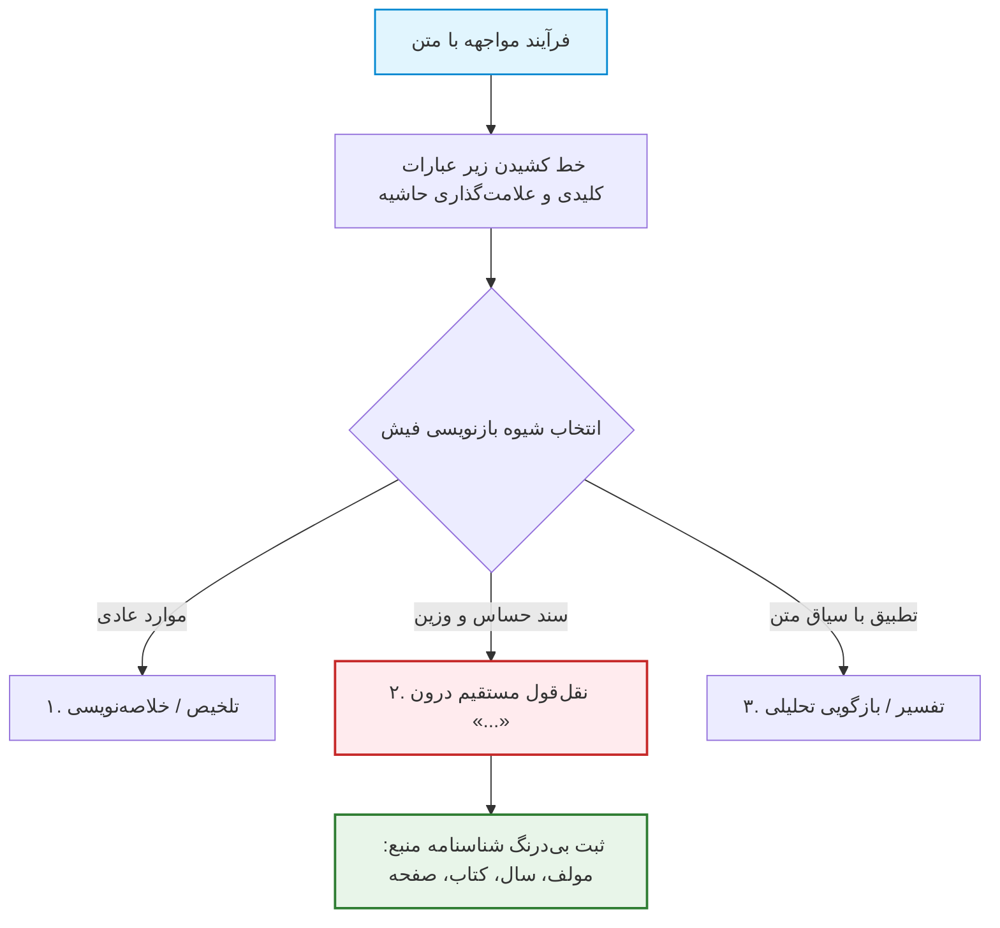
```mermaid
flowchart TD
    Reading[فرآیند مواجهه با متن] --> Underline[خط کشیدن زیر عبارات کلیدی و علامت‌گذاری حاشیه]
    Underline --> MethodChoice{انتخاب شیوه بازنویسی فیش}
    
    MethodChoice -->|موارد عادی| Sum[۱. تلخیص / خلاصه‌نویسی]
    MethodChoice -->|سند حساس و وزین| Quote[۲. نقل‌قول مستقیم درون «...»]
    MethodChoice -->|تطبیق با سیاق متن| Interp[۳. تفسیر / بازگویی تحلیلی]

    Quote --> Ref[ثبت بی‌درنگ شناسنامه منبع: مولف، سال، کتاب، صفحه]

    style Reading fill:#e1f5fe,stroke:#0288d1,stroke-width:1.5px;
    style Quote fill:#ffebee,stroke:#c62828,stroke-width:2px;
    style Ref fill:#e8f5e9,stroke:#2e7d32,stroke-width:2px;
```

### روش‌های سه‌گانه ثبت و پردازش داده‌ها در فیش
1. **تلخیص (خلاصه‌نویسی):** بازنویسی چکیده مطلب به قلم خود پژوهشگر و به زبانی ساده (کاربرد: امور عمومی و عادی متن).
2. **نقل‌قول مستقیم:** آوردن عین کلام درون **گیومه «...»** همراه با ذکر کامل شناسنامه مأخذ (*نام پدیدآورنده، نام اثر، سال نشر، شماره صفحه*). غفلت از آن موجب اتهام **سرقت علمی** یا سردرگمی در بازیابی مجدد است.
3. **تفسیر:** آمیختن پیام منبع با بیان پژوهشگر بدون دگرگونی پیام اصلی به قصد ایجاد یکدستی در زبان و بافت متن نهایی.

---

## ۶. فرایند چهارگانه تدوین و نگارش گزارش علمی

> [!info] تعریف موجز گزارش
> انتقال پاره‌ای از اطلاعات آگاهی‌بخش به فرد یا مرجعی که نسبت به آن **بی‌اطلاع** است یا آگاهی اندکی دارد.

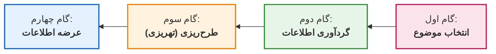
```mermaid
flowchart RL
    Step1["گام اول:<br><b>انتخاب موضوع</b>"] --> Step2["گام دوم:<br><b>گردآوری اطلاعات</b>"]
    Step2 --> Step3["گام سوم:<br><b>طرح‌ریزی (تهریزی)</b>"]
    Step3 --> Step4["گام چهارم:<br><b>عرضه اطلاعات</b>"]

    style Step1 fill:#fce4ec,stroke:#c2185b,stroke-width:2px;
    style Step2 fill:#e8f5e9,stroke:#388e3c,stroke-width:2px;
    style Step3 fill:#fff3e0,stroke:#f57c00,stroke-width:2px;
    style Step4 fill:#e3f2fd,stroke:#1565c0,stroke-width:2px;
```

### گام اول: ضوابط انتخاب موضوع گزارش
* **علاقه محقق:** پیش‌شرط پرهیز از کار فرمایشی و *رفع تکلیفی*.
* **وجود پیشینه و امکان تحقیق:** سنجش وسعت مبحث و کافی بودن توان علمی دانشجو.
* **دسترسی به منابع کافی:** بدون مأخذ معتبر، گزارش ارزش علمی ندارد.
* **تعامل مستمر با استاد راهنما:** هماهنگی موضوع با حیطه تخصصی استاد، انطباق با تقویم فراغت و ارائه چرک‌نویس پیش از تدوین نهایی.

> [!warning] تمثیل امتحانی: گزارشگر در مقام مهندس معمار (تهریزی مطالب)
> محقق در گام سوم (طرح‌ریزی/تهریزی)، درست مانند یک **مهندس ناظر و طراح بنا** عمل می‌کند؛ ابتدا ابعاد زمین و تناسب فضاها را در اندیشه مجسم ساخته، نقشه اجرایی را رسم می‌کند و سپس بر اساس اولویت سازه‌ای (تقدم و تأخر ساخت)، متریال مناسب را در هر بخش می‌نشاند.

### گام چهارم: اجزای ده‌گانه ساختار رسمی گزارش مفصل
1. **صفحه عنوان:** مشتمل بر نام پدیدآورنده، نام گیرنده/سازمان، موضوع، تاریخ دقیق و نام شهر.
2. **پیش‌گفتار (سرآغاز):** معرفی اجمالی رسالت گزارش.
3. **فهرست مطالب و پیوست‌ها.**
4. **فهرست جداول، نمودارها و نقشه‌ها.**
5. **متن بدنه اصلی گزارش.**
6. **فهرست اعلام:** اسامی اشخاص، اماکن تاریخی و جغرافیایی.
7. **فهرست موضوعی یا نمایه (*Index*).**
8. **فهرست منابع و مآخذ (کتاب‌‌شناسی).**

---

## ۷. سنخ‌شناسی و دسته‌بندی گونه‌های گزارش

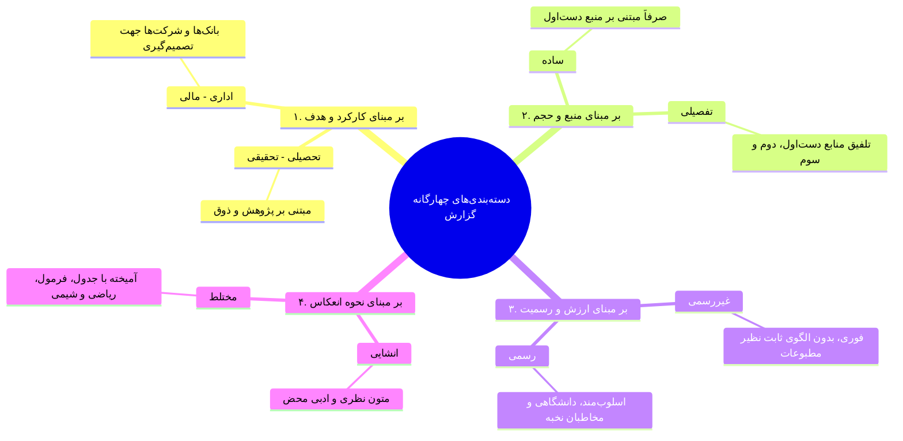
```mermaid
mindmap
  root((دسته‌بندی‌های چهارگانه گزارش))
    ۱. بر مبنای کارکرد و هدف
      تحصیلی - تحقیقی
        مبتنی بر پژوهش و ذوق
      اداری - مالی
        بانک‌ها و شرکت‌ها جهت تصمیم‌گیری
    ۲. بر مبنای منبع و حجم
      ساده
        صرفاً مبتنی بر منبع دست‌اول
      تفصیلی
        تلفیق منابع دست‌‌اول، دوم و سوم
    ۳. بر مبنای ارزش و رسمیت
      غیررسمی
        فوری، بدون الگوی ثابت نظیر مطبوعات
      رسمی
        اسلوب‌مند، دانشگاهی و مخاطبان نخبه
    ۴. بر مبنای نحوه انعکاس
      انشایی
        متون نظری و ادبی محض
      مختلط
        آمیخته با جدول، فرمول، ریاضی و شیمی
```

### ماتریس چهارگانه طبقه‌بندی انواع گزارش

| شاخص تقسیم                | گونه اول                  | گونه دوم         | تمایزهای ساختاری                                                                                                                       |
| :------------------------ | :------------------------ | :--------------- | :------------------------------------------------------------------------------------------------------------------------------------- |
| **۱. از حیث کاربرد**      | **گزارش تحصیلی - تحقیقی** | **گزارش اداری**  | تحصیلی متکی بر *انگیزه علمی/علاقه دانشجو* است؛ اداری بر پایه *تراز مالی، پیشرفت کاری و تصمیم‌گیری‌های کلان سازمانی* است.            |
| **۲. از حیث منابع و حجم** | **گزارش ساده**            | **گزارش تفصیلی** | ساده فقط بر *منبع دست اول* تکیه دارد (مثل تلخیص یک کتاب)؛ تفصیلی از *منابع دست‌اول، دوم و سوم* بهره می‌گیرد و اعتبار عمیق‌تری دارد. |
| **۳. از حیث رسمیت**       | **گزارش غیررسمی**         | **گزارش رسمی**   | غیررسمی برای *اطلاع‌رسانی فوری و بدون فرمت خاص* است؛ رسمی تابع *آیین‌نامه‌های دقیق دانشگاهی/سازمانی* برای نخبگان است.               |
| **۴. از حیث فرم انعکاس**  | **گزارش انشایی**          | **گزارش مختلط**  | انشایی متکی بر *متن ساده و نگارش کلامی* است؛ مختلط تلفیقی از متن و *فرمول، آمار، ارقام، منحنی‌ها و جداول* است.                      |

---

## ۸. شاخص‌های گزارش کارآمد در برابر آسیب‌شناسی ضعف گزارش

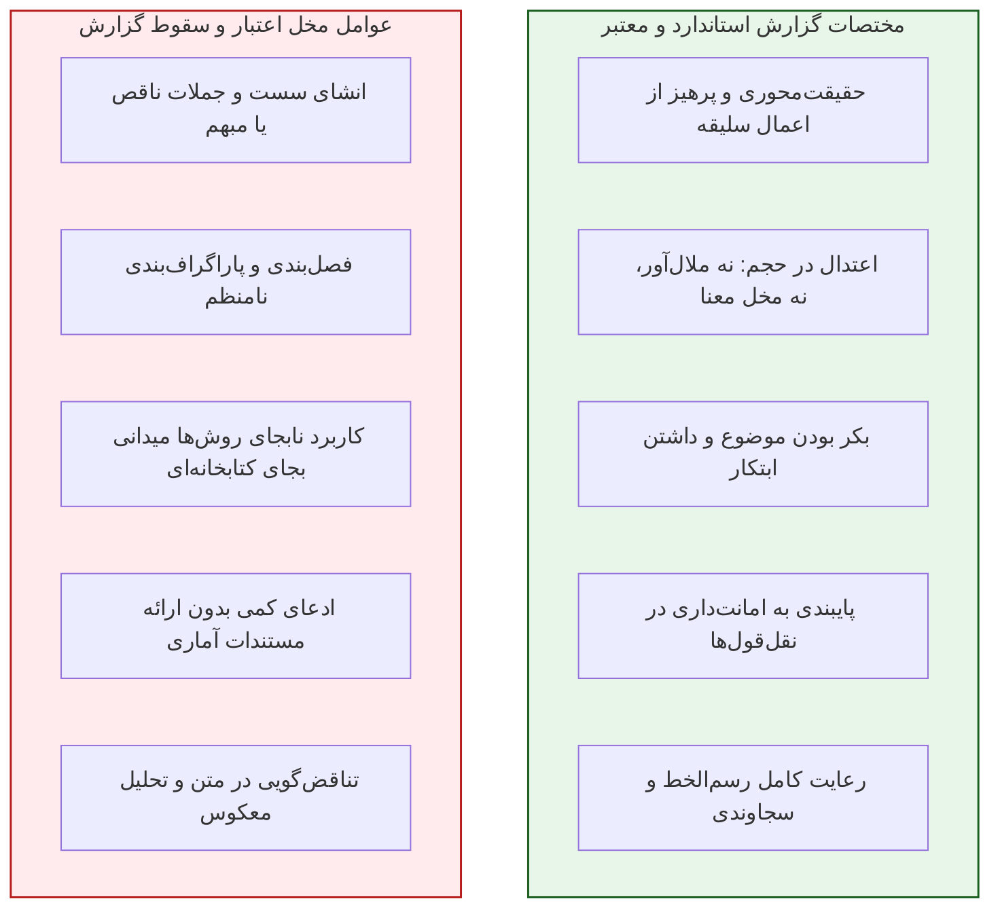
```mermaid
flowchart RL
    subgraph Positives ["مختصات گزارش استاندارد و معتبر"]
        direction RL
        P1[حقیقت‌محوری و پرهیز از اعمال سلیقه]
        P2[اعتدال در حجم: نه ملال‌آور، نه مخل معنا]
        P3[بکر بودن موضوع و داشتن ابتکار]
        P4[پایبندی به امانت‌داری در نقل‌قول‌ها]
        P5[رعایت کامل رسم‌الخط و سجاوندی]
    end

    subgraph Negatives ["عوامل مخل اعتبار و سقوط گزارش"]
        direction RL
        N1[انشای سست و جملات ناقص یا مبهم]
        N2[فصل‌بندی و پاراگراف‌بندی نامنظم]
        N3[کاربرد نابجای روش‌ها میدانی بجای کتابخانه‌ای]
        N4[ادعای کمی بدون ارائه مستندات آماری]
        N5[تناقض‌گویی در متن و تحلیل معکوس]
    end

    Positives ~~~ Negatives
    style Positives fill:#e8f5e9,stroke:#1b5e20,stroke-width:1.5px;
    style Negatives fill:#ffebee,stroke:#b71c1c,stroke-width:1.5px;
```

> [!danger] پیامدهای خطرناک اطلاعات نادرست در گزارش
> خطای محقق در آمار و ارقام گزارش‌های میدانی یا آماری (مانند جمعیت دانشجویان، شاخص‌های ایمنی کارخانه یا پرسنل سازمان) می‌تواند به **تصمیم‌گیری‌های نادرست مدیران** منجر شده و بر **سرنوشت شغلی و اجتماعی افراد** تأثیر جبران‌ناپذیر بگذارد.

### پنج آفت بنیادین گزارش‌های پژوهشی
1. **انشای شکسته و ناتمام:** ضعف دستوری در جایگاه ارکان جمله و ناتوانی در انتقال اندیشه.
2. **پاراگراف‌بندی پریشان:** گسست میان بندها و ورود ناگهانی به مضامین متفرقه.
3. **انتخاب متدولوژی نامناسب:** به کار بستن روش تحقیق کتابخانه‌ای در امور میدانی یا بالعکس.
4. **احکام ذهنی فاقد سند:** ارزیابی‌های کمّی بدون اتکا به جدول، آمار ریاضی و نمودار.
5. **تناقض منطقی در متن:** تایید یک پارامتر در صدر گزارش و نفی ناموجه آن در ذیل متن که اعتبار پژوهش را سلب می‌کند.

# جلسه سوم: فنون مقاله‌نویسی و اصول تدوین رساله دانشگاهی (پژوهشنامه)

## 1. تعریف، ماهیت و تنوع قلمرو مقاله

> [!abstract] تعریف لغوی و اصطلاحی مقاله
> * **در لغت:** مأخوذ از واژه عربی «مَقالَت» از ریشه *«قَول / قَلَ»* به معنی **گفتن**.
> * **در اصطلاح:** نوشته‌ای است مستقل و منسجم که **صرفاً پیرامون یک موضوع خاص و معین** بحث می‌کند و دامنه‌ای وسیع از حوزه‌های علمی، ادبی، تحقیقی، مذهبی، انتقادی، پدیده‌های طبیعی و روابط انسانی را در بر می‌گیرد.

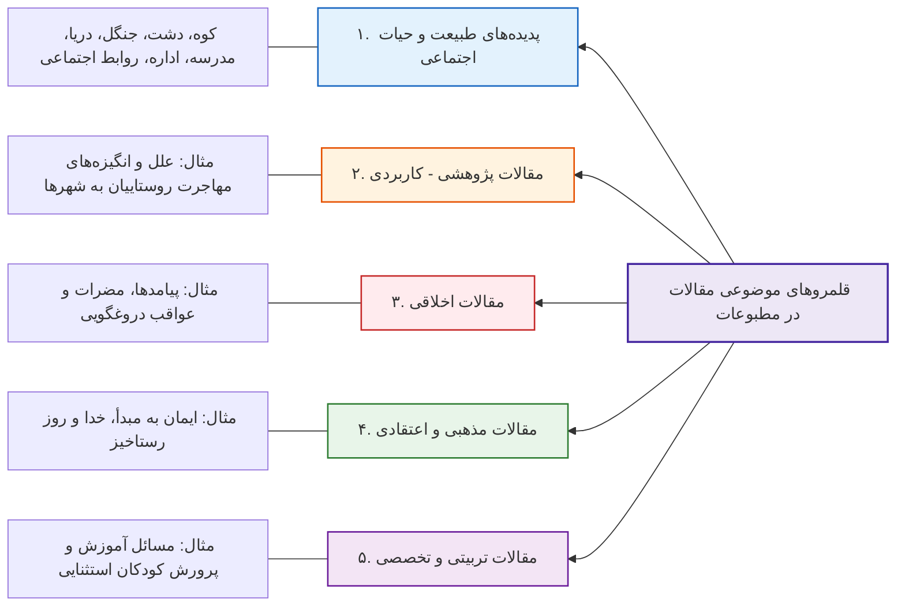
```mermaid
flowchart RL
    Article["قلمروهای موضوعی مقالات در مطبوعات"]
    
    Article --> T1["۱. پدیده‌های طبیعت و حیات اجتماعی"]
    Article --> T2["۲. مقالات پژوهشی - کاربردی"]
    Article --> T3["۳. مقالات اخلاقی"]
    Article --> T4["۴. مقالات مذهبی و اعتقادی"]
    Article --> T5["۵. مقالات تربیتی و تخصصی"]

    T1 --- E1["کوه، دشت، جنگل، دریا، مدرسه، اداره، روابط اجتماعی"]
    T2 --- E2["مثال: علل و انگیزه‌های مهاجرت روستاییان به شهرها"]
    T3 --- E3["مثال: پیامدها، مضرات و عواقب دروغگویی"]
    T4 --- E4["مثال: ایمان به مبدأ، خدا و روز رستاخیز"]
    T5 --- E5["مثال: مسائل آموزش و پرورش کودکان استثنایی"]

    style Article fill:#ede7f6,stroke:#4527a0,stroke-width:2px;
    style T1 fill:#e3f2fd,stroke:#1565c0,stroke-width:1.5px;
    style T2 fill:#fff3e0,stroke:#e65100,stroke-width:1.5px;
    style T3 fill:#ffebee,stroke:#c62828,stroke-width:1.5px;
    style T4 fill:#e8f5e9,stroke:#2e7d32,stroke-width:1.5px;
    style T5 fill:#f3e5f5,stroke:#6a1b9a,stroke-width:1.5px;
```

> [!important] مهم‌ترین و چالش‌‌برانگیزترین گام در مقاله‌نویسی
> نخستین، **سخت‌ترین و کلیدی‌ترین مرحله** در نگارش مقاله، **انتخاب موضوع مناسب، جذاب و روزآمد** است. موضوع باید کشش جذب مخاطب را داشته باشد، پیرامون معضلات حل‌نشده جامعه باشد و نویسنده از طریق *مشاهده عینی، خوب دیدن، خوب شنیدن، تجربه مستقیم و مطالعه پیشینه* بدان دست یابد.

---

## 2. سنخ‌شناسی گونه‌های پنج‌گانه مقاله و ویژگی‌های سبکی

گرچه مرز میان نثرهای نگارشی کاملاً نفوذناپذیر نیست، اما لحن، گزینش واژگان و ترکیب جملات در انواع پنج‌گانه مقالات کاملاً متمایز است:

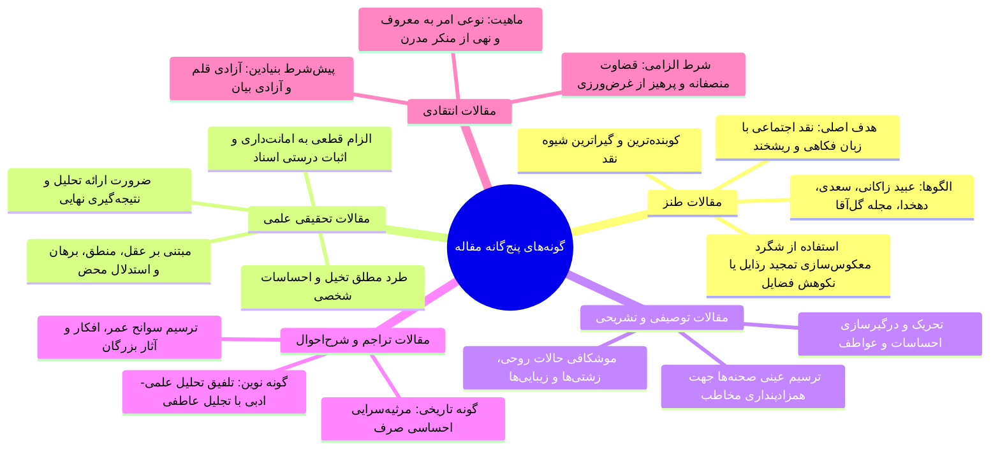
```mermaid
mindmap
  root((گونه‌های پنج‌گانه مقاله))
    مقالات طنز
      هدف اصلی: نقد اجتماعی با زبان فکاهی و ریشخند
      استفاده از شگرد معکوس‌سازی تمجید رذایل یا نکوهش فضایل
      کوبنده‌ترین و گیراترین شیوه نقد
      الگوها: عبید زاکانی، سعدی، دهخدا، مجله گل‌آقا
    مقالات تحقیقی علمی
      مبتنی بر عقل، منطق، برهان و استدلال محض
      طرد مطلق تخیل و احساسات شخصی
      الزام قطعی به امانت‌داری و اثبات درستی اسناد
      ضرورت ارائه تحلیل و نتیجه‌گیری نهایی
    مقالات توصیفی و تشریحی
      موشکافی حالات روحی، زشتی‌ها و زیبایی‌ها
      ترسیم عینی صحنه‌ها جهت همزادپنداری مخاطب
      تحریک و درگیرسازی احساسات و عواطف
    مقالات تراجم و شرح‌‌احوال
      ترسیم سوانح عمر، افکار و آثار بزرگان
      گونه تاریخی: مرثیه‌سرایی احساسی صرف
      گونه نوین: تلفیق تحلیل علمی-ادبی با تجلیل عاطفی
    مقالات انتقادی
      ماهیت: نوعی امر به معروف و نهی از منکر مدرن
      پیش‌شرط بنیادین: آزادی قلم و آزادی بیان
      شرط الزامی: قضاوت منصفانه و پرهیز از غرض‌ورزی
```

### ماتریس مقایسه تطبیقی گونه‌های پنج‌گانه مقاله

| گونه مقاله | ماهیت و هدف بنیادین | بار احساسی و شیوه بیان | شروط ویژه و شاخص‌های فنی | الگوها و مصادیق تاریخی / معاصر |
| :--- | :--- | :--- | :--- | :--- |
| **طنز** | **انتقاد اجتماعی-اخلاقی** با سلاح تمسخر و خنده تلخ | جذاب، ریشخندآمیز، فکاهی؛ بهره‌گیری از **شگرد بیان معکوس** | اثرگذاری عمیق؛ *کوبنده‌ترین و گیراترین* شیوه نقد | کهن: *عبید زاکانی*، برخی حکایات *سعدی* معاصر: *علامه دهخدا*، نوشته‌های *مجله گل‌آقا* |
| **تحقیقی - علمی** | اثبات فرضیات بر پایه **عقل، منطق، برهان و سند** | **فاقد عاطفه، حس و خیال‌پردازی**؛ کاملاً جدی و رسمی | **احاطه کامل بر موضوع**، اثبات درستی داده‌ها، **امانت‌داری دقیق در ارجاع**، لزوم استنتاج و نتیجه‌گیری | گزارش‌های علمی، پایان‌نامه‌ها و متون استدلالی دانشگاهی |
| **توصیفی - تشریحی** | بازآفرینی ریزبه‌ریز وقایع و ابعاد بیرونی/درونی پدیده‌ها | مخاطب‌محور، مهیج، **تحریک‌‌کننده مستقیم عواطف و احساسات** | موشکافی حالات قهرمان، **همزادپنداری خواننده با صحنه‌ها** | داستان‌نویسی، متون ادبی تشریحی و گزارش‌های حسی |
| **تراجم (شرح‌احوال)** | ترسیم کارنامه زیستی، خلق‌وخو، افکار و آثار بزرگان | گذار از *رویکرد صرفاً احساسی و مرثیه‌سرایی* به *تحلیل علمی* | بررسی جامع محاسن اخلاقی، علمی، ادبی و تاریخی فرد | کهن: مرثیه *بیهقی* در مرگ *بونصر مشکان*، مرثیه *خاقانی* برای *امام محمد بن یحیی* معاصر: خطابه *سعید نفیسی* در رثای *سید اشرف‌الدین حسینی (نسیم شمال)* |
| **انتقادی** | اصلاح نابسامانی‌ها، تقویت حس انسان‌دوستی (**امر به معروف و نهی از منکر**) | اصلاح‌گر، خیرخواهانه، فاقد پرخاش و توهین | **وجود آزادی بیان و قلم** در جامعه، بی‌طرفی و **انصاف** (دیدن همزمان محاسن و معایب اثر/پدیده) | نقد کتاب، نقد سینما و تئاتر، تحلیل رفتارهای اجتماعی |

> [!warning] تله تستی درباره شگرد بیان معکوس در طنز
> طنزنویس برای پرهیز از لحن خسته‌کننده نصیحت، گاه از شگرد **وارونه‌گویی** بهره می‌برد:
> 1. **نهی از رذایل اخلاقی:** با ستایش اغراق‌آمیز از یک صفت زشت، قبح آن را عیان می‌سازد.
> 2. **تشویق به فضایل اخلاقی:** با تقبیح ظاهری یک صفت پسندیده، خواننده را به ارزش اصیل آن متوجه می‌کند.

> [!important] قواعد نقد در مقالات انتقادی
> منتقد اصیل هرگز در پی **تخریب چهره اثر** نیست؛ منتقد موظف است با **بی‌طرفی کامل** و دوری از غرض‌ورزی شخصی، **محاسن و مزایا را در کنار معایب و نواقص** بسنجد و راهکار اصلاحی ارائه دهد.

---

## 3. رساله‌نویسی (پژوهشنامه): پیشینه تاریخی و منطق آکادمیک

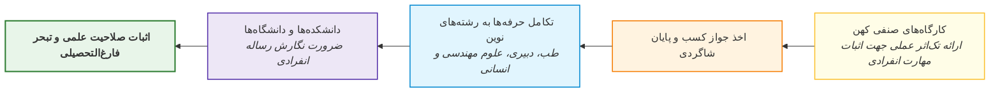
```mermaid
flowchart RL
    A["کارگاه‌های صنفی کهن<br><i>ارائه تک‌اثر عملی جهت اثبات مهارت انفرادی</i>"] --> B["اخذ جواز کسب و پایان شاگردی"]
    B --> C["تکامل حرفه‌ها به رشته‌های نوین<br><i>طب، دبیری، علوم مهندسی و انسانی</i>"]
    C --> D["دانشکده‌ها و دانشگاه‌ها<br><i>ضرورت نگارش رساله انفرادی</i>"]
    D --> E["<b>اثبات صلاحیت علمی و تبحر فارغ‌التحصیلی</b>"]

    style A fill:#fffde7,stroke:#fbc02d,stroke-width:1.5px;
    style B fill:#fff3e0,stroke:#f57c00,stroke-width:1.5px;
    style C fill:#e1f5fe,stroke:#0288d1,stroke-width:1.5px;
    style D fill:#ede7f6,stroke:#512da8,stroke-width:1.5px;
    style E fill:#e8f5e9,stroke:#2e7d32,stroke-width:2px;
```

> [!info] تعریف رساله یا پژوهشنامه
> رساله اثری مدون و تفصیلی است که دانشجو در واپسین مرحله فراغت از تحصیل برای اثبات مهارت خویش در پژوهش مستقل و کشف حقیقت بر پایه متدولوژی علمی خلق می‌کند.

### فرایند چهارگانه متدولوژی علمی در تدوین رساله
1. **طرح مسئله و فرضیه‌سازی:** صورت‌بندی پرسشی بنیادین پیرامون معضلی حل‌نشده.
2. **گردآوری نظام‌مند اسناد:** ارزیابی مآخذ اصیل و تجارب مقدماتی.
3. **کشف پیوندهای علی و معلولی:** تحلیل چگونگی تأثیر متغیرها بر یکدیگر.
4. **استنتاج منطقی و تعمیم پاسخ:** سنتز داده‌ها و ارائه پاسخی مدلل به پرسش بنیادین تحقیق.

---

## 4. الگوریتم چهارمرحله‌ای چرخه تحقیق در رساله

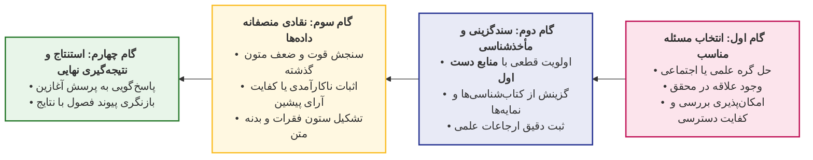
```mermaid
flowchart RL
    Step1["<b>گام اول: انتخاب مسئله مناسب</b><br>• حل گره علمی یا اجتماعی<br>• وجود علاقه در محقق<br>• امکان‌پذیری بررسی و کفایت دسترسی"] 
    --> Step2["<b>گام دوم: سندگزینی و مأخذشناسی</b><br>• اولویت قطعی با <b>منابع دست اول</b><br>• گزینش از کتاب‌شناسی‌ها و نمایه‌ها<br>• ثبت دقیق ارجاعات علمی"]
    --> Step3["<b>گام سوم: نقادی منصفانه داده‌ها</b><br>• سنجش قوت و ضعف متون گذشته<br>• اثبات ناکارآمدی یا کفایت آرای پیشین<br>• تشکیل ستون فقرات و بدنه متن"]
    --> Step4["<b>گام چهارم: استنتاج و نتیجه‌گیری نهایی</b><br>• پاسخ‌گویی به پرسش آغازین<br>• بازنگری پیوند فصول با نتایج"]

    style Step1 fill:#fce4ec,stroke:#c2185b,stroke-width:2px;
    style Step2 fill:#e8eaf6,stroke:#283593,stroke-width:2px;
    style Step3 fill:#fff8e1,stroke:#fbc02d,stroke-width:2px;
    style Step4 fill:#e8f5e9,stroke:#2e7d32,stroke-width:2px;
```

---

## 5. ضوابط فنی و شیوه‌نامه مدرن ارجاع‌‌دهی در متن

> [!info] گذار در شیوه استناد علمی
> * **اسلوب کهن:** درج مشخصات سند در **پاورقی (پانویس)** با استفاده از شماره‌گذاری بالانویس.
> * **اسلوب استاندارد نوین:** استناد **درون‌متنی** بلافاصله در ادامه نقل‌قول درون پرانتز.

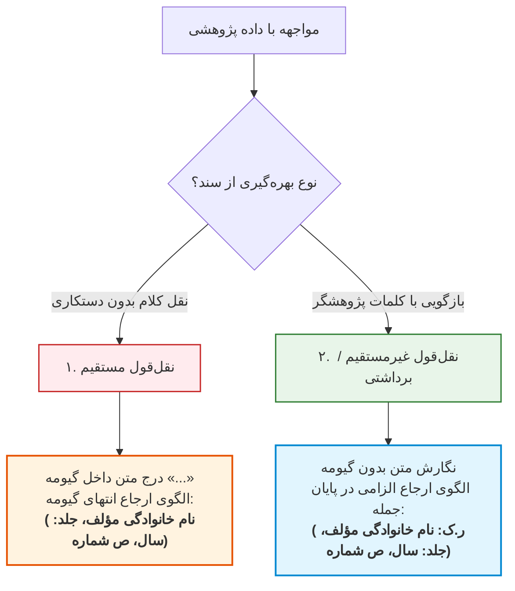
```mermaid
flowchart TD
    Input[مواجهه با داده پژوهشی] --> Type{نوع بهره‌گیری از سند؟}
    
    Type -->|نقل کلام بدون دستکاری| Direct[۱. نقل‌قول مستقیم]
    Type -->|بازگویی با کلمات پژوهشگر| Indirect[۲. نقل‌قول غیرمستقیم / برداشتی]

    Direct --> Form1["درج متن داخل گیومه «...»<br>الگوی ارجاع انتهای گیومه:<br><b>(نام خانوادگی مؤلف، جلد: سال، ص شماره)</b>"]
    Indirect --> Form2["نگارش متن بدون گیومه<br>الگوی ارجاع الزامی در پایان جمله:<br><b>(ر.ک: نام خانوادگی مؤلف، جلد: سال، ص شماره)</b>"]

    style Direct fill:#ffebee,stroke:#c62828,stroke-width:1.5px;
    style Indirect fill:#e8f5e9,stroke:#2e7d32,stroke-width:1.5px;
    style Form1 fill:#fff3e0,stroke:#e65100,stroke-width:2px;
    style Form2 fill:#e1f5fe,stroke:#0288d1,stroke-width:2px;
```

> [!tip] کارکرد نشانه‌شناختی مخفف «ر.ک:»
> عبارت **«ر.ک:»** مخفف عبارت دستوری **«رجوع کنید به»** است. آوردن آن در پرانتز نشانگر امانت‌داری علمی پژوهشگر است؛ یعنی ایده متعلق به سند یادشده بوده، اما بازنویسی کلمات توسط خود دانشجو انجام گرفته است.

### مقاصد سه‌گانه ارجاع‌دهی دانشگاهی
1. **امانت‌داری اخلاقی:** جلوگیری از ارتکاب سرقت علمی (*Plagiarism*).
2. **ارتقای ارزش کار:** اثبات توانایی پژوهشگر در مطالعه و استناد به مراجع معتبر.
3. **تسهیل دسترسی خواننده:** هدایت مخاطب علاقه‌مند به ردیابی و مطالعه سند اصلی.

---

## 6. ساختار کالبدی یازده‌گانه رساله دانشگاهی (پژوهشنامه)

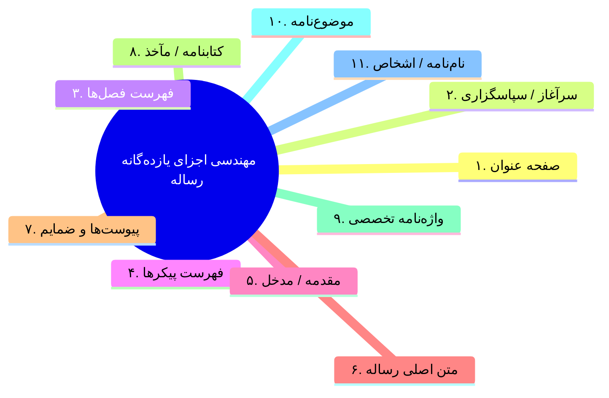
```mermaid
mindmap
  root((مهندسی اجزای یازده‌گانه رساله))
    ۱. صفحه عنوان
    ۲. سرآغاز / سپاسگزاری
    ۳. فهرست فصل‌ها
    ۴. فهرست پیکرها
    ۵. مقدمه / مدخل
    ۶. متن اصلی رساله
    ۷. پیوست‌ها و ضمایم
    ۸. کتابنامه / مآخذ
    ۹. واژه‌نامه تخصصی
    ۱۰. موضوع‌نامه
    ۱۱. نام‌نامه / اشخاص
```

### شرح تفصیلی بخش‌های یازده‌گانه

1. **صفحه عنوان:** شناسه رسمی پژوهش؛ شامل نام اثر، پدیدآورنده، استادان راهنما/مشاور، دانشگاه یا دانشکده، شهر و تاریخ ثبت. **پشت این صفحه کاملاً سفید می‌ماند (چاپ یک‌رو).**
2. **سرآغاز (پیش‌گفتار شخصی):** بخشی اختیاری جهت قدردانی از اساتید، حامیان یا خانواده و بیان انگیزه‌ها. **سقف استاندارد: حداکثر ۲ تا ۳ صفحه.**
3. **فهرست فصل‌ها:** نمای کلی فصول و تیترهای اصلی و فرعی به همراه درج شماره صفحه مطابق امکانات فهرست‌سازی نرم‌افزارهای واژه‌پرداز.
4. **فهرست پیکرها:** جدول نمایه‌ساز تمامی نقشه‌ها، تصاویر، عکس‌ها، نمودارها و جداول آماری بر اساس شماره صفحه.
5. **مقدمه (درآمد / مدخل):** تبیین فلسفه پژوهش، شیوه اجرایی، پیش‌درآمد متدولوژی و ارائه **دورنمایی کامل از محتوا** به نحوی که خواننده با خواندن آن از مطالعه کل متن بی‌نیاز شود.
6. **متن بدنه اصلی (شاکله دومرحله‌ای):**
   * **بخش اول (فصول تحلیلی و نظری):** پیشینه تحقیق، نقد پژوهش‌های پیشین، بیان سیر تاریخی، اهمیت مسئله، معرفی متدها و ملاک‌های ارزیابی.
   * **بخش دوم (فصل واپسین و استنتاج):** ارائه داده‌های تجربی، مدل‌های تحلیلی، جدول‌های آماری و گزارش جریان کار.
7. **پیوست‌ها (ضمایم):** محل انتقال اسناد طولانی، پرسشنامه‌های خام، گزارش‌های جانبی، نقشه‌ها و جدول‌های تفصیلی جهت حفظ روانی متن اصلی.
8. **کتابنامه (فهرست منابع و مآخذ):** شناسنامه تفکیک‌شده آثار استنادشده.
9. **واژه‌نامه:** اصطلاحات تخصصی متن به ترتیب الفبایی همراه با صفحات وقوع.
10. **موضوع‌نامه:** فهرست مفاهیم و محورهای موضوعی رساله به ترتیب الفبایی به همراه شماره صفحات.
11. **نام‌نامه (فهرست اعلام):** اسامی شخصیت‌ها، نویسندگان و اماکن جغرافیایی مهم رساله.

> [!important] قاعده اختیاری بودن بخش‌های پایانی
> وجود بخش‌های *«فهرست پیکرها، واژه‌نامه، موضوع‌نامه و نام‌نامه»* **اجباری مطلق نیست**؛ در صورت عدم وجود تصویر، نقشه یا واژگان دشوار در پژوهش، این بخش‌ها حذف می‌گردند.

---

## 7. الزامات چهارگانه فصل نتیجه‌گیری (پایان متن)

فصل واپسین رساله باید حاوی چهار محور بنیادین باشد:

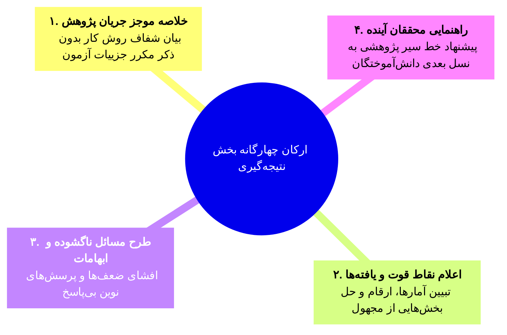
```mermaid
mindmap
  root((ارکان چهارگانه بخش نتیجه‌گیری))
    ["<b>۱. خلاصه موجز جریان پژوهش</b><br/>بیان شفاف روش کار بدون ذکر مکرر جزییات آزمون"]
    ["<b>۲. اعلام نقاط قوت و یافته‌ها</b><br/>تبیین آمارها، ارقام و حل بخش‌هایی از مجهول"]
    ["<b>۳. طرح مسائل ناگشوده و ابهامات</b><br/>افشای ضعف‌ها و پرسش‌های نوین بی‌پاسخ"]
    ["<b>۴. راهنمایی محققان آینده</b><br/>پیشنهاد خط سیر پژوهشی به نسل بعدی دانش‌آموختگان"]
```

---

## 8. شیوه‌نامه تدوین فنی کتابنامه (کتاب‌شناسی و مقاله‌شناسی)

تنظیم کتابنامه مستلزم رعایت دو ضابطه عمومی است:
* **شماره‌گذاری خطی و مرتب.**
* **چینش الفبایی بر اساس نام خانوادگی پدیدآورندگان.**

```mermaid
flowchart TD
    Source[تدوین شناسنامه در کتابنامه] --> Type{نوع سند؟}
    
    Type -->|کتاب چاپی| Book["نام خانوادگی، نام مؤلف. (سال انتشار). <b>نام کتاب</b>. نام مترجم یا مصحح. شماره جلد. نوبت چاپ. محل نشر: نام ناشر."]
    Type -->|مقاله نشریه| Article["نام خانوادگی، نام مؤلف. (سال انتشار). «عنوان مقاله». <i>نام مجله</i>، دوره یا جلد، شماره مجله: شماره صفحات مقاله."]

    style Book fill:#fff8e1,stroke:#f57f17,stroke-width:1.5px;
    style Article fill:#e1f5fe,stroke:#0288d1,stroke-width:1.5px;
```

### ساختار ارجاع به کتب در برابر مقالات

| مؤلفه ارجاع | ساختار کتاب‌شناسی کتب چاپی | ساختار نمایه‌سازی مقالات در مجلات |
| :--- | :--- | :--- |
| **۱. نام پدیدآورنده** | نام خانوادگی، نام مؤلف | نام خانوادگی، نام نویسنده/نویسندگان |
| **۲. زمان نشر** | سال انتشار درون پرانتز `(سال)` | سال انتشار درون پرانتز `(سال)` |
| **۳. نام اثر** | **عنوان کتاب (بصورت پررنگ یا Bold)** | «عنوان کامل مقاله درون گیومه» |
| **۴. دست‌اندرکاران ثانویه** | نام مترجم یا مصحح کتاب | فاقد مترجم مستقل (معمولاً ذکر نام مجله) |
| **۵. رده انتشار مجلد** | شماره جلد و شماره نوبت چاپ اثر | شماره دوره/مجلد و شماره مسلسل نشریه |
| **۶. موقعیت جغرافیایی و نهاد**| محل نشر (شهر): نام ناشر | فاقد ذکر شهر نشر (شناسایی با عنوان مجله) |
| **۷. محدوده صفحات** | معمولاً اختیاری یا ارجاع به کل اثر | **قید بازه دقیق صفحات انتشار مقاله در مجله الزامی است** |

---

## 9. تکنیک ساخت نمایه‌ها (واژه‌نامه، موضوع‌نامه و نام‌نامه)

در پایان رساله، برگه‌های نمایه برای صرفه‌جویی در وقت پژوهشگران به سبک الفبایی تنظیم می‌گردد:

```mermaid
flowchart RL
    Term["مدخل هویتی<br><i>واژه تخصصی، نام خاص، موضوع</i>"] 
    --- Sign["علامت درنگ‌نما<br><b>ویرگول یا خط تیره</b>"] 
    --- Pages["بازه صفحات حضور در متن<br><i>مثال: ۵، ۱۰، ۲۰، ۱۰۰</i>"]

    style Term fill:#fce4ec,stroke:#880e4f,stroke-width:1.5px;
    style Sign fill:#fffde7,stroke:#f57f17,stroke-width:1px;
    style Pages fill:#e8f5e9,stroke:#1b5e20,stroke-width:1.5px;
```

> [!tip] کاربرد علامت درنگ‌نما
> در برابر هر مدخل (مانند نام «رستم» یا اصطلاح «درون‌کوچی»)، شماره صفحاتی که این لفظ در آن به کار رفته با علامت **درنگ‌نما (ویرگول)** قید می‌شود تا مخاطب بدون اتلاف وقت مستقیماً به صفحه هدف رجوع کند.

# جلسه چهارم: اصول ویراستاری علمی و قواعد نشانه‌گذاری (سجاوندی)

## 1. ریشه‌شناسی و مفهوم‌شناسی ویرایش

> [!abstract] تعریف لغوی و ریشه‌شناختی واژه «ویرایش»
> * **ریشه تاریخی:** واژه *«ویراستن»* برگرفته از **فارسی میانه غربی (پهلوی)** و معادل دقیق مصدر انگلیسی **to edit** است.
> * **معانی لغوی مصدر ویراستن:** *پرورش دادن*، *آماده کردن* و *آراستن*.
> * **معانی اصطلاحی اسم‌مصدر ویرایش:** *آماده‌سازی*، *ترتیب*، *آراستن*، *پروردن* و *اصلاح متن*.

> [!info] جایگاه ساختاری ویرایش در فرایند تولید اثر
> ویرایش و نشانه‌گذاری، **واپسین و نهایی‌ترین مرحله** در تدوین، شکل‌گیری و انتشار مقاله‌ها، کتاب‌ها، رساله‌ها و پایان‌نامه‌ها است.

---

## 2. سنخ‌شناسی سطوح سه‌گانه ویرایش علمی

فرایند ویرایش در سه افق متمایز انجام می‌گیرد. به دلیل **هم‌پوشانی ذاتی** میان این لایه‌ها، تعیین مرز قاطع و نفوذناپذیر بین آن‌ها تقریباً ناممکن است:

```mermaid
flowchart TD
    Edit["ارکان سطوح سه‌گانه ویرایش علمی"]
    
    Edit --> E1["۱. ویرایش محتوایی<br><i>(علمی و تخصصی)</i>"]
    Edit --> E2["۲. ویرایش زبانی<br><i>(ساختاری و بیانی)</i>"]
    Edit --> E3["۳. ویرایش فنی<br><i>(شکلی و ظاهری)</i>"]

    E1 --- D1["• لزوم سواد تخصصی در رشته متن<br>• حذف خطاها و ابهامات معنایی<br>• بسط نکات مجمل و بررسی ارجاعات<br>• سنجش اعتبار و صدق علمی کل اثر"]
    E2 --- D2["• تطبیق متن با زبان معیار<br>• اصلاح مطابقت نهاد و فعل<br>• ابهام‌زدایی و رفع تضادهای سبکی<br>• حفظ هماهنگی و یکدستی زبانی"]
    E3 --- D3["• بی‌نیاز از تخصص علمی در موضوع<br>• اجرای نشانه‌گذاری سجاوندی<br>• درج معادل‌های لاتین در پرانتز متن<br>• کنترل ارجاعات، آمارها و فرمت"]

    style Edit fill:#ede7f6,stroke:#4527a0,stroke-width:2px;
    style E1 fill:#ffebee,stroke:#c62828,stroke-width:1.5px;
    style E2 fill:#e8f5e9,stroke:#2e7d32,stroke-width:1.5px;
    style E3 fill:#e1f5fe,stroke:#0288d1,stroke-width:1.5px;
```

### جدول مقایسه تطبیقی سطوح سه‌گانه ویرایش

| مؤلفه ارزیابی | ویرایش محتوایی (تخصصی) | ویرایش زبانی (ساختاری) | ویرایش فنی (شکلی) |
| :--- | :--- | :--- | :--- |
| **سطح مداخله** | مغز پیام، فکت‌های علمی و صحّت داده‌ها | اسکلت دستوری، روابط کلمات و لحن | فرم ظاهری، شیوه‌نامه، فونت و نشانه‌ها |
| **پیش‌شرط ویراستار** | **تسلط و سواد مستقیم در حوزه متن** (پزشکی، ادبی، سیاسی و...) | احاطه عمیق بر دستور زبان و *زبان معیار* | شناخت دقیق آیین‌نامه‌ها و علائم فنی (**بی‌نیاز از تخصص متن**) |
| **محورهای کلیدی اقدام** | ۱. حذف خطاهای محتوایی ۲. رفع ابهامات مفهومی ۳. بسط نکات کوتاه و مجمل ۴. راستی‌آزمایی مستندات و نقل‌ها | ۱. تصحیح ناهماهنگی فاعل و فعل ۲. رفع تشتت و چندگانگی لحن ۳. ابهام‌زدایی دستوری ۴. صیانت از روانی کلام معیار | ۱. اعمال سجاوندی استاندارد ۲. یکدست‌سازی رسم‌الخط و ضبط‌ها ۳. چینش جداول، نمودارها و تصاویر ۴. تطبیق ساختار با شیوه‌نامه مرکز پژوهشی |
| **مبنا و سند تغییرات** | نظریات تثبیت‌شده و اسناد معتبر علمی | اصول مسلّم دستور زبان و نوشتار معیار | آیین‌نامه‌های مدون دانشگاهی و ناشران |

> [!important] اصل زرین و سند مشروعیت در ویرایش
> **هیچ تغییری بدون استدلال مجاز نیست.** ویراستار موظف است برای تک‌تک تصحیحات و دگرگونی‌های اعمال‌شده، **دلیلی منطقی، مستند و متکی بر قواعد معتبر** داشته باشد. اسناد رسمی ویراستار عبارتند از:
> 1. *گفتار و نوشتار معیار*.
> 2. *اصول و قواعد مسلم دستور زبان فارسی*.
> 3. *شیوه‌نامه‌ها و آیین‌نامه‌های استاندارد مصوب*.

> [!warning] نکته تحولی در درج برابرهای غیرفارسی
> * **شیوه کهن:** ذکر معادل لاتین واژگان تخصصی در **پاورقی (پانویس)**.
> * **شیوه استاندارد نوین:** قرار دادن معادل خارجی بلافاصله **درون پرانتز در متن روبروی همان کلمه**.

---

## 3. پیشینه تاریخی و منطق ورود علائم سجاوندی

```mermaid
flowchart RL
    A["<b>نگارش کهن فارسی</b><br>• فاقد هرگونه نشانه و اعراب‌گذاری<br>• دشواری تشخیص سوال، نقل یا پایان کلام<br>• لزوم اتکای تام به قرائن ذهنی خواننده"] 
    --> B["<b>عصر مشروطه</b><br>• برقراری پیوند گسترده با تمدن غرب<br>• ورود صنعت چاپ و مطبوعات مدرن"]
    --> C["<b>ورود علائم سجاوندی به فارسی</b><br>• تسهیل خوانش و ادراک لحن متن<br>• پیشگیری قطعی از کژتابی و خوانش غلط"]

    style A fill:#fffde7,stroke:#fbc02d,stroke-width:1.5px;
    style B fill:#ffe0b2,stroke:#f57c00,stroke-width:1.5px;
    style C fill:#e8f5e9,stroke:#2e7d32,stroke-width:2px;
```

> [!warning] تله تستی پیرامون مرز اعتدال در نشانه‌گذاری
> علائم سجاوندی بومی خط فارسی نیستند و از نگارش غربی وام گرفته شده‌اند؛ بنابراین **افراط در کاربرد علائم سجاوندی چهره متن را زشت و تمرکز خواننده را متلاشی می‌سازد.** کاربرد باید حداقلی، دقیق و فقط در موضع نیاز ساختاری باشد.

---

## 4. نظام جامع نشانه‌های یازده‌گانه سجاوندی

### ۱. ویرگول یا درنگ‌نما ( ، )
نشانه **مکث و توقف کوتاه** در محور زنجیره کلام است. مواضع هشت‌گانه کاربرد:
1. **بین جملات غیرمستقل مکمل:** *«آن را که حساب پاک است، از محاسبه چه باک است؟»*
2. **پیرامون توضیح، عطف بیان و بدل:** *«فردوسی، حماسه‌سرای بزرگ ایران، در سال ۳۲۹ هجری به دنیا آمد.»* | *«احمد، برادر مسعود، دیروز اینجا بود.»*
3. **تفکیک قیود حالت:** *«جلال آل‌احمد، بی‌پروا و باشجاعت، پرده از روی حقایق برمی‌داشت.»*
4. **بین کلمات هم‌پایه با اِسناد واحد:** *«کتابخانه او شامل آثار ادبی، داستانی، درسی و دینی است.»*
5. **پیشگیری از غلط‌خوانی و کسره اضافه ناصحیح:** *«هر که به طاعت از دیگران کم است و به نعمت بیش، به صورت، توانگر است و به معنی، درویش.»* (مانع اتصال اضافی صورت به توانگر و معنی به درویش).
6. **تفکیک بخش‌های نشانی:** *«تهران، خیابان ستارخان، پلاک ۱۵، طبقه اول.»*
7. **جداسازی ارکان مأخذشناسی:** *«سعدی، بوستان، تصحیح و توضیح دکتر غلامحسین یوسفی.»*
8. **آغاز و انجام جملات دعایی و معترضه:** *«حسنک و روزگارش و گفتارش، رحمت‌الله علیه، این بود...»* | *«دی، که پایش شکسته باد، برفت؛ گل، که عمرش دراز باد، آمد.»*

---

### ۲. نقطه‌ویرگول یا درنگ بلند ( ؛ )
نشانه **مکثی طولانی‌تر از ویرگول و کوتاه‌تر از نقطه**. مواضع کاربرد:
1. **تفکیک جملات به ظاهر مستقل ولی مرتبط در معنی:** *«فریب دشمن مخور و غرور مداح مخر؛ که این دام زرق نهاده است و آن دامن طمع گشاده.»*
2. **پیش از کلمات تفسیری و علّی:** مقدم بر واژگانی چون *«زیرا، چراکه، اما، یعنی، به عبارت دیگر، برای مثال»*.
   * *الگوی استاندارد:* `... ؛ زیرا ...` یا `... ؛ برای مثال: ...`

---

### ۳. نقطه یا ایست کامل ( . )
نشانه **توقف کامل و پایان پیام**. مواضع کاربرد:
1. **پایان جملات خبری کامل و برخی جملات انشایی.**
2. **پس از حروف و نمادهای اختصاری:** *«ق.م.»* (قبل از میلاد)، *«ه‍.ق.»* (هجری قمری)، *«ع. اقبال آشتیانی»*، *«P.T.T.»* (پست، تلگراف و تلفن).
3. **پس از شماره ردیف و حروف ابجد:** در شماره‌گذاری گزینه‌ها (`1.` یا `الف.`).

> [!important] قاعده ترکیب جملات با حرف ربط «و»
> اگر دو جمله مستقل با **واو عطف** به یکدیگر متصل شوند، نباید در پایان جمله اول نقطه گذاشت:
> * *غلط:* دست و پایم را سخت گم کرده بودم. و خود را در دریای یأس غوطه‌ور می‌دیدم.
> * *صحیح:* دست و پایم را سخت گم کرده بودم و خود را در دریایی از یأس و نومیدی غوطه‌ور می‌دیدم.

---

### ۴. دو‌نقطه ( : )
نشانه **آغاز تفصیل، تفسیر یا نقل کلام**. مواضع کاربرد:
1. **پیش از نقل‌قول مستقیم:** *رسول اکرم (ص) فرمود: «مسلمان کسی است که...»*
2. **پیش از تفصیل مطلبی که قبلاً به اجمال آمده:** *لقمان را گفتند ادب از که آموختی؟ گفت از بی‌ادبان: هرچه از ایشان در نظرم ناپسند آمد از فعل آن پرهیز کردم.*
3. **پس از کلمه هنگام بیان معنی لغوی:** *صیف: تابستان.*
4. **پس از کلمات تفسیرکننده و تمثیلی:** بعد از واژه‌هایی مانند *«یعنی:»* یا *«برای مثال:»*.
5. **پس از شماره‌های ردیف یا حروف ابجد** (به عنوان جایگزین نقطه یا خط تیره).

> [!warning] ممنوعیت درج دونقطه پس از ترکیبات اضافی
> هرگز نباید پس از عباراتی نظیر **«از قبیل»**، **«نظیر»** یا **«مانند»** علامت دونقطه یا ویرگول گذاشت، زیرا این کلمات مضاف بوده و باید با **کسره اضافه** مستقیماً به واژه بعد متصل گردند:
> * *غلط:* عواملی نظیر: فقر و بیکاری...
> * *صحیح:* عواملی نظیر فقر و بیکاری...

---

### ۵. گیومه ( « » )
نشانه **تمایز تام کلام از بافت متن اصلی**. مواضع کاربرد:
1. **درج عین سخن در نقل‌قول مستقیم:** *سعدی می‌گوید: «هر که سخن نسنجد، از جوابش برنجد.»*
2. **برجسته‌سازی اصطلاحات ویژه یا واژه‌های کلیدی:** *«امروز سخن در این است که باید "شعر برای شعر" باشد یا "شعر برای اجتماع"؟»*
3. **ذکر عناوین مقالات، رساله‌ها، اشعار، کنفرانس‌ها و فصول کتاب:**
   * *مثال:* در «سومین کنگره تحقیقات ایرانی»، مقاله «شوخ‌طبعی حافظ» از دکتر یوسفی خوانده شد.

> [!tip] حفظ استقلال نشانه‌گذاری در نقل‌قول
> متن داخل گیومه باید **عیناً همراه با تمام علائم سجاوندی نگارنده اصلی** بدون کوچک‌ترین تصرف منتقل شود.

---

### ۶. علامت سؤال ( ؟ )
نشانه **پرسشگری مستقیم یا ابهام‌آفرینی عمدی**. مواضع کاربرد:
1. **پایان جملات پرسشی مستقیم:** *«به چه می‌اندیشی؟»*
2. **پایان جملات جایگزین پرسش مستقیم:** *«کدام را می‌پسندی؟ سبز یا آبی؟»* | *«بروم یا نروم؟»*
3. **نشانه‌گذاری شک، تردید و عدم قطعیت (داخل پرانتز):**
   * *«وفات سنایی در سال ۵۲۵ هجری (؟) دانسته شده است.»*
   * *«طبق آمار غیررسمی، جمعیت تهران از ۱۰ میلیون نفر (؟) فراتر رفته است.»*

> [!warning] تله تستی پیرامون جملات پرسشی غیرمستقیم
> جملات پرسش غیرمستقیم **حاوی خبر** هستند و هرگز علامت سؤال نمی‌گیرند؛ انتهای آن‌ها **نقطه** درج می‌شود:
> * *غلط:* استاد از دانشجو پرسید که آیا کتاب را خوانده است؟
> * *صحیح:* استاد از دانشجو پرسید که آیا کتاب را خوانده است.

---

### ۷. علامت تعجب یا شگفتی ( ! )
برخلاف نامش، منحصر به تعجب نیست؛ نشانه **فوران عواطف، تحکم و ندا** است:
* **تعجب و شگفتی:** *چه عجب، بالاخره آمد!*
* **تأسف و اندوه:** *آه! روزگار جوانی تباه شد.*
* **تحقیر و ریشخند:** *عجب آدم ریاکاری!*
* **تنبیه و هشدار:** *آهسته! مراقب باش!*
* **امر، نهی و دعا:** *جایزه هم می‌خواهد!*

---

### ۸. خط تیره یا خط فاصله ( - )
نشانه **انقطاع، اتصال و جایگزینی لفظی**. مواضع کاربرد:
1. **جداسازی جملات معترضه و عطف بیان:** *«امام علی - علیه‌السلام - مظهر عدالت است.»*
2. **مکالمه‌نگاری در نمایشنامه و داستان بدون ذکر نام:**
   * *- الو؟*
   * *- بله، بفرمایید.*
3. **جانشین حروف اضافه «تا» و «به»:** *«سال تحصیلی ۱۴۰۰-۱۳۹۹»* | *«مهر-آذر»* | *«قطار تهران-مشهد»*.
4. **نمایش لکنت، گره‌‌خوردگی زبان و تفکیک هجاها:** *«مـ-مـ-من آمدم.»*
5. **پیوند واژه‌های مرکب و ترکیبی:** *«سیاسی-اجتماعی»* | *«توصیفی-تحلیلی»*.
6. **جداسازی پس از تیترهای اخطاری:** *«تبصره-»*، *«تذکر-»*، *«یادآوری-»*.
7. **پس از شماره‌های ردیف:** *«۱- اسم»*، *«۲- فعل»*، *«۳- حرف»*.
8. **جدایش کلمه در پایان سطر هنگام کمبود فضا:** انتقال جزء دوم واژه مرکب به سطر بعدی (امروزه در تایپ استاندارد رایانه‌ای منسوخ و ناپسند است).

---

### ۹. سه‌نقطه ( ... )
نشانه **افتادگی، حذف یا استمرار ناگفته‌ها**. مواضع کاربرد:
* می‌تواند در **آغاز، میانه یا پایان کلام** ظاهر شود.
* نشانگر حذف بخش‌هایی از متن جهت اجتناب از اطناب: *«لوازم‌التحریر شامل قلم، پاک‌کن، کاغذ و... است.»*

---

### ۱۰. ستاره ( * )
نشانه **عطف توجه مخاطب به حواشی**. مواضع کاربرد:
1. **ارجاع به زیرنویس و پانویس:** در شرایطی که اعداد درون متن برای ردیف‌بندی استفاده شده باشند و نتوان از ارقام بالانویس برای پانویس بهره جست.
2. **ایجاد فاصله میان دو مصراع شعر** در متون مقالات علمی.
3. **جلب توجه خواننده در سرآغاز کلمات هشداردهنده:** مانند `* تذکر:` یا `* یادآوری:`.

---

### ۱۱. پرانتز، دولال یا کمانک ( )
نشانه **توضیح تکمیلی، معادل‌سازی و استناددهی**. مواضع کاربرد:
1. **به معنی «یا» و «یعنی» جهت روشنگری:**
   * *«مجمع‌النوادر (چهارمقاله) اثر نظامی عروضی است.»* (معادلِ یا).
   * *«شاهکار نظامی گنجوی (خسرو و شیرین) را باید خواند.»* (معادلِ یعنی).
2. **ارائه اطلاعات شناسنامه‌ای و جانبی:** *«ابوالفضل بیهقی (۳۸۵-۴۷۰ ه‍.ق.) تاریخ بیهقی را نگاشت.»*
3. **ذکر مآخذ و ارجاع در پایان شواهد متنی:**
   * *الگوی مستقیم:* `«متن نقل‌قول» (نام خانوادگی، سال: شماره صفحه)`
   * *مثال:* «...» (تاریخ بیهقی، ص ۱۹۷)

---

## 5. واژه‌نامه فنی کوتاه‌نوشت‌های استنادی در متون علمی

برای حفظ زیبایی ظاهر اثر و جلوگیری از اتلاف فضای نگارش، کوتاه‌نوشت‌های قراردادی زیر به کار می‌روند:

| کوتاه‌نوشت | معادل کامل واژه | جایگاه کاربردی و کارکرد پژوهشی |
| :--- | :--- | :--- |
| **ج** | جلد | ارجاع به شماره مجلد کتب چندجلدی در کتابنامه و متن |
| **چ** | چاپ | تعیین نوبت انتشار اثر در مشخصات کتاب‌شناسی |
| **(ره)** | رحمت‌الله علیه | جمله معترضه دعایی در رثای بزرگان درگذشته |
| **صص** | صفحات | تعیین بازه صفحات آغاز تا پایان یک مقاله در نشریه |
| **بی‌‌تا** | بی‌تاریخ | مآخذ فاقد سال چاپ مشخص و نسخه‌های قدیمی بدون شناسنامه زمانی |
| **ر.ک.** | رجوع کنید به | **شاخص قطعی ارجاع برداشتی و نقل‌قول غیرمستقیم** |

> [!important] تله تستی درباره کارکرد ساختاری «ر.ک.»
> درج اختصار **«ر.ک.»** در آغاز پرانتز ارجاعی، اثبات می‌کند که **جمله متعلق به کلام خود نویسنده است اما بن‌مایه و مفهوم آن از مأخذ یادشده اقتباس گردیده** (نقل‌قول غیرمستقیم):
> * *الگو:* `(ر.ک: بیهقی، ۱۳۵۰: ۱۰)`

# جلسه پنجم: تاریخ ادبیات، کالبدشناسی حماسه و شاهنامه، بزرگان شعر (حافظ و مولانا) و صنایع ادبی

## 1. تاریخ ادبیات: حکیم ابوالقاسم فردوسی و شاهنامه

> [!abstract] القاب و جایگاه تاریخی فردوسی
> فردوسی ملقب به **حکیم سخن** و **حکیم توس**، برخاسته از طبقه **دهقانان** (زمین‌داران و حافظان اصیل فرهنگ کهن ایرانی). رسالت اصلی وی **احیای زبان فارسی در حال فراموشی** و **پیوند فرهنگ ایران پیش از اسلام با فرهنگ اسلامی** بود. او بر آیین‌های ایران باستان اشراف کامل داشت و به عنوان یک فرد معتقد به مبانی دینی، این عناصر را متناسب همنشین ساخت.

### تبارشناسی و دیرینه‌شناسی تدوین شاهنامه

```mermaid
flowchart RL
    A["دستور <b>ابومنصور محمد بن عبدالرزاق</b> به وزیرش <b>ابومنصور معمری</b>"] --> B["گردآوری راویان برجسته از سراسر کشور"]
    B --> C["تدوین و ترجمه به نثر: <b>شاهنامه ابومنصوری</b> (مأخذ بنیادین)"]
    C --> D["آغاز به نظم درآوردن توسط <b>دقیقی توسی</b><br><i>(ناکام ماندن به علت فوت ناگهانی)</i>"]
    D --> E["تداوم و اتمام کار سترگ توسط <b>حکیم ابوالقاسم فردوسی</b><br><i>(دست‌کم ۳۰ سال رنج مداوم)</i>"]

    style A fill:#ede7f6,stroke:#4527a0,stroke-width:2px;
    style C fill:#fff3e0,stroke:#e65100,stroke-width:1.5px;
    style D fill:#ffebee,stroke:#c62828,stroke-width:1.5px;
    style E fill:#e8f5e9,stroke:#2e7d32,stroke-width:2px;
```

> [!tip] وزن عروضی و علت نظمی شاهنامه
> * **وزن عروضی شاهنامه:** بحر *متقارب مثمن محذوف* یا *مقصور* بر وزن: **فعولن فعولن فعولن فعل** (یا *فعول*).
> * **علت گزینش نظم به جای نثر:** در دوران فردوسی، ماندگاری و تثبیت در اذهان توده‌ها از طریق **آهنگ، موسیقی و شعر** میسر بود تا متن سینه به سینه حفظ شود و در بلایای تاریخی نابود نگردد.

### ساختار درونی شاهنامه و ادوار سه‌گانه

متن اثر با یک مقدمه آغاز می‌شود و از **پادشاهی کیومرث تا هجوم اعراب به ایران** با سرگذشت حدوداً **۵۰ پادشاه** ادامه می‌یابد. هرچه به آغاز بازگردیم، متن **داستانی‌تر** و مدارک تاریخی **کاهش** می‌یابد.

```mermaid
flowchart RL
    E1["<b>۱. دوره اسطوره‌ای</b><br>• از کیومرث تا فریدون<br>• کوتاه‌ترین بخش<br>• فقدان مدارک تاریخی"] 
    --> E2["<b>۲. دوره حماسی</b><br>• از پادشاهی فریدون تا بهمن<br>• فریدون: مرز برزخی اسطوره و حماسه<br>• گسترده‌ترین، زیباترین و مهم‌ترین بخش"] 
    --> E3["<b>۳. دوره تاریخی</b><br>• از بهمن تا یزدگرد سوم و حمله اعراب<br>• دارای انطباق‌های عینی تاریخی"]

    style E1 fill:#fce4ec,stroke:#c2185b,stroke-width:1.5px;
    style E2 fill:#e8f5e9,stroke:#2e7d32,stroke-width:2px;
    style E3 fill:#e3f2fd,stroke:#1565c0,stroke-width:1.5px;
```

> [!important] تله تستی پیرامون ساختار و علل کوتاهی بخش اسطوره‌ای
> * **نقش ساختاری ادوار:** بخش اسطوره‌ای به منزله **مقدمه** و بخش تاریخی به منزله **پایان‌بندی (ذیل)** بر **بخش حماسی** (هسته اصلی اثر) است.
> * **علل سه‌گانه کوتاهی بخش اسطوره‌ای:**
>   1. **کمی و فقر منابع مکتوب** به دلیل سوزانده شدن اسناد کهن در فتوحات.
>   2. **فقدان جذابیت و جنبه‌های حماسی محض** (به استثنای *داستان جمشید*).
>   3. **تضاد با باورهای مسلمانان عصر فردوسی:** پذیرش عریان آیین باستان برای توده‌ها ممکن نبود؛ تدبیر فردوسی **ارائه در قالب داستان و روایت هنری** بود تا اثر سوزانده نشود و ماندگار بماند.

---

### کالبدشناسی مفهوم اسطوره در برابر واقعیت

```mermaid
mindmap
  root((ویژگی‌های ذاتی اسطوره))
    ازلی و بی‌زمان بودن
      عدم انطباق با زمان تقویمی مشخص
      بی‌مکانی و نبود مختصات دقیق جغرافیایی
    قداست و ریشه در خدایان
      متعلق به ایزدان و نیروهای ماورایی
      امری قدسی برای اهل آیین زرتشتی؛ داستان صرف برای ما
    تکرار آیینی
      تکرار اعمال در مقاطع خاص جهت جلب رضایت خدایان
      تبدیل به مناسک: جشن‌ها قربانی‌ها نوروز سیزده‌بدر ازدواج
    پاسخ به رخدادهای نخستین
      پاسخ تخیلی به منشأ پدیده‌ها مانند کشف آتش
      باقی‌ماندن شکل مناسک با وجود فراموشی فلسفه اولیه
```

> [!abstract] نسبت اسطوره با دین و تاریخ
> **اسطوره برای مؤمنان و پدیدآورندگانش «دین و واقعیت تاریخی محض» است و برای نامعتقدان و آیندگان «اسطوره و داستان».** اسطوره‌ها امور ثابت و مدونی نیستند و تا ثبت نشوند دائماً در حال دگرگونی‌اند.

---

## 2. کالبدشکافی حماسه (محتوا، قالب و ساختار)

> [!abstract] تعریف لغوی و اصطلاحی حماسه
> * **در لغت:** واژه‌ای عربی به معنی **دلاوری**، **پهلوانی** و **جنگاوری**.
> * **موضوع بنیادین:** نبرد خیر و شر، مبارزه با قهر طبیعت، درگیری با بیگانگان، موجودات فوق‌طبیعی (دیوان و خدایان) و مهاجمان در یک عصر تاریخی.

### ارکان سه‌گانه ساختار ظاهری حماسه

```mermaid
flowchart TD
    Epic["ارکان ساختار صوری حماسه"]
    Epic --> P1["۱. لزوم منظوم بودن (شعر)"]
    Epic --> P2["۲. ساختار بلند و مستمر"]
    Epic --> P3["۳. خصلت روایی و داستانی"]

    P1 --- D1["متن منثور حماسه نیست، فقط «ویژگی حماسی» دارد (مثل شاهنامه ابومنصوری)"]
    P2 --- D2["ناتوانی قصیده به دلیل محدودیت قافیه ⇦ کاربرد انحصاری قالب مثنوی"]
    P3 --- D3["بیان داستان نه توصیف ایستا؛ دارای زاویه دید راوی و پیرنگ داستانی"]

    style Epic fill:#ede7f6,stroke:#4527a0,stroke-width:2px;
    style P1 fill:#ffebee,stroke:#c62828,stroke-width:1.5px;
    style P2 fill:#fff3e0,stroke:#e65100,stroke-width:1.5px;
    style P3 fill:#e8f5e9,stroke:#2e7d32,stroke-width:1.5px;
```

### مقایسه تطبیقی قالب‌های کلاسیک در سرایش حماسه

| شاخص ارزیابی | قالب قصیده (سنت ادبیات عرب) | قالب مثنوی (ابتکار زبان فارسی) |
| :--- | :--- | :--- |
| **تنوع قافیه** | محدود به یک قافیه سراسری در طول کل ابیات | استقلال قافیه در هر بیت به طور مجزا |
| **گنجایش روایی** | محدود؛ عدم امکان سرایش داستان‌های بسیار بلند | بی‌نهایت؛ باز بودن دست شاعر برای هزاران بیت روایی |
| **حاصل تاریخی** | **فقدان منظومه‌های بلند حماسی در ادب عرب** | پیدایش شاهکارهای جهان‌شمول (*شاهنامه*، *رامایانا*، *زیگفرید*) |

> [!warning] تله تستی درباره زمان و مکان در حماسه
> حماسه همواره **ریشه در حوادث گذشته و وقایع تاریخی** (مانند کوچ اقوام آریایی، نبرد با بومیان و ستیز با سرما) دارد که قرن‌ها دهان‌به‌دهان گشته و پروبال یافته است. اما از آنجا که **زمان و مکان دقیق تاریخی در آن حل و گم شده است، هرگز نمی‌توان از حماسه به عنوان یک سند مستقیم برای ردیابی رخدادهای تقویمی تاریخی بهره جست.**

### علل ابهام در تاریخ اشکانیان و تدبیر ساسانیان
1. **انگیزه ساسانیان:** تخریب کامل اسناد و آثار دوره ۵۰۰ ساله اشکانیان جهت تثبیت مشروعیت خود و برپایی حکومت دینی.
2. **پاسخ جامعه:** مردم به دلیل شیفتگی به قهرمانان اشکانی، اخبار آنان را **وارد روایات داستانی** کردند تا از دسترس گزند حکومت ساسانی خارج گردد.

---

## 3. حافظ شیرازی؛ لسان‌الغیب و مکتب رندی

> [!abstract] هویت‌شناسی و جایگاه ادواری حافظ
> خواجه شمس‌الدین محمد ملقب به **لسان‌الغیب**، بزرگ‌ترین غزل‌سرای ادب فارسی. تحت تأثیر بیانی *خواجوی کرمانی*. اطلاعات مدون زندگانی وی عمدتاً برگرفته از مقدمه *محمد گلندام* (گردآورنده دیوان پس از مرگ شاعر) است.

### ارکان ساختار فکری و سبکی حافظ

* **رند و مکتب رندی:** بنیادین‌ترین اصطلاح جهان‌بینی حافظ. *رند* یک **نظام روشنفکری و فیلسوفانه متفکر** است که بار پیام اصیل شاعر را به دوش می‌کشد.
* **فضاهای سه‌گانه غزل:** درهم‌تنیدگی سه‌وجهی از ابعاد **عاشقانه**، **عارفانه** و **رندانه/ملامتی**.
* **ساختار خوشه‌ای (استقلال ابیات):** غزل حافظ همانند خوشه انگور است؛ هر بیت در اوج استقلال ساختاری معنایی قرار دارد اما با بافت درونی پیوند خورده است.
* **الگوپذیری از اسلوب قرآن کریم:** پیوند استقلال مضمونی آیات در عین اتصال باطنی سُوَر قرآنی.
* **پیوند سنت‌ها:** تلفیق فرهنگ کهن باستانی، آموزه‌های اسلامی، کلام، فلسفه و عرفان با وام‌داری از فردوسی، خیام، سنایی، عطار، عراقی و مولوی.

### کالبدشناسی دیوان حافظ و ممدوحان تاریخی

* **گونه‌های زبانی:** اشعار عمدتاً فارسی است؛ دارای اشعار *ملمع* (دوزبانه فارسی-عربی) و یک غزل سراسر عربی.
* **سلسله اینجو:** دوران آرامش ۲۰ ساله آل‌اینجو؛ مدح *قوام‌الدین حسن* (وزیر باکفایت) و سلطان *ابواسحاق اینجو*.
* **سلسله مظفری:** بیزاری از خشکه مقدسی *امیر مبارزالدین مظفری* (ملقب به *محتسب* در شعر وی)؛ مدح *شاه شجاع*، برادرزاده‌اش *نصرت‌الدین* و واپسین ممدوح محبوب، *شاه منصور*.
* **حاکمان برون‌مرزی:** *سلطان اویس* و *سلطان احمد ایلکانی* (ایران و عراق) و *پیر احمد پسر پشنگ* (اتابکان لرستان).

---

## 4. مولانا جلال‌الدین محمد بلخی؛ سلوک، اثرپذیری و مثنوی

> [!abstract] تبار و پیشینه هجرت
> متولد بلخ، فرزند *بهاءالدین ولد* (از خطیبان صوفیه). خروج از بلخ هم‌زمان با هجوم مغول و کدورت از سلطان محمد خوارزمشاه. سفر به مکه و شام (روایت دیدار با عطار در نیشابور)، دعوت سلطان *علاءالدین کی‌قباد سلجوقی* به قونیه و اقامت ابدی در آن شهر.

### حلقه‌های چهارگانه دگرگونی روحی مولانا

```mermaid
flowchart RL
    Step1["<b>۱. سید برهان‌الدین محقق ترمذی</b><br>• شاگرد برجسته پدرش<br>• ورود به قونیه پس از فوت بهاء ولد (۲۴ سالگی مولانا)<br>• هدایت به وادی طریقت، الزام به ریاضت و همراهی ۹ ساله"]
    --> Step2["<b>۲. شمس‌الدین محمد بن علی بن ملک‌داد تبریزی</b><br>• ایجاد دگرگونی انفجاری، ترک منبر و روی‌آوری به سماع و شعر<br>• بروز حسادت شدید مریدان و غیبت نخست (دمشق) ⇦ اعزام سلطان ولد<br>• قهر نهایی و ناپدید شدن ابدی شمس به دلیل شکوه از آزار مریدان"]
    --> Step3["<b>۳. صلاح‌الدین زرکوب</b><br>• آغاز شیدایی با ضرب پتک زرکوبی وی در بازار<br>• فاقد سواد ظاهری اما واجد باطن عمیق عرفانی<br>• مونس ۱۰ ساله مولانا تا زمان وفات ناشی از بیماری در قونیه"]
    --> Step4["<b>۴. حسام‌الدین چلبی (ابن اخی ترک)</b><br>• اصالتاً اهل ارومیه<br>• سبب و مشوق اصلی تصنیف <i>مثنوی معنوی</i><br>• همراهی ۱۰ ساله و نام‌گذاری اولیه اثر به <i>حسامی‌نامه</i>"]

    style Step1 fill:#e3f2fd,stroke:#1565c0,stroke-width:1.5px;
    style Step2 fill:#fce4ec,stroke:#c2185b,stroke-width:2px;
    style Step3 fill:#fffde7,stroke:#fbc02d,stroke-width:1.5px;
    style Step4 fill:#e8f5e9,stroke:#2e7d32,stroke-width:1.5px;
```

### ساختار و مختصات فنی و مضمونی «مثنوی معنوی»

* **شناسنامه اثر:** مشتمل بر **۶ دفتر** و نزدیک به **۲۷,۰۰۰ بیت** بر وزن شاهکار *منطق‌الطیر* و *الهی‌نامه* عطار. آغاز با بیت: *«بشنو این نی چون حکایت می‌کند / از جدایی‌ها شکایت می‌کند»* (عصاره کل اندیشه مولانا در ۱۸ تا ۲۰ بیت نخست).
* **سبک روایت داستان در داستان (مشجر):** همانند اسلوب *کلیله و دمنه* و سنت وعظ منبری، روایات نامحدود تو در تو با پیوند پایانی یک بیت به حکایت پسین جریان دارد.
* **دگرگون‌سازی فرجام داستان‌ها:** چرخش پایان قصه بر اساس اهداف تعلیماتی و عرفانی.

> [!warning] تله‌های تستی پیرامون مثنوی معنوی
> 1. **آغاز بدون نام خدا:** مثنوی تنها کتاب منظوم مذهبی است که با بسم‌‌الله در قالب شعر آغاز نگشته است. برخی بر اساس حدیث «کُلُّ أَمْرٍ ذِی بَالٍ لَمْ یُبْدَأْ فِیهِ بِبِسْمِ اللهِ فَهُوَ أَبْتَر»، ناتمام ماندن دفتر ششم را ناشی از این امر می‌دانند.
> 2. **زبان‌های چهارگانه قونیه:** اگرچه مثنوی به فارسی (زبان ادبی) است، ابیاتی به **عربی** (دین)، **ترکی** (اداره و حکومت) و **یونانی کاپادوسیه‌ای/رومی** (زبان توده بومی) در کلیات آثارش سروده شده است.

### موضوعات محوری دفاتر شش‌گانه مثنوی

|**شماره دفتر**|**دفتر اول**|**دفتر دوم**|**دفتر سوم**|**دفتر چهارم**|**دفتر پنجم**|**دفتر ششم**|
|---|---|---|---|---|---|---|
|**موضوع و مغز مباحث**|کالبدشکافی نفس و وجود انسان|حقیقت ابلیس و ابعاد گمراهی|**شاه‌بیت اندیشه مولانا:** عقل جزوی در برابر عقل کل و نگرش ناب عرفانی|علم، حکمت و دانایی حقیقی|فقر الی‌‌الله و فنا|توحید ناب و یگانگی وجود|

---

## 5. صنایع ادبی (بدیع لفظی و معنوی، بیان)

```mermaid
flowchart TD
    Arts["آرایه‌های ادبی مورد بحث"]
    Arts --> A1["جناس<br><i>(لفظی)</i>"]
    Arts --> A2["تشبیه<br><i>(بیان)</i>"]
    Arts --> A3["مراعات نظیر<br><i>(معنوی)</i>"]
    Arts --> A4["تلمیح<br><i>(معنوی)</i>"]

    style Arts fill:#ede7f6,stroke:#4527a0,stroke-width:2px;
    style A1 fill:#ffebee,stroke:#c62828,stroke-width:1.5px;
    style A2 fill:#e8f5e9,stroke:#2e7d32,stroke-width:1.5px;
    style A3 fill:#fffde7,stroke:#fbc02d,stroke-width:1.5px;
    style A4 fill:#e1f5fe,stroke:#0288d1,stroke-width:1.5px;
```

---

### ۱. گونه‌های چهارگانه صنعت جناس

> [!abstract] تعریف جناس و واژگان متجانس
> آوردن کلماتی هم‌جنس در کلام که در **ظاهر، تلفظ یا نوشتار همسان یا نزدیک**، اما در **معنا کاملاً متفاوت** باشند.

#### الف) جناس تام
همسانی مطلق در حروف، اعراب، تلفظ و کتابت؛ تفاوت صرف در معنی:
* *«برادر که در بند **خویش** است / نه برادر نه **خویش** است»*
  * *خویش اول:* خود و خویشتن (ضمیر) | *خویش دوم:* خویشاوند و فامیل.
* *«تار زلفت را جدا مشاطه‌‌گر از **شانه** کرد / دست آن مشاطه را باید جدا از **شانه** کرد»*
  * *شانه اول:* ابزار آرایش مو | *شانه دوم:* کتف و دوش بدن.

#### ب) جناس زاید
افزوده شدن دقیقاً **یک حرف** به یکی از کلمات متجانس در ابتدا، میانه یا انتها:
* در آغاز: *دام* و *مدام* (در معنای شراب) | *طاعت* و *اطاعت* | *صاف* و *مصاف* | *تاب* و *عتاب* | *کف* و *کنف* | *نرد* و *نبرد*.
* در انتها: *خام* و *خامه* | *جام* و *جامه* | *نام* و *نامه* | *آرام* و *آرامیده* | *آیین* و *آیینه*.
* شاهدمثال شعری:
  * *«آنچه نهد در ره عقل تو **دام** / گفته جاهل شمرش نیم و **مدام**»*
  * *«**خامه** به حرف هوس، **خام** نه / **جامه** تقوا گران، **جام** نه»*

#### ج) جناس مطرّف
اختلاف دو رکن جناس **منحصراً در حرف آخر**:
* *«دل کریم از **آزار**، **آزاد** باشد.»* (تفاوت فقط در حروف پایانی «ر» و «د»).
* *«یاد **یاران**، **یار** را میمون بود.»* (اختلاف در واج پایانی ارکان هم‌طراز).

#### د) جناس لفظ (لفظی)
یکسان بودن کلمات در **تلفظ و خوانش صوتی**، اما متفاوت در **رسم‌الخط و نوشتار**:
* *«ز هر جای خواهشگران **خواستند** / زابل‌مرو را همی **خاستند**»*
* سایر جفت‌های امتحانی: **فطرت** و **فطرت** | **محظور** و **محذور** | **خویش** و **خیش** | **خار** و **خوار**.

---

### ۲. علم بیان: صنعت تشبیه و ارکان چهارگانه

> [!abstract] تعریف تشبیه
> مانند کردن چیزی یا کسی به چیز یا کس دیگر در یک صفت مشترک.

```mermaid
flowchart TD
    Sub["ارکان چهارگانه تشبیه"]
    Sub --> T1["۱. مُشبَّه<br><i>(طرف اول)</i>"]
    Sub --> T2["۲. مُشبَّه‌ٌبِه<br><i>(طرف دوم)</i>"]
    Sub --> T3["۳. ادات تشبیه"]
    Sub --> T4["۴. وجه شَبَه"]

    T1 --- D1["موضوع اصلی تشبیه‌شونده"]
    T2 --- D2["پدیده‌ای که مشبه بدان مانند می‌شود"]
    T3 --- D3["کلمات رابط: چون، مانند، مثل، چو، بسان، پنداری، گویی، به کردار، به رنگ"]
    T4 --- D4["صفت و ویژگی مشترک بین مشبه و مشبه‌ٌبه"]

    style Sub fill:#ede7f6,stroke:#4527a0,stroke-width:2px;
    style T1 fill:#e3f2fd,stroke:#1565c0,stroke-width:1.5px;
    style T2 fill:#e3f2fd,stroke:#1565c0,stroke-width:1.5px;
    style T3 fill:#fffde7,stroke:#fbc02d,stroke-width:1.5px;
    style T4 fill:#fce4ec,stroke:#c2185b,stroke-width:1.5px;
```

> [!tip] طرفین تشبیه
> به *مُشبّه* و *مُشبّه‌ٌبه* اصطلاحاً **طرفین تشبیه** اطلاق می‌گردد. امکان جابه‌جایی ارکان یا حذف ادات و وجه شبه در شعر وجود دارد.

#### جدول تحلیل نمونه‌های تشبیه در شواهد شعری

| شاهد شعری                                                          | مُشبَّه  | ادات تشبیه | مُشبَّه‌‌ٌبه         | وجه شَبَه                         |
| :----------------------------------------------------------------- | :------- | :--------- | :------------------- | :-------------------------------- |
| *«شبی چون چاه بیژن تنگ و تاریک»*                                   | **شب**   | **چون**    | **چاه بیژن**         | **تنگ و تاریک بودن**              |
| *«نکته‌ای کان جست ناگه از زبان / همچو تیری دان که آن جست از کمان»* | **نکته** | **همچو**   | **تیر**              | **جستن و رها شدن ناگهانی**        |
| *«شبی چون شَبَه روی شسته به قیر»*                                  | **شب**   | **چون**    | **شَبَه** (سنگ سیاه) | **تاریکی و سیاه بودن (قیرگونگی)** |

---

### ۳. مراعات نظیر (تناسب)

> [!abstract] تعریف مراعات نظیر
> آوردن واژگانی در کلام که در ساحت معنایی با یکدیگر **تناسب**، **همبستگی** و پیوند داشته باشند.

* **از جهت هم‌جنسی:** آفتاب، ماه، ستاره، کیوان، بهرام | گل و لاله | لب، چشم و دهان.
* **از جهت ملازمت (لازم و ملزوم یکدیگر بودن):** شمع و پروانه | تیر و کمان | خسرو و شیرین | لیلی و مجنون.
* **از جهت مشابهت عرفی ادبی:** دهان به غنچه (کوچکی و سرخی) | چشم به نرگس | قامت به سرو.

#### شواهد امتحانی مراعات نظیر
* *«از **مشک** دمی تیر زند **نرگس** **چشمت** / زان **لاله** **روی** تو زره ساخت ز **عنبر**»*
  * مشک با عنبر / تیر با زره / نرگس با لاله / چشم با روی.
* *«بیستون کندن **فرهاد** نه کاری‌ست شگفت / شور **شیرین** به سر هر که فتد **کوهکن** است»*
  * تناسب بین *فرهاد*، *شیرین* و *کوهکن*.

---

### ۴. صنعت تلمیح

> [!abstract] تعریف لغوی و اصطلاحی تلمیح
> * **در لغت:** با گوشه چشم اشاره کردن.
> * **در اصطلاح:** اشاره غیرمستقیم نویسنده یا شاعر به **یک داستان تاریخی/قرآنی، مَثَل مشهور یا آیه و حدیث شناخته‌شده**.

#### کالبدشکافی شواهد چهارگانه امتحانی تلمیح

1. **اشاره به داستان‌های قرآنی (حضرت یوسف):**
   * *«گرش ببینی و دست از ترنج بشناسی / روا بود که ملامت کنی زلیخا را»*
   * *کلیدواژه‌ها:* ترنج، ملامت، دست بریدن و زلیخا ⇦ تلمیح به مبهوت شدن زنان مصر در مواجهه با جمال یوسف.
2. **اشاره به قصص انبیا (حضرت ابراهیم):**
   * *«یا رب این آتش که در جان من است / سرد کن آن‌‌سان که کردی بر خلیل»*
   * *کلیدواژه‌ها:* آتش، سرد شدن، خلیل (خلیل‌الله) ⇦ تلمیح به گلستان شدن آتش نمرود بر ابراهیم (ع).
3. **اشاره به امثال سائر:**
   * *«چو جواب احمق آمد خامشی...»* ⇦ تلمیح به ضرب‌المثل عربی مشهور **«جَوابُ الأَحمَقِ السُّکوتُ»**.
4. **اشاره به احادیث نبوی:**
   * *«این پذیرفتن گمان ناید ز غیر...»* ⇦ تلمیح به مضمون حدیث نبوی معروف: **«حُبُّکَ لِلشَّیءِ یُعمی وَ یُصِمّ»** (علاقه و دوستی مفرط نسبت به چیزی، آدمی را کور و کر می‌سازد).

# جلسه ششم: بازتاب طب و پزشکی در ادبیات کهن فارسی

## 1. تبارشناسی و پایه‌های معرفتی طب سنتی در عهد کلاسیک

> [!abstract] تعریف و ماهیت طب سنتی (Humoral Medicine)
> نظام پزشکی حاکم بر دوران اوج ادب فارسی (قرون 4 و 5 تا 7 و 8 هجری)؛ فاقد رویکرد *پزشکی مبتنی بر شواهد* (EBM) امروزی و متکی بر استدلال‌های قیاسی و فرضیات فلسفی پیوندخورده با فیزیک، شیمی و نجوم باستان.

### سیر تطور تاریخی انتقال دانش پزشکی

```mermaid
flowchart RL
    A["<b>ریشه‌های کهن</b><br>تمدن‌های ایران باستان، هند و بین‌النهرین"] 
    --> B["<b>تدوین جامع فلسفی در یونان باستان</b><br>نظام‌مندسازی توسط <i>ارسطو</i> و <i>بقراط</i>"]
    B --> C["<b>بسط تجربی-بالینی در روم باستان</b><br>تدوین دائره‌المعارفی توسط <i>جالینوس</i>"]
    C --> D["<b>دوران طلایی تمدن اسلامی</b><br>تکمیل و اوج‌گیری با <i>ابن‌سینا</i> (قانون) و <i>اسماعیل جرجانی</i> (ذخیره خوارزمشاهی)"]
    D --> E["<b>انحطاط و الغای پارادایم در رنسانس</b><br>جایگزینی کامل با فیزیک، شیمی، فیزیولوژی و پزشکی مدرن"]

    style A fill:#ede7f6,stroke:#4527a0,stroke-width:1.5px;
    style B fill:#e3f2fd,stroke:#1565c0,stroke-width:1.5px;
    style C fill:#fff3e0,stroke:#e65100,stroke-width:1.5px;
    style D fill:#e8f5e9,stroke:#2e7d32,stroke-width:2px;
    style E fill:#ffebee,stroke:#c62828,stroke-width:1.5px;
```

### هماهنگی طب اخلاطی با کیهان‌شناسی و علوم کهن

* **کیهان‌شناسی باستان:** باور به *زمین‌مرکزی* (ابطال توسط *کپرنیک*)، *حرکت دایره‌ای مدار سیارات* به عنوان شکل کامل هندسی (ابطال با اثبات مدارهای بیضوی توسط *کپلر*) و *هفت آسمان*.
  * **شاهد ادبی (فلک چهارم):** فلک چهارم جایگاه مشترک *خورشید* و *حضرت عیسی (ع)* تلقی می‌شد؛ حافظ:
    > *«گر روی پاک و منزه چو مسیحا به فلک / از فروغ تو به خورشید رسد صد پرتو»*
* **شیمی و فیزیک باستان:** شکل‌گیری کل جهان از *عناصر اربعه* (آب، باد، خاک، آتش) با محوریت اصل **تعادل**.

---

## 2. کالبدشکافی فیزیولوژی اخلاطی و انطباق با اخلاق فلسفی

> [!abstract] تعریف تندرستی و بیماری در طب سنتی
> **سلامت** عبارت است از برقراری *تعادل و تناسب تام* میان اخلاط چهارگانه و طبایع؛ **بیماری** ناشی از *غلبه (سوءمزاج)* یکی از اخلاط یا طبایع بر سایر ارکان بدن است.

```mermaid
mindmap
  root((نظام چهارگانه طب سنتی))
    عناصر اربعه گیتی
      آتش (گرم و خشک)
      هوا / باد (گرم و تر)
      آب (سرد و تر)
      خاک (سرد و خشک)
    اخلاط اربعه بدن
      صفرا (معادل آتش)
      دم / خون (معادل هوا)
      بلغم (معادل آب)
      سودا (معادل خاک)
    راهبرد درمانی
      درمان به ضد (Allopathy)
      تعدیل گرما با اغذیه و ادویه سرد
      تعدیل دم با حجامت یا فصد (خون‌گیری)
      تعدیل صفرا با صفرابرها (سرکه و انار)
```

### ماتریس تطبیقی ارکان اربعه، اخلاط، طبایع و پیامدهای بالینی

| عنصر کیهانی | خلط متناظر | طبع و کیفیت | نمود غلبه بالینی در ادبیات | داروی تعدیل‌کننده سنتی |
| :--- | :--- | :--- | :--- | :--- |
| **آتش** | **صفرا** | گرم و خشک | زردی چهره، تلخی دهان، بی‌قراری و تب | **سرکه**، **انار (ناردان)**، سرکنگبین |
| **هوا (باد)** | **دَم (خون)** | گرم و تر | پرخونی، برانگیختگی عروقی، سرخی سیما | **فصد** (رگ‌زنی)، **حجامت** |
| **آب** | **بلغم** | سرد و تر | رخوت، خمودی، کندی رفتار، افسردگی | گرمی‌جات، تحرک و تعریق |
| **خاک** | **سودا** | سرد و خشک | تیرگی چهره، اضطراب، وسواس و توهم | مسهل‌های سودا، رطوبت‌بخش‌ها |

> [!tip] شاهد شعری سعدی در باب فروپاشی تعادل مزاج
> *«اگر یکی از این چهار شد غالب / جان شیرین برون شد از قالب»*

### انطباق طب با اخلاق فلسفی (ارسطویی - اسلامی)
* شارحان فلسفه اخلاق در تمدن اسلامی (*ابن‌مسکویه* و *خواجه نصیرالدین طوسی*) روان انسان را واجد چهار قوه دانستند: **قوه شهویه**، **قوه غضبیه**، **قوه عاقله** و **عقل عملی**.
* **نقطه تقاطع طب و اخلاق:** همان‌گونه که خروج اخلاط از حد وسط موجب *مرض جسمانی* است، افراط و تفریط در این قوا رذیلت بوده و **سلامت اخلاقی (فضیلت)** در گرو *تعادل تام میان قوا* است. وظیفه پزشک و معلم اخلاق ماهیتاً یکسان (تنظیم تعادل) فرض می‌شد.

> [!warning] تله تستی پیرامون اعتبار علمی طب سنتی از نگاه معرفت‌شناسی مدرن
> 1. مبانی نظری طب سنتی (اخلاط، طبایع و عناصر چهارگانه) با رنسانس **منسوخ و باطل** گردیده و متعلق به **تاریخ علم** است.
> 2. اثربخشی برخی داروهای سنتی به دلیل صحت فرضیات اخلاطی نبوده، بلکه ناشی از مکانیسم‌های **پاتوفیزیولوژی عینی و فارماکولوژیک** مواد بر بیولوژی بدن است.
> 3. هرگونه تجویز سنتی تا پیش از گذر از محک **کارآزمایی بالینی** (Clinical Trial) و تایید در چارچوب **پزشکی مبتنی بر شواهد** (EBM)، فاقد قطعیت در ایمنی و اثربخشی است.

---

## 3. گونه‌های سه‌گانه بازتاب پزشکی در متون کهن

```mermaid
flowchart TD
    Reflect["انعکاس طب در ادب فارسی"]
    Reflect --> R1["<b>۱. کاربرد ضمنی و تأییدی</b><br>کاربرد واژگان و شیوه‌های درمانی به عنوان تمثیل و استعاره در اشعار"]
    Reflect --> R2["<b>۲. نقد کلامی - اشعری</b><br>ردّ سبب‌سوزی و نفی استقلال ذاتی طبایع در برابر اراده الهی <i>(رویکرد مولانا)</i>"]
    Reflect --> R3["<b>۳. نقد اخلاقی و رندانه</b><br>به چالش کشیدن عجز و ادعاهای واهی طبیبان در برابر درد عشق <i>(رویکرد حافظ)</i>"]

    style Reflect fill:#ede7f6,stroke:#4527a0,stroke-width:2px;
    style R1 fill:#e8f5e9,stroke:#2e7d32,stroke-width:1.5px;
    style R2 fill:#ffebee,stroke:#c62828,stroke-width:1.5px;
    style R3 fill:#fffde7,stroke:#fbc02d,stroke-width:1.5px;
```

---

## 4. کالبدشناسی پزشکی و داروسازی در شاهنامه فردوسی

فردوسی تاریخ تمدن کهن را در شاهنامه گزارش کرده و ابداع صنایع را به پادشاهان اسطوره‌ای پیوند می‌زند:
* **کیومرث:** آغاز پیدایش و استقرار قوم آریایی.
* **هوشنگ:** کشف آتش (بنیان‌گذاری *جشن سده*) و آغاز خانه‌سازی.
* **جمشید:** اوج شکوفایی، ثبات، شهرسازی، اختراع خط و نگارش، و **ابداع علم پزشکی**:
  > *«پزشکی و درمان هر دردمند / ره تندرستی و راه گزند»*

### جراحی سزارین باستانی (رستم‌زاد)

```mermaid
flowchart TD
    C1["زایمان پرخطر و هراس پزشکان از جثه تنومند جنین (رستم) در بطن رودابه"]
    --> C2["آتش زدن پر <b>سیمرغ</b> توسط زال جهت استمداد"]
    --> C3["رهنمود سیمرغ و فرستادن موبد/پزشک چابک‌دست و ماهر"]
    --> C4["بیهوشی/تسکین، شکافتن پهلوی رودابه با <b>خنجر آبگون</b> و بیرون آوردن بی‌گزند نوزاد"]
    --> C5["دوختن موضع و التیام زخم با مرهم و پر سیمرغ"]

    style C1 fill:#fce4ec,stroke:#c2185b,stroke-width:1.5px;
    style C2 fill:#fff3e0,stroke:#e65100,stroke-width:1.5px;
    style C3 fill:#e3f2fd,stroke:#1565c0,stroke-width:1.5px;
    style C4 fill:#e8f5e9,stroke:#2e7d32,stroke-width:2px;
    style C5 fill:#f3e5f5,stroke:#7b1fa2,stroke-width:1.5px;
```

> [!important] تقدم تاریخی «رستم‌زاد» بر سزارین
> نخستین توصیف جراحی شکافتن پهلو برای تولد در تاریخ ادبیات، متعلق به زادن رستم از بطن رودابه است؛ از منظر تقدم اسطوره‌ای-تاریخی بر تولد *ژولیوس سزار* در روم باستان، برخی محققان واژه **رستم‌زاد** را اصیل‌تر و شایسته‌تر از سزارین می‌دانند:
> *«بیاورد یکی خنجر آبگون / یکی مرد بینادل پرفسون*
> *شکافید بی‌رنج پهلوی ماه / بتابید مر بچه را سر ز راه*
> *چنان بی‌گزندش برون آورید / که کس در جهان این شگفتی ندید»*

### دو داروی شاخص در فارماکولوژی شاهنامه
1. **نوش‌دارو (پادزهر معجزه‌آسا):** داروی نجات‌بخش جراحات کشنده؛ امتناع خودخواهانه *کیکاووس* از ارسال آن برای *سهرابِ* مجروح از خنجر رستم و رسیدن پس از مرگ؛ مبنای ضرب‌المثل **«نوش‌داروی بعد از مرگ سهراب»** و شعر مشهور *شهریار*:
   > *«نوش‌دارویی و بعد از مرگ سهراب آمدی / سنگ‌دل این زودتر می‌خواستی حالا چرا»*
2. **داروی بیهوشی (داروی هوش‌بر):** در داستان دلدادگی *منیژه* (دختر افراسیاب) به *بیژن* (نوه رستم)؛ بیژن از همراهی امتناع می‌کند و منیژه به خادمان دستور خوراندن داروی بیهوشی می‌دهد:
   > *«بفرمود تا داروی هوش‌بر / پرستنده آمیخت با نوش‌بر»*

> [!tip] ریشه‌شناسی واژه «پرستار» از متن شاهنامه
> در متن شاهنامه، فعل **پرستیدن** نه به معنی عبادت، بلکه به معنای **خدمت‌کردن و مراقبت** است. واژه **پرستنده** به معنای خدمتکار و مراقبت‌کننده بوده و ریشه ترمینولوژی واژه امروزی **پرستار** (مراقبت‌کننده بیمار) از همین بار معنایی کهن اخذ شده است.

---

## 5. سیمای طبابت در خمسه نظامی و شعر غنایی

نظامی گنجوی در آغاز بخشی از منظومه خمسه، فرزند خود را نصیحت کرده و او را با ادله منطقی از **شاعری نهی** و به **پزشکی ترغیب** می‌کند:

```mermaid
flowchart TD
    N["وصایای حکیمانه نظامی به فرزندش"]
    N --> N1["<b>علل نهی از پیشه شاعری</b>"]
    N --> N2["<b>علل ترغیب به دانش پزشکی</b>"]

    N1 --> D1["<b>۱. دلیل فردی/فنی:</b> عدم امکان فراروی پسر از قله شعری پدر"]
    N1 --> D2["<b>۲. دلیل معرفتی/اخلاقی:</b> ماهیت دروغین و اغراق‌آمیز شعر<br><i>«در شعر مپیچ و در فن او / چون اکذب اوست احسن او»</i>"]

    N2 --> D3["طبابت؛ دانشی پرارج، نافع و نجات‌بخش اجتماع<br><i>«از هر چه به مرتبت بلند است / آن علم طلب که سودمند است»</i>"]
    N2 --> D4["شرط مهارت‌آموزی کمال‌یافته:<br><i>«می‌باش طبیب عیسوی‌هش / اما نه طبیب آدمی‌کش»</i>"]

    style N fill:#ede7f6,stroke:#4527a0,stroke-width:2px;
    style N1 fill:#ffebee,stroke:#c62828,stroke-width:1.5px;
    style N2 fill:#e8f5e9,stroke:#2e7d32,stroke-width:1.5px;
```

> [!tip] تمثیل مهارت حرفه‌ای و وجدان کاری در کلام نظامی
> اهمیت تسلط کامل بر حرفه برتر از شأن ظاهری عنوان شغل است:
> *«پالانه‌‌گری به غایت خُد / بهتر ز کلاهدوزی بد»*
> *(پالاندوز ماهر بودن بسیار ارزشمندتر از کلاهدوز نابلد و ناتوان بودن است).*

### انعکاس بالینی غلبه صفرا در شعر نظامی و خواجوی کرمانی
* **شاهد نظامی (پیوند اخم با سرکه صفرابر):** زردی چهره نشان غلبه صفرا و درمان آن سرکه ترش است؛ تشبیه ترشرویی و اخم معشوق به سرکه‌ای که صفرا را درمان نکرده است:
  > *«این همه صفرای تو بر روی زرد / سرکه ابروی تو کاری نکرد»*
* **شاهد خواجوی کرمانی (استعاره رمانتیک انار و لب معشوق):** تجویز دانه انار (*ناردان*) توسط طبیب جهت اطفای صفرا و زردی چهره، و تقاضای رندانه بوسه از لب سرخ معشوق به عنوان داروی مصلح:
  > *«حال رنگ روی خواجو عرضه کردم بر طبیب / ناردان فرمود از آن لب گفت کان صفرا بُوَد»*

---

## 6. بازتاب بالینی اخلاط در کلام مولانا

مولانا علی‌رغم رویکرد انتقادی، از علائم بالینی سوءمزاج‌ها در تشبیهات عرفانی بهره جسته است:
1. **طبع بلغم و رخوت:** طبع سرد و تر موجب کندی، رخوت و سستی مفرط روحی-جسمی است؛ در مقابل افراد تند و چالاک:
   > *«ابر کِش جانداروی پژمردگی‌ست / هم‌قدری بلغم افسردگی‌ست»*
2. **طبع صفرا و دگرگونی ذائقه:** غلبه صفرا دهان را تلخ کرده و باعث می‌شود شیرینی شکر در کام بیمار تلخ احساس شود:
   > *«هر که صفراش شودش غالب / از شیرینی تلخ گردد دهنش وقت شکر خاییدن»*

---

## 7. نقد کلامی-معرفتی مولانا بر طب اخلاطی (داستان کنیزک و پادشاه)

> [!abstract] کانون اختلاف اشاعره با اطبای مشائی
> فیلسوفان و اطبای مشائی قائل به **ذات و ماهیت لایتغیر** برای پدیده‌ها بودند (مانند اثر حتمی سرکه در دفع صفرا یا خاموش کردن آتش توسط آب). مولانا با **نگاه کلامی اشعری**، این نگرش را نوعی *محدودسازی قدرت مطلقه خداوند و سبب‌سازی غافلانه* دانسته و معتقد است هر علتی تنها به اذن و مشیت پیوسته الهی اثرگذار است.

### کالبدشکافی سیر تراژیک عجز طبیبان در مثنوی معنوی

```mermaid
flowchart TD
    Step1["عشق شاه به کنیزک و بیماری ناگهانی معشوقه"]
    --> Step2["فراخواندن اطبای نامدار با وعده گنج و پاداش عظیم<br><i>«هر که درمان این کند مرجان مرا / بُرد گنج و درّ و مرجان مرا»</i>"]
    --> Step3["غرور علمی طبیبان و تکیه بر دانش خود بدون استثنا <i>(ان‌شاءالله)</i><br><i>«هر یکی از ما مسیح عالمی‌‌ست / هر الم را در کف ما مرهمی‌ست»</i>"]
    --> Step4["ظهور عجز بشر به اراده حق به دلیل غفلت و بطر (خودبینی)<br><i>«از خدا خواهند نگفتند از بَطَر / پس خدا بنمودشان عجز بشر»</i>"]
    --> Step5["<b>وارونگی عملکرد فارماکولوژیک داروها به اذن الهی</b><br>داروها ضد خود عمل کرده و بیماری تشدید می‌شود"]
    --> Step6["شکست طب مادی و پناه بردن شاه عاجز به مسجد و استمداد از غیب"]

    style Step1 fill:#ede7f6,stroke:#4527a0,stroke-width:1.5px;
    style Step2 fill:#e3f2fd,stroke:#1565c0,stroke-width:1.5px;
    style Step3 fill:#ffebee,stroke:#c62828,stroke-width:2px;
    style Step4 fill:#fff3e0,stroke:#e65100,stroke-width:1.5px;
    style Step5 fill:#fce4ec,stroke:#c2185b,stroke-width:2px;
    style Step6 fill:#e8f5e9,stroke:#2e7d32,stroke-width:2px;
```

### شاه‌بیت‌های انحراف دارویی در طب سنتی بر اثر اراده الهی

* **سرکنگبین به جای صفرابری، صفرا را افزود:**
  شربت سکنجبین (ترکیب سرکه ترش و شهد) که طبق قواعد قطعی طب سینایی باید صفرابر باشد، برعکس عمل کرد:
  > *«از قضا سرکنگبین صفرا فزود / روغن بادام خشکی می‌نمود»*
* **روغن بادام به جای رطوبت، خشکی آورد.**
* **هلیله به جای اسهال و تخلیه (اطلاق)، باعث یبوست و انسداد (قبض) شد:**
  > *«از هلیله قبض شد، اطلاق رفت / آب آتش را مدد شد همچو نفت»*
* **آب حیات‌بخش به جای خاموش کردن حرارت، چون نفت آتش را برافروخت.**

> [!important] جمع‌بندی عصاره مبحث امتحانی
> در شاهنامه، پزشکی ابزار **تمدن‌سازی، پهلوانی و نجات‌بخشی** است؛ در خمسه نظامی، هدفی **نافع و انسانی** در برابر خیالبافی شعر است؛ اما در مثنوی مولانا، طب مادی و اخلاطی در صورت **غرور علمی و تکیه بر اسباب مادی منهای توکل و یاد مبدأ**، ناکارآمد، عقیم و محکوم به عجز مطلق است.

