# جلسه بیستم: ارتباط پزشک و بیمار در متون کهن طبی و ادبی، اخلاق حرفه‌ای، روان‌شناسی بالینی و باورهای عامیانه

## 1. شالوده ارتباط بالینی در گذر تاریخ و آسیب‌شناسی طب مدرن

> [!abstract] تعریف هنر ارتباط بالینی
> توانایی برقراری پیوند عاطفی و شناختی با بیمار در زمانی محدود؛ ابزاری بالینی که **بیمار را از جهت روحی و روانی آماده افشای اسرار و تبعیت دارویی** کرده و به پزشک قدرت **رمزگشایی از لایه‌های پنهان گفتار، رفتار و سیمیولوژی بیمار** را می‌بخشد.

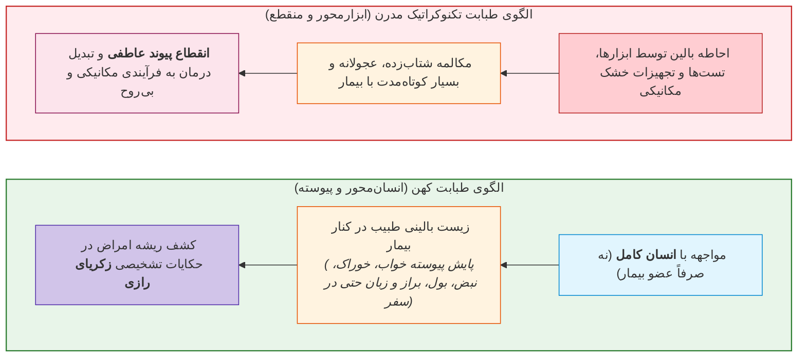

---

## 2. کالبدشکافی پیش‌نیازهای اخلاقی طبابت در متون کلاسیک

> [!abstract] تقدم تهذیب نفس بر فراگیری «علم‌الابدان»
> در سنت آموزشی کهن، دانشجو پیش از ورود به آموزش‌های تکنیکی طب، موظف به **تزکیه باطن، صبوری، مهار هوای نفس و کسب مکارم اخلاقی** بوده است.

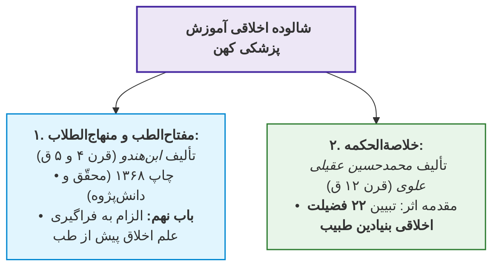

### واکاوی فضایل بیست‌‌ودوگانه طبیب در «خلاصةالحکمه» عقیلی علوی

1. **اعتقاد توحیدی به شفا:** باور قلبی به اینکه *تنها شافی مطلق خداوند است* و طبیب صرفاً واسطه درمان است.
2. **پاسداشت حرمت اساتید:** یاد کردن همیشگی از اساتید با بزرگی و احترام تام.
3. **پرهیز از تخریب همکاران:** اجتناب مطلق از عیب‌جویی، تضعیف و تخریب چهره سایر اطباء نزد بیماران.
4. **حسن خلق و حلاوت کلام:** پرهیز از ترش‌رویی، تندی و برخورد متکبرانه با مراجعان.
5. **شکیبایی در برابر پرحرفی بیمار:** گوش‌سپاری صبورانه بدون قطع کلام یا ابراز خستگی و آزردگی از تکرار مکررات علائم.
6. **مدیریت درماندگی تشخیصی و بی‌اعتمادی بیمار (ارجاع به حاذق‌تر):**
   * اگر پزشک حس کرد بیمار به او اعتماد ندارد.
   * اگر مشاهده کرد روند درمان پس از مدتی هیچ پیشرفتی نداشته است.
   * *حکم اخلاقی:* **ارجاع فوری و بدون تعلل بیمار به پزشکی ماهرتر و داناتر**.
7. **مناعت طبع و قناعت مالی:** پرهیز از مطالبه حریصانه اجرت از بیماران نیازمند و شاگردان.
8. **پاکی چشم و صیانت از محارم:** پرهیز از نگاه خیانت‌آمیز به نوامیس مردم در عیادت‌های بالینی منازل.

> [!important] کالبدشکافی دو توصیه متن‌محور عقیلی علوی (توصیه دوم و سوم)
> * **توصیه دوم (حسن خلق و تلقین امید):** «طبیب باید با بشاشت و لطف کلام متفقد احوال باشد؛ سخنی مأیوس‌کننده نگوید، با ترنم و تلطف سخن بیمار را مکرر بشنود و به موعظه او را از پرهیزشکنی بازدارد و تفهیم کند که **زحمت چند روزه پرهیز، بهای سلامت دائمی است (این سهل است و آن دشوار)**.»
> * **توصیه سوم (رازپوشی مطلق / کاتم اسرار):** «باید کاتم اسرار باشد؛ چه بسا امراضی که فرزند از پدر، برادر از برادر، خواهر از خواهر و زن و شوهر از یکدیگر کتمان می‌کنند؛ افشای آن نزد بیگانگان جنایت است.»

---

## 3. چالش اقتصاد درمان و فلسفه معیشت طبیب (تجربه زیسته برزویه طبیب)

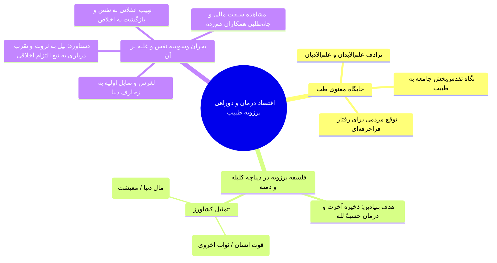

> [!abstract] تمثیل جاودان برزویه طبیب پیرامون درآمد پزشکی
> در مقدمه کلیله و دمنه (ترجمه نصرالله منشی): «فاضل‌تر آن است که بر معالجت از جهت ذخیرت آخرت مواظبت نماید... چنان‌که **غرض کشاورز در پراکندن تخم، دانه باشد که قوت اوست، اما کاه که علف ستوران است به تبع آن خود حاصل آید**.» (درآمد مالی کاه است و ثواب نجات جان دانه!).

---

## 4. روان‌شناسی تصویر بالینی، آراستگی و پرسونای پزشک

> [!abstract] اصل بقراطی قابوس‌نامه (عنصرالمعالی کیکاووس)
> طبیب باید آگاه از وصایای بقراط، **پیوسته پاک‌جامه، نظیف، معطر (مُطَیَّب) و خوش‌‌سخن** باشد؛ زیرا دیدن پزشک آراسته **حرارت غریزی بیمار را تقویت کرده و توان تحمل درد را فزونی می‌بخشد**.

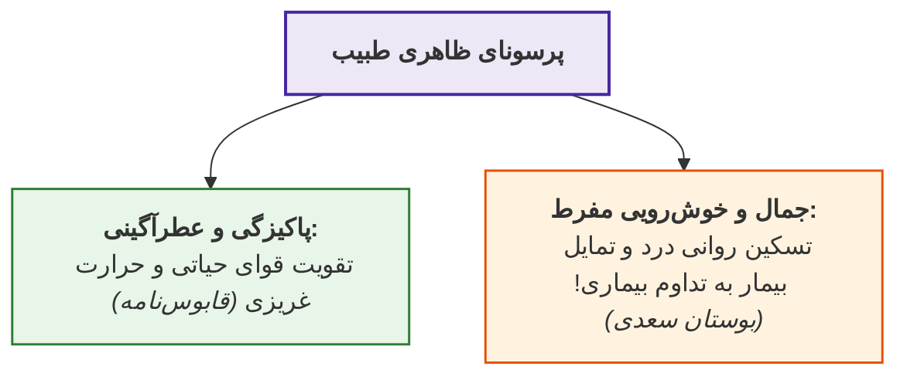

> [!important] شاهد تمثیلی بوستان سعدی در باب شیفتگی به طبیب پری‌چهره
> سعدی حکایت دردمندی را می‌گوید که به سبب زیبایی و جاذبه طبیب، تمایلی به بهبود نداشت تا دیدار معالج قطع نگردد:
> *«طبیب پری‌چهره در مدخلش / که در باغ دل قامتش سرو بود*
> *نه از درد دل‌های ریشش خبر / نه از چشم بیمار خویشش خبر*
> *حکایت کند دردمندی غریب / که خوش بود چندی سرم با طبیب*
> **نمی‌خواستم تندرستی خویش / که دیگر نیاید طبیبم به پیش**»

---

## 5. باورهای عامیانه مؤثر بر سایکولوژی و روان‌شناسی درمان

اگرچه برخی باورها فاقد پایه بیومدیکال و تجربی هستند، اما به دلیل **اثر تلقینی عمیق بر ناخودآگاه بیمار (Placebo/Nocebo)** در کتب طبی معتبر منعکس شده‌اند:

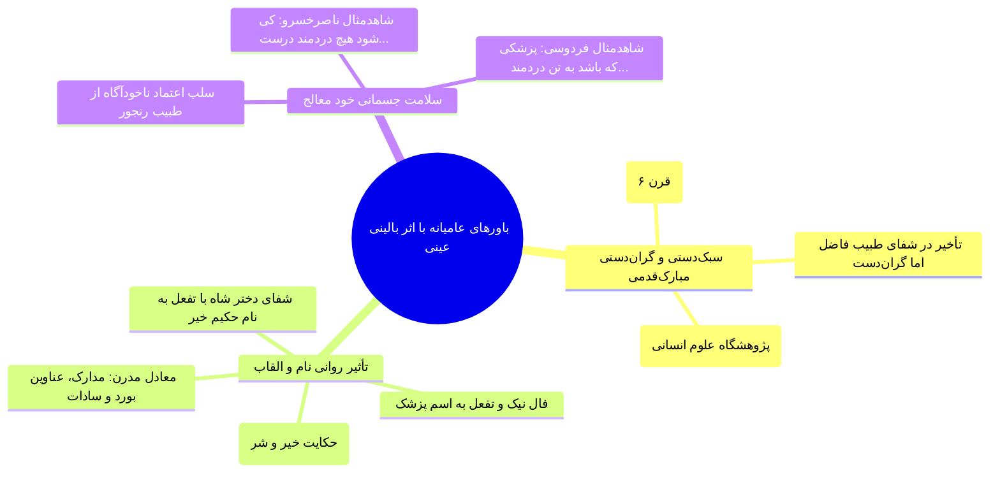

### ۱. اصل «مبارک‌پی بودن» و سبک‌دستی در «کفایت‌الطب» تفلیسی

* **شناسنامه اثر:** *کفایت‌الطب* تألیف **حَبیش بن ابراهیم تفلیسی** (قرن ششم هجری) در **سه بخش**؛ تصحیح‌شده توسط سخنران همین جلسه و چاپ پژوهشگاه علوم انسانی.
* **گزاره بالینی:** «پزشک باید **مبارک‌پی و سبک‌دست** باشد؛ و اگر **گران‌دست** باشد، *هرچند فاضل و دانا باشد*، سلامت دیرتر به بیمار بازگردد.»

### ۲. قدرت القایی نام و القاب (تفأل در هفت‌پیکر نظامی)

* تطابق نام درمانگر با پروگنوز بیماری؛ در داستان *خیر و شر* هفت‌پیکر نظامی، پادشاه نام طبیب معالج دخترش را می‌پرسد:
  > *«چیست نام تو؟ گفت: نامم خیر / کَه‌ترم دارد از سعادت سیر*
  > **شاه نامش خجسته دید به فال / گفت: خیری، مَده به دل اِهمال**
  > *در چنین شور، نیک‌فرجام آمد / عاقبت خیر باد چون نامت»*
* **انطباق مدرن:** القاب امروزی (فوق‌تخصص، استاد دانشگاه، القاب مذهبی نظیر سیادت) همان کارکرد القای روانی آرامش و خوش‌‌بینی درمانی را دارند.

### ۳. ضرورت وجاهت و سلامت تن خود طبیب

* بیمار در مواجهه با پزشکی که خود زردچهره، ناتوان و بیمار است، دچار سوءظن تشخیصی و ناامیدی می‌گردد:
  * **فردوسی:** *«پزشکی که باشد به تن دردمند / ز بیمار چون باز دارد گزند؟»*
  * **ناصرخسرو:** *«کی شود هیچ دردمند درست / زین طبیبان که زار و بیمارند؟»*

---

## 6. ماتریس مقایسه ابعاد روانی و سنتی تعامل پزشک و بیمار

| مؤلفه ارزیابی | سنت پزشکی کهن (حکمت‌بنیان) | پزشکی تکنوکراتیک مدرن | دستاورد و کارکرد بالینی |
| :--- | :--- | :--- | :--- |
| **افق مواجهه** | انسان کل‌نگر (پیوند تن، روان و زیست) | عضو درگیر، آزمایش و تصویربرداری | کاهش خطای بالینی و کشف بیماری پنهان |
| **انگیزه مالی** | اصالت خدمت حسبةً لله (درآمد معادل کاه) | تعرفه‌محوری، بازار سلامت و نگاه شغلی | احیای اعتماد مقدس عمومی به جامعه پزشکی |
| **رازداری** | کاتم اسرار حتی در برابر صمیمی‌ترین اقارب | محرمانگی مشروط حقوقی و اداری | احساس امنیت مطلق و برون‌ریزی ترومای بیمار |
| **ظاهر و پرسونای معالج** | پاکیزگی، معطر بودن و خوش‌سخنی بقراطی | فرمال، گاه شلخته یا مکانیکی | برانگیختن حرارت غریزی و تسکین بار درد |
| **باورهای پیرامونی** | توجه به حس تلقین (سبک‌دستی، نام، شگون) | طرد مطلق خرافات بدون درک اثر روانی | تسریع دوره نقاهت از کانال پلاسیبو و روحیه |

> [!tip] چکیده امتحانی جلسه بیستم
> ارتباط پزشک و بیمار یک مداخله درمانی مستقل است. تسلیح به **تهذیب نفس پیش از طبابت** (*ابن‌هندو*)، **حسن خلق و رازداری مطلق** (*عقیلی علوی*)، **درک مادیات به مثابه محصول فرعی و کاه کشاورزی** (*برزویه طبیب*)، **آراستگی جهت تقویت حرارت غریزی** (*قابوس‌نامه*) و **مدیریت عوامل تلقینی چون سبک‌دستی و سلامت شخص طبیب** (*تفلیسی و فردوسی*)، اضلاع هندسه اعجاز در طبابت ایرانی-اسلامی را تشکیل می‌دهند.

# جلسه بیست و یکم: ارتباط پزشک و بیمار در مراحل سه‌گانه تشخیص، درمان و پس از درمان؛ اعراض نفسانی، سیمیولوژی بالینی و طب تسکینی در متون کهن

## 1. شاکله سه‌گانه مراحل مواجهه بالینی (Clinical Encounter)

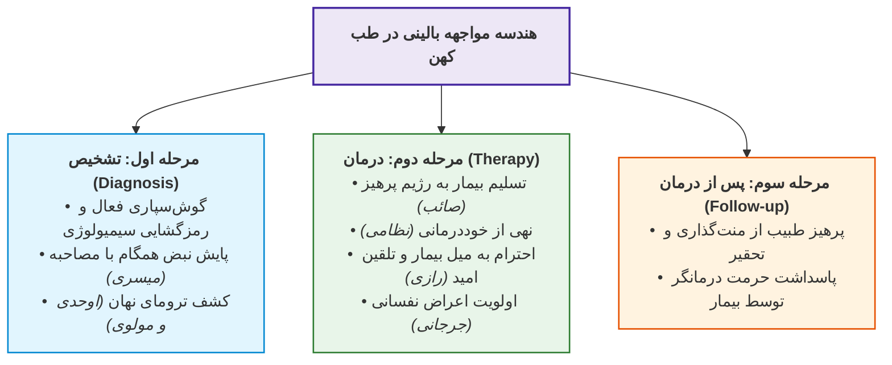

---

## 2. مرحله اول: ظرایف و شگردهای بالینی در تشخیص بیماری

> [!abstract] اصل بالینی گوش‌دادن (ویلیام آسلر / William Osler)
> ویلیام آسلر (پزشک نامدار کانادایی و پدر پزشکی نوین): «**به بیمار خود گوش دهید؛ او تشخیص بیماری را به شما می‌گوید.**» مواجهه مستقیم بالینی و استماع کلام هرگز با دستگاه‌های تصویربرداری و آزمایش‌های مکانیکی قابل جایگزینی نیست.

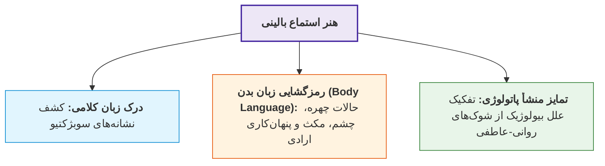

### خطای تشخیصی ناشی از غفلت از روح (شاهد شعری اوحدی مراغه‌ای)

غفلت معالج از اشک چشم و تمرکز صرف بر علائم مکانیکی، منجر به تجویز اشتباه داروهای کاهنده تب گردید:

> *«سر دردم بر طبیبان فاش نبود / گفت: تب داری، غلط کرد آن نبود*
> *نوش‌دارو داد و آن سودی نداشت / گلشکر فرمود و آن درمان نبود*
> **بر طبیبم سوز دل پوشیده ماند / ور نه اشک دیده‌ام پنهان نبود**»

### سایکوسوماتیک در مثنوی معنوی (حکایت کنیزک و پادشاه)

* **پاتولوژی:** ناتوانی کنیزک از ابراز عشق به زرگر سمرقندی به دلیل ترس از شاه؛ بروز بیماری لاغری و زردی چهره.
* **مداخله تشخیصی:** طبیب الهی دست بر نبض بیمار نهاده و هم‌‌زمان با استنطاق پیرامون بلاد و محله‌ها، پرش ناگهانی نبض (*تاکی‌‌کاردی ناشی از برانگیختگی عاطفی*) را معیار کشف منشأ روانی قرار داد.

### پروتکل بالینی پایش نبض در «دانشنامه حکیم مَیسَری» (قرن ۴ هـ)

* **شناسنامه اثر:** *دانشنامه* مَیسَری، کهن‌ترین منظومه جامع طبی فارسی مشتمل بر **۴۵۰۰ بیت**.
* **شگرد بالینی:** الزام پزشک به ارزیابی هم‌زمان نبض با طرح پرسش‌های تنش‌زا برای کشف تروما، خستگی سفر و ترس:

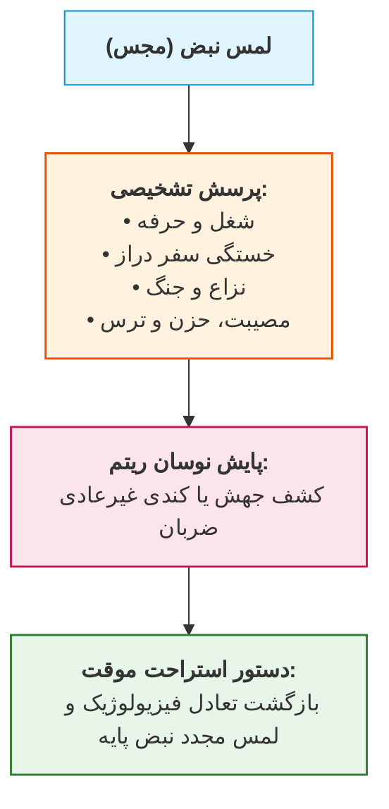

> [!important] شاهد منظوم حکیم میسری پیرامون معاینه هم‌زمان نبض
> *«گرک خواهی نگه کردن ز بیمار / بپرس از حال و کارش نیز هوشیار*
> *بپرسش تا ز راه دور رفته‌ست؟ / گر از جنگی مرو را دل به تفت است؟*
> *گرش بینی به پیش آمد بترسید / گر از دردی بدان دل نیز غم دید*
> **بگو تا او بیاساید زمانی / پس آنگه جوی از نبزش نشانی**»

### وظیفه متقابل بیمار در ابراز صادقانه درد (نظامی گنجوی)

هم‌راستا با هوشیاری پزشک، بیمار موظف به پرهیز از کتمان درد نزد معالج خویش است:

> نظامی گنجوی: **«چو می‌خواهی که یابی روی درمان / مکن درد از طبیب خویش پنهان»**

### قلمروهای سه‌گانه رازداری پزشک در «کفایت‌الطب» تفلیسی

طبیب پس از شنیدن مکنونات بیمار، شرعاً و اخلاقاً کاتم اسرار است. حَبیش تفلیسی در *کفایت‌الطب* پزشک را در **سه امر** محرم مطلق شاه و عامه می‌داند:

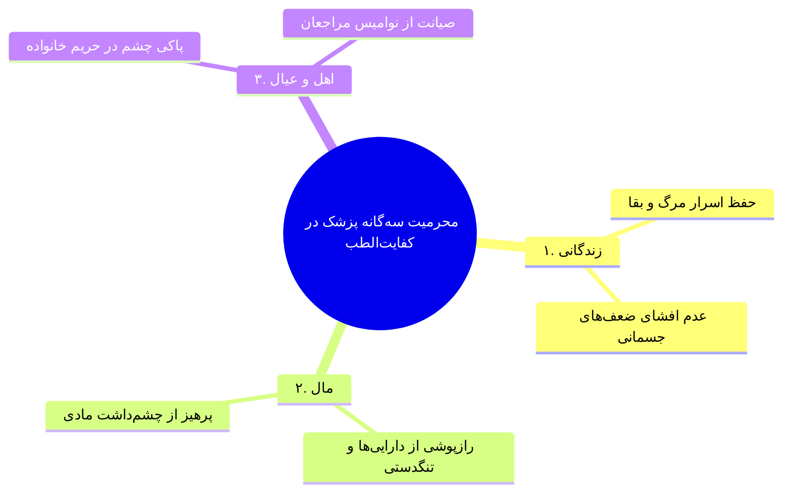

---

## 3. مرحله دوم: هندسه اخلاقی و روانی فرآیند درمان

### ۱. تسلیم به پلن درمانی و تمثیل تسلیم به قضا (صائب تبریزی)

* بیمار به دلیل فقدان تخصص و ابتلای عقل، صلاحیت نقض دستورات معالج را ندارد.
* تسلیم به نسخه طبیب، هم‌سنگ با تسلیم انسان به مصائب زمانه و اراده الهی است:
  > *«مریض مصلحت خویش را نمی‌داند / **به تلخ و شور طبیب زمانه قانع باش***»
* **آسیب‌شناسی پرهیزشکنی:** شکستن رژیم درمانی آسیبی به اعتبار یا جسم پزشک نمی‌زند، بلکه مستقیماً بیمار را تباه می‌سازد؛ همانند بی‌اثر بودن گناه عاصیان بر ساحت بی‌نیاز پروردگار:
  > *«خدا غنی‌ست ز طاعت ما سیه‌کاران / **طبیب را چه زیان است از شکست پرهیز؟***»

### ۲. آسیب‌شناسی خوددرمانی و زوال عقل حین بیماری (نظامی گنجوی)

به موازات بیماری جسم، دستگاه تفکر و قوه تدبیر بیمار تضعیف می‌شود؛ لذا حق تجویز شخصی ندارد:

> *«**نشاید کرد خود را چاره کار / که بیمار است رای مرد بیمار**
> **سخن در تندرستی تندرست است / که در سستی همه تدبیر سست است**»*
> حتی طبیب حاذق نیز هنگام بیماری، عنان درمان خویش را به همکارش می‌سپارد:
> *«**طبیب ار چند گیرد نبض پیوست / به بیماری به دیگر کس دهد دست***»

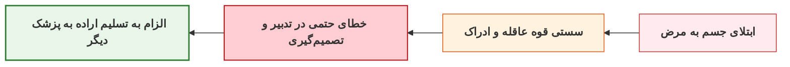

### ۳. احترام به میل بیمار و روان‌پزشکی تغذیه (محمد بن زکریای رازی)

رازی معتقد است خواسته بیمار نباید مطلقاً سرکوب گردد؛ میل روانی در جذب غذا بر ارزش شیمیایی آن پیشی می‌گیرد:

> [!important] سه قاعده زرین زکریای رازی در تغذیه و روان درمانی
> 1. **اصل میل باطنی:** «*غذایی که با میل خورده شود، هرچند پست باشد (ارزش غذایی اندک داشته باشد)، سودآور است.*»
> 2. **اصل تقویت حرارت غریزی با شادی:** «*تیمار، شادی و توجه به خواسته‌های بیمار، سبب افزایش توان جسمانی او می‌شود.*»
> 3. **اصل اغمض و تساهل در رژیم:** «*به خواسته بیمار توجه کن، هرچند برایش خوب نباشد؛ اندکی از آن به او بچشان، به‌ویژه اگر نیروی حیاتی او افت کرده باشد.*» (برگرفته از کتاب *المرشد* رازی).

### ۴. قدرت فارماکولوژیک امید و مژده بهبودی (رازی، بوعلی و جرجانی)

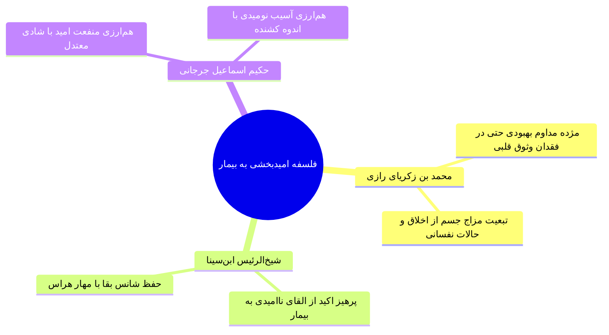

* **گزاره رازی:** *«سزاوار چنان است که هر طبیب پیوسته مریض خود را بهبودی مژدگان دهد و او را امیدوار به صحت دائمی گرداند، اگرچه طبیب خود وثوق به این امر نداشته باشد؛ چرا که مزاج جسم تابع اخلاق نفسانی است.»*
* **گزاره ابن‌سینا:** *«پزشک هرگز نباید چنین ظنی را به وجود آورد که دیگر بیمار امید بهبودی ندارد.»*
* **گزاره جرجانی:** *«منفعت ایمنی و امید همچون منفعت شادی معتدل است، و مضرت نومیدی همچون مضرت اندوه.»*

### ۵. روان‌درمانی و تقدم سرعت «اعراض نفسانی» بر دارو (جرجانی و بقراط)

* **اسماعیل جرجانی (*ذخیره خوارزمشاهی* و *الأغراض الطبیة*):** شناخت اعراض نفسانی بر طبیب **واجب** است. تنظیم کلام باید متناسب با *سن، شغل، سطح سواد و پایگاه اجتماعی* بیمار باشد (زبان ارتباطی چندسطحی).
* **برتری سرعت اثر روان بر غذا و دارو:**
  > *«طعام و شراب و دیگر اسباب بدان زودی اثر نکنند که اعراض نفسانی؛ **نبینی که اثر سخن خوش یا ناخوش بی هیچ مهلت زود به رنگ و روی پدید آید و حرکت و آواز از مردم بگردد؟***»
* **اصل بقراطی در «کفایت‌الطب» تفلیسی:** علاج بیماری دوگانه است: **علاج نفس** و **علاج تن**.
  * ابزارهای علاج نفس: *آوازهای خوش، افسانه‌گویان خوب، جایگاه‌های سبز و گلزار، آب روان، نوای مرغان و استشمام اسپرغم‌های خوشبو* (آروماتراپی و موزیک‌تراپی کهن).

### ۶. چالش بالینی مواجهه با بیمار مشرف به مرگ (End-of-life Care)

تحلیل تطبیقی کتاب *«فرهنگ اسلام در اروپا»* تألیف **زیگرید هونکه (Sigrid Hunke)** (ترجمه *مرتضی روحبانی*):

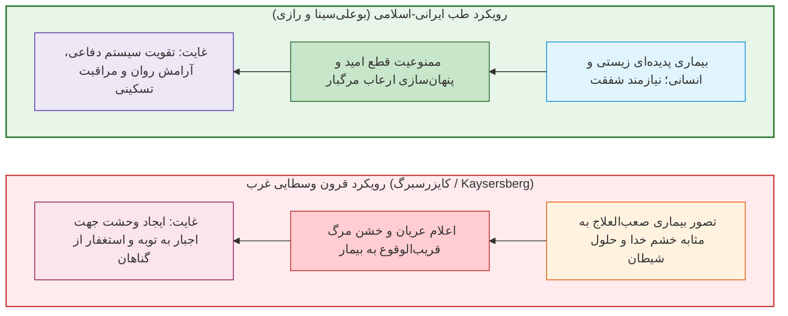

> [!tip] تمثیل ادبی بیمار مشرف به مرگ در دفتر سوم مثنوی معنوی
> طبیب با لمس نبض بیمار دریافت امیدی به بقا نیست؛ برای کاستن از رنج واپسین، دستور به کام‌جویی مطلق داد:
> *«نبض او بگرفت و واقف شد ز حال / کاندام صحت او بد زوال*
> **گفت: هر چه دل بخواهد آن بکن / تا رود از جسمت این رنج کهن**»
> (بیمار بر لب جوی رفت و بر قفای صاف مردی سیلی کوبید!).

---

## 4. مرحله سوم: اتیکت و آداب پس از درمان (Follow-up)

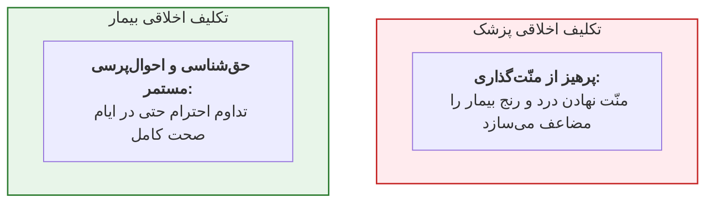

1. **نهی طبیب از تقاضاهای مادی و روانی فرساینده:**
   > *«**از منّت طبیب شود درد تا زیاد** / بیچارگان شوند مگر چاره‌جوی هم»*
2. **پاسداشت حرمت طبیب در دوران عافیت:**
   > *«**چو بهبودی، طبیب از خود میازار / که بیماری توان بودن دگربار**»*

---

## 5. ماتریس مقایسه تطبیقی مؤلفه‌های تعامل بالینی در طب سنتی و مدرن

| مؤلفه ارزیابی | سنت پزشکی کهن (حکمت‌بنیان) | پزشکی تکنوکراتیک معاصر | کارکرد بالینی و دستاورد تشخیصی |
| :--- | :--- | :--- | :--- |
| **اصالت ابزار تشخیص** | استماع شرح‌حال، لمس نبض و زبان بدن | ارجاع به پاراکلینیک، سی‌تی و آزمایش | کاهش خطای تشخیصی و درک ریشه درونی درد |
| **رویکرد به روان بیمار** | اصل اعراض نفسانی؛ درمان کلامی و محیطی | تجویز داروهای ضداضطراب و خواب‌آور | تسریع بازگشت تعادل فیزیولوژیک بدون عوارض |
| **مواجهه با میل بیمار** | تساهل در رژیم و احترام به اشتهای بیمار | ممنوعیت صلب پروتکلی بدون درک روحی | صیانت از روحیه و توان بیولوژیک مقابله با بیماری |
| **پروگنوز بیماری کشنده** | القای امید دائمی جهت تقویت قوت حیات | اعلام خشک درصد بقا (Survival Rate) | پیشگیری از شوک روانی و مهار دپرسیون مرگبار |
| **ارتباط پس از درمان** | استمرار پیوند عاطفی و قدردانی اخلاقی | قطع کامل ارتباط تا مراجعه بوروکراتیک بعدی | بقای پایبندی دارویی و پیوند وثیق اجتماعی |

> [!tip] چکیده امتحانی جلسه بیست و یکم
> در سنت پزشکی کهن، تعامل بالینی در سه گام سامان می‌یابد: در **تشخیص**، گوش‌سپاری فعال و پایش نبض همگام با استنطاق روانی (*میسری*)؛ در **درمان**، تسلیم بیمار به پرهیز و نهی از خوددرمانی (*نظامی و صائب*) توأم با احترام معالج به میل بیمار (*رازی*)، اعجاز مژده بهبودی (*ابن‌سینا*) و کاربست اعراض نفسانی (*جرجانی و بقراط*)؛ و در **پس از درمان**، پیوند احترام دوجانبه بدون منّت‌گذاری، غایت اخلاق پزشکی ایرانی است.

# جلسه بیست و دوم: آثار و کتب مرجع طبی کهن فارسی؛ داروشناسی، دانشنامه‌های بالینی، شاهکار کفایت‌الطب و گفتمان‌های تاریخی

## 1. شالوده و اهمیت دوگانه متون طبی کهن فارسی

> [!abstract] کارکرد دوگانه کتب طبی سنتی
> متون پزشکی کهن فارسی از **دو جهت بنیادین** اهمیت دارند:
> 1. **اهمیت زبانی و ادبی:** دربردارنده گنجینه اصیل لغوی، ساختارهای نحوی فصیح کهن، ترمینولوژی فارسی علم و سبک‌شناسی نثر علمی.
> 2. **اهمیت در تاریخ پزشکی:** شناخت گفتمان‌های فکری حاکم بر فضای درمانی گذشته، بازتاب اپیدمیولوژی سنتی و تحلیل تطبیقی دانش بالینی.

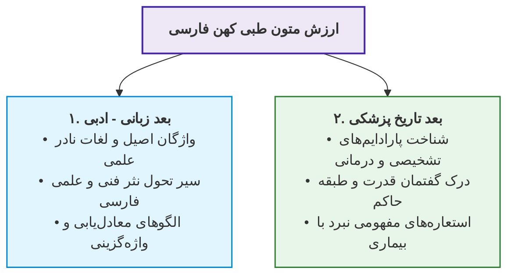

---

## 2. کالبدشناسی کتاب «الأبنیه عن حقایق الأدویه» (کهن‌ترین متن داروشناسی فارسی)

* **پدیدآورنده و دوره تاریخی:** *ابومنصور موفق هروی*، تألیف در **قرن چهارم هجری**.
* **موقعیت متنی:** از نخستین و قدیمی‌ترین کتاب‌های منثور بازمانده به زبان فارسی در تاریخ ادب و علم.
* **مصحح معاصر:** تصحیح انتقادی توسط *احمد بهمنیار*.
* **محتوا و قلمرو:**
  * دربردارنده مشخصات، طبع و خواص **۵۴۷ دارو** (گیاهی، معدنی و حیوانی).
  * *دارو در مفهوم قدما:* شامل تمام گیاهان، خوراکی‌ها، اغذیه و عناصری که مصرف درمانی، تغذیه‌ای یا دوگانه داشتند.
* **نقص ساختاری (عدم جامعیت بالینی):** این اثر صرفاً فارماکوپیا و داروشناسی است و به مباحث بالینی، علائم بیماری‌ها و فیزیولوژی نپرداخته است؛ لذا **کتاب جامع پزشکی محسوب نمی‌شود**.

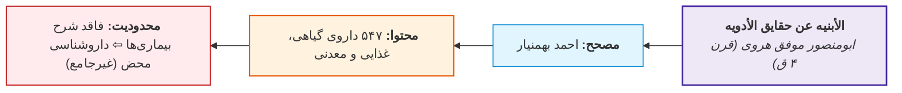

---

## 3. حکیم اسماعیل جرجانی؛ معمار نخستین دانشنامه‌های جامع پزشکی فارسی

* **زیست‌نامه علمی:** *زین‌الدین ابوابراهیم اسماعیل بن حسن جرجانی* (حدود **۴۳۴ تا ۵۳۰ یا ۵۳۵ هـ.ق**)؛ عمری نزدیک به **یک قرن**.
* **انقلاب زبانی:** نگارش کتب به **زبان فارسی** در عصری که کتب مرجع طب (*الحاوی* رازی، *قانون* ابن‌سینا، *فردوس‌الحکمه* ابن‌ربن طبری) منحصراً به عربی بود.

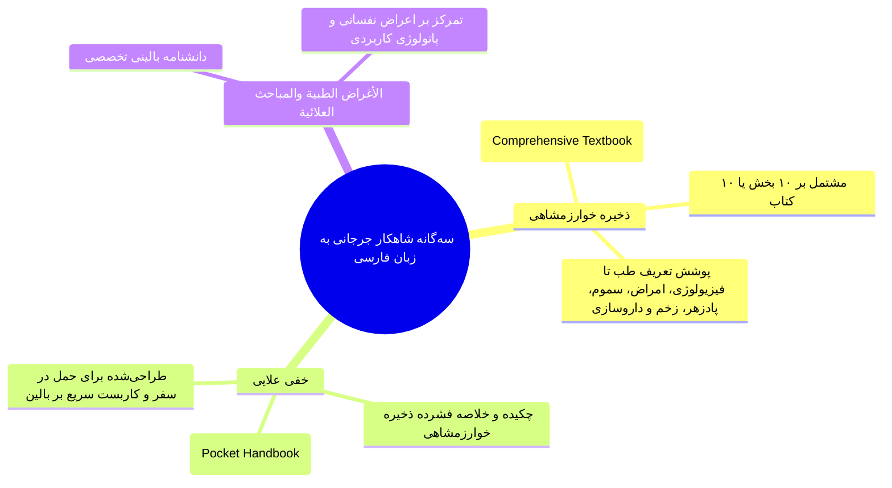

### بخش‌های ده‌گانه «ذخیره خوارزمشاهی»
این کتاب جامع در **۱۰ کتاب** سامان یافته تا پزشک بدون اتلاف وقت به بخش مورد نظر رجوع کند:
1. تعریف طب، منافع آن و ارکان و اخلاط و امزجه.
2. تشریح اندام‌ها و فیزیولوژی.
3. صحت و اسباب بیماری‌ها (بهداشت و اتیولوژی).
4. نشانه‌شناسی، سیمیولوژی، نبض و قاروره (تفسره).
5. تب‌ها، اقسام و علل آنها.
6. بیماری‌های اندام‌های خاص از سر تا پای.
7. آماس‌ها (تورم‌ها)، جراحات، زخم‌ها، شکستگی و سوختگی.
8. تدابیر آرایشی، پوست و مو (زینت).
9. سموم، زهرها و پادزهرها (تریاقات).
10. قرابادین (داروهای مرکب، ساخت و دستورالعمل داروسازی).

---

## 4. کالبدشناسی دانشنامه بالینی «کفایت‌الطب» حبیش تفلیسی

> [!abstract] شناسنامه اثر
> *کفایت‌الطب* تألیف **حَبیش بن ابراهیم تفلیسی** (حکیم و دانشمند چندرشته‌ای **قرن ششم هجری** با تألیف بالغ بر ۳۰ اثر در طب، نجوم، ادب و علوم قرآنی). این اثر جامع توسط سخنران همین جلسه (**پژوهشگاه علوم انسانی و مطالعات فرهنگی**؛ تصحیح ۸۴ تا ۹۳) تصحیح انتقادی شده است.

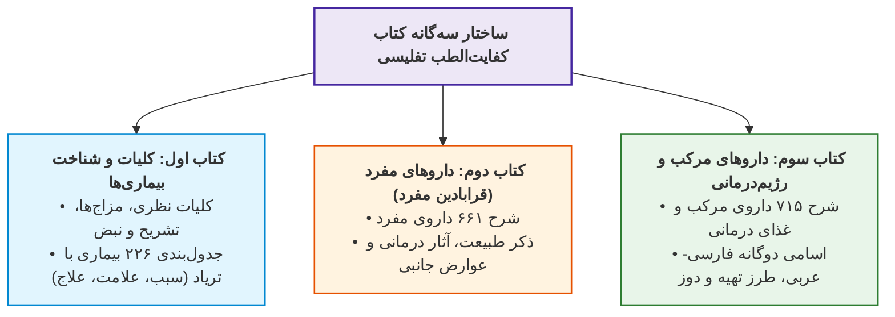

### ۱. شگفتی متدولوژیک و ارجاع‌دهی مدرن (Citation)
* تفلیسی برای نخستین بار در تاریخ نگارش متون طبی فارسی، روش **ارجاع‌دهی دقیق** را پیاده کرد؛ او نام منبع را ذکر کرده و آراء بیش از **۳۰ پزشک ایرانی و خارجی** (یونانی، رومی، هندی و اسلامی) را با امانت‌داری کامل نقل و مقایسه می‌کند.

### ۲. نوآوری در صفحه‌آرایی و تدوین جداول بالینی (کتاب اول)
* شرح **۲۲۶ عنوان بیماری** درون جداولی منظم با ساختار تفکیکی سه‌گانه:
  * ستون ۱: **سبب بیماری** (Etiology).
  * ستون ۲: **علامت بیماری** (Symptomatology).
  * ستون ۳: **علاج بیماری** (Therapy).
* **قاعده طراحی دو جدول در هر صفحه:** هر صفحه شامل ۲ جدول موازی است؛
  * یا بیماری از دو منظر اتیولوژیک بررسی شده (جدول ۱: *سبب سردی* / جدول ۲: *سبب گرمی*).
  * یا بر مبنای تقابل آراء اطباء تدوین شده (جدول ۱: *رویکرد طبیب الف* / جدول ۲: *رویکرد طبیب ب*).

### ۳. موازین داروشناسی در کفایت‌الطب و تطبیق با کتاب «تقویم‌الأدویه»
* **داروهای مفرد در کفایت‌الطب:** بررسی **۶۶۱ عنوان داروی مفرد** به زبان فارسی.
* **کتاب تقویم‌الأدویه تفلیسی:** اثری تخصصی به زبان عربی مشتمل بر **۸۰۸ عنوان داروی مفرد** با برابریابی واژگان در ۶ زبان (**فارسی، عربی، سریانی، رومی، یونانی و هندی**) از طریق مصاحبه میدانی با گویشوران بومی (*هنوز تصحیح نشده است*).
* **داروهای مرکب در کفایت‌الطب:** معرفی **۷۱۵ داروی مرکب** با اسامی فارسی و عربی، فرمولاسیون ساخت، میزان دوز مصرفی و مصلحات دارویی جهت مهار عوارض جانبی.

---

## 5. گزیده متن‌خوانی تاریخی «کفایت‌الطب»؛ اتیکت و استعاره‌های بالینی

> [!important] تبارشناسی تاریخ طب در دیباچه تفلیسی
> اصل علم طب از حکمای **یونان** پدید آمد؛ سپس به **اهل هند و اهل روم** رسید:
> * **طب هندی:** حکمت آن *باریک‌تر* (پیچیده‌تر) است و فراگیری آن رنج و ریاضت بیشتر می‌طلبد.
> * **طب رومی (یونانی-رومی):** *آسان‌تر و مفهوم‌تر* است و طبایع آنان با طبایع ایرانیان سازگارتر و موافق‌تر است.

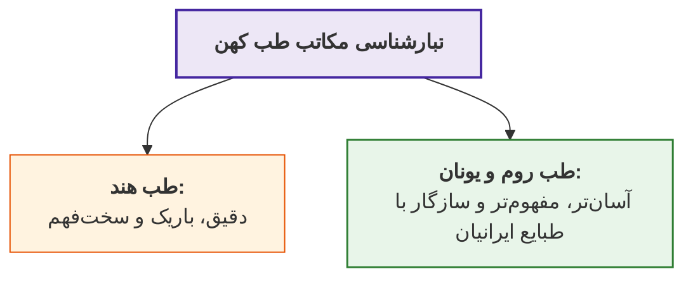

### ۱. تمثیل سلاح‌خانه و پدافند سلامت حاکمیت
پادشاهان باید پزشکان ماهر را در ایام سلامت مقرب و بی‌نیاز دارند؛ همان‌طور که خزانه‌های سلاح پرهزینه در ایام صلح برپا نگه داشته می‌شوند تا به وقت شبیخون دشمن به کار آیند:
> *«...پادشاهان را رسم چنان است که مال بسیار هزینه کنند و سلاح‌خانه‌ها سازند... پس همچنان که آن سلاح‌خانه‌ها نگاه می‌باید داشت، پزشک را نیز به حال تندرستی نگاه می‌باید داشت از بهر روزی که بدو محتاج باشد.»*

### ۲. استعاره مفهومی تن، پادشاه، بیماری، دارو و پزشک

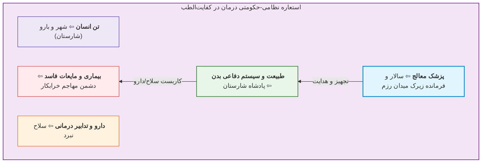

* **انطباق سلاح با فارماکولوژی:** سالار باید فنون رزم بداند؛ اگر دشمن دور است تیر و کمان دهد، اگر نزدیک است نیزه دهد و اگر گلاویز شدند شمشیر کشد:
  * *خطای بالینی معادل خطای نظامی:* اگر پزشک نابلد باشد، دشمن بر پادشاه چیره می‌شود؛ همان‌گونه که نابلدی موجب می‌شود **«به وقت داروی مُسهل، داروی قِی دهد، و چون کَشکاب (ماءالشعیر) باید دادن، مُزَوَّره (غذای پرهیزانه بی‌گوشت) ندهد.»**

---

## 6. واکاوی دو گفتمان بنیادین در تاریخ پزشکی ایران

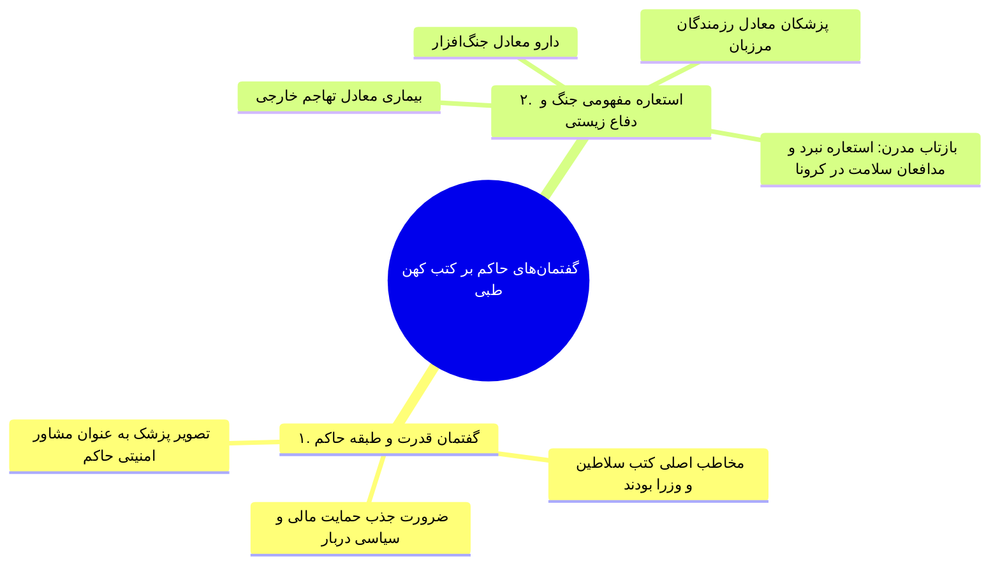

### کالبدشکافی سیمیولوژی و روان‌پزشکی «بیماری عشق» در کفایت‌الطب
* **تعریف تفلیسی:** *«عشق وسواسی بُوَد که به دیوانگی ماند.»*
* **پاتوفیزیولوژی:** غلبه خلط **سودا**، رخوت و زردی چهره.
* **پروتکل درمانی دوگانه (بقراط و روفس):**
  1. *تدبیر غیردارویی و محیطی:* گشت‌وگذار در باغ و گلزار و چمن، استشمام روايح خوش، استماع موسیقی‌های مفرح و پرهیز از خلوت.
  2. *روان‌درمانی تعاملی و گفتگودرمانی (Cognitive Therapy):* گفتگو با عاشق جهت ابطال بزرگ‌نمایی‌های ذهنی و آشکارسازی واقعیت عینی معشوق.

---

## 7. ماتریس تطبیقی مشخصات و ساختار آثار مرجع طب سنتی فارسی

| عنوان کتاب | پدیدآورنده | قرن نگارش | ماهیت و قلمرو تخصصی | شاخصه انحصاری و نوآوری ساختاری |
| :--- | :--- | :--- | :--- | :--- |
| **الأبنیه عن حقایق الأدویه** | ابومنصور موفق هروی | قرن ۴ هـ | داروشناسی و مفردات | کهن‌ترین نثر دارویی فارسی؛ شرح ۵۴۷ دارو بدون شرح بیماری‌ها |
| **ذخیره خوارزمشاهی** | اسماعیل جرجانی | قرن ۵ و ۶ هـ | دانشنامه جامع پزشکی | نخستین کامپرهنسیو تکست‌‌بوک فارسی در ۱۰ کتاب با نظم ساختاری |
| **خفی علایی** | اسماعیل جرجانی | قرن ۶ هـ | هندبوک بالینی جیبی | چکیده فشرده ذخیره خوارزمشاهی جهت حمل در سفر و کاربست سریع |
| **الأغراض الطبیة** | اسماعیل جرجانی | قرن ۶ هـ | پزشکی بالینی و اعراض | تقدم سرعت اثر اعراض نفسانی بر دارو و درمان‌های روان‌تنی |
| **کفایت‌الطب** | حَبیش تفلیسی | قرن ۶ هـ | دانشنامه جامع نظری و عملی | جدول‌بندی ۲۲۶ بیماری، شرح ۶۶۱ داروی مفرد و ارجاع به ۳۰ پزشک |
| **تقویم‌الأدویه** | حَبیش تفلیسی | قرن ۶ هـ | فرهنگ تطبیقی داروها | تألیف به عربی؛ برابریابی ۸۰۸ دارو در ۶ زبان با تحقیق میدانی |

> [!tip] چکیده امتحانی جلسه بیست و دوم
> تکامل متون طبی فارسی از داروشناسی محض *الأبنیه* هروی (قرن ۴) آغاز شد، با تدوین دانشنامه جامع ۱۰ جلدی *ذخیره خوارزمشاهی* جرجانی به اوج زبان علمی رسید و در *کفایت‌الطب* تفلیسی (قرن ۶) با نوآوری‌هایی نظیر **ارجاع‌دهی به ۳۰ طبیب**، **جدول‌بندی ۲۲۶ بیماری با تریاد سبب-علامت-علاج**، و ترسیم **استعاره شارستان و رزم میان طبیعت و بیماری**، شاهکاری تمام‌عیار در تاریخ پزشکی جهان اسلام پدید آورد.

# جلسه بیست و سوم: ادبیات در عصر دیجیتالیزیشن و زیست‌پزشکی شتابان؛ هوشیاری دسترسی در برابر هوشیاری پدیداری، تمایز درمان (Treatment) و مراقبت (Care)، سازوکار سلامت‌زایی (Salutogenesis) و آینگی عاطفی

## 1. شالوده‌شکنی: توهم زنگ تفریح بودن ادبیات در عصر شتاب زیست‌پزشکی

> [!abstract] پندار باطل عامیانه پیرامون ادبیات در پزشکی
> تلقی سطحی ادبیات به عنوان **اشعار تفننی تندرستی**، **گپ‌های شبکه‌های اجتماعی**، یا **شوخی‌های خستگی‌درکن پایگاه پرستاری و پاویون**؛ در حالی که ادبیات در عصر تکامل شتابان زیست‌فزشکی، **تنها سپر هویتی و ابزار بقای انسانی کادر درمان** است.

```mermaid
flowchart TD
    Root["<b>امواج پیشرفت شتابان دانش زیست‌پزشکی مدرن</b>"]
    Root --> G1["<b>۱. ژنتیک و سلول‌درمانی:</b><br>• ساخت اندام‌های مصنوعی زیستی<br>• سل‌تراپی (Cell Therapy) بیماری‌های صعب‌العلاج"]
    Root --> G2["<b>۲. اپی‌ژنتیک و سوئیچ‌های زیستی:</b><br>• خاموش/روشن کردن کلیدهای ژنی<br>• تغییر زبان همزیستی درونی میکروبیوتاها (Microbiota)"]
    Root --> G3["<b>۳. تحول دیجیتالیزیشن (Digitalization):</b><br>• کلینیکال دیتابیس‌های عظیم (Clinical Databases)<br>• کلان‌داده‌ها (Big Data) و مدل‌سازی رفتار کاربران"]

    style Root fill:#ede7f6,stroke:#4527a0,stroke-width:2px;
    style G1 fill:#e1f5fe,stroke:#0288d1,stroke-width:1.5px;
    style G2 fill:#fff3e0,stroke:#e65100,stroke-width:1.5px;
    style G3 fill:#ffebee,stroke:#c62828,stroke-width:1.5px;
```

---

## 2. چشم‌انداز آینده‌پژوهی ۲۰۳۰: افول درمانگری ماشین‌پذیر و شکست اسطوره ذهن انسان

> [!important] پیش‌بینی تاریخی افول پزشک-درمانگر تا افق ۲۰۳۰
> آینده‌پژوهی‌های نظام سلامت نشان می‌دهد **تا کمتر از ۱۰ سال دیگر (افق ۲۰۳۰ یا حتی پیش از آن به دنبال جهش دیجیتالیزیشن پساکرونا)**، بخش اعظم *تشخیص، تجویز و درمان فیزیکی (Treatment)* بر عهده **سامانه‌های الکترونیک سلامت و ماشین‌ها** خواهد بود.

```mermaid
flowchart RL
    subgraph Human["درمانگر انسانی (محدود)"]
    direction RL
        H1["دانش مقطعی و محدود به حافظه"]
        H2["پردازش کند و خطاپذیر بالینی"]
        H3["بی‌‌خبری از نوسانات فیزیولوژیک لحظه‌ای بیمار"]
    end

    subgraph Machine["سامانه‌های هوشمند رایانه‌ای (فائق)"]
    direction RL
        M1["<b>دانش بی‌نهایت در دسترس:</b> متصل به تمامی رفرنس‌های جهان"]
        M2["<b>قدرت پردازش مهیب:</b> فراتر از کمیسیون‌های پزشکی"]
        M3["<b>مانیتورینگ پیوسته (گجت‌ها):</b> پایش ۲۴ ساعته رفتار و بیولوژی"]
    end

    Human -.->|شکست قطعی در عرصه درمان| Machine

    style Human fill:#ffebee,stroke:#c62828,stroke-width:1.5px;
    style Machine fill:#e8f5e9,stroke:#2e7d32,stroke-width:2px;
```

* **شکست اسطوره دست‌نیافتنی بودن ذهن انسان (شکست کاسپاروف):** باخت *گری کاسپاروف* (قهرمان اسطوره‌ای شطرنج جهان) به ابررایانه، خط بطلانی بر باور شکست‌ناپذیری پردازش انسانی کشید؛ رایانه‌های امروزی نسبت به رایانه زمان کاسپاروف مانند اسباب‌بازی بوده و به راحتی قادرند **مجموعه لجنه‌ای از متفکران و پزشکان** را در حیطه پردازش داده شکست دهند.

---

## 3. دوگانه بنیادین هوشیاری: دسترسی در برابر پدیداری

> [!abstract] مرزهای شناختی فلسفه ذهن
> پرسش کلیدی: **مزیت رقابتی موجودات هوشیار (انسان) در برابر موجودات هوشمند (رایانه) چیست؟** پاسخ در تفکیک دو نوع هوشیاری نهفته است:

```mermaid
flowchart TD
    Consciousness["<b>سنخ‌شناسی دوقلوی هوشیاری در فلسفه ذهن</b>"]
    
    Consciousness --> AC["<b>۱. هوشیاری دسترسی (Access Consciousness)</b><br>• نگهداری داده‌ها در بافتار (Context) خاص جهت حل مسئله<br>• پردازش الگوریتمی، محاسباتی و منطقی<br>• <i>مزیت رقابتی برای انسان ندارد</i> (ماشین قوی‌تر است)"]
    
    Consciousness --> PC["<b>۲. هوشیاری پدیداری / کیفی (Phenomenal Consciousness / Qualia)</b><br>• تجربه کیفی «چونان چیزی بودن» (What it is like to be)<br>• ادراک باطنی، حال‌وهوا و جهان زیسته درونی<br>• <b>یگانه مزیت رقابتی تسخیرناپذیر انسان در برابر ماشین</b>"]

    style Consciousness fill:#ede7f6,stroke:#4527a0,stroke-width:2px;
    style AC fill:#ffebee,stroke:#c62828,stroke-width:1.5px;
    style PC fill:#e8f5e9,stroke:#2e7d32,stroke-width:2px;
```

---

## 4. کالبدشکافی مزیت رقابتی انسان: آینگی، هم‌کوکی و تولد اعتماد

* رایانه‌ها فاقد درک کیفی (Qualia) هستند؛ انسان به سبب ساختار سیستم عصبی و مسیر تکاملی فرگشت (Evolution)، واجد توانایی دوگانه پدیداری است:
  1. باخبر شدن از **احوال و جهان درونی خود**.
  2. نفوذ به **احوال و جهان زیسته دیگری** از کانال سازوکار آینگی عصبی (Mirroring).

```mermaid
mindmap
  root((مکانیسم‌های مراقبت عاطفی انسان))
    آینگی عصبی Mirroring
      انعکاس حالات هیجانی رنجور در تن مراقب
      فراروی از واژگان خشک
    هم‌کوکی و همسویی Attunement
      تنظیم ارتعاشات روانی با بیمار
      درک کدهای پنهان درد
    همزمانی Synchrony / Synchronization
      هماهنگی ریتم حضور در کنار بالین
      حضور تنانه و بی‌واسطه
    زایش حس ایمنی Safety
      شکستن دژ تنهایی بیمار
      خلق بستر آرامش و کاهش کورتیزول
    تولد اعتماد Trust
      احساس درک‌شدن بدون قضاوت
      تسلیم ارادی به فرایند شفا
```

---

## 5. پارادایم سلامت‌زایی (Salutogenesis) و کارکرد مامایی مراقبت

> [!abstract] تعریف سلامت‌زایی (Salutogenesis)
> سازوکار درونی و خودتنظیم‌گر بیولوژیک تن و روان جهت **تولید و بازسازی خودکار سلامت**؛ نیرویی ذاتی که در صورت رخداد ناامنی، اضطراب و ترومای بیماری دچار **انسداد و خاموشی** می‌گردد.

```mermaid
flowchart TD
    Presense["<b>حضور تنانه و همدلی مراقب</b>"]
    --> Sync["<b>همزمانی و هم‌کوکی عاطفی (Attunement)</b>"]
    --> Safety["<b>تولید حس عمیق ایمنی (Safety)</b>"]
    --> Trust["<b>تثبیت اعتماد زیستی (Trust)</b>"]
    --> Saluto["<b>رفع انسداد و فعال‌سازی سلامت‌زایی (Salutogenesis)</b><br>• تنظیم پاسخ‌های فیزیولوژیک و ترشحات هورمونی<br>• تسهیل رفتارهای ارتقادهنده تندرستی"]

    style Presense fill:#ede7f6,stroke:#4527a0,stroke-width:1.5px;
    style Sync fill:#e1f5fe,stroke:#0288d1,stroke-width:1px;
    style Safety fill:#fff3e0,stroke:#e65100,stroke-width:1.5px;
    style Trust fill:#fce4ec,stroke:#c2185b,stroke-width:1.5px;
    style Saluto fill:#e8f5e9,stroke:#2e7d32,stroke-width:2px;
```

> [!important] تمثیل نقش مامایی (قابلگی) مراقب سلامت
> وظیفه درمانگر آینده، مهندسی مکانیکی تن نیست؛ بلکه همانند **ماما (قابله)**، تسهیل‌گری برای تولد دوباره قوای خفته بیولوژیک بیمار است. مراقب بالینی با *حضور عمیق و آینگی ورزیده*، راه‌های مسدودشده سلامت‌زایی را می‌گشاید.

---

## 6. کارکرد ساختاری ادبیات: سالن ورزیدگی هوشیاری پدیداری و اخلاقی

* **تفاوت ماهوی علم و ادبیات در مواجهه با انسان:**
  * **علم تجربی:** به دنبال **موردهای تعمیم‌پذیر و قوانین کلان آماری (Generalizable Cases)** است (بیمار به عنوان یک شماره یا نمونه).
  * **ادبیات:** به دنبال نفوذ به **جهان پدیداری افراد خاص در شرایط خاص و منحصر‌به‌فرد** است (بیمار به عنوان یک کل زیسته).

```mermaid
flowchart TD
    subgraph LiteratureMechanism["چگونه ادبیات توان مراقبتی پزشک را دگرگون می‌‌سازد؟"]
    direction RL
        L1["<b>فاصله‌گذاری ایمن (Aesthetic Distance):</b><br>آشنایی عمیق با رنج، مرگ و شادی دیگری بدون پرداخت تاوان روانی خردکننده"]
        --> L2["<b>ورزیدگی آینه‌های شناختی (Mirror System Training):</b><br>گشودن جان به روی احساسات غریب شخصیت‌های رمان و اشعار"]
        --> L3["<b>ارتقای حساسیت پدیدارشناختی و اخلاقی:</b><br>پژوهش <i>مارتا نوسبام (Martha Nussbaum)</i>:<br>داستان‌خوانی به مراتب کارآمدتر از تدریس مستقیم و تئوریک اخلاق،<br><b>استدلال و حساسیت اخلاقی (Moral Sensitivity)</b> را جهش می‌دهد."]
    end

    style LiteratureMechanism fill:#f3e5f5,stroke:#7b1fa2,stroke-width:1.5px;
    style L1 fill:#e1f5fe,stroke:#0288d1,stroke-width:1px;
    style L2 fill:#fff3e0,stroke:#e65100,stroke-width:1.5px;
    style L3 fill:#e8f5e9,stroke:#2e7d32,stroke-width:2px;
```

---

## 7. ماتریس مقایسه تطبیقی درمان ماشینی و مراقبت انسانی در افق آینده سلامت

| مؤلفه ارزیابی | درمان مبتنی بر هوش مصنوعی (ماشین) | مراقبت مبتنی بر هوشیاری پدیداری (انسان با ادبیات) | پیامد بالینی و افق آینده‌پژوهی |
| :--- | :--- | :--- | :--- |
| **قلمرو مداخله** | **درمان (Treatment):** پروتکل‌های دارویی و تشخیصی | **مراقبت (Care):** حضور، درک پدیداری و همدلی | واگذاری حتمی درمان به هوش مصنوعی تا ۲۰۳۰ |
| **نوع هوشیاری** | **هوشیاری دسترسی (Access Consciousness):** داده‌محور | **هوشیاری پدیداری (Phenomenal Consciousness):** کیفری | انحصار ادراک کیفی در تن و روان انسان ورزیده |
| **ابزار توانمندسازی** | الگوریتم‌های پردازشی، بیگ‌دیتابیس‌ها و مانیتورینگ گجت‌ها | **ادبیات داستانی، شعر و ادبیات نمایشی** | ادبیات تنها سازنده مزیت رقابتی پایدار پزشک است |
| **مواجهه با بیمار** | کیس آماری، تطبیق نشانه‌ها و پاتولوژی تعمیم‌پذیر | **انسان یگانه، زیست‌جهان خاص و شرایط پدیداری یکتا** | خروج از نگاه ابزاری و بازگشت به کرامت دردمند |
| **مکانیسم اثربخشی** | مداخلات بیوشیمیایی، جراحی و تغییرات ژنتیکی | **ایجاد حس ایمنی، اعتماد و فعال‌سازی سلامت‌زایی** | تنظیم غیرمستقیم مسیرهای مغزی و هورمونی تن |

> [!tip] چکیده امتحانی جلسه بیست و سوم
> در دنیای آینده، هوش مصنوعی در *هوشیاری دسترسی و درمان فیزیکی (Treatment)* بر پزشکان غلبه خواهد کرد. یگانه مزیت رقابتی پایدار انسان، **هوشیاری پدیداری (Qualia)** و هنر **مراقبت (Care)** است. پزشک آینده از طریق انس با **ادبیات داستانی و نمایشی**، آینگی عصبی خود را تقویت می‌کند تا با برقراری **هم‌کوکی (Attunement)**، **همزمانی (Synchrony)** و ایجاد حس **ایمنی و اعتماد**، سازوکار درونی **سلامت‌زایی (Salutogenesis)** بیمار را شکوفا ساخته و از رقابت پوچ با ماشین مصون بماند.

# جلسه بیست و چهارم: پزشکی روایی (Narrative Medicine) و ادبیات؛ زیست‌نشانه‌شناسی (Biosemiotics)، حافظه خودزیست‌نامه‌ای، تبارشناسی معنا، پل «من» و «آن» و کارکرد ادبیات به مثابه سیمولاتور بالینی

## 1. شالوده و پرسش‌های بنیادین چهارگانه درس‌گفتار

> [!abstract] قلمرو ماهوی پزشکی روایی
> رویکردی روان‌تنی (Psychosomatic) و جامع‌نگر که به **سازوکارهای شکل‌گیری و تفسیر «معنا» در ساحت طبابت** می‌پردازد؛ پلی ساختاری میان ساحت علائم زیستی و جهان زیسته بیمار.

```mermaid
flowchart TD
    Root["<b>پرسش‌های چهارگانه بنیادین پزشکی روایی</b>"]
    Root --> Q1["<b>۱. چیستی پزشکی روایی:</b> فرآیندهای تولید، ادراک و دگرگونی معنا در طبابت"]
    Root --> Q2["<b>۲. ماهیت و ساختار روایت:</b> بالاترین سطح سازمان حافظه و زیربنای هویت «خود»"]
    Root --> Q3["<b>۳. پیوند روایت با سلامت:</b> سازوکارهای روان‌عصب‌ایمنی (PNI) و سوئیچ‌های اپی‌‌ژنتیک"]
    Root --> Q4["<b>۴. کارکرد عینی ادبیات:</b> شبیه‌ساز (Simulator) ادراک پدیدارشناختی و پرورش کنجکاوی بالینی"]

    style Root fill:#ede7f6,stroke:#4527a0,stroke-width:2px;
    style Q1 fill:#e1f5fe,stroke:#0288d1,stroke-width:1.5px;
    style Q2 fill:#fff3e0,stroke:#e65100,stroke-width:1.5px;
    style Q3 fill:#ffebee,stroke:#c62828,stroke-width:1.5px;
    style Q4 fill:#e8f5e9,stroke:#2e7d32,stroke-width:2px;
```

## 2. کالبدشکافی معنا، عمل‌گرایی (Pragmatics) و زیست‌نشانه‌شناسی (Biosemiotics)

* **معنا در ساحت طبابت یک امر انتزاعی نیست:** بر اساس دیدگاه *پراگماتیسم (ویلیام جیمز)* و *فلسفه زبان (ویتگنشتاین)*، **معنا دقیقاً معادل «کارکرد» (Function) در بافتار متن** است.
* **گستره متن (Text):** متن منحصر به نوشتار نیست؛ **متن گفتار، متن رابطه درمانی و متن کلان گفتمان اجتماعی** را شامل می‌شود.
* **برابری ماهوی مداخله کلامی و مولکولی:** تجویز یک داروی شیمیایی یا ادای یک جمله همدلانه، هر دو **مداخلاتی نشانه‌ای** هستند که در سطوح سلولی و سیستمی تفسیر شده و به کارکرد فیزیولوژیک تبدیل می‌شوند.

> [!abstract] تعریف زیست‌نشانه‌شناسی (Biosemiotics)
> دانش بررسی نشانه‌ها، رمزگذاری‌ها و تبادل پیام‌ها در تمامی سطوح ارگانیسم زنده (از تعاملات مولکولی-سلولی تا هوشیاری ذهنی و روابط بین‌فردی). در این نگرش، **انسان شبکه‌ای از معناهاست که ماده و انرژی پیوسته در آن نو می‌شود**.

```mermaid
flowchart TD
    subgraph SemioticLevels["سطوح سلسله‌مراتبی شبکه معنایی ارگانیسم"]
        direction TB
        L1["<b>سطح مولکولی و سلولی:</b> گیرنده‌ها، سایتوکاین‌ها و ترارسانی پیام"]
        --> L2["<b>سطح ارگان‌ها و سیستم‌های زیستی:</b> هماهنگی قلبی-عروقی، عصبی و ایمنی"]
        --> L3["<b>سطح هوشیاری فردی (خود):</b> ادراک پدیداری، باورها و روایت زیسته"]
        --> L4["<b>سطح تعامل بین‌فردی:</b> رابطه بالینی پزشک و بیمار بر بالین"]
        --> L5["<b>سطح نهادی و اجتماعی:</b> سپهر عمومی، رسانه‌ها و گفتمان کلان سلامت"]
    end

    style SemioticLevels fill:#f3e5f5,stroke:#7b1fa2,stroke-width:1.5px;
    style L1 fill:#e1f5fe,stroke:#0288d1,stroke-width:1px;
    style L2 fill:#fff3e0,stroke:#e65100,stroke-width:1px;
    style L3 fill:#ffebee,stroke:#c62828,stroke-width:1px;
    style L4 fill:#e8f5e9,stroke:#2e7d32,stroke-width:1.5px;
    style L5 fill:#ede7f6,stroke:#4527a0,stroke-width:1px;
```

> [!important] تبیین پاتولوژی بر پایه خطای تفسیر (Misinterpretation)
> در پارادایم زیست‌نشانه‌شناسی، بیماری‌ها ریشه در **سوءتعبیر نشانه‌ای** دارند:
> 1. **بیماری‌های خودایمنی (Autoimmune):** سلول خودی به اشتباه «بیگانه» تفسیر شده و مورد تهاجم ایمنی قرار می‌گیرد.
> 2. **سرطان (Cancer):** سلول جهش‌یافته و کژدیسه، توسط سیستم ایمنی «خودی» تفسیر شده و با خاموشی بازرسی ایمنی، تکثیر لجام‌گسیخته می‌یابد.

## 3. تمایز بنیادین متن بیماری (Disease) و متن ناخوشی (Illness): مطالعه موردی بی‌خوابی

یک علامت فیزیکی واحد بر اساس اینکه در چه ماتریس و بافتاری تفسیر شود، کارکرد زیستی کاملاً متفاوتی خلق می‌کند:

```mermaid
mindmap
  root((تحلیل نشانه‌شناختی بی‌خوابی Insomnia))
    متن بیماری Disease
      تعمیم‌پذیر و آماری
      ثبت در چارچوب رفرنس‌ها
      هم‌آیندها و پیایندها: تغییرات اشتها، نوسان خلق، افت ناقل‌های عصبی
      تحلیل بار هومئوستاتیک
    متن ناخوشی Illness
      پدیدارشناختی و اول‌شخص
      بار ناهمیستایی Allostatic Load
      موقعیت شغلی: برج مراقبت پرواز یا جراح چشم فاجعه‌بار در برابر کارمند دفتری
      بار هیجانی و ترومای پیشین: بی‌خوابی روزهای احتضار پدر معادل مرگ قریب‌الوقوع
      دور باطل فاجعه‌سازی تشدید اضطراب و تثبیت بی‌خوابی
```

> [!abstract] تمایز مفاهیم کلیدی بیماری (Disease) و ناخوشی (Illness)
>
> * **بیماری (Disease):** نقص فیزیولوژیک و بیولوژیک تعمیم‌پذیر که از بیرون سنجیده شده و در کتاب‌های مرجع با زبان سوم‌شخص («آن») توصیف می‌شود.
>
> * **ناخوشی (Illness):** تجربه پدیدارشناختی، زیسته و منحصر‌به‌فرد اول‌شخص («من») از رنج و بیماری در بستری از شغل، خانواده، خاطرات و اضطراب‌ها.

```mermaid
flowchart RL

A["«آن» (It / Disease)<br/>• علم تجربی و آماری<br/>• قوانین کلی و رفرنس‌ها<br/>• نگاه سوم‌شخص و پاتولوژی"] <-->|"پل پزشکی روایی (Narrative Medicine)"| B["«من» (I / Illness)<br/>• تجربه زیسته منحصر‌به‌فرد<br/>• زیست‌‌جهان پدیداری بیمار<br/>• نگاه اول‌شخص و عاطفی"]

style A fill:#ffebee,stroke:#c62828,stroke-width:1.5px;
style B fill:#e8f5e9,stroke:#2e7d32,stroke-width:2px;
```

> [!tip] علت ناکامی تصادفی برخی درمان‌ها
> بسیاری از مداخلات استاندارد به این دلیل در یک بیمار معجزه کرده و در دیگری شکست می‌خورند که پزشک علامت را صرفاً در **متن بیماری** دیده و از خواندن آن در **متن ناخوشی و زندگی** بیمار غفلت ورزیده است؛ پزشکی روایی این متغیرهای تصادفی را هدفمند می‌سازد.

## 4. ساختار روایت، حافظه خودزیست‌نامه‌ای و تکوین «خود» (Self)

* **روایت چیست؟** روایت معادل **کلان‌ترین سطح سازمان‌دهی حافظه یعنی «حافظه خودزیست‌نامه‌ای» (Autobiographical Memory)** است.
* **روایت معادل «خود» (Self = Narrative):** از سن **۱.۵ سالگی** همگام با زبان‌آموزی، مغز انسان یاد می‌گیرد رویدادهای پراکنده، ادراکات حسی و تغییرات تن را در یک **خط داستانی پیوسته** نخ‌کشی کند؛ این خط داستانی دقیقاً همان **سازه‌ خود** است (بدون داستان، هویتی وجود ندارد).
* **نقش بنیادین سبک دلبستگی (Attachment Style):** هسته اولیه این داستان به نحوه درآغوش‌گرفتن و پذیرش توسط **مراقب اصلی (مادر)** در دو سال اول وابسته است؛ این تجربه آغازین به روان دیکته می‌کند که آیا *جهان پذیرای ماست، آیا خواسته‌های ما ارزش دارند و آیا گیتی معنادار است یا خیر*.

```mermaid
flowchart TD
    Attachment["<b>سبک دلبستگی آغازین (مادر/مراقب)</b>"]
    --> Story["<b>پیکربندی خط داستانی خود در حافظه خودزیست‌نامه‌ای</b>"]
    --> Coherence["<b>انسجام روایتی (Narrative Coherence)</b>"]
    --> Integrity["<b>یکپارچگی روان‌تنی (Psychosomatic Integrity)</b>"]
    --> Resilience["<b>انعطاف‌پذیری زیستی، روانی و سازگاری اجتماعی</b>"]

    style Attachment fill:#ede7f6,stroke:#4527a0,stroke-width:1.5px;
    style Story fill:#e1f5fe,stroke:#0288d1,stroke-width:1px;
    style Coherence fill:#fff3e0,stroke:#e65100,stroke-width:1.5px;
    style Integrity fill:#fce4ec,stroke:#c2185b,stroke-width:1.5px;
    style Resilience fill:#e8f5e9,stroke:#2e7d32,stroke-width:2px;
```

## 5. سازوکار پیوند روایت با بیولوژی سلامت: مسیرهای دوگانه زیستی

گسست، چندپارگی و تروما در روایت شخصی، مستقیماً کالبد فیزیکی را متلاشی می‌سازد؛ این اثرگذاری از **دو شاهراه بیولوژیک** اثبات شده است:

```mermaid
flowchart TD
    NarrativeState["<b>روایت، باورها و تلقی فرد از رویدادها</b>"]
    
    NarrativeState --> Path1["<b>۱. شاهراه روان‌عصب‌ایمنی (Psychoneuroimmunology - PNI):</b><br>• تغییر در بار هیجانی و ادراک معنایی<br>• دگرگونی فعالیت سیستم عصبی نباتی (سمپاتیک/پاراسمپاتیک)<br>• نوسان ترشح هورمون‌ها (کورتیزول، کاتکول‌آمین‌ها)<br>• تغییر مستقیم آرایش و پاسخ‌های سیستم ایمنی"]
    
    NarrativeState --> Path2["<b>۲. شاهراه اپی‌ژنتیک (Epigenetics):</b><br>• تجارب زیسته و روایت‌های تثبیت‌شده در حافظه<br>• تغییر عملکرد ژن‌ها بدون تغییر توالی DNA<br>• خاموش/روشن کردن کلیدهای ژنی بیماری‌زایی و سلامت‌زایی (Salutogenesis)"]

    style NarrativeState fill:#ede7f6,stroke:#4527a0,stroke-width:2px;
    style Path1 fill:#ffebee,stroke:#c62828,stroke-width:1.5px;
    style Path2 fill:#e8f5e9,stroke:#2e7d32,stroke-width:1.5px;
```

## 6. کارکرد ساختاری ادبیات: دستگاه شبیه‌ساز (Simulator) برای کادر درمان

> [!important] تمثیل شبیه‌ساز پرواز و واقعیت مجازی
> همان‌گونه که کارآموز خلبانی و دستیار جراحی پیش از پرواز یا لاپاراتومی واقعی در کابین شبیه‌ساز (VR) مهارت تنانه و کنترل بحران را تمرین می‌کنند، **ادبیات داستانی و نمایشی یگانه شبیه‌ساز استاندارد برای درک جهان پدیدارشناختی رنج دیگران** است.

```mermaid
mindmap
  root((کارکردهای بالینی انس با ادبیات))
    پرورش کنجکاوی درمانی
      کلام توره فون اوکسکول:
        مهم‌ترین ویژگی درمانگر روان‌تنی:
        کنجکاوی کنجکاوی کنجکاوی و علاقه
    پیوند دادن شکستگی‌های روایتی
      ترمیم گسست ناشی از تروما
      ادغام روایت درمان در دل قصه زیسته بیمار
    مهار عوارض جانبی
      به حداکثر رساندن اثر دارونما Placebo
      به حداقل رساندن اثر آسیب‌رسان نوسیبو Nocebo
      کاهش اضطراب سلامت Health Anxiety
    پذیرایی و گنجایی پدیدارشناختی
      نترسیدن از غم، درد و مرگ دیگری
      پل زدن میان ساحت اول‌شخص و سوم‌شخص
```

* **کلام طلایی توره فون اوکسکول (Thure von Uexküll):** از پایه‌گذاران اصلی طب روان‌تنی؛ در پاسخ به مهم‌ترین ویژگی یک معالج موفق تأکید کرد: **«کنجکاوی، کنجکاوی، کنجکاوی! (Curiosity & Interest)»**. علاقه مشتاقانه به کشف داستان زیسته دیگری، قفل دژ ناامنی بیمار را می‌گشاید.
* **الهام از تاب‌آوری شخصیت‌های ادبی:** پزشک و بیمار با دیدن شخصیت‌های رمان که پس از سانحه‌های هولناک موفق به بازسازی انسجام روایتی خود شده‌اند، الگوی عبور از بحران را بازمی‌یابند.

## 7. ماتریس تطبیقی رویکرد بیومدیکال خطی و پزشکی روایی کل‌نگر

| مؤلفه ارزیابی | پزشکی مکانیکی و تکنوکراتیک | پزشکی روایی و زیست‌نشانه‌شناختی | پیامد بالینی و کارکرد درمانی |
| :--- | :--- | :--- | :--- |
| **تعریف ارگانیسم** | ماشین مادی متشکل از بافت‌ها و پمپ‌های فیزیکی | **شبکه به هم‌پیوسته معنایی** حامل جریان ماده و انرژی | درمان از مداخله صرف مکانیکی به بازتنظیم معنا ارتقا می‌یابد |
| **مواجهه با نشانه** | فکت عینی آزمایشگاهی، پاتولوژی محض و مجزا | **پیام زیست‌نشانه‌شناختی** درون متن بیماری و ناخوشی | درک ریشه‌ای بار ناهمیستایی و مهار خطای تشخیصی |
| **تحلیل بیماری** | تهاجم میکروبی یا خطای سخت‌افزاری ژنتیک | **سوءتعبیر نشانه‌ای** در تمایز خودی و بیگانه (ایمنی/تومور) | پیوند دادن فرآیندهای سلولی با باورها و زیست‌جهان |
| **جایگاه بیمار** | کیس خنثی، پذیرنده منفعل نسخه و «آن» بیرونی | **سوژه فعال**، راوی اول‌شخص و صاحب «من» پدیداری | جهش نرخ پایبندی دارویی و فعال‌سازی سلامت‌زایی |
| **ابزار توانمندسازی طبیب** | گایدلاین‌ها، دیتابیس‌ها و ماشین‌های پردازشگر | **ادبیات داستانی و دراماتیک** به عنوان شبیه‌ساز همدلی | تبدیل پزشک از تکنسین به راوی مشفق و تسهیل‌گر شفا |

> [!tip] چکیده امتحانی جلسه بیست و چهارم
> در پزشکی روایی، انسان نه یک توده ماده، بلکه **یک شبکه کارکردی معنایی** است. ارگانیسم پیوسته در حال تفسیر نشانه‌های مولکولی، تنانه و کلامی است؛ خطای تفسیر عامل بیماری‌های خودایمنی و سرطان است. پزشک باید با ابزار **ادبیات داستانی (به مثابه شبیه‌ساز زیستی)**، مهارت خوانش نشانه‌ها را در دو بافتار **بیماری (Disease / آن)** و **ناخوشی (Illness / من)** کسب کند تا با درک **حافظه خودزیست‌نامه‌ای (هسته هویت خود)** و برانگیختن **کنجکاوی بالینی (*اوکسکول*)**، مسیرهای **روان‌عصب‌ایمنی (PNI)** و **سوئیچ‌های اپی‌ژنتیک** سلامت‌زایی (Salutogenesis) را فعال ساخته و پاسخ‌های دارونما (Placebo) را به اوج برساند.

