# جلسه هفتم: تاریخچه، ساختار و تحلیل انتقادی مدرسه دارالفنون (نهاد علم مدرن در ایران)

## 1. فلسفه نهاد علم و رد اسطوره‌سازی‌های تاریخی

> [!abstract] تعریف نهاد علم (Scientific Institution)
> علم پدیده‌ای انفرادی نیست؛ بلکه دارای هویت جمعی، جاری و تاریخی است. ارزش دارالفنون نقطه آغاز دانش بودن نیست، بلکه **نخستین برساخته شدن ساختار نهادی علم** با کارکردهای توأم **آموزش رسمی**، **پژوهش**، **سپهر عمومی علم** و **قدرت ادغام‌کنندگی (Integration)** جهت جهت‌دهی به جریان‌های پراکنده است.

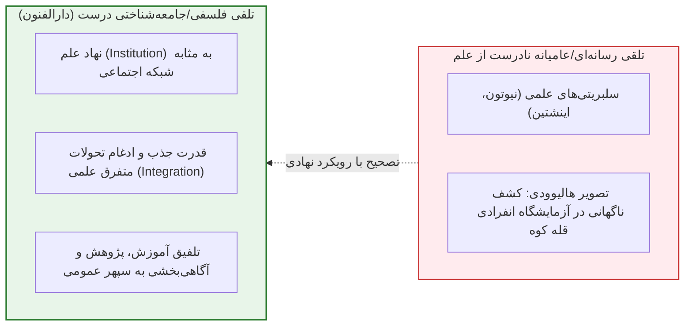

> [!warning] تله تستی درباره نخستین‌ها در تاریخ علم ایران
> در تاریخ‌نگاری علم باید به **نخستین‌ها و اسامی پدر علم** مشکوک بود. دارالفنون نه مبدأ آغاز علم در ایران است و نه حتی مبدأ آموزش علم؛ زیرا پیش از آن آموزش‌های سنتی، طبابت بومی و اعزام‌های متعدد دانشجو به فرنگ وجود داشته است.

---

## 2. پیشینه و سیر زمانی اعزام دانشجویان به اروپا (پیش‌درآمد دارالفنون)

* **سال‌های ۱۸۱۱ و ۱۸۱۵ میلادی (عصر فتحعلی‌شاه و عباس‌میرزا قاجار):** اعزام هدفمند محصلان به فرنگ نزدیک به ۳۵ تا ۴۰ سال پیش از افتتاح دارالفنون:
  * **محمدکاظم نقاش‌باشی:** اعزام جهت تحصیل *هنر نقاشی* (متوفی در فرنگ ۲ سال پس از اعزام و بازنگشته به میهن).
  * **میرزا حاجی‌بابای افشار:** تحصیل ۱۰ ساله در رشته *پزشکی*؛ بازگشت به کشور (موضوع مناقشات تاریخی پیرامون انطباق وی با کتاب طنز «حاجی‌بابای اصفهانی» اثر *جیمز موریه*).
  * **اعزام دوم (گروه ۵ نفره):** تحصیل در رشته‌های *تاریخ*، *پزشکی*، *مهندسی*، *شیمی* و *توپخانه*.

---

## 3. کالبدشناسی تأسیس و افتتاح دارالفنون

> [!abstract] انگیزه بنیادین امیرکبیر (میرزا تقی‌خان فراهانی)
> استعمارستیزی و رفع حوائج اساسی کشور؛ جلوگیری از نفوذ بیگانگان با تربیت متخصصان بومی به منظور جانشینی اساتید خارجی پس از تکمیل دوره‌های عالی؛ آگاهی از ضعف مفرط نظامی قشون ایران در جنگ‌ها علی‌رغم دلاوری رزمندگان.

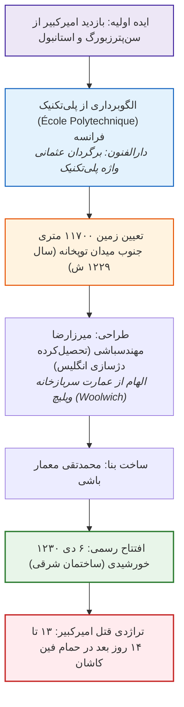

> [!important] روز افتتاح دارالفنون به روایت اعتمادالسلطنه
> شاه در غیاب امیرکبیر (که در تبعید کاشان به سر می‌برد) پیش از عزیمت به شکار وارد مدرسه شد و *میرزا محمدعلی‌‌خان* (وزیر امور خارجه) از وی با جشنی مفصل استقبال نمود.

---

## 4. ساختار آموزشی: شعبه‌ها، معلمان و سیاست استخدام اتریشی‌ها

### مدارس هفت‌گانه اولیه دارالفنون
1. **مدرسه طب**
2. **مدرسه داروسازی (دواسازی)**
3. **مدرسه جراحی**
4. **مدرسه توپخانه**
5. **مدرسه پیاده‌نظام**
6. **مدرسه سواره‌نظام**
7. **مدرسه معدن (کانی‌شناسی)**
*(در کنار این شعب اصلی، آموزش‌های جنبی ریاضیات، مهندسی و بعدها موسیقی و نقاشی نیز ارائه می‌شد).*

### راهبرد ضدجاسوسی امیرکبیر و گزینش اساتید اتریشی
* **بدبینی سیاسی:** امیرکبیر به دلیل مداخلات استعماری پزشکان پیشین دربار (نظیر *مک‌نیل* و *کورمیک* انگلیسی) به کادر انگلستان، روسیه و فرانسه بی‌‌اعتماد بود.
* **ماموریت داوودخان مسیحی:** اعزام به اتریش برای استخدام اساتید بی‌طرف؛ استخدام نخستین گروه شامل **۶ استاد اتریشی**.
* **تعهدنامه حقوقی بی‌سابقه:** امضای التزام‌نامه رسمی توسط معلمان اتریشی مبنی بر **منع مطلق مراجعه به سفارتخانه‌های خارجی** در صورت بروز هرگونه اختلاف، و تعهد به ارجاع انحصاری مسائل به **دولت ایران**.

### چندرشتگی (Multidisciplinary) معلمان اولیه دارالفنون

| نام استاد | تخصص اصلی دانشگاهی | دستاوردها و اقدامات فرارشته‌ای در ایران |
| :--- | :--- | :--- |
| **آگوست کرشیش (Krziž)** | مهندس و معلم توپخانه | احداث خط تلگراف ایران، نقشه‌برداری نخستین نقشه جامع تهران، سنجش دقیق ارتفاع قله دماوند، پیشگام عکاسی |
| **دکتر یاکوب ادوارد پولاک (Polak)** | جراح و آسیب‌شناس | تدریس تشریح و پزشکی نوین، نگارش کتب پزشکی، علایق ادبی، ایران‌شناسی |
| **فوکتی (Focchetti)** | داروساز و شیمیدان | معلم داروسازی و شیمی، فعالیت‌های حرفه‌ای در عکاسی |
| **دکتر ارنست کلوکه (Cloquet)** | پزشک فرانسوی دربار | پزشک ناصرالدین‌شاه پیش از دارالفنون؛ آموزش تکنیک‌های طب فرنگی در منزل شخصی |

---

## 5. پارادوکس آموزشی و گذار از «مکتب‌‌خانه» به «دیسیپلین آکادمیک»

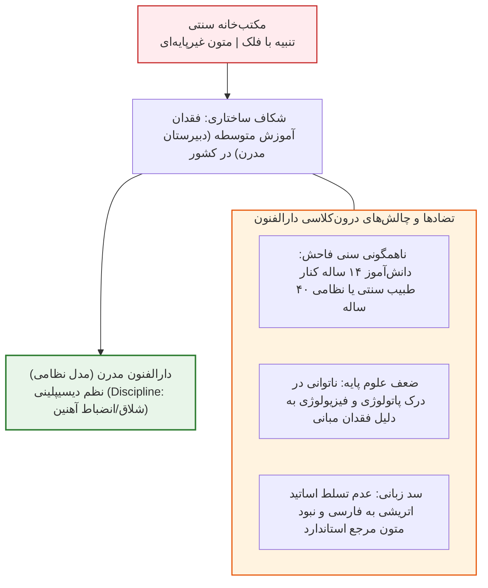

> [!tip] حکایت تستی ادیب‌الدوله و ملیجک (اقتدار دیسیپلین)
> واژه *دیسیپلین* در اصلِ ریشه‌شناختی خود معنای تازیانه و انضباط سخت پادگانی دارد. *ادیب‌الدوله* (ناظم سخت‌‌گیر دارالفنون) گوش *ملیجک* را به جرم شکستن شیشه‌های مدرسه کشید؛ ناصرالدین‌شاه در پاسخ به شکایت ملیجک گفت: **«من خودم هم از ادیب‌الدوله می‌‌ترسم!»**

---

## 6. تطور معکوس، شبکه‌سازی و میراث‌داری مدارس

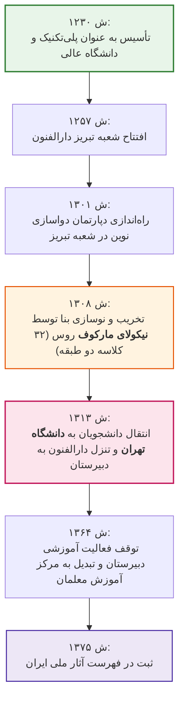

> [!important] طنز تاریخی در سرنوشت دارالفنون (سیر قهقرایی)
> دارالفنون برعکس تمام نظام‌های جهان تکامل یافت؛ یعنی **از دانشگاه عالی آغاز شد و به دبیرستان و سپس مرکز تربیت‌معلم تنزل یافت**؛ تا جایی که امروزه بحث پذیرش مجدد دانش‌آموز برای حفظ فیزیکی بنا مطرح است!

### زنجیره گسترش نهاد آموزش مدرن
* **مدارس میسیونری:** مدارس هیئت‌های مذهبی مسیحی در ارومیه، تبریز، اصفهان و سلماس.
* **میرزا حسن رشدیه (۱۲۶۵ ش):** راه‌اندازی مدارس نوین با تخته‌سیاه، میز، گچ و نیمکت در تبریز، مشهد و تهران متناسب با بستر بومی.
* **تأسیس انجمن معارف (۱۲۷۵ ش):** ۱۰ سال پس از مدارس رشدیه، توسط امین‌الدوله برای قانون‌مند کردن مدارس که منجر به تصویب *قانون معارف* و شالوده‌ریزی **وزارت آموزش و پرورش** شد.

---

## 7. هنر، تئاتر، ورزش و جنبش اصطلاح‌شناسی در دارالفنون

* **حضور هنر در بطن دارالفنون:**
  * **میرزا علی‌اکبر خان مزین‌الدوله:** استاد نقاشی دارالفنون، بنیان‌گذار نخستین تئاترهای مدرسه و استاد مستقیم *کمال‌الملک*.
  * دارالفنون واجد سالن اجرای تئاتر و فعالیت‌های ورزشی رسمی (پیشگام برنامه‌های فوق‌برنامه مدرن) بود.
* **نجات مالی مدرسه طب به روایت دکتر حسین گل‌گلاب:** در بحران مالی دهه ۱۲۹۰ خورشیدی (قحطی، وبا و جنگ جهانی)، احمدشاه قاجار تنها ۲۰۰۰ تومان به *لقمان‌الدوله* کمک کرد؛ دانشجویان و پزشکان مدرسه طب **نمایشنامه‌ای در زیر گراند هتل تهران اجرا کرده و ۵۰۰۰ تومان گردآوری نمودند** تا هزینه‌های جاری مدرسه تأمین شود.
* **جنبش اصطلاح‌سازی نوین علمی (واژه‌گزینی):**
  * معلمان خارجی برای رفع معضل آموزش، ناچار به یادگیری فارسی و تدوین متون شدند.
  * **فرهنگ دارویی و پزشکی شلیمر (Schlimmer):** واژه‌نامه‌ای قطور بالغ بر **۷۰۰ صفحه** که افزون بر اصطلاحات تشریحی و درمانی، مفاهیم اخلاقی، روان‌شناختی، جامعه‌شناختی (نظیر واژه حسادت) و زبان عمومی را در بر می‌گیرد.
  * **فرهنگ ناظم‌الاطباء (میرزا علی‌اکبر خان نفیسی):** گامی دیگر در مسیر استانداردسازی زبان علم مدرن.

---

## 8. خوانش انتقادی: آسیب‌شناسی دارالفنون و آموزش عالی معاصر

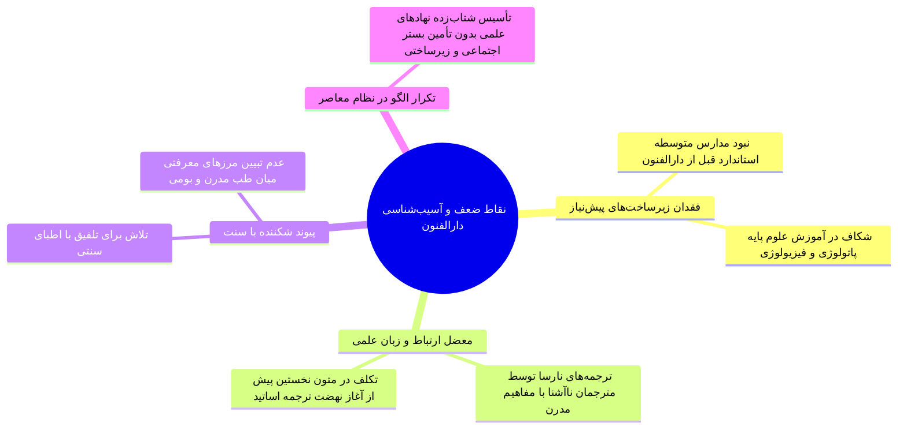

> [!abstract] مفاخر و دانش‌آموختگان نامدار دارالفنون
> * **اساتید و مدرسان برجسته:** ملک‌الشعرای بهار، حسین گل‌‌گلاب، جلال آل‌احمد، شمس آل‌احمد.
> * **فارغ‌التحصیلان تأثیرگذار:** دکتر محمد قریب (پدر طب اطفال ایران)، دکتر محمد معین (صاحب فرهنگ معین)، پروفسور محمود بهزاد/فرود، جلال و شمس آل‌احمد.

# جلسه هشتم: جامع مفاخر علمی، جهان‌بینی فردوسی (شاهنامه) و حکمت انسانی سعدی (گلستان و بوستان)

## 1. میراث تمدنی، دانشمندان ذوفنون و ارکان چهارگانه ادبیات فارسی

> [!abstract] تعریف ذوفنون و اصطلاح تاریخی «معلم»
> * **ذوفنون (جامع‌الاطراف):** اندیشمندانی مسلط بر تمامی یا اکثر علوم عصر (فلسفه، ریاضی، نجوم، طب، جغرافیا، تاریخ، نظریه‌پردازی).
> * **معلم در اصطلاح کهن:** علاوه بر معنای تدریس، به فرد جامع همه دانش‌های زمان اطلاق می‌شده است؛ *ارسطو* ملقب به **معلم اول** و *ابونصر فارابی* ملقب به **معلم ثانی**.

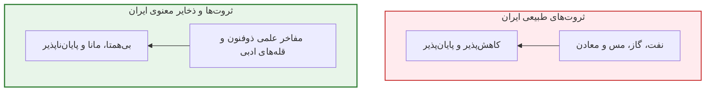

### آمار تالیفات مفاخر علمی ایران

| نام دانشمند | طول عمر تقویمی | تعداد تالیفات موثق | حوزه‌های بارز دانشی |
| :--- | :--- | :--- | :--- |
| **ابوریحان بیرونی** | - | **۱۳۱ کتاب** | نجوم، ریاضیات، مردم‌شناسی، تاریخ، جغرافیا |
| **ابوعلی سینا** | **۵۸ سال** (عمر کوتاه) | **۱۲۰ کتاب** | فلسفه، طب (*قانون*)، منطق، علوم طبیعی |
| **محمد بن زکریای رازی** | **۶۲ سال** | **۱۹۸ کتاب** *(به روایتی ۲۳۷ کتاب)* | طب، داروسازی، شیمی، فلسفه |
| **ابونصر فارابی** | - | **حداقل ۱۰۰ کتاب** | فلسفه مشاء، منطق، موسیقی، سیاست مدن |

> [!tip] منبع مرجع امتحانی بزرگان علم
> برای کسب اطلاعات مشروح و مستند درباره احوال این دانشمندان: **دایرةالمعارف مصاحب** (*نخستین دایرةالمعارف نظام‌مند به زبان فارسی* زیر نظر دکتر غلامحسین مصاحب).

### خطابه تاریخی هانری ماسه (دانشگاه سوربن فرانسه)

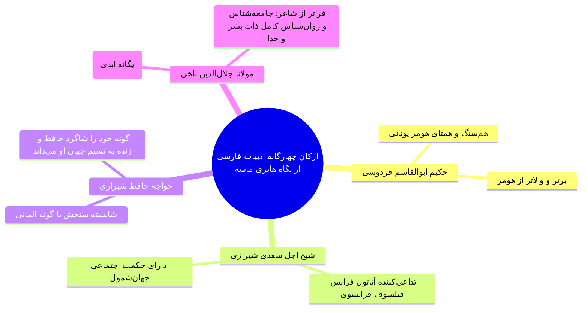

---

## 2. حکمت‌شناسی و اخلاق انسانی در شاهنامه فردوسی

> [!abstract] شاهنامه؛ کتاب خرد و فراتر از رزم
> شاهنامه صرفاً کتاب رزم و سلحشوری نیست؛ بلکه **سند هویت و ملیت ایرانیان**، **احیاگر زبان فارسی**، کتاب **دینداری، نیکوکاری، خردورزی، صلح و آشتی، جوانمردی، دادگری و عاطفه انسانی** است. فردوسی یکی از **سه پیامبر شعر فارسی** محسوب می‌شود.


> [!important] کلیدواژه اصیل «گشاده‌دلی» در زبان فردوسی
> فردوسی واژه **گشاده‌دلی** را به عنوان معادل دقیق و اصیل پارسی برای اصطلاح عربی **سِعَة صدر** به کار برده است (*مولانا نیز در مثنوی از این تعبیر اقتباس نموده است*).

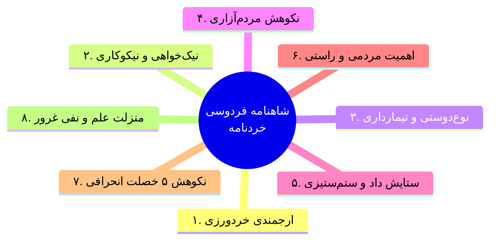

### تحلیل ابیات و شواهد هشت‌گانه جهان‌بینی فردوسی

1. **ارجمندی خردمندی و خردورزی (خردنامه):**
   * خرد سرچشمه تمامی نیکی‌ها و برتر از همه‌چیز؛ حتی **برتر از عدل و داد**:
     > *«تو چیزی مدان کز خرد برتر است / خرد بر همه نیکویی‌ها سر است»*
     > *«خرد برتر از هر چه ایزد بداد / ستایش خرد را بَه از راه داد»*
     > *«نیاید ز بد مرد، کردار نیک / نباید ز ما هیچ کردار زشت (نیاید ز خرد کار بد)»*
2. **منزلت والای نیک‌خواهی و نیکوکاری:**
   * یادآوری ناپایداری جهان و تمثیل تخم نیکی:
     > *«کجا آن گزیده نیاکان ما؟ / کجا آن دلیران و پاکان ما؟*
     > *همه خاک دارند بالین و خشت / خنک آنکه جز تخم نیکی نکشت»*
   * بدکاری نشانه **دیوصفت بودن** است:
     > *«تو مَردیو را مردمِ بد شناس / کسی کو ندارد ز یزدان سپاس*
     > *هر آن کو گذشت از ره مردمی / ز دیوان شِمُر، مشمُر از آدمی»*
   * فرجام بدکاری تباهی و نام بد است (*نَقنَوی: سر نمی‌آوری و به سر نمی‌رسد*):
     > *«مکن بد که بینی به فرجام بد / ز بد گردد اندر جهان نام بد*
     > *وگر بد کنی جز بدی ندروی / شبی در جهان شادمان نقنوی»*
   * پیروی از منشور کهن ایرانی (*پندار نیک، گفتار نیک، کردار نیک* - *آهو: عیب و نقص*):
     > *«به دل نیز اندیشه بد مدار / بداندیش را بد بود روزگار*
     > *چو گفتار و کردار نیکو کنی / به گیتی روان را بی‌آهو کنی»*
   * اصل اخلاقی طلایی (آنچه بر خود می‌پسندی بر دیگران بپسند):
     > *«بدو گفت شو دور باش از گناه / جهان را همه چون تن خویش خواه*
     > *هر آن چیز کانت نیاید پسند / تن دوست و دشمن در آن بر مبند»*
   * پاسخ بدی با نیک‌رفتاری و بردباری (نفی مقابله‌به‌مثل کور):
     > *«کسی گر بد کند بردباری کنیم / چو رنج آیدش بیش‌یاری کنیم»*
3. **نوع‌دوستی و غمخواری ضعیفان:**
   * رنج کشیدن برای آسایش دیگران مایه شادمانی واقعی است:
     > *«تو را زین جهان شادمانی بس است / کجا رنج تو بهر دیگر کس است»*
   * ثروتمندی و توانگری در شاد کردن درویشان و بستگان (*مردم خویش: اقوام و اطرافیان*):
     > *«توانگر شوی گر تو درویش را / کنی شادمان مردم خویش را»*
4. **نکوهش مردم‌آزاری و حیوان‌آزاری:**
   * نیکی و بی‌آزاری تنها شرط رستگاری:
     > *«به نیکی گرای و میازار کس / ره رستگاری همین است و بس»*
     > *«خداوند را دانی اندر نهان / مبادا بدی کردن آیین ما (میازار کس را در این جهان)»*
   * نکوهش شدید حیوان‌آزاری (*کهان: خردسالان/فرودستان | مهان: بزرگان*):
     > *«به نزد کهان و به نزد مهان / به آزار موری نیرزد جهان»*
5. **ستایش دادگرایی و ستم‌ستیزی:**
   * دادخواهی زیربنای سعادت جامعه:
     > *«به جز داد و خوبی مکن در جهان / پناه کهان باش و پشت مهان»*
     > *«تو را ایزدی زور پیلان که داد؟ / دل و هوش و فرهنگ و فرّخ‌نژاد*
     > *بدان داد تا دست فریادخواه / بگیری برآری ز تاریک‌چاه»*
   * تبارشناسی معنوی فریدون فرخ (عدالت و بخشش):
     > *«فریدون فرخ فرشته نبود / به عود و به عنبر سرشته نبود*
     > *ز داد و دِهش یافت این نیکویی / تو داد و دهش کن فریدون تویی»*
     > *«جهاندار نپسندد از ما ستم / که باشیم شادان و دهقان دُژَم»*
6. **اهمیت مردمی و جوانمردی:**
   * ماندگاری خصلت انسانیت در گیتی:
     > *«جهان یادگار است و ما رفتنی / به گیتی نماند به جز مردمی»*
     > *«هنر مردمی باشد و راستی / ز کژی بُوَد کژّی و کاستی»*
7. **نکوهش پنج رذیله بازدارنده از راستی (داستان پادشاهی قباد):**
   > *«بپیچاند از راستی پنج چیز / که دانا بر این پنج نفزود نیز:*
   > *کجا **رَشک** و **خشم** است و **کین** و **نیاز** / به پنجم که گردد بر او چیره **آز**»*
8. **منزلت علم‌آموزی مستمر و پرهیز از غرور علمی:**
   * پیوند دانش با توانمندی و جوانی روح:
     > *«توانا بود هر که دانا بود / ز دانش دل پیر برنا بود»*
     > *«میاسای زآموختن یک زمان / ز دانش میفکن دل اندر گمان»*
   * باد غرور نشانه اوج نادانی:
     > *«هر آن گه که گویی رسیدم به جای / نباید دگر هیچم اندر سرای (نباید به گیتی مرا رهنمای)*
     > *چنان دان که نادان‌ترین کس تویی / که تو گفتار دانندگان نشنوی»*

---

## 3. جایگاه و مرزگستری جهانی سعدی شیرازی

> [!abstract] القاب و شأن جهانی سعدی
> ملقب به **شاعر همه زمان‌ها**، **شاعر جهانی**، **شاعر انسانیت** و **خداوند اندیشه و سخن**؛ به تعبیر *ملک‌الشعرای بهار*:
> *«سعدیا چون تو کجا نادرگفتاری هست؟ / یا چو شیرین‌سخنت لعل گهرباری هست؟»*

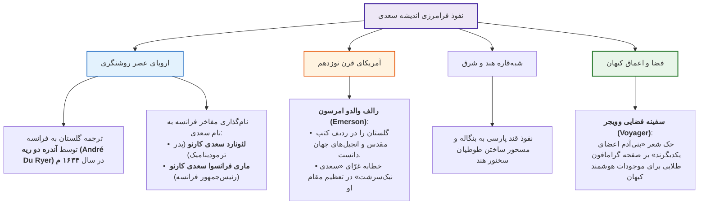

> [!tip] پیام فارسی لوح طلایی فضاپیمای وویجر
> حدود ۵۰ سال پیش دو صفحه گرامافون بر سفینه وویجر تعبیه شد؛ حاوی پیام دبیرکل سازمان ملل متحد و پیام صوتی فارسی: **«درود بر ساکنان کرات آسمانی»** و ابیات شاهکار سعدی: *«بنی‌آدم اعضای یکدیگرند / که در آفرینش ز یک گوهرند»* (نزدیک به ۸۰۰ سال پیش از صدور اعلامیه جهانی حقوق بشر).

---

## 4. کالبدشکافی گلستان: بلاغت ایجاز و کلمات قصار

> [!abstract] ساختار فنی گلستان
> مکتوب در **۸ باب** با نثری آراسته به **ایجاز اعجازآمیز** (کمترین واژگان، بیشترین معنای ممکن بدون کوچک‌ترین اخلال در ادراک) آمیخته با اشعار متناسب. **باب هشتم** عمدتاً مشتمل بر **کلمات قصار و آداب صحبت** است.

### چهار حکایت برگزیده گلستان

1. **پارسا و پادشاه ظالم:** پادشاهی از عابدی پرسید کدام طاعت برتر است؟ گفت: *«تو را خواب نیمروز تا در آن یک دم خلق را نیازاری!»*
2. **پادشاه و یاد خدا:** شاهی به درویشی گفت: هیچت از ما یاد آید؟ گفت: *«بلی، وقتی که خدا را فراموش می‌کنم!»*
3. **پاسخ پارسا به غیبت‌کننده:** شخصی عابدی را طعنه زد؛ پارسا گفت: *«بر ظاهرش عیب نمی‌بینم و در باطنش غیب نمی‌دانم.»*
4. **پهلوان نابردبار:** زورآزمایی قوی‌هیکل از دشنامی خشمگین شد؛ صاحبدلی گفت: *«این فرومایه هزار من سنگ برمی‌دارد و طاقت سخنی نمی‌آورد!»*
5. **شکر پای‌افزار در جامع کوفه:** *«هرگز از دور زمان ننالیده بودم... مگر وقتی که پایم برهنه بود و استطاعت پای‌پوشی نداشتم. به جامع کوفه درآمدم، دلتنگ؛ یکی را دیدم که پای نداشت! سپاس حق به جای آوردم و بر بی‌کفشی خود صبر کردم.»*

### گنجینه کلمات قصار باب هشتم گلستان

* **فلسفه مال و ثروت:** *«مال از بهر آسایش عمر است، نه عمر از بهر گرد کردن مال.»*
* **تعریف نیکبختی و شقاوت:** *«نیکبخت آن که خورد و کشت [انفاق کرد] و بدبخت آن که مرد و هشت [بر جا گذاشت].»*
* **رنج بیهوده دو گروه:** *«یکی آن که اندوخت و نخورد، و دیگر آن که آموخت و نکرد.»* (*عالم بی‌عمل به زنبور بی‌عسل ماند*).
* **انطباق سخن سعدی با دکارت:** 
  * *سعدی:* *«همه کس را عقل خود به کمال نماید و فرزند خود به جمال.»*
  * *رنه دکارت فرانسوی:* انسان‌ها از کمبود همه نعمات جهان شاکی‌اند، جز عقل؛ زیرا همگان بهره خود از عقل را کامل و بی‌نقص می‌دانند!
* **قناعت در برابر حرص:** *«حریص با جهانی گرسنه است و قانع به نانی سیر.»* | *«اگر شب‌ها همه قدر بودی، شب قدر بی‌قدر بودی.»*
* **ارزش ایثار بر زهد ریایی:** *«جوانمردی که بخورد و بدهد، بهْ از عابدی که روزه دارد و بنهد.»*
* **ستاریت الهی در برابر خشم خلق:** *«حق تعالی می‌بیند و می‌پوشد، و همسایه نمی‌بیند و می‌خروشد.»*
* **دعای درویش در حق بدان:** *«یا رب بر بدان رحمت کن؛ که بر نیکان خود رحمت کرده‌ای که مریشان را نیک آفریده‌ای!»*
* **بخل و ممسکی:** *«زر از معدن به کان کندن به درآید و از دست بخیل به جان کندن!»*
* **ستم بر زیردستان:** *«هر که بر زیردستان نبخشاید، به جور زبردستان گرفتار آید.»*
* **رشوه و طمع قاضی:** *«همه کس را دندان به ترشی کُند شود، مگر قاضی را که به شیرینی!»*
* **پرهیز از همنشین بد:** *«هر که با بدان نشیند، اگر نیز طبیعت ایشان در او اثر نکند، به طریقت ایشان متهم گردد؛ و اگر به خراباتی رود به نماز کردن، منسوب شود به خمر خوردن!»*
* **روان‌شناسی حسود:** *«حسود از نعمت حق بخیل است و بنده بی‌گناه را دشمن می‌دارد... توانم آن که نیازارم اندرون کسی / حسود را چه کنم کو ز خود به رنج در است؟»*
* **حفظ پیوند دوستی:** *«دوستی را که به عمری فراچنگ آرند، نشاید که به یک دم بیازارند.»*
* **آداب حفظ راز:** *«هر آن سِری که داری با دوست در میان منه، چه دانی که وقتی دشمن گردد؟ و هر گزندی که توانی به دشمن مرسان، که باشد که وقتی دوست شود.»* | *«رازی که نهان خواهی با کس در میان منه، گرچه دوست مخلص باشد؛ که مر آن دوست را نیز دوستان مخلص باشد، همچنین مسلسل!»*
* **آسیب‌شناسی درونی خشم:** *«آتش خشم اول در خداوند خشم [فرد عصبانی] افتد، پس آنگه زبانه به خصم رسد یا نرسد!»*

---

## 5. کالبدشکافی بوستان (سعدی‌نامه): مدینه فاضله و مروت اخلاقی

> [!abstract] ساختار و بن‌مایه بوستان
> منظومه‌ای در **۱۰ باب** بر وزن مثنوی حماسی شاهنامه (*فعولن فعولن فعولن فعل*)؛ تجلی‌گاه **کرامت، گذشت، مروت، ایثار و نفی انانیت (خودخواهی)** انسان در عالی‌ترین تراز شاعرانه.

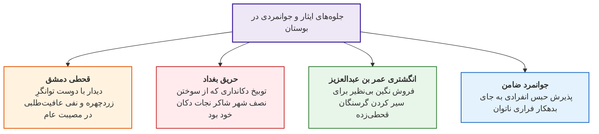

### داستان‌های نمادین ایثار در بوستان

1. **مرد خدا و دکان مگس‌گرفته:** خرید از بقال بی‌رونق محله برای دستگیری از کاسب ورشکسته و تذکر به همسر معترض که او به امید سود از ما دکان باز نگه داشته است.
2. **پیرمرد و پاسداشت دانگ سیم:** به خطر انداختن جان با دروغ مصلحت‌آمیز برای نجات جوانی محکوم به اعدام، به پاداش یک دانگ پولی که سال‌ها پیش به او بخشیده بود.
3. **حاتم طایی و فرستاده قیصر روم:** ذبح اسب بی‌همتا پیش از آگاهی از نیت مهمان که برای طلب همان اسب آمده بود.
4. **دختر حاتم طایی و قبیله اسیر:** ترجیح دادن مرگ بر اسارت قوم (*«مرا نیز با جمله گردن بزن / مروت نبینم رهایی ز بند / به تنها و یاران من اندر کمند»*) که موجب بخشش کل اسیران شد.
5. **ماجرای قحطی دمشق:** سعدی از دوست توانگرش پرسید تو چرا از لاغری زردچهر شده‌ای در حالی که تریاق داری و از طوفان برکناری؟ دوست دانا (*فقیه*) پاسخ داد:
   > *«نگه کرد رنجیده در من فقیه / نگه کردنِ عاقل اندر سفیه*
   > *که: مرد ارچه بر ساحل است ای رفیق / نیاساید و دوستانش غریق*
   > *من از بی‌مرادی نِیم روی‌‌زرد / غم بی‌مرادان دلم خسته کرد!»*
6. **ماجرای حریق بغداد:** نکوهش دکاندار خودخواه که از مصون ماندن دکانش در آتش‌سوزی شاد بود:
   > *«تو را خود غم خویشتن بود و بس / پسندی که شهری بسوزد به نارس؟*
   > *به جز سنگ‌دل نانکند معده تنگ / چو بیند کسان بر شکم بسته سنگ؟»*
7. **نگین انگشتری خلیفه عمر بن عبدالعزیز:** فروش نگین گران‌قیمت در قحطی برای درماندگان و پاسخ به سرزنش معترضان:
   > *«مرا شاید انگشتری بی‌نگین / نشاید دل خلق، اندوهگین*
   > *خُنُک آن که آسایش مرد و زن / گزیند بر آرام و رنج تن (بر آرامش خویشتن)»*
8. **ضمانت و فداکاری جوانمرد:** پذیرش حبس بدهکار بی‌پناه و یاری به فرار او:
   > *«یکی ناتوان دیدم از بند، ریش / خلاصش ندیدم به جز بند خویش*
   > *ندیدم به نزدیک رأیم پسند / من آسوده و دیگری پای‌بند!»*

---

## 6. ماتریس مقایسه تطبیقی شاهکارهای دوقلوی سعدی

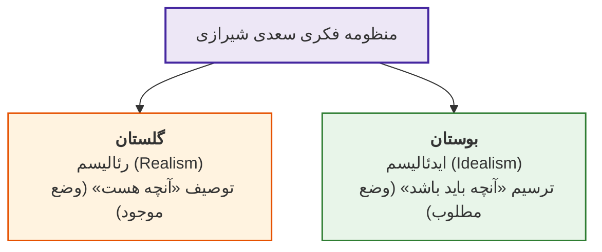

### جدول تمایزات ساختاری و محتوایی بوستان و گلستان

| مؤلفه ارزیابی | گلستان سعدی | بوستان (سعدی‌نامه) |
| :--- | :--- | :--- |
| **قالب ادبی غالب** | **نثر مسجع و آهنگین** آمیخته به ابیات منظوم شاهد | **نظم مطلق** در قالب مثنوی (*بحر متقارب مثمن*) |
| **رویکرد فلسفی-شناختی** | **واقع‌گرایی (رئالیسم)** و عمل‌گرایی اجتماعی | **آرمان‌گرایی (ایدئالیسم)** و ترسیم مدینه فاضله |
| **تصویرسازی از جامعه** | توصیف عریان **«وضعیت موجود»** با ضعف‌ها و رذایل | ترسیم کمال‌یافته **«وضعیت مطلوب»** و مکارم اخلاق |
| **تقسیم‌بندی ابواب** | مشتمل بر **۸ باب** (باب هشتم کلمات قصار) | مشتمل بر **۱۰ باب** در مواعظ، عدل، احسان و عشق |
| **جهت‌گیری غایی سعدی** | نقد ظرایف تعاملات روزمره بشری | **غلبه تراز انسانیت، ایثار و مروت بر سراسر تفکر او** |

> [!important] تله تستی پیرامون تعادل فلسفی سعدی
> اگرچه اندیشه سعدی میان دو قطب *رئالیسم* (گلستان) و *ایدئالیسم* (بوستان) در نوسان است، اما در تحلیل نهایی **آرمان‌گرایی، نوع‌دوستی و گرایش‌های والای انسانی بر ساختار کلی منظومه فکری وی کاملاً غلبه دارد.**


# جلسه نهم: جهان‌بینی و اخلاق انسانی حافظ؛ شاهکارهای معارف، پیشگامی روانکاوی و تحلیل روان‌شناختی مولانا

## 1. شأن تاریخی، القاب و نفوذ جهانی خواجه حافظ شیرازی

> [!abstract] جایگاه حافظ در حافظه تاریخی ایرانیان
> خواجه شمس‌الدین محمد حافظ شیرازی ملقب به **لسان‌الغیب** و **ترجمان‌الاسرار**؛ **حافظه تاریخی ایرانیان** و محرم‌ترین همدم روحی جامعه. دیوان وی **پرفروش‌ترین و پرخواننده‌ترین کتاب ایران پس از قرآن کریم** است و پای ثابت آیین‌های تحویل سال نو (سفره هفت‌سین) و خطبه عقد (سفره عقد) به شمار می‌رود.

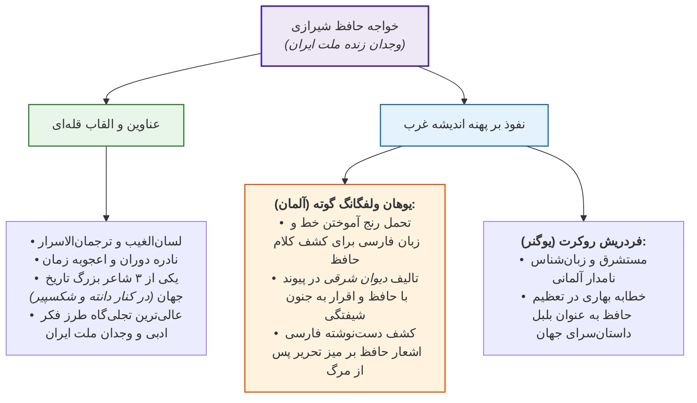

> [!important] دست‌نوشته تاریخی گوته پس از مرگ
> بر روی میز تحریر گوته پس از مرگ، کاغذی با خط نوآموزانه فارسی کشف شد که این دو بیت حافظ بر آن نقش بسته بود:
> *«خوش‌تر از کوی خرابات ندیدم جایی / گر به پیران سرم دست دهد ماوایی*
> *آرزو می‌کُشدم از تو چه پنهان دارم / شیشه باده و کنجی و رخ زیبایی»*
> و داوری او در کتاب *دیوان شرقی*: **«ای حافظ! سخن تو همچون ابدیت بزرگ است؛ زیرا آن را آغاز و انجامی نیست... از وقتی این شخصیت عجیب قدم در زندگی‌ام گذاشته، دارم دیوانه می‌شوم!»**

---

## 2. کالبدشکافی اندیشه اخلاقی و جهان‌شمول حافظ (۱۱ سرفصل کلیدی)

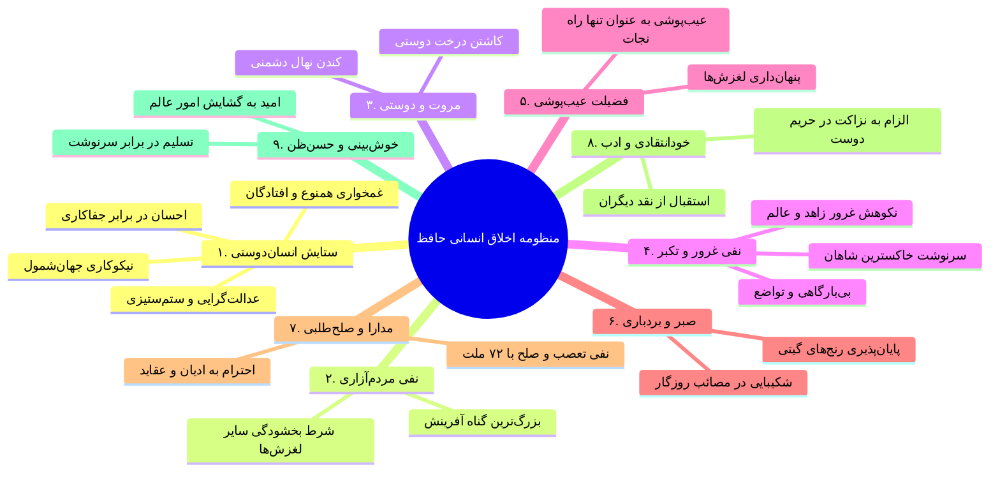

### تحلیل ابیات و شواهد یازده‌گانه اندیشه حافظ

1. **انسان‌دوستی و بشردوستی فراملی و فرامذهبی:**
   * **الف) غمخواری برای همنوع و مستمندان:**
     > *«به ملازمان سلطان که رساند این دعا را؟ / که به شکر پادشاهی ز نظر مران گدا را»*
     > *«درویش نمی‌پرسی و ترسم که نباشد / اندیشه آمرزش و پروای ثوابت»*
     > *«ای توانگر خرم اگر رحم می‌کنی بر خوشه‌چینی...»*
     > *«آن کس که او افتاد خدایش بگرفت / عذر تو باد تا غم افتادگان خوریم»*
     > *«دائم گل این بستان شاداب نمی‌ماند / دریاب ضعیفان را در وقت توانایی»*
     
   * **ب) نیک‌خواهی و نیکوکاری عام‌المنفعه:**
     > *«ده روز دور گردون افسانه است و افسون / نیکی به جای یاران فرصت شمار یارا»*
     > *«بر این رواق زبرجد نوشته‌اند به زر / که جز نکویی اهل کرم نخواهد ماند»*
     > *«ز مهربانی جانان طمع مبر حافظ / که نقش جور و نشان ستم نخواهد ماند»*
     > *«گفتم هوای میکده غم می‌برد ز دل / گفتا خوش آن کسان که دلی شادمان کنند»*
     > *«مبین ز خلق که این یار و آن دگر یار است / به کشت عارف چو ابر نیسان باش»*
     
   * **ج) نیکی در قبال جفاکاری (احسان به جای مقابله‌به‌مثل):**
     > *«آن که پامال جفا کرد چو خاک راهم / خاک می‌بوسم و عذر قدمش می‌‌خواهم»*
     > *«بر تو خوانم ز دفتر اخلاق / آیتی در وفا و در بخشش*
     > *هر که بخراشدت جگر به جفا / همچو **کان کریم زر بخشش***
     > *کم مباش از **درخت سایه‌فکن** / هر که سنگت زند **ثمر بخشش***
     > *از **صدف** یادگیر نکته حلم / هر که ببُرد سرت **گوهر بخشش***»*
     > *«چو غنچه گر چه فروبستگی است کار جهان / تو همچو باد بهاری گره‌گشا می‌باش»*
     
   * **د) عدالت‌گرایی و ظلم‌ستیزی:**
     > *«شاه را بهْ بود از طاعت صدساله و زهد / قدر یک ساعت عمری که در او داد کند»*
     > *«دور فلکی یکسره بر منهج عدل است / خوش باش که ظالم نبرد راه به منزل»*
2. **نکوهش مردم‌آزاری (تنها گناه نابخشودنی):**
   * حافظ مردم‌آزاری را مهلک‌ترین رذیلت و بی‌آزاری را مایه بخشش همه خطاها می‌داند:
     > *«مباش در پی آزار و هر چه خواهی کن / که در شریعت ما غیر از این گناهی نیست»*
     > *«من از بازوی خود دارم بسی شکر / که زور مردم‌آزاری ندارم»*
3. **ستایش دوستی، الفت و مهرورزی:**
   * > *«درخت دوستی بنشان که کام دل به بار آرد / نهال دشمنی برکن که رنج بی‌شمار آرد»*
     > *«چنان پر شد فضای سینه از دوست / که فکر خویش گم شد از ضمیرم»*
4. **فروتنی و فرجام عبرت‌انگیز غرور:**
   * نفی بارگاه و تشریفات: *«هر که خواهد گو بیا و هر چه خواهد گو بگو / کبر و ناز و حاجب و دربان بدین درگاه نیست»*
   * تمثیل زیبای **تیر پرتابی** برای فرجام تکبر:
     > *«به بال و پر مرو از راه کز تیر پرتابی / هوا گرفت زمانی ولی به خاک نشست»*
   * نفی خودرأیی در جهان رندی: *«فکر خود و رای خود در عالم رندی نیست / کفر است در این مذهب خودبینی و خودرایی»*
   * تباهی پادشاهان مستبد پیشین:
     > *«کاوس و کی کجا رفتند؟ که واقف است که چون رفت تخت جم بر باد؟»*
     > *«بگذر ز کبر و ناز که دیده است روزگار / چین قبای قیصر و طرف کلاه کی»*
   * طعنه به غرور زاهدان و اهل علم:
     > *«تکیه بر تقوا و دانش در طریقت کافری‌ست / راهرو گر صد هنر دارد توکل بایدش»*
     > *«تا فضل و عقل بینی بی‌معرفت نشینی / یک نکته‌ات بگویم: خود را مبین که رستی!»*
5. **فضیلت عیب‌پوشی و نکوهش عیب‌جویی:**
   * پیر خرابات و نسخه رستگاری: *«به پیر میکده گفتم که چیست راه نجات؟ / بخواست جام و بگفت عیب‌پوشیدن!»*
   * ترجیح پوشیدگی خطاها: *«دی عزیزی گفت حافظ می‌خورد پنهان شراب / ای عزیز من! گناهان به که پنهانی بود»*
   * سرانجام شوم بدگویان: *«تو پنداری که بدگو رفت و جان برد؟ / حسابش با کرام‌الکاتبین است!»*
6. **ستایش حلم، بردباری و تاب‌آوری:**
   * پاسخ به دشنام با دعا: *«اگر دشنام فرمایی و گر نفرین دعا گویم / جواب تلخ می‌زیبد لب لعل شکرخا را»*
   * امیدواری به چرخش فلک: *«دور گردون گر دو روزی بر مراد ما نرفت / دائماً یکسان نباشد حال دوران غم مخور»*
   * ناپایداری رنج و شادی: *«چه جای شکر و شکایت ز نقش نیک و بد است؟ / چو بر صحیفه هستی رقم نخواهد ماند»*
   * عبور از مصائب: *«گرچه منزل بس خطرناک است و مقصد بس بعید / هیچ راهی نیست کان را نیست پایان، غم مخور»*
7. **احترام به عقاید و تساهل مذهبی:**
   * کشف سرّ حق در همه قلوب: *«گر پیر مغان مرشد ما شد چه تفاوت؟ / در هیچ سری نیست که سرّی ز خدا نیست»*
   * رهایی از بافتار تعصب: *«یکی از عقل می‌لافد یکی طامات می‌بافد / بیا کاین داوری‌ها را به پیش داور اندازیم»*
8. **دوری از ستیزه‌جویی و مجادله (صلح کل):**
   * پرهیز از جدل حتی با سخن دشمن: *«حافظ! گر خصم خطا گفت نگیریم بر او / ور به حق گفت، جدل با سخن حق نکنیم»*
   * دعوت به صلح: *«بیا که نوبت صلح است و دوستی و وفاق / که با تو نیست مرا جنگ و ماجرا حافظ»*
   * شرط ورود به رندی: *«در حلقه رندان خرابات میا / تا صلح ۷۲ ملت نکنی»*
   * ارزش بنیادین صلح: *«یک حرف صوفیانه بگویم اجازت است؟ / ای نور دیده صلح به از جنگ و داوری [دعوا و منازعه]»*
9. **انتقادپذیری و هنر خودانتقادی (رهایی از ریا):**
   * پذیرش بدون تکدر نقد دیگران: *«گفت: از حافظ ما بوی ریا می‌آید / آفرین بر نفست باد که خوش بردی بوی!»*
   * چشم‌پوشی از سرزنش ظاهرپرستان: *«زاهد ظاهرپرست از حال ما آگاه نیست / در حق ما هر چه گوید جای هیچ اکراه نیست»*
   * مقصر دانستن خویشتن: *«هر چه هست از قامت ناساز بی‌اندام ماست / ور نه تشریف تو بر بالای کس کوتاه نیست»*
   * اقرار به کاستی‌ها: *«سیاه‌نامه‌تر از خود کسی نمی‌بینم / چگونه چون قلمم دود دل به سر نرود؟»*
10. **رعایت ادب و عفت کلام:**
    * شرط حضور در حلقه باطن: *«قدم منه به خرابات جز به شرط ادب / که سالکان درش محرمان پادشهند»*
    * طرد انسان‌های بی‌ادب: *«حافظا علم و ادب ورز که در مجلس خاص / هر که را نیست ادب لایق صحبت نبود»*
11. **خوش‌بینی، حسن‌ظن و امید به آینده:**
    * گره‌گشایی روزگار: *«دلا چو غنچه شکایت ز کار بسته مکن / که باد صبح نسیم گره‌گشا دارد»*
    * خرسندی به مقدرات: *«رضا به داده بده وز جبین گره بگشای / که بر من و تو درِ اختیار نگشاده‌ست»*
    * نفی بدگمانی حسودان: *«دلا ز طعن حسودان مرنج و واثق باش / که بد به خاطر امیدوار ما نرسد»*
    * مژده دگرگونی گیتی: *«بوی بهبود ز اوضاع جهان می‌شنوم / شادی آورد گل و باد صبا شاد آمد / ای عروس هنر از بخت شکایت منما / حجله حسن بیارای که داماد آمد»*
    * ستاریت پیر مغان: *«نیکی پیر مغان بین که چو ما بدمستان / هر چه کردیم به چشم کرمش زیبا بود»*

---

## 3. جامعیت مولانا جلال‌الدین بلخی و معارف انسان‌شناختی او

> [!abstract] کالبد ابعاد وجودی مولانا
> سراینده بالغ بر **۸۰,۰۰۰ بیت** شعر عرفانی و صاحب تالیفات منثور نغز همچون **فیه مافیه**. او عارفی واصل، فیلسوف، متکلم، جامعه‌شناس و شگفت‌تر از همه، **پیشگام روانکاوی و ژرف‌پژوه تاریک‌خانه‌های روان انسان** است.

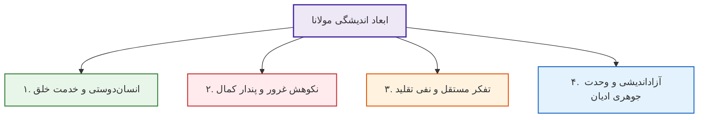

### آموزه‌های چهارگانه اخلاقی و معنوی مولانا

1. **انسان‌دوستی و همبستگی بنیادین بشر:**
   * انسان‌ها پاره‌های یکدیگرند (هم‌راستا با شعر سعدی):
     > *«گفت انسان پاره انسان بود / پاره‌ای از نان یقین که نان بود»*
   * جاودانگی خدمت و احسان به خلق:
     > *«مُحسن مردند و احسان‌ها بماند / ای خُنُک آن را که این مرکب براند!*
     > *ظالمان مردند و ماند آن ظلم‌ها / وای جانی کو کند مکر و دها!»*
     > *«گفت پیغمبر: خُنُک آن را که او / شد ز دنیا، ماند از او فعل نکو»*
   * اثر وضعی و آرامش درونی نیکی:
     > *«خیر کن با خلق، بهر ایزدت / یا برای راحت جان خودت!»*
   * پاداش نیکی و دفع بلا با کرامت:
     > *«چیست احسان را مکافات ای پسر؟ / لطف و احسان و ثواب معتبر*
     > *چاره دفع بلا نبود ستم / چاره احسان باشد و عفو و کرم»*
2. **فروتنی و پیکار با خودبزرگ‌بینی (تکبر):**
   * *جمله زرین دفتر پنجم مثنوی:* **«هیچ چشم‌‌زخمی آدمی را چنان مهلک نیست که چشم‌پسند خویشتن!»**
   * درد لاعلاج «پندار کمال» و تبارشناسی رذیله ابلیس (*أَنَا خَیْرٌ مِنْهُ*):
     > *«علتی [بیماری‌ای] بدتر ز پندار کمال / نیست اندر جان تو ای ذودلال*
     > *علت ابلیس «أنا خیری» بدست / وین مرض در نفس هر مخلوق هست»*
   * تمثیل سقوط از نردبان تکبر:
     > *«نردبان خلق این ما و منی‌ست / عاقبت زین نردبان افتادنی‌ست*
     > *هر که بالاتر رود ابله‌تر است / کـ[استخوان] او بتر خواهد شکست!»*
   * *تمثیل مگس، پر کاه و پیشاب درازگوش (دفتر اول):* مگسی بر پر کاهی روی قطره پیشاب خر نشسته و به پندار باطل، قطره را دریا، برگ کاه را کشتی و خود را ناخدا می‌پندارد:
     > *«آن مگس بر برگ کاه و بول خر / همچو کشتیبان همی‌افراشت سر*
     > *گفت: من دریا و کشتی خوانده‌‌ام / مدتی در فکر آن می‌مانده‌ام*
     > *اینک این دریا و این کشتی و من / مرد کشتیبان و اهل و رای‌زن!...»*
     > *«**عالمش چندان بود کَش بینش است / چشم چندین، بحر هم چندینش است!**»*
3. **استقلال فکری و دوری جستن از تقلید کورکورانه:**
   * تأکید بر مشاهده و تفکر بی‌واسطه:
     > *«چشم داری تو به چشم خود نگر / منگر از چشم سفیهی بی‌خبر*
     > *گوش داری تو به گوش خود شنو / گوش گولان را چرا باشی گرو؟»*
     > *«گرچه بالا می‌پرد مرغ هوات / مرغ تقلیدت به پستی می‌چرد*
     > *علم تقلیدی وبال جان ماست / عاریه‌ست و ما نشسته کانِ ماست!»*
     > *«از محقق تا مقلد فرق‌هاست / کین چو داوود است و آن دیگر صداست»*
4. **آزاداندیشی، مدارای دینی و وحدت جوهری ادیان:**
   * مولانا با وجود فقیه حنفی بودن، مظهر مدارا با مسیحیان و یهودیان بود. به تعبیر فرزندش *بهاءالدین محمد (سلطان ولد)*:
     > *«کرده او را مسیحیان محمود / دیده او را جهود چون داوود*
     > *عیسوی گفته اوست عیسی ما / موسوی گفته اوست موسی ما»*
   * فراروی از جنگ ۷۲ ملت:
     > *«ملت عشق از همه دین‌ها جداست / عاشقان را ملت و مذهب خداست»*
   * **تمثیل کعبه در کتاب فیه مافیه:** راه‌ها از روم، شام، عجم، چین، هند و یمن بسیار متفاوت است، اما هنگامی که به مقصود نگاه کنی، مقصد کعبه است و همه متفق و یگانه‌اند.
   * **تمثیل عمارت هزارخانه انبیا در فیه مافیه:** شکستن حرمت یک پیامبر، فروپاشی کل قصر ایمان است (*لا نُفَرِّقُ بَیْنَ أَحَدٍ مِنْ رُسُلِهِ*).

---

## 4. روان‌شناسی تجربی مولانا: سازوکار دفاعی فرافکنی (Projection)

> [!abstract] تعریف روان‌شناختی فرافکنی
> سازوکار دفاعی ناخودآگاه؛ انتساب قصورها، رذایل، انحرافات و خصلت‌های ناپسند درونی خود به دیگران. قرن‌ها پیش از تدوین نظام‌مند این اصطلاح توسط *زیگموند فروید* اتریشی، مولانا و سعدی به عمیق‌ترین وجه آن را صورت‌بندی نمودند.

* **روایت سعدی از فرافکنی:** *«خو بَد کردن و عیب دوستان دیدن / رسمی‌ست که سعدیا تو آوردی!»*
* **صورت‌بندی نبوغ‌آمیز مولانا:**
  > *«در هر که تو از دیده بد می‌نگری / از چنبره وجود خود می‌نگری!»*

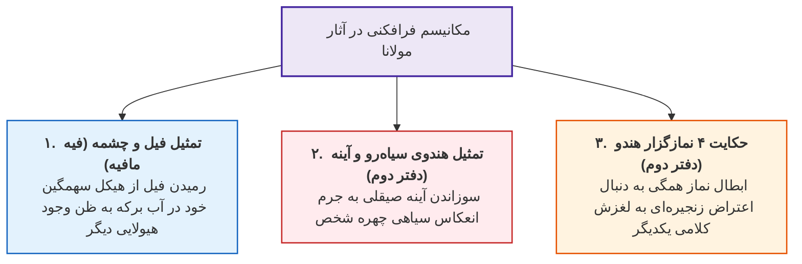

### تمثیل‌های سه‌گانه فرافکنی در کلام مولانا

1. **تمثیل فیل و چشمه آب (کتاب فیه مافیه):** فیل هنگام آب خوردن تصویر جثه مهیب خود را در آب دیده و وحشت‌زده می‌گریزد و می‌پندارد از هیولایی دیگر می‌رمد!
   > *«همه اخلاق بد از ظلم و کین و حسد و حرص و بی‌رحمی و کبر، چون در تو است نمی‌‌رنجی؛ چون آن را در دیگری می‌بینی، می‌رمی و می‌رنجی!»*
   > *«عالم همچون آینه است، نقش خود را در آن می‌بینی (المؤمن مرآة المؤمن)... آن عیب را از خود جدا کن، زیرا آنچه از او می‌رنجی، از خود می‌رنجی.»*
2. **تمثیل ۴ نمازگزار هندو در مسجد:**
   * نمازگزار اول با ورود مؤذن وسط نماز گفت: آیا اذان را بی‌موقع گفتی؟
   * نمازگزار دوم گفت: وسط نماز حرف زدی و نمازت باطل شد!
   * نمازگزار سوم به دومی گفت: چرا خودت وسط نماز حرف زدی و به او طعنه می‌زنی؟
   * نمازگزار چهارم گفت: الحمدلله که من مثل شما سه نفر در چاه نیفتادم و نمازم درست است!
   * *شاه‌بیت روان‌شناختی فرجام داستان:*
     > *«پس نماز هر چهاران شد تباه / **عیب‌گویان بیشتر گم‌کرده‌راه!***»
3. **تمثیل هندوی سیاه‌رو و افکندن آینه در آتش:** هندو با دیدن چهره سیاه خود در آینه برآشفت و آینه را در آتش افکند. آینه پاسخ داد:
   > *«گفت آیینه: گناه از من نبود / جرم آن کس نِه که روی من زدود*
   > *او مرا غماز کرد و راستگو / تا بگویم زشت کو و خوب کو»*
4. **شاهد منظوم در انتساب رذایل باطنی به دیگران:**
   > *«ای بسا ظلمی که بینی در کسان / خوی تو باشد در ایشان ای فلان!*
   > *اندر ایشان تافته هستی تو / از نفاق و ظلم و بدمستی تو*
   > *آن تویی و آن زخم بر خود می‌زنی / بر خود آن ساعت تو لعنت می‌کنی!»*

---

## 5. پیشگامی ۷۵۰ ساله مولانا در روش روانکاوی (Psychoanalysis)

> [!abstract] تحلیل روانی و سابقه تاریخی
> **روانکاوی (Psychoanalysis)** روش درمان اختلالات روانی از طریق واکاوی ناهشیار است که رسماً توسط *فروید* پایه‌گذاری شد. اما **۷۵۰ سال پیش از فروید**، مولانا در **حکایت کنیزک و پادشاه (دفتر اول مثنوی)** دقیقاً فرایند درمان روانکاوانه و سایکوفیزیولوژی مدرن را به نمایش گذاشت.

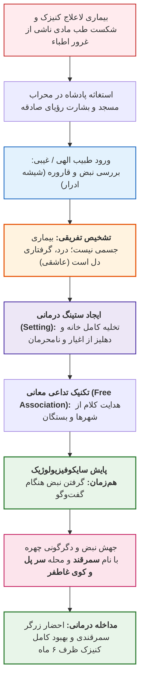

### عناصر بالینی و روانکاوانه داستان کنیزک و پادشاه

1. **کشف منشأ روان‌تنی (سایکوسوماتیک):** طبیب الهی با مشاهده احوال دریافت بیماری منشأ جسمی ندارد:
   > *«دید از زاریش کو زار دل است / تن خوش است و او گرفتار دل است*
   > *عاشقی پیداست از زاری دل / نیست بیماری چو بیماری دل»*
2. **برپایی اتاق درمان امن و محرمانه:**
   > *«گفت: ای شه خلوتی کن خانه را / دور کن هم خویش و هم بیگانه را*
   > *کس ندارد گوش در دهلیزها / تا بپرسم زین کنیزک چیزها»*
3. **تکنیک تداعی معانی آزاد و پایش نبض (سایکوفیزیولوژی):**
   > *«سوی قصه گفتنش می‌داشت گوش / سوی نبض و جستنش می‌داشت هوش»*
4. **برانگیختگی عاطفی در نقطه گره روانی (واکنش سمرقند):**
   > *«نبض جَست و روی سرخ و زرد شد / کز سمرقندی زرگر فرد شد*
   > *گفت: کوی او کدام است در گذر؟ / او **«سر پل»** گفت و **«کوی غاطفر»**»*
5. **فرجام درمانی:** با وصال معشوق (زرگر) کنیزک ظرف **۶ ماه** به سلامت کامل دست یافت:
   > *«مدت شش ماه می‌راندند کام / تا به صحت آمد آن دختر تمام»*

---

## 6. ماتریس مقایسه تطبیقی جهان‌بینی حافظ و مولانا

| مؤلفه ارزیابی | خواجه حافظ شیرازی | مولانا جلال‌الدین بلخی |
| :--- | :--- | :--- |
| **قالب ادبی محوری** | **غزل چندوجهی و خوشه‌ای** (عاشقانه، عارفانه، رندانه) | **مثنوی تمثیلی** (داستان در داستان) و غزلیات پرشور شمس |
| **محور اندیشه اخلاقی** | **رندی، عیب‌پوشی، مبارزه با ریا** و نفی مردم‌آزاری | **فنای انانیت، عشق نامشروط، کرامت** و خودشناسی باطنی |
| **رویکرد به روان انسان** | بازتاب حالات روحی در آینه کلمات، **غم‌ستیزی و امیدواری** | **شکافتن لایه‌های ناهشیار**، سازوکارهای دفاعی و روانکاوی |
| **موضع در برابر تعصبات** | مدارا با ادیان، دوری از جدل، **صلح با ۷۲ ملت** | **وحدت استعلایی ادیان** (تمثیل راه‌های کعبه در *فیه مافیه*) |
| **الگوی رستگاری** | نفی آزار، **فروتنی، توکل و گره‌گشایی** از خلق | **تخلیه ذهن از پندار کمال**، ایثار و پیوند با حقیقت مطلق |

> [!tip] تله تستی مشترک حافظ و مولانا پیرامون صلح ادیان
> هر دو قله ادب فارسی بر عبارت کهن **«جنگ ۷۲ ملت»** تکیه دارند:
> *حافظ:* *«جنگ هفتاد و دو ملت همه را عذر بنه / چون ندیدند حقیقت ره افسانه زدند»* (و الزام به صلح با ۷۲ ملت در طریقت رندی).
> *مولانا:* *«ملت عشق از همه دین‌ها جداست / عاشقان را ملت و مذهب خداست»*.

# جلسه دهم: ادبیات و سلامت از منظر رسانه و اخلاق پزشکی

## 1. تبارشناسی پیوند ادبیات، رسانه، سلامت و اخلاق پزشکی

> [!abstract] مفهوم هم‌ساقگی و ریشه‌های مشترک
> ادبیات، رسانه، نظام سلامت و اخلاق پزشکی شاخه‌های مجزا نیستند؛ بلکه ریشه‌ها و ساقه‌های مشترک دارند (اشاره به شعر *احمد شاملو*: «زیرا که من ریشه‌های تو را دریافتم»). بهره‌گیری از **کلام زمانمند** (اشاره به شعر *سهراب سپهری*: «حرفی از جنس زمان») ضرورت عینی تحلیل بحران‌های سلامت مانند همه‌گیری کرونا در ساحت عمومی است.

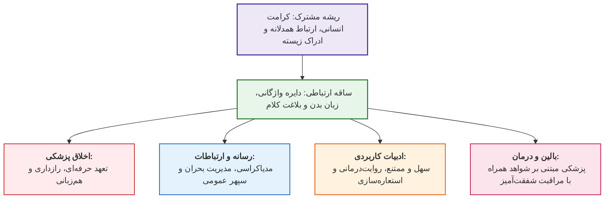

---

## 2. کالبدشکافی زبان علمی در برابر زبان رسانه فراگیر (مطالعه موردی بحران کرونا)

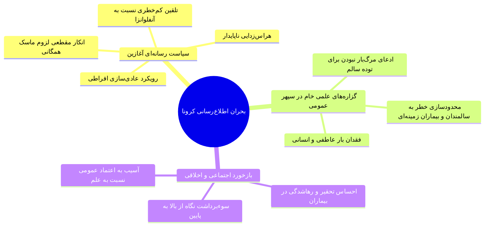

### مقایسه تطبیقی زبان متون علمی و زبان رسانه فراگیر

| مؤلفه ارزیابی | زبان متون علمی (Scientific Language) | زبان رسانه فراگیر (Public Media Language) |
| --- | --- | --- |
| **رویکرد و ساختار** | **خشک، بی‌روح، خنثی و نوتر (Neutral)** | حساس به عواطف، پویا، امیدبخش و شفاف |
| **مرجع صدق** | صرفاً متکی بر **فکت (Fact)** و داده‌های آماری عینی | متکی بر فهم عمومی، بافت اجتماعی و نیاز مخاطب |
| **مخاطب هدف** | پژوهشگران، جامعه دانشگاهی و متخصصان | **توده جامعه**، بیماران، خانواده‌ها و افراد در معرض خطر |
| **آسیب بالقوه** | در صورت ورود نامناسب به جامعه: **احساس تحقیر و بی‌اهمیت‌انگاری** | در صورت تخطی از علم: تولید شبه‌علم و خوش‌خیالی کاذب |
| **شرط موفقیت** | حفظ دقت متدولوژیک و مستندسازی دقیق | **کالیبراسیون لحن** بدون کاستن از دقت علمی پیام |

> [!warning] تله تستی پیرامون زبان علمی در تریبون عمومی
> گزاره «کرونا توده جامعه را نمی‌کشد و فقط افراد دیابتی، سرطانی یا نقص ایمنی را از بین می‌برد» از نظر علمی **صحیح** است، اما طرح آن با زبان نوتر و خنثی در سپهر عمومی از نظر *اخلاق پزشکی و ارتباطات رسانه‌ای* **خطایی مهلک** محسوب می‌شود؛ زیرا مخاطب رسانه انسان دردمند است نه صفحه کتاب، و این کلام را به حساب *بی‌اهمیت‌‌انگاری جان انسان‌ها* می‌گذارد.

---

## 3. رسانه‌سالاری مدرن (Mediacracy) و پیدایش پزشکی غیررسمی

> [!abstract] تعریف عصر مدیاکراسی (Mediacracy)
> واژه مدیاکراسی متشکل از Media و واژه یونانی Kratos به معنای **حکومت و اقتدار** است؛ عصری که در آن قدرت رسانه‌ها در جهت‌دهی به افکار عمومی، داوری ارزش‌ها و بازنمایی چهره حرفه‌ها حاکمیت مطلق دارد.

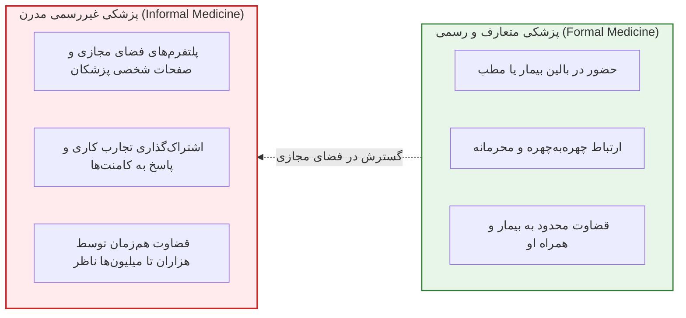

### واکاوی پرونده جنجالی توییتر (بحران انسولین قلمی)

1. **زمینه بحران:** کمبود شدید انسولین قلمی (Pen) بر اثر تحریم‌ها و شرایط بحرانی کشور.
2. **توییت مقام مسئول وزارت بهداشت:** ادعای علمی مبنی بر یکسان بودن اثر انسولین قلمی با شیشه‌های قدیمی رگولار و ان‌پی‌اچ (Regular & NPH).
3. **اعتراض مستأصلانه دندان‌پزشک:** بیان ابتلای پدر به نوسان شدید و افت قند خون (هیپوگلیسمی) با ویال‌های قدیمی با عبارت پردرد: *«من چه خاکی باید به سرم بریزم؟»*
4. **پاسخ کوتاه و خطای لحن مسئول:** درج عبارت سه‌کلمه‌ای **«دوزشو کم کن»**.
5. **تحلیل خطای ارتباطی:**
   * **از منظر علمی:** کاملاً درست و استاندارد (تنظیم و کاهش دوز برای جلوگیری از نوسان قند).
   * **از منظر تعهد کاری:** رفتار مسئولانه در اصل پاسخ‌گویی به شهروندان.
   * **از منظر بلاغت و اخلاق:** استفاده از **لحن آمرانه، کلام خشک و موضع از بالا به پایین** که طوفانی از اعتراض به همراه داشت (*«اگر پدر خودت هم بود همین را می‌گفتی؟»*).

> [!important] قاعده سرایت خسارت فردی به صنف در فضای مجازی
> در پزشکی رسمی، اشتباه کلامی پزشک حداکثر به **حیثیت فردی** او در برابر بیمار آسیب می‌زند؛ اما در پزشکی غیررسمی (شبکه‌های اجتماعی)، به دلیل امکان اشتراک‌گذاری میلیونی، اشتباهات کلامی دستمایه هجمه مغرضانه علیه **کل صنف و حیثیت جامعه پزشکی** می‌شود.

---

## 4. آسیب‌شناسی تخصص‌گرایی و دوگانه هم‌زبانی/همدلی

> [!abstract] تز دنیل افری (Danielle Ofri)
> استادیار داخلی دانشگاه نیویورک و نویسنده برجسته نشریات لَنسِت و نیویورک‌تایمز در کتاب *آنچه شما می‌گویید، آنچه پزشک می‌شنود* (ترجمه *افروز معتمد*): روند فزاینده **تخصص‌گرایی افراطی و تکنیکالیزاسیون** زبان مشترک پزشک و بیمار عامی را نابود کرده و **پدیده ناهم‌زبانی** آفریده است.

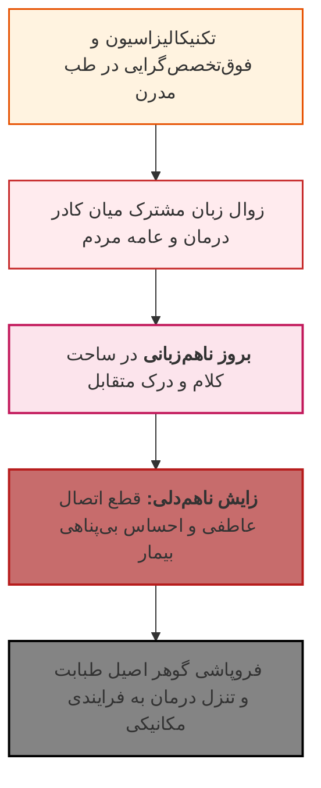

### تفاوت سلسله‌مراتبی همدردی و همدلی در تفکر عرفانی و بالینی

```mermaid
flowchart RL

S["همدردی (Sympathy):<br/>تأسف خوردن بیرونی برای رنج دیگری<br/>«هم‌زبانی صرف»"] -->|تعالی معرفتی و بالینی| E["همدلی (Empathy):<br/>قرار دادن کامل خود در جهان زیسته بیمار<br/>«گوهر اصیل طبابت»"]

style S fill:#fffde7,stroke:#fbc02d,stroke-width:1.5px;
style E fill:#e8f5e9,stroke:#2e7d32,stroke-width:2px;
```

* **دیدگاه مولانا:** *«همدلی از هم‌زبانی خوش‌تر است»*.
* **کاربرد بالینی:** اگرچه همدلی بالاتر از هم‌زبانی است، اما در طبابت بالینی **رسیدن به همدلی بدون تسلیح به ابزار هم‌زبانی (ادبیات، دایره واژگانی و زبان بدن) ناممکن است.**

---

## 5. الگوهای بالینی پیوند ادب فارسی با ارتباطات تشخیصی و درمانی

```mermaid
flowchart TD
    Pattern["الگوهای فاخر ارتباط طبیبانه در فرهنگ ایرانی"]
    
    Pattern --> MS["<b>تبیین بیماری ام‌اس (نورولوژی):</b><br>• بیان کتابی: بیماری هزارچهره<br>• بیان استاد نورولوژی به روایت دکتر نمازی:<br><i>«ام‌اس یک بیماری هزارآهنگ است؛ کار من و تو مانند دو آهنگ‌ساز این است که با طبابت من و رعایت تو زیباترین موسیقی را از آن بسازیم.»</i>"]
    
    Pattern --> Surg["<b>تبیین ریسک جراحی‌های پرخطر:</b><br>• بیان کلیشه‌ای سرد: شانس پنجاه-پنجاه است و تضمینی نیست.<br>• بیان استاد جراحی به روایت دکتر جعفریان:<br><i>«کار و وظیفه ما تدبیر و تلاش کامل است و سر سوزنی کم نمی‌گذاریم؛ اما تقدیر دست خداست و باید به او توکل کرد.»</i>"]

    style Pattern fill:#ede7f6,stroke:#4527a0,stroke-width:2px;
    style MS fill:#e1f5fe,stroke:#0288d1,stroke-width:1.5px;
    style Surg fill:#e8f5e9,stroke:#2e7d32,stroke-width:1.5px;
```

### تجلی سبک «سهل و ممتنع» در اخلاق بالینی

* **ماهیت کلام سهل و ممتنع:** در ظاهر ساده و روان اما در خلق و اجرا به‌شدت دشوار و نیازمند پختگی درونی (همانند اشعار *سعدی شیرازی*).
* **شاهد مثال از سعدی:**
  > *«خدا کشتی آنجا که خواهد بَرَد / وگر ناخدا جامه بر تن دَرَد»*
  تسکین‌بخش روان انسان پس از ۷۰۰ سال، برآمده از تجربه زیسته عمیق و ایجاد آرامش قلبی در مواجهه با تلاطم‌های مرگ و زندگی.
* **رنج راه تا پختگی کلام:**
  > *حافظ:* *«آری شود ولیک به خون جگر شود»*
  > *ضرب‌المثل مسافران حقیقت:* *«ره چنان رو که رهروان رفتند»*

---

## 6. آسیب‌شناسی نگارش: پرهیز از اطناب و خطاهای بازنمایی فکت‌ها

### ۱. دستور سردبیران و نفی تورم قیدها و صفات

* **توصیه راهبردی تحریریه‌ها:** پرهیز اکید از دست‌ودلبازی در آوردن قیدها و صفت‌های اضافی.
* **ریشه‌شناسی عیب:** نویسندگان و خبرنگاران ضعیف تنبلی و ناتوانی خود در توصیف دقیق موقعیت را با **بستن صفات و قیدهای متورم** لاپوشانی می‌کنند.
* **شاهد عبارت معیوب:** کاربرد عبارت مصطلح و نادرست **«خطر جدی»**.
  * *تحلیل بلاغی:* مگر در عالم پزشکی یا واقعیت، *خطر شوخی* یا *خطر غیرجدی* وجود دارد؟ ذات واژه «خطر» حامل جدیت است و این حشوهای قبیح ذهن بیمار را بی‌جهت مضطرب می‌سازد.

### ۲. چالش انتقال فکت‌های تلخ بقا و مرگ (Breaking Bad News)

```mermaid
flowchart RL
    Fact["<b>فکت خشک علمی:</b><br>سوروایوال (Survival) دو ساله ۴۰ درصد است؛<br>بیمار در این استیج کمتر از ۱ سال عمر می‌کند."]
    --> Bridge["<b>پالایش در بوته همدلی:</b><br>درک حضور انسان دردمند پشت سؤالِ<br><i>«من چقدر دیگر زنده می‌مانم؟»</i>"]
    --> Result["<b>ارائه بالینی شفقت‌آمیز:</b><br>پاسخ‌گویی صادقانه و واقع‌بینانه بدون خام‌فروشیِ<br>آمارهای خشن ریاضی و ویران‌کردن امید بیمار"]

    style Fact fill:#ffebee,stroke:#c62828,stroke-width:1.5px;
    style Bridge fill:#fff3e0,stroke:#e65100,stroke-width:2px;
    style Result fill:#e8f5e9,stroke:#2e7d32,stroke-width:1.5px;
```

> [!tip] چکیده امتحانی هدف غایی درس‌گفتار
> پزشک کارآمد در تراز انسانی کسی است که هم‌زمان با ارتقای دانش تخصصی، **دایره واژگانی خود را گسترش داده و ادبیات بیانی اختصاصی خود را خلق کند**؛ تا بتواند فکت‌های موثق علمی را با کلامی سهل و ممتنع، سرشار از آرامش و بدون استفاده از قیود وحشت‌آفرین به کام بیمار بنشاند.

# جلسه یازدهم: کارکرد ادبیات داستانی و روایت‌شناسی در مواجهه بالینی و طبابت

## 1. شالوده‌شکنی پارادایم آموزش پزشکی و ماهیت دوگانه زبان طبابت

> [!abstract] سرشت دوگانه زبان پزشکی
> پزشکی علمی تک‌بعدی نظیر شیمی، فیزیک یا مهندسی نرم‌افزار نیست. برنامه‌نویسی کامپیوتر زبانی *یکسره تخصصی* دارد که منحصراً در جامعه حرفه‌ای فهم می‌شود؛ اما زبان پزشکی واجد **سرشت دوگانه (Dual Nature)** است: **یک پا در زبان تخصصی (علمی-آکادمیک) و یک پا در زبان عامیانه و روزمره مردم**.

```mermaid
flowchart RL
    subgraph Engine["موتور ترجمه و کالیبراسیون کلامی پزشک"]
    direction RL
        P1["<b>دریافت:</b> شنیدن روایت عامیانه بیمار"]
        --> P2["<b>ترجمه به بالا:</b> تبدیل به کد و زبان تخصصی <i>(جهت ثبت پرونده و مشاوره همکاران)</i>"]
        --> P3["<b>پردازش:</b> تشخیص، تحلیل پاتولوژی و تدوین پلان"]
        --> P4["<b>ترجمه به پایین:</b> برگردان به زبان روزمره و ملموس <i>(جهت تفهیم بیمار و پایبندی دارویی)</i>"]
    end

    style Engine fill:#f9fbe7,stroke:#827717,stroke-width:1.5px;
    style P1 fill:#e1f5fe,stroke:#0288d1,stroke-width:1px;
    style P2 fill:#ede7f6,stroke:#512da8,stroke-width:1.5px;
    style P3 fill:#fff3e0,stroke:#e65100,stroke-width:1px;
    style P4 fill:#e8f5e9,stroke:#2e7d32,stroke-width:1.5px;
```

> [!important] تحدید معنایی ادبیات در این درس‌گفتار
> مراد از ادبیات در پیوند با طبابت، **تاریخ ادبیات، صنایع لفظی یا متون کهن نیست**؛ بلکه منحصراً **ادبیات داستانی (Fiction) و بوطیقای روایت (Narrative)** است.

```mermaid
flowchart TD
    Med["<b>حوزه‌های سه‌گانه پزشکی</b>"]
    Med --> M1["علوم پایه (Basic Sciences)<br><i>(بیوشیمی، آناتومی، فیزیولوژی - ۲ تا ۲.۵ سال نخست)</i>"]
    Med --> M2["پژوهش‌های بالینی (Clinical Research)<br><i>(آزمون داروها، کارآزمایی بالینی)</i>"]
    Med --> M3["<b>طبابت بالینی (Clinical Practice):</b><br><b>مواجهه بالینی (Clinical Encounter)</b> جهت رفع رنج بیمار"]

    M3 -.->|نقطه اتصال قطعی| Lit["<b>ادبیات داستانی و روایت‌شناسی</b>"]

    style Med fill:#eceff1,stroke:#37474f,stroke-width:2px;
    style M1 fill:#f5f5f5,stroke:#9e9e9e,stroke-width:1px;
    style M2 fill:#f5f5f5,stroke:#9e9e9e,stroke-width:1px;
    style M3 fill:#ffebee,stroke:#c62828,stroke-width:2px;
    style Lit fill:#e8f5e9,stroke:#2e7d32,stroke-width:2px;
```

---

## 2. کارکردهای شش‌گانه ادبیات داستانی در مواجهه بالینی

```mermaid
mindmap
  root((کارکردهای بالینی ادبیات داستانی))
    ۱. پر کردن شکاف تجربه
      پل زدن میان پزشک آسوده و بیمار دردمند
      تجربه زیسته هزارساله
      داستان اندوه چخوف
    ۲. اصالت نگاه به درد دیگری
      نفی ابزارانگاری آموزشی بیمار
      رمان و فیلم بیداری‌ها الیور ساکس
      والایش روحی پزشک
    ۳. مهار ملال و فرسودگی شغلی
      فرسایش عاطفی ناشی از مرگ و درد مداوم
      کاتارسیس و رهایش روانی
      گروه‌های بالینت و بولگاکف
    ۴. تاب‌آوری در برابر عدم قطعیت
      گذار از دنیای سیاه و سفید دبیرستان
      پذیرش آشفتگی و ابهام بالین
      رمان مرگ ایوان ایلیچ تولستوی
    ۵. ساختار و عناصر روایت
      ریشه مشترک هیستوری و استوری
      قانون سببیت و تفنگ چخوف
      سیر زمانمند رخدادها
    ۶. چندصدایی و زاویه دید
      پلی‌فونی و Point of View
      حل پارادوکس روایت‌های ناهمخوان
      رمان ملکوت بهرام صادقی
```

### ۱. فهم شکاف عمیق تجربه و دست‌یابی به ادراک زیسته (Lived Experience)

* **شکاف ماهوی:** بیمار دردمند، رنجور، مضطرب و نیازمند است؛ اما پزشک در مواجهه بالینی در موضع آسودگی و فاقد آن رنج جسمانی-روانی است.
* **پل ارتباطی:** خواندن رمان و قصه به پزشک امکان می‌دهد **در جهان زیسته هزاران انسان دیگر غوطه‌ور شود**؛ توانی معادل *هزار سال زندگی و تجربه فشرده*.
* **شاهد شاهکار:** داستان *اندوه (Misery)* اثر **آنتوان چخوف** (پزشک و نویسنده نامدار روس):
  * *پیرنگ:* سرگذشت گاریچی سوگواری بنام «یونا» که فرزند جوانش فوت کرده و درمانده به‌دنبال گوش شنوایی میان مسافران شتاب‌زده شهر می‌گردد تا بار اندوهش را واگوید، اما هیچ‌‌کس حاضر به شنیدن نیست و ناچار شب‌هنگام رنج دل را در گوش اسب خویش زمزمه می‌کند.

### ۲. اصالت در «نگاه به درد دیگران» و طرد ابزارانگاری آموزشی

* **پرسش اگزیستانسیال:** آیا دانشجو مجاز است به بدن و جان رنجور بیمار صرفاً به چشم یک **ابزار آموزشی (Educational Tool)** برای قبولی در آزمون و پزشک‌شدن بنگرد؟
* **پاسخ:** این نگاه موجب مسخ انسانیت و زوال اخلاق است. نظر اصیل به درد دیگران، پزشک را از ورطه تکرار و بی‌تفاوتی نجات می‌دهد.
* **شاهد بالینی:** رمان و اقتباس سینمایی *بیداری‌ها (Awakenings)* اثر **دکتر الیور ساکس** (نورولوژیست برجسته):
  * *روایت:* مواجهه پزشک با گروهی از بیماران کاتاتونیک و ناتوان بازمانده از همه‌گیری آنسفالیت لتارژیک که برای کادر درمان به اشیایی مرده و روزمره تبدیل شده بودند؛ اما نگاه مشفقانه و کنجکاوی انسانی او پنجره‌ای نو به‌سوی بازگرداندن حیات و کرامت این بیماران گشود.

### ۳. غلبه بر ملال حرفه‌ای، فرسودگی شغلی (Burnout) و گروه‌های بالینت

* **مکانیسم آسیب:** تماس مستمر و بی‌پایان با درد، ناتوانی، تعفن و مرگ موجب **پدیده سردی و کرختی عاطفی** یا برعکس، **فرسودگی شدید روانی** می‌شود.
* **مرز همدلی و همدردی:** پزشک الزاماً باید **همدلی (Empathy)** کند نه *همدردی (Sympathy)*؛ یعنی درد بیمار را عمیقاً درک کند، نه اینکه با حل شدن در احساسات منفی از کارآمدی ساقط شود.
* **راهکار درمانی بالینت (Michael Balint):**
  * *سازوکار گروه‌های بالینت (Balint Groups):* گردهمایی هفتگی پزشکان هم‌تراز؛ بیان آزادانه بار عاطفی و چالش‌های حل‌نشده در ارتباط با بیماران و شنیدن بازخورد همکاران.
  * *دست‌آورد:* دست‌یابی به **تزکیه روانی و پالایش (کاتارسیس / Catharsis)** از طریق هنر روایت شفاهی و مکتوب.
* **شاهد ادبی:** کتاب *یادداشت‌های یک پزشک جوان* نوشته **میخائیل بولگاکف** (نویسنده و پزشک روس): شرح بی‌پرده و روایی از هراس‌ها، استیصال‌ها، خطاها و خستگی‌های مفرط پزشکی تازه‌کار در دهکده‌ای دورافتاده و برفی.

### ۴. تاب‌آوری در برابر عدم قطعیت (Uncertainty) بالینی

* **تله ذهنی کنکور و دبیرستان:** آموزش علوم پایه در مدارس تصویرسازی *سیاه و سفید، خطی و قطعی* از پدیده‌ها دارد (معادله مشخص، پاسخ تک‌گزینه‌ای قطعی).
* **واقعیت جهان بالین:** بیمارستان محیطی **آشفته، نامرتب، غبارآلود و آکنده از عدم قطعیت** است؛ بیماری‌ها از روی کتاب‌های درسی رخ نمی‌دهند و پزشک پاسخ همه امور را نمی‌داند.
* **پیامد ناتوانی در پذیرش ابهام:** سرخوردگی، اضطراب بالینی، فرار از بالین به سمت گرایش‌های انتزاعی و آزمایشگاهی غیرمرتبط با انسان.
* **شاهد ادبی:** رمان شاهکار *مرگ ایوان ایلیچ* نوشته **لئو تولستوی**:
  * *تحلیل روان‌شناختی مرگ:* کالبدشکافی لایه‌به‌لایه روان قاضی متمولی که دچار بیماری مبهم و لاعلاج می‌شود؛ ترسیم شگفت‌انگیز مراحل انکار، خشم، تنهایی اگزیستانسیال و دگرگونی فهم هستی در آستانه فنا.

---

## 3. بوطیقای روایت و تطابق شرح‌حال‌نویسی با صناعت داستان

> [!abstract] هم‌ریشگی واژگانی تاریخچه و قصه
> در زبان انگلیسی واژه شرح‌حال بیمار **History** و واژه داستان **Story** از یک ریشه لغوی واحد مشتق شده‌اند. شرح‌حال‌نویسی بالینی کپی‌برداری مکانیکی داده‌ها نیست، بلکه **خلق یک روایت منسجم، هدفمند و ساختاریافته (Narrative)** از درام زیسته بیمار است.

```mermaid
flowchart TD
    subgraph NarrativePillars["ارکان ساختاری روایت بالینی"]
    direction TD
        N1["<b>۱. اصل سببیت (Causality):</b><br>قاعده <i>«تفنگ چخوف»</i>؛ وجود پیوند منطقی میان تمام علائم ذکرشده"]
        N2["<b>۲. اصل زمانمندی (Temporality):</b><br>توالی کرونولوژیک دقیق؛ تقدم و تأخر حدوث نشانه‌ها از گذشته تا اکنون"]
        N3["<b>۳. چندصدایی و تنوع زوایا (Multiperspectivity):</b><br>ترکیب Point of Viewهای متکثر بیمار، همراه، پزشک و پاراکلینیک"]
    end

    style NarrativePillars fill:#ede7f6,stroke:#4527a0,stroke-width:2px;
    style N1 fill:#ffebee,stroke:#c62828,stroke-width:1.5px;
    style N2 fill:#fff3e0,stroke:#e65100,stroke-width:1.5px;
    style N3 fill:#e8f5e9,stroke:#2e7d32,stroke-width:1.5px;
```

### ۱. اصل سببیت و قانون «تفنگ چخوف» (Chekhov's Gun)
* *اصل نمایشی چخوف:* «اگر در پرده اول تفنگی روی دیوار آویخته است، در پرده دوم یا سوم آن تفنگ حتماً باید شلیک کند؛ در غیر این صورت نباید روی دیوار قرار داده شود!»
* *انطباق در شرح‌حال بالینی:* تمام جزئیات مطرح‌شده در شرح‌حال (مصرف دارو، شغل، سفر، درد) باید دارای **کارکرد علّی یا ارزش تشخیصی افتراقی** باشند؛ آوردن داده‌های بی‌اثر یا مغفول گذاشتن جزئیات کلیدی، پیرنگ داستان درمان را فرو می‌ریزد.

### ۲. اصل زمانمندی (Chronology)
* تقدم، همزمانی و تأخر رخدادها اسکلت تشخیصی را می‌سازد (مثلاً تهوعی که *پس از* درد شکم رخ می‌دهد در برابر تهوعی که *پیش از* درد بروز می‌یابد، حاکی از دو آسیب‌شناسی کاملاً مجزاست).

### ۳. زاویه دیدهای متکثر (POV) و حل تضادهای روایی
در هر مواجهه بالینی پزشک با متنی تک‌صدایی روبرو نیست، بلکه با **چندین POV ناهمخوان** مواجه است:

```mermaid
flowchart TD
    P_Patient["POV بیمار:<br>تجربه درونی رنج، استرس و تفسیر فردی"] 
    P_Family["POV همراهان:<br>مشاهدات رفتاری، تعصبات و هراس خانواده"]
    P_Doctor["POV پزشک معالج:<br>منطق پاتوفیزیولوژی، ارزیابی نشانه‌ها"]
    P_Paraclinic["POV مدارک عینی:<br>گزارش آزمایشگاه، بیوپسی و تصویربرداری"]

    P_Patient & P_Family & P_Doctor & P_Paraclinic --> Synthesize["<b>سنتز بالینی:</b><br>حل ناسازگاری‌ها، کنار هم نهادن قطعات پازل و تدوین سناریوی بالینی یکپارچه"]

    style Synthesize fill:#e8f5e9,stroke:#2e7d32,stroke-width:2px;
    style P_Patient fill:#ffebee,stroke:#c62828,stroke-width:1px;
    style P_Family fill:#fff3e0,stroke:#e65100,stroke-width:1px;
    style P_Doctor fill:#e1f5fe,stroke:#0288d1,stroke-width:1px;
    style P_Paraclinic fill:#ede7f6,stroke:#4527a0,stroke-width:1px;
```

* **شاهکار پلی‌فونی ایرانی:** رمان کوتاه *ملکوت* اثر **دکتر بهرام صادقی** (پزشک و داستان‌نویس جریان‌ساز مکتب اصفهان):
  * *تکنیک ادبی:* روایت داستان در هر فصل از **زاویه دید (POV)** یکی از کاراکترها؛ شوک مخاطب ناشی از دگرگون‌شدن معنای حوادث از چشم شخصیت پسین. این تکنیک دقیقاً الگوی ذهنی پزشک در کشف تناقضات شرح‌حال بالینی است.

---

## 4. ماتریس تطبیقی رویکرد سنتی زیست‌پزشکی در برابر طبابت مبتنی بر ادبیات

| شاخص ارزیابی | مدل زیست‌پزشکی سنتی (Biomedical Model) | طبابت مبتنی بر روایت و ادبیات (Narrative Medicine) |
| --- | --- | --- |
| **نگرش به بیمار** | کیس بیماری، مجموعه علائم آزمایشگاهی و **ابزار آموزش** | **سوژه انسانی کامل**، حامل رنج و دارای جهان زیسته |
| **رویکرد به عدم قطعیت** | تقلیل مسائل به پاسخ‌های صلب، مهندسی و **سیاه و سفید** | **تاب‌آوری بالینی** در برابر ماهیت آشفته و غبارآلود بالین |
| **تلقی از شرح‌حال** | چک‌لیست خشک و پر کردن مکانیکی فرم‌های بستری | **قالب‌ریزی پیرنگ داستانی** منسجم مبتنی بر سببیت و زمان |
| **مواجهه با فرسودگی** | کرختی، سندروم فرسودگی شغلی (Burnout) و ملال | **کاتارسیس عاطفی** از طریق گروه‌های بالینت و روایت‌نگاری |
| **زبان ارتباطی** | اصطلاحات پیچیده و تک‌بعدی تخصصی (مشابه زبان کدنویسی) | **سرشت دوگانه:** ترجمه رفت‌وبرگشتی زبان عامیانه و تخصصی |

> [!tip] چکیده امتحانی کلام دکتر منجمی
> تسلط بر بیوشیمی، پاتولوژی و مهارت‌های فیزیکی برای پزشکی **لازم** است، اما برای مواجهه بالینی نجات‌بخش به‌هیچ‌وجه **کافی نیست**. پزشک ماهر آن قصه‌گوی چیره‌دستی است که عناصر روایت، سببیت، شکاف رنج و POVهای متعارض را می‌شناسد تا بتواند پازل درد انسان را تکمیل و درمان کند.

# جلسه دوازدهم: کارکرد ادبیات داستانی و بوطیقای روایت در مواجهه بالینی و طبابت

## 1. شالوده‌شکنی پیش‌فرض‌های آموزشی و سرشت دوگانه زبان پزشکی

> [!abstract] سرشت دوگانه زبان پزشکی (Dual Nature of Medical Language)
> برخلاف تصور رایج دوره کنکور و دبیرستان، پزشکی رشته‌ای صرفاً متناظر با فیزیک، شیمی و زیست‌شناسی نیست. زبان مهندسی نرم‌افزار و برنامه‌نویسی کامپیوتر *یکسره تخصصی* است و جز در جامعه حرفه‌ای فهم نمی‌شود؛ اما زبان پزشکی **سرشت دوگانه** دارد: **یک پا در زبان روزمره مردم و یک پا در زبان تخصصی آکادمیک**.

```mermaid
flowchart RL
    subgraph TranslationLoop["چرخه ترجمه و کالیبراسیون کلامی پزشک"]
    direction RL
        T1["<b>۱. دریافت:</b> شنیدن روایت عامیانه بیمار"]
        --> T2["<b>۲. ترجمه به بالا:</b> تبدیل به کد و واژگان تخصصی <i>(پرونده‌نویسی و مشاوره همکاران)</i>"]
        --> T3["<b>۳. پردازش:</b> تصمیم‌گیری، تحلیل پاتولوژی و تدوین پلن"]
        --> T4["<b>۴. ترجمه به پایین:</b> بازگردانی به زبان ملموس و روزمره <i>(تفهیم بیمار و پایبندی دارویی)</i>"]
    end

    style TranslationLoop fill:#f9fbe7,stroke:#827717,stroke-width:1.5px;
    style T1 fill:#e1f5fe,stroke:#0288d1,stroke-width:1px;
    style T2 fill:#ede7f6,stroke:#512da8,stroke-width:1.5px;
    style T3 fill:#fff3e0,stroke:#e65100,stroke-width:1px;
    style T4 fill:#e8f5e9,stroke:#2e7d32,stroke-width:1.5px;
```

> [!important] تحدید موضوعی ادبیات در این درس‌گفتار
> مراد از ادبیات در پیوند با طبابت، **تاریخ ادبیات، صنایع لفظی یا متون کهن نیست**؛ بلکه منحصراً **ادبیات داستانی (Fiction) و بوطیقای روایت (Narrative)** است.

```mermaid
flowchart TD
    Med["<b>حوزه‌های سه‌گانه علم پزشکی</b>"]
    Med --> M1["<b>علوم پایه (Basic Sciences):</b><br>۲ تا ۲.۵ سال نخست تحصیل <i>(آناتومی، بیوشیمی، فیزیولوژی)</i>"]
    Med --> M2["<b>پژوهش‌های بالینی (Clinical Research):</b><br>کارآزمایی‌ها و شواهد آزمایشگاهی"]
    Med --> M3["<b>طبابت بالینی (Clinical Practice):</b><br>ارتباط پزشک و بیمار در <b>مواجهه بالینی (Clinical Encounter)</b> جهت رفع مشکل"]

    M3 -.->|نیاز قطعی و بی‌واسطه| Lit["<b>ادبیات داستانی و عناصر روایت</b>"]

    style Med fill:#eceff1,stroke:#37474f,stroke-width:2px;
    style M1 fill:#f5f5f5,stroke:#9e9e9e,stroke-width:1px;
    style M2 fill:#f5f5f5,stroke:#9e9e9e,stroke-width:1px;
    style M3 fill:#ffebee,stroke:#c62828,stroke-width:2px;
    style Lit fill:#e8f5e9,stroke:#2e7d32,stroke-width:2px;
```

---

## 2. کارکردهای شش‌گانه ادبیات داستانی در مواجهه بالینی

```mermaid
mindmap
  root((کارکردهای بالینی ادبیات داستانی))
    ۱. پر کردن شکاف تجربه
      پل زدن میان پزشک آسوده و بیمار دردمند
      ادراک زیسته معادل ۱۰۰۰ سال زندگی فشرده
      داستان اندوه چخوف با صدای بهروز رضوی
    ۲. اصالت نگاه به درد دیگری
      نفی ابزارانگاری آموزشی بیمار
      پرسش بنیادین اگزیستانسیال
      رمان و فیلم بیداری‌ها الیور ساکس
    ۳. مهار ملال و فرسودگی شغلی
      فرسایش عاطفی ناشی از درد و مرگ مداوم
      مرز حیاتی همدلی و همدردی
      گروه‌های بالینت و کاتارسیس
      کتاب یادداشت‌های یک پزشک جوان بولگاکف
    ۴. تاب‌آوری در برابر عدم قطعیت
      گذار از دنیای خطی و قطعی دبیرستان
      پذیرش آشفتگی و ابهام ذاتی بالین
      رمان مرگ ایوان ایلیچ تولستوی
    ۵. تسلط بر عناصر روایت
      ریشه مشترک History و Story
      اصل سببیت و تفنگ چخوف
      اصل زمانمندی
    ۶. چندصدایی و زاویه دید
      پلی‌فونی و تعدد POV
      سنتز تناقضات روایی در بالین
      رمان ملکوت دکتر بهرام صادقی
```

### ۱. پر کردن شکاف عمیق تجربه و دست‌یابی به ادراک زیسته (Lived Experience)
* **شکاف ماهوی:** بیمار دردمند، رنجور، مضطرب و نیازمند یاری است؛ پزشک در مواجهه بالینی در موضع آسودگی قرار دارد و فاقد آن رنج جسمانی-روانی مستقیم است.
* **پل ارتباطی ادبیات:** خواندن ادبیات داستانی این امکان را می‌دهد که **در تجارب زیسته هزاران انسان دیگر غوطه‌ور شویم**؛ توانی معادل *۱۰۰۰ سال زندگی و تجربه فشرده*.
* **شاهد شاهکار:** داستان *اندوه (Misery)* اثر **آنتوان چخوف** (پزشک و نویسنده نامدار روس):
  * *پیرنگ:* سرگذشت گاریچی سوگواری بنام «یونا» که پسر جوانش تازه مرده است. او درمانده به‌دنبال گوش شنوایی میان مسافران شتاب‌زده شهر می‌گردد تا بار سنگین اندوهش را واگوید، اما هیچ‌کس حاضر به شنیدن نیست و در نهایت شب‌هنگام رنج دلش را در گوش اسب خویش نجوا می‌کند.
  * *اجرای صوتی اشاره‌شده در کلاس:* با صدای **بهروز رضوی**.

### ۲. اصالت در «نگاه به درد دیگری» و طرد ابزارانگاری آموزشی
* **پرسش اگزیستانسیال:** آیا دانشجو مجاز است به بیمار دردمند صرفاً به چشم یک **ابزار آموزشی (Educational Tool)** برای گذراندن راند، پاس کردن آزمون و پزشک‌شدن نگاه کند؟
* **پاسخ تحلیلی:** تقلیل بیمار به ابزار منجر به مسخ انسانیت و زوال اخلاق بالینی است. نگاه اصیل به درد دیگری، هم موجب **والایش روحی و رضایت شغلی پزشک** می‌شود و هم **روند درمان بیمار** را نجات می‌دهد.
* **شاهد بالینی:** رمان و اقتباس سینمایی *بیداری‌ها (Awakenings)* اثر **دکتر الیور ساکس** (نورولوژیست و نویسنده برجسته):
  * *روایت:* مواجهه پزشک نورولوژیست با گروهی از بیماران منجمد، کاتاتونیک و ناتوان بازمانده از همه‌گیری آنسفالیت لتارژیک در بیمارستان؛ بیمارانی که برای کادر درمان به اشیایی مرده، روزمره و فراموش‌شده تبدیل شده بودند، اما کنجکاوی انسانی و نگاه مشفقانه این پزشک پنجره‌ای نو به‌سوی بازگرداندن کرامت و حیات آنان گشود.

### ۳. غلبه بر ملال حرفه‌ای، فرسودگی شغلی (Burnout) و گروه‌های بالینت
* **مکانیسم آسیب:** تماس مستمر، روزمره و بی‌پایان با درد، تعفن، رنج و مرگ دو خروجی مهلک دارد: یا **کرختی، سردی و بی‌تفاوتی عاطفی** و یا **فرسودگی شدید روانی و ملال حرفه‌ای**.
* **مرز همدلی و همدردی:** پزشک الزاماً باید **همدلی (Empathy)** بورزد نه *همدردی (Sympathy)*؛ یعنی تجربه و رنج بیمار را کاملاً بفهمد و درک کند، نه اینکه با غرق شدن در احساسات منفی از کارآمدی ساقط شود.
* **راهکار بالینت (Michael Balint):**
  * *گروه‌های بالینت (Balint Groups):* جلسات گردهمایی دوره‌ای پزشکان در پیشگاه همتایان هم‌تراز؛ بیان آزادانه چالش‌های حل‌نشده و بارهای عاطفی روابط با بیماران و شنیدن بازخورد همکاران.
  * *دستاورد:* دستیابی به **تزکیه روانی و پالایش عاطفی (کاتارسیس / Catharsis)** از طریق هنر بیان و *روایت‌گری شفاهی و مکتوب*.
* **شاهد ادبی:** کتاب *یادداشت‌های یک پزشک جوان* نوشته **میخائیل بولگاکف** (پزشک و نویسنده روس): گزارش بی‌پرده و روایی از استیصال‌ها، ترس‌ها، خطاها و ملال یک پزشک تازه‌کار در دهکده‌ای برفی و دورافتاده.

### ۴. تاب‌آوری در برابر عدم قطعیت (Clinical Uncertainty)
* **تله ذهنی کنکور و علوم پایه:** آموزش در دبیرستان تصویری *سیاه و سفید، خطی و صلب* از جهان پدیده‌ها می‌سازد که همه مسائل پاسخ تک‌گزینه‌ای و قطعی دارند.
* **واقعیت جهان بالین:** محیط بیمارستان فضایی **آشفته، نامرتب، خاکستری و آکنده از عدم قطعیت** است؛ بیماری‌ها از روی کتاب‌ها رخ نمی‌دهند و پزشک پاسخ تمام سوالات را نمی‌داند و *نباید هم بداند*.
* **پیامد ناتوانی در پذیرش ابهام:** سرخوردگی، اضطراب بالینی، احساس دلزدگی و فرار از مواجهه با بیمار به سمت رشته‌های آزمایشگاهی و انتزاعی دور از بالین.
* **شاهد ادبی:** شاهکار *مرگ ایوان ایلیچ* اثر **لئو تولستوی**:
  * *روایتگری احتضار:* کالبدشکافی روان‌شناختی لایه‌به‌لایه‌ای از فراز و فرودها، مراحل انکار، خشم، تنهایی وجودی و مواجهه با مرگ در وجود یک قاضی که دچار بیماری پیش‌رونده، مبهم و لاعلاج شده است.

---

## 3. بوطیقای روایت و تطابق شرح‌حال‌نویسی بالینی با صناعت داستان

> [!abstract] هم‌‌ریشگی ریشه‌شناختی تاریخچه و قصه
> در زبان انگلیسی واژه شرح‌حال بیمار **History** و واژه داستان **Story** از یک ریشه لغوی واحد مشتق شده‌اند. شرح‌حال‌نویسی بالینی چک‌لیست خشک داده‌ها نیست، بلکه **خلق یک روایت منسجم، هدفمند و دقیق (Narrative)** از درام زیسته بیمار است.

```mermaid
flowchart TD
    subgraph NarrativePillars["ارکان ساختاری روایت و سناریوی بالینی"]
    direction TD
        N1["<b>۱. اصل سببیت (Causality):</b><br>قاعده <i>«تفنگ چخوف»</i>؛ توجیه‌پذیری علّی تمام نشانه‌ها و داده‌ها"]
        N2["<b>۲. اصل زمانمندی (Temporality):</b><br>توالی کرونولوژیک حوادث؛ تقدم، همزمانی و تأخر نشانه‌ها"]
        N3["<b>۳. چندصدایی و تنوع زوایا (Multiperspectivity / POV):</b><br>ترکیب و آشتی دادن روایت‌های ناهمخوان در بالین"]
    end

    style NarrativePillars fill:#ede7f6,stroke:#4527a0,stroke-width:2px;
    style N1 fill:#ffebee,stroke:#c62828,stroke-width:1.5px;
    style N2 fill:#fff3e0,stroke:#e65100,stroke-width:1.5px;
    style N3 fill:#e8f5e9,stroke:#2e7d32,stroke-width:1.5px;
```

### ۱. اصل سببیت و قانون «تفنگ چخوف» (Chekhov's Gun)
* *قاعده دراماتیک چخوف:* «اگر در پرده اول تفنگی روی دیوار آویخته است، در پرده دوم یا سوم آن تفنگ حتماً باید شلیک کند؛ در غیر این صورت نباید روی دیوار قرار داده شود!»
* *انطباق در شرح‌حال بالینی:* تمام جزئیات مطرح‌شده در شرح‌حال (مصرف دارو، شغل، سفر، درد) باید دارای **کارکرد علّی یا ارزش تشخیصی افتراقی** باشند؛ آوردن داده‌های بی‌اثر یا مغفول گذاشتن جزئیات کلیدی، پیرنگ داستان درمان را فرو می‌ریزد.

### ۲. اصل زمانمندی (Chronology)
* سیر زمانی و توالی رخ‌دادن وقایع، اسکلت پاتوفیزیولوژی بیماری را مشخص می‌کند (مثلاً استفراغی که *پس از* درد شکم رخ می‌دهد در برابر استفراغی که *پیش از* درد بروز می‌یابد، حاکی از دو بیماری کاملاً متفاوت است).

### ۳. زاویه دیدهای متکثر (POV) و حل تضادهای روایی
در هر مواجهه بالینی پزشک با متنی تک‌صدایی روبرو نیست، بلکه با **چندین POV ناهمخوان** مواجه است:

```mermaid
flowchart TD
    P_Patient["POV بیمار:<br>تجربه درونی رنج، استرس و تفسیر فردی"] 
    P_Family["POV همراهان:<br>مشاهدات رفتاری، هراس‌ها و تعصبات خانواده"]
    P_Doctor["POV پزشک معالج:<br>منطق پاتوفیزیولوژی و ارزیابی عینی"]
    P_Paraclinic["POV مدارک عینی:<br>گزارش آزمایشگاه، بیوپسی و تصویربرداری"]

    P_Patient & P_Family & P_Doctor & P_Paraclinic --> Synthesize["<b>سنتز بالینی پزشک:</b><br>حل ناسازگاری‌ها، چیدن قطعات پازل و تدوین سناریوی درمانی یکپارچه"]

    style Synthesize fill:#e8f5e9,stroke:#2e7d32,stroke-width:2px;
    style P_Patient fill:#ffebee,stroke:#c62828,stroke-width:1px;
    style P_Family fill:#fff3e0,stroke:#e65100,stroke-width:1px;
    style P_Doctor fill:#e1f5fe,stroke:#0288d1,stroke-width:1px;
    style P_Paraclinic fill:#ede7f6,stroke:#4527a0,stroke-width:1px;
```

* **شاهکار پلی‌فونی ایرانی:** رمان کوتاه *ملکوت* اثر **دکتر بهرام صادقی** (پزشک و داستان‌‌نویس جریان‌ساز مکتب اصفهان):
  * *تکنیک ادبی:* روایت داستان در هر فصل از **زاویه دید (POV)** یکی از کاراکترها؛ شوک مخاطب ناشی از دگرگون‌‌شدن معنای حوادث از چشم شخصیت پسین. این تکنیک دقیقاً الگوی ذهنی پزشک در کشف تناقضات شرح‌حال بالینی است.

---

## 4. ماتریس تطبیقی رویکرد سنتی زیست‌پزشکی در برابر طبابت مبتنی بر ادبیات داستانی

| شاخص ارزیابی | مدل زیست‌پزشکی سنتی (Biomedical Model) | طبابت روایی و مبتنی بر ادبیات (Narrative-based Medicine) |
| --- | --- | --- |
| **نگرش به بیمار** | کیس بیماری، مجموعه داده‌های آزمایشگاهی و **ابزار آموزش** | **سوژه انسانی کامل**، صاحب رنج و واجد جهان زیسته |
| **مواجهه با عدم قطعیت** | تقلیل مسائل به داده‌های صلب، مهندسی و **سیاه و سفید** | **تاب‌آوری بالینی** در برابر ماهیت نامرتب و غبارآلود بالین |
| **تلقی از شرح‌حال** | چک‌لیست خشک و ثبت مکانیکی فرم‌های بستری | **قالب‌ریزی پیرنگ داستانی** منسجم مبتنی بر سببیت و زمان |
| **مواجهه با فرسودگی** | کرختی عاطفی، سندروم فرسودگی شغلی (Burnout) و ملال | **کاتارسیس روانی** از طریق گروه‌های بالینت و روایت‌نگاری |
| **زبان ارتباطی** | اصطلاحات پیچیده و تک‌بعدی تخصصی (مشابه زبان برنامه‌نویسی) | **سرشت دوگانه:** ترجمه رفت‌وبرگشتی زبان عامیانه و تخصصی |

> [!tip] چکیده امتحانی کلام دکتر علیرضا منجمی
> تسلط بر بیوشیمی، فیزیولوژی و علوم پایه برای پزشکی **لازم** است، اما برای یک مواجهه بالینی مؤثر و شفابخش به‌هیچ‌وجه **کافی نیست**. پزشک کارآمد همان قصه‌گوی متخصصی است که عناصر روایت، سببیت، شکاف رنج و POVهای متعارض را می‌شناسد تا بتواند پازل درد انسان را تکمیل و درمان کند.
