# جلسه سیزدهم: بیماری در ادبیات و اساطیر ایران باستان، متون پهلوی و شاهنامه فردوسی

## 1. ریشه‌شناسی واژگانی بیماری و اصطلاحات بالینی کهن

> [!abstract] تبارشناسی واژه بیمار
> * **فرهنگ آنندراج:** ترکیب «بیم + آر» (کسی که نسبت به تندرستی خود بیم و دغدغه دارد).
> * **رد فرضیه لغت‌نامه دهخدا:** تصور «بی + مار» (مار به عنوان نماد سلامتی به تقلید از عصای اسکله‌پیوس یونانی) نادرست است؛ «مار» در پهلوی و «ماره» در سانسکریت یعنی کشنده و میراننده ($mr$ به معنای مردن در پارسی باستان و اوستایی؛ $miθriia$ در اوستایی به معنای تباه‌کننده).
> * **سیر تطور ریشه‌شناختی (دکتر محمد حسن‌دوست):** در پارسی باستان **اوپیماره** ($Upamara$: پی مرگ بودن) و **امیوا بر** ($Amiwa-bar$: فقدان زور و توان) ⇦ در فارسی میانه تبدیل به **میوار / ویمار** ⇦ در نهایت واژه‌گردانی به **بیمار**.

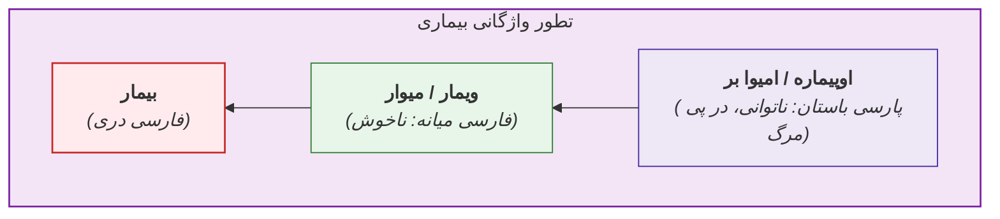

### واژگان بالینی مرکب فراموش‌شده در زبان فارسی

| واژه کهن | معادل امروزی | کاربرد و شاهد متنی |
| :--- | :--- | :--- |
| **بیماردار** | همراه مریض / مراقب خانگی | فرد تیماردار مقیم در منزل یا بیمارستان |
| **بیمارپرسی / بیمارنوازی** | عیادت از بیمار | *خاقانی:* «بهر بیمارنوازی به من آیید همه» |
| **بیمارپرس / بیمارنواز** | عیادت‌‌کننده | افراد حاضر بر بالین جهت احوال‌پرسی |
| **بیمارپرست / بیماربام** | پرستار (Nurse) | *خاقانی:* «بیمارپرستان ز غمم سیر شدند...» |
| **بیماری‌خاسته** | فرد در دوره نقاهت (Convalescent) | برخاسته از بستر بیماری (تذکرةالاولیاء عطار: پختن طعام برای بیمار نقاهتی) |
| **بیماری‌خاستگی** | دوره نقاهت (Convalescence) | بازیابی تدریجی سلامت پس از فرونشست بحران بیماری |

> [!warning] تله تستی املایی
> واژه «بیماری‌خاسته» با حرف **«خ»** و الف (از مصدر برخاستن) صحیح است، نه «بیماری‌خواسته» با «خوا» (خواستن)!

## 2. دیوشناسی بیماری و نظام ثنوی در اساطیر ایران باستان

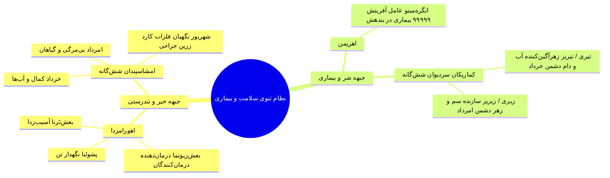

### فهرست دیوان بیماری و ابزارهای مقابله بالینی

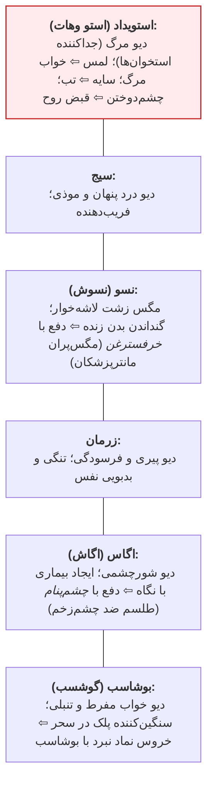

> [!abstract] پنام (ماسک صورت باستانی) و کاربردهای سه‌گانه
> پارچه محافظ روی دهان و بینی جهت ممانعت از آلودگی بیولوژیک و حفظ پاکیزگی:
> 1. **پزشکان و موبدان:** هنگام درمان عفونت‌ها یا ادعیه‌خوانی مقابل آتش تا بازدم آتش را نیالاید.
> 2. **تشریفات دربار:** مراجعان به حضور پادشاه جهت حفاظت شاه از بیماری‌های تنفسی پنام می‌زدند.
> 3. **تجهیزات نظامی (وندیداد فرگرد ۱۴):** یکی از تجهیزات ۱۲گانه انفرادی سربازان در رزم (آمادگی دفاع بیولوژیک).
> * **چشم‌پنام:** تفاوت ساختاری با پنام دارد؛ ماسک نبوده بلکه **تعویذ و طلسم آویختنی ضد چشم‌زخم** بوده است (*شاهد شهید بلخی:* «چرا نداری با خود هم همیشه چشم‌پنام»).

## 3. کالبدشکافی متون پهلوی و رسالات کهن پزشکی-اندرزی

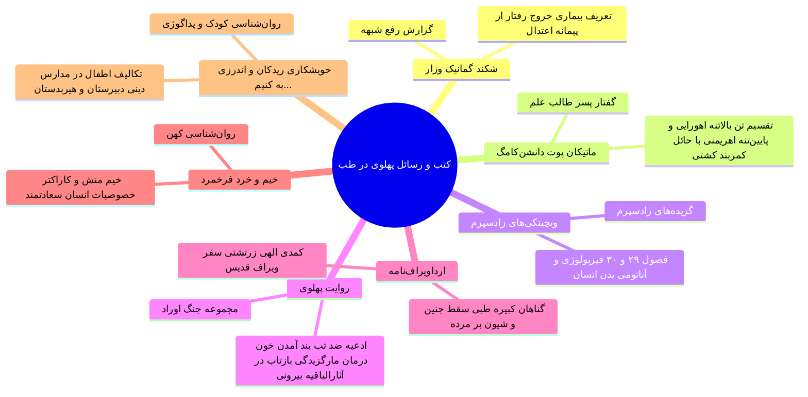

### نسخه درمانی روان‌تنی «داروی خرسندی» (ترجمه کتایون مزداپور)

> [!important] فرمولاسیون داروی خرسندی (۶ دانگ روانی)
> ترکیب شش گانه جهت دفع تنش و ناخرسندی:
> 1. **یک درمسنگ:** به منش آمیختن و شناخت عقلی موقعیت.
> 2. **یک دانگ‌‌سنگ:** تأمل در اینکه «اگر خرسند نباشم چه کنم؟»
> 3. **یک دانگ‌‌سنگ:** امید به اینکه «از امروز تا فردا کارها بهتر خواهد شد.»
> 4. **یک دانگ‌سنگ:** باور به اینکه «از این بدتر هم می‌توانست باشد.»
> 5. **یک دانگ‌سنگ:** «در پیشامد رخ‌داده، خرسندی آسان‌تر از بیقراری است.»
> 6. **یک دانگ‌سنگ:** «اگر خرسند نباشم روزگار دشوارتر خواهد شد.»
> * **روش فرآوری و مصرف:** کوبیدن در *هاون شکیبایی* با دسته هاون نیایش ⇦ بیختن با *پرویزن (الک) بخشش* ⇦ مصرف بامدادان *دو کفچه (قاشق)* با آب توکل.
> * **شاهد در شعر سعدی:** استعاره از نصیحت به عنوان داروی تلخ بیخته به پرویزن معرفت و آمیخته با شهد، یا داروی مسهل تلخ **سقمونیا (اسکامونیا)** آمیخته با گلاب (جلاب).

## 4. آسیب‌شناسی بیماری در متون دینی: وندیداد و دینکرد

* **ورود بیماری به هستی (وندیداد فرگرد ۲۲):** جهان در آغاز نیک و بی‌نقص آفریده شد؛ اهریمن پتیاره از روی کینه‌توزی **۹۹۹۹۹ بیماری** ایجاد کرد (*پتیاره:* ضد یار، دشمن).
* **معنای پسوند «بد/پاد» در نام‌ها:** سرور و ناظر؛ مانند *بهپاد (بهبد)* متولی بهداشت منطقه و *درست‌بد* رئیس صنف پزشکان.
* **تریتا (فریدون):** **نخستین پزشک و نخستین جراح (کاردپزشک)** در متون اوستایی؛ صاحب ۳ فرّه (رزمی، درمانی، دینی)؛ دریافت کارد جراحی زرین و مرصع از **شهریور امشاسپند**.

### دانشنامه دینکرد (نسک سوم - فصل ۱۵۷: اَبَر پزشکی بُن)

تدوین پسااسلامی موبدان *آذرفرنبغ فرخزادان* و *آذرباد امیدان*؛ بررسی چیستی و طبقه‌بندی بیماری‌ها:

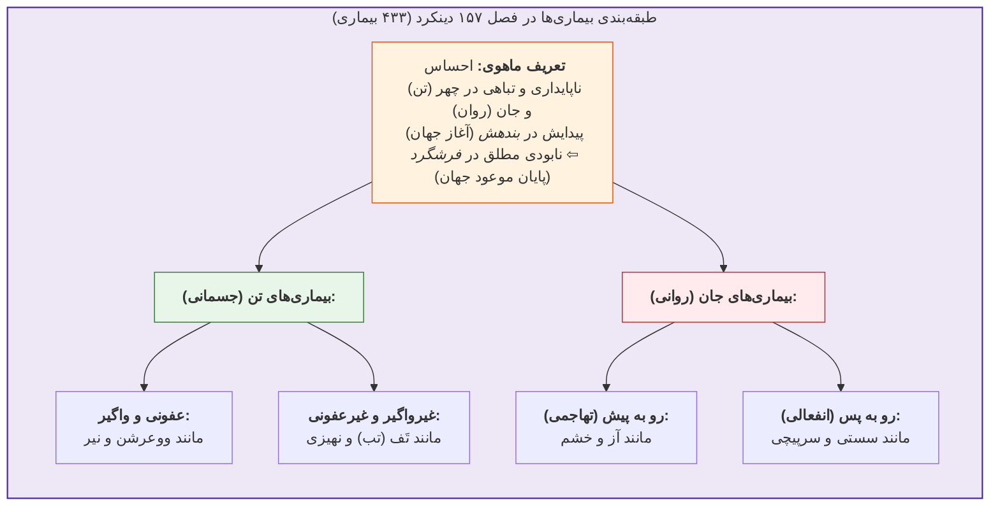

> [!tip] خطای معرفتی کهن
> نیاکان ما در دینکرد **تب (تَف)** را بیماری غیرواگیر می‌دانستند، در حالی که در پزشکی مدرن، تب علامت بارز بیماری‌های عفونی واگیردار است.

## 5. بیماری و طبابت در روایت‌های مهجور شاهنامه فردوسی

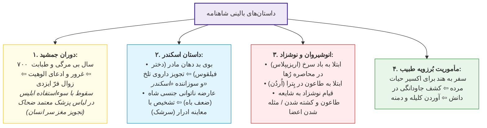

### جزئیات پاتولوژیک روایت‌های چهارگانه شاهنامه

1. **جمشید و غرور پزشکی:**
   * ۷۰۰ سال سلامت مطلق گیتی با دانش درمانی جمشید؛ ادعای آفرینندگی و بی‌نیازی از کردگار به سبب دفع بیماری ⇦ گریختن فرّ ایزدی:
     > *«به دارو و درمان جهان گشت راست / که بیماری و مرگ کس را نکاست...»*
   * **نخستین کلاهبرداری و جنایت پزشکی تاریخ:** دگردیسی ابلیس به چهره پزشکی فرزانه نزد ضحاک و تجویز مغز سر جوانان برای رام‌کردن مارهای دوش.
2. **اسکندر و فارماکولوژی گیاهی:**
   * داراب همسر خود (دختر فیلقوس) را به علت بوی بد دهان (Halitosis) طرد کرد؛ نام اسکندر برآمده از **گیاهی تلخ و سوزاننده کام** است که پزشک داراب به مادر وی خورانده بود.
   * **پاتولوژی سلاطین (ضعف قوای جنسی):** مراجعه اسکندر به طبیب؛ معاینه مایعات بدن از طریق دیدن **سرشک** (به قرینه ادرار و قاروره) و نهی از پرخوری و آزمندی در طعام.
3. **طاعون انوشیروان و سرنوشت نوشزاد:**
   * **طاعون ژوستینین (طاعون شیرویه):** شیوع طاعون فراگیر در جنگ با روم در ناحیه اردن (شهر پترا)؛ ابتلای پیشین شاه به **باد سرخ (Erysipelas)** در محاصره رُها.
   * شورش نوشزاد در جندی‌شاپور با تکیه بر شایعه مرگ پدر در اثر طاعون؛ سرکوب شورش و کشته‌شدن وی (به روایت پروکوپیوس رومی: دستگیری، مثله‌کردن گوش، لب، گونه و بینی جهت ایجاد نقص عضو مانع پادشاهی).
4. **برزویه و اسطوره گیلگمش:**
   * مأموریت کشف گیاه حیات‌بخش در هند؛ دگردیسی مفهوم اکسیر حیات از ماده فیزیکی به **علم و خردورزی**؛ آوردن کتاب *کلیله و دمنه*.

## 6. ماتریس مقایسه‌ای متون کهن از منظر پاتولوژی و درمان

| سند / متن تاریخی | منشأ بیماری | تعداد پاتولوژی‌های معین | رویکرد درمانی | پیام اخلاقی / معرفتی |
| :--- | :--- | :--- | :--- | :--- |
| **وندیداد (اوستا)** | یورش اهریمن و پتیارگی | ۹۹,۹۹۹ بیماری | مانترادرمانی، پنام، گیاه‌درمانی و کاردپزشکی | جدال مداوم نیکی و پلیدی در آفرینش |
| **دینکرد (نسک سوم)** | تباهی تن (چهر) و روان (جان) | ۴۳۳ بیماری تا فرشگرد | نابودی ریشه‌ای با نیروی ایزدی و ابزار پزشکی | انطباق آسیب‌های روانی با رذایل اخلاقی |
| **شکند گمانیک وزار** | خروج رفتار از پیمانه (افراط/تفریط) | نامشخص | اعتدال‌بخشی و اصلاح سبک زیست | هم‌راستایی مفهوم پیمان با سلامت |
| **شاهنامه فردوسی** | طغیان طبیعت، توطئه ابلیس، عفونت | همه‌گیری‌ها (طاعون، باد سرخ) | کاردپزشکی، داروی گیاهی، تنظیم تغذیه | هشدار نسبت به غرور علمی طبیب |

> [!tip] چکیده امتحانی جلسه سیزدهم
> در تلقی اساطیری و کهن ایرانی، **بیماری شرّی عارضی و اهریمنی** است نه جزئی از آفرینش آغازین. سلامت در گرو حفظ **پیمان (اعتدال)**، مبارزه با دیوان بیماری (با ابزارهایی چون پنام و گیاهان دارویی) و پیوند زدن طبابت با توکل و فروتنی است؛ رویکردی که غرور ناشی از شفابخشی را بزرگ‌ترین آفت معرفتی طبیب می‌داند.


# جلسه چهاردهم: بیماری در ادبیات پس از اسلام؛ الهیات شفا، بازتاب‌های بالینی، پاتولوژی شعرا و انگاره‌های هفت‌گانه

## 1. الهیات بیماری و شفا در فرهنگ اسلامی و بازتاب آن در ادب فارسی

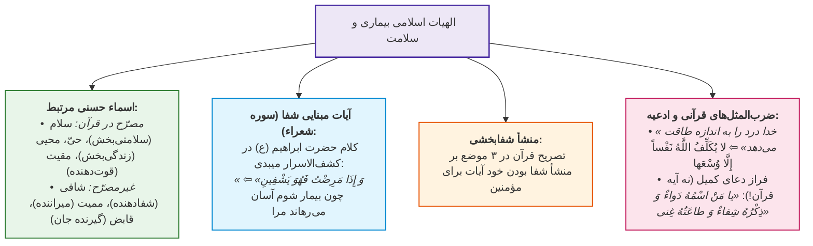

> [!important] تله تستی پیرامون اسامی الهی
> صفت **«محیی»** (حیات‌بخش) در قرآن کریم به صورت **صریح و مصرّح** ذکر شده؛ اما صفات **«ممیت»** (مرگ‌دهنده) و **«قابض»** (ستاننده جان) به صورت صریح نیامده و از روی افعال ساخته شده‌اند (**غیرمصرّح**).

### شواهد تفاسیر کهن چهارگانه در کتاب محمد شریفی

* **تفسیر طبری (قرن 4 ق):** ترجمه *«کُلُّ نَفْسٍ ذائِقَةُ الْمَوْتِ»* ⇦ **«هر تنی‌ست چشنده مرگ»**.
* **تفسیر سورآبادی (ابوبکر عتیق نیشابوری - قرن 5 ق):** ترجمه آیات استرجاع ⇦ **«مژدگان ده شکیبایان را؛ آن کسان که چون فراییشان رسد رسنده محنت گویند خدا راییم و با او گردندگانیم»**.
* **کشف‌الاسرار میبدی (قرن 6 ق):** واژه کهن **«می‌بیوسم»** معادل *امید دارم و چشم‌به‌راهم*.
* **روض‌الجنان و روح‌الجنان (ابوالفتوح رازی - قرن 6 ق)**.
* کتاب **«فرهنگ ادبیات فارسی»** تألیف *محمد شریفی* (نشر نو): مرجع جامع خلاصه‌تمامی داستان‌های فارسی.

### احادیث و امثال عربی حاکم بر بوطیقای بیماری

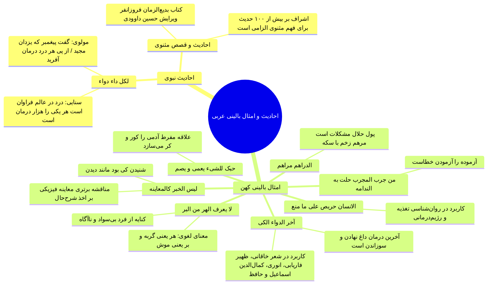

---

## 2. آگاهی‌های آناتومیک و پاتولوژیک اطباء-شعرای کلاسیک

> [!abstract] تعریف درد در طب کلاسیک
> **حکیم اسماعیل جرجانی (ذخیره خوارزمشاهی):** *«درد خبر یافتن است از حال ناطبیعی.»*

### دوگانه معمایی «تیان» در تاریخ ادبیات طبی
* **تیان (Tayan):** در لغت یعنی *گل‌مال و گچ‌کار* (شغل منقرض‌شده).
* **دوگانگی شخصیتی:**
  1. *تیان ژاژخای مروزی:* شاعر هزل‌سرا و متقدم.
  2. *تیان طبیب بمی:* اهل بم کرمان، ناظم مفاهیم بالینی:
     > *«کسی را کو ببینی درد سرفه / بفرمایش تو آب‌دوغ و خرفه*
     > *کسی را کش ببینی درد قولنج / بکافش پشت و زو سرگین برون لنج»*

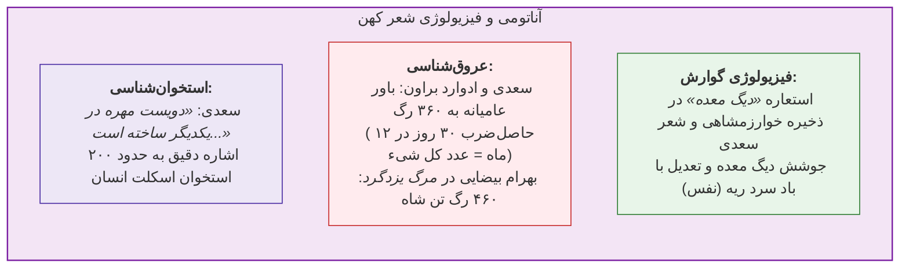

### شواهد شعری اصول بالینی مدرن

| اصل بالینی / بیماری | شاعر و شاهد متنی | تحلیل و انطباق پاتوفیزیولوژیک |
| :--- | :--- | :--- |
| **عدم آسیب (Primum non nocere)** | *ناصرخسرو:* «چو نتوان علاج درد کس کرد / میفزا از جفایش درد بر درد» | رعایت اصل نخستین طبابت: *First do no harm* |
| **فاصله‌گذاری فیزیکی (ایزولاسیون)** | *خاقانی:* «گر نگیرم در برت عذر است از آنک / بوی بیماری همی‌آید ز من» | پیشگیری از سرایت بیماری‌های واگیر تنفسی |
| **تشدید شبانه علائم (Diurnal Variation)** | *فخرالدین اسعد گرگانی (ویس و رامین):* «...که در شب بیش باشد درد بیمار» | پدیده فیزیولوژیک افت کورتیزول و تشدید درد شبانه |
| **بیماری سِل (سل و دِق)** | *منوچهری:* «تو گفتی باشدش بیماری سل» / «هر که بیماری دق دارد کجا گردد سمین» | سندروم کاشکسی و تحلیل عضلانی در بیماری‌های مزمن (*Wasting Disease*) |
| **مالاریا (تب نوبه / تب رِبع)** | *خاقانی:* «تب ربع آمدیشان را که نامم...» | تب چهاریک ناشی از عفونت انگل *Plasmodium malariae* (در برابر تب‌های سه‌یک سایر گونه‌ها) |
| **آتش پارسی (Persian Fire)** | *خاقانی:* «دید مرا گرفته لب آتش پارسی...» / *سعدی:* «...که از این آتش پارسی در تبند» | اصطلاح جالینوسی؛ تطبیق با تبخال، سیاه‌زخم، کارسینوم سلول بازال یا زخم مارجولین |
| **پیوک / عرق مدنی (کرم مدینه)** | *سعدی:* «یکی را حکایت کنند از ملوک / که بیماری رشته کردش چو دوک» | کرم انگلی *Dracunculus medinensis*؛ عامل تطبیق با مارهای دوش ضحاک و داستان یعقوب لیث |

---

## 3. کیس‌ریپورت‌های بالینی در متون کلاسیک (نظامی عروضی و بیهقی)

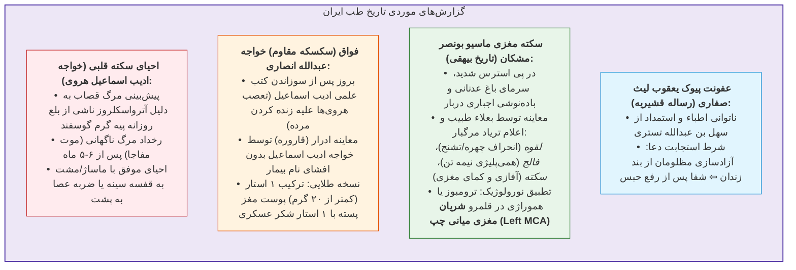

---

## 4. داروشناسی، مداخله‌های تجربی و باورهای درمانی کهن

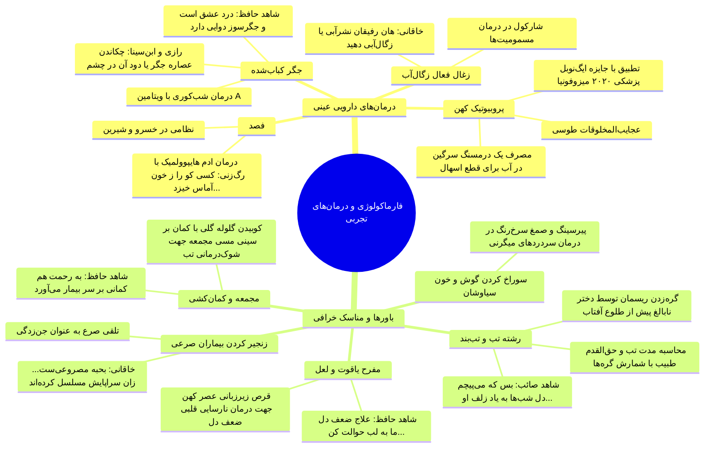

> [!important] رتبه‌بندی سلسله‌مراتب کلیسای شرق در شعر خاقانی
> بیت خاقانی: *«ز سرگین خر عیسی ببندم رعاف جاسلیق»* (بند آوردن خون‌دماغ کاردینال با عنبرنسارا).
> **ترتیب درجات کلیسای شرق از کوچک به بزرگ:**
> 1. **شماس** (خادم کلیسا) ⇦ 2. **قسیس** (کشیش) ⇦ 3. **اسقف** (بیشاپ) ⇦ 4. **مطران** (اسقف اعظم) ⇦ 5. **جاسلیق** (کاردینال/معرب کاتولیک) ⇦ 6. **بطریق** (پاتریارک/معادل پاپ).

### ادعای طبابت اولیاء و مداخله با ابزار ادبی

* **مولانا و درمان فخرالدین سیواسی:** معالجه بیماری لاعلاج با **سیر کوفته**؛ سرایش غزل بالینی:
  > *«سبل‌های کهن را... به چنگاله کشیدیم»* (سبل: عارضه چشمی شبیه سیبیل/موی داخل ملتحمه؛ چنگاله: ابزار جراحی).
  > *«مپندار که این نیز حلیله است و بلیله است / که این شهد عقاقیر ز فردوس کشیدیم»* (حلیله: مسهل؛ بلیله: قابض؛ فردوس: طعنه به *فردوس‌الحکمه* علی بن ربن طبری).
* **ابوسعید ابوالخیر و شفا با شعر:**
  * درمان ابوصالح (معلم قرآن کودکی) با خواندن رباعی: *«حورا به نظاره نگارم صف زد...»*
  * درمان **رَمَد (التهاب و چشم‌درد)** با جناس‌های چهارگانه **«بادامینا»** (مستجاب شو / بادام‌گون / شیشه در چشم بدخواه).
  * نسخه ۱۲ مرتبه خواندن رباعی پس از ذکر *یا کافی و یا شافی* برای دفع تب.

---

## 5. پاتولوژی، آسیب‌های شغلی و مرگ‌شناسی شاعران

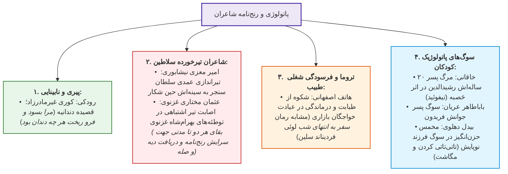

### کورس بالینی حَصبه (تیفوئید) در قصیده خاقانی
ثبت دقیق روزشمار بالینی بیماری فرزندش رشیدالدین مطابق با پاتولوژی پزشکی:
* **روز پنجم:** تب بالا و عرق سرد (*«روز پنجم به تب گرم و خوی سرد افتاد»*).
* **شب هفتم:** تغییر سطح هوشیاری و دلیریوم.
* **روز دهم:** زردی چهره و سیاهی زبان ناشی از دهیدراتاسیون شدید (*«ماه من زردچمن است و زبان کرده سیاه»*).
* **روز سیزدهم و چهاردهم:** پرفوراسیون روده، سقوط علائم و تسلیم در برابر مرگ (*«تب خدنگ اجل انداخت سپر بازدهید»*).
* طعنه به جامعه پزشکی: *«این طبیبان غلط‌بین همه محتالانند / همه را نسخه بدرید و به سر بازدهید»*.

---

## 6. کالبدشکافی انگاره‌های هفت‌گانه بیماری در ادبیات فارسی

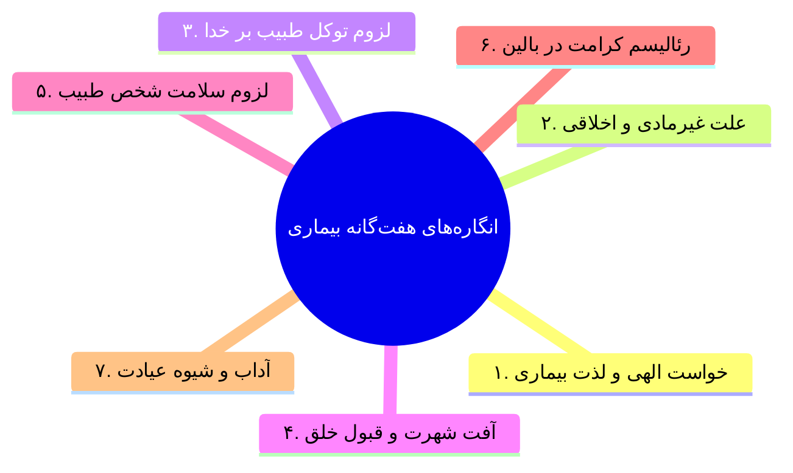

### ۱. بیماری خواست الهی است و باید از آن لذت برد (لذت بیماری)
* **رابعه عدویه (تذکرةالاولیاء):** علت رنج شدید: *«نظرتُ إلی الجنّة فأدّبنی ربی»* (نگاه سحرگاهی دلم به بهشت افتاد و خدا با بیماری ادبم کرد). توبیخ سفیان ثوری: چون رنج خواست دوست است، دعا برای رفع آن مخالفت با خواسته اوست.
* **تطور تاریخی:** زوال خردگرایی و هجوم بیگانگان ⇦ انتقال سبک از خراسانی به عراقی و هندی ⇦ پیدایش پارادایم **لذت بیماری**:
  * *سعدی:* «به انتظار عیادت که دوست می‌آید / خوش است بر دل رنجور عشق بیماری»
  * *مولوی:* «بنده این زاری‌ام، عاشق بیماری‌ام / کو نرود آن زمان از سر بالین من»
  * *حافظ:* «طبیب عشق مسیحادم است و مشفق لیک / چو درد در تو نبیند که را دوا بکند»
  * *صائب تبریزی:* مخفی کردن درد از طبیب؛ تشبیه نسیم به بیماری که منت درمان نمی‌کشد (*«شادم به ضعف خویش که بیماری نسیم...»*).
  * *میر درد:* تخلص به درد در سبک هندی (پیر نقشبندیه).
  * *عطار نیشابوری:* تفسیر آیه *«لقد خلقنا الانسان فی کبد»*؛ درمان واقعی انسان فنای اوست.

### ۲. علل غیرمادی بیماری‌ها (انعکاس گناه و نارضایتی)
* حکایت **برص (ویتیلیگو)** فضل بن یحیی برمکی در *چهار مقاله نظامی عروضی*:
  * بی‌اثری درمان‌های طبیب نامدار **جاسلیق پارس**.
  * کشف منشأ پاتولوژی: ناخشنودی پدر (یحیی برمکی) ⇦ افتادن به پای پدر و جلب رضایت ⇦ شفا با همان داروهای پیشین.

### ۳. لزوم توکل طبیب بر خدا و عدم غرور علمی
* **شکست اطباء در مثنوی:** عدم استثنا (نگفتن ان‌شاءالله از سر غرور) ⇦ معکوس شدن اثر داروها (سرکنگبین صفرافزا شد و هلیله قبض آورد).
* **حکایت ابوبکر دقاق (چهار مقاله):** عجز در درمان قولنج حاد یکی از مشاهیر نیشابور؛ دمیدن سوره فاتحه و شفا با *«داروخانه ربانی»*.
* *سعدی:* «مردی همه شب بر سر بیمار گریست / چون روز شد او بمرد و بیمار بزیست».

### ۴. قبول خلق، مار پرزهر است (غرور در شفابخشی)
* **برسیسای عابد (مجالس سبعه مولانا):** سقوط عابد مستجاب‌الدعوه به واسطه غرور ناشی از شفای دختر پادشاه و فریب ابلیس در پای چوبه دار (*«قبول خلق مار پرزهر است»*).
* **شیخ صنعان (منطق‌الطیر عطار):** کرامت شفابخشی با دم مسیحایی؛ لغزش مشابه برسیسا اما با پایان خوش.

### ۵. لزوم سلامت جسمانی خود طبیب
* ضرب‌المثل عامیانه: *«کل اگر طبیب بودی، سر خود دوا نمودی»*.
* *فردوسی:* «پزشکی که باشد به تن دردمند / ز بیمار چون باز دارد گزند»
* *ناصرخسرو:* «کی شود هیچ دردمند درست / زین طبیبان که زار و بیمارند»
* *امیرخسرو دهلوی:* «طبیبی که پیوسته بیمار ماند / نشاید به بالین بیمار خواند»
* *سعدی:* «پزشکی که خود باشدش زرد روی / از او داروی سرخ‌رویی مجوی»
* *انگاره فرعی (طبیب نباید مهربان باشد - میرجعفر مشهدی):*
  > *«اگر عاشق ز چشم یار می‌افتد / طبیب مهربان از دیده بیمار می‌افتد»*

### ۶. رئالیسم کرامت (معجزات تشخیصی و درمانی)
* **آزمون بختیشوع توسط هارون‌الرشید:** تشخیص ادرار قاطر به جای کنیزک و تجویز طنزآمیز افزایش کاه و جو.
* **کیس‌ریپورت حمال شیرازی توسط علی بن عباس اهوازی (کامل‌الصناعه):**
  * بیمار قوی‌هیکل با کفش‌های ۴.۵ کیلویی (هر لنگه ۱.۵ من) و باربری ۱۲۰۰ تا ۱۵۰۰ کیلوگرم؛ مبتلا به سردردهای متناوب دوره‌ای ۱۰ تا ۱۵ روزه.
  * *پروتکل درمان معجزه‌آسا:* بردن به صحرا، بستن دستار دور گردن و پیچاندن آن، زدن ۲۰ ضربه با کفش سنگین بر سر او، بستن بیمار به اسب و دواندن تا مرز بیهوشی، تخلیه ۳۰۰ درمسنگ (حدود ۱۴۰۰ سی‌سی) خون از بینی (رعاف درمانی) ⇦ خواب ۲۴ ساعته و درمان ابدی سردرد.

### ۷. آداب و شیوه عیادت (بیمارپرسی)
* *سعدی:* ترجیح همنشینی بر هدایا: *«هزار شربت شیرین و میوه مشموم / چنان مفید نباشد که بوی صحبت یار»*.
* *ابوالحسن نوری و جنید بغدادی (تذکرةالاولیاء):* نفی عیادت تشریفاتی با گل و میوه؛ عیادت عرفانی با تقبل بخشی از بار رنج بیمار (*«تحملنا عنه»*).
* *عیادت شبلی در تیمارستان (رساله قشیریه):* سنگ زدن به ملاقات‌کنندگان مدعی دوستی برای آزمودن صداقت آنان در تحمل بلای دوست.

---

## 7. ماتریس تطبیقی رویکردهای هفت‌گانه به مقوله بیماری در ادب فارسی

| انگاره محوری | نمایندگان شاخص ادبی | مأخذ و بستر متنی | پیامد بالینی و اخلاقی |
| :--- | :--- | :--- | :--- |
| **۱. لذت بیماری** | رابعه عدویه، سعدی، مولوی، حافظ، صائب | تذکرةالاولیاء، غزلیات، دیوان صائب | تقدیس درد و پرهیز از درمان زودهنگام |
| **۲. علل غیرمادی** | فضل برمکی، یحیی برمکی | چهار مقاله نظامی عروضی | وابستگی شفای جسم به تسویه تعارضات اخلاقی |
| **۳. توکل در درمان** | مولوی، ابوبکر دقاق | مثنوی معنوی، چهار مقاله | نفی استقلال فارماکولوژی منهای اراده الهی |
| **۴. آفت قبول خلق** | برسیسا، شیخ صنعان | مجالس سبعه، منطق‌الطیر | هشدار نسبت به ابتلای طبیب به نارسیسیسم و شهرت |
| **۵. سلامت طبیب** | فردوسی، ناصرخسرو، امیرخسرو، سعدی | شاهنامه، دیوان ناصرخسرو، بوستان | لزوم صلاحیت زیستی و وجاهت بالینی معالج |
| **۶. رئالیسم کرامت** | بختیشوع، علی بن عباس اهوازی | تاریخ طب، کامل‌الصناعه | برتری فراست و نبوغ شهودی بر داده‌های کلینیکی |
| **۷. عیادت راستین** | ابوالحسن نوری، جنید، شبلی | تذکرةالاولیاء، رساله قشیریه | اصالت درک همدلانه رنج در برابر هدایای فرمالیته |

> [!tip] چکیده شب امتحانی جلسه چهاردهم
> سنت ادبی پس از اسلام، سلامت و بیماری را فراتر از تعادل مزاجی دانسته و آن را به **ساحت روان، اخلاق، توکل و آزمون معنوی** پیوند می‌زند. در این دیدگاه، طبیب حاذق نه تکنسین مغرور داروشناس، بلکه انسانی متوکل و فروتن است که ریشه درد را در پیوند میان جان و جهان جست‌وجو می‌کند.

# جلسه پانزدهم: چرا ادبیات؟ مبانی عصب‌شناختی، نوروپلاستیستی و روان‌شناختی پیوند ادبیات با پزشکی

## 1. شالوده و پرسش بنیادین: چرا یک پزشک باید ادبیات بخواند؟

> [!abstract] تبیین سه‌وجهی ضرورت ادبیات برای جامعه پزشکی
> ادبیات داستانی و شعر برای پزشک یک تفنن اختیاری نیست؛ بلکه زیربنای مهارت‌های عصب‌شناختی و انسانی است. پاسخ به چرایی مطالعه ادبیات در **سه گستره علمی** تحلیل می‌شود:
> 1. **عصب‌شناسی پایه (نوروساینس ۱):** سازوکار نورون‌های آینه‌ای (*Mirror Neurons*) و شبیه‌سازی زیستی تجارب.
> 2. **انعطاف‌پذیری مغزی (نوروساینس ۲):** نوروپلاستیستی (*Neuroplasticity*)، شکستن دید لوله‌تفنگی و بازآرایی آناتومیک/عملکردی مغز.
> 3. **روان‌شناسی و روان‌پزشکی اگزیستانسیال:** معنادرمانی (*Logotherapy*)، فرار از فرسودگی شغلی و حواس شش‌گانه عصر مفهوم‌پردازی.

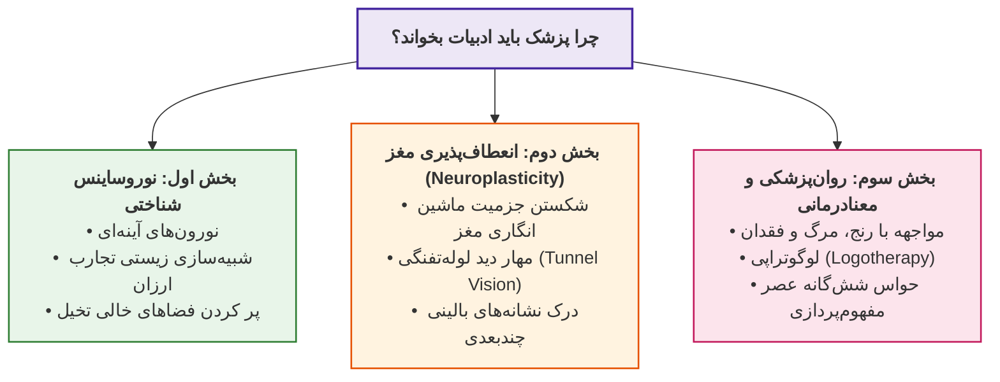

---

## 2. بخش اول عصب‌شناسی: نورون‌های آینه‌ای و ادبیات به مثابه شبیه‌ساز زندگی

### کشف تاریخی نورون‌های آینه‌ای (دهه 1990 و ثبت 2002)
* **پژوهشگران ایتالیایی در دهه 1990:** جراحی جمجمه و کاشت الکترود در مغز گونه‌ای از میمون‌ها با شباهت ساختاری به انسان؛ با هدف شناسایی مرکز صدور فرمان حرکتیِ دراز کردن دست برای برداشتن میوه (محدوده **ناحیه بروکا / Broca's Area**).
* **کشف شگفت‌انگیز تصادفی:** ثبت دقیق همان سطح از فعالیت الکتریکی مغز میمون هنگامی که *میمونی دیگر یا یکی از پرسنل آزمایشگاه* دست دراز کرده و میوه را در دهان می‌گذاشت، بدون آنکه خود میمون حرکتی کرده باشد!
* **نام‌گذاری در سال 2002:** ثبت رسمی واژه **نورون آینه‌ای (Mirror Neuron)**؛ دسته‌ای اختصاصی در کنار نورون‌های حسی و حرکتی (یا زیرمجموعه‌ای سازمان‌یافته از آن‌ها).

> [!abstract] تعریف نورون آینه‌ای (Mirror Neuron)
> سلول عصبی ویژه‌ای که هم هنگام *انجام فیزیکی یک عمل* و هم هنگام *مشاهده انجام همان عمل توسط دیگری* تحریک می‌شود؛ رفتارهای بیرونی را مانند آینه در کالبد شناختی فرد بازتاب داده و کپی می‌کند.

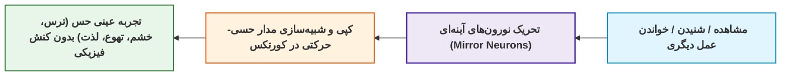

### شواهد پژوهشی در تأیید اثر نورون‌های آینه‌ای
1. **آزمایش پیانو - پاسکال لئونه (دانشگاه هاروارد - 2003):**
   * دو گروه فرد فاقد پیش‌‌زمینه موسیقی و نُت‌خوانی؛ آموزش ۳ نت ساده (*دو - ر - می*).
   * *گروه اول:* ۵ روز در هفته، روزی ۲ ساعت (مجموعاً ۱۰ ساعت) نواختن فیزیکی ممتد پیانو.
   * *گروه دوم:* ۵ روز در هفته، روزی ۲ ساعت صرفاً نشستن پشت پیانو و **تمرکز ذهنی/تصور نواختن**.
   * *نتیجه fMRI:* **میزان تحریک و فعالیت کورتکس حرکتی هر دو گروه کاملاً یکسان بود!** مقاله تحت عنوان: *«ما همان چیزی هستیم که به آن می‌اندیشیم»* (انطباق با اندیشه مولانا: *«هر چیز که در جستن آنی، آنی»*).
2. **آزمایش انزجار و طعم بدمزه - مُمبابی (دانشگاه تگزاس - 2008):**
   * *گروه ۱:* چشیدن فیزیکی محلول بسیار تلخ و بدمزه تحریک‌کننده پرزهای چشایی.
   * *گروه ۲:* تماشای فیلم نوشیدن فنجان بدمزه توسط بازیگر و درهم رفتن عضلات چهره‌اش.
   * *گروه ۳:* شنیدن سناریوی خیالی (فردی از زیر بالکن عبور کرده و قطرات استفراغ صاحبخانه داخل دهانش می‌ریزد).
   * *نتیجه fMRI:* در هر سه گروه، **بخش اینسولای قدامی (Anterior Insula)** مغز (کانون حس اشمئزاز و تهوع) به یک اندازه تحریک شد!
3. **آزمایشگاه شناخت در دانشگاه واشنگتن (2009 - ژورنال Psychological Science):**
   * اسکن مغزی حین خواندن داستان اثبات کرد مطالعه یک کنش منفعل نیست؛ خواننده هر رخداد را با تجارب پیشین شبیه‌سازی کرده و دقیقاً همان مراکز حسی-حرکتی دنیای واقعی برانگیخته می‌شوند.

### مصادیق رسانه‌ای و عامیانه نورون‌های آینه‌ای
* **فیلم روانی (Psycho - 1960) هیچکاک:** سکانس ۳ دقیقه‌ای قتل در حمام و گزارش سال‌ها اضطراب دوش گرفتن در میان زنان.
* **واکنش به فیلم و فوتبال:** گریه کردن همراه با سریال درام، ترشح آدرنالین هنگام فیلم جنگی و فریاد کشیدن پای فوتبال (*«پاس بده!»*).
* **تمثیل پرواز در شبیه‌ساز (Simulator):** کارآموز خلبانی از روز نخست پشت کابین واقعی نمی‌نشیند، بلکه در کابین شبیه‌ساز سقوط و مانور را با امنیت کامل تمرین می‌کند. ادبیات دقیقاً **شبیه‌ساز رایگان زندگی (Life Simulator)** برای کسب تجربه زیسته است.

### چرا داستان از فیلم سینمایی برتر و محرک‌تر است؟
* **تحلیل برگرفته از کتاب «حیوان قصه‌گو» (The Storytelling Animal) نوشته جاناتان گاتشال (ترجمه عباس مخبر - نشر مرکز):**
  * فیلم تمام اجزای چهره، لباس و دکور را تحمیل می‌کند و تخیل را محدود می‌سازد.
  * داستان واجد **فضاهای نانوشته (جاهای خالی)** است که ذهن مخاطب برای ادراک ناگزیر است با بافت، رنگ و سایه آن را تکمیل کند؛ در نتیجه حجم بسیار بالاتری از نورون‌های آینه‌ای فعال می‌شوند.
* **شواهد متنی کتاب‌ها:**
  * *جنگ و صلح تولستوی:* صحنه شهادت پتیا؛ تولستوی از اشک سروان دنیسوف سخنی نمی‌گوید، بلکه می‌نویسد: *«دنیسوف به آرامی از جسد گرم پتیا دور شد، دستش را روی نرده گذاشت و میله‌ها را چنگ زد»*؛ ذهن خواننده سوگ را بازآفرینی می‌کند.
  * *رمان گرگ سفید (دیوید گمل):* توصیف ۳ خطی دراس (Dros) و اسکیلگانون در مهمانخانه و خوردن دو کلوچه گوشت با سبزیجات کبابی پس از شکستن هیزم؛ استنتاج دقیق ساختار جثه، روحیات جنگاوری و تبرزنی کاراکتر از میان خطوط کوتاه بدون گزافه‌گویی نویسنده.
* **شواهد شعر کلاسیک و کهن‌الگوها:**
  * *سعدی:* تأکید بر خواندن شاهنامه برای شاهان (*«اینکه در شهنامه‌ها آورده‌اند / رستم و رویین‌تن اسفندیار / تا بدانند این خداوندان ملک / کز بسی خلق است دنیا یادگار»*؛ تحریک نورون‌های آینه‌ای حاکمان جهت درک گذرا بودن قدرت).
  * *هزار و یک شب:* شهرزاد هر شب با روایتگری، نورون‌های آینه‌ای شهریارِ زن‌ستیز را تحریک می‌کند تا جهان را فراتر از تروما و خیانت همسر اولش ببیند.
  * *داستان به مثابه پنجره عقبی (Rear Window):* پناهگاه امن روانی جهت گریز موقت از تنش‌های واقعی و ورود به اقلیم زیستی دیگر بدون هزینه عاطفی.

---

## 3. بخش دوم عصب‌شناسی: نوروپلاستیستی و پیوند متون ادبی با مهارت بالینی

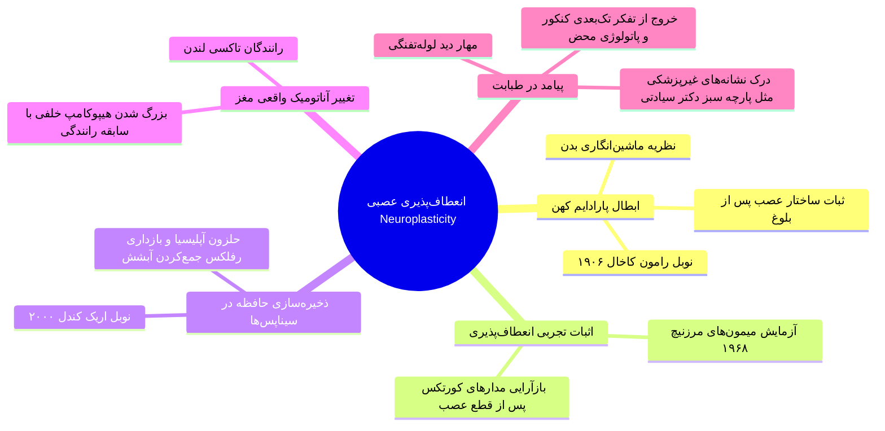

### فروپاشی دگماتیسم ثبات عصبی و اثبات نوروپلاستیستی
* **تصور کهن مکانیکی:** فرض بدن به عنوان ماشین؛ با این انگاره که نورون‌های مغزی پس از بلوغ دست‌نخورده باقی مانده و جز در موارد تروما یا دژنراسیون تغییری نمی‌کنند (مورد تأیید دانشمندانی نظیر *سانتیاگو رامون کاخال - برنده نوبل 1906*).
* **آزمایش انقلابی مایکل مِرزنیچ (دانشگاه ویسکانسین - 1968):**
  * هم‌زمان با انقلاب دانشجویی می ۱۹۶۸ فرانسه؛ سوراخ کردن جمجمه میمون‌ها و ثبت رفتارهای قشری.
  * قطع عصب یک انگشت یا دست میمون ⇦ ایجاد آشفتگی اولیه در کورتکس ⇦ پدیداری پدیده حیرت‌انگیز: **پس از چند ماه، مغز الگوی بازآرایی‌شده و منظمی ساخت** و بخش‌های دیگر کورتکس وظایف ناحیه قطع‌شده را تقبل کردند!
  * استنتاج: مغز سیستمی پویا و انعطاف‌پذیر از بدو تولد تا لحظه مرگ است.
* **نوبل پزشکی و فیزیولوژی 2000 - اریک کَندل (Eric Kandel):**
  * کشف فرآیند *ذخیره‌سازی حافظه در نورون‌ها* بر روی حلزون دریایی **آپلیسیا (Aplysia)** به دلیل داشتن نورون‌های غول‌پیکر و شبکه ساده.
  * رفلکس اولیه حلزون: جمع‌کردن آنی آبشش با کوچک‌ترین لمس.
  * مداخله: لمس‌های مکرر و بی‌‌خطر با ابزار ⇦ یادگیری سیستم عصبی و مهار واکنش دفاعی.
* **آزمایش رانندگان تاکسی لندن (دهه 1990):**
  * بررسی ساختار مغزی ۱۶ راننده تاکسی با سابقه رانندگی ۲ تا ۴۲ سال در خیابان‌های پیچیده لندن.
  * تصویربرداری MRI: **بخش خلفی هیپوکامپ (Posterior Hippocampus)** که مسئول نقشه خوانی فضایی است به شکل معناداری بزرگ‌تر از حد متوسط جامعه بود و میزان افزایش حجم دقیقاً با *سنوات رانندگی* همبستگی مستقیم داشت (هم‌زمان با کوچک‌تر شدن هیپوکامپ قدامی).
* **حل پارادوکس کهن فلسفی تجربی/عقلانی:** سازش میان عقل‌گرایی *امانوئل کانت* (ساختار ژنتیکی پیشینی) و تجربه‌گرایی *جان لاک* (لوح سفید تجربی)؛ ژنتیک آرایش پایه‌ای کورتکس را تعیین می‌کند، اما داده‌ها و تجارب زیسته فرم فیزیکی و سیناپسی آن را بازآفرینی می‌نمایند.

### کتاب‌شناسی محوری نوروپلاستیستی
* **کتاب «اینترنت با مغز ما چه می‌کند؟» (The Shallows) نوشته نیکلاس کار (Nicholas Carr):**
  * ترجمه اول: *کم‌عمق‌ها* (ترجمه امیر سپهرام - نشر مازیار).
  * ترجمه دوم: *اینترنت با مغز ما چه می‌کند؟* (ترجمه محمود حبیبی - نشر گمان / قطع پالتویی).
  * هشدار محوری کتاب: رسانه‌ها و ابزارهای تکرارشونده مغز را بازسیم‌کشی می‌کنند؛ وب‌گردی و اسکرول سریع سبب آتروفی توجه پایدار و حجیم شدن بخش حل جدول لوبر فرونتال می‌گردد.

### آفت تخصص‌گرایی: خطر «دید لوله‌‌تفنگی» (Tunnel Vision) در پزشکان
* دانشجوی پزشکی در چرخه ۷.۵ ساله عمومی و دوره‌های رزیدنتی و فلوشیپ، به دلیل حجم سرسام‌آور مطالب حفظی و پاتولوژی، مغز خود را بازسیم‌کشی می‌کند تا انسان را صرفاً یک **کیس آموزشی (Educational Case)** ببیند.
* **خطای کرونایی:** ارجاع تمامی شکایات بیمار به کووید-۱۹ به علت غلبه جوی و غفلت از تشخیص‌های افتراقی.
* **نقش نجات‌بخش ادبیات:** تحریک مداوم مدارهای اموشنال و نورون‌های آینه‌ای، انعطاف مغز را تضمین کرده و جلوی مسخ شدن روابط انسانی را می‌گیرد.

> [!important] تمثیل بالینی طلایی: پارچه سبز استاد دکتر سیادتی
> در راند آموزشی اطفال، استاد *دکتر احمد سیادتی* از دانشجویان خواست برجسته‌ترین نشانه بالینی کودک را بیان کنند. دانشجویان مواردی نظیر رنگ پوست، علامت پرچم موی سر، نبض و فرم لب را ذکر کردند.
> **پاسخ دکتر سیادتی:** هیچ‌کدام! مهم‌ترین نشانه، **بسته‌بودن پارچه سبز به مچ دست کودک** است؛ نشانه‌ای دال بر اینکه بیماری کودک *مزمن* است، والدین مسیرهای درمانی را پیموده و اکنون درمانده به نذر و توسل به امامزاده روی آورده‌اند. ادبیات با معرفی پیچیدگی‌های انسان، دستیابی به این بصیرت بالینی را تسهیل می‌کند.

### جلوه‌های پاتولوژی و بیماری در رمان‌های جهان
* **برادران کارامازوف (داستایفسکی):** زیگموند فروید آن را نمونه تیپیک تحلیل *عقده ادیپ* می‌داند. کاراکتر *اسمردیاکوف* مبتلا به صرع بوده و تصویر صرع در رمان بازتاب ابتلای خودِ داستایفسکی به **اپی‌لپسی (Epilepsy)** است.
* **مرگ آرتمیو کروز (کارلوس فوئنتس):** شاهکار سبک *جریان سیال ذهن* در آمریکای لاتین؛ بازنمایی احتضار و هذیان‌های روان‌شناختی-پزشکی یک سرمایه‌دار بدحال بر بستر مرگ با مشاوره‌های علمی موثق.

---

## 4. بخش سوم روان‌پزشکی و معنایابی: معنادرمانی و حواس شش‌گانه دانیل پینک

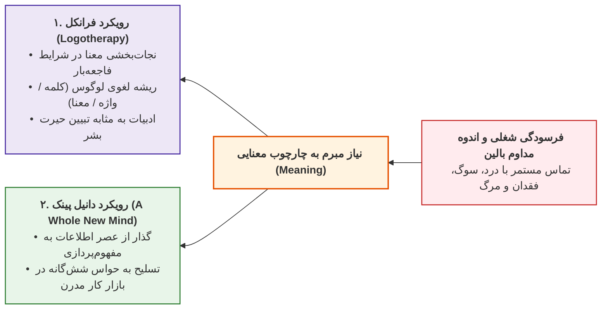

### لوگوتراپی ویکتور فرانکل (Logotherapy)
* **بستر تجربی:** دکتر ویکتور فرانکل عصب‌‌شناس و روان‌پزشک اتریشی؛ اشتغال در بخش خودکشی زنان در وین (1930 تا 1938) و سپس ۳ سال حبس در اردوگاه‌های کار اجباری آلمان نازی نظیر **آشویتس** و **داخائو** (1942 تا 1945).
* **کتاب ماندگار:** *«انسان در جستجوی معنا» (Man's Search for Meaning)*؛ ترجمه معتبر و قدیمی توسط *دکتر نهضت صالحیان و مهین میلانی* (نشر درسا).
* **مشاهده بالینی اردوگاه:** افراد قدرتمند جسمانی زنده نمی‌ماندند، بلکه کسانی می‌مردند که امید را واگذاشته و ساعت‌ها به گوشه دیوار خیره می‌شدند؛ بقا متعلق به کسانی بود که برای رنج خود **معنایی** داشتند.
* **اصول سه‌گانه معنادرمانی:**
  1. زندگی تحت هر شرایطی (حتی بدترین مصائب) واجد معناست.
  2. محرک بنیادین بشر، انگیزه و اراده معطوف به کشف معنا در زیستن است.
  3. آزادی اراده فردی در انتخاب نگرش در برابر رنج‌های محتوم.
* **ریشه‌شناسی لوگوس (Logos):** واژه یونانی به معنای *«معنا»* و هم‌زمان به معنای *«کلمه/واژه»*؛ ادبیات (کلمات) زاینده معناست.

> [!abstract] کالبدشکافی سکانس شاهکار «زوربای یونانی» (نیکوس کازانتزاکیس - ترجمه محمد قاضی)
> در صفحات ۳۸۰ و ۳۸۱ رمان، پس از تماشای جسد زنی که زوربا دوستش می‌داشت، زوربا قفس طوطی را میان زانوان گرفته و با بهت به آسمان می‌‌نگرد و از ارباب اهل مطالعه‌اش می‌پرسد:
> *«ارباب، تو می‌توانی به من بگویی همه این چیزها چه معنایی دارد؟ چه کسی آن‌ها را ساخته و برای چه؟ و به‌‌خصوص، چرا آدم می‌میرد؟»*
> ارباب پاسخ می‌دهد: *«نمی‌دانم زوربا.»*
> زوربا می‌خروشد: *«پس همه این کتاب‌های نکبتی که می‌خوانی به چه درد می‌خورند؟ اگر درباره این‌ها چیزی نمی‌گویند پس چه می‌گویند؟»*
> ارباب می‌گوید: **«آن‌ها از سرگردانی آدمی حرف می‌زنند که نمی‌تواند به این سؤال تو جواب بدهد!»**
> ادبیات کانون تبیین سرگشتگی انسان در برابر مرگ است (همانند رباعیات خیام و غزلیات حافظ)؛ ادبیات فقدان پاسخ را معنا می‌بخشد و پزشک را از سندروم فرسودگی شغلی نجات می‌دهد.

### عصر مفهوم‌پردازی و حواس شش‌گانه دانیل پینک (Daniel Pink)
* **منبع:** کتاب *«ذهن کامل نو» (A Whole New Mind)* ترجمه رضا امیررحیمی (نشر آگاه).
* **تز دانیل پینک:** عصر اطلاعات (دسترسی انحصاری به داده‌ها) پایان یافته است؛ امروزه اطلاعات و علائم پزشکی در اینترنت در دسترس همگان است. ما وارد **عصر مفهوم‌پردازی (Conceptual Age)** شده‌ایم.
* **موفقیت شغلی پزشک در گرو تسلط بر حواس شش‌گانه مدرن:**

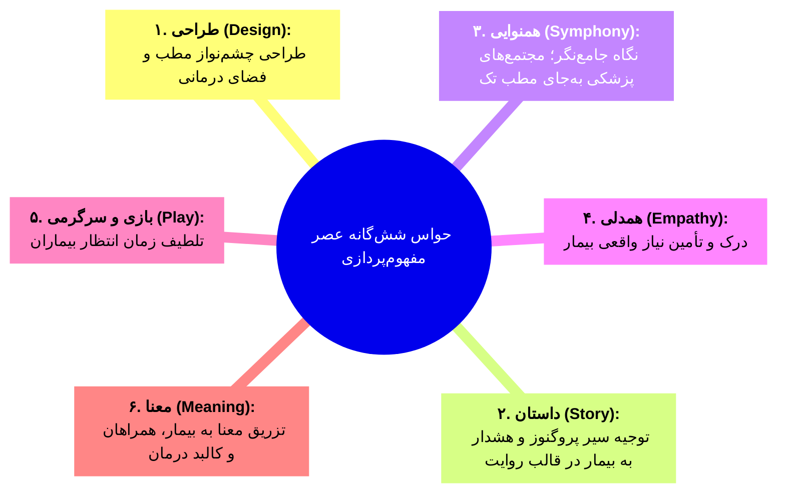

---

## 5. ماتریس تطبیقی سه لایه دفاع عصب‌شناختی-روانی از خواندن ادبیات

| ساحت ارزیابی | لایه اول: عصب‌‌شناسی پایه | لایه دوم: انعطاف‌پذیری عصبی | لایه سوم: روان‌پزشکی و معنایابی |
| :--- | :--- | :--- | :--- |
| **مفهوم کلیدی** | **نورون‌های آینه‌ای** (*Mirror Neurons*) | **نوروپلاستیستی** (*Neuroplasticity*) | **معنادرمانی** (*Logotherapy*) و حواس نو |
| **دانشمندان و متون** | دانشمندان ایتالیایی، لئونه، گاتشال | مرزنیچ، اریک کندل، نیکلاس کار | ویکتور فرانکل، کازانتزاکیس، دانیل پینک |
| **مکانیسم عملکرد** | کپی شناختی و شبیه‌سازی ارزان تجربه | تغییر در سیناپس‌ها و ضخامت قشر مغز | پیوند زدن رنج بالین به کلیت معنادار جهان |
| **خروجی مستقیم برای پزشک** | درک درونی حس بیمار بدون هزینه واقعی | پرهیز از دید لوله‌تفنگی و خطای تشخیصی | مهار فرسودگی شغلی و همدلی عمیق |
| **شواهد و مصادیق برجسته** | *جنگ و صلح*، *روانی*، فیلم و فوتبال | رانندگان لندن، حلزون آپلیسیا، دکتر سیادتی | *انسان در جستجوی معنا*، *زوربا*، *ذهن کامل نو* |

> [!tip] چکیده امتحانی جلسه پانزدهم
> پزشک با خواندن ادبیات، **نورون‌های آینه‌ای** خود را برای درک بی‌واسطه رنج برمی‌انگیزد، از طریق **نوروپلاستیستی** ساختار مغز خود را منعطف و چندبعدی نگه می‌دارد تا از دام دید تک‌بعدی لوله‌تفنگی برهد، و با سلاح **معنادرمانی** و روایت‌گری، در برابر تروما و مرگ مداوم بیماران تاب‌آوری یافته و به بالاترین سطح شفقت بالینی نائل می‌شود.

# جلسه شانزدهم: داستان پزشکی (Medical Fiction)؛ تاریخچه، گونه‌‌شناسی چهارگانه، آثار شاخص و روایت‌های بالینی

## 1. درک عمومی از جامعه پزشکی: دست‌خط، زبان و نوشتار

> [!abstract] تصویر کلیشه‌ای جامعه از پزشکان
> 1. **دست‌خط پزشکی:** تند، ناخوانا و درهم‌‌پیچیده که خوانش آن صرفاً در انحصار نسخه‌پیچ‌های داروخانه است.
> 2. **زبان محاوره‌ای پزشکی:** کاربرد مفرط اصطلاحات تخصصی و لاتین که مانع شکل‌گیری ارتباط مؤثر درمانی با بیمار می‌شود.
> 3. **ادبیات مکتوب رایج:** تولید انبوه جزوات دانشگاهی، مقالات پژوهشی و کتب مرجع آموزشی در طول دوران تحصیل و طبابت.

---

## 2. پیشینه منظومه‌های آموزش پزشکی در تاریخ ادبیات ایران

پزشکان کلاسیک برای تسهیل یادسپاری و آموزش بیماری‌ها، از وزن، قافیه و آرایه‌های ادبی فارسی بهره می‌بردند.

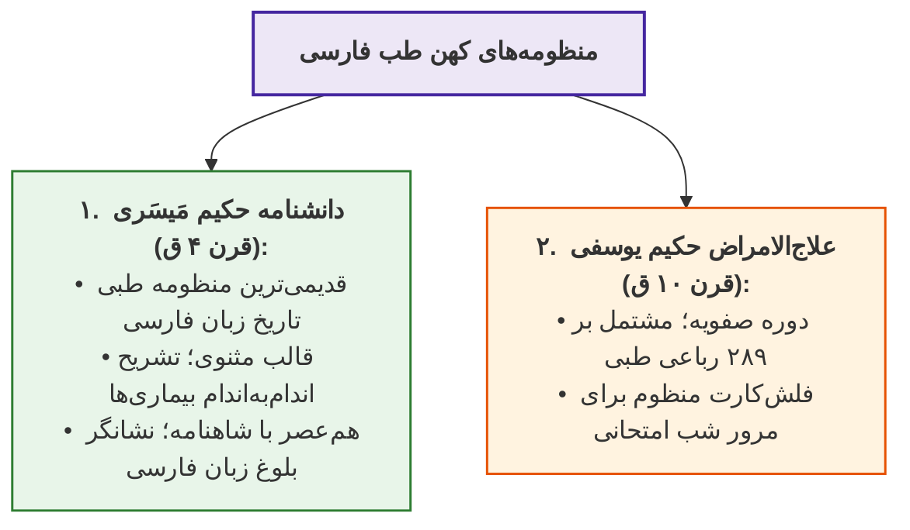

### کالبدشکافی دو نمونه از رباعیات طبی «علاج‌الامراض» حکیم یوسفی

1. **رباعی ۲۹ (علاج بیماری عشق):**
   * *دیدگاه طب سنتی:* عشق نوعی مرض **سوداوی** (ناشی از خلط سودا) هم‌تراز با *مالیخولیا* است (ابن‌سینا در کتاب *قانون* فصلی را به «علاج العشق» اختصاص داده است).
   * *شاهد متنی و تشبیه به طور سینا:*
     > *«هر کس که ز راه صدق عاشق باشد / در **طور طریق عشق** صادق باشد*
     > *نزدیک طبیب حاذق آن شیفته را / **وصل است علاجی که موافق باشد***»
   * *نسخه درمانی:* ازدواج و پیوند وصال، یگانه درمان معتبر عشق از دید این طبیب است.

2. **رباعی ۱۲۴ (خفقان قلبی / آریتمی):**
   * *دیدگاه طب سنتی:* خفقان قلبی معادل *تپش قلب و آریتمی* است که **۵ منشأ** دارد: ۴ نوع ناشی از غلبه *اخلاط چهارگانه* (دم، صفرا، بلغم، سودا) و نوع پنجم ناشی از **فساد فکر، وحشت، اندوه و غصه**.
   * *شاهد متنی و تمثیل فرار دود از آتش:*
     > *«ای در خفقان جُست طریق پرهیز / بشنو ز من این نکته حکمت‌آمیز*
     > *هر جا که قضا **آتش غم** افروزد / **برخیز مثال دود زانجا بگریز***»
   * *مقایسه درمانی:* ابن‌سینا در *قانون* برای خفقان ناشی از غم، جوشانده *گل گاوزبان* تجویز کرده؛ اما حکیم یوسفی نسخه روان‌شناختی «گریختن از محیط تنش‌زا همانند دود» را صادر می‌کند.

---

## 3. گونه‌‌شناسی چهارگانه پیوند متون ادبی با پزشکی

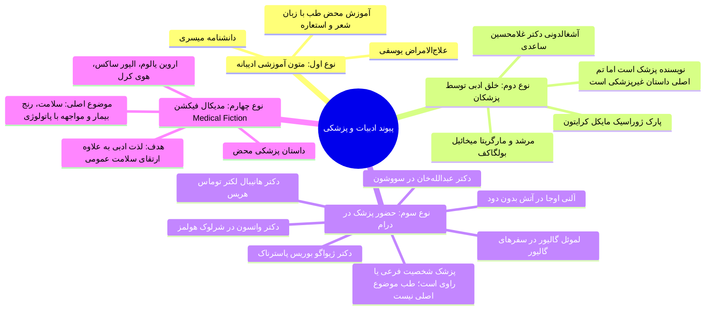

### جدول مقایسه تطبیقی گونه‌های چهارگانه ادبیات مرتبط با پزشکی

| گونه اثر | جایگاه نویسنده | محوریت موضوع اثر | هدف بنیادین نگارش | نمونه‌های شاخص ادبی |
| :--- | :--- | :--- | :--- | :--- |
| **نوع اول: آموزشی ادیبانه** | الزاماً **پزشک/طبیب** | **آموزش پاتولوژی و درمان** با استعاره و صنایع لفظی | تسهیل حفظ و یادسپاری مفاهیم تشخیصی و بالینی | *دانشنامه* میسری، *علاج‌الامراض* یوسفی، *قانون* ابن‌سینا |
| **نوع دوم: ادیبان پزشک** | الزاماً **پزشک** | **داستان غیرپزشکی** (جامعه‌شناختی، جنایی، درام) | خلق اثر ادبی ناب؛ بروز رگه‌های ناخودآگاه علمی | *پارک ژوراسیک*، *مرشد و مارگریتا*، *آشغالدونی* |
| **نوع سوم: کاراکتر پزشک** | پزشک یا **غیرپزشک** | **پیرنگ مستقل**؛ پزشک به عنوان راوی یا ابزار تصادف | پیشبرد درام، استنتاج معمایی یا نقد ساختار قدرت | *شرلوک هولمز*، *گالیور*، *سووشون*، *آتش بدون دود* |
| **نوع چهارم: مدیکال فیکشن** | پزشک، **بیمار یا ادیب** | **بیماری، اختلال زیستی و رنج انسان** | **ارتقای سواد سلامت جامعه** همراه با آفرینش ادبی | *وقتی نیچه گریست*، *سه‌شنبه‌ها با موری*، *شگفتی* |

> [!important] ارزش جامعه‌شناختی داستان کوتاه «آشغالدونی» (دکتر غلامحسین ساعدی)
> ساعدی (روان‌پزشک) با شناخت بالینی از تجارت کثیف پلاسما و خریدوفروش خون مستمندان در دهه ۴۰ و ۵۰، رمان *آشغالدونی* را نوشت. اقتباس سینمایی آن یعنی فیلم **«دایره مینا»** ساخته *داریوش مهرجویی*، نقش تاریخی تعیین‌کننده‌ای در تأسیس **سازمان انتقال خون ایران** ایفا کرد.

---

## 4. کالبدشکافی مدیکال فیکشن (داستان پزشکی)

> [!abstract] تعریف مدیکال فیکشن (Medical Fiction)
> اثر داستانی یا روایتی که **سلامت، بیماری، پاتولوژی یا محیط درمانی** تم و محور اصلی آن است؛ هدف آن صرفاً لذت ادبی نیست، بلکه **ارتقای سلامت عمومی جامعه** از طریق آگاهی‌بخشی، همدلی با دردمندان و تبیین بعد انسانی رنج است.

```mermaid
flowchart TD
    MF["<b>ارکان بنیادین داستان پزشکی (Medical Fiction)</b>"]
    MF --> Target["<b>تنوع مخاطب:</b><br>از کودکان و نوجوانان تا بزرگسالان"]
    MF --> Author["<b>تنوع پدیدآورنده:</b><br>پزشک، بیمار دردمند یا نویسنده حرفه‌ای با تحقیق بالینی"]
    MF --> Scope["<b>تنوع پاتولوژی:</b><br>بیماری‌های اعصاب و روان، بیماری‌های کشنده جسمی و سندروم‌های مادرزادی"]
    MF --> Mission["<b>رسالت غایی:</b><br>کاستن از انگ بیماری (Stigma) و ارتقای همدلی عمومی"]

    style MF fill:#ede7f6,stroke:#4527a0,stroke-width:2px;
    style Target fill:#e1f5fe,stroke:#0288d1,stroke-width:1.5px;
    style Author fill:#fff3e0,stroke:#e65100,stroke-width:1.5px;
    style Scope fill:#ffebee,stroke:#c62828,stroke-width:1.5px;
    style Mission fill:#e8f5e9,stroke:#2e7d32,stroke-width:1.5px;
```

---

## 5. تحلیل آثار شاخص مدیکال فیکشن در جهان

```mermaid
flowchart TD
    subgraph Psych["۱. رمان‌های روان‌پزشکی و اگزیستانسیال"]
        direction RL
        Yalom["<b>سه‌گانه اروین یالوم (استاد استنفورد):</b><br>• <i>وقتی نیچه گریست</i> (ترجمه دکتر سپیده حبیب تا چاپ ۳۹)<br>واکاوی وسواس فکری-عملی (OCD) نیچه در دیدار خیالی با دکتر یوزف برویر و لو سالومه<br>• <i>درمان شوپنهاور</i><br>• <i>مسئله اسپینوزا</i>"]
        Nash["<b>ذهن زیبا (سیلویا ناسار):</b><br>بیوگرافی جان نش (نوبل اقتصاد ۱۹۹۴) و ۳۰ سال نبرد با <b>اسکیزوفرنی پارانوئید</b>"]
        Haddon["<b>ماجرای عجیب سگی در شب (مارک هادون):</b><br>ترجمه شیلا ساسانی‌نیا؛ بازنمایی جهان‌بینی و احساسات کودک مبتلا به <b>اوتیسم</b>"]
    end

    subgraph Somatic["۲. رمان‌های بیماری‌های مزمن جسمی"]
        direction RL
        Mann["<b>کوهستان جادو (توماس مان - نوبل ۱۹۲۴):</b><br>اقامت ۷ ساله در آسایشگاه مسلولین کوهستان در عصر پیشاآنتی‌بیوتیک و انزوای وحشتناک <b>بیماری سل</b>"]
        Morrie["<b>سه‌شنبه‌ها با موری (میچ آلبوم):</b><br>ترجمه مهدی قراچه‌داغی؛ روایت بالینی تحلیل نورون‌های حرکتی در بیماری <b>اسکلروز جانبی آمیوتروفیک (ALS)</b>"]
    end

    subgraph Pediatric["۳. ادبیات کودک و نوجوان"]
        direction RL
        Palacio["<b>شگفتی / اعجوبه (آر. جی. پالاسیو):</b><br>ترجمه پروین علیپور؛ نبرد اجتماعی کودک مبتلا به <b>سندروم تریچر کالینز</b> (بدشکلی کرانیوفاشیال اتوزوم غالب) در کلاس پنجم"]
    end

    style Psych fill:#ede7f6,stroke:#4527a0,stroke-width:1.5px;
    style Somatic fill:#fff3e0,stroke:#e65100,stroke-width:1.5px;
    style Pediatric fill:#e8f5e9,stroke:#2e7d32,stroke-width:1.5px;
```

---

## 6. روایت‌های بالینی عصب‌شناختی و زاویه دید بیمار

```mermaid
flowchart TD
    Narratives["<b>روایت‌نگاری بالینی (Clinical & Illness Narratives)</b>"]
    Narratives --> Sacks["<b>روایت پزشک: دکتر الیور ساکس</b><br>• عصب‌شناس نیویورکر (فوت ۲۰۱۵ با کنسر اعصاب)<br>• کتاب <i>مردی که زنش را با کلاه اشتباه می‌گرفت</i> (۲۰ روایت بالینی)<br>• شرح حال پروسوپاگنوزیا (چهره‌کوری / آگنوزی بینایی)<br>• <i>اصل بنیادین:</i> مسئولیت در برابر «انسان رنجور» نه فقط «کیس بیماری»"]
    Narratives --> Carel["<b>روایت بیمار: پروفسور هَوی کَرِل (Havi Carel)</b><br>• استاد فلسفه دانشگاه بریستول<br>• کتاب <i>بیماری (Illness)</i><br>• گزارش ۱۰ سال زیست با بیماری نادر ریوی <b>LAM</b><br>• کالبدشکافی زیست‌شناختی ترس از مرگ و سلامت در عین بیماری"]

    style Narratives fill:#ede7f6,stroke:#4527a0,stroke-width:2px;
    style Sacks fill:#e1f5fe,stroke:#0288d1,stroke-width:1.5px;
    style Carel fill:#fce4ec,stroke:#c2185b,stroke-width:1.5px;
```

> [!tip] کتاب طلایی بالینی برای جامعه درمانی
> کتاب **«مردی که زنش را با کلاه اشتباه می‌گرفت»** (ترجمه ماندانا فرهادیان - نشر نو) از سوی احسان رضایی به عنوان **ضروری‌ترین کتاب برای دانشجویان پزشکی** معرفی شده است. این اثر با ارجاع به بزرگانی چون *آنا کارنینای تولستوی* و *شوپنهاور* ثابت می‌کند پزشک کارآمد نیازمند گنجینه غنی از ادبیات و نگرش همدلانه انسانی است.

> [!warning] تله تستی پیرامون بیماری LAM در کتاب هوی کرل
> بیماری مؤلف کتاب «بیماری» (*هوی کرل*)، **لمفانژیو لیومیوماتوزیس (LAM)** است؛ این بیماری یک اختلال **نادر ریوی** محسوب می‌شود، نه یک عارضه روانی یا نورولوژیک!

---

## 7. ماتریس مقایسه ابعاد بالینی آثار شاخص مدیکال فیکشن

| عنوان اثر داستانی | پدیدآورنده | بیماری و نقص محوری | راوی و زاویه دید | دستاورد و پیام سلامت |
| :--- | :--- | :--- | :--- | :--- |
| **وقتی نیچه گریست** | دکتر اروین یالوم (روان‌پزشک) | **وسواس فکری-عملی (OCD)** | دانای کل / پزشک معالج | کارآمدی روان‌درمانی اگزیستانسیال |
| **یک ذهن زیبا** | سیلویا ناسار (غیرپزشک) | **اسکیزوفرنی پارانوئید** | ناظر بیرونی / مستندنگاری | توان همزیستی نبوغ ریاضی با سایکوز مزمن |
| **عجیب سگی در شب** | مارک هادون (غیرپزشک) | **طیف اوتیسم (Autism)** | کودک مبتلا به اوتیسم | درک پردازش حسی و فکری کودکان اوتیستیک |
| **کوهستان جادو** | توماس مان (ادیب) | **بیماری سِل (Tuberculosis)** | دانشجوی ساکن در آسایشگاه | نمایش ایزولاسیون و انزوای روانی مسلولین |
| **سه‌شنبه‌ها با موری** | میچ آلبوم (روزنامه‌نگار) | **اسکلروز جانبی آمیوتروفیک (ALS)** | شاگرد در گفتگو با استاد | رشد روحی و پذیرش مرگ در بستر ناتوانی شدید |
| **شگفتی (اعجوبه)** | آر. جی. پالاسیو (نویسنده) | **سندروم تریچر کالینز** | کودک و اطرافیان (متکثر) | لزوم پذیرش اجتماعی کودکان با بدشکلی صورت |
| **مردی که زنش...** | دکتر الیور ساکس (نورولوژیست) | **پروسوپاگنوزیا و عوارض کورتکس** | عصب‌شناس بالینی مشفق | انتقال نگاه انسان‌‌محور در درمان بیماری‌ها |
| **بیماری (Illness)** | هوی کرل (فیلسوف) | **لمفانژیو لیومیوماتوزیس (LAM)** | بیمار مبتلا (تجربه زیسته) | فلسفه تداوم زندگی معنادار در اوج عجز تنفس |

> [!important] چکیده امتحانی جلسه شانزدهم
> مدیکال فیکشن شاخه‌ای اصیل از ادبیات است که با پیوند زدن لذت فرمی رمان با **ارتقای درک سلامت و کاهش انگ اجتماعی بیماری**، مرز میان طبابت و روایت را برمی‌دارد. موفقیت درمانگر مدرن در گرو خروج از نگاه خشک ماشینی و تسلیح به بصیرت روایی نهفته در شاهکارهای داستانی است.

# جلسه هفدهم: بازتاب طب، جراحی کهن، نشانه‌شناسی بالینی و کیس‌ریپورت‌های درمانی در نظم و نثر فارسی

## 1. ریشه‌شناسی تاریخی و پیوند طب با حکمت در ایران باستان و دوره اسلامی

> [!abstract] سابقه دیرینه و نخستین پزشک تاریخ اساطیری ایران
> بشر از آغاز پیدایش برای مهار آلام و دردها به *سحر، جادو و گیاهان دارویی* متوسل شد. در متون کهن ایرانی، نخستین پزشک تاریخ **«سریع‌تر»** (ثریتا / تریتا) است؛ نخستین کسی که تب و مرگ را از انسان‌ها دور ساخت و خداوند به پاداش این شفقت، فرزندی بی‌همتا چون **گرشاسپ** (پهلوان نامدار) به او بخشید.

```mermaid
flowchart TD
    Origin["<b>تبارشناسی تاریخی آموزش و ممارست طب در ایران</b>"]
    Origin --> Pre["<b>۱. دوره پیش از اسلام:</b><br>• نخستین طبیب: <i>سریع‌تر</i> (پدر گرشاسپ)<br>• مرکز تمدنی درمان: <i>بیمارستان و دانشگاه جندی‌شاپور</i> ساسانی"]
    Origin --> Islamic["<b>۲. عصر اسلامی و پیوند با حکمت:</b><br>• حدیث نبوی مبنایی: <i>«العلم علمان؛ علم الادیان و علم الابدان»</i><br>• ورود اطبای مسیحی و یهودی جندی‌‌شاپور به دستگاه خلافت عباسی<br>• فلسفه به مثابه مادر علوم: <i>هر فیلسوف الزاماً طبیب بود</i>"]
    Origin --> Lit["<b>۳. تحول سبک شعر در قرن ششم هجری:</b><br>• گذار از سبک خراسانی به <b>سبک عراقی</b><br>• شعر همانند <i>چنته درویشان</i>: ورود مضامین طب، نجوم و باورهای عامیانه"]

    style Origin fill:#ede7f6,stroke:#4527a0,stroke-width:2px;
    style Pre fill:#e8f5e9,stroke:#2e7d32,stroke-width:1.5px;
    style Islamic fill:#e1f5fe,stroke:#0288d1,stroke-width:1.5px;
    style Lit fill:#fff3e0,stroke:#e65100,stroke-width:1.5px;
```

---

## 2. کالبدشکافی نخستین جراحی سزارین (رستم‌زاد) در شاهنامه فردوسی

فردوسی نخستین شاعری است که مستقیماً به شرح فرآیند دقیق یک **مداخله جراحی ماژور** در قالب شعر پرداخته است.

> [!important] تله امتحانی پیرامون واژه سزارین
> واژه *سزارین* تاریخی متأخر برآمده از نام ژولیوس سزار (امپراتور روم) دارد؛ در حالی که روایت زایش رستم از بطن رودابه با اصطلاح **رستم‌زاد** از منظر تقدم اسطوره‌ای-تاریخی بر مدل رومی پیشی دارد.

```mermaid
flowchart TD
    A["<b>دیستوشی و وزن بالای جنین</b><br>سنگینی بطن رودابه:<br><i>«تو گویی به سنگ استم آگنده پوست...»</i>"]
    --> B["<b>استمداد زال از سیمرغ</b><br>سوزاندن پر در آتش مجمر و تاریک‌شدن هوا"]
    --> C["<b>پروتکل بیهوشی و بی‌دردی</b><br>مست‌کردن رودابه با شراب (مِی):<br><i>«نخستین به می ماه را مست کن...»</i>"]
    --> D["<b>مداخله جراحی موبد-پزشک</b><br>شکافتن تهیگاه با خنجر آبگون و<br>چرخاندن سر نوزاد (مانور سفالیک)"]
    --> E["<b>سوتور و داروی ترمیمی</b><br>دوختن موضع؛ کوبیدن گیاه دارویی با شیر و مشک<br>و خشک‌کردن در سایه جهت التیام فوری"]

    style A fill:#ffebee,stroke:#c62828,stroke-width:1.5px;
    style B fill:#fff3e0,stroke:#e65100,stroke-width:1.5px;
    style C fill:#ede7f6,stroke:#4527a0,stroke-width:1.5px;
    style D fill:#e8f5e9,stroke:#2e7d32,stroke-width:2px;
    style E fill:#e1f5fe,stroke:#0288d1,stroke-width:1.5px;
```

### شواهد و جزئیات تکنیکال جراحی در ابیات فردوسی

1. **علائم بالینی دیستوشی:** زردی چهره، درد شبانه‌روزی و حس وزن غیرعادی:
   > *«همی برگشایم به فریاد لب / تو گویی به سنگ استم آگنده پوست / وگر آهن است آن که نیز اندروست»*
2. **پرهیز از اقدام غیرمتخصصانه:** سیمرغ زال را از دخالت مستقیم بازمی‌دارد و دستور به احضار جراح ماهر می‌دهد:
   > *«بیاور یکی خنجر آبگون / یکی مرد بینادل پرفسون»*
3. **مانور چرخش سر جنین (Cephalic Version) توسط ماما/جراح:**
   > *«بکافید بی‌‌رنج پهلوی ماه / **بتابید مر بچه را سر ز راه***»*
4. **فرمولاسیون پانسمان بیولوژیک با اثر التیام روزانه:**
   > *«گیاهی که گویمت با شیر و مشک / بکوب و بکن هر سه در سایه خشک*
   > *بساو و برآلای بر خستگیش / **ببینی همان روز پیوستگیش***»*

---

## 3. تمثیل‌های فیزیولوژیک، آسیب‌شناسی و روان‌تنی در متون شعری

```mermaid
mindmap
  root((تمثیل‌های بالینی در شعر کلاسیک))
    عطار نیشابوری
      داروساز و صاحب دکان داروخانه
      سرایش الهی‌نامه و مصیبت‌نامه در داروخانه
    اسماعیل جرجانی و مولانا
      فیزیولوژی جنین در ذخیره خوارزمشاهی
      چسبیدن میوه خام به درخت معادل تعصب و خامی انسان
      سخت‌گیری و تعصب خامی است / تا جنینی کار خون‌آشامی است
    خاقانی شروانی
      آسیب‌شناسی هاری و هیدروفوبی Hydrophobia
      ترس سگ‌گزیده و گرگزیده از آب و انعکاس آیینه
      آزرده چرخم نکنم آرزوی کس / آری نرود گرگزیده ز پی آب
    نظامی گنجوی
      پند به فرزندش محمد در لیلی و مجنون
      تأکید بر سواد کامل پزشکی
      می‌باش طبیب عیسوی‌هش / اما نه طبیب آدمی‌کش
```

### کالبدشکافی روان‌پزشکی حکایت کنیزک و پادشاه (مولانا)

* **تشخیص تفریقی بالینی:** طبیب با مشاهده چهره، لمس نبض و رد علل ارگانیک دریافت منشأ رنج، زیستی نبوده بلکه **بیماری عشق (سودای قلبی)** است.
* **آزمون پایش نبض هم‌گام با تحریک کلامی (تداعی معانی):** قراردادن انگشت بر *مجس* (نبض) و نام‌بردن از بلاد و اشخاص؛ بروز **تاکی‌کاردی و جهش ناگهانی نبض** با شنیدن نام *زرگر سمرقندی*.
* **تحلیل اخلاقی-روانی درمان:** پس از وصال، با مسموم‌کردن تعمدی زرگر و زوال طراوت جسمانی او، دلدادگی کنیزک زایل شد:
  > *«عشق‌هایی کز پی رنگی بود / عشق نبود عاقبت ننگی بود»*

---

## 4. کالبدشکافی غزل تمام‌طبیبانه خواجه حافظ شیرازی

حافظ در غزل مشهور *«فاتحه‌ای چو آمدی بر سر خسته‌ای بخوان»*، تمامی ارکان **سیمیولوژی (نشانه‌شناسی بالینی) و پاراکلینیک قدما** را در هیئت صنایع ادبی گنجانده است.

```mermaid
flowchart RL
    subgraph Semiology["ماتریس تشخیصی اطبای سنتی در غزل حافظ"]
    direction TD
        P1["<b>۱. عیادت و تسکین معنوی:</b><br>قرائت فاتحةالکتاب بر بالین مجروح <i>(خسته)</i><br>مبتنی بر حدیث: <i>فاتحةالکتاب شفاء الامراض</i>"]
        P2["<b>۲. معاینه زبان (Tongue Examination):</b><br>بررسی بار زبان ناشی از بخارات سودا، صفرا یا سوءهاضمه:<br><i>«ای که طبیب خسته‌ای روی زبان من ببین / که این دم و دود سینه‌ام بار دل است بر زبان»</i>"]
        P3["<b>۳. پایش دما و نبض (Fever & Pulse):</b><br>تب با حرارت نفوذکننده به استخوان؛ پاشویه با اشک چشم:<br><i>«بازنشان حرارتم زآب دو دیده و ببین / نبض مرا که می‌دهد هیچ ز زندگی نشان»</i>"]
        P4["<b>۴. بررسی ادرار در شیشه (قاروره‌نگری / تفصره):</b><br>ارزیابی رنگ و رسوب ادرار در ظرف شیشه‌ای <i>(مظروف به نام ظرف)</i>:<br><i>«آن که مدام شیشه‌ام از پی عشق داده است / شیشه‌ام از چه می‌برد پیش طبیب هر زمان»</i>"]
        P5["<b>۵. نسخه دارویی (شربت و آب حیات):</b><br>ترک ادویه ترکیبی اطباء و گزینش کلام حافظ به عنوان اکسیر جاودانگی:<br><i>«ترک طبیب کن بیا نسخه شربتم بخوان»</i>"]
    end

    style Semiology fill:#f3e5f5,stroke:#7b1fa2,stroke-width:1.5px;
    style P1 fill:#ede7f6,stroke:#4527a0,stroke-width:1px;
    style P2 fill:#fff3e0,stroke:#e65100,stroke-width:1px;
    style P3 fill:#ffebee,stroke:#c62828,stroke-width:1px;
    style P4 fill:#e1f5fe,stroke:#0288d1,stroke-width:1px;
    style P5 fill:#e8f5e9,stroke:#2e7d32,stroke-width:1px;
```

> [!tip] ایهام بالینی-ادبی در بیت شیشه حافظ
> واژه **«مدام»** در بیت چهارم دارای ایهام است: 1. *پیوسته و همیشگی* 2. *شراب*. واژه **«شیشه»** نیز ایهام دارد به: 1. *تنگ باده* 2. *قاروره ادرار* جهت ارائه به طبیب.

---

## 5. دانشنامه پاتولوژی و داروشناسی سه‌گانه در دیوان خاقانی شروانی

خاقانی به سبب اشراف عمیق بر دانش زمان، پیچیده‌ترین استعارات طبی را در اشعارش به‌کار برده که ادراک آن‌ها منوط به شناخت اصطلاحات پاتوفیزیولوژی است.

```mermaid
mindmap
  root((داروشناسی سه‌گانه خاقانی))
    ادویه گیاهی
      افیون
      باقلا
      بنفشه
      بلاذر
      بلسان
      بهمن
      بیدانجیر
      مشک
      تخم ریحان
      تباشیر
      حنظل
      خون سیاوشان
    ادویه معدنی و کانی
      مرجان
      مومیا مومبایی
      یاقوت
      سیماب جیوه
    ادویه با منشأ حیوانی
      تریاق پادزهر
      سقنقور چلپاسه مصری
      قرص مار
      معجون سرطان خرچنگ
```

### شواهد تصویری-پاتولوژیک در قصاید خاقانی

| پاتولوژی / نشانه بالینی | شاهد شعری خاقانی | تحلیل تصویرسازی پزشکی |
| :--- | :--- | :--- |
| **صرع و تشنج کانونیک (Epilepsy)** | *«گویی خُمِ صرع‌دار شد چرخ / کان زرد کف از دهان برانداخت»* | تشبیه گردون به خمی مبتلا به بیماری صرع؛ تشبیه طلوع/غروب خورشید به کف زرد خارج‌شده از دهان مصروع حین تشنج |
| **سل و سرفه خونی (Hemoptysis)** | *«آن حلق صراحی بین کز مِی به فواق افتد / چون سرفه‌کنان از خون، بیمار به صبح اندر»* | تشبیه صدای خروج شراب از تنگ صراحی به سکسکه (*فواق*) و جریان جهنده خون به بالا آوردن خلط خونی مسلول در بامداد |
| **عفونت و بیماری وبا (Cholera)** | *«خود به حضور سگی بحر نگردد نجس / خود به وجود خری خُلد نیابد وبا»* | انتقال نیافتن بیماری‌های عفونی و مسری به فرد مصون؛ آب کُر با نجاست سگ و بهشت با لاشه خر آلوده به وبا نمی‌شود |
| **فهرست ۲۳ بیماری در شعر خاقانی** | *آبله، استسقا، برص، تب، جذام، خفقان، خُناق، دِق (سل)، زکام، سرسام، سرفه خون، سگ‌گزیدگی، صرع، امراض صفراوی، طاعون، قولنج، ناقل، ناخنه (بیماری چشم)، نقرس، وبا، یرقان* | پوشش تمام دستگاه‌های فیزیولوژیک از چشم و پوست تا اعصاب و تنفس |

---

## 6. کیس‌ریپورت‌های بالینی شاهکار در کتب نثر کلاسیک فارسی

```mermaid
flowchart TD
    subgraph ProseCases["سه پرونده بالینی درخشان در نثر کهن"]
        direction TB
        C1["<b>۱. کلیله و دمنه (بهرام‌شاهی):</b><br>• باب برزویه طبیب (پزشک اعظم انوشیروان ساسانی)<br>• نگارش مقدمه توسط بزرگمهر بوزرجمهر<br>• معرفی تبار: پدر از لشکریان و مادر از علمای دین زرتشت"]
        C2["<b>۲. چهار مقاله نظامی عروضی:</b><br><b>الف) درمان مالیخولیا توسط ابن‌سینا:</b> توهم گاو پنداری شاهزاده آل‌بویه (مجدالدوله/فخرالدوله)<br><b>ب) احیای سکته قلبی توسط ادیب اسماعیل هروی:</b> نجات قصاب با ضربه عصا بر کف پای مرده"]
        C3["<b>۳. جوامع‌الحکایات سدیدالدین عوفی:</b><br><b>درمان زالوی دهانه معده توسط رازی:</b> تفکیک عارضه محیطی از بیماری درونی با طحلب (جامه غوک)"]
    end

    style ProseCases fill:#ede7f6,stroke:#4527a0,stroke-width:1.5px;
    style C1 fill:#e3f2fd,stroke:#1565c0,stroke-width:1px;
    style C2 fill:#fff3e0,stroke:#e65100,stroke-width:1px;
    style C3 fill:#e8f5e9,stroke:#2e7d32,stroke-width:1px;
```

### واکاوی پرونده اول: درمان سایکوز مالیخولیا توسط بوعلی‌سینا

1. **شرح‌حال و شکایت اصلی:** بیمار از شاهزادگان آل‌بویه مبتلا به جنون سوداوی (مالیخولیا؛ شبیه *اسکیزوفرنی*) با هذیان مسخ جسمانی؛ تقلید صدای گاو و درخواست ذبح: *«مرا بکشید که از گوشت من حریسه (حلیم) نیکو آید»*.
2. **عجز اطباء و وساطت سیاسی:** ارجاع به ابوعلی سینا (در آن ایام وزیر علاءالدوله کاکویه در اصفهان و همدان).
3. **روان‌درمانی تعاملی (Paradoxical Intervention):**
   * بوعلی در لباس قصاب با کاردی بران وارد شد و فریاد زد: *«این گاو کجاست تا او را بکشم؟»*
   * بیمار ماغ کشید؛ بوعلی دست‌وپای او را بست، بر پهلو خواباند و دست بر دنده‌هایش نهاد.
   * صدور حکم زیرکانه: **«این گاو بسیار لاغر است و نشاید کشتن؛ علف دهیدش تا فربه شود!»**
4. **پیامد بالینی:** بیمار به امید ذبح‌شدن با میل و رغبت غذاها، شربت‌ها و داروهای مسهل سودا را مصرف نمود و ظرف **یک ماه** شفا یافت.

### واکاوی پرونده دوم: درمان زالو (دیوچه) در فم معده توسط محمد بن زکریای رازی

```mermaid
flowchart TD
    P_Complaint["بیمار جوان بغدادی در ری:<br><b>هموپتزی شدید (استفراغ و سرفه خونی)</b>"]
    --> P_Exam["معاینه نبض و <b>دلیل</b> (آزمایش ادرار) توسط رازی:<br>رد بیماری‌های سیستمیک و سل"]
    --> P_History["شرح‌حال محیطی:<br>سابقه شرب آب از <b>آبگیرهای راکد</b> بین راه"]
    --> P_Diagnosis["تشخیص قطعی:<br>انگل موضعی؛ چسبیدن <b>دیوچه (زالو)</b> به کاردیا/فم معده"]
    --> P_Therapy["خوراندن اجباری <b>طَحلَب (جامه غوک / خزه و جلبک آبگیر)</b><br>ایجاد تهوع شدید و تنقیه معده ⇦ جداشدن زالو به سمت خزه و خروج کامل"]

    style P_Complaint fill:#ffebee,stroke:#c62828,stroke-width:1px;
    style P_Exam fill:#fff3e0,stroke:#e65100,stroke-width:1px;
    style P_History fill:#e1f5fe,stroke:#0288d1,stroke-width:1px;
    style P_Diagnosis fill:#f3e5f5,stroke:#7b1fa2,stroke-width:1.5px;
    style P_Therapy fill:#e8f5e9,stroke:#2e7d32,stroke-width:2px;
```

---

## 7. ماتریس مقایسه تطبیقی رویکردهای تشخیصی-درمانی در متون کهن

| اثر ادبی / تاریخی | پزشک / حکیم معالج | بیماری و آسیب محوری | راهبرد درمانی و تکنیک مداخله | دستاورد علمی و پیام بالینی |
| :--- | :--- | :--- | :--- | :--- |
| **شاهنامه فردوسی** | موبد-پزشک (به هدایت سیمرغ) | **دیستوشی زایمان** (جنین پیلتن) | بی‌هوشی با مِی، لاپاراتومی تهیگاه و بخیه | ثبت تقدم اسطوره‌ای عمل رستم‌زاد بر سزارین |
| **مثنوی معنوی** | طبیب الهی غیبی | **بیماری عشق** (سودای روانی) | پایش نبض با تداعی معانی، وصال و سپس سم | ریشه‌کنی علایق صرفاً جسمانی و درک روانی |
| **دیوان حافظ** | طبیب عشق / پیر مغان | **عشق، تب و رنج فراق** | معاینه زبان، سنجش نبض، دیدن قاروره | تلفیق اعجازآمیز نشانه‌شناسی بالینی با شعر |
| **چهار مقاله** | شیخ‌الرئیس ابن‌سینا | **مالیخولیا** (توهم گاوپنداری) | سایکودرام در نقش قصاب جهت ترغیب به تغذیه | شاهکار درمان شناختی-رفتاری در جنون مزمن |
| **چهار مقاله** | خواجه ادیب اسماعیل هروی | **ایست قلبی قصاب** (آترواسکلروز پیه) | شوک مکانیکی با ضربات مکرر عصا بر پشت پا | احیای موفق بیمار سکته‌ای با عارضه پلژی |
| **جوامع‌الحکایات** | محمد بن زکریای رازی | **سرفه خونی** ناشی از زالوی فم معده | خوراندن جلبک آبگیر (طحلب) و القای امزیس | برتری بررسی اپیدمیولوژیک آب بر پاراکلینیک |

> [!tip] چکیده امتحانی جلسه هفدهم
> ادبیات کلاسیک فارسی آیینه‌ای تمام‌نما از تکامل طبابت تجربی است. از ابداع جراحی پیشرفته **رستم‌زاد** در شاهنامه تا روان‌پزشکی خلاقانه **ابن‌سینا** در مداوای مالیخولیا، و معاینه سیستماتیک **نبض، زبان و قاروره** در غزل حافظ، شاعران و نویسندگان ایرانی همواره فراتر از استعاره‌پردازی، دقیق‌ترین مشاهدات بالینی عصر خویش را جاودانه ساخته‌اند.

# جلسه هجدهم: چرایی ادبیات فارسی در طبابت؛ پزشکی روایی (Narrative Medicine)، همدلی بالینی، مردم‌نگاری درمان و مهارت‌های ارتباطی

---

## 1. پارادایم پزشکی روایی (Narrative Medicine) و شالوده‌شکنی اخذ شرح‌حال

> [!abstract] تعریف پزشکی روایی (Narrative Medicine)
> رویکرد بالینی مدرن مبتنی بر **گوش‌سپاری کامل به داستان بیماری از زبان خود بیمار** بدون قطع مکرر کلام با چک‌لیست‌های تکراری، و سپس **ترجمه و تلخیص آن روایت به گزاره‌های علمی و استاندارد** درون پرونده بالینی.

```mermaid
flowchart TD
    subgraph Traditional["مدل چک‌لیستی و بازجویانه سنتی"]
    direction TD
        T1["شکایت بیمار: <i>«دلم درد می‌کنه»</i>"]
        --> T2["مداخله فوری پزشک و پریدن وسط حرف:<br>• چند وقته؟ کجاش؟<br>• با نشستن کم میشه یا زیاد؟<br>• قبل غذاست یا بعدش؟"]
        --> T3["خروجی: <b>فراموشی فکت‌های حیاتی ناگفته</b> و حس نشنیده‌شدن بیمار"]
    end

    subgraph Narrative["مدل پزشکی روایی (رویکرد مدرن)"]
    direction TD
        N1["سکوت اولیه و دادن فضای روایت آزاد به بیمار"]
        --> N2["کشف سرنخ‌های ناخواسته، عواطف و داروهای اعلام‌نشده"]
        --> N3["خروجی: <b>پاسخ به سوالات ناپرسیده</b>، تسریع تشخیص و ثبت پایدار"]
    end

    style Traditional fill:#ffebee,stroke:#c62828,stroke-width:1.5px;
    style Narrative fill:#e8f5e9,stroke:#2e7d32,stroke-width:2px;
    style T1 fill:#fff3e0,stroke:#e65100,stroke-width:1px;
    style T2 fill:#ffcdd2,stroke:#b71c1c,stroke-width:1px;
    style T3 fill:#fce4ec,stroke:#880e4f,stroke-width:1px;
    style N1 fill:#e1f5fe,stroke:#0288d1,stroke-width:1px;
    style N2 fill:#d1c4e9,stroke:#512da8,stroke-width:1.5px;
    style N3 fill:#c8e6c9,stroke:#1b5e20,stroke-width:1.5px;
```

> [!warning] خطای شناختی زمان‌سنجی در مواجهه بالینی
> نگرانی عمده پزشکان از پرگویی بیمار و اتلاف وقت مطب/بخش یک **توهم آماری** است؛ مدت‌زمان صحبت خودانگیخته بیمار در صورت عدم قطع کلام بسیار کوتاه‌تر از تخمین ذهنی درمانگر است و برعکس، از دورهای باطل سوال‌وجواب تشخیصی جلوگیری می‌کند.

### فواید سه‌گانه گوش‌سپاری روایی برای پزشک و بیمار

1. **ارتقای روانی بیمار:** ایجاد احساس شنیده‌شدن و احترام به کرامت انسانی.
2. **ارزش تشخیصی بالا:** کشف داده‌هایی که پزشک اصلاً به پرسیدن آن‌ها فکر نمی‌کرد.
3. **ثبت ماندگار در حافظه:** مغز انسان داده‌های پیرنگ‌دار و روایی را چندین برابر بهتر از کلیدواژه‌های گسسته به خاطر می‌سپارد.

```mermaid
flowchart RL
    A["<b>داده‌های خشک بالینی:</b><br>مرد ۶۴ ساله، دیابتی، پولیپ مثانه، پارگی IVC"] -->|بازآفرینی ساختار روایی| B["<b>روایت دراماتیک در حافظه پزشک:</b><br>مرد ۶۰ ساله دیابتی ⇦ هماچوری در چکاپ ⇦ سیستوسکوپی ⇦ کشف پولیپ ⇦ آسیب دیواره مثانه حین رزکسیون ⇦ لاپاراتومی ترمیمی ⇦ آسیب ناخواسته به ورید اجوف تحتانی (IVC)"]

    style A fill:#ffebee,stroke:#c62828,stroke-width:1.5px;
    style B fill:#e8f5e9,stroke:#2e7d32,stroke-width:2px;
```

> [!important] کیس‌ریپورت تشخیصی: دام تقلید درد قلبی با داکسی‌‌سایکلین
> بیمار خانم با شکایت درد تیپیک قفسه سینه؛ در بازجویی بالینی هیچ منشأ عضوی قلبی یافت نشد و بیمار دچار سوءظن اضطراب گردید. در شرح‌حال روایی آزاد، بیمار از بهبود جوش‌های صورت پس از انزوای اجتماعی طولانی گفت: **«یک ماه است برای آکنه‌ها داکسی‌سایکلین مصرف می‌کنم»** (دارویی که بیمار مصرف آن را به دلیل نامرتبط دانستن به قلب کتمان کرده بود).
> * **نکته بالینی:** داکسی‌سایکلین عامل بروز **ازوفاژیت دارویی (Pill-induced Esophagitis)** و مقلد دقیق دردهای ایسکمیک قفسه سینه است. گوش‌دادن به روایت، پاسخ سوال مطرح‌نشده را آشکار ساخت!

---

## 2. کالبدشکافی مفهوم همدلی (Empathy)؛ تمایز شکایت ظاهری و هراس واقعی

> [!abstract] تعریف همدلی بالینی
> نگریستن به تابلوی بیماری **از دریچه چشم خود بیمار**؛ فهم این واقعیت که انگیزه اصلی مراجعه در اغلب موارد *شدت درد فیزیکی* نیست، بلکه **بار عاطفی و وحشت از ماهیت کشنده درد** است.

```mermaid
flowchart RL
    Complaint["<b>شکایت اصلی ظاهری (Chief Complaint):</b><br>درد شدید فیزیکی <i>(سردرد، درد سینه)</i>"]
    --> Latent["<b>انگیزه پنهان مراجعه (Real Concern):</b><br>اضطراب اگزیستانسیال از مرگ ناگهانی، سکته یا تومور مغزی"]
    --> Intervention["<b>مداخله همدلانه طبیب:</b><br>اطمینان‌بخشی علمی و تفهیم خوش‌خیم بودن پاتولوژی"]
    --> Relief["<b>تسکین روانی بدون مسکن:</b><br>تحمل‌پذیر شدن درد فیزیکی و استغنای بیمار از دارو"]

    style Complaint fill:#ffebee,stroke:#c62828,stroke-width:1.5px;
    style Latent fill:#fff3e0,stroke:#e65100,stroke-width:1.5px;
    style Intervention fill:#e1f5fe,stroke:#0288d1,stroke-width:2px;
    style Relief fill:#e8f5e9,stroke:#2e7d32,stroke-width:1.5px;
```

* **تجربه زیسته دکتر معتمد (سردرد ساعت ۳ بامداد):** بستری با هراس از خونریزی داخل مغزی (ICH)؛ پس از سی‌تی‌آنژیوگرافی نرمال، شدت فیزیکی سردرد بدون دریافت هیچ مسکنی هیچ تفاوتی نکرد، اما رنج آن کاملاً ناپدید شد؛ زیرا *عامل وحشت از مرگ* مهار شده بود.
* **کاربرد در بیماران قفسه سینه:** مراجعان درمانگاه قلب وحشت از سکته قریب‌الوقوع قلبی دارند؛ به‌محض رد پاتولوژی عروق کرونر، بیمار عنوان می‌کند: *«خیالم راحت شد، درد دیگر آزارم نمی‌دهد»* و حتی مصرف مسکن را رد می‌کند.

---

## 3. ارتباط بین‌فرهنگی و مردم‌نگاری سلامت در مواجهه با بیماران

تسلط بر ادبیات و متون، دریچه ورود به شناخت فرهنگ‌ها، باورهای فولکلور و خرده‌فرهنگ‌های بومی است:

```mermaid
mindmap
  root((ظرافت‌های بین‌فرهنگی و خرده‌فرهنگ‌ها))
    تفاوت‌های بین‌المللی در اقدامات تهاجمی
      آنژیوگرافی فمورال در ژاپن
        ممنوعیت شیو موی ناحیه کشاله ران
        تقدس و ارزش موی بدن در فرهنگ ژاپنی
        تکنیک بافتن موها به جای تراشیدن
      معاینه فیزیکی و لمس بالینی
        ایران: عرف ورود مستقیم و سمع با استتوسکوپ
        غرب: لزوم کسب رضایت آگاهانه مجزا از کودک و والدین
    خرده‌فرهنگ‌ها و باورهای دارویی ایران
      تابوی اعتیاد به داروها
        هراس بیمار از اعتیاد به آنتی‌‌بیوتیک ۴ روزه
        قطع زودهنگام دارو به دلیل اضطراب وابستگی
        وظیفه پزشک: اطمینان‌بخشی کلامی پیرامون کوتاهی دوره
```

---

## 4. روان‌شناسی اعتماد اولیه و اتیکت حرفه‌ای پزشک

> [!abstract] قانون دقایق نخستین و پرسونای بالینی
> بیمار ظرف **چند دقیقه اول ورود به مطب** بر اساس پوشش، لحن گفتار، آراستگی، رسم‌الخط و متانت پزشک درباره سپردن اسرار جسم و جان، قضاوت کرده و درباره پذیرش پلن درمانی تصمیم می‌گیرد.

```mermaid
flowchart TD
    Ethics["<b>شاکله حرفه‌ای و زبان‌آوری پزشک</b>"]
    Ethics --> D1["<b>آراستگی پوشش:</b><br>حذف پوشش‌های دون شأن <i>(مثل دمپایی در مطب)</i>"]
    Ethics --> D2["<b>اخلاق شهروندی:</b><br>نزاکت اجتماعی خارج مطب <i>(پرهیز از درگیری و فحاشی در رانندگی)</i>"]
    Ethics --> D3["<b>رسم‌الخط و سواد نگارشی:</b><br>پرهیز از غلط املایی در ثبت مشخصات نسخه"]

    D1 & D2 & D3 ==> Trust["<b>ایجاد اعتماد عمیق بالینی</b><br>⇦ ارتقای قطعی پایبندی دارویی (Compliance)"]

    style Ethics fill:#ede7f6,stroke:#4527a0,stroke-width:2px;
    style Trust fill:#e8f5e9,stroke:#2e7d32,stroke-width:2px;
    style D1 fill:#ffebee,stroke:#c62828,stroke-width:1px;
    style D2 fill:#fff3e0,stroke:#e65100,stroke-width:1px;
    style D3 fill:#e1f5fe,stroke:#0288d1,stroke-width:1px;
```

> [!important] تله تستی پیرامون سواد نگارشی نسخه
> خطای املایی در نوشتن نام بیمار، علائم یا دستورات دارویی، اعتبار علمی درمانگر را در نظر بیمار مخدوش کرده و میزان پذیرش نسخه و اجرای توصیه‌های پزشک را شدیداً سقوط می‌دهد.

---

## 5. مستندسازی دقیق (Documentation) و مصونیت حقوقی در پزشکی قانونی

```mermaid
flowchart RL
    Recall["<b>خطای شناختی اتکا به حافظه:</b><br>فراموشی بخش عمده ادعاهای بالینی بیمار تنها ۱۰ دقیقه پس از خروج از اتاق معاینه"]
    --> Modern["<b>دوران پرونده‌های الکترونیک پایدار:</b><br>ثبت ابدی داده‌ها در سیستم‌های درمانی کشور"]
    
    Modern --> B_Clin["<b>۱. صیانت از سلامت بیمار:</b><br>پیشگیری از تکرار عارضه دارویی فراموش‌شده<br><i>(کیس ۱۴ سال بعد: ادم مچ پا ناشی از آملودیپین)</i>"]
    Modern --> B_Legal["<b>۲. سپر دفاعی پزشک:</b><br>تنها مدرک محکمه‌پسند در دادگاه‌های جرایم و شکایات پزشکی"]

    style Recall fill:#ffebee,stroke:#c62828,stroke-width:1.5px;
    style Modern fill:#ede7f6,stroke:#4527a0,stroke-width:2px;
    style B_Clin fill:#e1f5fe,stroke:#0288d1,stroke-width:1.5px;
    style B_Legal fill:#e8f5e9,stroke:#2e7d32,stroke-width:1.5px;
```

---

## 6. زیستن تجربه‌های نازیسته؛ غوطه‌وری در درد دیگری از کانال روایت

پزشکان جوان به سبب سن کم فاقد تجربه بیماری‌های مزمن، اعمال جراحی ماژور یا بستری در بخش‌های ویژه هستند؛ **ادبیات تنها میانبر دستیابی به ادراک زیسته (Lived Experience) بیماران است.**

### واکاوی دو روایت بالینی دگرگون‌کننده رفتار

1. **روایت زایمان پزشک زن و بطری آب دست‌نیافتنی:**
   * پس از سزارین دشوار و رتق‌وفتق خونریزی، بیمار در بخش ایزوله تنها ماند.
   * پارچ آب، لیوان و زنگ احضار پرستار با فاصله روی میز قرار داشت؛ هنگام تعویض شیفت پرسنل، بیمار از فرط تشنگی و ناتوانی در کشیدن بدن عذاب کشید.
   * *پیام اخلاقی:* بدترین تروما نه درد جراحی، بلکه **احساس استیصال در دسترسی به یک جرعه آب** بود. مطالعه این روایت سبب شد پزشک پس از آن همواره میز، پارچ آب و زنگ را به تخت بیماران بچسباند.
2. **روایت ترومای برهنگی در بخش مراقبت‌های ویژه (ICU):**
   * عریان‌شدن بدن و رفت‌وآمد پرسنل در ICU حس شدید ناامنی و نقض حریم شخصی ایجاد می‌کند.
   * درک روایی این رنج، حساسیت پزشک را در **پوشش کامل (Draping) بیمار حین معاینه و پروسیجرها** ارتقا می‌دهد.

---

## 7. بلاغت و انشای رسمی در مکاتبات سازمانی و دانشگاهی

پزشک در مسیر طبابت نیازمند نگارش مکاتبات رسمی متعددی است که اعتبار سازمانی او را تعیین می‌کند:

```mermaid
mindmap
  root((قلمروهای مکاتبات حرفه‌ای پزشک))
    ["۱. ارجاع و مشاوره بین‌رشته‌ای تخصصی"]
    ["۲. پاسخ مشاوره‌های بیمارستانی"]
    ["۳. نامه‌های صلاحیت پرواز به خطوط هوایی (Medical Clearance)"]
    ["۴. نامه‌های گواهی سلامت به سفارتخانه‌ها"]
    ["۵. توصیه‌نامه‌های آکادمیک (Recommendation Letters) برای دانشجویان"]
```

---

## 8. ماتریس مقایسه ابعاد رویکرد روایی در برابر مدل خشک بیومدیکال

| شاخص ارزیابی | مدل بیومدیکال سنتی (Biomedical Model) | مدل پزشکی روایی (Narrative-based Medicine) |
| :--- | :--- | :--- |
| **تعامل با شرح‌حال** | قطع کلام بیمار و چک‌لیست سوالات آکادمیک | گوش‌‌دادن فعال به قصه بیمار و کشف سرنخ‌های پنهان |
| **درک درد بیمار** | ارزیابی شدت مکانیکی درد و تجویز فوری مسکن | شناسایی ریشه اضطراب و تفکیک هراس مرگ از حس درد |
| **رویکرد به فرهنگ** | یکسان‌انگاری بیماران بدون توجه به خاستگاه | احترام به تابوها (اعتیاد دارویی) و رسوم ملل (موی بدن) |
| **نگاه به مستندسازی** | ثبت شتاب‌زده، ناقص و بوروکراتیک پرونده | ثبت روایی، نظام‌مند، محافظت‌کننده بالینی و قضایی |
| **منبع تجربی پزشک** | محدود به ابتلائات شخصی اندک پزشک جوان | جذب ادراک زیسته هزاران بیمار از طریق مطالعه روایت‌ها |

> [!tip] چکیده امتحانی جلسه هجدهم
> نیاز دانشجوی پزشکی به ادبیات فارسی تفنن نیست؛ بلکه سلاحی است برای **خروج از بن‌بست‌های تشخیصی با ابزار پزشکی روایی**، کشف **وحشت‌های پنهان پشت شکایت‌های فیزیکی**، احیای **کرامت و اعتماد بیمار با پرسونای آراسته** و **مصونیت حقوقی در محاکم قانونی** از طریق نگارش فاخر پرونده‌ها.

