# خلاصه کل ادبیات پزشکی

## جلسه ۱: نگارش، اصول نویسندگی و گونه‌های نثر

> [!abstract] سخن، نثر و نظم #امتحانی 
> * **سخن:** ودیعه الهی (*فردوسی*)؛ سوگند قرآن (*ن وَالقَلَمِ وَما یَسطُرُون*). اصل نیاز بشری یکسان، شیوه بر حسب قوم/اقلیم متغیر. گستره کهن: **تیسفون** (پایتخت ساسانیان در عراق فعلی).
> * **نثر (پراکندن):** کلام روان و رها از قید عروضی برای مقاصد عادی.
> * **نظم (پیوستن):** کلام موزون و مقفا بر پایه تقطیع هجایی و وزن عروضی.

### مقایسه تطبیقی گونه‌های کلامی

| مؤلفه | نثر مرسل (ساده) | نثر مسجع | نثر فنی (مصنوع) | نظم (شعر) |
| :--- | :--- | :--- | :--- | :--- |
| **تعریف** | روان و بدون تکلف | همنشین با سجع | آکنده از استعاره و الفاظ بعید | کلام مقید به وزن و قافیه |
| **وزن و قافیه** | فاقد وزن و قافیه | فاقد وزن؛ دارای قرینه لفظی (سجع) | فاقد وزن؛ مقید به صنایع لفظی | **مقید مطلق** به وزن و قافیه |
| **سطح مخاطب** | **همه طبقات جامعه** | آشنایان با لطافت کلام | نخبگان و ادبا | عامه تا خواص اهل ذوق |
| **کارکرد** | انتقال شفاف مقاصد روزمره | موعظه و لطافت | انشا و تاریخ‌نگاری دشوار | انگیزش عاطفی و تصویرسازی |
| **نیاز به لغت‌نامه** | **بی‌نیاز** | اندک | **نیازمند دائمی** | نیازمند رمزگشایی |

> [!tip] کانون امتحانی گونه نثر
> تمرکز درس بر **نثر مرسل (ساده)** است؛ ویژگی ذاتی آن **فهم همگانی بدون ابهام** در تمام سطوح سواد جامعه است.

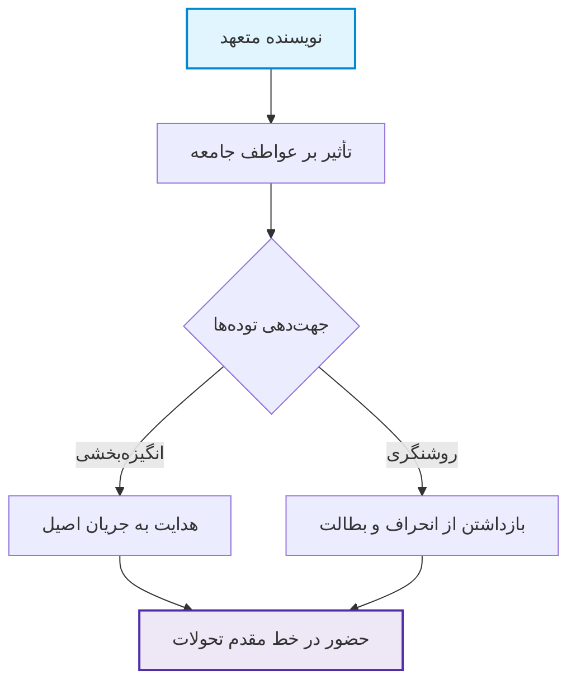

### ویژگی‌های دهگانه نویسنده و قواعد نگارش
1. **روشنی و وسعت اندیشه**
2. **تخیل و لطافت ذوق**
3. **دقت و باریک‌بینی**
4. **ابتکار و نوجویی** (پرهیز از تقلید کور)
5. **شناخت ادبیات ملی**
6. **تسلط بر زبان مادری**
7. **ارتباط با زبان‌های خارجی** (حداقل یک یا دو زبان بیگانه)
8. **آگاهی از صنایع سخن** (کاربرد در حد اعتدال)
9. **دردمندی و هدفمندی** (پرهیز از قلم‌فروشی و حسد)
10. **حقیقت‌محوری**

> [!warning] تله تستی آرایه‌ها
> **افراط** در صنایع ادبی متن را خسته‌کننده، و **تفریط** آن را خشک و بی‌روح می‌‌سازد؛ شرط اعجاز رعایت **تعادل** است.

### ارکان دوقلوی نوشته و استناد مدرن
* **حیث محتوا:** ارضای نیاز فطری، تعهد برابر خالق و خلق، پرورش تخیل و خودباوری، نمایش زوایای تاریک، نجات جوانان از بطالت.
* **حیث سبک نگارش (۱۵ اصل):** ساده‌نویسی، عفت قلم، وحدت موضوع، اعتدال در صنایع، نقل امانت‌دارانه، ایجاز، پرهیز از مقدمه‌چینی زائد، نفی واژگان غریب، املای درست، رعایت دستور، سجاوندی، خوانایی خط، آراستگی، استقلال موضوعی هر بند، کالیبراسیون لحن با مخاطب (*عموم: دیپلم | دانشگاهی: کارشناسی | تخصصی: تحصیلات تکمیلی*).
* **ارجاع استاندارد امروزی:** ارجاع **درون‌متنی بلافاصله پس از گیومه داخل پرانتز**: `(نویسنده، سال: ص)`. شیوه سنتی ارجاع در *پاورقی* بود.
* **دوگانه ارتقای مهارت:** **خواندن** (توسعه دایره واژگان) + **نوشتن عملی** (مانند مکانیک یا نوازنده که بدون ابزار دست گرفتن ماهر نمی‌شوند). آغاز با خاطره‌نویسی و سفرنامه‌نویسی (*سفرنامه ناصرخسرو*؛ آثار *آل‌احمد*: خسی در میقات، اورازان، تات‌نشین‌ها؛ *باستانی پاریزی*: از پاریز تا پاریس).

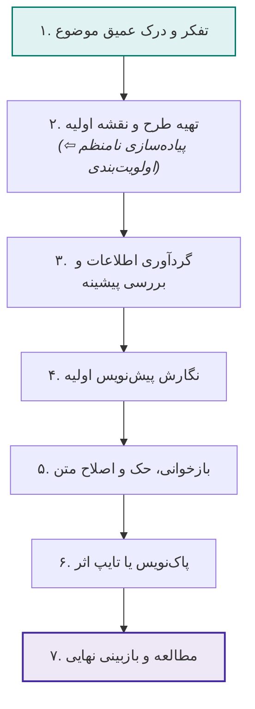

---

## جلسه ۲: روش تحقیق و شیوه‌نامه نگارش گزارش پژوهشی

> [!abstract] تعاریف بنیادین پژوهش و برگه‌دان
> * **روش تحقیق:** فرایند سیستماتیک دستیابی به منابع معتبر جهت حل مسئله متناسب با رشته تحصیلی.
> * **برگه‌دان کتابخانه:** سیستم دستیابی الفبایی از ۳ درگاه: **مؤلف**، **عنوان** و **موضوع**.
> * **فیش استاندارد:** برگه‌های ویژه با ابعاد **$7 \times 10$ سانتی‌متر**.
> * **گزارش:** انتقال داده‌های آگاهی‌بخش به فرد یا سازمانی که نسبت بدان بی‌اطلاع یا کم‌اطلاع است.

### مقایسه تطبیقی شیوه‌های سه‌گانه تحقیق #امتحانی 

| شیوه تحقیق             | ماهیت و سازوکار                 | ابزار و مصادیق                          | شروط و الزامات                                        |
| :--------------------- | :------------------------------ | :-------------------------------------- | :---------------------------------------------------- |
| **مشاهده‌ای (میدانی)** | حضور عینی در صحنه؛ ثبت بلافاصله | بازرسی، حسابرسی، مأموریت                | **ثبت فوری**؛ ترجیح **کار تیمی** به فردی جهت تکثر دید |
| **عمومی**              | تعامل مستقیم با جامعه هدف       | ۱. *مصاحبه شفاهی*<br>۲. *پرسشنامه کتبی* | بی‌طرفی، ساختارمندی، تقدم آسان به دشوار در سوالات     |
| **کتابخانه‌ای**        | پژوهش در اسناد مکتوب و دیجیتال  | کتب، مقالات، اطلس‌ها، برگه‌دان          | اولویت منبع دست‌اول؛ نقد چاپ‌های انتقادی؛ فیش‌برداری  |

> [!important] قواعد طلایی مصاحبه و گزینش مآخذ
> * **ارزش افزوده مصاحبه:** دستیابی به **اطلاعات بکر و پیش‌بینی‌نشده** که در فرضیات اولیه پژوهشگر نبوده است.
> * **اولویت منبع:** در تعدد نسخ، اولویت با نسخه **تصحیح‌شده، انتقادی و چاپ جدیدتر** است؛ منبع دست‌اول بر ثانویه تقدم قطعی دارد.
> * **حذف حشو:** تعریف یک واژه نباید از دو نویسنده تکرار شود؛ گزینش **جامع‌ترین تعریف منفرد** الزامی است.

### بانک مراجع و دانشنامه‌های کلیدی
* **دائرةالمعارف مصاحب:** *نخستین دائرةالمعارف فارسی مدرن* به صورت کار گروهی زیر نظر *غلامحسین مصاحب*.
* **لغت‌نامه دهخدا:** گردآوری فیش‌ها بالغ بر **۵۰ سال** با هدایت *علی‌اکبر دهخدا*.
* **فهرست مقالات فارسی:** تألیف *ایرج افشار* در **5 جلد**.
* **مؤلفین کتب چاپی فارسی:** تألیف *خانبابا مشار* در **4 جلد**.

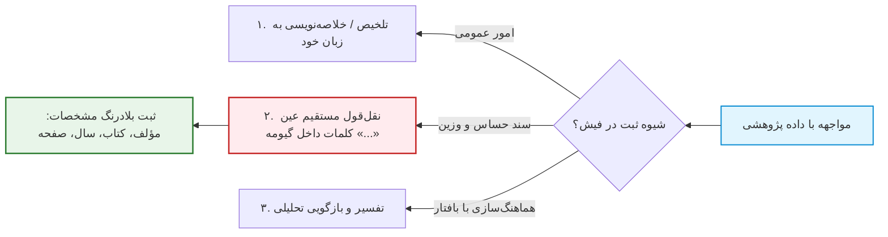

### گونه‌های گزارش و مراحل تدوین
* **مراحل تدوین گزارش:** ۱. انتخاب موضوع (بر پایه علاقه، منابع و راهنمایی استاد) ⇦ ۲. گردآوری اطلاعات ⇦ ۳. **طرح‌ریزی/تهریزی** (همانند *مهندس معمار*) ⇦ ۴. عرضه اطلاعات.
* **اجزای گزارش مفصل:** صفحه عنوان، پیش‌گفتار، فهرست مطالب، فهرست جداول/نمودارها، متن اصلی، فهرست اعلام، نمایه (Index)، کتاب‌شناسی.

| شاخص طبقه‌بندی | گونه اول | گونه دوم | تمایز ماهوی |
| :--- | :--- | :--- | :--- |
| **کارکرد** | **تحصیلی - تحقیقی** | **اداری - مالی** | تحصیلی بر پایه انگیزه علمی؛ اداری بر پایه بیلان و تصمیم‌گیری |
| **منابع و ابعاد** | **ساده** | **تفصیلی** | ساده متکی بر منبع دست‌اول؛ تفصیلی تلفیق منابع دست‌اول تا سوم |
| **رسمیت** | **غیررسمی** | **رسمی** | غیررسمی سریع و فاقد قالب؛ رسمی پایبند به اسلوب دانشگاهی |
| **نحوه انعکاس** | **انشایی** | **مختلط** | انشایی کلامی محض؛ مختلط تلفیق متن با آمار، جداول و فرمول |

> [!danger] پیامد خطای اطلاعاتی در گزارش
> خطای آماری در گزارش‌های میدانی تصمیم‌گیری مدیران را منحرف کرده و بر **سرنوشت شغلی و اجتماعی افراد** اثر مخرب و جبران‌ناپذیر می‌گذارد.

---

## جلسه ۳: فنون مقاله‌نویسی و اصول تدوین رساله دانشگاهی

> [!abstract] ماهیت مقاله و رساله
> * **مقاله:** نوشته‌ای مستقل و منسجم که **صرفاً پیرامون یک موضوع خاص و معین** بحث می‌کند (ریشه لغوی: «مَقالَت» از «قَول/قَلَ» به معنی گفتن).
> * **رساله (پژوهشنامه):** اثری مدون جهت اثبات تبحر دانشجو در متدولوژی علمی پژوهش انفرادی و استنتاج مستقل. تکامل‌یافته سنت کارگاه‌های صنفی کهن برای اخذ جواز استادی.

### مقایسه تطبیقی گونه‌های پنج‌گانه مقاله

| گونه مقاله            | ماهیت و هدف بنیادین                                 | لحن و ساحت روحی                                 | شاخص‌های فنی و الگوها                                               |
| :-------------------- | :-------------------------------------------------- | :---------------------------------------------- | :------------------------------------------------------------------ |
| **طنز**               | **نقد اجتماعی-اخلاقی** با سلاح خنده                 | فکاهی، ریشخندآمیز، نیشدار؛ شگرد **وارونه‌گویی** | کوبنده‌ترین شیوه نقد؛ *عبید زاکانی، سعدی، دهخدا، گل‌آقا*            |
| **تحقیقی - علمی**     | اثبات فرضیه با **عقل، منطق و سند**                  | **فاقد عاطفه، خیال و سوگیری**؛ رسمی             | اثبات داده، ارجاع دقیق، الزام به استنتاج و نتیجه‌گیری               |
| **توصیفی - تشریحی**   | بازآفرینی ریز حوادث و فضاها                         | مهیج؛ **تحریک مستقیم احساسات**                  | موشکافی احوال، ایجاد همزادپنداری عمیق در خواننده                    |
| **تراجم (شرح‌احوال)** | ترسیم کارنامه عمر، افکار و آثار بزرگان              | تلفیق مرثیه عاطفی با تحلیل علمی                 | معاصر: *رثای نسیم شمال (نفیسی)*<br>کهن: *مرثیه بونصر مشکان (بیهقی)* |
| **انتقادی**           | اصلاح نابسامانی‌ها (**امر به معروف و نهی از منکر**) | منصفانه، خیرخواهانه، دور از پرخاش               | **پیش‌شرط: آزادی بیان**؛ بررسی هم‌زمان معایب و محاسن                |

> [!warning] تله تستی شگرد بیان معکوس در طنز
> طنزنویس گاه با **ستایش اغراق‌آمیز رذیلت** زشتی آن را عیان می‌سازد، یا با **تقبیح صوری فضیلت** مخاطب را متوجه ارزش باطنی آن می‌کند.

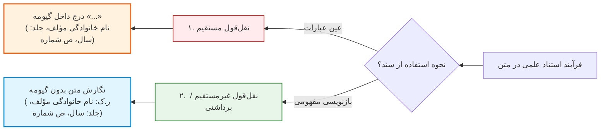

### ساختار کالبدی یازده‌گانه رساله دانشگاهی
1. **صفحه عنوان** (پشت صفحه کاملاً سفید / چاپ یک‌رو).
2. **سرآغاز / سپاسگزاری** (اختیاری؛ سقف مجاز: حداکثر ۲ تا ۳ صفحه).
3. **فهرست فصل‌ها** (عناوین اصلی، فرعی و شماره صفحه).
4. **فهرست پیکرها** (جداول، نقشه‌ها، تصاویر و نمودارها).
5. **مقدمه / مدخل** (تبیین متدولوژی و ارائه دورنمای کلیدی تحقیق).
6. **متن بدنه اصلی:** فصول ۱ تا پیش از آخر = مبانی نظری و پیشینه؛ فصل واپسین = تحلیل آماری، داده‌های تجربی و آزمون.
7. **پیوست‌ها و ضمایم** (پرسشنامه‌ها و اسناد طولانی).
8. **کتابنامه** (فهرست الفبایی منابع بر پایه نام خانوادگی پدیدآورنده).
9. **واژه‌نامه** (اصطلاحات تخصصی الفبایی به همراه شماره صفحه).
10. **موضوع‌نامه** (عناوین موضوعی متن به همراه شماره صفحه).
11. **نام‌نامه / اعلام** (اسامی اشخاص و اماکن با نشانه درنگ‌نما و صفحات).

> [!tip] اجزای اختیاری و ارکان نتیجه‌گیری
> * بخش‌های ۴، ۹، ۱۰ و ۱۱ در صورت نبود تصویر یا واژگان خاص **اختیاری** هستند و حذف می‌شوند.
> * **فصل پایانی (نتیجه‌گیری) مستلزم ۴ رکن است:** ۱. خلاصه موجز روش پژوهش ⇦ ۲. اعلام یافته‌ها و ارقام ⇦ ۳. طرح ابهامات و مسائل حل‌نشده ⇦ ۴. پیشنهاد افق به محققان آینده.

### مقایسه کتابنامه: کتاب در برابر مقاله

| مؤلفه | شناسنامه کتاب در کتابنامه | شناسنامه مقاله در کتابنامه |
| :--- | :--- | :--- |
| **پدیدآورنده و سال** | نام خانوادگی، نام. (سال). | نام خانوادگی، نام. (سال). |
| **عنوان اثر** | **عنوان کتاب (Bold / پررنگ)** | «عنوان مقاله داخل گیومه» |
| **مشخصات نشر** | مترجم/مصحح، نوبت چاپ، شهر: ناشر | *نام مجله (Italic)*، دوره/مجلد (شماره): **صفحات آغاز تا پایان** |

---

## جلسه ۴: اصول ویراستاری علمی و قواعد نشانه‌گذاری (سجاوندی)

> [!abstract] مفهوم‌شناسی ویرایش
> واژه پهلوی *«ویراستن»* به معنی آماده‌سازی، پیراستن و آراستن (معادل to edit). **واپسین و نهایی‌ترین گام** پیش از نشر اثر. اصل زرین: **هیچ تغییری بدون استدلال و سند مجاز نیست**. اسناد ویراستار: گفتار معیار، قواعد مسلّم دستور، شیوه‌نامه‌های مصوب.

### مقایسه تطبیقی سطوح سه‌گانه ویرایش #امتحانی 

| مؤلفه ارزیابی     | ویرایش محتوایی (تخصصی)                                                                             | ویرایش زبانی (ساختاری)                                                                                                     | ویرایش فنی (شکلی)                                                                                                                             |
| :---------------- | :------------------------------------------------------------------------------------------------- | :------------------------------------------------------------------------------------------------------------------------- | :-------------------------------------------------------------------------------------------------------------------------------------------- |
| **حیطه مداخله**   | مغز علمی، فکت‌ها، صدق داده‌ها                                                                      | اسکلت دستوری، روابط واژگان، زبان معیار                                                                                     | شیوه‌نامه، رسم‌الخط، فونت، سجاوندی                                                                                                            |
| **پیش‌شرط علمی**  | **تخصص دانشگاهی در موضوع متن**                                                                     | تسلط عمیق بر دستور زبان و نگارش معیار                                                                                      | تسلط بر آیین‌نامه فنی (**بی‌نیاز از سواد تخصصی متن**)                                                                                         |
| **محورهای اقدام** | • حذف خطاها و ابهامات معنایی<br>• بسط نکات مجمل و بررسی ارجاعات<br>• سنجش اعتبار و صدق علمی کل اثر | • تطبیق متن با زبان معیار<br>• اصلاح مطابقت نهاد و فعل<br>• ابهام‌زدایی و رفع تضادهای سبکی<br>• حفظ هماهنگی و یکدستی زبانی | • بی‌نیاز از تخصص علمی در موضوع  <br>• اجرای نشانه‌گذاری سجاوندی  <br>• درج معادل‌های لاتین در پرانتز متن  <br>• کنترل ارجاعات، آمارها و فرمت |

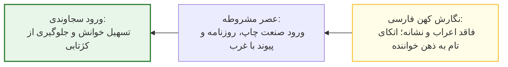

### نظام کاربردی نشانه‌های سجاوندی و تله‌های امتحانی

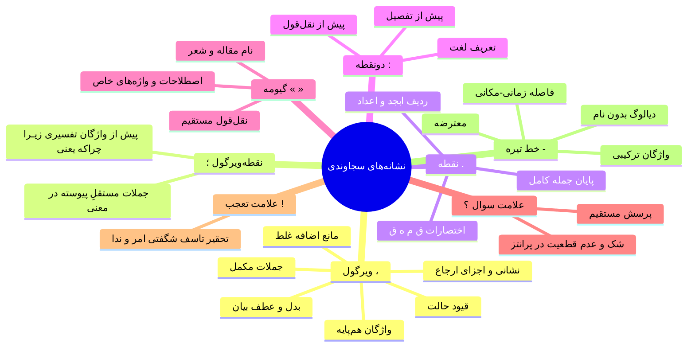

* **تله دونقطه پس از ترکیبات اضافی:** درج دونقطه یا ویرگول بعد از *«مانند»*، *«نظیر»* و *«از قبیل»* **غلط مطلق** است؛ این ادوات مضاف‌اند و با کسره به ماقبل متصل می‌شوند (*صحیح: عواملی نظیر فقر و بیکاری*).
* **تله پرسش غیرمستقیم:** جملات پرسش غیرمستقیم حاوی گزاره خبری هستند و در پایان آن‌ها **نقطه** قرار می‌گیرد نه علامت سوال (*استاد پرسید که آیا کتاب را خوانده‌ام.*).
* **تله واو عطف:** در اتصال دو جمله با حرف ربط «و»، گذاشتن نقطه در پایان جمله اول غلط است.
* **برابرهای لاتین:** شیوه مدرن درج معادل خارجی، قرار دادن بلافاصله آن **داخل پرانتز در خود متن** است (پاورقی روش سنتی بود).
* **کوتاه‌نوشت‌های استنادی:** **ج** (جلد) | **چ** (چاپ) | **صص** (صفحات آغاز تا پایان) | **بی‌تا** (بی‌تاریخ) | **(ره)** (رحمت‌الله علیه) | **ر.ک.** (رجوع کنید به؛ نشانه قطعی نقل‌قول غیرمستقیم).

---

## جلسه ۵: تاریخ ادبیات، کالبدشناسی حماسه و شاهنامه، بزرگان شعر و صنایع ادبی

> [!abstract] تعاریف بنیادین شاهنامه، اسطوره و حماسه
> * **فردوسی:** حکیم سخن، از طبقه *دهقانان*؛ رسالت: احیای زبان فارسی و تلفیق فرهنگ کهن با جهان‌بینی اسلامی. مأخذ اصلی: **شاهنامه ابومنصوری** (به دستور ابومنصور محمد بن عبدالرزاق و انشای ابومنصور معمری). نخستین ناظم: *دقیقی توسی* (به قتل رسید). وزن: **بحر متقارب مثمن محذوف** (*فعولن فعولن فعولن فعل*).
> * **اسطوره:** امری ازلی، بی‌مکان، بی‌زمان و ریشه‌دار در کنش خدایان. *اسطوره برای مؤمنانش دین و تاریخ واقعی، و برای آیندگان داستان و تمثیل است*.
> * **حماسه:** واژه عربی به معنی دلاوری؛ روایتی منظوم، بلند، داستانی از نبرد با اهریمن، طبیعت و مهاجمان در بستری باستانی.

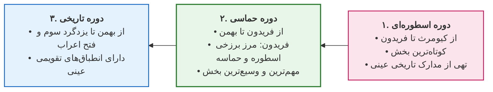

> [!important] تله تستی علل کوتاهی بخش اسطوره‌ای شاهنامه #امتحانی 
> شامل: ۱. کمی و از بین رفتن مکتوبات باستانی ⇦ ۲. جذابیت کمتر نسبت به دلاوری‌های پهلوانی ⇦ ۳. تضاد باورهای اساطیری با عقاید مسلمانان عصر فردوسی که با **روایت داستانی هنری** مانع سوزانده شدن اثر گردید.
> * **حماسه سند تاریخی تقویمی نیست:** زیرا زمان و مکان دقیق تاریخی در تخیلات قرون حل شده است.

### مقایسه مثنوی و قصیده در حماسه
* **قصیده (سنت عرب):** وحدت قافیه در تمام ابیات ⇦ عدم امکان سرایش داستان‌های طولانی ⇦ **فقدان منظومه بلند حماسی در ادب عربی**.
* **مثنوی (ابتکار ایرانی):** تنوع قافیه در هر بیت ⇦ ظرفیت نامحدود روایی ⇦ خلق شاهکارهای سترگ (*شاهنامه*).

### حافظ شیرازی؛ لسان‌الغیب و رندی
* اطلاعات دیوان مدیون *محمد گلندام*. متاثر از *خواجوی کرمانی*.
* **مکتب رندی:** جهان‌بینی متفکرانه و فیلسوفانه در اعتراض به ریاکاری.
* **ساختار خوشه‌ای:** استقلال معنایی ابیات در عین اتصال باطنی سُوَر قرآنی.
* **ممدوحان:** شاه اسحاق و قوام‌الدین حسن (*آل‌اینجو*)؛ انزجار از خشکه مقدسی امیر مبارزالدین (*محتسب*)؛ ستایش شاه شجاع و شاه منصور (*مظفری*).

### مولانا؛ سلوک عرفانی و مثنوی معنوی
* متولد بلخ، فرزند بهاء ولد. هجرت به قونیه به دعوت سلطان سلجوقی.
* **حلقه‌های چهارگانه سلوک:**
  1. *سید برهان‌الدین ترمذی:* ورود به طریقت و ریاضت ۹ ساله.
  2. *شمس تبریزی:* انفجار روحی، ترک منبر، روی‌آوری به سماع و شعر؛ غیبت اول (دمشق) و ناپدید شدن نهایی.
  3. *صلاح‌الدین زرکوب:* شیدایی با ضرب پتک زرکوبی؛ مونس ۱۰ ساله.
  4. *حسام‌الدین چلبی:* مشوق سرایش **مثنوی معنوی** (نام اولیه: *حسامی‌نامه*).
* **مشخصات مثنوی معنوی:** **۶ دفتر**، نزدیک به **۲۷,۰۰۰ بیت** بر وزن *منطق‌الطیر* و *الهی‌نامه* عطار. ساختار **داستان در داستان (مشجر)** همانند اسلوب *کلیله و دمنه* و سنت وعظ منبری. #امتحانی 
* **تله تستی:** آغاز بدون «بسم‌الله» منظوم (با بیت *«بشنو این نی...»*)؛ ابیاتی به **عربی**، **ترکی** و **یونانی رومی** علاوه بر متن فارسی دارد.

| دفتر مثنوی | دفتر اول | دفتر دوم | دفتر سوم | دفتر چهارم | دفتر پنجم | دفتر ششم |
| :--- | :--- | :--- | :--- | :--- | :--- | :--- |
| **موضوع محوری** | کالبدشناسی نفس | حقیقت ابلیس | **عقل جزوی در برابر عقل کل** | علم و حکمت راستین | فقر الی‌الله و فنا | توحید ناب و یگانگی |

### صنایع ادبی برگزیده #امتحانی 

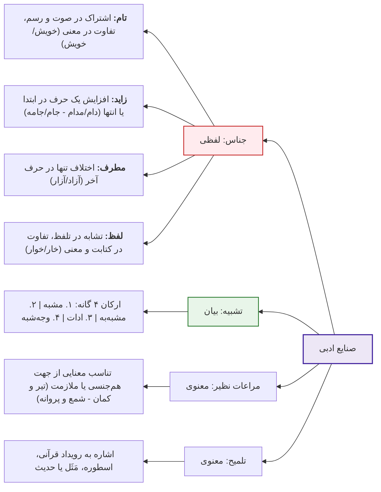

* **نمونه‌های تلمیح:**
  * ترنج و دست بریدن زلیخا ⇦ یوسف (ع).
  * گلستان شدن آتش بر خلیل ⇦ ابراهیم (ع).
  * «چو جواب احمق آمد خامشی» ⇦ ضرب‌المثل *«جَوابُ الأَحمَقِ السُّکوتُ»*.
  * «این پذیرفتن گمان ناید ز غیر...» ⇦ حدیث *«حُبُّکَ لِلشَّیءِ یُعمی وَ یُصِمّ»*.

---

## جلسه ۶: بازتاب طب و پزشکی در ادبیات کهن فارسی

> [!abstract] طب اخلاطی (Humoral Medicine)
> نظام پزشکی دوران اوج ادب فارسی. متکی بر فرضیات فلسفی و قیاسی بدون انتساب به پزشکی مبتنی بر شواهد (EBM). تعادل اخلاط = سلامت؛ غلبه یکی بر سایرین (سوءمزاج) = بیماری. راهبرد اصلی: **درمان به ضد (Allopathy)**.

### ماتریس تطبیقی ارکان کیهانی، اخلاط و نمودهای بالینی ادبی

| عنصر گیتی | خلط متناظر | طبع و کیفیت | نمود بالینی ادبی | داروی تعدیل‌کننده سنتی |
| :--- | :--- | :--- | :--- | :--- |
| **آتش** | **صفرا** | گرم و خشک | زردی سیما، تب، تلخی دهان، بی‌قراری | **سرکه**، **انار (ناردان)**، سکنجبین |
| **هوا (باد)** | **دم (خون)** | گرم و تر | برانگیختگی، پرخونی عروقی | **فصد** (رگ‌زنی)، **حجامت** |
| **آب** | **بلغم** | سرد و تر | رخوت، کندی، سستی و خمودی | گرمی‌جات، تعریق، تحرک |
| **خاک** | **سودا** | سرد و خشک | تیرگی، مالیخولیا، وسواس، توهم | مسهل سودا، رطوبت‌‌بخش‌ها |

> [!warning] انطباق طب با اخلاق فلسفی و معرفت‌شناسی مدرن
> * **طب و اخلاق:** تعادل قوا (شهویه، غضبیه، عاقله) = فضیلت؛ خروج از تعادل = رذیلت. پزشک و معلم اخلاق هر دو *تنظیم‌کننده تعادل‌اند*.
> * **ارزیابی مدرن:** فرضیات اخلاطی با رنسانس **منسوخ و باطل** شد. اثربخشی داروها صرفاً بر مبنای مکانیسم‌های فارماکولوژی سلولی است و ادعاها بدون **کارآزمایی بالینی (Clinical Trial)** فاقد اعتبار است.

### الگوهای بازتاب طب در شاهکارها
* **شاهنامه فردوسی:**
  * پزشکی اختراع **جمشید** است (*«پزشکی و درمان هر دردمند...»*).
  * **رستم‌زاد:** تقدم تاریخی و اسطوره‌ای زایمان سزارین از پهلوی رودابه به راهنمایی سیمرغ با *خنجر آبگون*.
  * **فارماکولوژی:** **نوش‌دارو** (پادزهر کیکاووس برای سهراب)؛ **داروی هوش‌بر** (بیهوشی بیژن توسط منیژه).
  * **ریشه‌شناسی واژه «پرستار»:** در شاهنامه فعل *پرستیدن* به معنی **خدمت و مراقبت** است و *پرستنده* ریشه عنوان حرفه‌ای پرستار است.
* **خمسه نظامی:** نهی فرزند از شاعری به دو دلیل: ۱. ضعف تکنیکی در فراروی از قله پدر ۲. ماهیت مبالغه‌آمیز شعر (*اکذب اوست احسن اوست*)؛ در مقابل، ترغیب به طبابت به عنوان علمی سودمند و نجات‌بخش (*می‌باش طبیب عیسوی‌هش / اما نه طبیب آدمی‌کش*). #امتحانی 
* **تمثیل صفرابری:** نظامی (*این همه صفرای تو بر روی زرد / سرکه ابروی تو کاری نکرد*)؛ خواجوی کرمانی (*ناردان فرمود از آن لب گفت کان صفرا بُوَد*).

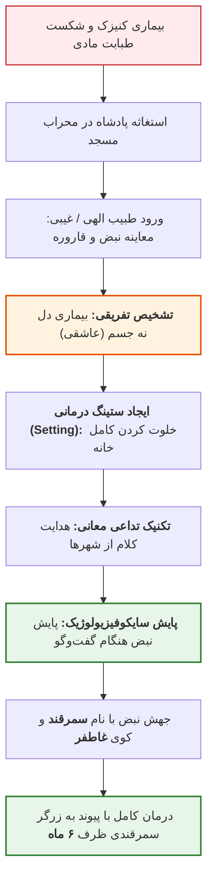

> [!important] نقد کلامی-اشعری مولانا بر طب مادی
> به چالش کشیدن علیت‌گرایی صلب فیلسوفان مشائی؛ ادعای غرورآمیز اطباء بدون گفتن *ان‌شاءالله* موجب عجز بشر شد و داروها ضد خود عمل کردند:
> * سرکنگبین به جای صفرابری، صفرا افزود (*از قضا سرکنگبین صفرا فزود*).
> * روغن بادام خشکی آورد؛ هلیله به جای اسهال و روان‌سازی (اطلاق)، یبوست (قبض) آورد؛ آب مانند نفت آتش را برانگیخت.

---

## جلسه ۷: تاریخچه، ساختار و تحلیل انتقادی مدرسه دارالفنون

> [!abstract] فلسفه نهاد علم (Scientific Institution)
> ارزش دارالفنون نقطه آغاز علم بودن نیست (رد سلبریتی‌سازی و نخستین‌ها در تاریخ‌نگاری)، بلکه ایجاد **نخستین برساخته نهادی مدرن** با تلفیق آموزش، پژوهش، سپهر عمومی و **قدرت ادغام‌کنندگی (Integration)** جریان‌های پراکنده است.

### پیشینه اعزام و ساخت دارالفنون
* **اعزام‌های اولیه (عصر فتحعلی‌شاه و عباس‌میرزا):** سال‌های ۱۸۱۱ و ۱۸۱۵ م؛ *محمدکاظم نقاش‌باشی* (نقاشی، فوت در لندن)؛ *میرزا حاجی‌بابای افشار* (۱۰ سال تحصیل طب؛ بحث انطباق با رمان جیمز موریه)؛ گروه ۵ نفره در رشته‌های شیمی، طب، مهندسی و توپخانه.
* **تأسیس دارالفنون:** ایده امیرکبیر متأثر از بازدید سن‌پترزبورگ و استانبول و الگوبرداری از **پلی‌تکنیک (École Polytechnique)** فرانسه. زمین ۱۱,۷۰۰ متری در میدان توپخانه (۱۲۲۹ ش). مهندس: *میرزارضا مهندس‌باشی* (الگو از عمارت وولیچ انگلیس)؛ معمار: *محمدتقی معمارباشی*. افتتاح: **۶ دی ۱۲۳۰ خورشیدی**؛ شهادت امیرکبیر: ۱۳ تا ۱۴ روز بعد در فین کاشان. #امتحانی 

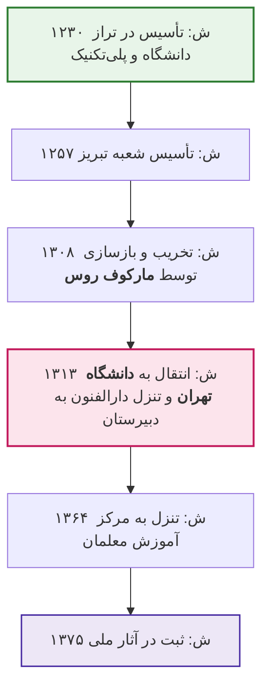

### معلمان، شعب و پارادوکس‌های آموزشی

| استاد دارالفنون | تخصص آکادمیک | خدمات و اقدامات در ایران |
| :--- | :--- | :--- |
| **آگوست کرشیش (Krziž)** | مهندس توپخانه | خط تلگراف، نخستین نقشه جامع تهران، سنجش ارتفاع دماوند، عکاسی |
| **دکتر پولاک (Polak)** | جراح و آسیب‌شناس | تدریس تشریح و طب مدرن، نگارش کتب پزشکی، ایران‌شناسی |
| **فوکتی (Focchetti)** | داروساز و شیمی‌دان | آموزش داروسازی، فعالیت‌های حرفه‌ای در عکاسی |
| **دکتر کلوکه (Cloquet)** | پزشک فرانسوی دربار | پزشک ناصرالدین‌شاه؛ آموزش عملی به شاگردان در منزل |

* **مدارس هفت‌گانه اولیه:** طب، داروسازی، جراحی، توپخانه، پیاده‌نظام، سواره‌نظام، معدن.
* **راهبرد امیرکبیر در استخدام اتریشی‌ها:** فرار از نفوذ انگلستان، روسیه و فرانسه؛ استخدام با اعزام *داوودخان مسیحی* به اتریش. اخذ **تعهدنامه حقوقی بی‌سابقه** مبنی بر منع مطلق رجوع به سفارتخانه‌های بیگانه و حل تمامی دعاوی درون دولت ایران.
* **پارادوکس‌های پداگوژیک دارالفنون:** ۱. فقدان مقطع متوسطه استاندارد در کشور ۲. ناهمگونی سنی فاحش (نوجوان ۱۴ ساله کنار سرهنگ ۴۰ ساله) ۳. سد زبانی معلمان و فقر متون ۴. فقدان مبانی علوم پایه در ورودی‌ها.
* **فرهنگ‌های اصطلاحات نوین:** **فرهنگ شلیمر** (*Schlimmer*) قطور بالغ بر ۷۰۰ صفحه واژگان زیستی، طبی، روان‌شناسی و اخلاقی، اولین دایره‌المعارف پزشکی دارویی ایران؛ **فرهنگ ناظم‌الاطباء** (*میرزا علی‌اکبر خان نفیسی*). #امتحانی 

---

## جلسه ۸: مفاخر علمی، جهان‌بینی فردوسی و حکمت انسانی سعدی

> [!abstract] تعاریف ذوفنون و گشاده‌دلی
> * **ذوفنون (جامع‌‌الاطراف):** علامه مسلط بر علوم جامع عصر. در اصطلاح کهن «معلم» نامیده می‌شدند (*معلم اول: ارسطو* | *معلم ثانی: فارابی*). منبع مرجع بررسی: **دایرةالمعارف مصاحب**.
> * **گشاده‌دلی:** معادل پارسی اصیل فردوسی برای اصطلاح عربی **سِعَة صدر**.

### مفاخر علمی و ارکان چهارگانه ادب (خطابه هانری ماسه)

| دانشمند | سن / تالیفات | حوزه برجسته دانشی | جایگاه در خطابه هانری ماسه در دانشگاه سوربن |
| :--- | :--- | :--- | :--- |
| **فردوسی** | - | زبان، هویت و حماسه | **هم‌سنگ و فراتر از هومر یونانی** |
| **سعدی** | - | نثر مسجع، شعر و اخلاق | **تداعی‌کننده آناتول فرانس** فیلسوف بزرگ فرانسه |
| **حافظ** | - | غزل رندانه و چندوجهی | **هم‌تراز گوته آلمانی** (گوته خود را شاگرد حافظ می‌داند) |
| **مولانا** | - | عرفان، روان‌شناسی، مثنوی | **فاقد هرگونه چهره همتا در جهان (یگانه ابدی)** |
| **ابوریحان بیرونی** | **۱۳۱ کتاب** | نجوم، ریاضی، جغرافیا، مردم‌شناسی | - |
| **ابن‌سینا** | ۵۸ سال / **۱۲۰ کتاب** | فلسفه، طب (*قانون*)، منطق، طبیعیات | - |
| **زکریای رازی** | ۶۲ سال / **۱۹۸ کتاب** | شیمی، داروسازی، طب بالینی | - |
| **ابونصر فارابی** | **حداقل ۱۰۰ کتاب** | فلسفه مشاء، منطق، موسیقی، سیاست مدن | - |

### کانون‌های اندیشه شاهنامه فردوسی (خردنامه)
1. **ارجمندی خردورزی:** خرد برتر از همه نعمت‌ها، حتی برتر از دادگری (*خرد برتر از هر چه ایزد بداد / ستایش خرد را بَه از راه داد*).
2. **نیک‌خواهی و نیک‌کرداری:** بازتاب اندیشه زرتشتی پندار، گفتار و کردار نیک (*به دل نیز اندیشه بد مدار / بداندیش را بد بود روزگار*).
3. **پنج رذیله نابودکننده راستی در داستان پادشاهی قباد:** **رَشک** (حسد)، **خشم**، **کین**، **نیاز** (طمع و فقر باطنی)، و **آز** (حرص).
4. **دادگری و ستم‌ستیزی:** فریدون با داد و دهش به جایگاه رسید نه با فرشته بودن (*تو داد و دهش کن فریدون تویی*).
5. **منزلت علم و نفی غرور:** خودپسندی اوج حماقت است (*چنان دان که نادان‌ترین کس تویی / که تو گفتار دانندگان نشنوی*).

### نفوذ جهانی سعدی، ایجاز و بوستان
* **نفوذ جهانی سعدی:** ترجمه گلستان به فرانسه توسط *آندره دو ریه* (۱۶۳۴ م)؛ نام‌گذاری مفاخر فرانسه به نام سعدی (*لئونارد سعدی کارنو* پدر ترمودینامیک و *ماری فرانسوا سعدی کارنو* رئیس‌جمهور)؛ ستایش *امرسون* آمریکایی از گلستان در ردیف کتب مقدس؛ پیام صوتی فارسی بر دیسک طلایی فضاپیمای **وویجر** (*«درود بر ساکنان کرات آسمانی»* و شعر *بنی‌آدم اعضای یکدیگرند*).
* **حکمت‌های گلستان (باب هشتم):** تطابق با شکاکیت *دکارت* در کمال عقل (*همه کس را عقل خود به کمال نماید...*)؛ تمثیل زنبور بی‌عسل برای عالم بی‌عمل؛ ستاریت حق در برابر جار زدن همسایه؛ آتش خشم ابتدا صاحب خشم را می‌سوزاند.

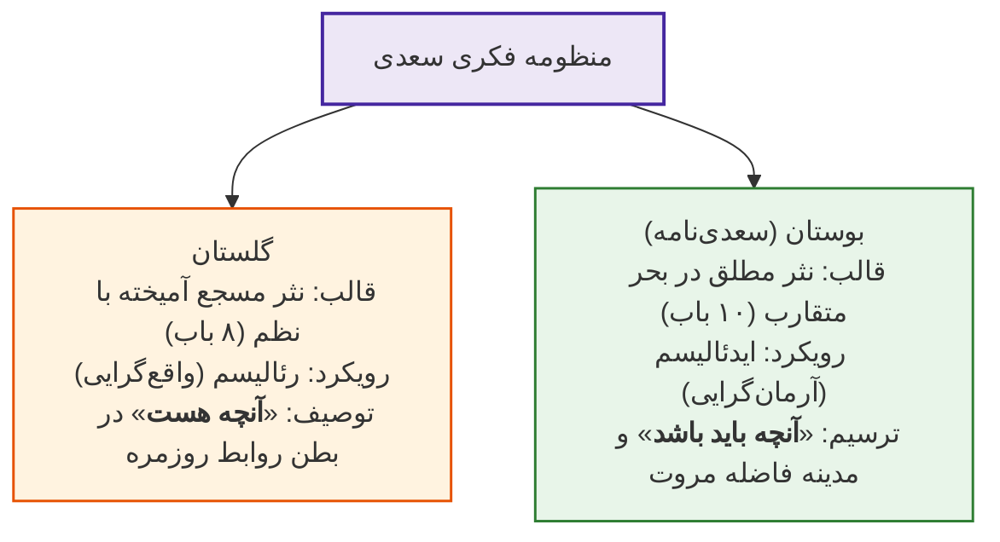

> [!important] فرجام تفکر سعدی #امتحانی 
> اگرچه سعدی در گلستان واقع‌گرا و در بوستان آرمان‌گراست، در ارزیابی نهایی **آرمان‌‌گرایی، ایثار، نوع‌دوستی و مروت بر سراسر جهان‌بینی او کاملاً حاکم است.**

---

## جلسه ۹: اخلاق حافظ و پیشگامی روانکاوی در مولانا

> [!abstract] جایگاه حافظ و فرافکنی در روان‌شناسی
> * **حافظ:** لسان‌الغیب؛ دیوان وی پرفروش‌ترین کتاب پس از قرآن در ایران و پای ثابت سفره‌های عقد و تحویل سال نو. ستایش بی‌حد *گوته* در *دیوان شرقی*. #امتحانی 
> * **فرافکنی (Projection):** مکانیسم دفاعی ناخودآگاه جهت انتساب رذایل و کاستی‌های سرکوب‌شده درون خود به دیگران.

### سرفصل‌های یازده‌گانه منظومه اخلاقی حافظ
1. **انسان‌دوستی و همبستگی:** نیکی به همنوع (*درخت دوستی بنشان...*)؛ نیکوکاری در قبال جفاکاری با ۳ تمثیل شاهکار: ۱. **معدن طلا** ۲. **درخت سایه‌فکن** ۳. **صدف مرواریدساز**.
2. **نفی مردم‌آزاری:** تنها گناه نابخشودنی (*مباش در پی آزار و هر چه خواهی کن / که در شریعت ما غیر از این گناهی نیست*).
3. **نفی غرور و تکبر:** تمثیل سقوط **تیر پرتابی** از اوج اوج به خاک.
4. **عیب‌پوشی:** پاسخ پیر میکده به راه نجات (*بخواست جام و بگفت عیب‌پوشیدن*).
5. **صبر و تاب‌آوری:** امید به چرخش فلک (*دائماً یکسان نباشد حال دوران غم مخور*).
6. **مدارا و صلح کل:** احترام به عقاید و نفی تعصب مذهبی (*در حلقه رندان خرابات میا / تا صلح ۷۲ ملت نکنی*).
7. **انتقادپذیری و رهایی از ریا:** استقبال از نقد (*گفت: از حافظ ما بوی ریا می‌آید / آفرین بر نفست باد که خوش بردی بوی!*).
8. **رعایت ادب و نزاکت در حریم دوست.**
9. **خوش‌بینی و حسن‌ظن به تقدیر.**

### معارف مولانا: پیشگامی در روانکاوی و سازوکار فرافکنی #امتحانی 
* **تمثیل مگس، پر کاه و بول خر:** نقد توهم کمال و عقل جزوی خودبزرگ‌‌بین (*عالمش چندان بود کَش بینش است / چشم چندین بحر هم چندینش است*).
* **مدارا و صلح ادیان:** تمثیل *راه‌های چندگانه به مقصد واحد کعبه* و تمثیل *قصر هزارخانه انبیا* در کتاب **فیه مافیه**.
* **تمثیل‌های سه‌گانه فرافکنی در مولانا:**
  1. *فیل و برکه آب:* رمیدن فیل از تصویر هیبت خود در آب چشمه.
  2. *چهار نمازگزار هندو:* ابطال نماز همگی به دنبال اعتراض زنجیره‌ای به کلام یکدیگر (*عیب‌گویان بیشتر گم‌‌کرده‌راه*).
  3. *هندوی سیاه‌رو و آینه:* افکندن آینه در آتش به جرم بازتاب زشتی چهره خود شخص.

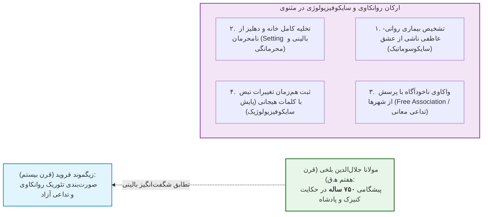

---

## جلسه ۱۰: ادبیات و سلامت از منظر رسانه و اخلاق پزشکی

> [!abstract] مدیاکراسی و هم‌ساقگی
> * **هم‌ساقگی:** ریشه مشترک سلامت، اخلاق پزشکی و رسانه در کرامت انسانی و نیاز به کلام زمانمند.
> * **مدیاکراسی (Mediacracy):** حاکمیت و اقتدار بلامنازع ابزارهای رسانه‌ای در مهندسی افکار عمومی و داوری اصناف.

### تقابل زبان متون علمی و زبان رسانه عمومی (پرونده کرونا)

| شاخص ارزیابی | زبان متون علمی (Scientific Language) | زبان رسانه فراگیر (Public Media Language) |
| :--- | :--- | :--- |
| **رویکرد و لحن** | **خشک، خنثی، بی‌روح و نوتر (Neutral)** | حساس به عواطف، امیدبخش، تعاملی و روشن |
| **مبنای صدق** | صرفاً متکی بر **فکت (Fact)** و آمار آزمایشگاهی | متکی بر فهم اجتماعی، زمینه روانی و کرامت مخاطب |
| **مخاطب** | جامعه دانشگاهی و متخصصان بالینی | **توده جامعه**، افراد در معرض خطر و خانواده‌ها |
| **آسیب در خلط** | القای **احساس تحقیر، بی‌ارزشی جان و رهاشدگی** | سقوط به دام شبه‌علم یا هراس‌آفرینی کاذب |

> [!warning] خطای اخلاقی فکت‌های خشک در سپهر عمومی
> گزاره «کرونا جوانان سالم را نمی‌کشد و فقط افراد دیابتی، سرطانی یا کهنسال را می‌کشد» از نظر داده علمی درست است؛ اما بیان آن با لحن خنثی در تریبون عمومی خطایی نابخشودنی است، زیرا مخاطب عام آن را به مثابه **بی‌ارزش دانستن جان اقشار آسیب‌پذیر** تلقی می‌کند.

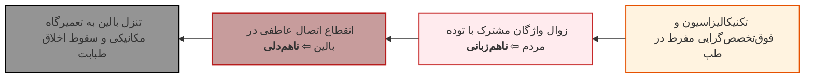

### پزشکی غیررسمی، بلاغت بالینی و خبر بد
* **پزشکی غیررسمی (شبکه‌های اجتماعی):** خطای کلامی در مطب نهایتاً به اعتبار شخصی آسیب می‌زند؛ اما در فضای مجازی یک پاسخ نسنجیده (مانند ماجرای سه کلمه «دوزشو کم کن» در توییتر انسولین قلمی) سبب **هجمه سنگین عمومی به کل جامعه پزشکی** می‌شود. #امتحانی 
* **دوگانه همدلی و همدردی:** *همدلی (Empathy)* یعنی قرار دادن خود در جهان زیسته بیمار و فهم رنج او بدون سقوط به ورطه *همدردی (Sympathy)* که همراهی هیجانی مخرب کارآمدی است. *رسیدن به همدلی بدون هم‌زبانی (ادبیات و واژگان) ناممکن است*.
* **الگوهای کلام سهل و ممتنع در بالین:**
  * ام‌اس بیماری هزارچهره نیست؛ بیماری **هزارآهنگ** است تا با همکاری بیمار زیباترین ملودی ساخته شود (*دکتر نمازی*).
  * در جراحی پرخطر وظیفه ما نهایت تدبیر و تلاش است اما تقدیر دست خداست (*دکتر جعفریان*).
* **پرهیز از تورم قیود و صفات:** نفی عبارات مخل مانند **«خطر جدی»** (خطر غیرجدی وجود ندارد؛ تورم قید ناشی از ناتوانی در توصیف است). #امتحانی 
* **دادن خبر بد (Breaking Bad News):** پرهیز از پرتاب آمار خام سوروایوال به روی بیمار مستأصل؛ ارائه واقعیت توأم با امید و حفظ کرامت. #امتحانی 

---

## جلسات ۱۱ و ۱۲: کارکرد ادبیات داستانی و روایت‌شناسی در مواجهه بالینی

> [!abstract] سرشت دوگانه زبان طبابت
> پزشکی بر خلاف کدنویسی کامپیوتر زبانی کاملاً تکنیکال ندارد؛ بلکه دارای **سرشت دوگانه (Dual Nature)** است: **یک پا در زبان علمی-آکادمیک و یک پا در زبان عامیانه و روزمره جامعه**. ادبیات در این ساحت منحصراً **ادبیات داستانی (Fiction) و بوطیقای روایت (Narrative)** است نه صنایع ادبی کهن.

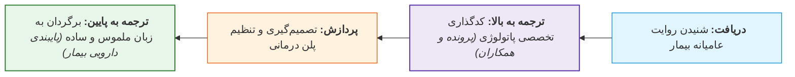

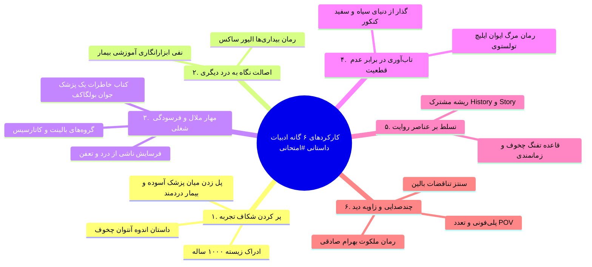

### شرح کارکردهای شش‌گانه بالینی با مصادیق شاهکارها
1. **پر کردن شکاف تجربه و ادراک زیسته (Lived Experience):** پزشک فاقد رنج دردمند است؛ مطالعه ادبیات تجربه زیسته ۱۰۰۰ ساله به وی می‌بخشد. شاهکار: داستان *اندوه (Misery)* اثر **آنتوان چخوف** (سرگذشت گاریچی سوگوار، یونا، که فرزندی از دست داده و چون گوش شنوایی در شهر نمی‌یابد، رنجش را شبانه در گوش اسب خود نجوا می‌کند؛ با خوانش بهروز رضوی).
2. **اصالت نگاه به درد دیگران و نفی ابزارانگاری:** طرد تلقی بیمار به مثابه *ابزار صرف قبولی در آزمون*. شاهکار: رمان و فیلم *بیدارگری (Awakenings)* اثر **دکتر الیور ساکس** (پزشکی که بیماران منجمد آنسفالیت لتارژیک را به جای اشیای تکراری، انسان‌هایی واجد کرامت دید و احیا کرد *و نقش داروی **لودوپا** را در تحول زندگی بیماران روایت می‌کند*). #امتحانی 
3. **مهار ملال شغلی (Burnout) و گروه‌های بالینت:** مواجهه مداوم با تعفن و مرگ موجب کرختی یا فرسودگی است. راهکار **مایکل بالینت (Balint Groups)**: گردهمایی دوره‌ای همتایان پزشک و گفت‌وگوی روایی از رنج‌ها جهت رسیدن به **پالایش روانی و تزکیه (کاتارسیس / Catharsis)**. شاهکار: *یادداشت‌های یک پزشک جوان* اثر **میخائیل بولگاکف** (ثبت هراس‌ها و ملال پزشک تازه‌کار در دهکده برفی).
4. **تاب‌آوری در برابر عدم قطعیت بالینی (Uncertainty):** خروج از ذهنیت خطی و تک‌پاسخی کنکور؛ بالین فضایی خاکستری، آشفته و غبارآلود است. شاهکار: رمان *مرگ ایوان ایلیچ* اثر **لئو تولستوی** (کالبدشکافی مراحل انکار، خشم، تنهایی وجودی و احتضار قاضی بیمار).
5. **ارکان بوطیقای روایت و تطابق شرح‌حال:** هم‌ریشگی لغوی **History** (شرح‌حال) و **Story** (داستان).
   * **اصل سببیت و تفنگ چخوف:** اگر تفنگی روی دیوار است، در پرده بعد باید شلیک کند؛ تمام جزئیات شرح‌حال باید کارکرد افتراقی و علّی داشته باشند.
   * **اصل زمانمندی:** تقدم و تاخر علائم؛ تفاوت بنیادین استفراغ بعد از درد شکم در برابر استفراغ پیش از درد.
6. **چندصدایی و زوایای دید متکثر (POV):** بالین صحنه تعارض روایت‌هاست (روایت درونی بیمار، مشاهدات همراه، ادراک عینی پزشک، فکت پاراکلینیک). پزشک باید با **سنتز بالینی** تعارضات را حل کند. شاهکار پلی‌فونی ایرانی: رمان کوتاه *ملکوت* نوشته **دکتر بهرام صادقی** (روایت چندلایه از زاویه دید شخصیت‌های گوناگون).

### ماتریس مقایسه مدل سنتی زیست‌پزشکی و طبابت روایی

| شاخص ارزیابی | مدل سنتی زیست‌پزشکی (Biomedical) | طبابت روایی مبتنی بر ادبیات (Narrative-based) |
| :--- | :--- | :--- |
| **نگرش به بیمار** | کیس بیماری، برگه آزمایش، **ابزار آموزش** | **سوژه انسانی کامل**، صاحب رنج و جهان زیسته |
| **برخورد با عدم قطعیت** | اصرار بر پاسخ‌های صلب، مهندسی و **سیاه و سفید** | **تاب‌آوری بالینی** در برابر واقعیت خاکستری و آشفته بالین |
| **شرح‌حال‌نویسی** | تکمیل مکانیکی و چک‌لیستی فرم‌های بستری | **قالب‌ریزی پیرنگ داستانی منسجم** مبتنی بر سببیت و زمان |
| **فرسودگی شغلی** | کرختی عاطفی و سندروم فرسودگی (Burnout) | **کاتارسیس عاطفی** از طریق بالینت و نگارش روایی |
| **زبان ارتباطی** | واژگان پیچیده یک‌طرفه (همانند زبان برنامه‌نویسی) | **سرشت دوگانه:** ترجمه پیوسته زبان عامیانه و آکادمیک |

> [!tip] جمع‌بندی طلایی شب امتحان
> تسلط بر متون علمی محض بدون فراگیری مهارت‌های روایت، زبان معیار، اخلاق مدارا و ارتباط بالینی انسانی، پزشک را به یک تکنسین مکانیکی تقلیل می‌دهد. توفیق کامل در گرو تلفیق **دانش استدلالی-تجربی با بوطیقای روایت، شفقت و زبان ملموس** است.


## جلسه ۱۳: ریشه‌شناسی، اساطیر، متون پهلوی و شاهنامه

### 1. تبارشناسی واژگانی بیمار و اصطلاحات کهن

> [!abstract] ریشه‌شناسی واژه بیمار
> * **فرهنگ آنندراج:** ترکیب «بیم + آر» (دارای دغدغه تندرستی).
> * **رد نظر دهخدا:** تصور ترکیب «بی + مار» نادرست است؛ «مار» در پهلوی و «ماره» در سانسکریت به معنی **کشنده و میراننده** است ($mr$ در پارسی باستان؛ $miθriia$ اوستایی).
> * **سیر تطور (دکتر حسن‌دوست):** **اوپیماره** ($Upamara$: در پی مرگ) و **امیوا بر** ($Amiwa-bar$: فاقد توان) ⇦ فارسی میانه: **میوار / ویمار** ⇦ فارسی دری: **بیمار**.

| واژه کهن #امتحانی          | معادل امروزی               | شاهد متنی / نکته                           |
| :------------------------- | :------------------------- | :----------------------------------------- |
| **بیماردار**               | همراه مریض / مراقب خانگی   | تیماردار بالین                             |
| **بیمارپرسی / بیمارنوازی** | عیادت از بیمار             | خاقانی: *بهر بیمارنوازی به من آیید همه*    |
| **بیمارپرس / بیمارنواز**   | عیادت‌کننده                | افراد حاضر بر بالین                        |
| **بیمارپرست / بیماربام**   | پرستار (Nurse)             | خاقانی: *بیمارپرستان ز غمم سیر شدند...*    |
| **بیماری‌خاسته**           | فرد در دوره نقاهت          | عطار: پختن طعام برای بیمار برخاسته از بستر |
| **بیماری‌خاستگی**          | دوره نقاهت (Convalescence) | بازیابی تدریجی سلامت                       |

> [!warning] تله تستی املایی
> واژه «بیماری‌خاسته» با حرف **«خ»** (مصدر برخاستن) درست است، نه با «خوا» (خواستن)!

### 2. دیوشناسی بیماری و نظام ثنوی

* **اهورامزدا:** واجد صفات درمانی *بعش‌تَرنا* (آسیب‌زدا)، *بعش‌زیوتما* (درمان‌دهنده درمان‌کنندگان)، *پشوتَنا* (نگهدار تن).
* **امشاسپندان:** *خرداد* (آب‌ها/کمال)، *امرداد* (گیاهان/بی‌مرگی)، *شهریور* (فلزات/نگهبان کارد زرین جراحی).
* **اهریمن (انگره‌مینو):** آفرینشگر **۹۹,۹۹۹ بیماری** در بندهش.
* **کماریکان (سردیوان):** *تیری/تیریز* (مسموم‌کننده آب؛ ضد خرداد)، *زیری/زیریز* (سازنده زهر؛ ضد امرداد).

#### دیوان بیماری و ابزارهای دفع #امتحانی 

* **استویداد:** دیو **مرگ** *(جداکننده استخوان‌ها)*؛ لمس ⇦ خواب مرگ / سایه ⇦ تب / چشم‌‌دوختن ⇦ قبض روح
* **سیج:** دیو درد پنهان و موذی
* **نسو (نسوش):** مگس **لاشه‌خوار** و فساد ⇦ دفع با *خرفسترغن* (مگس‌پران)
* **زرمان:** دیو **پیری** و فرسودگی؛ تنگی و *بدبویی نفس*
* **اگاس:** دیو شورچشمی ⇦ دفع با چشم‌پنام (طلسم آویختنی ضد چشم‌زخم)
* **بوشاسب:** دیو خواب مفرط و تنبلی؛ سنگینی پلک در سحر ⇦ نماد مقابله: خروس

> [!abstract] پنام و کاربردهای سه‌گانه
> پارچه محافظ دهان و بینی جهت ممانعت از آلودگی:
> 1. **پزشکان و موبدان:** هنگام جراحی عفونت‌ها یا ادعیه‌خوانی مقابل آتش جهت جلوگیری از آلودگی با بازدم.
> 2. **تشریفات دربار:** مراجعان به حضور شاه برای ممانعت از انتقال عفونت تنفسی پنام می‌زدند.
> 3. **رزمندگان (وندیداد ۱۴):** جزء تجهیزات ۱۲گانه انفرادی سربازان در جنگ.
> * **چشم‌پنام:** ماسک نیست، بلکه **تعویذ و طلسم آویختنی ضد چشم‌زخم** است (*شهید بلخی:* چرا نداری با خود هم همیشه چشم‌پنام).

### 3. کالبدشکافی کتب پهلوی

* **شکند گمانیک وزار:** تعریف بیماری به عنوان **خروج رفتار از پیمانه اعتدال**.
* **ماتیکان پوت دانشن‌کامگ:** تقسیم تن به *بالاتنه اهورایی* و *پایین‌تنه اهریمنی* با حائل کمربند کشتی.
* **ویچیتکی‌های زادسپرم:** فصول ۲۹ و ۳۰ پیرامون فیزیولوژی و آناتومی تن انسان.
* **روایت پهلوی:** مجموعه اوراد ضد تب، بند آوردن خون و درمان مارگزیدگی (بازتاب در *آثارالباقیه* بیرونی).
* **ارداویراف‌نامه:** سفرنامه دوزخ؛ سقط جنین و شیون مفرط بر مرده به عنوان گناهان کبیره طبی.
* **خیم و خرد فرخمرد:** روان‌شناسی کاراکتر انسان سعادتمند.
* **خویشکاری ریدکان:** پداگوژی و تکالیف اطفال در مدارس هیربدستان و دبیرستان.

> [!important] فرمول داروی خرسندی (ترجمه کتایون مزداپور)
> ترکیب روانی ۶ دانگ: **۱ درمسنگ** شناخت عقلی + **۵ دانگ‌سنگ** شامل (اگر خرسند نباشم چه کنم؟ / فردا بهتر خواهد شد / بدتر از این هم می‌شد / خرسندی آسان‌تر از بیقراری است / ناخرسندی روزگار را سخت‌تر می‌کند). فرآوری: کوبیدن در *هاون شکیبایی* با دسته نیایش، بیختن با *پرویزن (الک) بخشش*، مصرف بامدادان *۲ کفچه* با آب توکل.

### 4. وندیداد، دینکرد و شاهنامه

* **پزشکان نخستین:** **تریتا (فریدون)** نخستین پزشک و جراح متون اوستایی؛ دریافت کارد جراحی زرین از شهریور امشاسپند.
* **دینکرد (نسک ۳ - فصل ۱۵۷):** تعریف بیماری: *احساس ناپایداری و تباهی در چهر (تن) و جان (روان)*. پیدایش در *بندهش* (آغاز) و زوال مطلق در *فرشگرد* (رستاخیز). ۴۳۳ بیماری شامل:
  * **تن (جسمانی):** واگیردار (ووعرشن، نیر) / غیرواگیردار (تَف=تب، نهیزی).
  * **جان (روانی):** رو به پیش و تهاجمی (آز، خشم) / رو به پس و انفعالی (سستی، سرپیچی).
* **روایت‌های شاهنامه:**
  1. *جمشید:* ۷۰۰ سال سلامت مطلق ⇦ ادعای خدایی ⇦ زوال فرّه. کلاهبرداری ابلیس در لباس پزشک نزد ضحاک (تجویز مغز جوانان).
  2. *اسکندر:* بوی بد دهان مادر (دختر فیلقوس) و درمان با داروی تلخ «اسکندر» / ضعف قوای جنسی شاه و تشخیص با دیدن سرشک (ادرار).
  3. *انوشیروان و نوشزاد:* ابتلای شاه به **باد سرخ (Erysipelas)** در محاصره رُها و **طاعون** در پِترا (اردن). شورش نوشزاد به شایعه طاعون پدر؛ سرکوب و کشته‌شدن/مثله‌شدن اعضا طبق گزارش پروکوپیوس.
  4. *برزویه طبیب:* سفر به هند پی گیاه حیات‌بخش؛ کشف جاودانگی در **دانش و کلیله و دمنه**.

---

## جلسه ۱۴: الهیات شفا، بوطیقا، پاتولوژی شعرا و انگاره‌های هفت‌گانه

### 1. الهیات شفا و اصطلاحات تفاسیر

> [!important] تله تستی اسماء حسنی
> صفات **سلام، حیّ، محیی و مقیت** در قرآن کریم **مصرّح** هستند. صفات **شافی، ممیت و قابض** در متن قرآن **غیرمصرّح** بوده و برگرفته از ساختار افعال هستند! عبارت *یا من اسمه دواء و ذکره شفاء* فراز دعای کمیل است، نه آیه قرآن!

* **تفسیر طبری:** *کل نفس ذائقة الموت* ⇦ «هر تنی‌ست چشنده مرگ».
* **تفسیر سورآبادی:** ترجمه استرجاع ⇦ «خدا راییم و با او گردندگانیم».
* **کشف‌الاسرار میبدی:** واژه «می‌بیوسم» ⇦ امید دارم و چشم‌به‌راهم.
* **احادیث و امثال کلیدی:** *لکل داء دواء* (سنایی و مولوی) / *آخر الدواء الکی* (داغ نهادن آخرین چاره است؛ خاقانی، حافظ) / *لیس الخبر کالمعاینه* (برتری دیدن بر شنیدن) / *لا یعرف الهر من البر* (ناآگاهی محض؛ هر=گربه، بر=موش) / *الدراهم مراهم* (پول مرهم است).

### 2. آگاهی‌های آناتومیک و شواهد شعری

* **تعریف درد (اسماعیل جرجانی):** *درد خبر یافتن است از حال ناطبیعی.*
* **تیان:** ۱. تیان ژاژخای (شاعر هزل) ۲. تیان طبیب بمی (ناظم طب: سرفه ⇦ آب‌دوغ و خرفه / قولنج ⇦ شکافتن پشت و برون کشیدن سرگین).
* **آناتومی شعری:** ۲۰۰ استخوان اسکلت در کلام سعدی (*دویست مهره...*) / ۳۶۰ رگ تن در باور عامیانه (*حاصل‌ضرب ۳۰ روز در ۱۲ ماه*) / ۴۶۰ رگ در *مرگ یزدگرد* بیضایی / استعاره گوارشی «دیگ معده» در شعر سعدی.
* **اصول مدرن در شعر کهن:**
  * *عدم آسیب (Primum non nocere):* ناصرخسرو (*میفزا از جفایش درد بر درد*).
  * *ایزولاسیون:* خاقانی (*بوی بیماری همی‌آید ز من*).
  * *تشدید شبانه علائم (Diurnal Variation):* فخرالدین اسعد گرگانی در ویس و رامین (*در شب بیش باشد درد بیمار*).
  * *سل و دق:* کاشکسی و تحلیل عضلانی در شعر منوچهری (*بیماری دق...*).
  * *تب ربع (مالاریا چهاریک):* ناشی از *پلاسمودیوم مالاریه* در دیوان خاقانی.
  * *آتش پارسی:* ضایعات پوستی جلدی/زخم در شعر خاقانی و سعدی.
  * *پیوک (عرق مدنی / کرم مدینه):* عفونت *دراکونکولوس مدیننسیس* در حکایت سعدی و بیماری یعقوب لیث.

### 3. کیس‌ریپورت‌های کهن و داروشناسی

* **سکته قلبی (ادیب اسماعیل هروی):** پیش‌بینی مرگ قصاب به سبب بلع روزانه پیه گرم گوسفند (آترواسکلروز) و احیا با مشت به سینه یا ضربه عصا به پا.
* **فواق (سکسکه مقاوم) خواجه عبدالله انصاری:** تجویز پودر ۱ استار (کمتر از ۲۰ گرم) پوست مغز پسته با ۱ استار شکر عسکری توسط ادیب اسماعیل.
* **سکته مغزی بونصر مشکان (تاریخ بیهقی):** تریاد *لقوه + فالج + سکته* در پی باده‌نوشی در هوای سرد باغ عدنانی؛ ترومبوز قلمرو **Left MCA**.
* **درمان‌های تجربی:** *فصد* برای رفع آماس (نظامی) / *زگال‌آب* (شارکول مسمومیت؛ خاقانی) / *جگر کباب‌شده* جهت شب‌کوری به دلیل ویتامین A (رازی، ابن‌سینا) / *رشته تب* (گره‌زدن نخ پیش از طلوع آفتاب جهت احتساب روزهای تب و حق‌القدم طبیب؛ صائب) / *مجمعه و کمان‌کشی* (شوک تب با شلیک گلوله گلی به سینی مسین؛ حافظ).
* **سلسله‌مراتب کلیسای شرق در شعر خاقانی:** شماس ⇦ قسیس ⇦ اسقف ⇦ مطران ⇦ **جاسلیق** ⇦ بطریق.

> [!note] طبابت اولیاء با ابزار شعر
> 
> * **مولانا (درمان فخرالدین سیواسی):**
>   - **نسخه مادی:** سیر کوفته.
>   - **جراحی لفظی:** غزل *«سبل‌های کهن را... به چنگاله کشیدیم»* (*سبل*: عارضه چشمی / *چنگاله*: قلاب جراحی).
>   - **ردّ طب جالینوسی:** نفی *«حلیله»* (مسهل) و *«بلیله»* (قابض) با طعنه به کتاب *«فردوس‌الحکمه»* طبری.
> 
> * **ابوسعید ابوالخیر (شعردرمانی):** #امتحانی 
>   - **شفای ابوصالح (معلم مکتب):** قرائت رباعی *«حورا به نظاره نگارم...»*.
>   - **رفع رَمَد (چشم‌درد):** افسونِ جناس‌های چهارگانهٔ *«بادامینا»*.
>   - **نسخهٔ تب‌بُر:** ۱۲ بار رباعی پس از ذکر *«یا کافی و یا شافی»*.

### 4. پاتولوژی شعرا و روزشمار تیفوئید خاقانی 

* **رودکی:** نابینایی اکتسابی؛ *قصیده دندانیه*.
* **تیرخوردگان دربار:** امیر معزی نیشابوری (شلیک سنجر) و عثمان مختاری (توطئه بهرام‌شاه).
* **فرسودگی شغلی طبیب:** هاتف اصفهانی در عیادت خواجگان.
* **کورس بالینی حصبه رشیدالدین (پسر خاقانی):** #امتحانی 
  * *روز پنجم:* تب بالا و عرق سرد.
  * *شب هفتم:* دلیریوم و افت هوشیاری.
  * *روز دهم:* زردی چهره و سیاهی زبان (دهیدراتاسیون شدید).
  * *روز ۱۳ و ۱۴:* پرفوراسیون روده و فوت (*سپر بازدهید...*).

### 5. انگاره‌های هفت‌گانه بیماری در ادبیات فارسی

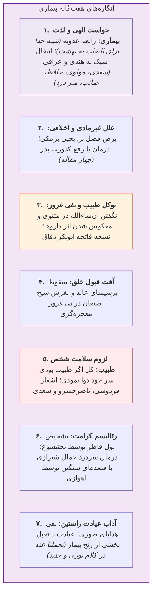

---

## جلسه ۱۵: مبانی عصب‌شناختی، نوروپلاستیستی و روان‌شناختی

### 1. نورون‌های آینه‌ای (Mirror Neurons)

> [!abstract] نورون آینه‌ای
> سلول عصبی تحریک‌شونده همزمان با **انجام عمل** یا **مشاهده همان عمل توسط دیگری**؛ کپی رفتارهای برونی در کالبد شناختی. کشف در دهه ۱۹۹۰ توسط دانشمندان ایتالیایی در کورتکس پره‌موتور و بروکا میمون؛ ثبت رسمی واژه در **۲۰۰۲**.

* **پژوهش‌های تأییدی:**
  1. *پاسکال لئونه (هاروارد - ۲۰۰۳):* تمرین ذهنی نواختن پیانو به اندازه نواختن واقعی، کورتکس حرکتی را فعال ساخت (*ما همان چیزی هستیم که بدان می‌اندیشیم*).
  2. *مُمبابی (تگزاس - ۲۰۰۸):* شنیدن سناریوی خیالی افتادن استفراغ در دهان، دقیقاً مانند نوشیدن تلخی واقعی یا دیدن فیلم انزجار، **اینسولای قدامی (Anterior Insula)** را فعال کرد.
  3. *لابراتوار واشنگتن (۲۰۰۹):* مطالعه داستان یک کنش فعال ذهنی است که همان مدارات حسی-حرکتی جهان واقعی را تحریک می‌کند. #امتحانی 
* **برتری داستان بر فیلم (کتاب حیوان قصه‌گو - جاناتان گاتشال):** فیلم جزئیات چهره و صحنه را دیکته می‌کند؛ داستان واجد **فضاهای نانوشته (جاهای خالی)** است که ذهن را وادار به بازآفرینی کرده و حجم بسیار بیشتری از نورون‌های آینه‌ای را درگیر می‌سازد (مثال: سکانس شهادت پتیا در *جنگ و صلح* و توصیف رمان *گرگ سفید* گمل). ادبیات = **شبیه‌ساز رایگان زندگی (Life Simulator)**.

### 2. نوروپلاستیستی (Neuroplasticity) و مهار دید لوله‌تفنگی

* **ابطال دگماتیسم ثبات عصبی:** رد نظریه مکانیکی ماشین‌انگاری و ثبات قشر مخ پس از بلوغ (دیدگاه کهن رامون کاخال - نوبل ۱۹۰۶).
* **اثبات تجربی انعطاف‌پذیری:**
  * *مایکل مرزنیچ (۱۹۶۸):* بازآرایی و تقبل وظایف کورتکس حسی میمون توسط سایر نواحی پس از قطع عصب انگشت.
  * *اریک کندل (نوبل ۲۰۰۰):* ذخیره‌سازی حافظه در سیناپس‌های حلزون دریایی **آپلیسیا (Aplysia)** از طریق شرطی‌سازی بازداری رفلکس جمع‌کردن آبشش.
	
> [!important] نظریه ذخیره‌سازی حافظه در نورون‌ها (دکتر کندل) #امتحانی 
> سلول‌های عصبی بر خلاف باورهای قدیمی ثابت و تغییرناپذیر نیستند، بلکه رفتار، دستورات و اتصالات آن‌ها می‌تواند در طول حیات تغییر کند.   
	
  * *رانندگان تاکسی لندن:* بزرگ‌شدن معنادار **هیپوکامپ خلفی (Posterior Hippocampus)** در اثر مسیریابی فضایی متناسب با سنوات رانندگی.
* **کتاب کم‌عمق‌ها (نیکلاس کار):** اسکرول سطحی اینترنت کورتکس فرونتال را بازسیم‌کشی کرده و توجه پایدار را زایل می‌سازد.
* **دید لوله‌تفنگی (Tunnel Vision):** فروکاستن بیمار به «کیس پاتولوژیک» در جریان آموزش سخت پزشکی. ادبیات با فعال‌سازی مداوم سیستم عاطفی انعطاف مغز را حفظ می‌کند.

> [!important] تمثیل تشخیصی پارچه سبز دکتر سیادتی
> مهم‌ترین نشانه بالینی کودک راند اطفال، نه علائم فیزیکی بلکه **پارچه سبز بسته به مچ دست کودک** بود؛ نشانه سیر *مزمن* بیماری، درماندگی والدین و روی آوردن به نذر و توسل.


> [!note] پاتولوژی در ادبیات
> 
> * **برادران کارامازوف (داستایفسکی):** تحلیل **عقده ادیپ** (فروید) + بازتاب ابتلای نویسنده به **صرع** در کاراکتر *اسمردیاکوف*. #امتحانی 
> * **مرگ آرتمیو کروز (فوئنتس):** جریان **سیال ذهن** در بازنمایی بالینی **احتضار، هذیان** و **زوال جسمانی**.

### 3. لوگوتراپی و حواس شش‌گانه عصر مفهوم‌پردازی

* **لوگوتراپی ویکتور فرانکل (*انسان در جستجوی معنا*):** بقا در آشویتس متعلق به کسانی بود که برای رنج خود **معنایی** داشتند. واژه *لوگوس* یعنی هم **معنا** و هم **کلمه/واژه**؛ ادبیات کانون خلق معناست.
* **ادبیات به مثابه تبیین حیرت بشر:** دیالوگ ارباب به زوربا در رمان *زوربای یونانی* کازانتزاکیس: *کتاب‌ها از سرگردانی آدمی حرف می‌زنند که پاسخی برای معمای مرگ ندارد*. ادبیات پزشک را از ورطه فرسودگی شغلی می‌رهاند.
* **حواس شش‌گانه دانیل پینک (*ذهن کامل نو*):** گذار از عصر اطلاعات به عصر مفهوم‌پردازی:
  1. **طراحی (Design):** چیدمان آرامش‌بخش فضای طبابت.
  2. **داستان (Story):** انتقال پیش‌آگهی و خطرات به زبان روایت.
  3. **همنوایی (Symphony):** دید جامع‌نگر بالینی به جای تمرکز بر جزء.
  4. **همدلی (Empathy):** درک عمیق ساحت ناخوشی بیمار.
  5. **بازی و سرگرمی (Play):** تلطیف استرس اتاق انتظار.
  6. **معنا (Meaning):** پیوند زدن رنج درمان به کلیت معنادار زندگی.

---

## جلسه ۱۶: داستان پزشکی (Medical Fiction) و روایت‌نگاری بالینی

### 1. پیشینه منظومه‌های آموزش طب سنتی

* **دانشنامه حکیم مَیسَری (قرن ۴ ق):** کهن‌ترین منظومه طبی فارسی؛ قالب مثنوی هم‌عصر با شاهنامه.
* **علاج‌الامراض حکیم یوسفی (قرن ۱۰ ق):** ۲۸۹ رباعی آموزشی در عصر صفوی (فلش‌کارت بالینی):
  * *رباعی ۲۹ (علاج عشق):* عشق مرضی سوداوی؛ درمان: **وصل** (*در طور طریق عشق صادق باشد...*).
  * *رباعی ۱۲۴ (خفقان قلبی):* ۵ سبب (اخلاط چهارگانه + اندوه)؛ درمان خفقان ناشی از غم: **فرار مثل دود از آتش تنش**، برخلاف نسخه گل‌گاوزبان ابن‌سینا.

### 2. گونه‌شناسی چهارگانه ادبیات و پزشکی #امتحانی 

| گونه اثر                         | نویسنده                | موضوع اثر                               | هدف تألیف                             | نمونه بارز                                                                                                                                                   |
| :------------------------------- | :--------------------- | :-------------------------------------- | :------------------------------------ | :----------------------------------------------------------------------------------------------------------------------------------------------------------- |
| **نوع اول: متون آموزشی ادیبانه** | حتماً پزشک             | **پاتولوژی و درمان** با استعاره و وزن   | تسهیل حفظ و آموزش بالینی              | *دانشنامه* میسری،<br>*علاج‌الامراض* یوسفی                                                                                                                    |
| **نوع دوم: خلق ادبی پزشکان**     | حتماً پزشک             | **داستان غیرپزشکی** (درام، جنایی)       | آفرینش ادبی با رگه‌های علمی           | *مرشد و مارگریتا* (بولگاکف)،<br>*آشغالدونی* (دکتر ساعدی)،<br>*پارک ژوراسیک* (کرایتون)                                                                        |
| **نوع سوم: حضور پزشک در پلات**   | پزشک یا غیرپزشک        | **پیرنگ مستقل**؛ پزشک کاراکتر راوی/فرعی | پیشبرد درام یا استنتاج معمایی         | *شرلوک هولمز* (دکتر واتسون)،<br>*سووشون* (دکتر عبدالله‌خان)،<br>*لموئل* (سفرنامه گالیور)،<br>*آتش بدون دود* (آلنی اوجا)،<br>*توماس هریس* (دکتر هانیبال لکتر) |
| **نوع چهارم: مدیکال فیکشن**      | پزشک، بیمار یا نویسنده | **سلامت، رنج و بیماری** تم اصلی است     | **ارتقای سلامت عمومی و کاهش استیگما** | *وقتی نیچه گریست*، *سه‌شنبه‌ها با موری*، *شگفتی*                                                                                                             |

> [!important] ارزش عملی داستان آشغالدونی دکتر ساعدی
> رمان ساعدی (روان‌پزشک) و اقتباس سینمایی آن (**فیلم دایره مینا** ساخته مهرجویی) با افشای تجارت پلاسما و خون‌آلوده، منجر به بنیان‌گذاری **سازمان انتقال خون ایران** گردید.

### 3. آثار شاخص رمان پزشکی (Medical fiction) و روایت‌های بالینی #امتحانی 

> [!abstract] تعریف مدیکال فیکشن (Medical Fiction)
> اثر داستانی یا روایتی با محوریت **سلامت، بیماری، پاتولوژی یا محیط درمانی**؛ هدف آن صرفاً لذت ادبی نیست، بلکه **ارتقای سلامت عمومی جامعه** از طریق آگاهی‌بخشی، همدلی با دردمندان و تبیین بعد انسانی رنج است.

* **وقتی نیچه گریست (اروین یالوم):** تحلیل *وسواس فکری-عملی (OCD)* و روان‌درمانی اگزیستانسیال نیچه در دیدار خیالی با *ژوزف برویر*.
* **ذهن زیبا (سیلویا ناسار):** زندگینامه جان نش و نبرد ۳۰ ساله با **اسکیزوفرنی پارانوئید**.
* **ماجرای عجیب سگی در شب (مارک هادون):** بازنمایی ادراک کودک مبتلا به **اوتیسم (Autism)**.
* **کوهستان جادو (توماس مان):** بازتاب تنهایی و انزوای وحشتناک بیماران مبتلا به **سِل (TB)** در آسایشگاه کوهستانی.
* **سه‌شنبه‌ها با موری (میچ آلبوم):** گزارش بالینی و روحی تحلیل عضلانی در **اسکلروز جانبی آمیوتروفیک (ALS)**.
* **شگفتی / اعجوبه (آر. جی. پالاسیو):** نبرد اجتماعی کودک مبتلا به **سندروم تریچر کالینز** (بدشکلی فک و صورت اتوزوم غالب).
* **مردی که زنش را با کلاه اشتباه می‌گرفت (دکتر الیور ساکس):** ۲۰ روایت عصب‌شناختی؛ تشریح بالینی **پروسوپاگنوزیا (چهره‌کوری)**؛ لزوم تعهد در برابر «انسان رنجور» نه فقط «کیس نورولوژیک».
* **بیماری / Illness (پروفسور هَوی کَرِل):** گزارش فیلسوفانه ۱۰ سال همزیستی با بیماری نادر ریوی **لمفانژیو لیومیوماتوزیس (LAM)**.

---

## جلسه ۱۷: جراحی کهن، نشانه‌شناسی و پرونده‌های بالینی در نظم و نثر

### 1. نخستین جراحی سزارین (رستم‌زاد) در شاهنامه

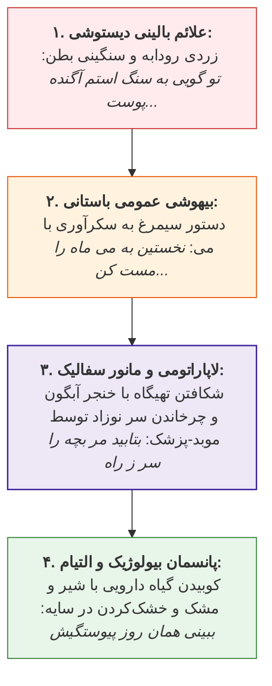

### 2. سیمیولوژی تشخیصی در غزل حافظ (*فاتحه‌ای چو آمدی...*) #امتحانی 

1. **عیادت و تسکین معنوی:** خواندن فاتحه (*فاتحةالکتاب شفاء الامراض*).
2. **معاینه زبان (Tongue Examination):** بررسی بار زبان ناشی از بخارات امزجه (*ای که طبیب خسته‌ای روی زبان من ببین...*).
3. **پایش تب و نبض (Fever & Pulse):** پاشویه با اشک چشم و پایش ضربان حیات (*بازنشان حرارتم زآب دو دیده و ببین / نبض مرا...*).
4. **بررسی ادرار در شیشه (تفسره / قاروره‌نگری):** ایهام در واژگان **مدام** (پیوسته/شراب) و **شیشه** (تنگ می/قاروره ادرار): *آن که مدام شیشه‌ام از پی عشق داده است...* #امتحانی 
5. **نسخه دارویی:** شربت حیات کلام حافظ.

### 3. آسیب‌شناسی و داروشناسی سه‌گانه خاقانی

* **داروشناسی:** *گیاهی* (حنظل، افیون، بلاذر، تباشیر) / *معدنی* (مرجان، مومیا، سیماب، یاقوت) / *حیوانی* (تریاق، سقنقور، قرص مار، سرطان).
* **تصویرسازی‌های بالینی:**
  * *صرع:* خُم صرع‌دار چرخ و برون انداختن کف زرد از دهان به هنگام شفق.
  * *سل و هموپتزی:* تشبیه صدای صراحی به فواق (سکسکه) و شراب جهنده به سرفه خونی مسلول در بامداد.
  * *هاری و هیدروفوبی:* ترس سگ‌گزیده از آب (*نرود گرگزیده ز پی آب*).

### 4. سه پرونده بالینی در نثر کهن فارسی

* **درمان مالیخولیا توسط بوعلی‌سینا (چهار مقاله):** شاهزاده آل‌بویه با توهم گاوپنداری و تقاضای ذبح برای پختن حریسه (حلیم). مداخله: بوعلی در هیئت قصاب کارد بر دست بستن دست و پا لمس دنده‌ها صدور حکم: *گاو لاغر است، علف دهید فربه شود!* نتیجه: تمایل به طعام و داروهای مسهل سودا و بهبودی ظرف **یک ماه**.
* **درمان هموپتزی ناشی از زالو توسط رازی (جوامع‌الحکایات):** بیمار بغدادی با سرفه شدید خونی؛ نبض و ادرار سالم؛ شرح‌حال: شرب آب راکد بین‌راه؛ تشخیص: چسبیدن **دیوچه (زالو)** به فم معده؛ درمان: خوراندن اجباری **طحلب (خزه/جامه غوک آبگیر)** القای امزیس و تنقیه خروج زالو متصل به خزه.
* **احیای سکته قلبی توسط ادیب اسماعیل (چهار مقاله):** آترواسکلروز ناشی از بلع پیه در قصاب؛ احیا با ضربات محکم عصا بر کف پای متوفی.

---

## جلسه ۱۸: پزشکی روایی، همدلی و اتیکت بالینی

### 1. الگوی پزشکی روایی در برابر مدل بازجویانه سنتی #امتحانی 

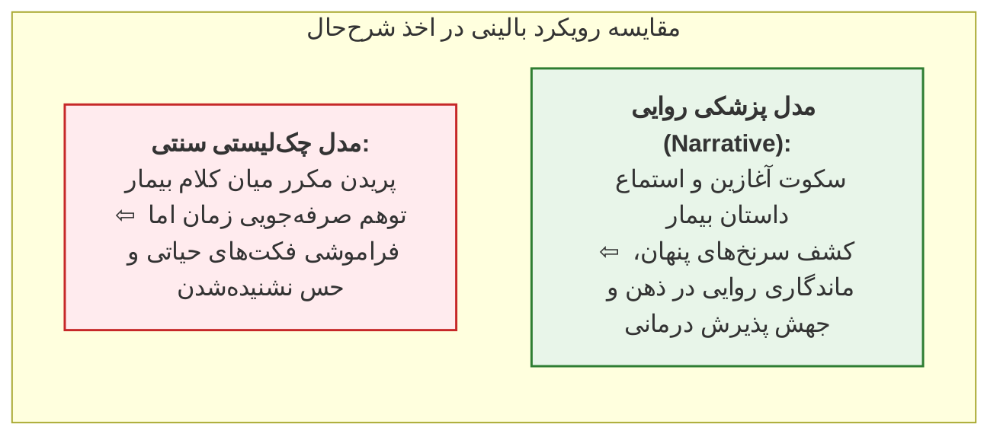

> [!important] کیس‌ریپورت: تقلید درد ایسکمیک با داکسی‌سایکلین
> بیمار قلبی با درد تیپیک قفسه سینه؛ آنژیو و تست‌ها نرمال؛ در روایت آزاد مشخص شد به علت آکنه **داکسی‌سایکلین** مصرف می‌کرده است؛ تشخیص: **ازوفاژیت دارویی (Pill-induced Esophagitis)** مقلد درد آنژین.

### 2. مفهوم همدلی و اتیکت حرفه‌ای

* **همدلی (Empathy):** دیدن بیماری از نگاه بیمار. مراجعه مکرر نه به دلیل شدت درد، بلکه ناشی از **بار عاطفی و هراس اگزیستانسیال از مرگ ناگهانی یا تومور** است. اطمینان‌بخشی علمی پزشک هراس مرگ را محو کرده و نیاز به مسکن فیزیکی را رفع می‌کند (کیس سردرد ساعت ۳ بامداد دکتر معتمد).
* **ظرافت‌های بین‌فرهنگی:** ممنوعیت تراشیدن موی کشاله ران در آنژیوگرافی ژاپن (تقدس موی بدن) / تابوی اعتیاد به داروها در ایران (ترس از وابستگی به آنتی‌بیوتیک ۴ روزه).
* **پرسونای حرفه‌ای و مستندسازی:** آراستگی پوشش، پرهیز از غلط املایی در نسخه (ارتقای قطعی Compliance دارویی) / مستندسازی بالینی (Documentation) تنها سپر قانونی در محاکم قضایی و ضامن پیشگیری از خطای درمانی (کیس ادم مچ پا با آملودیپین پس از ۱۴ سال).
* **تجربه زیسته بیماران:** روایت تشنگی زایمان (چسباندن پارچ آب به تخت) / ترومای عریان‌سازی در ICU (لزوم Draping دقیق بیمار).

---

## جلسه ۲۰: اخلاق حرفه‌ای، روان‌شناسی بالینی و باورهای عامیانه

### 1. پیش‌نیازهای اخلاقی طبابت در متون کهن

* **ابن‌هندو (*مفتاح‌الطب و منهاج‌الطلاب* - قرن ۴ و ۵ ق):** باب نهم؛ الزام به فراگیری **علم اخلاق و تزکیه نفس** پیش از ورود به آموزش طب.
* **محمدحسین عقیلی علوی (*خلاصةالحکمه* - قرن ۱۲ ق):** ۲۲ فضیلت اخلاقی طبیب:
  * شافی مطلق دانستن خداوند و واسطه بودن معالج.
  * پاسداشت حرمت اساتید و پرهیز از تخریب همکاران.
  * **شکیبایی در برابر پرحرفی بیمار:** گوش‌سپاری صبورانه به تکرار علائم.
  * **ارجاع به حاذق‌تر:** در صورت عدم اعتماد بیمار یا توقف پیشرفت بهبودی.
  * **توصیه دوم:** بشاشت و تفهیم اینکه زحمت چند روزه پرهیز، بهای تندرستی دائمی است (*این سهل است و آن دشوار*).
  * **توصیه سوم (رازپوشی):** کاتم اسرار بودن؛ افشای اسرار کتمان‌شده میان بستگان خیانت است.

### 2. اقتصاد درمان و فلسفه معیشت (برزویه طبیب)

> [!abstract] تمثیل جاودان برزویه طبیب در کلیله و دمنه
> هدف طبیب کسب آخرت است؛ همان‌گونه که هدف کشاورز از پراکندن بذر، **برداشت دانه و غلات (قوت انسان / پاداش اخروی)** است، اما **کاه (علف ستوران / درآمد مادی)** نیز به تبع آن خودبه‌خود حاصل می‌گردد! مادیات کاه است و احیای نفس دانه.

### 3. پرسونای پزشک و باورهای تلقینی

* **قابوس‌نامه (عنصرالمعالی):** آراستگی، نظافت و معطر بودن بقراطی طبیب موجب **تقویت حرارت غریزی بیمار** می‌گردد.
* **بوستان سعدی:** حکایت بیمار شیفته رخسار طبیب (*نمی‌خواستم تندرستی خویش / که دیگر نیاید طبیبم به پیش*). #امتحانی 
* **باورهای عامیانه پلاسیبومحور:**
  1. *سبک‌دستی و مبارک‌قدمی در کفایت‌الطب تفلیسی:* شفای دیررس طبیب فاضل اما **گران‌دست**.
  2. *تفأل به نام پزشک:* داستان خیر و شر در *هفت‌پیکر* نظامی (به فال نیک گرفتن نام حکیم خیر توسط شاه).
  3. *سلامت تن طبیب:* سلب اعتماد از پزشک زردچهره (*پزشکی که باشد به تن دردمند...*).

---

## جلسه ۲۱: مراحل سه‌گانه تشخیص، درمان و تسکین در طب سنتی

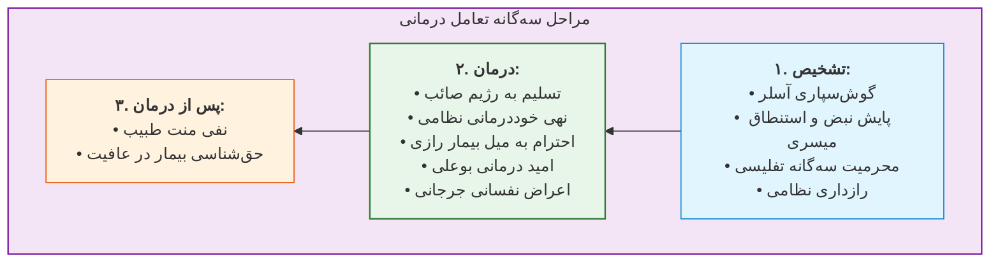

### 1. مرحله تشخیص (Diagnosis)

* **ویلیام آسلر:** *به بیمار خود گوش دهید؛ او تشخیص را به شما می‌گوید.*
* **شعر اوحدی مراغه‌ای:** خطای تشخیصی معالج در نادیده گرفتن اشک چشم و تجویز اشتباه داروی تب‌بُر.
* **دانشنامه حکیم مَیسَری:** دستور به ارزیابی هم‌زمان نبض حین استنطاق (پرسیدن) از سفر، جنگ، ترس و حزن و سپس استراحت دادن به بیمار جهت تثبیت نبض پایه. #امتحانی 
* **محرمیت سه‌گانه طبیب در کفایت‌الطب تفلیسی:** محرم در **زندگانی** (اسرار ضعف و بقا)، **مال** (دارایی و تنگدستی)، و **اهل و عیال** (ناموس).

### 2. مرحله درمان (Therapy)

* **تسلیم به رژیم (صائب تبریزی):** بیمار مصلحت خود را نمی‌داند؛ پرهیزشکنی به طبیب آسیبی نمی‌زند، همان‌گونه که عصیان گناهکاران به ذات غنی خداوند زیانی نمی‌رساند.
* **آسیب‌شناسی خوددرمانی (نظامی گنجوی):** *نشاید کرد خود را چاره کار / که بیمار است رای مرد بیمار*؛ تضعیف عقل به موازات بیماری تن. حتی طبیب حاذق نبض خود را به همکارش می‌سپارد.
* **قواعد سه‌گانه تغذیه زکریای رازی (*المرشد*):**
  1. غذایی که با میل مصرف شود، هرچند کم‌ارزش، سودآورتر است.
  2. شادمانی و توجه به خواسته بیمار موجب تقویت حرارت غریزی است.
  3. تساهل در رژیم: چشاندن اندکی از غذای مورد علاقه به بیمار کم‌توان، حتی اگر مضر باشد.
* **فارماکولوژی امید:** رازی (مژده مداوم بهبودی حتی بدون وثوق قلبی؛ تابعیت مزاج تن از اخلاق نفس)؛ ابن‌سینا (ممنوعیت ایجاد ظن ناامیدی در بیمار)؛ اسماعیل جرجانی (منفعت ایمنی و امید برابر با منفعت شادی معتدل).
* **اعراض نفسانی (اسماعیل جرجانی در ذخیره و اغراض):** سرعت اثر اعراض نفسانی (سخن خوش/ناخوش بر رنگ و صوت) بسیار سریع‌تر از طعام و داروست.
* **پروتکل احتضار و مراقبت پایان حیات (End-of-life Care):**
  * *رویکرد قرون وسطایی غرب (کایزرسبرگ):* اعلام خشن مرگ جهت ایجاد وحشت و اجبار به توبه گناهان (*فرهنگ اسلام در اروپا - زیگرید هونکه*).
  * *رویکرد اسلامی-ایرانی (رازی و بوعلی):* پنهان‌سازی ارعاب مرگبار، آرامش روان و دستور به کام‌جویی واپسین (حکایت سیلی کوبیدن بر قفای مرد در دفتر سوم مثنوی).

---

## جلسه ۲۲: کتب مرجع طب کهن فارسی و شاهکار کفایت‌الطب

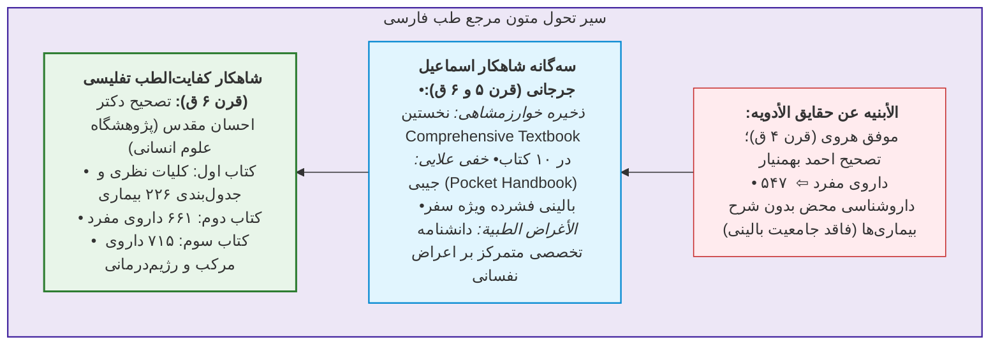

### نوآوری‌های متدولوژیک کفایت‌الطب تفلیسی

* **ارجاع‌دهی مدرن (Citation):** ارجاع به بیش از **۳۰ پزشک** برجسته ایرانی، رومی، یونانی و هندی با امانت‌داری کامل.
* **جدول‌بندی ۲۲۶ عنوان بیماری:** در ساختار تفکیکی سه‌گانه: **۱. سبب (اتیولوژی) ۲. علامت (سیمیولوژی) ۳. علاج (تراپی)** با قاعده طراحی ۲ جدول در هر صفحه بر پایه تقابل برودت/حرارت یا تقابل آراء دو طبیب.
* **فرهنگ داروشناسی تطبیقی تفلیسی (*تقویم‌الأدویه*):** نگارش به زبان عربی؛ برابریابی **۸۰۸ دارو در ۶ زبان** (فارسی، عربی، سریانی، رومی، یونانی و هندی) با تحقیق میدانی.

> [!abstract] استعاره شارستان و رزم در کفایت‌الطب
> **تن انسان** = شارستان (شهر محصور) / **طبیعت بدن** = پادشاه شارستان / **بیماری** = دشمن مهاجم / **دارو** = سلاح رزم / **پزشک** = سالار و فرمانده زیرک میدان. خطای پزشک معادل خطای سردار است که به جای مسهل قی دهد یا هنگام کشکاب (ماءالشعیر) مزوّره تجويز کند. تمثیل سلاح‌خانه حاکمان: بی‌نیاز داشتن پزشک در صلح برای روزگار شبیخون بیماری.

---

## جلسه ۲۳: زیست‌پزشکی دیجیتال، هوشیاری پدیداری و سلامت‌زایی

### 1. بحران آینده‌پژوهی ۲۰۳۰ و شکست درمانگری ماشین‌پذیر

> [!important] افول پزشک-درمانگر تا افق ۲۰۳۰
> آینده‌پژوهی سلامت اثبات می‌کند تا کمتر از یک دهه دیگر، بخش اعظم **درمان فیزیکی (Treatment)** به سامانه‌های الکترونیک واگذار می‌شود. شکست کاسپاروف در شطرنج نشان داد قدرت پردازش داده ماشین بر کمیسیون‌های پزشکی غلبه خواهد کرد.

```mermaid
flowchart TD

DualMind["<b>سنخ‌شناسی دوقلوی هوشیاری در فلسفه ذهن</b>"]

DualMind --> AC["<b>۱. هوشیاری دسترسی (Access Consciousness)</b><br/>- نگهداری داده‌ها جهت حل مسئله، محاسبات و منطق الگوریتمی<br/><br/>- <b>مزیت رقابتی ندارد</b>؛ هوش مصنوعی در آن بر انسان غلبه کرده است"]

DualMind --> PC["<b>۲. هوشیاری پدیداری یا کیفی (Phenomenal Consciousness / Qualia)</b><br/>- تجربه سوبژکتیو &laquo;<b>چونان چیزی بودن</b>&raquo; (What it is like to be)<br/><br/>- ادراک جهان زیسته، <b>لمس تنانه</b> و کیفیت باطنی<br/><br/>- <b>یگانه مزیت رقابتی تسخیرناپذیر انسان</b> و شالوده <b>مراقبت (Care)</b>"]

style DualMind fill:#ede7f6,stroke:#4527a0,stroke-width:2px;
style AC fill:#ffebee,stroke:#c62828,stroke-width:1.5px;
style PC fill:#e8f5e9,stroke:#2e7d32,stroke-width:2px;
```

### 2. سلامت‌زایی (Salutogenesis) و رسالت مامایی مراقب

```mermaid
flowchart TD
    Presense["حضور تنانه مراقب"]
    --> Mirror["آینگی عصبی (Mirroring)"]
    --> Attunement["هم‌کوکی و همسویی (Attunement)"]
    --> Synchrony["همزمانی بالینی (Synchrony)"]
    --> Safety["خلق حس ایمنی (Safety)"]
    --> Trust["زایش اعتماد (Trust)"]
    --> Saluto["<b>فعال‌سازی سلامت‌زایی (Salutogenesis)</b><br>تسهیل تولید خودکار سلامت زیستی تن"]

    style Presense fill:#ede7f6,stroke:#4527a0,stroke-width:1px;
    style Safety fill:#fff3e0,stroke:#e65100,stroke-width:1px;
    style Saluto fill:#e8f5e9,stroke:#2e7d32,stroke-width:2px;
```

* **تمثیل مامایی مراقب:** درمانگر آینده مکانیک تن نیست، بلکه **قابله و تسهیل‌گر تولد دوباره قوای خودترمیمی بیمار** است.
* **کارکرد ادبیات در ارتقای اخلاق (مارتا نوسبام):** علم به دنبال موارد عام آماری است؛ ادبیات به دنبال انسان خاص در موقعیت پدیداری یکتاست. ایجاد *فاصله‌گذاری ایمن (Aesthetic Distance)* جهت ورود به رنج دیگری بدون فرسودگی. داستان‌خوانی بسیار مؤثرتر از تدریس تئوریک اخلاق، حساسیت اخلاقی را ارتقا می‌دهد.

---

## جلسه ۲۴: پزشکی روایی، زیست‌نشانه‌شناسی و تکوین «خود»

### 1. معنا، پراگماتیسم و زیست‌نشانه‌شناسی (Biosemiotics)

* **معنا = کارکرد (Function):** طبق پراگماتیسم ویلیام جیمز و فلسفه ویتگنشتاین، معنا در کارکرد زبانی و متنی آن تجلی می‌یابد. جمله همدلانه پزشک و داروی شیمیایی، هر دو **مداخلات نشانه‌ای** هم‌ارز بیولوژیک هستند.
* **زیست‌نشانه‌شناسی:** انسان شبکه‌ای از معناهاست که ماده و انرژی پیوسته در آن نو می‌شود.
* **پاتولوژی به مثابه سوءتعبیر نشانه‌ای:**
  * *بیماری‌های خودایمنی:* تفسیر سلول «خودی» به اشتباه به عنوان «بیگانه» و تهاجم ایمنی.
  * *سرطان:* تفسیر سلول بدخیم کژدیسه به اشتباه به عنوان «خودی» و مهار بازرسی ایمنی.

### 2. تمایز بنیادین متن بیماری (Disease) و متن ناخوشی (Illness)

```mermaid
flowchart RL
    Disease["<b>متن بیماری (Disease / &laquo;آن&raquo; / It)</b><br/>• نقص پاتولوژیک، بیولوژیک و آماری<br/>• توصیف‌شده با زبان سوم‌شخص در کتب مرجع<br/>• تغییرات هموستاتیک ناقل‌ها و علائم عینی"] <-->|پل تشخیصی پزشکی روایی| Illness["<b>متن ناخوشی (Illness / &laquo;من&raquo; / I)</b><br/>• تجربه زیسته، پدیداری و اول‌شخص بیمار<br/>• بار ناهمیستایی (Allostatic Load)<br/>• موقعیت شغلی و ترومای روانی پیشین"]

    style Disease fill:#ffebee,stroke:#c62828,stroke-width:1.5px;
    style Illness fill:#e8f5e9,stroke:#2e7d32,stroke-width:2px;
```

> [!tip] تحلیل موردی بی‌خوابی (Insomnia)
> در متن Disease، یک اختلال ریتمیک تعمیم‌پذیر است؛ اما در متن Illness، بی‌خوابی برای یک کارمند دفتری صرفاً خستگی است، ولی برای *خلبان برج مراقبت یا جراح چشم* بار وحشت فاجعه‌بار دارد. همچنین اگر بی‌خوابی یادآور شب‌های احتضار والدین باشد، اضطراب فاجعه‌ساز سیکل معیوب بیماری را تثبیت می‌کند.

### 3. حافظه خودزیست‌نامه‌ای، تکوین خود و مسیرهای زیستی

* **روایت معادل خود (Self = Narrative):** بالاترین سطح سازمان حافظه، **حافظه خودزیست‌نامه‌ای (Autobiographical Memory)** است. از **۱.۵ سالگی** با زبان‌آموزی، مغز حوادث پراکنده را در یک خط داستانی نخ‌کشی کرده و هویت «خود» را می‌سازد.
* **سبک دلبستگی آغازین (مادر/مراقب):** شکل‌گیری ایمنی اولیه در ۲ سال نخست زندگی، تعیین‌کننده انسجام روایتی و تاب‌آوری زیستی است.
* **شاهراه‌های دوگانه پیوند روایت با بیولوژی:**
  1. **مسیر روان‌عصب‌ایمنی (Psychoneuroimmunology - PNI):** تغییر در ادراک معنایی ⇦ نوسان سمپاتیک/پاراسمپاتیک ⇦ تغییر کورتیزول و کاتکول‌آمین‌ها ⇦ دگرگونی مستقیم رفتار سایتوکاین‌ها و سیستم ایمنی.
  2. **مسیر اپی‌ژنتیک (Epigenetics):** تجارب روایتی زیسته کلیدهای خاموش/روشن ژن‌های پاتولوژی و سلامت‌زایی را بدون دستکاری توالی DNA تغییر می‌دهند.
* **کنجکاوی درمانی (توره فون اوکسکول):** مهم‌ترین خصلت درمانگر طب روان‌تنی: **«کنجکاوی، کنجکاوی، کنجکاوی!»** جهت گشودن روایت بیمار، مهار خطای *نوسیبو (Nocebo)* و رساندن پاسخ *دارونما (Placebo)* به اوج. #امتحانی 

---


> [!check] مقایسه جامع مفاهیم (نیمه دوم جلسات)
> | ساحت ارزیابی            | سنت پزشکی کهن ایرانی-اسلامی                    | پارادایم بیومدیکال مدرن                   | پارادایم پزشکی روایی و پدیدارشناختی                 |
> | :---------------------- | :--------------------------------------------- | :---------------------------------------- | :-------------------------------------------------- |
> | **تعریف بنیادین انسان** | ارگانیسم کل‌نگر؛ شارستان پیوندزننده تن و جان   | ماشین فیزیکی متشکل از پمپ‌ها و قطعات مادی | شبکه نشانه‌ای معنایی حامل جریان ماده و انرژی        |
> | **ابزار محوری تشخیص**   | استماع شرح‌حال، لمس نبض همگام با استنطاق روانی | پاراکلینیک، تصویربرداری، آزمایش و چک‌لیست | خوانش روایت زیسته، گوش‌سپاری فعال و رمزگشایی ناخوشی |
> | **جایگاه بیمار**        | مخلوق دردمند نیازمند بشاشت و شفقت              | کیس بالینی بی‌نام، پذیرنده نسخه («آن»)    | سوژه پدیداری اول‌شخص، راوی و مالک رنج («من»)        |
> | **رویکرد به داروها**    | غذاها، ادویه مفرد/مرکب، اعراض نفسانی و امید    | فرمولاسیون‌های شیمیایی استاندارد پروتکلی  | مداخلات نشانه‌ای کلامی و شیمیایی هم‌ارز             |
> | **رسالت نهایی پزشک**    | نیل به ثواب اخروی (دانه) و التزام به اخلاق     | درمان تکنیکی ضایعه فیزیکی (Treatment)     | مراقبت پدیداری (Care)، مامایی و سلامت‌زایی          |
> | **جایگاه ادبیات**       | متن آموزش بالینی و استعاره‌پردازی مفهومی       | نامرتبط، اتلاف وقت و تفنن حاشیه‌ای        | شبیه‌ساز ادراک زیسته و یگانه سنگر رقابت با AI       |
