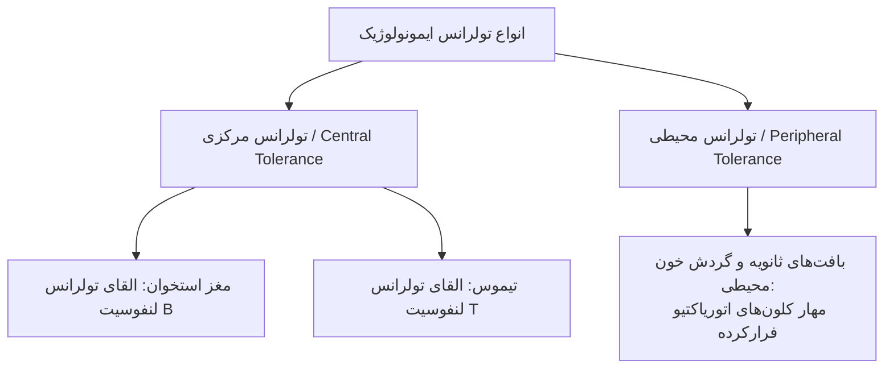
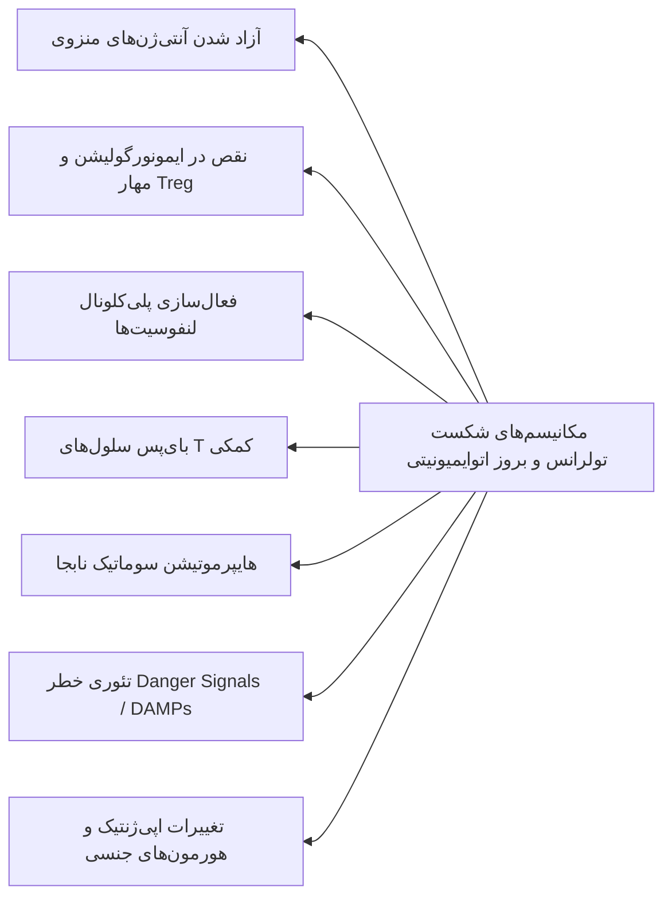
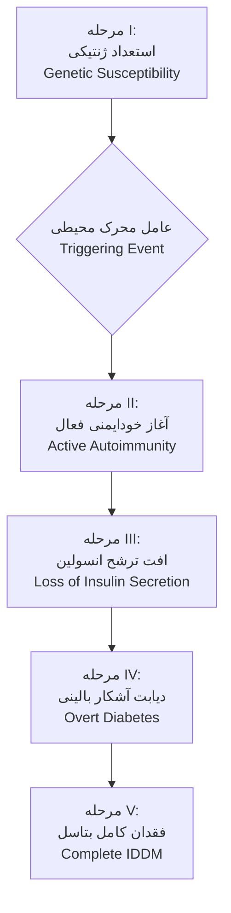
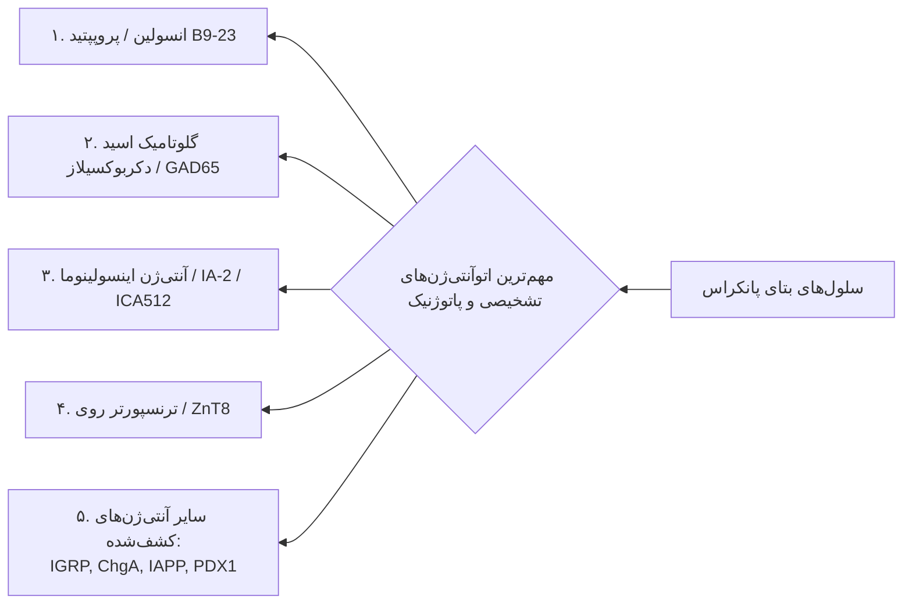
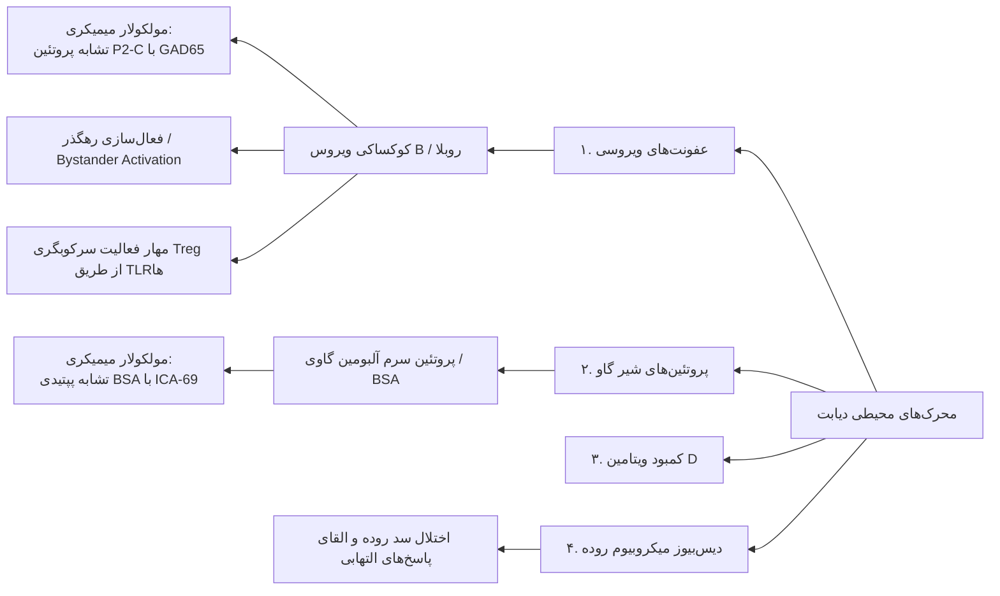
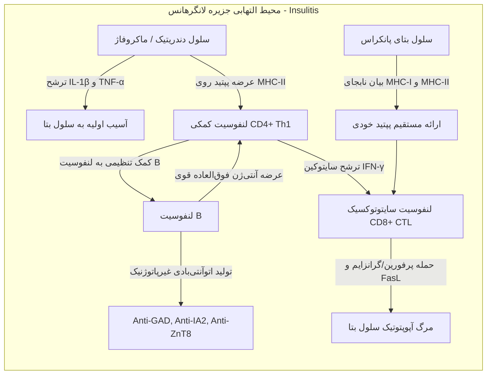
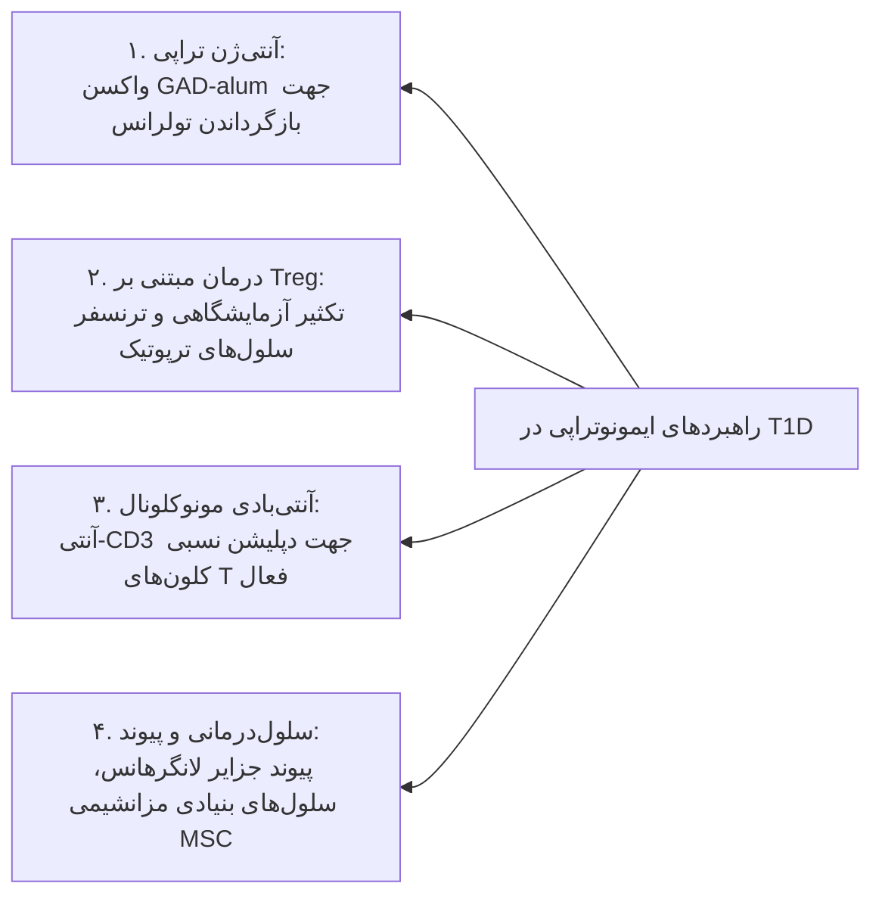
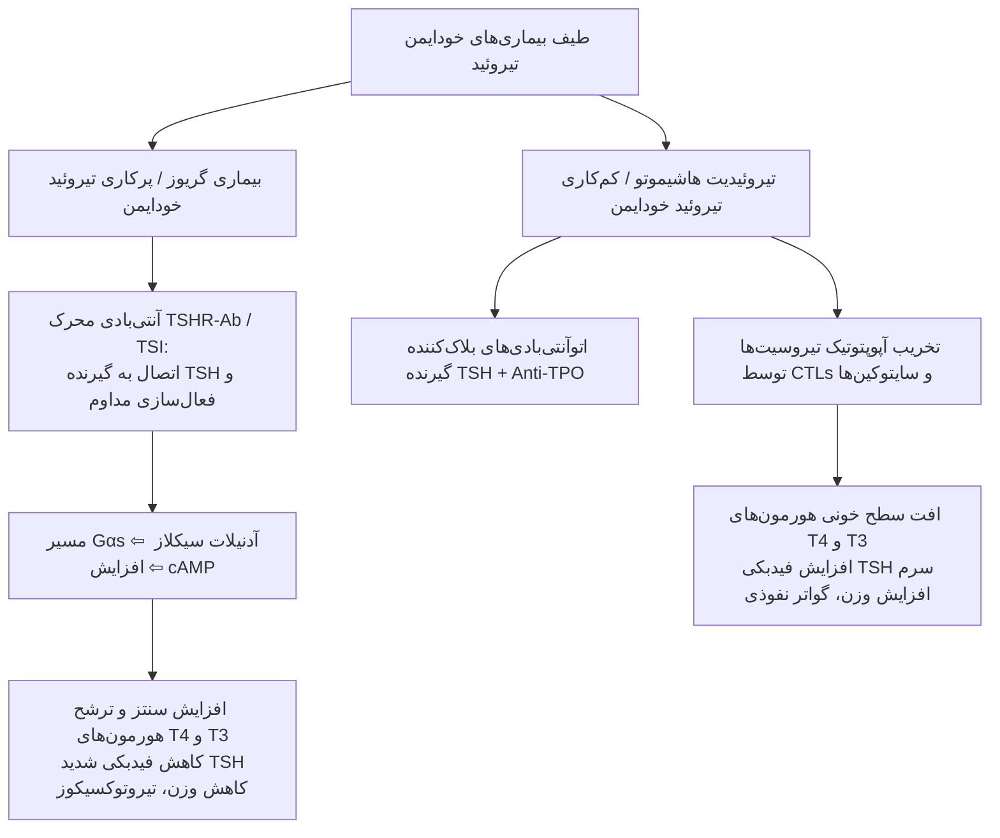

# ایمونولوژی بیماری‌های اتوایمیون اندوکرین (دیابت نوع ۱ و تیروئیدیت‌های خودایمن)

## ۱. پایه‌های تولرانس ایمونولوژیک و مکانیسم‌های شکست آن

### ۱.۱. طبقه‌بندی تولرانس فیزیولوژیک (Tolerance)

> [!abstract] تعریف تولرانس ایمونولوژیک (Immunological Tolerance)
> عدم پاسخ‌دهی اختصاصی سیستم ایمنی به یک آنتی‌ژن خاص (به‌ویژه خودی) ناشی از مواجهه پیشین لنفوسیت‌ها با آن سوبسترا؛ ضامن اصلی بقای بافت‌های خودی و پیشگیری از اتوایمیونیتی.

* **تولرانس مرکزی (Central Tolerance):**
  * وقوع حین تکامل و بلوغ لنفوسیت‌ها در اندام‌های اولیه لنفاوی.
  * **مغز استخوان (Bone Marrow):** محل القای تولرانس لنفوسیت‌های B.
  * **تیموس (Thymus):** محل القای تولرانس لنفوسیت‌های T (حذف کلون‌های پرخطر با واسطه ترنسکریپشن فاکتور AIRE).
* **تولرانس محیطی (Peripheral Tolerance):**
  * وقوع پس از خروج لنفوسیت‌های بالغ از ارگان‌های لنفاوی اولیه و استقرار در بافت‌های محیطی.

### ۱.۲. مکانیسم‌های پایه‌ای برقراری تولرانس

1. **حذف کلونی (Clonal Deletion):** آپوپتوز کلون‌های شناسایی‌کننده آنتی‌ژن خودی با افینیتی بالا در ارگان‌های مرکزی.
2. **آنرژی کلونی (Clonal Anergy):** غیرفعال‌سازی عملکردی لنفوسیت‌ها در غیاب پیام کمک‌محرک (Costimulatory signals).
3. **نادیده‌انگاری کلونی (Clonal Ignorance):** عدم دسترسی لنفوسیت به آنتی‌ژن به دلیل غلظت بسیار ناچیز یا سدهای آناتومیک.
4. **تنظیم فعال (Regulation):** سرکوب لنفوسیت‌های خودواکنش‌گر توسط سلول‌های *Treg* (فاکتور رونویسی FOXP3).
5. **مرگ سلولی ناشی از فعال‌سازی (AICD):** آپوپتوز القایی از طریق مسیر Fas/FasL به‌دنبال تحریک مکرر آنتی‌ژنی.
6. **ویرایش گیرنده (Receptor Editing):** بازآرایی ثانویه زنجیره سبک آنتی‌بادی در سلول‌های B نارس مغز استخوان.
7. **طرد فولیکولی (Follicular Exclusion):** ممانعت از ورود لنفوسیت‌های B اتوریاکتیو به فولیکول‌های لنفاوی ثانویه و مرگ تدریجی آنها.

### ۱.۳. مکانیسم‌های اختصاصی شکست تولرانس و القای اتوایمیونیتی

* **آزادسازی آنتی‌ژن‌های منزوی (Release of Sequestered Antigens):** خروج آنتی‌ژن‌های مخفی‌شده پشت سدهای فیزیکی به گردش خون پس از تروما یا عفونت.
* **تنظیم ایمنی نابجا (Abnormal Immunoregulation):** نقص عملکردی سلول‌های *Treg*، کاهش سایتوکین‌های مهارکننده (مانند IL-10 و TGF-β) یا مهار گیرنده‌های TLR.
* **میان‌بُر تولرانس سلول‌های T کمکی (Bypass of Helper T-cell Tolerance):** فعال‌سازی مستقیم سلول‌های B اتوریاکتیو توسط آنتی‌ژن‌های تغییریافته یا کمپلکس‌ها بدون نیاز به ترغیب کلاسیک T کمکی.
* **فعال‌سازی پلی‌کلونال لنفوسیت‌ها (Polyclonal Lymphocyte Activation):** ترشح سوپرآنتی‌ژن‌ها یا تحریک میتوژنی توسط پاتوژن‌ها که منجر به فعال‌سازی خارج‌ازنوبت کلون‌های ممنوعه خاموش می‌شود.
* **هایپرموتیشن سوماتیک (Somatic Hypermutation):** تغییر تصادفی ژن‌های ایمونوگلوبولین در مراکز زایا و پدیدار شدن کلون‌های ممنوعه خودواکنش‌گر با افینیتی بالا.
* **تئوری خطر (Danger Theory):** آزاد شدن DAMPها از بافت‌های نکروتیک که هشدارهای خطر غیراختصاصی به APCها داده و منجر به شکسته شدن تولرانس در غیاب پاتوژن می‌شود.
* **وضعیت هورمونی (Hormonal Status):** نقش چشمگیر استروژن در تقویت ایمنی هومورال و استعداد بیشتر جنس ماده به بیماری‌های خودایمن.
* **فاکتورهای ژنتیکی (Genetic Factors):** الل‌های مستعدکننده بویژه در لوکوس‌های HLA کلاس II.

### ۱.۴. تعامل سه‌گانه ژن، رفتار و محیط (Trifactor Risk Model)

> [!warning] مدل اتیولوژی چندعاملی (Multifactorial Etiology)
> بیماری‌های خودایمن ناشی از اشتراک سه جزء بنیادی هستند: **ژن‌ها (Genes)**، **محیط (Environment)**، و **سبک زندگی/رفتار (Behavior & Lifestyle)**. هیچ‌کدام از فاکتورها به‌تنهایی برای شروع بیماری کافی نیستند.

* **ژنتیک و اپی‌ژنتیک:** الل‌های HLA، بیش از ۵۰ ژن غیر HLA، تغییرات متیلاسیون DNA و استیلاسیون هیستون.
* **رفتار و سبک زندگی (Behavior):** استرس مزمن روانی، مصرف سیگار، الگوی خواب، ترافیک و استرس‌های شهری.
* **عوامل محیطی (Environment):** عفونت‌های ویروسی/باکتریایی، توکسین‌های صنعتی، داروها، مواجهه با آفتاب، کمبود ویتامین D و متابولیت‌های رژیم غذایی.

---

## ۲. دیابت قند نوع یک (Type 1 Diabetes Mellitus - T1D)

### ۲.۱. تعریف، مشخصات بیوشیمیایی و طبقه‌بندی

> [!abstract] تعریف دیابت قند (Diabetes Mellitus)
> گروهی از اختلالات متابولیک با ویژگی محوری هایپرگلایسمی مزمن ناشی از نقص در ترشح انسولین، نقص در عملکرد انسولین یا هر دو؛ همراه با اختلال متابولیسم کربوهیدرات، چربی و پروتئین.

* **معیارهای آزمایشگاهی تشخیصی:**
  * **FBS (قند خون ناشتا):** بالاتر از **126 mg/dL**.
  * **HbA1c (هموگلوبین A1c):** قطعی بالای **6.5%** (در اسلاید منبع عدد **> 7.5%** جهت نشان دادن شاخص کنترل ضعیف و آسیب ساختاری درج شده است).
  * **OGTT (تست تحمل گلوکز خوراکی ۲ ساعته):** بالاتر از **200 mg/dL**.
* **سه‌گانه علائم کلاسیک (Classic Triad):**
  1. **پلی‌اوری (Polyuria):** ادرار فراوان ثانویه به دیورز اسموتیک ناشی از گلیکوزوری.
  2. **پلی‌دیپسی (Polydipsia):** تشنگی شدید به دلیل کم‌آبی سلولی ناشی از هایپراسمولاریته.
  3. **پلی‌فاژی (Polyphagia):** افزایش افراطی اشتها ناشی از گرسنگی سلولی علیرغم گلوکز بالای پلاسما.
* **نشانه‌ها و پیامدهای حاد متابولیک:** کتواسیدوز دیابتی (DKA)، کتونمی، کتونوری، هایپرونتیلاسیون (تنفس کاسمال)، تهوع، استفراغ و **کاهش وزن حاد و پیشرونده**.

| ویژگی بالینی / ایمونولوژیک  | دیابت نوع 1A (T1A - Immune-mediated)                         | دیابت نوع 1B (T1B - Idiopathic)                           | دیابت نوع 2 (T2D)                                                             |     |
| :-------------------------- | :----------------------------------------------------------- | :-------------------------------------------------------- | :---------------------------------------------------------------------------- | --- |
| **پاتوژنز پایه**            | تخریب خودایمن با واسطه سلول‌های T علیه سلول‌های بتای پانکراس | تخریب ناشناخته و غیرایمن سلول بتا؛ فاقد مارکرهای خودایمنی | اختلال التهابی متابولیک (*Autoinflammatory*) همراه با مقاومت محیطی به انسولین |     |
| **سن شایع شروع**            | کودکان، نوجوانان و جوانان (*Juvenile-onset*)                 | شیوع بیشتر در نژادهای آفریقایی/آسیایی                     | عمدتاً بزرگسالان بالای ۳۵ سال و وابسته به چاقی                                |     |
| **حضور اتوآنتی‌بادی**       | **مثبت با تیتر بالا** (ضد GAD، IA-2، ZnT8، انسولین)          | کاملاً منفی                                               | منفی                                                                          |     |
| **وابستگی قطعی به انسولین** | مطلق (**IDDM**) جهت حفظ حیات و جلوگیری از کتواسیدوز          | دوره‌ای یا دائم؛ مستعد به کتواسیدوز دوره‌ای               | نسبی (**NIDDM**)؛ درمان اولیه متکی بر رژیم، ورزش و داروهای خوراکی             |     |
| **استعداد ژنتیکی HLA**      | همبستگی بسیار قوی با **HLA-DR3** و **HLA-DR4**               | فاقد همبستگی کلاسیک HLA                                   | عدم ارتباط با مکانیسم‌های HLA                                                 |     |

### ۲.۲. مراحل تکاملی شش‌گانه دیابت نوع 1A (Eisenbarth Model)

سیر زوال سلول‌های بتای جزایر لانگرهانس در طول ماه‌ها تا سال‌ها رخ می‌دهد:

1. **مرحله I (استعداد ژنتیکی - Genetic Susceptibility):** حضور ژن‌های پرخطر (لوکوس‌های HLA و غیر HLA)؛ توده سلول بتا 100% طبیعی است.
2. **مرحله تریگر (Triggering Event):** مواجهه با پاتوژن محیطی (کوکساکی ویروس، پروتئین شیر گاو، توکسین) در بستر ژنتیک مساعد.
3. **مرحله II (خودایمنی فعال - Active Autoimmunity):** پدیدار شدن اتوآنتی‌بادی‌های با افینیتی بالا در سرم؛ نفوذ لنفوسیت‌ها به جزایر (**Insulitis**)؛ توده بتاسل به آرامی افت می‌کند.
4. **مرحله III (فقدان ترشح فیزیولوژیک انسولین - Loss of First-Phase Insulin Secretion):** تخریب پیشرونده؛ اختلال اولیه در تست IVGTT پدیدار شده اما قند خون ناشتا هنوز نرمال است.
5. **مرحله IV (دیابت آشکار بالینی - Overt Diabetes):** کاهش توده عملکردی سلول‌های بتا به زیر **10% تا 20%**؛ ظهور سه‌گانه پلی‌اوری، پلی‌دیپسی و هایپرگلایسمی ناشتا.
6. **مرحله V و VI (دیابت وابسته به انسولین کامل - Complete IDDM):** تخریب مطلق و 100% تمام سلول‌های بتا؛ قطع کامل ترشح پپتید C و انسولین اندوژن.

---

## ۳. مبانی ژنتیک دیابت نوع ۱

### ۳.۱. اپیدمیولوژی ژنتیکی
* ریسک عمومی ابتلا در جمعیت: حدود **0.4%**.
* ریسک در فرزندان دارای والدین مبتلا: افزایش به **6%**.
* درصد تطابق دوقلوهای تک‌تخمکی (Monozygotic Twins): بین **39% تا 65%** (عدم رخداد 100% نشان‌دهنده لزوم قطعی فاکتورهای محیطی است).

### ۳.۲. ژن‌های متصل به کمپلکس سازگاری بافتی (HLA Genes)
* قوی‌ترین عامل خطر ژنتیکی بر روی **کروموزوم 6p21**.
* الل‌های بحرانی: **HLA-DR3** و **HLA-DR4**.
* هتروزیگوت‌های مرکب **DR3/DR4** بالاترین ریسک تجمعی ابتلا به دیابت نوع یک را دارا هستند.

### ۳.۳. ژن‌های خارج از کمپلکس سازگاری بافتی (Non-HLA Genes)
شناسایی بیش از ۵۰ لوکوس مستعدکننده توسط مطالعات GWAS:
* **ژن INS (Insulin Gene):** تکرارهای متغیر تاندم (VNTR) در ناحیه پروموتر ژن انسولین؛ تنظیم سطح بیان پروتیین انسولین در تیموس و حذف کلون‌های اتوریاکتیو.
* **ژن CTLA-4:** کدکننده گیرنده مهاری سطح سلول T؛ نقص آن سبب عدم ارسال سیگنال خاموشی به لنفوسیت فعال می‌شود.
* **ژن PTPN22 (Protein Tyrosine Phosphatase Non-Receptor Type 22):** کدکننده فسفاتاز Lyp؛ تعدیل‌کننده منفی سیگنالینگ TCR.
* **ژن CD25 (IL-2Rα):** ساختار گیرنده با افینیتی بالای IL-2؛ کلیدی جهت بقا و کارکرد مهاری سلول‌های *Treg*.
* **ژن CD40:** میانجی تماس بین سلول‌های ارائه‌دهنده آنتی‌ژن (APC) و سلول‌های لنفوسیتی.

> [!danger] سندروم IPEX (تله امتحانی حیاتی)
> جهش در ژن فاکتور رونویسی **FOXP3** واقع بر روی کروموزوم X منجر به نقص کامل تشکیل سلول‌های *Treg* می‌شود؛ تظاهر بیماری با سه‌گانه: **دیابت نوزادی پایدار (Neonatal Diabetes)**، **انتروپاتی شدید خودایمن (اسهال کشنده)** و **پلی‌اندوکرینوپاتی**.

---

## ۴. اتوآنتی‌ژن‌های هدف و تارگت‌های سلول T

### ۴.۱. انسولین و پروانسولین (Insulin & Proinsulin)
* آنتی‌ژن آغازگر محوری دیابت.
* **اپی‌توپ InsB9-23:** پپتید تشکیل‌شده از اسیدهای آمینه شماره ۹ تا ۲۳ زنجیره B؛ متراکم‌ترین کلون‌های نفوذکننده به جزایر مستقیماً بر ضد این اپی‌توپ اختصاصیت دارند.

### ۴.۲. گلوتامیک اسید دکربوکسیلاز (GAD)
* آنزیم تبدیل‌کننده اسید گلوتامیک به GABA.
* ایزوفرم‌ها: **GAD65** در جزایر انسانی، **GAD67** در موش.
* آنتی‌بادی ضد GAD65 (*Anti-GAD*) در درصد بسیار بالایی از بیماران تازه‌تشخیص‌داده‌شده یافت می‌شود؛ تست تشخیصی استاندارد با ارزش پیشگویی بالا.

### ۴.۳. آنتی‌ژن اینسولینوما ۲ (IA-2 / ICA512 / Phogrin)
* پروتئین ترانس‌ممبران تیروزین فسفاتاز بر روی غشای گرانول‌های ترشحی نورواندوکرین.
* بخش آنتی‌ژنیک اصلی: دومین داخل‌سلولی.
* حضور همزمان اتوآنتی‌بادی‌های ضد **IA-2**، **GAD65** و **انسولین** پیشگویی‌کننده قطعی سرعت و وقوع زودهنگام بیماری بالینی است.

### ۴.۴. حامل ترنسپورتر روی (Zinc Transporter 8 - ZnT8)
* پروتئین غشایی انحصاری گرانول‌های ترشحی سلول بتا؛ تسهیل تجمع روی جهت ذخیره انسولین به‌شکل ساختار هگزامر.
* پس از تحریک گلوکز، ZnT8 در غشای خارجی سلول بتا ظاهر شده و در دسترس آنتی‌بادی‌ها قرار می‌گیرد.
* **تست تشخیصی Anti-ZnT8 (مورد تایید FDA):** مارکر اختصاصی جهت تایید زودهنگام دیابت اتوایمیون در کودکان و پیش‌بینی بیماری در افراد بدون علامت پرخطر.

### ۴.۵. سایر تارگت‌های نوظهور و نئوپپتیدها
* **IGRP (Islet-Specific Glucose-6-Phosphatase Catalytic Subunit-Related Protein):** سوبسترای اصلی فعال‌کننده کلون لنفوسیت سیتوتوکسیک دیابتوژنیک NY8.3 CD8+.
* **کروموگرانین A (ChgA):** پروتئین تنظیم ترانزیت وزیکولی و ترشح؛ فعال‌کننده کلون کلاسیک BDC-2.5 CD4+.
* **IAPP (Islet Amyloid Polypeptide):** تارگت اختصاصی شناسایی‌شده توسط کلون BDC-6.9 CD4+.
* **پپتیدهای هیبریدی (Hybrid Peptides) و تغییرات پس از ترجمه (PTMs):**
  * محصول دآمیداسیون، ترنس‌گلوتامیناسیون و سیترولیناسیون پپتیدهای بتا.
  * به علت تولید انحصاری در بافت ملتهب محیطی، لنفوسیت‌های T ضد این نئوپپتیدها از گزینش منفی تیموس فرار کرده و وارد محیط می‌شوند.
* **فاکتور رونویسی PDX1:** آنتی‌ژن دخیل در تکامل جنینی پانکراس.

> [!tip] پدیده گسترش اپی‌توپ (Epitope Spreading)
> تخریب اولیه سلول بتا سبب آزاد شدن آنتی‌ژن‌های ثانویه و فعال‌سازی کلون‌های جدید لنفوسیتی می‌شود. پاسخ ایمنی که ابتدا فقط علیه یک اپی‌توپ (مانند InsB9-23) بوده، به مرور زمان به سایر اپی‌توپ‌های همان پروتئین (*Intra-protein*) یا پروتئین‌های دیگر نظیر GAD65 و IA-2 (*Inter-protein*) تعمیم می‌یابد.

---

## ۵. محرک‌های محیطی و پاتوژنز سلولی-مولکولی

### ۵.۱. ویروس‌های محرک و پدیده شبیه‌سازی مولکولی (Molecular Mimicry)
* **کوکساکی ویروس B (Coxsackievirus B):** قوی‌ترین عامل ویروسی مرتبط؛ جداسازی RNA و کپسید ویروس از جزایر بیماران فوت‌شده در اثر DKA جدید.
* **مکانیسم P2-C و GAD65:** پروتئین ویروسی **P2-C** کوکساکی دارای تشابه ساختاری توالی اسیدآمینه‌ای با **GAD65** پانکراس است. پپتید P2-C به‌راحتی به مولکول **HLA-DR3** متصل شده و لنفوسیت‌های ضد ویروس را تحریک می‌کند؛ لنفوسیت‌های فعال‌شده سپس بر اساس *Cross-Reactivity* به بافت سلول بتای خودی حمله می‌کنند.
* **ویروس سرخجه مادرزادی (Congenital Rubella):** ارتباط اثبات‌شده با افزایش چندبرابری ریسک دیابت نوع ۱.

### ۵.۲. پدیده فعال‌سازی رهگذر (Bystander Activation)
* عفونت حاد موضعی در پانکراس سبب آزادسازی شدید سایتوکین‌های پیش‌التهابی (مانند IFN-γ، TNF-α و IL-1β) و مرگ بافتی می‌شود.
* لنفوسیت‌های T اتوریاکتیو مجاور که قبلاً خاموش (Ignorant/Anergic) بودند، بدون اتصال مستقیم به آنتی‌ژن ویروسی و صرفاً در اثر ترشح این سایتوکین‌ها و سیگنال‌های خطر، به‌طور غیراختصاصی فعال شده و شروع به تخریب سلول‌های بتا می‌کنند.

### ۵.۳. مهار سلول‌های تنظیمی (Treg Dysfunction via TLRs)
* عفونت ویروسی گیرنده‌های شبه‌تول (**TLRها**) را در سلول‌های ایمنی تحریک می‌کند.
* پیام‌رسانی TLR با سرکوب مستقیم ظرفیت مهاری سلول‌های *Treg*، توازن تنظیمی را برهم زده و فضا را برای جولان کلون‌های تهاجمی (*Auto-aggressive T cells*) مهیا می‌سازد.

### ۵.۴. مصرف شیر گاو در نوزادی و آلبومین گاوی (BSA)
* **پروتئین سرم آلبومین گاوی (BSA):** یکی از پروتئین‌های اصلی شیر گاو خام و فرآوری‌نشده.
* توالی پپتیدی قطعه‌ای از BSA شباهت کامل با آنتی‌ژن سطحی **ICA-69** سلول بتای پانکراس دارد.
* مواجهه زودهنگام نوزاد با شیر گاو پیش از تکامل سد مخاطی روده، سبب تحریک ایمنی علیه BSA و متعاقباً واکنش متقاطع علیه ICA-69 و تخریب بافت جزایر می‌شود.
* **نقش محافظتی تغذیه با شیر مادر (Breastfeeding):** نوزادانی که در ماه‌های ابتدایی منحصراً با شیر مادر تغذیه می‌شوند، کمترین میزان بروز اتوآنتی‌بادی‌های دیابتوژنیک را نشان می‌دهند.

### ۵.۵. دیس‌بیوزیس میکروبیوم دستگاه گوارش (Gut Microbiome)
* فلور میکروبی روده تنظیم‌کننده پاسخ‌های تولروژنیک مخاطی است.
* تجویز زودهنگام و بی‌رویه آنتی‌بیوتیک‌ها با تغییر تنوع باکتریایی روده، توازن سایتوکینی را به نفع فاز تخریبی برهم می‌زند (اثبات‌شده با پیشگیری از دیابت در موش‌های NOD پس از مصرف پروبیوتیک‌ها).

---

## ۶. ایمونوپاتولوژی تخریب سلول بتا و شبکه سلولی

### ۶.۱. نقش سلول‌های ارائه‌دهنده آنتی‌ژن (APCs)
* **سلول‌های دندریتیک (DCs):** اولین سلول‌های نفوذکننده به جزایر در فاز اولیه دیابت؛ ترشح‌کننده اصلی سایتوکین‌های پیش‌التهابی **IL-1β** و **TNF-α**.
* **ماکروفاژها (Macrophages):** دومین خط ارتشاحی با فنوتیپ CX3CR1+ F4/80+؛ دارای توانایی خودنوسازی موضعی درون بافت پانکراس؛ حذف ماکروفاژها در مدل موشی NOD مانع از شروع دیابت می‌شود.

### ۶.۲. لنفوسیت‌های T: مجریان اصلی تخریب
* **لنفوسیت‌های CD8+ سیتوتوکسیک (CTLs):** قاتلان نهایی سلول بتا؛ اتصال مستقیم گیرنده TCR به کمپلکس پپتید-MHC-I روی سلول بتا و القای آپوپتوز با واسطه مسیر **پرفورین/گرانزایم** و **Fas/FasL**.
* **لنفوسیت‌های CD4+ كمكی (Th1):** مسئول هدایت سیستم با ترشح **IFN-γ**؛ فعال‌سازی شدید ماکروفاژها و کمک به تمایز و تکثیر CTLها.

### ۶.۳. لنفوسیت‌های B: نقش ارائه‌دهنده الزامی
* اگرچه اتوآنتی‌بادی‌های ترشح‌شده از پلاسماسل‌ها (ضد GAD، انسولین و غیره) صرفاً *مارکر بیولوژیک* بوده و قدرت تخریب مستقیم بافت سلول بتا را ندارند، اما **حضور فیزیکی خود لنفوسیت‌های B جهت پیشرفت بیماری حیاتی است**.
* لنفوسیت‌های B با شناسایی اپی‌توپ‌های اختصاصی (نظیر InsB9-23) از طریق گیرنده سطحی BCR، به قوی‌ترین APCها تبدیل شده و آنتی‌ژن را با راندمان بالا به لنفوسیت‌های T عرضه می‌کنند (موش‌های فاقد لنفوسیت B به‌هیچ‌وجه به دیابت خودایمن مبتلا نمی‌شوند).

### ۶.۴. همدستی سلول‌های بتا در نابودی خود
* سلول‌های بتای نرمال دارای MHC کلاس I هستند.
* در شرایط التهابی و تحت اثر سایتوکین‌های موضعی (IFN-γ)، سلول‌های بتا اقدام به **بیان نابجای مولکول‌های MHC کلاس II** بر سطح خود می‌کنند؛ پدیده‌ای که سبب می‌شود مستقیماً پپتیدهای خودی را به لنفوسیت‌های T عرضه کرده و تخریب آپوپتوتیک خویش را تسریع بخشند.

---

## ۷. راهبردهای نوین ایمونوتراپی در دیابت نوع ۱

1. **آنتی‌ژن تراپی (Autoantigen Therapy):** تجویز کنترل‌شده اتوآنتی‌ژن‌ها (نظیر واکسن فاز ۳ **GAD-alum**) جهت خاموش‌سازی کلون‌های اتوریاکتیو و تحریک تولرانس مخاطی یا بازگرداندن پاسخ‌های تنظیمی.
2. **آنتی‌بادی‌های مونوکلونال (mAb Therapy):** استفاده از آنتی‌بادی اختصاصی ضد مارکر **CD3**؛ دپلیشن انتخابی لنفوسیت‌های T فعال مهاجم و القای ترشح سایتوکین‌های تنظیمی TGF-β و IL-10 همگام با افزایش بیان FOXP3.
3. **درمان مبتنی بر سلول‌های تنظیمی (Treg Therapy):** جداسازی سلول‌های Treg از خون محیطی بیمار، تکثیر آن‌ها در محیط کشت با دانه‌های پوشیده از آنتی‌بادی (*Antibody-coated beads*) و تزریق مجدد سلول‌های اختصاصی به فرد جهت سرکوب پاسخ Th1.
4. **سلول درمانی با سلول‌های دندریتیک القایی (DC Therapy):** استفاده از سلول‌های DC تولروژنیک مهندسی‌شده (نظیر کارآزمایی بالینی DV-0100 فاز ۲).
5. **پیوند سلول‌های بنیادی مزانشیمی (MSC Transplantation):** تعدیل سایتوکین‌های سیستمیک و مهار فیبروز به دلیل ویژگی‌های پرقدرت ایمونومودولاتوری MSCها.
6. **پیوند جزایر لانگرهانس (Islet Cell Transplantation):** جایگزینی توده فیزیکی سلول‌های بتای تخریب‌شده در مراحل نهایی.

---

## ۸. خودایمنی غده تیروئید (Autoimmune Thyroid Diseases - AITD)

### ۸.۱. اپیدمیولوژی و بیماری‌های همراه
* شیوع جهانی تیروئیدیت خودایمن (AIT): حدود **3% تا 5%** جمعیت عمومی با غلبه چشمگیر جنس مونث.
* همبستگی با سایر بیماری‌های خودایمن:
  * ابتلای همزمان در **17% تا 30%** بیماران دیابت نوع یک (T1D).
  * افزایش ۱ تا ۶ برابری شیوع AITD در مبتلایان به آرتریت روماتوئید (RA).
  * همراهی با سندروم شوگرن (SS) در **15.7%** موارد (اشتراک پاتوفیزیولوژی ارتشاح لنفوسیت‌های CD4+ و B).
  * همراهی بارز با لوپوس اریتماتوز سیستمیک (SLE)؛ سروزیتیس (Serositis)، آنتی‌بادی Anti-dsDNA مثبت و افت C3 فاکتورهای پرخطر همراهی لوپوس با AITD هستند.
  * شیوع بالای کم‌کاری تیروئید خودایمن در مبتلایان به مولتیپل اسکلروزیس (MS).

### ۸.۲. اتوآنتی‌ژن‌های سه‌گانه تیروئید

1. **تیروئید پراکسیداز (Thyroid Peroxidase - TPO):** آنزیم متصل به غشای راسی تیروسیت‌ها؛ کاتالیزور یدیناسیون تیروزین در تیروگلوبولین؛ هدف اتوآنتی‌بادی‌های سایتوتوکسیک **Anti-TPO**.
2. **گیرنده هورمون محرک تیروئید (TSH-Receptor - TSHR):** گیرنده جفت‌شده با G-پروتئین روی غشای سلول‌های فولیکولی.
3. **تیروگلوبولین (Thyroglobulin - Tg):** گلیکوپروتئین ماتریکس کلوئید تیروئید؛ منبع ساخت هورمون‌های T3 و T4؛ هدف اتوآنتی‌بادی‌های **Anti-Tg**.

### ۸.۳. مقایسه جامع تیروئیدیت هاشیموتو و بیماری گریوز

| مؤلفه ارزیابی                   | تیروئیدیت هاشیموتو (Hashimoto Thyroiditis)                                                                        | بیماری گریوز (Graves Disease)                                                                               |     |
| :------------------------------ | :---------------------------------------------------------------------------------------------------------------- | :---------------------------------------------------------------------------------------------------------- | --- |
| **پیامد عملکردی نهایی**         | **هایپوتیروئیدی** خودایمن مزمن                                                                                    | **هایپرتیروئیدی** خودایمن مزمن                                                                              |     |
| **ماهیت اتوآنتی‌بادی غالب**     | اتوآنتی‌بادی‌های **مسدودکننده (Blocking Anti-TSHR)**، آنتی‌بادی علیه TPO و Tg                                     | اتوآنتی‌بادی‌های **محرک (Stimulating Anti-TSHR / TSI)**                                                     |     |
| **مکانیسم اصلی تخریب بافتی**    | ایمنی سلولی؛ کشتن مستقیم سلول توسط **CD8+ CTLs** و سایتوکین‌های ماکروفاژی                                         | تحریک هومورال مداوم گیرنده توسط اتوآنتی‌بادی؛ فاقد تخریب فولیکولی اولیه                                     |     |
| **نمای بافت‌شناسی تشخیصی**      | ارتشاح وسیع لنفوسیتی همراه با تشکیل **فولیکول‌های لنفاوی نابجا با مراکز زایا (Germinal Centers)** و سلول‌های هرتل | هایپرپلازی و هایپرتروفی منتشر سلول‌های فولیکولی ستونی متراکم، کلوئید آبکی با نمای موش‌خوردگی (*Scalloping*) |     |
| **پروفایل هورمونی**             | **افت T3/T4 و افزایش مشخص TSH** (همراه با افزایش وزن)                                                             | **افزایش شدید T3/T4 و سرکوب کامل TSH** (همراه با کاهش وزن)                                                  |     |
| **تظاهرات نفوذی خارج‌تیروئیدی** | میکزدم ژنرالیزه ناشی از هیپوتیروئیدی (ادم غیرگوده‌گذار)                                                           | **افتالموپاتی اختصاصی گریوز** و درموپاتی (میکزدم پره‌تیبیال)                                                |     |

### ۸.۴. ایمونوپاتوژنز افتالموپاتی گریوز (Graves Orbitopathy)

> [!important] مکانیسم سلولی افتالموپاتی گریوز
> سلول هدف اصلی در اربیت چشم، **فیبروبلاست‌های اربیتال (Orbital Fibroblasts)** هستند که گیرنده TSHR را به‌طور نابجا بر سطح خود بیان می‌کنند.

1. **فعال‌سازی گیرنده TSHR توسط اتوآنتی‌بادی‌ها:** تحریک آبشارهای داخل‌سلولی شامل:
   * مسیر $G\alpha_s$ ⇦ فعال‌سازی آدنیلات سیکلاز (AC) ⇦ تولید **cAMP**.
   * مسیر $G\alpha_q$ ⇦ فسفولیپاز C (PLC) ⇦ فعال‌سازی آبشار کینازی **PI3K/Akt/mTOR** از طریق کمپلکس پروتئینی با IRS-1/2.
2. **پاسخ‌های تنظیمی فیبروبلاست اربیت:**
   * تمایز به آدیپوسیت‌ها (**آدیپوژنز** و تکثیر توده چربی رترواوربیتال).
   * ترشح مقادیر عظیم گلیکوزآمینوگلیکان‌ها به‌ویژه **هیالورونیک اسید (Hyaluronic Acid)**.
3. **پیامدهای مکانیکی و بالینی:**
   * آب‌دوستی شدید هیالورونیک اسید ⇦ جذب آب و تورم ادماتوز شدید بافت همبند اربیت.
   * ایجاد **پروپتوز (اگزوفتالموس)** و کموزیس ملتحمه.
   * گیرافتادگی و اختلال عملکرد عضلات خارج چشمی (دوبینی و درد در حرکات چشم).
   * **فشردگی عصب اپتیک (Optic-Nerve Compression):** خطر نابینایی و افت شدید حدت بینایی نیازمند جراحی دکامپرسیون اربیت.
* **فاکتورهای خطرساز تشدیدکننده اوربیتوپاتی:** مصرف **سیگار** (قوی‌ترین ریسک‌فاکتور غیرژنتیکی محیطی)، استرس شدید، ید بالا، و عفونت‌هایی نظیر هپاتیت C.

---

## ۹. کیس‌های بالینی آموزشی (Problem-Based Cases)

### کیس شماره ۱: دیابت نوظهور تیپ 1A متعاقب تریگر عفونی

* **شرح‌حال:** پسربچه ۱۴ ساله با سابقه تب و لرز در ۸ روز گذشته (ابتلا به عفونت حاد تنفسی/ویروسی)؛ مراجعه با پلی‌دیپسی و پلی‌اوری شدید به مدت ۲ روز، خستگی مفرط و کاهش وزن علیرغم قطع تب.
* **یافته‌های پاراکلینیک:**
  * قند خون ناشتا: **$FBS = 250\text{ mg/dL}$** (به‌شدت بالا).
  * کتون سرم و ادرار: **مثبت قوی (Strongly Positive)** دال بر لیپولیز مفرط و کتواسیدوز دیابتی.
  * تست هموگلوبین گلیکوزیله: **$HbA1c = 7.8\%$** (نشان‌دهنده وجود هایپرگلایسمی ساب‌کلینیکال طی ۲ تا ۳ ماه گذشته).
  * تست‌های عملکرد کبد و کلیه (AST, ALT, Albumin, Na, BUN) و چربی‌ها: کاملاً نرمال.
* **تحلیل ایمونولوژیک:** عفونت حاد ۸ روز قبل نقش محرک (*Triggering Event*) را ایفا کرده که از طریق مکانیسم‌های *Molecular Mimicry* و *Bystander Activation* فرآیند تخریب خاموش سلول‌های بتا را تسریع و بیمار را از فاز ساب‌کلینیکال به مرحله IV دیابت بالینی و DKA پرتاب کرده است.

### کیس شماره ۲: شروع تدریجی دیابت خودایمن اطفال

* **شرح‌حال:** دختربچه ۵ ساله با دل‌پیچه و درد شکمی مبهم از ۱ روز قبل (شکم نرم در معاینه)؛ فاقد اسهال، تب، راش جلدی یا فوتوفوبی؛ عدم پاسخ به مسکن‌های رایج؛ وجود خستگی، تهوع و پلی‌دیپسی. نکته مهم خانوادگی: ابتلای پسرخاله ۷ ساله به دیابت طی چند ماه اخیر.
* **یافته‌های پاراکلینیک:**
  * آنالیز ادرار: **گلوکوزوری شدید ($Glucose +++$)**.
  * قند خون ناشتا: **$FBS = 128\text{ mg/dL}$** (بالاتر از آستانه قطعی دیابت یعنی 126 mg/dL).
  * سلول‌های خونی (CBC): کاملاً طبیعی.
  * تست هموگلوبین گلیکوزیله: **$HbA1c = 5.7\%$** (محدوده طبیعی).
* **تحلیل ایمونولوژیک:** بیمار در مراحل ابتدایی بروز بالینی دیابت نوع یک (انتقال از فاز III به IV) قرار دارد؛ به همین دلیل قند خون ناشتا به تازگی از مرز تشخیصی گذشته و سطح HbA1c هنوز فرصت کافی جهت افزایش پیدا نکرده است. حضور سابقه خانوادگی دیابت در اقوام درجه دو حاکی از وجود الل‌های پرخطر مشترک HLA است.
