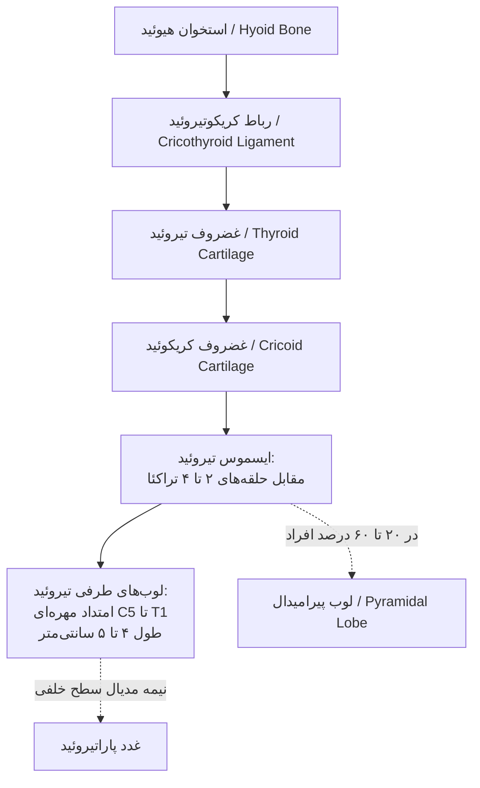
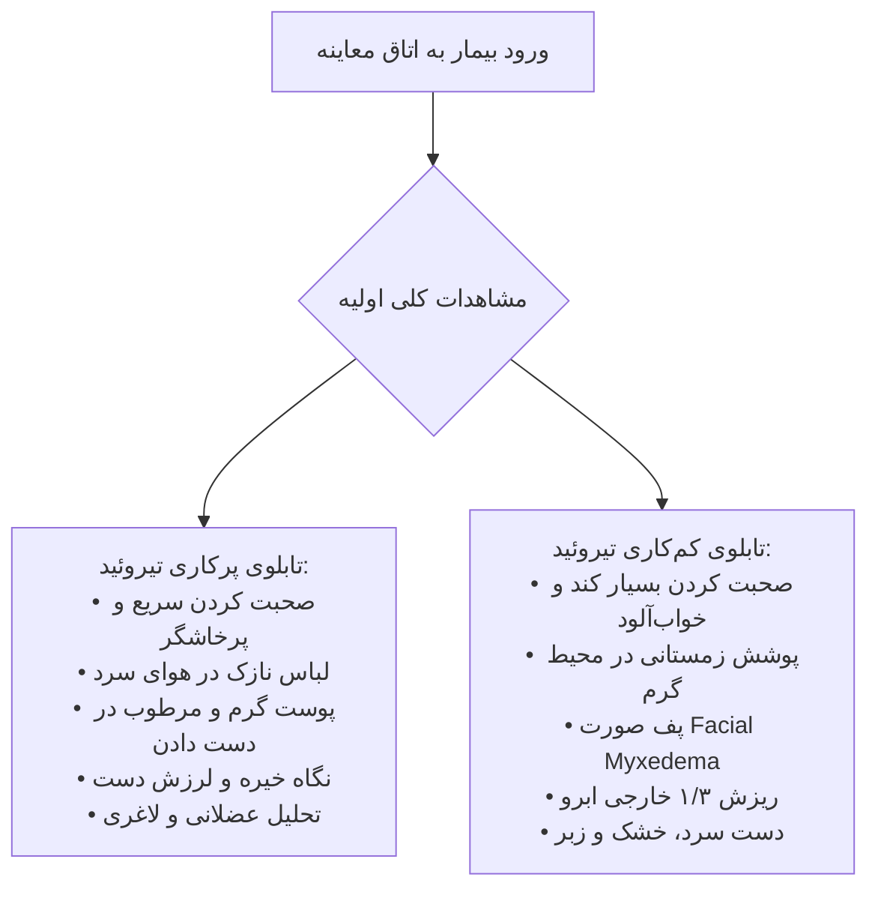
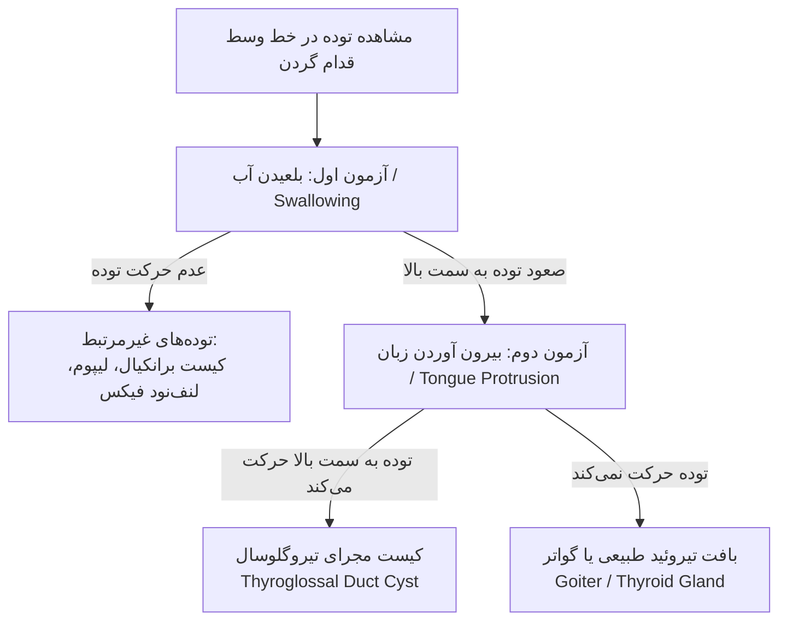
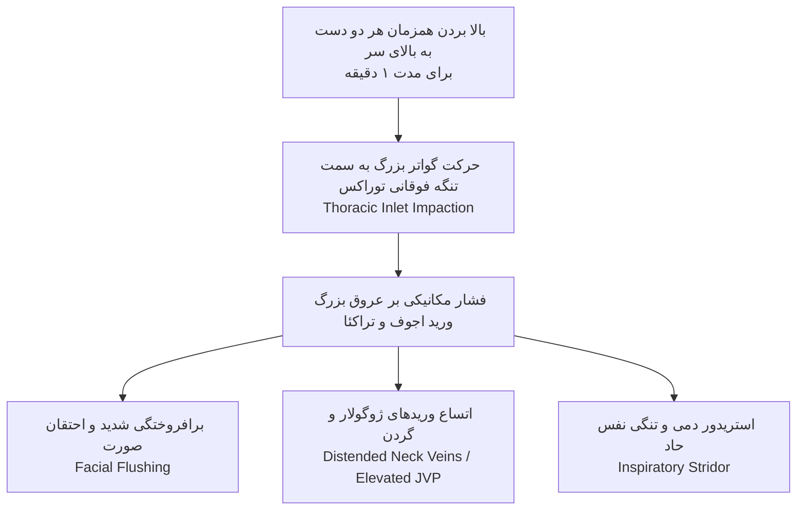
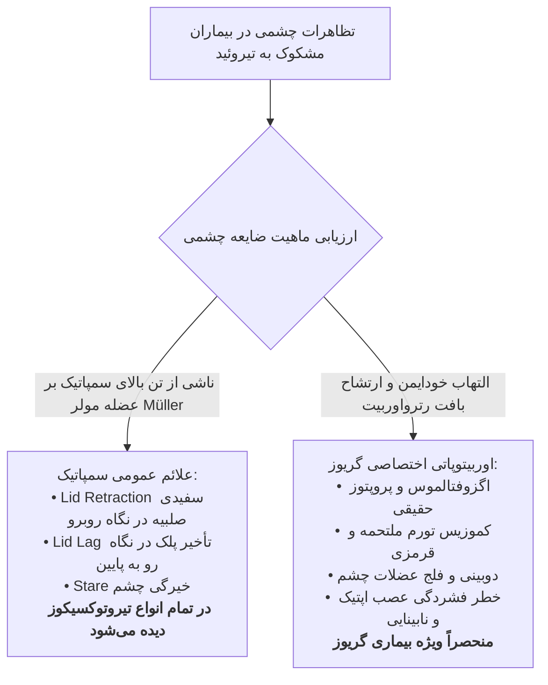

# سمیولوژی، نشانه‌شناسی و معاینه بالینی غده تیروئید

## 1. آناتومی بالینی، توپوگرافی و امبریولوژی تکاملی تیروئید

### 1.1. ویژگی‌های ماکروسکوپیک و مختصات توپوگرافیک
* **بزرگ‌ترین غده اندوکرین خالص بدن:** وزن طبیعی بین **15 تا 20 گرم**؛ در گواترهای شدید پاتولوژیک توانایی افزایش وزن تا **چندین صد گرم** را دارد.
* **ساختار پایه‌ای:** مشتمل بر دو لوب جانبی (**Right & Left Lobes**) متصل توسط **ایسموس (Isthmus)** در خط وسط.
* **آسیمتری فیزیولوژیک:** لوب راست به‌طور طبیعی **بزرگ‌تر و پرعروق‌تر (More Vascular)** از لوب چپ است.
* **امتداد مهره‌ای لوب‌ها:** در مجاورت طرفی لارنکس و تراکئا از مهره **C5 تا T1**.
* **موقعیت ایسموس:** دقیقاً در زیر غضروف کریکوئید، پوشاننده **حلقه‌های 2، 3 و 4 تراکئا**.
* **ابعاد لوب‌های لترال:** طول هر لوب حدود **4 تا 5 سانتی‌متر**؛ انحنا به سمت خلف در اطراف نای و ازوفاگوس.
* **غدد پاراتیروئید:** مستقر بر روی **نیمه مدیال سطح خلفی** غده تیروئید (مجاورت جراحی فوق‌العاده حساس).

> [!info] لوب پیرامیدال (Pyramidal Lobe)
> زایده‌ای تکاملی با منشأ بافت تیروئید که از ایسموس یا مجاورت لوب‌ها به سمت بالا (استخوان هیوئید) امتداد می‌یابد. در **20% تا 60% افراد طبیعی** حضور دارد و بقایای مسیر نزول جنینی تیروئید است.

### 1.2. امبریولوژی و نقایص تکاملی تیروئید
* **مبدأ جنینی:** شروع تکامل از **کف دهان / قاعده زبان** در محل **سوراخ کور (Foramen Caecum)**.
* **مسیر مهاجرت:** نزول در طول خط وسط قدام گردن از طریق **مجرای تیروگلوسال (Thyroglossal Duct)** به سمت موقعیت نهایی در قدام تراکئا.
* **سرنوشت مجرا:** مجرای تیروگلوسال در حالت طبیعی باید پیش از تولد **به‌طور کامل تحلیل رفته و ناپدید شود**.
* **خطاهای تکاملی کلیدی:**
  1. *بافت تیروئید اکتوپیک (Ectopic Thyroid):* توقف تکاملی در طول مسیر نزول؛ شایع‌ترین فرم اکتوپیک، **تیروئید زبانی یا رترولینگوال (Lingual / Retrolingual Thyroid)** در قاعده زبان است.
  2. *کیست مجرای تیروگلوسال (Thyroglossal Duct Cyst):* عدم انسداد و ماندگاری مجرای تیروگلوسال ⇦ تجمع موکوس و ایجاد توده کیستیک خط وسط گردن؛ مستعد **عفونت راجعه و تشکیل سینوس ترشحی گردنی**.

---

## 2. رویکرد سیستمیک، شرح‌حال و سؤالات کلیدی (History Taking)

در ارزیابی اختلالات عملکردی تیروئید، پرسش سیستمیک از **8 علامت محوری** الزامی است:

1. **تغییرات وزن (Weight Change):**
   * *کاهش وزن علیرغم افزایش اشتها:* نشانه هیپرمتابولیسم و تحریک سمپاتیک در پرکاری تیروئید.
   * *افزایش وزن علیرغم اشتهای کم:* نشانه هیپومتابولیسم در کم‌کاری تیروئید.
   * *استثنای امتحانی:* در **حدود 5% بیماران هایپرتیروئید**، به دلیل پرخوری شدید ناشی از افزایش افراطی اشتها، وزن بیمار *افزایش* می‌یابد.
2. **عدم تحمل دمایی (Temperature Intolerance):**
   * *عدم تحمل گرما (Heat Intolerance) و تعریق شدید:* تیروتوکسیکوز.
   * *عدم تحمل سرما (Cold Intolerance):* هایپوتیروئیدی.
3. **تغییر در عادات روده‌ای (Bowel Habits):**
   * *هایپرموتیلیتی و هایپردفیکیشن (افزایش دفعات اجابت مزاج) یا اسهال چرب:* هایپرتیروئیدی.
   * *یبوست مزمن و شدید (Constipation):* هایپوتیروئیدی.
4. **خلق و روان (Mood & Affect):**
   * *تحریک‌پذیری، بی‌قراری، اضطراب و رفتار پرخاشگرانه:* پرکاری تیروئید.
   * *کندی روانی-حرکتی، خستگی مفرط، بی‌تفاوتی (Apathy) و تقلید افسردگی:* کم‌کاری تیروئید.
5. **تپش قلب (Palpitations):** تاکی‌کاردی استراحتی و آریتمی ناشی از تحریک آدرنرژیک قلب.
6. **مشکل در بالا رفتن از پله‌ها (Problems with Stairs):** شاخص کلاسیک **میوپاتی پروگزیمال تیروئیدی (Thyroid Proximal Myopathy)** ناشی از پروتئولیز و کاتابولیسم شدید عضلات در پرکاری تیروئید.
7. **پارستزی و خواب‌رفتگی دست‌ها (Numbness / Tingling):** به دلیل تجمع موکوپلی‌ساکاریدها و ادم در مچ دست که منجر به **سندروم تونل کارپال ثانویه (CTS)** در زمینه هایپوتیروئیدی می‌شود.
8. **لرزش جدید اندام‌ها (New Tremor):** لرزش ریز وضعیتی (**Fine Postural Tremor**) در هایپرتیروئیدی.

---

## 3. بازرسی عمومی و نشانه‌های اولیه (General Inspection)

پیش از هرگونه لمس، مشاهدات چشمی بالین اطلاعات تشخیصی بنیادین فراهم می‌کند:

| مؤلفه ارزیابی | تظاهرات پرکاری تیروئید (Hyperthyroidism) | تظاهرات کم‌کاری تیروئید (Hypothyroidism) |
| :--- | :--- | :--- |
| **رفتار و وضعیت روانی** | مضطرب، بی‌قرار، تند صحبت کردن، بی‌قراری حرکتی (Fidgety) | کند، خواب‌آلود، تأخیر در پاسخ به سؤالات، بی‌تفاوت (Lethargic) |
| **جثه و وزن بدنی** | کاهش وزن شدید، لاغری و اتلاف عضلانی (Muscle Wasting) | افزایش وزن، اضافه وزن و پف‌آلودگی عمومی بدن |
| **پوشش و لباس** | لباس سبک و ناهماهنگ با هوای سرد (به دلیل Heat Intolerance) | ژاکت یا لباس ضخیم در اتاق گرم (به دلیل Cold Intolerance) |
| **پوست و دما** | گرم، مرطوب، برافروخته (Flushed)، تعریق فراوان، اریتم پالمار | سرد، خشک، خشن، پوسته پوسته، رنگ‌پریده ناشی از انقباض عروق |
| **دست دادن (Handshake)** | دست گرم، مرطوب و عرق‌کرده | دست کاملاً سرد، خشک و خشن |
| **مو و ضمائم سر** | موهای نازک، ابریشمی و چرب، آلوپسی منتشر | موهای خشن، خشک، وزوزی و شکننده، کدر |
| **ابروها (Eyebrows)** | الگوی رویش طبیعی یا ریزش غیراختصاصی | **ریزش یک‌سوم خارجی ابروها (Madarosis / Queen Anne's sign)** |
| **چهره و چشم** | نگاه خیره، اگزوفتالموس، چهره هراسان و چشم گشاد | چهره پف‌آلود (Puffiness)، ادم دور چشم (Periorbital Edema) بدون بیرون‌زدگی |

---

## 4. پروتکل معاینه فیزیکی گردن: بازرسی و لمس (Neck Inspection & Palpation)

### 4.1. بازرسی گردن (Inspection)
* موقعیت معاینه‌گر: مشاهده مستقیم گردن از **روبرو** و **نمای جانبی (Lateral Profile)**.
* موارد بررسی: ارزیابی تقارن (Symmetry)، هرگونه برجستگی موضعی، تغییر رنگ پوست، برجستگی وریدها، انحراف تراکئا و **اسکارهای قدیمی جراحی تیروئیدکتومی** (بیمار ممکن است جراحی قبلی را فراموش یا کتمان کند).
* **بازرسی حین مانور بلع (Swallowing Inspection):**
  1. دادن یک جرعه آب به دست بیمار.
  2. امتداد دادن مختصر سر به سمت عقب (**Slight Extension**).
  3. تاباندن نور مایل (**Tangential Lighting**) از زیر چانه به سمت گردن.
  4. درخواست از بیمار برای بلعیدن آب: بافت تیروئید، غضروف تیروئید و غضروف کریکوئید به دلیل اتصال فاشیایی به لارنکس، **همگام با بلع به سمت بالا حرکت کرده** و سپس به جایگاه طبیعی بازمی‌گردند.

### 4.2. مانور حیاتی افتراق توده گردنی (بلع در برابر بیرون آوردن زبان)
جهت افتراق توده غده تیروئید (یا گواتر) از **کیست مجرای تیروگلوسال** و سایر توده‌های قدام گردن:

> [!danger] اصل تشخیصی افتراق کیست تیروگلوسال از گواتر و سایر توده‌ها
> * **مانور بلع آب (Swallowing):** تیروئید نرمال، گواتر و کیست مجرای تیروگلوسال همگی **با بلع به سمت بالا صعود می‌کنند**. توده‌های دیگر (مانند کیست برانکیال، لیپوم یا لنفادنوپاتی فیکس) معمولاً با بلع حرکت نمی‌کنند.
> * **مانور بیرون آوردن زبان (Tongue Protrusion):** بیمار زبان خود را با قدرت به بیرون دهان امتداد می‌دهد:
>   * **کیست مجرای تیروگلوسال:** به دلیل اتصال فیبروتیک یا مجرایی به قاعده زبان در ناحیه سوراخ کور، **با بیرون آوردن زبان به سمت بالا کشیده می‌شود**.
>   * **غده تیروئید / گواتر:** مستقل از حرکات زبان بوده و **با بیرون آوردن زبان مطلقاً حرکت نمی‌کند**.

### 4.3. تکنیک‌های لمس تیروئید (Palpation Techniques)
* **روش خلفی (Posterior Approach - روش استاندارد انتخابی):**
  1. معاینه‌گر مستقیماً پشت سر بیمار می‌ایستد.
  2. بیمار نشسته، گردن در وضعیت **فلکشن ملایم به جلو** (جهت ریلکس شدن عضلات استرنوکلیدوماستوئید).
  3. قرار دادن شست‌های هر دو دست در پشت گردن بیمار و احاطه کردن تراکئا با انگشتان دیگر دست‌ها.
  4. تعیین لندمارک‌های آناتومیک به ترتیب از بالا به پایین: استخوان هیوئید ⇦ غضروف تیروئید ⇦ غضروف کریکوئید ⇦ ایسموس تیروئید (در زیر کریکوئید).
  5. لمس لوب‌ها: برای لمس لوب راست، سر بیمار کمی به سمت راست خم شده؛ با انگشتان دست چپ تراکئا کمی به راست فشرده می‌شود تا لوب راست برجسته شده و با انگشتان دست راست لمس گردد (و بالعکس برای لوب چپ).
  6. تکرار مانور بلعیدن آب حین لمس جهت احساس لغزش پارانشیم و ندول‌ها در زیر انگشتان.
* **روش قدامی (Anterior Approach):** معاینه‌گر در برابر بیمار ایستاده و از شست‌ها برای لمس بافت غده استفاده می‌کند.

### 4.4. چارچوب ارزیابی 7S در توده‌های گردنی
هر ضایعه یا ندول لمس‌شده در تیروئید بر اساس ساختار استاندارد زیر ثبت و گزارش می‌شود:

1. **محل (Site):** تعیین نسبت توده با مثلث قدامی گردن (**Anterior Triangle**)، خط وسط، ایسموس یا لوب‌ها.
2. **اندازه (Size):** ثبت ابعاد دقیق در دو محور بر حسب سانتی‌متر (مانند 3 × 3 سانتی‌متر).
3. **شکل (Shape):** کروی، تخم‌مرغی، بزرگی یکنواخت منتشر یا ندولار نامنظم.
4. **سطح و قوام (Surface & Consistency):**
   * *صاف و نرم (Smooth & Soft):* تیروئید نرمال یا گواتر کلوئیدی فاز استراحت.
   * *لاستیکی و فنری (Rubbery):* لنفوم یا فرآیندهای انفیلتراتیو لنفوسیتی.
   * *بسیار سفت، چوبی یا سنگی (Hard / Stony):* کارسینوم‌های بدخیم تیروئید یا **تیروئیدیت ریدل**.
5. **پوست روی توده (Surrounding Skin):** حضور اریتم، گرما، چسبندگی، زخم و سینوس ترشحی.
6. **تقارن (Symmetry):** متقارن (مانند بیماری گریوز) یا نامتقارن (مانند گواتر مولتی‌ندولار یا تومور).
7. **اسکار (Scars):** ردپای جراحی‌های پیشین تیروئیدکتومی یا بیوپسی.
* *نکات تکمیلی الزامی گزارش:* دیستنشن عروقی، حضور ترشح (Discharge) و **امتداد به پشت جناغ (Retrosternal Extension)**.

---

## 5. معاینه زنجیره‌های لنفاوی گردن (Cervical Lymphadenopathy)

بررسی سیستماتیک عقده‌های لنفاوی گردن در هر بیمار تیروئیدی، به ویژه در موارد شک به بدخیمی و تیروئیدیت‌ها الزامی است:

* **ایستگاه‌های 8 گانه لنفاوی گردن:**
  1. *پری‌اوریکولار (Preauricular):* در قدام لاله گوش.
  2. *پستریور اوریکولار (Posterior Auricular / Mastoid):* روی زائده ماستوئید در خلف گوش.
  3. *اکسیپیتال (Occipital):* در قاعده جمجمه در ناحیه پس‌سری.
  4. *تونسیلار (Tonsillar):* در زاویه فک تحتانی (Angle of Mandible).
  5. *ساب‌مندیبولار و ساب‌منتال (Submandibular & Submental):* در زیر فک تحتانی و زیر چانه.
  6. *سرویکال سطحی (Superficial Cervical):* سطحی نسبت به عضله استرنوکلیدوماستوئید (SCM).
  7. *سرویکال عمقی و خلفی (Deep / Posterior Cervical):* در لبه قدامی ترپزیوس و در طول غلاف کاروتید.
  8. *سوپراکلاویکولار (Supraclavicular):* در فرورفتگی بالای ترقوه.

> [!warning] گره ویرشو (Virchow's Node / Troisier's Sign)
> لنفادنوپاتی در حفره **سوپراکلاویکولار سمت چپ**، نشانگر بدخیمی پیشرفته داخل توراکس یا احشای شکمی (به‌ویژه معده، کولون و مری) است که از طریق مجرای توراسیک گسترش یافته است.

* **تفسیر ویژگی‌های بالینی لنف‌نودها:**
  * **شاتی لنف‌نود (Shotty Nodes):** ندول‌های بسیار کوچک، متعدد، نرم، بدون درد و کاملاً متحرک شبیه ساچمه؛ **یک یافته نرمال و خوش‌خیم واکنشی** به عفونت‌های خفیف و کهنه سر و گردن.
  * **گره‌های تندر و دردناک (Tender Nodes):** دال بر فرآیندهای حاد **عفونی یا التهابی**.
  * **گره‌های بسیار سفت و سنگی (Hard / Fixed):** شدیداً مشکوک به **متاستازهای بدخیم (Malignancy)**.
  * **گره‌های لاستیکی و متحرک (Rubbery Nodes):** تظاهر کلاسیک بیماری‌های **لنفوم (Lymphoma)**.
  * **معیارهای لنفادنوپاتی پاتولوژیک:** قطر **بزرگ‌تر از 1 سانتی‌متر** یا ماندگاری **بیش از 1 ماه**.

---

## 6. سمع تیروئید و نشانه‌شناسی قلبی-عروقی (Auscultation & CVS)

### 6.1. تکنیک سمع غده تیروئید (Thyroid Auscultation)
* هدف: تشخیص افزایش چشمگیر و پاتولوژیک جریان خون پارانشیم غده.
* روش اجرا:
  1. استفاده از دیافراگم یا **بل (Bell) استتوسکوپ**.
  2. قرار دادن بل بر روی هر دو لوب اصلی تیروئید.
  3. درخواست از بیمار برای **حبس نفس (Hold Breath)** تا صدای تنفس با صدای عروقی اشتباه نشود.
* **برویی تیروئیدی (Thyroid Bruit):** صدای سوفل ممتد یا سیستولیک ناشی از تلاطم شدید جریان خون شریانی؛ **شاخص بالینی اختصاصی بیماری گریوز (Graves Disease)** ناشی از واسکولاریزاسیون شدید.

### 6.2. معاینات قلبی و نبض محیطی
* **سمع قلب:** تاکی‌کاردی، ریتم نامنظم و سوفل‌های سیستولیک جریان خون (**Systolic Flow Murmur**) به ویژه در نوک قلب (Apex) ناشی از افزایش برون‌ده قلبی.
* **آریتمی فیبریلاسیون دهلیزی (Atrial Fibrillation - AF):**
  * ایجاد AF با شروع جدید (New-onset AF) یکی از نشانه‌های برجسته پرکاری تیروئید است.
  * حتی در **هایپرتیروئیدی ساب‌کلینیکال**، خطر بروز فیبریلاسیون دهلیزی تا **3 برابر** افراد سالم افزایش می‌یابد.
* **تغییرات فشار خون و فشار نبض (Pulse Pressure):**
  * *هایپرتیروئیدی:* افزایش فشار خون سیستولیک به دلیل افزایش برون‌ده قلب و کاهش فشار دیاستولیک به دلیل اتساع عروق محیطی ⇦ ایجاد **فشار نبض پهن (Wide Pulse Pressure)**.
  * *هایپوتیروئیدی:* انقباض عروق محیطی منجر به افزایش ایزوله فشار خون دیاستولیک می‌گردد.

---

## 7. نشانه‌شناسی دست‌ها، پوست و ضمائم

### 7.1. معاینه دست‌ها و مانور لرزش (Tremor Assessment)
* بررسی پوست کف دست: لمس از نظر گرما و رطوبت؛ مشاهده **اریتم پالمار (Palmar Erythema)** در هایپرتیروئیدی.
* **ارزیابی لرزش ریز (Fine Tremor):**
  1. درخواست از بیمار برای امتداد دادن دست‌ها به سمت جلو در حالی که کف دست‌ها رو به پایین است.
  2. باز کردن انگشتان از یکدیگر.
  3. **تست کاغذ (Paper Test):** قرار دادن یک برگه کاغذ روی پشت دست‌های بیمار؛ لرزش نامحسوس به شکل تکان‌های واضح کاغذ آشکار می‌گردد.

### 7.2. اثرات مستقیم هورمون‌های تیروئید بر پوست، مو و ناخن
* **ناخن‌ها:**
  * **اونیکولیزیس (Onycholysis / Plummer's Nails):** جدا شدن لبه دیستال صفحه ناخن از بستر آن در تیروتوکسیکوز.
  * ناخن‌های نرم، شکننده و براق.
* **موها:**
  * در هایپرتیروئیدی: موهای بسیار نازک، ظریف و ابریشمی همراه با ریزش مو (**Alopecia**).
  * در هایپوتیروئیدی: موهای خشک، ضخیم، وزوزی، شکننده و دچار ریزش ناشی از زبری کلاژن.
* **پوست:**
  * در هایپرتیروئیدی: پوست نرم، گرم، مرطوب، نازک شدن اپیدرم ناشی از کاهش چربی زیرپوستی و هایپرمتابولیسم، تلانژکتازی و پیگمانتاسیون.
  * در هایپوتیروئیدی: پوست زبر، سرد، رنگ‌پریده و خشک با تمایل به پوسته پوسته شدن.

### 7.3. مانور تشخیصی پمبرتون (Pemberton's Sign)
ارزیابی اورژانس انسداد خروجی قفسه سینه ناشی از **گواتر بزرگ داخل توراکس (Retrosternal Goiter)**:

> [!danger] مانور پمبرتون (Pemberton's Maneuver)
> * **روش انجام:** از بیمار خواسته می‌شود هر دو دست خود را به‌طور همزمان تا حد امکان به بالای سر ببرد (به شکلی که بازوها با گوش‌ها تماس پیدا کنند) و برای **1 دقیقه** نگه دارد.
> * **پاسخ مثبت (Positive Pemberton's Sign):** با بالا رفتن دست‌ها، گواتر مانند یک دریچه ورودی توراکس را مسدود می‌کند؛ نشانه‌ها:
>   1. **برافروختگی شدید و سیانوز صورت (Facial Flushing / Plethora)**.
>   2. **اتساع و برجستگی شدید وریدهای سر و گردن**.
>   3. **استریدور تنفسی انسدادی (Inspiratory Stridor)**.
>   4. **افزایش شدید فشار ورید جوگولار (Elevated JVP)**.

### 7.4. پدیده‌های خودایمن همراه (Autoimmune Manifestations)
در بیماران مبتلا به بیماری گریوز یا هاشیموتو، احتمال وقوع سندروم‌های خودایمن همزمان بالاست:

* **آکروپاتی تیروئیدی (Thyroid Acropachy):** کلابینگ (چماقی شدن) انگشتان همراه با تورم بافت نرم و واکنش پریوستئال استخوانی؛ **از دست رفتن زاویه طبیعی لوزی‌شکل بین ناخن‌ها حین تماس پشت به پشت (تست Schamroth)**.
* **میکزدم پره‌تیبیال (Pretibial Myxedema):** درموپاتی اختصاصی **بیماری گریوز** ناشی از رسوب گلیکوزآمینوگلیکان‌ها در اثر تحریک فیبروبلاست‌ها توسط اتوآنتی‌بادی‌ها؛ ایجاد پلاک‌های جلدی ضخیم، پرتقالی‌رنگ، اریتماتو و غیرگوده‌گذار روی استخوان تیبیا.
* همراهی‌های دیگر: **ویتیلیگو (Vitiligo)**، آنمی پرنیسیوز (**Pernicious Anemia**)، بیماری‌های تاولی پوست (**Bullous Disorders**)، اگزما، کهیر و خارش مزمن.

---

## 8. تمایز تشخیصی نشانه‌های چشمی تیروئید (Eye Signs)

یکی از بحرانی‌ترین و پرتکرارترین مباحث امتحانی، **تفکیک اختلالات ناشی از هایپرتونیسیته سمپاتیک از اوربیتوپاتی حقیقی گریوز** است:

### 8.1. تغییرات چشمی ناشی از تحریک سمپاتیک (در تمام فرم‌های تیروتوکسیکوز)
افزایش هورمون‌های تیروئید گیرنده‌های آلفا-آدرنرژیک را بیش‌فعال کرده و تون سمپاتیک عضله تارس فوقانی (Müller's Muscle) را افزایش می‌دهد. این یافته‌ها **در هر علتی از هایپرتیروئیدیسم** (گواتر مولتی‌ندولار توکسیک، آدنوم یا مصرف دارویی) دیده شده و مختص گریوز نیست:

* **خیره نگاه کردن (Stare):** ظاهر چشم‌های بیش از حد باز.
* **انقباض و کشیدگی پلک فوقانی به بالا (Lid Retraction):** در حالت استراحت و نگاه به روبرو، پلک فوقانی بالاتر رفته و سفیدی صلبیه (Sclera) در بالای لیمبوس فوقانی قرنیه آشکار می‌گردد.
* **علامت لید لگ یا تأخیر پلک (Lid Lag / von Graefe's Sign):**
  * *تکنیک معاینه:* بیمار انگشت معاینه‌گر را که از بالا به آرامی به سمت پایین حرکت می‌کند با چشم دنبال می‌کند.
  * *پاسخ پاتولوژیک:* کره چشم به پایین می‌چرخد اما پلک فوقانی به دلیل نقص در ریلکسیشن عضله تارس، با تأخیر حرکت کرده و سفیدی صلبیه در بالای قرنیه به وضوح دیده می‌شود.

### 8.2. اوربیتوپاتی / افتالموپاتی اختصاصی گریوز (Graves Ophthalmopathy)
یک فرآیند التهابی خودایمن واقعی ناشی از ارتشاح لنفوسیتی، سایتوکین‌ها و رسوب گلیکوزآمینوگلیکان در چربی رترواوربیتال و عضلات خارج چشمی. **منحصراً در بیماری گریوز رخ می‌دهد**:

* **پروپتوز و اگزوفتالموس (Proptosis / Exophthalmos):** بیرون‌زدگی فیزیکی کره چشم از اربیت.
  * *معاینه چشمی:* نگاه کردن از بالای سر بیمار رو به پایین؛ کره چشم نباید از لبه برجستگی فوق‌کاسه‌چشمی (**Supraorbital Ridge**) جلوتر باشد.
* **کموزیس (Chemosis):** ادم و تورم شدید بافت ملتحمه چشم ناشی از اختلال تخلیه وریدی و نفوذپذیری عروقی.
* **احتقان و قرمزی ملتحمه (Conjunctival Injection).**
* **ادم دور چشم (Periorbital Edema).**
* **اختلال عملکرد عضلات خارج چشمی (Ophthalmoplegia):** ناتوانی در حرکات چشم به جهات مختلف، ایجاد **دوبینی (Diplopia)** و درد حین حرکات کره چشم.
* **آسیب قرنیه (Corneal Damage):** زخم قرنیه به دلیل ناتوانی در بستن کامل پلک‌ها.
* **نوروپاتی اپتیک (Optic Neuropathy):** خطر کوری و ناباروری دید به علت فشردگی عصب بینایی در آپکس اربیت توسط عضلات متورم.

| مشخصه افتراقی | تغییرات چشمی آدرنرژیک (سمپاتیک) | اوربیتوپاتی اختصاصی گریوز (Graves Orbitopathy) |
| :--- | :--- | :--- |
| **مکانیسم پاتوفیزیولوژی** | تحریک سمپاتیک عضلات تارسال پلک بالا | التهاب خودایمن، ارتشاح لنفوسیت و ادم عضلات اربیت |
| **علائم کلاسیک** | Lid Retraction، نگاه خیره (Stare)، Lid Lag | Proptosis، کموزیس، دوبینی، ادم عضلات خارج‌چشمی |
| **اختصاصیت بیماری** | در **تمام انواع تیروتوکسیکوز** وجود دارد | **منحصراً در بیماری گریوز** مشاهده می‌شود |
| **وابستگی به سطح هورمون** | کاملاً وابسته به سطح خونی هورمون‌های آزاد | ممکن است در بیماران یوتیروئید یا هایپوتیروئید نیز رخ دهد |
| **خطر تهدید بینایی** | وجود ندارد (صرفاً خشکی چشم ناشی از عدم پلک زدن) | **خطر کوری** ناشی از فشرده شدن عصب اپتیک |

---

## 9. پرچم‌های قرمز و تظاهرات ایزوله نیازمند غربالگری فوری تیروئید (Red Flags)

در صورت مشاهده هر یک از تظاهرات منفرد زیر بدون توجیه بالینی مشخص، **بررسی بیوشیمیایی فوری عملکرد تیروئید الزامی است**:

1. **کاهش وزن بدون توجیه (Unexplained Weight Loss):** علیرغم مصرف کالری مناسب.
2. **شروع جدید فیبریلاسیون دهلیزی (New-onset AF):** به‌ویژه در افراد جوان یا بدون بیماری زمینه‌ای قلبی.
3. **میوپاتی پروگزیمال (Proximal Myopathy):** ضعف در برخاستن از صندلی یا ناتوانی در بالا رفتن از پله‌ها ممکن است **تنها علامت مراجعه اولیه** در پرکاری تیروئید باشد.
4. **ژنیکوماستی در مردان (Gynecomastia):** ناشی از تغییر متابولیسم استروئیدهای جنسی در کبد.
5. **سردرد مداوم بدون علت.**
6. **استفراغ مداوم و هایپردفیکیشن (Persistent Vomiting & Hyperdefecation).**
7. **هایپرکلسمی، سنگ کلیه (Nephrolithiasis) و استئوپروز زودرس:** ناشی از افزایش بازجذب استخوانی با واسطه هورمون‌های تیروئید.
8. **اختلالات قاعدگی (Menstrual Disorders):** آمنوره یا الیگومنوره در پرکاری، منوراژی در کم‌کاری.

---

## 10. جدول تطبیقی جامع سمیولوژی تیروئید (Hyperthyroidism vs. Hypothyroidism)

| ارگان / دستگاه | تظاهرات پرکاری تیروئید (Hyperthyroidism) | تظاهرات کم‌کاری تیروئید (Hypothyroidism) |
| :--- | :--- | :--- |
| **متابولیسم و حرارت** | عدم تحمل گرما، هیپرمتابولیسم، تعریق شدید | عدم تحمل سرما، هیپومتابولیسم، کاهش تعریق |
| **سیستم قلبی-عروقی** | تاکی‌کاردی، تپش قلب، نبض پرجهش، فشار نبض پهن، ریسک بالای فیبریلاسیون دهلیزی (AF) | برادی‌کاردی، نبض ضعیف، افزایش فشار دیاستولیک، تسریع آترواسکلروز ناشی از LDL بالا |
| **دستگاه گوارش** | ترانزیت سریع روده‌ای، اسهال، هایپردفیکیشن، سوء‌جذب | کاهش حرکات روده، یبوست مزمن و شدید |
| **سیستم عصبی-عضلانی** | هایپررفلکسی (رفلکس‌های وتری جهنده)، ترمور ریز وضعیتی، ضعف پروگزیمال عضلات | هایپورفلکسی با **تأخیر مشخص در فاز ریلکسیشن (Hung-up reflex)**، سندروم تونل کارپال (CTS) |
| **پوست و مو** | پوست گرم، نازک، مرطوب، اریتم پالمار، اونیکولیز ناخن، موهای ظریف و لخت | پوست سرد، خشک، خشن، ادم غیرگوده‌گذار، ریزش 1/3 خارجی ابرو، موهای وزوزی و خشن |
| **تغییرات بافت همبند** | میکزدم پره‌تیبیال و آکروپاتی تیروئیدی (اختصاصی گریوز) | میکزدم ژنرالیزه، صورت پف‌آلود، بزرگی زبان (ماکروگلوسیا)، خشونت و بم شدن صدا |
| **سمع موضعی گردن** | حضور **Bruit تیروئیدی** ناشی از هایپروواسکولاریتی (بیماری گریوز) | فاقد برویی؛ غده معمولاً ساکت است |
