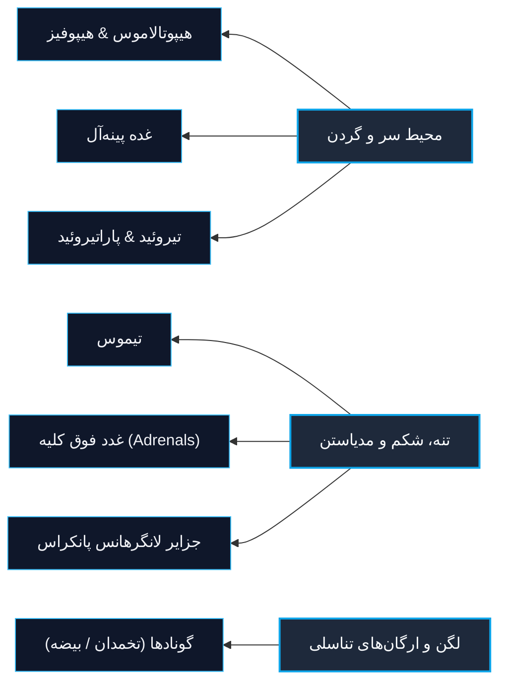
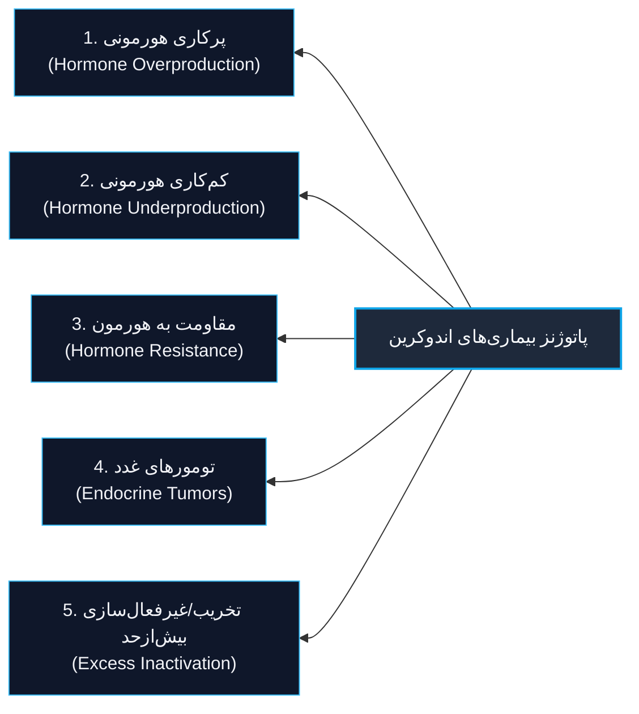
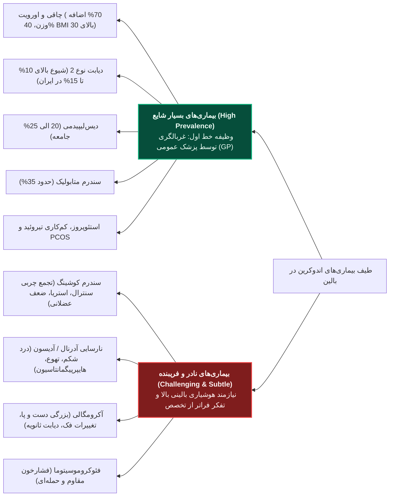
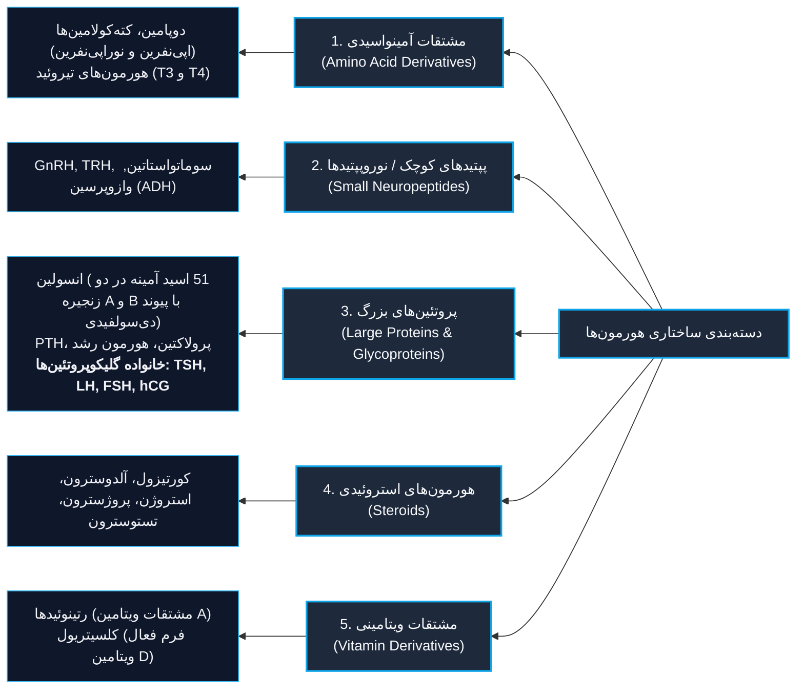
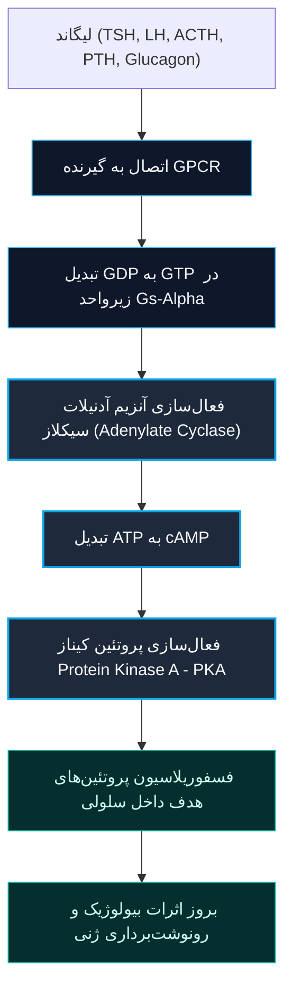
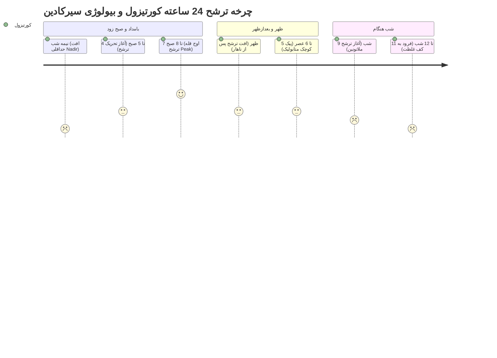
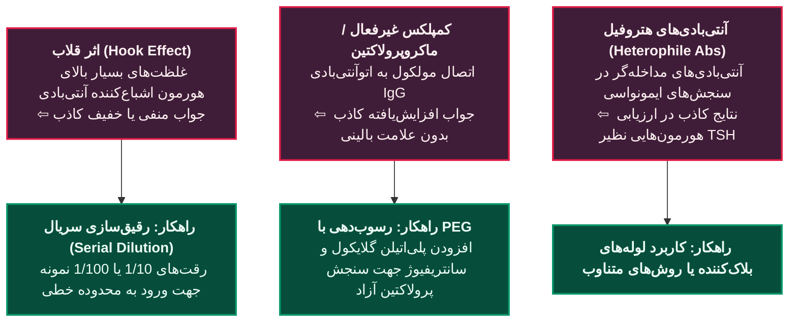
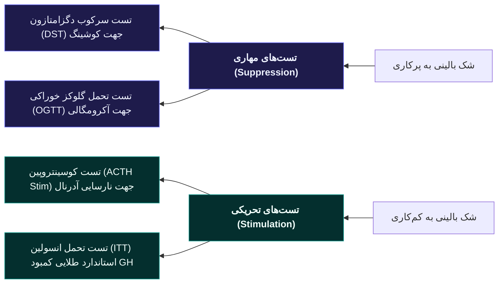
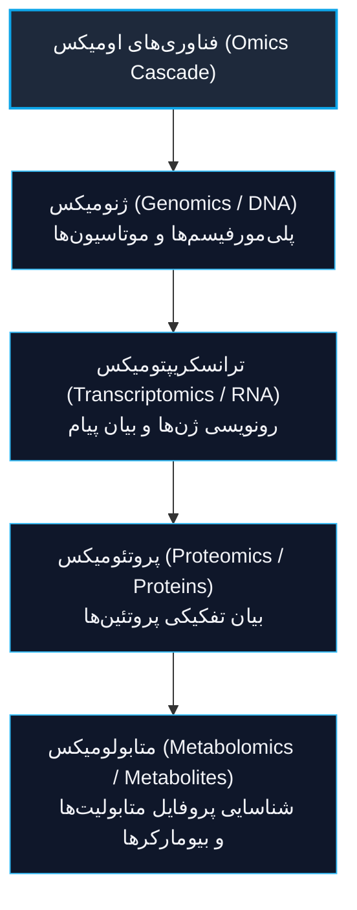

# کلیات اندوکرینولوژی (General Principles of Endocrinology)

> [!abstract] تعریف اندوکرینولوژی و تمایز با اگزوکرین
> **اندوکرینولوژی (Endocrinology)**: علم بررسی غدد درون‌ریز و هورمون‌ها است.
> - **غدد اندوکرین (Endocrine)**: ترشحات شیمیایی خود (*هورمون‌ها*) را مستقیماً به **جریان خون (Capillaries)** تخلیه می‌کنند تا به اندام‌های هدف دوردست انتقال یابند. فاقد مجرا (*Ductless*) هستند.
> - **غدد اگزوکرین (Exocrine)**: ترشحات خود را از طریق مجرا به یک **لومن توخالی** (مانند *GI tract*) یا **سطح خارجی بدن** (مانند غدد عرق، سباسه و پیاز مو) می‌ریزند.

---

## 1. تاریخچه اندوکرینولوژی (History)

- **سال 1766**: کشف و اثبات عملکرد ترشحی داخلی (*Internal secretory function*) برخی ارگان‌های بدن.
- **سال 1904**: نخستین کاربرد واژهٔ **Endocrine** توسط *Maurice Adolph Limon*.
- **سال 1905**: نخستین کاربرد واژهٔ **Hormone** توسط *Ernest H. Starling* (برگرفته از ریشه یونانی به معنای *To set in motion* برای توصیف دینامیک بودن عملکرد فیدبکی).
- **سال 1923**: کشف **انسولین** (نجات‌بخش بیماران *Type 1 DM* که پیش از آن به کام مرگ می‌رفتند).

---

## 2. قلمروها و ساختار ارگان‌های اندوکرین (Scopes & Organization)

> [!important] ویژگی منحصر‌به‌فرد سیستم اندوکرین
> برعکس سایر سیستم‌های بالینی (نظیر *GI* از دهان تا رکتوم، یا تنفس از نای تا آلوئول)، سیستم اندوکرین **فاقد پیوستگی آناتومیک خطی (Anatomic Lines)** است؛ غدد در سرتاسر بدن پراکنده بوده و هماهنگی کارکردی آن‌ها از طریق واسطه‌های هومورال و عصبی برقرار می‌گردد.

### تداخل اندوکرین با سایر ارگان‌ها (Interdigitation)

1. **سیستم قلبی‌عروقی (CVS)**: کنترل فشارخون، مقاومت محیطی و حجم داخل‌عروقی؛ ترشح **ANP** از دهلیز قلب؛ عملکرد واسطه‌های وازواکتیو شامل *کته‌کولامین‌ها*، *آنژیوتانسین 2*، *اندوتلین* و *نیتریک اکساید (NO)*.
2. **مغز استخوان (Bone Marrow)**: هورمون پپتیدی **اریتروپویتین (EPO)** که در کلیه ساخته شده و خون‌سازی (*Erythropoiesis*) را در مغز استخوان تحریک می‌نماید.
3. **کلیه (Kidney)**: تنظیم محور رنین-آنژیوتانسین، پاسخ به **PTH**، متابولیسم کلسیتریول، گیرندهٔ مینرالوکورتیکوئیدها، محور **FGF23** و گیرنده‌های وازوپرسین؛ مشارکت در گلوکونئوژنز.
4. **دستگاه گوارش (GI Tract)**: ترشح انترواندوکرین هورمون‌های **GLP-1**، **CCK**، **گرلین**، **گاسترین**، **سکرتین** و **VIP**.
5. **بافت چربی (Adipose Tissue)**: یک ارگان فعال اندوکرین؛ ترشح **لپتین** (مهار مرکزی اشتها)، **آدیپونکتین** و **رزیستین** در تنظیم متابولیسم پایه.

---

## 3. مکانیسم‌های پاتوژنتیک بیماری‌های غدد (Harrison Table 376-1)

> [!danger] تله تشخیصی: هایپوتیروئیدی مصرفی (Consumptive Hypothyroidism)
> در نوزادان مبتلا به **همانژیوم‌های وسیع جلدی یا احشایی** رخ می‌دهد. ترشح شدید آنزیم **دیودیناز تیپ 3 (D3)** توسط بافت توموری، هورمون‌های فعال تیروئیدی یعنی T4 و T3 را به متابولیت‌های کاملاً بی‌اثر تبدیل کرده و هایپوتیروئیدی شدید ناشی از پاکسازی بیش‌ازحد ایجاد می‌کند.

| ماهیت اختلال | زیرگروه پاتولوژیک | نمونه‌های بالینی مشخص (Examples) |
| :--- | :--- | :--- |
| **پرکاری (Hyperfunction)** | نئوپلاستیک خوش‌خیم | آدنوم‌های هیپوفیز، هایپرپاراتیروئیدی اولیه، ندول‌های توکسیک تیروئید یا آدرنال |
| | نئوپلاستیک بدخیم | کانسرهای کورتکس آدرنال (*ACC*)، مدولاری تیروئید (*MTC*)، کارسینوئیدها |
| | ترشح نابجا (Ectopic) | سندرم *Ectopic ACTH*، سندرم *SIADH* نابجا |
| | سندرم‌های چندگانه | نئوپلازی‌های چندگانه درون‌ریز (**MEN1**, **MEN2**) |
| | خودایمنی (Autoimmune) | بیماری **گریوز (Graves)** از طریق ایمونوگلوبولین تحریک‌کننده تیروئید (*TSI*) |
| | ناشی از درمان (Iatrogenic) | سندرم کوشینگ اگزوژن، هایپوگلایسمی ناشی از سولفونیل‌اوره یا انسولین |
| | التهابی / عفونی | تیروئیدیت ساب‌حاد (فاز تیروتوکسیکوز گذرای تخریبی) |
| | موتاسیون‌های فعال‌کننده | جهش فعال‌کننده در گیرنده‌های LH، TSH، PTH، گیرندهٔ سنجش کلسیم (CaSR) و پروتئین Gsα |
| **کم‌کاری (Hypofunction)** | خودایمنی (Autoimmune) | تیروئیدیت **هاشیموتو**، **دیابت نوع 1**، نارسایی آدرنال (**آدیسون**)، شکست پلی‌گلاندولار (*APS*) |
| | تخریب تهاجمی / ایاتروژنیک | آپوپلاکسی / جراحی هیپوفیز، رادیوتراپی سر و گردن، تیروئیدکتومی، سارکوئیدوز هیپوتالاموس |
| | عروقی (Hemorrhage/Infarct) | سندرم **شین (Sheehan)**، انفارکتوس آدرنال، سندرم واترهوس-فریدریشسن |
| | نقایص ژنتیکی هورمون | موتاسیون در ژن‌های سنتز GH، زنجیره بتا LH، زنجیره بتا FSH، وازوپرسین |
| | نقایص آنزیمی مادرزادی | کمبود آنزیم **21-هیدروکسیلاز** در هایپرپلازی مادرزادی آدرنال (*CAH*) |
| | نقایص تکاملی و تغذیه‌ای | سندرم کالمن (*Kallmann*)، سندرم ترنر (45,X0)، کمبود شدید یُد و ویتامین D |
| **مقاومت (Resistance)** | جهش گیرنده‌های غشایی | گیرنده مقاومت به GH (لارون)، V2 (دیابت بی‌مزه نفروژنیک)، LH, FSH, ACTH, GnRH, GHRH, PTH, Leptin, CaSR |
| | جهش گیرنده‌های هسته‌ای | جهش در گیرنده آندروژن (**AR**)، تیروئید (**TR**)، ویتامین D (**VDR**)، استروژن (**ER**)، گلوکوکورتیکوئید (**GR**)، **PPARγ** |
| | نقص مسیر پیام‌رسانی | استئودیستروفی ارثی آلبرایت (**AHO**) به دنبال جهش غیرفعال‌کننده ژن *GNAS* |
| | اختلالات پس از گیرنده | **دیابت ملیتوس نوع 2 (T2DM)** و مقاومت به لپتین در چاقی ژنتیکی |

---

## 4. بیماری‌های شایع در برابر نادر: تریاژ بالینی

### جدول اپیدمیولوژی، شیوع و پروتکل‌های غربالگری (Harrison Table 376-2)

| نام بیماری یا اختلال | تخمین شیوع در جمعیت بالغ | دستورالعمل دقیق غربالگری و تشخیصی |
| :--- | :--- | :--- |
| **چاقی (Obesity)** | 40% چاقی (BMI ≥ 30)؛ 70% دارای اضافه‌وزن (BMI ≥ 25) | محاسبه شاخص توده بدنی (BMI)؛ پایش دور کمر؛ رد علل اندوکرین ثانویه (کوشینگ، هیپوتیروئیدی)؛ ثبت عوارض همراه |
| **دیابت نوع 2 (T2DM)** | بالای 10% (در جمعیت ایران همراه با پره‌دیابت تا 20%) | شروع غربالگری از سن **45 سالگی** هر 3 سال؛ در گروه‌های پرخطر زودتر؛ معیارهای قند ناشتا FPG ≥ 126 یا تصادفی ≥ 200 یا HbA1c ≥ 6.5% |
| **هایپرلیپیدمی** | 20 تا 25% | پروفایل چربی پایه حداقل هر 5 سال؛ در گروه‌های پرخطر دوره‌های کوتاه‌تر؛ تفکیک پروفایل آتروژنیک (LDL/HDL)؛ رد علل زمینه‌ای |
| **سندرم متابولیک** | 35% | سنجش همزمان 4 شاخص: اندازه دور کمر، قند خون ناشتا، فشارخون، تری‌گلیسرید و کلسترول HDL |
| **هایپوتیروئیدی** | 5 تا 10% در زنان؛ 0.5 تا 2% در مردان | تست اولیه سرمی با سنجش حساس **TSH**؛ تأیید نهایی با بررسی سطح خونی **Free T4** |
| **بیماری گریوز** | 1 تا 3% در زنان؛ 0.1% در مردان | اندازه‌گیری مارکرهای تیروئیدی سرم شامل **TSH** و **Free T4** |
| **ندول و نئوپلازی تیروئید** | 2 تا 5% در معاینه فیزیکی؛ **بیش از 25% در سونوگرافی** | معاینه فیزیکی تیروئید؛ سونوگرافی با تفکیک بالا؛ بیوپسی سوزنی ظریف (**FNA**) برای ندول‌های مشکوک |
| **استئوپروز** | 5 تا 10% در زنان؛ 2 تا 5% در مردان | سنجش تراکم مواد معدنی استخوان (**BMD**) با دگزا در کلیه خانم‌های > 65 سال یا زنان یائسه و مردان دارای فاکتورهای خطر شکستگی |
| **هایپرپاراتیروئیدی** | 0.1 تا 0.5% (شیوع زنان بسیار بیشتر از مردان) | اندازه‌گیری کلسیم توتال و یونیزه؛ در صورت بالا بودن کلسیم، سنجش بلافاصله سطح سرمی **PTH** |
| **ناباروری (Infertility)** | 10% زوجین | بررسی سیستماتیک همزمان هر دو نفر؛ اسپرموگرام مرد؛ تأیید تخمک‌گذاری منظم در زن؛ ارزیابی ذخیره تخمدان |
| **سندرم تخمدان پلی‌کیستیک** | 5 تا 10% زنان (مطالعات اخیر شیوع نزدیک به 20% را نیز مطرح می‌کنند) | تست‌های آندروژنیک شامل **Free Testosterone** و **DHEAS**؛ سونوگرافی واژینال؛ بررسی اختلالات همراه متابولیک |
| **هیرسوتیسم** | 5 تا 10% کل زنان | تست‌های سرمی آندروژن‌ها؛ رد هایپرپلازی مادرزادی غیرکلاسیک و تومورهای مترشحه آندروژن |
| **هایپرپرولاکتینمی** | 15% زنان مراجعه‌کننده با آمنوره یا گالاکتوره | سنجش خونی **پرولاکتین (PRL)**؛ ام‌آر‌آی پروتکل هیپوفیز در صورت رد علل دارویی |
| **اختلال نعوظ (ED)** | 10 تا 25% مردان | شرح‌حال دقیق؛ اندازه‌گیری تستوسترون و پرولاکتین سرم؛ رد نوروپاتی و واسکولوپاتی ناشی از دیابت |
| **هایپوگونادیسم مردانه** | 1 تا 2% مردان | سنجش تستوسترون تام اول صبح؛ اندازه‌گیری **LH** جهت تفکیک اولیه از ثانویه |
| **ژنیکوماستی** | 15% مردان | در اغلب موارد فیزیولوژیک بوده و نیازمند تست نیست؛ در شرایط پاتولوژیک ارزیابی از نظر **سندرم کلاین‌فلتر**، نارسایی کبدی و داروها |
| **کمبود ویتامین D** | 10% (در مناطق شهری کم‌نور بسیار بیشتر) | اندازه‌گیری سرمی سطح تام **25-OH Vitamin D** |
| **سندرم کلاین‌فلتر** | 0.2% مردان (47,XXY) | کاریوتیپ کروموزومی تاییدکننده؛ اندازه‌گیری سطح تستوسترون، LH و FSH |
| **سندرم ترنر** | 0.03% تولدهای زنده دختر (45,X0) | آنالیز سیتوژنتیک کاریوتیپ؛ غربالگری مداوم ناهنجاری‌های قلبی (کوارکتاسیون آئورت) و کلیوی |

---

## 5. سرنخ‌های بالینی در بیماری‌های نادر غدد (Clinical Cases)

> [!warning] قانون طلایی تظاهرات غیراختصاصی بیماری‌های غدد
> علائم پاتولوژی‌های درون‌ریز در مراحل اولیه کاملاً **غیرمستقیم و فریبنده** هستند. بیمار با شکایات گوارشی یا قلبی به متخصصین نامربوط مراجعه می‌کند؛ شکست در رسیدن به تشخیص بالینی نباید به درمان‌های علامتی طولانی‌مدت منجر شود.

### سناریوی 1: نارسایی اولیه آدرنال (بیماری آدیسون)
- **شرح بیمار واقعی**: خانم جوان 27 ساله با درد شدید شکم، تهوع، استفراغ و کاهش وزن شدید 10 تا 15 کیلوگرمی طی 6 ماه؛ 3 بار آندوسکوپی و 2 بار کلونوسکوپی نرمال و سی‌تی‌اسکن شکم منفی.
- **تله بالینی**: تشخیص اشتباه گاستروانتریت مزمن و دریافت مکرر سرم در درمانگاه.
- **کلیدهای طلایی در بالین**:
  1. *کاهش فشارخون ارتواستاتیک* (افت شدید فشار سیستولیک به زیر 80 تا 90 میلی‌متر جیوه) همراه با تاکیکاردی جبرانی (پالس بالای 120).
  2. *هایپرپیگمانتاسیون پوستی و مخاطی*: لکه‌های پیگمانته بر روی خطوط کف دست و لثه‌ها به دلیل افزایش هورمون **ACTH** (توالی مشترک با پروملانوکورتین یا *POMC* و اثر بر گیرنده‌های ملانوسیتی).
  3. *ولع شدید به مصرف نمک (Salt Craving)*: تمایل مفرط به خوردن پفک و نمک به دلیل تخلیه سدیم ناشی از کمبود آلدوسترون.
  4. *بیوشیمی اورژانسی*: هیپوناترمی همزمان با هایپرکالمی و هیپوگلایسمی ناشتا. سطح کورتیزول پایه زیر 3 mcg/dL (در این بیمار 1 mcg/dL).

> [!danger] نکته امتحانی و اورژانس طبابت (تله تستی)
> هر کودک یا فردی که با **درد حاد شکم و تهوع و استفراغ** مراجعه می‌کند، پیش از تجویز داروهای ضداسپاسم (مانند هیوسین) یا ضدتهوع و ترخیص، باید **قند خون تصادفی (BS)** فوراً با گلوکومتر چک شود؛ زیرا تظاهر اولیه کتواسیدوز دیابتی (**DKA**) در دیابت نوظهور تیپ یک کودکان با درد شدید شکمی است و تجویز مایعات نامناسب می‌تواند منجر به شوک کشنده گردد.

### سناریوی 2: سندرم کوشینگ (Cushing's Syndrome)
- **سناریو**: بیمار با چاقی مقاوم به رژیم غذایی جهت جراحی چاقی مراجعه می‌کند یا فردی با فشارخون ملایم ناگهان دچار افزایش افسارگسیخته فشارخون می‌گردد.
- **تظاهرات بالینی اختصاصی**:
  - بازتوزیع چربی احشایی: صورت گرد و پُرخون (**Moon Face**)، کوهان چربی پشت گردن (**Buffalo Hump**)، چاقی تنه‌ای با شکم آویزان (*Pendulous Abdomen*).
  - پوست نازک و شکننده، استریاهای پهن به رنگ ارغوانی تیره روی شکم و ران‌ها، کبودشدگی آسان با ترومای خفیف (*Easy Bruising*)، آکنه و تأخیر در ترمیم زخم.
  - پروگزیمال میوپاتی: ضعف شدید عضلات شانه و ران (ناتوانی در برخاستن از حالت چمباتمه).
  - پوکی استخوان پیش‌رونده، هایپرتانسیون و عدم تحمل گلوکز (*Impaired Glucose Tolerance*).

### سناریوی 3: آکرومگالی (Acromegaly)
- **اتیولوژی**: ترشح نابجا یا تومورال هورمون رشد (**GH**) و فاکتور رشد شبه‌انسولین یک (**IGF-1**) از آدنوم هیپوفیز؛ اغلب بین 30 تا 50 سالگی تظاهر می‌یابد.
- **علائم و نشانه‌ها**:
  - فک برآمده (**Prognathism**)، برجستگی ریج سوپرااوربیتال پیشانی، ماکروگلوسی (زبان بزرگ) با فواصل بین‌دندانی عریض و بم شدن تن صدا.
  - پهن شدن دست‌ها و پاها بصورت بیل‌مانند (**Spade-like Hands & Feet**)، افزایش سایز کفش و انگشتر، گیرافتادگی عصب مدیان (سندرم تونل کارپال).
  - تعریق مفرط شبانه، پوست چرب و ضخیم، آپنه خواب (*Sleep Apnea*).
  - هایپرتانسیون، هایپرتروفی میوکارد، بیماری ایسکمیک و نارسایی قلبی پیش‌رونده، مقاومت شدید به انسولین و دیابت، پیدایش پولیپ‌های کولون و ریسک بالای بدخیمی کولورکتال.

---

## 6. بیوشیمی و ساختار هورمون‌ها (Hormone Classes)

> [!important] خانواده گلیکوپروتئین‌ها و کراس‌اور گیرنده‌ای
> هورمون‌های **TSH، LH، FSH و hCG** همگی دارای ساختار دایمری دو زیرواحدی هستند:
> - **زیرواحد آلفا (α)**: در هر 4 هورمون کاملاً **یکسان و مشترک** است (از یک ژن کد می‌شود).
> - **زیرواحد بتا (β)**: ساختار اختصاصی داشته و ویژگی بیولوژیک و اتصال به گیرنده را ایجاد می‌کند.
>
> **پیامد بالینی در بارداری**: به دلیل شباهت توالی زیرواحد بتای hCG با TSH، افزایش چشمگیر hCG در **سه‌ماهه اول بارداری** باعث تحریک ناخواسته گیرنده‌های TSH در تیروئید می‌شود؛ در نتیجه سطح خونی هورمون‌های تیروئیدی اندکی بالا رفته و از طریق فیدبک منفی، **سطح خونی TSH افت می‌کند** که تصویری مشابه هایپرتیروئیدی بیوشیمیایی گذرا پدید می‌آورد.

---

## 7. بیولوژی گیرنده‌ها و پیام‌رسانی سلولی (Receptors & Signaling)

| تیپ گیرنده | موقعیت ساختاری در سلول | ماهیت هورمون لیگاند | سیستم پیام‌رسان ثانویه و فاکتورهای پایین‌دست |
| :--- | :--- | :--- | :--- |
| **G Protein-Coupled (GPCR)** | غشای سیتوپلاسمی (7 ترنسممبران مارپیچ) | پپتیدها، گلیکوپروتئین‌ها و کته‌کولامین‌ها | زیرواحدهای Gsα (تحریک آدنیلات سیکلاز و افزایش cAMP و فعال‌سازی PKA)؛ Giα (مهار آدنیلات سیکلاز)؛ Gq/G11 (فعال‌سازی فسفولیپاز C و تولید IP3 و DAG و کلسیم آزاد) |
| **گیرنده‌های تیروزین کیناز اینترینسیک (RTK)** | ترنسممبران با دومین کینازی درونی سیتوپلاسمی | انسولین و فاکتور رشد شبه‌انسولین (**IGF-1**)، فاکتور رشد اپیدرمال (**EGF**), NGF | دایمریزاسیون و اتوفسفوریلاسیون اسیدهای آمینه تیروزین؛ فعال‌سازی سوبستراهای گیرنده انسولین (**IRS**) و مسیرهای **MAPK** و **PI3K / AKT** |
| **گیرنده‌های مرتبط با سیتوکین (Non-RTK)** | ترنسممبران فاقد کیناز داخلی مستقیم | هورمون رشد (**GH**)، پرولاکتین (**PRL**)، اریتروپویتین (**EPO**) | جذب کینازهای داخل سلولی خانواده ژانوس (**JAK Kinases**)؛ فسفوریلاسیون فاکتورهای رونویسی خانواده **STAT** و ترنسلوکاسیون به هسته |
| **گیرنده‌های سرین/ترئونین کیناز** | ترنسممبران اختصاصی | **اکتیوین (Activin)**، هورمون مهارکننده مولرین (**MIS/AMH**), **TGF-β**, BMP | فسفوریلاسیون و انتقال کمپلکس پروتئین‌های پیام‌رسان **Smads** به داخل هسته |
| **گیرنده‌های داخل سلولی (Nuclear/Cytoplasmic)** | درون سیتوپلاسم یا باند شده به کروماتین هسته | **هورمون‌های استروئیدی**، **مشتقات ویتامینی (Vit D, Retinoids)** و **هورمون‌های تیروئید** | ترنسلوکاسیون کمپلکس هورمون-رسپتور به هسته، اتصال به عناصر پاسخ هورمونی (**HRE**) روی DNA و القای رونویسی ژن |

### موتاسیون‌های بالینی در پروتئین Gsα (کد شده توسط ژن *GNAS*)

> [!danger] کنکاش تشخیصی: مقایسه سندرم مک‌کون آلبرایت و استئودیستروفی آلبرایت
> ژن **GNAS** بر روی کروموزوم 20q13 دارای پدیده نقش‌پذیری ژنومی (**Genomic Imprinting**) است و بروز بالینی آن وابسته به نوع جهش (فعال‌کننده یا غیرفعال‌کننده) و منشأ والدینی می‌باشد.

1. **جهش فعال‌کننده سوماتیک پس‌زیگوتی (Activating Mutation)**:
   - **سندرم مک‌کون آلبرایت (McCune-Albright Syndrome)**: موتاسیون در اوایل امبریوژنز به صورت موزائیسم رخ می‌دهد. زیرواحد Gsα به طور مداوم و بدون نیاز به لیگاند فعال می‌ماند و عملکرد گیرنده‌های GPCR در بافت‌های مختلف شبیه‌سازی می‌شود.
   - *تریاد کلاسیک بالینی*:
     1. **پلی‌استوتیک فیبروز دیسپلازی (Polyostotic Fibrous Dysplasia)**: جایگزینی استخوان با بافت فیبروزه، نمای رادیولوژیک شیشه مات (*Ground-glass matrix*) و ناهنجاری عصای چوپان (*Shepherd's crook deformity*) با خطر بالای شکستگی‌های پاتولوژیک.
     2. **لکه‌های کافه‌اوله (Café-au-lait Spots)**: ماکول‌های هایپرپیگمانته نامنظم با کناره‌های مضرس مشابه خط ساحلی ایالت مِین آمریکا (*Coast of Maine*) و کاملاً یک‌طرفه (*Unilateral*).
     3. **بیش‌فعالی اندوکرین خودمختار (Autonomous Hyperfunction)**: شایع‌ترین تظاهر، **بلوغ زودرس مستقل از گنادوتروپین (Gonadotropin-independent Precocious Puberty)** است؛ سایر موارد شامل هایپرتیروئیدی اتونوم، آکرومگالی و کوشینگ است.
   - *درمان*: مهارکننده‌های آروماتاز (تستولاکتون)، تعدیل‌کننده‌های انتخابی گیرنده استروژن (**SERMs** نظیر تاموکسیفن) یا آنتاگونیست خالص گیرنده استروژن (فولوسترانت).

2. **جهش غیرفعال‌کننده زایای هتروزیگوت (Inactivating Loss-of-Function)**:
   - منجر به سندرم‌های مقاومت هورمونی شامل **استئودیستروفی ارثی آلبرایت (AHO)**، **سودوهایپوپاراتیروئیدی (PHP تیپ‌های 1a, 1b, 1c, 2)** و **سودوسودوهایپوپاراتیروئیدی (PPHP)** می‌گردد.
   - *تظاهرات بالینی AHO*: کوتاهی قد، چاقی دوران کودکی، تأخیر تکاملی، استخوانی‌شدن زیرجلدی نابجا (*Subcutaneous Ossification*)، و کوتاهی مشخص استخوان‌های کف دست و پا (**Brachydactyly**، به‌ویژه در متاکارپ‌های 4 و 5 که در سن 4 تا 5 سالگی بارز می‌شود).

### برهم‌کنش و هم‌پوشانی گیرنده‌ها (Receptor Cross-talk)

- **کراس‌اور انسولین و IGFs**: پیش‌ساز غیرطبیعی **IGF-2** (معروف به *Big-IGF-2*) که توسط برخی تومورهای مزانشیمی بزرگ (مانند سارکوم‌ها) ترشح می‌شود، با میل ترکیبی بالا به گیرنده انسولین متصل شده و **هایپوگلایسمی شدید غیرمرتبط با آدنوم انسولینوما** به بار می‌آورد.
- **هایپرانسولینمی مزمن**: غلظت‌های بسیار بالای انسولین در سندرم‌های مقاومت شدید به انسولین می‌توانند به گیرنده **IGF-1** متصل شوند و عوارضی نظیر افزایش رشد بافتی یا آکانتوزیس نیگریکانس ایجاد نمایند.

---

## 8. پروتئین‌های متصل‌شونده سرمی (Binding Proteins)

> [!important] مفهوم فیزیولوژیک هورمون آزاد (Free Hormone Concept)
> بخش عمدهٔ هورمون‌های لیپوفیلیک در گردش به صورت متصل به پروتئین‌های ناقل حمل می‌شوند. **فقط جزء آزاد (Unbound or Free fraction)** از لحاظ بیولوژیکی فعال بوده، قابلیت عبور از مویرگ‌ها، اتصال به گیرنده‌های سلولی و اعمال بازخورد فیدبکی را داراست. بخش متصل صرفاً به عنوان **انبار ذخیره هومئوستاتیک** عمل کرده و مانع دفع کلیوی و تخریب سریع متابولیک هورمون می‌گردد.

1. **انواع عمده پروتئین‌های حامل**:
   - **TBG (Thyroxine-Binding Globulin)**، آلبومین و ترانس‌تیرتین (پرآلبومین): حاملین هورمون‌های تیروئیدی (T4 و T3).
   - **CBG (Transcortin / Cortisol-Binding Globulin)**: ناقل اختصاصی کورتیزول تام.
   - **SHBG (Sex Hormone-Binding Globulin)**: ناقل استروئیدهای جنسی تام (تستوسترون و استروژن).
2. **مثال‌های بالینی تغییر غلظت حامل‌ها**:
   - **بارداری یا مصرف OCP**: استروژن بالا کبد را تحریک کرده و غلظت سرمی **TBG** به شدت افزایش می‌یابد؛ در نتیجه تیروکسین تام (**Total T4**) بالا می‌رود در حالی که **Free T4** در محدوده نرمال باقی مانده و فرد از نظر بالینی یوتییروئید است.
   - **کمبود مادرزادی TBG یا سندرم نفروتیک**: میزان تام هورمون کاهش شدید می‌یابد ولی مقدار هورمون آزاد نرمال است.

---

## 9. ریتم‌های بیولوژیک و ترشح نوسانی هورمون‌ها (Biological Rhythms)

- **پالسه‌بودن ترشح (Pulsatile Secretion)**: آزادسازی اپیزودیک در هورمون‌هایی نظیر **GnRH** و **GH**؛ ریتم‌های ضربانی برای ممانعت از داون‌رگولیشن و غیرحساس‌شدن گیرنده‌ها ضرورت دارد.
- **ریتم سیرکادین (Circadian / Diurnal Rhythm)**:
  - جایزه نوبل فیزیولوژی یا پزشکی سال 2017 به *Jeffrey C. Hall, Michael Rosbash, Michael W. Young* به خاطر کشف مکانیسم‌های مولکولی کنترل‌کننده ریتم سیرکادین اهدا شد. هماهنگی فیزیولوژی فرد با چرخه طبیعی روز و شب خطر جهش‌های سلولی، بیماری‌های قلبی‌عروقی و سرطان‌ها را کاهش می‌دهد.
  - **کورتیزول**: ترشح از حوالی 4 صبح آغاز، بین ساعات **7 الی 8 صبح** به قله پیک ترشحی خود می‌رسد (افزایش 5 برابری نسبت به نیمه‌شب)؛ طی روز افت نموده و در نیمه‌شب (**Midnight**) به حضیض و پایین‌ترین حد خود (*Nadir*) سقوط می‌کند.
  - **ملاتونین**: آغاز ترشح از غده پینه‌آل در حدود ساعت 9 شب با تاریکی هوا و اوج‌گیری در نیمه‌های شب.
  - **تستوسترون**: بالاترین غلظت سرمی در ساعات نخستین صبح (ضرورت نمونه‌گیری در 8 صبح).

---

## 10. تنظیم بازخوردی و محورهای اندوکرین (Feedback Loops)

- **بازخورد منفی (Negative Feedback)**: مکانیسم مسلط هومئوستاز در تمامی محورهای اصلی:
  1. *محور تیروئید (HPT)*: هیپوتالاموس (TRH) ⇦ هیپوفیز قدامی (TSH) ⇦ تیروئید (T4, T3) ⇦ مهار فیدبکی بر TRH و TSH.
  2. *محور آدرنال (HPA)*: هیپوتالاموس (CRH) ⇦ هیپوفیز قدامی (ACTH) ⇦ کورتکس آدرنال (کورتیزول) ⇦ مهار فیدبکی بر CRH و ACTH.
  3. *محور گنادال (HPG)*: هیپوتالاموس (GnRH) ⇦ هیپوفیز قدامی (LH, FSH) ⇦ تخمدان/بیضه (استروئیدهای جنسی و اینهیبین) ⇦ مهار منفی.
  4. *محور سوماتوتروپ*: هیپوتالاموس (GHRH تحریک، سوماتواستاتین مهار) ⇦ هیپوفیز قدامی (GH) ⇦ کبد (IGF-1) ⇦ مهار بازخوردی ترشح GH.
- **بازخورد مثبت (Positive Feedback)**: پدیده‌ای نادر اما حیاتی در فیزیولوژی پستانداران:
  1. تحریک ترشح ناگهانی **LH (LH Surge)** در حوالی روز 14 سیکل ماهانه زنان بر اثر غلظت‌های پایدار و بسیار بالای استروژن ترشح‌شده از فولیکول دو گراف بالغ جهت القای تخمک‌گذاری.
  2. رفلکس فرگوسن و ترشح **اکسی‌توسین** در جریان زایمان ناشی از کشش اتساعی سرویکس رحم و در جریان شیردهی ناشی از مکیدن پستان.

---

## 11. تداخلات، خطاهای آزمایشگاهی و تست‌های دینامیک (Laboratory Pitfalls)

### 1. پدیده هوک (Hook Effect)
- **مکانیسم**: در ایمونواسی‌های ساندویچی دوطرفه (*Two-site immunometric assays*)، هنگامی که غلظت آنتی‌ژن هدف (مانند پرولاکتین) به شکل نامتعارفی بسیار بالا باشد، تمامی جایگاه‌های اتصالی آنتی‌بادی‌های گیرنده و شناساگر اشباع شده و مانع تشکیل ساندویچ می‌شوند؛ در نتیجه، سیگنال نوری کاهش یافته و مقدار هورمون **به طور کاذب پایین یا در حد خفیف** گزارش می‌شود.
- **نمونه بالینی**: آدنوم غول‌آسای هیپوفیز (*Macroadenoma* با اندازه تومور چند سانتی‌متر) همراه با گالاکتوره شدید، اما پرولاکتین گزارش‌شده در آزمایشگاه فقط 40 ng/mL است!
- **روش اصلاح**: درخواست از آزمایشگاه جهت **رقیق‌سازی نمونه (Sample Dilution)**؛ پس از رقت، مقدار واقعی پرولاکتین مثلاً 3000 ng/mL کشف می‌شود.

### 2. ماکروپرولاکتین و رسوب با پگ (Macroprolactin & PEG Precipitation)
- **مکانیسم**: پرولاکتین تک‌رشته‌ای در بدن به صورت مونومر با وزن 23 کیلودالتون فعال است. در برخی افراد، مولکول پرولاکتین با ایمونوگلوبولین IgG پیوند خورده و کمپلکس‌های حجیم با وزن بالای 100 کیلودالتون موسوم به **ماکروپرولاکتین** ایجاد می‌کند که توان خروج از عروق و تحریک بافت را ندارد (*فاقد فعالیت بیولوژیک*). اما در کیت‌های معمولی آزمایشگاهی اندازه‌گیری شده و سطح پرولاکتین به غلط بالا نشان داده می‌شود.
- **نمونه بالینی**: زن جوان با سیکل‌های منظم قاعدگی، عدم ترشح شیر و **MRI کاملاً نرمال هیپوفیز** که سطح پرولاکتین وی 150 ng/mL گزارش شده است.
- **روش حل**: افزودن **پلی‌اتیلن گلایکول (PEG Precipitation)** به نمونه؛ پگ پروتئین‌های سنگین را رسوب می‌دهد. پس از سانتریفیوژ، سوپرناتانت مجدداً ارزیابی شده و غلظت هورمون مونومریک آزاد واقعی (20 ng/mL) به دست می‌آید.

### 3. اصول حاکم بر تست‌های دینامیک (Dynamic Hormone Testing)

> [!important] قاعده طلایی تست‌های ارزیابی عملکرد غدد
> به دلیل نوسانات ترشحی ناشی از ریتم سیرکادین و متغیرهای فردی، **یک عدد آزمایشگاهی منفرد در حالت پایه هرگز منعکس‌کننده حقیقت عملکرد غده نیست.**
> 1. هنگام شک به **پرکاری هورمونی (Hormone Excess)**: از **تست‌های مهاری (Suppression Tests)** استفاده می‌شود؛ اگر غده پس از مهار فیزیولوژیک خاموش نشود، پرکاری اتونوم اثبات می‌گردد.
> 2. هنگام شک به **کم‌کاری هورمونی (Hormone Deficiency)**: از **تست‌های تحریکی (Stimulation Tests)** استفاده می‌شود؛ اگر غده با تحریک اگزوژن پاسخ مناسب ندهد، نارسایی تأیید می‌شود.

#### کاربردهای بالینی تست‌های مهاری و تحریکی
1. **تست مهار دگزامتازون یک میلی‌گرمی شبانه (Overnight 1-mg DST)**:
   - *روش*: تجویز 1 mg دگزامتازون خوراکی در ساعت **11 تا 12 شب** و خون‌گیری جهت سنجش سطح کورتیزول در ساعت **7 تا 8 صبح روز بعد**.
   - *پاسخ طبیعی*: فیدبک منفی شدید بر هیپوتالاموس و هیپوفیز، کاهش ترشح ACTH و کورتیزول سرم صبحگاهی به **کمتر از 1.8 mcg/dL** می‌رسد.
   - *سندرم کوشینگ*: عدم مهار محور فیدبکی و باقی ماندن کورتیزول در مقادیر بالاتر از 1.8 mcg/dL (حساسیت 95% و ویژگی 80%).
2. **تست مهار گلوکز در آکرومگالی (OGTT for GH)**:
   - *روش*: تجویز 75 گرم گلوکز خوراکی ناشتا؛ در فرد سالم هایپرگلایسمی حاد ترشح هورمون رشد را به زیر 1 ng/mL (یا 0.4 ng/mL در سنجش‌های با حساسیت بالا) سرکوب می‌کند؛ در آکرومگالی عدم مهار ترشح دیده می‌شود.
3. **تست تحریک کوسینتروپین (Cosyntropin / ACTH Stimulation Test)**:
   - *روش*: تزریق 250 mcg آنالوگ سنتتیک ACTH؛ در فرد سالم قشر آدرنال تحریک شده و سطح کورتیزول سرم به **بیش از 18 mcg/dL** اوج می‌گیرد. در نارسایی آدیسون، قشر آدرنال پاسخ نداده و کورتیزول پایین می‌ماند.
4. **تست تحمل انسولین (Insulin Tolerance Test - ITT)**:
   - *روش*: ایجاد هایپوگلایسمی کنترل‌شده با انسولین وریدی (BS < 40 mg/dL) به عنوان قوی‌ترین استرسور؛ استاندارد طلایی بررسی پاسخ محوری ترشح هورمون رشد (GH) و کورتیزول.
5. **تست گرسنگی طولانی‌مدت (72-hour Fasting Test)**:
   - *روش*: بستری در بیمارستان و محرومیت 72 ساعته از کالری جهت اثبات **انسولینوما**؛ در فرد سالم با افت قند به زیر 55 mg/dL، ترشح اندوژن انسولین کاملاً متوقف و سطح آن به **زیر 3 μU/mL** می‌رسد؛ در بیمار مبتلا به تومور انسولینوما با وجود قند خون زیر 55، انسولین به صورت نامتناسب ترشح شده و بالاتر از این حد گزارش می‌گردد.

---

## 12. چشم‌انداز آینده و تکنولوژی‌های نوین در اندوکرینولوژی (Future Perspectives)

1. **پایش مداوم قند خون (Continuous Glucose Monitoring - CGM)**:
   - سیستم‌های دارای سنسور زیرجلدی ظریف تعبیه‌شده روی بازو یا شکم که گلوکز مایع بین‌بافتی را به صورت **24 ساعته در هفت روز هفته (24/7)** هر چند دقیقه ارزیابی و به گوشی هوشمند ارسال می‌کنند؛ مجهز به آلارم‌های صوتی هشدار در افت قند زیر 70 mg/dL جهت پیشگیری از تشنج و کمای شبانه.
2. **پمپ‌های انسولین و حلقه‌های بسته (Closed-Loop Systems / Artificial Pancreas)**:
   - تنظیم اتوماتیک دوز تزریق انسولین بر اساس داده‌های خوانده‌شده لحظه‌ای از سنسور CGM بدون نیاز به مداخله دست بیمار.
3. **روش‌های تجویز نوین انسولین**:
   - انسولین‌های تزریقی فوق‌طولانی‌اثر **هفتگی و ماهانه**.
   - روش‌های غیرتهاجمی: فرمولاسیون استنشاقی تاییدشده (**Inhaled Insulin**)، اسپری‌های مخاطی دهان، پچ‌های پوستی و فرم‌های خوراکی.
4. **سلول‌های بنیادی و مهندسی بافت**:
   - جایگزینی سلول‌های بتای تخریب‌شده پانکراس جهت درمان ریشه‌ای دیابت نوع 1.
5. **آگونیست‌های گیرنده GLP-1 و دوگانه GIP/GLP-1**:
   - تحول شگرف در کنترل وزن، دیابت، استئاتوهپاتیت مرتبط با نقص متابولیک (**MASH**)؛ کاهش 20 تا 30 درصدی وزن در عرض 6 ماه؛ کاهش حوادث قلبی‌عروقی و فیبروز کبدی.
6. **درمان‌های هدفمند در سرطان تیروئید (Personalized Targeted Therapy)**:
   - استفاده از مهارکننده‌های مولکولی کوچک بر اساس موتاسیون‌های بافتی:
     - جهش‌های *BRAF V600E*: هدف‌گیری با **PLX4032 (Vemurafenib)** و مهارکننده‌های BRAF kinase نظیر **XL281**.
     - مهارکننده‌های مولکولی گیرنده‌های فاکتور رشد عروقی (**VEGF Receptors**) و کینازهای RET, RET/PTC, PDGFRA, KIT, EGFR: داروهای **Motesanib, Sorafenib, Sunitinib, Vandetanib, Axitinib, Pazopanib, Imatinib, Gefitinib, XL184 (Cabozantinib)**.
     - داروهای مهارکننده آنژیوژنز شامل **Thalidomide, Lenalidomide, Fosbretabulin** (با هدف توبولین)، و **Celecoxib** (با هدف COX-2).
