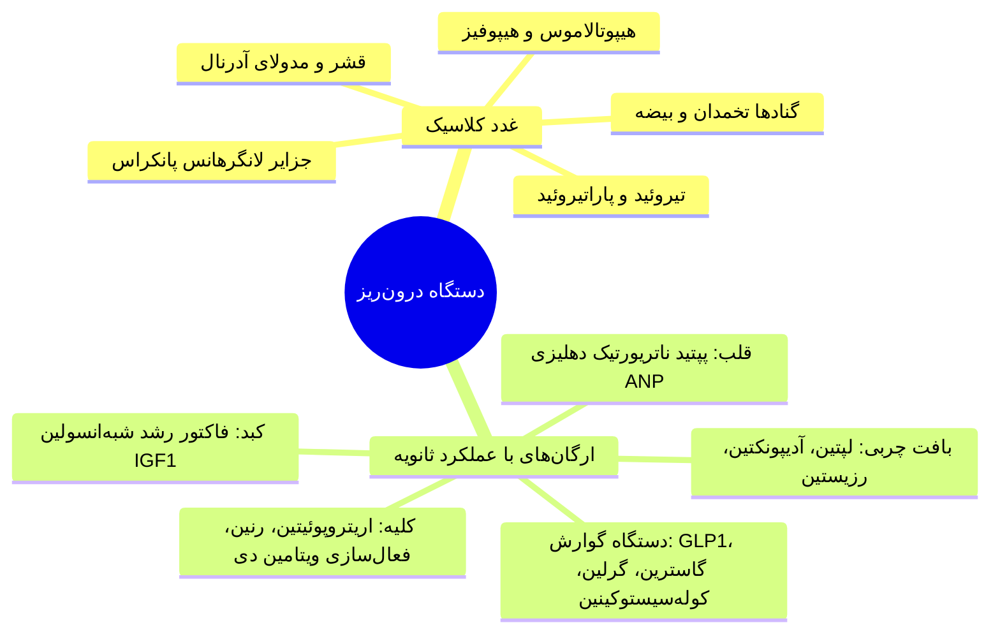
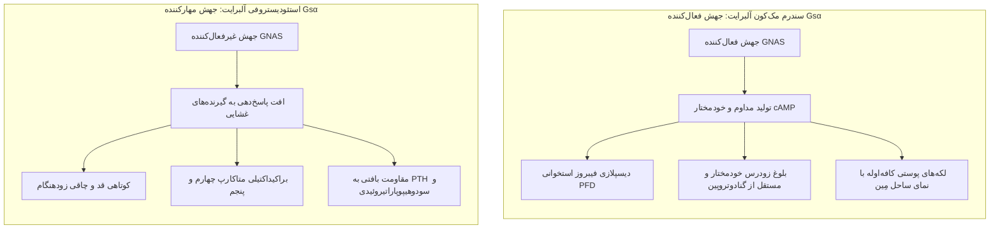
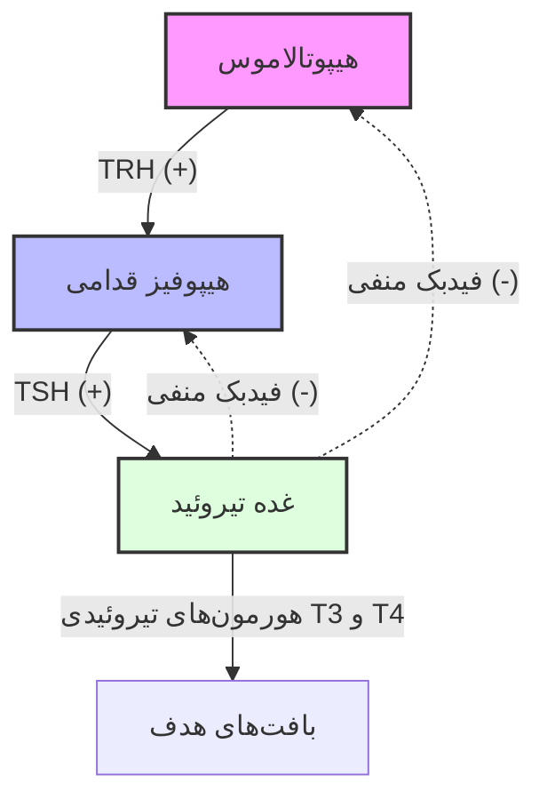
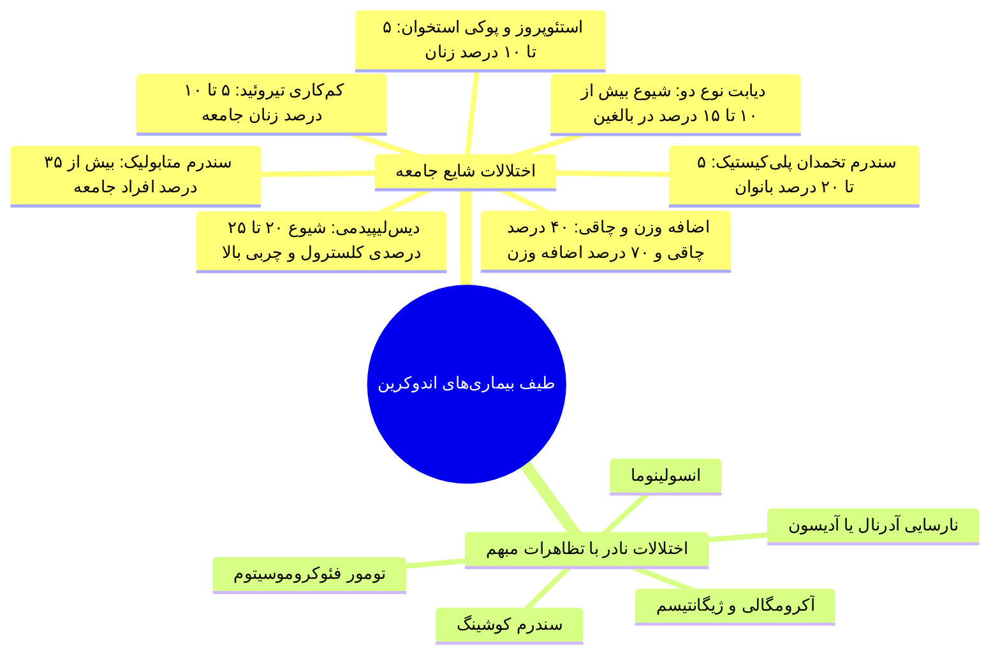
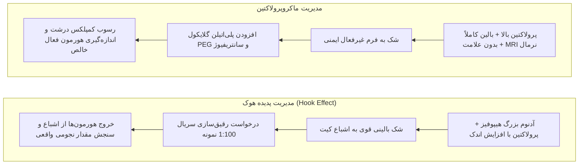
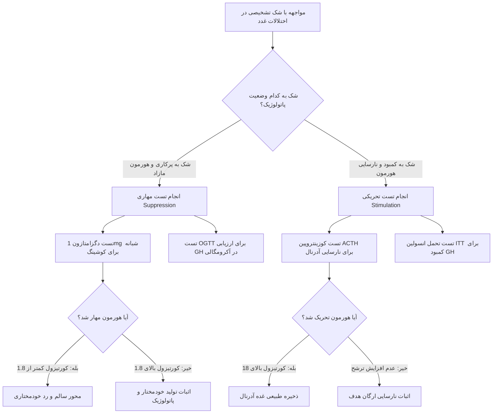
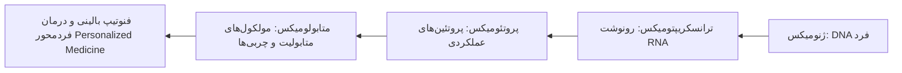

# کلیات سیستم اندوکرین

> [!info] تعریف هورمون (Hormone)
> مولکول پیام‌رسان شیمیایی ویژه‌ای که توسط سلول‌ها یا غدد درون‌ریز به جریان خون ترشح می‌شود تا با اثر بر بافت‌ها یا ارگان‌های هدف دوردست، فرایندهای فیزیولوژیک و رفتار ارگانیسم را تنظیم کند. واژه هورمون از ریشه یونانی به معنای *به حرکت درآوردن* (to set in motion) گرفته شده که ماهیت کاملاً پویا و وابسته به فیدبک این مولکول‌ها را نشان می‌دهد.

---

## ۱. چیستی سیستم اندوکرین، تمایز با اگزوکرین و پیشینه تاریخی

سیستم درون‌ریز برخلاف دستگاه‌های گوارش یا تنفس که در امتداد یک مسیر پیوسته آناتومیک قرار گرفته‌اند، از نظر ساختاری پیوستگی فیزیکی ندارد؛ بلکه مجموعه‌ای از ارگان‌ها و بافت‌های پراکنده در سراسر بدن است که از طریق جریان خون و پیام‌رسانی شیمیایی با یکدیگر پیوند کارکردی برقرار می‌کنند. ترشحات غدد **درون‌ریز (Endocrine)** بدون مجرا مستقیماً به داخل مویرگ‌های خونی تخلیه می‌شوند، در حالی که غدد **برون‌ریز (Exocrine)** نظیر غدد بزاقی، سباسه، تعریق و ترشحات برون‌ریز گوارشی محتوای خود را از طریق مجاری مشخص به داخل لومن ارگان‌ها یا سطح خارجی پوست می‌ریزند. به علت همین پراکندگی آناتومیک و گستردگی بافت‌های هدف، بیماری‌های اندوکرین برخلاف درد لوکالیزه آپاندیسیت یا سرفه ناشی از درگیری مجاری تنفسی، معمولاً با **علائم غیراختصاصی و سیستمیک** تظاهر پیدا می‌کنند و نیازمند دید بالینی جامع و هوشیاری پزشک هستند.

از نظر تاریخی، اگرچه مفهوم ترشحات داخلی ارگان‌ها نخستین بار در سال 1766 میلادی مطرح شد، اما پایه علمی این رشته بسیار جوان است؛ واژه **Endocrine** در سال 1904 توسط *موریس آدولف لیمون* و کلمه **Hormone** در سال 1905 توسط *ارنست استارلینگ* نام‌گذاری شد. کشف **انسولین** در سال 1923 نقطه عطف نجات بیماران دیابت نوع یک از مرگ حتمی بود و مسیر تکاملی آن طی یک قرن از عصاره‌های ناخالص با اثرات کوتاه‌مدت به انسولین‌های صناعی روزانه و فرمولاسیون‌های تزریقی **هفتگی** رسیده است.

```mermaid
mindmap
  root((دستگاه درون‌ریز))
    غدد کلاسیک
      هیپوتالاموس و هیپوفیز
      تیروئید و پاراتیروئید
      قشر و مدولای آدرنال
      جزایر لانگرهانس پانکراس
      گنادها تخمدان و بیضه
    ارگان‌های با عملکرد ثانویه
      بافت چربی: لپتین، آدیپونکتین، رزیستین
      قلب: پپتید ناتریورتیک دهلیزی ANP
      کلیه: اریتروپوئیتین، رنین، فعال‌‌سازی ویتامین دی
      دستگاه گوارش: GLP1، گاسترین، گرلین، کوله‌سیستوکینین
      کبد: فاکتور رشد شبه‌انسولین IGF1
```

> [!tip] ارتباط سیستم اندوکرین با سایر ارگان‌ها (Interdigitation)
> بافت چربی با ترشح **لپتین** روی مراکز اشتهای هیپوتالاموس اثر مستقیم دارد و با ترشح آدیپونکتین و رزیستین بر متابولیسم اثر می‌گذارد. قلب از طریق ترشح **ANP** تعادل حجم داخل عروقی، مقاومت محیطی و فشار خون را مهار می‌کند. کلیه از طریق ترشح **اریتروپوئیتین** خون‌سازی را در مغز استخوان تحریک می‌کند و در تنظیم فشار خون (محور رنین-آنژیوتانسین)، هموستاز فسفات (FGF23) و گلوکونئوژنز شراکت دارد. دستگاه گوارش نیز با هورمون‌های مهمی چون **GLP-1**، سکرتین و VIP نقش محوری در پاسخ اندوکرینی بدن ایفا می‌کند.

---

## ۲. بیوشیمی هورمون‌ها، ویژگی‌های گیرنده‌ای و تداخلات اتصالی

ساختار شیمیایی هورمون‌ها تعیین‌کننده مسیر بیوسنتز، نیمه‌عمر پلاسما، نحوه انتقال در گردش خون و در نهایت موقعیت گیرنده سلولی آن‌هاست. از نظر ساختاری، هورمون‌ها به ۵ گروه اصلی تقسیم می‌شوند: 
1. **مشتقات اسیدآمینه**: ساختارهای تک یا جفت اسیدآمینه‌ای شامل دوپامین، کاتکول‌آمین‌ها (اپی‌نفرین و نوراپی‌نفرین) و هورمون‌های تیروئیدی (T3 و T4).
2. **نوروپپتیدهای کوچک**: زنجیره‌های کوتاه پپتیدی شامل GnRH، TRH، سوماتواستاتین و وازوپرسین (ADH).
3. **پروتئین‌های بزرگ و گلیکوپروتئین‌ها**: مولکول‌های پیچیده پپتیدی نظیر انسولین، هورمون رشد (GH)، پرولاکتین، PTH و **خانواده گلیکوپروتئینی**.
4. **هورمون‌های استروئیدی**: ساختارهای حلقوی لیپوفیل مشتق از کلسترول شامل کورتیزول، آلدوسترون، تستوسترون، استروژن و پروژسترون.
5. **مشتقات ویتامینی**: مولکول‌های محلول در چربی فعال شامل رتینوئیدها (مشتقات ویتامین A) و فرم فعال ویتامین D.

> [!info] خانواده هورمون‌های گلیکوپروتئینی (Glycoprotein Family)
> چهار هورمون کلیدی **TSH، LH، FSH و hCG** از دو زیرواحد متصل به هم تشکیل شده‌اند؛ **زیرواحد آلفا (α)** در تمامی این ۴ هورمون ساختار کاملاً یکسان و مشترک دارد و تفاوت در **زیرواحد بتا (β)** است که به هر هورمون ویژگی عملکردی و اختصاصیت اتصالی می‌دهد.

مکانیسم فعال‌سازی سلولی ارتباط مستقیم با حلالیت در چربی دارد. هورمون‌های پپتیدی، پروتئینی و کاتکول‌آمین‌ها آب‌دوست بوده و توانایی عبور آزاد از لایه دوپوستی چربی غشا را ندارند، در نتیجه گیرنده‌های آن‌ها در **سطح غشای پلاسمایی** قرار دارد و عملکرد خود را با تولید پیام‌رسان‌های ثانویه نظیر cAMP، کلسیم، IP3 و DAG پیش می‌برند. در مقابل، هورمون‌های استروئیدی و مشتقات ویتامینی به دلیل ماهیت لیپوفیل خود مستقیماً از غشای سلول عبور کرده و به **گیرنده‌های داخل سلولی (سیتوزولی یا هسته‌ای)** متصل می‌شوند و مستقیماً بیان ژن را دگرگون می‌کنند.

> [!warning] استثنای بسیار مهم امتحانی: هورمون‌های تیروئیدی!
> با این‌که هورمون‌های تیروئیدی (T3 و T4) مشتق از اسیدآمینه تیروزین هستند، اما به دلیل ساختمان ویژه یددار و چربی‌دوست خود، برخلاف سایر آمین‌ها از غشای سلول عبور کرده و به **گیرنده‌های داخل هسته‌ای (TR)** متصل می‌شوند. بنابراین گیرنده هورمون تیروئید *درون‌سلولی* است و نه غشایی.

### جدول مقایسه‌ای سیستم‌های پیام‌رسانی گیرنده‌های غشایی

| رده گیرنده غشایی | نمونه هورمون‌ها و لیگاندها | واسطه‌ها و افکتورهای داخل سلولی | مسیر پیام‌رسانی ثانویه و پیامد سلولی |
| :--- | :--- | :--- | :--- |
| **GPCR جفت‌شده با Gsα** | TSH, LH, FSH, ACTH, گلوکاگون, PTH, PTHrP, GHRH, CRH, گیرنده‌های بتای آدرنرژیک | آدنیلات سیکلاز (Adenylate Cyclase) | افزایش تولید cAMP حلقوی، فعال‌سازی کیناز پروتئین PKA و اثرات متابولیک/تنظیمی |
| **GPCR جفت‌شده با Giα** | سوماتواستاتین، گیرنده‌های آلفا-۲ آدرنرژیک | مهار آدنیلات سیکلاز، فعال‌سازی کانال‌های یون پتاسیم و کلسیم | کاهش cAMP درون‌سلولی، مهار اگزوسیتوز و ترشح هورمونی، هیپرپولاریزاسیون غشا |
| **GPCR جفت‌شده با Gq/11** | TRH, GnRH | فسفولیپاز سی (PLC) | هیدرولیز فسفولیپیدها به IP3 و DAG، رهایش کلسیم درون‌سلولی، فعال‌سازی PKC |
| **گیرنده تیروزین کیناز (RTK)** | انسولین، فاکتور رشد IGF-1، فاکتور رشد اپیدرمال (EGF) | سوبستراهای گیرنده انسولین (IRS)، مسیر پروتئین کیناز Ras | اتوفسفوریلاسیون، مسیرهای Akt/PI3-Kinase و کینازهای MAPK در رشد و انتقال گلوکز |
| **گیرنده‌های مرتبط با سیتوکین** | هورمون رشد (GH)، پرولاکتین (PRL)، اریتروپوئیتین | آنزیم‌های سیتوپلاسمی ژانوس کیناز (JAK) | فعال‌سازی فاکتورهای رونویسی STAT و ورود کمپلکس فسفوریله به هسته سلول |
| **گیرنده‌های سرین/ترئونین کیناز** | اکتیوین، فاکتور مهاری مولرین (MIS/AMH)، اینهیبین، TGF-β | دومین اختصاصی کینازی متصل به غشا | فعال‌سازی و فسفوریلاسیون پروتئین‌های تنظیمی خانواده Smads |

### پیامد موتاسیون‌های ژن Gsα و سندرم‌های وابسته

تغییر در ژن **GNAS** که کدکننده زیرواحد تحریکی Gsα است پیامدهای شدیدی ایجاد می‌کند:
1. **جهش‌های فعال‌کننده سوماتیک (Gain of Function)**: منجر به بیماری **مک‌کون آلبرایت (McCune-Albright Syndrome)** می‌شود. در این حالت زیرواحد Gsα به‌طور مداوم فعال مانده و با تولید دائمی cAMP مسیرهای وابسته به چندین هورمون مختلف را به‌شکل خودمختار تحریک می‌کند. تریاد کلاسیک آن شامل:
   - **دیسپلازی فیبروز پلی‌استوتیک (PFD)**: ضایعات لیتیک وسیع داخل استخوان‌ها، نمای شیشه‌مات در رادیوگرافی، ناهنجاری استخوانی چوب‌دستی چوپان (Shepherd's crook) و شکستگی‌های مکرر.
   - **بیش‌فعالی خودمختار اندوکرین**: شایع‌ترین تظاهر آن *بلوغ زودرس مستقل از گنادوتروپین* در دختربچه‌هاست (بدون نیاز به LH و FSH)؛ پرکاری تیروئید خودمختار، آکرومگالی و سندرم کوشینگ نیز دیده می‌شود.
   - **لکه‌های پوستی شیرقهوه‌ای (Café-au-lait)**: پلاک‌های پیگمانته با لبه‌های نامنظم دندانه‌دار دندانه‌دار شبیه خط ساحلی ایالت مین (Coast of Maine) که معمولاً یک‌طرفه هستند.
   - درمان بیماری با مهارکننده‌های آروماتاز (تستولاکتون)، تعدیل‌کننده‌های انتخابی گیرنده استروژن SERM (تاموکسیفن) یا آنتاگونیست خالص گیرنده استروژن (فولوسترانت) انجام می‌شود.
2. **جهش‌های غیرفعال‌‌کننده زایا (Loss of Function)**: به دلیل نقش اپی‌ژنتیک (Genetic Imprinting)، اختلالاتی چون **استئودیستروفی ارثی آلبرایت (AHO)** و اشکال مختلف **سودوهیپوپاراتیروئیدی (PHP)** یا سودوسودوهیپوپاراتیروئیدی (PPHP) رخ می‌دهد. تظاهرات شامل قامت کوتاه، چاقی در کودکی، صورت گرد، تأخیر تکاملی، کلسیفیکاسیون زیرجلدی و **کوتاهی انگشتان دست (براکیداکتیلی)** به‌ویژه در متاکارپ چهارم و پنجم است که با مقاومت ارگان‌های هدف به PTH و سایر هورمون‌های متصل به Gsα همراه می‌شود.

```mermaid
flowchart TD
    subgraph McCune_Albright ["سندرم مک‌کون آلبرایت: جهش فعال‌کننده Gsα"]
    direction TB
        A1[جهش فعال‌کننده GNAS] --> B1[تولید مداوم و خودمختار cAMP]
        B1 --> C1[دیسپلازی فیبروز استخوانی PFD]
        B1 --> C2[بلوغ زودرس خودمختار و مستقل از گنادوتروپین]
        B1 --> C3[لکه‌های پوستی کافه‌اوله با نمای ساحل مِین]
    end
    subgraph Albright_AHO ["استئودیستروفی آلبرایت: جهش مهارکننده Gsα"]
    direction TB
        A2[جهش غیرفعال‌کننده GNAS] --> B2[افت پاسخ‌دهی به گیرنده‌های غشایی]
        B2 --> D1[کوتاهی قد و چاقی زودهنگام]
        B2 --> D2[براکیداکتیلی متاکارپ چهارم و پنجم]
        B2 --> D3[مقاومت بافتی به PTH و سودوهیپوپاراتیروئیدی]
    end
```

> [!tip] تداخل گیرنده‌ای یا پدیده Cross-talk
> شباهت مولکولی در لیگاندها یا دومین‌های اتصالی گیرنده‌ها گاهی سبب اثر متقابل ناخواسته می‌شود:
> 1. **بارداری و غده تیروئید**: در سه ماهه اول بارداری مقادیر بسیار بالای **hCG** به دلیل تشابه ساختاری زیرواحد بتا با TSH، مستقیماً گیرنده TSH تیروئید را تحریک می‌کند؛ در نتیجه تیروئید هورمون T4 بیشتری می‌سازد و متعاقباً با فیدبک منفی، مقدار واقعی **TSH به شکل کاذب افت می‌کند**. از طرفی استروژن بالا ساخت کبدی گلوبولین متصل‌شونده به تیروئید (TBG) را می‌افزاید و هورمون کل (Total T4) را بسیار بالا می‌برد، اما غلظت هورمون آزاد (Free T4) توسط فیدبک منفی در محدوده طبیعی تثبیت می‌شود و بالین بیمار پرکار نیست.
> 2. **هیپوگلیسمی در سارکوم‌ها**: پیش‌سازهای غیرطبیعی **IGF-2** که توسط برخی تومورهای بزرگ منشأ مزانشیمی (نظیر سارکوم‌های رتروپریتونئال) ترشح می‌شوند، به گیرنده انسولین و گیرنده IGF-1 پیوند خورده و با اثر شبیه انسولین هیپوگلیسمی‌های کشنده و شدید ایجاد می‌کنند.
> 3. **هیپرانسولینمی شدید**: مقادیر بالای انسولین در دیابت نوع ۲ و سندرم مقاومت به انسولین به گیرنده‌های IGF-1 اپیدرم متصل شده و سبب هایپرتروفی کراتینوسیت‌ها و پدیده **آکانتوزیس نیگریکانس** می‌شود.

---

## ۳. انتقال، فیدبک و ریتم‌های شبانه‌روزی ترشح

تنها فرم فعال زیستی هر هورمون، کسر غیرمتصل و **آزاد (Free)** آن است. بخش اعظم هورمون‌های استروئیدی و تیروئیدی در گردش خون به پروتئین‌های ناقل نظیر TBG، آلبومین، پره‌آلبومین، CBG (ترانس‌کورتین) و SHBG متصل هستند. این اتصال مانع فیلتراسیون کلیوی سریع و تخریب آنزیمی زودرس هورمون می‌شود و یک مخزن پایدار در خون ایجاد می‌کند. در شرایطی که سطح پروتئین ناقل تغییر یابد (مثلاً افت TBG ارثی یا افزایش آن به دنبال مصرف استروژن)، فرم توتال هورمون دستخوش تغییر شدید می‌شود در حالی که هورمون آزاد طبیعی مانده و فرد از نظر بالینی هیچ‌گونه نارسایی یا بیش‌فعالی هورمونی ندارد.

سازوکار تنظیمی حاکم بر ترشح اکثر هورمون‌های درون‌ریز، مکانیسم **فیدبک منفی (Negative Feedback)** است؛ افزایش ترشح هورمون از ارگان هدف در پایین‌دست، ترشح محرک‌های بالادستی هیپوتالاموس و هیپوفیز را سرکوب می‌کند (مانند مهار TRH و TSH توسط تیروکسین، یا مهار CRH و ACTH توسط کورتیزول). فیدبک مثبت بسیار نادر و استثنایی است و فقط در دو موقعیت خاص فیزیولوژیک رخ می‌دهد:
1. پدیده **LH Surge**: در میانه سیکل جنسی بانوان، افزایش ممتد استروژن بیش از حد آستانه موجب ترشح انفجاری LH از هیپوفیز شده و اوولاسیون را رقم می‌زند.
2. ترشح **اکسی‌توسین**: در جریان زایمان، اتساع سرویکس پیام‌های عصبی به مغز فرستاده و ترشح اکسی‌توسین را بیشتر می‌کند که خود موجب انقباض شدیدتر رحم و گشادی بیشتر سرویکس می‌شود.

```mermaid
flowchart TB
    H[هیپوتالاموس] -- TRH (+) --> P[هیپوفیز قدامی]
    P -- TSH (+) --> T[غده تیروئید]
    T -- هورمون‌های تیروئیدی T3 و T4 --> Target[بافت‌های هدف]
    T -. فیدبک منفی (-) .-> P
    T -. فیدبک منفی (-) .-> H

    style H fill:#f9f,stroke:#333,stroke-width:2px;
    style P fill:#bbf,stroke:#333,stroke-width:2px;
    style T fill:#dfd,stroke:#333,stroke-width:2px;
```

ترشح هورمون‌ها استاتیک نیست بلکه از الگوهای پالسی و **ریتم شبانه‌روزی (Circadian Rhythm)** تبعیت می‌کند. ترشح کورتیزول در حوالی ساعت ۸ صبح به حداکثر (Peak) می‌رسد و پنج برابر نیمه‌شب است، سپس به تدریج افت کرده و در نیمه‌های شب به حداقل میزان خود (Nadir) افت می‌کند. برعکس، ترشح ملاتونین با آغاز تاریکی اوج می‌گیرد. اثبات مولکولی سازوکار ژنتیکی کنترل‌کننده ریتم سیرکادین جایزه نوبل فیزیولوژی ۲۰۱۷ را به خود اختصاص داد. هماهنگی سبک زندگی با این نظم بیولوژیک (بیداری زودرس، تمرکز فعالیت‌ها در نیمه اول روز و خواب زودهنگام) با بهینه‌سازی ترمیم سلولی، از ایجاد بیماری‌های قلبی‌عروقی، سرطان‌ها و سندرم‌های متابولیک جلوگیری می‌کند.

---

## ۴. اتیولوژی اختلالات، همه‌گیرشناسی و نشانه‌شناسی بالینی

کتاب هاریسون علل نارسایی یا بدکاری دستگاه غدد را در ۵ مکانیسم پاتوفیزیولوژیک بنیادین طبقه‌بندی می‌کند:
1. **افزایش تولید هورمون (Hormone Overproduction)**: در اثر نئوپلازی‌های خوش‌خیم (آدنوم هیپوفیز، گره سمی تیروئید، آدنوم آدرنال)، بدخیم (سرطان مدولاری تیروئید، بدخیمی قشر آدرنال)، ترشحات نابجا یا اکتوپیک (ACTH نابجا، سندرم SIADH)، سندرم‌های ژنتیکی MEN1 و MEN2، بیماری‌های خودایمنی (تولید آنتی‌بادی محرک TSI در بیماری گریوز)، پرکاری ناشی از تخریب موقت و نشت حاد ذخایر در تیروئیدیت تحت‌حاد (داکورون) و در نهایت اثرات ایاتروژنیک (مصرف کورتون اگزوژن).
2. **کاهش تولید هورمون (Hormone Underproduction)**: ناشی از تخریب خودایمنی بافت (تیروئیدیت هاشیموتو، دیابت تیپ یک، آدیسون اولیه)، پرتوتابی یا جراحی ایاتروژنیک، بیماری‌های التهابی/عفونی (سل آدرنال یا سارکوئیدوز هیپوتالاموس)، موتاسیون‌های ژنی خود هورمون (ژن GH، وازوپرسین)، نقایص آنزیمی (نقص 21-هیدروکسیلاز)، اختلالات تکاملی و کروموزومی (سندرم کالمن، سندرم ترنر)، کمبودهای تغذیه‌ای (ید، ویتامین D) یا انفارکتوس و خونریزی بافت (سندرم شیهان در نکروز هیپوفیز پس از زایمان، انفارکتوس آدرنال).
3. **مقاومت به اثر هورمون (Hormone Resistance)**: با وجود سطح سرمی طبیعی یا حتی بسیار بالای هورمون، بافت هدف پاسخ نمی‌دهد. علل شامل جهش در گیرنده‌های غشایی (گیرنده وازوپرسین در دیابت بی‌مزه نفروژنیک، گیرنده PTH، گیرنده LH)، جهش گیرنده‌های هسته‌ای (مقاومت به آندروژن AR، مقاومت به ویتامین D، جهش گیرنده تیروئید TR)، جهش مسیرهای پیام‌رسان (نظیر جهش Gsα در AHO) یا نقایص پس‌ازگیرنده‌ای نظیر مقاومت به انسولین در دیابت نوع ۲ و مقاومت به لپتین در چاقی.
4. **تومورها و توده‌های بدون ترشح**: توده‌های فاقد فعالیت هورمونی نظیر اینسیدنتالومای آدرنال، گره‌های خوش‌خیم تیروئید و آدنوم‌های بدون عملکرد هیپوفیز که به‌علت اثر فشاری علائم موضعی می‌دهند.
5. **تخریب یا غیرفعال‌سازی تسریع‌شده (Excessive Destruction)**: پدیده‌ای که در آن هورمون تولید می‌شود اما سریعاً منهدم می‌گردد؛ نمونه بالینی مشهور آن **هیپوتیروئیدی مصرفی (Consumptive Hypothyroidism)** در نوزادان مبتلا به همانژیوم‌های حجیم کبدی یا عروقی است که به علت بیان بیش از حد و نامتناسب آنزیم دیدیناز نوع سه (D3)، هورمون‌های تیروئیدی T4 و T3 را با سرعتی فراتر از ظرفیت غده تبدیل به فرم‌های بی‌‌اثر رورس-T3 و T2 کرده و سبب کم‌کاری بالینی تیروئید می‌شوند.

### بیماری‌های شایع در سطح جامعه در برابر بیماری‌های نادر بالینی

در طب بالینی بیماری‌های غدد به دو طیف تقسیم می‌شوند: اختلالات **بسیار شایع** که غربالگری و درمان خط اول آن‌ها وظیفه مستقیم پزشک عمومی و تیم سلامت خانواده است، و بیماری‌های **نادر و پیچیده** که تظاهرات غیراختصاصی گمراه‌کننده دارند و کشف به‌موقع آن‌ها نیازمند دانش عمیق است.

```mermaid
mindmap
  root((طیف بیماری‌های اندوکرین))
    اختلالات شایع جامعه
      اضافه وزن و چاقی: ۴۰ درصد چاقی و ۷۰ درصد اضافه وزن
      دیابت نوع دو: شیوع بیش از ۱۰ تا ۱۵ درصد در بالغین
      دیس‌لیپیدمی: شیوع ۲۰ تا ۲۵ درصدی کلسترول و چربی بالا
      سندرم متابولیک: بیش از ۳۵ درصد افراد جامعه
      کم‌کاری تیروئید: ۵ تا ۱۰ درصد زنان جامعه
      سندرم تخمدان پلی‌کیستیک: ۵ تا ۲۰ درصد بانوان
      استئوپروز و پوکی استخوان: ۵ تا ۱۰ درصد زنان
    اختلالات نادر با تظاهرات مبهم
      سندرم کوشینگ
      نارسایی آدرنال یا آدیسون
      آکرومگالی و ژیگانتیسم
      تومور فئوکروموسیتوم
      انسولینوما
```

### مقایسه مشخصات و پروتکل‌های تشخیصی اختلالات شایع بر اساس راهنمای بالینی هاریسون

| نام اختلال شایع | تخمین شیوع در جمعیت بالغ | علائم کلیدی و نشانه‌های ظاهری | پروتکل تشخیصی و معیارهای غربالگری معتبر |
| :--- | :--- | :--- | :--- |
| **اضافه وزن و چاقی** | 70% افراد دارای BMI ≥ 25 40% افراد دارای BMI ≥ 30 | تجمع چربی احشایی، درد مفاصل، آپنه انسدادی خواب | سنجش دور کمر، محاسبه شاخص توده بدنی (BMI)، رد علل ثانویه و پایش عوارض |
| **دیابت نوع دو (DM-2)** | بیش از 10% (در ایران 12 تا 15%، همراه پره‌دیابت به 20% می‌رسد) | پرنوشی، پرادراری، تاری دید، پلی‌فاژی یا کاملاً بی‌علامت | غربالگری از ۴۵ سالگی هر ۳ سال یک‌‌بار (در گروه‌های پرخطر زودتر) با قند ناشتای پلاسما بالای 126 mg/dL، قند تصادفی بالای 200 mg/dL همراه علامت، یا HbA1c بالای 6.5% |
| **دیس‌لیپیدمی** | 20 تا 25% کل افراد بالغ | تظاهرات زانتلاسما، گزانتوم تاندونی یا فاقد نشانه بالینی | پانل کامل لیپید ناشتا حداقل هر ۵ سال یک‌بار برای تمام بالغین (در دیابتی‌ها و پرخطرها با فواصل کوتاه‌تر) |
| **سندرم متابولیک** | حدود 35% جمعیت ادالت | چاقی شکمی، عدم تحمل گلوکز، هیپرتانسیون | اندازه‌گیری هم‌زمان دور کمر، فشار خون، قند ناشتا و تری‌گلیسرید/HDL پلاسما |
| **کم‌کاری تیروئید** | 5 تا 10% در زنان 0.5 تا 2% در مردان | عدم تحمل سرما، یبوست، افزایش وزن علی‌رغم بی‌اشتهایی، ریزش مو، خستگی مزمن، افسردگی | آزمایش سنجش سرمی TSH، تایید نهایی با سنجش هورمون آزاد تیروئید Free T4 |
| **بیماری گریوز** | 1 تا 3% در زنان 0.1% در مردان | کاهش وزن با اشتهای بالا، لرزش دست، تعریق، تپش قلب، گواتر، اگزوفتالمی | افت شدید TSH به کمتر از 0.05 mU/L، بالا رفتن Free T4 و مثبت شدن تیتر آنتی‌بادی TSI |
| **گره‌ها و نئوپلازی تیروئید** | 2 تا 5% با لمس گردن بیش از 25% در سونوگرافی | ندول لوکالیزه گردنی، گاهی احساس فشار یا اختلال بلع | سونوگرافی دقیق با شاخص تیروئیدی، بیوپسی با سوزن ظریف (FNA) در صورت دارا بودن معیارهای خطر |
| **استئوپروز و پوکی استخوان** | 5 تا 10% زنان 2 تا 5% مردان | کاهش تدریجی قد، کیفوز، شکستگی‌های بی‌دلیل مهره و ران | سنجش تراکم استخوان (DEXA Scan) در تمام زنان بالای ۶۵ سال و یائسه‌های در معرض خطر |
| **سندرم تخمدان پلی‌کیستیک (PCOS)**| 5 تا 10% (مطالعات اخیر تا 20%) | الیگومنوره یا آمنوره، هیرسوتیسم، آکنه مقاوم، ناباروری | اندازه‌گیری تستوسترون آزاد سرم، DHEAS، سونوگرافی ترانس‌واژینال برای نمای تخمدان پلی‌کیستیک |
| **هیپرپرولاکتینمی** | 15% از کل زنان مبتلا به آمنوره یا گالاکتوره | گالاکتوره، ناباروری، اختلالات قاعدگی، کاهش میل جنسی | بررسی سطح پرولاکتین سرم و در صورت بالا بودن انجام MRI هیپوفیز جهت رد آدنوم |

---

### بیماری‌های نادر، تظاهرات غیراختصاصی و سناریوهای مهم بالینی

بیماری‌های نادر غدد با تظاهراتی بسیار مبهم آغاز می‌شوند که معمولاً به تخصص‌های دیگر ارجاع می‌شوند:
1. **سندرم کوشینگ (Cushing's Syndrome)**: ناشی از ترشح مداوم و زیاد گلوکوکورتیکوئیدهاست. علائم آن شامل صورت گرد ماه مانند (Moon face)، تجمع چربی بین دو کتف (Buffalo hump)، چاقی تنه همراه با دست و پای لاغر، ضعف عضلات پروگزیمال، خطوط کششی پهن بنفش روی شکم (Purple striae) به دلیل تخریب کلاژن، پوست نازک، خون‌مردگی با ضربه خفیف (Easy bruising)، صورت برافروخته (Plethora)، فشار خون بالا، عدم تحمل گلوکز و اختلال قاعدگی است. در بالین هرگز بیمار با تابلو کامل کتابی مراجعه نمی‌کند؛ بلکه فردی چاق است که به هیچ رژیمی پاسخ نمی‌دهد و داوطلب جراحی چاقی است. سناریوی دوم فردی با **فشار خون مقاوم به درمان** چنددارویی در درمانگاه قلب است که پزشک باید به جای افزودن دوز، به فکر علل ثانویه فشار خون شامل کوشینگ، فئوکروموسیتوم یا هیپرآلدوسترونیسم اولیه (سندرم کان) بیفتد.
2. **بیماری آدیسون (Addison's Disease - نارسایی اولیه آدرنال)**: اغلب دختران و زنان جوان را به دلیل اتیولوژی اتوایمیون درگیر می‌کند. تابلوی تیپیک آن ضعف پیشرونده، لاغری مفرط (۱۰ تا ۲۰ کیلوگرم)، تهوع و استفراغ‌های غیرقابل توجیه و **دردهای شکمی مزمن مبهم** است. متأسفانه بیماران ماه‌ها تحت آندوسکوپی، کولونوسکوپی و سی‌تی‌اسکن منفی قرار می‌گیرند. نشانه‌های اختصاصی که پزشک باهوش کشف می‌کند عبارتند از:
   - افت فشار خون وضعیتی و حملات شوک همراه با تاکی‌کاردی (نبض بالای ۱۲۰ و فشار ۸ روی ۵ که نیازمند تزریق سرم‌های مکرر است).
   - هوس شدید خوردن نمک و خوراکی‌های شور (مانند چیپس، خیارشور و پفک) به علت دفع شدید سدیم ناشی از کمبود آلدوسترون.
   - **تیرگی پوست و مخاط (Hyperpigmentation)**: از دست رفتن کورتیزول فیدبک منفی هیپوفیز را برمی‌دارد و رونویسی از ژن پیش‌ساز پرواوپیوملانوکورتین (POMC) بالا می‌رود. برش این پروتئین هم‌زمان موجب تولید شدید ACTH و MSH (هورمون محرک ملانوسیت) شده و پیگمانتاسیون تیره برنزه در **خطوط کف دست، بند انگشتان، جای زخم‌ها و به خصوص مخاط لثه و دهان** ایجاد می‌کند. آزمایش نشان‌دهنده کورتیزول بسیار پایین صبحگاهی (کمتر از 3 تا 5 μg/dL) و ACTH بسیار بالاست که با جایگزینی هیدروکورتیزون و فلودروکورتیزون معجزه درمانی رخ می‌دهد.
3. **آکرومگالی (Acromegaly)**: ناشی از ترشح اضافی هورمون رشد (GH) و واسطه آن IGF-1 بعد از بسته شدن صفحات رشد به دلیل آدنوم سوماتوتروف هیپوفیز است (معمولاً در سنین ۳۰ تا ۵۰ سال). علائم به تدریج رخ داده و شامل بزرگ شدن جمجمه، برجستگی لبه فوق حدقه‌ای، جلوآمدگی فک پایین (Prognathism)، فاصله‌دار شدن دندان‌ها، ماکروگلوسی (بزرگ شدن زبان)، کلفت و بم شدن صدا، دست‌ها و پاهای بیل‌مانند و تغییر سایز کفش و انگشتر، پوست چرب و ضخیم، تعریق زیاد، سندرم تونل کارپال، اختلالات میدان بینایی، افزایش فشار خون، دیابت مقاوم به انسولین، نارسایی قلبی و **افزایش شدید خطر پولیپ‌ها و سرطان کولون** است.

> [!danger] هشدار حیاتی بالینی: درد شکم و استفراغ در کودکان و اورژانس DKA
> اگر کودکی خردسال یا نوجوانی با درد شکم حاد، تهوع، استفراغ مکرر و بی‌حالی مراجعه کرد، هرگز نباید با تشخیص شتاب‌زده گاستروآنتریت و تزریق هیوسین یا پلاسیل به منزل مرخص شود! این تظاهر می‌تواند نشانه نخستین حمله **کتواسیدوز دیابتی (DKA)** ناشی از بروز دیابت نوع یک باشد که درمان علامتی آن کودک را ظرف چند ساعت به کما و شوک می‌کشاند. بررسی یک **قند خون ساده (Glucometry)** با هزینه ناچیز، نخستین و مهم‌ترین وظیفه پزشک در هر استفراغ و دل‌درد غیراختصاصی است.

---

## ۵. سنجش آزمایشگاهی هورمون‌ها، خطاهای مداخله‌گر و آزمون‌های دینامیک

سنجش آزمایشگاهی هورمون‌ها عموماً با نمونه‌های سرم و پلاسما، و در موارد خاص از طریق ادرار ۲۴ ساعته انجام می‌شود (مانند کورتیزول آزاد ادرار، کاتکول‌آمین‌ها، VMA و متانفرین‌ها که حتماً باید هم‌زمان با **کراتینین ادرار** سنجیده شوند تا از درستی و کفایت جمع‌آوری ۲۴ ساعته اطمینان حاصل گردد). متدهای سنجش شامل متدهای ایمونواسی (کمی‌لومینسانس ICMA، رادیوایمونومتریک IRMA)، کروماتوگرافی پیشرفته و اسپکترومتری جرمی (Mass Spectrometry) است.

### خطاهای تکنیکی در سنجش هورمون‌ها

تفسیر عددی آزمایش بدون توجه به بالین بیمار فاجعه‌بار است، زیرا روش‌های اندازه‌گیری دستخوش تداخلات بیوشیمیایی زیر می‌شوند:

1. **اثر قلاب (Hook Effect) در مقادیر بسیار بالای هورمون**:
   - در سنجش‌های ساندویچی ایمونومتریک دوطرفه (Two-site sandwich assays)، برای اندازه‌گیری هورمون به دو آنتی‌بادی نیاز است (یکی تثبیت‌شده برای گرفتن هورمون و دیگری نشاندار برای اتصال به اپی‌توپ دیگر و ارسال سیگنال).
   - اگر غلظت هورمون در خون به شدت و به گونه‌ای غیرطبیعی زیاد باشد (مانند یک ماکروپرولاکتینومای ۳ سانتی‌متری هیپوفیز)، مولکول‌های پرشمار هورمون بدون متصل شدن به یکدیگر، جایگاه تمام آنتی‌بادی‌های موجود را مستقل از هم اشغال می‌کنند. در نتیجه ساختار ساندویچی دوطرفه شکل نمی‌گیرد، سیگنال آشکارسازی فوتومتری به شدت سقوط می‌کند و جواب آزمایشگاه به شکلی گمراه‌کننده **کاذب و بسیار پایین** گزارش می‌شود (مثلاً پرولاکتین ۴۰ ng/mL به جای ۵۰۰۰ ng/mL واقعی).
   - **راهکار برطرف‌سازی**: اگر تطابق بالینی بین توده بزرگ و آزمایش هورمونی وجود نداشت، پزشک به آزمایشگاه دستور انجام آزمایش با **رقت‌سازی سریال نمونه (Serial Dilution)** در نسبت‌های ۱:۱۰ و ۱:۱۰۰ را می‌دهد؛ با کاهش تراکم هورمون، اثر هوک خنثی شده و مقدار نجومی واقعی آشکار می‌شود.
2. **ماکروپرولاکتین و کمپلکس‌های غیرفعال (PEG Precipitation)**:
   - در برخی افراد مولکول پرولاکتین به آنتی‌بادی‌های IgG سرمی متصل شده و تشکیل مولکول‌های غول‌آسا با وزن مولکولی بسیار سنگین به نام **ماکروپرولاکتین (Big-big Prolactin)** می‌دهد.
   - این کمپلکس به علت درشتی جثه توانایی اتصال به گیرنده‌های بیولوژیک در بافت پستان را ندارد و عملکردی نیست، اما در کیت‌های اندازه‌‌گیری آزمایشگاهی با آنتی‌بادی‌ها واکنش داده و غلظت پرولاکتین را شدیداً بالا نشان می‌دهد (مثلاً ۱۵۰ ng/mL). بیمار دختری جوان با قاعدگی کاملاً مرتب، بدون ترشح شیر و با تصویر ام‌آرآی نرمال هیپوفیز است.
   - **راهکار برطرف‌سازی**: برای تفکیک، آزمایشی موسوم به **رسوب با پلی‌اتیلن گلایکول (PEG Precipitation)** انجام می‌شود؛ ماده PEG کمپلکس‌های درشت ایمنی را رسوب داده و پس از سانتریفیوژ، مقدار پرولاکتین تک‌مولکولی زیست‌فعال واقعی در مایع رویی اندازه‌گیری می‌شود که در صورت طبیعی بودن، هیچ اقدام تشخیصی یا درمانی دیگری لازم نخواهد بود.
3. **آنتی‌بادی‌های هتروفیلیک (Heterophile Antibodies)**: وجود ایمونوگلوبولین‌های مداخله‌گر در سرم بیمار ممکن است به صورت غیرواقعی آنتی‌بادی‌های سنجش آزمایشگاهی را به هم متصل کرده و مثلاً سبب اندازه‌گیری کاذب TSH شوند.

```mermaid
flowchart RL
    subgraph Hook_Workup ["مدیریت پدیده هوک (Hook Effect)"]
    direction RL
        H1[آدنوم بزرگ هیپوفیز + پرولاکتین با افزایش اندک] --> H2[شک بالینی قوی به اشباع کیت]
        H2 --> H3[درخواست رقیق‌سازی سریال 1:100 نمونه]
        H3 --> H4[خروج هورمون‌ها از اشباع و سنجش مقدار نجومی واقعی]
    end
    subgraph Macro_Workup ["مدیریت ماکروپرولاکتین"]
    direction RL
        M1[پرولاکتین بالا + بالین کاملاً بدون علامت + MRI نرمال] --> M2[شک به فرم غیرفعال ایمنی]
        M2 --> M3[افزودن پلی‌اتیلن گلایکول PEG و سانتریفیوژ]
        M3 --> M4[رسوب کمپلکس درشت و اندازه‌گیری هورمون فعال خالص]
    end
```

### منطق طلایی تست‌های دینامیک غدد

> [!danger] قانون طلایی و تخطی‌ناپذیر طب غدد
> هورمون‌های بدن وابسته به زمان، ریتم شبانه‌روزی و فیدبک تغییر می‌کنند و یک **عدد تصادفی پایه (Basal)** در برگه آزمایشگاه به تنهایی هیچ‌گونه ارزش تشخیصی ندارد! اگر پزشکی مشکوک به **پرکاری هورمونی** باشد باید از **تست‌های مهاری (Suppression Tests)** استفاده کند (محور طبیعی مهار می‌شود، اما غده تومورال خودمختار مهار نمی‌گردد)؛ و هرگاه به **کم‌کاری هورمونی** مشکوک باشد باید از **تست‌های تحریکی (Stimulation Tests)** بهره بگیرد (محور سالم با تحریک ترشح می‌کند، اما ارگان نارس شکست می‌خورد).

1. **تست سرکوب شبانه با دگزامتازون (Overnight 1mg-DST)**:
   - برای رد یا اثبات سندرم کوشینگ، ساعت ۱۱ تا ۱۲ شب یک قرص ۱ میلی‌گرمی دگزامتازون به فرد داده می‌شود و ساعت ۸ صبح فردا کورتیزول وریدی چک می‌گردد.
   - در فرد سالم فیدبک منفی طبیعی با این کورتون صناعی تحریک شده، ترشح ACTH قطع می‌شود و کورتیزول صبحگاهی به کمتر از **1.8 μg/dL** سقوط می‌کند. در بیمار مبتلا به کوشینگ، ترشح کورتیزول خودمختار است و مهار نمی‌شود و بالای 1.8 μg/dL باقی می‌ماند.
2. **تست تحمل گلوکز خوراکی (OGTT) برای هورمون رشد**:
   - برای تشخیص آکرومگالی، ۷۵ گرم گلوکز خوراکی به بیمار داده می‌شود.
   - در فرد نرمال بالا رفتن قند خون هورمون رشد را سرکوب کرده و به زیر 1 ng/mL می‌رساند؛ اما در آکرومگالی تومور خودمختار هیپوفیز به هایپرگلیسمی پاسخ نداده و GH همچنان بالا می‌ماند.
3. **تست تحریک با کوزینتروپین (Cosyntropin / ACTH Stimulation Test)**:
   - برای اثبات نارسایی آدرنال (آدیسون)، آمپول ACTH مصنوعی تزریق شده و پاسخ کورتیزول سنجیده می‌شود.
   - در فرد سالم قشر آدرنال تحت تأثیر ACTH فعال شده و کورتیزول را به بالای **18 تا 20 μg/dL** می‌رساند؛ در نارسایی اولیه آدرنال، بافت تخریب‌شده پاسخی نداده و کورتیزول در سطوح پایین درجا می‌زند.
4. **تست تحمل انسولین (ITT - Insulin Tolerance Test)**:
   - استاندارد طلایی ارزیابی ذخیره هورمون رشد و محور آدرنال در هیپوفیز؛ تزریق انسولین و ایجاد هیپوگلیسمی (قند زیر 40 mg/dL) به عنوان استرس شدید مرکزی، محرک طبیعی ترشح شدید GH و کورتیزول خواهد بود.
5. **تست گرسنگی طولانی‌مدت (72-hour Fasting Test) برای انسولینوما**:
   - انسولینوما تومور ترشح‌کننده انسولین در سلول‌های بتای پانکراس است. در یک فرد سالم وقتی طی گرسنگی طولانی قند به کمتر از 55 mg/dL سقوط کند، ترشح انسولین فوراً به صفر میل کرده و به زیر 3 μIU/mL می‌رسد.
   - اما در بیمار مبتلا به انسولینوما، با وجود قند خون زیر ۵۰ فرد همچنان انسولین نسنجیده و خودمختار ترشح می‌کند (مثلاً سطح انسولین ۸ یا ۹ است). اگرچه عدد ۸ در بازه طبیعی آزمایشگاه (۳ تا ۲۰) به نظر می‌رسد، اما بروز آن هم‌زمان با هیپوگلیسمی ۵۰ نشان‌دهنده ترشح خودمختار مرگبار است. این آزمون در بیمارستان با پایش ساعتی قند جهت پیشگیری از کما و تشنج انجام می‌شود.

```mermaid
flowchart TD
    Start[مواجهه با شک تشخیصی در اختلالات غدد] --> Q{شک به کدام وضعیت پاتولوژیک؟}
    Q -- شک به پرکاری و هورمون مازاد --> Supp[انجام تست مهاری Suppression]
    Q -- شک به کمبود و نارسایی هورمون --> Stim[انجام تست تحریکی Stimulation]
    
    Supp --> ExS1[تست دگزامتازون 1mg شبانه برای کوشینگ]
    Supp --> ExS2[تست OGTT برای ارزیابی GH در آکرومگالی]
    
    Stim --> ExT1[تست کوزینتروپین ACTH برای نارسایی آدرنال]
    Stim --> ExT2[تست تحمل انسولین ITT برای کمبود GH]
    
    ExS1 --> ResS{آیا هورمون مهار شد؟}
    ResS -- بله: کورتیزول کمتر از 1.8 --> NormS[محور سالم و رد خودمختاری]
    ResS -- خیر: کورتیزول بالای 1.8 --> PathS[اثبات تولید خودمختار و پاتولوژیک]

    ExT1 --> ResT{آیا هورمون تحریک شد؟}
    ResT -- بله: کورتیزول بالای 18 --> NormT[ذخیره طبیعی غده آدرنال]
    ResT -- خیر: عدم افزایش ترشح --> PathT[اثبات نارسایی ارگان هدف]
```

---

## ۶. فناوری‌های نوین، علوم اُمیکس و افق‌های پیش رو

پزشکی در حوزه غدد به سرعت به سمت **پزشکی دقیق (Precision Medicine)** و درمان‌های اختصاصی فردمحور حرکت می‌کند. این رویکرد به جای تجویز یکسان دارو، ساختار بیولوژیک بیمار را با ابزارهای نوین **علوم اُمیکس (Omics Technologies)** بررسی می‌کند:
1. **ژنومیکس و اپی‌ژنومیکس (Genomics & Epigenomics)**: بررسی پلی‌مورفیسم‌های ژنی DNA و تغییرات اپی‌ژنتیک.
2. **ترانسکریپتومیکس (Transcriptomics)**: پایش کلیه رونوشت‌های RNA تولیدشده در سلول.
3. **پروتئومیکس (Proteomics)**: بررسی مجموع پروتئین‌های بیان‌شده در بافت.
4. **متابولومیکس (Metabolomics)**: جدیدترین علم بررسی الگوهای متابولیتی (قندها، لیپیدها در لیپیدومیکس، آمینواسیدها و نوکلئوتیدها) که پیوند میان ژنتیک و فاکتورهای محیطی را آشکار می‌سازد و انقلابی در غربالگری و درمان **کبد چرب (MASLD)** و پیش‌بینی فیبروز و سیروز ایجاد کرده است.
5. **درمان هدفمند بدخیمی‌ها (Personalized Oncology)**: نمونه بارز این دگرگونی در سرطان‌های تیروئید نظیر کارسینوم پاپیلاری تیروئید (PTC) است؛ امروزه با تعیین موتاسیون‌های مولکولی نظیر **BRAF V600E**، بازآرایی‌های RET/PTC و مسیرهای کینازی VEGF و RET، داروهای مهارکننده اختصاصی تیروزین کیناز مولکولی نظیر سورافنیب، لنواتینیب، واندتانیب، پلکسی‌فان (PLX4032) و سایر مولکول‌های هدفمند تجویز می‌شوند.

```mermaid
flowchart RL
    DNA[ژنومیکس: DNA فرد] --> RNA[ترانسکریپتومیکس: رونوشت RNA]
    RNA --> Protein[پروتئومیکس: پروتئین‌های عملکردی]
    Protein --> Meta[متابولومیکس: مولکول‌های متابولیت و چربی‌ها]
    Meta --> Pheno[فنوتیپ بالینی و درمان فردمحور Personalized Medicine]
```

### تحولات دارویی و تکنولوژی‌های پایش در دیابت و چاقی

درمان‌های امروزی مرزهای درمان کلاسیک دیابت را به کلی جابه‌جا کرده‌اند:
- **داروهای آگونیست گیرنده GLP-1 و GLP-1/GIP**: این داروها (نظیر سماگلوتاید و تیرزپاتاید) که ساختار اولیه آن‌ها در سال 1985 از بزاق سمی نوعی مارمولک (هیولای گیلا) شناسایی شد، با تحریک گیرنده‌های اینکرتینی کاهش وزن‌های شگفت‌آوری در حد ۲۰ تا ۳۰ درصد ظرف ۶ ماه ایجاد می‌کنند، کبد چرب و فیبروز را بهبود می‌بخشند و ریسک حوادث قلبی‌عروقی و مرگ ناشی از آترواسکلروز را به شدت کاهش می‌دهند. از عوارض نادر آن‌ها تهوع اولیه، پانکراتیت نادر، تشدید موقت رتینوپاتی دیابتی در صورت افت بسیار ناگهانی قند و خطر کارسینوم مدولاری تیروئید (MTC) در مطالعات حیوانی است.
- **تکامل انسولین‌ها و سلول‌های بنیادی**: نسل آینده درمان به سمت انسولین‌های **تزریقی هفتگی (مانند انسولین ایکودک)**، انسولین‌های استنشاقی و استفاده از سلول‌های بنیادی تمایزیافته برای جایگزینی سلول‌های بتای تخریب‌شده پانکراس در دیابت نوع یک می‌رود.
- **سامانه‌های پایش مداوم قند (CGM - Continuous Glucose Monitoring)**: دیسک‌های حسگر پوستی کوچکی که روی بازو یا شکم متصل شده و به صورت ۲۴ ساعته در تمام روزهای هفته (24/7) قند مایع بین‌بافتی را خوانده و نمودار نوسانات را روی گوشی تلفن همراه مخابره می‌کنند. این ابزار از هایپوگلیسمی شبانه بی‌خبر با آلارم صوتی جلوگیری کرده و سبب اصلاح رفتار و سبک زندگی فرد می‌شود. ترکیب حسگرهای CGM با پمپ‌های انسولین منجر به ساخت **سیستم‌های حلقه بسته (Closed-Loop) یا پانکراس مصنوعی** شده است که بدون نیاز به مداخله بیمار، انفوزیون انسولین را به شکل خودکار و بر اساس قند لحظه‌ای تنظیم می‌کنند.
