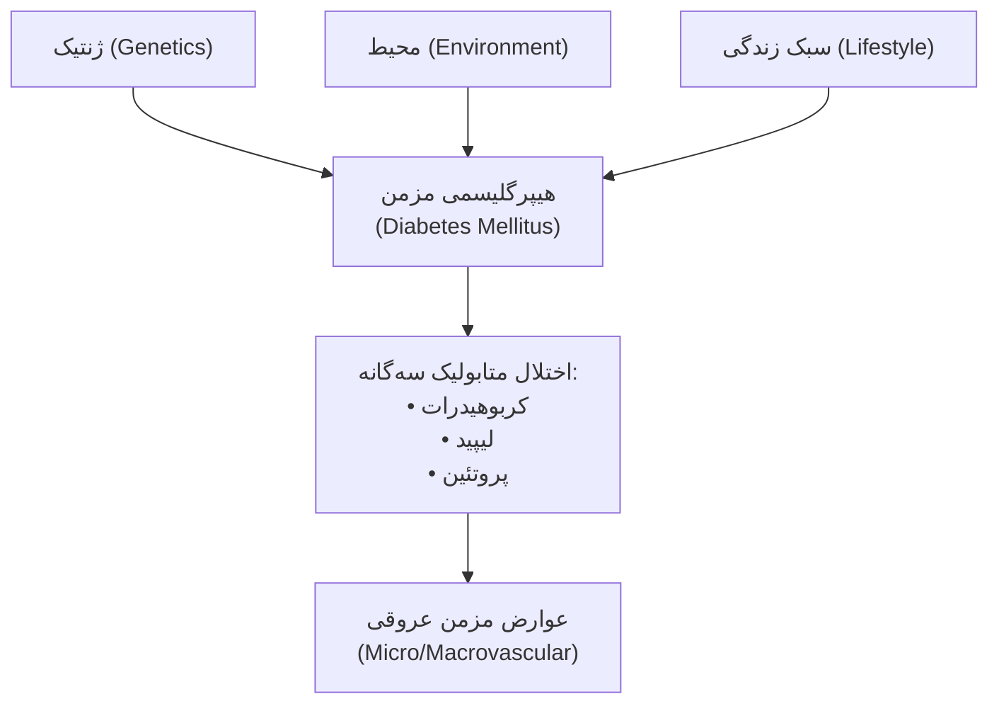
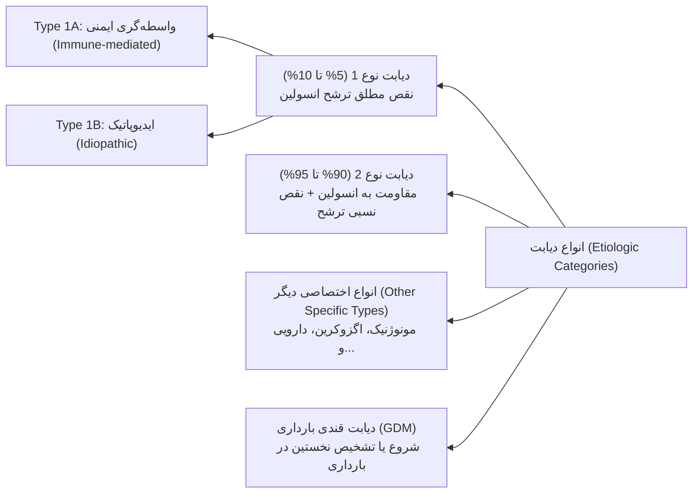
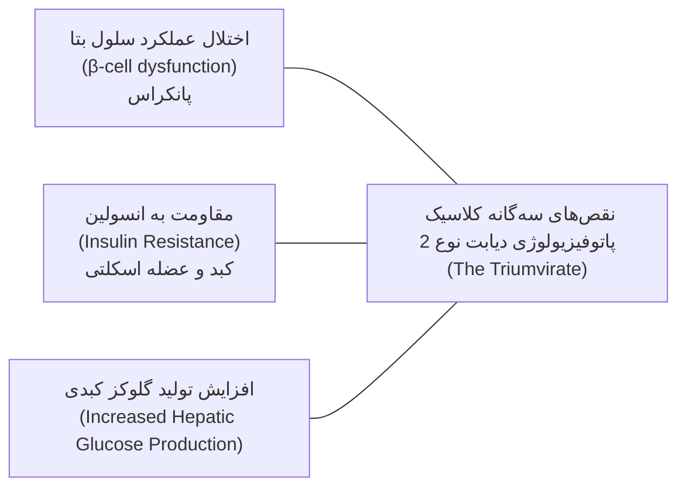
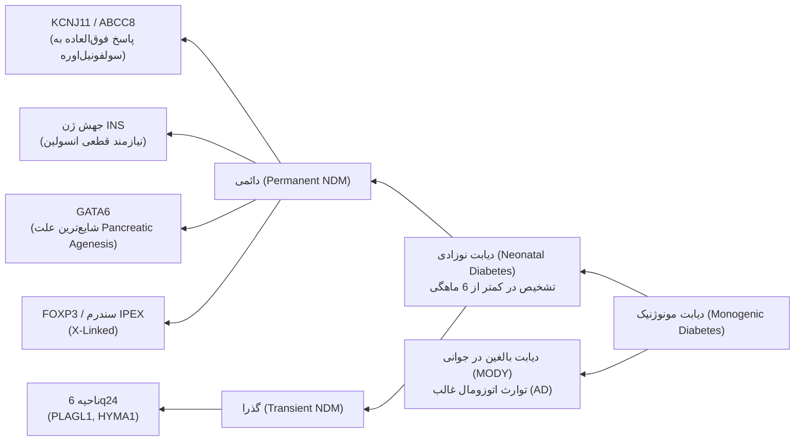
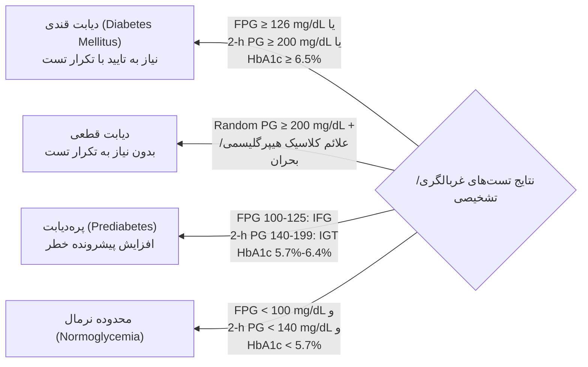
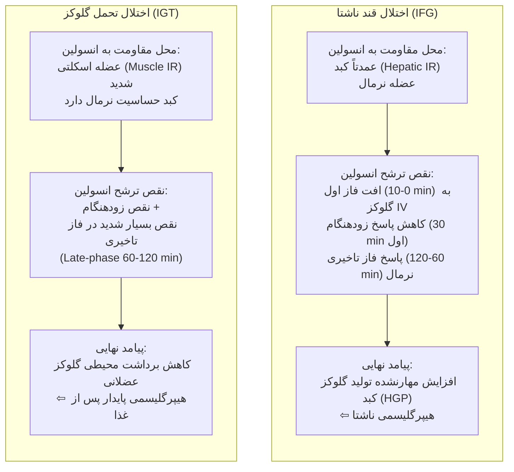
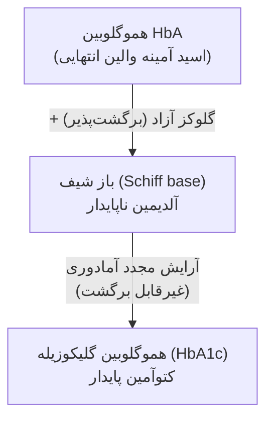
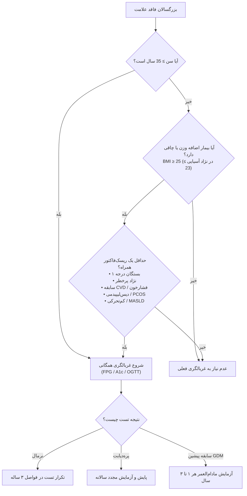
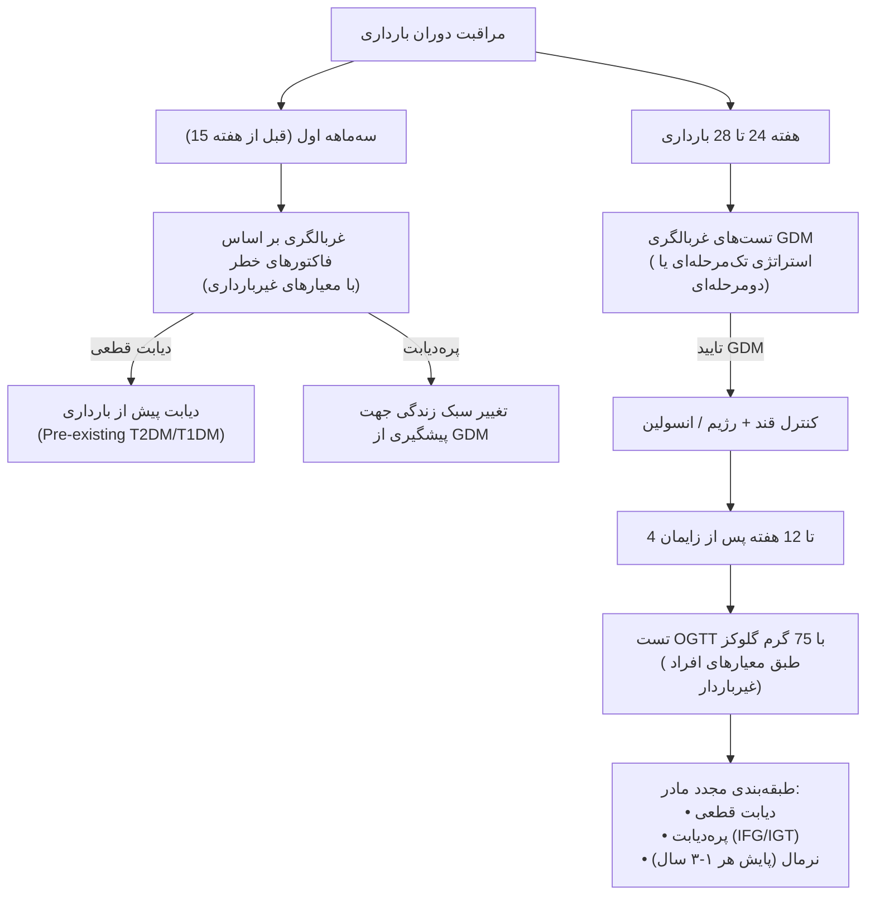

# دیابت شیرین (Diabetes Mellitus) - بخش اول: طبقه‌بندی و تشخیص

## بخش ۱: مبانی، تعاریف و ابعاد اپیدمیولوژیک

> [!definition] تعریف کلاسیک دیابت قندی (Diabetes Mellitus)
> گروهی از اختلالات متابولیک شایع و ناهمگون (*Heterogeneous*) با فنوتیپ مشترک **هیپرگلیسمی**، ناشی از نقص در ترشح انسولین، اثر انسولین یا هر دو.  
> **پیامدها:** اختلال در متابولیسم کربوهیدرات، چربی و پروتئین همراه با مجموعه عوارض مزمن (*Constellation of chronic complications*).

### ۱. اتیوپاتوژنز چندعاملی
برهم‌کنش پیچیده سه مولفه اصلی:
1. **ژنتیک** (*Genetics*)
2. **عوامل محیطی** (*Environmental factors*)
3. **انتخاب‌های سبک زندگی** (*Life-style choices*)

### ۲. بار جهانی بیماری (گزارش آمار Diabetes Atlas)
* **شیوع فعلی:** **589 میلیون بزرگسال** (رده سنی 20 تا 79 سال) در سراسر جهان مبتلا به دیابت هستند (معادل **1 فرد از هر 9 نفر**).
* **پیش‌بینی سال 2050:** افزایش جمعیت مبتلایان به **853 میلیون نفر**.
* **مرگ‌ومیر سالانه:** **3.4 میلیون مرگ** مرتبط با دیابت در سال.
* **بار مالی سلامت:** هزینه سالانه بالغ بر **1 تریلیون دلار** ($1 Trillion).
* **توزیع قاره‌ای/منطقه‌ای:**
  * غرب اقیانوس آرام (*Western Pacific*): **215 میلیون** (بیشترین بار جمعیتی)
  * جنوب شرق آسیا (*South-East Asia*): **107 میلیون**
  * خاورمیانه و شمال آفریقا (*MENA*): **85 میلیون** (منطقه با شتاب فزاینده)
  * اروپا (*Europe*): **66 میلیون**
  * آمریکای شمالی و حوزه کارائیب (*North America & Caribbean*): **56 میلیون**
  * آمریکای جنوبی و مرکزی (*South & Central America*): **35 میلیون**
  * آفریقا (*Africa*): **25 میلیون**

---

## بخش ۲: سیستم نوین طبقه‌بندی اتیولوژیک دیابت

> [!tip] اصل حاکم بر طبقه‌بندی نوین
> طبقه‌بندی دیابت صرفاً بر اساس **فرآیند پاتوژنیک منجر به هیپرگلیسمی** استوار است؛ نه سن و نه نوع درمان.

> [!warning] منسوخ شدن سن به عنوان معیار افتراقی
> سن بروز دیگر معیار تشخیصی نوع دیابت نیست!  
> 1. تخریب خودایمنی سلول‌های بتا در هر سنی ممکن است رخ دهد.  
> 2. با اینکه نوع ۱ بیشتر قبل از ۳۰ سالگی بروز می‌کند، **40% از مبتلایان به دیابت بالای 30 سال واجد تیپ 1A هستند**.  
> 3. دیابت نوع ۲ هرچند با افزایش سن شایع‌تر است، امروزه به‌طور چشمگیری در *کودکان و نوجوانان چاق* تشخیص داده می‌شود.

### ۱. دسته‌های چهارگانه اصلی
1. **دیابت نوع 1 (Type 1 DM):** تخریب سلول‌های β، غالباً منجر به کمبود مطلق انسولین (شامل زیرگروه‌های 1A و 1B). سهم جمعیتی: **5 تا 10 درصد**.
2. **دیابت نوع 2 (Type 2 DM):** طیفی متغیر از مقاومت غالب به انسولین همراه با کمبود نسبی، تا نقص ترشحی غالب همراه با مقاومت به انسولین. سهم جمعیتی: **90 تا 95 درصد**.
3. **انواع اختصاصی دیگر (Other Specific Types):** نقص‌های ژنتیکی منفرد، بیماری‌های پانکراس اگزوکرین، اختلالات غدد، القاشده با دارو یا عفونت.
4. **دیابت قندی بارداری (GDM):** هر درجه از اختلال تحمل گلوکز با شروع یا اولین تشخیص حین بارداری.

### ۲. پاتوفیزیولوژی دیابت نوع ۲: سه‌گانه دِفرونزو (The "Triumvirate")

---

## بخش ۳: تشخیص افتراقی دیابت نوع ۱ و نوع ۲

| ویژگی بالینی / پارامتر | دیابت نوع ۱ (Type 1 DM) | دیابت نوع ۲ (Type 2 DM) |
| :--- | :--- | :--- |
| **سیر معمول بالینی** | *وابسته به انسولین* از زمان تشخیص | در ابتدا *غیر وابسته به انسولین* |
| **سن معمول بروز** | غالباً **کمتر از 30 سال** (اما **40% بالای 30 سال**) | غالباً **بیشتر از 40 سال** (روند رو به کاهش در نوجوانان چاق) |
| **وزن و نمایه توده بدنی** | معمولاً *لاغر* (Lean)؛ هرچند همراهی با چاقی ردکننده نیست | غالباً *چاق* (Obese - بیش از 80% بیماران) |
| **شروع علائم بالینی** | حاد، پر سر و صدا و سریع | تدریجی، بی‌سر‌و‌صدا، موذیانه (*Subtle*) |
| **تمایل به کتوز (Ketosis-prone)** | **مثبت** (ریسک بالای DKA) | عموماً منفی (بجز در *Ketosis-prone T2DM*) |
| **تاریخچه خانوادگی** | کمتر یا مساوی **15%** در بستگان درجه یک | **بسیار شایع** و قوی |
| **ارتباط با لکوسیت‌های HLA** | افزایش معنادار **HLA-DR3، DR4، DQB1\*0201، \*0302** | عدم ارتباط HLA (به ندرت افزایش دارد) |
| **اتوآنتی‌بادی‌های ضد جزایر** | **مثبت** (GADA, ICA, IA-2A, IAA, ZnT8) | **منفی** (غایب) |
| **پپتید C سرم** | پایین تا غیرقابل سنجش در طول زمان | نرمال یا افزایش‌یافته (در زمینه مقاومت به انسولین) |

> [!danger] نکات چالشی در تفکیک بالینی
> * **دیابت نوع 1B (ایدیوپاتیک):** کمبود شدید انسولین و تمایل قطعی به کتوز دارند، اما **فاقد هرگونه مارکر اتوایمیون** هستند. مکانیسم تخریب سلول بتا ناشناخته است. جمعیت غالب: تبار **آفریقایی-آمریکایی** یا **آسیایی**.
> * **دیابت تیپ ۲ مستعد کتوز (Flatbush Diabetes / KPD):** بیماران با تابلوی بالینی تیپ ۲ که در بدو امر با *کتواسیدوز دیابتی حاد (DKA)* مراجعه می‌کنند اما مارکر اتوایمیون ندارند. این افراد پس از کنترل اولیه بحران، نیاز مادام‌العمر به انسولین نداشته و با داروهای خوراکی مدیریت می‌شوند.
> * **دیابت خودایمنی پنهان بزرگسالان (LADA):** حدود **5 تا 10 درصد** از افراد با فنوتیپ ظاهری تیپ ۲ را شامل می‌شود. فاقد کمبود مطلق اولیه انسولین بوده اما واجد آنتی‌بادی‌های مثبت (به‌ویژه **Anti-GAD**) هستند. مشخصه تشخیصی: **پیشرفت به سمت وابستگی مطلق به انسولین طی ۵ سال**.
> * **سنجش C-Peptide:** پپتید C سرم همیشه باید **همگام با قند خون همزمان** تفسیر شود. سطح پایین پپتید C در حضور هیپرگلیسمی شدید نیاز به انسولین را قطعی می‌کند؛ اما وجود مقادیر اندک آن در سال‌های اول تیپ ۱، تیپ ۲ را به تنهایی رد نمی‌کند.

---

## بخش ۴: سندرم‌های دیابت مونوژنیک (Monogenic Diabetes)

> [!definition] سندرم‌های دیابت مونوژنیک
> اختلالات ناشی از جهش تک‌ژنی موثر بر تکامل پانکراس یا ترشح انسولین در سلول‌های بتا.  
> مسئول حدود **5% کل موارد دیابت**؛ تابلوی تیپیک: بروز در سنین پایین (عموماً **زیر 25 سال**). نخستین مدل واقعی **پزشکی شخصی‌سازی‌شده** (*Personalized Medicine*).

### ۱. دیابت نوزادی (Neonatal Diabetes)
* هرگونه دیابت تشخیص‌داده‌شده در **۶ ماه اول زندگی** طبق تعریف، دیابت خودایمنی نوع ۱ نیست.
* **کانال‌های پتاسیمی حساس به ATP (زیرواحدهای Kir6.2 و SUR1):** جهش‌های فعال‌کننده در ژن‌های **KCNJ11** و **ABCC8** مانع بسته شدن کانال و مهار ترشح انسولین بر اثر گلوکز می‌شوند.  
  * *کلید بالینی:* این بیماران با موفقیت به **سولفونیل‌اوره‌ها با دوز بالا** پاسخ داده و انسولین‌تراپی قطع می‌گردد.
* **جهش ژن GATA6:** شایع‌ترین علت **آژنزیس پانکراس** (*Pancreatic Agenesis*).
* **جهش هموزیگوت گلوکوکیناز (GCK):** ایجاد فرم بسیار شدید دیابت دائمی نوزادی.
* **سندرم IPEX (جهش FOXP3):** وراثت *وابسته به X*. همراهی دیابت خودایمنی شدید نوزادی، تیروئیدیت خودایمنی و درماتیت لایه‌لایه شونده (*Exfoliative dermatitis*) و انتروپاتی.
* **دیابت گذرای نوزادی (6q24):** ناشی از مضاعف‌شدگی پدری در لوکوس *PLAGL1* و *HYMA1*. همراه با *IUGR، ماکروگلوسی و فتق نافی*. ممکن است با داروهای غیرانسولینی کنترل شود.

### ۲. دیابت بالغین با شروع در جوانی (MODY)
* **الگوی توارث:** **اتوزومال غالب (AD)** با نفوذ بالا؛ درگیری نسل‌های متوالی خانواده.
* **پاتولوژی:** نقص انتخابی در ترشح انسولین همراه با **اثر و حساسیت کاملاً نرمال انسولین** (حداقل نقص در اکشن انسولین). بیماران معمولاً *لاغر اندام* و منفی از نظر اتوآنتی‌بادی هستند. تاکنون **14 لوکوس ژنتیکی** شناسایی شده است.

| نوع MODY   | ژن درگیر         | کروموزوم / عملکرد              | ویژگی‌های بالینی و تظاهرات کلیدی                                                                                                                                                               | پاسخ درمانی انتخابی                                                     |
| :--------- | :--------------- | :----------------------------- | :--------------------------------------------------------------------------------------------------------------------------------------------------------------------------------------------- | :---------------------------------------------------------------------- |
| **MODY 3** | **HNF1A**        | فاکتور رونویسی هپاتوسیت ۱-آلفا | **شایع‌ترین فرم**؛ افت پیشرونده کنترل قند؛ **کاهش آستانه کلیوی گلوکز**؛ صعود شدید قند در ساعت ۲ تست OGTT ($>90\text{ mg/dL}$)؛ سطح **hs-CRP بسیار پایین**.                                     | **حساسیت فوق‌العاده به سولفونیل‌اوره‌ها** (قطع انسولین)                 |
| **MODY 2** | **GCK**          | کروموزوم 7p (گلوکوکیناز)       | سنسور گلوکز در سلول β و کبد؛ شیفت *Set-point* ترشح انسولین به سمت بالا؛ **هیپرگلیسمی ناشتای خفیف و پایدار**؛ افزایش ناچیز در ساعت ۲ OGTT ($<54\text{ mg/dL}$)؛ عوارض میکروواسکولار بسیار نادر. | **عدم نیاز به درمان دارویی** (بجز احتمالاً در بارداری)؛ عدم پاسخ به OAD |
| **MODY 1** | **HNF4A**        | فاکتور رونویسی هپاتوسیت ۴-آلفا | نقص پیشرونده ترشح؛ بروز در نوجوانی/اوایل بلوغ؛ سابقه **ماکروزومی در هنگام تولد و هیپوگلیسمی گذرای دوره نوزادی**.                                                                               | **پاسخ عالی به سولفونیل‌اوره‌ها**                                       |
| **MODY 5** | **HNF1B**        | فاکتور رونویسی ۱-بتا           | **کیست‌های کلیوی تکاملی**، آنومالی‌های ادراری-تناسلی، **آتروفی پانکراس**، هایپواوریزمی و نقرس، اختلال تست‌های کبدی؛ همراهی نقص ترشح با *مقاومت کبدی به انسولین*.                               | **نیازمند درمان قطعی با انسولین**؛ حداقل پاسخ به سولفونیل‌اوره          |
| **MODY 4** | **IPF-1 (PDX1)** | فاکتور تکاملی پانکراس          | هموزیگوت: آژنزیس پانکراس؛ هتروزیگوت: دیابت زودرس ناشی از اختلال رونویسی ژن انسولین.                                                                                                            | متغیر بر اساس شدت؛ انسولین/داروهای خوراکی                               |
| **MODY 6** | **NeuroD1**      | تمایز سلول‌های عصبی-اندوکرین   | نقص فاکتور رونویسی القاکننده بیان انسولین؛ اختلال در تمایز اندوکرین لوزالمعده.                                                                                                                 | نیازمند انسولین در درازمدت                                              |

> [!note] جهش‌های میتوکندریایی (mtDNA)
> جهش در DNA میتوکندریایی با الگوی توارث مادری، سندرم **MIDD** را ایجاد می‌کند: تابلوی بالینی دیابت همراه با **ناشنوایی حسی-عصبی** (*Sensorineural Deafness*).

---

## بخش ۵: سایر علل اختصاصی دیابت قندی

### ۱. نقص‌های ژنتیکی اثر و عملکرد انسولین
جهش در گیرنده انسولین (*Insulin Receptor*) عامل مقاومت شدید و مقاوم به درمان:
* **مقاومت به انسولین تیپ A (Type A Insulin Resistance)**
* **لپرکونیسم (Leprechaunism / Donohue Syndrome)**
* **سندرم رابسون-مندنهال (Rabson-Mendenhall Syndrome)**
* **دیابت لیپوآتروفیک (Lipoatrophic Diabetes)**

### ۲. بیماری‌های بخش اگزوکرین پانکراس (دیابت تیپ 3c)
تخریب **بیش از 80 درصد** بافت جزایر پانکراس منجر به بروز نقص توامان در **ترشح انسولین و گلوکاگون** می‌شود (ایجاد نوسانات شدید قند خون و هیپوگلیسمی‌های شکننده):
* پانکراتیت حاد و مزمن
* پانکراتکتومی، نئوپلازی‌های پانکراس (ارتباط سرطان سر پانکراس با دیابت تیپ ۲ نوظهور)
* هموکروماتوز (*Bronzed Diabetes*)
* پانکرئوپاتی فیبروکالکولوس (*Fibrocalculous pancreatopathy*)
* جهش در ژن *Carboxyl Ester Lipase (CEL)*

> [!note] دیابت وابسته به فیبروز سیستیک (CFRD)
> شایع‌ترین بیماری همراه در فیبروز سیستیک (در **20% نوجوانان** و **50% بزرگسالان**).  
> * پاتوژنز اولیه: **نقص شدید در ترشح انسولین** (*Insulin insufficiency*).  
> * **غربالگری:** سالانه با **تست تحمل گلوکز خوراکی (OGTT)** از **سن 10 سالگی** در کلیه مبتلایان به CF.  
> * **تله مهم امتحانی:** **معیار HbA1c برای غربالگری CFRD اصلاً توصیه نمی‌شود** (به دلیل چرخش بالای گلبول و التهاب).  
> * **درمان ارجح:** **فقط انسولین**. شروع پایش سالانه عوارض دیابت: **5 سال پس از تشخیص CFRD**.

> [!tip] پروتکل غربالگری پس از پانکراتیت
> پس از یک حمله پانکراتیت حاد، افراد باید ظرف **3 تا 6 ماه** از نظر ابتلا به دیابت ارزیابی شده و پس از آن به‌صورت **سالانه** پایش شوند. در پانکراتیت مزمن، غربالگری **سالانه** الزامی است.

### ۳. دیابت پس از پیوند عضو (PTDM)
* هیپرگلیسمی اولیه بسیار شایع است؛ حدود **90% گیرندگان پیوند کلیه** در هفته‌های نخست پس از عمل هیپرگلیسمی نشان می‌دهند.
* **زمان تشخیص قطعی PTDM:** صرفاً زمانی که بیمار از نظر رژیم سرکوب ایمنی به حالت **پایدار** (*Stable*) درآمده و عفونت حاد نداشته باشد.
* **تست ارجح تشخیصی:** **تست OGTT 75 گرمی**. رژیم ایمونوساپرسیو موثر برای بقای پیوند نباید به دلیل ریسک PTDM تغییر داده شود.

### ۴. بیماری‌های اندوکرین (Endocrinopathies)
ترشح بیش‌ازحد هورمون‌های متضاد اثر انسولین منجر به دیابت ثانویه می‌شود:
1. **آکرومگالی** (GH)
2. **سندرم کوشینگ** (کورتیزول)
3. **گلوکاگونوما** (گلوکاگون)
4. **فئوکروموسیتوما** (کاتکول‌آمین‌ها)
5. **هیپرتیروئیدی** ($T_3/T_4$)
6. **سوماتوستاتینوما** (مهار ترشح انسولین)
7. **آلدوسترونوما** (هیپوکالمی مانع رهایش انسولین)

### ۵. داروها و مواد شیمیایی القاکننده دیابت
1. **واکور (Vacor):** مرگ‌موش پرقدرت سمی برای سلول‌های بتا
2. **پنتامیدین:** داروی ضد تک‌یاخته (سمیت مستقیم β-cell)
3. **نیکوتینیک اسید (نیاسین)**
4. **گلوکوکورتیکوئیدها** (کورتون‌ها)
5. **هورمون‌های تیروئیدی**
6. **دیازاکسید و تیازیدها**
7. **آگونیست‌های بتا-آدرنرژیک**
8. **فنی‌توئین**
9. **اینترفرون-آلفا (α-Interferon)**
10. **مهارکننده‌های پروتئاز (Protease Inhibitors)** در HIV
11. **کلوزاپین** (آنتی‌سایکوتیک‌های نسل دوم)
12. **استاتین‌ها** (کاهش خفیف ترشح و اثر انسولین)
13. **مهارکننده‌های کلسی‌نورین و mTOR** (سیکلوسپورین، تاکرولیموس، سیرولیموس در پیوند)

### ۶. دیابت ناشی از مهارکننده‌های چک‌پوینت ایمنی (Checkpoint Inhibitors)
* عارضه ایمونولوژیک ناشی از آنتی‌بادی‌های ضد **PD-1** یا ضد **PD-L1** به تنهایی یا در ترکیب با ضد **CTLA-4** (شیوع **کمتر از 1%** افراد تحت درمان).
* **تابلوی بالینی:** تخریب ناگهانی و بسیار شدید سلول بتا، **شروع فوق‌العاده حاد هیپرگلیسمی همراه با کتواسیدوز دیابتی (DKA)**. بیماران فوراً نیازمند **انسولین دائمی** هستند.

### ۷. سندرم‌های ژنتیکی مرتبط با دیابت
* سندرم داون (*Down*)
* سندرم کلاین‌فلتر (*Klinefelter*)
* سندرم ترنر (*Turner*)
* سندرم ولفام (*Wolfram - DIDMOAD*)
* آتاکسی فریدریش (*Friedreich's ataxia*)
* کره هانتینگتون (*Huntington's chorea*)
* سندرم لورنس-مون-بیدل (*Laurence-Moon-Biedl*)
* دیستروفی میوتونیک (*Myotonic dystrophy*)
* پورفیری (*Porphyria*)
* سندرم پرادر-ویلی (*Prader-Willi*)

### ۸. عفونت‌ها و دیابت
* ویروس سرخجه مادرزادی (*Congenital Rubella*)
* سایتومگالوویروس (*CMV*)
* کوکساکی ویروس B (*Coxsackie*)
* **عفونت SARS-CoV-2 (کووید-19):** ویروس کرونا سلول‌های بتای پانکراس را مستقیماً تخریب نمی‌کند و علت مستقل بروز دیابت نوع ۱ یا ۲ جدید نیست؛ بلکه از طریق استرس شدید التهابی، هیپرگلیسمی را تشدید کرده و موارد **دیابت تشخیص‌داده‌نشده قبلی را آشکار می‌سازد** (*Unmasking effect*).

---

## بخش ۶: معیارهای استاندارد تشخیصی دیابت و پره‌دیابت

### ۱. معیارهای چهارگانه تشخیص دیابت قندی (ADA)
1. **قند پلاسمای ناشتا (FPG) بیشتر یا مساوی 126 mg/dL (معادل 7.0 mmol/L):** ناشتا بودن به عدم دریافت کالری برای **حداقل ۸ ساعت** اطلاق می‌شود.
2. **قند پلاسمای ۲ ساعت پس از مصرف گلوکز (2-h PG) بیشتر یا مساوی 200 mg/dL (معادل 11.1 mmol/L) حین تست OGTT:** بر اساس استاندارد WHO با مصرف **75 گرم پودر گلوکز بی‌آب** محلول در آب.
3. **هموگلوبین A1c مساوی یا بالاتر از 6.5% (معادل 48 mmol/mol):** تست در آزمایشگاه مرجع با روش تاییدشده NGSP و استانداردشده با روش مطالعه DCCT.
4. **قند پلاسمای تصادفی (Random PG) مساوی یا بالاتر از 200 mg/dL (معادل 11.1 mmol/L):** صرفاً در بیمار با **علائم کلاسیک هیپرگلیسمی** (پلی‌اوری، پلی‌دیپسی، کاهش وزن توجیه‌نشده) یا در وضعیت بحران هیپرگلیسمیک (DKA/HHS).

> [!danger] قوانین تکرار تست و تضاد در نتایج (Discordance)
> * در غیاب هیپرگلیسمی بی‌تردید (علائم حاد بالینی)، تشخیص دیابت حتماً نیازمند **دو نتیجه تست غیرطبیعی** است (از یک نمونه یکسان یا دو نمونه جداگانه).
> * **اگر دو تست مختلف برای یک بیمار انجام شود و نتایج ناهمخوان باشند** (مثلاً FPG بالای ۱۲۶ ولی A1c زیر ۶.۵٪)، **تستی که نتیجه‌اش بالای کات‌آف تشخیصی است باید تکرار گردد**. اگر تست تکرارشده مجدداً غیرطبیعی بود، تشخیص دیابت تایید می‌شود.

### ۲. معیارهای تشخیصی پره‌دیابت (Prediabetes)
* **اختلال قند ناشتا (IFG):** قند ناشتا بین **100 تا 125 mg/dL** (معادل 5.6 تا 6.9 mmol/L).
* **اختلال تحمل گلوکز (IGT):** قند ساعت ۲ در تست OGTT بین **140 تا 199 mg/dL** (معادل 7.8 تا 11.0 mmol/L).
* **هموگلوبین A1c با خطر بالا:** سطح بین **5.7% تا 6.4%**.
* **ریسک‌پذیری:** خطر بروز دیابت پیوسته بوده و در سطوح بالاتر دامنه، شتاب فزاینده دارد:
  * سطح A1c بین **5.5% تا 6.0%:** بروز ۵ ساله دیابت معادل **9 تا 25 درصد**.
  * سطح A1c بین **6.0% تا 6.5%:** بروز ۵ ساله دیابت معادل **25 تا 50 درصد** (ریسک نسبی **20 برابر** بیشتر نسبت به سطح A1c معادل 5.0%).

---

## بخش ۷: تفاوت‌های فیزیوپاتولوژیک اختلال قند ناشتا (IFG) و اختلال تحمل گلوکز (IGT)

| مشخصه فیزیوپاتولوژیک | اختلال قند ناشتا (Isolated IFG) | اختلال تحمل گلوکز (Isolated IGT) |
| :--- | :--- | :--- |
| **محل اصلی مقاومت به انسولین** | **مقاومت کبدی غالب (Hepatic IR)**؛ حساسیت عضلانی نرمال | **مقاومت عضلانی متوسط تا شدید (Muscle IR)**؛ حساسیت کبدی نرمال |
| **نقص ترشحی فاز اول (First-phase 0-10 min)** | **کاهش یافته** در پاسخ به گلوکز وریدی | نرمال یا اختلال خفیف |
| **پاسخ زودهنگام به قند خوراکی (0-30 min)** | **کاهش یافته** در ۳۰ دقیقه اول تست OGTT | دچار نقص زودهنگام ترشح انسولین |
| **پاسخ فاز تاخیری (Late-phase 60-120 min)** | **کاملاً طبیعی** در تست تحمل گلوکز خوراکی | **دارای نقص بسیار شدید** در فاز تاخیری |
| **مکانیسم ایجاد هیپرگلیسمی** | تداخل مقاومت کبدی و نقص اولیه ترشح ⇦ **تولید بیش‌ازحد گلوکز کبدی (HGP)** در ناشتا | تداخل مقاومت عضلانی و نقص فاز تاخیری ⇦ **افت پاکسازی عضلانی و ماندگاری طولانی قند** |

---

## بخش ۸: بیولوژی و جنبه‌های آزمایشگاهی سنجش HbA1c

### ۱. ساختار هموگلوبین و بیوشیمی گلیکاسیون
* **هموگلوبین نرمال بالغین:** شامل **97% HbA**، **2.5% HbA2** و **0.5% HbF**.
* **انواع تغییرات پس از ترجمه:** گلیکاسیون (*Glycation*)، کاربامیلاسیون (*Carbamylation*)، استیلاسیون (*Acetylation*) و سولفاسیون (*Sulfation*).
* **مسیر واکنش گلیکاسیون غیرآنزیمی:**
  $$\text{HbA (Beta-chain N-terminal Valine)} + \text{Glucose} \rightleftharpoons \text{Schiff Base (Aldimine)} \xrightarrow{\text{Amadori Rearrangement}} \text{HbA1c (Stable Ketoamine)}$$

### ۲. اصول متدولوژی سنجش آزمایشگاهی
* روش‌های سنجش مبتنی بر **تفاوت بار الکتریکی** (*Charge differences*): HPLC تبادل یونی (*Ion exchange HPLC*) و الکتروفورز مویرگی (*Capillary electrophoresis*).
* روش‌های سنجش مبتنی بر **تفاوت‌های ساختاری**: کروماتوگرافی اتصالی بورونات (*Boronate Affinity chromatography*).
* روش‌های سنجش **شیمیایی و ایمونولوژیک**: ایمونواسی‌ها (*Immunoassays*) و سنجش‌های آنزیمی (*Enzymatic assays*).

### ۳. تغییرات بیولوژیک و خطاهای پیش‌آزمایشگاهی (Preanalytical)
* **تغییرات بیولوژیک (CV):**
  * هموگلوبین A1c دارای کمترین نوسان بیولوژیک فردی است: **CV معادل 3.6%**.
  * قند پلاسمای ناشتا نوسان روزانه فردی قابل توجه دارد: **CV معادل 5.7% تا 8.3%** (تغییرات بین‌فردی تا **12.5%**).
  * قند ساعت ۲ تست OGTT دارای بیشترین نوسان است: **CV معادل 16.6%**.
* **خطای لوله آزمایش بر اثر گلیکولیز:**  
  * قند خون در دمای اتاق به دلیل گلیکولیز سلولی **5 تا 7 درصد در هر ساعت کاهش می‌یابد**.
  * نمونه‌ای با قند واقعی $126\text{ mg/dL}$ پس از ۲ ساعت ماندن در لوله در دمای اتاق به **110 mg/dL** تقلیل پیدا می‌کند.
* **پایایی A1c:** در مقایسه با FPG که تحت تاثیر ساعت روز، استرس حاد و فعالیت است، A1c شاخص تجمیعی پایدار میانگین گلوکز است.

### ۴. عوامل مخدوش‌کننده سنجش هموگلوبین A1c

| وضعیت پاتوفیزیولوژیک | فاکتور بالینی زمینه‌ای | اثر بر HbA1c | مکانیسم بیولوژیک اثر |
| :--- | :--- | :--- | :--- |
| **کاهش ساخت گلبول قرمز** | کم‌خونی فقر آهن، کمبود ویتامین B12 | **افزایش کاذب** | کندی چرخش RBC ⇦ تجمع سلول‌های مسن‌تر با مواجهه طولانی با قند |
| **افزایش تحریک ساخت RBC** | مصرف آهن، فولات، B12، اریتروپویتین | **کاهش کاذب** | رتیکولوسیتوز و ورود گلبول‌های جوان با عمر گلیکاسیون کوتاه |
| **همولیز و تخریب سریع** | آنمی همولیتیک، اسپلنومگالی، دریچه مصنوعی | **کاهش کاذب** | کاهش چشمگیر طول عمر RBC و افت فرصت اتصال گلوکز |
| **طول عمر افزایش‌یافته RBC** | اسپلنکتومی (برداشتن طحال) | **افزایش کاذب** | تاخیر در حذف گلبول‌های مسن و تجمع سطوح بالایی از هموگلوبین گلیکوزیله |
| **بیماری پیشرفته کلیوی** | ESRD، اورمی، همودیالیز | **متغیر / کاذب** | تولید هموگلوبین کاربامیله (*Carbamylated Hb*)، کاهش طول عمر، کمبود EPO |
| **هموگلوبینوپاتی‌ها** | صفت داسی‌شکل (Sickle cell trait)، تالاسمی | **تداخل روش** | حضور HbS, HbC, HbF؛ در صورت چرخش طبیعی، استفاده از روش‌های بدون تداخل |
| **داروها و مواد مداخله‌گر** | آسپرین دوز بالا، ویتامین C و E خوراکی | **کاهش کاذب** | مهار غیرآنزیمی فرآیند گلیکاسیون بر روی زنجیره بتا |
| **تداخل در سنجش آزمایشگاهی** | هیپربیلیروبینمی شدید، اعتیاد به الکل/اوپیوئید | **افزایش کاذب** | تداخل نوری/کروماتوگرافی در متدهای غیراختصاصی آزمایشگاه |

> [!danger] شرایط بالینی ممنوعیت استفاده از معیار HbA1c در تشخیص
> در شرایط زیر ارتباط بین A1c و میانگین گلیسمی برهم خورده و **صرفاً باید از معیارهای قند پلاسما (FPG / OGTT) استفاده شود**:
> 1. هموگلوبینوپاتی‌ها (شامل بیماری سلول داسی‌شکل)
> 2. بارداری (سه‌ماهه دوم، سه‌ماهه سوم و دوره پس از زایمان)
> 3. کمبود آنزیم گلوکز-۶-فسفات دهیدروژناز (G6PD) ⇦ *تخمین کمتر از واقع*
> 4. ابتلا به ویروس HIV و مصرف داروهای HAART ⇦ *خوانش پایین کاذب*
> 5. همودیالیز مزمن
> 6. خونریزی حاد اخیر یا سابقه تزریق خون در ۳ ماه گذشته
> 7. درمان با داروی اریتروپویتین (EPO)

> [!note] تاثیر تصحیح فقر آهن بر HbA1c
> کمبود آهن با کند کردن ساخت RBC درصد سلول‌های مسن با مواجهه طولانی‌تر را بالا برده و A1c را کاذب افزایش می‌دهد. در مطالعه روی افراد غیردیابتی، تصحیح فقر آهن موجب **افت میانگین A1c از $7.4 \pm 0.8\%$ به $6.2 \pm 0.6\%$** بدون هیچ تغییری در قند خون شد.

---

## بخش ۹: غربالگری دیابت و پره‌دیابت در بزرگسالان بدون علامت (جدول 2.5 انجمن دیابت آمریکا)

### ۱. اندیکاسیون‌های غربالگری در بزرگسالان با اضافه‌وزن یا چاقی
غربالگری در تمامی افراد با **$BMI \ge 25\text{ kg/m}^2$** (یا **$BMI \ge 23\text{ kg/m}^2$ در نژادهای آسیایی**) که واجد **حداقل یک مورد** از ریسک‌فاکتورهای زیر باشند:
1. داشتن بستگان درجه اول مبتلا به دیابت
2. نژاد یا قومیت پرخطر (آفریقایی-آمریکایی، لاتین، بومیان آمریکا، آسیایی-آمریکایی)
3. سابقه بیماری‌های قلبی-عروقی (CVD)
4. پرفشاری خون (فشارخون مساوی یا بالاتر از $130/80\text{ mmHg}$ یا مصرف داروی ضدفشارخون)
5. سطح کلسترول HDL کمتر از $35\text{ mg/dL}$ ($0.9\text{ mmol/L}$) و/یا تری‌گلیسرید بالاتر از $250\text{ mg/dL}$ ($2.8\text{ mmol/L}$)
6. زنان مبتلا به سندرم تخمدان پلی‌کیستیک (PCOS)
7. عدم فعالیت بدنی و سبک زندگی کم‌تحرک
8. شرایط بالینی نشان‌دهنده مقاومت شدید به انسولین (چاقی مفرط، آکانتوزیس نیگریکانس، کبد چرب مرتبط با اختلال متابولیک یا MASLD)

### ۲. فواصل زمانی انجام تست غربالگری
* **شروع غربالگری عمومی:** در کلیه افراد بدون ریسک‌فاکتور، تست‌ها باید در **سن 35 سالگی** آغاز شوند.
* **نتیجه نرمال:** تکرار تست با فواصل **حداقل هر ۳ سال یک‌بار**.
* **بیماران مبتلا به پره‌دیابت:** پایش و آزمایش مجدد به‌صورت **سالانه**.
* **سابقه دیابت بارداری (GDM):** انجام غربالگری مادام‌العمر در فواصل **هر 1 تا 3 سال یک‌بار**.
* **سایر گروه‌های پرخطر نیازمند پایش نزدیک:** مبتلایان به عفونت HIV، مصرف‌کنندگان داروهای پرخطر (کورتون، آتیپیکال آنتی‌سایکوتیک)، وجود بیماری‌های پریودنتال و سابقه پانکراتیت.

---

## بخش ۱۰: دیابت بارداری (Gestational Diabetes Mellitus) و دیابت پیش از بارداری

> [!definition] دیابت بارداری (GDM)
> هر درجه از اختلال در تحمل گلوکز که در دوران بارداری شروع شده یا برای نخستین‌بار شناسایی گردد. این تعریف صرف‌نظر از نیاز به انسولین یا اصلاح رژیم و بقای اختلال پس از زایمان به کار می‌رود.

### ۱. تفاوت دیابت پیش از بارداری و دیابت بارداری
* شیوع چاقی سنین باروری موجب افزایش دیابت نوع ۲ تشخیص‌داده‌نشده شده است.
* **قانون تشخیصی مهم:** زنانی که در **سه‌ماهه اول بارداری** با معیارهای استاندارد تشخیصی، مبتلا به دیابت شناخته شوند، واجد **دیابت آشکار پیش از بارداری (Pre-existing/Pregestational DM)** هستند؛ نه GDM.

### ۲. استراتژی‌های غربالگری و تشخیصی در هفته‌های ۲۴ تا ۲۸ بارداری

| مشخصه پروتکل               | استراتژی یک‌مرحله‌ای (One-step Strategy)                                                                                                                                  | استراتژی دومرحله‌ای (Two-step Strategy)                                                                                                                              |
| :------------------------- | :------------------------------------------------------------------------------------------------------------------------------------------------------------------------ | :------------------------------------------------------------------------------------------------------------------------------------------------------------------- |
| **مبنای پروتکل**           | بر پایه معیارهای IADPSG / انجمن دیابت آمریکا (ADA)                                                                                                                        | بر مبنای معیارهای Carpenter-Coustan و NDDG / تایید ACOG                                                                                                              |
| **روش تست اولیه**          | انجام تست OGTT با **75 گرم** گلوکز خوراکی پس از حداقل ۸ ساعت ناشتایی شبانه.                                                                                               | **مرحله 1:** تست غربالگری غیرناشتا با **50 گرم** گلوکز (GLT) و اندازه‌گیری قند بعد از ۱ ساعت.                                                                        |
| **آستانه مثبت مرحله ۱**    | بدون مرحله اول؛ مستقیماً تست تشخیصی انجام می‌گردد.                                                                                                                        | کات‌آف $\ge 140\text{ mg/dL}$ (حساسیت ~80%) یا $\ge 130\text{ mg/dL}$ (حساسیت ~90%).                                                                                 |
| **روش تست مرحله ۲**        | تست دیگری وجود ندارد.                                                                                                                                                     | انجام OGTT ناشتا با **100 گرم** پودر گلوکز به مدت ۳ ساعت در افراد مثبت در مرحله ۱.                                                                                   |
| **تعداد مقادیر غیرطبیعی**  | **تنها یک مقدار غیرطبیعی** برای تایید تشخیص دیابت بارداری کفایت می‌کند.                                                                                                   | **حداقل دو مقدار غیرطبیعی** از چهار اندازه‌گیری باید به حد آستانه برسد یا رد شود.                                                                                    |
| **نقاط برش تشخیصی پلاسما** | • ناشتا: $\ge 92\text{ mg/dL}$ ($5.1\text{ mmol/L}$) • ساعت ۱: $\ge 180\text{ mg/dL}$ ($10.0\text{ mmol/L}$) • ساعت ۲: $\ge 153\text{ mg/dL}$ ($8.5\text{ mmol/L}$) | **Carpenter-Coustan:** • ناشتا: $\ge 95\text{ mg/dL}$ • ساعت ۱: $\ge 180\text{ mg/dL}$ • ساعت ۲: $\ge 155\text{ mg/dL}$ • ساعت ۳: $\ge 140\text{ mg/dL}$ |
| **نقاط برش طبق NDDG**      | کاربرد ندارد.                                                                                                                                                             | • ناشتا: $\ge 105\text{ mg/dL}$ • ساعت ۱: $\ge 190\text{ mg/dL}$ • ساعت ۲: $\ge 165\text{ mg/dL}$ • ساعت ۳: $\ge 145\text{ mg/dL}$                          |
| **تاثیر بر میزان شیوع**    | **افزایش شیوع به 15 تا 20 درصد** (به دلیل کفایت یک معیار غیرطبیعی و خطر مدیکالیزاسیون بارداری).                                                                           | شیوع کلاسیک بارداری (**5 تا 6 درصد**).                                                                                                                               |

### ۳. عوارض مادری، جنینی و نوزادی دیابت
* **عوارض مادری دیابت بارداری:** افزایش شانس سزارین، فشارخون مزمن و پره‌اکلامپسی، هیدرآمنیوس، عفونت‌های مجاری ادراری، کتواسیدوز دیابتی (صرفاً در دیابت نوع ۱ پیش از بارداری) و هیپوگلیسمی در صورت مصرف انسولین.
* **عوارض جنینی و داخل رحمی:** ماکروزومی جنین، آنومالی‌های مادرزادی (اختصاصی برای دیابت پیش از بارداری با کنترل نامناسب در زمان لقاح و ارگانوژنز)، تاخیر رشد داخل رحمی (IUGR)، سقط خودبه‌خودی و مرگ داخل رحمی جنین (IUFD).
* **عوارض دوره نوزادی:** نارسی، دیسترس تنفسی نوزادان (RDS ناشی از مهار ساخت سورفکتانت با هیپرانسولینمی جنین)، تروماهای حین زایمان (دیستوشی شانه)، **هیپوگلیسمی نوزادی** (تداوم ترشح بالای انسولین پس از قطع ناگهانی گلوکز جفت)، هیپربیلی‌روبینمی و پلی‌سیتمی.
* **سرنوشت درازمدت مادری:** پس از زایمان تحمل گلوکز در اکثر مادران به حالت نرمال بازمی‌گردد؛ اما مادران مبتلا به GDM در ادامه زندگی واجد **خطر 30 تا 60 درصدی ابتلا به دیابت نوع 2** هستند.
