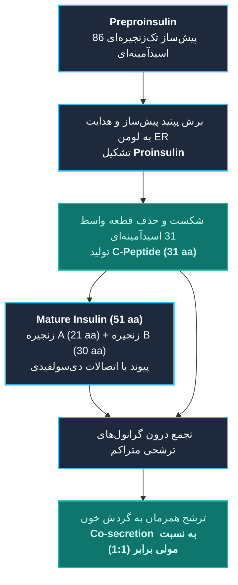
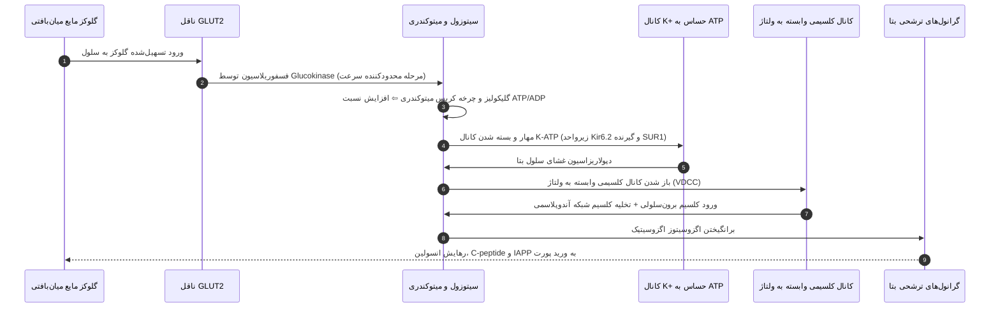
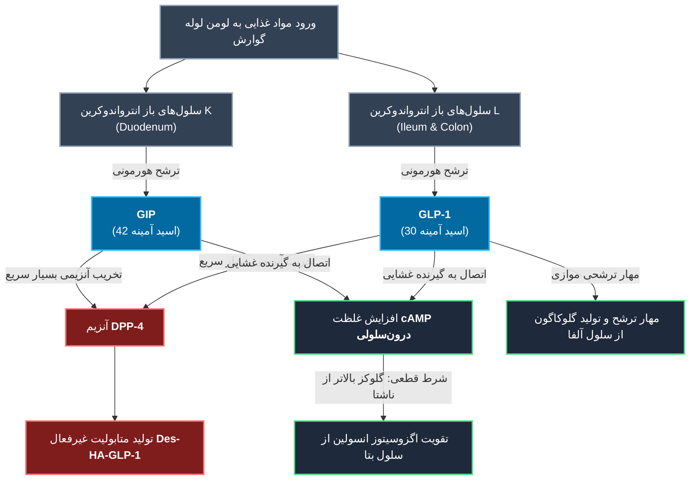
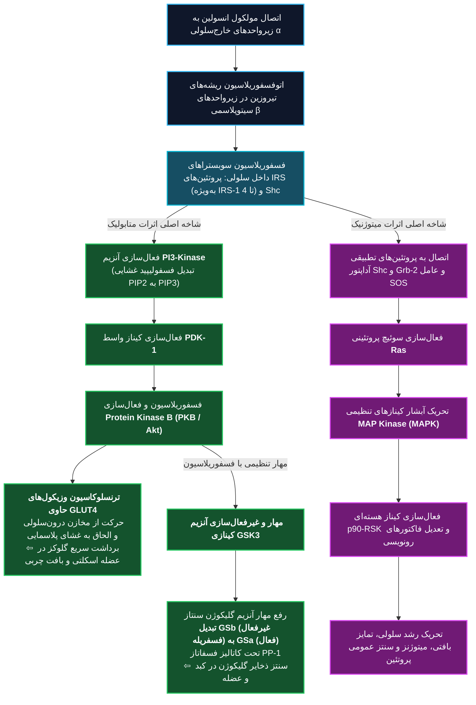
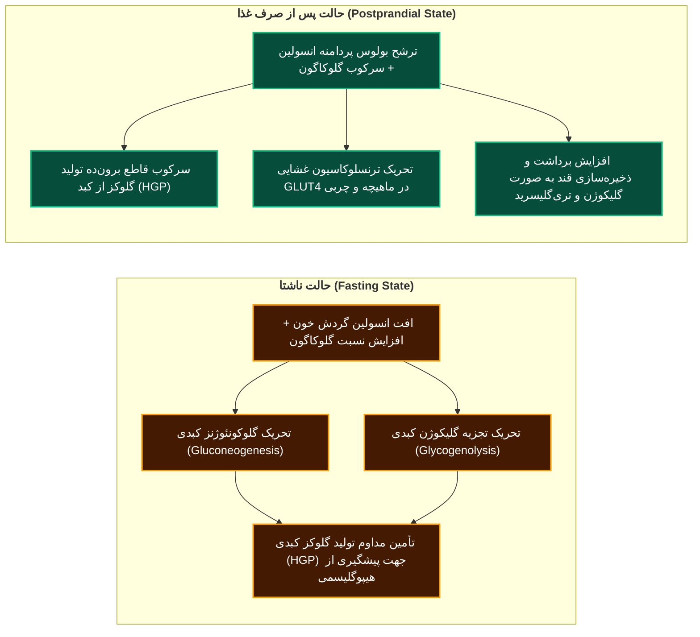
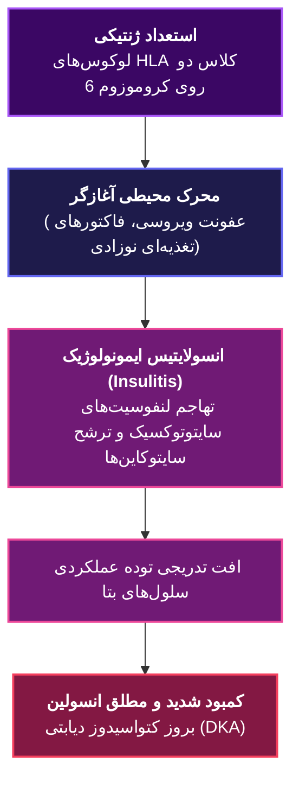
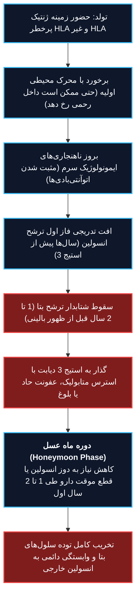
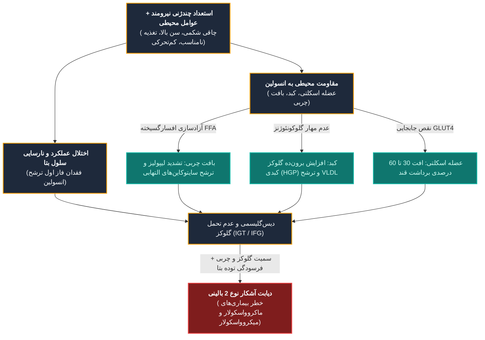
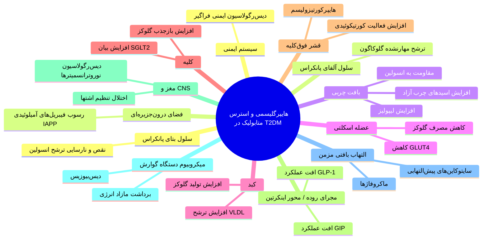
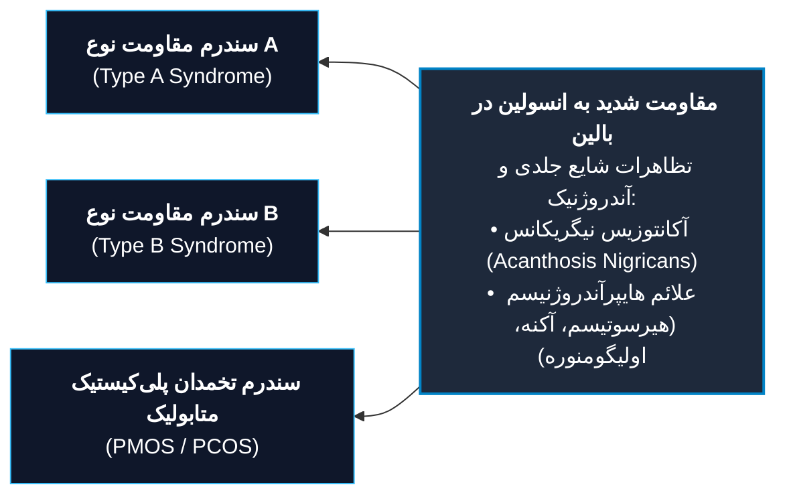

# دیابت شیرین (Diabetes Mellitus) - بخش دوم: انسولین و پاتوفیزیولوژی

## ۱. بیولوژی مولکولی، ساختار و بیوسنتز هورمون انسولین

> [!abstract] تعریف انسولین
> هورمون پلی‌پپتیدی آنابولیک با وزن مولکولی **5807 Dalton**، متشکل از **51 اسید آمینه** در دو زنجیره متصل با پل‌های دی‌سولفیدی؛ سنتزشده در *سلول‌های بتای جزایر لانگرهانس پانکراس*. پیشگامان تاریخی کشف: **Frederick G. Banting** (1891-1941)، **Charles Best**، **Collip** و **Macleod**.

### ویژگی‌های بیوشیمیایی و قطعات ساختاری

* **Preproinsulin:** پپتید پیش‌ساز اولیه تک‌زنجیره‌ای با طول **86 اسید آمینه**.
* **Proinsulin:** محصول تاخوردگی اولیه؛ سطوح سرمی بالای آن در *هردو دیابت نوع 1 و نوع 2* مشهود است و مارکر بالینی کلیدی برای **نقص عملکرد سلول‌های بتا** محسوب می‌شود.
* **C-peptide (Connecting Peptide):**
  * طول زنجیره: **31 اسید آمینه**.
  * وضعیت بیولوژیک: ذخیره توأم با انسولین درون گرانول‌های ترشحی بتا و ترشح همزمان (*co-secreted*) به نسبت مساوی.
  * مشخصه فارماکوکینتیک: **کلیرنس سرمی بسیار کندتر از انسولین** (نیمه‌عمر طولانی‌تر و عدم پاکسازی اولیه در کبد).
  * ارزش تشخیصی: شاخص طلایی پایش ترشح اندوژن انسولین؛ تفکیک منشأ هیپوگلیسمی اندوژن (*انسولینوما / ترشح خودی*) از منشأ اگزوژن (*تزریق دارویی یا پنهانی انسولین*).
* **پلی‌پپتید آمیلوئیدی جزایر (IAPP یا Amylin):**
  * طول زنجیره: **37 اسید آمینه**.
  * منشأ: ترشح همزمان (*co-secretion*) همراه با انسولین از گرانول‌های ترشحی سلول بتا.
  * فیزیولوژی طبیعی: نقش تنظیمی ناقص شناخته‌شده در فیزیولوژی نرمال.
  * نقش در بیماری‌زایی: مؤلفه اصلی ساختار **فیبریل‌های آمیلوئیدی** رسوب‌کننده در جزایر پانکراس مبتلایان به *دیابت نوع 2*.
  * کاربرد دارویی: آنالوگ‌های صناعی آمیلین در پروتکل‌های درمانی *هردو دیابت نوع 1 و نوع 2* تجویز می‌شوند.
* **تفاوت‌های گونه‌ای زنجیره‌ها:**
  * زنجیره A (دارای 21 اسید آمینه): تفاوت توالی اسیدآمینه‌ای اختصاصی در گونه گاوی (*Bovine*).
  * زنجیره B (دارای 30 اسید آمینه): دارای تفاوت ساختاری در گونه‌های گاوی و خوکی (*Bovine and Porcine*).

---

## ۲. مکانیسم‌های سلولی ترشح انسولین و جفت‌شدگی تحریک-ترشح

> [!abstract] تحریک ترشح با گلوکز
> گلوکز کلیدی‌ترین تنظیم‌کننده (*key regulator*) ترشح هورمون از سلول بتا است. سطوح گلوکز پلاسما **بیش از 70 mg/dL** بیوسنتز انسولین را مستقیماً از طریق **افزایش ترجمه پروتئینی**، پردازش پپتیدی و القای اگزوسیتوز تحریک می‌کند.

### ۱. مراحل پنج‌گانه جفت‌شدگی تحریک-ترشح (Stimulus-Secretion Coupling)

1. **انتقال سوبسترا:** برداشت گلوکز خارج‌سلولی از طریق ناقل **GLUT2**.
2. **فسفوریلاسیون تنظیمی:** تبدیل گلوکز به گلوکز-6-فسفات (G-6-P) توسط آنزیم **Glucokinase**؛ این واکنش **مرحله محدودکننده سرعت (Rate-limiting step)** در تمام چرخه ترشح تنظیمی وابسته به گلوکز است.
3. **تولید انرژی متابولیک:** ورود G-6-P به مسیر گلیکولیز و چرخه کربس میتوکندریایی ⇦ تولید انرژی و افزایش چشمگیر نسبت **ATP/ADP**.
4. **مهار کانال پتاسیمی وابسته به انرژی (ATP-sensitive K Channel):**
   * ساختار تترامر دوگانه: دارای دو زیرواحد پروتئینی کاملاً متمایز:
     * زیرواحد 1: **SUR1**؛ گیرنده دارویی سولفونیل‌اوره‌ها (*SUD*) و مگلیتینیدها (*Meglitinides*).
     * زیرواحد 2: **Kir6.2**؛ پروتئین کانال یکسوکننده پتاسیم به داخل (*Inwardly rectifying K channel protein*).
   * رخداد: اتصال ATP به کانال ⇦ مسدود شدن خروج یون پتاسیم.
5. **دپولاریزاسیون و ورود کلسیم:** دپولاریزاسیون پایدار غشای سلول ⇦ بازگشایی کانال‌های کلسیمی وابسته به ولتاژ (*Voltage-dependent Ca channels*) ⇦ هجوم یون کلسیم به سیتوزول ⇦ اگزوسیتوز محتویات وزیکولی.

> [!tip] مکانیسم‌های تقویت‌کننده و مدل‌های جایگزین ترشح
>
> * **مدل آلترناتیو فاقد فسفوریلاسیون اکسیداتیو:** تنظیم کانال‌های پتاسیمی بدون دخالت زنجیره انتقال الکترون میتوکندری، مستقیماً از طریق گلیکولیز متمرکز، فعالیت آنزیم **Pyruvate kinase** و متابولیسم فضایی محدودشده قند.
> * **سایر سوبستراهای محرک ترشح:** اسیدهای آمینه (به‌ویژه *آرژینین*)، اجسام کتونی، درشت‌مغذی‌ها، پیام‌های نوروترانسمیتری خودمختار و پپتیدهای دستگاه گوارش (*GI peptides*).
> * **ذخایر کلسیم درون‌سلولی:** آزادسازی کلسیم از **شبکه آندوپلاسمی (ER)** غلظت کلسیم آزاد سیتوزولی را تشدید می‌کند.
> * **فاکتورهای رونویسی هسته سلول بتا:** شامل پروتئین‌های **HNF-4α**، **HNF-1α**، **IPF-1** (یا PDX-1)، **HNF-1β** و **NeuroD1**.

---

## ۳. فیزیولوژی سیستم اینکرتین و اثرات هم‌افزای گوارشی

> [!abstract] اثر اینکرتین (Incretin Effect)
> پاسخ ترشحی انسولین متعاقب دریافت خوراکی گلوکز (Oral) بسیار فراتر از تجویز داخل وریدی (IV) مقادیر کاملاً برابر گلوکز است. تاریخچه: توصیف اولیه در سال 1930 توسط **La Barre**؛ اثبات تجربی در سال 1986 توسط **Nauck** مبنی بر اینکه پاسخ انسولین در انفوزیون وریدی **تنها یک چهارم (25%)** ترشح پاسخ خوراکی است. **تا 70% ترشح انسولین بعد از غذا به واسطه هورمون‌های اینکرتین رخ می‌دهد**.

### مشخصات مقایسه‌ای هورمون‌های اینکرتین دستگاه گوارش

| پارامتر ارزیابی | Glucagon-like peptide-1 (GLP-1) | Glucose-dependent insulinotropic polypeptide (GIP) |
| :--- | :--- | :--- |
| **طول زنجیره پپتیدی** | **30 اسید آمینه** | **42 اسید آمینه** |
| **منشأ بافتی انترواندوکرین** | سلول‌های نوع **L-cells** | سلول‌های نوع **K-cells** |
| **توزیع آناتومیک اصلی** | مخاط ایلئوم دیستال و کولون (**Ileum & Colon**) | مخاط دوازدهه پروگزیمال (**Duodenum**) |
| **توان نسبی تحریک انسولین** | **قوی‌ترین اینکرتین اندوژن انسان** | محرک ترشحی کمکی |
| **تنظیم سلول‌های آلفا** | **سرکوب قطعی ترشح و تولید گلوکاگون** | اثر سرکوب‌کننده گلوکاگون ناچیز یا فاقد اثر مهارکننده |
| **گیرنده‌های بافتی هدف** | سلول‌های جزایر، **CNS (کنترل اشتها)**، قلب، عروق | سلول‌های جزایر، بافت چربی، استخوان |

> [!warning] اصول فارماکولوژیک و پاتوفیزیولوژیک اینکرتین‌ها
>
> 1. **وابستگی تام به سطح گلوکز:** اثر محرک ترشح انسولین توسط اینکرتین‌ها *تنها زمانی عمل می‌کند که قند خون بالاتر از سطح پایه ناشتا باشد*؛ مزیتی که مانع افت قند خون خودبه‌خودی می‌گردد.
> 2. **پاکسازی متابولیک:** هر دو هورمون با برش آنزیمی توسط **Dipeptidyl peptidase-4 (DPP-4)** تجزیه و غیرفعال می‌شوند (تولید *Des-HA-GLP-1*).
> 3. **منشأ درون‌جزیره‌ای (Intraislet Source):** برخلاف دیدگاه سنتی ترشح انحصاری از روده، شواهد پیش‌بالینی جدید اثبات می‌کنند **سلول‌های آلفای پانکراس** نیز قابلیت سنتز موضعی GLP-1 و تنظیم پاراکراین ترشح انسولین را دارا هستند.
> 4. **رویکردهای نوین درمانی:** بهره‌گیری از *آگونیست‌های گیرنده GLP-1 مقاوم به DPP-4*، داروهای *مهارکننده آنزیم DPP-4*، و آگونیست‌های همزمان دوگانه رسپتور نظیر **Tirzepatide** (آگونیست توأم GLP-1 و GIP).

---

## ۴. کینتیک ترشح فیزیولوژیک و سرنوشت کلیرنس پورتال انسولین

* **پروفایل ترشح پایه (Basal Insulin):**
  * سهم متابولیک: **40 تا 50 درصد** از کل ترشح روزانه هورمون.
  * کارکرد: رهایش پیوسته مقادیر اندک در شبانه‌روز جهت حفظ هموستاز بافتی.
  * دینامیک رهایش ضربانی (*Pulsatile*): انفجارهای ترشحی کوچک در فواصل **هر 10 دقیقه یک‌بار**، سوار بر نوسانات موجی با دامنه بازتر با دوره تناوب **80 تا 150 دقیقه**.
* **پروفایل ترشح پاسخی یا غذا (Bolus / Prandial Insulin):**
  * سهم متابولیک: **50 تا 60 درصد** از مجموع ترشح 24 ساعته.
  * کارکرد: رهایش ناگهانی و پردامنه متعاقب بلع مواد غذایی؛ جهش ترشحی معادل **4 تا 5 برابر غلظت پایه** با طول دوره فعالیت **2 تا 3 ساعت** پیش از بازگشت به خط افقی پایه.
* **فاز اول و دوم ترشح انسولین:**
  * فاز نخست (*First-phase*): صعود جهشی و رهایش سریع گرانول‌های ذخیره‌ای آماده طی دقایق ابتدایی ورود گلوکز؛ **نقص یا فقدان کامل این فاز نخستین نشانه اختلال ترشحی در دیابت نوع 2 است**.
  * فاز دوم (*Second-phase*): رهایش تدریجی، مداوم و طولانی‌مدت گرانول‌های نوسنتز.
* **کلیرنس و گرادیان غلظتی در کبد:**
  * ترشح مستقیماً از طریق سیستم ورید باب (پورت) به سمت هپاتوسیت‌ها سرازیر می‌شود.
  * در نخستین عبور کبدی (*First-pass effect*)، معادل **حدود 50% از انسولین مترشحه توسط کبد استخراج و تخریب می‌گردد**.
  * این پاکسازی شدید سبب برقراری گرادیان غلظت ورید باب به بافت محیطی به نسبت تقریبی **2 به 1** می‌شود.
  * بخش باقیمانده بدون تغییر از کبد عبور کرده، وارد گردش خون سیستمیک شده و به بافت‌های عضلانی و چربی می‌رسد.

---

## ۵. بیولوژی گیرنده و مسیرهای پیام‌رسانی درون‌سلولی انسولین

> [!abstract] ساختار گیرنده انسولین (Insulin Receptor)
> گلیکوپروتئین تترامری هترودایمر متصل به غشای پلاسمایی متعلق به کلاس **گیرنده‌های تیروزین کینازی (Tyrosine Kinase Class)**:
>
> * **دو زیرواحد آلفا (α subunits):** جایگاه کاملاً خارج‌سلولی؛ حامل دامنه‌های اختصاصی شناسایی و اتصال به هورمون انسولین.
> * **دو زیرواحد بتا (β subunits):** دارای دومین تراغشایی و دامنه‌های سیتوزولی با خاصیت آنزیمی **تیروزین کینازی** و جایگاه اتصالی نوکلئوتید ATP؛ متصل به زنجیره‌های آلفا با باندهای دی‌سولفیدی.

### آبشارهای سیگنالینگ و تفکیک پاسخ‌های سلولی

1. **مسیر متابولیک (PI-3 Kinase / Akt):**
   * **جابجایی ناقل‌های GLUT4:** مهاجرت وزیکول‌های حاوی ناقل از درون سیتوزول به سمت سطح غشای سلول‌های عضلانی و چربی ⇦ افت فوری غلظت قند پلاسما؛ متعاقب نرمال شدن قند خون، ناقل‌های GLUT4 از طریق پدیده **اندوسیتوز (Endocytosis)** به درون وزیکول‌های سیتوپلاسمی بازگردانده می‌شوند.
   * **سنتز گلیکوژن:** آنزیم **GSK3** در غیاب انسولین گلیکوژن سنتاز را مهار می‌کند. با فسفوریلاسیون GSK3 توسط PKB، این مهار برداشته شده و فرم غیرفعال *Glycogen synthase b* تحت اثر آنزیم فسفاتاز **PP-1** دفسفریله شده و به فرم فعال بدون فسفات *Glycogen synthase a* مبدل می‌گردد.
   * **سایر پیامدهای آنابولیک:** القای فرآیندهای لیپوژنز (*Lipogenesis*) و بیوسنتز پروتئین‌ها.
2. **مسیر میتوژنیک (Ras / Raf / MAP Kinase):**
   * جفت‌شدگی دامنه‌های فسفوتیروزین با پروتئین‌های واسط **Grb-2** و پروتئین تبادل نوکلئوتید گوانین **SOS**.
   * فعال‌سازی پروتئین جی مونومریک **Ras** و راه‌اندازی آبشار **MAPK**.
   * پیامد: تعدیل بیان ژن‌ها، تحریک تقسیم سلولی (*Mitogenesis*)، هدایت تمایز بافتی و بقای سلول.
3. **هم‌پوشانی و تنوع سوبستراها (Cross-talk):**
   * برقراری ارتباط پیام‌رسانی متقاطع بین کیناز هسته‌ای **p90-RSK** و آنزیم فسفاتاز **PP-1** جهت تنظیم همزمان متابولیسم قند.
   * پروتئین‌های خانواده گیرنده انسولین: **IRS-1** (عمدتاً در بافت اسکلتی)، **IRS-2** (عمدتاً در کبد)، همراه با **IRS-3** و **IRS-4**.

---

## ۶. هموستاز هورمونی قند: حالت ناشتا در برابر پس از غذا

> [!tip] ارکان یکپارچه‌کننده تعادل گلوکز
> هموستاز متابولیک پلاسما حاصل تعادل میان **تولید گلوکز کبدی (Hepatic Glucose Production)** و **برداشت و مصرف محیطی گلوکز (Peripheral Uptake)** است. این هماهنگی غیر از هورمون انسولین تحت کنترل سه محور کمکی تنظیم می‌گردد:
>
> 1. پیام‌های تحریکی خودمختار عصبی (*Neural input*)
> 2. سیگنال‌های متابولیک واسطه‌ای (*Metabolic signals*)
> 3. هورمون‌های متقابل متضاد، در رأس آن‌ها **گلوکاگون**.

---

## ۷. دیابت نوع 1 (T1DM): پاتوژنز اتوایمیون، استیج‌ها و سیر طبیعی

> [!danger] مبنای اتیوپاتولوژیک دیابت نوع 1A
> ماحصل سینرژیک و سه‌گانه مؤلفه‌های **ژنتیکی**، **محیطی** و **ایمونولوژیک** که به تخریب پیشرونده بافتی و تهاجم اتوایمیون به *سلول‌های بتای ترشح‌کننده انسولین* منتهی می‌گردد.

### ویژگی‌های بالینی و خطاهای رایج تشخیصی

* **تظاهر بیماری:** ظهور حاد و ناگهانی با هایپرگلیسمی شدید به ویژه در کودکان؛ **25 تا 50 درصد موارد با تظاهر اولیه کتواسیدوز دیابتی (DKA) بروز می‌کنند**.
* **طیف سنی شروع:** آغاز بیماری در هر سنی ممکن است؛ برخلاف دیدگاه سنتی مبنی بر انحصار به کودکی، **تا 40% از مبتلایان شروع بیماری را بعد از سن 30 سالگی تجربه می‌کنند**.
* **تله تشخیصی بزرگسالان:** اکثر بزرگسالان مبتلا به دیابت نوع 1 در مراحل نخست به خطا با عنوان *دیابت نوع 2* برچسب تشخیصی می‌خورند؛ امری که ضرورت سنجش اتوآنتی‌بادی‌های سرمی را نشان می‌دهد.
* **حساسیت به انسولین:** حساسیت محیطی بافت‌ها به انسولین در دیابت نوع 1 **کاملاً طبیعی (Normal insulin sensitivity)** است؛ پاتولوژی صرفاً نقص در ترشح هورمون است.
* **گرایش به کتون‌سازی:** ناتوانی در مهار لیپولیز و برقراری حالت مستعد کتوز (*Ketosis prone*).

### جدول طبقه‌بندی مراحل سه‌گانه دیابت نوع 1 (ADA/JDRF Staging System)

| استیج بالینی | وضعیت پادتن‌های خودایمنی | وضعیت گلیسمی و مارکرهای پاراکلینیک | نشانه‌های بالینی بیمار |
| :--- | :--- | :--- | :--- |
| **Stage 1** | **مثبت شدن 2 یا چند اتوآنتی‌بادی جزایر** | **نرموگلیسمی کامل (Normoglycemia)**؛ عدم وجود معیارهای IFG یا IGT | فاقد علامت بالینی (*Presymptomatic*) |
| **Stage 2** | **مثبت بودن 2 یا چند اتوآنتی‌بادی جزایر** | **دیس‌گلیسمی (Dysglycemia):** • قند ناشتا: FPG = 100-125 mg/dL • تست چالش قند: 2-h PG = 140-199 mg/dL • هموگلوبین گلیکوزیله: A1C = 5.7-6.4% یا افزایش ≥ 10% در سطح پایه A1C | فاقد علامت بالینی (*Presymptomatic*) |
| **Stage 3** | پایدار ماندن اتوایمنی و تخریب بافتی | **هایپرگلیسمی آشکار دیابتی:** فراتر رفتن قند از معیارهای استاندارد تشخیصی دیابت | **علامت‌دار آشکار (*Symptomatic*)** نظیر پرنوشی، پرادراری، افت وزن سریع یا بروز DKA |

### سیر طبیعی بیماری و دوره ماه عسل (Honeymoon Phase)

* **دوره ماه عسل (Honeymoon Phase):**
  * وقوع: در خلال **1 تا 2 سال اولیه** پس از تشخیص بالینی بیماری دیابت نوع 1.
  * مشخصه: کنترل بهینه قند با مقادیر بسیار ناچیز انسولین یا به ندرت بی‌نیازی مقطعی از درمان دارویی.
  * مکانیسم: تخفیف پدیده سمیت گلوکز (*Glucotoxicity*) و بازگشت عملکرد ترشحی از توده باقیمانده سلول‌های زنده بتا.
  * عاقبت: روندی کاملاً گذرا؛ با تخریب توده باقیمانده، وابستگی مطلق به انسولین تثبیت می‌گردد.
* **شواهد اتوپسی و بقایای ترشحی سلول بتا:**
  * افت توده سلول بتا در بدو تشخیص خطی نبوده و در بیماران مختلف متغیر است؛ سیر بیماری ممکن است دوره‌های عود و فروکش (*Relapsing/remitting*) نشان دهد.
  * در بسیاری از مبتلایان دیرپای دیابت توده بتا به صفر مطلق نمی‌رسد و تولید مقادیر بسیار اندک از **C-peptide** تا سال‌ها پس از شروع بیماری قابل ردیابی است.
* **محرک‌های گذار به دیابت بالینی:** افزایش ناگهانی نیاز بدن به انسولین متعاقب رخداد **عفونت‌های حاد متابولیک** یا تغییرات هورمونی دوران **بلوغ (Puberty)**.

---

## ۸. ژنتیک و فاکتورهای ایمونوپاتولوژیک دیابت نوع 1

### ساختار ژنتیکی و لوکوس‌های مستعدکننده

* **همگامی در دوقلوهای همسان:** میزان تطابق ابتلا در دوقلوهای تک‌تخمکی بین **30 تا 70 درصد** است که ضرورت محرک‌های کمکی محیطی را اثبات می‌کند.
* **ریسک مادام‌العمر در بستگان:**
  * ابتلای یک والد: خطر ابتلای فرزند معادل **1 تا 9 درصد**.
  * ابتلای خواهر یا برادر: خطر ابتلا معادل **6 تا 7 درصد** (وابسته به هاپلوتیپ‌های اشتراکی).
  * نکته همه‌گیرشناسی بسیار مهم: **بیش از 90% مبتلایان به دیابت نوع 1 فاقد هرگونه سابقه فامیلی درجه اول هستند**.
* **مجموعه سازگاری بافتی اصلی (MHC / HLA):**
  * مستقر بر روی بازوی کوتاه **کروموزوم 6**.
  * پلی‌مورفیسم‌های این لوکوس مسئول **40 تا 50 درصد کل ریسک ژنتیکی** T1DM هستند.
  * مکانیسم: کدگذاری مولکول‌های کلاس دو MHC مسئول عرضه آنتی‌ژن به سلول‌های لنفوسیت T کمک‌کننده (CD4+ T cells).
  * **هاپلوتیپ‌های مستعدکننده اصلی:**
    1. **DRB1\*0301-DQB1\*0201 [DR3-DQ2]**
    2. **DRB1\*0401-DQB1\*0302 [DR4-DQ8]**
  * **هاپلوتیپ‌های محافظت‌کننده (Protective):**
    1. **DRB1\*1501**
    2. **DQA1\*0102-DQB1\*0602**
* **لوکوس‌های غیر MHC کشف‌شده با مطالعات GWAS (بیش از 60 جایگاه ژنی):**
  1. **PTPN22 (lyp):** پلی‌مورفیسم با تغییر اسید آمینه در تیروزین فسفاتاز اختصاصی لنفوسیت.
  2. **پروموتر ژن انسولین (VNTR INS):** پلی‌مورفیسم‌های ناحیه تنظیمی پروموتر ژن *INS*.
  3. **ژن CTLA-4:** اثبات همراهی معنادار در متاآنالیز 33 مطالعه با جامعه آماری بیش از 5000 بیمار.
  4. **گیرنده اینترلوکین 2 (IL-2R).**

> [!warning] پدیده نفوذپذیری مدرن ژنتیکی
> در کوهورت‌های بالینی دهه‌های اخیر، فراوانی الل‌های کلاسیک با بالاترین خطر HLA کاهش یافته و در مقابل **افزایش نفوذ بیماری در ژنوتیپ‌های با ریسک سنتی پایین‌تر** گزارش شده است؛ امری که نشان‌دهنده تقویت نقش فاکتورهای محیطی مدرن در القای بیماری است.

### ایمونوپاتولوژی جزایر و پنج بیومارکر اتوآنتی‌بادی

* **پاتولوژی انسولایتیس (Insulitis):** ارتشاح ارتشاحی لنفوسیتی در اطراف و بطن جزایر لانگرهانس؛ پس از تخریب آخرین بقایای سلول‌های بتا:
  1. التهاب بافتی کاملاً فرومی‌نشیند.
  2. جزایر لانگرهانس دچار آتروفی ساختاری نهایی می‌شوند.
  3. مارکرهای ایمونولوژیک به تدریج از گردش خون ناپدید می‌گردند.
* **مکانیسم‌های سلولی مرگ سلول بتا:**
  1. سمیت سلولی مستقیم با لنفوسیت‌های سایتوتوکسیک **CD8+ T cells**.
  2. آزاد شدن سایتوکاین‌های کشنده شامل **IL-1β**، **IFN-γ** و **TNF-α**.
  3. آبشار سیگنالینگ مرگ درون‌سلولی: فعال‌سازی محورهای JAK/STAT-1، کینازهای استرسی MAPK شامل JNK و p38 و ERK، و فاکتور رونویسی NF-κB ⇦ هدایت به آپوپتوز و نکروز سلولی.
  4. تولید گونه‌های فعال اکسیژن (ROS) و متابولیت‌های اکسید نیتریک (*Nitric oxide*).
  5. مشارکت فعال خود سلول بتا در تشدید تخریب: تولید پروتئین‌های تغییریافته ساختاری تحت عنوان **نئوآنتی‌ژن‌ها (Neoantigens)** و عرضه شدید آن‌ها از طریق آپ‌رگولاسیون مولکول‌های **MHC Class I** در سطح غشا.
* **اتوآنتی‌بادی‌های پنج‌گانه بیومارکر جزایر (ICAs):**
  1. اتوآنتی‌بادی ضد گلوتامیک اسید دکربوکسیلاز (**Anti-GAD65**)
  2. اتوآنتی‌بادی ضد تیروزین فسفاتازها (**Anti-IA-2 و Anti-IA-2β**)
  3. اتوآنتی‌بادی ضد ناقل روی شماره 8 (**Anti-ZnT8**)
  4. اتوآنتی‌بادی ضد انسولین (**IAA**)
  5. اتوآنتی‌بادی سیتوپلاسمی سلول‌های جزایر (**ICA**)

> [!danger] ماهیت بیولوژیک اتوآنتی‌بادی‌ها در تخریب بافتی
> اتوآنتی‌بادی‌های در گردش خون در بیش از **85%** افراد در آغاز بیماری وجود دارند؛ **با این وجود این پادتن‌ها مستقیماً هیچ نقشی در تخریب یا مرگ سلول‌های بتا ندارند و با سطح سلول جزایر وارد واکنش کشنده نمی‌شوند**؛ بلکه مرگ سلول بتا مستقیماً توسط *لنفوسیت‌های سایتوتوکسیک CD8+ T* و واسطه‌های سایتوکاینی هدایت می‌گردد.

* **پیش‌بینی ابتلای کودکان در کوهورت‌های پرخطر:** ظهور دو یا چند پادتن معمولاً در **3 سال اول زندگی** رخ داده و همراه با **ریسک نزدیک به 70% پس از 10 سال** و **ریسک بیش از 80% پس از 15 سال پیگیری** برای ابتلا به دیابت نوع 1 بالینی است.
* **وضعیت سایر سلول‌های درون‌جزیره‌ای (آلفا، دلتا، PP):**
  * سلول‌های آلفا (گلوکاگون)، دلتا (سوماتواستاتین) و PP (پلی‌پپتید پانکراس) از دیدگاه جنین‌شناسی و محتوای پروتئینی کاملاً مشابه سلول بتا هستند.
  * مصونیت بافتی: **این سلول‌ها از تهاجم اتوایمیون مصون مانده و تخریب ساختاری نمی‌شوند**.
  * ناپایداری ترشحی: الگوهای تنظیمی آن‌ها دچار آشفتگی می‌شود؛ بازتاب سلول آلفا به صورت **هایپرگلوکاگونمی متناقض در وضعیت ناشتا و پس از غذا**، همراه با **نقص ترشح گلوکاگون در پاسخ به هیپوگلیسمی حاد** است که ناپایداری متابولیک را شدت می‌بخشد.

### پیشگیری نوین دارویی: داروی تپلیزوماب (Teplizumab)

> [!tip] پیشرفت درمانی: داروی تپلیزوماب (Tzield / Teplizumab-mzwv)
>
> * **ساختار دارویی:** آنتی‌بادی مونوکلونال ضد گیرنده **CD3** با جهش ممانعت‌کننده از اتصال به بخش اف‌سی گیرنده (*Fc receptor-nonbinding anti-CD3 mAb*).
> * **مکانیسم اثر:** تعدیل پاسخ لنفوسیت‌های سایتوتوکسیک T و ارتقا و تحریک عملکرد پایدار *لنفوسیت‌های T تنظیمی (Treg)* در بلندمدت.
> * **اندیکاسیون رسمی FDA:** تجویز در افراد بالای 8 سال واجد **Stage 2 T1DM** (افراد با حداقل 2 پادتن مثبت به همراه دیس‌گلیسمی فاقد علامت).
> * **پروتکل دوزاژ:** انفوزیون وریدی منفرد روزانه به مدت **14 روز متوالی** (ویال‌های تک‌دوز 2 mg/2 mL).
> * **دستاورد بالینی:** به تاخیر انداختن شروع رسمی مرحله 3 دیابت بالینی به میزان **میانه 32.5 ماه**.

### فاکتورهای محیطی آغازگر (Environmental Triggers)

1. **عفونت‌های ویروسی:** به‌ویژه انتروویروس‌ها (*Coxsackie*) و سرخجه مادرزادی (*Congenital rubella*).
2. **عوامل تغذیه‌ای نوزادی:** مواجهه زودهنگام با پروتئین‌های شیر گاو (*Bovine milk proteins*).
3. **ترکیبات سمی و شیمیایی:** مشتقات نیتروزواوره (*Nitrosourea compounds*).
4. **کمبودهای متابولیک:** کمبود ویتامین D (*Vitamin D deficiency*).
5. **میکروبیوم گوارشی:** برهم‌خوردن تعادل فلور باکتریایی روده (*Gut microbiome*). رخداد وقایع محرک ممکن است حتی داخل رحمی (*In utero*) اتفاق افتد.

---

## ۹. دیابت نوع 2 (T2DM): ژنتیک، اپی‌ژنتیک و پاتوژنز چندارگانی

> [!abstract] اختلال دوگانه بنیادین (Dual Defect Disease)
> دیابت نوع 2 سندرومی ناهمگون و برآیند دو نقص به‌هم‌پیوسته شامل: **1) مقاومت به انسولین (Insulin Resistance)** و **2) اختلال ترشح انسولین از سلول بتا (Impaired Secretion)**. تقدم و تأخر: مقاومت به انسولین بر اختلال ترشحی تقدم زمانی دارد، اما بروز بالینی هایپرگلیسمی تنها زمانی تثبیت می‌شود که ظرفیت جبرانی سلول‌های بتا دچار فرسودگی گردد.

### بار ژنتیکی، اپی‌ژنتیک و شواهد جمعیتی

* **میزان همگامی در دوقلوهای تک‌تخمکی:** بسیار بالا معادل **70 تا 90 درصد** (نشان‌دهنده بار ژنتیکی بسیار قوی‌تر نسبت به نوع 1).
* **خطر در فرزندان:** ابتلای یک والد ریسک بروز را بالا می‌برد؛ در صورت ابتلای هر دو والد، خطر بروز دیابت در فرزندان به **70%** می‌رسد.
* **فنوتیپ بستگان:** وجود مقاومت به انسولین (کاهش اثبات‌شده برداشت قند در عضله) در بستگان درجه اول غیردیابتی.
* **جایگاه‌های ژنی GWAS (بیش از 600 لوکوس با خطر نسبی 1.06 تا 1.5):**
  * برجسته‌ترین واریانت ژنی: ژن **TCF7L2 (Transcription Factor 7-Like 2)** مرتبط با دیابت نوع 2 و اختلال تحمل گلوکز (IGT).
  * گیرنده تنظیمی تمایز چربی: **PPAR-γ**.
  * ژن‌های کانال پتاسیمی حساس به انرژی در بتا: **KCNJ11 / SUR1**.
  * ژن ترنسپورتر روی: **ZnT8 / SLC30A8**.
  * پروتئین‌های سوبسترای گیرنده: **IRS**.
  * ژن پروتئاز **Calpain 10**.
* **تعامل ژنتیک و محیط (شواهد جمعیتی سرخپوستان پیما - Pima Indians):**
  * سرخپوستان پیما در مکزیک (سبک زندگی و تغذیه بومی): شیوع دیابت **6% در مردان و 11% در زنان**.
  * سرخپوستان پیما در آریزونای آمریکا (سبک زندگی غربی و کم‌تحرکی): شیوع **54% در مردان و 37% در زنان**.
* **محیط داخل رحمی (In Utero):** هر دو فنوتیپ *کاهش وزن هنگام تولد* و *افزایش وزن هنگام تولد*، و همچنین مواجهه با هایپرگلیسمی بارداری مادر (*GDM*)، ریسک ابتلای فرزند به دیابت نوع 2 را به شدت ارتقا می‌دهند.

### اپیدمیولوژی چاقی و ریسک گلیسمیک

* **شاخص توده بدنی (BMI):** به ازای هر یک واحد افزایش در BMI (معادل تقریبی **2.7 تا 3.6 کیلوگرم**)، ریسک ابتلا به دیابت نوع 2 به میزان **12.1 درصد** افزایش می‌یابد.
* **سهم چاقی در ایالات متحده:** **68 تا 72 درصد از کل ریسک ابتلا به دیابت مستقیماً به وزن اضافی بدن نسبت داده می‌شود**.
* **افزایش وزن به مرور زمان:** به ازای هر کیلوگرم افزایش وزن در خلال دوره زمانی 10 ساله، ریسک ابتلا به دیابت **4.5 درصد** بالا می‌رود.

---

## ۱۰. پاتوفیزیولوژی اندام‌های هدف در دیابت نوع 2

### ۱. عضله اسکلتی و نقایص پست‌رسپتور

* مقاومت به انسولین ماهیتی نسبی دارد؛ تجویز دوزهای سوپرانرمال انسولین قند خون را اصلاح می‌کند.
* در بیماران دیابتی نوع 2، میزان مصرف و برداشت گلوکز **30 تا 60 درصد پایین‌تر از افراد نرمال** است.
* برداشت گلوکز در بافت‌های غیروابسته به انسولین (*Insulin-independent tissues*) کاملاً نرمال است.
* محل اصلی نقص: نقایص سطح پس از گیرنده (**Postreceptor defects**) در چرخه فسفوریلاسیون و دفسفوریلاسیون، به‌ویژه در سیگنالینگ آنزیم **PI-3 Kinase** که مهارکننده انتقال وزیکول‌های GLUT4 به غشاست.
* **تجمع واسطه‌های لیپیدی میوسیت‌ها (Intramyocellular lipids):** مهار اکسیداسیون فسفوریلاسیون میتوکندری، کاهش تولید ATP وابسته به هورمون، تجمع پراکسیدهای لیپیدی و تولید رادیکال‌های فعال اکسیژن (ROS) ⇦ راه‌اندازی التهاب خفیف متابولیک و تشدید مقاومت سلولی.

> [!important] انحراف سیگنالینگ و شتاب آترواسکلروزیس در مقاومت به انسولین
> در شرایط مقاومت شدید به انسولین، تمامی مسیرهای آبشاری مهار نمی‌شوند. مسیر متابولیک PI-3K به شدت دچار مقاومت و سرکوب می‌گردد؛ در مقابل، **مسیر میتوژنیک MAP Kinase که تکثیر، رشد و تمایز سلولی را هدایت می‌کند کاملاً به انسولین حساس باقی می‌ماند**. بنابراین، هایپرانسولینمی شدید جبرانی با تحریک افسارگسیخته مسیر فعال MAPK در دیواره رگ‌ها، موجب تکثیر سلول‌های ماهیچه صاف عروق شده و مستقیماً **فرایند آترواسکلروزیس را شتاب می‌بخشد**.

### ۲. بافت چربی، لیپوتوکسیسیتی و سایتوکاین‌های التهابی

* درناژ ورید پورتال: چربی احشایی شکمی (معیار دور کمر به باسن / Hip-waist ratio) مستقیماً به سیستم پورت سرریز شده و عامل اولیه سمیت هپاتوسیت‌ها است.
* تشدید فرآیند لیپولیز در آدیپوسیت‌ها ⇦ سرازیر شدن مداوم اسیدهای چرب آزاد (**FFAs**) به پلاسما.
* **پیامدهای مخرب سمیت اسید چرب آزاد (Lipotoxicity):**
  1. مهار برداشت و مصرف قند در عضلات اسکلتی.
  2. تحریک مستقیم مسیر گلوکونئوژنز و تشدید ساخت گلوکز در کبد.
  3. آسیب مستقیم بافتی و تضعیف ظرفیت ترشحی سلول‌های بتای پانکراس.
* **آدیپوکین‌ها و مارکرهای فاز حاد التهابی:**
  * واسطه‌های افزایش‌دهنده مقاومت: **TNF-α**، **IL-6**، **Resistin**، **RBP4** و **Leptin**.
  * ارتشاح ماکروفاژهای مقیم بافت چربی (*Adipose tissue resident macrophages*)؛ عامل بالا بودن پروتئین فاز حاد **CRP** و اینترلوکین 6 در دیابت نوع 2.
  * **آدیپونکتین (Adiponectin):** هورمون پپتیدی حساس‌کننده به انسولین با خواص آنتی‌آتروژنیک؛ غلظت پلاسمایی آن **در شرایط چاقی به شدت کاهش می‌یابد** که مقاومت به انسولین کبدی را تحکیم می‌کند.
* **بافت چربی قهوه‌ای (Brown Fat):** بافت چربی با ظرفیت ترموژنز بالا برخلاف چربی سفید؛ افزایش حجم یا تحریک آن زمینه تحقیقات دارویی نوین است.

### ۳. ناهنجاری‌های متابولیک کبد و دیس‌لیپیدمی آتروژنیک

* شکست هایپرانسولینمی در مهار ساخت قند درون‌زاد به دلیل مقاومت هپاتوسیت‌ها.
* **افزایش برون‌ده گلوکز کبدی (HGP): مسئول و عامل اولیه افزایش قند خون ناشتا (FPG).**
* **کاهش مصرف محیطی گلوکز در عضلات: مسئول اولیه هایپرگلیسمی پس از صرف غذا (Postprandial).**
* متابولیسم مقادیر بالای اسیدهای چرب ورودی به کبد ⇦ سنتز و ترشح تری‌گلیسریدهای غنی از **VLDL**.
* **تریاد دیس‌لیپیدمی دیابتی:**
  1. افزایش قابل توجه تری‌گلیسریدها (**High Triglycerides**).
  2. کاهش کلسترول لیپوپروتئین با چگالی بالا (**Low HDL**).
  3. افزایش ذرات متراکم و کوچک آتروژنیک (**Small dense LDL particles**).
* تجمع تری‌گلیسرید در هپاتوسیت‌ها ⇦ بیماری استئاتوتیک کبد مرتبط با اختلال متابولیک (**MASLD**) و افزایش آنزیم‌های کبدی.

### ۴. زوال و نقص ترشحی سلول‌های بتای پانکراس

* مرحله آغازین: ترشح جبرانی شدید انسولین برای غلبه بر مقاومت جهت برقراری تحمل نرمال گلوکز (NGT).
* نقص ساختاری نخستین: **افت یا فقدان کامل فاز اول رهایش انسولین در پاسخ به گلوکز (Loss of first-phase)**؛ در حالی که پاسخ ترشحی به سایر محرک‌های غیرگلوکوزی مانند **آرژینین** تا مدت‌ها نرمال باقی می‌ماند.
* در زمان تشخیص رسمی بالینی دیابت نوع 2، توده و عملکرد ترشحی سلول‌های بتا **به میزان 50% کاهش یافته است**.
* نقص در پردازش پروانسولین ⇦ نشت مقادیر نامتناسب پروانسولین فرآوری‌نشده به سرم.
* **عوامل چندگانه فروپاشی عملکردی سلول‌های بتا:**
  1. **سمیت گلوکز (Glucose toxicity):** هایپرگلیسمی مزمن ترشح هورمون را فلج می‌کند (کنترل مطلوب قند این نارسایی را تخفیف می‌دهد).
  2. **سمیت لیپیدی (Lipotoxicity):** آثار کشنده قرارگیری مداوم در معرض اسیدهای چرب آزاد (FFA).
  3. **رسوب آمیلوئید پپتیدی جزایر (IAPP / Amylin):** تشکیل پلاک‌های فیبریلی آمیلوئیدی نامحلول در فضای بین‌سلولی جزایر لانگرهانس در دیابت دیرپا.
  4. سایتوکاین‌های التهابی ناشی از ارتشاح ماکروفاژها در بافت جزایر.
  5. نقایص ثانویه ژنتیکی حاکم بر تمایز و هویت سلولی بتا.

---

## ۱۱. اختلالات سیزده‌گانه پاتوفیزیولوژیک دیابت نوع 2 (The Tumultuous Thirteen)

### داروهای متناظر با اهداف پاتوفیزیولوژیک سیزده‌گانه

* **تحریک ترشح هورمون از سلول بتا:** داروهای سولفونیل‌اوره (SU)، مگلیتینیدها، آگونیست‌های گیرنده GLP-1، آگونیست‌های دوگانه GLP-1/GIP، مهارکننده‌های DPP-4، و انسولین اگزوژن.
* **کاهش ترشح گلوکاگون:** آگونیست‌های GLP-1، آگونیست‌های دوگانه GLP-1/GIP، آنالوگ‌های آمیلین، مهارکننده‌های DPP-4.
* **بهبود حساسیت انسولین در کبد و عضله:** متفورمین (**Metformin**)، کلاس تیازولیدین‌دیون‌ها (**TZDs**).
* **کاهش بازجذب کلیوی گلوکز:** مهارکننده‌های انتقال‌دهنده سدیم-گلوکز شماره دو (**SGLT-2 Inhibitors**).
* **تعدیل اشتها و انتقال‌دهنده‌های عصبی هیپوتالاموس:** آگونیست‌های گیرنده GLP-1، آگونیست‌های دوگانه اینکرتین، آگونیست‌های گیرنده دوپامین.
* **مهار استرس و محافظت قلبی-عروقی-کلیوی:** مهارکننده‌های غیراستروئیدی گیرنده مینرالوکورتیکوئید (**Non-steroidal MRAs**).
* **مهار هضم کربوهیدرات‌های گوارشی:** مهارکننده‌های آلفا-گلوکوزیداز.

---

## ۱۲. پیشگیری اولیه از دیابت نوع 2 و مدیریت پیش‌دیابت

> [!abstract] فاز پیش‌دیابت (Prediabetes)
> دوره مقدماتی و بدون علامت پیش از بروز رسمی دیابت نوع 2، مشخص‌شده با اختلال گلوکز ناشتا (**IFG**) یا اختلال تحمل گلوکز (**IGT**).

### دستاوردهای کارآزمایی بالینی پیشگیری از دیابت (DPP - Diabetes Prevention Program)

* **مداخله فشرده سبک زندگی (Intensive Lifestyle Intervention):**
  * پروتکل: اصلاح الگوی تغذیه و انجام فعالیت ورزشی هوازی حداقل **30 دقیقه در روز به مدت 5 روز در هفته**.
  * افت وزن: دستیابی به **5 تا 7 درصد کاهش وزن بدن** در طول دوره 3 ساله اولیه.
  * برآیند پیشگیرانه: **کاهش 58 درصدی ریسک بروز یا تاخیر در شروع دیابت نوع 2** نسبت به گروه دارونما.
  * تعمیم‌پذیری: اثربخشی بدون وابستگی به *سن، جنسیت یا نژاد و قومیت*؛ حفظ پایداری اثرات محافظتی تا **حداقل 15 سال پیگیری مداوم**.
* **درمان دارویی با متفورمین (Metformin Group):** **کاهش 31 درصدی نرخ بروز دیابت** نسبت به دارونما.
* تاییدیه‌های بین‌المللی: کسب نتایج مشابه در جوامع فنلاندی (*Finnish Diabetes Prevention Study*) و چینی (*Da Qing Study*).

### مداخلات دارویی اثبات‌شده در به تاخیر انداختن دیابت نوع 2

1. مهارکننده‌های آلفا-گلوکوزیداز (*α-Glucosidase inhibitors*)
2. متفورمین (*Metformin*)
3. تیازولیدین‌دیون‌ها (*TZDs*)
4. آگونیست‌های گیرنده GLP-1 (*GLP-1 RA*)
5. مهارکننده‌های SGLT-2 (*SGLT-2 Inhibitors*)
6. ارلیستات (*Orlistat*)
7. آگونیست‌های دوگانه گیرنده GIP/GLP-1 نظیر تیرزپاتاید (*Tirzepatide*)
8. رژیم‌های درمانی بسیار کم‌کالری تحت نظر (*Very-low-calorie diets*)

> [!important] اندیکاسیون‌های ADA جهت درمان دارویی با متفورمین در پیش‌دیابت
> انجمن دیابت آمریکا تجویز متفورمین را در افراد واجد هر دو اختلال IFG و IGT که در **معرض خطر بسیار بالا برای پیشرفت سریع به سمت دیابت** هستند توصیه می‌نماید:
>
> * **سن کمتر از 60 سال (Age < 60 years)**
> * **شاخص توده بدنی بالای 35 (BMI ≥ 35 kg/m²)**
> * **سابقه ابتلا به دیابت بارداری در زنان (History of GDM)**
> * **قند ناشتای بالای 110 (FBS > 110 mg/dL) یا هموگلوبین گلیکوزیله بالای 6 درصد (HbA1c > 6%)**
> * غربالگری همراه جهت کشف آسیب‌های قلبی-عروقی برای تمامی موارد پره‌دیابت الزامی است.

---

## ۱۳. سندرم‌های بالینی مقاومت شدید به انسولین

> [!abstract] سندرم متابولیک یا Syndrome X
> تجمعی از بی‌نظمی‌های پاتولوژیک مرتبط با مقاومت به انسولین شامل: فشار خون بالا، دیس‌لیپیدمی آتروژنیک، چاقی احشایی/مرکزی، اختلال عملکرد اندوتلیوم عروقی (*Endothelial dysfunction*)، اختلال در روند فیبرینولیز (*Dysfibrinolysis*)، و تسریع بیماری‌های قلبی-عروقی ماکروواسکولار.

### مقایسه تفکیکی سندرم‌های شدید مقاومت به انسولین در بالین

| مؤلفه ارزیابی | سندرم مقاومت به انسولین نوع A | سندرم مقاومت به انسولین نوع B | سندرم پلی‌کیستیک متابولیک تخمدان (PMOS) |
| :--- | :--- | :--- | :--- |
| **جمعیت شایع هدف** | **زنان جوان (Young women)** | **زنان میان‌سال (Middle-aged women)** | **زنان در سنین باروری و پیش از یائسگی** |
| **شدت هایپرانسولینمی** | هایپرانسولینمی فوق‌العاده شدید | هایپرانسولینمی فوق‌العاده شدید | هایپرانسولینمی در درصد چشمگیری از بیماران |
| **وضعیت وزن و فنوتیپ چاقی** | **همراه با چاقی بارز (Obesity)** | معمولاً فاقد چاقی برجسته | فنوتیپ‌های چاق یا لاغر |
| **تظاهرات هایپرآندروژنیسم** | هیرسوتیسم، آکنه، آکانتوزیس نیگریکانس | هیرسوتیسم شدید و علائم آندروژنیک | عدم تخمک‌گذاری مزمن و هایپرآندروژنیسم |
| **بیماری‌های زمینه‌ای همراه** | فاقد همراهی با اختلالات اتوایمیون اولیه | **همراه با بیماری‌های اتوایمیون شدید سیستمیک** | اختلال باروری و متابولیسم |
| **نقص بنیادین بیومولکولی** | **نقص در مسیر انتقال سیگنال انسولین** | **اتوآنتی‌بادی ضد گیرنده انسولین (Anti-IR Ab)** | اختلال عملکرد ترشحی تخمدان و گنادوتروپین‌ها |

> [!warning] رفتار دوگانه و تناقض‌آمیز اتوآنتی‌بادی‌های رسپتور در نوع B
> اتوآنتی‌بادی‌های در گردش خون علیه گیرنده انسولین در سندرم مقاومت نوع B دو تظاهر متضاد کلینیکی ایجاد می‌کنند:
>
> 1. اتصال به دومین گیرنده و انسداد رقابتی باندینگ هورمون ⇦ **مقاومت سهمگین به انسولین و هایپرگلیسمی شدید**.
> 2. تحریک نابجای آگونیستی گیرنده تیروزین کینازی ⇦ **افت قند خون متناوب و شدید (Intermittent hypoglycemia)**.

> [!tip] تمایز مستقل پاتولوژیک PMOS
> در سندرم پلی‌کیستیک تخمدان، مقاومت به انسولین در درصد بالایی از زنان مبتلا ردیابی می‌شود؛ این سندرم **مستقل از اثرات چاقی (Independent of obesity)** ریسک بروز دیابت نوع 2 را ارتقا می‌بخشد.

---

## ۱۴. جدول دایره‌المعارفی مقایسه جامع دیابت نوع 1 در برابر دیابت نوع 2

| پارامتر مقایسه‌ای | دیابت قندی نوع 1 (Type 1 DM) | دیابت قندی نوع 2 (Type 2 DM) |
| :--- | :--- | :--- |
| **سن شیوع بیماری** | در هر سنی ممکن است؛ اوج شیوع در نوجوانی، ولی **40% موارد بعد از 30 سالگی** | شایع‌ترین سن بروز **بعد از 40 سالگی** |
| **فنوتیپ و شاخص بدنی** | عمدتاً لاغر یا وزن نرمال در زمان شروع بیماری | **چاقی شکمی/احشایی در 90% موارد** |
| **پاتوژنز و نقص بنیادین** | **تخریب اتوایمیون سلول بتا ⇦ کمبود مطلق انسولین** | **مقاومت به انسولین + افت نسبی ترشح سلول بتا** |
| **استعداد ژنتیکی** | چندژنی متوسط؛ همگامی در دوقلوها **30 تا 70 درصد** | بسیار قدرتمند و پلی‌ژنیک؛ همگامی در دوقلوها **70 تا 90 درصد** |
| **ارتباط با ژن‌های HLA** | **ارتباط بسیار مستحکم با ژن‌های کلاس II کروموزوم 6** | **عدم وجود هرگونه ارتباط با آنتی‌ژن‌های HLA** |
| **مارکرهای اتوایمیون** | **مثبت بودن اتوآنتی‌بادی‌ها (GAD65, IA-2, ZnT8, IAA) در >85%** | **فقدان کامل هرگونه اتوآنتی‌بادی خودایمنی** |
| **هیستوپاتولوژی پانکراس** | **Insulitis** با ارتشاح لنفوسیتی و آتروفی نهایی جزایر | رسوب آمیلوئید پپتیدی (**IAPP**)، هیالینوز و دگرانولاسیون |
| **حساسیت بافتی به انسولین** | **طبیعی** در مراحل بدو بیماری | **شدیداً کاهش‌یافته (مقاومت محیطی بارز)** |
| **تمایل به رخداد کتواسیدوز** | **تمایل بالا به کتواسیدوز (25 تا 50 درصد تظاهر با DKA)** | **مقاوم به بروز کتوز (Ketosis resistant)** |
| **سطح ترشح C-peptide** | شدیداً سرکوب‌شده یا نهایتاً نزدیک به صفر | متغیر: نرمال، بالا، یا کاهش‌یافته به صورت نسبی |
| **پاسخ تنظیمی گلوکاگون** | هایپرگلوکاگونمی پایه، ناتوانی در ترشح حین افت قند | ترشح مهارنشده و متناقض پس از غذا |
| **الزام پروتکل درمانی** | **وابستگی قطعی و مادام‌العمر به انسولین اگزوژن** | سبک زندگی، داروهای خوراکی، اینکرتین‌ها، انسولین |
