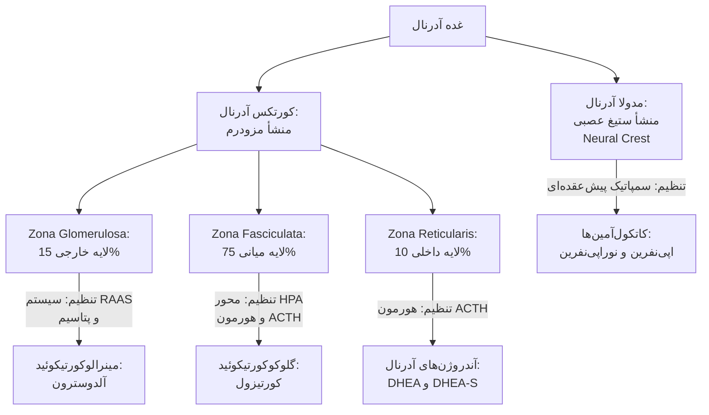
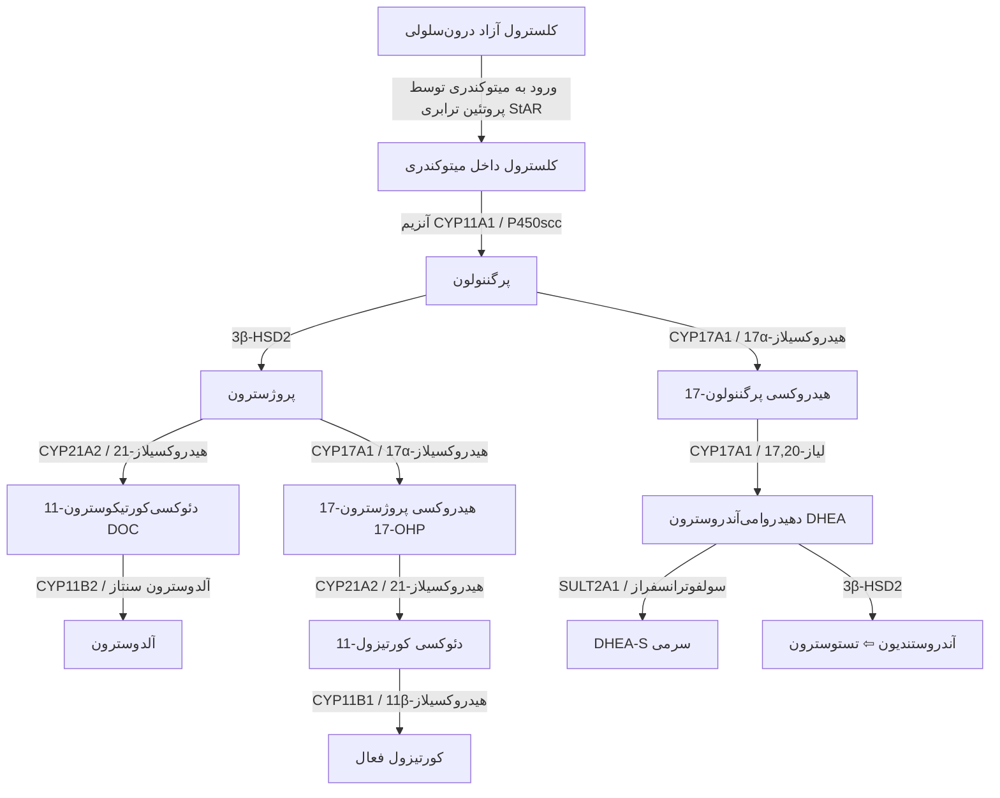
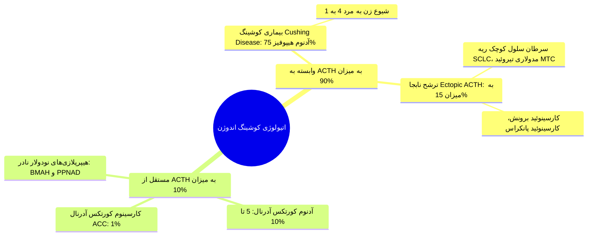
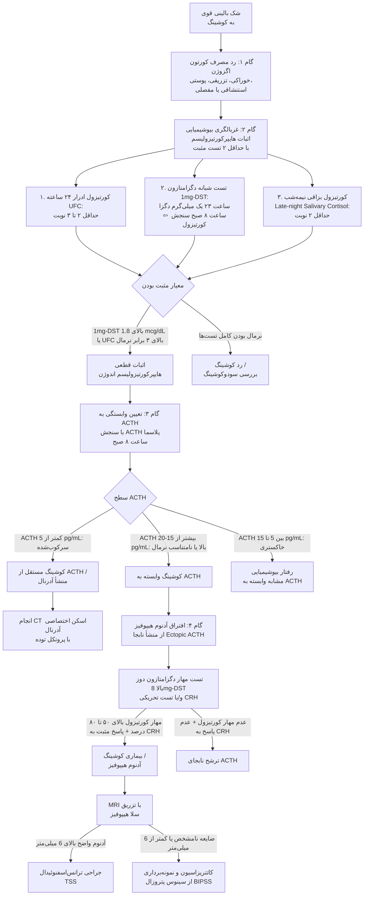
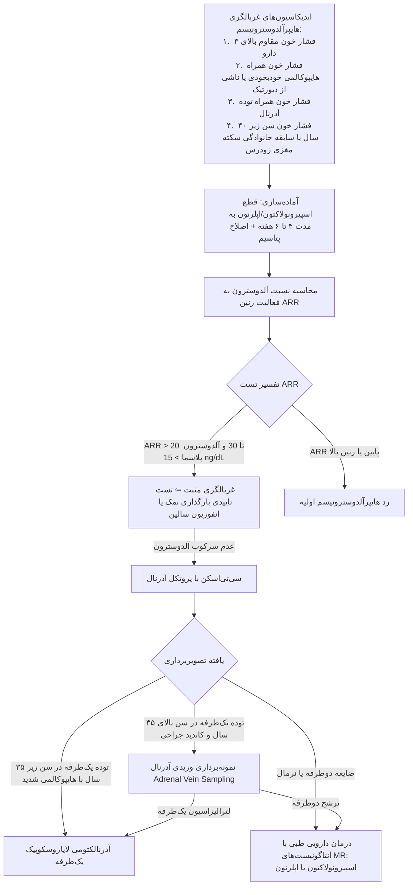
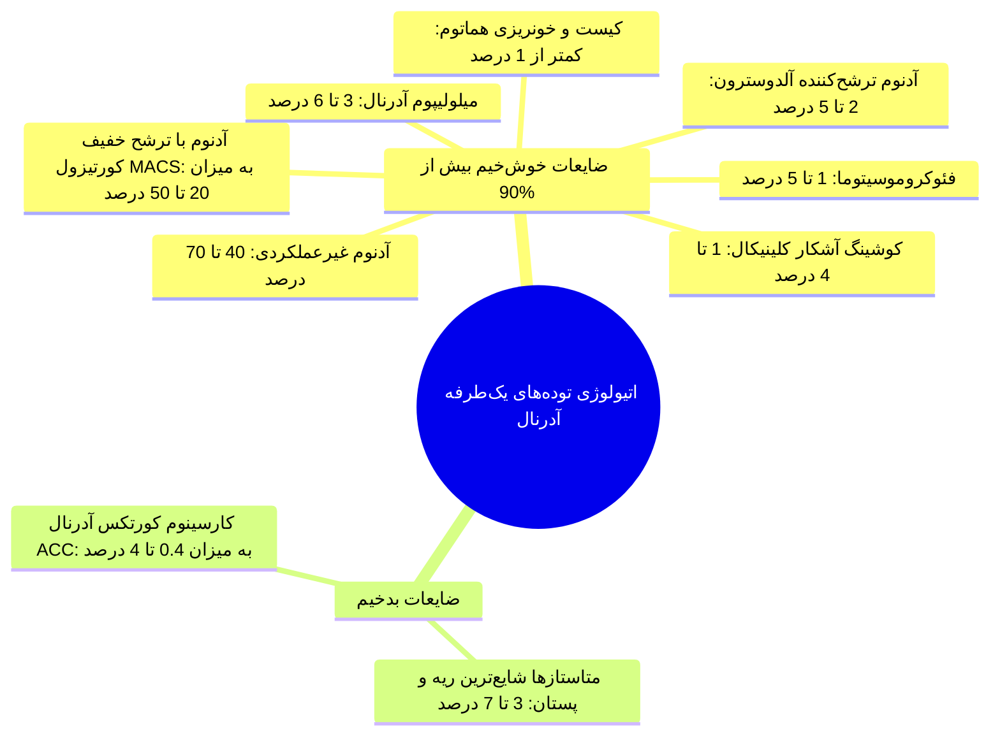
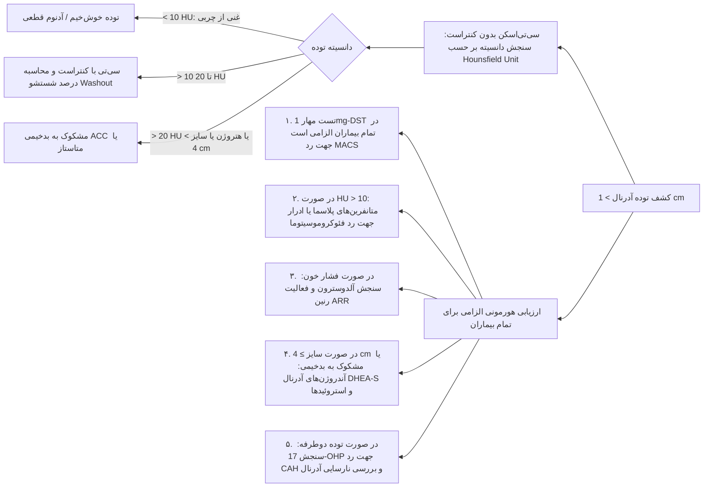
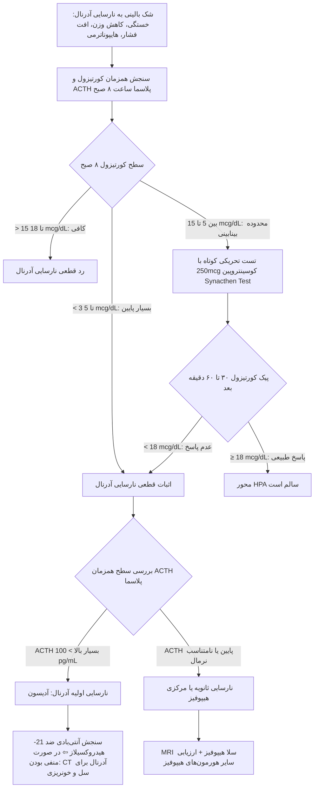
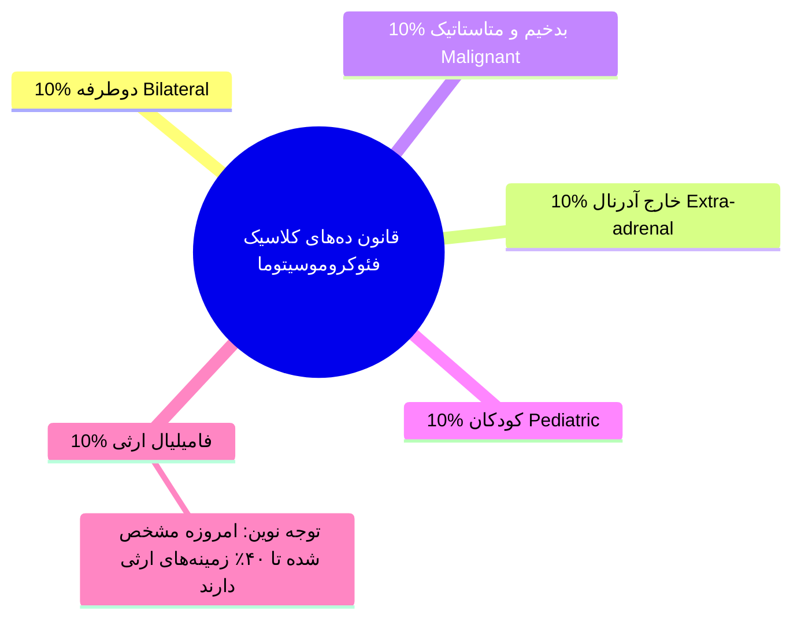
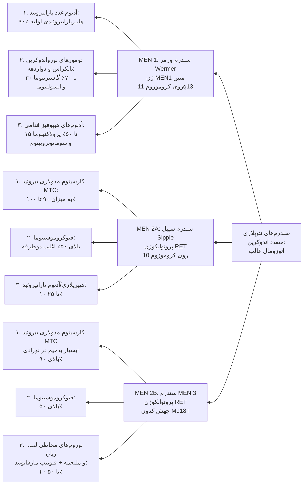

# اختلالات جامع غده آدرنال، پرفشاری خون اندوکرین، فئوکروموسیتوما و سندرم‌های چندغددی

## 1. آناتومی، توپوگرافی و کنترل محورهای بیوسنتز کورتکس و مدولا

> [!abstract] مشخصات ساختاری غدد آدرنال (فوق کلیه)
> * **موقعیت و ابعاد:** دو غده رتروپریتونئال مثلثی/هلالی در قطب فوقانی هر دو کلیه؛ وزن هر غده **4 تا 6 گرم**.
> * **نمای مقطعی CT اسکن نرمال:** شکل حرف Y یا V معکوس با اندام‌های باریک نازک (ضخامت کمتر از 10 میلی‌متر). هرگونه نمای گرد یا بیضی ضخیم دال بر توده/هایپرپلازی است.
> * **تقسیم‌بندی عملکردی:** شامل **کورتکس (80 تا 90 درصد)** و **مدولا (10 تا 20 درصد)**.

> [!important] رمز بالینی کلاس درس برای لایه‌های کورتکس (GFR / ACS)
> * لایه‌ها از خارج به داخل: **G**lomerulosa سپس **F**asciculata سپس **R**eticularis.
> * ترشحات متناظر از خارج به داخل: **A**ldosterone سپس **C**ortisol سپس **S**ex hormones.

### مسیر استروئیدوژنز و آنزیم‌های کلیدی

> [!tip] نکات امتحانی متابولیت‌های حدواسط استروئیدوژنز
> 1. **پروتئین StAR:** انتقال‌دهنده کلسترول از غشای خارجی به غشای داخلی میتوکندری (مرحله محدودکننده سرعت)؛ جهش آن سبب فرم کشنده Congenital Lipoid Adrenal Hyperplasia (CLAH) می‌شود.
> 2. **منع مصرف مطلق استاتین‌ها در بارداری:** جنین برای ساخت غشای سلولی تمام بافت‌ها نیازمند بیوسنتز کلسترول است؛ استاتین‌ها با مهار HMG-CoA ردوکتاز تراتوژن مطلق هستند.
> 3. **دئوکسی کورتیکوسترون (DOC):** دارای **فعالیت مینرالوکورتیکوئیدی قوی** است؛ تجمع آن در نقص 11β-هیدروکسیلاز عامل پرفشاری خون و هایپوکالمی است.
> 4. **کورتیکوسترون:** دارای **فعالیت گلوکوکورتیکوئیدی ضعیف** است؛ در نقص 17α-هیدروکسیلاز انباشته شده و کمبود کورتیزول را تا حدی جبران می‌کند.

### فیزیولوژی ایزوزیم‌های 11β-HSD و محافظت از گیرنده مینرالوکورتیکوئید

| ایزوزیم | بافت‌های اصلی بیان‌کننده | واکنش آنزیمی | نقش فیزیولوژیک و پیامد بالینی |
| :--- | :--- | :--- | :--- |
| **11β-HSD1** | کبد، بافت چربی، عضله و مغز | تبدیل **کورتیزون غیرفعال به کورتیزول فعال** (با مصرف NADPH) | تقویت موضعی اثر گلوکوکورتیکوئید در ارگان‌های هدف متابولیک |
| **11β-HSD2** | **کلیه (توبول دیستال و لوله جمع‌کننده)**، روده بزرگ، غدد بزاقی | تبدیل **کورتیزول فعال به کورتیزون غیرفعال** (با NAD+) | **محافظت از گیرنده MR کلیه در برابر غلبه کورتیزول** |

> [!danger] پاتوفیزیولوژی سندروم SAME و تله شیرین‌بیان (Licorice)
> کورتیزول و آلدوسترون با **میل ترکیبی یکسان (Equal Affinity)** به گیرنده مینرالوکورتیکوئید (MR) متصل می‌شوند؛ اما غلظت خونی کورتیزول **100 تا 1000 برابر** بیشتر است. آنزیم 11β-HSD2 با غیرفعال کردن مداوم کورتیزول مانع فعال‌سازی نابجای MR می‌شود.  
> * **موتاسیون HSD11B2 یا مصرف شیرین‌بیان (اسید گلیسیریزیک):** مهار آنزیم ⇦ سیلاب کورتیزول بر گیرنده‌های MR ⇦ **سندروم SAME (فشار خون بدخیم، هایپوکالمی شدید و آلکالوز متابولیک با رنین و آلدوسترون سرکوب‌شده)**.  
> * **سندروم کوشینگ شدید:** حجم عظیم کورتیزول ظرفیت 11β-HSD2 را اشباع کرده و منجر به فشارخون و هایپوکالمی مشابه می‌شود.

---

## 2. سندروم کوشینگ (Cushing's Syndrome)

> [!abstract] سندروم کوشینگ
> مجموعه تظاهرات ناشی از مواجهه طولانی‌مدت بافت‌ها با مقادیر مازاد گلوکوکورتیکوئیدها؛ بروز سالانه: **1 تا 2 مورد در هر 100,000 نفر**.  
> شایع‌ترین علت مطلق در عمل بالینی: **مصرف اگزوژن کورتون (یاتروژنیک)**.

### تظاهرات بالینی: تفکیک علائم اختصاصی از غیراختصاصی
* **علائم غیراختصاصی (شایع در جمعیت عمومی):** چاقی مرکزی، پرفشاری خون، اختلال تحمل گلوکز/دیابت، صورت گرد (Moon face)، تغییرات خلقی و افسردگی.
* **علائم اختصاصی و کلیدی (High-Yield Discriminators):**
  1. **استریای ارغوانی پهن (Purple Striae):** با عرض **بیشتر از 1 سانتی‌متر** روی شکم و ران‌ها.
  2. **نازکی و شکنندگی شدید پوست (Paper-thin skin) و اکیموز آسان (Easy bruising)** با ترومای ناچیز.
  3. **میوپاتی پروگزیمال عضلانی (Proximal Myopathy):** ناتوانی در برخاستن از صندلی بدون کمک دست یا مشکل در بالا رفتن از پله‌ها ناشی از کاتابولیسم شدید پروتئین عضلات گلوتئال و ران.
  4. **پدهای چربی فوق‌ترقوه‌ای (Supraclavicular fat pads) و بوفالو هامپ (Buffalo hump).**
  5. **استئوپروز زودرس یا شکستگی‌های فشاری مهره‌ها** در سنین جوانی.
  6. **توقف رشد قدی همراه با افزایش وزن در کودکان** (کودک چاق اما کوتاه‌قد؛ برعکس چاقی ساده که قد بلندتر است).
  7. تمایل شدید به **حوادث ترومبوآمبولیک (DVT و PTE)** ناشی از وضعیت هایپرکواگولابل.

---

## 3. الگوریتم تشخیصی گام‌به‌گام کوشینگ

### مقایسه تفکیکی کوشینگ هیپوفیزی در برابر ترشح نابجای ACTH

| شاخص بالینی و آزمایشگاهی | بیماری کوشینگ (آدنوم هیپوفیز) | کوشینگ ناشی از Ectopic ACTH |
| :--- | :--- | :--- |
| **شیوع جنسیتی** | شیوع بالا در **زنان (۴ به ۱)** | شیوع برابر یا غالب در **مردان** |
| **سرعت استقرار بالینی** | سیر آهسته، موذیانه و مزمن (طی چند سال) | **سیر برق‌آسا، فوق‌حاد و تهاجمی** (طی چند هفته تا ماه) |
| **میوپاتی و تحلیل عضلانی** | خفیف تا متوسط | **فوق‌العاده شدید و فلج‌کننده** |
| **سطح ACTH پایه** | نامتناسب نرمال یا بالا (معمولاً 20 تا 100 pg/mL) | **بسیار بالا (اغلب بالای 200 تا 1000 pg/mL)** |
| **هایپوکالمی (<3.3 mEq/L)** | **کمتر از 10 درصد موارد** | **بیش از 75 درصد موارد (بسیار شایع)** |
| **هایپرپیگمانتاسیون پوست** | خفیف یا غایب | **شدید و بارز** (به دلیل مقادیر بالای POMC و MSH) |
| **تست دگزامتازون دوز بالا (8mg)** | **مهار کورتیزول سرم به میزان >50%** | **عدم مهار** (کورتیزول بالا باقی می‌ماند) |
| **پاسخ به تست تحریکی CRH** | پاسخ افزایشی واضح ACTH و کورتیزول | عدم پاسخ به CRH |

> [!important] کرایتریای استاندارد طلایی BIPSS
> در صورت شک به منشأ هیپوفیزی با تصویربرداری نامشخص:
> * **نسبت پایه (Basal IPS/P Ratio) $\ge 2$** یا **نسبت پس از تحریک با CRH $\ge 3$**: اثبات قطعی **بیماری کوشینگ (هیپوفیزی)**.
> * نسبت کمتر از ۲ در حالت پایه و کمتر از ۳ بعد از CRH: اثبات قطعی **ترشح نابجا (Ectopic ACTH)** ⇦ درخواست CT با رزولوشن بالا از قفسه سینه و شکم.

---

## 4. مازاد مینرالوکورتیکوئید و پرفشاری خون اندوکرین (Endocrine HTN)

> [!abstract] هایپرآلدوسترونیسم اولیه (Primary Aldosteronism / PA)
> ترشح خودمختار آلدوسترون مستقل از سیستم رنین؛ مسئول **5 تا 10 درصد کل موارد پرفشاری خون** و تا **20 درصد موارد فشار خون مقاوم**.  
> تظاهر کلاسیک: **فشار خون همراه با هایپوکالمی**؛ توجه: **تنها 50 درصد بیماران هایپوکالمی دارند** و غیبت هایپوکالمی بیماری را رد نمی‌کند!

### اتیولوژی‌های هایپرآلدوسترونیسم اولیه
1. **هایپرپلازی دوطرفه آدرنال (Bilateral Adrenal Hyperplasia / IHA):** شایع‌ترین علت (**60 تا 70 درصد**).
2. **آدنوم ترشح‌کننده آلدوسترون (APA / Conn's Adenoma):** حدود **30 تا 40 درصد**؛ شایع‌ترین جهش سوماتیک در ژن کانال پتاسیمی **KCNJ5** (حدود 40 تا 70 درصد آدنوم‌ها) و جهش‌های CACNA1D و ATP1A1.
3. **هایپرآلدوسترونیسم فامیلیال تیپ یک (GRA / FH-1):** وراثت اتوزومال غالب؛ تشکیل ژن کایمریک بر اثر Crossover میان پروموتر ژن *CYP11B1* (پاسخ‌دهنده به ACTH) و توالی کدکننده *CYP11B2* (آلدوسترون سنتاز) ⇦ **ترشح آلدوسترون تحت فرمان ACTH قرار می‌گیرد**. بروز با فشار خون شدید در سن کمتر از 20 سال و مرگ ناشی از سکته‌های خونریزی‌دهنده/آنوریسم عروق مغزی؛ **درمان اختصاصی: دگزامتازون دوز پایین یا مهارکننده‌های MR**.

> [!important] تله‌های تشخیصی بالینی فشار خون و پتاسیم
> * شایع‌ترین علت فشار خون همراه با هایپوکالمی در یک فرد مسن مصرف‌کننده دارو، **عوارض دیورتیک‌های دفع‌کننده پتاسیم (نظیر فروزماید یا تیازیدها)** است، نه هایپرآلدوسترونیسم!
> * در هایپرآلدوسترونیسم اولیه: **رنین سرکوب‌شده (Low PRA) + آلدوسترون بالا (High Aldosterone)** ⇦ شاخص قطعی تشخیصی.

---

## 5. اینسیدنتالومای آدرنال (Adrenal Incidentaloma)

> [!abstract] تعریف اینسیدنتالوما
> کشف اتفاقی توده آدرنال با قطر **بیشتر از 1 سانتی‌متر** در تصویربرداری انجام‌شده برای علل غیرآدرنالی؛ شیوع کلی در جامعه: **2 تا 5 درصد** (افزایش به 1% در سن 40 سالگی و **7% در سن بالای 70 سال**).

### دو سؤال بنیادین در رویکرد به اینسیدنتالوما
1. **آیا توده خوش‌خیم است یا بدخیم؟**
2. **آیا توده از نظر هورمونی عملکردی (Functioning) است یا غیرعملکردی؟**

### پروتکل ارزیابی تصویربرداری و بیوشیمیایی اینسیدنتالوما

> [!danger] قوانین طلایی مداخله جراحی در اینسیدنتالوما
> 1. **توده‌های هورمونال فعال (کوشینگ، هایپرآلدوسترونیسم، فئوکروموسیتوما):** اندیکاسیون قطعی جراحی دارند.
> 2. **توده‌های با اندازه بالای 4 سانتی‌متر و HU > 20:** مشکوک به ACC بوده و جراحی می‌شوند.
> 3. **بیوپسی سوزنی آدرنال (FNA):** در توده‌های آدرنال اولیه **اکیداً ممنوع است** (خطر انتشار تومور بدخیم ACC یا بحران کشنده کاتکول‌آمینی در فئوکروموسیتوما). FNA صرفاً زمانی مجاز است که بیمار سابقه بدخیمی اولیه خارج آدرنالی داشته، اثبات متاستاز روند درمان را تغییر دهد، و **فئوکروموسیتوما پیش از نمونه‌برداری قطعا رد شده باشد**.

---

## 6. نارسایی غده آدرنال (Adrenal Insufficiency / AI)

> [!abstract] نارسایی آدرنال
> شیوع در جامعه: **5 در هر 10,000 نفر** (فرم ثانویه 3 در 10,000 و فرم اولیه 2 در 10,000).  
> شایع‌ترین فرم کلی: **نارسایی ثانویه یاتروژنیک متعاقب سرکوب محور با کورتون‌های اگزوژن و قطع ناگهانی آن**.

### مقایسه تفکیکی نارسایی اولیه در برابر ثانویه/مرکزی

| مشخصه بالینی و آزمایشگاهی | نارسایی اولیه (بیماری آدیسون) | نارسایی ثانویه و ثالثیه (هیپوفیز / هیپوتالاموس) | علت پاتوفیزیولوژیک تفاوت |
| :--- | :--- | :--- | :--- |
| **محل آسیب اولیه** | تخریب بیش از ۹۰٪ قشر هر دو غده آدرنال | کاهش ترشح ACTH هیپوفیز یا CRH هیپوتالاموس | آسیب خود ارگان هدف در برابر نارسایی مرکزی |
| **کمبود هورمونی** | **کمبود همزمان کورتیزول + آلدوسترون + آندروژن** | **صرفاً کمبود کورتیزول و آندروژن** | **آلدوسترون توسط RAAS کنترل شده و وابسته به ACTH نیست** |
| **پیگمانتاسیون پوست** | **هایپرپیگمانتاسیون منتشر (Hyperpigmentation)** | **پوست کاملاً رنگ‌پریده و مرمری (Alabaster-like)** | افزایش شدید ACTH و پپتیدهای POMC بر رسپتور MC1R ملانوسیت‌ها |
| **سطح پتاسیم سرم** | **هایپرکالمی (**$K^+ \uparrow$**)** | **کاملاً طبیعی (Normal $K^+$)** | فقدان آلدوسترون مانع دفع پتاسیم در توبول کلیه می‌شود |
| **ولع به نمک و دهیدراسیون** | **شدید (Salt craving و شوک هیپوولمیک)** | **نادر یا خفیف (وضعیت معمولاً Euvolemic)** | اتلاف نمک و آب کلیوی به دلیل فقدان کامل آلدوسترون |
| **سطح سدیم سرم** | **هایپوناترمی شدید** | هایپوناترمی خفیف تا متوسط | در ثانویه ناشی از افت کلیرانس آب آزاد با واسطه افزایش جبرانی AVP |
| **درگیری سایر محورها** | غدد دیگر معمولاً در بستر سندرم‌های اتوایمیون | **احتمال درگیری TSH، گنادوتروپین‌ها و GH** | اثرات فشاری توده هیپوفیز بر سلول‌های مجاور |

> [!tip] مناطق هدف هایپرپیگمانتاسیون در بیماری آدیسون
> چین‌های کف دست (Palmar creases)، بستر ناخن‌ها، مخاط داخل دهان و لثه (Buccal mucosa)، پستان و آرئول، خط کمربند و روی اسکارها و زخم‌های تازه تشکیل‌شده.

### رویکرد تشخیصی آزمایشگاهی به نارسایی آدرنال

> [!danger] پارادوکس بالینی نارسایی آدرنال یاتروژنیک
> بیماری که برای ماه‌ها کرتون با دوز بالا مصرف کرده، ظاهر کاملاً **کوشینگوئید** (صورت گرد، چاقی تنه، استریا) پیدا می‌کند؛ اما به علت سرکوب طولانی محور HPA، به محض قطع ناگهانی دارو یا عدم افزایش دوز در استرس، دچار **نارسایی حاد آدرنال با افت شدید فشار خون و کلاپس عروقی** می‌شود.  
> تست پایه در این فرد: **کورتیزول و ACTH هر دو نزدیک به صفر و سرکوب‌شده** خواهند بود.

---

## 7. هیپرپلازی مادرزادی آدرنال (CAH)

> [!abstract] بیماری CAH (Congenital Adrenal Hyperplasia)
> گروهی از اختلالات اتوزومال مغلوب در آنزیم‌های سنتز کورتیزول؛ افت کورتیزول سبب **ترشح مفرط فیدبکی ACTH** و هیپرپلازی دوطرفه کورتکس آدرنال می‌شود. بیش از **90 تا 95 درصد موارد** ناشی از نقص آنزیم **21-هیدروکسیلاز (CYP21A2)** است.

### مقایسه نقایص آنزیمی سه‌گانه ماژور در CAH

| نقص آنزیمی | گلوکوکورتیکوئید | مینرالوکورتیکوئید و وضعیت فشار خون | آندروژن‌های جنسی | تظاهر بالینی اختصاصی |
| :--- | :--- | :--- | :--- | :--- |
| **کمبود 21-هیدروکسیلاز (شایع‌ترین)** | **کاهش‌یافته** | **کاهش‌یافته ⇦ افت فشار خون و Salt-Wasting** | **افزایش شدید** | **شیرخوار دختر با ابهام جنسی (کلیترومگالی) + بحران اتلاف نمک و پتاسیم بالا** |
| **کمبود 11β-هیدروکسیلاز** | **کاهش‌یافته** | **افزایش اثر مینرالوکورتیکوئید به دلیل انباشت DOC ⇦ پرفشاری خون** | **افزایش شدید** | **ابهام جنسی در دختران + فشار خون بالا و هایپوکالمی (فاقد اتلاف نمک)** |
| **کمبود 17α-هیدروکسیلاز** | **کاهش‌یافته** | **افزایش اثر مینرالوکورتیکوئید به دلیل انباشت کورتیکوسترون ⇦ پرفشاری خون** | **کاهش شدید** | **فشار خون بالا و هایپوکالمی + عدم بلوغ، آمنوره در دختران و فنوتیپ زنانه در پسران 46XY** |

> [!tip] فرمول طلایی امتحانی تشخیص نوع CAH
> * اگر عدد آنزیم با **رقم ۱ شروع شود** (11 و 17): بیمار **پرفشاری خون (HTN)** دارد (چون متابولیت‌های بالادست با اثر مینرالوکورتیکوئیدی تجمع می‌یابند).
> * اگر عدد آنزیم به **رقم ۱ ختم شود** (21 و 11): سطح **آندروژن‌ها بالاست** (کودک دختر ویرلیزه شده و ابهام جنسی دارد).
> * بنابراین: **نقص 21-هیدروکسیلاز = اتلاف نمک (افت فشار) + آندروژن بالا (ابهام جنسی)**. مارکر تشخیصی: **جهش شدید 17-OHP سرم**.

---

## 8. فئوکروموسیتوما و پاراگانگلیوما (Pheochromocytoma)

> [!abstract] فئوکروموسیتوما
> تومور نورواندوکرین سلول‌های کرومافین مدولای آدرنال مترشحه کاتکول‌آمین‌ها (نوراپی‌نفرین، اپی‌نفرین و دوپامین)؛ به تومورهای با خاستگاه زنجیره سمپاتیک و پاراسمپاتیک خارج آدرنال **پاراگانگلیوما** اطلاق می‌شود.

### تظاهرات بالینی، سرنخ‌ها و تله‌های تشخیصی
* **لقب بالینی:** "The Great Masquerader" (تقلیدکننده بزرگ اختلالات).
* **تریاد کلاسیک حمله‌ای (Paroxysmal Triad):**
  1. **سردرد شدید ضربان‌دار (Headache)**
  2. **تعریق فراوان و منتشر (Profuse Sweating)**
  3. **تپش قلب و تاکی‌کاردی (Palpitations)**
* **پرفشاری خون:** پایدار یا حمله‌ای (Paroxysmal)؛ افت فشار ارتواستاتیک به علت کاهش حجم داخل عروقی ناشی از انقباض مداوم عروق.
* **محرک‌های حمله حاد:** تغییر وضعیت و خم شدن به جلو، ورزش، لمس و معاینه محکم شکم بر بالین، القای بیهوشی و مصرف برخی داروها.
* **تشخیص آزمایشگاهی:** سنجش **متانفرین‌ها و نورمتانفرین‌های آزاد پلاسما یا ادرار 24 ساعته** (حساسیت بالای 95%).
* **ویژگی‌های تصویربرداری:** دانسیته بالا در CT بدون کنتراست (HU > 10)؛ عروق‌زایی فراوان با بافت نکروتیک یا کیستیک مرکزی؛ نمای فوق‌العاده درخشان در T2 مدالیته MRI (**Lightbulb Sign**).

> [!danger] قانون طلایی و حیاتی دارودرمانی پیش از جراحی فئوکروموسیتوما (تله قطعی بورد)
> در آماده‌سازی دارویی بیمار پیش از جراحی:  
> **همیشه و الزاماً باید ابتدا مهارکننده گیرنده آلفا (مانند فنوکسی‌بنزامین یا دوکسازوسین) حداقل ۱۰ تا ۱۴ روز قبل شروع شود**.  
> **مهارکننده بتا (پروپرانولول) صرفاً و منحصراً پس از برقراری بلوک کامل آلفا اضافه می‌گردد** (جهت کنترل تاکی‌کاردی رفلکسی).  
> * **علت منع مطلق شروع بتابلوکر به تنهایی:** با مهار گیرنده‌های وازودیلاتاتور $\beta_2$، اثرات انقباضی شدید کاتکول‌آمین‌ها روی گیرنده‌های $\alpha_1$ عروقی بدون مهار باقی مانده (**Unopposed Alpha Stimulation**) و منجر به **بحران فشار خون کشنده، ادم حاد ریه و ایست قلبی** می‌شود!

---

## 9. سندرم‌های نئوپلازی متعدد اندوکرین (MEN)

> [!important] تله اولویت‌های جراحی در MEN 2
> بیماری با توده گردنی مشکوک به کارسینوم مدولاری تیروئید (MTC) مراجعه کرده است؛  
> **پیش از هرگونه مداخله یا جراحی گردن، غربالگری فئوکروموسیتوما با سنجش متانفرین‌ها الزامی است**. در صورت وجود فئوکروموسیتوما، **ابتدا باید فئوکروموسیتوما جراحی و تخلیه شود**، سپس تیروئید عمل گردد؛ در غیر این صورت القای بیهوشی تیروئید باعث کریز کشنده فشار خون حین عمل خواهد شد.

---

## 10. سندرم‌های چندغددی خودایمن (APS / Polyglandular Autoimmune Syndromes)

| شاخص بالینی | سندرم APS-1 (APECED) | سندرم APS-2 (سندرم اشمیت Schmidt) |
| :--- | :--- | :--- |
| **الگوی ژنتیکی** | **تک‌ژنی (Monogenic)**، اتوزومال مغلوب | **پلی‌ژنی (Polygenic)**، همراهی با هاپلوتیپ‌های HLA-DR3 و DR4 |
| **ژن مسبب** | جهش در ژن تنظیمی ایمنی **AIRE** (کروموزوم 21) | ژن‌های HLA و پلی‌مورفیسم‌های CTLA-4 و PTPN22 |
| **سن شروع** | **سنین پایین کودکی و شیرخواری** | **سنین بلوغ و بزرگسالی** |
| **توزیع جنسی** | نسبت دختر به پسر برابر (۱ به ۱) | **غلبه قوی در زنان** |
| **تریاد کلاسیک** | **۱. کاندیدیازیس مزمن جلدی‌مخاطی** (از شیرخواری) **۲. هایپوپاراتیروئیدی خودایمن** **۳. بیماری نارسایی آدرنال (آدیسون)** | **۱. نارسایی آدرنال (آدیسون)** (جزء همیشگی) **۲. بیماری خودایمن تیروئید** (هاشیموتو یا گریوز) **۳. دیابت قند نوع یک (T1DM)** |
| **درگیری پاراتیروئید** | **بسیار شایع (جزء ماژور تریاد)** | **وجود ندارد (فاقد هایپوپاراتیروئیدی)** |
| **سایر ویژگی‌ها** | دیستروفی اکتودرمال ناخن و دندان، هپاتیت اتوایمیون، آتروفی طحال | نارسایی زودرس تخمدان (POF)، ویتیلیگو، آلوپسی، میاستنی گراویس، سلیاک |

---

## 11. تابلوی جامع مقایسه‌ای سناریوهای بالینی و تله‌های امتحانی

| سناریوی بالینی بیمار | تابلوی آزمایشگاهی / پاراکلینیک | تشخیص قطعی بیماری | اقدام مداخله‌ای صحیح و فوری |
| :--- | :--- | :--- | :--- |
| **خانم ۳۰ ساله با چاقی تنه، صورت گرد، استریای پهن ارغوانی و 1mg-DST مساوی 8 mcg/dL** | اثبات هایپرکورتیزولیسم؛ تست بعدی: سنجش **ACTH پلاسما** | **سندروم کوشینگ اندوژن** | سنجش سطح ACTH پلاسما ساعت ۸ صبح جهت تفکیک منشأ آدرنال از هیپوفیز |
| **بیمار مبتلا به کوشینگ با هیپرپیگمانتاسیون شدید، ضعف عضلانی شدید و پتاسیم 2.5 mEq/L** | ACTH بالای 300 pg/mL و عدم مهار در تست دوز بالای دگزامتازون (8mg-DST) | **کوشینگ ناشی از Ectopic ACTH** (احتمالاً کارسینوئید یا SCLC) | درخواست CT اسکن قفسه سینه و شکم جهت یافتن کانون اولیه تومور |
| **مرد جوان با فشار خون مقاوم، هایپوکالمی، نسبت ARR مساوی 45 و آلدوسترون 28 ng/dL** | سطح رنین پلاسما بسیار پایین (PRA سرکوب‌شده) | **هایپرآلدوسترونیسم اولیه (Conn / IHA)** | انجام تست تاییدی (انفوزیون سالین) و سپس CT اسکن آدرنال |
| **کشف اتفاقی توده 3 سانتی‌متری در آدرنال چپ فرد بدون علامت در سی‌تی‌اسکن شکم** | دانسیته کمتر از 10 HU در CT بدون کنتراست | **اینسیدنتالومای آدرنال (احتمالاً آدنوم خوش‌خیم)** | انجام تست 1mg-DST برای همه + چک متانفرین اگر HU>10 + پایش فشار خون |
| **بیمار مصرف‌کننده مزمن دگزامتازون که پس از قطع ناگهانی با افت فشار شدید و لتارژی آمده** | ظاهر کوشینگوئید اما کورتیزول و ACTH هر دو نزدیک به صفر | **نارسایی ثانویه آدرنال یاتروژنیک** | انفوزیون فوری نرمال سالین با دکستروز 5% + **تزریق هیدروکورتیزون وریدی** |
| **دختر نوزاد با ابهام جنسی، کلیترومگالی، افت فشار، Na=120 و K=6.5** | افزایش شدید سطح سرمی هورمون 17-OHP | **CAH ناشی از نقص آنزیم 21-هیدروکسیلاز** | جایگزینی فوری هیدروکورتیزون + فلودروکورتیزون و اصلاح آب و نمک |
| **بیمار با حملات سردرد شدید، تعریق فراوان و تپش قلب، با افزایش متانفرین‌های ادراری** | CT آدرنال: توده هتروژن با بافت نکروتیک مرکزی و HU بالای 30 | **فئوکروموسیتوما** | **شروع آلفابلوکر (فنوکسی‌بنزامین) حداقل ۱۰ تا ۱۴ روز قبل جراحی** (سپس بتابلوکر) |
| **خانم ۳۲ ساله با سابقه جراحی MTC، آدنوم پاراتیروئید و توده دوطرفه آدرنال** | متانفرین‌های پلاسما به شدت بالا | **سندروم MEN 2A** | انجام آدرنالکتومی لاپاروسکوپیک فئوکروموسیتوما پیش از سایر جراحی‌ها |
| **کودک ۸ ساله با کاندیدیازیس مزمن دهان، اسپاسم عضلانی (کلسیم پایین) و ضعف** | نارسایی آدرنال (آدیسون) + هایپوپاراتیروئیدی | **سندروم APS-1 (APECED)** | تجویز هیدروکورتیزون و فلودروکورتیزون + کلسیم و فرم فعال ویتامین D |
