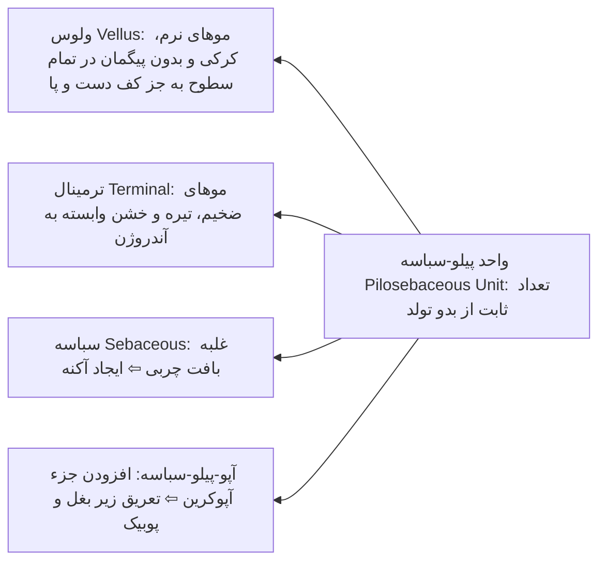
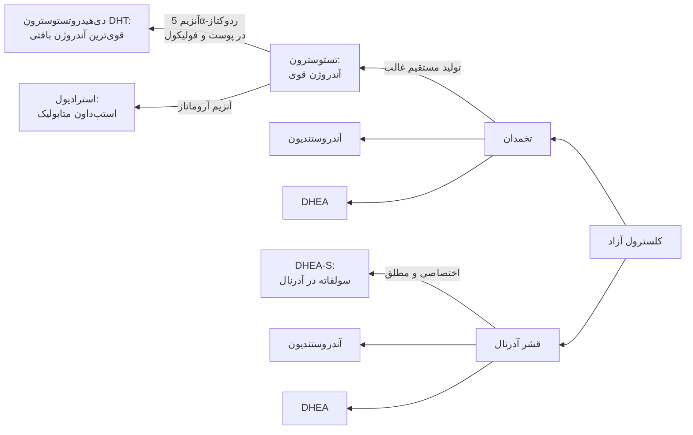
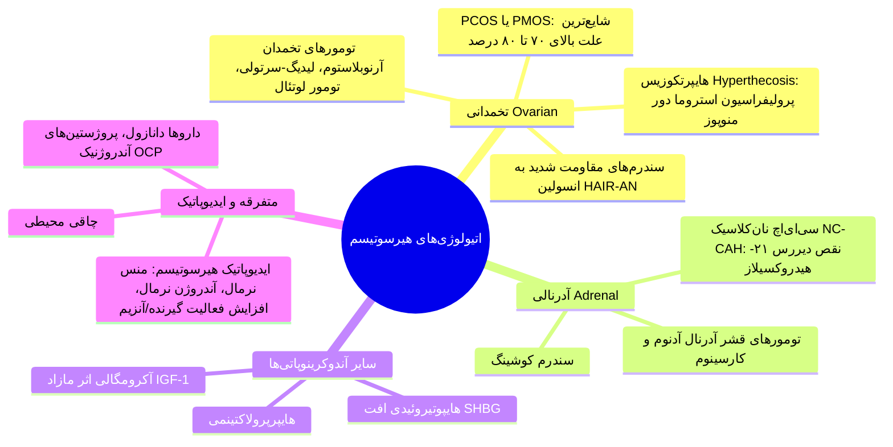
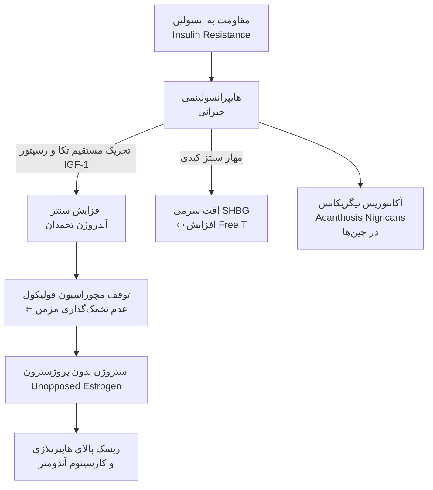
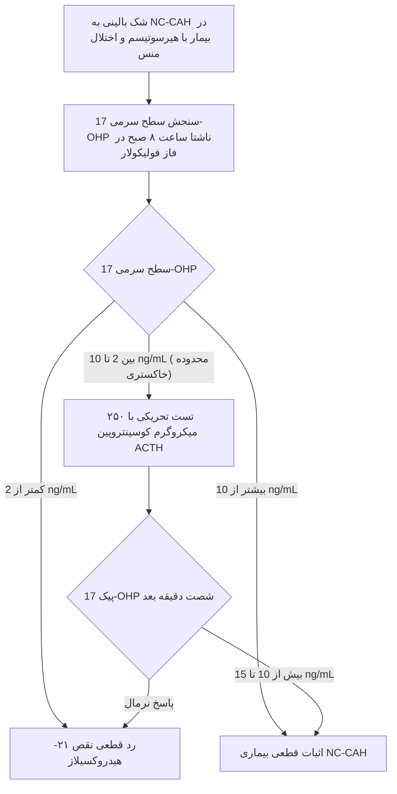
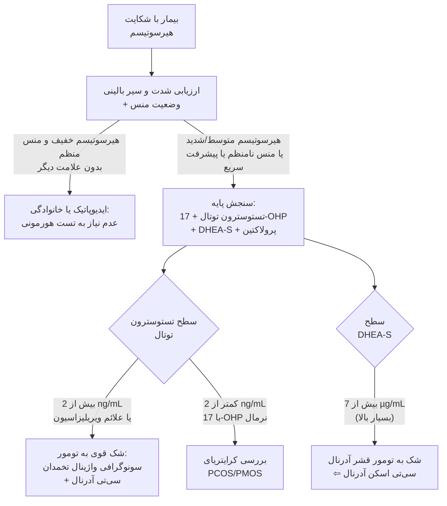
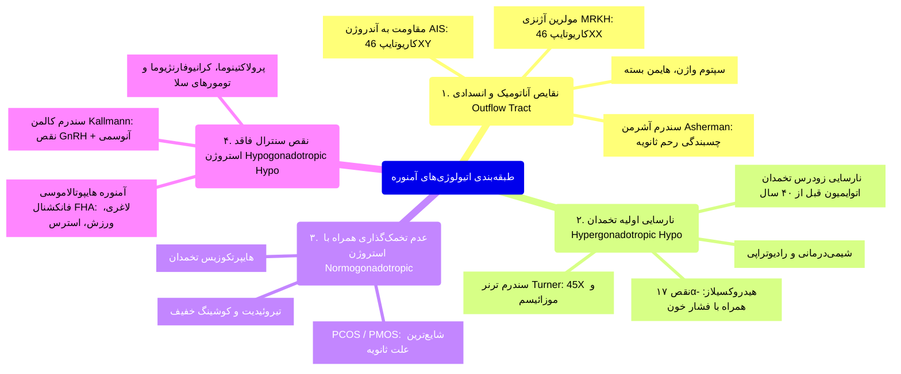
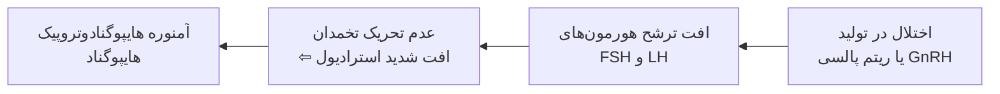
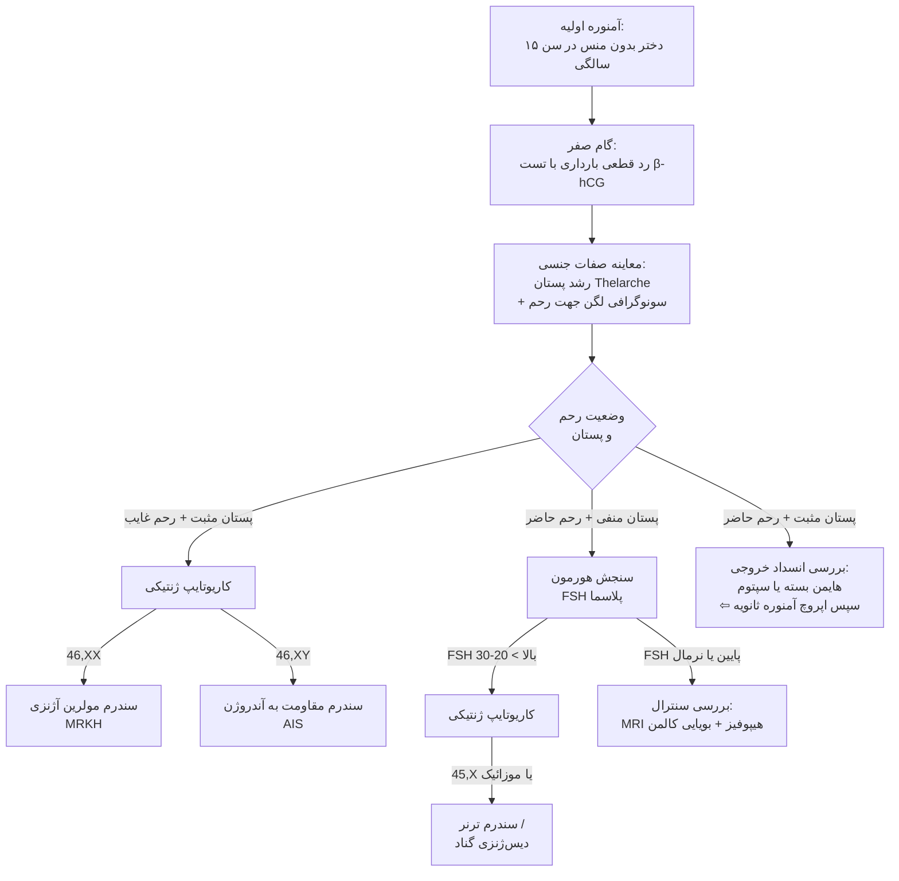

# اختلالات تمایز جنسی، هیپرآندروژنیسم، هیرسوتیسم و آمنوره

## ۱. بیولوژی فولیکول مو و پاتوفیزیولوژی رویش مو

> [!definition] هیرسوتیسم (Hirsutism)
> رویش غیرطبیعی موهای زبر، ضخیم و رنگدانه‌دار با الگوی مردانه (Male Pattern) در نواحی حساس به آندروژن بدن زنان (صورت، سینه، خط وسط شکم، پشت و ران‌ها)؛ شیوع در جامعه: **حدود ۱۰٪ زنان**.

> [!definition] هایپرتریکوز (Hypertrichosis)
> افزایش منتشر و عمومی موهای نازک، کرکی و فاقد رنگدانه تیپ ولوس (Vellus) در سراسر بدن بدون الگوی وابسته به آندروژن؛ ناشی از داروها (**ماینوکسیدیل، سایکلوسپورین، فنی‌توئین**) یا بیماری‌های سیستمیک (**آنورکسیا نرووزا، هایپوتیروئیدی، پورفیری**).

### ریتم و سیکل رشد مو

* **پترن موزائیک (Mosaic Pattern):** فولیکول‌های مجاور در فازهای رشد ناهمزمان هستند؛ مانع از طاسی یا کچلی موضعی ناگهانی می‌شود (همزمانی پترن سبب ریزش یا رویش دسته‌ای مو می‌گردد).
* **انواع مو بر اساس تکامل:**
  1. **لانوگو (Lanugo):** موهای نرم جنینی در بدو تولد؛ پس از زایمان می‌ریزند.
  2. **ولوس (Vellus):** موهای نازک و بدون رنگدانه پیش از بلوغ در هر دو جنس.
  3. **ترمینال (Terminal):** موهای زبر، ضخیم، با پیگمان بالا؛ رویش در اثر آندروژن پس از بلوغ.
* **فازهای سه‌گانه چرخه رشد مو:**
  1. **فاز آناژن (Anagen):** فاز رشد فعال و طولانی، دارای خونرسانی متراکم؛ **تارگت اصلی اثر هورمون‌ها و داروها**.
  2. **فاز کاتاژن (Catagen):** فاز پسرفت و گذرا؛ تحلیل خونرسانی و جدا شدن پاپیلا.
  3. **فاز تلوژن (Telogen):** فاز استراحت و ریزش مو (Exogen).

> [!important] اثر پارادوکسیکال آندروژن بر پوست سر در برابر بدن
> آندروژن‌ها در پوست صورت و تنه، موهای ولوس را به ترمینال تبدیل می‌کنند (هیرسوتیسم) و فاز آناژن را طولانی می‌سازند؛ اما در **پوست سر (Scalp)** برعکس عمل کرده و موهای ضخیم ترمینال را به موهای نازک ولوس تبدیل می‌کنند ⇦ **طاسی با الگوی مردانه (Androgenic Alopecia)**.

---

## ۲. هورمون‌شناسی آندروژن‌ها و منابع تولید در زنان

### تعدیل‌کننده‌های کلیدی اثر آندروژن (Modulators)

* **آنزیم 5α-Reductase (گام افزایش اثر / Step-up):** تبدیل موضعی تستوسترون به دی‌هیدروتستوسترون (DHT) در پوست و فولیکول مو؛ فعالیت آن توسط **ژنوم فرد، فاکتورهای IGF-1 و خودِ آندروژن‌ها** تشدید می‌شود.
* **پروتئین SHBG (Sex Hormone-Binding Globulin):** تستوسترون را در گردش خون باند و غیرفعال نگه می‌دارد:
  * **کاهش SHBG:** چاقی، مقاومت به انسولین، آندروژن‌ها، کورتون ⇦ **افزایش کسر آزاد تستوسترون (Free T)** ⇦ تشدید هیرسوتیسم.
  * **افزایش SHBG:** استروژن‌ها (قرص OCP)، بارداری، هایپرتیروئیدی ⇦ **کاهش Free T** ⇦ بهبود هیرسوتیسم.

> [!tip] سرنخ تشخیصی مبدأ آندروژن از روی آزمایش
> * **تستوسترون بسیار بالا:** منشأ تخمدانی (آدنوم، لوتئوم، تومور لیدیگ/سرتولی یا PCOS شدید).
> * **DHEA-S بسیار بالا:** منشأ قشر آدرنال (تومور آدرنال یا نقایص آنزیمی شدید).
> * **آندروستندیون بالا:** منشأ مشترک تخمدان و آدرنال.
> * *تله امتحانی:* هیچ ارتباط خطی مستقیمی بین شدت هیرسوتیسم و سطح سرمی آندروژن وجود ندارد (به دلیل واریانس ژنتیکی حساسیت فولیکول و فعالیت 5α-ردوکتاز).

---

## ۳. اتیولوژی‌های هیرسوتیسم و سندرم تخمدان پلی‌کیستیک (PCOS / PMOS)

### سندرم تخمدان پلی‌کیستیک نوین (PCOS ⇦ PMOS)

* **تغییر نام سال جاری:** از PCOS به **PMOS (Polyendocrine Metabolic Ovarian Syndrome)** تغییر نام یافت تا تأکید شود بیماری صرفاً اختلال تخمدان نیست؛ بلکه ناهنجاری متابولیک چندسیستمی شامل **مقاومت به انسولین، ریسک دیابت نوع ۲، آترواسکلروز عروقی، چاقی، دیس‌لیپیدمی و اختلالات روان** است.
* **یافته‌های هورمونی شاخص:**
  1. افزایش ترشح پالسی و فرکانس GnRH ⇦ **افزایش شدید نسبت LH به FSH**.
  2. تحریک سلول‌های تکا (Theca) توسط LH ⇦ سنتز مازاد آندروستندیون و تستوسترون فراتر از ظرفیت آروماتاز سلول‌های گرانولوزا.
  3. افزایش استروژن کل با غلبه **استرون (E1)** بر استرادیول (E2) به علت آروماتیزاسیون محیطی آندروژن‌ها در چربی.
  4. ترشح هورمون اینهیبین (Inhibin) طبیعی است.

### معیارهای تشخیصی سه‌گانه معتبر PCOS (معیارهای روتردام ۲۰۰۳)
تشخیص نیازمند حضور حداقل **۲ مورد از ۳ معیار زیر** پس از رد سایر بیماری‌ها (Diagnosis of Exclusion) است:
1. **عدم تخمک‌گذاری مزمن یا اولیگواوولاسیون (Oligo/Anovulation):** سیکل‌های قاعدگی با فواصل بیش از ۳۵ روز یا کمتر از ۸ سیکل در سال.
2. **شواهد بالینی یا آزمایشگاهی هایپرآندروژنیسم:** هیرسوتیسم، آکنه شدید، آلوپسی مردانه یا افزایش سطح تستوسترون.
3. **نمای سونوگرافیک تخمدان پلی‌کیستیک (PCO Morphology):** حضور حداقل ۱۲ فولیکول ریز با قطر ۲ تا ۹ میلی‌متر در پریفری و کورتکس تخمدان (نمای گردنبند مروارید / Pearl necklace) یا افزایش حجم تخمدان به بیش از ۱۰ میلی‌لیتر.

> [!important] علت ایجاد آکانتوزیس نیگریکانس (Acanthosis Nigricans)
> در مقاومت به انسولین، تنها مسیر انتقال گلوکز (GLUT-4) مهار شده اما گیرنده‌های میتوژنیک و هیبریدی انسولین/IGF-1 در پوست کاملاً فعال می‌مانند؛ سیلاب انسولین سبب تکثیر کراتینوسیت‌ها و پلاک‌های مخملی تیره در گردن و زیربغل می‌شود.

---

## ۴. هیپرپلازی مادرزادی آدرنال غیرکلاسیک (Non-Classic CAH)

* **نقص آنزیمی:** کمبود نسبی و خفیف آنزیم **۲۱-هیدروکسیلاز (CYP21A2)**؛ فعالیت باقیمانده آنزیم حدود **۲۰ تا ۵۰ درصد** است (در فرم کلاسیک نوزادی زیر ۲٪ است).
* **اپیدمیولوژی:** شایع در نژادهای **یهودیان اشکنازی، هیسپانیک‌ها و یوگوسلاوها**.
* **تظاهر بالینی:** حوالی بلوغ و اوایل جوانی با **رویش زودرس موی پوبیک (Premature Pubarche)، آکنه شدید، هیرسوتیسم، تسریع سن استخوانی (Advanced Bone Age) و اولیگومنوره**؛ کاملاً مشابه فنوتیپ PCOS!

---

## ۵. رویکرد بالینی و تشخیصی به هیرسوتیسم

### ۱. سیستم نمره‌دهی فریمن-گالوی (Ferriman-Gallwey Score)
* ارزیابی **۹ ناحیه حساس به آندروژن:** پشت لب فوقانی، چانه، قفسه سینه، بالای شکم، پایین شکم، بازو، ران، بالای پشت و پایین پشت.
* نمره‌دهی به هر ناحیه از **۰ (فقدان موی ترمینال)** تا **۴ (رویش کاملاً مردانه متراکم)**.
* **نمره کل ≥ ۸:** اثبات بالینی وجود **هیرسوتیسم**.

### ۲. پرچم‌های قرمز دال بر تومور و بدخیمی (Red Flags)
1. **شروع دیرهنگام در دهه ۳ به بعد** (دور از زمان منارک و بلوغ).
2. **سیر پیشرفت فوق‌العاده سریع و برق‌آسا** (ظرف چند هفته تا چند ماه).
3. **بروز علائم ویریلیزاسیون (Virilization):** بم شدن صدا، کلیتورومگالی، تحلیل بافت پستان، ریزش موی فرونتال و هیکل عضلانی مردانه.

### ۳. اصول درمانی فارماکوتراپی هیرسوتیسم
* **زمان پاسخ بالینی:** به علت طول دوره فاز آناژن، هرگونه پاسخ بالینی به داروها نیازمند حداقل **۶ تا ۹ ماه** مصرف مداوم است.
* **قرص‌های ضد بارداری خوراکی (OCPs - خط اول):** جزء استروژنی سبب افزایش SHBG و جزء پروژسترونی سبب مهار LH می‌شود (ترکیبات دارای پروژستین آنتی‌آندروژنیک نظیر **سیپروترون کامپاند یا دروسپیرنون** ارجح هستند).
* **آنتی‌آندروژن‌ها (مهار گیرنده):**
  * **اسپیرونولاکتون (Spironolactone):** بلوک گیرنده آندروژن + مهار آنزیم 5α-ردوکتاز و کاهش سنتز آدرنال (دوز ۵۰ تا ۲۰۰ میلی‌گرم؛ پایش پتاسیم).
  * **سیپروترون استات (Cyproterone acetate):** پروژستین با خاصیت مهارکننده مستقیم گیرنده.
  * **فلوتاماید (Flutamide):** به دلیل سمیت شدید کبدی خط روتین نیست.
* **مهارکننده‌های 5α-ردوکتاز:** **فیناستراید (Finasteride)** یا دوتاستراید؛ مهار تبدیل تستوسترون به DHT (موثر در آلوپسی و هیرسوتیسم؛ کنترااندیکاسیون مطلق در بارداری به دلیل نقص تناسلی جنین پسر).
* **گلوکوکورتیکوئیدها (دگزامتازون/پردنیزولون دوز پایین):** درمان اختصاصی برای **NC-CAH** جهت سرکوب فیدبکی ترشح ACTH.
* **حساس‌کننده‌های انسولین (متفورمین):** در PCOS اختلالات قاعدگی و تخمک‌گذاری را اصلاح می‌کند اما اثرات آن بر بهبود هیرسوتیسم بسیار ناچیز است (رژیم کم‌کالری و ورزش اثری معادل یا فراتر از متفورمین دارد).

---

## ۶. آمنوره (Amenorrhea) و بلوغ جنسی

> [!definition] آمنوره اولیه (Primary Amenorrhea)
> ۱) عدم وقوع منارک تا سن **۱۵ تا ۱۶ سالگی** در حضور صفات ثانویه جنسی طبیعی؛ یا  
> ۲) عدم وقوع منارک تا سن **۱۳ سالگی** در صورت غیبت کامل علائم بلوغ جنسی (رشد پستان).

> [!definition] آمنوره ثانویه (Secondary Amenorrhea)
> قطع قاعدگی به مدت **حداقل ۳ دوره متوالی** (یا ۶ ماه) در خانمی که قبلاً خونریزی‌های ماهانه داشته است.

> [!definition] تأخیر بلوغ (Delayed Puberty)
> عدم پیدایش اولین نشانه‌های صفات ثانویه جنسی دختران (جوانه‌زدن پستان یا Thelarche) تا سن **۱۲ تا ۱۳ سالگی** (در پسران: عدم افزایش حجم بیضه تا ۱۴ سالگی).

### فیزیولوژی تکامل جنسی و سیکل قاعدگی
* **استیجینگ تانر (Tanner Stages):** جوانه زدن پستان (**Thelarche**) وابسته به **استروژن تخمدانی** و نخستین علامت بلوغ است. رشد موی پوبیک (**Pubarche**) وابسته به **آندروژن آدرنال (Adrenarche)** است.
* **تغییرات هورمونی سیکل:** فاز فولیکولار (غلیان استروژن و تکثیر آندومتر) ⇦ سرج تخمک‌گذاری LH در نیمه سیکل (روز ۱۴) ⇦ فاز لوتئال (ترشح پروژسترون از جسم زرد و بالا رفتن دمای پایه بدن به میزان ۰.۵ تا ۱ درجه) ⇦ افت هورمون‌ها و ریزش مخاط آندومتر.

---

## ۷. طبقه‌بندی پاتوفیزیولوژیک آمنوره

### مقایسه تفکیکی مهم: سندروم راکیتانسکی (MRKH) در برابر مقاومت به آندروژن (AIS)

| مشخصه بالینی و پاراکلینیک | سندرم مولرین آژنزی (MRKH / راکیتانسکی) | سندرم مقاومت کامل به آندروژن (CAIS / Testicular Fem.) |
| :--- | :--- | :--- |
| **کاریوتایپ ژنتیکی** | **46,XX (زن ژنتیکی)** | **46,XY (مرد ژنتیکی)** |
| **گنادهای بیمار** | **تخمدان‌های کاملاً طبیعی و عملکردی** | **بیضه‌ها (تستیس داخل شکم یا کانال اینگوینال)** |
| **تکامل پستان (Thelarche)** | **طبیعی (زنانه بالغ)** | **طبیعی و برجسته** (آروماتیزاسیون T بالا به استروژن) |
| **موی آگزیلاری و پوبیک** | **کاملاً طبیعی** (وابسته به آندروژن‌های آدرنال) | **بسیار اندک یا کاملاً غایب (Hairless Women)** |
| **وضعیت رحم و لوله‌ها** | **غایب یا تحلیل‌رفته** (نقص تکامل مولرین) | **غایب** (به دلیل ترشح نرمال هورمون AMH/MIF از بیضه‌ها) |
| **طول واژن** | کوتاه یا کور (Blind pouch) | کوتاه و بن‌بست |
| **سطح تستوسترون پلاسما** | در محدوده طبیعی **زنان** | در محدوده طبیعی یا بالای **مردان** |
| **تظاهر اولیه بالینی** | **آمنوره اولیه** در سنین بلوغ | آمنوره اولیه یا هرنی اینگوینال در نوزادی حاوی بیضه |

> [!danger] سندرم آشرمن (Asherman Syndrome)
> علت اکتسابی انسدادی آمنوره ثانویه؛ ناشی از **کورتاژ خشن و غیرتخصصی رحم** (متعاقب سقط عفونی، خونریزی بعد زایمان یا سل اندومتریال) ⇦ تخریب لایه بازالیس و ایجاد **باندهای فیبروزه چسبنده رحمی (Synechiae)**. تخمدان‌ها و ترشح هورمون‌های استروژن و پروژسترون کاملاً طبیعی است اما آندومتر قادر به تکثیر و ریزش نیست. تشخیص با **هیستروسالپنگوگرافی (HSG) یا هیستروسکوپی**.

---

## ۸. نارسایی اولیه تخمدان (POI) و سندرم ترنر

* **پروفایل آزمایشگاهی (Hypergonadotropic Hypogonadism):** سطح **FSH و LH به شدت بالا**، همراه‌با **استرادیول (E2) بسیار پایین**.
* **سندرم ترنر (Turner Syndrome):**
  * **ژنتیک:** کاریوتایپ کلاسیک **45,X** یا فرم‌های موزائیسم (**45,X/46,XX**). در فرم موزائیسم ممکن است منارک گذرا رخ دهد.
  * **گناد:** تخمدان‌ها به نوارهای فیبروزه فاقد فولیکول (**Streak Gonads**) تبدیل می‌شوند.
  * **استیگمات‌های سوماتیک کلاسیک:** کوتاهی قد (شایع‌ترین تظاهر)، گردن پره‌دار (Webbed Neck)، خط رویش موی پایین پشت سر، فاصله زیاد نیپل‌ها (Shield Chest)، کوبیتوس والگوس آرنج، کوتاهی متاکارپ ۴ و ۵.
  * **همراهی‌ها:** کوآرکتاسیون آئورت، تیروئیدیت هاشیموتو و بیماری‌های کلیوی.

---

## ۹. آمنوره سنترال و هایپوتالاموسی (Hypogonadotropic Hypogonadism)

### ۱. آمنوره هایپوتالاموسی فانکشنال (FHA)
* **اتیولوژی:** رژیم‌های لاغری سخت با کاهش شدید چربی بدن، **بی‌ام‌آی کمتر از ۱۹** (افت هورمون محرک لپتین)، ورزش‌های استقامتی سنگین (دونده‌های ماراتن، رقصنده‌های باله) و استرس‌های روانی شدید.
* **پاتولوژی:** بازگشت ریتم ترشح GnRH به الگوی پیش از بلوغ؛ عدم تحریک هیپوفیز ⇦ **پوکی استخوان زودرس ناشی از کمبود مطلق استروژن**.

### ۲. سندرم کالمن (Kallmann Syndrome)
* نقص مادرزادی در ژن‌های مهاجرت نورونی؛ همراهی **کمبود هورمون GnRH با فقدان بویایی (Anosmia یا Hyposmia)**؛ تظاهر با تأخیر بلوغ و آمنوره اولیه.

### ۳. پرولاکتینوما و تومورهای هیپوفیز
* افزایش پرولاکتین به طور مستقیم ترشح پالسی GnRH را مهار می‌کند ⇦ اولیگومنوره، آمنوره و گالاکتوره؛ **سطح TSH و T4 جهت رد هایپوتیروئیدی اولیه همراه ارزیابی شود** (افزایش TRH محرک پرولاکتین است).

---

## ۱۰. الگوریتم تشخیصی گام‌به‌گام آمنوره اولیه

---

## ۱۱. الگوریتم تشخیصی آمنوره ثانویه و تست چالش هورمونی

```mermaid
flowchart TD

SecA[آمنوره ثانویه:<br>قطع منس حداقل ۳ ماه] --> RulePreg[گام اول:<br>رد قطعی بارداری با تست β-hCG]
RulePreg --> ScreenLabs[گام دوم:<br>سنجش آزمایشگاهی<br>TSH + پرولاکتین + FSH]

ScreenLabs -->|TSH غیرطبیعی| TreatThy[بیماری تیروئید]
ScreenLabs -->|PRL بالا| WorkupPRL[ارزیابی پرولاکتینوما /<br>MRI سلا]
ScreenLabs -->|FSH بسیار بالا| POI_Diag[نارسایی اولیه تخمدان<br>POI]

ScreenLabs -->|تست‌ها نرمال| ProgestChal[گام سوم:<br>تست چالش پروژسترون<br>مدروکسی‌پروژسترون ۱۰ میلی‌گرم<br>خوراکی روزانه به مدت ۵ تا ۱۰ روز]

ProgestChal --> BleedResp{وقوع خونریزی<br>ظرف ۲ تا ۷ روز بعد؟}

BleedResp -->|پاسخ مثبت: وقوع خونریزی| AnovE[اثبات ترشح استروژن<br>+ عدم تخمک‌گذاری مزمن<br>تشخیص: PCOS/PMOS]

BleedResp -->|پاسخ منفی: عدم خونریزی| EstProChal[گام چهارم:<br>تست ترکیبی استروژن + پروژسترون<br>استروژن ۲۱ روز<br>+ پروژسترون ۷ روز آخر]

EstProChal --> BleedResp2{وقوع خونریزی؟}
BleedResp2 -->|پاسخ منفی: باز هم عدم خونریزی| Ash[نقص ساختاری آندومتر:<br>سندرم آشرمن Asherman]
BleedResp2 -->|پاسخ مثبت: وقوع خونریزی| HypoEst[فقدان مطلق استروژن در بیمار<br>تفکیک POI از نقص سنترال/FHA<br>با بررسی مجدد سطح FSH]
```

---

## ۱۲. عوارض بالینی و اصول مدیریت آمنوره

> [!important] تفاوت حیاتی ریسک‌های درازمدت آمنوره بر اساس وضعیت استروژن
> * **آمنوره همراه با کمبود شدید استروژن (ترنر، POI، آمنوره هایپوتالاموسی FHA):** استعداد فوق‌العاده بالا به **استئوپروز و شکستگی‌های استخوانی**، آتروفی واژن و بیماری‌های قلبی-عروقی زودرس ⇦ نیازمند **درمان جایگزینی مداوم هورمونی (HRT)** تا سن یائسگی فیزیولوژیک (~۵۰ سالگی).
> * **آمنوره همراه با حضور استروژن بدون پروژسترون (PCOS/PMOS):** به دلیل فقدان تخمک‌گذاری و عدم ترشح پروژسترون، آندومتر تحت تحریک مداوم و بدون مهار استروژن (Unopposed Estrogen) تکثیر می‌یابد ⇦ استعداد شدید به **هایپرپلازی و کارسینوم آندومتر** ⇦ الزام به تجویز دوره‌ای پروژسترون جهت القای ریزش مخاط.

### درمان بر اساس هدف بالینی و اتیولوژی
1. **اصلاح نقایص آناتومیک:** جراحی باز کردن هایمن یا برداشتن سپتوم واژینال؛ هیستروسکوپی جهت آزاد کردن چسبندگی‌های آشرمن.
2. **پیشگیری از پوکی استخوان در هایپواستروژنیسم:** تجویز ترکیبی استروژن (جهت حفظ اسکلت و واژن) و پروژسترون (در صورت وجود رحم، جهت ممانعت از سرطان آندومتر).
3. **تحریک تخمک‌گذاری در صورت تمایل به بارداری در PCOS:** خط اول داروی مهارکننده آروماتاز (**لتروزول - Letrozole**) یا کلومیفن سیترات؛ کاهش وزن و اصلاح سبک زندگی؛ در صورت عدم پاسخ: گنادوتروپین‌های تزریقی (FSH/hCG).

---

## ۱۳. تابلوی جامع مقایسه‌ای سناریوهای بالینی و تله‌های امتحانی

| سناریوی بالینی بیمار | یافته‌های آزمایشگاهی و تصویربرداری | تشخیص پاتولوژیک قطعی | اقدام تشخیصی/درمانی صحیح |
| :--- | :--- | :--- | :--- |
| **دختر ۱۸ ساله با موهای ضخیم چانه، آکنه و منس با فواصل ۴۵ روزه** | تستوسترون توتال $1.2\text{ ng/mL}$ و سونوگرافی: فولیکول‌های ریز محیطی | **سندرم تخمدان پلی‌کیستیک (PCOS/PMOS)** | شروع OCP ضدآندروژن + کاهش وزن و اصلاح سبک زندگی |
| **خانم ۳۲ ساله با هیرسوتیسم، پره‌های بینی پر از مو، افزایش ناگهانی وزن** | تستوسترون $0.9\text{ ng/mL}$ و عدم مهار در تست دگزامتازون شبانه | **سندرم کوشینگ** | سنجش سطح ACTH پلاسما جهت تعیین منشأ |
| **زن ۲۵ ساله با کلفت شدن صدا، کلیتورومگالی و هیرسوتیسم سریع طی ۳ ماه** | تستوسترون توتال $3.8\text{ ng/mL}$ | **تومور آندروژن‌ساز تخمدان یا آدرنال** | سونوگرافی واژینال تخمدان + سی‌تی‌اسکن با پروتکل آدرنال |
| **دختر ۱۶ ساله با آکنه شدید، هیرسوتیسم و تسریع سن استخوانی از بلوغ** | سطح پایه هورمون 17-OHP برابر $14\text{ ng/mL}$ | **سی‌ای‌اچ غیرکلاسیک (NC-CAH)** | تجویز گلوکوکورتیکوئید دوز پایین جهت سرکوب ACTH |
| **خانم ۲۸ ساله با آمنوره ثانویه پس از کورتاژ خشن سقط عفونی** | عدم خونریزی پس از چالش استروژن + پروژسترون | **سندرم آشرمن (Asherman Syndrome)** | هیستروسکوپی جهت دایسکشن چسبندگی‌های رحمی |
| **دختر ۱۶ ساله با فقدان منس، قد کوتاه، گردن پره‌دار و پستان‌های رشدنیافته** | سطح FSH برابر $65\text{ mIU/mL}$ | **سندرم ترنر (Turner Syndrome)** | انجام کاریوتایپ ژنتیکی و اکوکاردیوگرافی قلب |
| **ورزشکار دونده ماراتن ۲۰ ساله با آمنوره و شکستگی استرسی متاتارس** | سطح FSH نرمال پایین، استرادیول بسیار پایین، BMI=17 | **آمنوره هایپوتالاموسی فانکشنال (FHA)** | تعدیل شدت تمرینات، افزایش کالری دریافتی و HRT |
| **دختر ۱۷ ساله زیبا با رشد عالی پستان، فقدان کامل موی پوبیک و واژن کور** | کاریوتایپ 46,XY و تستوسترون در رنج مردانه | **سندرم مقاومت به آندروژن (CAIS)** | گنادکتومی لاپاروسکوپیک بیضه‌ها به دلیل خطر بدخیمی |
| **دختر ۱۶ ساله با رشد طبیعی پستان و موی پوبیک، اما عدم لمس رحم در سونو** | کاریوتایپ 46,XX و سطح طبیعی استرادیول و تستوسترون | **سندرم مولرین آژنزی (MRKH / راکیتانسکی)** | بازسازی واژن در سنین بلوغ؛ اطمینان از عملکرد تخمدان |
