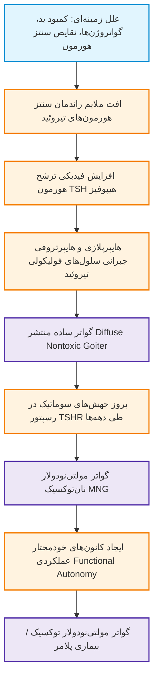
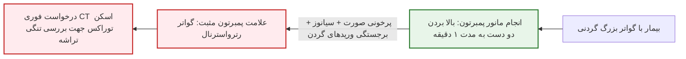
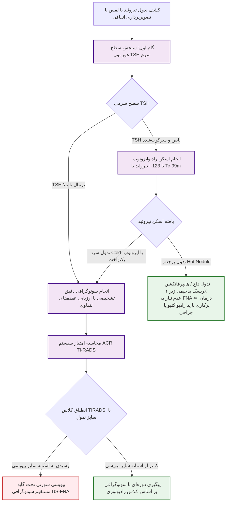
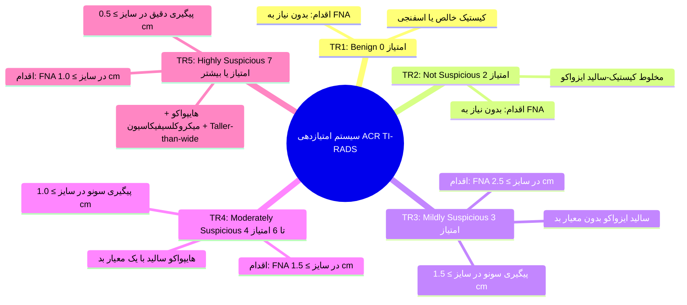
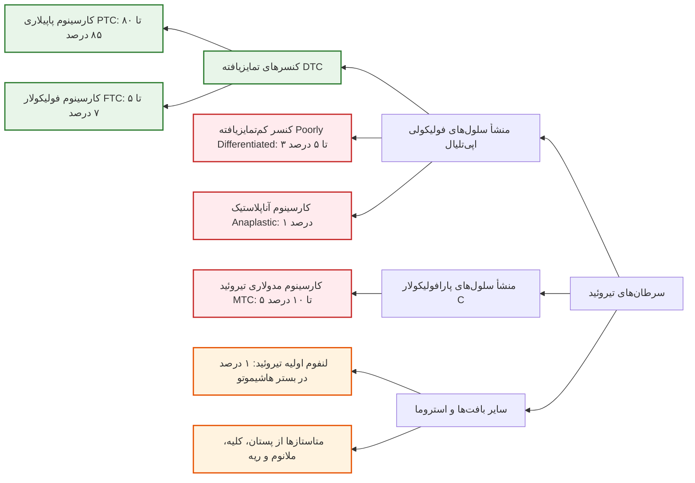
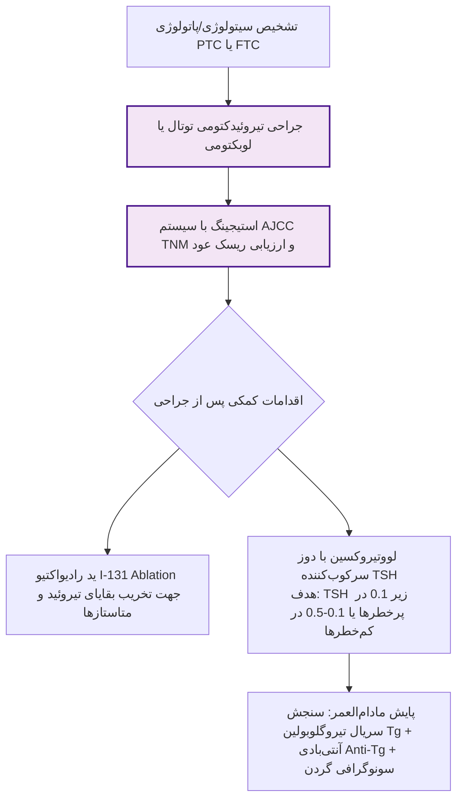

# گواتر، ندول‌های تیروئید، سیستم‌های TIRADS و بتسدا، و انکولوژی تیروئید

## 1. گواتر (Goiter): تعاریف، پاتوفیزیولوژی و اتیولوژی

> [!definition] گواتر (Goiter)
> هرگونه بزرگی غیرطبیعی کل غده تیروئید بیش از وزن استاندارد **15 تا 25 گرم**؛ ناشی از تکثیر بیش از حد سلول‌های اپی‌تلیال فولیکولی.

* **طبقه‌بندی اپیدمیولوژیک گواتر:**
  1. **گواتر اندمیک (Endemic Goiter):** درگیری **بیش از 5% جمعیت یک منطقه جغرافیایی**؛ علت اصلی: کمبود ید محیطی (Iodine Deficiency).
  2. **گواتر اسپورادیک (Sporadic Goiter):** شیوع کمتر از 5% در مناطق با کفایت ید؛ علت ناشی از عوامل ژنتیکی، خودایمنی یا گواتروژن‌ها.
* **گواتر نان‌توکسیک (Nontoxic Goiter):** بزرگی تیروئید (منتشر یا ندولار) که با **پرکاری یا کم‌کاری بالینی تیروئید همراه نیست** و تست‌های عملکردی (TSH و FT4) کاملاً طبیعی هستند.
* **پاتوفیزیولوژی گواتر در بیماری گریوز:** بزرگی تیروئید برخلاف سایر موارد ناشی از TSH نیست، بلکه تحت اثر مستقیم آنتی‌بادی‌های محرک گیرنده TSH بنام **TSI / TRAb** رخ می‌دهد.

### جدول جامع عوامل مستعدکننده گواتروژنز (Goitrogenesis)

| منشأ عامل گواتروژن | ماده مسبب | مثال‌ها و شرایط بالینی |
| :--- | :--- | :--- |
| **دریافت ید (Iodine)** | کمبود شدید ید یا دریافت مازاد مفرط | مناطق جغرافیایی کوهستانی اندمیک؛ مصرف نمک تصفیه‌نشده یا لود ناگهانی ید |
| **مواد شیمیایی** | **تیوسیانات (Thiocyanate)** | **دود سیگار** و تنباکو |
| **مواد غذایی** | **گلوکوزینولات‌ها (Glucosinolates)** **فلاونوئیدها (Flavonoids)** | **سبزیجات خانواده کلم** (Cruciferous vegetables) **سویا** (مصرف روزانه و مقادیر مفرط) |
| **داروها** | **لیتیوم (Lithium)** | داروی تثبیت‌کننده خلق (Mood stabilizer)؛ مهارکننده رهایش هورمون |
| **آلاینده‌ها** | **نیترات‌ها (Nitrates)** | کودهای شیمیایی غنی از ازت و نفوذ به آب آشامیدنی |
| **کمبود ریزمغذی‌ها** | فقر سلنیوم، کمبود آهن، کمبود ویتامین A | بیماران تحت تغذیه کامل وریدی (TPN)، آنمی فقر آهن شدید |
| **تغییرات هورمونی** | **افزایش هورمون IGF-1** | بیماران مبتلا به **آکرومگالی** (رشد همزمان ارگان‌ها و ندولار شدن تیروئید) |
| **فاکتورهای ژنتیک** | جهش‌ها و پلی‌مورفیسم‌های ژنی | موتاسیون‌های مغلوب یا غالب اتوزومال خانوادگی |

> [!important] بارداری به عنوان یک وضعیت گواتروژنیک فیزیولوژیک
> بارداری طبیعی پدیده‌ای گواتروژن است، به‌ویژه در زنانی که از قبل اختلال زمینه‌ای تیروئید داشته‌اند:
> 1. در سه‌ماهه اول بارداری، هورمون جفتی **hCG** به دلیل تشابه ساختاری زیرواحدها با گیرنده TSH واکنش متقاطع داده و سبب تحریک تیروئید می‌شود.
> 2. در زمان زایمان، سطح TSH سرم مادر مختصراً افزایش می‌یابد.
> 3. **مولتی‌پاریتی (تعداد دفعات بارداری مکرر):** ریسک ایجاد گواتر و ندول‌های بعدی در سنین بالاتر را افزایش می‌دهد.

---

## 2. تظاهرات بالینی، عوارض و معاینه گواتر

* **تظاهر بالینی شایع:** **بی‌علامتی کامل** در اکثر بیماران مبتلا به گواتر ساده یا MNG نان‌توکسیک؛ کشف اتفاقی در معاینه روتین گردن.
* **عوارض فشاری گواترهای حجیم بر ساختارهای مجاور (Compressive Symptoms):**
  1. **فشار بر تراشه (Tracheal compression):** احساس تنگی نفس (Dyspnea)، سرفه تحریکی، استریدور تنفسی (علامت بسیار خطرناک)، انحراف تراشه (Tracheal deviation) در رادیوگرافی.
  2. **فشار بر مری (Esophageal compression):** اشکال در بلع مواد جامد (دیسفاژی / Dysphagia).
  3. **فشار بر عصب راجعه حنجره (RLN compression):** خشونت صدا (Hoarseness).
  4. **فشار بر زنجیره سمپاتیک گردنی:** سندرم هورنر (افتادگی پلک، میوزیس مردمک، فقدان تعریق یکطرفه).
  5. **فشار بر عروق خونی بزرگ:** برجستگی وریدها و اختلال تخلیه وریدی سر و گردن.

> [!danger] درد حاد ناگهانی در گواتر مولتی‌نودولار
> بروز درد شدید و ناگهانی قدام گردن در فردی که از گواتر خود اطلاعی نداشته یا گواتر ثابت داشته است، نشان‌دهنده **خونریزی حاد داخل یکی از ندول‌های تیروئید** است (Hemorrhage into a nodule).

* **مانور و علامت پمبرتون (Pemberton's Sign / Maneuver):**
  * نحوه اجرا: بالا بردن همزمان هر دو دست چسبیده به گوش‌ها به مدت 1 دقیقه.
  * پاسخ مثبت: ایجاد **پرخونی صورت (Facial plethora)**، سیانوز، برجستگی شدید وریدهای ژوگولار و جدار قفسه سینه، و تنگی نفس حاد.
  * اهمیت پاتولوژیک: اثبات قطعی ورود گواتر به مدیاستن و تنگه فوقانی قفسه سینه (**گواتر رترواسترنال / ساب‌استرنال**).

---

## 3. گواتر مولتی‌نودولار توکسیک (Toxic MNG / Plummer's Disease)

> [!definition] گواتر مولتی‌نودولار توکسیک (Toxic MNG)
> ایجاد خودمختاری عملکردی (Functional Autonomy) در بستر گواتر مولتی‌نودولار نان‌توکسیک طولانی‌مدت؛ شایع در افراد سالمند.

* **پاتوفیزیولوژی:** بروز جهش‌های سوماتیک در گیرنده TSH (TSHR) یا پروتئین Gsα در یک یا چند ندول ⇦ ترشح خودکار هورمون تیروئید بدون وابستگی به TSH.
* **تظاهرات بالینی:** تظاهر با پرکاری خفیف یا ساب‌کلینیکال؛ شایع‌ترین علائم در سالمندان: **آریتمی فیبریلاسیون دهلیزی (AF)**، تپش قلب و کاهش وزن تدریجی.
* **محرک‌های کریز تیروتوکسیکوز:** مواجهه با بار ناگهانی ید نظیر **تزریق ماده حاجب یددار رادیولوژی در سی‌تی‌اسکن یا آنژیوگرافی عروق کرونر**، یا مصرف داروی **آمیودارون** (پدیده جاد-بازدو / Jod-Basedow).
* **تابلوی آزمایشگاهی:** هورمون **TSH کاملاً سرکوب‌شده (<0.1 mU/L)**، سطح Free T4 نرمال یا مختصر بالا، و **افزایش نامتناسب سطح هورمون T3 (ایزوله T3-Toxicosis)**.

---

## 4. مدالیته‌های تصویربرداری و درمان گواتر نان‌توکسیک

### مقایسه مدالیته‌های تصویربرداری در بررسی گواتر

| ابزار تصویربرداری | مزایای اختصاصی | معایب و محدودیت‌ها |
| :--- | :--- | :--- |
| **اولتراسونوگرافی (Ultrasound)** | دسترسی وسیع، رزولوشن بسیار بالا، **فاقد اشعه یونیزان**، تصویر داینامیک، امکان بررسی فلوی عروقی داپلر، انجام بر بالین بیمار | **وابسته به مهارت اپراتور**، عدم ارائه اطلاعات از فانکشن هورمونی، **ناتوانی در بررسی گواترهای رترواسترنال** (پایین‌تر از استخوان استرنوم) |
| **سی‌تی‌اسکن (CT scan بدون کنتراست) / MRI** | **تصویربرداری انتخابی برای گواتر رترواسترنال**، ارزیابی دقیق تنگی مجرای تراشه و انحراف آن در مدیاستن | هزینه بالاتر، مواجهه با اشعه در CT، ممنوعیت تزریق کنتراست یددار به علت ریسک تیروتوکسیکوز حاد |

### استراتژی‌های درمانی گواتر نان‌توکسیک (Simple / MNG)
1. **درمان با لووتیروکسین ساپرسیو (Thyroxine Suppression Therapy):**
   * مکانیسم: مهار نسبی TSH جهت توقف محرک رشد بافت تیروئید.
   * اثربخشی: بیشتر در گواترهای کوچک و منتشر در مناطق کمبود ید پاسخ می‌دهد؛ در MNG اثر چندانی ندارد. دوره آزمایشی 6 تا 12 ماه؛ در صورت عدم کاهش حجم قطع می‌شود.
   * عوارض و خطرات: القای تیروتوکسیکوز ساب‌کلینیکال، آریتمی قلبی (AF)، **کاهش تراکم استخوان (BMD) و تشدید استئوپروز در زنان یائسه**.
   * *کنترااندیکاسیون قطعی:* **اگر سطح پایه TSH کمتر از 0.5 mU/L باشد، تجویز لووتیروکسین ساپرسیو اکیداً ممنوع است**.
2. **درمان جراحی (تیروئیدکتومی ساب‌توتال یا توتال):**
   * **درمان انتخابی در گواترهای بسیار حجیم، گواترهای رترواسترنال با اثر فشاری، استریدور و تنگی تراشه، یا MNG حاوی ندول مشکوک به بدخیمی**.
   * مزیت: دکامپرشن فوری راه‌های هوایی و دسترسی به نمونه کامل بافتی جهت پاتولوژی.
3. **ید رادیواکتیو (I-131):**
   * القای کاهش حجم چشمگیر تیروئید طی چند ماه؛ جایگزین انتخابی جراحی در افراد سالمند، مبتلایان به بیماری‌های شدید قلبی یا ریوی با ریسک بیهوشی بالا.

---

## 5. نودول‌های تیروئید (Thyroid Nodules): اپیدمیولوژی و پرچم‌های قرمز

> [!definition] نودول تیروئید (Thyroid Nodule)
> ضایعه مجزا و مشخص درون پارانشیم تیروئید با ساختار رادیولوژیک متفاوت از بافت طبیعی اطراف؛ شیوع با لمس بالینی **3 تا 7 درصد** و با سونوگرافی **حدود 50 درصد** بالغان جامعه.

* **ماهیت نودول‌ها:** بیش از **90 تا 95 درصد کل ندول‌ها کاملاً خوش‌خیم و بدون علامت هستند** و صرفاً با پیگیری دوره‌ای مدیریت می‌شوند.
* **معاینه فیزیکی:** تیروئید نرمال وزنی کمتر از 12-15 گرم دارد و در لمس غیرقابل لمس است.
  * لمس بالینی: قوام (نرم، سفت/Firm، چوبی/Hard، لاستیکی/Rubbery)، تقارن، اندازه و مرزها.
  * سمع با بل استتوسکوپ: وجود **Bruit تیروئید نشانه پاتوگنومونیک بیماری گریوز** است.
  * بررسی الزامی لمفادنوپاتی گردنی همزمان.

### پرچم‌های قرمز بدخیمی ندول تیروئید (Clinical Red Flags)

| دسته ارزیابی | فاکتورهای بالینی دال بر ریسک بالای بدخیمی |
| :--- | :--- |
| **سابقه فردی (Personal History)** | **سابقه رادیوتراپی یا تابش اشعه به سر و گردن قبل از 18 سالگی** (پرتودرمانی مانتل هوچکین، لوسمی، حوادث هسته‌ای) |
| **سابقه خانوادگی (Family History)** | سابقه کنسر پاپیلاری در ≥2 بستگان درجه یک، سابقه **MEN 2** یا کارسینوم مدولاری (MTC)، سندرم کاودن (Cowden / PTEN)، سندرم کارنی (Carney) |
| **سن و جنس (Demographics)** | سن کمتر از **20 سال** یا بیشتر از **65 تا 70 سال**؛ **جنس مذکر** (شیوع ندول در مردان کمتر ولی احتمال بدخیمی ندول کشف‌شده بسیار بالاتر است) |
| **سیر رشد (Growth Rate)** | رشد سریع، مداوم و بدون درد توده گردنی طی چند هفته تا چند ماه |
| **معاینه فیزیکی (Physical Exam)** | **ندول سفت، چوبی یا کاملاً فیکس (Fixed) به بافت‌های عمقی گردن**؛ لنفادنوپاتی سرویکال پایدار طرفی |
| **علائم عصبی (Nerve Signs)** | فلج طناب صوتی و خشونت صدای پایدار (Hoarseness) ناشی از تهاجم به عصب RLN |

---

## 6. الگوریتم تشخیصی آزمایشگاهی و تصویربرداری ندول تیروئید

> [!important] قواعد آزمایشگاهی تکمیلی در ارزیابی ندول
> 1. **اگر TSH نرمال باشد:** هیچ تست هورمونی دیگری (FT4 یا T3) نیاز نیست؛ مستقیماً سونوگرافی انجام می‌شود.
> 2. **اگر TSH بالا باشد:** اندازه‌گیری Free T4 و آنتی‌بادی **Anti-TPO** جهت تایید تیروئیدیت هاشیموتو الزامی است.
> 3. **مارکر کلسی‌تونین (Calcitonin):** در صورت شک بالینی یا سابقه فامیلی MTC/MEN2 الزامی و تشخیصی است.
> 4. **مارکر تیروگلوبولین (Tg):** در ارزیابی اولیه ندول‌های تیروئید **به هیچ وجه توصیه نمی‌شود** (اختصاصیت تشخیصی ندارد).

### پاتوفیزیولوژی ندول داغ (Hot Nodule / Toxic Adenoma)
* **تعریف:** ندول منفرد پرکار با جذب بالای ایزوتوپ که فعالیت کل بافت نرمال مجاور و طرف مقابل را سرکوب می‌کند.
* **مکانیسم مولکولی:** در بیش از **90% موارد** ناشی از جهش‌های سوماتیک فعال‌کننده در **گیرنده TSH (TSH-R)** یا زیرواحد **Gsα** است که منجر به افزایش دائمی cAMP و تکثیر سلولی می‌شود.
* **قانون طلایی بالینی:** **ندول‌های داغ تقریباً همیشه خوش‌خیم هستند (ریسک بدخیمی <1%) و انجام بیوپسی FNA در آن‌ها اکیداً ممنوع و غیرضروری است**.

---

## 7. ویژگی‌های سونوگرافی و سیستم امتیازدهی ACR TI-RADS

| مشخصه سونوگرافیک | ویژگی‌های منطبق بر خوش‌خیمی (Benign) | ویژگی‌های مشکوک به بدخیمی (Malignant) |
| :--- | :--- | :--- |
| **ترکیب بافتی (Composition)** | **اسفنجی‌شکل (Spongiform >50%)**، کیستیک خالص | **کاملاً سالید (Solid)** یا جزئی از کیستیک غیرمتقارن |
| **اکوژنیسیتی (Echogenicity)** | **هایپراکو (Hyperechoic)** یا ایزواکو در مقایسه با پارانشیم | **هایپواکو (Hypoechoic)** یا شدیداً هایپواکو (سیاه‌تر از عضلات گردن) |
| **حاشیه ندول (Margins)** | کاملاً صاف، منظم و مدور با **هاله هایپواکو کامل (Halo sign)** | **حاشیه نامنظم، لوبوله، زاویه‌دار یا اسپیکوله (Spiculated)** |
| **شکل هندسی (Shape)** | پهن‌تر از قد (Wider-than-tall) در مقطع عرضی | **قدبلندتر از پهنا (Taller-than-wide)** در مقطع عرضی ترانسورس |
| **کلسیفیکاسیون (Calcifications)** | کلسیفیکاسیون محیطی تخم‌مرغی یکدست (**Eggshell**)، ماکروکلسیفیکاسیون درشت | **میکروکلسیفیکاسیون نقطه‌ای (Punctate foci <1 mm)** دال بر اجسام پساموما |
| **عروق‌زایی (Vascularity)** | واسکولاریتی محیطی خالص (Peripheral halo flow) | **واسکولاریتی نامنظم داخل کانون ندول (Intranodular hypervascularity)** |
| **گسترش موضعی** | محدود به کپسول تیروئید | **تهاجم به خارج کپسول تیروئید (Extrathyroidal extension / ETE)** |

---

## 8. طبقه‌بندی سیتولوژی بتسدا (The Bethesda System v2)

> [!important] بیوپسی سوزنی ظریف (US-guided FNA)
> استاندارد طلایی و دقیق‌ترین روش تشخیصی برای تعیین ماهیت ندول تیروئید؛ انجام آن **الزاماً باید تحت گاید مستقیم اولتراسونوگرافی** صورت گیرد تا میزان نمونه‌های ناکافی به حداقل برسد.

| رده بتسدا | توصیف سیتوپاتولوژی | ریسک تخمینی بدخیمی | پروتکل اقدام بالینی استاندارد |
| :--- | :--- | :--- | :--- |
| **Bethesda I** | **غیرتشخیصی یا ناکافی (Nondiagnostic / Unsatisfactory)** به علت خونریزی، کلوئید خالص یا سلول اندک | **5 تا 10%** | **تکرار مجدد بیوپسی تحت گاید مستقیم سونوگرافی (Repeat US-FNA)** |
| **Bethesda II** | **خوش‌خیم (Benign)** شامل ندول کلوئیدی، آدنوماتوز، تیروئیدیت هاشیموتو | **0 تا 3%** | **پیگیری بالینی و سونوگرافی دوره‌ای** (عدم نیاز به جراحی یا اقدام مداخله‌ای) |
| **Bethesda III** | **آتیپی با اهمیت نامشخص (AUS / FLUS)** نقص ساختاری یا هسته‌ای مبهم | **10 تا 30%** | **تکرار US-FNA** یا تست‌های مولکولی تشخیصی (در صورت تکرار مجدد آتیپی ⇦ جراحی) |
| **Bethesda IV** | **نئوپلاسم فولیکولار یا مشکوک به آن (Follicular Neoplasm / SFN)** | **25 تا 40%** | **لوبکتومی تشخیصی جراحی** (سیتولوژی قادر به رد کارسینوم فولیکولار نیست) |
| **Bethesda V** | **مشکوک به بدخیمی (Suspicious for Malignancy / SUSP)** نمای شبیه PTC یا MTC | **50 تا 75%** | **جراحی تیروئیدکتومی توتال یا ساب‌توتال** |
| **Bethesda VI** | **بدخیم (Malignant)** پاپیلاری، مدولاری، آناپلاستیک یا لنفوم قطعی | **97 تا 99%** | **جراحی قطعی تیروئیدکتومی توتال + دایسکشن عقده‌های لنفاوی گردن** |

> [!danger] تله پاتولوژی سیتولوژی: چرا بتسدا IV نیازمند جراحی است؟
> سیتولوژی FNA حاصل مکش سلول‌های منفرد است. افتراق **کارسینومای فولیکولار (FTC)** از **آدنوم خوش‌خیم فولیکولار** منحصراً با **اثبات تهاجم به کپسول ندول (Capsular invasion) یا تهاجم به عروق خونی (Vascular invasion)** در برش کامل بافتی امکان‌پذیر است؛ بنابراین FNA به هیچ وجه قادر به تفکیک این دو نبوده و نمونه با عنوان بتسدا IV گزارش می‌شود که نیازمند رزکسیون جراحی لوبکتومی است.

---

## 9. انکولوژی تیروئید: پاتولوژی، ژنتیک و طبقه‌بندی بدخیمی‌ها

### ۱. کارسینوم پاپیلاری تیروئید (PTC)
* **اپیدمیولوژی:** شایع‌ترین بدخیمی تیروئید (**80 تا 85 درصد موارد**)؛ غلبه در خانم‌های جوان با پروگنوز عالی (بقا بالای 95%).
* **پاتولوژی کلاسیک:**
  * هسته‌های شفاف با ظاهر چشم یتیم آنی (**Orphan Annie eyes**).
  * شیارهای طولی هسته‌ای (**Nuclear grooves**) و سودواینکلوژن‌های داخل هسته‌ای.
  * اجسام پساموما (**Psammoma bodies** / رسوبات دوار کلسیمی ناشی از نکروز پاپیلاری).
* **مسیر انتشار:** عمدتاً از طریق **سیستم لنفاوی (Lymphatic spread)** به عقده‌های گردنی (متاستاز دوردست خونی کمتر از 5%).
* **واریانت‌های تهاجمی با پروگنوز بدتر:** واریانت سلول بلند (**Tall-cell**)، سلول ستونی (**Columnar-cell**)، و اسکلروزان منتشر (**Diffuse sclerosing**).
* **مارکرهای ژنتیکی:**
  * جهش نقطه‌ای **BRAF V600E** (در 60% موارد؛ شایع‌ترین جهش، مرتبط با تهاجم خارج تیروئید).
  * بازآرایی‌های انکوژنی **RET/PTC** (در 15% موارد؛ ارتباط قوی با سابقه تابش اشعه رادیواکتیو در کودکی).

### ۲. کارسینوم فولیکولار تیروئید (FTC)
* **اپیدمیولوژی:** دومین بدخیمی شایع (**5 تا 7 درصد**)؛ شیوع بالاتر در مناطق مبتلا به کمبود ید.
* **مسیر انتشار:** عمدتاً از طریق **جریان خون (Hematogenous spread)** به **استخوان‌ها و ریه‌ها**؛ درگیری لنفاوی گردن بسیار نادر است.
* **واریانت انکوسیتیک (Hürthle Cell / Oncocytic Carcinoma):** تومور غنی از میتوکندری‌های متراکم؛ تمایل کمتر به جذب ید رادیواکتیو، اگرسیوتر از FTC کلاسیک با پاسخ ضعیف‌تر به درمان.
* **مارکرهای ژنتیکی:** جهش‌های **RAS** و ترنسلوکاسیون ژنی **PAX8-PPARγ**.

### ۳. کارسینوم مدولاری تیروئید (MTC)
* **منشأ بافتی:** سلول‌های C (پارافولیکولار) مشتق از ستیغ عصبی؛ ترشح‌کننده **کلسی‌تونین (Calcitonin)** و آنتی‌ژن کارسینوامبریونیک (**CEA**).
* **تقسیم‌بندی بالینی:**
  * **سویه اسپورادیک (75%):** تک‌کانونی، بدون همراهی آندوکرین، در دهه 4 و 5 زندگی.
  * **سویه فامیلیال ارثی (25%):** چندکانونی، دوطرفه، در سنین جوانی در قالب سندرم‌های MEN:
    * **MEN 2A:** تریاد *MTC (100%) + فئوکروموسیتوما (50%) + هایپرپاراتیروئیدی اولیه (20-30%)*.
    * **MEN 2B:** همراهی *MTC فوق‌حاد دوران نوزادی (>90%) + فئوکروموسیتوما (50%) + نوروم‌های مخاطی لب و زبان + فنوتیپ مارفانوئید*.
    * **FMTC:** فرم مدولاری تیروئید فامیلیال بدون سایر تومورهای غدد.
* **ژنتیک الزامی:** تمام مبتلایان به MTC باید از نظر جهش‌های ژن **RET (کروموزوم 10)** غربالگری شوند و در صورت مثبت بودن، خویشاوندان درجه یک بررسی گردند.
* **قاعده حیاتی پیش از جراحی:** در هر بیمار MTC، **بررسی رد قطعی فئوکروموسیتوما** با سنجش متانفرین‌های ادراری/پلاسمایی پیش از رفتن به اتاق عمل الزامی است؛ در غیر این صورت القای بیهوشی تیروئید سبب کریز کشنده پرفشاری خون حین عمل خواهد شد.
* **رفتار ایزوتوپی:** سلول‌های C فولیکولی نبوده و **هیچ‌گونه جذبی برای ید رادیواکتیو ندارند (RAI کاملاً بی‌اثر است)**. درمان انتخابی جراحی کامل تیروئیدکتومی توتال با دایسکشن لنفاوی سنترال گردن است.

### ۴. کارسینوم آناپلاستیک تیروئید (ATC)
* تومور تمایزنیافته و فوق‌العاده بدخیم (1% کل کنسرها) در افراد کهنسال با توده سفت و چسبنده به تراشه.
* **اکثر بیماران ظرف 6 ماه پس از تشخیص به علت تهاجم موضعی و انسداد راه هوایی فوت می‌کنند**.
* جذب ید رادیواکتیو ندارد؛ جراحی با هدف برداشتن توده ممکن نیست و صرفاً تراکئوستومی تسکینی، رادیوتراپی اکسترنال و شیمی‌درمانی انجام می‌شود.

### ۵. لنفوم اولیه تیروئید (Thyroid Lymphoma)
* شیوع حدود 1%؛ بروز توده با رشد برق‌آسا در گردن بیماری که از دهه‌ها قبل مبتلا به **تیروئیدیت هاشیموتو** بوده است.
* هیستولوژی شایع: لنفوم بزرگ سلول B منتشر (DLBCL).
* **جراحی اکیداً ممنوع و غیراندیکاسیون است!** درمان با **پرتودرمانی اکسترنال (External Radiation) و شیمی‌درمانی سیستمیک** منجر به پاسخ عالی می‌شود.

---

## 10. اصول مدیریت درمانی و جراحی سرطان‌های تمایزیافته (DTC)

### خطرات و عوارض ماژور جراحی تیروئیدکتومی
1. **هایپوتیروئیدی دائمی:** نیازمند جایگزینی مادام‌العمر با قرص لووتیروکسین.
2. **هایپوپاراتیروئیدی موقت یا دائم:** ناشی از ایسکمی یا برداشتن غدد پاراتیروئید خلفی؛ تظاهر با افت کلسیم، گزگز لب‌ها و دست‌ها (نیازمند کلسیم و کلسی‌تریول خوراکی).
3. **فلج طناب‌های صوتی ناشی از آسیب عصب راجعه حنجره (RLN):**
   * *آسیب یک‌طرفه:* خشونت صدا (Hoarseness) و ضعف در سرفه کردن.
   * *آسیب دوطرفه:* استریدور تنفسی، بسته شدن راه هوایی و **اورژانس حاد تراکئوستومی بر بالین بیمار**.
4. **هماتوم بستر جراحی:** اتساع ناگهانی گردن همراه با خفگی در ساعات اول بعد عمل؛ **اقدام نجات‌بخش: باز کردن فوری بخیه‌های پوستی بر بالین بیمار جهت دکامپرشن**.

---

## 11. تابلوی جامع سناریوهای بالینی امتحانی و تله‌های بورد

| سناریوی بالینی بیمار | یافته‌های پاراکلینیک و تصویربرداری | تشخیص پاتولوژیک قطعی | اقدام درمانی صحیح و فوری |
| :--- | :--- | :--- | :--- |
| **خانم 23 ساله با ندول منفرد 2 سانتی‌متری در لوب راست و TSH=0.1** | اسکن تیروئید: کانون داغ پرجذب منفرد با سرکوب بافت طرف مقابل | **آدنوم سمی خودمختار (Toxic Adenoma)** | **عدم انجام بیوپسی FNA (ریسک بدخیمی <1%)**؛ درمان با ید رادیواکتیو I-131 یا جراحی |
| **مرد 65 ساله با توده سفت گردن، خشونت صدا و TSH=1.8** | سونوگرافی: ندول 14 میلی‌متری هایپواکو با میکروکلسیفیکاسیون و شکل Taller-than-wide (TR5) | **ندول تیروئید با رده پرخطر TIRADS 5** | **انجام بیوپسی سوزنی تحت هدایت سونوگرافی (US-FNA)** به دلیل اندازه بالای 1 سانتی‌متر |
| **دختر 18 ساله با ندول تیروئید و نتیجه FNA: بتسدا IV** | سیتولوژی: ارتشاح متراکم سلول‌های میکروفولیکولار | **نئوپلاسم فولیکولار (Bethesda IV)** | **جراحی لوبکتومی تشخیصی** جهت بررسی تهاجم کپسولی و عروقی در هیستوپاتولوژی |
| **خانم با گواتر بزرگ، دیسپنه در بالا بردن دست‌ها و انحراف تراشه** | علامت پمبرتون مثبت، CT توراکس با توده تا زیر استخوان استرنوم | **گواتر مولتی‌نودولار رترواسترنال انسدادی** | **جراحی تیروئیدکتومی توتال** جهت دکامپرشن اورژانسی راه هوایی |
| **بیمار با ندول تیروئید، اسهال مزمن و سابقه MEN 2A در خانواده** | افزایش سطح سرمی کلسی‌تونین، جهش در کدون‌های ژن RET | **کارسینوم مدولاری تیروئید (MTC)** | **سنجش متانفرین‌های ادراری جهت رد فئوکروموسیتوما قبل از هر عمل جراحی**؛ سپس تیروئیدکتومی توتال |
| **بیمار با درد حاد و شدید قدام گردن در بستر گواتر مولتی‌نودولار قبلی** | سونوگرافی: اتساع کیستیک ناگهانی یکی از ندول‌ها با اکوهای داخلی | **خونریزی حاد داخل ندول تیروئید** | درمان حمایتی ضددرد، در صورت اتساع شدید و فشار آسپیراسیون مایع |
| **خانم مسن با سابقه هاشیموتو و پیدایش توده بسیار سریع‌الرشد گردن** | بیوپسی بافتی: لنفوسیت‌های آتیپیک بزرگ B (DLBCL) | **لنفوم اولیه تیروئید (Thyroid Lymphoma)** | **عدم انجام جراحی تیروئیدکتومی**؛ ارجاع به آنکولوژی جهت شیمی‌درمانی و رادیوتراپی |
| **بیمار مسن با توده چوبی فیکس، استریدور و کاهش وزن شدید** | تهاجم گسترده به عضلات استرپ و غضروف کریکوئید، بیوپسی سلول‌های تمایزنیافته | **کارسینوم آناپلاستیک تیروئید (ATC)** | باز نگه داشتن راه هوایی (تراکئوستومی)، رادیوتراپی و شیمی‌درمانی تسکینی |