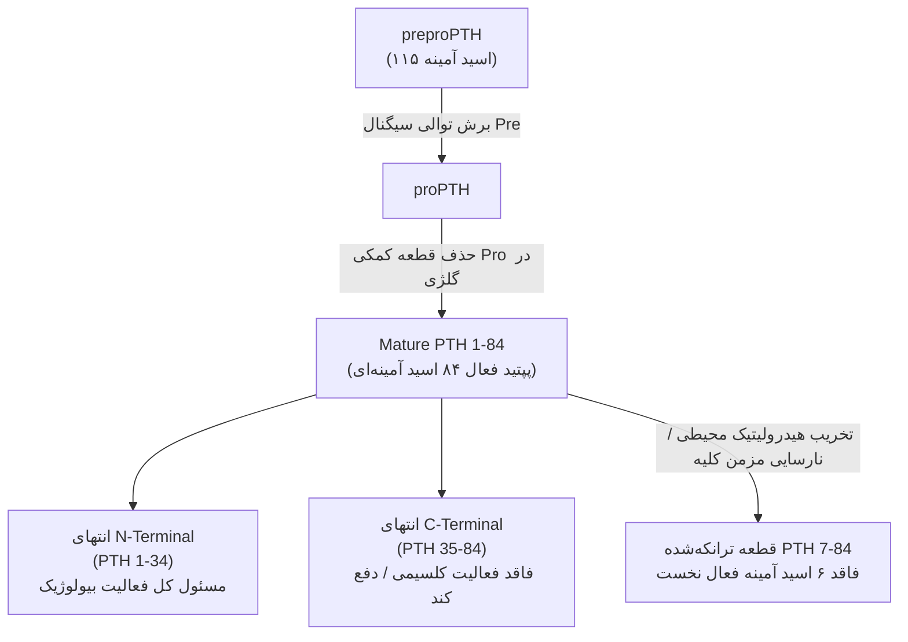
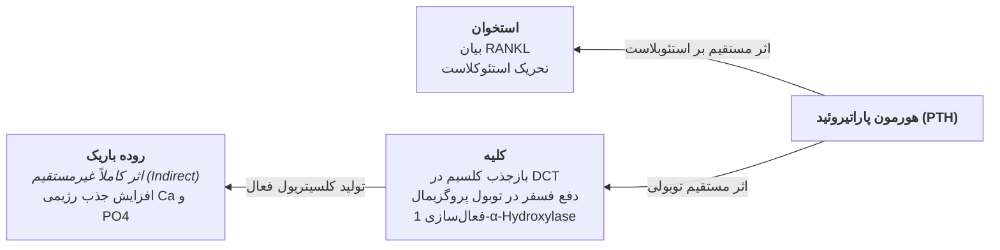
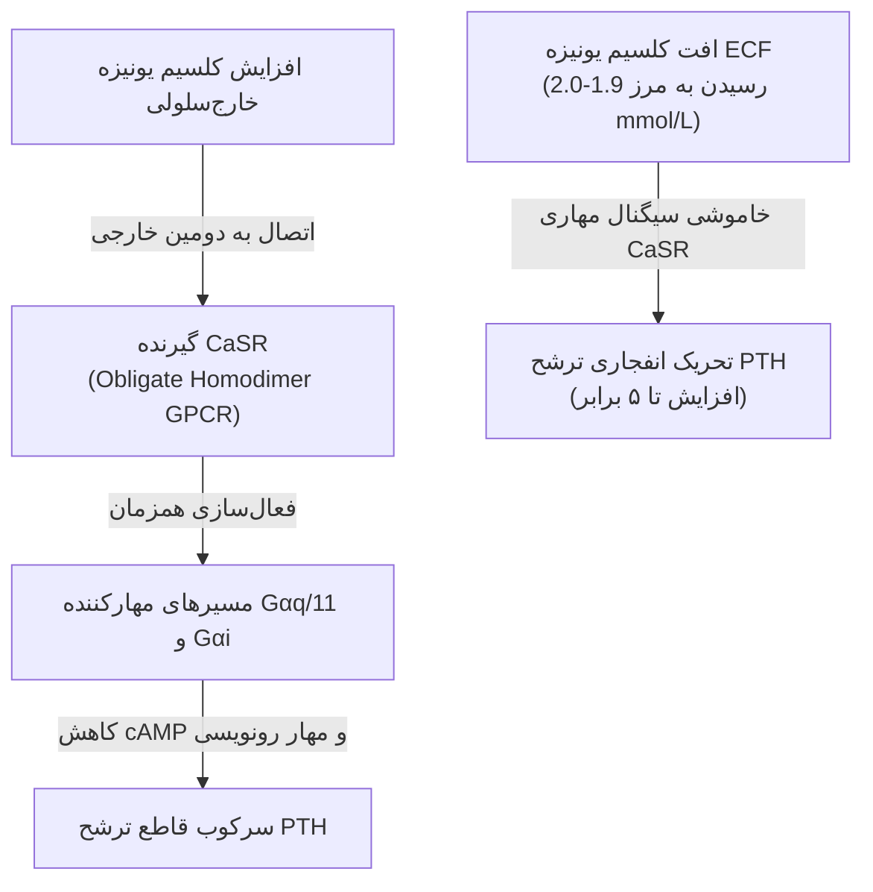
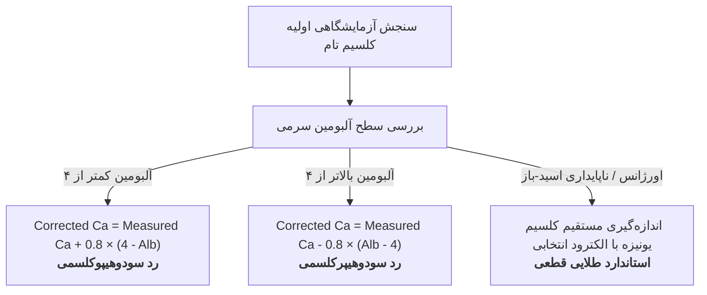
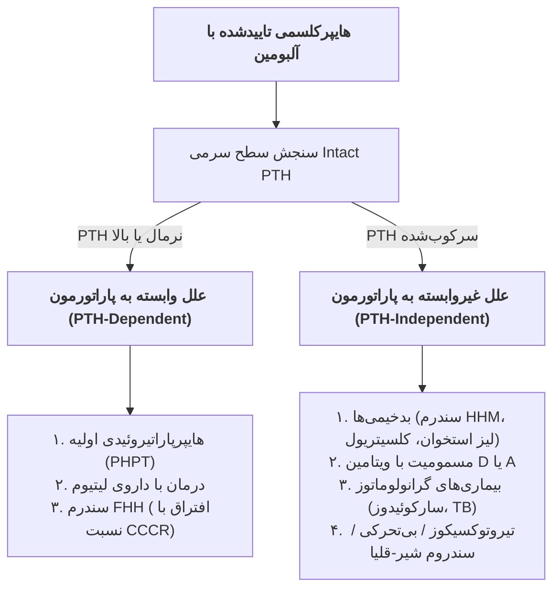
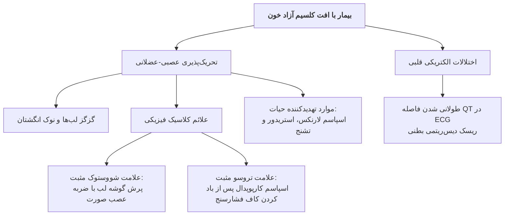
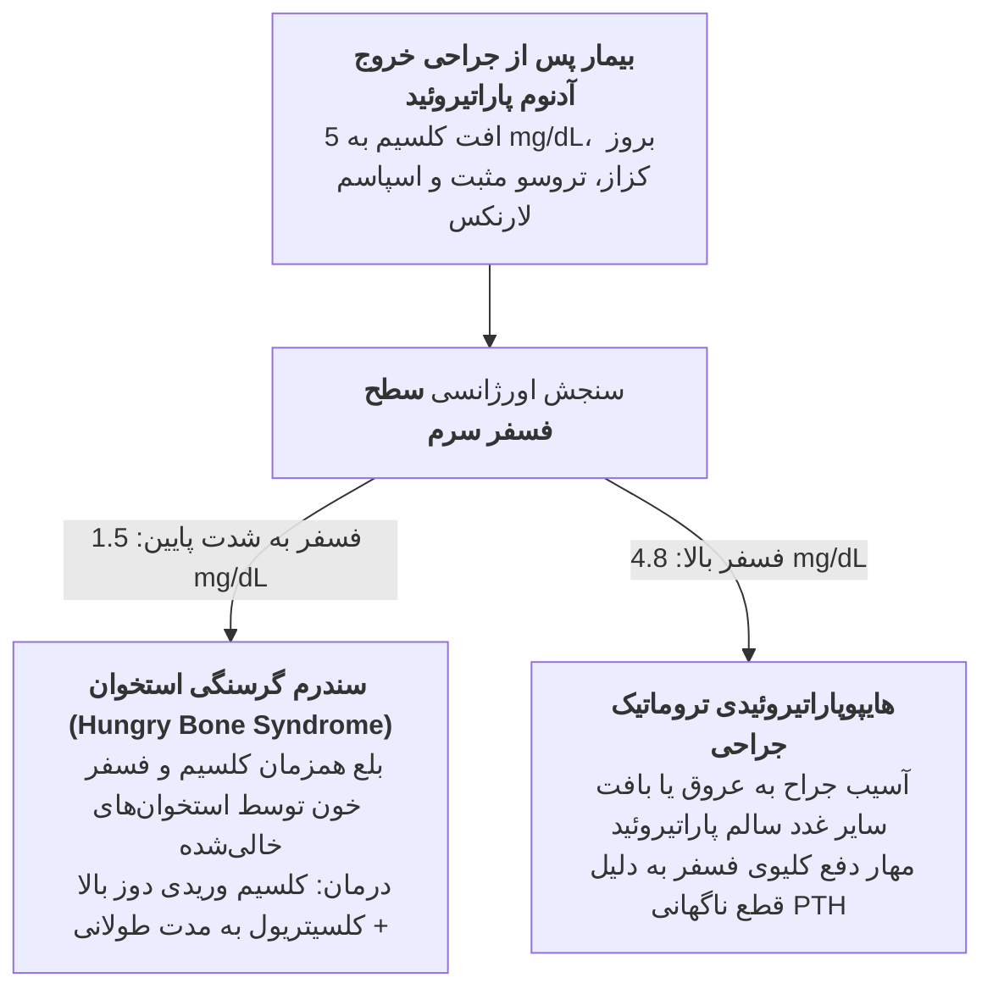

# اختلالات کلسیم و پاراتیروئید

## ۱. بیولوژی مولکولی، ساختار و سینتیک پاراتورمون (PTH)

> [!abstract] تعریف پاراتورمون (PTH)
> هورمون پپتیدی تک‌زنجیره‌ای با ۸۴ اسید آمینه؛ ترشح‌شده از سلول‌های چیف ۴ غده پاراتیروئید مستقر در خلف لوب‌های فوقانی (*Superior*) و تحتانی (*Inferior*) تیروئید؛ فرمانده ارشد حفظ کلسیم یونیزه مایع خارج‌سلولی (*ECF*) در محدوده فیزیولوژیک.

### ۱.۱. ساختار اسید آمینه‌ای و قطعات عملکردی هورمون
* **طول زنجیره پروتئینی:** واجد **۸۴ اسید آمینه** به شکل پلی‌پپتید خطی نامتقارن.
* **قلمرو آمینی (N-Terminal - اسید آمینه ۱ تا ۳۴):** جایگاه انحصاری **فعالیت بیولوژیک هورمون**؛ حتی قطعات فوق‌کوتاه **PTH 1-11** نیز در غلظت‌های بالا قابلیت اتصال و تحریک گیرنده را دارند.
* **قلمرو کربوکسیلی (C-Terminal - اسید آمینه ۳۵ تا ۸۴):** قطعه **فاقد اثر بیولوژیک کلاسیک** در هموستاز کلسیم؛ اتصال به پروتئین‌ها/گیرنده‌های ناشناخته غیروابسته؛ دارای نیمه‌عمر پالایشی به مراتب طولانی‌تر از قطعه آمینی.

### ۱.۲. بیوسنتز و پردازش درون‌سلولی پاراتورمون
1. **پیش‌ساز اولیه (preproPTH):** پلی‌پپتید اولیه واجد **۱۱۵ اسید آمینه**؛ سنتزشده روی ریبوزوم‌های شبکه آندوپلاسمی خشن.
2. **برش اولیه (Cleavage):** شکسته شدن متوالی توالی‌های هدایت‌گر *Pre* و سیگنال *Pro* در شبکه آندوپلاسمی و دستگاه گلژی.
3. **پپتید بالغ فعال (Mature PTH):** مولکول **۸۴ اسید آمینه‌ای نهایی**؛ بسته‌بندی‌شده درون وزیکول‌های ترشحی جهت اگزوسیتوز در پاسخ به هیپوکلسمی.
4. **تخریب محیطی:** کلیرنس و متابولیسم سریع عمدتاً در *کبد* و سپس *کلیه*.

> [!danger] تله آزمایشگاهی و امتحانی مستقیم: خطای سنجش و قطعه 84-7
> در روش‌های سنجش قدیمی (*First-generation assays*)، آنتی‌بادی به دلیل اتصال به قطعات دیرسوز **C-Terminal**، سبب گزارش مثبت کاذب می‌شد. در بیماران مبتلا به نارسایی مزمن کلیه (*CKD*)، قطعه ناقص **PTH 7-84** (فاقد اسیدهای آمینه ۱ تا ۶) انباشته شده و بدون داشتن اثر هایپرکلسمیک، سطح PTH را کاذب بالا می‌برد.  
> ⇦ **استاندارد طلایی فعلی:** سنجش انحصاری **Intact PTH (iPTH 1-84)** با روش‌های الایزا رده دوم (*Second-generation assays*).

---

## ۲. مکانیسم‌های سلولی اثر هورمون بر بافت‌های هدف

### ۲.۱. دینامیک بازسازی استخوان (Bone Remodeling)
* **قاعده بیولوژیک بنیادین:** سلول‌های **استئوکلاست هیچ‌گونه گیرنده‌ای برای هورمون PTH ندارند!**
* **مسیر پاراکرین RANKL/RANK:** هورمون به گیرنده **PTH1R روی استئوبلاست‌ها** متصل می‌شود ⇦ تحریک رونویسی و بیان سایتوکین **RANKL** روی غشای استئوبلاست ⇦ جفت شدن RANKL با گیرنده **RANK** روی پیش‌سازهای استئوکلاست ⇦ ادغام، فعال‌سازی استئوکلاست‌ها و ترشح آنزیم‌های تجزیه‌کننده ماتریکس معدنی استخوان (*Bone Resorption*) ⇦ ریزش کلسیم و فسفر به خون.
* **تأثیر الگوی ترشحی در پیامد بافتی (نکته حیاتی فارماکولوژی):**
  * **ترشح پیوسته و مداوم (Continuous Exposure):** شیوع پدیده *Bone Resorption*، تهی‌سازی استخوان و حفرات کیستیک؛ مشابه آسیب ناشی از آدنوم خودمختار پاراتیروئید (مته تخریب‌گر ۲۴ ساعته).
  * **ترشح متناوب و گذرا (Intermittent Exposure):** تلنگر گذرا به سلول‌های استخوانی، تحریک سریع ژن‌های تشکیل و ساخت استخوان (*Bone Formation*) و افزایش ترن‌اور ترمیمی؛ مبنای عملکرد داروی **تری‌پاراتاید / سینوپار (PTH 1-34)** در درمان پوکی استخوان (*Osteoporosis*).

### ۲.۲. عملکرد مستقیم بر نفرون‌های کلیه
* **توبول دیستال (DCT):** تحریک بازجذب فعال کلسیم از مجرای ادراری به گردش خون مویرگی (افت اتلاف کلسیم ادرار).
* **توبول پروگزیمال (PCT):** *مهار قاطع* ترانسپورترهای مشترک سدیم-فسفات (**NPT2a** و **NPT2c**) ⇦ ممانعت از بازجذب فسفات و افزایش فسفاتوری ⇦ **کاهش فسفر خون**.
* **سنتز هورمون ویتامین دی فعال:** تحریک مستقیم بیان آنزیم کلیوی **۱-آلفا-هیدروکسیلاز (CYP27B1)** در توبول پروگزیمال جهت تبدیل پیش‌ساز غیرفعال ۲۵-هیدروکسی ویتامین دی به کلسیتریول.

### ۲.۳. عملکرد بر اپی‌تلیوم روده باریک
* **ماهیت اثر:** **کاملاً غیرمستقیم (Indirect)**؛ انتروسیت‌های روده فاقد گیرنده عملکردی مستقیم برای هورمون PTH هستند.
* **مکانیسم واسطه:** ناشی از القای کلیوی **۱و۲۵-دی‌هیدروکسی ویتامین دی [1,25(OH)₂D]**؛ ورود کلسیتریول به سلول روده ⇦ گشودن کانال‌های کلسیمی اپی‌تلیال لومینال **TRPV6** ⇦ جذب مضاعف کلسیم و فسفر رژیم غذایی.

---

## ۳. بیولوژی گیرنده سنسور کلسیم (CaSR) و هورمون‌های همکار

> [!abstract] تعریف گیرنده سنسور کلسیم (CaSR)
> گیرنده جفت‌شده با پروتئین جی از رده سی (*Class C GPCR*) به صورت هومودایمر اجباری (*Obligate Homodimer*) مستقر در غشای پاراتیروئید و توبول‌های ادراری؛ مسئول حس دائمی غلظت کلسیم یونیزه خارج‌سلولی.

### ۳.۱. مسیر سیگنالینگ درون‌سلولی CaSR
1. افزایش کلسیم یونیزه خون ⇦ اتصال یون‌ها به پاکت اتصالی خارج‌سلولی CaSR.
2. برانگیختگی پروتئین‌های درون‌سلولی **Gαq/11** (مسیر فسفولیپاز C) و **Gαi** (مهار آدنیلات سیکلاز).
3. مهار سنتز، مهار رونویسی ژن و جلوگیری از اگزوسیتوز وزیکول‌های هورمون PTH.
4. **منحنی سیگموئیدی ترشح:** افت مختصر کلسیم سرم از محدوده طبیعی به مرز **۱.۹ تا ۲.۰ میلی‌مول بر لیتر**، جهش **۵ برابری** در سرعت ترشح هورمون پاراتیروئید ایجاد می‌کند.

### ۳.۲. ژنتیک و فنوتیپ‌های جهش‌های CaSR

| ماهیت جهش ژنتیکی | نام اختلال بالینی | الگوی توارث | کلسیم سرم | کلسیم ادرار | وضعیت هورمون PTH | پاتوفیزیولوژی بیماری |
| :--- | :--- | :--- | :--- | :--- | :--- | :--- |
| **Loss-of-Function (هتروزیگوت)** | **FHH تیپ ۱** | اتوزومال غالب | افزایش ملایم (~۱۱) | **به شدت پایین** (CCCR < ۰.۰۱) | نرمال یا افزایش خفیف | حسگر معیوب؛ پاراتیروئید کلسیم بالا را حس نمی‌کند؛ بازجذب افراطی ادراری |
| **Loss-of-Function (هموزیگوت)** | **NSHPT** | اتوزومال مغلوب | **بسیار شدید و کشنده** | متغیر | بسیار بالا افسارگسیخته | نقص کامل ترمز ترشح؛ نیازمند جراحی اورژانسی پاراتیروئیدکتومی توتال نوزاد |
| **Gain-of-Function** | **ADH تیپ ۱** | اتوزومال غالب | **پایین (هیپوکلسمی)** | **بسیار بالا (هیپرکلسیوری)** | به شدت سرکوب‌شده | حسگر خودبه‌خود روشن؛ توقف دائم ترشح هورمون حتی در هیپوکلسمی |

> [!warning] سندرم بارتر تیپ ۵ (Bartter Syndrome Type V)
> حاصل جهش‌های شدید **Gain-of-Function** در گیرنده CaSR توبول کلیوی؛ تظاهر با هیپوکلسمی شدید همراه با دفع کلیوی سدیم و کلر، هیپوکالمی و آلکالوز متابولیک.

### ۳.۳. پروتئین وابسته به هورمون پاراتیروئید (PTHrP)
* **ساختار مولکولی:** کدشده توسط ژنی مجزا و پیچیده؛ واجد ایزوفرم‌های رونویسی‌شده **۱۳۹، ۱۴۱ و ۱۷۳ اسید آمینه‌ای**؛ تشابه اساسی در دامنه N-Terminal با هورمون PTH.
* **فیزیولوژی طبیعی:** واسطه پاراکرین/اتوکرین موضعی؛ حیاتی در **نمو غضروفی و استخوانی جنین** و تنظیم **انتقال فعال کلسیم از جفت**؛ فاقد نقش در هموستاز بزرگسالان سالم.
* **پاتوفیزیولوژی بدخیمی (HHM):** عامل اصلی هایپرکلسمی هومورال بدخیمی (*Humoral Hypercalcemia of Malignancy*)؛ ترشح افراطی از کارسینوم‌های سنگفرشی (*SCC* ریه، مری، گردن)، تومورهای کلیه و مثانه ⇦ فعال‌سازی گیرنده PTH1R ⇦ هایپرکلسمی انفجاری همراه با **PTH کاملاً سرکوب‌شده** و سطوح **پایین تا نرمال کلسیتریول**.
* **سنجش آزمایشگاهی:** کیت‌های الایزا اختصاصی PTHrP هیچ‌گونه واکنش متقاطع (*Cross-reactivity*) با هورمون PTH ندارند.

### ۳.۴. تمایز گیرنده‌های رده PTH
* **گیرنده PTH1R:** گیرنده کلاسیک استخوان و کلیه؛ متصل‌شونده با تمایل یکسان به هر دو لیگاند **PTH** و **PTHrP**؛ هدایت مسیرهای *cAMP/PKA* و *PKC*.
* **گیرنده PTH2R:** مستقر در مغز (سیستم عصبی مرکزی)، بافت پانکراس و بیضه؛ لیگاند فیزیولوژیک درون‌زای آن پپتید **TIP39** است؛ *PTHrP هیچ اتصالی به آن ندارد* و نقشی در تنظیم کلسیم ایفا نمی‌کند.

### ۳.۵. کلسیتونین (Calcitonin)
* **ساختار و خاستگاه:** پلی‌پپتید ۳۲ اسید آمینه‌ای؛ ترشح‌شده از سلول‌های *C* پارافولیکولار تیروئید.
* **عملکرد سلولی:** آنتاگونیست بسیار ضعیف هورمون پاراتیروئید؛ مهار مستقیم استئوکلاست‌ها و افزایش اتلاف ادراری کلسیم.
* **اهمیت بالینی:** در انسان نقش فیزیولوژیک محوری ندارد (بیماران بعد از توتال تیروئیدکتومی هیچ اختلالی در هموستاز کلسیم پیدا نمی‌کنند)؛ کاربرد اصلی به عنوان **تومور مارکر حساس سرطان مدولاری تیروئید (MTC)**.

---

## ۴. دینامیک بیولوژیک کلسیم، تصحیح آزمایشگاهی و تعادل ارگان‌ها

### ۴.۱. توزیع درون‌تنی کلسیم و مقادیر پایه
* **بخش اسکلتی (> ۹۹%):** ذخیره ماتریکس هیدروکسی‌آپاتیت استخوان (مخزن ساختاری عظیم).
* **بخش خارج‌سلولی (~ ۱%):** گردش ECF و بافت نرم.
* **دامنه طبیعی کلسیم تام پلاسما:** **۸.۵ تا ۱۰.۵ میلی‌گرم بر دسی‌لیتر** (معادل ۲.۲ تا ۲.۶ میلی‌مول بر لیتر).
* **فراکشن‌های کلسیم تام:**
  * **۵۰% کلسیم یونیزه (Free/Ionized):** تنها فرم دارای فعالیت زیستی مستقیم؛ ناظر بر تحریک‌پذیری عصبی-عضلانی.
  * **۴۰ تا ۴۵% متصل به پروتئین:** اتصال عمدتاً به بار منفی آلبومین.
  * **۵ تا ۱۰% متصل به آنیون‌ها:** کمپلکس‌شده با سیترات، بی‌کربنات و فسفات.

### ۴.۲. تداخل اسید-باز با کلسیم آزاد یونیزه
* **محیط آلکالوز:** کاهش پروتون‌های هیدروژن متصل به آلبومین ⇦ افزایش جایگاه‌های منفی آزاد ⇦ ربایش شدید کلسیم یونیزه ⇦ **افت حاد کلسیم آزاد یونیزه و بروز علائم کزاز و تتانی بدون تغییر در غلظت کلسیم تام**.
* **محیط اسیدوز:** رقابت شدید پروتون‌های آزاد با کلسیم برای نشستن بر آلبومین ⇦ رهاسازی کلسیم به پلاسما ⇦ **افزایش سطح کلسیم یونیزه آزاد**.

> [!danger] فرمول اصلاح کلسیم تام بر مبنای آلبومین (سؤال قطعی آزمون کتبی)
> آلبومین فیزیولوژیک استاندارد بدن **۴ گرم بر دسی‌لیتر** لحاظ می‌گردد. به ازای هر ۱ گرم انحراف آلبومین سرمی، عدد کلسیم تام باید به میزان **۰.۸ میلی‌گرم بر دسی‌لیتر** تصحیح گردد:
> 
> $$\text{Corrected Calcium (mg/dL)} = \text{Total Calcium (mg/dL)} + 0.8 \times (4 - \text{Albumin [g/dL]})$$

#### مسائل بالینی امتحانی تدریس‌شده توسط دکتر رحیمی:
1. **کیس ۱ (بستری بخش مراقبت‌های ویژه):** بیمار دچار سپسیس با کلسیم گزارش‌شده ۷.۵ و آلبومین ۲.۰:
   $$\text{Corrected Ca} = 7.5 + 0.8 \times (4 - 2) = 7.5 + 1.6 = 9.1\text{ mg/dL}$$
   ⇦ *نتیجه بالینی:* بیمار دارای سودوهیپوکلسمی است؛ کلسیم واقعی طبیعی بوده و تزریق آمپول کلسیم گلوکونات اکیداً خطا است!
2. **کیس ۲ (تغلیظ خون و بی‌آبی شدید):** بیمار سالمند دمانسی با کلسیم گزارش‌شده ۱۲.۰ و آلبومین ۵.۰:
   $$\text{Corrected Ca} = 12.0 + 0.8 \times (4 - 5) = 12.0 - 0.8 = 11.2\text{ mg/dL}$$
   ⇦ *اقدام اولیه:* هیدراتاسیون با سرم سالین نرمال جهت خنثی‌سازی اثر هموکانسنتریشن (*Hemoconcentration*).

### ۴.۳. مقادیر تعادل رژیم غذایی و فیلتراسیون کلیه
* **نیاز طبیعی روزانه:** **۹۰۰ تا ۱۲۰۰ میلی‌گرم در روز**.
* **معادل‌سازی غذایی مطب و بالین:** ۱ لیوان شیر مساوی با ۱ پیاله ماست مساوی با ۱ قوطی کبریت پنیر = **۳۰۰ میلی‌گرم کلسیم خالص**.
* **جذب روده‌ای:** ۵% غیرفعال و مستقل از ویتامین D در تمام طول روده؛ ۲۰ تا ۷۰% جذب فعال وابسته به ویتامین D در دئودنوم و ژژونوم.
* **دریافت کمتر از ۲۰۰ میلی‌گرم در روز:** القای ترشح هایپرپاراتیروئیدی ثانویه ⇦ تحلیل شدید استخوان به عنوان بافر کلسیم ⇦ بروز استئوپروز زودرس.
* **دریافت بالاتر از ۴ گرم در روز:** سرریز ظرفیت بافتی، کلسیفیکاسیون بافت نرم، ایجاد نفروکلسینوز و نارسایی حاد کلیه.
* **کارکرد توبولار کلیوی:** فیلتراسیون روزانه **۸ تا ۱۰ گرم کلسیم** در کلافه گلومرولی؛ بازجذب **۹۷ تا ۹۸ درصد** در طول نفرون؛ دفع ادراری تنها **۲ تا ۳ درصد** فیلترشده (معادل **۱۰۰ تا ۲۰۰ میلی‌گرم در شبانه‌روز**).

---

## ۵. هایپرکلسمی: طبقه‌بندی جامع، بالین و مسیر تشخیصی

### ۵.۱. جدول طبقه‌بندی اتیولوژی هایپرکلسمی (جدول ۴۲۲-۱ هاریسون)
بیش از **۹۰% موارد هایپرکلسمی** ناشی از دو بیماری است: **هایپرپاراتیروئیدی اولیه (محیط سرپایی)** یا **بدخیمی‌ها (بیماران بستری)**.

#### بخش اول: علل وابسته به هورمون پاراتیروئید (PTH-Dependent)
منحصراً شامل ۳ اختلال بالینی بدون استثنا:
1. **هایپرپاراتیروئیدی اولیه (PHPT):** آدنوم منفرد (۸۰%)، هایپرپلازی چندغده‌ای/سندرم MEN (۱۵ تا ۲۰%)، کارسینوم پاراتیروئید (< ۱%)، تولید نابجای اکستراپاراتیروئیدی PTH، تجویز اگزوژنوس آنالوگ‌های PTH.
2. **درمان با لیتیوم (Lithium Therapy):** افزایش آستانه تحریک CaSR و متمایل‌سازی منحنی به راست؛ تحریک آدنوم در مصرف مزمن.
3. **هایپرکلسمی هایپوکلسیوریک فامیلیال (FHH).**

#### بخش دوم: علل غیروابسته به هورمون پاراتیروئید (PTH-Independent)
1. **مرتبط با سرطان و بدخیمی:**
   * تومورهای با ترشح هومورال پپتید **PTHrP** (کارسینوم سلول سنگفرشی ریه، مری، گردن، کلیه، مثانه).
   * متاستازهای استئولیتیک موضعی با ترشح سیتوکین‌های **اینترلوکین ۱ و TNF** (میلوم مولتیپل، سرطان پستان، لنفوم).
   * تولید توموری نابجای $1,25(OH)_2D$ (لنفوم‌های هوچکین و غیرهوچکین، دیس‌ژرمینومای تخمدان).
2. **مرتبط با اختلالات ویتامین D:**
   * مسمومیت حاد یا مزمن با ویتامین D (مصرف روزانه بالای ۱۰,۰۰۰ واحد؛ اشباع بافت چربی؛ غلظت خونی $25(OH)D > 100\text{ ng/mL}$).
   * بیماری‌های گرانولوماتوز (سارکوئیدوز، سل، بریلیوز)؛ تبدیل مهارناپذیر ویتامین D توسط ماکروفاژها.
   * نقص ژنتیکی آنزیم ۲۴-هیدروکسیلاز (جهش biallelic در ژن **CYP24A1** و تجمع کلسیتریول).
   * جهش‌های biallelic غیرفعال‌کننده در ترانسپورتر سدیم-فسفات توبولی (**NPT2a** بارزتر از **NPT2c**).
3. **همراه با گردش بالای استخوان (High Bone Turnover):**
   * تیروتوکسیکوز و پرکاری تیروئید (در ۲۰% بیماران به علت افزایش متابولیسم پایه استخوان).
   * بی‌تحرکی مطلق طولانی‌مدت (به‌ویژه در اطفال و نوجوانان دارای تروما و ضایعه نخاعی).
   * مصرف دیورتیک‌های تیازیدی (کاهش دفع ادراری کلسیم؛ آشکارسازی هایپرپاراتیروئیدی پنهان).
   * مسمومیت با ویتامین A (مصرف روزانه ۵۰,۰۰۰ تا ۱۰۰,۰۰۰ واحد؛ دردهای شدید و کلسیفیکاسیون پریوست).
   * نکروز چربی بافتی (*Fat necrosis*).
4. **همراه با نارسایی مزمن کلیه (CKD):**
   * هایپرپاراتیروئیدی ثالثیه (*Tertiary HPT*).
   * مسمومیت با آلومینیوم (ناشی از بافر دیالیزهای قدیمی و آنتی‌اسیدها، استئومالاسی شدید و دمانس).
   * سندرم شیر-قلیا (*Milk-Alkali Syndrome*).

### ۵.۲. تظاهرات بالینی و نوار قلب هایپرکلسمی
* **نماد به خاطرسپاری هاریسون:** *"Stones, Bones, Groans, Thrones, Psychiatric Overtones"*
  * **Stones:** سنگ‌های کلیوی مکرر اگزالات کلسیم و فسفات کلسیم، نفروکلسینوز بافتی.
  * **Bones:** دردهای استخوانی منتشر، استئوپنی اسکلتی، شکستگی‌های پاتولوژیک.
  * **Groans:** تهوع، استفراغ مداوم، یبوست پایدار، بی‌اشتهایی، دردهای زخم معده و پانکراتیت.
  * **Thrones:** پلی‌اوری و پلی‌دیپسی ناشی از بروز دیابت بی‌مزه نفروژنیک (*Nephrogenic DI*).
  * **Psychiatric:** خواب‌آلودگی، ضعف مفرط، اضطراب، کانفیوژن، افسردگی، سایکوز حاد و کما.
* **علامت نوار قلب (ECG):** **کوتاه شدن قطعه QT (Shortened QT Interval)**.
* **طبقه‌بندی بر اساس غلظت کلسیم تام:**
  * **کمتر از ۱۱.۶ تا ۱۲ میلی‌گرم بر دسی‌لیتر:** غالباً بی‌علامت بالینی (*Asymptomatic*).
  * **۱۲ تا ۱۲.۸ میلی‌گرم بر دسی‌لیتر:** شروع ظهور علائم بالینی واضح گوارشی و نورولوژی.
  * **بالاتر از ۱۲.۸ تا ۱۳ میلی‌گرم بر دسی‌لیتر:** رسوب و کلسیفیکاسیون نابجا در کلیه، پوست، عروق، قلب، ریه و معده؛ افت عملکرد کلیوی.
  * **بالاتر از ۱۴.۸ میلی‌گرم بر دسی‌لیتر (Hypercalcemic Crisis):** اورژانس مرگبار داخلی؛ نارسایی قلبی حاد، آریتمی بطنی، ایست قلبی و کما.

### ۵.۳. پاتوفیزیولوژی هایپرپاراتیروئیدی اولیه (PHPT)
* **استئیت فیبروزا سیستیکا (Osteitis Fibrosa Cystica):** تخریب مداوم استئوکلاستیک ماتریکس ترابکولار؛ نشت اریتروسیت‌ها به حفرات کیستیک استخوان و تجمع هموسیدرین که منجر به ضایعه شاخص **تومور قهوه‌ای (Brown Tumor)** در استخوان فک، جمجمه و استخوان‌های بلند می‌شود.
* **محل انتخابی تخریب استخوان:** افت تراکم عمدتاً در استخوان‌های **کورتیکال (دیستال رادیوس)**؛ حفظ نسبی استخوان‌های اسفنجی/ترابکولار (مهره‌های کمری ستون فقرات).
* **پایه‌های ژنتیک تومورهای پاراتیروئید:**
  * **ژن MEN1 (منین):** کروموزوم 11q13؛ سرکوب‌گر تومور؛ موتاسیون در سندرم MEN1 و ۱۵ تا ۲۰ درصد آدنوم‌های تک‌گیر پاراتیروئید.
  * **ژن CDC73 (پارافیبرومین):** کروموزوم 1q31؛ موتاسیون در سندرم HPT-JT و **۷۵ تا ۸۰ درصد کارسینوماهای بدخیم پاراتیروئید** (کلسیم بسیار بالا > ۱۴ میلی‌گرم بر دسی‌لیتر یا ۳.۵ میلی‌مول بر لیتر).
  * **آنکوژن CCND1 (سیکلین D1):** بازآرایی و ترنسلوکاسیون پیش‌برنده در ۲۰ تا ۴۰ درصد آدنوم‌های اسپورادیک.
  * **پروتوآنکوژن RET:** جهش فعال‌کننده در نئوپلازی‌های غدد درون‌ریز متعدد تیپ 2A (MEN2A).

| سندرم ژنتیکی | ارگان‌های کلیدی درگیر | ژن بیماری‌زا | تظاهرات غددی اختصاصی |
| :--- | :--- | :--- | :--- |
| **MEN1** | پاراتیروئید، پانکراس درون‌ریز، هیپوفیز قدامی | ژن *Menin* (Chr 11q13) | هایپرپلازی ۴ غده پاراتیروئید، گاسترینوما/انسولینوما، آدنوم پرولاکتین |
| **MEN2A** | پاراتیروئید، مدولاری تیروئید، آدرنال | پروتوآنکوژن *RET* (Chr 10) | پرکاری پاراتیروئید، کارسینوم مدولاری تیروئید (MTC)، فئوکروموسیتوم |

---

## ۶. تفکیک قطعی امتحانی: FHH در برابر هایپرپاراتیروئیدی اولیه (PHPT)

> [!danger] اصل بنیادین پرکتیس و آزمون: منع قطعی پاراتیروئیدکتومی در FHH
> هایپرپاراتیروئیدی اولیه با رزکسیون جراحی آدنوم درمان قطعی می‌شود. در سندرم **FHH**، جراحی پاراتیروئیدکتومی **کاملاً ممنوع و بی‌اثر** بوده و بیمار را بدون هیچ بهبودی دچار آسیب‌های عصب حنجره و هایپوپاراتیروئیدی دائمی می‌کند.

### ۶.۱. فرمول محاسبه نسبت کلیرنس کلسیم به کراتینین (CCCR)
در کلیه بیماران با کلسیم بالا و سطح PTH نرمال یا بالا، نمونه همزمان سرمی و ادرار ۲۴ ساعته جهت سنجش کلسیم و کراتینین اخذ می‌گردد:

$$\text{CCCR} = \frac{\text{Urine Calcium (mg/dL)} \times \text{Serum Creatinine (mg/dL)}}{\text{Corrected Serum Calcium (mg/dL)} \times \text{Urine Creatinine (mg/dL)}}$$

| پارامتر بیوشیمیایی و بالینی | هایپرپاراتیروئیدی اولیه (PHPT) | سندرم FHH |
| :--- | :--- | :--- |
| **شاخص نسبت CCCR** | **بزرگتر از ۰.۰۲ (بیش از ۲%)** | **کوچکتر از ۰.۰۱ (کمتر از ۱%)** |
| **کلسیم ادرار ۲۴ ساعته** | افزایشی (> ۲۰۰ میلی‌گرم در روز) به دلیل سرریز فیلتراسیون | به شدت کاهشی (< ۱۰۰ میلی‌گرم در روز) ناشی از بازجذب مجدد |
| **سطح کلسیم سرم** | اغلب پیشرونده، بالای ۱۱.۵ تا ۱۲، علامت‌دار بالینی | ثابت مادام‌العمر، ملایم (~ ۱۱)، کاملاً خوش‌خیم و بی‌علامت |
| **پاسخ به جراحی گردن** | درمان قطعی با پاراتیروئیدکتومی آدنوم | **کاملاً مقاوم به جراحی و اکیداً کنترااندیکه** |

> [!question] حل تشریحی مسئله پرپوزال امتحانی دکتر رحیمی
> **شرح کیس:** آقای ۲۰ ساله با کلسیم ۱۱.۰، آلبومین ۳.۰، کراتینین سرم ۱.۰، کراتینین ادرار ۱۰۰، کلسیم ادرار ۵.۰ و سطح iPTH در محدوده ۶۰ (بالا نسبت به کلسیم) مراجعه کرده است.  
> **گام ۱: تصحیح کلسیم تام:**
> 
> $$\text{Corrected Ca} = 11.0 + [0.8 \times (4 - 3)] = 11.8\text{ mg/dL}$$
> 
> **گام ۲: محاسبه نسبت تمایزدهنده CCCR:**
> 
> $$\text{CCCR} = \frac{5 \times 1}{11.8 \times 100} = \frac{5}{1180} \approx 0.0042\text{ (0.42\%)}$$
> 
> **نتیجه قطعی:** عدد به دست آمده زیر ۰.۰۱ است؛ بیمار مبتلا به **FHH** بوده، جراحی گردن ابداً نباید انجام گیرد و سیر خوش‌خیمی دارد.

## ۷. پاتوفیزیولوژی هایپوکلسمی، نشانه‌های بالینی و کیس‌های پیچیده

### ۷.۱. طبقه‌بندی علل هایپوکلسمی (جدول ۴۲۲-۵ هاریسون)
1. **مرتبط با اختلال پاراتورمون (PTH-Related):**
   * **فقدان یا تخریب فیزیکی بافت پاراتیروئید:** پاراتیروئیدکتومی ایاتروژنیک حین عمل تیروئیدکتومی توتال (شایع‌ترین علت)، سندرم دی‌جورج (حذف 22q11)، هیپوپاراتیروئیدی مجزا (*Isolated*)، جهش‌های فاکتورهای رونویسی **GCM2** و **GATA3**، تخریب اتوایمیون سندرم APECED، نفوذ بافتی آهن و مس (هموکروماتوز، بیماری ویلسون).
   * **نقص ترشح پاراتورمون:** هایپومنیزیمی حاد و مزمن، هایپرمنیزیمی، ADH تیپ ۱ (جهش فعال‌کننده CaSR).
   * **مقاومت گیرنده‌ای به هورمون:** سندرم‌های سودوهایپوپاراتیروئیدیسم (PHP).
2. **مرتبط با اختلالات ویتامین D:**
   * سوءتغذیه، فقر شدید نور آفتاب، سندرم‌های سوءجذب روده باریک.
   * اتلاف تسریع‌شده در اثر کاتابولیسم القایی: داروهای ضدتشنج (فنی‌توئین، کاربامازپین) و آنتی‌بیوتیک ریفامپین از طریق تحریک P450 کبدی.
   * نقص ۲۵-هیدروکسیلاسیون کبدی: سیروز نهایی کبد، جهش ژن CYP2R1.
   * نقص ۱-آلفا-هیدروکسیلاسیون کلیوی: نارسایی مزمن کلیه (CKD)، داروهای ضدقارچ ایمیدازول/آزول (کتوکونازول) مهارکننده سیتوکروم CYP27B1، جهش ژنتیکی ۱-آلفا هیدروکسیلاز، اثر فاکتور FGF23.
   * مقاومت ارگان هدف: موتاسیون در گیرنده درون‌سلولی ویتامین دی (VDR).
3. **سایر علل حاد و رسوبی کلسیم:**
   * کمپلکس شدن و کلاسیفیکاسیون حاد: ترانسفوزیون ماسیو مقادیر بالای خون سیتراته (بیماران ترومایی)، سندرم لیز تومور (*TLS*)، رابدومیولیز حاد عضلانی.
   * پانکراتیت حاد: صابونی شدن اسیدهای چرب نکروزشده با یون‌های کلسیم ECF و رسوب بافتی (*Saponification*).
   * داروها: مهارکننده‌های قوی بازجذب استخوان شامل **بیس‌فسفونات‌های وریدی** و آنتی‌بادی **دنوزومب (Denosumab)** در بیماران با کمبود پنهان کلسیتریول یا CKD.

### ۷.۲. تظاهرات نوروماسکولار، تست‌های بالینی و نوار قلب
* **علائم بالینی:** سوزن‌سوزن شدن و پارستزی دور دهان (*Perioral paresthesia*) و نوک انگشتان دست و پا، کرامپ‌های عضلانی اندام تحتانی، اسپاسم لارنکس (*Laryngospasm*)، استریدور تنفسی، حملات تشنج تونیک-کلونیک، لتارژی و کانفیوژن، افزایش فشار داخل جمجمه همراه با پاپی‌ادم (*Papilledema*)، آب‌مروارید چشم (*Lenticular cataracts*) و شکنندگی ناخن‌ها.
* **نشان الکتروکاردیوگرام (ECG):** **طولانی شدن قطعه QT (Prolonged QT Interval)** به دلیل تاخیر در مرحله رپلاریزاسیون پتانسیل عمل بطنی؛ خطر بروز آریتمی تورساد دی‌پوینت (*TdP*).

> [!abstract] تست شووستوک (Chvostek's Sign)
> ضربه ملایم با نوک انگشت بر مسیر تنه عصب فاشیال (عصب زوج هفتم مغزی) در قدام لاله گوش و ۲ سانتی‌متری زیر استخوان زایگوما ⇦ انقباض و پرش ناگهانی عضلات همان سمت صورت به خصوص انحراف پرشی گوشه لب.

> [!abstract] تست تروسو (Trousseau's Sign)
> باد کردن کاف فشارسنج روی بازو به میزان **۲۰ میلی‌متر جیوه بالاتر از فشار خون سیستولیک بیمار** و بستن مسیر شریانی به مدت **۳ دقیقه** ⇦ ایجاد ایسکمی موضعی و تحریک‌پذیری عصبی شدید که سبب ایجاد **اسپاسم کارپوپدال** تیپیک می‌شود (فلکشن مفاصل مچ و متاکارپوفالانژیال، اکستنشن مفاصل بین‌بندانگشتی و ادداکشن شست دست یا اصطلاحاً «دست ماما»). **حساسیت و ویژگی بسیار بالاتر نسبت به تست شووستوک**.

### ۷.۳. سندرم‌های ژنتیکی و ایمونولوژیک هایپوپاراتیروئیدی
* **سندرم دی‌جورج (DiGeorge Syndrome):** حذف ریز ژنتیکی **22q11.2 deletion**؛ اختلال در تمایز جوانه کیسه‌های حلقی ۳ و ۴؛ آپلازی/هیپوپلازی همزمان **تیموس** (نقص ایمنی کشنده سلول‌های T) و **غدد پاراتیروئید** (هایپوکلسمی نوزادی شدید) همراه با نقص تکاملی قلب (کونوترونکال) و دیس‌مورفیسم صورت.
* **سندرم باراکات / HDR (Barakat Syndrome):** جهش در ژن فاکتور رونویسی **GATA3** در کروموزوم 10p؛ تریاد مشخص:
  1. هایپوپاراتیروئیدی اولیه (**H**ypoparathyroidism).
  2. کری حسی-عصبی دوطرفه (**D**eafness).
  3. دیسپلازی و نارسایی عملکرد کلیه (**R**enal disease).
* **سندرم APECED یا APS-1:** بیماری اتوزومال مغلوب ناشی از موتاسیون ژن سرکوب‌کننده اتوایمیونی **AIRE** در کروموزوم 21q22.3 (دارای شیوع در جمعیت‌های خاص مانند فنلاندی‌ها و یهودیان عراقی و ایرانی)؛ تظاهرات شاخص:
  * هایپوپاراتیروئیدی اولیه خودایمن.
  * نارسایی اولیه کورتکس غدد فوق‌کلیه (بیماری آدیسون).
  * کاندیدیازیس جلدی-مخاطی مزمن دهان و ناخن‌ها (*Chronic Mucocutaneous Candidiasis*).
  * عوارض وابسته: آلوپسی، ویتیلیگو، آنمی پرنیسیوز، نارسایی اولیه تخمدان/بیضه، هپاتیت اتوایمیون.

### ۷.۴. اثر هایپومنیزیمی بر محور پاراتیروئید
* **سطح آستانه اختلال:** منیزیم سرم **کمتر از ۰.۸ میلی‌اکی‌والان بر لیتر** (معادل کمتر از ۰.۴ میلی‌مول بر لیتر).
* **مکانیسم قفل دوجانبه:**
  1. مهار خروج اگزوسیتوزی هورمون پاراتیروئید از سلول‌های Chief پاراتیروئید (سطح خونی PTH صفر یا به طور نامتناسب پایین گزارش می‌شود).
  2. مقاومت گیرنده‌های بافت استخوان و توبول کلیه به مولکول‌های PTH موجود.
* **تله بالینی مطب/بخش:** هایپوکلسمی که علی‌رغم تجویز مکرر ویال‌های کلسیم گلوکونات وریدی پایدار می‌ماند؛ **تنها راه‌حل:** تجویز وریدی سولفات منیزیم جهت بازگشایی ترشح هورمون PTH.

---

## ۸. سندرم‌های مقاومت به پاراتورمون و چالش هانگری بون

### ۸.۱. سودوهایپوپاراتیروئیدیسم تیپ 1A (PHP-1A) و استئودیستروفی آلبرایت (AHO)
* **پاتوفیزیولوژی مولکولی:** جهش غیرفعال‌کننده ارثی با توارث مادری در ژن **GNAS1** (کدکننده زیرواحد α پروتئین تحریکی Gs)؛ ناتوانی در انتقال پیام بین رسپتور PTH1R و آنزیم آدنیلات سیکلاز توبول کلیه.
* **پروفایل بیوشیمیایی سرم:** کلسیم پایین + فسفر بالا + **افزایش شدید غلظت خونی PTH** (برخلاف هایپوپاراتیروئیدی واقعی که در آن PTH صفر است).
* **فنوتیپ اسکلتی-ظاهری AHO:**
  * کوتاهی بارز قد و چاقی زودهنگام از دوران کودکی.
  * چهره کاملاً گرد (*Round facies*).
  * عقب‌ماندگی تکاملی ذهنی، کلسیفیکاسیون گانگلیون‌های پایه‌ای مغز (*Basal Ganglia*).
  * براکی‌داکتیلی (*Brachydactyly*): کوتاهی مادرزادی استخوان‌های متاکارپ و متاتارس.
* **نشانه بالینی بند انگشت (Knuckle-Dimple Sign):**
  * *حالت نرمال مشت بسته:* چهار برآمدگی استخوانی برجسته (Knuckle-Knuckle-Knuckle-Knuckle).
  * *سندرم داون:* فرورفتگی در متاکارپ سوم (Knuckle-Knuckle-Dimple-Knuckle).
  * *سندرم ترنر:* فرورفتگی اختصاصی در متاکارپ چهارم (Knuckle-Knuckle-Dimple-Knuckle).
  * *سودوهایپوپاراتیروئیدی تیپ 1A:* فرورفتگی همزمان متاکارپ‌های **چهارم و پنجم** (Knuckle-Knuckle-Dimple-Dimple).
* **مقاومت چندگانه هورمونی:** همراهی با افزایش مقاومت گیرنده‌ای به سایر هورمون‌های متکی به cAMP مانند **TSH** (هیپوتیروئیدی بالینی با سطح بالای هورمون TSH) و گنادوتروپین‌ها.

| بیماری / وضعیت بیوشیمیایی | کلسیم سرم | فسفر سرم | سطح خونی PTH | پاسخ ادراری cAMP به PTH | فنوتیپ اسکلتی AHO |
| :--- | :--- | :--- | :--- | :--- | :--- |
| **هایپوپاراتیروئیدی اولیه** | به شدت کاهش | افزایش | **پایین یا غیرقابل‌سنجش** | کاملاً طبیعی | غایب |
| **سودوهایپوپاراتیروئیدی (PHP-1A)** | به شدت کاهش | افزایش | **به شدت افزایش** | فاقد پاسخ (نقص Gsα) | **حاضر (کوتاهی قد، کوتاهی انگشت ۴ و ۵)** |
| **کمبود ویتامین D** | کاهش یا نرمال | **کاهش** | افزایش جبرانی | طبیعی | تغییرات راشیتیسم / استئومالاسی |
| **سندرم گرسنگی استخوان** | **افت بحرانی** | **افت بحرانی** | متغیر یا سرکوب‌شده | طبیعی | تغییرات ناشی از PHPT قبلی |

### ۸.۲. کیس متدیک دکتر رحیمی: سندرم گرسنگی استخوان (HBS) در برابر ترومای جراحی

> [!question] تحلیل کیس کلینیکال تدریس‌شده (سؤال با امتیاز مثبت در کلاس)
> **صورت مسئله:** بیمار مبتلا به هایپرپاراتیروئیدی اولیه تحت پاراتیروئیدکتومی قرار می‌گیرد. در ICU دچار کارپوپدال اسپاسم شدید، شووستوک مثبت، استریدور و کلسیم ۵.۰ با آلبومین ۴.۰ می‌شود. سطح منیزیم طبیعی گزارش شده است.  
> **افتراق با سطح فسفر سرم:**
> 1. **سناریوی الف - فسفر سرم ۱.۵ میلی‌گرم بر دسی‌لیتر (افت شدید):**
>    ⇦ **تشخیص:** **سندرم استخوان گرسنه (Hungry Bone Syndrome)**. استخوان‌های بیمار که پیش از جراحی تحت اثر تخریبی ممتد PTH کلسیم و فسفر خود را از دست داده بودند، پس از قطع ناگهانی PTH، به صورت ولع‌آمیز یون‌های کلسیم و فسفر آزاد پلاسما را جهت ساخت مجدد ماتریکس هیدروکسی‌آپاتیت به درون خود می‌کشند. درمان نیازمند هفته‌ها تجویز کلسیم وریدی دوز بالا به همراه کلسیتریول (*Rocaltrol*) خوراکی است.
> 2. **سناریوی ب - فسفر سرم ۴.۸ میلی‌گرم بر دسی‌لیتر (افزایش غلظت):**
>    ⇦ **تشخیص:** **هایپوپاراتیروئیدی تروماتیک ایاتروژنیک (ناشی از دستکاری جراحی)**. جراح حین اکسپلور گردن عروق خونرسان هر ۴ غده پاراتیروئید را مختل یا اشتباهاً خارج ساخته است؛ بنابراین دفع کلیوی توبولی فسفر مهار شده و هایپرفسفاتمی در حضور هایپوکلسمی رخ می‌دهد (رد قاطع Hungry Bone).

---

## ۹. جمع‌بندی تلگرافی و نکات طلایی چهارگزینه‌ای

> [!tip] کپسول مرور سریع شب آزمون
> 1. **توالی زیستی فعال پاراتورمون:** محدود به اسیدهای آمینه **۱ تا ۳۴**؛ سنجش استاندارد طلایی **iPTH 1-84** به روش نسل دوم است.
> 2. **گیرنده استئوکلاست:** استئوکلاست فاقد رسپتور PTH است؛ هورمون به گیرنده **استئوبلاست** متصل و با بیان سایتوکین **RANKL** باعث تخریب استخوان می‌شود.
> 3. **سینوپار / تری‌پاراتاید:** تزریق **متناوب (*Intermittent*)** پاراتورمون سبب استخوان‌سازی (*Bone Formation*) می‌شود؛ در حالی که ترشح مداوم (*Continuous*) استخوان را تخریب می‌کند.
> 4. **پپتید PTHrP:** عامل سندرم **HHM** در تومورهای سلول سنگفرشی؛ PTH در این وضعیت **کاملاً سرکوب‌شده** است.
> 5. **داروی لیتیوم:** جزو علل وابسته به PTH هایپرکلسمی؛ نقطه تنظیم (*Set-point*) گیرنده CaSR را به سمت راست جابجا می‌کند.
> 6. **افتراق FHH از هایپرپاراتیروئیدی اولیه:** محاسبه نسبت کلیرنس **CCCR**؛ عدد **زیر ۰.۰۱ به نفع FHH** (جراحی ممنوع) و عدد **بالای ۰.۰۲ به نفع PHPT** (درمان با جراحی) است.
> 7. **تغییرات تشخیصی نوار قلب:** هایپرکلسمی باعث **کوتاه شدن قطعه QT** و هایپوکلسمی باعث **طولانی شدن قطعه QT** می‌گردد.
> 8. **نشانه تروسو:** از نشانه شووستوک بسیار اختصاصی‌تر و حساس‌تر بوده و با باد کردن کاف فشارسنج تا ۲۰ میلی‌متر جیوه بالای سیستول به مدت ۳ دقیقه ایجاد می‌شود.
> 9. **هایپومنیزیمی مقاوم:** منیزیم **کمتر از ۰.۸ میلی‌اکی‌والان بر لیتر** با مسدود ساختن ترشح PTH و ایجاد مقاومت گیرنده‌ای، هایپوکلسمی درمان‌ناپذیر با کلسیم ایجاد می‌کند.
> 10. **سندرم APECED / APS-1:** موتاسیون ژن **AIRE** در کروموزوم 21q22.3؛ همراهی هایپوپاراتیروئیدی خودایمن با آدیسون و کاندیدیازیس مزمن جلدی-مخاطی.
> 11. **سندرم باراکات (HDR):** جهش ژن **GATA3** در کروموزوم 10p شامل هایپوپاراتیروئیدی، ناشنوایی و نارسایی کلیه.
> 12. **علامت Knuckle-Dimple در سودوهایپوپاراتیروئیدی:** فرورفتگی همزمان متاکارپ‌های **چهارم و پنجم** ناشی از نقص ژن GNAS1 و فنوتیپ AHO.