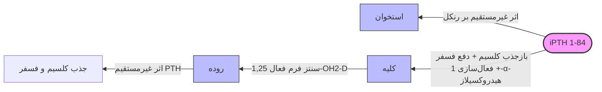
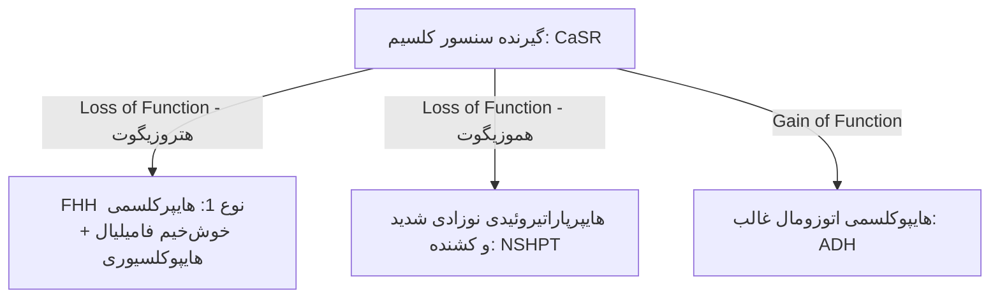
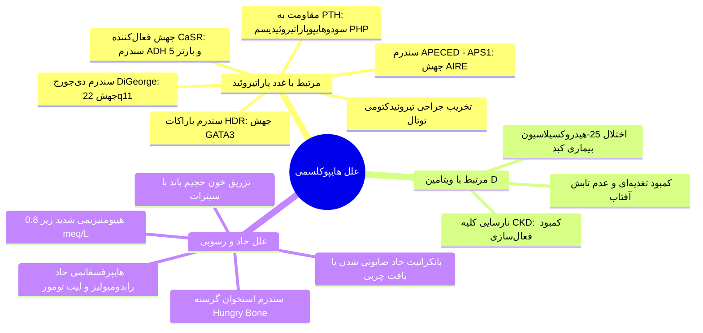
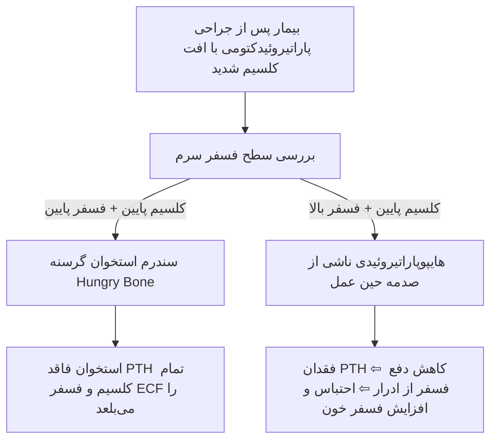
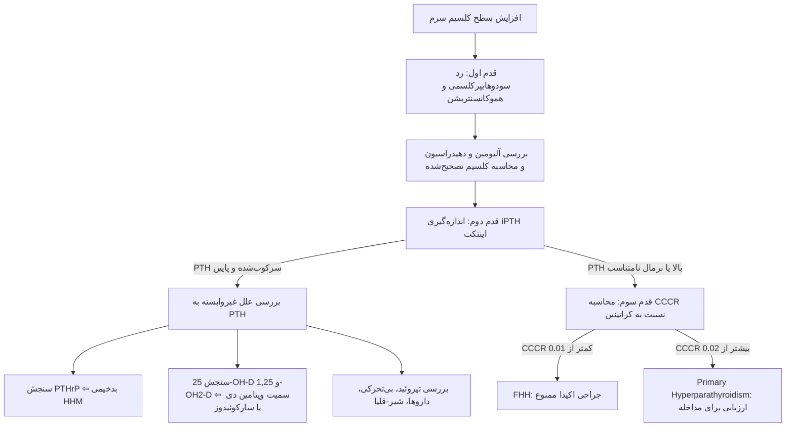

# اختلالات کلسیم و غدد پاراتیروئید

## ۱. بیولوژی مولکولی و فیزیولوژی هورمون PTH

> [!abstract] هورمون پاراتورمون (PTH)
> پلی‌پپتید تک‌زنجیره‌ای با **۸۴ اسید آمینه**؛ مهم‌ترین تنظیم‌کننده هوموستاز کلسیم و فسفر در مایع خارج سلولی (ECF).

### ساختار و متابولیسم
1. **بیوسنتز:** ابتدا پیش‌ساز `preproPTH` (حاوی **۱۱۵ اسید آمینه**) سنتز شده ⇦ سپس با برداشتن دنباله‌های pre و pro به `PTH(1-84)` بالغ تبدیل می‌شود.
2. **پایانه N (اسید آمینه‌های ۳۴-۱):** قطعه **فعال بیولوژیک**؛ قطعات حتی کوتاه‌تر (۱۱-۱) نیز در غلظت بالا رسپتور را فعال می‌کنند.
3. **پایانه C:** از نظر بیولوژیک **غیرفعال**، دفع عمدتاً توسط کبد و کلیه.
4. **تله سنجش آزمایشگاهی:** کیت‌های قدیمی همزمان قطعات C-terminal فاقد فعالیت را می‌سنجیدند (افزایش کاذب، به‌ویژه در CKD). **استاندارد طلایی کنونی:** سنجش **iPTH (Intact PTH 1-84)** است. فرم‌های فاقد اسیدآمینه ۱ مانند *PTH(7-84)* نیمه‌عمر طولانی داشته و در نارسایی کلیه انباشته می‌شوند.

```mermaid
flowchart RL
    classDef hormone fill:#f9f,stroke:#333,stroke-width:2px;
    classDef organ fill:#bbf,stroke:#333,stroke-width:1px;

    PTH([iPTH 1-84]):::hormone -->|اثر غیرمستقیم بر رنکل| B[استخوان]:::organ
    PTH -->|بازجذب کلسیم + دفع فسفر + فعال‌‌سازی 1-α-هیدروکسیلاز| K[کلیه]:::organ
    K -->|سنتز فرم فعال 1,25-OH2-D| I[روده]:::organ
    I -->|اثر غیرمستقیم PTH| Abs[جذب کلسیم و فسفر]
```

### عملکرد سه‌گانه PTH بر ارگان‌های هدف

* **استخوان (مکانیسم غیرمستقیم):** PTH *هیچ رسپتوری روی استئوکلاست ندارد!* رسپتور آن روی **استئوبلاست** است. اتصال PTH به استئوبلاست ⇦ افزایش بیان **RANKL** ⇦ اتصال RANKL به رسپتور **RANK** روی سطح استئوکلاست‌ها ⇦ فعال شدن استئوکلاست‌ها ⇦ **Bone Resorption** و رهایش کلسیم و فسفر به خون.
* **الگوی ترشح و اثر بالینی (مهم):**
  * *ترشح مداوم (Continuous):* غالب بودن تخریب استخوان بر ساخت (استئوپروز؛ مانند آدنوم پاراتیروئید).
  * *تجویز متناوب (Intermittent):* فعال‌سازی Turn-over استخوان و تحریک **Bone Formation** (مکانیسم داروی تری‌پاراتاید / **سینوپار** در درمان استئوپروز).
* **کلیه:**
  * بازجذب فعال کلسیم از **توبول دیستال (DCT)**.
  * مهار بازجذب فسفر در توبول پروگزیمال (مهار کوترانسپورترهای NPT2a/c) ⇦ **فسفاتوری و افت فسفر خون**.
  * فعال‌سازی آنزیم **1-α-هیدروکسیلاز** ⇦ تبدیل ۲۵-هیدروکسی ویتامین دی به فرم فعال **۱,۲۵-دی‌هیدروکسی ویتامین دی ($1,25(OH)_2D$)**.
* **روده:** اثر PTH کاملاً **غیرمستقیم (Indirect)** است (فاقد رسپتور روده‌ای). افزایش $1,25(OH)_2D$ سبب افزایش جذب کلسیم و فسفر از انتروسیت‌ها می‌شود.

---

## ۲. گیرنده‌های کلیدی و تنظیم‌کننده‌های کمکی

### گیرنده سنجش کلسیم (CaSR)
> [!info] گیرنده CaSR (Calcium-Sensing Receptor)
> گیرنده جفت‌‌شونده با پروتئین G (خانواده GPCR گروه C) به‌صورت هومودایمر اجباری در سطح سلول‌های پاراتیروئید و توبول‌های کلیوی.

* **مکانیسم عملکرد:** اتصال کلسیم خارج سلولی ⇦ فعال‌سازی مسیر $G\alpha_{q/11}$ و $G\alpha_i$ ⇦ **سرکوب سنتز و ترشح PTH**.
* **پاسخ فیزیولوژیک:** افت کلسیم به محدوده ۱.۹ تا ۲.۰ mmol/L ترشح PTH را تا **۵ برابر** تحریک می‌کند.
* **نقش حیاتی منیزیم ($Mg^{2+}$):** کمبود شدید داخل‌سلولی منیزیم هم **ترشح PTH** را مهار می‌کند و هم مقاومت بافتی به آن ایجاد می‌نماید.

```mermaid
graph TD
    CaSR[گیرنده سنسور کلسیم: CaSR]
    CaSR -->|Loss of Function - هتروزیگوت| FHH[FHH نوع 1: هایپرکلسمی خوش‌خیم فامیلیال + هایپوکلسیوری]
    CaSR -->|Loss of Function - هموزیگوت| NSHPT[هایپرپاراتیروئیدی نوزادی شدید و کشنده: NSHPT]
    CaSR -->|Gain of Function| ADH[هایپوکلسمی اتوزومال غالب: ADH]
```

### هورمون PTHrP و پپتید کلسیتونین
* **PTHrP (PTH-related Peptide):**
  * پروتئین ۱۳۹ تا ۱۷۳ اسید آمینه‌ای؛ در فیزیولوژی نقش پاراکرین/اتوکراین دارد (تکامل اسکلت جنینی و انتقال کلسیم جفتی). در افراد بالغ سالم سطح سرمی آن ناچیز است.
  * از طریق **گیرنده مشترک PTH1R** عمل می‌کند.
  * پاتوفیزیولوژی اصلی: عامل **Humoral Hypercalcemia of Malignancy (HHM)** ترشح شونده از تومورهای توپر (ریه، کلیه، مثانه، کولون).
* **گیرنده‌های PTH:**
  * **PTH1R:** در استخوان و کلیه؛ متصل‌شونده به هر دو فاکتور PTH و PTHrP.
  * **PTH2R:** عمدتاً در مغز، پانکراس و بیضه؛ لیگاند اختصاصی آن پپتید *TIP39* است و به PTHrP متصل نمی‌شود.
* **کلسیتونین:** پپتید ۳۲ اسید آمینه‌ای مترشحه از سلول‌های پارافولیکولار (C) تیروئید. آنتاگونیست ضعیف عملکرد PTH. در انسان نقش فیزیولوژیک حیاتی ندارد (تیروئیدکتومی توتال باعث هایپرکلسمی بالینی نمی‌شود). مارکر پیگیری در **مدولاری تیروئید کارسینوما (MTC)**.

---

## ۳. هوموستاز کلسیم و محاسبات تصحیح آزمایشگاهی

> [!important] حدود نرمال و توزیع بدن
> کلسیم توتال نرمال: **۸.۵ تا ۱۰.۵ mg/dL** (معادل ۲.۲ تا ۲.۶ mmol/L).  
> ۹۹٪ در استخوان، ۱٪ در مایع خارج‌سلولی. از کلسیم سرم: **۵۰٪ یونیزه (فرم فعال بیولوژیک)**، ۴۰٪ متصل به پروتئین (عمدتاً آلبومین)، ۱۰٪ متصل به آنیون‌ها.

### فرمول تصحیح کلسیم بر اساس آلبومین (تله تستی قطعی)
به ازای هر **۱ g/dL کاهش آلبومین سرم زیر ۴ g/dL**، غلظت کلسیم توتال سرم به میزان **۰.۸ mg/dL** افت کاذب نشان می‌دهد و باید اصلاح شود:

$$Corrected\;Ca = Total\;Ca + 0.8 \times (4 - Albumin)$$

> [!example] مثال‌های تصحیح کلسیم
> 
> * بیمار با Ca=7.5 و Alb=2 ⇦ کلسیم واقعی: $7.5 + 0.8 \times (4 - 2) = 9.1$ (کلسیم واقعی نرمال است؛ کلسیم کاذب به دلیل افت آلبومین).
> * بیمار با Ca=12 و Alb=5 ⇦ کلسیم واقعی: $12 - [0.8 \times (5 - 4)] = 11.2$ (هایپرکلسمی خفیف).
> 

### تراز و بازجذب کلیوی و روده‌ای
* جذب روده‌ای: **۵٪ غیرفعال (Passive)**؛ مابقی **فعال و وابسته به ویتامین دی** از طریق کانال‌های **TRPV6** در دوازدهه و ژژونوم.
* فیلتراسیون کلیوی: روزانه **۸ تا ۱۰ گرم** کلسیم فیلتر می‌شود؛ اما **فقط ۲ تا ۳ درصد** دفع ادراری پیدا می‌کند و بیش از ۹۷٪ بازجذب می‌شود.
* دریافت روزانه استاندارد: **۹۰۰ تا ۱۲۰۰ میلی‌گرم در روز** (هر لیوان شیر، یک کاسه ماست یا یک قوطی کبریت پنیر $\approx$ ۳۰۰ mg کلسیم).
* دریافت کمتر از **۲۰۰ mg/روز:** محرک هایپرپاراتیروئیدی ثانویه و تحلیل استخوان.
* دریافت بیش از **۴ گرم/روز:** رسوب بافتی، سنگ کلیه، هایپرکلسیوری و سندرم شیر-قلیا.

---

## ۴. هایپرکلسمی (Hypercalcemia)

> [!warning] دو علت ۹۰٪ موارد هایپرکلسمی
> 1. **پرایمری هایپرپاراتیروئیدیسم (PHPT)** (شایع‌ترین علت سرپایی؛ مزمن)  
> 2. **بدخیمی‌ها (Malignancy)** (شایع‌ترین علت بستری؛ حاد و شدید)

### تقسیم‌بندی اتیولوژی‌ها

| رده                        | مکانیسم / بیماری                                                                                                 | سطح PTH                                 | ویژگی کلیدی و آزمایشگاهی                                                              |
| :------------------------- | :--------------------------------------------------------------------------------------------------------------- | :-------------------------------------- | :------------------------------------------------------------------------------------ |
| **وابسته به PTH**          | 1. Primary Hyperparathyroidism (PHPT) 2. درمان با لیتیوم (Lithium) 3. سندرم FHH                            | **بالا یا به‌طور نامتناسب نرمال**       | کلسیم بالا، فسفر تمایل به پایین. جراحی تنها در آدنوم و نه در FHH اندیکاسیون دارد.     |
| **ناشی از بدخیمی**         | 1. HHM (ترشح PTHrP: ریه، کلیه، مثانه) 2. استئولیز موضعی (میلوم، لنفوم، برست) 3. ترشح $1,25(OH)_2D$ (لنفوم) | *کاملاً سرکوب‌شده (Low/Undetectable)* | سیر سریع، هایپرکلسمی شدید، کلسیم معمولاً $>13\text{ mg/dL}$، بافت استخوانی تخریب‌شده. |
| **وابسته به ویتامین D**    | مسمومیت دارویی ($>10,000\text{ U/day}$)، بیماری‌های گرانولوماتوز (سارکوئیدوز، سل)                                | *سرکوب‌شده*                           | ماکروفاژها بدون کنترل 1-α-هیدروکسیلاز ترشح می‌کنند. حساس به کورتون.                   |
| **Turnover بالای استخوان** | تیروتوکسیکوز، بی‌تحرکی (Immobilization نخاعی در اطفال)، مسمومیت ویتامین A                                        | *سرکوب‌شده*                           | لیز مستقیم استخوان؛ افزایش بازجذب بدون واسطه PTH.                                     |
| **مرتبط با نارسایی کلیه**  | هایپرپاراتیروئیدی ترشری، سندرم شیر-قلیا (Milk-Alkali)، سمیت آلومینیوم                                            | **بسیار بالا** (در ترشری)               | تریاد شیر-قلیا: هایپرکلسمی + آلکالوز متابولیک + نارسایی کلیه.                         |

### تفاوت تشخیصی بسیار مهم: PHPT در برابر FHH
* **نقص ژنتیکی FHH:** جهش هتروزیگوت Inactivating در ژن CaSR (نوع ۱: CaSR، نوع ۲: GNA11، نوع ۳: AP2S1).
* **تله بالینی:** در هر دو کلسیم بالا و PTH بالا یا نامناسب است. جراحی در FHH **ممنوع** است!
* **معیار افتراق: فرمول نسبت کلیرانس کلسیم به کراتینین (CCCR):**

$$CCCR = \frac{Urine\;Ca \times Serum\;Cr}{Serum\;Ca \times Urine\;Cr}$$

* **اگر $CCCR < 0.01$ (زیر ۱٪):** قطعی به نفع **FHH** (بازجذب ادراری کلسیم $>99\%$).
* **اگر $CCCR > 0.02$ (بالای ۲٪):** قطعی به نفع **Primary Hyperparathyroidism (PHPT)**.

### ژنتیک تومورهای پاراتیروئید در PHPT
* ۸۰٪ موارد: **تک‌آدنوم پاراتیروئید** منفرد؛ ۲۰٪ هایپرپلازی چندغده‌ای و فامیلیال.
* **MEN1:** ژن منین (کروموزوم 11)، تومورساپرسور. جهش در سندرم MEN1 و ۲۰-۱۵ درصد آدنوم‌های اسپورادیک.
* **CDC73 (Parafibromin):** تومورساپرسور، مرتبط با سندرم HPT-JT و ۷۵ تا ۸۰ درصد **کارسینومای پاراتیروئید**.
* **CCND1 (Cyclin D1):** پروتوانکوژن؛ بازآرایی و اوراکسپرسیون در ۲۰ تا ۴۰ درصد آدنوم‌ها.
* **RET:** پروتوانکوژن (جهش فعال‌کننده) در سندرم **MEN2A**.

### تظاهرات بالینی بر اساس سطح سرمی کلسیم
* کلسیم $<12\text{ mg/dL}$ ($<3\text{ mmol/L}$): معمولاً بدون علامت (Asymptomatic).
* کلسیم $>12\text{ mg/dL}$: خستگی، ضعف عضلانی، تهوع، یبوست شدید، درد شکم، دیابت بی‌مزه نفروژنیک (پلی‌اوری/پلی‌‌دیپسی)، **کوتاه شدن فاصله QT در نوار قلب**.
* کلسیم $>13\text{ mg/dL}$: کلسیفیکاسیون متاستاتیک بافتی (کلیه، عروق، ریه، مخاط معده) و نارسایی حاد کلیه.
* کلسیم $\ge 14.8\text{ mg/dL}$ (محدوده ۱۵ تا ۱۸): **اورژانس غدد**؛ لتارژی، کما و ارست قلبی.
* **استخوان در PHPT:** کاهش دانسیته استخوان کورتیکال (دیستال رادیوس) با حفظ نسبی استخوان ترابکولار (مهره‌ها). در موارد شدید: **Osteitis Fibrosa Cystica** و تشکیل **Brown Tumor** (کیست‌های پرشده از بافت فیبروزه و هموسیدرین قهوه‌ای).

---

## ۵. هایپوکلسمی (Hypocalcemia)

### علائم و نشانه‌های بالینی
* **عصبی-عضلانی:** گزگز پری‌اورال (دور لب)، پارستزی انگشتان، کرامپ و اسپاسم، استریدور ناشی از اسپاسم حنجره، تشنج.
* **قلبی:** **طولانی شدن فاصله QT (Long QT)** و مستعد شدن به آریتمی.
* **مزمن:** کلسیفیکاسیون گانگلیای پایه‌ای مغز، کاتاراکت چشم، پاپی‌ادم، شکنندگی ناخن و ریزش مو.

> [!danger] نشانه‌های بالینی تشخیصی (معاینه بالینی)
> * **علامت شوستوک (Chvostek's Sign):** تپ کردن روی عصب فاسیال (جلوی لاله گوش) ⇦ انقباض و پرش عضلات گوشه لب و صورت.  
> * **علامت تروسو (Trousseau's Sign):** باد کردن کاف فشارسنج تا **۲۰ mmHg بالاتر از فشار سیستولیک** بیمار به مدت **۳ دقیقه** ⇦ القای اسپاسم کارپوپدال (دست مامایی یا Carpal spasm)؛ این علامت **بسیار اختصاصی‌تر** از شوستوک است.

### اتیولوژی‌های هایپوکلسمی

```mermaid
mindmap
  root((علل هایپوکلسمی))
    مرتبط با غدد پاراتیروئید
      تخریب جراحی تیروئیدکتومی توتال
      سندرم دی‌جورج DiGeorge: جهش 22q11
      سندرم باراکات HDR: جهش GATA3
      سندرم APECED - APS1: جهش AIRE
      جهش فعال‌کننده CaSR: سندرم ADH و بارتر 5
      مقاومت به PTH: سودوهایپوپاراتیروئیدیسم PHP
    مرتبط با ویتامین D
      کمبود تغذیه‌ای و عدم تابش آفتاب
      اختلال 25-هیدروکسیلاسیون بیماری کبد
      نارسایی کلیه CKD: کمبود فعال‌سازی
    علل حاد و رسوبی
      هیپومنیزیمی شدید زیر 0.8 meq/L
      پانکراتیت حاد صابونی شدن با بافت چربی
      تزریق خون حجیم باند با سیترات
      سندرم استخوان گرسنه Hungry Bone
      هایپرفسفاتمی حاد رابدومیولیز و لیت تومور
```

### بررسی سندروم‌های ژنتیکی و ایمنی مهم
1. **سندرم دی‌جورج (DiGeorge / 22q11.2 deletion):** عدم تشکیل قوس سوم و چهارم حلقی ⇦ آپلازی تیموس + فقدان غدد پاراتیروئید (هایپوکلسمی مادرزادی) + نقایص قلبی-عروقی و صورت.
2. **سندرم باراکات (HDR Syndrome):** جهش در فاکتور رونویسی **GATA3** ⇦ هایپوپاراتیروئیدی (Hypoparathyroidism) + کری حسی-عصبی (Deafness) + نارسایی/دیسپلازی کلیه (Renal disease).
3. **سندرم APECED (APS-1):** اتوزومال مغلوب، جهش در ژن تنظیم‌کننده ایمنی **AIRE** (کروموزوم 21q22.3) ⇦ کاندیدیازیس جلدی‌مخاطی مزمن + نارسایی آدرنال (آدیسون) + هایپوپاراتیروئیدی خودایمن + آلوپسی، ویتیلیگو، آنمی پرنیسیوز.
4. **سودوهایپوپاراتیروئیدیسم تیپ 1A (PHP-1A):**
   * نقص: مقاومت به هورمون PTH در اثر جهش در زیرواحد $G\alpha_s$ (ژن *GNAS1* مادری).
   * آزمایشگاه: **کلسیم پایین، فسفر بالا، اما PTH بالا**.
   * فنوتیپ اسکلتی **(Albright Hereditary Osteodystrophy - AHO):** کوتاهی قد، چاقی، صورت گرد، عقب‌ماندگی ذهنی، براکی‌داکتیلی به‌ویژه **کوتاهی متاکارپ‌های ۴ و ۵**.
   * نشانه **Knuckle-Dimple Sign:** در مشت بسته، به جای برآمدگی بند انگشتان چهارم و پنجم، فرورفتگی (Dimple) دیده می‌شود (برخلاف سندرم ترنر که متاکارپ ۴ و سندرم داون که متاکارپ ۳ کوتاه است).
5. **Autosomal Dominant Hypocalcemia (ADH):**
   * جهش **Gain-of-Function** در گیرنده CaSR ⇦ گیرنده در سطح کلسیم پایین تحریک شده و ترشح PTH را متوقف می‌کند.
   * ویژگی حیاتی: **هایپرکلسیوری شدید**. در صورت درمان تهاجمی با کلسیم و ویتامین دی خوراکی، رسوب کلسیم در کلیه، نفروکلسینوز و آسیب غیرقابل‌برگشت کلیه ایجاد می‌شود.

---

## ۶. سندرم هانگری بون (Hungry Bone Syndrome) در برابر هایپوپاراتیروئیدی پس از جراحی

> [!critical] تله امتحانی طلایی (سوال قطعی بالینی)
> بیماری متعاقب جراحی آدنوم پاراتیروئید در زمینه PHPT دچار هایپوکلسمی شدید و علامت‌دار می‌شود:

```mermaid
flowchart TD
    PostOp[بیمار پس از جراحی پاراتیروئیدکتومی با افت کلسیم شدید] --> Lab[بررسی سطح فسفر سرم]
    Lab -->|کلسیم پایین + فسفر پایین| HB[سندرم استخوان گرسنه Hungry Bone]
    Lab -->|کلسیم پایین + فسفر بالا| HP[هایپوپاراتیروئیدی ناشی از صدمه حین عمل]
    
    HB --> Note1[استخوان فاقد PTH تمام کلسیم و فسفر ECF را می‌بلعد]
    HP --> Note2[فقدان PTH ⇦ کاهش دفع فسفر از ادرار ⇦ احتباس و افزایش فسفر خون]
```

* **سندرم Hungry Bone:** در اثر برداشتن منبع مازاد PTH، مهار استئوکلاست‌ها رخ داده و اسکلت تشنه به شدت کلسیم، منیزیم و **فسفر** را از پلاسما جذب و معدنی می‌کند ⇦ **$Ca \downarrow$ و $P \downarrow$**. درمان نیازمند مقادیر بسیار بالا و طولانی‌مدت کلسیم وریدی/خوراکی و فرم فعال ویتامین دی (روکاترول) است.
* **هایپوپاراتیروئیدی ناشی از آسیب عروقی/برداشتن اشتباه سایر غدد:** به دلیل نبود PTH، ترشح بازجذب فسفر در توبول کلیوی بازداری نشده و بازجذب آن بالا می‌رود ⇦ **$Ca \downarrow$ و $P \uparrow$**.

---

## ۷. الگوریتم تشخیصی اپروچ به اختلالات کلسیم

```mermaid
flowchart TD
    CaHigh[افزایش سطح کلسیم سرم] --> Step1[قدم اول: رد سودوهایپرکلسمی و هموکانسنتریشن]
    Step1 --> CheckAlb[بررسی آلبومین و دهیدراسیون و محاسبه کلسیم تصحیح‌شده]
    CheckAlb --> TestPTH[قدم دوم: اندازه‌گیری iPTH اینتکت]
    
    TestPTH -->|PTH سرکوب‌شده و پایین| MalignancyWorkup[بررسی علل غیروابسته به PTH]
    MalignancyWorkup --> PTHrP[سنجش PTHrP ⇦ بدخیمی HHM]
    MalignancyWorkup --> VitD[سنجش 25-OH-D و 1,25-OH2-D ⇦ سمیت ویتامین دی یا سارکوئیدوز]
    MalignancyWorkup --> OtherCauses[بررسی تیروئید، بی‌تحرکی، داروها، شیر-قلیا]

    TestPTH -->|PTH بالا یا نرمال نامتناسب| CalcRatio[قدم سوم: محاسبه CCCR نسبت به کراتینین]
    CalcRatio -->|CCCR کمتر از 0.01| FHHDiagnosis[FHH: جراحی اکیدا ممنوع]
    CalcRatio -->|CCCR بیشتر از 0.02| PHPTDiagnosis[Primary Hyperparathyroidism: ارزیابی برای مداخله]
```

### خلاصه راهنمای تشخیصی بر پایه مارکرهای بیوشیمیایی

| تابلوی بالینی | کلسیم | فسفر | iPTH | مارکر تشخیصی همراه |
| :--- | :---: | :---: | :---: | :--- |
| **PHPT** | $\uparrow$ | $\downarrow$ یا نرمال | $\uparrow$ یا نامتناسب | $CCCR > 0.02$ ، کلسیم ادرار بالا |
| **FHH** | $\uparrow$ | نرمال | کمی $\uparrow$ یا نرمال | $CCCR < 0.01$ ، کلسیم ادرار بسیار پایین |
| **HHM (بدخیمی)** | $\uparrow\uparrow$ | $\downarrow$ | $\downarrow\downarrow$ | $PTHrP \uparrow$ |
| **مسمومیت با ویتامین D** | $\uparrow$ | $\uparrow$ | $\downarrow\downarrow$ | $25(OH)D > 100\text{ ng/mL}$ |
| **سارکوئیدوز / لنفوم** | $\uparrow$ | $\uparrow$ | $\downarrow\downarrow$ | $1,25(OH)_2D \uparrow$ ، پاسخ سریع به کورتون |
| **هایپوپاراتیروئیدی اولیه** | $\downarrow$ | $\uparrow$ | $\downarrow\downarrow$ | سابقه جراحی گردن یا پاتولوژی ایمنی |
| **سودوهایپوپاراتیروئیدی (PHP-1A)** | $\downarrow$ | $\uparrow$ | $\uparrow\uparrow$ | فنوتیپ AHO و علائم مقاومت چندگانه به TSH/FSH |
| **کمبود ویتامین D** | $\downarrow$ یا نرمال | $\downarrow$ | $\uparrow$ (ثانویه) | $25(OH)D < 20\text{ ng/mL}$ |
| **سندرم استخوان گرسنه** | $\downarrow\downarrow$ | $\downarrow\downarrow$ | افت ناگهانی پس از جراحی | به دنبال عمل برداشتن آدنوم پاراتیروئید |
| **هایپومنیزیمی شدید** | $\downarrow$ | متغیر | $\downarrow$ یا نامتناسب | $Mg < 0.8\text{ meq/L}$ (اصلاح با منیزیم) |
