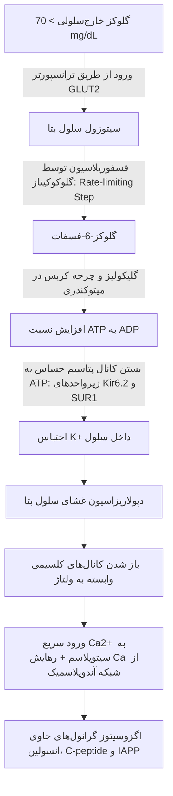
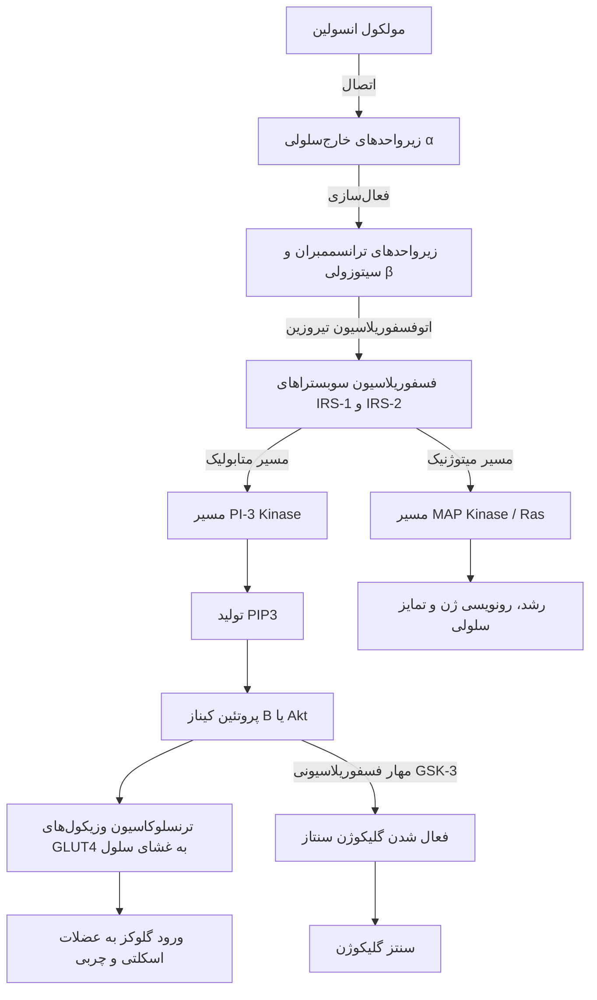
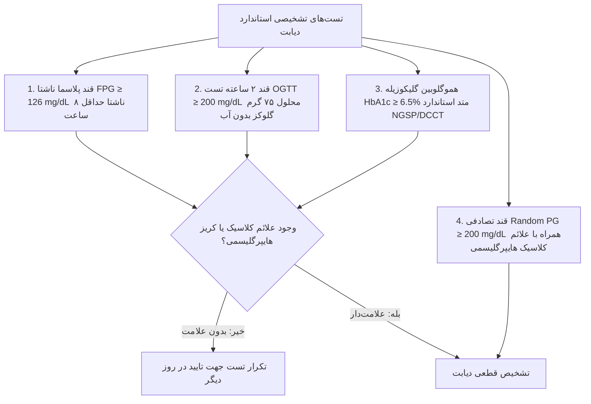
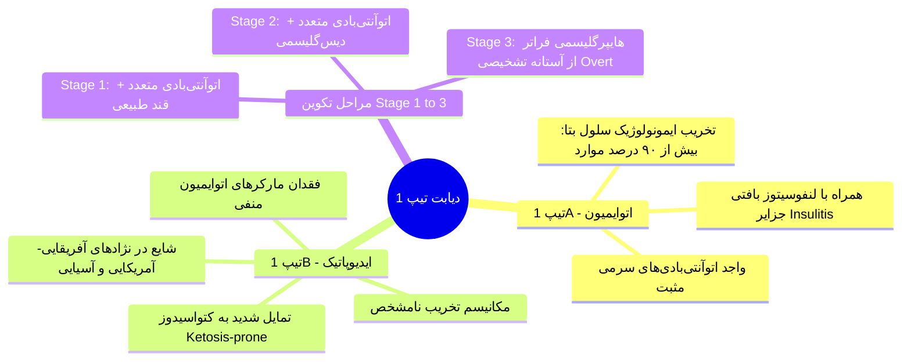
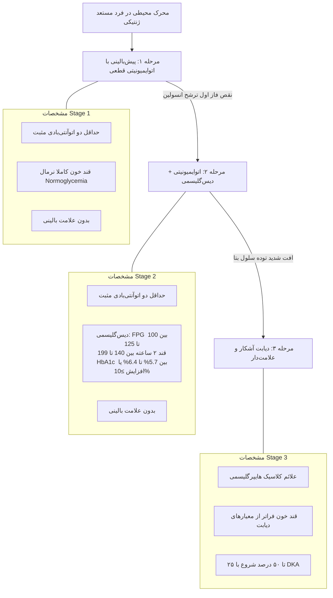
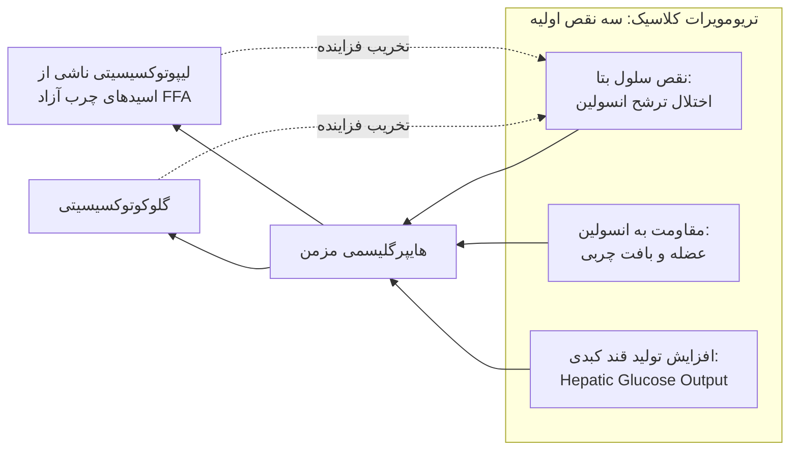
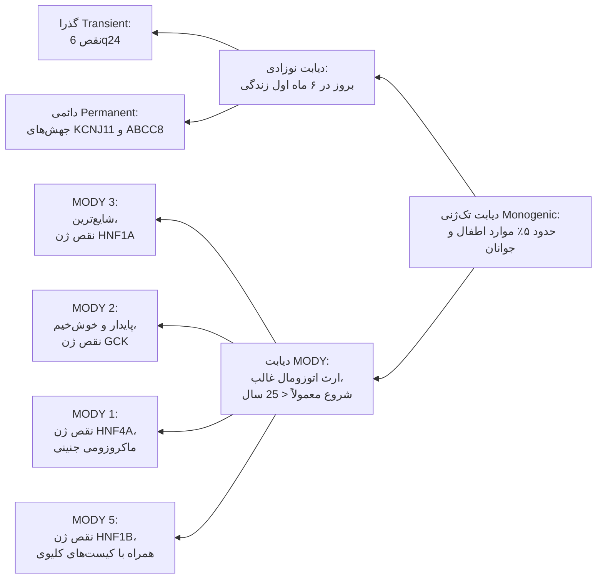
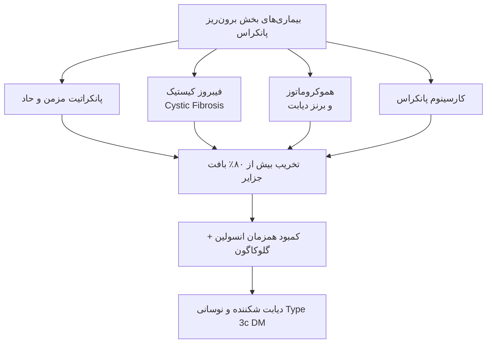
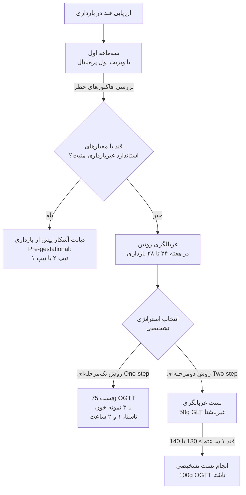
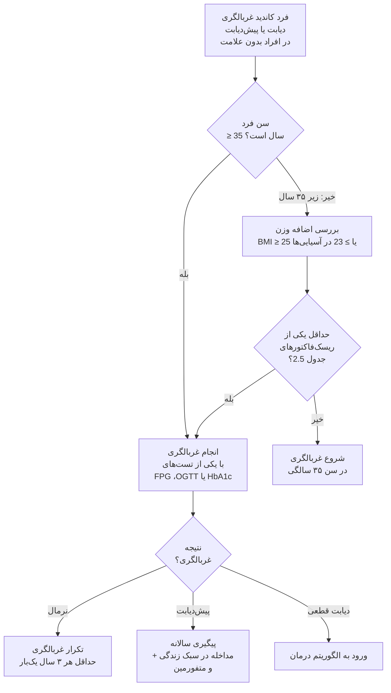

# دیابت قند (Diabetes Mellitus): فیزیوپاتولوژی، طبقه‌بندی و تشخیص

## 1. تعاریف پایه، اپیدمیولوژی و تغییر پارادایم سن

> [!abstract] دیابت قند (Diabetes Mellitus)
> اختلال مزمن متابولیک ناشی از نقص در ترشح انسولین، اثر انسولین یا هر دو؛ تظاهر با هایپرگلیسمی مزمن، اختلال متابولیسم کربوهیدرات، چربی و پروتئین و همراه با ایجاد عوارض مزمن عروقی.

* **اپیدمیولوژی جهانی (Diabetes Atlas):**
  * ابتلا بالغین (20 تا 79 سال): **589 میلیون نفر (1 نفر از هر 9 نفر)**؛ پیش‌بینی صعود به **853 میلیون نفر تا سال 2050**.
  * تلفات سالانه: **3.4 میلیون مرگ** و بار مالی سالانه بالغ بر **1 تریلیون دلار**.
  * سهم تیپ‌ها: **Type 1 DM حدود 5% تا 10%** و **Type 2 DM حدود 90% تا 95%** کل موارد دیابت.
* **حذف سن از معیارهای طبقه‌بندی:**
  * در سیستم‌های نوین، سن معیار قطعی تفکیک نیست. تخریب اتوایمیون سلول‌های β در هر سنی ممکن است رخ دهد.
  * *نکته امتحانی مهم:* حدود **40% از مبتلایان به Type 1 DM شروع بیماری پس از 30 سالگی دارند**.
  * دیابت تیپ 2 با افزایش شیوع در کودکان و نوجوانان دارای چاقی مفرط همراه شده است.

---

## 2. بیوسنتز و ترشح انسولین در سلول‌های بتای پانکراس

### بیوسنتز، مولکول انسولین و پپتید C
* **توالی سنتز:** Preproinsulin (پپتید تک‌زنجیره‌ای با 86 اسید آمینه) ⇦ جدا شدن دنباله سیگنال ⇦ Proinsulin ⇦ برش پپتید حدواسط 31 اسیدآمینه‌ای (C-peptide) ⇦ **انسولین بالغ**.
* **ساختار مولکولی انسولین:** وزن مولکولی **5807 Dalton** متشکل از 51 اسید آمینه در دو زنجیره متصل با پیوند دی‌سولفیدی:
  * **زنجیره A:** واجد **21 اسید آمینه**.
  * **زنجیره B:** واجد **30 اسید آمینه**.
* **اهمیت بالینی C-peptide:** در گرانول‌های ترشحی به‌صورت هم‌غلظت (Equimolar) با انسولین ذخیره و ترشح می‌شود. کلیرانس پپتید C کندتر از انسولین است؛ بنابراین **مارکر استاندارد جهت ارزیابی ترشح درون‌زاد انسولین و تفکیک هایپوگلیسمی اگزوژن از اندوژن** است.
* **آمیلین (Islet Amyloid Polypeptide / IAPP):** پپتید 37 اسیدآمینه‌ای؛ همراه‌با انسولین ترشح می‌شود؛ جزء اصلی رسوبات فیبریلی آمیلوئید در جزایر بیماران Type 2 DM با سیر طولانی.

### آبشار مولکولی ترشح انسولین وابسته به گلوکز

> [!important] حساس‌ترین و اختصاصی‌ترین مراحل بیوشیمیایی ترشح
> 1. ترشح انسولین در قند خون **بالای 70 mg/dL** با تقویت ترجمه و پردازش پروتئینی آغاز می‌شود.
> 2. **گلوکوکیناز (Glucokinase):** مرحله محدودکننده سرعت (Rate-limiting) و سنسور واقعی گلوکز در سلول بتا و کبد.
> 3. کانال پتاسیمی حساس به ATP شامل دو جزء است: زیرواحد **Kir6.2** (پروتئین کانال اصلاح‌کننده داخلی جریان K+) و **SUR1 / ABCC8** (گیرنده داروهای سولفونیل‌اوره و مگلیتینیدها).

### اثر اینکرتین‌ها (Incretin Effect)
* **پدیده اینکرتین:** تجویز خوراکی گلوکز در مقایسه با انفوزیون وریدی همان غلظت قند، **تا 70% ترشح انسولین بیشتری ایجاد می‌کند**.
* **هورمون‌های اصلی:**
  * **GLP-1:** پپتید 30 اسیدآمینه‌ای ترشح‌شونده از **سلول‌های L** ایلئوم دیستال و کولون (همچنین تولید درون‌جزیره‌ای توسط سلول‌های آلفا).
  * **GIP:** پپتید 42 اسیدآمینه‌ای ترشح‌‌شونده از **سلول‌های K** دوازدهه و ژژونوم پروگزیمال.
* **مکانیسم اثر اینکرتین‌ها:** اتصال به گیرنده‌های اختصاصی سلول بتا ⇦ افزایش غلظت **cAMP داخل‌سلولی** ⇦ تحریک ترشح انسولین **صرفاً در شرایط قند خون بالاتر از سطح پایه ناشتا** (عدم القای هایپوگلیسمی در حالت ناشتا)؛ همزمان سرکوب ترشح گلوکاگون.
* **تجزیه:** غیرفعال‌سازی سریع توسط آنزیم **Dipeptidyl Peptidase-4 (DPP-4)**.

### کینتیک و ریتم فیزیولوژیک ترشح
* **ترشح ضربانی (Pulsatile):** برست‌های ریز هر **10 دقیقه** سوار بر نوسانات با دامنه بزرگتر هر **80 تا 150 دقیقه**.
* **سهم ترشح شبانه‌روزی:**
  * **پایه (Basal):** 40% تا 50% از کل ترشح 24 ساعته.
  * **بولوس غذایی (Prandial/Bolus):** 50% تا 60% ترشح؛ افزایش 4 تا 5 برابری نسبت به سطح پایه طی 2 تا 3 ساعت پس از وعده غذا.

---

## 3. گیرنده انسولین و مسیرهای پیام‌رسانی درون‌سلولی

> [!warning] تله پاتوفیزیولوژیک مقاومت به انسولین
> در وضعیت مقاومت به انسولین، **صرفاً مسیر PI-3 Kinase (متابولیک) دچار نقص است**؛ در حالی که **مسیر MAPK (میتوژنیک و پرولیفراتیو) کاملاً فعال باقی می‌ماند**. بنابراین هایپرانسولینمی ناشی از مقاومت به انسولین، با تحریک ممتد مسیر MAPK سبب تسریع **آترواسکلروز عروقی و هیپرتروفی بافتی** می‌شود.

* **سرنوشت انسولین:** حدود **50% انسولین ترشح‌شده در اولین عبور از کبد (First-pass hepatic extraction) تجزیه می‌شود**؛ نسبت غلظت پورتال به محیطی حدود **2 به 1** است.

---

## 4. معیارهای تشخیصی دیابت، پیش‌دیابت و تله‌های بالینی HbA1c

### معیارهای قطعی تشخیص دیابت قند (ADA 2025)

> [!important] قانون تکرار تست در افراد بدون علامت
> در صورت نبود هایپرگلیسمی واضح بالینی، تشخیص نیازمند **دو نتیجه غیرطبیعی از یک نمونه یا دو نوبت مجزا** است. اگر دو تست مختلف (مثلاً FPG و HbA1c) همزمان ارسال شوند و یکی بالای حد تشخیصی و دیگری نرمال باشد، **همان تستی که بالاتر از حد تشخیصی بوده باید فوراً تکرار شود**.

### معیارهای پیش‌دیابت (Prediabetes)
* **اختلال قند ناشتا (IFG):** مقدار FPG بین **100 تا 125 mg/dL**.
* **اختلال تحمل گلوکز (IGT):** مقدار قند 2 ساعته OGTT بین **140 تا 199 mg/dL**.
* **هموگلوبین A1c بینابینی:** مقدار **5.7% تا 6.4%**.
  * در رنج A1c بین 5.5% تا 6.0%: ریسک 5 ساله ابتلا به دیابت بین 9% تا 25%.
  * در رنج A1c بین 6.0% تا 6.5%: ریسک 5 ساله ابتلا بین 25% تا 50% (**ریسک نسبی 20 برابر بالاتر** در مقایسه با A1c=5.0%).

### مقایسه فیزیوپاتولوژی IFG در برابر IGT

| پارامتر مقایسه‌ای                                     | اختلال قند ناشتا (Isolated IFG)                                        | اختلال تحمل گلوکز (Isolated IGT)                                       |
| :---------------------------------------------------- | :--------------------------------------------------------------------- | :--------------------------------------------------------------------- |
| **محل اصلی مقاومت به انسولین**                        | **مقاومت غالب کبدی (Hepatic IR)**؛ حساسیت انسولین در عضله نرمال است | **مقاومت شدید عضلانی (Muscle IR)**؛ حساسیت انسولین در کبد نرمال است |
| **فاز اول ترشح انسولین (0 تا 10 دقیقه IV)**        | **کاهش یافته یا غایب**                                                 | کاهش یافته                                                             |
| **فاز زودرس پاسخ به گلوکز خوراکی (0 تا 30 دقیقه)** | کاهش یافته                                                             | کاهش یافته                                                             |
| **فاز دیررس در تست OGTT (دقایق 60 تا 120)**        | **کاملاً نرمال**                                                       | **نقص شدید و ماندگار**                                                 |
| **پاتوفیزیولوژی هایپرگلیسمی**                         | افزایش تولید قند کبدی ناشتا (Hepatic Glucose Production)               | ناتوانی عضلات در پاکسازی گلوکز بعد غذا و هایپرگلیسمی پایدار            |

### متغیرهای مداخله‌گر و خطاهای اندازه‌گیری قند و HbA1c
* **واریانس بیولوژیک و لوله‌آزمایش:**
  * تغییرات فردی روزانه FPG حدود **5.7% تا 8.3%**؛ ضریب واریانس FPG در افراد برابر 5.7% (دامنه 112 تا 140 برای فردی با میانگین 126).
  * ضریب تغییرات تست قند 2 ساعته بسیار بالا است (**CV = 16.6%**).
  * ضریب تغییرات درون‌فردی HbA1c بسیار کمتر و پایدارتر است (**CV = 3.6%**).
  * *تخریب گلوکز در لوله آزمایش (گلیکولیز In Vitro):* گلوکز به میزان **5% تا 7% در ساعت** در دمای اتاق کاهش می‌یابد (نمونه با قند 126 پس از 2 ساعت به حدود 110 می‌رسد).
* **بیوشیمی HbA1c:** اتصال غیرآنزیمی گلوکز به اسیدآمینه والین در پایانه آمینی زنجیره بتای هموگلوبین A (تشکیل باز شیف ⇦ محصول پایدار Amadori). هموگلوبین طبیعی بالغین: HbA معادل 97%، HbA2 معادل 2.5% و HbF معادل 0.5%.

| فاکتور مداخله‌گر | افزایش کاذب HbA1c | کاهش کاذب HbA1c |
| :--- | :--- | :--- |
| **اریتروپوئز و ترن‌اور گلبول قرمز** | فقر آهن (Fe deficiency)، فقر B12، کاهش اریتروپوئز (سلول‌های مسن‌تر با مواجهه طولانی‌تر با گلوکز) | تجویز اریتروپوئتین (EPO)، آهن و B12، رتیکولوسیتوز، خونریزی حاد، ترانسفیوژن خون اخیر |
| **طول عمر اریتروسیت** | اسپلنکتومی | آنمی همولیتیک، اسپلنومگالی، آسیب دریچه‌های مکانیکی قلب، همودیالیز |
| **هموگلوبینوپاتی‌ها** | هموگلوبین جنینی بالا (HbF)، مت‌‌هموگلوبین | بیماری سلول داسی (SCD)، نقص آنزیم G6PD |
| **اختلال گلیکاسیون و pH** | نارسایی مزمن کلیه (اسیدوز و افت pH اریتروسیت) | افزایش pH اریتروسیت، دوز بالای ویتامین C و E، مصرف آسپیرین |
| **تداخلات سنجش آزمایشگاهی** | اورمی (هموگلوبین کاربامیله)، هایپربیلی‌روبینمی، الکل مزمن، اوپیوئیدها | داروهای ضد رتروویروسی (HAART)، ریباویرین، داپسون |

> [!danger] منع مطلق استفاده از HbA1c در تشخیص
> در شرایط زیر **سنجش HbA1c نامعتبر است و تشخیص دیابت صرفاً بر پایه معیارهای قند پلاسما (FPG و OGTT) انجام می‌شود**:
> 1. هموگلوبینوپاتی‌ها از جمله Sickle Cell Disease
> 2. نقص آنزیم G6PD
> 3. بارداری (به‌ویژه سه‌ماهه دوم و سوم و دوره پس از زایمان)
> 4. همودیالیز و نارسایی کلیوی پیشرفته
> 5. ترانسفیوژن خون اخیر یا خونریزی شدید اخیر
> 6. درمان با داروی اریتروپوئتین (EPO)
> 7. بیماران مبتلا به HIV تحت درمان با رژیم‌های دارویی خاص

---

## 5. دیابت تیپ 1: اتیولوژی، ایمونوژنتیک و مراحل سه‌گانه تکامل

### ژنتیک دیابت تیپ 1A
* میزان تطابق در دوقلوهای همسان: **30% تا 70%** (نشانگر نقش محیط علاوه بر ژنتیک).
* **منطقه HLA روی کروموزوم 6:** مسئول **40% تا 50% ریسک ژنتیکی** دیابت تیپ 1A (MHC کلاس II).
  * **هاپلوتیپ‌های مستعدکننده قوی:** `DRB1*0301-DQB1*0201` (**DR3-DQ2**) و `DRB1*0401-DQB1*0302` (**DR4-DQ8**).
  * **هاپلوتیپ‌های محافظت‌کننده قوی:** `DRB1*1501` و `DQA1*0102-DQB1*0602`.
* **ژن‌های غیر HLA (>60 جایگاه ژنی):**
  * ژن پروموتر انسولین (*INS*).
  * ژن *CTLA-4* (مهارکننده لنفوسیت T).
  * گیرنده اینترلوکین-2 (*IL-2R*).
  * ژن *PTPN22* (کدکننده تیروزین فسفاتاز اختصاصی لنفوسیت / Lyp).
* **ریسک خانوادگی در طول عمر:** ابتلای یکی از والدین: **1% تا 9%**؛ ابتلای خواهر/برادر: **6% تا 7%**؛ در نتیجه **بیش از 90% مبتلایان تیپ 1 فاقد هرگونه سابقه فامیلی درجه اول هستند**.

### فاکتورهای اتوایمیون و ایمنی سلولی
* **اتوآنتی‌بادی‌های اختصاصی جزایر (ICAs):**
  1. آنتی‌بادی علیه گلوتامیک اسید دکربوکسیلاز (**GAD65**)
  2. آنتی‌بادی علیه تیروزین فسفاتازها (**IA-2** و **IA-2β**)
  3. آنتی‌بادی علیه ترانسپورتر زینک 8 (**ZnT8**)
  4. اتوآنتی‌بادی علیه خود انسولین (**IAA**)
* *نکته پاتوفیزیولوژی:* اتوآنتی‌بادی‌ها خود عامل مستقیم مرگ سلول بتا نیستند، بلکه بیومارکر تخریب هستند؛ واسطه اصلی مرگ سلول بتا **سلول‌های سیتوتوکسیک CD8+ T**، سایتوکین‌های التهابی (**TNF-α، IFN-γ و IL-1β**) و رادیکال‌های نیتریک اکساید (NO) و ROS هستند.
* **اختصاصیت بافتی:** سلول‌های آلفا (گلوکاگون)، دلتا (سوماتوستاتین) و PP با وجود منشأ رویانی یکسان و پروتئین‌های مشابه، **از حمله ایمنی مصون می‌مانند**. سلول‌های آلفا متعاقباً دچار ترشح نامتناسب گلوکاگون بعد غذا و عدم پاسخ مهاری به هایپوگلیسمی می‌شوند.

### مراحل سه‌گانه سیر طبیعی (Staging of Type 1 DM)

* **پیشگیری و مداخله با داروی تپلیزوماب (Teplizumab / Tzield):**
  * آنتی‌بادی مونوکلونال ضد **CD3 لنفوسیت T** (فاقد اتصال به گیرنده Fc)؛ کاهش فعال‌سازی T-cell و افزایش سایتوکین‌های تنظیمی Treg.
  * اندیکاسیون مورد تایید FDA: **درمان افراد در مرحله 2 (Stage 2) دیابت تیپ 1**.
  * تجویز دوره 14 روزه وریدی منجر به **به‌تاخیر انداختن شروع Stage 3 به مدت میانگین 32.5 ماه (نزدیک به 3 سال)** می‌شود.
* **فاز ماه‌عسل (Honeymoon Phase):** اندکی پس از شروع درمان انسولین در Stage 3، با رفع گلوکوتوکسیسیتی، توده باقی‌مانده سلول‌های بتا موقتاً بازیابی شده و بیمار با مقادیر بسیار ناچیز انسولین کنترل می‌شود؛ این فاز گذرا (معمولاً 1 تا 2 سال) بوده و نهایتاً به کمبود مطلق انسولین ختم می‌گردد.

---

## 6. دیابت تیپ 2: پاتوفیزیولوژی، ژنتیک و نقص‌های سیزده‌گانه

* **ژنتیک دیابت تیپ 2:** تطابق در دوقلوهای همسان **70% تا 90%**؛ ابتلای یک والد ریسک ابتلای فرزند را بالا برده و با ابتلای هر دو والد ریسک به **70%** می‌رسد.
  * پلی‌ژنیک و مرتبط با بیش از 600 جایگاه ژنی؛ مهم‌ترین ژن مرتبط: واریانت ژن **TCF7L2** (Transcription Factor 7-Like 2) با بالاترین ریسک برای ابتلا به IGT و Type 2 DM.
  * سایر ژن‌ها: *PPAR-γ*، کانال K+ سلول بتا (*KCNJ11/SUR1*)، روی‌ترانسپورتر جزایر (*ZnT8/SLC30A8*)، سوبسترای گیرنده انسولین (*IRS*) و *Calpain 10*.
* **تاثیر محیط و مطالعه بومیان پیما (Pima Indians):** جمعیت ژنتیکی یکسان با محیط زیست متفاوت؛ شیوع دیابت در بومیان پیمای آریزونا (آمریکا) به دلیل کم‌تحرکی و رژیم پرکالری **37% در زنان و 54% در مردان** است؛ در حالی که در بومیان پیمای مکزیک این میزان صرفاً **11% در زنان و 6% در مردان** است.
* **شاخص توده بدنی (BMI) و ریسک دیابت:**
  * هر **یک واحد افزایش BMI (حدود 2.7 تا 3.6 کیلوگرم)** ریسک دیابت تیپ 2 را **12.1%** بالا می‌برد.
  * به ازای هر 1 کیلوگرم افزایش وزن طی 10 سال، ریسک دیابت **4.5%** افزایش می‌یابد؛ حدود 68% تا 72% موارد دیابت منتسب به اضافه وزن است.

### بافت چربی و آدیپوکین‌ها
* بافت چربی احشایی (Visceral Fat) از طریق ورید پورت مستقیماً به کبد تخلیه شده و اسیدهای چرب آزاد (FFA) را آزاد می‌کند.
* **پروفایل سایتوکین‌ها و آدیپوکین‌ها در چاقی دیابتی:**
  * **آدیپونکتین (Adiponectin):** پپتید حساس‌کننده به انسولین؛ **در چاقی و دیابت تیپ 2 کاهش می‌یابد** و منجر به مقاومت کبدی به انسولین می‌شود.
  * **فاکتورهای افزاینده مقاومت به انسولین و التهاب:** FFA، لپتین، رزیستین، TNF-α، اینترلوکین-6 (IL-6) و RBP4.

### نقص‌های پاتوفیزیولوژیک سیزده‌گانه (The Ominous Thirteen)

| شماره | ارگان / بافت درگیر | نقص عملکردی اختصاصی | هدف‌های درمانی دارویی منطبق |
| :---: | :--- | :--- | :--- |
| **1** | **پانکراس (سلول بتا)** | کاهش ترشح انسولین | GLP-1 RA، Tirzepatide، انسولین، سولفونیل‌اوره/مگلیتینید، مهارکننده DPP-4 |
| **2** | **پانکراس (سلول آلفا)** | ترشح مازاد و نامتناسب گلوکاگون | GLP-1 RA، Tirzepatide، آنالوگ آمیلین (Pramlintide)، مهارکننده DPP-4 |
| **3** | **بافت چربی (Adipose)** | مقاومت به انسولین و افزایش لیپولیز | تیازولیدین‌دیون‌ها (TZDs)، متفورمین، GLP-1 RA، آگونیست دوگانه GLP-1/GIP |
| **4** | **عضله اسکلتی** | افت کلیرانس گلوکز و مقاومت به انسولین | متفورمین، تیازولیدین‌دیون‌ها، مهارکننده‌های SGLT2، اینکرتین‌ها |
| **5** | **کبد (Liver)** | افزایش خروجی گلوکز (HGP) و گلوکونئوژنز | متفورمین، تیازولیدین‌دیون‌ها، GLP-1 RA، Tirzepatide، SGLT2i |
| **6** | **کلیه (Kidney)** | افزایش بازجذب گلوکز و افزایش بیان SGLT2 | مهارکننده‌های SGLT2، مهارکننده‌های MRA غیراستروئیدی |
| **7** | **بافت چربی قهوه‌ای/متابولیسم** | افت گرمازایی و مصرف انرژی | تیرزپاتاید، GLP-1 RA |
| **8** | **دستگاه گوارش (روده)** | کاهش اثر و ترشح اینکرتین‌ها | مهارکننده‌های DPP-4، اگونیست‌های گیرنده GLP-1 و GIP |
| **9** | **مغز و هیپوتالاموس** | مقاومت به انسولین مرکزی، پرخوری و اختلال سیگنالینگ دوپامین | اگونیست‌های GLP-1، تیرزپاتاید، بروموکریپتین (Dopamine agonist) |
| **10** | **میکروبیوم دستگاه گوارش** | دیس‌بیوزیس روده و نقص محور انترواندوکرین | متفورمین، اگونیست‌های اینکرتین، مهارکننده‌های آلفا-گلوکوزیداز |
| **11** | **سیستم ایمنی / بافتی** | التهاب مزمن با درجه پایین (Low-grade inflammation) | مهارکننده‌های SGLT2، اینکرتین‌ها، ترکیبات ضدالتهاب |
| **12** | **ایمونولوژی و سلول‌های ایمنی** | دیس‌رگولاسیون ایمنی و ارتشاح ماکروفاژها | داروهای تعدیل‌کننده ایمنی، آگونیست‌های GLP-1/GIP |
| **13** | **پانکراس (رسوب آمیلوئید)** | تجمع فیبریل‌های آمیلین (IAPP) | داروهای جدید مهارکننده آمیلوئیدوژنز |

---

## 7. اشکال تک‌‌ژنی (Monogenic) دیابت: MODY و دیابت نوزادی

> [!danger] قانون طلایی تمایز دیابت نوزادی از تیپ 1
> هرگونه دیابت که در **6 ماه اول زندگی (زیر سن 6 ماهگی)** تشخیص داده شود، **دیابت اتوایمیون تیپ 1 نیست** و قطعاً دیابت نوزادی (Neonatal Diabetes) تک‌ژنی است.

### انواع دیابت نوزادی (Neonatal Diabetes)
1. **فرم دائمی ناشی از کانال K-ATP:** ناشی از جهش‌های فعال‌کننده در ژن‌های `KCNJ11` (زیرواحد Kir6.2) یا `ABCC8` (زیرواحد SUR1).  
   * **درمان اختصاصی:** **پاسخ معجزه‌آسا به سولفونیل‌اوره‌ها با دوز بالا**؛ قطع کامل انسولین و کنترل عالی قند.
2. **آژنزی پانکراس:** شایع‌ترین علت آن جهش در فاکتور رونویسی **GATA6** است (نقص تکاملی کامل بافت پانکراس).
3. **موتاسیون‌های هموزیگوت گلوکوکیناز (GCK):** فرم بسیار شدید و ناتوان‌کننده نوزادی نیازمند انسولین دائم.
4. **سندرم IPEX:** جهش وابسته به X در ژن **FOXP3**؛ تریاد دیابت اتوایمیون نوزادی، تیروئیدیت اتوایمیون و درماتیت اکسفولیاتیو شدید (نیازمند انسولین).
5. **فرم گذرا (Transient Neonatal DM):** ناشی از مضاعف‌شدگی ناحیه پدری `6q24` (ژن‌های *PLAGL1* و *HYMA1*)؛ همراه با IUGR، ماکروگلوسی و فتق نافی؛ بهبود در ماه‌های اول و احتمال عود در بلوغ.

### انواع شایع دیابت MODY (Maturity-Onset Diabetes of the Young)

| نوع MODY | ژن درگیر | الگوی ارثی | ویژگی‌های بالینی و پاتوفیزیولوژی | رویکرد درمانی |
| :--- | :--- | :--- | :--- | :--- |
| **MODY 3** | **HNF1A** (فاکتور رونویسی هسته کبد 1-آلفا) | اتوزومال غالب (AD) | **شایع‌ترین علت MODY (نخستین نمونه پزشکی فردمحور)**؛ افت پیشرونده ترشح انسولین؛ کاهش آستانه کلیوی گلوکز (گلوکوزوری با قند پایین)؛ جهش قند 2 ساعته OGTT بالای 90 mg/dL؛ سطح **hs-CRP بسیار پایین** | **حساسیت فوق‌العاده بالا به دوز پایین سولفونیل‌اوره‌ها**؛ قطع کامل انسولین |
| **MODY 2** | **GCK** (گلوکوکیناز روی کروموزوم 7p) | اتوزومال غالب (AD) | افزایش نقطه تنظیم (Set-point) سلول بتا؛ هایپرگلیسمی ناشتا پایدار، خفیف و غیرپیشرونده؛ افزایش اندک قند 2 ساعته OGTT کمتر از 54 mg/dL؛ **عوارض میکروواسکولار بسیار نادر** | **عدم نیاز به هرگونه درمان دارویی** (به‌جز در شرایط بارداری خاص) |
| **MODY 1** | **HNF4A** (فاکتور رونویسی هسته کبد 4-آلفا) | اتوزومال غالب (AD) | تابلوی مشابه MODY 3؛ همراهی با **ماکروزومی جنین و هایپوگلیسمی گذرای نوزادی** در شرح حال | حساس به **سولفونیل‌اوره‌ها** |
| **MODY 5** | **HNF1B** | اتوزومال غالب (AD) | اختلال تکامل کلیه (**کیست‌های کلیوی دوطرفه**)، ناهنجاری تناسلی-ادراری، آتروفی پانکراس، هایپراوریسمی، نقرس و اختلال آنزیم‌های کبدی | **عدم پاسخ به سولفونیل‌اوره‌ها؛ نیازمند انسولین** |
| **MODY 4** | **IPF-1 / PDX1** | اتوزومال غالب (AD) | فاکتور رونویسی تکامل پانکراس و سنتز انسولین؛ هتروزیگوت سبب دیابت، هموزیگوت سبب آژنزی پانکراس | انسولین |
| **MODY 6** | **NeuroD1** | اتوزومال غالب (AD) | نقص فاکتور تمایز نوروژنیک 1 | متغیر |

---

## 8. دیابت پانکراتیک (Type 3c)، اگزوکرین و دارویی

### دیابت ناشی از فیبروز کیستیک (CFRD)
* **شیوع:** شایع‌ترین بیماری همراه در CF؛ بروز در **20% نوجوانان و 50% بالغین**.
* **غربالگری:** **غربالگری سالانه با تست OGTT از سن 10 سالگی** در کلیه مبتلایان به CF الزامی است.
* *تله آزمونی مهم:* **تست HbA1c جهت غربالگری CFRD اکیداً توصیه نمی‌شود** (به دلیل ترن‌اور بالای RBC و دقت ناکافی).
* **درمان:** داروی انتخابی مطلق **انسولین** است. پایش سالانه عوارض دیابت 5 سال پس از تشخیص آغاز می‌شود.
* **غربالگری پس از پانکراتیت:** انجام غربالگری 3 تا 6 ماه پس از حمله پانکراتیت حاد و سپس سالانه؛ غربالگری سالانه دائم در تمامی مبتلایان به پانکراتیت مزمن.

### دیابت پس از پیوند اعضا (PTDM)
* بروز هایپرگلیسمی در چند هفته نخست بعد پیوند بسیار شایع است (تا 90% دریافت‌کنندگان پیوند کلیه).
* **زمان تشخیص قطعی:** زمانی گذاشته می‌شود که بیمار با رژیم سرکوب ایمنی به پایداری برسد و عفونت حاد نداشته باشد.
* **تست تشخیصی ارجح:** تست **OGTT با 75 گرم گلوکز**.
* استراتژی سرکوب ایمنی بر اساس بقای پیوند تنظیم می‌شود و نباید صرفاً به‌خاطر ریسک PTDM رژیم بهینه تغییر کند.

### دیابت القاشده با داروها و مواد شیمیایی
1. **گلوکوکورتیکوئیدها:** تشدید شدید مقاومت به انسولین کبدی و عضلانی.
2. **مهارکننده‌های ایمنی وارسی (Immune Checkpoint Inhibitors):** مونوکلونال‌های ضد **PD-1** یا **PD-L1** (مانند نیوولوماب، پمبرولیزوماب) یا ضد **CTLA-4**؛ بروز در کمتر از 1% اما با شروع فوق‌حاد تخریب سلول بتا، کتواسیدوز دیابتی (DKA) سریع و کمبود مطلق انسولین (نیازمند شروع فوری انسولین).
3. **مهارکننده‌های کلسی‌نورین (سیکلوسپورین و تاکرولیموس) و mTOR:** سمیت مستقیم برای سلول بتا و مهار ترشح انسولین.
4. **استاتین‌ها، تیازیدها، دیازوکسید، فنی‌توئین، اینترفرون-آلفا، مهارکننده‌های پروتئاز HIV و آنتی‌سایکوتیک‌های آتیپیک (کلوزاپین و اولانزاپین).**
5. **سموم محیطی:** جونده‌کش واکور (Vacor) و داروی پنتاآمیدین (تخریب لیتیک حاد سلول‌های بتا).

### عفونت کووید-19 و دیابت
* عفونت با ویروس SARS-CoV-2 به‌صورت مستقیم عامل تخریب سلول بتا و بروز Type 1 یا Type 2 جدید نیست؛ بلکه با ایجاد استرس شدید سیستمیک، پاسخ سایتوکینی و مصرف کورتیکواستروئیدها، سبب آشکار شدن دیابت تشخیص‌داده‌نشده قبلی یا دکامپنساسیون حاد متابولیک می‌شود.

---

## 9. دیابت بارداری (GDM) در برابر دیابت پیش از بارداری

### مقایسه استراتژی‌های تشخیصی دیابت بارداری در هفته 24 تا 28

| استراتژی                                                     | نحوه اجرا و آماده‌سازی                                                                                                                                                            | معیارهای تشخیصی قند خون (پلاسما)                                                                                                                                                                                                                       | آستانه قطعی تشخیص                                                                            |
| :----------------------------------------------------------- | :-------------------------------------------------------------------------------------------------------------------------------------------------------------------------------- | :----------------------------------------------------------------------------------------------------------------------------------------------------------------------------------------------------------------------------------------------------- | :------------------------------------------------------------------------------------------- |
| **روش تک‌مرحله‌ای (One-step)** *(معیار IADPSG / ADA)*     | تست **75-g OGTT** صبحگاهی پس از حداقل 8 ساعت ناشتایی شبانه                                                                                                                        | • ناشتا: **$\ge 92\text{ mg/dL}$** ($5.1\text{ mmol/L}$) • 1 ساعته: **$\ge 180\text{ mg/dL}$** ($10.0\text{ mmol/L}$) • 2 ساعته: **$\ge 153\text{ mg/dL}$** ($8.5\text{ mmol/L}$)                                                                | **حداقل یک مقدار غیرطبیعی** جهت اثبات GDM کافی است (شیوع 15% تا 20%).                     |
| **روش دومرحله‌ای (Two-step)** *(معیار Carpenter-Coustan)* | **گام اول:** تست **50-g GLT** بدون نیاز به ناشتایی؛ اگر قند 1 ساعته $\ge 130$ یا $140\text{ mg/dL}$ شد ⇦ ورود به گام دوم. **گام دوم:** تست **100-g OGTT** با 8 ساعت ناشتایی | • ناشتا: **$\ge 95\text{ mg/dL}$** ($5.3\text{ mmol/L}$) • 1 ساعته: **$\ge 180\text{ mg/dL}$** ($10.0\text{ mmol/L}$) • 2 ساعته: **$\ge 155\text{ mg/dL}$** ($8.6\text{ mmol/L}$) • 3 ساعته: **$\ge 140\text{ mg/dL}$** ($7.8\text{ mmol/L}$) | **حداقل دو مقدار غیرطبیعی** از چهار مقدار الزامی است (ACOG یک مقدار را هم محتمل می‌داند). |
| **معیار NDDG** *(در روش 100g دو مرحله‌ای)*                | مشابه روش فوق با آستانه‌های بالاتر قدیمی                                                                                                                                          | • ناشتا: $\ge 105\text{ mg/dL}$ • 1 ساعته: $\ge 190\text{ mg/dL}$ • 2 ساعته: $\ge 165\text{ mg/dL}$ • 3 ساعته: $\ge 145\text{ mg/dL}$                                                                                                         | حداقل دو مقدار غیرطبیعی                                                                      |

* **پیگیری پس از زایمان:**
  * در اکثر مبتلایان پس از زایمان سطح گلوکز نرمال می‌شود اما ریسک ابتلای مادام‌العمر به دیابت تیپ 2 بین **30% تا 60%** است.
  * **تست مجدد در هفته 4 تا 12 پس از زایمان:** با تست **75-g OGTT** و بر اساس معیارهای غیربارداری انجام و بیمار در یکی از 4 دسته (نرمال، IFG، IGT یا دیابت) طبقه‌بندی می‌شود.
  * زنان با سابقه GDM باید **هر 1 تا 3 سال یک‌بار تا پایان عمر** برای دیابت یا پیش‌دیابت غربالگری شوند.

---

## 10. سندرم‌های مقاومت شدید به انسولین و دیابت آتیپیک

### مقایسه سندرم‌های مقاومت شدید تیپ A و B

| ویژگی مقایسه‌ای | سندرم مقاومت به انسولین تیپ A | سندرم مقاومت به انسولین تیپ B |
| :--- | :--- | :--- |
| **جمعیت هدف** | زنان جوان | زنان میانسال |
| **اتیولوژی زمینه‌ای** | نقص و موتاسیون در ساختار گیرنده یا مسیر پیام‌رسانی انسولین | **اتوآنتی‌بادی علیه گیرنده انسولین** |
| **همراهی‌های بالینی** | چاقی، آکانتوزیس نیگریکانس شدید، علائم هایپرآندروژنیسم (هیرسوتیسم، آکنه، الیگومنوره) | بیماری‌های اتوایمیون سیستمیک (مانند لوپوس)، هایپرآندروژنیسم |
| **نوسانات قند خون** | مقاومت شدید و یکنواخت به انسولین | مسدود کردن گیرنده ⇦ دیابت مقاوم؛ تحریک متناقض گیرنده ⇦ **هایپوگلیسمی‌های متناوب** |

* **سایر سندرم‌های نقص گیرنده انسولین:**
  * **Leprechaunism (Donohue Syndrome):** جهش شدید هموزیگوت گیرنده انسولین، تاخیر رشد داخل رحمی، دیسمورفیسم صورت و مرگ زودهنگام در شیرخواری.
  * **Rabson-Mendenhall Syndrome:** اختلال گیرنده انسولین همراه با دیسپلازی ناخن و دندان‌ها و اتساع شکم.
  * **دیابت لیپوآتروفیک (Lipoatrophic DM):** فقدان کامل یا موضعی بافت چربی، مقاومت وحشتناک به انسولین و هایپرتری‌گلیسریدمی شدید.
* **سندرم تخمدان پلی‌کیستیک (PCOS / PMOS):** همراه با مقاومت به انسولین مستقل از چاقی و افزایش بارز ریسک ابتلا به دیابت تیپ 2.

### فرم‌های آتیپیک دیابت
1. **دیابت مستعد کتواسیدوز (Ketosis-Prone Type 2 DM / Flatbush Diabetes):** پرزنتیشن اولیه با DKA شدید، فقدان اتوآنتی‌بادی‌های اتوایمیون، ذخیره نسبی پپتید C پس از کنترل بحران حاد، قابلیت قطع انسولین و کنترل طولانی‌مدت با داروهای خوراکی (شایع در نژاد سیاه‌پوست و آسیایی).
2. **دیابت خودایمن مخفی بالغین (LADA):** فنوتیپ ظاهری دیابت تیپ 2 در سنین بالای 30 سال اما با **حضور مارکرهای مثبت اتوایمیون (به‌ویژه Anti-GAD)**؛ عدم نیاز اولیه به انسولین اما با احتمال بسیار بالا برای **نیاز قطعی به انسولین ظرف کمتر از 5 سال**.

---

## 11. جدول افتراق بالینی جامع: Type 1 DM در برابر Type 2 DM

| مشخصه بالینی و پاراکلینیک | دیابت تیپ 1 (Type 1 DM) | دیابت تیپ 2 (Type 2 DM) |
| :--- | :--- | :--- |
| **سن شایع شروع** | غالباً کمتر از 30 سال (**اما 40% موارد بالای 30 سال**) | غالباً بالای 40 سال (اما شیوع فزاینده در نوجوانان چاق) |
| **شروع علائم بالینی** | حاد، پر سر و صدا و دراماتیک (پلی‌اوری، پرنوشی، افت وزن سریع) | تدریجی، بی‌علامت، کشف اتفاقی یا با عوارض مزمن |
| **وضعیت وزن و BMI** | معمولاً لاغر (هرچند بیماران دارای اضافه وزن نیز دیده می‌شوند) | **بیش از 80% چاق یا دارای اضافه وزن (عمدتاً چاقی شکمی-احشایی)** |
| **تمایل به کتواسیدوز (Ketosis)** | **بسیار بالا (25% تا 50% تظاهر اولیه با DKA)** | بسیار مقاوم به کتوز (مگر در استرس‌های فوق‌العاده شدید یا در KPD) |
| **ارتباط با آنتی‌ژن‌های HLA** | **همراهی قوی با HLA-DR3 و HLA-DR4 و DQ** | **هیچ‌گونه ارتباطی با سیستم HLA ندارد** |
| **حضور اتوآنتی‌بادی‌ها (ICAs)** | **در بدو تشخیص بالای 85% مثبت است** | **کاملاً منفی و غایب** |
| **سطح انسولین و C-peptide** | شدیداً پایین یا غیرقابل سنجش | متغیر (در شروع بالا، نرمال نامتناسب یا با کمبود نسبی) |
| **مقاومت به انسولین** | حساسیت انسولینی محیطی نرمال است | **مقاومت شدید بافتی (عضله، کبد، چربی)** |
| **سابقه خانوادگی درجه یک** | در کمتر از 10% تا 15% مثبت است | **بسیار شایع و قوی (تطابق دوقلوها تا 90%)** |
| **همراهی با سایر بیماری‌های اتوایمیون** | شایع (تیروئیدیت اتوایمیون، ویتلیگو، آدیسون، سلیاک، پرنیسیوز) | ناشایع؛ همراهی با فشارخون، دیس‌لیپیدمی و کبد چرب (MASLD) |

---

## 12. استراتژی‌های غربالگری و پیشگیری از دیابت تیپ 2

### فاکتورهای خطر نیازمند غربالگری در افراد زیر 35 سال (جدول 2.5 استانداردهای ADA)
* شاخص توده بدنی **$\text{BMI} \ge 25\text{ kg/m}^2$** (یا **$\ge 23\text{ kg/m}^2$ در نژادهای آسیایی**) همراه‌با حداقل یکی از عوامل زیر:
  1. بستگان درجه اول مبتلا به دیابت
  2. نژادهای پرخطر (آفریقایی-آمریکایی، لاتین، بومیان آمریکا، آسیایی-آمریکایی)
  3. سابقه بیماری‌های قلبی-عروقی (CVD)
  4. پرفشاری خون (**$\ge 130/80\text{ mmHg}$ یا تحت درمان هایپرتنشن**)
  5. دیس‌لیپیدمی (**$\text{HDL} < 35\text{ mg/dL}$** یا **$\text{TG} > 250\text{ mg/dL}$**)
  6. سندرم تخمدان پلی‌کیستیک (PCOS)
  7. کم‌تحرکی فیزیکی (Physical Inactivity)
  8. شرایط بالینی مرتبط با مقاومت به انسولین (چاقی شدید، آکانتوزیس نیگریکانس، کبد چرب دیس‌متابولیک MASLD)
  9. افراد مبتلا به عفونت HIV، تاریخچه بیماری‌های پریودنتال یا سابقه پانکراتیت

### نتایج کارآزمایی بالینی پیشگیری از دیابت (DPP Trial)
* **اصلاح فشرده سبک زندگی:** حداقل 150 دقیقه فعالیت بدنی هوازی در هفته (30 دقیقه در روز، 5 روز در هفته) + رژیم کم‌کالری با هدف کاهش 5% تا 7% وزن بدن؛ منجر به **کاهش 58% در بروز دیابت تیپ 2** در مقایسه با دارونما شد (اثرات مفید تا بیش از 15 سال ماندگار بود).
* **داروی متفورمین:** کاهش **31%** در بروز دیابت در مقایسه با دارونما.
* **اندیکاسیون‌های تجویز متفورمین در پیش‌دیابت (ADA):**
  * افراد دارای **هر دو اختلال IFG و IGT همزمان**
  * سن **کمتر از 60 سال**
  * شاخص توده بدنی **$\text{BMI} \ge 35\text{ kg/m}^2$**
  * زنان با **سابقه قبلی دیابت بارداری (GDM)**
  * افراد با **$\text{FPG} > 110\text{ mg/dL}$** یا **$\text{HbA1c} > 6.0\%$**
* سایر داروهای موثر در مطالعات بالینی: آگونیست‌های گیرنده GLP-1، تیرزپاتاید، تیازولیدین‌دیون‌ها، مهارکننده‌های آلفا-گلوکوزیداز، SGLT2i و اورلیستات.

---

## 13. تابلوی جامع مقایسه‌ای سناریوهای بالینی و تله‌های تشخیصی آزمون

| سناریوی بالینی بیمار | یافته‌های آزمایشگاهی | پاتوفیزیولوژی زمینه‌ای | اقدام تشخیصی و مداخله‌ای صحیح |
| :--- | :--- | :--- | :--- |
| **دختر ۱۸ ساله لاغر با کتواسیدوز و قند 450** | $\text{pH} = 7.18$ ، $\text{HCO}_3 = 10$ ، پپتید C نزدیک صفر | تخریب اتوایمیون سلول بتا (Type 1 DM) | بستری فوری، هیدراسیون، انسولین وریدی و سپس سنجش تیتر اتوآنتی‌بادی‌ها (GAD/IA-2) |
| **مرد ۲۲ ساله لاغر با قند ناشتا 155 و سابقه فامیلی ۳ نسل** | اتوآنتی‌بادی‌های منفی، C-peptide نرمال، گلوکوزوری | جهش فاکتور رونویسی کبد (MODY 3 / HNF1A) | درخواست تست ژنتیک؛ شروع **سولفونیل‌اوره با دوز پایین** (پرهیز از تجویز بیهوده انسولین) |
| **خانم ۳۲ ساله با FPG=112 پایدار بدون تغییر در سال‌ها** | تست OGTT با جهش قند 2 ساعته کمتر از 50، بدون عارضه | افزایش ست‌پوینت سنسور گلوکز (MODY 2 / GCK) | **اطمینان‌بخشی و عدم نیاز به درمان دارویی** |
| **نوزاد ۳ ماهه با هایپرگلیسمی شدید و دهیدراسیون** | اتوآنتی‌بادی‌های اتوایمیون کاملاً منفی | موتاسیون کانال پتاسیم حساس به ATP (KCNJ11) | تست ژنتیک کانال پتاسیم؛ **تجویز سولفونیل‌اوره خوراکی** و قطع انسولین |
| **خانم ۲۸ ساله باردار هفته ۲۶ با قند ناشتا ۹۴ در تست 75g** | قند ۱ ساعته 170 و قند ۲ ساعته 145 | افزایش مقاومت به انسولین ناشی از هورمون‌های جفتی | **تشخیص قطعی GDM** بر اساس معیار One-step (یک مقدار غیرطبیعی کافی است) |
| **خانم با خستگی، آنمی فقر آهن و HbA1c=6.7% با FPG=98** | فروکتوزآمین نرمال، فریتین 6 | تاخیر ترن‌اور اریتروسیت‌ها و افزایش کاذب A1c | رد تشخیص دیابت؛ درمان کم‌خونی فقر آهن و ارزیابی مجدد با **FPG یا OGTT** |
| **مرد ۴۵ ساله چاق با قند ناشتا 118 و قند ۲ ساعته 130** | $\text{HbA1c} = 5.9\%$ | مقاومت غالب کبدی به انسولین (Isolated IFG) | تشخیص پیش‌دیابت؛ ارجاع به برنامه تغییر سبک زندگی، کاهش وزن 7% و ورزش |
| **بیمار سرطانی تحت درمان با پمبرولیزوماب با تهوع و قند 600** | اسیدوز متابولیک شدید، پپتید C غیرقابل سنجش | تخریب حاد سلول بتا توسط مهارکننده PD-1 | تشخیص دیابت ناشی از Immune Checkpoint Inhibitors؛ شروع دائمی انسولین |
| **خانم ۴۲ ساله با دیابت تیپ ۲ و آنتی‌بادی GAD مثبت** | عدم نیاز اولیه به انسولین در سال اول | دیابت خودایمن مخفی بالغین (LADA) | پایش فشرده عملکرد سلول بتا و آمادگی برای **شروع زودهنگام انسولین ظرف چند سال آینده** |
