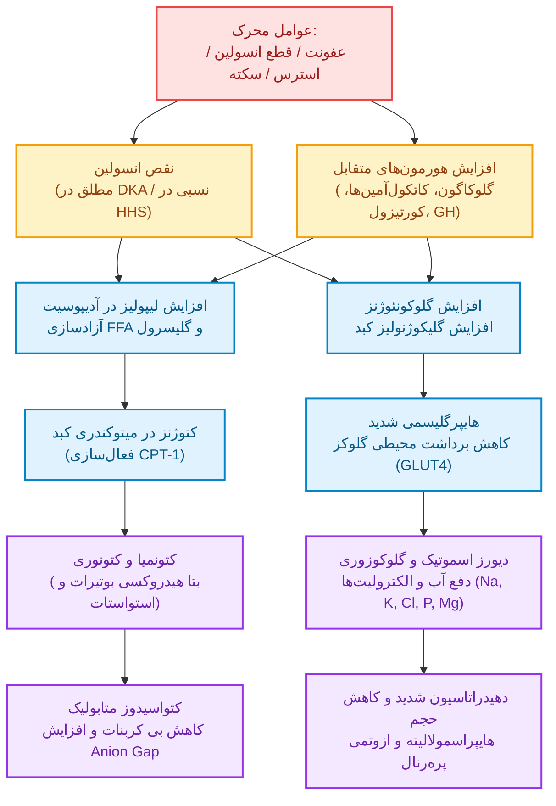
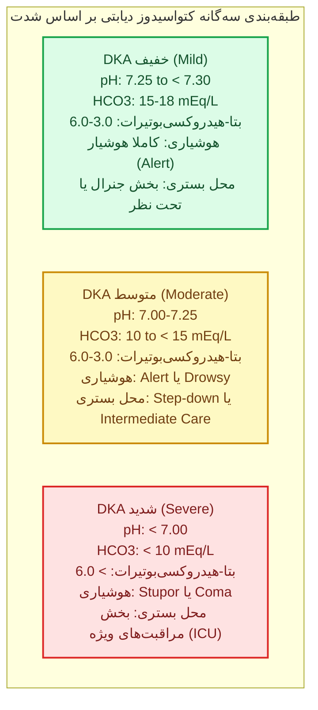
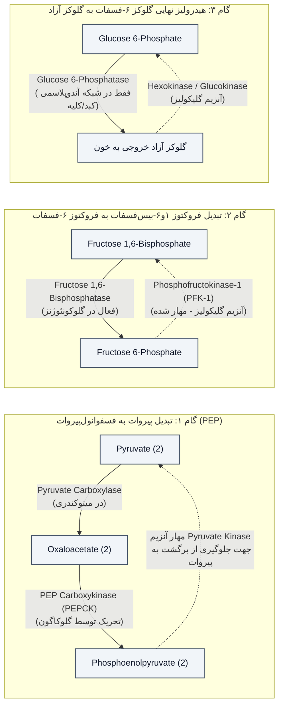
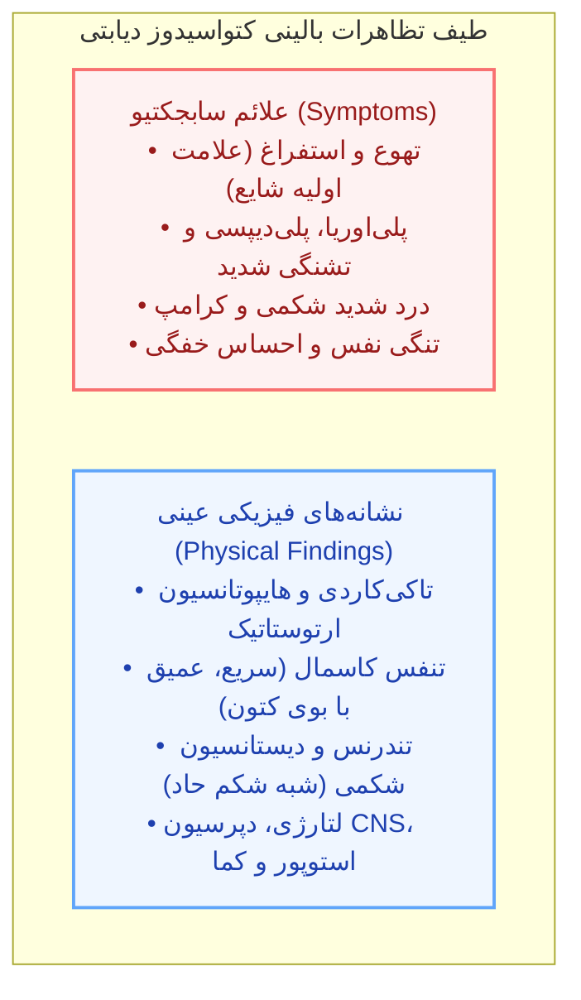
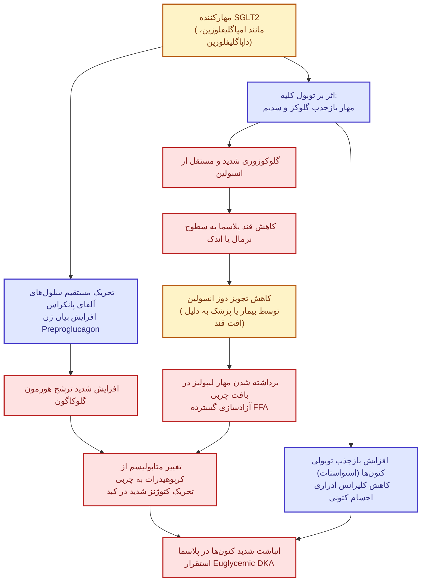

# عوارض حاد متابولیک دیابت ملیتوس (DKA و HHS)

> [!abstract] ماهیت بالینی سندرم‌های هایپرگلیسمیک حاد
> عوارض حاد متابولیک دیابت، تظاهرات نهایی برهم‌خوردن هومئوستاز انسولین هستند که در قالب یک پیوستار بالینی (*Continuum*) از **هایپرگلیسمی با یا بدون کتوز** نمایان می‌شوند. در این طیف، حدود *یک‌سوم* بیماران ارائه‌دهنده یک فرم ترکیبی و همپوشان (*Hybrid DKA/HHS Presentation*) می‌باشند.

---

## ۱. ارکان سه‌گانه و اصول پاتوفیزیولوژیک پایه

سه اختلال محوری سازنده تمام پیامدهای حاد متابولیک:
1. **کمبود انسولین**: به‌صورت نسبی (*Relative*) یا مطلق (*Absolute*).
2. **تخلیه شدید حجم داخل عروقی** (*Volume Depletion*): ثانویه به دیورز اسموتیک.
3. **ناهنجاری‌های تعادل اسید-باز** (*Acid-Base Disturbances*): کتواسیدوز و اختلالات آنیون‌گپ.

---

## ۲. معیارهای تشخیصی رسمی و قطعی (ADA / EASD)

> [!info] معیار ورود و تشخیص بالینی DKA
> تشخیص قطعی کتواسیدوز دیابتی مستلزم حضور همزمان هر سه مؤلفه زیر است:
> 1. گلوکز خون بیشتر از 200 mg/dL (یا 11.1 mmol/L) یا سابقه قبلی ابتلا به دیابت.
> 2. کتونمی با سطح سرمی β-Hydroxybutyrate مساوی یا بیشتر از 3.0 mmol/L یا کتون ادراری مساوی یا بیشتر از +2.
> 3. اسیدوز متابولیک با pH وریدی کمتر از 7.30 و/یا بی‌کربنات سرم کمتر از 18 mEq/L.

### مقایسه مشخصات و شاخص‌های قطعی DKA و HHS

| شاخص تشخیصی | کتواسیدوز دیابتی (DKA) | سندرم هایپراسمولار هایپرگلیسمیک (HHS) |
| :--- | :--- | :--- |
| **گروه هدف بالینی** | عمدتا سنین جوان‌تر، *Type 1 DM* (و فرم‌های مستعد کتوز T2DM) | عمدتا سنین سالمندی و سالمندان، *Type 2 DM* |
| **سرعت استقرار علائم** | حاد و سریع: طی **چند ساعت تا چند روز** (< 24 ساعت) | موذی و تدریجی: طی **چند روز تا یک هفته** |
| **سطح گلوکز پلاسما** | معمولا بین **250 تا 600 mg/dL** (معادل 13.9–33.3 mmol/L) | بسیار شدید و اغلب **≥ 600 mg/dL** تا بیش از 1000–1200 mg/dL |
| **کتونمیا / کتونوریا** | واضح و شدید؛ **β-OHB ≥ 3.0 mmol/L** یا کتون ادرار **≥ +2** | غایب یا اندک؛ **β-OHB < 3.0 mmol/L** (معمولا < 1.0) و کتون ادرار **< +2** |
| **وضعیت اسید-باز** | اسیدوز؛ **pH < 7.30** و **HCO3 < 18 mEq/L** | فقدان اسیدوز؛ **pH ≥ 7.30** و **HCO3 ≥ 15 mEq/L** (اغلب > 18) |
| **اسمولالیته مؤثر سرم** | متغیر، غالبا در محدوده **300 تا 320 mOsm/kg** | شدیدا بالا؛ **> 300 mOsm/kg** (اسمولالیته تام **> 320 mOsm/kg**) |
| **شکاف آنیونی (Anion Gap)** | افزایش‌یافته (**High Anion Gap**) | نرمال یا افزایش بسیار خفیف ثانویه به دهیدراتاسیون |
| **تنفس کاسمال و درد شکم** | **شایع و برجسته** (به‌علت اسیدوز متابولیک و تحریک موضعی) | **اکیدا غایب** (نبود اسیدوز قابل توجه) |
| **وضعیت سطح هوشیاری** | معمولا هوشیار (*Alert*)، خواب‌آلودگی در موارد پیشرفته | اختلال شناختی، *Lethargy*، استوپور یا کمای واقعی بسیار شایع |

> [!tip] فرمول‌های اسمولالیته سرم
> - **اسمولالیته موثر پلاسما (Effective Osmolality)**:
>   2 × Na⁺ (mmol/L) + Glucose (mmol/L)
>   *یا با واحد میلی‌گرم بر دسی‌لیتر*:
>   2 × Na⁺ (mEq/L) + [Glucose (mg/dL) / 18]
> - **اسمولالیته تام سرم (Total Serum Osmolality)**:
>   2 × Na⁺ (mmol/L) + Glucose (mmol/L) + Urea (mmol/L)
>   *یا*:
>   2 × Na⁺ (mEq/L) + [Glucose / 18] + [BUN / 2.8]

---

## ۳. طبقه‌بندی شدت DKA و تعیین سطح مراقبت درمانی

> [!warning] انعطاف‌پذیری بالینی در تریاژ بیماران
> جهت دسته‌بندی بیمار در طبقات خفیف، متوسط یا شدید، نیازی به برقراری همزمان تمام پارامترها نیست. انتخاب بخش بستری در نهایت یک **تصمیم‌گیری بالینی جامع** بر پایه شرایط بیمار است.

### جزئیات مقادیر تشخیصی شدت DKA بر اساس تابلوی استاندارد

| متغیر بالینی / آزمایشگاهی | DKA خفیف (Mild) | DKA متوسط (Moderate) | DKA شدید (Severe) |
| :--- | :--- | :--- | :--- |
| **قند پلاسما (معیار D)** | ≥ 200 mg/dL (11.1 mmol/L) | ≥ 200 mg/dL (11.1 mmol/L) | ≥ 200 mg/dL (11.1 mmol/L) |
| **کتونمیا (معیار K)** | β-OHB بین 3.0 تا 6.0 mmol/L | β-OHB بین 3.0 تا 6.0 mmol/L | **β-OHB > 6.0 mmol/L** |
| **اسیدوز (معیار A): pH** | 7.25 تا کمتر از 7.30 | 7.00 تا 7.25 | **کمتر از 7.00** |
| **اسیدوز (معیار A): HCO3** | 15 تا 18 mmol/L | 10 تا کمتر از 15 mmol/L | **کمتر از 10 mmol/L** |
| **وضعیت نورولوژیک ذهنی** | کاملا هوشیار (*Alert*) | هوشیار یا خواب‌آلود (*Drowsy*) | **استوپور یا کما** (*Stupor/Coma*) |
| **سطح مراقبت و بستری** | بخش عمومی بستری یا تحت‌نظر | بخش واسط مراقبت (*Step-down*) | **بخش مراقبت‌های ویژه (ICU)** |

---

## ۴. اتیولوژی و عوامل محرک بروز (Precipitating Causes)

> [!danger] تله تشخیصی: ماهیت عفونت در بیماران DKA
> لکوسیتوز با شیفت به چپ ناشی از استرس و دهیدراتاسیون در DKA یک یافته همیشگی است. از سوی دیگر، **بیمار مبتلا به عفونت شدید ممکن است به دلیل اختلال تنظیم حرارتی، فاقد تب بوده و حتی دچار هایپوترمی شود**. هایپوترمی نشانه پیش‌آگهی نامساعد است.

### توزیع جغرافیایی علل محرک DKA در بزرگسالان (درصد داده‌های مرجع)

| کشور / منطقه | دیابت تازه‌تشخیص (New-onset) | عفونت (Infection) | قطع/عدم تزریق انسولین | سایر علل (Other) | علت نامشخص (Unknown) |
| :--- | :--- | :--- | :--- | :--- | :--- |
| **ایالات متحده آمریکا (U.S.)** | 17.2–23.8% | 14.0–16.0% | **41.0–59.6%** | 9.7–18.0% | 3.0–4.2% |
| **انگلستان (U.K.)** | 6.1% | **44.6%** | 19.7% | 10.9% | 18.7% |
| **استرالیا (Australia)** | 5.7% | 28.6% | **40.0%** | 25.7% | گزارش نشده (NR) |
| **برزیل (Brazil)** | 12.2% | 25.0% | **39.0%** | 15.0% | 8.8% |
| **چین (China)** | گزارش نشده (NR) | **39.2%** | 24.0% | 10.9% | 25.9% |
| **اندونزی (Indonesia)** | 3.3% | **58.3%** | 13.3% | 17.1% | 8.0% |
| **کره جنوبی (South Korea)** | گزارش نشده (NR) | 25.3% | **32.7%** | 11.2% | 30.8% |
| **نیجریه (Nigeria)** | گزارش نشده (NR) | 32.5% | 27.5% | 4.8% | **34.6%** |
| **اسپانیا (Spain)** | 12.8% | **33.2%** | 30.7% | 23.3% | گزارش نشده (NR) |
| **سوریه (Syria)** | گزارش نشده (NR) | **47.8%** | 23.5% | 7.8% | 20.9% |
| **تایوان (Taiwan)** | 18.2% | **31.7%** | 27.7% | 6.2% | 16.2% |

### فهرست تفصیلی عوامل شعله‌ورکننده بالینی
1. **عفونت‌ها**: شایع‌ترین عامل در بیشتر مناطق جهان (پنومونی، UTI، گاستروانتریت، سپسیس).
2. **پرهیز یا عدم مصرف دوز انسولین**: قطع عمدی، خطای بیمار، خرابی پمپ انسولین یا اشکال در پایش روزهای بیماری (*Poor sick-day management*).
3. **دیابت قبلا شناخته‌نشده (*New-onset DM*)**: تظاهر اولیه دیابت نوع 1 در کودکان و بزرگسالان.
4. **انفارکتوس و حوادث عروقی**: انفارکتوس میوکارد (MI)، حوادث عروقی مغز (CVA/Stroke)، انفارکتوس مزانتر، ایسکمی اندام تحتانی.
5. **پانکراتیت حاد**: محرک DKA و همچنین عارضه ثانویه ناشی از هایپرتری‌گلیسریدمی شدید.
6. **سوءمصرف مواد**: به ویژه *کوکائین* (محرک قوی ترشح هورمون‌های متقابل).
7. **داروها**:
   - کورتیکواستروئیدها
   - دیورتیک‌های تیازیدی
   - داروهای آنتی سایکوتیک آتیپیک (*Atypical Antipsychotics*)
   - مهارکننده‌های هم انتقالی سدیم-گلوکز (*SGLT2 inhibitors*)
8. **بارداری**: تسهیل کتوژنز و بروز DKA در آستانه‌های قندی پایین‌تر.

---

## ۵. جزئیات بیوشیمیایی و پاتوفیزیولوژی سلولی

> [!info] اصل هم‌افزایی هورمونی
> جهت القا و پایدار ماندن کتواسیدوز دیابتی، **حضور همزمان هر دو عامل** ضروری است:
> 1. کاهش مطلق یا نسبی انسولین پلاسما.
> 2. افزایش و طغیان هورمون‌های متقابل مهارکننده انسولین (*Glucagon, Epinephrine, Cortisol, GH*).
> برآیند این دو، برهم‌خوردن شدید **نسبت انسولین به گلوکاگون** است.

### الف) ۳ واکنش آنزیمی متمایز کننده گلوکونئوژنز از گلیکولیز در کبد

### ب) توالی کامل واسطه‌های متابولیک از پیروات تا گلوکز
مسیر کامل بیوشیمیایی به شرح زیر است:
`Pyruvate` → `Oxaloacetate` → `Phosphoenolpyruvate (2)` → `2-Phosphoglycerate (2)` (توسط Enolase) → `3-Phosphoglycerate (2)` (توسط Phosphoglycerate Mutase) → `1,2-Bisphosphoglycerate (2)` (توسط Phosphoglycerate Kinase) → `Glyceraldehyde 3-Phosphate (2)` ⇄ `Dihydroxyacetone Phosphate` (توسط Triose Phosphate Isomerase) → `Fructose 1,6-Bisphosphate` (توسط Aldolase) → `Fructose 6-Phosphate` → `Glucose 6-Phosphate` (توسط Phosphohexose Isomerase) → `Glucose`.

### ج) پاتوفیزیولوژی لیپولیز و کتوژنز کبدی
- **بافت چربی**: کاهش انسولین منجر به دیس‌این هیبیشن لیپاز حساس به هورمون (*Hormone-Sensitive Lipase*) شده که باعث تجزیه شدید تری‌گلیسریدها و آزادسازی مقادیر هنگفت **اسیدهای چرب آزاد (FFA)** و **گلیسرول** می‌شود.
- **عضلات اسکلتی**: کاهش انسولین مانع عملکرد ناقل **GLUT4** شده و ورود گلوکز مهار می‌گردد؛ بافت عضلانی با پروتئولیز اسیدهای آمینه گلوکوژنیک (نظیر آلانین) و لاکتات آزاد کرده و دفع ازت (*Nitrogen loss*) رخ می‌دهد.
- **میتوکندری کبد و آنزیم کلیدی CPT-1**: هایپرگلوکاگونمی غلظت مالونیل-کوآ را مهار کرده و در نتیجه آنزیم **Carnitine Palmitoyltransferase-1 (CPT-1)** به‌شدت فعال می‌گردد؛ این امر باعث انتقال اسیدهای چرب طویل‌زنجیر به درون ماتریکس میتوکندری جهت **بتا اکسیداسیون** می‌شود.
- **تولید کتون‌ها**: اکسیداسیون FFA به تولید استیل-کوآ بیش از ظرفیت چرخه کربس منتهی شده و اجسام کتونی تولید می‌شوند:
  1. **Acetoacetate (AcAc)**
  2. **β-Hydroxybutyrate (β-OHB)** (تولید با نسبت بیش از 3 برابر تا 10 برابر استواستات در اسیدوز شدید)
  3. **Acetone** (محصول دکربوکسیلاسیون غیرآنزیمی و عامل بوی میوه‌ای بازدم).

> [!important] مکانیسم بروز اسیدوز و شوک هیپرتری‌گلیسریدمی
> اجسام کتونی به شکل اسیدهای کتونی تفکیک شده و یون هیدروژن ($H^+$) آزاد می‌کنند که توسط بافر بی‌کربنات خنثی می‌شود. با تخلیه بی‌کربنات، **کتواسیدوز با شکاف آنیونی بالا** استقرار می‌یابد. 
> همزمان، افزایش سنتز کبدی VLDL و تری‌گلیسرید همراه با مهار آنزیم انسولین-وابسته **لیپوپروتئین لیپاز (LPL)** منجر به کلیرانس معیوب شیلومیکرون و VLDL و ایجاد **هایپرتری‌گلیسریدمی ثانویه شدید** می‌شود که مستعدکننده بیمار به پانکراتیت حاد است.

---

## ۶. مقایسه جامع پارامترهای آزمایشگاهی و بیوشیمی بالینی

> [!info] واکنش نیتروپروساید و تله آزمایشگاهی پایش اسیدوز
> واکنش استاندارد نیتروپروساید در کیت‌های نواری ادرار یا سرم فقط قادر به ردیابی **استواستات و استون** است و فرم غالب کتون در DKA یعنی **بتا-هیدروکسی‌بوتیرات را شناسایی نمی‌کند**. 
> حین درمان موفق DKA، با اصلاح اسیدوز، بتا-هیدروکسی‌بوتیرات به استواستات تبدیل می‌شود؛ بنابراین ممکن است نتیجه نوار ادراری موقتا مثبت‌تر شود، در حالی که وضعیت بیمار در حال بهبود است!

### جدول مرجع متغیرهای بیوشیمیایی در اورژانس‌های هایپرگلیسمیک

| پارامتر آزمایشگاهی | محدوده در DKA کلاسیک | محدوده در HHS | محدوده در Euglycemic DKA |
| :--- | :--- | :--- | :--- |
| **گلوکز پلاسما** | 250 تا 600 mg/dL (13.9–33.3 mmol/L) | **600 تا 1200 mg/dL** (33.3–66.6 mmol/L) | **< 200 تا 250 mg/dL** (< 11.1–13.9 mmol/L) |
| **سدیم سرم (Na)** | 125 تا 135 mEq/L (کاهش کاذب) | 135 تا 145 mEq/L (سدیم اصلاح‌شده بالا) | حدود 135 mEq/L |
| **پتاسیم سرم (K)** | طبیعی تا بالا (Normal to ↑) | طبیعی (Normal) | طبیعی تا بالا (Normal to ↑) |
| **منیزیم و کلراید** | طبیعی در بدو ورود | طبیعی در بدو ورود | طبیعی در بدو ورود |
| **فسفات پلاسما** | طبیعی در بدو ورود | طبیعی تا کاهش مختصر | طبیعی در بدو ورود |
| **کراتینین سرم** | افزایش خفیف تا متوسط | **افزایش متوسط تا شدید** | افزایش خفیف |
| **اسمولالیته پلاسما** | 300 تا 320 mOsm/kg | **330 تا 380 mOsm/kg** | حدود 300 mOsm/kg |
| **کتون ادرار و سرم** | شدیدا مثبت (++++ یا ≥ +2) | منفی تا رد ناچیز (+/- یا < +2) | شدیدا مثبت (++++ یا ≥ +2) |
| **سرمی β-OHB** | **بیش از 2.5 mmol/L** (اغلب ≥ 3.0) | **کمتر از 1.0 mmol/L** | **بیش از 2.5 mmol/L** (اغلب ≥ 3.0) |
| **بی‌کربنات سرم** | **کمتر از 18 mEq/L** (شدید: < 10) | **بیش از 18 mEq/L** (یا ≥ 15) | کمتر از 18 mEq/L |
| **pH شریانی** | **6.8 تا 7.30** (شدید: < 7.00) | **بیش از 7.30** | 6.8 تا 7.30 |
| **فشار دی‌اکسید کربن شریانی (PCO2)** | کاهش جبرانی: **20 تا 30 mmHg** | طبیعی (Normal) | کاهش جبرانی: 20 تا 30 mmHg |
| **شکاف آنیونی (Anion Gap)** | **شدیدا افزایش‌یافته (↑)** | طبیعی تا افزایش ناچیز | **شدیدا افزایش‌یافته (↑)** |

> [!tip] فرمول تصحیح سدیم و نکات تشخیصی کراتینین و آمیلاز
> 1. **فرمول اصلاح سدیم سرم (Corrected Sodium)**:
>    به ازای هر 100 mg/dL افزایش قند خون بالاتر از سطح نرمال (100 mg/dL)، سدیم اندازه‌گیری شده سرم حدود **1.6 mEq/L کاهش کاذب** نشان می‌دهد. اگر سطح سدیم اندازه‌گیری شده در بدو ورود نرمال یا بالا باشد، بیانگر دهیدراتاسیون و هدررفت فوق‌العاده شدید آب تام بدن است.
> 2. **تداخل آزمایشگاهی کراتینین**: سطوح بالای استواستات در روش رنگ‌سنجی آزمایشگاهی ایجاد تداخل کرده و باعث **افزایش کاذب غلظت کراتینین سرم** می‌شود.
> 3. **تفسیر هایپرآمیلازمی**: افزایش آمیلاز سرم در DKA بسیار شایع است اما عمدتا منشا **بزاقی** دارد و دال بر پانکراتیت نیست؛ در صورت شک بالینی به پانکراتیت باید منحصرا **لیپاز سرم** سنجیده شود.

---

## ۷. نقایص و کمبودهای کل آب و الکترولیت‌های بدن

> [!danger] پارادوکس بالینی پتاسیم در DKA
> اگرچه پتاسیم سرم در بدو مراجعه به دلیل شیفت یونی ناشی از اسیدوز، کمبود انسولین و هایپراسمولالیته ممکن است نرمال یا بالا باشد، اما **ذخیره تام پتاسیم کل بدن (Total-body stores) همواره دچار کاهش شدید و بحرانی است**. درمان با انسولین بدون پایش پتاسیم به ایست قلبی ثانویه به هایپوکالمی منجر می‌گردد.

### مقایسه مقادیر مطلق کمبود آب و الکترولیت‌ها (Total Body Deficits)

| شاخص آب یا الکترولیت | میزان کمبود در DKA | میزان کمبود در HHS |
| :--- | :--- | :--- |
| **آب تام بدن (حجم کل)** | **6 لیتر** | **9 لیتر** |
| **کمبود آب بر اساس وزن** | **100 mL/kg** | **100 تا 200 mL/kg** |
| **سدیم (Na⁺)** | 7 تا 10 mEq/kg | 5 تا 13 mEq/kg |
| **کلراید (Cl⁻)** | 3 تا 5 mEq/kg | 5 تا 15 mEq/kg |
| **پتاسیم (K⁺)** | 3 تا 5 mEq/kg | 4 تا 6 mEq/kg |
| **منیزیم (Mg²⁺)** | 1 تا 2 mEq/kg | 1 تا 2 mEq/kg |
| **کلسیم (Ca²⁺)** | 1 تا 2 mEq/kg | 1 تا 2 mEq/kg |
| **فسفات (PO₄³⁻)** | 5 تا 7 mEq/kg | 3 تا 7 mEq/kg |

---

## ۸. تظاهرات و نشانه‌های بالینی DKA

### نکات کلیدی معاینه فیزیکی و تظاهرات سیستمیک
- **درد شکمی و اتساع روده**: در DKA بسیار شایع بوده و با حساسیت در لمس (*Tenderness*)، ایلئوس و اتساع شکم همراه است اما **بدون ریباند تندرنس** است؛ این نما می‌تواند شکم جراحی حاد یا پانکراتیت را تقلید کند و اغلب با اصلاح اسیدوز برطرف می‌شود.
- **تنفس کاسمال (*Kussmaul Respirations*)**: تنفس‌های تند و فوق‌العاده عمیق جهت تخلیه دی‌اکسید کربن و جبران تنفسی اسیدوز به همراه بوی میوه‌ای (*Fruity odor*) ناشی از استون بازدمی.
- **وضعیت سیستم عصبی مرکزی**: دپرسیون هوشیاری ناشی از افزایش اسمولالیته و اسیدوز است. حضور هرگونه نقص فوکال نورولوژیک (*Focal neurological deficits*) غیرطبیعی بوده و باید فورا بررسی از نظر سپسیس، هیپوکسی، سکته مغزی یا ترومبوز عروق مغزی را برانگیزد.
- **ادم مغزی (*Cerebral Edema*)**: عارضه‌ای مرگبار که در بزرگسالان نادر بوده اما در **کودکان و نوجوانان** حین درمان و افت سریع اسمولالیته شایع‌تر و تهدیدکننده حیات است.

---

## ۹. جزئیات بالینی و پاتوفیزیولوژیک سندرم هایپراسمولار هایپرگلیسمیک (HHS)

> [!info] مکانیسم غیبت کتوز در HHS
> در سندرم هایپراسمولار، **کمبود انسولین صرفا نسبی است**. غلظت‌های اندک باقیمانده انسولین درون پورت برای مهار لیپولیز در بافت چربی و مهار کتوژنز در کبد کفایت می‌کند، اما قادر به تسهیل برداشت محیطی گلوکز در عضلات یا مهار گلوکونئوژنز کبدی نیست. افزون بر این، سطح هورمون‌های متقابل در HHS پایین‌تر از DKA است.

### ویژگی‌های تشخیصی و بالینی انحصاری HHS
1. **استقرار در بیماران با اختلال دسترسی به آب**: اغلب در افراد مسن مبتلا به سکته مغزی پیشین، دمانس، بستری در آسایشگاه یا ناتوانی حرکتی که حس تشنگی مختل شده یا توان فیزیکی نوشیدن آب را ندارند رخ می‌دهد.
2. **دیورز اسموتیک پایدار و طولانی**: به دلیل عدم بروز اسیدوز حاد و نبود درد شکم و تنفس کاسمال، بیماری برای روزها تا هفته‌ها نادیده مانده و به دهیدراتاسیون فاجعه‌بار (کسری آب تا 9 لیتر) ختم می‌شود.
3. **همراهی با بیماری‌های حاد همزمان**: اغلب با سکته قلبی، پنومونی، سپسیس یا ترومبوآمبولی شعله‌ور می‌شود.
4. **شواهد آزمایشگاهی مشخص**:
   - قند پلاسما معمولا بیش از **1000 mg/dL**.
   - اسمولالیته سرم بیش از **350 mOsm/kg**.
   - ازوتمی پره‌رنال شدید با بالا رفتن بسیار چشمگیر BUN و کراتینین.
   - سدیم اصلاح‌شده معمولا هایپرناترمی واقعی را نشان می‌دهد.
   - کتونوری منفی است یا در حد اثر (*Trace*) ثانویه به گرسنگی طولانی است. اسیدوز لاکتیک خفیف می‌تواند ناشی از هایپوپرفیوژن محیطی رخ دهد.

---

## ۱۰. کتواسیدوز دیابتی با قند نرمال (Euglycemic DKA) و داروهای SGLT2i

> [!danger] تعریف Euglycemic DKA و خطر تاخیر تشخیصی
> کتواسیدوز با قند طبیعی عبارت است از استقرار کتواسیدوز متابولیک شدید همراه با کتونمیا در شرایطی که **قند خون نرمال یا صرفا افزایش خفیف دارد (< 200–250 mg/dL)**. غیبت هایپرگلیسمی شدید موجب غفلت کادر درمان و بیمار و تاخیر فاجعه‌بار در آغاز درمان با انسولین می‌شود.

### توصیه‌های ویژه انجمن متخصصین بالینی غدد درون‌ریز (AACE)
- مهارکننده‌های SGLT2 متابولیسم سوبسترا را از سوخت کربوهیدرات به **متابولیسم چربی** سوق می‌دهند.
- به دلیل بازجذب توبولی کتون‌ها و دفع ناکافی آن در ادرار، **اکیدا توصیه می‌شود پایش و تشخیص کتواسیدوز بر پایه سنجش مستقیم β-OHB در خون صورت گیرد، نه تست کتون نواری ادرار**.
- در صورت بروز هرگونه علائم سیستمیک نظیر ضعف، تهوع یا تنگی نفس در مصرف‌کنندگان این دارو، قند خون نرمال به هیچ وجه ردکننده DKA نیست.

---

## ۱۱. تشخیص‌های افتراقی اسیدوزهای متابولیک با شکاف آنیونی بالا

> [!info] علل چهارگانه اصلی High Anion Gap Acidosis
> 1. انواع کتواسیدوزها (*Ketoacidosis*: دیابتی، الکلی، گرسنگی).
> 2. اسیدوز لاکتیک (*Lactic Acidosis*).
> 3. نارسایی مزمن کلیه و اورمی (*Chronic Renal Failure*).
> 4. سمیت‌های دارویی و توکسین‌ها (*Drug Toxicity*: سالیسیلات‌ها، متانول، اتیلن‌گلیکول).

### جدول افتراق انواع سندرم‌های کتواسیدوز غیردیابتی

| سندرم بالینی | زمینه رخداد و مکانیسم ایجاد | وضعیت گلوکز پلاسما | بیوشیمی کتون و اسید-باز |
| :--- | :--- | :--- | :--- |
| **کتوز ناشی از گرسنگی (Starvation Ketosis)** | دریافت کالری کمتر از 500 kcal/day؛ تخلیه ذخایر گلیکوژن و افت اندک انسولین پلاسما. | **طبیعی یا هیپوگلیسمی خفیف** | اسیدوز شدید رخ نمی‌دهد؛ بی‌کربنات سرم به‌ندرت به کمتر از **18 mEq/L** می‌رسد. |
| **کتواسیدوز الکلی (Alcoholic Ketoacidosis - AKA)** | سوءمصرف مزمن اتانول به همراه مصرف سنگین ناگهانی (*Binge drinking*)، استفراغ مداوم و قطع تغذیه. | **طبیعی یا پایین** (فاقد هایپرگلیسمی؛ گلوکز طبیعی یا هایپوگلیسمی) | کتواسیدوز آنیون‌گپ شدید؛ کتونمیا عمدتا از جنس بتا-هیدروکسی‌بوتیرات به دلیل نسبت بالای NADH/NAD. |
| **کتوز بارداری و هایپرامزیس (Hyperemesis Gravidarum)** | استفراغ‌های شدید بارداری منجر به دهیدراتاسیون، گرسنگی و طغیان شدید هورمون‌های متقابل ضدانسولین. | **طبیعی یا اندکی پایین** | تولید کتون به همراه آلکالوز متابولیک ناشی از استفراغ یا اسیدوز متابولیک خفیف ثانویه به کتوز. |
