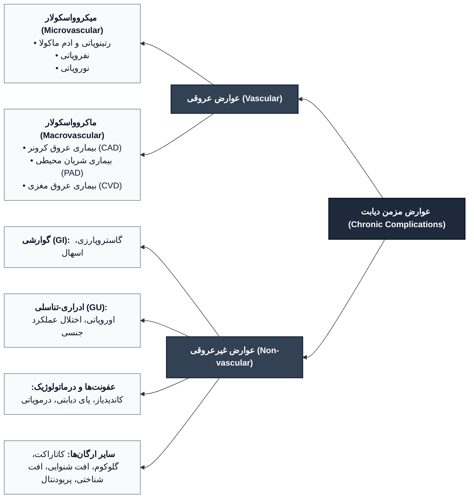
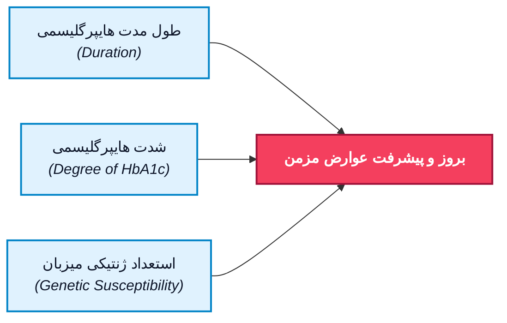
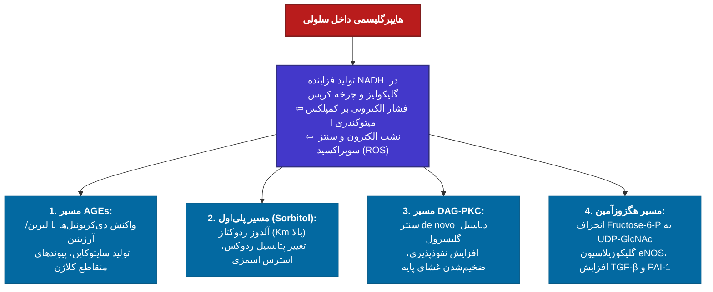
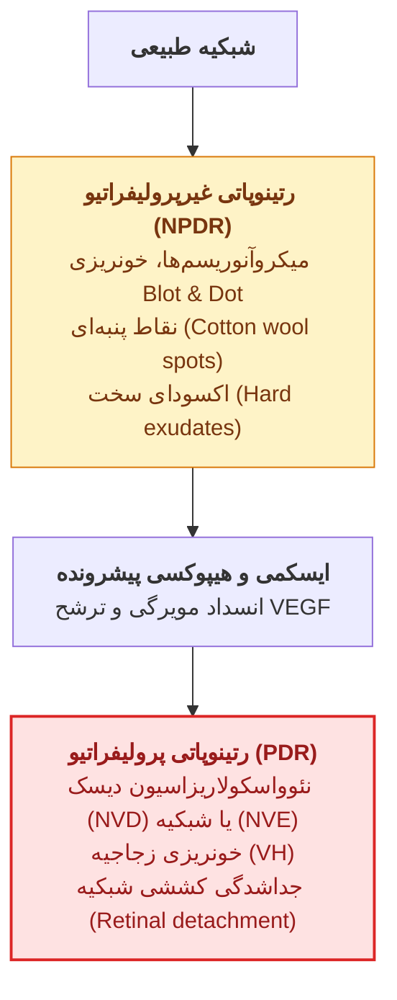
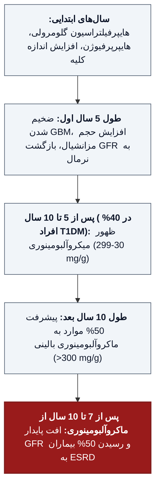
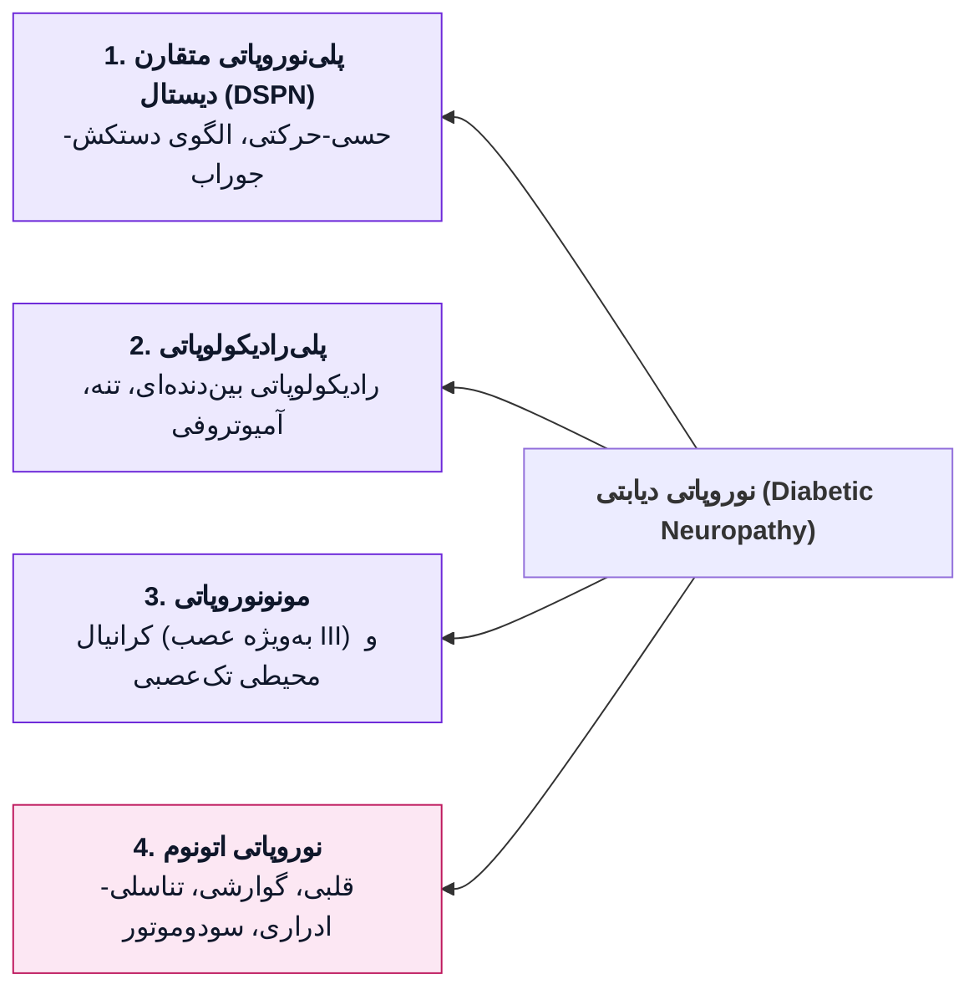
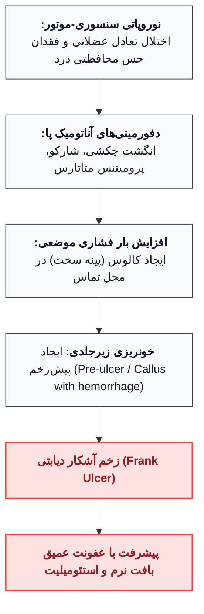
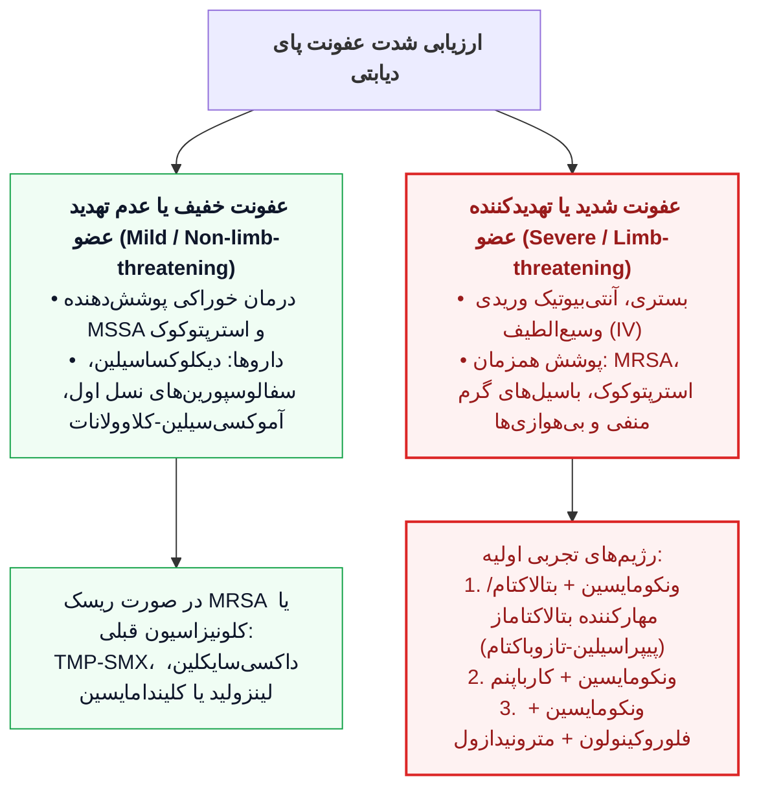
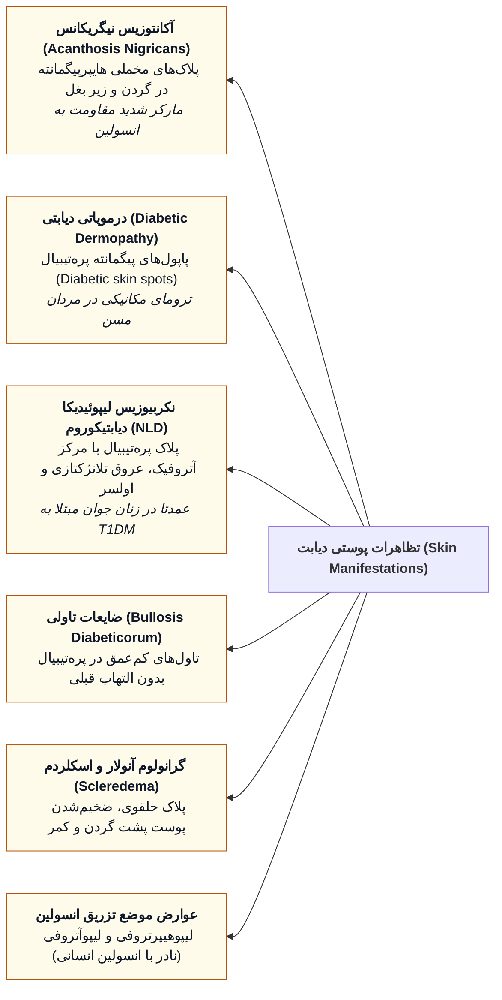
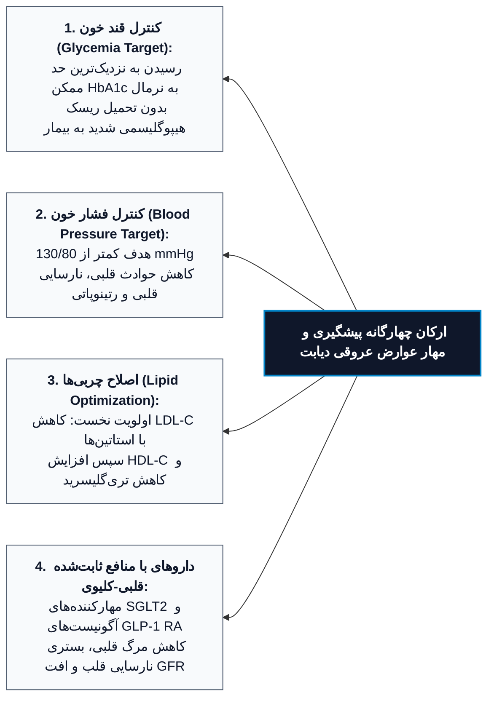

# عوارض مزمن دیابت شیرین (DM)

## ۱. نمای کلی و طبقه‌بندی عوارض مزمن

> [!abstract] تعریف عوارض مزمن دیابت
> سندرم‌های بالینی چندارگانی ناشی از هایپرگلیسمی مزمن و اختلالات متابولیک همراه که علت اصلی ناخوشی (*Morbidity*) و مرگ‌ومیر (*Mortality*) در بیماران مبتلا به دیابت به شمار می‌روند.

### ۱.۱. طبقه‌بندی دوقطبی عوارض

1. **عوارض عروقی (Vascular Complications):**
   - **میکروواسکولار (Microvascular):**
     - **چشمی:** رتینوپاتی (غیرپرولیفراتیو/پرولیفراتیو)، ادم ماکولا (*Macular Edema*).
     - **نوروپاتی:** حسی-حرکتی (مونو/پلی‌نوروپاتی)، اتونومیک.
     - **نفروپاتی دیابتی:** آلبومینوری، نارسایی کلیه.
   - **ماکروواسکولار (Macrovascular):**
     - بیماری عروق کرونر قلب (*Coronary Artery Disease - CAD*).
     - بیماری شریان‌های محیطی (*Peripheral Arterial Disease - PAD*).
     - حوادث عروق مغزی (*Cerebrovascular Disease - Stroke*).

2. **عوارض غیرعروقی (Nonvascular Complications):**
   - **گاستروپارزی (*Gastroparesis*) و اختلال تحرک روده:** یبوست، اسهال شبانه.
   - **عفونت‌ها (*Infections*):** باکتریایی، قارچی، موارد انحصاری دیابت.
   - **تغییرات پوستی (*Skin Changes*):** درموپاتی، اکنوزیس نیگریکانس، نکربیوزیس لیپوئیدیکا.
   - **اختلال شنوایی (*Hearing Loss*):** در اثر دیابت طول‌کشیده (*Long-standing DM*).
   - **افت عملکرد ذهنی (*Impaired Mental Function*):** عمدتا مرتبط با *T2DM*.
   - **بیماری‌های اختصاصی چشم:** کاتاراکت زودرس، گلوکوم (*Glaucoma*).
   - **بیماری‌های لثه و دهان:** پریودنتال (*Periodontal disease*).

---

## ۲. کارآزمایی‌های بالینی بزرگ، کنترل گلیسمیک و حافظه متابولیک

> [!important] مفهوم حافظه متابولیک (Metabolic Memory / Legacy Effect)
> تداوم آثار محافظتی کنترل دقیق قند خون در سال‌های ابتدایی ابتلا به بیماری بر کاهش عوارض عروقی و مرگ‌ومیر، حتی پس از سال‌ها افت کیفیت کنترل گلیسمیک در مراحل بعدی زندگی.

### ۲.۱. جدول مقایسه‌ای دو کارآزمایی مرجع: DCCT در برابر UKPDS

| پارامتر مقایسه‌ای | مطالعه DCCT (+ فاز تمدید یافته EDIC) | مطالعه UKPDS |
| :--- | :--- | :--- |
| **جامعه هدف** | دیابت نوع ۱ (*T1DM*)؛ تعداد > 1400 نفر | دیابت نوع ۲ تازه تشخیص (*T2DM*)؛ تعداد > 5000 نفر |
| **طول دوره پیگیری** | میانگین 6.5 سال در فاز نخست؛ بیش از 40 سال پیگیری کلی (*DCCT + EDIC*) | بیش از 10 سال مداخله و پیگیری بلندمدت |
| **مداخلات درمانی** | درمان متمرکز/فشرده (پمپ یا *MDI* + حمایت گسترده) در برابر کنترل سنتی | درمان فشرده (انسولین، سولفونیل‌اوره یا متفورمین) در برابر درمان متداول (رژیم) |
| **HbA1c ثبت‌شده** | گروه متمرکز: **7.3%** در برابر سنتی: **9.1%** | گروه متمرکز: **7.0%** در برابر سنتی: **7.9%** |
| **کاهش عوارض میکروواسکولار** | • رتینوپاتی: **47%** کاهش • آلبومینوری: **39%** کاهش • نفروپاتی بالینی: **54%** کاهش • نوروپاتی: **60%** کاهش | کاهش **35%** عوارض میکروواسکولار به ازای هر **1%** افت در میزان *HbA1c* |
| **عوارض جانبی مداخله** | افزایش وزن میانگین **4.6 kg** و فراوانی بالاتر هیپوگلیسمی شدید | ریسک بالاتر هیپوگلیسمی در بازوی متمرکز دارویی |
| **پیامد ماکروواسکولار و مرگ** | در فاز طولانی‌مدت: کاهش **57%** حوادث قلبی‌عروقی و کاهش **33%** مرگ | کاهش معنی‌دار نرخ حوادث قلبی در پیگیری بالای 10 سال با سولفونیل‌اوره، انسولین یا متفورمین |
| **مداخله فشار خون** | ارزیابی کنترل فشار جزو اهداف اولیه طرح نبود | ارزیابی بازوهای سخت‌گیرانه فشار خون؛ اثر محافظتی کنترل فشار خون **بزرگ‌تر** از قند خون بود |

> [!warning] نکات طلایی کارآزمایی‌های DCCT و EDIC
> 1. در فاز *EDIC* (پس از 6.5 سال فاز نخست)، تفاوت میزان *HbA1c* بین دو گروه محو شد و هر دو در مقدار میانگین **8.0%** یکسان شدند؛ با این حال، کاهش عوارض همچنان تداوم داشت (*Legacy Effect*).
> 2. پیش‌بینی سال‌های عمر اضافی بدون عارضه در گروه درمان فشرده DCCT:
>    - **7.7 سال** بینایی بیشتر
>    - **5.8 سال** رهایی بیشتر از نارسایی مرحله نهایی کلیه (*ESRD*)
>    - **5.6 سال** رهایی بیشتر از قطع اندام تحتانی
>    - بیش از **15.3 سال** طول عمر اضافی بدون عارضه شدید میکروواسکولار
>    - **5.1 سال** افزایش در امید به زندگی کلی (*Life expectancy*).
> 3. در فاز *EDIC*، علاوه بر کاهش نابینایی، دیالیز و قطع عضو، نرخ نوروپاتی اتونوم، ناتوانی مثانه و جنسی، کانونپاتی اتونوم قلبی (*CAN*) و افت شنوایی به شکل چشمگیری در بازوی درمان متمرکز کمتر بود.

> [!tip] درس‌های کلیدی کارآزمایی UKPDS و مطالعات تکمیلی
> - کنترل دقیق فشار خون به اهداف معتدل (**144/82 mmHg**) ریسک مرگ مرتبط با دیابت، سکته مغزی، پیامدهای میکروواسکولار، رتینوپاتی و نارسایی قلبی را بین **32% تا 56%** کاهش داد.
> - مطالعات **ACCORD** و **ADVANCE** نیز تایید کردند که بهبود کنترل قند خون مستقیما عوارض میکروواسکولار را مهار می‌کند.

---

## ۳. عوامل خطرساز و تفاوت تعیین‌کننده‌ها در بروز عوارض

> [!info] مثلث عوامل تعیین‌کننده عوارض مزمن
> میزان بروز عوارض مزمن دیابت تابعی مستقیم از سه فاکتور اساسی است:
> 1. **طول مدت هایپرگلیسمی (Duration of DM):** عوارض معمولا در دهه دوم بیماری پدیدار می‌شوند.
> 2. **درجه و شدت کنترل گلیسمیک (Degree of glycemic control):** سطح پیوسته *HbA1c*.
> 3. **استعداد ژنتیکی (Genetic susceptibility):** توضیح‌دهنده عدم ابتلای گروهی از بیماران با سابقه دیابت طولانی‌مدت به رتینوپاتی یا نفروپاتی.

> [!danger] تله تستی مهم: عوارض ماکروواسکولار در برابر میکروواسکولار
> - نقش علّی هایپرگلیسمی مزمن در عوارض *میکروواسکولار* قطعی و خطی است.
> - شواهد علّی هایپرگلیسمی در عوارض *ماکروواسکولار* نسبت به میکروواسکولار **کمتر قطعی (Less conclusive)** است.
> - ریسک مرگ و میر و حوادث بیماری عروق کرونر در بیماران مبتلا به *T2DM* حدود **2 تا 4 برابر** افراد غیردیابتی است.
> - حوادث ماکروواسکولار هم با قند خون ناشتا (*FPG*) و هم با قند خون پس از غذا (*PPG*) و سطح *HbA1c* همبستگی دارند، اما فاکتورهای زمینه‌ای دیگر شامل دیس‌لیپیدمی و پرفشاری خون نقش کاتالیزور قدرتمند را ایفا می‌کنند.
> - به علت دوره بدون علامت طولانی در *T2DM*، بسیاری از بیماران **در همان زمان تشخیص** دچار عوارض پایه‌ای هستند.

---

## ۴. مکانیسم‌های سلولی و مولکولی آسیب بافتی ناشی از هایپرگلیسمی

> [!abstract] تئوری یکپارچه‌ساز آسیب سلولی (Unifying Mechanism)
> افزایش شار گلوکز به میتوکندری سبب تولید بیش‌ازحد رادیکال سوپراکسید در زنجیره انتقال الکترون (*ETC*) می‌شود. مهار یا نرمال‌سازی این *ROS* میتوکندریایی، هر ۴ مسیر تخریبی کلاسیک هایپرگلیسمی را خنثی می‌سازد.

### ۴.۱. چهار مسیر بیوشیمیایی پاتولوژیک ناشی از سوپراکسید

1. **تشکیل محصولات نهایی گلیکاسیون پیشرفته (Advanced Glycation End Products - AGEs):**
   - اتصال دی‌کربونیل‌های مشتق از گلوکز به گروه‌های آمین اسیدهای آمینه **لیزین (Lysine)** و **آرژینین (Arginine)** پروتئین‌ها.
   - **آثار زیستی:**
     - ایجاد پیوندهای متقاطع (*Cross-linking*) در پروتئین‌های ماتریکس خارج سلولی و کلاژن.
     - تسریع آترواسکلروز، القای اختلال اندوتلیال و فیلتراسیون گلومرولی.
     - کاهش سنتز نیتریک اکساید (*NO*).
     - اتصال به گیرنده اختصاصی (*RAGE*) روی ماکروفاژها ⇦ تحریک ترشح سایتوکاین‌های التهابی (*IL-1* ،*TNF* ،*IGF-1*) و القای تکثیر سلولی و ماتریکس.
   - سطح سرمی *AGEs* همگام با افت فیلتراسیون گلومرولی (*GFR*) افزایش تصاعدی می‌یابد.

2. **مسیر سوربیتول / پلی‌اول (Sorbitol / Polyol Pathway):**
   - به طور فیزیولوژیک فقط بخش ناچیزی از گلوکز وارد این مسیر می‌شود.
   - آنزیم **آلدوز ردوکتاز (Aldose Reductase)** میل ترکیبی کمی به گلوکز دارد (*Km* بالا)؛ لذا در شرایط هایپرگلیسمی شدید فعال می‌شود.
   - گلوکز توسط آلدوز ردوکتاز به **سوربیتول** تبدیل شده و سپس سوربیتول توسط آنزیم **سوربیتول دهیدروژناز (SDH)** به فروکتوز اکسید می‌گردد.
   - سوربیتول توانایی عبور از غشای سلولی را **ندارد**؛ تجمع درون‌سلولی آن موجب **استرس اسمزی** شدید، تغییر پتانسیل ردوکس سلول و رهایش فزاینده گونه‌های واکنش‌پذیر اکسیژن (*ROS*) می‌شود.

3. **مسیر پروتئین کیناز C و دیاسیل گلیسرول (DAG - PKC Activation):**
   - سنتز نوبنیاد (*de novo*) پیام‌رسان لیپیدی *DAG* در اثر وفور گلوکز ⇦ فعال‌سازی ایزوفرم‌های مختلف پروتئین کیناز C (*PKC*).
   - تغییر رونویسی ژن‌های فیبرونکتین، کلاژن تیپ IV، پروتئین‌های انقباضی و پروتئین‌های ماتریکس خارج‌سلولی در سلول‌های اندوتلیال و نورون‌ها.
   - پیامد بالینی: افزایش نفوذپذیری عروقی، رگزایی ناهنجار، ضخیم‌شدن غشای پایه عروق و القای وضعیت پیش‌انعقادی (*Coagulation*).

4. **مسیر هگزوزآمین (Hexosamine Pathway):**
   - انحراف متابولیتی **Fructose-6-Phosphate** از مسیر معمول گلیکولیز جهت تولید سوبسترای *UDP-N-acetylglucosamine*.
   - تشکیل گلیکوپروتئین‌های با پیوند O (*O-linked*) و سنتز پروتئوگلیکان‌ها.
   - اختلال در ساختار پروتئین‌های تنظیمی بیان ژن، سیگنالینگ سلولی و انتقال درون‌سلولی.
   - گلیکوزیلاسیون آنزیم نیتریک اکساید سنتاز اندوتلیال (*eNOS*) ⇦ اختلال وازودیلاتاسیون.
   - تغییر بیان ژن‌های کلیدی: القای تولید **TGF-β** و مهارکننده فعال‌کننده پلاسمینوژن-1 (**PAI-1**).

### ۴.۲. بیوانرژتیک میتوکندری و فشار الکترونی NADH

- در شرایط پایه: **80% تا 90%** گلوکز بدن در گلیکولیز و **10% تا 20%** در مسیر پنتوز فسفات مصرف می‌شود.
- در هایپرگلیسمی: هجوم سوبسترا به گلیکولیز و کربس ⇦ تولید انبوه پیرووات، استیل‌کوآنزیم A و تجمع فراوان **NADH**.
- حامل الکترونی *NADH* موجب فشار بار الکترونی سهمگین بر **کمپلکس I (Complex I)** زنجیره تنفسی میتوکندری می‌شود که پایگاه اصلی بازیافت *NADH* به *+NAD* است.
- اکسیداسیون مازاد برای نجات از شرایط شبه‌هیپوکسی (*Pseudohypoxia*)، همراه با پمپاژ پروتون، موجب **نشت الکترون**، احیای ناکامل مولکول اکسیژن و تولید رادیکال آزاد سوپراکسید می‌گردد.

### ۴.۳. فاکتورهای رشد درگیر در پاتوژنز عوارض دیابت

- **VEGF-A:** به طور موضعی در رتینوپاتی پرولیفراتیو ترشح شده و محرک اصلی نئوواسکولاریزاسیون است؛ پس از فتوکوآگولاسیون پان‌رتینال (*PRP*) افت می‌کند.
- **TGF-β:** در نفروپاتی دیابتی روی سلول‌های مزانژیال اثر گذاشته و تولید کلاژن و فیبرونکتین غشای پایه را تحریک می‌کند.
- **سایر فاکتورها:** فاکتور رشد مشتق از پلاکت (*PDGF*)، فاکتور رشد اپیدرمال (*EGF*)، فاکتور رشد فیبروبلاست (*FGF*)، محور *GH/IGF-1* و خود هورمون انسولین.

---

## ۵. عوارض چشمی دیابت (Ophthalmologic Complications)

> [!abstract] بار بالینی درگیری چشمی
> دیابت، علت نخست کوری اکتسابی در جمعیت سنی **20 تا 74 سال** در ایالات متحده است. کاتاراکت و گلوکوم در بیماران دیابتی زودتر از افراد سالم و با شیوع بسیار بالاتری رخ می‌دهند. افت بینایی شدید عمدتا ناشی از دو عامل است: **رتینوپاتی پیشرونده** و **ادم ماکولای از نظر بالینی بااهمیت (CSME)**.

### ۵.۱. طبقه‌بندی تفصیلی رتینوپاتی دیابتی

1. **رتینوپاتی غیرپرولیفراتیو (Nonproliferative Diabetic Retinopathy - NPDR):**
   - سیر بالینی: ظهور در اواخر دهه اول یا اوایل دهه دوم پس از شروع بیماری.
   - در دیابت نوع ۱: شیوع **25%** در سال 5، **80%** در سال 15 و تقریبا **100%** پس از 20 سال.
   - **ضایعات مشخصه:**
     - نشت عروقی و ریزاتساع مویرگی (**میکروآنوریسم‌ها** - نخستین علامت قابل مشاهده).
     - خونریزی‌های نقطه‌ای و لکه‌ای (*Dot & blot hemorrhages*) و شعله‌ای (*Flame/Splinter*).
     - انفارکتوس‌های ریز لایه فیبر عصبی به نام **نقاط پنبه‌ای (Cotton wool spots)** یا اکسودای نرم.
     - **اکسودای سخت (Hard exudates):** تجمع چربی و لیپوپروتئین که گاه آرایش حلقوی به دور میکروآنوریسم دارند (*Circinate*).
     - ناهنجاری‌های عروقی درون شبکیه (*IRMA*)، دانه‌ای شدن و تسبیحی شدن وریدها (*Venous beading*).

2. **رتینوپاتی پرولیفراتیو (Proliferative Diabetic Retinopathy - PDR):**
   - مشخصه اصلی (*Hallmark*): **نئوواسکولاریزاسیون (Neovascularization)** در واکنش به ایسکمی و هیپوکسی شبکیه.
   - رشد عروق شکننده جدید در نزدیکی سر عصب بینایی (**NVD**) یا در سایر بخش‌های شبکیه (**NVE**).
   - پیامد پارگی عروق جدید: خونریزی زجاجیه (*Vitreous hemorrhage*)، تکثیر فیبروز، رتینیت پرولیفرانس و نهایتا **جداشدگی کششی شبکیه (Tractional retinal detachment)**.
   - تبدیل *NPDR* به *PDR*: هرچه شدت ضایعات *NPDR* عمیق‌تر باشد، احتمال پیشرفت به فرم پرولیفراتیو ظرف **5 سال** بیشتر است.

3. **ادم ماکولای بااهمیت بالینی (Clinically Significant Macular Edema - CSME):**
   - ضخیم‌شدن شبکیه ناشی از نشت عروقی و اکسودای سخت که فووه‌آ (*Fovea*) را درگیر می‌سازد.
   - می‌تواند در **هر دو بستر** *NPDR* یا *PDR* روی دهد.
   - ابزار تشخیصی: آنژیوگرافی فلورسین (*FA*) و توموگرافی انسجام اپتیکی (*OCT*).
   - در صورت عدم درمان، با شانس بسیار بالا برای افت بینایی متوسط ظرف مدت **3 سال** آینده همراه است.

> [!important] فاکتورهای پیش‌بینی‌کننده رتینوپاتی
> بهترین متغیرهای پیش‌بینی‌کننده بروز رتینوپاتی به ترتیب: **طول مدت دیابت** و **درجه کنترل قند خون** هستند. پرفشاری خون، نفروپاتی و دیس‌لیپیدمی ریزفاکتورهای کمکی‌اند. تاثیر ژنتیک کمتر از طول مدت و کنترل گلیسمی است. درمان استاندارد ضایعات پیشرفته شامل فتوکوآگولاسیون سراسری لیزری (*Panretinal laser photocoagulation - PRP*) است که ماکولا و فووه‌آ در آن تخریب نمی‌شوند تا دید مرکزی حفظ گردد.

---

## ۶. عوارض کلیوی (Renal Complications / DKD)

> [!abstract] تعریف بیماری کلیوی دیابت (DKD)
> نفروپاتی دیابتی علت اصلی بیماری مزمن کلیه (*CKD*) و نارسایی کلیوی نیازمند درمان جایگزین کلیه (*ESRD - Stage 5*) است. نفروپاتی معمولا تشخیصی بالینی بر اساس افت پایدار *eGFR* یا وجود آلبومینوری در غیاب سایر علل آسیب کلیوی است.

### ۶.۱. سیر زمانی و مراحل تغییرات ساختاری و عملکردی

1. **سال‌های اول پس از شروع:** جریان خون کلیوی بالا (*RBF High*)، فیلتراسیون گلومرولی بالا (*Hyperfiltration*) و هایپرتروفی کلیه (بزرگ‌شدن ابعاد کلیه).
2. **ظرف ۵ سال اول:** ضخیم‌شدن غشای پایه گلومرولی (*GBM*)، انبساط حجم مزانژیال، هایپرتروفی مداوم همراه با بازگشت نرخ *GFR* به سطح به ظاهر نرمال.
3. **پس از ۵ تا ۱۰ سال:** بروز میکروآلبومینوری در **40%** مبتلایان به دیابت نوع ۱.
4. **پیشرفت به پروتئینوری آشکار:** تنها **50%** افراد دارای میکروآلبومینوری ظرف ۱۰ سال به ماکروآلبومینوری پیشرفت می‌کنند.
5. **مرحله ماکروآلبومینوری (> 300 mg/d یا mg/g):** افت دائم و پیشرونده *GFR*، صعود خفیف فشار خون؛ حدود **50%** ظرف ۷ الی ۱۰ سال به *ESRD* می‌رسند. در این فاز آسیب‌های پاتولوژیک عملا برگشت‌ناپذیرند.

### ۶.۲. جدول مقایسه‌ای نفروپاتی در دیابت نوع ۱ و نوع ۲

| خصیصه پاتوفیزیولوژیک | نفروپاتی در دیابت نوع ۱ (T1DM) | نفروپاتی در دیابت نوع ۲ (T2DM) |
| :--- | :--- | :--- |
| **زمان ظهور آلبومینوری** | به ندرت قبل از 5 سال دیده می‌شود؛ اوج بروز بعد از 5 تا 10 سال | ممکن است در همان ابتدای زمان تشخیص به دلیل فاز بدون علامت اولیه حاضر باشد |
| **همراهی با پرفشاری خون** | معمولا دیررس‌تر و همگام با پیشرفت آلبومینوری ظاهر می‌شود | به طور بسیار شایع‌تری از ابتدا همگام با میکرو یا ماکروآلبومینوری حضور دارد |
| **ارزش پیش‌بینی‌کنندگی میکروآلبومینوری** | پیش‌بینی‌کننده بسیار قوی برای سیر مستقیم به سمت ماکروآلبومینوری و نارسایی | ارزش پیش‌بینی‌کنندگی ضعیف‌تر؛ افت *GFR* می‌تواند بدون آلبومینوری رخ دهد |
| **همراهی با رتینوپاتی دیابتی** | همبستگی بسیار بالا؛ حضور نفروپاتی بدون رتینوپاتی مشکوک است | همبستگی کمتر و ناپیوسته‌تر نسبت به نوع ۱ |

> [!danger] پرچم‌های قرمز بالینی (علائم غیرمنطبق با DKD کلاسیک)
> در موارد زیر باید فورا به دنبال **تشخیص‌های جایگزین غیردیابتی** کلیه بود:
> - رسوب فعال ادراری (*Active Urinary Sediment*) شامل گلبول قرمز (*RBC*)، گلبول سفید (*WBC*) یا کست‌های سلولی.
> - افزایش بسیار سریع آلبومینوری یا شروع ناگهانی سندرم نفروتیک.
> - افت بسیار پرشتاب *eGFR*.
> - **فقدان رتینوپاتی دیابتی در بیمار مبتلا به دیابت نوع ۱** (در دیابت نوع ۱، رتینوپاتی تقریبا همیشه مقدم یا همزمان با نفروپاتی است).

### ۶.۳. غربالگری، مقادیر تشخیصی و تله‌های UACR

- **راهبرد غربالگری سالیانه:**
  - در *T1DM*: از **5 سال** پس از تشخیص شروع شود.
  - در *T2DM*: درست **از زمان تشخیص** آغاز شود.
  - سنجش همزمان **نسبت آلبومین به کراتینین ادرار تصادفی (UACR)** و **eGFR**.
- **معیار آلبومینوری بر اساس UACR:**
  - نرمال: کمتر از $30\text{ mg/g}$
  - افزایش متوسط (میکروآلبومینوری قدیم): **30 تا 299 mg/g**
  - افزایش شدید (ماکروآلبومینوری قدیم): **بیشتر یا مساوی 300 mg/g**
- **تایید آزمایشگاهی:** اثبات آلبومینوری مستلزم مثبت بودن **2 مورد از 3 نمونه** ادراری سنجیده‌شده در یک بازه زمانی **3 تا 6 ماهه** است.
- **تله تستی: علل مثبت کاذب UACR (آلبومینوری گذرا):**
  - ورزش سنگین نزدیک به زمان آزمایش
  - عفونت ادراری و تب حاد
  - نارسایی احتقانی قلب (*CHF*)
  - هایپرگلیسمی شدید
  - هایپرتنشن شدید و حاد
  - بیماری‌های پروستات.

### ۶.۴. دو عارضه بالینی و درمانی حیاتی در DKD

1. **اسیدوز توبولار کلیوی تیپ ۴ (Type IV RTA / Hyporeninemic Hypoaldosteronism):**
   - تمایل ذاتی به ایجاد **هایپرکالمی** و اسیدمی در بیماران دیابتی.
   - تشدید خطرناک با داروهای مهارکننده محور رنین-آنژیوتانسین شامل: *ACE Inhibitors*، بلوکرهای آلدوسترون (*MRAs*) و *ARBs*.
2. **نفروتوکسیتی ناشی از ماده حاجب رادیولوژی (Radiocontrast Nephrotoxicity):**
   - دو ریسک‌فاکتور ماژور: **نفروپاتی از پیش‌موجود** و **کاهش حجم مایع درون‌عروقی (Volume Depletion)**.
   - تدبیر پیشگیرانه: هیدراتاسیون وریدی مناسب قبل و بعد از ماده حاجب و پایش کراتینین سرم برای **24 تا 48 ساعت** پس از پروسیجر.

---

## ۷. غربالگری و معیارهای تشخیصی پرفشاری خون در دیابت

> [!abstract] تعریف و استاندارد اندازه‌گیری فشار خون (ADA Guidelines)
> - در هر ویزیت روتین بالینی باید اندازه‌گیری شود.
> - فشار خون بالا (*Elevated BP*): سیستولیک بین **120-129 mmHg** و دیاستولیک کمتر از **80 mmHg**.
> - **تعریف پرفشاری خون (Hypertension):** فشار خون سیستولیک **مساوی یا بیشتر از 130 mmHg** یا دیاستولیک **مساوی یا بیشتر از 80 mmHg** بر اساس میانگین حداقل **۲ بار اندازه‌گیری در حداقل ۲ ویزیت جداگانه**.
> - **استثنای تک‌ویزیتی:** فشار خون مساوی یا بالاتر از **180/110 mmHg** به همراه بیماری قلبی عروقی (*CVD*) می‌تواند در **همان ویزیت اول** به عنوان هایپرتنشن قطعی تشخیص داده شود.
> - هدف درمانی انجمن دیابت آمریکا (ADA): فشار خون **کمتر از 130/80 mmHg**.

---

## ۸. نوروپاتی دیابتی (Diabetic Neuropathy)

> [!abstract] اپیدمیولوژی و تشخیص افتراقی
> در حدود **50%** از بیماران با سابقه دیابت طولانی‌کشیده دیده می‌شود. هم فیبرهای میلین‌دار و هم بدون‌میلین تخریب می‌شوند. از آنجا که تظاهرات آن مشابه‌ سایر پلی‌نوروپاتی‌هاست، تشخیص نوروپاتی دیابتی تنها پس از **رد سایر علل نوروپاتی** مسجل می‌گردد.

### ۸.۱. جدول مقایسه‌ای فرم‌های اصلی نوروپاتی دیابتی

| نوع نوروپاتی | توزیع آناتومیک و اتیولوژی | تظاهرات بالینی کلیدی | سرانجام بالینی و ویژگی امتحانی |
| :--- | :--- | :--- | :--- |
| **پلی‌نوروپاتی متقارن دیستال (DSPN)** | متقارن؛ از دیستال پاها آغاز شده و به سمت پروگزیمال انتشار می‌یابد | بی‌حسی، گزگز، سوزش، درد شبانه، کاهش حس ارتعاش و موقعیت؛ کاهش رفلکس مچ پا (*Ankle reflex*) | تا **50% بی‌علامت**؛ به دو فرم حاد (کمتر از 12 ماه) و مزمن؛ درد با پیشرفت بیماری فروکش کرده ولی نقص حسی باقی می‌ماند |
| **پلی‌رادیکولوپاتی دیابتی** | ریشه‌های عصبی؛ درگیری عصب فمورال یا شبکه کمری (*Lumbar plexus*)، بین‌دنده‌ای | درد شدید خنجری در تنه/شکم یا ران و لگن همراه با ضعف عضلات خم‌کننده و بازکننده هیپ (*Diabetic amyotrophy*) | **خودمحدودشونده (Self-limited)**؛ بهبودی خودبه‌خودی ظرف **6 تا 12 ماه** پدید می‌آید |
| **مونونوروپاتی کرانیال / محیطی** | عصب منفرد مجزا؛ پاتولوژی عروقی ایسکمیک احتمالی | افتادگی پلک (*Ptosis*) و فلج عضلات چشم (*Ophthalmoplegia*) در درگیری عصب ۳؛ یا بلز پالسی (عصب ۷) | در درگیری زوج ۳، انقباض مردمک به نور **طبیعی و حفظ‌شده است** (*Pupil-sparing*) |
| **نوروپاتی اتونوم (CAN, GI, GU)** | الیاف کولینرژیک، نورآدرنرژیک و پپتیدرژیک ارگان‌های احشایی | تاکی‌کاردی استراحت، افت فشار ارتواستاتیک، گاستروپارزی، مثانه نوروژنیک، تعریق نامتقارن | همراه با بی‌خبری از افت قند خون (*Hypoglycemia Unawareness*) و صعود مرگ ناگهانی قلبی |

> [!warning] زمان‌بندی دقیق غربالگری سالیانه نوروپاتی (ADA)
> - **پلی‌نوروپاتی متقارن دیستال:** در دیابت نوع ۲ از بدو تشخیص، و در نوع ۱ از **5 سال** پس از ابتلا؛ سپس سالیانه.
> - **نوروپاتی اتونوم:** در دیابت نوع ۲ از بدو تشخیص، و در نوع ۱ از **5 سال** پس از ابتلا؛ سپس سالیانه.
> - ارزیابی فیزیکی سالیانه: با استفاده از **مونوفیلامان 10 گرمی** (جهت ارزیابی حس لمس-فشار) و **دیاپازون 128 هرتز** (جهت ارزیابی حس ارتعاش).

### ۸.۲. جزئیات درگیری سیستم اتونوم

1. **نوروپاتی اتونوم قلبی-عروقی (Cardiovascular Autonomic Neuropathy - CAN):**
   - علائم: کاهش تنوع ضربان قلب (*Decreased HRV*)، تاکی‌کاردی در حالت استراحت (*Resting tachycardia*) و افت فشار خون ارتوستاتیک.
   - خطرات: ارتوستاتیک در مراحل پیشرفته نشان‌دهنده آسیب شدید پاراسمپاتیک است؛ طولانی‌شدن اینتروال *QTc*، افت قند شدید و خطر **مرگ ناگهانی**.
2. **سودوموتور (تعریق):** هایپرهیدروزیس در نیمه فوقانی بدن و **آنهیدروزیس (عدم تعریق) در اندام تحتانی** ⇦ خشکی مفرط پوست پا، ترک‌خوردگی و آمادگی ایجاد زخم.
3. **بی‌خبری از هیپوگلیسمی (Hypoglycemia Unawareness):** اختلال در ترشح هورمون‌های متقابل تنظیمی (*Counterregulatory hormones*) و مهار علائم سمپاتیک که منجر به هیپوگلیسمی شدید و کشنده می‌شود.
4. **اختلالات دستگاه گوارش (GI):**
   - **گاستروپارزی (*Gastroparesis*):** بی‌اشتهایی، تهوع، استفراغ، سیری زودرس و نفخ شکمی. استاندارد طلایی تشخیص: سینتی‌گرافی پزشکی هسته‌ای پس از بلع غذای نشان‌دار رادیواکتیو (*Radiolabeled meal*).
   - پاتوفیزیولوژی: ناشی از آسیب پاراسمپاتیک به همراه اثر بازدارنده خود هایپرگلیسمی بر تخلیه معده.
   - روده: **اسهال شبانه متناوب با یبوست**؛ نکته مهم: در دیابت نوع ۱ باید حتما بیماری **سلیاک** به عنوان تشخیص همزمان رد شود.
5. **اختلالات ادراری-تناسلی (GU):**
   - **سیستوپاتی دیابتی:** از دست دادن حس پر بودن مثانه، عدم تخلیه کامل، احتباس ادرار، بی‌اختیاری سرریزی و عفونت‌های مکرر ادراری. روش ارزیابی: سیستومتری و ارزیابی اورودینامیک.
   - **اختلال عملکرد جنسی:** اختلال نعوظ (*ED*) و انزال پس‌گرد (*Retrograde ejaculation*) در مردان که غالبا **از نخستین نشانه‌های نوروپاتی دیابتی** هستند. در زنان: کاهش میل جنسی، خشکی واژن و دیسپارونی.

---

## ۹. بیماری‌های ماکروواسکولار و قلبی عروقی (ASCVD)

> [!abstract] بار آترواسکلروز در دیابت
> آترواسکلروزیس قلبی‌عروقی (*ASCVD*) شامل بیماری عروق کرونر (*CHD*)، نارسایی قلبی، شریان محیطی (*PAD*) و بیماری عروق مغزی علت اصلی مرگ و میر در دیابت است. پروگنوز بیماران مبتلا به *CHD* دیابتی به مراتب وخیم‌تر از افراد سالم بوده و درگیری عروق به شکل مشخصی **چندرگی (Multivessel disease)** است.

> [!important] مفهوم تعادل ریسک (CAD Risk Equivalent)
> بیمار مبتلا به دیابت نوع ۲ **بدون سابقه قبلی انفارکتوس میوکارد (MI)**، ریسک برابری برای وقوع حوادث کشنده عروق کرونر در مقایسه با یک فرد غیردیابتی دارد که **سابقه یک بار انفارکتوس میوکارد قبلی** داشته است.

### ۹.۱. نارسایی قلبی و کاردیومیوپاتی دیابتی

- نارسایی قلبی در افراد دیابتی **۲ برابر شایع‌تر** از جمعیت عادی است و هم به صورت فرم با کسر تخلیه‌ای حفظ‌شده (*HFpEF*) و هم با کسر تخلیه‌ای کاهش‌یافته (*HFrEF*) تظاهر می‌کند.
- **کاردیومیوپاتی دیابتی (Diabetic Cardiomyopathy):** اختلال عملکرد انقباضی یا دیاستولیک بطن چپ در غیاب درگیری آترواسکلروتیک شریان کرونر (*CHD*) و پرفشاری خون.

### ۹.۲. اندیکاسیون‌های دقیق انجام استرس تست قلبی (تله امتحانی)

> [!danger] قانون طلایی غربالگری ایسکمی قلبی
> غربالگری بیماران **بدون علامت (Asymptomatic)** مبتلا به دیابت با تست ورزش/استرس تست **به هیچ وجه توصیه نمی‌شود و مقرون به صرفه نیست**. پدیده "ایسکمی خاموش" (*Silent ischemia*) به علت نوروپاتی اتونوم شایع است. بنابراین پیش از جراحی‌های بزرگ، ارزیابی دقیق قلبی ضرورت دارد.

**موارد قطعی لزوم انجام Cardiac Stress Test:**
1. وجود هرگونه علائم ایسکمی قلبی (حتی علائم غیراختصاصی یا آتیپیک)
2. بیماری شریان محیطی علامت‌دار (*PAD*)
3. بیماری شریان کاروتید
4. الکتروکاردیوگرام استراحت (*Resting ECG*) دال بر انفارکتوس قلبی قدیمی
5. تصمیم و برنامه بیمار دیابتی برای آغاز برنامه ورزشی متوسط تا سنگین
6. وجود پروتئینوری
7. همراهی حداقل دو فاکتور خطر قلبی‌عروقی دیگر در بیمار دیابتی.

### ۹.۳. الگوی دیس‌لیپیدمی و اهداف درمانی

- **الگوی شایع دیابتی:** افزایش تری‌گلیسریدها (**Hypertriglyceridemia**) و افت سطح کلسترول خوب (**HDL Low**).
- خود دیابت سطح *LDL* توتال را بالا **نمی‌برد**؛ اما ذرات *LDL* به فرم متراکم و ریز (**Small Dense LDL**) تغییر می‌یابند که به سرعت گلیکاته و اکسید شده و فوق‌العاده آتروژنیک هستند.
- **اولویت‌بندی اقدامات درمانی انجمن دیابت و قلب آمریکا (ADA / AHA):**
  1. اولویت نخست: **کاهش LDL-C**
  2. اولویت دوم: **افزایش HDL-C**
  3. اولویت سوم: **کاهش تری‌گلیسرید (TG)**.

---

## ۱۰. عوارض اندام تحتانی و پای دیابتی (Diabetic Foot)

> [!abstract] اپیدمیولوژی پای دیابتی
> دیابت شایع‌ترین علت آمپوتاسیون غیرتروماتیک اندام تحتانی در ایالات متحده است. حدود **15%** بیماران دیابتی در طول عمر خود دچار زخم پای دیابتی می‌شوند (عمدتا در شست پا یا سر استخوان‌های متاتارس). از میان این زخم‌ها، بین **14% تا 24%** نهایتا به قطع عضو (*Amputation*) منتهی می‌گردد.

### ۱۰.۱. پاتوفیزیولوژی چهارگانه زخم پا

1. **نوروپاتی حسی:** از دست رفتن حس درد ⇦ ادامه راه‌رفتن و ترومای تکرارشونده مکانیکی بدون آگاهی بیمار.
2. **نوروپاتی حرکتی و تغییر بیومکانیک:** آتروفی عضلات کوچک پا ⇦ انگشت چکشی (*Hammer toe*)، انگشت چنگالی (*Claw toe*)، برآمدگی سر استخوان‌های متاتارس، شست کج (*Hallux valgus*)، قوس زیاد کف پا (*Pes cavus*) و مفصل شارکو (*Charcot joint*).
3. **نوروپاتی اتونوم:** آنهیدروزیس ⇦ پوسته ریزی و ترک پوستی (*Fissures*).
4. **بیماری شریان محیطی (PAD) و اختلال ترمیم زخم:** مهار جریان خون موضعی، تاخیر در مهاجرت لکوسیت‌ها و گسترش باکتریایی.

### ۱۰.۲. مشخصات بالینی زخم نوروپاتیک تیپیک

- **بدون درد (Painless).**
- احاطه شده توسط **کالوس و پینه ضخیم (*Callus*)**.
- بافت گرم و **نبض‌های شریانی محیطی قوی و لمس‌پذیر** (عدم وجود ایسکمی ماکروواسکولار در فرم خالص نوروپاتیک).
- محل شایع: سطح پلانتار کف پا، زیر برجستگی‌های متاتارس و نوک انگشتان.

> [!important] ارزیابی ۶۰ ثانیه‌ای پای دیابتی (60-Second Foot Screen)
> - **ثانیه 0 تا 15:** معاینه فیزیکی ظاهر پا، پوست، ناخن‌های هیپرتروفیک قارچی، کالوس و تغییرات استخوانی.
> - **ثانیه 15 تا 30:** لمس دقیق نبض‌های دورسالیس پدیس و تیبیال خلفی و بررسی دامنه حرکتی مفاصل (*ROM*).
> - **ثانیه 30 تا 60:** تست حس محافظتی با **مونوفیلامان 10 گرمی** یا ارتعاش دیاپازون.
> - **پرسش حیاتی:** "آیا پاهای شما دچار کرختی، گزگز، سوزش یا احساس راه رفتن حشرات است؟"
> - *جمله معروف بالینی دکتر لیندسی:* **«به ازای هر یک اشتباه ناشی از ندانستن، ده اشتباه به علت نگاه نکردن رخ می‌دهد!»**؛ کفش‌ها و جوراب‌های بیمار حتما در معاینه باید خارج شوند.

### ۱۰.۳. فاکتورهای خطر بروز زخم و آمپوتاسیون

- جنس مذکر (*Male sex*)
- طول کشیدن دیابت بیش از **10 سال**
- وجود نوروپاتی محیطی یا سابقه *PAD*
- مصرف دخانیات و سیگار
- کنترل گلیسمیک ضعیف
- ناهنجاری ساختاری پا (تغییرات استخوانی، کالوس، ناخن‌های ضخیم قارچی)
- سابقه پیشین زخم پا یا آمپوتاسیون قبلی.

### ۱۰.۴. پروتکل مدیریت درمانی و آنتی‌بیوتیک‌تراپی زخم پای دیابتی

1. **برداشتن بار وزن (Off-loading):** حیاتی‌ترین مداخله فیزیکی؛ پرهیز کامل از وزن‌گذاری روی زخم جهت شکستن چرخه ترومای مکانیکی.
2. **دبریدمان جراحی:** برداشت کامل بافت‌های مرده، بافت‌های نکروتیک و پینه‌های دور زخم.
3. **پانسمان‌های موضعی فیزیولوژیک**، بررسی وضعیت عروقی و **رویکرد بازتوانی عروق (Revascularization)**.
4. **آنتی‌بیوتیک‌تراپی بر اساس شدت بالینی:**

---

## ۱۱. بیماری‌های عفونی در دیابت شیرین

> [!abstract] علل سرکوب ایمنی
> افزایش استعداد به عفونت‌ها در افراد دیابتی پیامد ۳ ناهنجاری ساختاری است:
> 1. نقص در ایمنی سلولی (*Cell-mediated immunity*)
> 2. اختلال در عملکرد فاگوسیتوز گلبول‌های سفید ناشی از هایپرگلیسمی
> 3. خونرسانی مویرگی و بافتی ضعیف (*Diminished vascularization*).

### ۱۱.۱. جدول مقایسه‌ای عفونت‌های شایع و عفونت‌های انحصاری دیابت

| رده بالینی عفونت | اتیولوژی و ارگانیسم‌های مسئول | تظاهرات و پیامدهای بالینی اختصاصی | نکات امتحانی و تشخیصی |
| :--- | :--- | :--- | :--- |
| **اوتیت خارجی بدخیم / تهاجمی (*Invasive Otitis Externa*)** | **سودوموناس آئروژینوزا (Pseudomonas aeruginosa)** | از عفونت مجرای گوش خارجی با درد شدید و ترشح گوش شروع شده و سریعا به **استئومیلیت قاعده جمجمه و مننژیت** گسترش می‌یابد | تقریبا انحصارا در بیماران مسن با سابقه دیابت دیده می‌شود |
| **موکورمایکوزیس رینوسربارال (*Rhinocerebral Mucormycosis*)** | قارچ‌های راسته موکورال‌ها (*Zygomycetes*) | تهاجم عروقی سریع از سینوس‌ها به اربیت و نسوج مغزی، نکروز بافتی سیاه‌رنگ، افتادگی پلک و کوری | اورژانس جراحی-پزشکی؛ وابستگی شدید به قند بالا و کتواسیدوز دیابتی |
| **عفونت‌های آمفیزماتوز احشایی** | باکتری‌های بی‌هوازی و گرم منفی تولیدکننده گاز | کوله‌سیستیت آمفیزماتوز در کیسه صفرا، پیلونفریت آمفیزماتوز و سیستیت آمفیزماتوز در دستگاه ادراری | حضور گاز در پارانشیم ارگان‌ها در تصویربرداری گرافی یا *CT* |
| **عفونت‌های تنفسی و ریوی** | استافیلوکوک اورئوس، باسیل‌های گرم منفی و **مایکوباکتریوم توبرکلوزیس (TB)** | پنومونی شدید، پنومونی نکروزان با شیوع بالاتر کاویتاسیون | استعداد ابتلا به سل فعال به دلیل افت ایمنی سلولی |
| **عفونت‌های ادراری (UTI)** | اشریشیا کلی (*E. coli*) و مخمرها شامل **کاندیدا** و **تورولوپسیس گلابراتا (*Torulopsis glabrata*)** | سیستیت، پیلونفریت، پیلونفریت آمفیزماتوز؛ باکتریوری بدون علامت در زمینه سیستوپاتی دیابتی | حضور کاندیدا در ادرار سرنخ هایپرگلیسمی یا استفاده مکرر از آنتی‌بیوتیک است |
| **عفونت‌های جلدی و مخاطی سطحی** | کاندیدا آلبیکنس، استافیلوکوک اورئوس | فولیکولیت، فورونکولوز، ولوواژینیت کاندیدیایی راجعه، اینترتریگو | شیوع بسیار بالا؛ کنترل ضعیف قند خون بستر اصلی رشد قارچ‌هاست |

---

## ۱۲. تظاهرات درماتولوژیک و پوستی (Dermatologic Manifestations)

> [!abstract] آسیب‌های جلدی دیابت
> شایع‌ترین تظاهرات پوستی دیابت **تاخیر در ترمیم زخم (*Protracted wound healing*)** و **اولسراسیون‌های جلدی** هستند. با این وجود، چندین ضایعه درماتولوژیک شاخص وجود دارند که ارتباط تنگاتنگی با اختلالات متابولیک زمینه‌ای دارند.

### ۱۲.۱. تحلیل تفصیلی ضایعات شاخص پوستی

1. **آکانتوزیس نیگریکانس (Acanthosis Nigricans):**
   - پلاک‌های هایپرپیگمانته مخملی (*Velvety*) در چین‌های پوستی شامل پشت گردن، زیربغل و سطوح فلکسور.
   - نشانه بیولوژیک بالینی برای **مقاومت شدید به انسولین** و دیابت نوع ۲.

2. **درموپاتی دیابتی (Diabetic Dermopathy / Diabetic Skin Spots):**
   - نام دیگر: پاپول‌های پیگمانته پره‌تیبیال (*Pigmented pretibial papules*).
   - سیر: ابتدا به صورت یک ضایعه اریتماتوز کوچک آغاز شده و سپس به لکه‌های دایره‌ای با هایپرپیگمانتاسیون اسکارمانند تبدیل می‌شود.
   - مکانیسم: در اثر **ترومای خفیف مکانیکی** در ناحیه جلوی ساق پا (*Pretibial*).
   - اپیدمیولوژی: در **مردان مسن دیابتی** بسیار شایع‌تر است.

3. **نکربیوزیس لیپوئیدیکا دیابتیکوروم (Necrobiosis Lipoidica Diabeticorum - NLD):**
   - بیماری نادر جلدی؛ جمعیت هدف شایع: **زنان جوان مبتلا به دیابت نوع ۱** (که عموما دچار نوروپاتی و رتینوپاتی زمینه‌ای نیز هستند).
   - تظاهر بالینی: پلاک‌ها یا پاپول‌های اریتماتوز در ناحیه پره‌تیبیال که به تدریج بزرگ شده، حاشیه‌های نامنظم و تیره پیدا می‌کنند؛ مرکز پلاک **آتروفیک، زردرنگ با تلانژکتازی عروقی** بوده و مستعد اولسراسیون‌های مرکزی دردناک است.

4. **بیماری‌های تاولی (Bullosa Diabeticorum):**
   - تشکیل تاول‌ها و زخم‌های سطحی یا اروزیون‌های فاقد التهاب در ناحیه پره‌تیبیال ساق پا.

5. **گرانولوم آنولار و اسکلردم (Granuloma Annulare & Scleredema):**
   - **گرانولوم آنولار:** پلاک‌های اریتماتوز حلقوی ژنرالیزه یا لوکالیزه بر روی تنه و اندام‌ها.
   - **اسکلردم دیابتیکوروم (*Scleredema*):** نواحی ناشی از ضخیم و سخت شدن شدید پوست در ناحیه پشت کمر یا گردن که غالبا در محل عفونت‌های سطحی قبلی پدید می‌آید.

6. **تغییرات درماتولوژیک ناشی از تزریق انسولین:**
   - **لیپوآتروفی (Lipoatrophy):** تحلیل بافت چربی ناشی از پاسخ ایمونولوژیک (با انسولین‌های انسانی بسیار نامعمول و نادر است).
   - **لیپوهیپرتروفی (Lipohypertrophy):** هایپرتروفی چربی موضعی ناشی از اثر لیپوژنیک موضعی تزریق‌های مکرر انسولین در یک نقطه یکسان.

7. **گزروزیس (Xerosis) و خارش:**
   - خشکی مفرط و پوسته ریزی پوست بسیار شایع بوده که با مرطوب‌کننده‌های موضعی تسکین می‌یابد.
   - بیماری خودایمنی **ویتیلیگو (Vitiligo)** نیز به شکل معناداری در همراهی با **دیابت نوع ۱** رخ می‌دهد.

---

## ۱۳. خلاصه جامع اهداف و راهبردهای مداخله یکپارچه (Integrated Targets)

> [!important] جمع‌بندی استراتژیک برای آزمون‌های بالینی
> 1. در هر دو دیابت نوع ۱ و نوع ۲، پدیده **حافظه متابولیک** ثابت کرده است که کنترل قاطع قند در آغاز بیماری، پیامد عروقی و بقای بیمار را حتی پس از گذشت دهه‌ها تضمین می‌کند.
> 2. اثر درمانی **مهار دقیق فشار خون** بر کاهش حوادث قلبی و عوارض میکروواسکولار در دیابت نوع ۲، حتی از اثر **کنترل قند خون به تنهایی** سریع‌تر و نیرومندتر ظاهر می‌شود.
> 3. در مواجهه با عوارض پا، **درآوردن کفش و جوراب و معاینه چشمی دقیق** موثرترین اقدام بالینی در پیشگیری از قطع عضو به شمار می‌رود.
