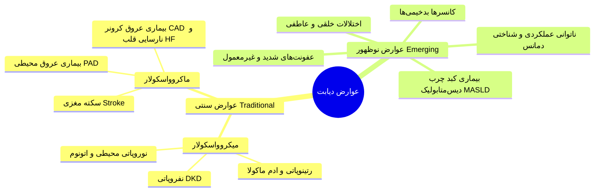
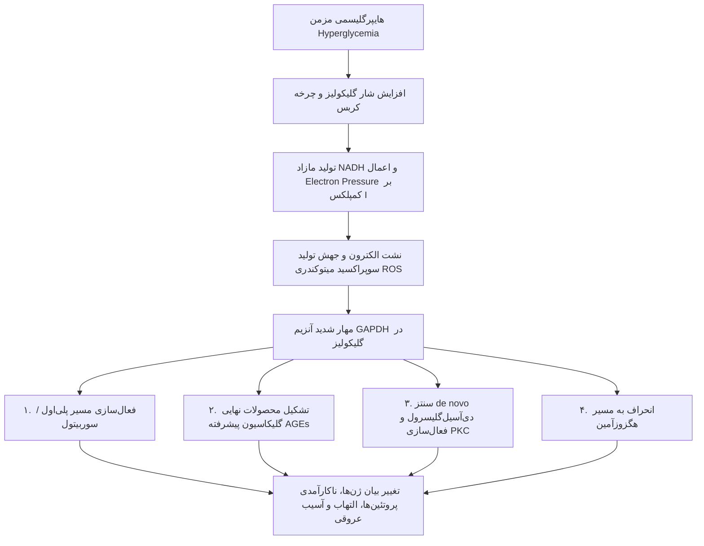
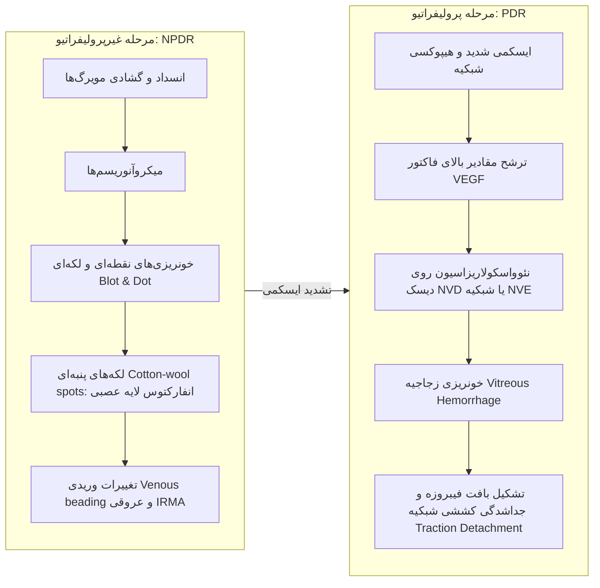
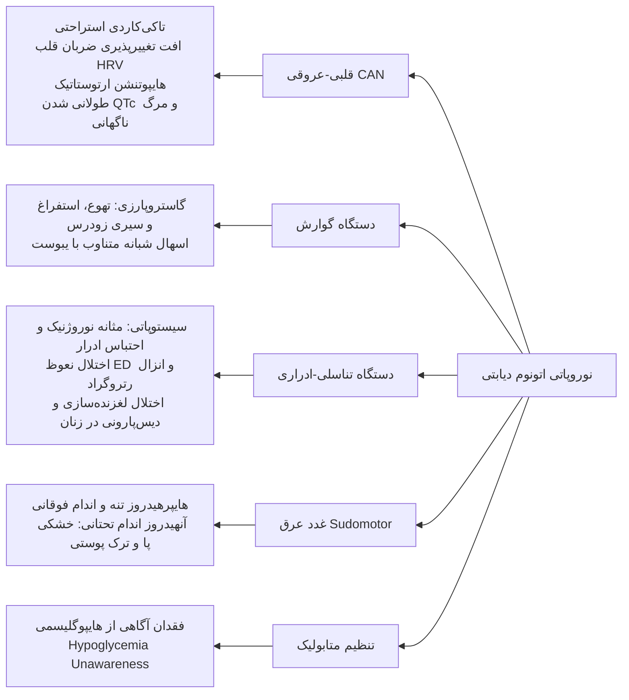
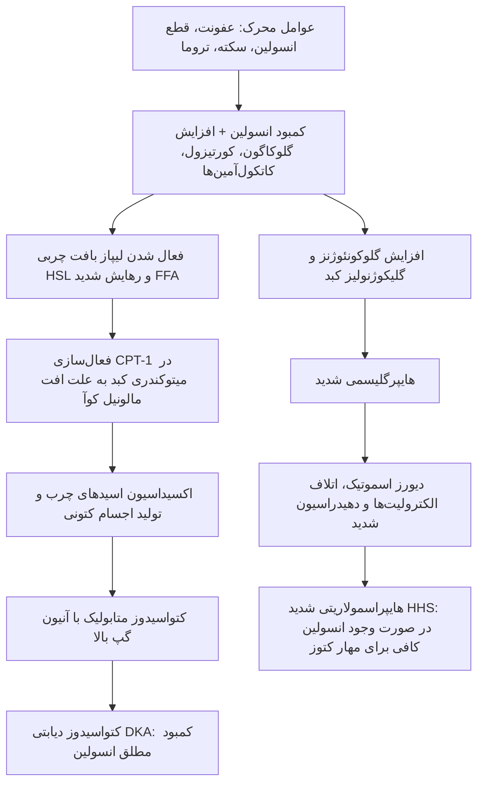

# عوارض حاد و مزمن دیابت قند

## ۱. طبقه‌بندی بنیادین عوارض دیابت: سنتی در برابر نوظهور

> [!abstract] عوارض مزمن دیابت (Chronic Complications)
> اختلالات ساختاری و عملکردی چندارگانی ناشی از هایپرگلیسمی مزمن و اختلالات متابولیک همراه؛ مسئول بخش عمده موربیدیتی و مورتالیتی در مبتلایان به دیابت.

* **تقسیم‌بندی بالینی کلاسیک:**
  * **میکروواسکولار (Microvascular):** درگیری عروق کوچک شامل رتینوپاتی، نفروپاتی و نوروپاتی.
  * **ماکروواسکولار (Macrovascular):** بیماری عروق کرونر (CAD)، بیماری شریان‌های محیطی (PAD) و حوادث عروق مغزی (CVA).
  * **عوارض غیرعروقی (Nonvascular):** گاستروپارزی، عفونت‌های فرصت‌طلب، تغییرات پوستی، افت شنوایی (Hearing loss) و افت عملکردهای شناختی مغز (Cognitive decline).

---

## ۲. شواهد کارآزمایی‌های بزرگ بالینی و پدیده حافظه متابولیک

### کارآزمایی DCCT و فاز ادامه‌دار EDIC (دیابت تیپ ۱)
* **جامعه پژوهش:** بیش از ۱۴۰۰ بیمار مبتلا به Type 1 DM؛ مقایسه درمان فشرده (Intensive با پمپ یا تزریقات مکرر، HbA1c میانگین ۷.۳٪) در برابر درمان استاندارد (Conventional، HbA1c میانگین ۹.۱٪) طی ۶.۵ سال.
* **دستاوردهای فاز DCCT:**
  1. کاهش **۴۷٪ در رتینوپاتی** غیرپرولیفراتیو و پرولیفراتیو.
  2. کاهش **۳۹٪ در آلبومینوری**.
  3. کاهش **۵۴٪ در نفروپاتی بالینی**.
  4. کاهش **۶۰٪ در نوروپاتی**.
  5. *عوارض درمان فشرده:* افزایش وزن (میانگین ۴.۶ کیلوگرم) و حملات هایپوگلیسمی شدید.
* **پیش‌بینی بقا و طول عمر در گروه درمان فشرده:**
  * **۷.۷ سال بینایی بیشتر**.
  * **۵.۸ سال رهایی بیشتر از ESRD** (نیاز به دیالیز).
  * **۵.۶ سال رهایی بیشتر از آمپوتاسیون اندام تحتانی**.
  * **۱۵.۳ سال زندگی بیشتر بدون عوارض ماژور میکروواسکولار** و **۵.۱ سال افزایش طول عمر کل**.
* **فاز EDIC (پیگیری بالای ۴۰ سال مجموع):** با همگرایی کنترل قند هر دو گروه در HbA1c حدود ۸.۰٪، گروه فشرده همچنان **۵۷٪ کاهش در حوادث قلبی-عروقی (MI غیرکشنده، سکته، مرگ عروقی)** و **۳۳٪ کاهش در مورتالیتی کل** نشان دادند.

### مطالعه UKPDS (دیابت تیپ ۲)
* **جامعه پژوهش:** بیش از ۵۰۰۰ بیمار تازه‌تشخیص‌داده‌شده Type 2 DM با پیگیری بالای ۱۰ سال؛ HbA1c گروه فشرده ۷.۰٪ در برابر ۷.۹٪ استاندارد.
* **یافته کلیدی:** به ازای هر **۱٪ کاهش در HbA1c، میزان عوارض میکروواسکولار ۳۵٪ افت کرد**.
* **اثر کنترل فشار خون:** کنترل دقیق فشار خون (هدف $144/82\text{ mmHg}$) مرگ مرتبط با دیابت، سکته، نارسایی قلب و رتینوپاتی را بین **۳۲٪ تا ۵۶٪ کاهش داد**؛ *نکته امتحانی بسیار مهم:* **منافع حاصل از کنترل فشار خون در UKPDS حتی بزرگتر و سریع‌تر از منافع کنترل گلیسمیک بود!** (هدف کنونی ADA: فشارخون کمتر از $130/80\text{ mmHg}$).

> [!important] مفهوم حافظه متابولیک (Metabolic Memory / Legacy Effect)
> مزایای ماندگار و درازمدت یک دوره کنترل فشرده و زودهنگام قند خون در سال‌های ابتدایی بیماری، حتی پس از سال‌ها افت کنترل گلیسمیک پابرجا می‌ماند و ریسک عوارض ماکرو و میکروواسکولار را پایین نگه می‌دارد.

---

## ۳. بیولوژی مولکولی و مکانیسم‌های آسیب بافتی ناشی از هایپرگلیسمی

> [!abstract] فرضیه واحد سمیت گلوکز (Unifying Hypothesis of Glucotoxicity)
> تولید بیش از حد رادیکال‌های آزاد سوپراکسید توسط زنجیره انتقال الکترون میتوکندری (ETC)، آنزیم کلیدی GAPDH در مسیر گلیکولیز را مهار کرده و گلوکز را به چهار مسیر تخریبی جانبی هدایت می‌کند.

### ۱. مسیر پلی‌اول / سوربیتول (Polyol / Sorbitol Pathway)
* **آبشار آنزیمی:**
  1. تبدیل گلوکز به سوربیتول توسط آنزیم **آلدوز ردوکتاز (Aldose Reductase)** با مصرف **NADPH**.
  2. تبدیل سوربیتول به فروکتوز توسط آنزیم **سوربیتول دهیدروژناز (SDH)** با تبدیل NAD به **NADH**.
* **پاتولوژی سلولی:**
  * سوربیتول از غشای سلول عبور نکرده، تجمع داخل‌سلولی یافته و **استرس اسموتیک** و تورم سلول ایجاد می‌کند.
  * مصرف مفرط NADPH مانع بازسازی **گلوتاتیون احیاشده (GSH)** توسط گلوتاتیون ردوکتاز می‌شود ⇦ تضعیف شدید دفاع آنتی‌اکسیدانی و انباشت رادیکال‌های آزاد.
  * کاهش سطح میواینوزیتول سلولی و اختلال در فعالیت پمپ $Na^+/K^+\text{-ATPase}$ اعصاب محیطی.

### ۲. مسیر محصولات نهایی گلیکاسیون پیشرفته (AGEs)
* **بیوشیمی سنتز:** واکنش غیرآنزیمی دی‌کربونیل‌های مشتق از گلوکز (مانند **متیل‌گلیوکسال**) با گروه‌های آمینی لیزین و آرژینین پروتئین‌ها ⇦ باز شیف ⇦ محصول آمادوری ⇦ کمپلکس‌های غیرقابل برگشت **AGE**. (سیستم گلی‌اوکسالاز با مصرف GSH متیل‌گلیوکسال را به D-لاکتات سم‌زدایی می‌کند).
* **اثرات پاتولوژیک اتصال AGE به گیرنده RAGE:**
  1. ترشح سایتوکین‌های پیش‌التهابی (**IL-1، TNF-α و IGF-1**) از ماکروفاژها.
  2. اتصالات متقاطع (Cross-linking) میان کلاژن و ماتریکس خارج‌سلولی ⇦ سفتی عروق.
  3. کاهش سنتز نیتریک اکساید (NO) و تشدید اندوتلیال دیس‌فانکشن.
  4. تسریع آترواسکلروز عروق بزرگ و تغییر در ساختار فیلتراسیون گلومرولی.

### ۳. مسیر پروتئین کیناز سی (DAG - Protein Kinase C Pathway)
* **مکانیسم:** تجمع دی‌هیدروکسی استون فسفات و گلیسرول-۳-فسفات ⇦ سنتز de novo **دی‌آسیل‌گلیسرول (DAG)** ⇦ فعال‌سازی ایزوفرم‌های **$\beta$ و $\delta$ آنزیم PKC**.
* **پیامدهای فعال‌سازی PKC:**
  * افزایش بیان **VEGF:** افزایش نفوذپذیری عروق و نئوواسکولاریزاسیون نابجا.
  * افزایش بیان **TGF-β:** افزایش سنتز کلاژن، فیبرونکتین و ضخیم‌شدن غشای پایه گلومرول.
  * افزایش **PAI-1:** مهار فیبرینولیز و افزایش ترومبوز و انسداد مویرگی.
  * افزایش اندوتلین-۱ (ET-1) و مهار eNOS: اختلالات جریان خون موضعی.
  * فعال‌سازی فاکتور هسته‌ای **NF-κB** و اکسیدازهای NAD(P)H: تشدید التهاب.

### ۴. مسیر هگزوزآمین (Hexosamine Pathway)
* **مکانیسم:** انحراف فروکتوز-۶-فسفات توسط آنزیم **GFAT** (گلوتامین: فروکتوز-۶-فسفات آمیدوترانسفراز) به گلوکزآمین-۶-فسفات ⇦ تولید **UDP-GlcNAc**.
* **پیامد:** گلیکوزیلاسیون O-linked زنجیره‌های سرین و ترئونین پروتئین‌ها و فاکتورهای رونویسی (نظیر Sp1) ⇦ مهار سنتز آنزیم eNOS و جهش رونویسی فاکتورهای **TGF-β1 و PAI-1**.

---

## ۴. رتینوپاتی و عوارض چشمی دیابت

> [!abstract] رتینوپاتی دیابتی (Diabetic Retinopathy)
> میکروآنژیوپاتی اختصاصی عروق شبکیه؛ شایع‌ترین علت کوری اکتسابی در جمعیت ۲۰ تا ۷۴ سال در جوامع توسعه‌یافته.

### پاتوفیزیولوژی و فازهای بیماری
* **دو فاکتور پیش‌بینی‌کننده اصلی:** ۱) **طول مدت دیابت**، ۲) **میزان کنترل گلیسمیک** (فشارخون و نفروپاتی فاکتورهای تشدیدکننده‌اند).
* *اپیدمیولوژی:* بعد از ۲۰ سال، تقریباً تمامی بیماران شواهدی از رتینوپاتی دارند. در تیپ ۱ شیوع در سال پنجم ۲۵٪ و در سال پانزدهم ۸۰٪ است.
* *مطالعه EUROCONDOR:* بیش از **۶۰٪ مبتلایان به تیپ ۲ پیش از ظهور میکروآنژیوپاتی واضح عروقی، دچار دژنراسیون و دیس‌فانکشن نورورتینال (نوروپاتی شبکیه)** هستند.

* **ادم ماکولا (Diabetic Macular Edema - DME):**
  * ناشی از هایپرپرمه‌آبیلیتی عروقی و نشت اگزودای سخت (Hard exudates) در ناحیه فووه‌آ.
  * **در هر دو مرحله NPDR و PDR ممکن است رخ دهد** و علت اصلی افت دید مرکزی است.
  * تشخیص قطعی با آنژیوگرافی فلورسئین (FA) و مقطع‌نگاری همدوسی نوری (OCT).
* **اقدامات درمانی:**
  1. کنترل دقیق قند، فشارخون و چربی.
  2. تزریق داخل زجاجیه مهارکننده‌های VEGF (Anti-VEGF) برای ادم ماکولا.
  3. **لیزر فتولخته‌سازی سرتاسری شبکیه (Panretinal Photocoagulation - PRP):** تخریب مناطق ایسکمیک محیطی شبکیه جهت کاهش ترشح VEGF و مهار نئوواسکولاریزاسیون (ناحیه ماکولا و دیسک جهت حفظ دید مرکزی لیزر نمی‌شوند).

---

## ۵. بیماری کلیوی دیابت (DKD / Diabetic Nephropathy)

> [!abstract] نفروپاتی دیابتی (Diabetic Kidney Disease)
> بیماری گلومرولی پیشرونده ناشی از دیابت؛ شایع‌ترین علت نارسایی مزمن کلیه (CKD) و نارسایی مرحله نهایی (ESRD / Stage 5) نیازمند دیالیز و پیوند در جهان.

* **ارتباط با رتینوپاتی:** در **دیابت تیپ ۱ همراهی نفروپاتی با رتینوپاتی تقریباً ۱۰۰٪ است**؛ بنابراین *تله امتحانی بسیار مهم:* **بروز CKD در بیمار تیپ ۱ بدون وجود رتینوپاتی دیابتی، باید فوراً شک به علل ثانویه و غیردیابتی کلیه را برانگیزد!** در تیپ ۲ این همراهی کمتر اختصاصی است.

### مراحل پنج‌گانه سیر طبیعی نفروپاتی (Mogensen Stages)

| مرحله | مشخصات عملکردی و ساختاری | فیلتراسیون گلومرولی (GFR) | دفع آلبومین ادرار | فشار خون | زمان پس از شروع دیابت |
| :---: | :--- | :---: | :---: | :---: | :---: |
| **Stage 1** | هایپرفانکشن، هایپرپرفیوژن و بزرگی اندازه کلیه‌ها (Hypertrophy) | **افزایش‌یافته (Hyperfiltration)** | نرمال یا افزایش گذرا | نرمال | بدو تشخیص دیابت |
| **Stage 2** | فاز خاموش؛ ضخیم شدن GBM و گسترش ماتریکس مزانژیال | نرمال | نرمال ($<30\text{ mg/day}$) | نرمال | ۵ سال اول |
| **Stage 3** | مرحله آغازین (Incipient)؛ افت تدریجی فیلتراسیون | شروع به افت تدریجی | **میکروآلبومینوری ($30-300\text{ mg/day}$)** | شروع به افزایش | ۶ تا ۱۵ سال |
| **Stage 4** | نفروپاتی آشکار (Overt)؛ اسکلروز ندولار کیملستیل-ویلسون | افت واضح زیر حد نرمال | **ماکروآلبومینوری ($>300\text{ mg/day}$)** | هایپرتنشن بارز | ۱۵ تا ۲۵ سال |
| **Stage 5** | مرحله اورمیک و اسکلروز کامل عروقی گلومرول‌ها | **$0-10\text{ mL/min}$ (ESRD)** | افت دفع به دلیل تخریب کل نفرون‌ها | هایپرتنشن شدید | ۲۵ تا ۳۰ سال |

### پروتکل غربالگری و تعاریف آزمایشگاهی
* **آغاز غربالگری:** در دیابت **تیپ ۱، ۵ سال پس از تشخیص**؛ در دیابت **تیپ ۲، از همان بدو تشخیص**؛ و سپس به‌صورت **سالانه**.
* **روش ارزیابی همزمان:** سنجش نسبت آلبومین به کراتینین در نمونه ادرار تصادفی (**UACR**) + محاسبه **eGFR**.
* **طبقه‌بندی آلبومینوری:**
  * **نرمال تا خفیف (A1):** مقدار $\text{UACR} < 30\text{ mg/g}$.
  * **افزایش متوسط / میکروآلبومینوری سابق (A2):** مقدار $\text{UACR} = 30-299\text{ mg/g}$.
  * **افزایش شدید / ماکروآلبومینوری سابق (A3):** مقدار $\text{UACR} \ge 300\text{ mg/g}$.
* *قانون تایید تشخیص:* به دلیل نوسانات بالا، تشخیص قطعی DKD نیازمند **اثبات مثبت بودن حداقل ۲ نوبت از ۳ نوبت آزمایش طی بازه ۳ تا ۶ ماه** است.

> [!warning] علل افزایش کاذب و گذرای آلبومینوری (Transient Albuminuria)
> ورزش سنگین اخیر، عفونت ادراری (UTI)، تب و بیماری عفونی حاد، نارسایی احتقانی قلب دکامپنسه، قاعدگی، جهش‌های حاد و شدید قند خون، و بحران‌های شدید فشار خون.

### پرچم‌های قرمز دال بر بیماری غیردیابتی کلیه
1. سدیمان فعال ادراری (حضور RBC کست، WBC کست، یا هماچوری ماکروسکوپیک).
2. افت فوق‌العاده سریع eGFR یا جهش ناگهانی به سندرم نفروتیک.
3. **نبود رتینوپاتی دیابتی در بیمار مبتلا به دیابت تیپ ۱**.
4. وجود نشانه‌های بالینی بیماری‌های سیستمیک دیگر.

### پاتولوژی‌های همراه کلیوی
* **اسیدوز توبولار نوع ۴ (Type IV RTA / Hyporeninemic Hypoaldosteronism):** استعداد به اسیدوز هایپرکلرمیک و **هایپرکالمی شدید**؛ تشدید خطرناک با داروهای مهارکننده محور رنین (ACEi، ARB، MRA).
* **نفروتوکسیسیتی ناشی از ماده حاجب رادیولوژی:** فاکتورهای خطر اصلی شامل نفروپاتی زمینه‌ای و دهیدراسیون هستند؛ پیشگیری حیاتی با هیدراسیون وریدی قبل و بعد از پروسیجر و پایش کراتینین طی ۲۴ تا ۴۸ ساعت.

---

## ۶. نوروپاتی دیابتی و نشانه‌های بالینی

> [!abstract] نوروپاتی دیابتی (Diabetic Neuropathy)
> درگیری اعصاب محیطی حسی، حرکتی یا سیستم خودکار در حدود ۵۰٪ بیماران دیابتی طول‌کشیده؛ نتیجه مشترک ایسکمی مویرگی (وازانووروم)، شکست بیوانرژتیک آکسون‌ها، لیپوتوکسیسیتی و سمیت گلوکز.

### ۱. پلی‌نوروپاتی متقارن دیستال (DSPN)
* **شایع‌ترین فرم نوروپاتی؛** شروع متقارن از دورترین نقاط اندام تحتانی با الگوی **دستکش و جوراب (Stocking-glove)**.
* **علائم:** کرختی، گزگز، احساس سوزش شبانه و درد سوزشی، درد در حالت استراحت؛ با پیشرفت بیماری درد فروکش کرده اما نقص حسی ماندگار می‌شود.
* **معاینه فیزیکی:** افت حس لمس سطحی، حس ارتعاش، حس موقعیت مفصل و **فقدان رفلکس تاندون آشیل (Ankle Reflex)**.
* **ابزارهای غربالگری سریع در مطب:**
  1. **مونوفیلامان ۱۰ گرمی سمنز-واینستین:** ارزیابی ۴ نقطه در هر پا؛ امتیاز کمتر از ۳ از ۸ نشان‌دهنده احتمال بالای نوروپاتی است.
  2. **دیاپازون ۱۲۸ هرتز:** ارزیابی حس ارتعاش روی برجستگی استخوانی شست پا به روش On-Off.

### ۲. پلی‌رادیکولوپاتی دیابتی (Diabetic Polyradiculopathy)
* درگیری ریشه‌های عصبی؛ همراه با درد شدید در مسیر یک یا چند ریشه عصبی.
* فرم بین‌دنده‌ای/تنه: درد شدید جدار قفسه سینه یا شکم (تقلید حوادث قلبی یا شکم حاد).
* **آمیوتروفی دیابتی (Diabetic Amyotrophy):** درگیری شبکه کمری یا عصب فمورال؛ درد شدید ران و لگن همراه با **ضعف و آتروفی فلکسورها و اکستنسورهای مفصل ران**.
* *نکته امتحانی کلیدی:* **پلی‌رادیکولوپاتی‌ها خودبه‌خود محدودشونده هستند و ظرف ۶ تا ۱۲ ماه به‌طور خودبه‌خودی بهبود می‌‌یابند**.

### ۳. مونوپاتی‌های دیابتی (Mononeuropathy)
* درگیری تک‌عصب جمجمه‌ای یا محیطی به علت ایسکمی عروقی حاد.
* **شایع‌ترین عصب درگیر:** **عصب سوم مغزی (Oculomotor / CN III)** با تظاهر دوبینی حاد و پتوز.
* *تله طلایی امتحانی:* **رفلکس نوری مردمک دست‌نخورده و کاملاً سالم باقی می‌ماند (Pupil-sparing)**؛ چرا که فیبرهای پاراسمپاتیک مردمک در سطح عصب بوده و جریان خون کلاترال دارند، در حالی که ایسکمی دیابتی مرکز عصب را تخریب می‌کند. سایر اعصاب: ۴، ۶ و ۷ (بلز پالسی).

### ۴. نوروپاتی اتونوم دیابتی (Autonomic Neuropathy)

---

## ۷. پای دیابتی و زخم‌های اندام تحتانی (DFU)

> [!danger] فاکتورهای خطر آمپوتاسیون پا
> دیابت شایع‌ترین علت قطع عضو غیرتروماتیک اندام تحتانی در دنیا است. حدود ۱۵٪ مبتلایان دچار زخم پا می‌شوند که ۱۴ تا ۲۴ درصد آن به آمپوتاسیون ختم می‌گردد.

* **تتراد پاتوفیزیولوژی:** ۱) نوروپاتی حسی، ۲) بیومکانیک غیرطبیعی پا، ۳) بیماری عروق محیطی (PAD)، ۴) اختلال در ترمیم زخم و سیستم ایمنی.
* **تغییرات ساختاری استخوانی:** ناشی از نوروپاتی حرکتی و حسی؛ شامل انگشت چکشی (Hammer toe)، انگشت چنگالی (Claw toe)، برجسته شدن سر استخوان‌های متاتارس و تخریب مفاصل شارکو (**Charcot Joint**).

### مشخصات تشخیصی زخم نوروپاتیک تیپیک
1. **کاملاً بدون درد (Painless)**.
2. **محصور در پینه ضخیم (Surrounded by Callus)**.
3. **نبض‌های شریانی پا کاملاً لمس می‌شوند (Good Pulses)** (عروق بزرگ مسدود نیستند).
4. **موقعیت زخم:** کف پا و زیر سر استخوان‌های متاتارس یا نوک انگشتان تحت فشار.

### اصول مدیریت درمانی زخم پای دیابتی
* **حذف کامل فشار مکانیکی (Off-loading):** طلایی‌ترین اقدام درمانی (استفاده از Total Contact Cast).
* دبریدمان جراحی بافت‌های نکروتیک، پانسمان‌های فیزیولوژیک مرطوب، و بررسی عروقی جهت ره‌‌واسکولاریزاسیون.
* **آنتی‌بیوتیک‌تراپی:**
  * *عفونت‌های خفیف غیرتهدیدکننده عضو:* درمان خوراکی متمرکز بر استافیلوکوک و استرپتوکوک (سفالکسین، آموکسی‌سیلین-کلاوولانات). در صورت ریسک MRSA: کوتریموکسازول، داکسی‌سایکلین، کلیندامایسین یا لینزولید.
  * *عفونت‌های شدید تهدیدکننده اندام:* بستری و آنتی‌بیوتیک وسیع‌الطیف وریدی (پوشش MRSA، سودوموناس، گرم‌منفی‌ها و بی‌هوازی‌ها) مانند **ونکوماسین + پیپراسیلین/تازوباکتام** یا کارباپنم‌ها.

---

## ۸. بیماری‌های ماکروواسکولار و درگیری قلبی-عروقی

* **ریسک عروقی:** مورتالیتی قلبی در دیابت تیپ ۲ بین **۲ تا ۴ برابر** جمعیت عادی است. انجمن قلب آمریکا، دیابت را یک **معادل بیماری عروق کرونر (CHD Risk Equivalent)** تلقی می‌کند.
* **ایسکمی خاموش (Silent Ischemia):** به دلیل نوروپاتی اتونوم قلبی، آنژین صدری و انفارکتوس حاد میوکارد ممکن است **کاملاً بدون درد قفسه سینه** بروز کند.
* **کاردیومیوپاتی دیابتی (Diabetic Cardiomyopathy):** اختلال عملکرد بطن چپ و بروز نارسایی قلبی مستقل از هایپرتنشن یا درگیری عروق اپی‌کاردیال کرونر. شیوع نارسایی قلب (HFpEF و HFrEF) در دیابت ۲ برابر است.
* **دیس‌لیپیدمی آتروژنیک تیپیک در دیابت:**
  * **افزایش تری‌گلیسرید (TG)**.
  * **کاهش کلسترول HDL**.
  * سطح کلی LDL ممکن است نرمال باشد اما ذرات **Small Dense LDL** افزایش می‌یابند که شدیداً مستعد گلیکاسیون، اکسیداسیون و آتروژنز هستند.
* **اندیکاسیون‌های تست استرس قلبی در افراد دیابتی:** علائم غیرمعمول ایسکمی قلبی، وجود PAD، بیماری شریان کاروتید، نوار قلب غیرطبیعی دال بر انفارکتوس قبلی، تصمیم به شروع برنامه ورزشی سنگین، پروتئینوری، یا همراهی حداقل ۲ ریسک‌فاکتور ماژور قلبی دیگر (غربالگری در افراد کاملاً بدون علامت توصیه نمی‌شود).

---

## ۹. عفونت‌ها و تظاهرات پوستی در دیابت

### عفونت‌های اختصاصی و خطرناک در بیماران دیابتی
1. **موکورمایکوزیس رینوسرب Nobral (Rhinocerebral Mucormycosis):** عفونت قارچی فوق‌حاد مهاجم به عروق در بستر DKA و اسیدوز؛ شروع از سینوس‌ها با نکروز سیاه کام و بینی و تهاجم سریع به اوربیت و مغز.
2. **اوتیت خارجی بدخیم یا مهاجم (Malignant Otitis Externa):** ناشی از باکتری **Pseudomonas aeruginosa**؛ شروع با درد و ترشح مجرای گوش و پیشرفت سریع به استئومیلیت قاعده جمجمه و مننژیت.
3. **عفونت‌های آمفیزماتوز:** کله‌سیستیت آمفیزماتوز در کیسه صفرا، پیلونفریت آمفیزماتوز و سیستیت آمفیزماتوز کلیه و مجاری (تولید گاز توسط کلی‌فرم‌ها).

### تظاهرات پوستی ماژور

| اختلال پوستی | ظاهر مورفولوژیک و پاتولوژی | همراهی‌های بالینی |
| :--- | :--- | :--- |
| **Acanthosis Nigricans** | پلاک‌های مخملی هایپرپیگمانته در گردن، آگزیلا و سطوح فلکسور | مقاومت شدید به انسولین و چاقی |
| **Diabetic Dermopathy** | پاپول‌های قهوه‌ای گرد و آتروفیک در قدام ساق پا (Shin spots) | ضربه‌های مکانیکی مکرر در سالمندان |
| **Necrobiosis Lipoidica (NLD)** | پلاک‌های اریتماتوز با مرکز زرد-مومی آتروفیک، تلانژکتازی و زخم مرکزی | **خانم‌های جوان مبتلا به Type 1 DM** |
| **Bullosis Diabeticorum** | تاول‌های استریل، کم‌عمق و بدون درد خودبه‌خودی در قدام ساق و پا | دیابت طولانی با میکروآنژیوپاتی |
| **Granuloma Annulare** | پلاک‌های حلقوی اریتماتوز روی تنه و اندام‌ها | دیابتیک‌ها |
| **Lipoatrophy / Lipohypertrophy** | تحلیل یا هیپرتروفی بافت چربی در محل‌های تزریق مکرر انسولین | تزریق انسولین‌های قدیمی (با انسولین انسانی نادر است) |

---

## ۱۰. عوارض حاد دیابت: کریزهای هایپرگلیسمیک (DKA در برابر HHS)

> [!abstract] اورژانس‌های حاد هایپرگلیسمی
> طیف پیوسته‌ای از کمبود مطلق یا نسبی انسولین همراه با افزایش هورمون‌های متقابل؛ حدود یک‌سوم بیماران تابلوی هایبرید و همپوشان **DKA / HHS** دارند.

### مقایسه معیارهای تشخیصی DKA و HHS

| پارامتر آزمایشگاهی / بالینی | کتواسیدوز دیابتی (DKA) | سندرم هایپرگلیسمیک هایپراسمولار (HHS) |
| :--- | :--- | :--- |
| **جمعیت شایع** | تیپ ۱ (و افراد مستعد کتوز Ketosis-prone T2DM) | عمدتاً سنین بالا، تیپ ۲ دیابت |
| **سرعت استقرار علائم** | سریع (طی چند ساعت تا ۱ یا ۲ روز) | موذیانه و آهسته (طی چند روز تا ۲ هفته) |
| **سطح قند خون (پلاسما)** | **$200-600\text{ mg/dL}$** (گاهی در بدو ورود $>250$) | **بسیار شدید: $\ge 600\text{ to }1200\text{ mg/dL}$** |
| **کتونمیا / کتونوری** | **بتا-هیدروکسی‌بوتیرات $\ge 3.0\text{ mmol/L}$** یا کتون ادرار $\ge 2+$ | منفی یا بسیار اندک ($\beta\text{OHB} < 3.0\text{ mmol/L}$) |
| **اسیدوز متابولیک** | **اسیدوز بارز:** $\text{pH} < 7.30$ و بیکربنات $< 18\text{ mEq/L}$ | **فاقد اسیدوز:** $\text{pH} \ge 7.30$ و بیکربنات $\ge 15\text{ mEq/L}$ |
| **اسمولالیته موثر سرم** | متغیر، معمولاً $< 300-320\text{ mOsm/kg}$ | **بسیار بالا: $> 300\text{ to }320\text{ mOsm/kg}$** |
| **آنیون گپ (Anion Gap)** | **افزایش‌یافته ($> 12-16$)** | معمولاً نرمال یا افزایش اندک ثانویه |
| **کسری آب کل بدن** | **حدود ۶ لیتر ($100\text{ mL/kg}$)** | **بسیار شدید: حدود ۹ لیتر ($100-200\text{ mL/kg}$)** |
| **تظاهرات بالینی شاخص** | تهوع، استفراغ، دل‌پیچه، تنفس کاسمال، بوی استون | لتارژی عمیق، استوپور، کما، نقایص فوکال نورولوژیک |

### فرمول‌های حیاتی محاسبات الکترولیتی و اسمولالیته

$$Anion\;Gap = [Na^+] - ([Cl^-] + [HCO_3^-])$$

$$Effective\;Osmolality = 2 \times [Na^+\text{ (mEq/L)}] + \frac{Glucose\text{ (mg/dL)}}{18}$$

$$Total\;Osmolality = 2 \times [Na^+] + \frac{Glucose}{18} + \frac{BUN}{2.8}$$

$$Corrected\;Na^+ = Measured\;Na^+ + 1.6 \times \left(\frac{Glucose - 100}{100}\right)$$

> [!important] تله امتحانی سدیم تصحیح‌شده
> در هایپرگلیسمی، خروج آب از سلول سدیم را رقیق می‌کند (سودوهایپوناترمی). به ازای هر ۱۰۰ میلی‌گرم افزایش گلوکز بالای ۱۰۰، سدیم پلاسما ۱.۶ میلی‌اکی‌والان افت کاذب دارد. **اگر در شرایط قند ۶۰۰ سدیم اندازه‌گیری‌شده نرمال یا بالا باشد، نشان‌دهنده دهیدراسیون فوق‌العاده وحشتناک داخل‌سلولی است!**

### طبقه‌بندی شدت DKA

| شاخص شدت | خفیف (Mild) | متوسط (Moderate) | شدید (Severe) |
| :--- | :---: | :---: | :---: |
| **قند پلاسما** | $\ge 200\text{ mg/dL}$ | $\ge 200\text{ mg/dL}$ | $\ge 200\text{ mg/dL}$ |
| **بتا-هیدروکسی‌بوتیرات** | $3.0-6.0\text{ mmol/L}$ | $3.0-6.0\text{ mmol/L}$ | $> 6.0\text{ mmol/L}$ |
| **pH وریدی/شریانی** | $7.25\text{ to }<7.30$ | $7.00-7.24$ | $< 7.00$ |
| **بیکربنات سرم** | $15-18\text{ mEq/L}$ | $10\text{ to }<15\text{ mEq/L}$ | $< 10\text{ mEq/L}$ |
| **وضعیت هوشیاری** | هوشیار (Alert) | هوشیار یا خواب‌آلود (Drowsy) | استوپور یا کما (Stupor/Coma) |
| **بخش بستری پیشنهادی** | بخش عادی / تحت‌نظر | بخش بینابینی (Step-down) | مراقبت‌های ویژه (ICU) |

### تله‌های آزمایشگاهی سنجش کتون و الکترولیت‌ها
* **پدیده نیتروپروساید و سنجش بتا-هیدروکسی‌بوتیرات:**
  * معرف‌های نیتروپروساید آزمایشگاهی (نوار ادرار یا قرص سرمی) **فقط استواستات و استون را می‌سنجند و قادر به تشخیص بتا-هیدروکسی‌بوتیرات نیستند!**
  * در بدو DKA، نسبت $\beta\text{OHB}$ به استواستات به علت وفور NADH تا ۵ به ۱ بالا می‌رود؛ بنابراین نوار ادرار ممکن است شدت بیماری را کمتر نشان دهد.
  * با شروع درمان و اصلاح اکسیژناسیون، $\beta\text{OHB}$ به استواستات تبدیل می‌شود؛ در این حالت با وجود بهبودی بالینی بیمار، **تست نوار ادرار ممکن است به‌طور کاذب مثبت‌تر گزارش شود!** *استاندارد طلایی ADA:* سنجش مستقیم بتا-هیدروکسی‌بوتیرات خون.
* **پتاسیم در DKA:** علیرغم تخلیه شدید ذخایر پتاسیم کل بدن (کسری ۳ تا ۵ اکی‌والان به ازای هر کیلوگرم وزن)، سطح پتاسیم سرم در بدو مراجعه به علت اسیدوز و کمبود انسولین **نرمال یا حتی بالا گزارش می‌شود**. به محض شروع انسولین، پتاسیم با شتاب به داخل سلول رفته و هایپوکالمی کشنده ایجاد می‌کند!
* **آمیلاز و لیپاز:** آمیلاز سرم در DKA مکرراً به دلیل منشأ غدد بزاقی بالا می‌رود؛ تشخیص پانکراتیت حاد همزمان صرفاً بر پایه سنجش **لیپاز سرم** معتبر است.
* **کراتینین کاذب:** استواستات سرم در روش‌های رنگ‌‌سنجی آزمایشگاهی تداخل ایجاد کرده و کراتینین را کاذب بالا می‌برد.

### کتواسیدوز اوگلیسمیک (Euglycemic DKA)
* **تعریف:** وجود کتواسیدوز شدید ($\text{pH} < 7.3$، بیکربنات $< 18$ و $\beta\text{OHB} \ge 3.0$) در حالی که **قند خون کمتر از ۲۰۰ تا ۲۵۰ میلی‌گرم در دسی‌لیتر** است.
* **مهم‌ترین علت القاکننده:** **مهارکننده‌های SGLT2 (امپاگلیفلوزین، داپاگلیفلوزین، کاناگلیفلوزین)**.
* **مکانیسم مولکولی:**
  1. دفع مدام گلوکز در ادرار مانع هایپرگلیسمی شدید می‌شود.
  2. بیمار یا پزشک دوز انسولین را به دلیل قند پایین کاهش می‌دهند.
  3. کمبود نسبی انسولین سبب رهایش FFA از چربی و تحریک کتوژنز می‌شود.
  4. مهارکننده SGLT2 مستقیماً سلول‌های آلفای پانکراس را تحریک کرده و گلوکاگون را بالا می‌برد.
  5. بازجذب کلیوی اجسام کتونی افزایش می‌یابد.
* *سایر علل euDKA:* بارداری، روزه‌داری و گرسنگی طولانی، نارسایی شدید کبدی.

---

## ۱۱. تابلوی جامع مقایسه‌ای سناریوهای بالینی و تله‌های امتحانی

| سناریوی بالینی بیمار | یافته‌های تشخیصی پاراکلینیک | پاتوفیزیولوژی زمینه‌ای | اقدام مداخله‌ای صحیح |
| :--- | :--- | :--- | :--- |
| **دیابتی تیپ ۱ با تنگی نفس و قند ۱۸۰ تحت درمان امپاگلیفلوزین** | $\text{pH} = 7.15$ ، $\text{HCO}_3 = 9$ ، کتون سرم مثبت | کتواسیدوز اوگلیسمیک (euDKA) ناشی از مهارکننده SGLT2 | قطع فوری SGLT2i، انفوزیون سرم قندی دکستروز ۵٪ + انسولین وریدی |
| **سالمند مبتلا به زوال عقل با لتارژی عمیق و قند ۹۵۰** | اسمولالیته موثر ۳۴۵، کتون منفی، $\text{pH} = 7.36$ | دهیدراسیون هایپراسمولار شدید (HHS) | هیدراسیون حجیم سالین و پایش افت تدریجی اسمولالیته جهت پیشگیری از ادم مغز |
| **بیمار تیپ ۱ با DKA و پتاسیم سرم 3.1 meq/L در بدو ورود** | اسیدوز شدید، کسری شدید پتاسیم کل بدن | هایپوکالمی زمینه‌ای خطرناک با خطر ارست قلبی | **توقف شروع انسولین**؛ ابتدا تجویز پتاسیم وریدی تا رسیدن به بالای ۳.۳ و سپس انسولین |
| **دختر دیابتی تیپ ۱ با درد شدید شکم و آمیلاز بالا** | اسیدوز متابولیک با آنیون گپ بالا، لیپاز نرمال | ایلئوس و فلج گوارشی ناشی از کتواسیدوز و آمیلاز بزاقی | رد شکم حاد جراحی؛ ادامه پروتکل استاندارد مایع‌درمانی و انسولین DKA |
| **مرد جوان دیابتی با افتادگی پلک، دوبینی و مردمک کاملاً متقارن** | فلج حرکتی کره چشم، رفلکس نوری مردمک نرمال | ایسکمی موضعی تنه عصب سوم با حفظ فیبرهای سطحی | مونوپاتی عصب ۳ دیابتی (Pupil-sparing)؛ اطمینان‌بخشی و بهبود خودبخودی |
| **بیمار تیپ ۲ با کاهش eGFR به 45 بدون دفع آلبومین در ادرار** | $\text{UACR} = 18\text{ mg/g}$ ، عدم وجود رتینوپاتی | فنوتیپ غیرپروتئینوریک بیماری مزمن کلیه (Non-proteinuric DKD) | تجویز مهارکننده‌های SGLT2 یا فینرنون، پایش مداوم eGFR و کنترل دقیق فشار |
| **بیمار مبتلا به ضعف شدید و آتروفی عضله ران و درد یک‌طرفه** | اشکال در بالا رفتن از پله، تحلیل عضلات کوادریسپس | پلی‌رادیکولوپاتی دیابتی لومبار (Amyotrophy) | کنترل درد نوروپاتیک، بهینه‌سازی گلیسمیک؛ اطمینان از بهبودی طی ۶ تا ۱۲ ماه |
| **زخم بدون درد در پاشنه پای بیمار دیابتی با نبض‌های محیطی پر** | کالوس متراکم دور زخم، عدم حس مونوفیلامان | زخم نوروپاتیک تیپیک ناشی از فشار مکانیکی | آف‌لودینگ کامل (گچ‌گیری تماسی TCC)، دبریدمان کالوس و مراقبت زخم |
| **بیمار با DKA در حال درمان با بهبود هوشیاری اما تداوم کتونوری** | $\text{pH} = 7.35$ ، بیکربنات ۲۱، کتون ادرار همچنان ۳+ | تبدیل بیوشیمیایی $\beta\text{OHB}$ به استواستات در فاز بهبودی | معیار بهبودی بسته شدن آنیون گپ و بیکربنات است؛ نادیده گرفتن نوار ادرار |
