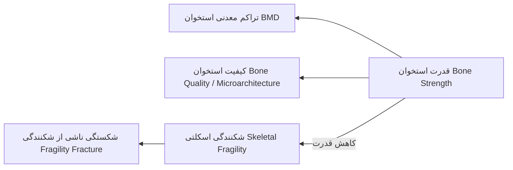
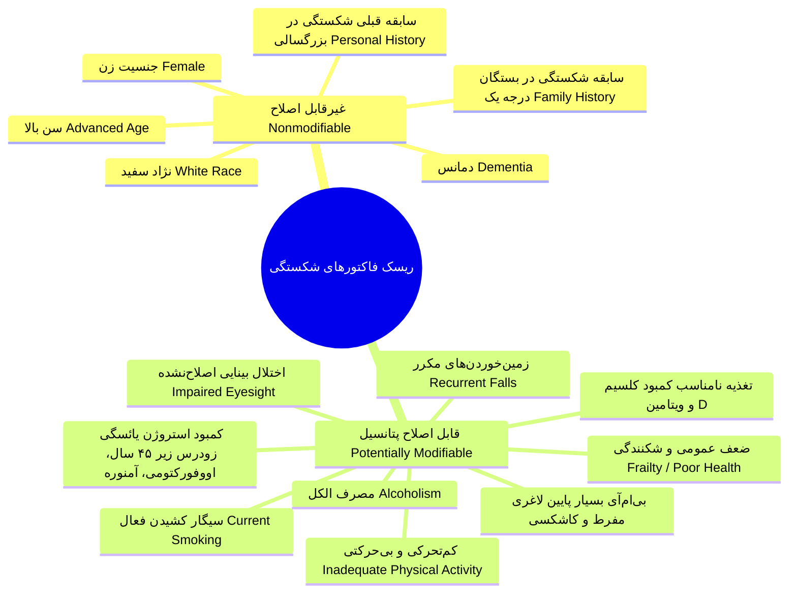
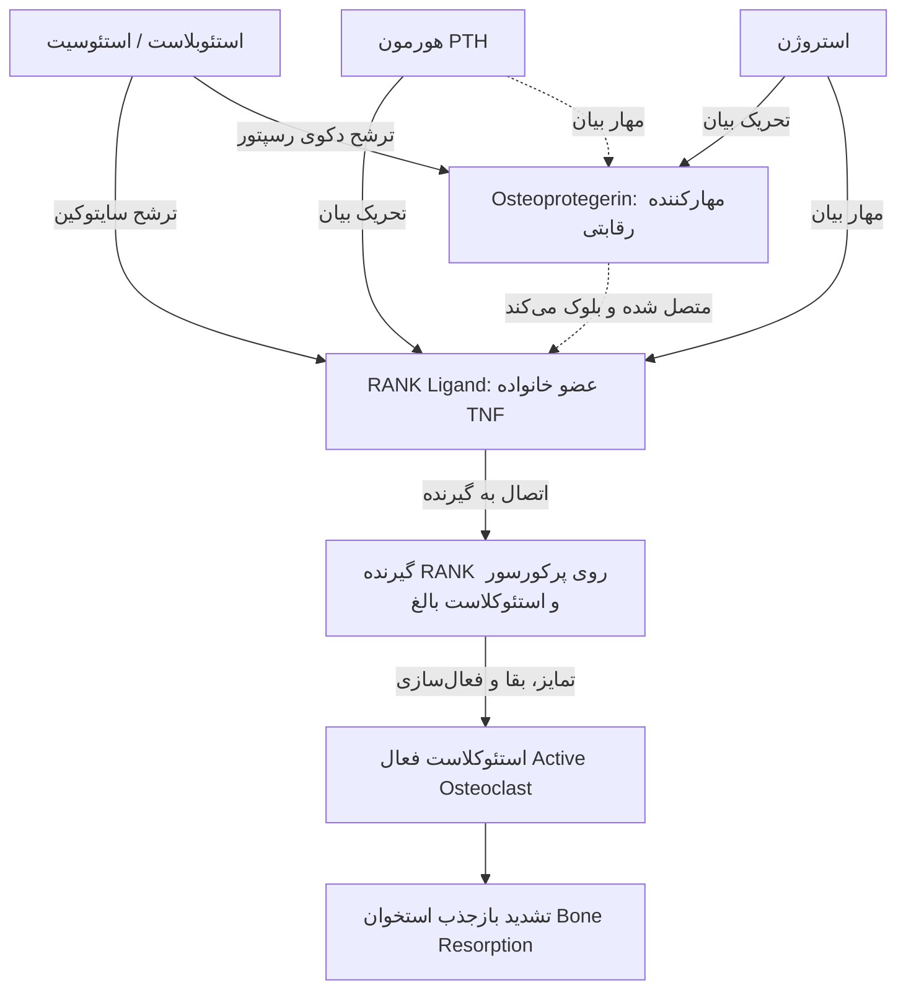
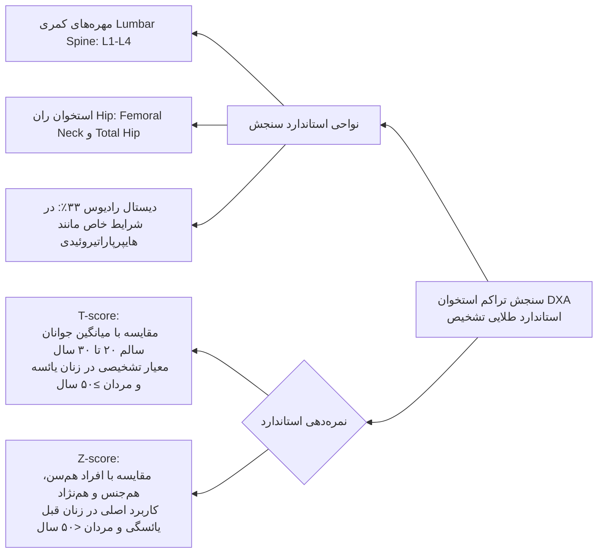
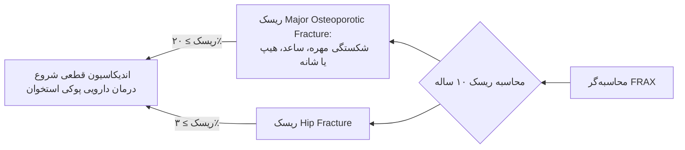
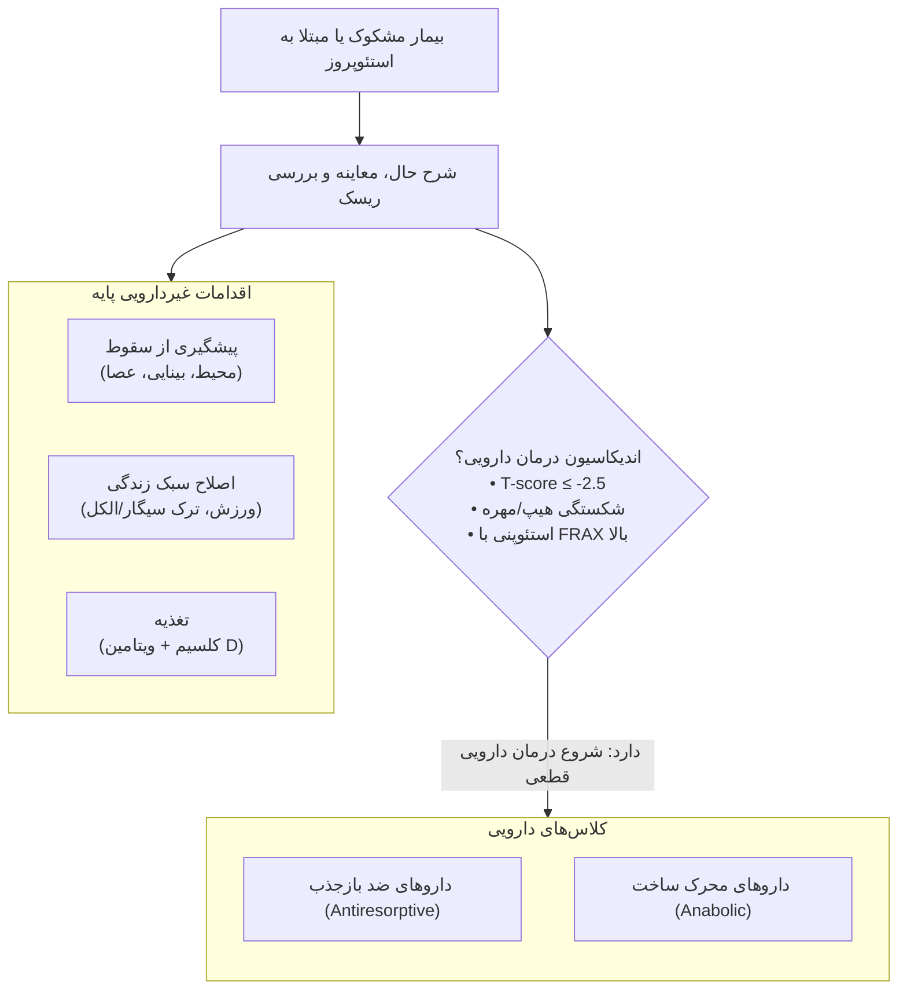
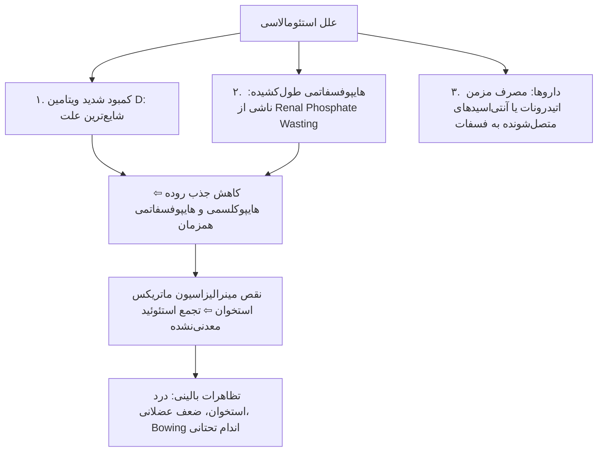

# پوکی استخوان و استئومالاسی (Osteoporosis & Osteomalacia)

## 1. تعاریف پایه، اپیدمیولوژی و بار بالینی شکستگی‌ها

> [!abstract] تعریف استئوپروز (Osteoporosis)
> کاهش قدرت استخوان (Bone Strength) که فرد را مستعد افزایش خطر شکستگی می‌کند. قدرت استخوان تابعی از دو مؤلفه اصلی است: **تراکم معدنی استخوان (BMD)** و **کیفیت استخوان (Bone Quality / Microarchitecture)**.

* **تعریف سازمان جهانی بهداشت (WHO):**
  * کاهش دانسیته استخوان به میزان **بیش از 2.5 انحراف معیار (SD) زیر میانگین بالغان جوان سالم، هم‌جنس و هم‌نژاد** ⇦ **T-score ≤ -2.5**.
* **اپیدمیولوژی و اثر سن و جنس:**
  * فرایند از دست رفتن استخوان با افزایش سن پروگرسیو است.
  * **شروع یائسگی (حول‌وحوش سن 50 سالگی):** افت عملکرد تخمدان و کمبود استروژن، روند تحلیل استخوان را شتاب می‌بخشد؛ اغلب زنان در سنین **70 تا 80 سالگی** واجد کرایتریای تشخیصی پوکی استخوان می‌شوند.
* **ریسک طول عمر (Lifetime Fracture Risk):**
  * برای یک **خانم 50 ساله: حدود 50%**.
  * برای یک **آقای 50 ساله: حدود 20%**.
* **پیامدهای شکستگی هیپ (Hip Fracture Outcomes):**
  * استعداد بالا به **ترومبوز ورید عمقی (DVT)** و **آمبولی ریه (PTE)**.
  * **مورتالیتی سال اول پس از جراحی هیپ: بین 5% تا 20%**.
  * تله امتحانی مهم: **میزان مورتالیتی بعد از شکستگی هیپ در مردان بیشتر از زنان است!** (موربیدیتی و شیوع شکستگی در زنان بیشتر است).
  * بیش از **30% نجات‌یافتگان شکستگی هیپ نیازمند مراقبت طولانی‌مدت (Long-term Care)** خواهند بود.

> [!important] مفهوم شکستگی ناشی از شکنندگی (Fragility Fracture) و ریسک قریب‌الوقوع (Imminent Risk)
> * **تعریف:** شکستگی ناشی از سقوط از ارتفاع ایستاده یا کمتر (Fall from standing height or less).
> * **استثناهای قطعی (تله امتحانی):** شکستگی‌های **انگشتان دست (Fingers)، انگشتان پا (Toes)، صورت (Face) و کاسه سر (Skull)** به عنوان Fragility Fracture تلقی **نمی‌شوند**.
> * **ریسک قریب‌الوقوع (Imminent Risk):** پس از اولین شکستگی شکنندگی، بیشترین خطر تکرار شکستگی در **12 تا 24 ماه اول** است؛ حدود **20% زنان ظرف 2 سال دچار دومین شکستگی** می‌شوند.
> * **قانون بالینی بالای 50 سال:** هرگونه شکستگی در افراد بالای 50 سال (به‌جز 4 ناحیه استثنا) باید بالقوه ناشی از پوکی استخوان فرض شود و نیازمند ارزیابی تراکم استخوان (BMD) است (حتی اگر با ترومای واضح باشد).

---

## 2. طبقه‌بندی فاکتورهای خطر شکستگی استئوپروتیک

---

## 3. بیولوژی بازسازی استخوان (Bone Remodeling) و آبشار RANKL/OPG

> [!abstract] بازسازی استخوان (Bone Remodeling)
> فرایند متابولیک اصلی اسکلت در بالغان؛ واجد دو هدف فیزیولوژیک بنیادین:  
> 1. ترمیم آسیب‌های میکروسکوپی (Microdamage) و حفظ استحکام و جوانی اسکلت.  
> 2. تنظیم هوموستاز کلسیم و تأمین کلسیم سرم از مخزن استخوان در مواقع افت کلسیم.

1. **فعال‌سازی (Activation):** ورود پرکورسورهای استئوکلاست
2. **بازجذب (Resorption):** اسیدیفیکاسیون و هضم پروتئولیتیک (طول دوره: حدود ۳ هفته)
3. **بازگشت (Reversal):** خروج استئوکلاست‌ها و پاکسازی
4. **تشکیل (Formative Phase):** تولید استئوئید توسط استئوبلاست‌ها
5. **مینرالیزاسیون و استقرار لاینینگ:** مجموع فاز ساخت حدود ۳ ماه

* **دینامیک زمانی چرخه بازسازی:**
  * *مرحله بازجذب (Resorption):* حدود **3 هفته**.
  * *مرحله ساخت و مینرالیزاسیون (Formation & Mineralization):* حدود **3 ماه**.
* **سیر موازنه در طول عمر:**
  * در جوانان تا زمان **پیک توده استخوانی (Peak Bone Mass در حدود 20 تا 30 سالگی)**: حجم استخوان برداشته‌شده دقیقاً با استخوان جدید جایگزین می‌شود (موازنه صفر).
  * **پس از سن 30 تا 45 سالگی:** تعادل به هم خورده و **میزان بازجذب بر ساخت پیشی می‌گیرد (Resorption > Formation)**.
  * در یائسگی: کاهش استروژن این عدم تعادل را به شدت تسریع می‌کند.

### تنظیم‌کننده‌های کمکی و مسیر Wnt / اسکلروستین
1. **مسیر پیام‌رسانی Wnt (Wnt Signaling):** تحریک‌شده با **فشار مکانیکی (Mechanical Loading)** و فاکتورهای هورمونی ⇦ تحریک تشکیل استخوان، تمایز استئوبلاست‌ها و مهار ترشح RANKL.
2. **اسکلروستین (Sclerostin):** پروتئین اختصاصی ترشح‌شده از **استئوسیت‌ها**؛ مهارکننده پرقدرت مسیر Wnt ⇦ **مهار تشکیل استخوان**. (هدف درمانی آنتی‌بادی‌های جدید).
3. **هورمون‌ها و فاکتورهای تنظیم‌کننده Remodeling:** استروژن (در هر دو جنس)، آندروژن‌ها، ویتامین D، پاراتورمون (PTH)، پروتئین وابسته به PTH (PTHrP)، IGF-1، TGF-β، اینترلوکین‌ها، پروستاگلاندین‌ها و خانواده TNF.

---

## 4. پاتوفیزیولوژی سیستمیک پوکی استخوان

### 1. کمبود کلسیم و محور ثانویه PTH
* دریافت ناکافی کلسیم در دوران رشد مانع دستیابی به پیک توده استخوانی ژنتیکی می‌شود.
* دریافت ناکافی در بالغان ⇦ افت کلسیم یونیزه ⇦ **هیپرپاراتیروئیدی ثانویه (Secondary Hyperparathyroidism)** ⇦ افزایش آهنگ بازسازی استخوان و تشدید برداشت کلسیم از اسکلت.
* **میزان دریافت توصیه‌شده کلسیم:** **1000 تا 1200 mg روزانه** در بالغان (ترجیحاً از منابع غذایی لبنی؛ مکمل دارویی فقط در صورت عدم تأمین با غذا). دریافت کمتر از 400 mg/day شدیداً مخرب و 600 تا 800 mg/day ساب‌اپتیمال است.

### 2. کمبود ویتامین D
* کمبود شدید: **ریکتز در اطفال** و **استئومالاسی در بالغان**.
* **سطح سرمی بهینه 25-OH-D:** **بیشتر از 30 ng/mL (معادل >75 nmol/L یا 75 µmol/L)**.
* کمبود ویتامین D با القای هیپرپاراتیروئیدی جبرانی ثانویه سبب پوکی استخوان و افزایش شکستگی می‌شود.
* مصرف روزانه حداقل **800 تا 1000 واحد (IU)** برای دستیابی به سطح بهینه لازم است.

### 3. کمبود استروژن (Estrogen Deficiency)
* **دو مکانیسم افت استروژن:**
  1. افزایش تعداد و فعال‌سازی سایت‌های جدید Remodeling.
  2. تشدید عدم تعادل میان ساخت و بازجذب (غلبه بازجذب).
* **اثر بر سلول‌ها:** کمبود استروژن باعث **افزایش RANKL و کاهش OPG** می‌شود؛ طول عمر و بقای استئوکلاست‌ها افزایش و طول عمر استئوبلاست‌ها (با تشدید آپوپتوز) کاهش می‌یابد.
* *نکته امتحانی مهم:* کمبود استروژن بیش از همه بر **استخوان‌های ترابیکولار (اسفنجی)** با سطح مقطع بزرگ اثر می‌گذارد؛ ازاین‌رو **شکستگی‌های مهره‌ای (Vertebral Fractures)** شایع‌ترین تظاهر اسکلتی زودهنگام کمبود استروژن هستند.

### 4. فعالیت فیزیکی و بی‌حرکتی
* بی‌حرکتی (Immobilization)، استراحت طولانی در بستر (Bed rest) و فلج (Paralysis) منجر به بن‌لاس فوق‌العاده سریع و چشمگیر می‌شوند.
* اثر ورزش در افزایش توده استخوانی عمدتاً **پیش از بلوغ و در دوران رشد** است؛ در بالغان و زنان یائسه، ورزش‌های تحمل‌کننده وزن (Weight-bearing) مانع از دست رفتن استخوان می‌شوند اما توده استخوانی را به میزان چشمگیری افزایش نمی‌‌دهند (با قطع ورزش اثر محافظتی از بین می‌رود).

### 5. مصرف دخانیات (Smoking)
* اثر سمیت مستقیم بر استئوبلاست‌ها.
* اثر غیرمستقیم با تغییر در متابولیسم و تخریب کبدی استروژن.
* *نکته مطالعاتی:* حتی مصرف **یک نخ سیگار در روز** ریسک وقایع قلبی-عروقی و افت تراکم استخوان را بالا می‌برد.

---

## 5. بیماری‌های مزمن و داروهای مسبب استئوپروز

### بیماری‌های مزمن مرتبط با پوکی استخوان ژنرالیزه

| دسته بالینی | بیماری‌های شاخص | مکانیسم و نکات تشخیصی |
| :--- | :--- | :--- |
| **هایپوگونادیسم** | سندرم ترنر، سندرم کلاین‌فلتر، آنورکسیا نرووزا، آمنوره هیپوتالامیک، هایپرپرولاکتینمی | کمبود استروژن/آندروژن، سوءتغذیه شدید، کاشکسی |
| **اندوکرین** | **سندرم کوشینگ**، هیپرپاراتیروئیدی اولیه، پرکاری تیروئید طولانی، دیابت تیپ 1 و 2، آکرومگالی، نارسایی آدرنال | در کوشینگ خطر شکستگی فوق‌العاده بالاست؛ در دیابت و آکرومگالی *کیفیت استخوان (Quality)* افت می‌کند حتی اگر BMD طبیعی باشد. |
| **گوارش و تغذیه** | سوءتغذیه، تغذیه وریدی طولانی (TPN)، سندرم‌های سوءجذب، سابقه گاسترکتومی، سیروز صفراوی اولیه، آنمی پرنیسیوز | اختلال شدید در جذب کلسیم و ویتامین D و القای هیپرپاراتیروئیدی ثانویه |
| **روماتولوژی** | آرتریت روماتوئید (RA)، اسپوندیلیت آنکیلوزان (AS) | سایتوکین‌های التهابی سیستمیک ($TNF-\alpha$ و ILها) و مصرف داروها |
| **هماتولوژی و بدخیمی** | **مولتیپل میلوما (MM)**، لنفوم، لوسمی، تومورهای مترشحه PTHrP، ماستوسیتوزیس، هموفیلی، تالاسمی | در مولتیپل میلوما: هایپرکلسمی، فسفر نرمال یا بالا، PTH سرکوب‌شده، ESR بالا، آنمی، نارسایی کلیه و دردهای استخوانی. |
| **اختلالات ارثی** | استئوژنز ایمپرفکتا (OI)، سندرم مارفان، هموکروماتوز، هایپوفسفاتازیا، بیماری‌های ذخیره گلیکوژن، هموسیستینوری، اهلرز-دانلوس، پورفیری، منکس | اختلال در سنتز کلاژن، بافت همبند یا متابولیسم مینرال |
| **سایر موارد** | بی‌حرکتی، COPD، بارداری و شیردهی، ام‌اس، سارکوئیدوز، آمیلوئیدوز | عدم تحرک، اسیدوز مزمن، هایپرکلسیوری |

### داروهای مرتبط با افزایش خطر استئوپروز در بالغان
1. **گلوکوکورتیکوئیدها (سرکرده داروها):** معادل **پردنیزولون ≥ 5 mg/day برای مدت ≥ 3 ماه** خطر شکستگی را به شدت افزایش می‌دهد.
2. **سیکلوسپورین و سایتوتوکسیک‌ها:** تخریب ماتریکس و اختلال عملکرد استئوبلاست.
3. **داروهای ضدتشنج (Anticonvulsants):** مانند فنی‌توئین و کاربامازپین از طریق تسریع متابولیسم ویتامین D در کبد.
4. **مهارکننده‌های آروماتاز (Aromatase Inhibitors):** نظیر **لتروزول و آناستروزول** در درمان سرطان پستان (مهار کامل تولید استروژن).
5. **مهارکننده‌های انتخابی بازجذب سروتونین (SSRIs).**
6. **دوز مازاد لووتیروکسین (Excessive Thyroxine):** مهار شدید TSH (کمتر از 0.1) به عنوان درمان ساپرسیو در کنسر تیروئید.
7. **آگونیست‌های GnRH:** القای هایپوگونادیسم دارویی.
8. **هپارین (مصرف طولانی‌مدت):** تحریک بازجذب استخوان.
9. **لیتیوم:** تغییر تنظیم پاراتیروئید و CaSR.
10. **مهارکننده‌های پمپ پروتون (PPIs):** نظیر امپرازول و پنتوپرازول به علت کاهش اسیدیته معده و افت جذب کلسیم.
11. **تیازولیدین‌دیون‌ها (TZDs):** نظیر **پیوگلیتازون** در دیابت (تغییر تمایز سلول‌های بنیادی مزانشیمی از استئوبلاست به آدیپوسیت).
12. **درمان محرومیت از آندروژن (ADT):** در کانسر پروستات.
13. ترکیبات حاوی **آلومینیوم**.

---

## 6. روش‌های تشخیصی، سنجش تراکم استخوان (DXA) و مفاهیم T-score / Z-score

### دسته‌بندی مقادیر T-score بر اساس کرایتریای WHO

| طبقه‌بندی | محدوده T-score بر اساس DXA | وضعیت بالینی و تفسیر |
| :--- | :--- | :--- |
| **طبیعی (Normal)** | **T-score ≥ -1.0** | دانسیته در محدوده 1 SD زیر میانگین جوانان یا بالاتر |
| **استئوپنی / توده استخوانی پایین (Osteopenia)** | **-2.5 < T-score < -1.0** | بیش از ۵۰٪ شکستگی‌های جامعه به علت جمعیت بزرگتر در این دسته رخ می‌دهد |
| **استئوپروز (Osteoporosis)** | **T-score ≤ -2.5** | در یکی از نواحی ستون مهره کمری، گردن فمور یا توتال هیپ |
| **استئوپروز شدید (Severe / Established)** | **T-score ≤ -2.5 + حداقل یک Fragility Fracture** | پوکی استخوان قطعی تثبیت‌شده همراه‌با شکستگی ناشی از شکنندگی |

> [!important] تله امتحانی: چه زمانی Z-score اهمیت پیدا می‌کند؟
> در افراد زیر 50 سال و زنان پیش از یائسگی معیار تشخیصی Z-score است (**Z-score ≤ -2.0** غیرطبیعی و دال بر Low BMD for chronological age است).  
> **نکته کلیدی در افراد مسن:** اگر در یک فرد بالای 50 سال یا زن یائسه، **هم T-score و هم Z-score شدیداً پایین باشد (مثلاً Z-score ≤ -2.0)**، پزشک نباید وضعیت را صرفاً به پای پیری بگذارد؛ این افت نامتناسب **نشانه قطعی وجود یک علت ثانویه (کوشینگ، هیپرپاراتیروئیدی، کمبود شدید ویتامین D، مالتیپل میلوما یا سوءجذب)** است و نیازمند ورک‌آپ کامل پاراکلینیک است!

### مقایسه مدالیته‌های تصویربرداری استخوان
* **DXA (Dual-Energy X-ray Absorptiometry):** روش انتخابی، دقیق، در دسترس با دوز اشعه بسیار ناچیز؛ سنجش توده در واحد سطح (2D)، فاقد ارزیابی ریزمعماری.
* **TBS (Trabecular Bone Score):** نرم‌افزار الحاقی غیرتهاجمی به DXA مهره‌ها؛ تخمین غیرمستقیم از **کیفیت و ریزمعماری استخوان ترابیکولار**.
* **QCT (Quantitative Computed Tomography):** ارزیابی توده استخوان به‌صورت حجمی و سه‌بعدی و افتراق کورتیکال از ترابیکولار؛ معایب: **دوز اشعه بالا، هزینه بالا و دسترسی محدود**.
* **HR-pQCT:** تصویربرداری با وضوح فوق‌العاده بالا از کورتیکال و ترابیکولار دیستال تیبیا و رادیوس؛ ابزار تحقیقاتی.
* **MRI:** فاقد اشعه، ارزیابی ریزمعماری ترابیکولار؛ در حال حاضر صرفاً ابزار تحقیقاتی.
* **سونوگرافی کمی (QUS):** روش پرتابل، بدون اشعه و ارزان در پاشنه پا؛ کیفیت ارزیابی هنوز تأیید قطعی نشده و جانشین DXA نیست.

### اندیکاسیون‌های غربالگری روتین BMD با DXA
1. تمام زنان با سن **≥ 65 سال** و تمام مردان با سن **≥ 70 سال** (بدون توجه به فاکتورهای خطر).
2. زنان یائسه جوان‌تر (50 تا 64 سال) و مردان 50 تا 69 سال در صورت وجود **فاکتورهای خطر بالینی شکستگی**.
3. بالغان واجد **شکستگی در سن 50 سالگی یا بالاتر**.
4. بالغان مبتلا به بیماری‌های همراه (نظیر RA) یا مصرف‌کننده داروهای کاهنده توده استخوان (به‌ویژه **کورتون معادل پردنیزولون ≥ 5 mg/day برای ≥ 3 ماه**).

---

## 7. ابزار سنجش ریسک شکستگی (FRAX) و مارکرهای بیوشیمیایی استخوان

> [!abstract] ابزار FRAX (Fracture Risk Assessment Tool)
> کلکولیتور اعتبارسنجی‌شده سازمان جهانی بهداشت برای پیش‌بینی **احتمال مطلق 10 ساله شکستگی** بر اساس فاکتورهای خطر بالینی، همراه با یا بدون وارد کردن BMD گردن فمور.

### متغیرهای ورودی الگوریتم FRAX
1. سن (بین 40 تا 90 سال)
2. جنسیت
3. وزن و قد (جهت محاسبه خودکار BMI؛ **BMI پایین خطر شکستگی را بالا می‌برد**)
4. سابقه قبلی شکستگی ناشی از شکنندگی (Previous fragility fracture)
5. سابقه شکستگی هیپ در والدین (Parent fractured hip)
6. مصرف فعلی سیگار (Current smoking)
7. مصرف گلوکوکورتیکوئیدها (Glucocorticoids)
8. ابتلا به آرتریت روماتوئید (Rheumatoid arthritis)
9. علل پوکی استخوان ثانویه (Secondary osteoporosis)
10. مصرف الکل (3 واحد یا بیشتر در روز)
11. مقدار BMD گردن استخوان ران (Femoral neck BMD / T-score اختیاری)

> [!warning] نقایص و محدودیت‌های الگوریتم FRAX (تله‌های امتحانی پرتکرار)
> 1. **خطر زمین‌خوردن (Falls):** سابقه و ریسک افتادن بیمار مستقیماً در FRAX گنجانده نشده است.
> 2. **دوز گلوکوکورتیکوئید:** دوز کورتون لحاظ نمی‌شود (مصرف‌کننده 5 mg با مصرف‌کننده 100 mg یکسان تیک می‌خورد).
> 3. **دیابت قندی (DM):** دیابت به عنوان فاکتور خطر مستقیم مستقل وارد نشده است (در حالی که دیابت ریسک شکستگی را به شدت بالا می‌برد).
> 4. **توالی زمانی شکستگی‌ها:** فرقی بین شکستگی ماه گذشته (High Imminent Risk) و شکستگی 20 سال قبل قائل نمی‌‌شود.
> 5. **شکستگی‌های متعدد:** تعداد شکستگی‌های قبلی (Multiple Fractures) لحاظ نمی‌شود.
> 6. هنگام وارد کردن BMD، برخی از علل ثانویه استئوپروز از سیستم محاسباتی خارج می‌شوند.

### مارکرهای بیوشیمیایی بازسازی استخوان (Biochemical Markers)

| دسته مارکر | نام بیومارکر | مایع سنجش | کاربرد بالینی و اهمیت |
| :--- | :--- | :--- | :--- |
| **مارکرهای تشکیل استخوان (Bone Formation)** | 1. **Bone-Specific Alkaline Phosphatase (BSAP)** 2. **استئوکلسین (Osteocalcin)** 3. **P1NP (Procollagen Type I N-terminal Propeptide)** | سرم | نشان‌دهنده فعالیت استئوبلاست‌ها و نرخ سنتز ماتریکس کلاژنی جدید. |
| **مارکرهای بازجذب استخوان (Bone Resorption)** | 1. **CTX (Cross-linked C-telopeptide)** 2. **NTX (Cross-linked N-telopeptide)** | سرم و ادرار | حاصل هضم کلاژن نوع 1 توسط استئوکلاست‌ها؛ **CTX ناشتای سرم مارکر انتخابی و ارجح است**. |

* **کاربرد بالینی اصلی مارکرها:** ارزیابی و مانیتورینگ سریع پاسخ به درمان؛ پس از شروع درمان‌های آنتی‌ریزورپتیو، مارکرهای بازجذب (مانند CTX) ظرف چند هفته تا چند ماه به سرعت افت می‌کنند، بسیار زودتر از اینکه تغییرات تراکم استخوان در DXA قابل ردیابی باشد.

---

## 8. رویکرد بالینی و استراتژی‌های درمانی پوکی استخوان

### 1. داروهای ضد بازجذب (Antiresorptive Therapy)
* **بیس‌فسفونات‌ها (Bisphosphonates):** داروی خط اول روتین؛ اتصال به هیدروکسی‌آپاتیت و مهار استئوکلاست‌ها؛ فرم‌های خوراکی هفتگی (آلندرونات) و فرم‌های تزریقی وریدی سالانه (زولدرونیک اسید).
* **دنوزوماب (Denosumab):** آنتی‌بادی مونوکلونال انسانی علیه **RANKL**؛ مهار اتصال RANKL به RANK روی پرکورسورهای استئوکلاست؛ تزریق زیرجلدی **هر 6 ماه یک‌بار**.
* **تعدیل‌کننده‌های انتخابی گیرنده استروژن (SERMs):** شامل **رالوکسیفن (Raloxifene) و بازدوکسیفن (Bazedoxifene)**؛ مهار استئوکلاست‌ها؛ اثر محافظتی بیشتر بر شکستگی‌های مهره‌ای دارد تا کل اسکلت.
* **هورمون‌تراپی جایگزین (HRT / Estrogen):** استروژن مستقیماً استئوکلاست‌ها را مهار می‌کند؛ امروزه خط اول درمان روتین استئوپروز به علت عوارض نیست.
* **کلسیتونین (Calcitonin):** اسپری بینی یا تزریقی؛ قدرت اثر پایین‌تر از سایرین؛ ایجاد پدیده **تاکی‌فیلاکسی (Tachyphylaxis)** ظرف 24 تا 48 ساعت.

### 2. داروهای آنابولیک (Anabolic Agents)
* **تری‌پاراتاید (Teriparatide):** پپتید نوترکیب اسیدآمینه‌های 1-34 هورمون PTH؛ تجویز متناوب زیرجلدی روزانه که با تحریک استئوبلاست‌ها سبب تشکیل استخوان جدید (Bone Formation) می‌شود.

---

## 9. استئومالاسی (Osteomalacia) و راشیتیسم (Rickets)

> [!abstract] استئومالاسی (نرمی استخوان)
> اختلال در مینرالیزاسیون و رسوب املاح در ماتریکس آلی پروتئینی استخوان تازه ساخته‌شده (استئوئید)؛ به فرم اطفال پیش از بسته شدن صفحات رشد **ریکتز (Rickets)** و در بالغان پس از فیوژن صفحات رشد **استئومالاسی (Osteomalacia)** اطلاق می‌شود.

### تظاهرات رادیولوژیک اختصاصی
* کاهش ضخامت کورتکس و رادیولوسنسی منتشر اسکلت (تیره‌تر شدن و کاهش دانسیته استخوان).
* کمانه شدن و انحنای استخوان‌های تحمل‌کننده وزن (Bowing of weight-bearing bones).
* **پاتوگنومونیک و اختصاصی‌ترین نشانه: لوزر زون یا سودوفرکچر (Looser's Zones / Pseudofractures):**
  * خطوط نواری رادیولوسنت باریک عمود بر کورتکس استخوان.
  * پاتولوژی: در محل **عبور و فشار ضربان‌دار عروق بزرگ خون‌رساننده** که بر روی اسکلت نرم‌شده عبور می‌کنند ایجاد می‌شوند.
  * **شایع‌ترین محل‌های بروز:** **اسکاپولا (کتف)، پلویس (لگن)، نک فمور و شفت فمور**.
* **درمان:** جایگزینی مقادیر کافی ویتامین D و اصلاح کلسیم و فسفر.

---

## 10. جدول مقایسه‌ای جامع: استئوپروز در برابر استئومالاسی

| ویژگی | پوکی استخوان (Osteoporosis) | استئومالاسی (Osteomalacia) |
| :--- | :--- | :--- |
| **تعریف پاتولوژیک** | کاهش توده کل استخوان با **نسبت طبیعی مینرال به کلاژن** (تخریب کمّی اسکلت) | **نقص کیفی در مینرالیزاسیون استئوئید** (انباشت ماتریکس آلی معدنی‌نشده) |
| **سطح کلسیم سرم** | **طبیعی (Normal)** | **کاهش‌یافته یا نرمال پایین** |
| **سطح فسفر سرم** | **طبیعی (Normal)** | **کاهش‌یافته (Low)** |
| **آلکالین فسفاتاز (ALP)** | معمولاً **طبیعی** (مگر بلافاصله پس از شکستگی حاد) | **به‌طور بارز افزایش‌یافته (High)** |
| **پاراتورمون (PTH)** | معمولاً **طبیعی** | **افزایش‌یافته (هایپرپاراتیروئیدی ثانویه)** |
| **سطح 25-OH-D** | متغیر (معمولاً طبیعی یا کمبود خفیف) | **به‌شدت کاهش‌یافته (< 10-15 ng/mL)** |
| **یافته اختصاصی رادیولوژی** | نازک شدن ترابکول‌ها، شکستگی فشاری مهره (Wedge) | **لوزر زون (Looser's Zones / Pseudofractures)** و Bowing |
| **علائم بالینی غالب** | بدون درد تا زمان شکستگی حاد | **دردهای منتشر استخوانی و ضعف عضلات پروگزیمال** |

---

## 11. تحلیل سناریوهای بالینی و کیس‌های امتحانی مطرح‌شده در کلاس

### کیس شماره 1: مرد 32 ساله با درد ناگهانی ران چپ
* **شرح‌حال و تصویربرداری:** مرد جوان با درد ران، گرافی فمور نشان‌دهنده یک خط رادیولوسنت شبیه شکستگی ناکامل در محل تماس کورتکس با شریان (نمای تیپیک **لوزر زون / Looser's Zone**).
* **آزمایشگاه:**
  * کلسیم: $7.5\text{ mg/dL}$ (محدوده نرمال: $8.5-10.2\text{ mg/dL}$) ⇦ **هایپوکلسمی**.
  * فسفر: $2.5\text{ mg/dL}$ (محدوده نرمال: $2.6-4.5\text{ mg/dL}$) ⇦ **هایپوفسفاتمی**.
  * سطح 25-OH ویتامین D: $3\text{ ng/mL}$ (سطح نرمال: $>30\text{ ng/mL}$) ⇦ **کمبود فوق‌العاده شدید ویتامین D**.
* **تشخیص نهایی:** **استئومالاسی ناشی از کمبود شدید ویتامین D**. خط دیده‌شده شکستگی واقعی تروماتیک نیست بلکه **Pseudofracture** است.
* **اقدام درمانی:** درمان جایگزینی با دوزهای بالای ویتامین D و کلسیم خوراکی.

### کیس شماره 2: مرد 58 ساله بستری با شکستگی فمور ناشی از ترومای خفیف
* **شرح‌حال:** ترومای خفیف، کلسیم، فسفر و ویتامین D کاملاً نرمال، فاقد سابقه بیماری و مصرف دارو.
* **گام بعدی (تله امتحانی):** هر فرد بالای 50 سال که با شکستگی مراجعه کند (حتی با تروما)، باید زمینه استئوپروز در نظر گرفته شود ⇦ **درخواست سنجش تراکم استخوان (BMD با روش DXA)**.

### کیس شماره 3: زن 45 ساله، اووفورکتومی در 40 سالگی، با BMI = 32 و مصرف پردنیزولون
* **شرح‌حال:** خانم 45 ساله با سابقه اووفورکتومی 5 سال قبل، سابقه آرتریت روماتوئید (RA)، مصرف پردنیزولون $5\text{ mg/day}$ از یک سال قبل، بدون سابقه شکستگی فردی یا خانوادگی، غیرسیگاری.
* **شمارش فاکتورهای خطر استئوپروز و شکستگی طبق کرایتریای FRAX:**
  1. **جنسیت مؤنث (Female gender)**
  2. **کمبود استروژن / یائسگی زودرس (Early menopause / Oophorectomy < 45 years)**
  3. **آرتریت روماتوئید (Rheumatoid arthritis)**
  4. **مصرف گلوکوکورتیکوئید بیش از 3 ماه (Glucocorticoid use)**
* *تله‌های تستی کیس:*
  * چاقی و BMI بالا ($32$) فاکتور خطر شکستگی **نیست** (بلکه BMI بسیار پایین و کاشکسی ریسک‌فاکتور است).
  * پاسخ صحیح سوال: **4 ریسک‌فاکتور قطعی**.
