# متابولیسم لیپوپروتئین‌ها، دیس‌لیپیدمی، سندرم متابولیک و چاقی

## 1. ساختار پایه لیپوپروتئین‌ها و طبقه‌بندی بیوشیمیایی

> [!abstract] تعریف لیپوپروتئین (Lipoprotein)
> کمپلکس‌های کروی درشت‌مولکول متشکل از لیپیدها و پروتئین‌ها، اختصاصی برای انتقال تری‌گلیسرید، کلسترول و ویتامین‌های محلول در چربی در جریان خون.  
> **معماری ذره:**  
> * **هسته مرکزی (Core):** هیدروفوب؛ حاوی تری‌گلیسرید (TG) و استرهای کلسترول (Cholesteryl Esters).  
> * **پوسته سطحی (Surface Monolayer):** آمفی‌پاتیک؛ حاوی فسفولیپیدها (لایه خارجی قطبی و لایه داخلی آب‌گریز)، کلسترول آزاد (Free Cholesterol) و آپولیپوپروتئین‌ها.

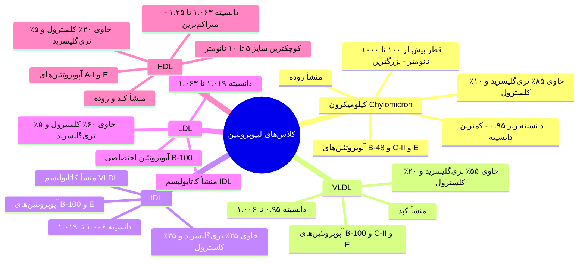

> [!tip] رابطه معکوس دانسیته و اندازه (تله پرتکرار آزمون)
> هرچه دانسیته (Density) یک لیپوپروتئین بیشتر باشد، سایز و قطر آن **کوچک‌تر** است:  
> **سایز ذره:** $\text{Chylomicron} > \text{VLDL} > \text{IDL} > \text{LDL} > \text{HDL}$  
> **دانسیته ذره:** $\text{HDL} > \text{LDL} > \text{IDL} > \text{VLDL} > \text{Chylomicron}$  
> بیشترین تری‌گلیسرید پلاسما توسط **کیلومیکرون و VLDL** جابه‌جا می‌شود؛ در حالی که عمده کلسترول پلاسما به شکل استر در **LDL و HDL** حمل می‌گردد.

---

## 2. جدول جامع آپولیپوپروتئین‌ها: خاستگاه، توزیع و عملکرد

| نام آپوپروتئین | منشأ سنتز | لیپوپروتئین‌های همراه | عملکرد فیزیولوژیک اختصاصی |
| :--- | :--- | :--- | :--- |
| **ApoA-I** | کبد و روده | HDL، کیلومیکرون | پروتئین ساختاری هسته HDL؛ محرک خروج سلولی کلسترول از طریق ABCA1؛ **فعال‌کننده آنزیم LCAT** |
| **ApoA-II** | کبد | HDL، کیلومیکرون | پروتئین ساختاری کمکی در HDL |
| **ApoA-V** | کبد | VLDL، کیلومیکرون | **تسهیل‌کننده اتصال به LPL** و تشدید هیدرولیز تری‌گلیسریدها |
| **Apo(a)** | کبد | Lp(a) | جزء ساختاری متصل با پیوند دی‌سولفیدی به ApoB-100 در لیپوپروتئین a |
| **ApoB-48** | **منحصراً روده** | کیلومیکرون و رمننت آن | پروتئین ساختاری اصلی کیلومیکرون (۴۸٪ طول ژن ApoB به علت ویرایش RNA) |
| **ApoB-100** | **منحصراً کبد** | VLDL، IDL، LDL، Lp(a) | پروتئین ساختاری اصلی VLDL و LDL؛ **لیگاند اتصالی به گیرنده LDL (LDLR)** در کبد و بافت‌ها |
| **ApoC-II** | کبد | کیلومیکرون، VLDL، HDL | **کوفاکتور و اکتیویتور ضروری آنزیم لیپوپروتئین لیپاز (LPL)** |
| **ApoC-III** | کبد و روده | کیلومیکرون، VLDL، HDL | **مهارکننده قدرتمند فعالیت LPL** و مانع کلیرانس رمننت‌ها توسط کبد |
| **ApoE** | کبد | رمننت کیلومیکرون، IDL، HDL | **لیگاند اصلی برای اتصال به گیرنده LDL و LRP** جهت کلیرانس کبدی رمننت‌ها |

---

## 3. مسیرهای فیزیولوژیک انتقال لیپیدها در بدن

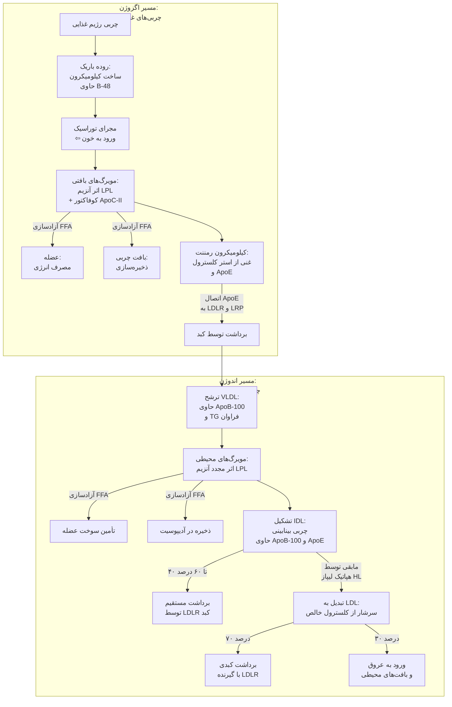

### مسیر انتقال معکوس کلسترول (Reverse Cholesterol Transport)
1. خروج کلسترول آزاد از ماکروفاژها و سلول‌های محیطی از طریق ترانسپورتر **ABCA1** و اتصال به **Nascent HDL** (حاوی ApoA-I دیسکوئید).
2. استریفیکاسیون کلسترول آزاد توسط آنزیم **LCAT** (وابسته به ApoA-I) و رانده شدن استرها به داخل مغز ذره، تبدیل به **Mature Spherical HDL**.
3. انتقال استرهای کلسترول از HDL به VLDL/IDL/LDL توسط پروتئین ناقل **CETP** در ازای دریافت تری‌گلیسرید.
4. پاکسازی مستقیم کلسترول توسط کبد از طریق گیرنده اسکونجر **SR-BI** یا غیرمستقیم با واسطه گیرنده LDLR.

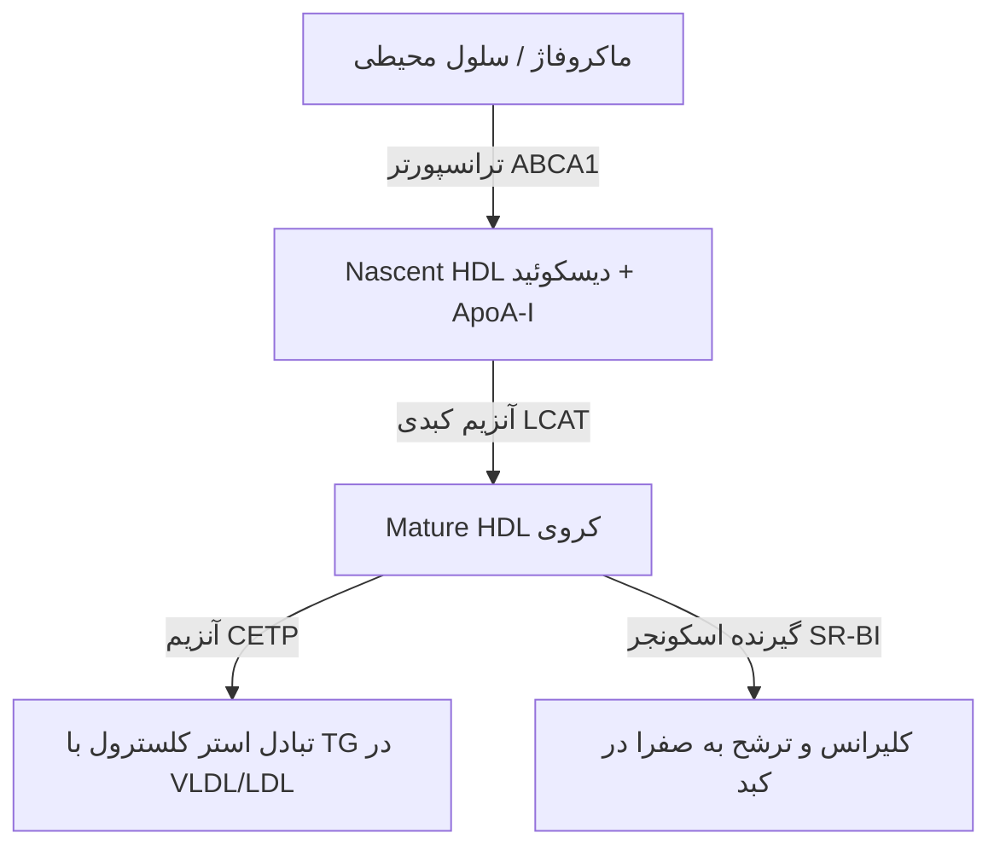

---

## 4. علل ثانویه اختلالات لیپید (Secondary Dyslipidemias)

> [!important] قاعده تفکیک بالینی علل ثانویه
> اختلالات ثانویه بسیار شایع‌تر از نقایص ژنتیکی هستند. پیش از برچسب زدن بیماری ژنتیکی، ارزیابی رژیم غذایی، داروها و بیماری‌های زمینه‌ای الزامی است.

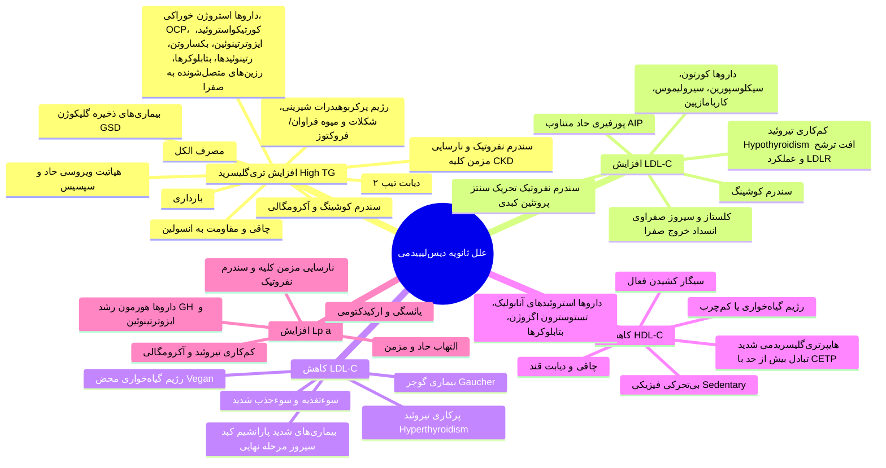

---

## 5. بیماری‌های ژنتیکی و مادرزادی متابولیسم لیپوپروتئین‌ها

### 1. اختلالات افزایش شدید تری‌گلیسرید (Severe Hypertriglyceridemia)

> [!abstract] سندرم فامیلیال کیلومیکرونمیا (FCS / Familial Chylomicronemia Syndrome)
> اختلال اتوزومال مغلوب (AR) بسیار نادر (۱ در ۲۰۰,۰۰۰ تا ۳۰۰,۰۰۰) ناشی از موتاسیون دوآللی در ژن آنزیم **LPL** یا ژن‌های کوفاکتور و پردازش آن: **APOC2**، **APOA5**، **GPIHBP1** و **LMF1**.

* **پاتوفیزیولوژی و آزمایشگاه:**
  * اختلال کامل هیدرولیز تری‌گلیسرید در کیلومیکرون‌ها و VLDL ⇦ انباشت شدید کیلومیکرون در خون ناشتا.
  * **سطح سرمی TG معمولاً بالای 1000 mg/dL** (اغلب ۲۰۰۰ تا ۵۰۰۰).
  * **تست ظاهری پلاسما:** سرم فوق‌العاده کدر؛ پس از قرار دادن لوله آزمایش در دمای ۴ درجه سانتی‌گراد به مدت چند ساعت، یک **لایه سوپرناتانت شیری و خامه‌ای (Creamy Supernatant)** روی سطح سرم تشکیل می‌شود.
  * *تله تشخیصی آزمون:* در صورت کمبود ApoC-II، با اضافه کردن پلاسمای طبیعی فرد سالم به لوله آزمایش بیمار، به دلیل جبران کوفاکتور، فعالیت LPL بازیابی شده و پلاسما شفاف می‌گردد.
* **تظاهرات بالینی اختصاصی:**
  1. **حملات راجعه پانکراتیت حاد (Acute Pancreatitis):** عارضه اصلی و کشنده؛ به دلیل انسداد مویرگ‌های انتهایی پانکراس توسط ذرات درشت کیلومیکرون و آزاد شدن اسیدهای چرب سمی موضعی.
  2. **لیپمیا رتینالیس (Lipemia Retinalis):** ظاهر شیری-سفید عروق شبکیه در معاینه فوندوسکوپی ناشی از تری‌گلیسرید بالای ۲۰۰۰.
  3. **گزانتومای اراپتیو (Eruptive Xanthomas):** پاپول‌های زرد-نارنجی خارش‌دار کوچک با پایه اریتماتوز روی باسن، کمر و سطوح اکستانسور اندام‌ها.
  4. **هپاتواسپلنومگالی:** ناشی از بلع ذرات چربی توسط ماکروفاژهای رتیکولوآندوتلیال کبد و طحال.
  5. *نکته امتحانی بسیار مهم:* **بیماران FCS دچار آترواسکلروز زودرس و انفارکتوس قلبی (MI) نمی‌شوند!** ذرات کیلومیکرون بسیار بزرگ‌تر از آن هستند که بتوانند به زیر اندوتلیال عروق نفوذ کرده و پلاک آترومی ایجاد کنند.
* **اهداف و اصول درمانی:**
  * هدف طلایی: **پایین آوردن TG به زیر 500 mg/dL** جهت رفع خطر پانکراتیت حاد.
  * رژیم غذایی با **محدودیت شدید چربی (Fat Restriction)** به کمتر از ۱۵ گرم در روز.
  * استفاده از تری‌گلیسریدهای با زنجیره متوسط (**MCT Oil**): مستقیماً جذب ورید پورت شده و نیازی به کیلومیکرون ندارند.
  * قطع کامل الکل و قندهای ساده؛ تجویز فیبرات‌ها، اسیدهای چرب امگا-۳ و رویکرد جدید دارویی مهارکننده ApoC-III.

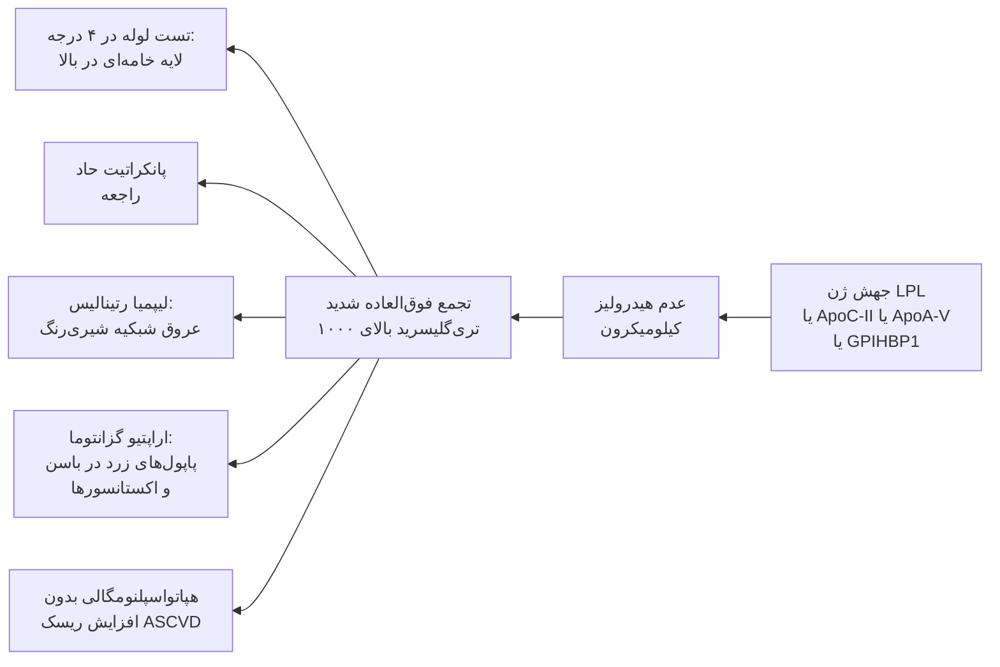

---

### 2. سندرم‌های فامیلیال لیپودیستروفی (Lipodystrophy)

1. **لیپودیستروفی ژنرالیزه مادرزادی (Congenital Generalized / Berardinelli-Seip):**
   * اتوزومال مغلوب (موتاسیون در ژن‌های `AGPAT2` و `BSCL2`).
   * **فقدان تقریباً کامل بافت چربی زیرجلدی در کل بدن** از بدو تولد.
   * **کمبود شدید و بحرانی لپتین (Leptin Deficiency)**، مقاومت وحشتناک به انسولین، هایپرتری‌گلیسریدمی کشنده، کبد چرب برق‌آسا و سیروز زودرس.
   * **درمان انتخابی:** هورمون نوترکیب **لپتین (Metreleptin)**.
2. **لیپودیستروفی پارشیال خانوادگی (Familial Partial Lipodystrophy - FPLD):**
   * اتوزومال غالب (AD)؛ جهش در ژن‌های `LMNA` (لامین A/C) یا `PPARG`.
   * **تحلیل چربی زیرجلدی در اندام‌های فوقانی و تحتانی (دست و پا و باسن)** همراه با **انباشت جبرانی چربی در سر، صورت، گردن و احشای شکم** (تابلوی کوشینگوئید کاذب).
   * مقاومت شدید به انسولین، دیابت زودرس تیپ ۲، هپاتواستئاتوز و **ریسک بسیار بالای حوادث قلبی-عروقی (CAD)**.

---

### 3. هایپرلیپیدمی ترکیبی خانوادگی (Familial Combined Hyperlipidemia - FCHL)

> [!abstract] ویژگی‌های FCHL
> **شایع‌ترین اختلال ارثی چربی خون** (شیوع ۱ در ۱۰۰ تا ۲۰۰ نفر، حدود ۱٪ کل جامعه)؛ مسئول حدود ۲۰٪ موارد سکته قلبی (CAD) در افراد زیر ۶۰ سال؛ وراثت **اتوزومال غالب (AD)**.

* **پاتوفیزیولوژی:** **تولید بیش از حد آپولیپوپروتئین B-100 از کبد** سوار بر ذرات VLDL.
* **فنوتیپ متغیر سه‌گانه (Classic Switching Phenotype):**
  * الگوی اول: افزایش ایزوله LDL-C
  * الگوی دوم: افزایش ایزوله تری‌گلیسرید (VLDL)
  * الگوی سوم: افزایش همزمان LDL-C و TG (فرم ترکیبی)
  * *تله امتحانی بالینی:* پروفایل لیپید در یک فرد در طول زمان یا بین اعضای مبتلای یک خانواده بین این ۳ فنوتیپ تغییر می‌کند (بسته به وزن و رژیم غذایی).
* **ارقام آزمایشگاهی شاخص:**
  * TG بین ۲۰۰ تا ۶۰۰ mg/dL
  * توتال کلسترول بین ۲۰۰ تا ۴۰۰ mg/dL
  * HDL-C پایین (زیر ۴۰ در مردان، زیر ۵۰ در زنان)
  * **سطح سرمی ApoB-100 به‌طور بارز بالاست** (مارکر تشخیصی کمکی اختصاصی).
  * حضور ذرات متراکم و کوچک **Small Dense LDL** (به‌شدت آتروژنیک).
* **معاینه فیزیکی:** **فاقد هرگونه گزانتوم (No Xanthomas)**؛ همراهی بالا با چاقی شکمی، هایپرتنشن، سندروم متابولیک و سابقه فامیلی قوی MI زودرس (زیر ۵۰ سال).

---

### 4. هایپرتری‌گلیسریدمی فامیلیال پلی‌ژنیک (Familial Hypertriglyceridemia - FHTG)
* شیوع ۱ در ۵۰۰، اتوزومال غالب، الگوی پلی‌ژنیک.
* افزایش متوسط TG (معمولاً ۲۵۰ تا ۵۰۰)، کاهش ملایم LDL و HDL.
* **سطح ApoB کاملاً طبیعی است** (برخلاف FCHL).
* *تله تستی:* این بیماری به‌تنهایی همراه با افزایش چشمگیر ریسک آترواسکلروز عروق کرونر **نیست**؛ مگر اینکه با فاکتورهای ثانویه (الکل، چاقی، کربوهیدرات، استروژن) همراه شود. در TG بالای ۵۰۰ جهت پیشگیری از پانکراتیت درمان دارویی با فیبرات/امگا-۳ داده می‌شود.

---

## 6. اختلالات افزایش شدید کلسترول (Hypercholesterolemias)

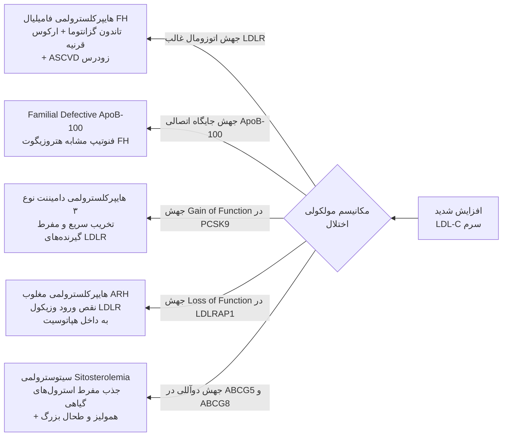

### 1. هایپرکلسترولمی فامیلیال (FH / Familial Hypercholesterolemia)
* **وراثت:** اتوزومال غالب (AD)؛ شیوع هتروزیگوت ۱ در ۲۵۰ نفر.
* **نقص پایه:** موتاسیون ژن **گیرنده LDL (LDLR)** در سطح کبد ⇦ ناتوانی هپاتوسیت‌ها در پاکسازی ذرات LDL از گردش خون.

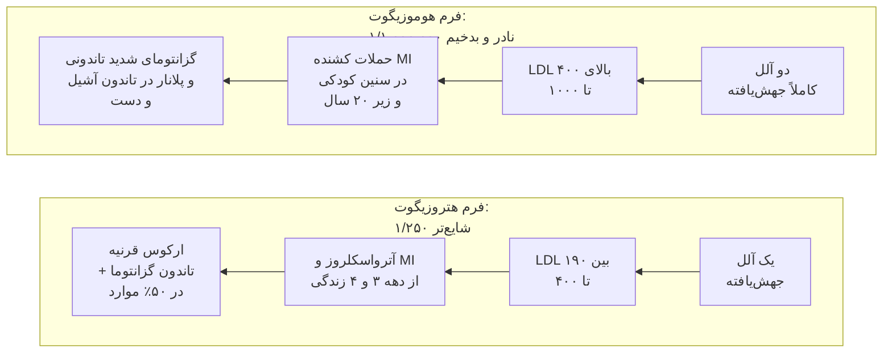

* **یافته‌های فیزیکی پاتوگنومونیک FH:**
  1. **تاندون گزانتوما (Tendon Xanthomas):** رسوب کلسترول در تاندون‌ها، به‌ویژه **تاندون آشیل (Achilles Tendon)** و تاندون‌های اکستانسور انگشتان دست.
  2. **ارکوس قرنیه (Arcus Cornea / Arcus Senilis):** رسوب حلقوی سفید-خاکستری چربی دور انبیه؛ در صورت مشاهده زیر سن ۵۰ سالگی شدیداً به نفع FH است.
  3. **گزانتلاسما (Xanthelasma):** پلاک‌های چربی زرد روی پلک‌ها (البته اختصاصیت کمتری نسبت به تاندون گزانتوما دارد).
* **استراتژی درمانی:**
  * در **هتروزیگوت:** استاتین با دوز بالا (High-intensity) + ازتیمایب ± مهارکننده PCSK9.
  * در **هوموزیگوت:** مقاومت کامل به استاتین (به دلیل فقدان LDLR)؛ نیازمند **آفرزیس متناوب LDL (LDL Apheresis)** هر ۱ تا ۲ هفته، مهارکننده MTP (**لومیتاپاید - Lomitapide**)، مهارکننده سنتز ApoB (**میپومرسن - Mipomersen**)، آنتی‌بادی مهارکننده ANGPTL3 (**اویناکوماب - Evinacumab**) و نهایتاً **پیوند کبد**.

> [!danger] قانون طلایی اورژانس بالینی LDL
> در هر فردی در هر سنی (حتی کودک ۱۰ ساله)، اگر سطح سرمی **LDL-C مساوی یا بیشتر از 190 mg/dL** باشد، بیمار باید خودبه‌خود کاندیدای قطعی بیماری ژنتیکی (هتروزیگوت FH) قلمداد شده و **بدون معطلی برای تست ژنتیک، درمان با استاتین قوی آغاز گردد**.

---

### 2. سیتوسترولمی (Sitosterolemia)
* **وراثت:** اتوزومال مغلوب (AR) با سابقه فامیلی منفی؛ فوق‌العاده نادر.
* **نقص ژنتیکی:** جهش دوآللی در ترانسپورترهای غشایی **ABCG5 و ABCG8** در انتروسیت‌ها و سلول‌های مجاری صفراوی کبد.
* **پاتولوژی:** پروتئین‌های ABCG5/8 مسئول پس زدن استرول‌های گیاهی به داخل روده و ترشح آن‌ها به صفرا هستند. نقص آن‌ها باعث **افزایش شدید جذب روده‌ای استرول‌های گیاهی (سیتوسترول، کامپسترول) و کلسترول** و افت ترشح صفراوی آن‌ها می‌شود.
* **تظاهرات بالینی:** تاندون گزانتومای زودرس، آترواسکلروز عروقی فوق‌حاد در سنین جوانی، همراه با **حملات همولیز گلبول قرمز و اسپلنومگالی** (تجمع استرول در غشای RBC).
* **درمان اختصاصی:** رژیم غذایی فاقد روغن‌ها و استرول‌های گیاهی + داروی **ازتیمایب (Ezetimibe)** (که پروتئین NPC1L1 روده را مهار کرده و درمان اختصاصی این بیماری است).

---

### 3. کمبود لیپاز اسید لیزوزومال (LAL Deficiency / Wolman & CESD)
* اتوزومال مغلوب در ژن `LIPA`؛ تجمع استرهای کلسترول و TG در لیزوزوم سلول‌ها.
* تظاهر با کبد چرب پیشرونده، **سیروز میکروندولار**، اسپلنومگالی، هایپرکلسترولمی شدید با LDL بالا و HDL پایین.

---

## 7. دیس‌لیپیدمی‌های مختلط (Mixed Dyslipidemias)

### دیس‌بتالیپوپروتئینمی خانوادگی (FDBL / Type III Hyperlipidemia)
> [!abstract] ویژگی‌های FDBL
> اختلال متابولیک نادر (۱ در ۱۰,۰۰۰) ناشی از وضعیت هوموزیگوت **ApoE-2 / ApoE-2** (ایزوفرم ApoE2 به گیرنده‌های کبدی متصل نمی‌شود).  
> بیماری برای بروز نیازمند یک محرک ثانویه (چاقی، دیابت، هایپوتیروئیدی، الکل، یائسگی، مصرف استروژن یا عفونت HIV) است.

* **پاتولوژی سرم:** اختلال پاکسازی کبد ⇦ انباشت شدید **رمننت‌های کیلومیکرون و IDL (Broad Beta Lipoprotein)**.
* **آزمایشگاه:** افزایش متناسب و همزمان کلسترول و تری‌گلیسرید (نسبت کلسترول به تری‌گلیسرید نزدیک به ۱:۱)؛ **نسبت VLDL-C به کل TG پلاسما بیشتر از 0.30 است**. HDL و LDL معمولاً پایین یا نرمال هستند.
* **یافته‌های بالینی پاتوگنومونیک (علائم امتحانی قطعی):**
  1. **گزانتومای کف دست (Palmar Xanthomas / Xanthoma Striatum Palmare):** رسوب نارنجی-زرد چربی در چین‌ها و خطوط کف دست (انحصاری و پاتوگنومونیک FDBL).
  2. **گزانتومای توبرو-اراپتیو (Tuberoeruptive Xanthomas):** ندول‌های چربی متصل‌به‌هم روی آرنج و زانوها.
  3. **بیماری شریان‌های محیطی (PVD):** شیوع بیماری عروق محیطی لنگش در این افراد هم‌ردیف و حتی شایع‌تر از درگیری عروق کرونر (CAD) است.
* **پاسخ درمانی:** پاسخ بسیار دراماتیک به کاهش وزن، رژیم کم‌چرب، فیبرات‌ها، استاتین‌ها و مهارکننده‌های PCSK9.

---

## 8. هیپولیپیدمی‌های مادرزادی (Familial Hypolipidemias)

| نام بیماری | نقص ژنتیکی | پروفایل لیپید در خون | علائم بالینی شاخص و اختصاصی | رویکرد درمانی |
| :--- | :--- | :--- | :--- | :--- |
| **آبتالیپوپروتئینمی (Abetalipoproteinemia)** | موتاسیون اتوزومال مغلوب در ژن **MTTP** (پروتئین انتقال تری‌گلیسرید میکروزومال) | **فقدان کامل و صفر بودن LDL و VLDL و کیلومیکرون**؛ ApoB غیرقابل سنجش؛ کلسترول و TG بسیار پایین | اسهال چرب و سوءتغذیه در بدو تولد (FTT)؛ **آکانتوسیتوز گلبول‌های قرمز (Burr cells)**؛ **دژنراسیون اسپینوسربلار (آتاکسی، فقدان DTR، گیت اسپاستیک)**؛ **رتینوپاتی پیگمانته و نابینایی** ناشی از نقص جذب ویتامین‌های محلول در چربی (به‌ویژه ویتامین E) | رژیم پرکالری کم‌چرب + **دوزهای بسیار بالای ویتامین‌های محلول در چربی (به‌ویژه ویتامین E)** |
| **هایپوبتالیپوپروتئینمی خانوادگی (FHBL)** | جهش‌های ترانکیشن در ژن **APOB** (اتوزومال غالب) | سطح LDL بسیار پایین (معمولاً بین **20 تا 80 mg/dL**) | تجمع چربی داخل هپاتوسیت‌ها ⇦ **کبد چرب شدید (Hepatic Steatosis) و افزایش ترانس‌آمینازها**؛ کاهش چشمگیر ریسک ASCVD | پایش آنزیم‌های کبد، پرهیز از الکل |
| **کمبود خانوادگی PCSK9** | جهش Loss of Function در **PCSK9** (اتوزومال غالب) | سطح LDL پایین | **کاهش ۳۰ تا ۴۰ درصدی طول عمر از نظر ریسک سکته قلبی و CAD** (افراد محافظت‌شده ژنتیکی) | وضعیت مطلوب و فیزیولوژیک |
| **هایپولیپیدمی ترکیبی خانوادگی** | جهش Loss of Function در ژن **ANGPTL3** (مهارکننده LPL) | **افت همزمان TG، LDL و HDL** | محافظت کامل در برابر آترواسکلروز عروقی بدون عارضه جانبی | بدون نیاز به درمان |

---

## 9. سندرم‌های افت شدید مادرزادی HDL (Low HDL Syndromes)

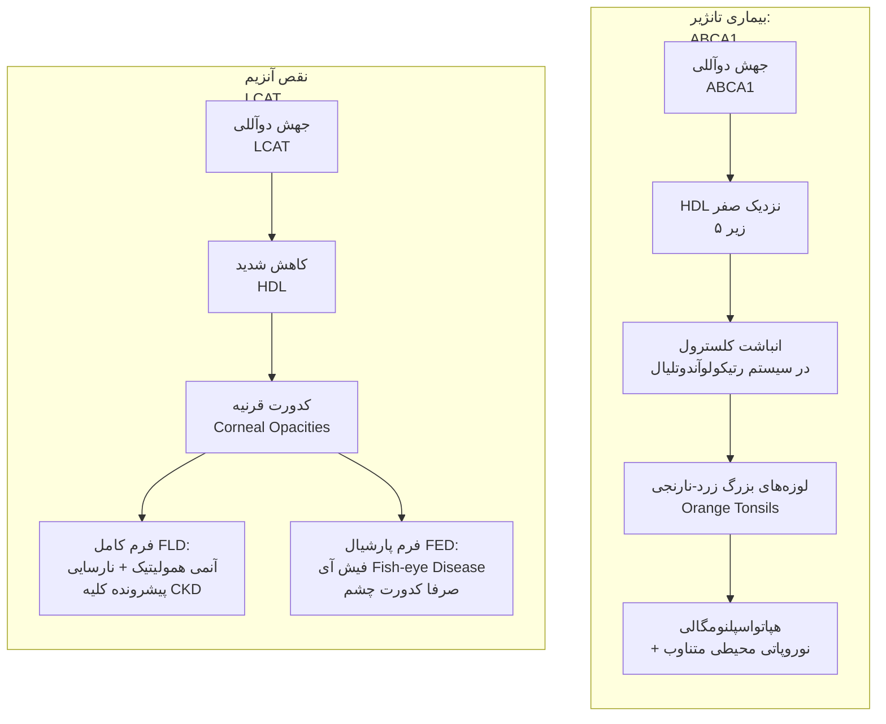

### مقایسه تفکیکی بیماری‌های نقص ژنتیکی HDL

| شاخص بالینی | بیماری تانژیر (Tangier Disease) | کمبود کامل LCAT (FLD) | بیماری فیش آی (FED / Partial LCAT) |
| :--- | :--- | :--- | :--- |
| **ژن درگیر** | **ABCA1** (اتوزومال مغلوب) | **LCAT** (اتوزومال مغلوب) | **LCAT** (موتاسیون نسبی) |
| **سطح HDL-C پلاسما** | **تقریباً صفر (< 5 mg/dL)** و ApoA-I کمتر از ۵ | شدیداً کاهش‌یافته | شدیداً کاهش‌یافته |
| **تظاهر شاخص چشمی** | کدورت قرنیه خفیف | **کدورت منتشر قرنیه (Corneal Clouding)** | **کدورت متراکم قرنیه با نمای چشم ماهی (Fish-Eye)** |
| **درگیری کلیوی** | وجود ندارد | **نارسایی پیشرونده کلیه و پروتیئنوری (CKD)** | **ندارد** (عملکرد کلیه نرمال است) |
| **هماتولوژی** | نرمال یا ترومبوسیتوپنی خفیف | **آنمی همولیتیک بارز با تارگت سل** | نرمال |
| **علامت پاتوگنومونیک** | **لوزه‌های بزرگ زرد تا نارنجی پرتقالی** + نوروپاتی | نارسایی کلیه + تارگت سل + کدورت قرنیه | کدورت چشم ماهی ایزوله بدون نارسایی کلیه |

---

## 10. فرمول فریدوالد و ارزیابی ریسک قلبی-عروقی (ASCVD)

### فرمول فریدوالد (Friedewald Equation) برای تخمین LDL-C
در صورت در دست بودن مقادیر به صورت میلی‌گرم در دسی‌لیتر ($mg/dL$):

$$LDL\text{-}C = Total\;Cholesterol - HDL\text{-}C - \frac{Triglycerides}{5}$$

> [!danger] شرایط منع استفاده از فرمول فریدوالد (تله حتمی آزمون)
> ۱. **اگر سطح تری‌گلیسرید پلاسما بیشتر از 400 mg/dL باشد** ($\text{TG} > 400$).  
> ۲. حضور **کیلومیکرون‌ها در حالت ناشتا** (مانند FCS).  
> ۳. ابتلا به **دیس‌بتالیپوپروتئینمی (FDBL / Type III)** به علت برهم خوردن نسبت کلسترول به تری‌گلیسرید در ذرات VLDL.  
> *در این شرایط، سنجش مستقیم آزمایشگاهی (Direct LDL) یا اندازه‌گیری **Non-HDL Cholesterol** و **ApoB** الزامی است.*

### طبقه‌بندی شدت ریسک ۱۰ ساله حوادث ASCVD و پروتکل تجویز استاتین

| رده ریسک ASCVD | شاخص‌های تشخیصی بالینی | استاتین انتخابی | هدف درمانی LDL-C |
| :--- | :--- | :--- | :--- |
| **پیشگیری ثانویه (Secondary)** | هرگونه بیماری اثبات‌شده عروقی بالینی (**CAD، سابقه MI، آنژین پایدار/ناپایدار، استروک یا TIA، بیماری شریان محیطی PVD**) | **استاتین با شدت بالا (High-Intensity)** | **کاهش حداقل ۵۰٪ در سطح پایه LDL و رسیدن به کمتر از ۵۵ تا ۷۰** |
| **بسیار پرخطر (Very High Risk)** | سطح پایه **LDL ≥ 190 mg/dL** یا دیابت با حداقل یک ریسک‌فاکتور ماژور یا نمره ۱۰ ساله بالای ۲۰٪ | **استاتین با شدت بالا (High-Intensity)** | **کاهش حداقل ۵۰٪ و رسیدن به کمتر از ۷۰ تا ۱۰۰** |
| **ریسک متوسط (Intermediate)** | نمره ریسک ۱۰ ساله بین **۷.۵٪ تا ۲۰٪** یا افراد دیابتی ۴۰ تا ۷۵ سال بدون ریسک فاکتور | **استاتین با شدت متوسط (Moderate-Intensity)** | **کاهش ۳۰ تا ۴۹٪ و رسیدن به کمتر از ۱۰۰** |
| **ریسک مرزی/پایین (Low/Borderline)** | ریسک کمتر از ۵٪ تا ۷.۵٪ بر اساس کلکولیتورهای ریسک (ACC/AHA و PREVENT) | اصلاح سبک زندگی (مگر فاکتورهای افزاینده ریسک نظیر سابقه فامیلی قوی MI) | حفظ LDL در محدوده کمتر از ۱۰۰ تا ۱۳۰ |

> [!important] دوزهای معادل استاتین‌ها (تنها داروهای High-Intensity)
> * **استاتین‌های با شدت بالا (کاهش LDL بیش از ۵۰٪):**  
>   1. **آتورواستاتین (Atorvastatin):** دوز **40 تا 80 mg روزانه**  
>   2. **روزوواستاتین (Rosuvastatin):** دوز **20 تا 40 mg روزانه**  
> * سایر استاتین‌ها (سیمواستاتین، پراواستاتین، لوواستاتین، فلوواستاتین و پیتاواستاتین) در حداکثر دوز خود صرفاً شدت متوسط (Moderate) ایجاد می‌کنند.

---

## 11. جدول جامع داروهای کاهنده چربی خون: مکانیسم، دوز و عوارض

| رده دارویی | داروهای شاخص | دوز شروع و حداکثر | مکانیسم اثر سلولی | عوارض جانبی و تداخلات |
| :--- | :--- | :--- | :--- | :--- |
| **استاتین‌ها (HMG-CoA Reductase Inhibitors)** | آتورواستاتین، روزوواستاتین، سیمواستاتین، پراواستاتین | متغیر (آتورواستاتین: 10-80 mg، روزوواستاتین: 5-40 mg) | مهار سنتز اندوژن کلسترول در کبد ⇦ تحریک آپ‌رگولاسیون گیرنده‌های LDLR ⇦ پاکسازی LDL خون | میالژی و میوپاتی عضلانی، افزایش آنزیم‌های ترانس‌آمیناز کبدی (ALT/AST)، افزایش خفیف ریسک دیابت |
| **مهارکننده جذب کلسترول** | **ازتیمایب (Ezetimibe)** | 10 mg روزانه | مهار انتخابی ترانسپورتر **NPC1L1** در پرزهای روده باریک ⇦ مهار جذب کلسترول غذا و صفرا | افزایش ترانس‌آمینازها در همراهی با استاتین؛ عارضه گوارشی خفیف |
| **مهارکننده‌های PCSK9 (آنتی‌بادی مونوکلونال)** | **اوولوکوماب (Evolocumab)**، **آلیروکوماب (Alirocumab)** | 75-140 mg زیرجلدی هر ۲ هفته یا ۴۲۰ میلی‌گرم ماهانه | بلوک پروتئین PCSK9 و ممانعت از تخریب LDLR در لیزوزوم ⇦ افزایش تراکم LDLR در غشای هپاتوسیت | واکنش موضعی در محل تزریق، علائم شبه‌آنفلوآنزا |
| **مهارکننده PCSK9 (از نوع siRNA)** | **اینکلیزیران (Inclisiran)** | 300 mg زیرجلدی در بدو ورود، ۳ ماه بعد، و سپس **هر ۶ ماه یک‌بار** | خاموش‌سازی سنتز داخل‌سلولی mRNA پروتئین PCSK9 با مکانیسم RNA تداخلی | واکنش موضعی محل تزریق؛ مزیت: پایبندی عالی بیمار (تزریق سالی ۲ بار) |
| **شلاتورهای اسید صفراوی** | کلستیرامین، کلستیپول، کولسولام | کلستیرامین: 4-32 g/d، کولسولام: 3.75-4.3 g/d | اتصال به اسیدهای صفراوی در روده و ممانعت از بازجذب ⇦ مصرف کلسترول کبد برای ساخت صفرا | نفخ، یبوست، سوءجذب داروها؛ **افزایش کاذب تری‌گلیسرید (منع مصرف در TG بالای ۳۰۰)** |
| **مهارکننده ATP Citrate Lyase** | **بمپدوئیک اسید (Bempedoic Acid)** | 180 mg روزانه | مهار آنزیم ACL یک مرحله قبل از HMG-CoA ردوکتاز در کبد (پرو-دراگ بدون فعال‌سازی در عضله) | **هایپراوریسمی و شعله‌وری نقرس**، افزایش سنگ کیسه صفرا (Cholelithiasis) |
| **مهارکننده MTP** | **لومیتاپاید (Lomitapide)** | 5-60 mg روزانه | مهار MTP در روده و کبد ⇦ توقف تشکیل کیلومیکرون و VLDL (انحصاری هوموزیگوت FH) | تهوع، اسهال شدید، **کبد چرب شدید (انباشت تری‌گلیسرید در کبد)** |
| **آنتی‌سنس اولیگونوکلئوتید ApoB** | **میپومرسن (Mipomersen)** | 200 mg زیرجلدی هفتگی | پیوند به mRNA آپوپروتئین B-100 و تخریب آن ⇦ توقف تولید ApoB (انحصاری هوموزیگوت FH) | واکنش تزریق، ترانس‌آمینیت، استئاتوز کبد |
| **مشتقات اسید فیبریک (Fibrates)** | **فنوفیبرات (Fenofibrate)**، ژم‌فیبروزیل (Gemfibrozil) | ژم‌فیبروزیل: 600 mg bid، فنوفیبرات: 48-145 mg/d | آگونیست قوی گیرنده هسته‌ای **PPAR-α** ⇦ افزایش بیان LPL و آپوپروتئین‌های A-I و A-II و کاهش ApoC-III | دیس‌پپسی، افزایش ترانس‌آمینازها، سنگ صفرا؛ **افزایش خطر رابدومیولیز با استاتین‌ها (فنوفیبرات بسیار ایمن‌تر از ژم‌فیبروزیل است)** |
| **اسیدهای چرب امگا-۳** | اتیل استرها، **ایکوزاپنت اتیل (Icosapent Ethyl)** | 4 g روزانه | افزایش کاتابولیسم تری‌گلیسرید و مهار سنتز VLDL کبدی | آروغ ماهی، سوءهاضمه؛ در دوزهای بالا افزایش ملایم ریسک AF |

---

## 12. سندرم متابولیک (Metabolic Syndrome)

> [!abstract] تعریف سندرم متابولیک
> خوشه‌ای از اختلالات بالینی و بیوشیمیایی ناشی از آدیپوزیتی احشایی و مقاومت به انسولین که مستقیماً ریسک حوادث قلبی-عروقی (ASCVD) را تا **۲ برابر** و ریسک دیابت نوع ۲ را تا **۵ برابر** افزایش می‌دهد.

### معیارهای تشخیصی هارمونیزه‌شده جهانی و ملی (Harmonizing Criteria)
تشخیص نیازمند حضور حداقل **۳ مورد از ۵ معیار زیر** است:
1. **چاقی مرکزی (Central Obesity):**  
   * طبق کرایتریای NCEP ATPIII آمریکا: دور کمر بالای ۱۰۲ سانتی‌متر در مردان و بالای ۸۸ سانتی‌متر در زنان.  
   * *نکته بومی و ملی ایران (مطالعه TUMS):* **دور کمر مساوی یا بیشتر از 90 سانتی‌متر برای هر دو جنس زن و مرد**؛ یا **نسبت دور کمر به قد (Waist-to-Height Ratio) بیشتر از 0.5**.
2. **تری‌گلیسرید بالا:** سطح سرمی ناشتا **مسای یا بیشتر از 150 mg/dL** (یا مصرف داروی کاهنده تری‌گلیسرید).
3. **کلسترول HDL پایین:** مقدار **کمتر از 40 mg/dL در آقایان** و **کمتر از 50 mg/dL در خانم‌ها** (یا مصرف دارو).
4. **فشار خون بالا:** فشار خون سیستولیک **مساوی یا بیشتر از 130 mmHg** و/یا دیاستولیک **مساوی یا بیشتر از 85 mmHg** (یا درمان دارویی قبلی پرفشاری خون).
5. **قند خون ناشتای مختل (IFG):** سطح قند ناشتا **مساوی یا بیشتر از 100 mg/dL** (یا دیابت تشخیص‌داده‌شده قبلی یا مصرف داروهای قند).

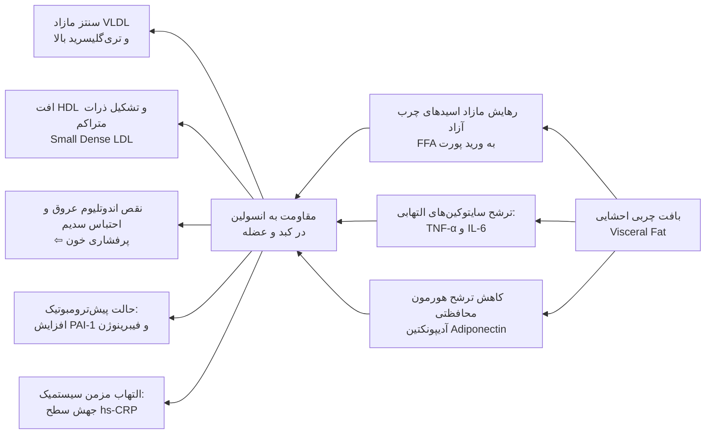

---

## 13. ارزیابی جامع چاقی (Obesity) و پیامدهای ارگانیک

> [!abstract] شاخص توده بدنی (BMI / Body Mass Index)
> معیار استاندارد طلایی بالینی برای طبقه‌بندی اضافه وزن و چاقی:
> 
> $$BMI = \frac{\text{Weight (kg)}}{[\text{Height (m)}]^2}$$

### طبقه‌بندی استانداردهای BMI
* **کم‌وزن (Underweight):** کمتر از ۱۸.۵ $kg/m^2$
* **طبیعی (Normal):** ۱۸.۵ تا ۲۴.۹ $kg/m^2$
* **اضافه وزن (Overweight):** ۲۵.۰ تا ۲۹.۹ $kg/m^2$
* **چاقی درجه یک (Class I Obesity):** ۳۰.۰ تا ۳۴.۹ $kg/m^2$
* **چاقی درجه دو (Class II Obesity):** ۳۵.۰ تا ۳۹.۹ $kg/m^2$
* **چاقی درجه سه یا مفرط (Class III / Morbid Obesity):** مساوی یا بیشتر از ۴۰.۰ $kg/m^2$

### کموربیدیتی‌ها و بار بیماری‌های ناشی از چاقی
* **قلبی-عروقی:** پرفشاری خون، بیماری عروق کرونر (CAD)، نارسایی قلبی (CHF)، کورپولمونال، ترومبوآمبولی وریدی (DVT/PTE)، واریس اندام‌ها.
* **تنفسی:** **سندرم آپنه انسدادی خواب (OSA)**، سندرم هیپوونتیلاسیون چاقی (**پیک‌ویکین - Pickwickian**)، تشدید آسم.
* **متابولیک و اندوکرین:** دیابت قند نوع ۲، دیس‌لیپیدمی آتروژنیک، **سندرم تخمدان پلی‌کیستیک (PCOS)**، هایپوگونادیسم مردانه.
* **گوارش و کبد:** **بیماری کبد چرب دیس‌متابولیک (MASLD/NASH)**، سنگ کیسه صفرا (Cholelithiasis)، ریفلاکس معده (GERD)، فتق‌ها.
* **بدخیمی‌ها (سرطان‌های وابسته به هورمون و التهاب چاقی):** سرطان‌های اندومتر، پستان (پس از یائسگی)، روده بزرگ (کولون)، پروستات، تخمدان، تیروئید و مری.
* **اسکلتی-عضلانی:** استئوآرتریت مفاصل زانو و ران، کمردرد، نقرس، سندرم تونل کارپال (CTS).
* **پوست:** **استریای اتساعی (Striae Distensae)**، پیگمانتاسیون استاز وریدی، لنف‌ادم، سلولیت، اینترتریگو، کورک، **آکانتوزیس نیگریکانس**، اسکین‌تگ (**Acrochordon**) و هیدرآدنیت ساپوراتیو.
* **نورولوژی و روان:** افزایش فشار داخل جمجمه خوش‌خیم (**پ سودوتومور سربری / IIH**)، پارستزی مرالژیا (گیر افتادن عصب فمورال جلدی خارجی)، افسردگی و زوال عقل.

---

## 14. رویکردهای مداخله‌ای درمان چاقی

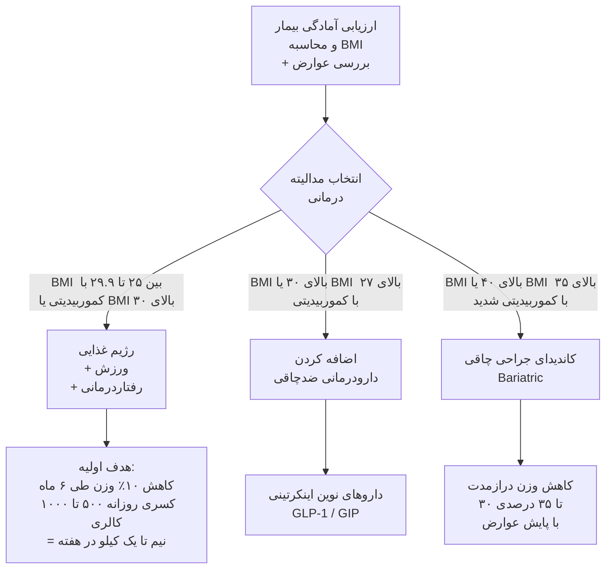

### 1. مداخلات تغذیه‌ای و شیوه زندگی
* **میزان کسری کالری:** کاهش **500 تا 1000 kcal/day** از کالری مصرفی روزانه ⇦ کاهش وزن پایدار به میزان **0.5 تا 1 کیلوگرم در هفته (1 تا 2 پوند)**.
* **ترکیب درشت‌مغذی‌ها:**
  * چربی کل: ۲۵ تا ۳۵ درصد کل کالری (اسیدهای چرب اشباع کمتر از ۷٪، اسیدهای چرب ترانس صفر، استفاده از MUFA نظیر روغن زیتون تا ۲۰٪).
  * کربوهیدرات: ۵۰ تا ۶۰ درصد کل کالری (پرهیز کامل از قندهای ساده و آب‌میوه به علت فروکتوز بالا؛ استفاده از کربوهیدرات‌های پیچیده سبوس‌دار).
  * پروتئین: ۱۵ تا ۲۰ درصد کل کالری.
  * کلسترول رژیم: کمتر از ۲۰۰ میلی‌گرم در روز.
  * **فیبر رژیم:** ۲۵ گرم در روز برای خانم‌ها و ۳۸ گرم در روز برای آقایان (سبزیجات، حبوبات و غلات سبوس‌دار).
* **رژیم‌های بسیار کم‌کالری (VLCD / Very Low Calorie Diets):**
  * دوز کالری **کمتر از 800 kcal/day** همراه با ۵۰ تا ۸۰ گرم پروتئین خالص روزانه.
  * اندیکاسیون محدود: موارد اورژانسی برای کاهش وزن سریع قبل جراحی‌های ارتوپدی حیاتی یا آپنه خواب شدید منجر به اریتروسیتوز ثانویه.
  * *خطر حیاتی VLCD:* کاهش وزن سریع‌تر از **1.5 kg/week** شدیداً ریسک **تشکیل سنگ‌های صفراوی حاد (Gallstones)** را بالا می‌برد.
* **ورزش و فعالیت فیزیکی:**
  * حداقل **150 دقیقه در هفته ورزش هوازی با شدت متوسط** (نظیر پیاده‌روی تند) یا **75 دقیقه در هفته ورزش هوازی با شدت بالا**؛ تقسیم‌شده در دوره‌های با طول حداقل ۱۰ دقیقه.
  * همراه با تمرینات مقاومتی و تقویت عضلات ۲ بار در هفته.
* **رفتاردرمانی (Behavioral Therapy):** ثبت دقیق وقایع غذایی (Journaling)، کنترل محرک‌ها (عدم تماشای تلویزیون حین غذا خوردن، استفاده از بشقاب کوچک)، مسواک زدن بلافاصله پس از غذا، و پرهیز از خرید رفتن در زمان گرسنگی.

---

### 2. دارودرمانی ضدچاقی (Pharmacotherapy)
* **اندیکاسیون قطعی:** افراد با **BMI ≥ 30 kg/m²** یا افراد با **BMI ≥ 27 kg/m² همراه با حداقل یک کموربیدیتی** مرتبط با چاقی (دیابت، پرفشاری خون، دیس‌لیپیدمی، OSA).

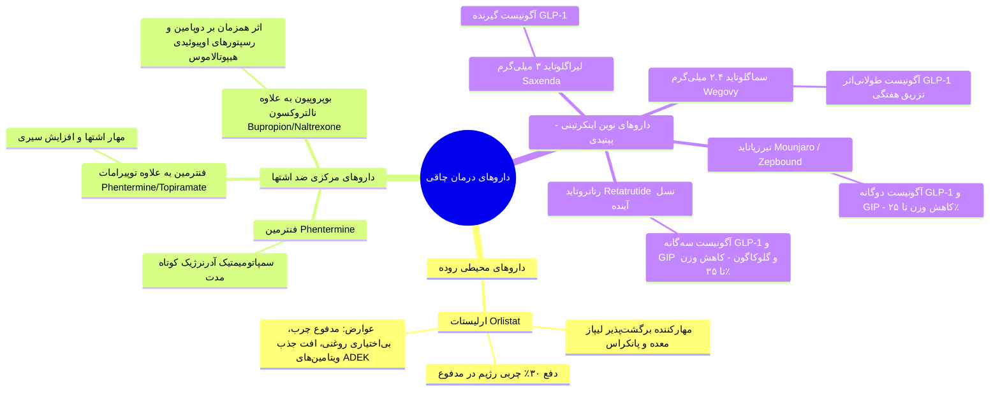

---

### 3. جراحی‌های چاقی و متابولیک (Bariatric Surgery)
* **کرایتریای استاندارد اندیکاسیون جراحی:**
  1. افراد با **BMI ≥ 40 kg/m²**.
  2. افراد با **BMI ≥ 35 kg/m² در حضور بیماری‌های جدی همراه** (دیابت نوع ۲ کنترل‌نشده، آپنه خواب شدید، کبد چرب پیشرفته، نارسایی قلبی یا استئوآرتریت ناتوان‌کننده).
* **انواع جراحی‌های استاندارد:**
  1. **حلقه قابل تنظیم لاپاروسکوپیک معده (Gastric Band):** روش تحدیدی قدیمی با عوارض جابه‌جایی و شکست درازمدت بالا (امروزه به‌ندرت استفاده می‌شود).
  2. **اسلیو گاسترکتومی لاپاروسکوپیک (Sleeve Gastrectomy):** شایع‌ترین عمل جراحی حال حاضر؛ برداشتن بخش عمده فوندوس و تنه معده (تحدیدی + کاهش شدید گرلین)؛ ریسک ریفلاکس معده (GERD) پس از عمل.
  3. **بای‌پس معده رو-ان-وای (Roux-en-Y Gastric Bypass / RYGB):** روش ترکیبی تحدیدی و سوءجذبی؛ اتصال پاکت کوچک معده به ژژونوم با دور زدن دوازدهه؛ بیشترین اثربخشی در رمیشن دیابت نوع ۲.
* **عوارض دیررس و خطرات بعد از عمل جراحی:**
  * تنگی استوما (Stomal Stenosis) و زخم‌های مارژینال.
  * سندرم دامپینگ (Dumping Syndrome).
  * **هایپوگلیسمی واکنشی شدید پس از جراحی باریاتریک (Post-bariatric Hypoglycemia):** ناشی از هیپرپلازی سلول‌های بتای پانکراس (Nesidioblastosis) و ترشح جهشی انسولین بعد از غذاهای حاوی قند.
  * **کمبودهای شدید تغذیه‌ای (نیازمند مکمل‌یاری مادام‌العمر):** کمبود ویتامین B12، آهن (آنمی فقر آهن شدید)، فولات، کلسیم، ویتامین D و ویتامین‌های محلول در چربی.

---

## 15. تابلوی جامع مقایسه‌ای سناریوهای بالینی و تله‌های امتحانی

| سناریوی بالینی بیمار | یافته‌های اختصاصی آزمایشگاه / تصویر | تشخیص پاتولوژیک قطعی | اقدام درمانی صحیح و فوری |
| :--- | :--- | :--- | :--- |
| **مرد جوان با درد شکم شدید، تری‌گلیسرید ۳۵۰۰ و سوپرناتانت شیری** | سرم کدر در ۴ درجه، عروق شبکیه شیری‌رنگ، پاپول‌های زرد باسن | **سندرم فامیلیال کیلومیکرونمیا (FCS)** | NPO فوری، سرم‌درمانی، محدودیت چربی به کمتر از ۱۵ گرم/روز، عدم نیاز به بررسی عروق کرونر |
| **بیمار با کلسترول ۳۵۰، TG مساوی ۴۵۰ و خطوط نارنجی کف دست** | توبه‌روئروپتیو گزانتوم در زانو، نسبت VLDL-C به TG بالای ۰.۳۰ | **دیس‌بتالیپوپروتئینمی فامیلیال (FDBL / Type III)** | بررسی لنگش عروق محیطی، قطع الکل، تجویز فیبرات یا استاتین قوی |
| **کودک ۵ ساله با زردی چشم، تاندون‌های برآمده مچ پا و LDL بالای ۶۰۰** | جهش ژن LDLR در هر دو والد با سابقه مرگ قلبی زودرس در خانواده | **هایپرکلسترولمی فامیلیال هوموزیگوت (HoFH)** | شروع فوری استاتین + ازتیمایب + آماده‌سازی برای آفرزیس متناوب LDL |
| **فرد جوان با تاندون گزانتوما، رژیم پر از گیاه و همولیز گلبول قرمز** | استرول‌های گیاهی بسیار بالا، جهش دوآللی ABCG5/G8 | **سیتوسترولمی (Sitosterolemia)** | پرهیز کامل از روغن‌های گیاهی و مغزها + داروی اختصاصی **ازتیمایب** |
| **کودک مبتلا به اسهال چرب مزمن، عدم تعادل، فقدان کامل LDL و آکانتوسیت** | TG و کلسترول نزدیک به صفر، بیوپسی روده انباشته از چربی | **آبتالیپوپروتئینمی (Abetalipoproteinemia)** | رژیم کم‌چرب پرکالری + **دوزهای بسیار بالای ویتامین E و ویتامین‌های ADEK** |
| **مرد ۳۵ ساله با لوزه‌های نارنجی حجیم، نوروپاتی محیطی و HDL کمتر از ۴** | ApoA-I غیرقابل سنجش، هپاتواسپلنومگالی در سونوگرافی | **بیماری تانژیر (Tangier Disease)** | بیوپسی لوزه نیاز نیست، درمان حمایتی، ارزیابی نورولوژی و مانیتورینگ قلب |
| **بیمار با کدورت دوطرفه قرنیه، آنمی همولیتیک و پروتئینوری شدید** | HDL بسیار پایین، بیوپسی کلیه آسیب گلومرولی با رسوب لیپید | **کمبود کامل آنزیم LCAT فامیلیال (FLD)** | مدیریت نارسایی مزمن کلیه (کنترل فشار با ACEi)، بررسی کاندیداتوری پیوند کلیه |
| **مرد چاق با دور کمر ۱۰۰، TG مساوی ۲۲۰، HDL مساوی ۳۶ و BP=135/88** | FBS مساوی ۱۰۸، اسید اوریک بالا، hs-CRP سرم بالا | **سندرم متابولیک بر اساس معیارهای هارمونیزه** | اصلاح شیوع زندگی، کاهش ۱۰٪ وزن، ورزش منظم و داروی خط اول متفورمین/استاتین |
| **بیمار با BMI=36 و آپنه انسدادی خواب شدید که رژیم را رعایت نکرده** | قند ناشتا ۱۲۸، سابقه شکست در تغییر شیوع زندگی | **چاقی کلاس II با کموربیدیتی ماژور** | کاندیدای جراحی باریاتریک (اسلیو/بای‌پس) یا داروی اینکرتینی (تیرزپاتاید) |
