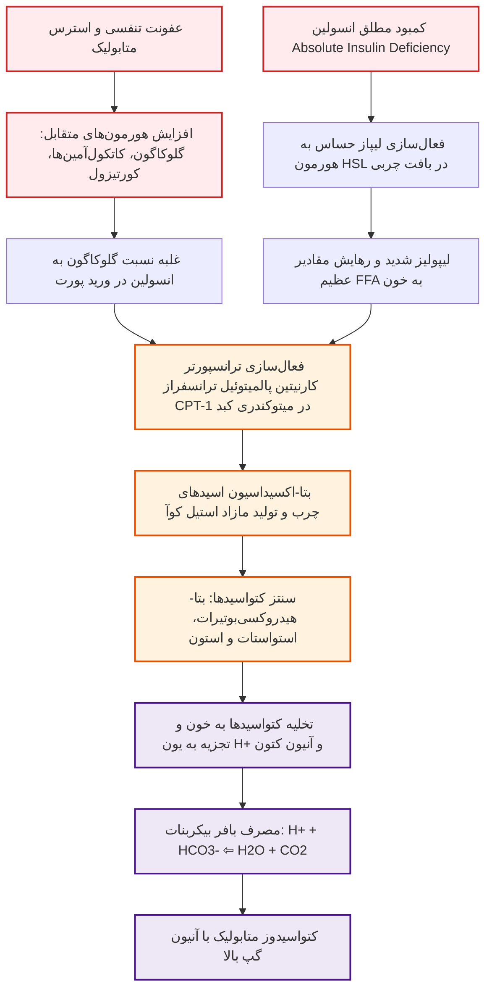
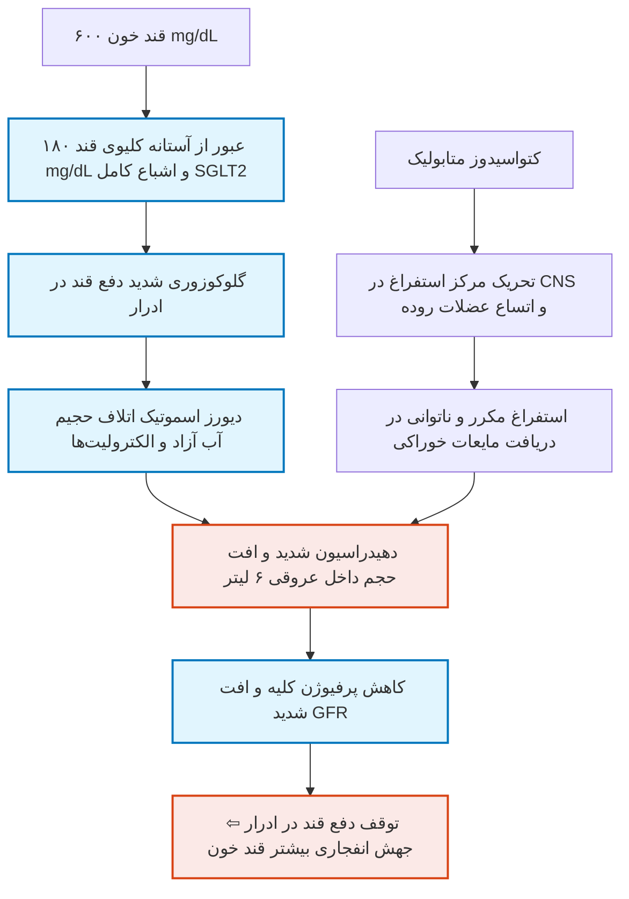
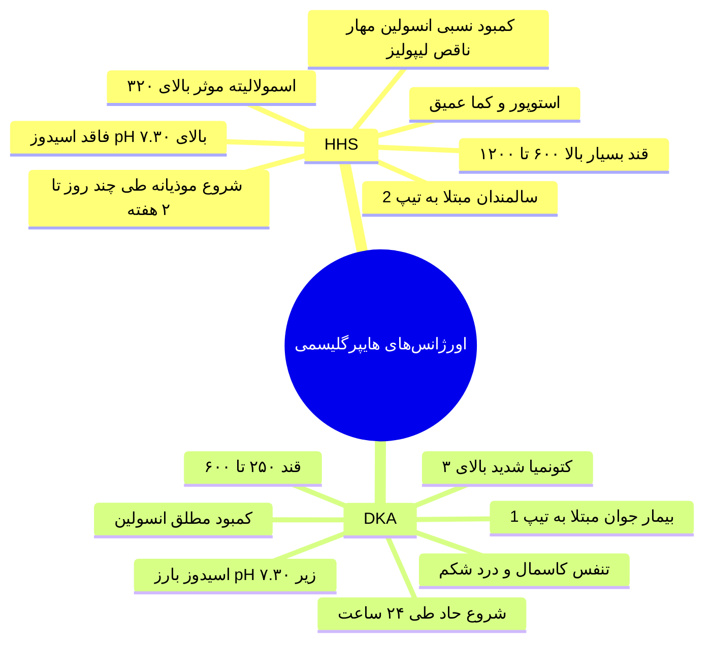
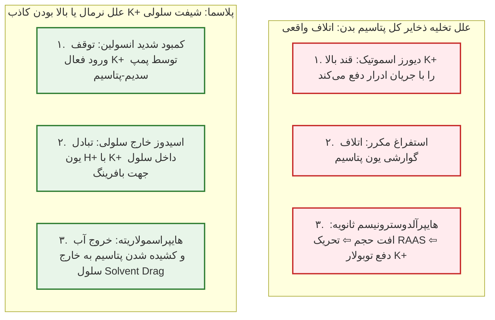
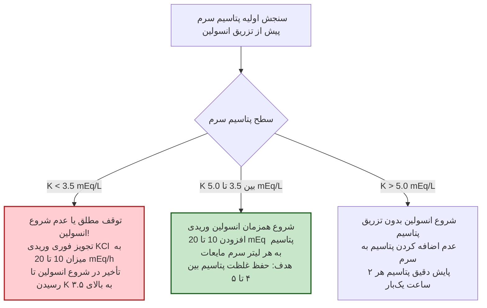
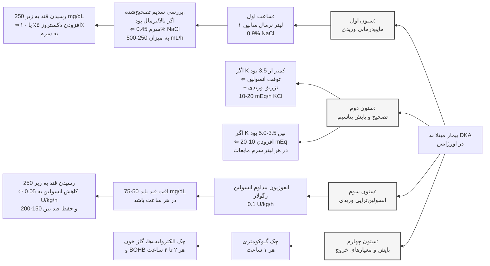

# کیس بالینی، پاتوفیزیولوژی و پروتکل جامع مدیریت DKA و HHS (ADA 2024/2026)

## 1. معرفی کیس بالینی، تریاژ و علائم حیاتی بدو ورود

> [!abstract] شرح حال بیمار (Clinical Case Presentation)
> **مشخصات:** خانم ۲۲ ساله، بدون هیچ‌گونه سابقه بالینی قبلی از دیابت قند (پرزنتیشن اول دیابت تیپ 1).
>
> **شکایت اصلی:** درد شدید و منتشر شکم، تهوع و استفراغ‌های مکرر به دنبال ابتلا به عفونت تنفسی فوقانی (URI / پنومونی).

### ارزیابی علائم حیاتی و معاینه فیزیکی در بدو ورود

* **فشار خون:** 90/60 mmHg ⇦ افت فشار خون بارز و شوک هایپوولمیک ناشی از دهیدراسیون شدید عروقی.

* **تعداد ضربان قلب (Pulse Rate):** 110 bpm ⇦ تاکی‌کاردی رفلکسی ناشی از:
  1. تخلیه شدید حجم داخل عروقی (Hypovolemia).
  2. تب و استرس سیستمیک.
  3. پاسخ آدرنرژیک و جهش کاتکول‌آمین‌ها.

* **دمای بدن:** 38.2 °C ⇦ تب ناشی از عفونت زمینه‌ای ریوی (مهم‌ترین عامل محرک / Precipitating Event).

* **معاینه مخاطات:** خشکی شدید مخاط دهان و زبان و تورگور پوستی کاهش‌یافته ⇦ نشانه بالینی بی‌آبی مفرط خارج و داخل سلولی.

* **تعداد تنفس (Respiratory Rate):** 26 breaths/min ⇦ تاکی‌پنه با تنفس‌های عمیق و صدادار (**تنفس کاسمال / Kussmaul Breathing**).

### نتایج آزمایشگاهی بدو ورود (Initial Labs)

* **قند خون (BS):** 600 mg/dL با سنجش گلوکومتری اورژانس.

* **گازهای خون شریانی (ABG):**
  * **pH:** 7.10 (اسیدمی بسیار شدید؛ نرمال: 7.35 تا 7.45).
  * **بیکربنات (HCO₃⁻):** 8 mEq/L (افت بحرانی؛ نرمال: 22 تا 26 mEq/L).
  * **فشار دی‌اکسید کربن (PaCO₂):** 20 mmHg (افت شدید ناشی از هیپرونتیلاسیون جبرانی).
  * **اکسیژناسیون:** PO₂ = 80 mmHg و SO₂ = 96% (تبادل اکسیژن آلوئولی-مویرگی ریه کاملاً دست‌نخورده و طبیعی است).

## 2. پاتوفیزیولوژی بیوسنتز کتون‌ها و تریاد هورمونی

### آبشار مولکولی کتوژنز در کبد

1. **کمبود مطلق انسولین:** مهار مسیر لیپوژنز و فعال‌سازی آنزیم لیپاز بافت چربی (HSL) ⇦ سیلاب اسیدهای چرب آزاد (FFA) به سمت کبد.

2. **برداشته شدن مهار سلول‌های آلفای پانکراس:** فقدان فیدبک پاراکرین انسولین سبب جهش ترشح **گلوکاگون** می‌شود.

3. **فعال‌سازی CPT-1:** گلوکاگون با کاهش غلظت *مالونیل کوآ*، مهار آنزیم **کارنیتین پالمیتوئیل ترانسفراز-۱ (CPT-1)** را برمی‌دارد ⇦ انتقال سریع FFA به درون ماتریکس میتوکندری هپاتوسیت‌ها.

4. **تولید اجسام کتونی:** بتا-اکسیداسیون مفرط منجر به تولید **بتا-هیدروکسی‌بوتیرات (β-OHB)** و **استواستات (AcAc)** (اسیدهای آلی قوی) و **استون** (خنثی و فرار، عامل بوی میوه‌ای دهان) می‌گردد.

5. **مصرف ذخیره قلیایی:** پروتون‌های اسیدی آزادشده توسط بافر بیکربنات جذب می‌شوند؛ با اتمام بیکربنات، اسیدوز شدید سیستمیک برقرار می‌شود.

## 3. مکانیسم‌های سه‌گانه بی‌آبی و دهیدراسیون در DKA

> [!important] چرخه معیوب اشباع SGLT2 و افت GFR
> ظرفیت بازجذب ترانسپورترهای **SGLT2** در توبول پروگزیمال کلیه حداکثر معادل قند پلاسما **180 mg/dL** است. در قندهای بالاتر، گلوکز در لومن توبول باقی مانده و با نیروی اسمزی، آب و املاح را دفع می‌کند. به دنبال بی‌آبی و افت شدید GFR، کلیه دیگر قادر به دفع قند مازاد نیست و هایپرگلیسمی تشدید می‌شود.

## 4. تفسیر گازهای خونی (ABG) و معادله وینتر (Winter's Formula)

### تحلیل مرحله‌به‌مرحله نمونه شریانی کیس

1. **ارزیابی pH:** مقدار 7.10 دال بر **اسیدمی شدید** است (pH < 7.35).
2. **ارزیابی بیکربنات:** مقدار 8 mEq/L نشان‌دهنده **اسیدوز متابولیک اولیه** ناشی از مصرف بافر است.
3. **ارزیابی PaCO₂:** مقدار 20 mmHg نشانگر پاسخ تهویه‌ای جبرانی جهت خروج CO₂ است.

### محاسبه معادله وینتر جهت رد اختلالات اسید-باز مختلط

برای سنجش کفایت پاسخ جبرانی تنفسی در اسیدوز متابولیک از معادله استاندارد وینتر استفاده می‌شود:

$$
\text{Expected } \text{PaCO}_2 = 1.5 \times [\text{HCO}_3^-] + 8 \pm 2
$$

$$
\text{Expected } \text{PaCO}_2 = (1.5 \times 8) + 8 \pm 2 = 12 + 8 \pm 2 = 20 \pm 2\text{ mmHg } (18-22\text{ mmHg})
$$

* **تفسیر آزمایشگاهی:** مقدار PaCO₂ اندازه‌گیری‌شده بیمار دقیقاً **20 mmHg** (منطبق بر محدوده 18 تا 22) است.
* **نتیجه نهایی:** بیمار دچار **اسیدوز متابولیک خالص با جبران تنفسی کامل** است و هیچ اختلال تنفسی همزمان (اسیدوز یا آلکالوز تنفسی ثانویه) ندارد.

> [!tip] پاتوفیزیولوژی تنفس کاسمال (Kussmaul Breathing)
> یون‌های H⁺ با تحریک کمورسپتورهای بصل‌النخاع و اجسام کاروتید، مرکز تنفس را تحریک می‌کنند؛ در نتیجه تنفس‌هایی **تند، بسیار عمیق و صدادار** ایجاد می‌شود تا اسید فرار (CO₂) از ریه‌ها خارج گردد.

### فاکتورهای تعیین‌کننده شدت اسیدوز متابولیک در DKA

1. **آهنگ تولید کتواسیدها (Rate of Ketogenesis):** وابسته به شدت ترشح کاتکول‌آمین‌ها و کورتیزول.
2. **طول مدت تاخیر تا مراجعه بیمار (Duration):** تجمع طولانی‌تر اسیدهای آلی در گردش خون.
3. **نرخ دفع ادراری کتون‌ها (Urinary Loss):** با افت GFR دفع ادراری مسدود شده و اسیدوز وخیم‌تر می‌شود.
4. **حجم توزیع اسید (Volume of Distribution):** افراد با دهیدراسیون شدیدتر حجم مایع کمتری داشته و غلظت H⁺ در آن‌ها بالاتر است.
5. **نرخ متابولیسم محیطی کتون‌ها:** ناتوانی بافت عضلانی در سوزاندن اسیدها به دلیل غیبت مطلق انسولین.

## 5. جدول مقایسه‌ای جامع: DKA در برابر HHS

| شاخص بالینی و آزمایشگاهی | کتواسیدوز دیابتی (DKA)                   | سندرم هایپراسمولار هایپرگلیسمیک (HHS)         | علت تفاوت فیزیوپاتولوژیک                                              |
| :----------------------- | :--------------------------------------- | :-------------------------------------------- | :-------------------------------------------------------------------- |
| **کمبود انسولین**        | **کمبود مطلق (Absolute)**                | **کمبود نسبی (Relative)**                     | در HHS مقادیر اندک انسولین مانع فعال‌سازی مفرط HSL و کتوژنز می‌شود.   |
| **جمعیت شایع و سن**      | جوانان مبتلا به دیابت تیپ 1              | سالمندان مبتلا به دیابت تیپ 2                 | سالمندان احساس تشنگی ضعیف‌تر و ناتوانی در دسترسی به آب دارند.         |
| **سرعت استقرار بالینی**  | **فوق‌حاد (چند ساعت تا ۲۴ ساعت)**        | **تدریجی و موذیانه (چند روز تا ۲ هفته)**      | علائم گوارشی و تنگی نفس در DKA بیمار را سریعاً به اورژانس می‌کشاند.   |
| **سطح قند خون پلاسما**   | $250-600\text{ mg/dL}$ (به‌ندرت $>800$)  | **بسیار شدید ($600-1200\text{ mg/dL}$)**      | سیر کند HHS فرصت تجمع طولانی و دیوانه‌وار قند خون را فراهم می‌سازد.   |
| **وضعیت اسیدوز و pH**    | **اسیدوز بارز ($\text{pH} < 7.30$)**     | **فاقد اسیدوز ($\text{pH} \ge 7.30$)**        | عدم وجود کتوژنز با غلظت ماکرو در جریان خون بیماران HHS.               |
| **بیکربنات سرم (HCO₃⁻)** | **افت شدید ($<18\text{ mEq/L}$)**        | طبیعی یا افت ناچیز ($\ge 15-18\text{ mEq/L}$) | بیکربنات در DKA صرف خنثی‌سازی یون‌های اسیدی کتواسیدها می‌شود.         |
| **کتونمیا (β-OHB خون)**  | **بسیار بالا ($\ge 3.0\text{ mmol/L}$)** | منفی یا ناچیز ($<3.0\text{ mmol/L}$)          | مهار مسیر CPT-1 میتوکندری کبد توسط حضور نسبی انسولین در HHS.          |
| **اسمولالیته موثر سرم**  | متغیر، معمولاً $<300-320\text{ mOsm/kg}$ | **فوق‌العاده بالا ($>320\text{ mOsm/kg}$)**   | حاصل‌ضرب غلظت عظیم قند در دهیدراسیون شدید داخل سلولی.                 |
| **کسری مایعات بدن**      | **حدود ۶ لیتر ($100\text{ mL/kg}$)**     | **حدود ۹ لیتر ($100-200\text{ mL/kg}$)**      | دیورز اسموتیک درازمدت ۲ هفته‌ای در برابر دیورز کوتاه‌مدت DKA.         |
| **تظاهر شاخص بالینی**    | تهوع، استفراغ، درد شکم، تنفس کاسمال      | لتارژی عمیق، استوپور، کما، تشنج فوکال         | اسمولالیته بالای ۳۲۰ مستقیماً عملکرد نورون‌های قشر مغز را فلج می‌کند. |

> [!important] تله تستی فرم‌های ترکیبی (Hybrid Presentation)
> حدود **یک‌سوم (۳۰٪) از کل مراجعات** اورژانس‌های هایپرگلیسمی تابلوی مشترک و هیبرید **DKA / HHS** دارند (اسیدوز شدید همراه‌با اسمولالیته موثر بالای 320 mOsm/kg).

## 6. تحلیل نشانه‌های بالینی چالشی و پرچم‌های قرمز کیس

### ۱. پاتوفیزیولوژی درد شکم و تهوع در DKA

* **همبستگی بالینی:** شدت درد شکم در DKA **صرفاً با شدت اسیدوز متابولیک** همبستگی مستقیم دارد، نه با عدد قند خون یا میزان دهیدراسیون!
* **مکانیسم‌ها:**
  1. اسیدوز شدید سبب ادم بافتی و کشیدگی عضلات صاف جدار روده و تحریک پایانه‌های درد احشایی می‌شود.
  2. افت شدید پتاسیم ناشی از اتلاف کلیوی و اسیدوز سبب **ایلئوس پارالیتیک (فلج موقت حرکات روده)** و اتساع حاد شکم می‌گردد.
* **پرچم‌های قرمز شکم حاد جراحی (Red Flags):**
  * اگر اسیدوز خفیف است اما درد شکم بیمار بسیار شدید است، یا
  * اگر اسیدوز متابولیک با درمان اصلاح شده اما درد شکم همچنان باقی مانده است،
  * ⇦ **نباید درد را به DKA نسبت داد!** باید فوراً علل دیگر نظیر **پانکراتیت حاد، آپاندیسیت، کله‌سیستیت، انفارکتوس مزانتریک یا ایسکمی قلبی (MI)** بررسی شوند.

### ۲. پدیده هایپرآمیلازمی در برابر لیپاز

* در DKA افزایش آمیلاز سرم در بسیاری از بیماران رخ می‌دهد؛ اما منشأ عمده این آنزیم **غدد بزاقی** است نه بافت لوزالمعده.
* *تشخیص قطعی:* جهت تایید یا رد پانکراتیت حاد همراه، سنجش سطح سرمی **لیپاز (Lipase)** اختصاصی و ضروری است.

### ۳. مکانیسم لوکوسیتوز استرسی (WBC = 12,500 /µL)

* **پاتولوژی دمارژیناسیون:** به دنبال استرس حاد کتواسیدوز، ترشح **کورتیزول و کاتکول‌آمین‌ها** به‌شدت افزایش می‌یابد.
* کاتکول‌آمین‌ها سبب رهایش نوتروفیل‌های چسبیده به جدار رگ‌ها (Demargination) به گردش خون شده و گلوکوکورتیکوئیدها مانع خروج نوتروفیل‌ها به بافت‌ها می‌شوند.
* **افتراق لوکوسیتوز استرسی از عفونت باکتریایی واقعی:**
  * **لوکوسیتوز استرسی ثانویه به DKA:** تعداد گلبول‌های سفید بین 10,000 تا 15,000 /µL با **باندسل (نوتروفیل نارس) کمتر از 10%**.
  * **عفونت باکتریایی حاد همزمان:** تعداد گلبول‌های سفید **بیشتر از 25,000 /µL** یا حضور **باندسل بیشتر از 10%** در اسمیر خون محیطی.

## 7. دینامیک و پارادوکس پتاسیم در DKA (حیاتی‌ترین نکته امتحانی)

> [!danger] پارادوکس مرگبار پتاسیم در بدو ورود به اورژانس
> تمام بیماران مبتلا به DKA دچار **کسری شدید پتاسیم کل بدن (3 تا 5 mEq/kg)** هستند؛ اما غلظت پتاسیم سرم در بدو مراجعه در بیش از ۹۰٪ بیماران **طبیعی یا حتی بالا** گزارش می‌شود!

### پروتکل جایگزینی پتاسیم بر اساس سطح سرمی (ADA 2024/2026)

* **قانون طلایی نجات‌بخش:** به محض شروع مایعات و انفوزیون انسولین، پتاسیم با سرعت به درون سلول‌ها بازمی‌گردد. اگر سطح پتاسیم پایش نشود، هایپوکالمی برق‌آسا سبب **ایست قلبی، آریتمی کشنده بطنی و فلج عضلات تنفسی** خواهد شد.

## 8. محاسبات سدیم تصحیح‌شده و اسمولالیته موثر

### فرمول سدیم تصحیح‌شده (Corrected Sodium)

گلوکز مازاد با کشیدن آب از سلول به پلاسما سبب رقیق شدن کاذب سدیم (**سودوهایپوناترمی**) می‌شود:

$$
\text{Corrected } \text{Na}^+ = \text{Measured } \text{Na}^+ + 1.6 \times \left(\frac{\text{Glucose} - 100}{100}\right)
$$

* **محاسبه در کیس حاضر (سدیم اندازه‌گیری‌شده = 144 mEq/L و قند = 600 mg/dL):**

$$
\text{Corrected } \text{Na}^+ = 144 + 1.6 \times \left(\frac{600 - 100}{100}\right) = 144 + (1.6 \times 5) = 144 + 8 = 152\text{ mEq/L}
$$

* **اهمیت بالینی:** سدیم تصحیح‌شده بیمار **152 mEq/L** است؛ یعنی بیمار علی‌رغم سدیم ظاهراً نرمال، دچار **هایپرناترمی شدید** و دهیدراسیون فاجعه‌بار درون‌سلولی است که انتخاب نوع سرم مایع‌درمانی را تعیین می‌کند.

### فرمول اسمولالیته موثر سرم (Effective Osmolality)

اوره به دلیل عبور آزاد از غشای سلول در اسمولالیته موثر لحاظ نمی‌شود:

$$
\text{Effective Osmolality} = 2 \times [\text{Na}^+\text{ (mEq/L)}] + \frac{\text{Glucose (mg/dL)}}{18}
$$

## 9. مناقشه تزریق بی‌کربنات سدیم: اندیکاسیون‌ها و خطرات شش‌گانه

> [!danger] اندیکاسیون بسیار محدود تزریق بی‌کربنات
> تجویز بی‌کربنات سدیم **صرفاً و منحصراً در صورتی که pH شریانی کمتر از 7.00 باشد** مجاز است!
>
> در بیمار حاضر با **pH = 7.10**، تجویز بی‌کربنات اکیداً **ممنوع** است. با هیدراسیون و انسولین، متابولیسم کتواسیدها خودبه‌خود بیکربنات درون‌زاد تولید می‌کند.

### خطرات و عوارض شش‌گانه تجویز بی‌کربنات در DKA

1. **کاهش درایو تنفسی:** قلیایی شدن سریع خون محرک تنفسی بصل‌النخاع را مهار کرده و با کاهش تهویه، سطح PaCO₂ را بالا می‌برد.
2. **اسیدوز پارادوکسیکال مغزی (Paradoxical Cerebral Acidosis):** گاز CO₂ آزادشده سریعاً از سد خونی-مغزی (BBB) عبور می‌کند، اما بیکربنات باردار بسیار کند عبور می‌کند؛ تجمع CO₂ در مایع مغزی-نخاعی pH مغز را افت داده و سبب **ادم مغزی و کما** می‌شود.
3. **توقف روند ترخیص کتون‌ها:** اسیدمی خون نقش فاکتور ترمزکننده بر کتوژنز دارد؛ با برداشته شدن این ترمز توسط آلکالی، تولید کتون تسریع می‌گردد.
4. **افت شدید و مرگبار پتاسیم سرم:** آلکالیزاسیون سبب شیفت برق‌آسای پتاسیم به داخل سلول و آریتمی قلبی می‌شود.
5. **آلکالوز متابولیک واکنشی (Rebound Alkalosis):** با شروع اثر انسولین، آنیون‌های کتون به بیکربنات تبدیل می‌شوند و افزودن بیکربنات اگزوژن سبب آلکالوز شدید ثانویه می‌گردد.
6. **انحراف منحنی تفکیک اکسیژن-هموگلوبین به چپ:** تضعیف شدید رهایش اکسیژن به بافت‌های ایسکمیک محیطی (اثر بوهر).

## 10. پروتکل گام‌به‌گام احیا و مانیتورینگ ۴ ستونی ADA 2024/2026

### ۱. پروتکل مایع‌درمانی وریدی (Fluid Resuscitation)

* **ساعت اول:** انفوزیون سریع **1 لیتر سرم نرمال سالین 0.9% NaCl** (1.0 L/h) جهت انبساط حجم داخل عروقی.
* **ساعات بعدی:** بررسی سطح **سدیم تصحیح‌شده**:
  * اگر سدیم تصحیح‌شده **طبیعی یا بالا** باشد ($>145\text{ mEq/L}$): انفوزیون سرم **هاف سالین 0.45% NaCl** با سرعت 250 تا 500 mL/h.
  * اگر سدیم تصحیح‌شده **پایین** باشد: ادامه با سرم **نرمال سالین 0.9% NaCl**.
  * هدف: جبران ۵۰٪ کسری مایع تخمینی در **۸ تا ۱۲ ساعت اول** و مابقی طی ۱۶ تا ۲۴ ساعت بعدی.
* **قانون حیاتی دکستروز:** به محض رسیدن قند خون به **کمتر از 250 mg/dL**، باید فوراً **سرم دکستروز ۵٪ یا ۱۰٪** به مایعات وریدی اضافه شود تا از هایپوگلیسمی ممانعت شده و انفوزیون انسولین جهت خاموش کردن کتوژنز قطع نگردد.

### ۲. پروتکل انسولین‌تراپی وریدی (Insulin Protocol)

* **دوز استاندارد:** انفوزیون مداوم **انسولین رگولار با دوز 0.1 units/kg/hour** (در صورت تاخیر در راه‌اندازی پمپ، یک بولوس اولیه 0.1 units/kg وریدی مجاز است).
* **پایش شیب افت قند:** قند خون باید با سرعت **50 تا 75 mg/dL در هر ساعت** افت کند؛ اگر در ساعت اول افت قند کمتر از ۵۰ بود، دوز انفوزیون دوبرابر می‌شود.
* **تنظیم دوز در قند زیر ۲۵۰:** دوز انسولین به **0.05 units/kg/hour** کاهش یافته و با تنظیم همزمان دکستروز، قند خون تا زمان رفع کامل کتواسیدوز بین **150 تا 200 mg/dL** حفظ می‌شود.

## 11. معیارهای رفع بحران (Resolution) و سوئیچ به انسولین زیرجلدی

> [!important] معیارهای سه‌گانه بهبود قطعی DKA (ADA Criteria)
> درمان وریدی DKA زمانی پایان می‌یابد که تمامی معیارهای زیر محقق شوند:
>
> 1. **pH وریدی بیشتر از 7.30** یا **بیکربنات سرم مساوی یا بیشتر از 18 mEq/L**.
> 2. **سطح کتون بتا-هیدروکسی‌بوتیرات خون کمتر از 0.6 mmol/L** (یا بسته شدن کامل آنیون گپ).
> 3. **قند خون کمتر از 200 mg/dL**.

### پروتکل انتقال به انسولین زیرجلدی (SubQ Transition)

* **آمادگی بیمار:** بیمار هوشیار باشد، حالت تهوع برطرف شده و توانایی تحمل تغذیه خوراکی داشته باشد.
* **تداخل زمانی دوز زیرجلدی و وریدی (قانون طلایی):**
  * دوز انسولین پایه‌ای (Basal) و سریع‌الاثر زیرجلدی تزریق می‌شود.
  * **انفوزیون وریدی انسولین باید حداقل ۱ تا ۲ ساعت پس از تزریق زیرجلدی ادامه یابد** و سپس قطع شود (قطع همزمان سبب افت سطح خونی انسولین و عود مجدد کتواسیدوز طی چند ساعت می‌گردد).

## 12. تابلوی جامع سناریوهای بالینی امتحانی و تله‌های بورد

| سناریوی بالینی بیمار | یافته‌های آزمایشگاهی شاخص | تشخیص یا علت پاتوفیزیولوژیک | اقدام درمانی صحیح و فوری |
| :--- | :--- | :--- | :--- |
| **دختر ۲۲ ساله با درد شکم، تنفس تند و قند ۶۰۰** | $\text{pH}=7.10$ ، $\text{HCO}_3=8$ ، $\text{PaCO}_2=20$ | **کتواسیدوز دیابتی (DKA) با جبران کامل تنفسی** | شروع فوری ۱ لیتر نرمال سالین + چک پتاسیم قبل از انسولین |
| **بیمار مبتلا به DKA با پتاسیم اولیه 3.2 mEq/L** | کتون سرم بالا، اسیدوز متابولیک شدید | **هایپوکالمی واقعی خطرناک با ریسک ارست قلبی** | **توقف مطلق انسولین**؛ تزریق KCl وریدی تا K > 3.5، سپس شروع انسولین |
| **بیمار تحت درمان با قند ۲۳۰ و تداوم اسیدوز pH=7.18** | $\beta\text{-OHB} = 4.2\text{ mmol/L}$ ، گلوکز رو به افت | کتواسیدوز هنوز برطرف نشده است | **افزودن دکستروز ۵٪ به سرم** و ادامه انفوزیون انسولین با دوز 0.05 |
| **بیمار پس از درمان اولیه با pH=7.22 و درخواست بیکربنات** | $\text{HCO}_3 = 12$ ، تنفس آرام‌تر شده | اسیدوز روبه‌بهبود بدون اندیکاسیون آلکالی | **عدم تجویز بی‌کربنات** به دلیل خطر اسیدوز پارادوکسیکال مغزی |
| **بیمار با قند ۱۸۰، تنگی نفس و سابقه مصرف امپاگلیفلوزین** | $\text{pH}=7.15$ ، $\text{HCO}_3=9$ ، کتون سرم ۳+ | **کتواسیدوز اوگلیسمیک (euDKA) ناشی از SGLT2i** | قطع فوری دارو، شروع همزمان سرم قندی دکستروز + انسولین وریدی |
| **بهبود هوشیاری و بسته شدن آنیون گپ با تداوم کتون ادرار** | $\text{pH}=7.35$ ، $\text{HCO}_3=20$ ، کتون ادراری ۲+ | تاخیر پاکسازی استواستات در تست نیتروپروساید ادرار | معیار رفع DKA آزمایش خون است؛ **پایان DKA و شروع رژیم زیرجلدی** |
