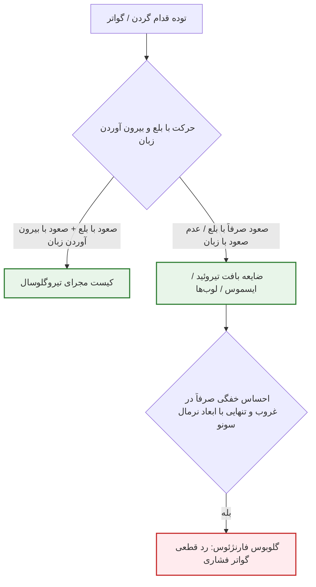
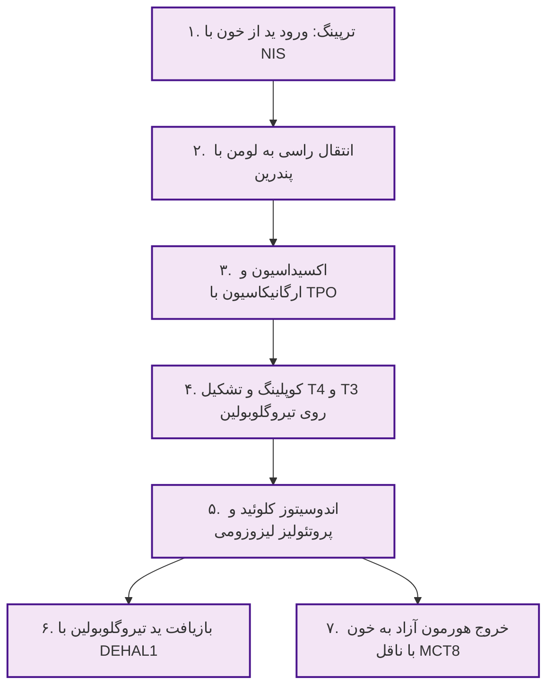
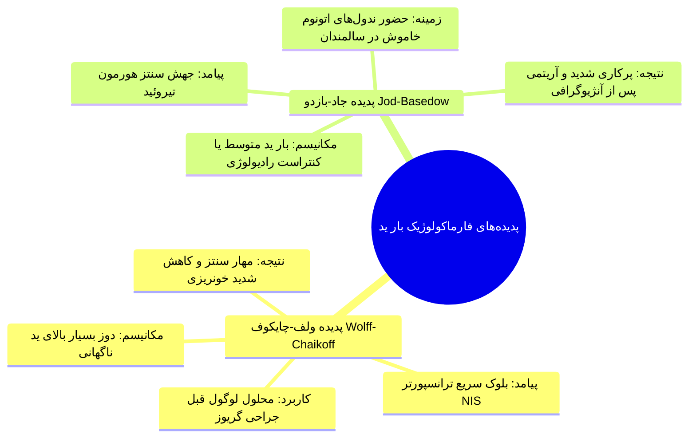
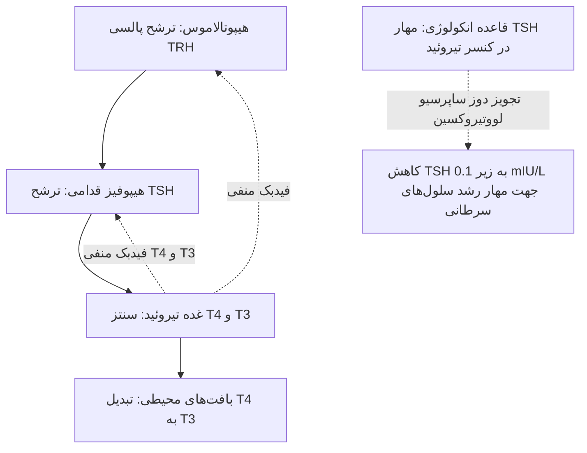
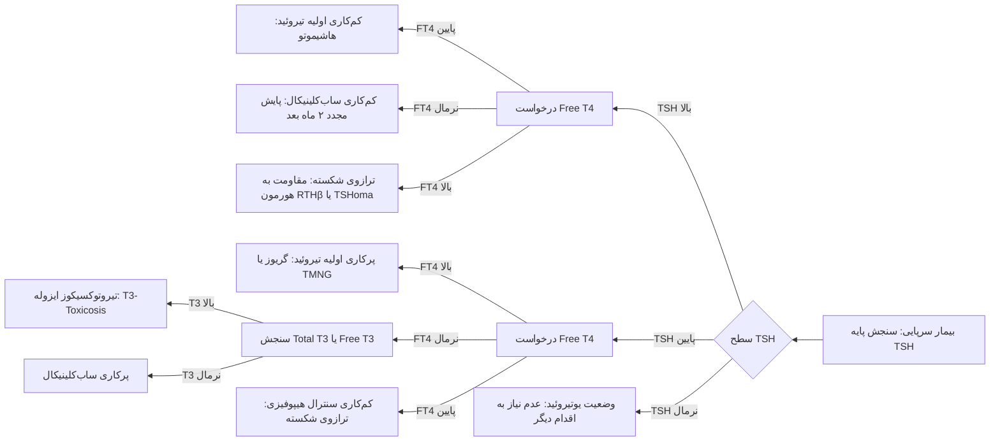

# مقدمات تیروئید: آناتومی جراحی، بیوسنتز هورمونی و تفسیر تست‌های عملکردی (TFT)

## ۱. آناتومی جراحی، ابعاد و تله‌های بالینی معاینه

> [!definition] ابعاد و توپوگرافی نرمال تیروئید
> * **وزن طبیعی:** **15 تا 25 گرم**.
> * **ابعاد سونوگرافیک نرمال هر لوب:** طول **4 تا 5 سانتی‌متر**، عمق و پهنا حدود **2.5 سانتی‌متر** (نمونه گزارش سونو: $41 \times 29 \times 8\text{ mm}$).
> * **موقعیت:** قدام گردن در سطح مهره‌های C5 تا T1؛ ایسموس در مقابل *حلقه‌های ۲ تا ۴ تراشه*.

### تله بالینی گلوبوس فارنژئوس در برابر بزرگی تیروئید

* **شکایت شایع مراجعین:** احساس خفگی، فشار در گلو و گیر کردن لقمه (**Globus Pharyngeus**).
* **سرنخ رد درگیری تیروئید:** بیمارانی که در زمان شلوغی، مکالمه و فعالیت روزمره علامتی ندارند ولی هنگام **تنهایی، غروب یا اضطراب** احساس خفگی می‌کنند؛ سونوگرافی، سی‌تی‌اسکن و اندوسکوپی آن‌ها کاملاً طبیعی است و علت *کریکوفارنژیال اسپاسم روانی* است نه گواتر.
* **تحرک با بلع:** تیروئید و کیست‌های مجرای تیروگلوسال با بلع بالا می‌روند؛ اما **کیست مجرای تیروگلوسال منحصراً با بیرون آوردن زبان نیز بالا می‌رود**.

### عروق، اعصاب و قواعد حیاتی جراحی

* **خونرسانی استثنایی:** سرعت جریان خون تیروئید **4 تا 6 mL/g/min** است (بسیار پرعروق). در گریوز جریان چند برابر شده و صدای **Bruit در سمپ با گوشی** و **Thrill لمسی** ایجاد می‌کند.
* **عروق اصلی:**
  1. **شریان تیروئیدی فوقانی (STA):** شاخه شریان کاروتید خارجی؛ نزدیک به قطب فوقانی.
  2. **شریان تیروئیدی تحتانی (ITA):** شاخه تنه تیروپرویکال؛ تغذیه‌کننده قطب تحتانی، خلف تیروئید و غدد پاراتیروئید.
  3. **شریان تیروئید ایما (Ima):** بی‌ثبات در ۱۰٪ افراد؛ صعود از قدام تراشه از مبدأ براکیوسفالیک یا آئورت.
* **شراکت‌های عصبی-عروقی و تله‌های جراحی:**
  * **عصب EBSLN (شاخه خارجی حنجره‌ای فوقانی):** همراه STA در قطب فوقانی. عضله هدف: *کریکوتیروئید*. آسیب ⇦ **از دست رفتن صداهای زیر، ناتوانی در پرتاب صدا و خستگی زودرس صوت** (بحرانی برای خواننده‌ها). قاعده جراحی: *لیگاتور عروق STA کاملاً چسبیده به کپسول تیروئید*.
  * **عصب RLN (راجعه حنجره):** مجاور ITA در ناودان تراکئوازوفاژیال، فوق‌العاده آسیب‌پذیر در نزدیکی **رباط بری (Berry Ligament)**.
    * *آسیب یکطرفه:* **خشونت صدا (Hoarseness)**، صدای تنفس‌دار و **سرفه ضعیف و ناتوان**.
    * *آسیب دوطرفه:* فلج طناب‌های صوتی در وضعیت آداکشن ⇦ **انسداد حاد راه هوایی، استریدور و اورژانس تراکئوستومی**.

> [!danger] فاجعه برداشتن ناخواسته پاراتیروئیدها در توتال تیروئیدکتومی
> چهار غده پاراتیروئید در خلف تیروئید خونرسانی انحصاری خود را از **شاخه‌های انتهایی شریان ITA** می‌گیرند. در صورت قطع خونرسانی یا اکسیزیون ناخواسته:
> 1. افت شدید و دائم هورمون PTH پدید می‌آید.
> 2. بیمار دچار هایپوکلسمی مزمن مقاوم (کلسیم زیر ۷.۵ تا ۸) شده و نیازمند **روزانه ۵ تا ۶ عدد قرص کلسیم المنتال** می‌شود.
> 3. *تله دارویی:* ویتامین دی معمولی (D3 یا 25-OH-D) در این بیماران بی‌اثر است؛ زیرا تبدیل آن به فرم فعال نیازمند آنزیم ۱-آلفا-هیدروکسیلاز وابسته به PTH است! **بیمار منحصراً باید فرم فعال یعنی کلسی‌تریول (روکاترول یا 1,25-(OH)2-D) دریافت کند**.

---

## ۲. بیوسنتز و ترشح هورمون‌های تیروئید در فولیکول

> [!definition] معماری فولیکول تیروئید
> شبیه *کندوی عسل*؛ سلول‌های اپی‌تلیال قطبی در اطراف حفره مرکزی حاوی **کلوئید**. دارای دو سطح:
> 1. **غشای قاعده‌ای-جانبی (Basolateral):** مجاور مویرگ‌های خونی (محل ورود ید).
> 2. **غشای راسی (Apical):** مجاور لومن کلوئید (محل سنتز و ذخیره هورمون).

### آبشار مولکولی ۷ مرحله‌ای بیوسنتز

1. **به دام اندازی ید (Trapping):** ترانسپورتر **NIS** در غشای بازولترال به ازای **۲ یون سدیم، ۱ یون ید** را برخلاف شیب غلظت وارد سلول می‌کند (انرژی از پمپ Na+/K+-ATPase).
2. **انتقال راسی (Apical Transport):** ناقل آنیونی **پندرین (Pendrin / SLC26A4)** ید را وارد لومن کلوئید می‌کند.
3. **اکسیداسیون و ارگانیکاسیون (Organification):** آنزیم **TPO (تیروئید پراکسیداز)** در حضور H2O2 (حاصل از آنزیم DUOX2) ید را اکسید کرده و به ریشه‌های تیروزین پروتئین **تیروگلوبولین (Tg)** متصل می‌کند ⇦ تولید **MIT** (مونویدوتیروزین) و **DIT** (دی‌یدوتیروزین).
   * *نکته بالینی هاشیموتو:* اتوآنتی‌بادی **Anti-TPO** مستقیماً این آنزیم را مهار کرده و ارگانیکاسیون متوقف می‌شود.
4. **جفت‌شدن (Coupling):** اتصال ریشه‌ها با کاتالیز TPO روی اسکلت تیروگلوبولین:
   * $\text{DIT} + \text{DIT} \to \text{T4}$ (تترایدوتیرونین).
   * $\text{MIT} + \text{DIT} \to \text{T3}$ (تری‌یدوتیرونین).
5. **اندوسیتوز و هضم پروتئولیتیک:** تحت تحریک TSH، کلوئید با پینوسیتوز بلعیده شده و پس از ادغام با لیزوزوم، Tg تجزیه شده و **T4 و T3 آزاد** می‌شوند.
6. **بازیافت ید (Recycling):** آنزیم **یدوتیروزین دیودیناز (DEHAL1 / IYD)** ید را از MIT و DIT جدا کرده و به چرخه سلولی بازمی‌گرداند.
7. **ترشح به جریان خون (Secretion):** خروج T4 و T3 از غشای بازولترال توسط ترانسپورتر اختصاصی **MCT8 (SLC16A2)**.

> [!important] اهمیت بالینی تیروگلوبولین (Tg) سرم
> تیروگلوبولین پروتئین ماتریکس انحصاری تیروئید است:
> * **در تیروئیدیت تحت‌حاد:** به علت تخریب فولیکول‌ها، Tg با مقادیر بالا به خون می‌ریزد.
> * **در پیگیری کنسر تیروئید پس از توتال تیروئیدکتومی:** Tg باید **صفر یا زیر ۱** باشد. افزایش Tg نشانگر **باقی ماندن بافت تیروئید یا عود و متاستاز دوردست** است.

---

## ۳. هوموستاز ید، پدیده‌های فارماکولوژیک و اسکن RAIU

* **نیاز روزانه:** افراد بالغ **150 µg/day**؛ در بارداری و شیردهی افزایش به **200 تا 250 µg/day**.
* **کمبود ید:** با کاهش ید، غده تیروئید برای جذب حداکثری دچار **هایپرپلازی و هایپرتروفی منتشر (گواتر)** می‌شود؛ *گواتر ناشی از کمبود ید الزاماً به معنای کم‌کاری تیروئید نیست*.
* **غربالگری نوزادی:** سنجش TSH در روزهای ۳ تا ۵ پس از تولد در ایران و جهان، بروز عقب‌ماندگی ذهنی ناشی از کرتینیسم را تقریباً به صفر رسانده است.

> [!tip] افتراق طلایی با اسکن رادیوایزوتوپ ید (RAIU)
> در مواجهه با پرکاری تیروئید (TSH سرکوب‌شده و T4 بالا)، اسکن جذب ید تفکیک‌کننده کلیدی است:
> * **جذب بالا (RAIU > 30%):** پرکاری حقیقی و فعال نظیر **بیماری گریوز** (نیاز فوری به متی‌مازول).
> * **جذب پایین/نزدیک به صفر (RAIU < 10%):** تخلیه هورمون از پیش‌ساخته ناشی از **تیروئیدیت** (کانال NIS بسته است؛ **متی‌مازول ممنوع**، صرفاً پروپرانولول و درمان ضدالتهاب).

---

## ۴. پروتئین‌های حامل و ایزوزیم‌های دیودیناز

### دینامیک ترشح و انتقال هورمون در خون

* **نسبت ترشح غده تیروئید:** **80% به صورت T4** و فقط **20% به صورت T3**. بخش عمده T3 بیولوژیک خون از تبدیل محیطی T4 در بافت‌ها حاصل می‌شود.
* **پروتئین‌های ناقل پلاسما:**
  1. **TBG (تیروکسین بایندینگ گلوبولین):** بالاترین تمایل اتصالی؛ حامل ۷۰٪ هورمون‌ها.
  2. **ترانس‌تیرتین (TTR / پرآلبومین)** و **آلبومین:** حامل مابقی هورمون‌ها.
* **کسر آزاد (Free Fraction):** تنها **0.03% از T4** و **0.3% از T3** آزاد و فعال بیولوژیک هستند.

> [!warning] خطای تشخیصی ناشی از تغییرات TBG
> در بارداری و مصرف OCP، استروژن سطح کبدی TBG را به شدت بالا می‌برد. در این شرایط:
> * **Total T4 و Total T3 به صورت کاذب بسیار بالا هستند.**
> * **Free T4 و TSH کاملاً نرمال هستند.**
> * وضعیت بیولوژیک بیمار **کاملاً یوتیروئید** است و نباید تحت درمان ضدتیروئید قرار گیرد! در سیروز کبدی برعکس، Total T4 به دلیل افت پروتئین‌ها پایین است اما Free T4 نرمال باقی می‌ماند.

### سیستم سه‌گانه آنزیم‌های دیودیناز (Deiodinases)

| ایزوزیم | واکنش آنزیمی | بافت‌های اصلی | نقش فیزیولوژیک اختصاصی |
| :--- | :--- | :--- | :--- |
| **D1** | Outer-ring deiodination | کبد، کلیه و تیروئید | تبدیل محیطی T4 به **T3 فعال گردش خون**؛ مهار اختصاصی با داروی *PTU*. |
| **D2** | Outer-ring deiodination | مغز، هیپوفیز، عضله و چربی قهوه‌ای | تبدیل موضعی T4 به T3 درون‌سلولی؛ **سنسور اصلی فیدبک منفی هیپوفیز برای مهار TSH**. |
| **D3** | Inner-ring deiodination | **جفت، بافت‌های جنینی، CNS و تومورها** | تبدیل T4 به **Reverse T3 (rT3)** غیرفعال و T3 به T2؛ **محافظت جنین از تیروتوکسیکوز مادری**. |

---

## ۵. محور HPT و سندرم‌های ژنتیکی و مادرزادی

### جدول سندرم‌های ژنتیکی شاخص تیروئید (مبحث امتحانی قطعی استاد)

| نام سندرم | ژن و نقص مولکولی | تظاهرات بالینی شاخص | روش ارزیابی و تشخیص |
| :--- | :--- | :--- | :--- |
| **سندرم پندرد (Pendred)** | جهش در **SLC26A4 (پندرین)** | **کری حسی-عصبی مادرزادی + گواتر** ناشی از نقص ارگانیکاسیون | تست دیس‌شارژ پرکلرات مثبت + ژنتیک |
| **مقاومت به هورمون (RTHβ)** | جهش در **THRB** (گیرنده بتای تیروئید) | **FT4 و FT3 بسیار بالا همراه با TSH نرمال یا بالا** (فقدان فیدبک) | رد آدنوم TSHoma هیپوفیز + بررسی فامیلیال |
| **آلن-هرندون-دادلی** | جهش در **SLC16A2 (ترانسپورتر MCT8)** | عقب‌ماندگی حرکتی پسران + **T3 بسیار بالا، T4 پایین و TSH نرمال** | پانل ژنتیکی MCT8 و معاینه نورولوژی |
| **سندرم مک‌کون-آلبرایت** | جهش سوماتیک موزائیک در **GNAS** | ندول‌های توکسیک تیروئید + **لکه‌های کافه‌اوله مضرس + دیسپلازی فیبروز استخوان** | تریاد بالینی (تست خون به دلیل موزائیسم منفی است) |
| **سندرم مارین-لنهارت** | همزمانی گریوز با ندول اتونوم | تیروتوکسیکوز مقاوم به متی‌مازول تک‌دارویی | اسکن تیروئید (زمینه پرجذب منتشر با گره‌های داغ‌تر) |
| **سندرم کاودن (Cowden)** | جهش در ژن سرکوبگر **PTEN** | تومورهای هامارتومی جلدی-مخاطی + **ریسک بالای کنسر فولیکولار تیروئید** | پایش غربالگری انکولوژیک و ژنتیک |
| **سندرم ورنر (Werner)** | جهش در ژن هلیکاز **WRN** | پیری زودرس بالغین + آب‌مروارید + افزایش ندول و بدخیمی تیروئید | فنوتیپ بالینی و پانل ژنتیکی |

---

## ۶. الگوریتم تفسیر تست‌های آزمایشگاهی (TFT) و تله‌های تشخیصی

> [!important] مفهوم ترازو در تفسیر بیوشیمیایی
> فیدبک منفی بین TSH و Free T4 شبیه یک **ترازو** عمل می‌کند:
> * یک کفه پایین برود، کفه دیگر بالا می‌آید (ترازوی سالم).
> * **اگر چوب ترازو از وسط بشکند و هر دو کفه همزمان پایین یا بالا باشند:** اختلال در *مرکز فرماندهی (سنترال)* یا *تداخل آزمایشگاهی* است!

### جدول تفکیک الگوهای متناقض و تله‌های روتین بالینی

| الگوی آزمایشگاهی | خطای تفسیری رایج | پاتوفیزیولوژی واقعی | اقدام صحیح مداخله‌ای |
| :--- | :--- | :--- | :--- |
| **TSH پایین + FT4 پایین** | نادیده گرفتن بیمار به عنوان کم‌کاری ملایم | **کم‌کاری سنترال (نارسایی هیپوفیز یا هیپوتالاموس)**؛ چوب ترازو شکسته است | **بررسی همزمان محور کورتیکوتروپین آدرنال**، درخواست MRI سلا |
| **TSH بالا + FT4 بالا** | تجویز اشتباه داروی ضدتیروئید | آدنوم مترشحه TSH هیپوفیز (**TSH-oma**) یا سندرم **RTHβ** | ارزیابی ساقه هیپوفیز با MRI، رد تداخلات سرولوژیک |
| **TSH پایین + FT4 نرمال** | ترخیص بیمار به عنوان سالم | **پرکاری ساب‌کلینیکال یا T3-Toxicosis** | **سنجش فوری سطح T3**؛ در صورت بالا بودن T3، درمان آغاز می‌شود |
| **FT4 بالا + TSH نرمال (گذرا)** | افزایش بی‌مورد دوز لووتیروکسین | نمونه‌گیری خون بلافاصله پس از بلع قرص صبحگاهی لووتیروکسین | انجام آزمایش خون در وضعیت ناشتا **پیش از مصرف دوز روزانه قرص** |
| **تداخل بیوتین (Biotin / ویتامین B7)** | تشخیص کاذب بیماری گریوز | مکمل‌های پوست و مو با روش سنجش ایمونواسی تداخل کرده، TSH را کاذب پایین و FT4 را بالا می‌برند | **قطع بیوتین حداقل ۴۸ تا ۷۲ ساعت پیش از آزمایش** و تکرار تست |

---

## ۷. تابلوی جامع سناریوهای بالینی امتحانی

| سناریوی بالینی بیمار | یافته‌های تشخیصی پاراکلینیک | تشخیص پاتولوژیک قطعی | اقدام درمانی صحیح و فوری |
| :--- | :--- | :--- | :--- |
| **خانم ۳۰ ساله با تپش قلب، لرزش و گواتر بدون درد متعاقب زایمان** | TSH سرکوب‌شده، FT4 بالا، اسکن RAIU نزدیک به صفر | **تیروئیدیت پس از زایمان (فاز تخریبی)** | عدم تجویز متی‌مازول؛ تجویز موقت **پروپرانولول** جهت کنترل تاکی‌کاردی |
| **بیمار با درد حاد گردن و التهاب شدید پس از سرماخوردگی** | TSH پایین، ESR بسیار بالا، تیروگلوبولین سرمی بالا | **تیروئیدیت تحت‌حاد دکرون** | تجویز داروهای ضدالتهاب غیراستروئیدی (NSAIDs) یا کورتون |
| **مرد ۶۰ ساله تحت آنژیوگرافی عروق کرونر با آریتمی جدید AF** | TSH کمتر از 0.01، FT4 بالا، سابقه گواتر مولتی‌نودولار | **تیروتوکسیکوز جاد-بازدو ناشی از کنتراست یددار** | شروع داروهای ضدتیروئید و کنترل ریت قلبی با بتابلوکر |
| **کودک با ناشنوایی حسی-عصبی و گواتر بزرگ منتشر** | تست دیس‌شارژ پرکلرات مثبت، اختلال ارگانیکاسیون | **سندرم پندرد (Pendred Syndrome)** | جایگزینی هورمون تیروئید با لووتیروکسین و سمعک |
| **خانم باردار بدون علامت با Total T4 برابر ۱۶ (نرمال تا ۱۲)** | TSH برابر 1.8 و Free T4 کاملاً در محدوده نرمال | **افزایش فیزیولوژیک TBG در بارداری** | اطمینان‌بخشی به بیمار؛ عدم نیاز به هیچ‌گونه مداخله دارویی |
| **بیمار پس از توتال تیروئیدکتومی با افت صدای زیر و خستگی صوت** | معاینه لارنگوسکوپی: نقص کشش طناب توسط عضله کریکوتیروئید | **آسیب عصب حنجره‌ای فوقانی (EBSLN)** | گفتاردرمانی؛ پیشگیری در عمل با بستن STA چسبیده به کپسول |
| **بیمار پس از جراحی تیروئید با استریدور و دیسترس حاد تنفسی** | لارنگوسکوپی: فلج دوطرفه طناب‌های صوتی در وضعیت آداکشن | **آسیب دوطرفه عصب راجعه حنجره (RLN)** | **اورژانس انتوباسیون یا تراکئوستومی فوری** |
| **بیمار توتال تیروئیدکتومی با گزگز دور دهان و کلسیم ۶٫۵** | سطح هورمون PTH بسیار پایین و غیرقابل سنجش | **هایپوپاراتیروئیدی دائم پس از عمل** | تجویز کلسیم خوراکی به همراه **کلسی‌تریول (فرم فعال ویتامین دی)** |
