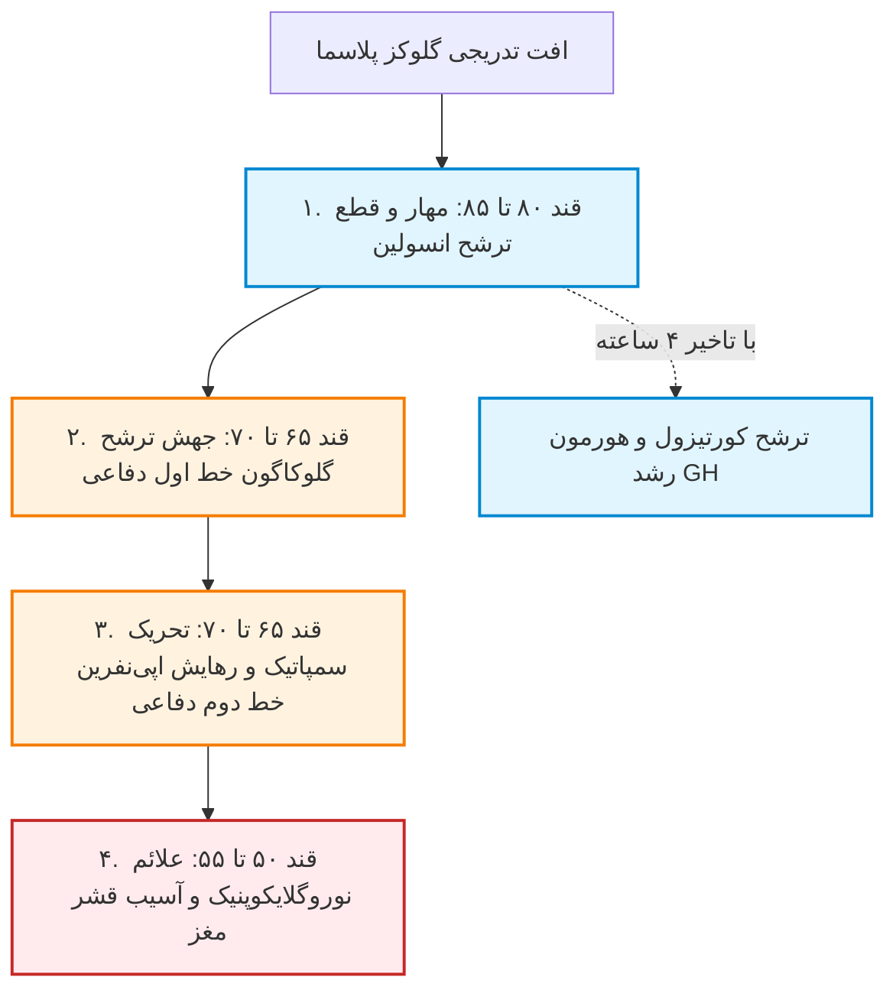
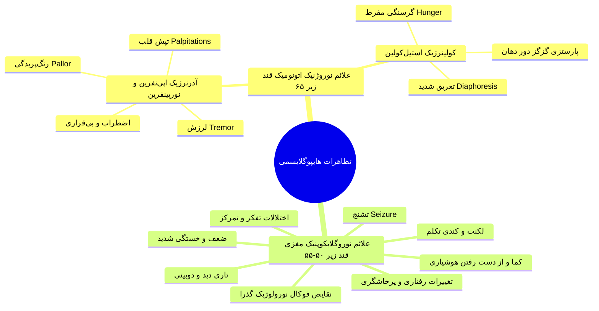
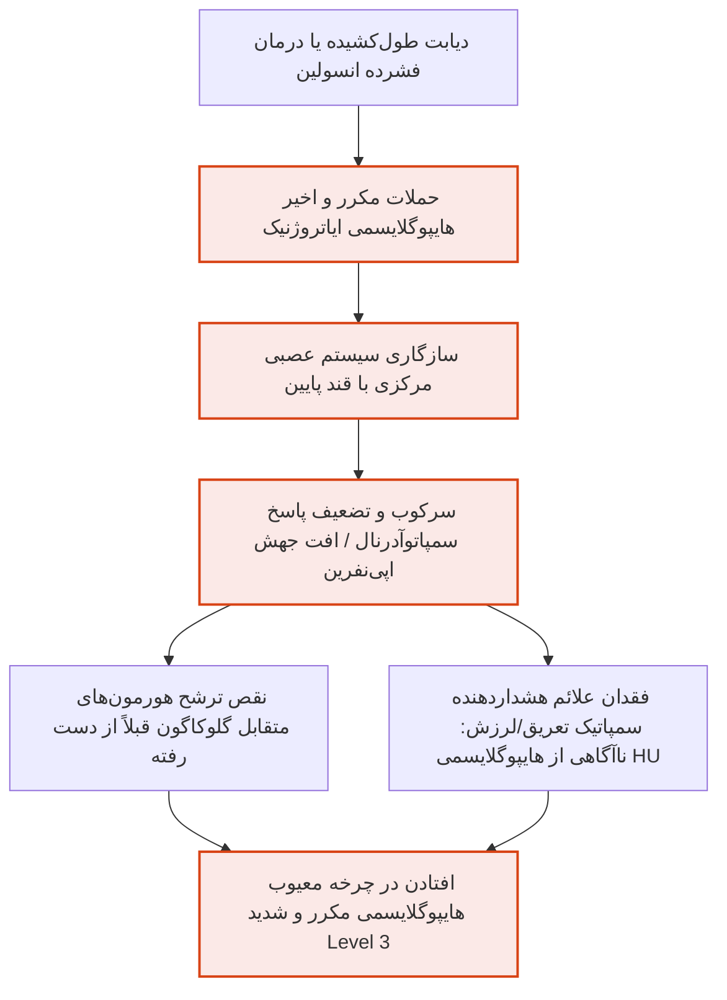
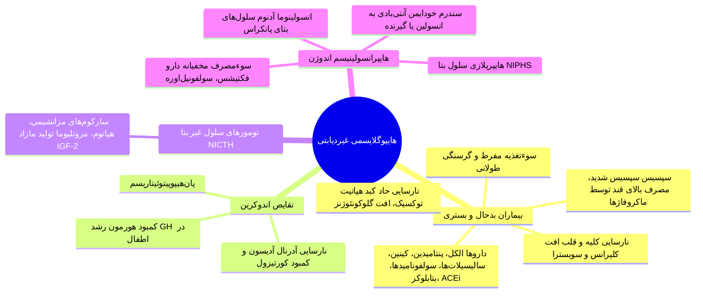
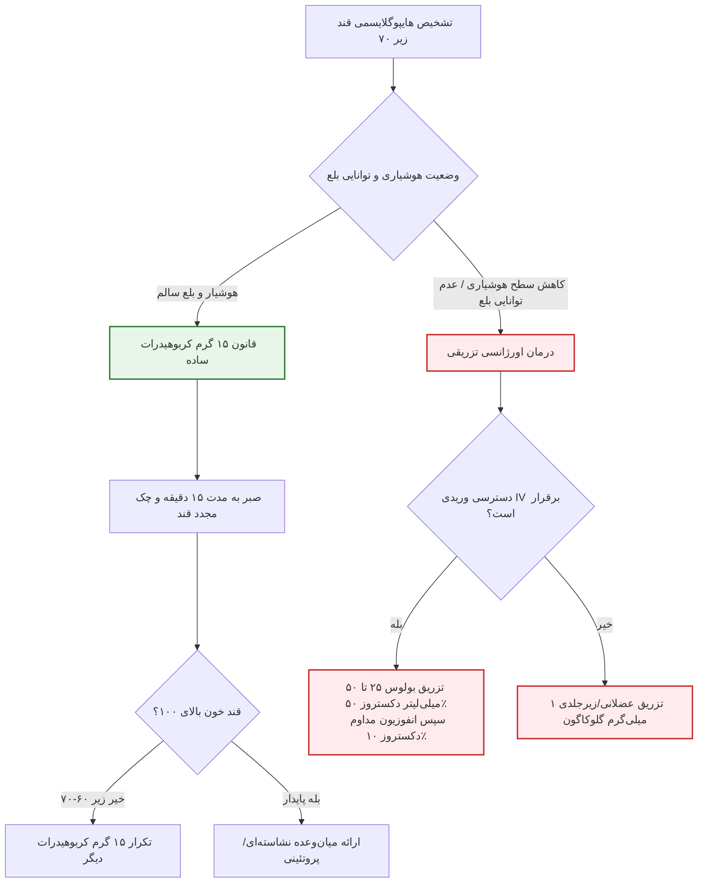
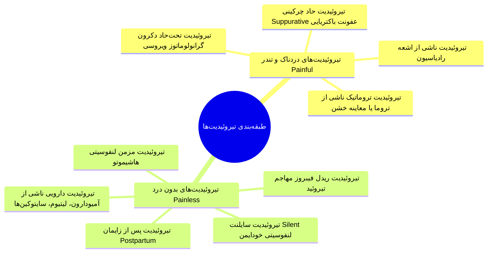
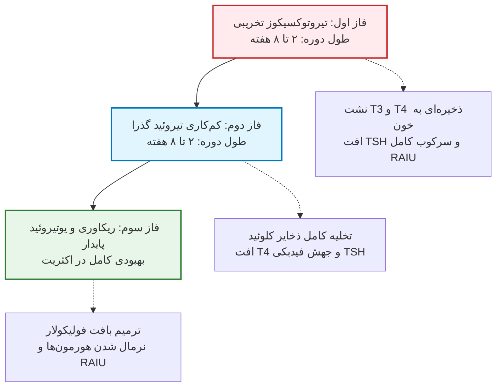
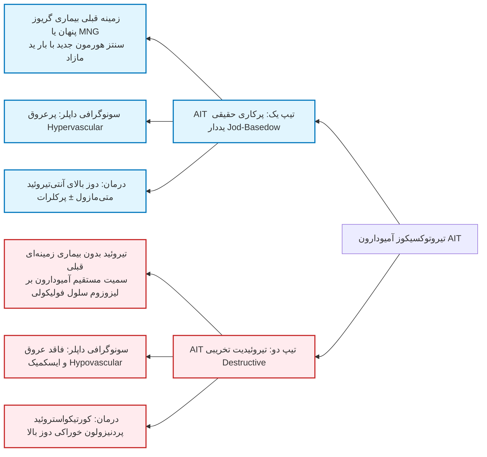

# جزوه جامع هایپوگلایسمی بالینی و تیروئیدیت‌ها (Hypoglycemia & Thyroiditis)

# بخش اول: هایپوگلایسمی (Hypoglycemia)

## ۱. تعاریف پایه، کرایتریای عددی و تریاد ویپل

> [!definition] هایپوگلایسمی بالینی (Clinical Hypoglycemia)
> افت غلظت گلوکز پلاسما به سطحی که موجب بروز علائم و نشانه‌های بالینی، به‌ویژه اختلال عملکرد مغز (Neuroglycopenia) گردد.

* **در بیماران دیابتی:** هرگونه افت قند خون به سطح **کمتر از 70 mg/dL** (همراه با علامت یا بدون علامت) که فرد را در معرض خطر قرار دهد.
* **در افراد غیردیابتی:** افت گلوکز پلاسما به **مساوی یا کمتر از 55 mg/dL**.

> [!important] تریاد ویپل (Whipple's Triad)
> چارچوب تشخیصی الزامی جهت اثبات هایپوگلایسمی حقیقی در **افراد غیردیابتی**:
> 1. **علائم بالینی منطبق با هایپوگلایسمی** (نوروژنیک یا نوروگلایکوپنیک).
> 2. **اثبات آزمایشگاهی افت قند خون** با روش دقیق آزمایشگاهی همزمان با وجود علائم.
> 3. **بهبودی سریع علائم** بلافاصله پس از مصرف یا تزریق کربوهیدرات و بالا رفتن قند خون.
> * *نکته امتحانی:* در بیمار دیابتی منتظر تریاد ویپل نمی‌مانیم؛ قند زیر ۷۰ نیازمند مداخله فوری است.

### دینامیک آستانه گلیسمیک (Dynamic Glycemic Thresholds)
* **آستانه متحرک:** بروز علائم به سرعت تغییر قند و سابقه بیمار بستگی دارد.
* **هایپوگلایسمی کاذب (Pseudohypoglycemia):** در دیابت با کنترل ضعیف و مزمن بالا، افت سریع قند از ۳۰۰ به ۱۵۰ باعث تحریک سمپاتیک و علائم تیپیک هایپوگلایسمی می‌شود؛ درحالی‌که قند بالای ۷۰ است (تغییر آستانه به سمت بالا).
* **کاهش آستانه در حملات مکرر:** در بیماران با حملات مکرر افت قند یا انسولینوما، سیستم عصبی سازگار شده و علائم هشداردهنده سمپاتیک تا رسیدن قند به سطوح بسیار خطرناک (زیر ۵۰ یا ۴۰) ظاهر نمی‌شوند.

### طبقه‌بندی شدت هایپوگلایسمی (ADA Guidelines)

| سطح / شدت | محدوده قند خون (Glycemic Criteria) | توصیف بالینی و اهمیت اجرایی |
| :--- | :--- | :--- |
| **Level 1 (Alert Value)** | **< 70 mg/dL و ≥ 54 mg/dL** | هشدار جهت مصرف سریع کربوهیدرات ساده، تنظیم مجدد دوز داروها و پرهیز موقت از کارهای پرخطر مانند رانندگی. |
| **Level 2 (Clinically Significant)** | **< 54 mg/dL** | افت شدید، جدی و بالینی؛ نایاب در شرایط فیزیولوژیک افراد سالم؛ همراه با **اختلال شناختی (Cognitive Impairment)** و خطر آسیب مغزی. |
| **Level 3 (Severe Hypoglycemia)** | **فاقد حد عددی ثابت** | رویداد شدید همراه با اختلال شدید شناختی که بیمار برای رفع آن **نیازمند کمک فعال فرد دیگری** جهت مصرف کربوهیدرات، تزریق گلوکاگون یا دکستروز است. |

* **سایر دسته‌بندی‌ها:**
  * **علامت‌دار اثبات‌شده (Documented Symptomatic):** علائم تیپیک همراه با قند مستند $\le 70\text{ mg/dL}$.
  * **بدون علامت (Asymptomatic):** قند $\le 70\text{ mg/dL}$ بدون وجود علائم بالینی.
  * **محتمل (Probable Symptomatic):** علائم تیپیک وجود دارد اما قند سنجیده نشده است.

### فاستینگ در برابر هایپوگلایسمی واکنشی (Reactive / Postprandial)
* **هایپوگلایسمی فاستینگ (Fasting Hypoglycemia):** بروز علائم پس از گذشت **بیش از ۵ ساعت** از آخرین وعده غذایی (پاتولوژیک؛ شک به انسولینوما، نارسایی ارگان‌ها، کمبود کورتیزول).
* **هایپوگلایسمی واکنشی (Reactive / Alimentary):** بروز افت قند طی **۳ تا ۵ ساعت** پس از مصرف غذای پرکربوهیدرات به دلیل ترشح تاخیری و جهشی انسولین (شایع پس از جراحی‌های معده نظیر گاسترکتومی، گاستروژژونوستومی، واگوتومی یا در مراحل اولیه مقاومت به انسولین).

---

## ۲. هوموستاز فیزیولوژیک گلوکز و آبشار دفاعی هورمونی

* گلوکز سوخت اجباری و اصلی بافت مغز در شرایط فیزیولوژیک است. مغز توانایی سنتز یا ذخیره بیش از چند دقیقه گلوکز را ندارد و وابسته به جریان پیوسته شریانی است.
* قند خون ناشتای طبیعی در بالغان سالم بین **70 تا 100 mg/dL** (میانگین 90) حفظ می‌شود.
* **ذخایر گلیکوژن کبد:** تنها برای **8 تا 12 ساعت** کافی است (در ورزش، بیماری زمینه‌ای، سپسیس یا روزه‌داری این زمان بسیار کوتاه‌تر است).
* پس از اتمام گلیکوژن، حفظ قند خون وابسته به **گلوکونئوژنز در کبد و کلیه** (تولید گلوکز از لاکتات، گلیسرول، آلانین و گلوتامین) است.

### آبشار هورمون‌های متقابل (Counterregulatory Hormones)
1. **کاهش ترشح انسولین (اولین خط دفاعی، قند ~80-85 mg/dL):** برداشته شدن مهار از روی گلوکونئوژنز، گلیکوژنولیز، لیپولیز و پروتئولیز.
2. **افزایش ترشح گلوکاگون (حیاتی‌ترین پاسخ حاد، قند ~65-70 mg/dL):** تحریک سریع گلیکوژنولیز و گلوکونئوژنز کبدی.
3. **افزایش ترشح اپی‌نفرین و سیستم سمپاتیک (قند ~65-70 mg/dL):** تقویت گلیکوژنولیز، مهار مصرف محیطی گلوکز در عضلات، ایجاد علائم هشداردهنده اتونوم.
4. **کورتیزول و هورمون رشد (GH) (پاسخ‌های تاخیری پس از ~4 ساعت هایپوگلایسمی طولانی):** کاهش مصرف گلوکز در بافت‌ها، تحریک لیپولیز و اسیدهای آمینه جهت سوبسترای گلوکونئوژنز.
   * *نکته امتحانی بالینی:* کورتیزول و GH برای پیشگیری از هایپوگلایسمی حاد ضروری نیستند، اما فقدان آن‌ها در گرسنگی طولانی یا نارسایی آدرنال/هیپوفیز سبب افت قند شدید می‌شود.

---

## ۳. علائم و نشانه‌های بالینی هایپوگلایسمی

> [!tip] اثرات عروقی و همودینامیک حاد هایپوگلایسمی
> در پاسخ به تحریک شدید سمپاتیک:
> * **فشار خون سیستولیک و ضربان قلب بالا می‌رود** (کاهش همزمان گشادی عروقی وابسته به نیتریک اکساید).
> * هایپوگلایسمی سبب فعال‌سازی وضعیت‌های **پیش‌التهابی، پیش‌ترومبوتیک و پیش‌انعقادی** می‌شود (افزایش تجمع پلاکتی، افزایش PAI-1، تضعیف فیبرینولیز) ⇦ **استعداد بالا به ترومبوز، حوادث کرونری (MI) و سکته مغزی**.

---

## ۴. سندرم HAAF و ناآگاهی از هایپوگلایسمی در دیابت

> [!definition] سندرم HAAF (Hypoglycemia-Associated Autonomic Failure)
> نارسایی عملکرد سیستم اتونوم ناشی از حملات مکرر قبلی هایپوگلایسمی، که منجر به تضعیف پاسخ سمپاتوآدرنال (اپی‌نفرین) و در نتیجه نقص هورمون‌های متقابل و پدیده **ناآگاهی از هایپوگلایسمی (Hypoglycemia Unawareness)** می‌شود.

* **عوامل تسهیل‌کننده HAAF:**
  1. **ورزش طولانی‌مدت:** پاسخ هورمون‌های متقابل را به هایپوگلایسمی بعدی تضعیف می‌کند.
  2. **خواب شبانه:** حساسیت به انسولین در بالاترین حد شبانه‌روزی است؛ پاسخ هورمون‌های متقابل و هوشیاری بیمار در طول خواب به شدت افت می‌کند.
  3. **کنترل سخت‌گیرانه گلیسمیک (HbA1c بسیار پایین)** و سن بالا.
* **پروتکل درمانی معکوس‌سازی HAAF:** پرهیز اکید و مطلق از هرگونه افت قند خون به مدت **حداقل ۲ تا ۳ هفته** با افزایش موقت هدف گلیسمیک (حفظ قند بین **140 تا 180 mg/dL**) ⇦ بازیابی آستانه طبیعی هشدار سمپاتیک.

---

## ۵. اتیولوژی جامع هایپوگلایسمی در افراد دیابتی و غیردیابتی

### ریسک‌فاکتورهای متعارف هایپوگلایسمی در دیابت
1. **دوز نامتناسب یا زمان‌بندی نادرست دارو:** تزریق بیش از حد انسولین یا مصرف سولفونیل‌اوره‌ها، خطای زمان تزریق نسبت به وعده غذا.
2. **کاهش ورود گلوکز:** فراموش کردن وعده غذایی، روزه‌داری طولانی، بی‌اشتهایی.
3. **افزایش مصرف محیطی گلوکز:** ورزش و فعالیت فیزیکی برنامه‌ریزی‌نشده.
4. **افزایش حساسیت به انسولین:** کاهش وزن، بهبود آمادگی جسمانی، اواسط شب.
5. **کاهش تولید اندوژن گلوکز:** مصرف الکل (اتانول گلوکونئوژنز را مسدود می‌کند).
6. **کاهش کلیرانس انسولین:** **نارسایی مزمن کلیه (Renal Failure)**.

### اتیولوژی‌های هایپوگلایسمی در افراد غیردیابتی

---

## ۶. رویکرد تشخیصی به هایپرانسولینیسم اندوژن و تست چالش گرسنگی ۷۲ ساعته

> [!important] قاعده طلایی بیوشیمیایی انسولین و پپتید C
> در فرد سالم هنگام افت قند به زیر ۵۵، ترشح انسولین و C-peptide درون‌زاد کاملاً خاموش می‌شود. **حفظ سطح نرمال یا بالای انسولین در شرایط هایپوگلایسمی نشان‌دهنده ترشح نامتناسب و پاتولوژیک است.**

### تست چالش گرسنگی ۷۲ ساعته (72-Hour Fasting Test)
* بستری در بخش؛ بیمار فقط آب می‌نوشد تا زمانی که قند خون به **زیر 55 mg/dL** همراه با علائم بالینی افت کند.
* در لحظه افت قند خون، نمونه‌گیری تشخیصی برای ارزیابی مارکرهای همزمان انجام می‌شود:

| تشخیص احتمالی | گلوکز (mg/dL) | انسولین (µU/mL) | C-peptide (ng/mL) | پرو-انسولین (pmol/L) | β-OHB (mmol/L) | پاسخ قند به گلوکاگون | اسکرین سولفونیل‌اوره |
| :--- | :--- | :--- | :--- | :--- | :--- | :--- | :--- |
| **طبیعی (Normal)** | $< 55$ | **سرکوب (< 3)** | **سرکوب (< 0.6)** | $< 5$ | $> 2.7$ | $< 25\text{ mg/dL}$ | منفی |
| **انسولینوما (Insulinoma)** | $< 55$ | **نامتناسب ($\ge 3$)** | **نامتناسب ($\ge 0.6$)** | **بالا ($\ge 5$)** | $\le 2.7$ | **جهش ($\ge 25$)** | **منفی** |
| **مصرف مخفیانه سولفونیل‌اوره** | $< 55$ | **نامتناسب ($\ge 3$)** | **نامتناسب ($\ge 0.6$)** | **بالا ($\ge 5$)** | $\le 2.7$ | $\ge 25$ | **مثبت در ادرار/خون** |
| **تزریق مخفیانه انسولین (اگزوژن)** | $< 55$ | **بسیار بالا ($>> 3$)** | **کاملاً سرکوب (< 0.6)** | $< 5$ | $\le 2.7$ | $\ge 25$ | منفی |
| **تومور تولیدکننده IGF-2** | $< 55$ | سرکوب ($< 3$) | سرکوب ($< 0.6$) | $< 5$ | $\le 2.7$ | $\ge 25$ | منفی |
| **نقص غیر وابسته به انسولین** | $< 55$ | سرکوب ($< 3$) | سرکوب ($< 0.6$) | $< 5$ | $> 2.7$ | $< 25$ | منفی |

> [!danger] ویژگی‌های بالینی انسولینوما (Insulinoma)
> * شیوع ۱ در ۲۵۰,۰۰۰ نفر در سال؛ **۹۰٪ خوش‌خیم و تک‌کانونی**؛ ۹۹٪ در بافت پانکراس؛ قطر کوچک (۱ تا ۲ سانتی‌متر).
> * شیوع بالاتر در زنان (۶۰٪)، سن بروز حدود ۵۰ سالگی (در بستر سندرم MEN1 در دهه ۳ زندگی).
> * تظاهر غالب: **هایپوگلایسمی فاستینگ** (به‌ویژه صبح‌ها و پس از گرسنگی شبانه) با تریاد ویپل.
> * مدالیته‌های تصویربرداری: سی‌تی‌اسکن/MRI حساسیت حدود ۷۰-۷۵٪؛ **اندوسونوگرافی (EUS) حساس‌ترین روش با دقت بالای ۹۰٪**.
> * درمان: جراحی رزکسیون تومور؛ درمان دارویی در موارد غیرقابل جراحی: **دیازوکسید (Diazoxide)** یا **اکتروتاید (Octreotide)**.

---

## ۷. پروتکل درمانی اورژانسی هایپوگلایسمی

* **قانون ۱۵ (The Rule of 15) در بیماران هوشیار سرپایی:**
  * مصرف **15 تا 20 گرم کربوهیدرات ساده سریع‌الجذب:**
    * ۳ تا ۴ قرص گلوکز، یا
    * نصف فنجان آب‌میوه یا نوشابه غیررژیمی، یا
    * ۳ حبه قند، یا ۳ قاشق چای‌خوری شکر/عسل، یا یک فنجان شیر.
  * **پرهیز اولیه از غذاهای چرب (شکلات، پنیر):** چربی سرعت جذب قند را در روده به تاخیر می‌اندازد.
  * سنجش مجدد قند ۱۵ دقیقه بعد؛ در صورت تداوم قند زیر ۷۰، تکرار دوز ۱۵ گرمی.
* **پروتکل بیماران بدحال و بستری (ناپایدار/کاهش هوشیاری):**
  * دسترسی وریدی: **30 تا 50 mL سرم دکستروز 50% وریدی بولوس**، سپس انفوزیون مداوم **دکستروز 10% با سرعت 100 mL/h** جهت حفظ قند بالای 100 mg/dL.
  * عدم دسترسی وریدی: **1 mg گلوکاگون عضلانی (IM) یا زیرجلدی (SC)** در بالغان (در اطفال: 0.5 mg یا 15 µg/kg).

---

# بخش دوم: سندرم‌های تیروئیدیت (Thyroiditis)

## ۸. طبقه‌بندی جامع و تابلوی بالینی انواع تیروئیدیت

> [!definition] تیروئیدیت (Thyroiditis)
> گروه ناهمگونی از اختلالات التهابی غده تیروئید با اتیولوژی‌های ویروسی، باکتریایی، خودایمن، دارویی یا تروماتیک.

---

## ۹. سیر سه‌مرحله‌ای کلاسیک در تیروئیدیت‌های تخریبی (Destructive Thyroiditis)

تیروئیدیت تحت‌حاد (دکرون)، سایلنت و پس از زایمان همگی سیر کلاسیک سه‌مرحله‌ای تخریبی را طی می‌کنند:

> [!important] تله امتحانی متی‌مازول در فاز تیروتوکسیکوز
> در فاز تیروتوکسیکوز تیروئیدیت‌ها، سنتز هورمون جدید رخ نمی‌دهد بلکه هورمون‌های از پیش ساخته‌شده از فولیکول‌های پاره‌شده تخلیه می‌شوند؛ بنابراین:
> * **تجویز متی‌مازول و PTU کاملاً بی‌اثر و اکیداً ممنوع است.**
> * درمان فاز تیروتوکسیکوز **صرفاً علامت‌درمانی با بتابلوکرها (پروپرانولول)** جهت مهار سمپاتیک است.

---

## ۱۰. بررسی اختصاصی انواع تیروئیدیت‌ها

### ۱. تیروئیدیت تحت‌حاد (Subacute / de Quervain's / Granulomatous)
* **اتیولوژی:** عفونت‌های ویروسی یا پدیده التهابی پس از ویروس (Mumps, Coxsackie, Influenza, Adenovirus). شیوع بالاتر در تابستان.
* **اپیدمیولوژی:** زنان ۵ برابر مردان، اوج شیوع در سنین ۲۰ تا ۵۰ سالگی.
* **شرح‌حال و تظاهرات بالینی:** شروع حاد ۲ تا ۸ هفته پس از یک عفونت تنفسی فوقانی (URI) با **درد شدید و تندرنس شدید قدام گردن** که به فک، گوش‌ها و بالای قفسه سینه تیر می‌کشد؛ گواتر کوچک دردناک؛ همراه با تب و علائم تیروتوکسیکوز.
* **یافته‌های آزمایشگاهی و تصویربرداری:**
  * **ESR بسیار بالا (اغلب > 50-100 mm/h)** و CRP شدیداً مثبت.
  * **جذب ید رادیواکتیو (RAIU) نزدیک به صفر (< 5%)**.
  * آنتی‌بادی Anti-TPO منفی یا تیتر گذرا و بسیار پایین.
* **پاتولوژی اختصاصی:** ارتشاح سلول‌های غول‌پیکر چند هسته‌ای (**Multinucleated Giant Cells**)، گرانولوم‌ها و تخریب فولیکولی.
* **درمان:** علامت‌درمانی؛ موارد خفیف با **NSAIDs**؛ موارد متوسط تا شدید با **پردنیزولون خوراکی** (تسریع چشمگیر رفع درد گردن)؛ بتابلوکر برای تاکی‌کاردی فاز اول. کم‌کاری دائم فقط در ۱۵٪ رخ می‌دهد.

### ۲. تیروئیدیت حاد چرکی (Acute Suppurative Thyroiditis)
* **اتیولوژی:** عفونت باکتریایی حاد تیروئید (استافیلوکوک، استرپتوکوک، بی‌هوازی‌ها). تیروئید به دلیل خونرسانی بالا، کپسول ضخیم و محتوای ید بالا به عفونت مقاوم است.
* **ریسک‌فاکتور زمینه‌ای ماژور:**
  * در اطفال و جوانان: حضور ناهنجاری مادرزادی **فیستول سینوس پیریفورم (Pyriform Sinus Fistula)** ناشی از باقی‌ماندن کیسه حلقی چهارم.
  * در بالغان: نقایص سیستم ایمنی (HIV).
* **تظاهرات بالینی:** درد شدید ناگهانی گردن، تندرنس موضعی، **اریتم و قرمزی پوست گردن، گرمی موضعی، تب بالا و لرز، گلودرد و دیسفاژی**.
* **تست‌های عملکردی (TFT):** **کاملاً نرمال (یوتیروئید)**؛ زیرا آسیب عفونی به صورت آبسه موضعی یک‌طرفه است و بافت باقیمانده عملکرد را حفظ می‌کند.
* **تشخیص و درمان:** سونوگرافی نشان‌دهنده آبسه و لزیون فلکچوئنت موضعی است؛ **آسپیراسیون فوری سوزنی جهت رنگ‌آمیزی گرم و کشت** + **آنتی‌بیوتیک وریدی وسیع‌الطیف و تخلیه جراحی آبسه**.

### ۳. تیروئیدیت مزمن هاشیموتو (Hashimoto's Thyroiditis)
* **اتیولوژی:** شایع‌ترین علت کم‌کاری تیروئید در مناطق با کفایت ید؛ فرایند تخریب پیشرونده اتوایمیون تیروئید.
* **اپیدمیولوژی:** زنان ۸ تا ۹ برابر مردان، اوج سنی ۳۰ تا ۵۰ سالگی.
* **تظاهرات بالینی:** گواتر بدون درد با قوام لاستیکی متراکم، ندولار کاذب (Pseudonodules). در سیر طبیعی به سمت **هایپوتیروئیدی دائم** پیش می‌رود. در شروع بیماری ممکن است فاز گذرا و نادر تیروتوکسیکوز (**هوشی‌توکسیکوزیس / Hashitoxicosis**) رخ دهد.
* **یافته‌های پاراکلینیک:**
  * **تیتر بسیار بالا و ماندگار آنتی‌بادی Anti-TPO و Anti-Tg** (در بیش از ۹۵٪ مثبت).
  * ESR کاملاً طبیعی. سطح RAIU متغیر.
* **پاتولوژی:** ارتشاح متراکم لنفوسیت‌ها، مراکز زایا (Germinal centers)، متاپلازی سلول‌های هورتل (Hürthle cells / Askanazy cells) و فیبروز.
* **درمان:** جایگزینی مادام‌العمر با **لووتیروکسین**.

### ۴. تیروئیدیت خاموش (Silent) و تیروئیدیت پس از زایمان (Postpartum Thyroiditis)
* **مشخصات:** تیروئیدیت‌های لنفوسیتی اتوایمیون فاقد درد و تندرنس.
* **تیروئیدیت پس از زایمان:** بروز **۳ تا ۶ ماه پس از زایمان** در حدود ۵٪ زنان (شیوع ۳ برابر بیشتر در زنان مبتلا به دیابت نوع ۱).
* **سیر بیماری:** فاز تیروتوکسیک گذرا (۲ تا ۴ هفته) ⇦ فاز هایپوتیروئید (۴ تا ۱۲ هفته) ⇦ بهبودی به یوتیروئید.
* **افتراق کلیدی از گریوز و تحت‌حاد:** فاقد درد است (برخلاف تحت‌حاد)؛ فاقد اگزوفتالموس و TRAb است و RAIU سرکوب‌شده دارد (برخلاف گریوز)؛ ESR نرمال است اما **Anti-TPO مثبت** است.
* *نکته امتحانی بارداری/شیردهی:* در زن شیرده اسکن هسته‌ای ایزوتوپ اکیداً ممنوع است؛ افتراق بر اساس سونوگرافی داپلر (کاهش واسکولاریتی در تیروئیدیت در برابر پرعروقی گریوز) انجام می‌شود.

### ۵. تیروئیدیت ریدل (Riedel's Fibrous Thyroiditis)
* **پاتولوژی:** بیماری نادر فیبرواسکروزان پیشرونده (جزئی از طیف سیستمیک **IgG4-Related Disease**).
* **تظاهرات بالینی:** گواتر **بسیار سفت، چوبی و سنگی (Stony-hard)**، بدون درد، فیکس و چسبنده به ساختارهای مجاور گردن:
  * درگیری تراشه ⇦ استریدور و تنگی نفس.
  * درگیری مری ⇦ دیسفاژی شدید.
  * درگیری عصب راجعه حنجره ⇦ خشونت صدا.
  * درگیری غدد پاراتیروئید ⇦ هایپوپاراتیروئیدی و هایپوکلسمی.
* **تشخیص و درمان:** سونوگرافی لزیون هایپواکو چسبنده بدون جریان عروقی داپلر نشان می‌دهد؛ بیوپسی باز جراحی جهت رد کنسر آناپلاستیک؛ درمان با **کورتیکواستروئید، تاموکسیفن، ریتوکسیماب** و دکامپرشن جراحی ایسموس.

---

## ۱۱. تیروئیدیت القاشده با آمیودارون (AIT)

> [!warning] بیوشیمی و فارماکولوژی آمیودارون
> آمیودارون حاوی **39% ید وزنی** است؛ مصرف دوز روزانه 200 mg مقادیر عظیمی ید آزاد می‌کند. دارو در بافت چربی ذخیره شده و سطح بالای ید تا **بیش از ۶ ماه پس از قطع دارو** در بدن باقی می‌ماند.

### اثرات سه‌گانه آمیودارون بر عملکرد تیروئید
1. **اثر مهاری حاد گذرای ترانسپورترها:** مهار آنزیم 5'-دیودیناز در کبد ⇦ کاهش تولید T3، افزایش rT3 و افزایش مختصر T4 و TSH گذرای اولیه (قبل از ۶ ماه).
2. **هایپوتیروئیدی القاشده با آمیودارون (AIH):** ناشی از اضافه بار ید و عدم فرار از اثر ولف-چایکوف (بیشتر در مناطق با کفایت ید و افراد واجد Anti-TPO مثبت). درمان: **ادامه آمیودارون + اضافه کردن لووتیروکسین**.
3. **تیروتوکسیکوز القاشده با آمیودارون (AIT):** بروز پرکاری که به دو تیپ متمایز تقسیم می‌شود:

> [!important] تله تشخیصی اسکن ید در آمیودارون
> اسکن ید رادیواکتیو (RAIU) به دلیل اشباع کامل غده تیروئید از ید در هر دو نوع AIT نزدیک به صفر است و **قادر به افتراق تیپ ۱ و ۲ نیست**. تنها مدالیته افتراق‌دهنده قطعی، **سونوگرافی داپلر رنگی (Color-flow Doppler)** جهت سنجش جریان عروقی است.

---

## ۱۲. جدول مقایسه‌ای جامع انواع تیروئیدیت‌ها

| ویژگی تشخیصی | تیروئیدیت تحت‌حاد (de Quervain) | تیروئیدیت حاد چرکی (Suppurative) | تیروئیدیت هاشیموتو (Hashimoto) | تیروئیدیت پس از زایمان (PPT) | تیروئیدیت ریدل (Riedel) |
| :--- | :--- | :--- | :--- | :--- | :--- |
| **سن شایع (سال)** | ۲۰ تا ۶۰ | اطفال و ۲۰ تا ۴۰ | تمام سنین (پیک ۳۰-۵۰) | سنین بارداری (۳-۶ ماه پس از زایمان) | ۳۰ تا ۶۰ |
| **نسبت جنسی (F:M)** | **۵ به ۱** | **۱ به ۱ (برابر)** | **۸ تا ۹ به ۱** | اختصاصی زنان | **۳ تا ۴ به ۱** |
| **اتیولوژی پایه** | پساویروسی / گرانولوماتوز | باکتریال (سینوس پیریفورم) | خودایمن (سلولی و هومورال) | خودایمن (لنفوسیتی) | فیبرواسکروزان (IgG4) |
| **درد و تندرنس تیروئید** | **درد شدید منتشر و تندرنس برجسته** | **درد حاد لوکالیزه، تندرنس و قرمزی پوست** | **فاقد درد (Painless)** | **فاقد درد (Painless)** | **فاقد درد (گواتر چوبی سنگی)** |
| **عملکرد تیروئید (TFT)** | سیر سه‌مرحله‌ای (تیروتوکسیک ⇦ هایپو ⇦ نرمال) | **معمولاً کاملاً نرمال (یوتیروئید)** | **هایپوتیروئیدی پیشرونده و دائم** | سیر سه‌مرحله‌ای گذرا | معمولاً نرمال (۱/۳ هایپوتیروئید) |
| **آنتی‌بادی Anti-TPO** | منفی یا تیتر گذرا و بسیار پایین | منفی | **بسیار بالا و پایدار (> 95%)** | **مثبت و با تیتر بالا** | در دو سوم موارد مثبت |
| **سرعت ته‌نشینی (ESR)** | **بسیار بالا (> 50-100)** | **بسیار بالا** همراه لوکوسیتوز | کاملاً نرمال | کاملاً نرمال | کاملاً نرمال |
| **جذب ید رادیواکتیو (RAIU)** | **سرکوب (< 5%) در فاز تیروتوکسیک** | نرمال | متغیر | **سرکوب (< 5%) در فاز تیروتوکسیک** | نرمال تا پایین |
| **پاتولوژی شاخص** | سلول‌های غول‌پیکر ژانت سل و گرانولوم | تشکیل آبسه و ارتشاح نوتروفیلی | ارتشاح لنفوسیتی و سلول هورتل | ارتشاح لنفوسیتی بدون مرکز زایا | فیبروز کلاژنی متراکم مهاجم |
| **خط اول درمان** | NSAIDs یا کورتون + بتابلوکر | آنتی‌بیوتیک تزریقی + درناژ آبسه | جایگزینی با لووتیروکسین | بتابلوکر در فاز ۱ (پرهیز از متی‌مازول) | کورتون، تاموکسیفن، جراحی |

---

## ۱۳. تابلوی سناریوهای بالینی امتحانی و تله‌های بورد

| سناریوی بالینی بیمار | یافته‌های تشخیصی پاراکلینیک | تشخیص قطعی | اقدام تشخیصی / درمانی صحیح |
| :--- | :--- | :--- | :--- |
| **خانم ۳۵ ساله با تپش قلب، لرزش، درد شدید گردن انتشاریافته به فک متعاقب سرماخوردگی** | $\text{TSH} < 0.01$ ، $\text{ESR} = 85$ ، اسکن هسته‌ای: $\text{RAIU} < 2\%$ | **تیروئیدیت تحت‌حاد دکرون (فاز اول)** | تجویز پروپرانولول + پردنیزولون؛ پرهیز اکید از متی‌مازول. |
| **کودک ۸ ساله با تب بالا، گلودرد، قرمزی و تورم بسیار دردناک و فلکچوئنت سمت چپ گردن** | $\text{TSH}$ و $\text{FT4}$ کاملاً نرمال، لوکوسیتوز با شیفت به چپ | **تیروئیدیت حاد چرکی (آبسه تیروئید)** | سونوگرافی و آسپیراسیون سوزنی آبسه + آنتی‌بیوتیک وسیع‌الطیف و ترمیم فیستول سینوس پیریفورم. |
| **خانم ۲۸ ساله ۴ ماه پس از زایمان با تپش قلب و گواتر بدون درد و بدون تندرنس** | $\text{TSH}$ سرکوب‌شده، $\text{ESR}$ نرمال، $\text{Anti-TPO}$ با تیتر بالا | **تیروئیدیت پس از زایمان (فاز تیروتوکسیکوز)** | اطمینان‌بخشی، تجویز پروپرانولول موقت؛ منع اسکن رادیوایزوتوپ در شیردهی. |
| **بیمار قلبی مصرف‌کننده آمیودارون با تیروتوکسیکوز جدید و سونوگرافی داپلر با کاهش جریان عروقی** | $\text{TSH} < 0.01$ ، $\text{RAIU}$ نزدیک به صفر، داپلر: Hypovascular | **تیروتوکسیکوز القاشده با آمیودارون تیپ ۲ (تخریبی)** | شروع کورتیکواستروئید خوراکی دوز بالا (پردنیزولون). |
| **خانم ۴۵ ساله با گواتر بسیار سفت و سنگی، استریدور تنفسی و دیسفاژی بدون درد** | $\text{TSH}$ خفیف بالا، سونو: ضایعه هایپواکو چسبنده به تراشه | **تیروئیدیت ریدل (Invasive Fibrous)** | بیوپسی باز جهت رد بدخیمی آناپلاستیک؛ درمان با کورتون/تاموکسیفن. |
| **فرد غیردیابتی با حملات تعریق و سنکوپ ناشتا و قند ۴۵ در چالش گرسنگی** | انسولین $= 14\text{ }\mu\text{U/mL}$ ، $\text{C-peptide} = 2.1\text{ ng/mL}$ ، اسکرین دارو منفی | **انسولینوما (تومور سلول بتا)** | سونوگرافی اندوسکوپیک (EUS) پانکراس و آماده‌سازی برای جراحی. |
| **پرستار جوان با کاهش وزن و حملات افت قند خون مکرر** | قند $= 40$ ، انسولین پلاسما $= 80\text{ }\mu\text{U/mL}$ ، $\text{C-peptide} < 0.2\text{ ng/mL}$ | **هایپوگلایسمی فکتیشس (تزریق مخفیانه انسولین)** | ارجاع روان‌پزشکی، عدم نیاز به بررسی‌های تصویربرداری پانکراس. |
