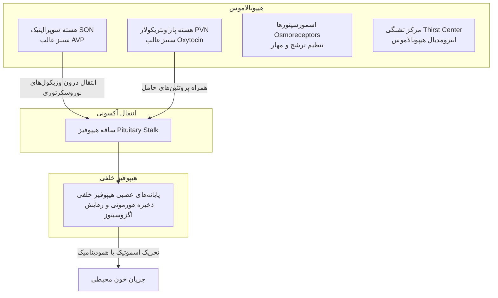
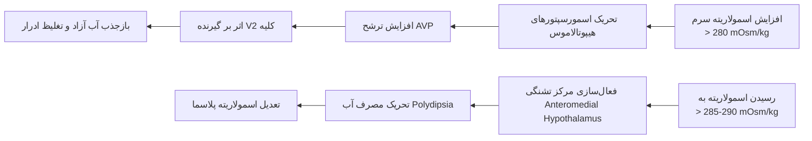
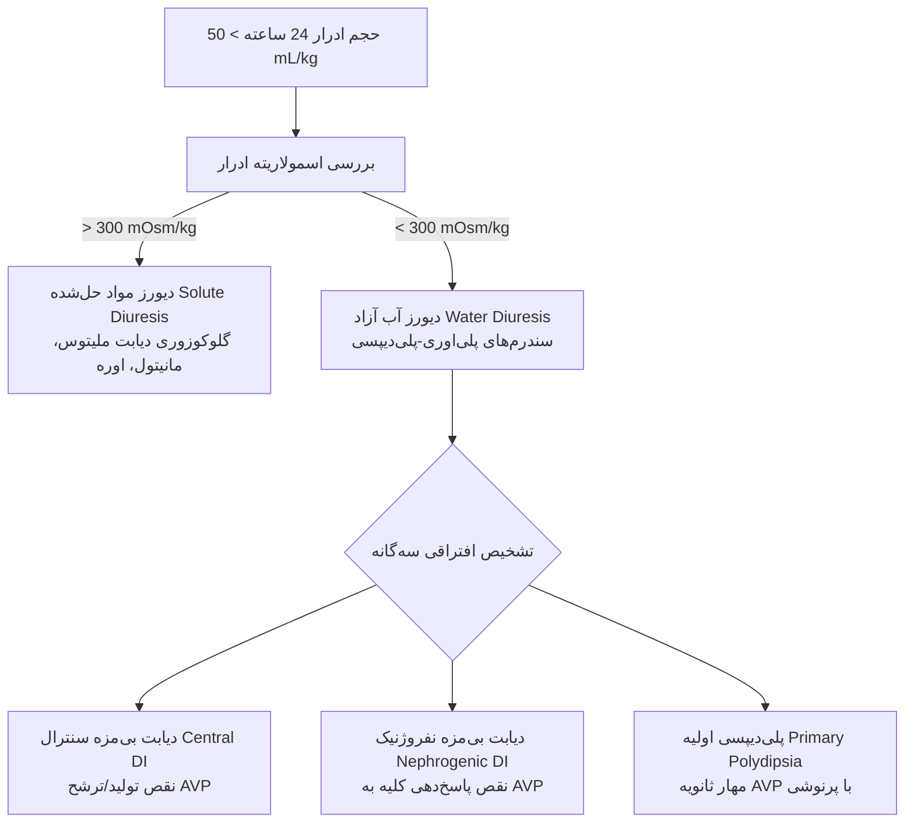
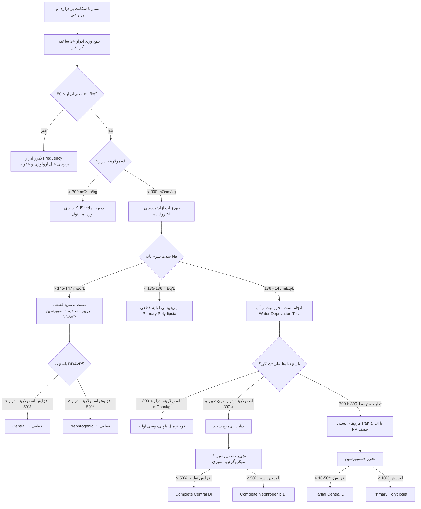
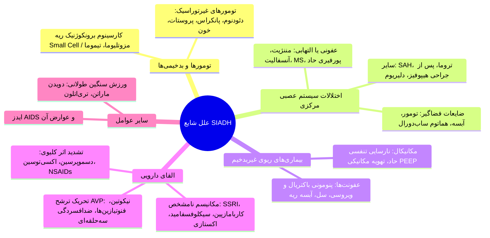
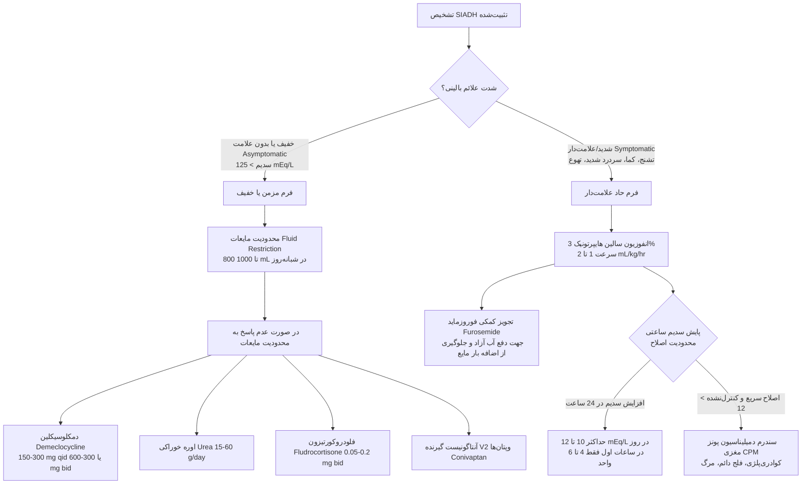

# فیزیوپاتولوژی هیپوفیز خلفی (نوروهیپوفیز)

## ۱. آناتومی، جنین‌شناسی و سازمان‌بندی عملکردی

> [!definition] نوروهیپوفیز (Neurohypophysis)
> بخش خلفی غده هیپوفیز با منشأ بافت عصبی که از کف بطن سوم مغز جوانه زده و امتداد آکسونی نورون‌های مگنوسلولار هیپوتالاموس است؛ فاقد سلول‌های ترشحی درون‌ریز مستقل بوده و صرفاً ارگان ذخیره و رهایش نوروهورمون‌هاست.

*   **تمایز تکاملی دو لوب هیپوفیز:**
    *   **هیپوفیز قدامی (آدنوهیپوفیز):** منشأ از *Rathke's pouch* (اکتودرم دهانی) ⇦ ساختار غددی (*glandular*) ⇦ فاقد عصب‌گیری مستقیم ⇦ ارتباط از طریق سیستم پورتال هیپوتالاموس-هیپوفیز ⇦ ترشح هورمون‌های GH، PRL، ACTH، TSH، LH، FSH.
    *   **هیپوفیز خلفی (نوروهیپوفیز):** منشأ از کف بطن سوم مغز (نورواکتودرم) ⇦ ساختار عصبی (*nervous*) ⇦ حاوی پایانه‌های آکسونی امتدادیافته از هیپوتالاموس ⇦ ارتباط مستقیم پایانه عصبی با بستر مویرگی وریدی محیطی.
*   **هسته‌های ترشحی هیپوتالاموس:**
    1.  **هسته سوپرااپتیک (SON):** محل اصلی سنتز هورمون ضدادراری (*Arginine Vasopressin - AVP / ADH*).
    2.  **هسته پاراونتریکولار (PVN):** محل سنتز هورمون اکسی‌توسین (*Oxytocin - OT*) و مقادیر کمکی AVP.

> [!important] استقلال پاتولوژیک دو لوب هیپوفیز
> مجاورت آناتومیک به معنای اشتراک پاتولوژی نیست؛ بیماری‌های آدنوهیپوفیز و نوروهیپوفیز کاملاً مجزا هستند. درگیری هم‌زمان هر دو لوب **بسیار نادر** بوده و فقط در ضایعات تخریبی وسیع، تومورهای بزرگ مهاجم یا بیماری‌های شدید ارتشاحی-التهابی رخ می‌دهد.

---

## ۲. هورمون‌های هیپوفیز خلفی: ساختار و بیوسنتز

### ساختار بیوشیمیایی نانوپپتیدی
*   هر دو هورمون نانوپپتید (حاوی ۹ اسیدآمینه) با یک پیوند دی‌سولفیدی بین دو ریشه سیستئین (*Cys-Cys*) هستند:
    *   **اکسی‌توسین (OT):** $Cys-Tyr-Ile-Gln-Asp-Cys-Pro-Leu-Gly-NH_2$
    *   **وازوپرسین (AVP):** $Cys-Tyr-Phe-Gln-Asp-Cys-Pro-L\text{-}Arg-Gly-NH_2$
    *   *تفاوت ساختاری:* اسیدآمینه شماره ۳ (ایزولوسین در اکسی‌توسین در مقابل فنیل‌آلانین در AVP) و اسیدآمینه شماره ۸ (لوسین در اکسی‌توسین در مقابل آرژنین در AVP).

### هورمون اکسی‌توسین (OT)
*   **عملکرد:**
    1.  تحریک انقباض عضلات صاف میومتریوم رحم طی زایمان (*childbirth*).
    2.  تحریک انقباض سلول‌های میواپیتلیال اطراف مجاری شیری پستان جهت خروج شیر (*milk letdown / ejection*).
*   **نکته تمایزی:** سنتز شیر وابسته به *پرولاکتین* و استروژن است؛ خروج مکانیکی شیر منحصراً با *اکسی‌توسین* هدایت می‌شود.
*   **پاتولوژی شناخته‌شده:** در طب بالینی، سندروم ناشی از کمبود یا فزونی پاتولوژیک خودبه‌خودی اکسی‌توسین در انسان تعریف نشده است.

### هورمون وازوپرسین (AVP / ADH)
*   **پیش‌ساز هورمونی (*Pre-pro-AVP*):** شامل سه جز پپتیدی متصل‌به‌هم:
    1.  مولکول فعال **AVP**
    2.  پروتئین حامل **نوروفیزین ۲ (Neurophysin II)**
    3.  گلیکوپپتید پایدار **کوپپتین (Copeptin)**
*   **فرآیند پردازش:** بسته‌بندی در وزیکول‌های نوروسکرتوری ⇦ شکافت آنزیمی طی مسیر آکسونی ⇦ ذخیره در هیپوفیز خلفی ⇦ ترشح هم‌زمان هر سه جز به خون به روش اگزوسیتوز.

---

## ۳. فیزیولوژی اسمورگولاسیون، گیرنده‌ها و تشنگی

### فرمول محاسبه اسمولاریته پلاسما
*   اسمولاریته تام پلاسما:
    $$\text{Plasma Osmolality (mOsm/kg H}_2\text{O)} = 2 \times [\text{Na}^+] + \frac{\text{Glucose}}{18} + \frac{\text{BUN}}{2.8}$$
*   **اسمولاریته مؤثر (*Effective Osmolality / Tonicity*):** بر پایه سدیم سرم ($2 \times [\text{Na}^+]$)؛ اوره و گلوکز به دلیل نفوذپذیری غشایی در شرایط فیزیولوژیک اثر اسموتیک مؤثر اندکی دارند، مگر در هایپرگلیسمی شدید یا اورمی پیشرفته.

### اسمورسپتورها و آستانه ترشح (Set Point)
*   اسمورسپتورهای هیپوتالاموس فوق‌العاده حساس به نوسانات غلظت سدیم و املاح مؤثر.
*   دارای عملکرد دوگانه: **تحریکی** در افزایش اسمولاریته و **مهاری** در کاهش آن.
*   **آستانه اسموتیک ترشح AVP:** غلظت پلاسمایی **280 تا 284 mOsm/kg** (معادل سدیم پلاسما حدود **135 mEq/L**).

### مرکز تشنگی و رابطه با AVP
*   **مکان مرکز تشنگی:** ناحیه *Anteromedial Hypothalamus*.
*   **آستانه تحریک تشنگی:** تقریباً **5% بالاتر** از آستانه ترشح AVP (حدود **285 تا 292 mOsm/kg**).
*   **منطق بیولوژیک تقدم-تأخر:** جلوگیری از پلی‌دیپسی مداوم؛ ابتدا حداکثر ظرفیت تغلیظ کلیوی با AVP به کار گرفته می‌شود، اگر کم‌آبی مهار نشد، مکانیسم رفتاری تشنگی فعال خواهد شد.

### انواع گیرنده‌های وازوپرسین و مکانیسم اثر سلولی

| ویژگی                  | گیرنده $V_2$ (کلیوی)                                                                            | گیرنده $V_1 / V_{1a}$ (عروقی)                                             |
| :--------------------- | :---------------------------------------------------------------------------------------------- | :------------------------------------------------------------------------ |
| **محل استقرار**        | غشای قاعده‌ای-جانبی (*Basolateral*) توبول دیستال انتهایی و مجاری جمع‌کننده (*Collecting Ducts*) | عضلات صاف جدار عروق خونی، شریانچه‌های سراسر بدن                           |
| **پیام‌رسان ثانویه**   | فعال‌سازی آدنیلیل سیکلاز ⇦ افزایش **cAMP** داخل سلولی                                           | فسفولیپاز C، افزایش اینوزیتول تری‌فسفات ($IP_3$) و کلسیم داخل‌سلولی       |
| **مکانیسم عملکرد**     | ادغام وزیکول‌های حاوی کانال **Aquaporin-2 (AQP2)** در غشای لومینال/آپیکال                       | انقباض مستقیم میوسیت‌های عروقی (*Vasoconstriction*) و افزایش مقاومت محیطی |
| **حساسیت تحریکی**      | نوسانات اندک و دقیق اسمولاریته سرم در محدوده فیزیولوژیک                                         | کاهش شدید حجم و فشار خون داخل عروقی (شوک، خونریزی وسیع)                   |
| **گیرنده‌های بالادست** | اسمورسپتورهای مرکزی هیپوتالاموس                                                                 | بارورسپتورهای کاروتید و آئورت، والیوم‌رسپتورهای دهلیز راست و بستر ریوی    |

> [!important] کانال‌های آب در سلول مجاری جمع‌کننده
> کانال **Aquaporin-2** تحت فرمان AVP بوده و در غشای آپیکال (رو به ادرار) قرار می‌گیرد. غشای بازولترال (رو به خون) به صورت سرشتی دارای کانال‌های **Aquaporin-3** و **Aquaporin-4** است و وابسته به AVP نیست.

### دامنه عملکرد فیزیولوژیک AVP در کلیه
*   **در حداکثر حضور AVP:** حجم ادرار تا **0.35 mL/min** کاهش یافته و اسمولاریته ادرار به حداکثر تغلیظ یعنی **1200 mOsm/kg** می‌رسد.
*   **در غیاب کامل AVP:** دیورز آب آزاد رخ داده، حجم ادرار تا **0.2 mL/kg/min** (معادل ۱۶ تا ۲۰ لیتر در ۲۴ ساعت) بالا رفته، اسمولاریته ادرار تا **50 mOsm/kg** سقوط کرده و وزن مخصوص ادرار (*Specific Gravity*) به حدود **1.000** می‌رسد.

---

## ۴. دیابت بی‌مزه (Diabetes Insipidus - DI): طبقه‌بندی و پاتوفیزیولوژی

> [!definition] دیابت بی‌مزه (DI)
> سندرم بالینی دفع حجم غیرطبیعی و فراوان ادرار رقیق، فاقد گلوکز و با محتوای سدیم پایین به دلیل نقص در سنتز/ترشح AVP یا نقص در پاسخ کلیوی به آن.

*   **معیار کمّی پلی‌اوری:** حجم ادرار ۲۴ ساعته **> 50 mL/kg** (بیش از **3500 mL** در یک فرد ۷۰ کیلوگرمی) همراه با اسمولاریته ادرار **< 300 mOsm/kg**.
*   **تظاهرات همراه پلی‌اوری:** تکرر ادرار (*Urinary Frequency*)، شب‌ادراری (*Enuresis*)، بیداری شبانه جهت دفع ادرار (*Nocturia*)، خواب‌آلودگی و خستگی روزانه ناشی از اختلال خواب، پرنوشی جبرانی (*Polydipsia*).

---

## ۵. اتیولوژی سه‌گانه سندرم‌های پلی‌اوری - پلی‌دیپسی

### ۱. دیابت بی‌مزه سنترال (CDI)

#### الف) اشکال ژنتیکی (Congenital / Genetic)
1.  **اتوزومال غالب (Autosomal Dominant):** شایع‌ترین فرم ژنتیکی؛ جهش در ژن کدکننده پیش‌ساز *AVP-Neurophysin II*.
    *   *ویژگی بالینی:* کودکان در بدو تولد نرمال هستند؛ علائم چند ماه تا چند سال بعد با پلی‌اوری، انورزیس و **اختلال رشد قدی-وزنی (Failure to Thrive - FTT)** بروز می‌کند (ناشی از تجمع ترشحی سمّی در نورون‌ها).
2.  **اتوزومال مغلوب (Autosomal Recessive):** جهش غیرفعال‌کننده مستقیم در بخش کدکننده هورمون AVP.
3.  **فرم وابسته به جنس مغلوب (X-linked Recessive):** جهش ژنی روی کروموزوم *Xq28*.
4.  **سندرم ولفرام (Wolfram Syndrome - DIDMOAD):** بیماری اتوزومال مغلوب بر اثر جهش در ژن *WFS1*.
    *   **DI:** دیابت بی‌مزه (*Diabetes Insipidus*)
    *   **DM:** دیابت شیرین (*Diabetes Mellitus*)
    *   **OA:** آتروفی عصب بینایی (*Optic Atrophy*)
    *   **D:** ناشنوایی حسی-عصبی (*Neural Deafness*)
    *   *پروگنز:* بسیار ضعیف و پیشرونده با از دست رفتن بینایی و شنوایی.

#### ب) اشکال اکتسابی (Acquired)
*   **ایدیوپاتیک:** حدود **50% موارد** سنترال DI (شامل هیپوفیزیت لنفوسیتی خودایمن).
*   **جراحی و تروما:** جراحی‌های ترنس‌اسفنوئیدال و هیپوفیز، قطع ساقه هیپوفیز (*pituitary stalk section*)، شکستگی قاعده جمجمه (*basal skull fracture*).
*   **تومورهای سوپراسلار اولیه:** کرانیوفارنژیوما، مننژیوما، دیس‌ژرمینوما، هامارتوما.
*   **بدخیمی‌های متاستاتیک:** شیوع بیشتر در هیپوفیز خلفی به دلیل خون‌رسانی شریانی مستقیم؛ منشأ اصلی: **سرطان پستان** و **سرطان کولورکتال** (و ریه).
*   **بیماری‌های گرانولوماتوز و ارتشاحی:** سارکوئیدوز، بیماری هَند-شولر-کریستین (*Histiocytosis X*)، گرانولوماتوز وگنر (*Granulomatosis with Polyangiitis*).
*   **عروقی:** آپوپلکسی شیهان (*Sheehan's apoplexy*)، حوادث ایسکمیک عروقی.
*   **عفونت‌ها:** آنسفالیت، مننژیت بازال (به‌ویژه سلی).
*   **دیابت بی‌مزه بارداری (*Gestational DI*):** ترشح بیش از حد آنزیم جفتی وازوپریسیناز (*vasopressinase*) و تخریب سریع AVP اندوژن.

---

### ۲. پلی‌دیپسی اولیه (Primary Polydipsia - PP)
مهار ثانویه و فیزیولوژیک ترشح AVP در اثر نوشیدن افراطی آب؛ شامل سه تیپ بالینی:
1.  **دیپسوژنیک (Dipsogenic DI):** کاهش ناهنجار آستانه تنظیمی مرکز تشنگی (*reduced set point*). ناشی از آسیب‌های چندکانونی مغز: **نوروسارکوئیدوز**، **مننژیت سلی**، **مولتیپل اسکلروزیس (MS)** یا تروما/جراحی هیپوتالاموس (گاهی ایدیوپاتیک).
2.  **سایکوجنیک (Psychogenic Polydipsia):** پرنوشی با منشأ روانپزشکی بدون تشنگی فیزیولوژیک در بستر اسکیزوفرنی، اختلال وسواسی-جبری (OCD)، اضطراب حاد یا هذیان‌های سایکوتیک.
3.  **یاتروژنیک (Iatrogenic Polydipsia):** مصرف افراطی آب در پی باورهای سلامت‌محور غلط و توصیه‌های پزشکی نادرست.

---

### ۳. دیابت بی‌مزه نفروژنیک (NDI)

#### الف) فرم‌های ژنتیکی
1.  **وابسته به X مغلوب (X-linked):** شامل **90% موارد ارثی**؛ جهش در ژن گیرنده *V2* کلیوی (*AVPR2*).
2.  **اتوزومال مغلوب یا غالب:** جهش در ژن سازنده کانال پروتئینی *Aquaporin-2 (AQP2)*.

#### ب) فرم‌های دارویی و اکتسابی
1.  **مصرف داروها:**
    *   **لیتیوم (Lithium):** مهم‌ترین و شایع‌ترین داروی مسبب NDI؛ تجمع در سلول‌های توبولار و بلوک پیام‌رسانی گیرنده V2.
    *   **دمکلوسیکلین (Demeclocycline):** ایجاد مقاومت دارویی در مجاری جمع‌کننده.
2.  **اختلالات الکترولیتی:**
    *   **هایپوکالمی (Hypokalemia):** آسیب به توانایی تغلیظ مدولاری و عملکرد AQP2.
    *   **هایپرکلسمی (Hypercalcemia):** مهار پیام‌رسانی داخل‌سلولی گیرنده V2 و القای مقاومت کلیوی.
3.  **پدیده شسته‌شدن شیب غلظت مدولا (Medullary Washout):**
    *   به دنبال هر نوع پلی‌اوری طولانی‌مدت، گرادیان اسموتیک مدولای کلیه شسته شده و بازجذب آب دچار نقص ثانویه موقت می‌شود.
    *   **فاز نقاهت نارسایی حاد کلیه (Post-AKI Recovery):** سلول‌های توبولار هنوز بازیابی ساختاری نیافته و گرادیان مدولا محو شده است؛ پلی‌اوری شدید و گذرایی به مدت ۲۴ تا ۴۸ ساعت رخ می‌دهد.

> [!danger] تله بالینی فاز نقاهت AKI
> در فاز نقاهت نارسایی حاد کلیه (سقوط کراتینین و شروع پلی‌اوری)، عدم جایگزینی دقیق مایعات می‌تواند بیمار را به سمت دهیدریشن مجدد و عود شدید نارسایی حاد کلیه (*Prerenal Azotemia*) سوق دهد.

---

## ۶. مقایسه جامع تظاهرات بالینی انواع دیابت بی‌مزه و پرنوشی

| شاخص ارزیابی | سنترال DI | نفروژنیک DI | سایکوجنیک پلی‌دیپسی |
| :--- | :--- | :--- | :--- |
| **سرعت شروع علائم** | **بسیار ناگهانی (Abrupt)**؛ بیمار روز و ساعت دقیق شروع را به یاد دارد | **تدریجی (Insidious)**؛ مرتبط با دوز و طول مصرف دارو یا بیماری کلیوی | **بسیار تدریجی و نوسانی (Erratic)**؛ تشدید علائم همگام با استرس روحی |
| **تمایل به مایعات سرد** | **شدید (Craving for ice water)**؛ بلع مداوم آب یخ و قطعات یخ | کم یا فاقد تمایل انتخابی به دمای آب | نامنظم و متغیر |
| **ناکچوری و شب‌ادراری** | **مداوم در طول شب**؛ بیداری مکرر برای دفع و نوشیدن آب | **مداوم در طول شب**؛ اجتناب‌ناپذیر | **حداقلی یا غایب**؛ با خوابیدن بیمار و توقف پرنوشی، پلی‌اوری قطع می‌شود |
| **سطح سدیم سرم پایه** | **متمایل به حد بالا یا بالای نرمال** ($\ge 142 \text{ mEq/L}$) | **متمایل به حد بالا یا بالای نرمال** ($\ge 142 \text{ mEq/L}$) | **متمایل به حد پایین یا پایین‌تر از نرمال** ($\le 137 \text{ mEq/L}$) |
| **سابقه دارویی اختصاصی** | منفی (مگر در سابقه ترنس‌اسفنوئیدال و شیمی‌درمانی) | **مثبت برای لیتیوم**، دمکلوسیکلین یا نفروپاتی زمینه‌ای | مصرف داروهای روانپزشکی ضدجنون، ضدافسردگی، بنزودیازپین‌ها |
| **علائم همراه عصبی** | سردرد، نقص میدان بینایی، اختلال هیپوفیز قدامی | بی‌حالی، عوارض دارویی، علائم اورمی یا اختلال الکترولیت | اضطراب شدید، وسواس، هذیان، عدم پذیرش اختلال روانی |

---

## ۷. اپروچ بالینی و الگوریتم تشخیصی گام‌به‌گام پلی‌اوری

### گام اول: تمایز پلی‌اوری واقعی از تکرر ادرار (Frequency)
*   **تکرر ادرار (Frequency):** احساس نیاز مکرر به تخلیه ادرار بدون افزایش حجم کل ۲۴ ساعته (حجم هر بار اندک)؛ ناشی از عفونت‌های ادراری (UTI)، پروستاتیت، سیستیت، تومورهای مثانه یا مثانه عصبی (ارجاع به اورولوژی).
*   **روش قطعی اثبات پلی‌اوری:** جمع‌آوری ادرار ۲۴ ساعته از نظر حجم و **کراتینین ادرار**.

> [!tip] ارزیابی صحت جمع‌آوری ادرار ۲۴ ساعته با کراتینین
> جهت تأیید عدم خطای بیمار در جمع‌آوری، دفع کراتینین ادرار ۲۴ ساعته سنجیده می‌شود (مستقل از میزان مایعات دریافتی و رژیم غذایی):
> *   **آقایان:** $20 \text{ to } 25 \text{ mg/kg/day}$
> *   **خانم‌ها:** $15 \text{ to } 20 \text{ mg/kg/day}$

> [!tip] فرمول تجربی تخمین اسمولاریته ادرار از روی وزن مخصوص (SG)
> در آزمایشگاه‌های فاقد امکان سنجش مستقیم اسمولاریته، تخمین اسمولاریته ادرار با فرمول سرانگشتی زیر محاسبه می‌شود:
> $$\text{Urine Osmolality (mOsm/kg)} \approx (\text{Last two digits of SG}) \times 30$$
> 
> *مثال ۱:* $\text{SG} = 1.020 \implies 20 \times 30 = 600 \text{ mOsm/kg}$
> *مثال ۲:* $\text{SG} = 1.004 \implies 4 \times 30 = 120 \text{ mOsm/kg}$

### گام دوم: آزمایش‌های اولیه آزمایشگاهی
1.  **قند خون ناشتا (FBS):** رد قطعی دیابت ملیتوس به عنوان شایع‌ترین علت پلی‌اوری.
2.  **سدیم، پتاسیم و کلسیم سرم:** رد هایپوکالمی و هایپرکلسمی به عنوان علل NDI.
3.  **وزن مخصوص (SG) و اسمولاریته ادرار:** اثبات دیورز آب آزاد ($U_{\text{osm}} < 300$).

---

## ۸. پروتکل تست محرومیت از آب (Water Deprivation Test)

*   **شرایط اجرا:** الزماً در بستر بستری بیمارستانی؛ نیازمند نظارت بالینی دقیق و ممتد (حضور فیزیکی اینترن بر بالین جهت ممانعت قاطع از نوشیدن مخفیانه آب).
*   **طول دوره:** معمولاً تا حداکثر **۸ ساعت** (مصرف بیسکویت/اسنک خشک مجاز است، مایعات مطلقاً ممنوع).
*   **پایش ساعتی:** اندازه‌گیری دقیق وزن، نبض، فشار خون، سدیم پلاسما، اسمولاریته پلاسما و ادرار (یا SG).

### معیارهای توقف تست (*Endpoints*)
1.  کاهش وزن بیش از **3% تا 5%** وزن اولیه بیمار.
2.  افزایش اسمولاریته پلاسما به **295 تا 300 mOsm/kg** (یا سدیم $\ge 145 \text{ mEq/L}$)؛ نقطه‌ای که ترشح فیزیولوژیک AVP به اوج خود می‌رسد.
3.  ثابت ماندن اسمولاریته ادرار در ۲ تا ۳ نمونه متوالی ساعتی (افزایش کمتر از 5%).

### مرحله دوم تست: چالش با دسموپرسین (*DDAVP Challenge*)
*   **دوز:** تجویز دسموپرسین به میزان **$0.03 \ \mu\text{g/kg}$** به صورت SC یا IV (یا دوز روتین بالغین **$2 \ \mu\text{g}$** تزریقی یا **$20 \ \mu\text{g}$** اسپری داخل بینی).
*   ارزیابی مجدد اسمولاریته یا SG ادرار در فواصل ۳۰ دقیقه، ۱ ساعت و ۲ ساعت بعد.

### تفسیر پاسخ‌های تست تغلیظ ادرار

| وضعیت بالینی                   | اسمولاریته ادرار بعد محرومیت از آب                              | اسمولاریته ادرار بعد از DDAVP                                       |
| :----------------------------- | :-------------------------------------------------------------- | :------------------------------------------------------------------ |
| **فرد سالم (Normal)**          | تغلیظ حداکثری ($> 800 \text{ to } 1200 \text{ mOsm/kg}$)        | **بدون تغییر** ($< 5-10\%$ افزایش؛ کلیه قبلاً به ماکزیمم رسیده است) |
| **دیابت بی‌مزه سنترال کامل**   | ناتوانی در تغلیظ ($< 300 \text{ mOsm/kg}$، $\text{SG} < 1.010$) | **جهش چشمگیر و دراماتیک (> 50%)**؛ غالباً بالای 100%                |
| **دیابت بی‌مزه نفروژنیک کامل** | ناتوانی در تغلیظ ($< 300 \text{ mOsm/kg}$)                      | **بدون پاسخ یا پاسخ ناچیز (< 50%)**؛ معمولاً زیر $10-20\%$          |
| **دیابت بی‌مزه سنترال نسبی**   | تغلیظ نسبی و ناقص ($300 \text{ to } 700 \text{ mOsm/kg}$)       | **پاسخ مثبت متوسط (> 10% تا 50%)**                                  |
| **پلی‌دیپسی اولیه (PP)**       | تغلیظ نسبتاً مطلوب ($> 500 \text{ to } 750 \text{ mOsm/kg}$)    | **پاسخ اندک یا منفی (< 10%)**                                       |

> [!definition] کوپپتین (Copeptin) به عنوان مارکر نوین
> بخش کربوکسیل-ترمینال پرو-وازوپرسین که به نسبت ۱:۱ هم‌زمان با AVP ترشح می‌شود. به دلیل پایداری خونی بالا و سنجش آزمایشگاهی آسان، جایگزین ارجح سنجش مستقیم AVP است. در صورت تجویز انفوزیون سالین هایپرتونیک: عدم افزایش کوپپتین تشخیصی برای CDI و افزایش چشمگیر آن مؤید Primary Polydipsia یا NDI است.

---

## ۹. مطالعه موردی آموزشی (Case Presentation)

*   **مشخصات بیمار:** آقای ۴۵ ساله با وزن ۵۲ کیلوگرم.
*   **شرح حال:** بروز ناگهانی پلی‌اوری و پلی‌دیپسی از ۱ ماه قبل، تمایل انتخابی شدید به مصرف آب سرد و یخ، ناکچوری مداوم در طول شب. سابقه مصرف دارو، سابقه خانوادگی و ترومای سر منفی.
*   **آزمایش‌های پایه:**
    *   حجم ادرار ۲۴ ساعته: $10000 \text{ mL}$ ($10 \text{ L/day}$)
    *   وزن مخصوص ادرار: $< 1.004$ (اسمولاریته ادرار: $140 \text{ mOsm/kg}$)
    *   سرم ناشتا: $\text{FBS} = 89 \text{ mg/dL}$، $\text{Na} = 139 \text{ mEq/L}$، $\text{K} = 3.5 \text{ mEq/L}$، $\text{Ca} = 9.1 \text{ mg/dL}$
*   **روند تست محرومیت از آب:**
    *   پس از ۴ ساعت محرومیت از مایعات: سدیم سرم به $145 \text{ mEq/L}$ رسید اما SG ادرار همچنان در $1.004$ ثابت ماند (شکست کامل تغلیظ اندوژن).
    *   تجویز دسموپرسین: جهش ناگهانی SG ادرار از $1.004$ به $1.024$ (معادل اسمولاریته ادرار حدود $720 \text{ mOsm/kg}$).
*   **تشخیص قطعی:** **دیابت بی‌مزه سنترال (CDI)**.

---

## ۱۰. تصویربرداری رزونانس مغناطیسی (MRI) هیپوفیز

*   **نشانه درخشان نوروهیپوفیز (Posterior Pituitary Bright Spot):**
    *   در تصاویر وزنی $T_1$ نمای ساژیتال، هیپوفیز خلفی افراد سالم دارای یک سیگنال هایپراینتنس سفید و درخشان است (ناشی از وزیکول‌های فسفولیپیدی ذخیره‌کننده هورمون).
*   **تفسیر اختصاصی بالینی:**
    *   **وجود Bright Spot:** تقریباً ردکننده قطعی سنترال DI؛ به شدت مطرح‌کننده *Primary Polydipsia*.
    *   **فقدان Bright Spot:** منطبق بر سنترال DI یا نفروژنیک DI، اما **ارزش اخباری منفی مطلق ندارد**، زیرا در ۱۰٪ از افراد کاملاً نرمال جامعه یا مبتلایان به *Empty Sella* نیز دیده نمی‌شود.
*   **بررسی ساقه هیپوفیز (Infundibulum):** در کات‌های کرونال، ضخیم‌شدن ساقه نشانگر ضایعات التهابی، هیستیوسیتوزیس، سارکوئیدوز یا ژرمینوما است.

> [!warning] اصل حیاتی تفسیر تصویربرداری غدد
> در اندوکرینولوژی، تصویربرداری همواره **پس از اثبات آزمایشگاهی و بیوشیمیایی** تفسیر می‌شود؛ یافتن ضایعه ساختاری یا فقدان سیگنال نوری پیش از احراز اختلال هورمونی فاقد ارزش قطعی تشخیصی است.

---

## ۱۱. راهنمای درمان اختلالات پلی‌اوری - پلی‌دیپسی

### ۱. درمان دیابت بی‌مزه سنترال (CDI)
*   **داروی خط اول:** **دسموپرسین (DDAVP)** (آنالوگ صناعی پپتیدی $1\text{-desamino-}8\text{-}D\text{-arginine vasopressin}$ با اثر اختصاصی روی گیرنده V2 و فاقد اثر فشاری بر گیرنده V1؛ طول عمر طولانی).
*   **اشکال دارویی:** اسپری بینی (*Nasal Spray*)، قرص خوراکی، قرص ذوب‌شونده زیرزبانی (*Melt - مناسب پس از جراحی بینی و پکینگ تامپون*)، آمپول تزریقی زیرجلدی/وریدی.
*   **نحوه تنظیم دوز:** شروع با دوز حداقل هنگام خواب شبانه (جهت رفع ناکچوری). در صورت عود پلی‌اوری در ساعات پایانی عصر، دوز دوم منقسم افزوده می‌شود.

> [!danger] تله درمانی مرگبار دسموپرسین
> 1. تجویز دوز نامتناسب با ادامه عادت نوشیدن آب بیمار، منجر به احتباس آب آزاد، **هایپوناترمی دایلوشنال حاد** و تشنج می‌شود؛ بیمار باید فقط به اندازه رفع تشنگی آب بنوشد.
> 2. قطع ناگهانی دسموپرسین در شرایط بعد از عمل جراحی یا عدم دسترسی بیمار بیهوش به آب، می‌تواند در ۴۸ ساعت سدیم پلاسما را به بالای $160 \text{ mEq/L}$ رسانده و سبب کما و مرگ شود.

### ۲. درمان پلی‌دیپسی اولیه (PP)
*   محدودیت تجویزی مصرف مایعات (روزی حداکثر ۶ لیوان معادل ۱۰۰۰ تا ۱۵۰۰ میلی‌لیتر).
*   مداخله روان‌پزشکی جهت کنترل اضطراب، وسواس یا اختلال سایکوتیک زمینه.
*   **ممنوعیت مطلق:** **تجویز دسموپرسین در این بیماران اکیداً خطای پزشکی است!** دسموپرسین ولع نوشیدن را مهار نمی‌کند؛ ادغام مصرف بالای آب با داروی مهار دیورز، ظرف ۲۴ تا ۴۸ ساعت سبب مسمومیت مرگبار با آب (*Water Intoxication*) و فتق ساقه مغز می‌شود.

### ۳. درمان دیابت بی‌مزه نفروژنیک (NDI)
به دلیل بی‌اثر بودن AVP اندوژن و دسموپرسین، هدف کاهش بار آب و سدیم تحویلی به نفرون دیستال است:
1.  **رژیم غذایی کم‌سدیم و کم‌پروتئین:** جهت به حداقل رساندن دفع بار اسمولار روزانه.
2.  **دیورتیک‌های تیازیدی (مثل هیدروکلروتیازید 25mg روزانه):**
    *   *مکانیسم اثر متناقض:* مهار بازجذب در توبول دیستال ⇦ افت خفیف حجم خارج سلولی ⇦ تحریک جبرانی بازجذب آب و سدیم در **توبول پروگزیمال** ⇦ کاهش تحویل آب به دیستال و کاهش پلی‌اوری.
3.  **آمیلوراید (Amiloride):** پادزهر اختصاصی در **NDI ناشی از لیتیوم**؛ بلوک اختصاصی کانال‌های سدیمی اپیتلیال (*ENaC*) در لومن مجاری جمع‌کننده و مهار ورود لیتیوم به داخل سلول‌های پرینسیپال.
4.  **داروهای ضدالتهاب غیراستروئیدی (NSAIDs مثل ایندومتاسین):** مهار سنتز پروستاگلاندین‌های کلیوی (پروستاگلاندین‌ها آنتاگونیست طبیعی AVP هستند؛ مهار آن‌ها تغلیظ ادرار را بهبود می‌بخشد).

---

## ۱۲. سندرم ترشح نابجای هورمون ضدادراری (SIADH / SIAD)

> [!definition] سندرم آنتی‌دیورز نابجا (SIADH / SIAD)
> ترشح غیرفیزیولوژیک و مداوم AVP بدون وابستگی به اسمولاریته سرم یا وضعیت حجم عروقی، منجر به احتباس آب آزاد، هایپوناترمی رقت‌پذیر و اسمولاریته پایین پلاسما در شرایط کارکرد طبیعی کلیه.

### مکانیسم تطابق مغزی و پاتوفیزیولوژی خیز سلولی
*   هایپوسمولاریتی حاد خارج سلولی ⇦ ورود آب به سلول‌های مغز بر اساس شیب اسموتیک ⇦ ادم مغزی حاد.
*   افزایش حجم مغز بیش از **5% تا 10%** با فضای سخت کاسه سر ناسازگار بوده و مرگ‌آور است.
*   **پاسخ تطابقی سریع مغز (Adaptation):** در هایپوناترمی تدریجی، سلول‌های مغز با خروج پتاسیم و اسمولیت‌های آلی (*Organic Osmolytes*) اسمولاریته درون‌سلولی را پایین آورده و مانع ادم شدید می‌شوند.

### علل شایع ایجاد SIADH

---

## ۱۳. اپروچ بالینی و تشخیص افتراقی جامع هایپوناترمی

*   **هایپوناترمی:** شایع‌ترین اختلال الکترولیتی در بیماران بستری در بیمارستان.
*   **گام تشخیصی محوری:** تعیین بالینی وضعیت حجم آب خارج سلولی (*Volume Status - ECFV*).

### جدول افتراقی هایپوناترمی بر اساس وضعیت حجم (Table 340-3)

| متغیرهای تشخیصی | تیپ ۱: هایپروولمیک (Hypervolemic) | تیپ ۲: هایپووولمیک (Hypovolemic) | تیپ ۳: یووولمیک (Euvolemic Non-SIAD) | سندرم SIAD / SIADH (Euvolemic) |
| :--- | :--- | :--- | :--- | :--- |
| **شرح حال اختصاصی** | CHF، سیروز کبدی، سندرم نفروتیک | اسهال، استفراغ، تعریق شدید، خونریزی | کمبود گلوکوکورتیکوئید، هایپوتیروئیدی | پنومونی، تومورها، تروما، داروها |
| **معاینه فیزیکی** | **ادم گوده گذار عمومی، آسیت** | خشکی مخاط، تاکی‌کاردیا، کاهش تورگور | معاینه طبیعی، معمولاً فاقد ادم | **کاملاً یووولمیک، فاقد هرگونه ادم** |
| **افت فشار ارتواستاتیک** | ممکن است دیده شود | **مثبت و شایع** | ممکن است رخ دهد | **منفی (فشار خون کاملاً طبیعی)** |
| **BUN و کراتینین** | طبیعی-بالا (High-normal) | طبیعی-بالا (آزوتمی پره‌رنال) | طبیعی-پایین (Low-normal) | **طبیعی-پایین (Low-normal)** |
| **اسید اوریک سرم** | طبیعی-بالا | طبیعی-بالا | طبیعی-پایین | **پایین (Hypouricemia)** |
| **پتاسیم سرم** | طبیعی-پایین | طبیعی-پایین | طبیعی یا بالا (در ادیسون) | **کاملاً طبیعی** |
| **آلبومین سرم** | پایین (در سیروز/نفروتیک) | طبیعی-بالا (Hemoconcentration) | طبیعی | **طبیعی** |
| **کورتیزول سرم** | طبیعی-بالا | طبیعی-بالا | **پایین (Low Cortisol)** | **کاملاً طبیعی** |
| **فعالیت رنین پلاسما** | **بالا (High)** | **بالا (High)** | پایین (مگر در نارسایی اولیه) | **پایین (Suppressed)** |
| **سدیم ادرار ($U_{\text{Na}}$)** | **پایین ($< 20 \text{ mEq/L}$)** | **پایین ($< 20 \text{ mEq/L}$)** | **بالا ($> 20 \text{ mEq/L}$)** | **بالا ($> 20 \text{ to } 40 \text{ mEq/L}$)** |

> [!important] معیارهای تشخیصی الزامی SIADH
> 1. هایپوناترمی حقیقی رقت‌پذیر: $\text{Na} < 134 \text{ mEq/L}$ با اسمولاریته سرم $< 280 \text{ mOsm/kg}$.
> 2. عدم تغلیظ ناکافی ادرار: اسمولاریته ادرار > اسمولالیته پلاسما و SG > 1.005 (معمولاً > 1.020).
> 3. وضعیت حجم نرمال بالینی (*Euvolemia*).
> 4. ترشح بالای سدیم ادراری در بستر مصرف نرمال آب و نمک ($U_{\text{Na}} > 20 \text{ mEq/L}$).
> 5. **کارکرد کاملاً طبیعی غدد تیروئید و آدرنال** (رد هایپوتیروئیدی و سندرم آدیسون).
> 6. عملکرد طبیعی کلیه و عدم مصرف داروهای دیورتیک اخیر.

---

## ۱۴. پروتکل جامع درمان هایپوناترمی و SIADH

### جزئیات مداخلات درمانی
1.  **محدودیت مایعات (Fluid Restriction):** خط اول درمان فرم‌های خفیف و مزمن با دوز **800 تا 1000 mL/day**؛ منجر به کاهش تدریجی وزن، افزایش پیوسته سدیم و رفع علائم ظرف چند روز.
2.  **سالین هایپرتونیک ۳٪ (Hypertonic Saline):** اندیکاسیون قطعی در فرم‌های حاد (< ۴۸ ساعت) یا بروز علائم شدید عصبی (کما، تشنج، کاهش هوشیاری).
    *   *سرعت انفوزیون:* با سرعت **$1 \text{ to } 2 \text{ mL/kg/hr}$** (به طور نمونه برای بیمار ۶۰ کیلوگرمی با پمپ انفیوژن در حدود $50 \text{ mL/hr}$).
3.  **دیورتیک لوپ (فوروزماید):** همراه با سالین هایپرتونیک برای پیشگیری از نارسایی احتقانی قلب ناشی از افزایش ناگهانی بار داخل عروقی.
4.  **آنتاگونیست‌های گیرنده وازوپرسین (Vaptans):** داروی **کونیواپتان (Conivaptan)** مهارکننده دوگانه گیرنده‌های $V_{1a}$ و $V_2$ بوده و تاییدیه مصرف وریدی کوتاه‌مدت بیمارستانی در SIADH و نارسایی قلبی را داراست.

> [!danger] سندرم دمیلیناسیون پونز مغزی (Central Pontine Myelinolysis - CPM)
> *عاقبت تصحیح شتاب‌زده هایپوناترمی مزمن:* در صورت افزایش سدیم به میزان **$> 12 \text{ mEq/L/day}$** (یا بیش از $4-6 \text{ mEq/L}$ در چند ساعت اول)، دهیدراسیون برق‌آسای سلول‌های مغزی رخ داده و غلاف میلین سلول‌های تنه مغز (پل مغزی) متلاشی می‌شود.
> *تظاهرات بالینی:* فلج چهاراندام (*Quadriparesis*)، آتاکسی، اختلالات عضلات خارجی چشم، فلج سودوبولبار، سندروم قفل‌شدگی (*Locked-in syndrome*)، بهت نباتی پایدار و مرگ.

---

## ۱۵. چکیده نکات فوق‌العاده مهم (AI!)

*   سنتز هورمون‌های خلفی در هسته‌های هیپوتالاموس است، نه هیپوفیز خلفی (هیپوفیز خلفی صرفاً محل رهایش است).
*   آستانه ترشح هورمون ضدادراری (280-284) حدود **5% پایین‌تر** از آستانه احساس تشنگی (285-292) قرار دارد.
*   تنها محل بازجذب آب آزاد فاقد الکترولیت در تمام نفرون، **توبول دیستال انتهایی و مجاری جمع‌کننده** تحت تأثیر AVP است.
*   تست ۲۴ ساعته ادرار با سنجش کراتینین اعتبارسنجی می‌شود ($20-25 \text{ mg/kg}$ مردان، $15-20 \text{ mg/kg}$ زنان).
*   مهم‌ترین کلید دارویی در سؤالات امتحانی نفروژنیک DI، مصرف **لیتیوم** است که پادزهر اختصاصی آن داروی **آمیلوراید** می‌باشد.
*   درمان بیماران Primary Polydipsia فقط محدودیت مصرف آب است؛ **تجویز دسموپرسین مسمومیت کشنده با آب می‌آورد**.
*   نشانه نوری درخشان هیپوفیز خلفی (*Bright Spot*) در ام‌آر‌آی، در ۹۰٪ افراد مبتلا به پرنوشی اولیه وجود دارد و در سنترال DI از بین می‌رود.
*   تشخیص SIADH نیازمند اثبات وضعیت حجم **کاملاً نرمال (Euvolemic)** و عملکرد **کاملاً نرمال تیروئید و آدرنال** است.
*   حداکثر مجاز تصحیح سدیم پلاسما در درمان هایپوناترمی حاد، **کمتر از 10 تا 12 mEq/L در روز** است تا از فاجعه *Central Pontine Myelinolysis* جلوگیری شود.