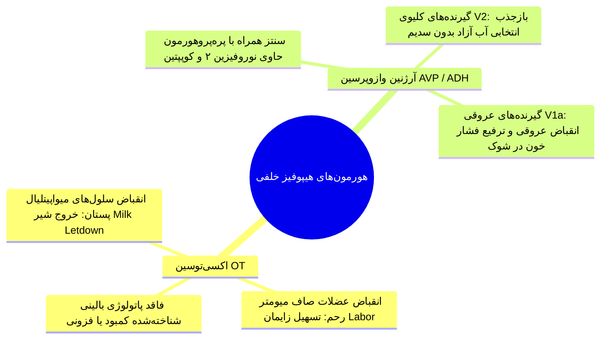
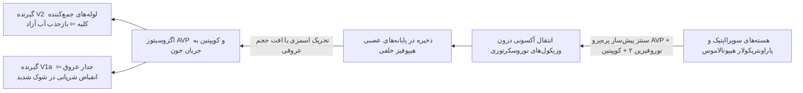
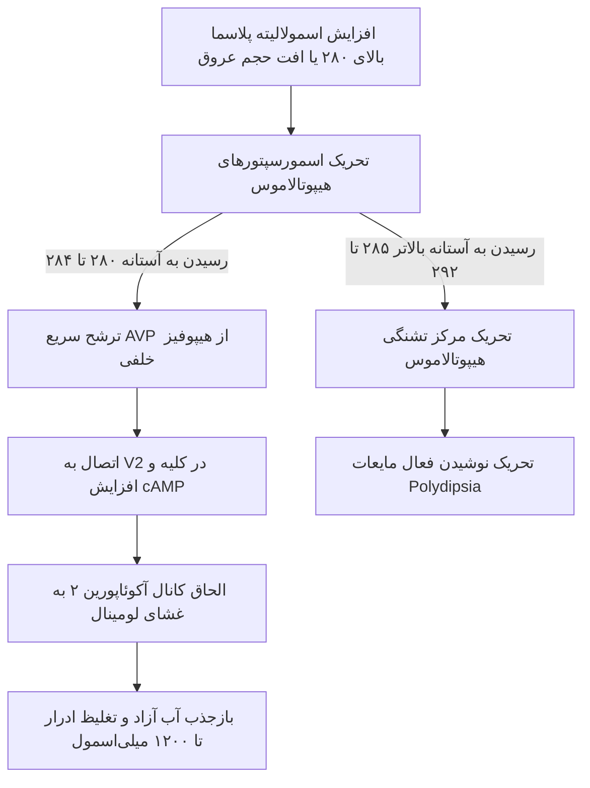
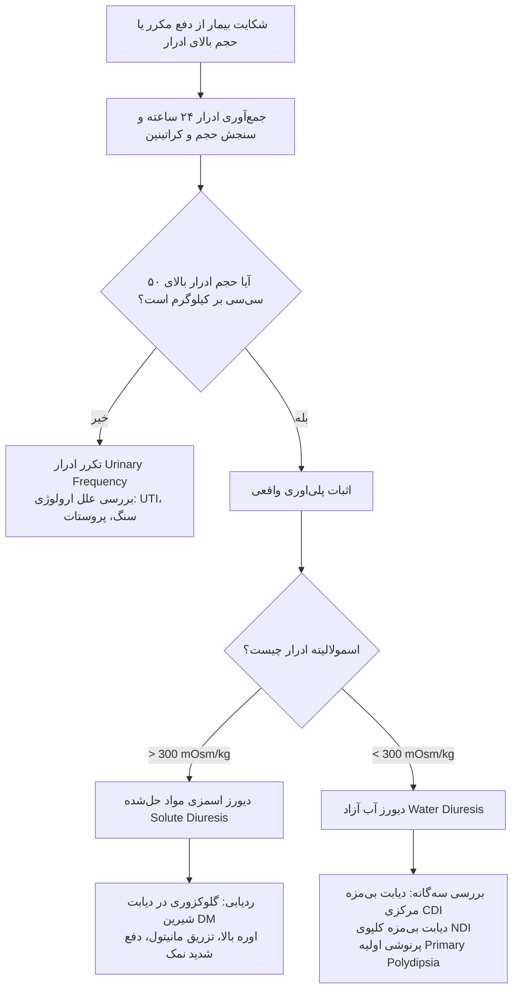
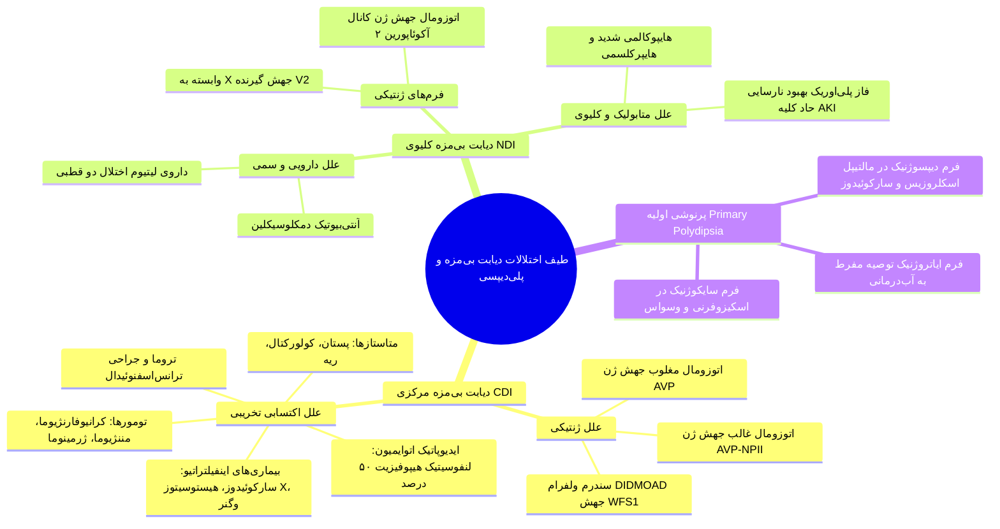
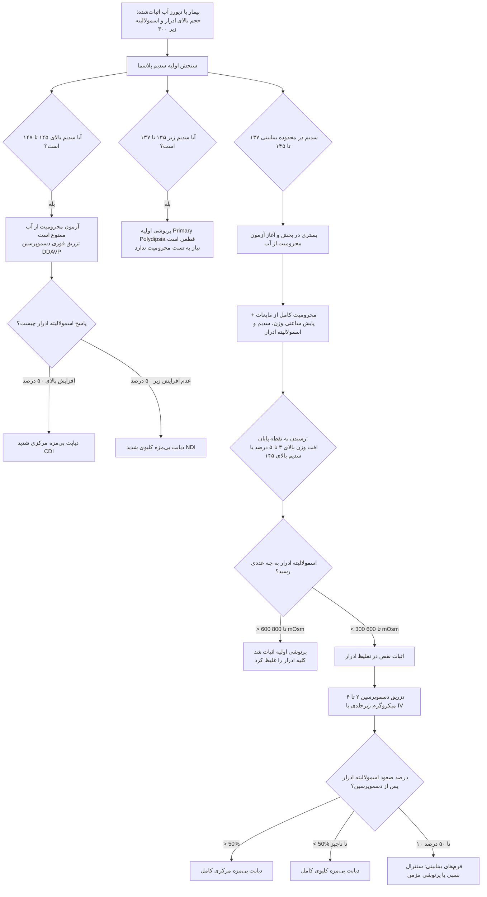
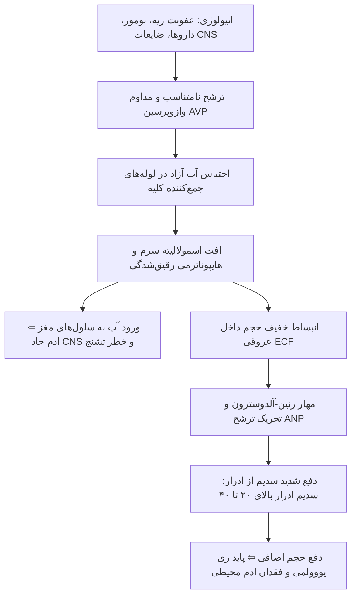
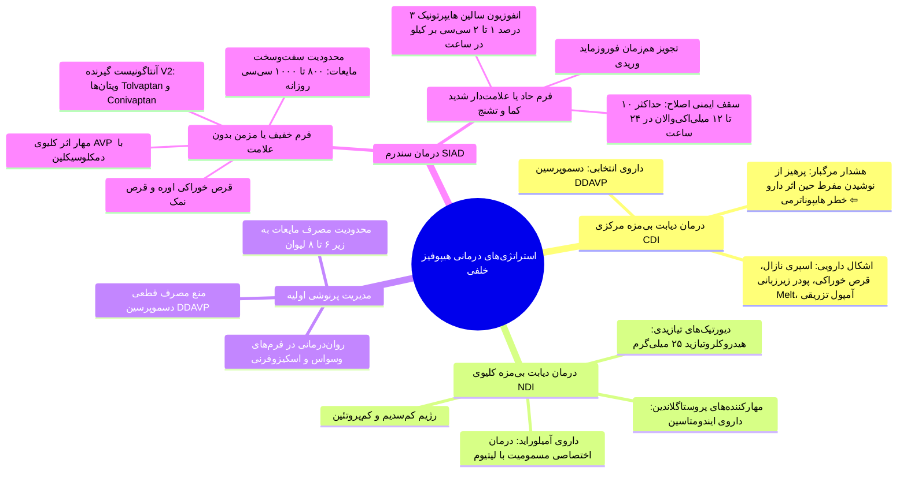

# هیپوفیز خلفی، دیابت بی‌مزه، پلی‌اوری و سندرم SIADH

> [!info] تعریف نوروهیپوفیز و سیستم ترشحی پشتی (Posterior Pituitary System)
> امتداد مستقیم عصبی هیپوتالاموس که از کف بطن سوم مغز جوانه می‌زند و بر خلاف بخش قدامی فاقد سلول‌های ترشحی مستقل غددی است؛ وظیفه این بخش انباشت و رهایش دو هورمون پپتیدی سنتزیافته در هسته‌های هیپوتالاموس یعنی هورمون ضدادراری (AVP/ADH) و اکسی‌توسین به گردش خون است.

## ۱. آناتومی کاربردی، تمایز جنینی و فیزیولوژی سنتز هورمون‌ها

غده هیپوفیز درون زین ترکی جمجمه مستقر شده و دو بخش آن مبدأ و ماهیت کاملاً متفاوتی دارند: بخش قدامی (آدنوهیپوفیز) منشأ اپیتلیالی از کیسه راتکه دارد، هورمون‌های متعددی نظیر ACTH، پرولاکتین، TSH، گنادوتروپین‌ها و هورمون رشد می‌سازد و از طریق سیستم پورتال عروقی کنترل می‌شود؛ اما هیپوفیز خلفی (نوروهیپوفیز) یک ساختار امتدادیافته عصبی بدون پرده خونی-مغزی کامل است که مستقیماً توسط آکسون‌های نورون‌های درشت‌‌سلول (Magnocellular) دو هسته اختصاصی سوپرااپتیک (SON) و پاراونتریکولار (PVN) هیپوتالاموس تغذیه می‌شود. این دو هورمون در هیپوفیز خلفی تولید نمی‌شوند، بلکه فقط در پایانه‌های وزیکولی انباشته شده و هنگام نیاز با مکانیسم اگزوسیتوز وابسته به کلسیم به خون می‌ریزند. به ندرت پیش می‌آید که یک بیماری هم‌زمان قدام و خلف را تخریب کند، مگر فرایندهای ارتشاحی بسیار وسیع، تومورهای تهاجمی بزرگ، یا جراحی‌های سنگین که هر دو ارگان همسایه را از بین ببرند.

```mermaid
mindmap
  root((هورمون‌های هیپوفیز خلفی))
    اکسی‌توسین OT
      انقباض سلول‌های میواپیتلیال پستان: خروج شیر Milk Letdown
      انقباض عضلات صاف میومتر رحم: تسهیل زایمان Labor
      فاقد پاتولوژی بالینی شناخته‌شده کمبود یا فزونی
    آرژنین وازوپرسین AVP / ADH
      سنتز همراه با پره‌‌پروهورمون حاوی نوروفیزین ۲ و کوپپتین
      گیرنده‌های کلیوی V2: بازجذب انتخابی آب آزاد بدون سدیم
      گیرنده‌های عروقی V1a: انقباض عروقی و ترفیع فشار خون در شوک
```

هورمون اکسی‌توسین یک نانوپپتید حلقوی است که سبب انقباض سلول‌های میواپیتلیال مجاری شیری (القای خروج شیر ساخته‌شده با پرولاکتین) و انقباض عضلات رحم حین زایمان می‌شود و بیماری شناخته‌شده‌ای ناشی از کمبود یا زیادی آن گزارش نشده است؛ اما هورمون اصلی مورد بحث **آرژنین وازوپرسین (AVP)** یا هورمون ضدادراری (ADH) است. وازوپرسین به عنوان یک پیش‌ساز پپتیدی درشت به همراه **نوروفیزین دو (Neurophysin II)** و گلیکوپپتیدی به نام **کوپپتین (Copeptin)** سنتز شده، درون وزیکول‌های عصبی پردازش و قطعه‌قطعه گردیده و به سمت پایانه‌ها در نوروهیپوفیز حرکت می‌کند. کوپپتین به نسبت استوکیومتری یک به یک همراه با وازوپرسین به خون رها می‌شود و به دلیل پایداری بسیار بالاتر در سرم، امروزه به عنوان بهترین نشانگر آزمایشگاهی سنجش فعالیت وازوپرسین شناخته می‌شود.

```mermaid
flowchart RL
    Hypo[هسته‌های سوپرااپتیک و پاراونتریکولار هیپوتالاموس] -->|سنتز پیش‌ساز پره‌پرو AVP + نوروفیزین ۲ + کوپپتین| Axon[انتقال آکسونی درون وزیکول‌های نوروسکرتوری]
    Axon --> PostPit[ذخیره در پایانه‌های عصبی هیپوفیز خلفی]
    PostPit -->|تحریک اسمزی یا افت حجم عروقی| Exocytosis[اگزوسیتوز AVP و کوپپتین به جریان خون]
    Exocytosis --> V2[گیرنده V2 لوله‌های جمع‌کننده کلیه ⇦ بازجذب آب آزاد]
    Exocytosis --> V1a[گیرنده V1a جدار عروق ⇦ انقباض شریانی در شوک شدید]
```

### مکانیسم سلولی عملکرد گیرنده‌ها در نفرون و عروق

عملکرد ضدادراری منحصراً توسط گیرنده‌های **V2** که از نوع GPCR متصل به پروتئین تحریکی Gs هستند و در غشای قاعده-جانبی (Basolateral) سلول‌های اصلی لوله‌های دیستال انتهایی و مجاری جمع‌کننده (Collecting Ducts) قرار دارند واسطه‌گری می‌شود. با اتصال AVP، آنزیم آدنیلات سیکلاز فعال شده، cAMP بالا می‌رود و وزیکول‌های حاوی کانال‌های انتقال آب اختصاصی یعنی **آکوئاپورین ۲ (Aquaporin 2)** از سیتوپلاسم حرکت کرده و به غشای راسی یا لومینال (Apical) متصل می‌گردند؛ این فرایند لومن ادرار را به آب نفوذپذیر کرده و آب آزاد بر اساس گرادیان غلظت بالای مدولا به سلول و سپس با واسطه آکوئاپورین ۳ و ۴ به گردش خون بازمی‌گردد. برعکس، گیرنده‌های **V1a** بر عضلات صاف جدار عروق و قلب قرار دارند، با پروتئین Gq جفت شده و با سیستم فسفولیپاز C و کلسیم موجب انقباض شدید عروقی و ترفیع فشار خون می‌شوند؛ این گیرنده‌ها در فیزیولوژی عادی خوابیده‌اند و صرفاً حین کلاپس عروقی، دهیدراسیون مرگ‌بار و شوک‌هایپووولمیک جهت حفظ خون‌رسانی مغز و کرونر وارد عمل می‌گردند.

### اسمولالیته، گیرنده‌های اسمزی و تقدم تنظیم تشنگی بر ترشح AVP

تنظیم ترشح وازوپرسین تابعی به غایت حساس از فشار اسمزی مؤثر پلاسماست که توسط اسمورسپتورهای هیپوتالاموس پایش می‌شود. اسمولالیته کل و مؤثر سرم با فرمول زیر سنجیده می‌شود:

$$\text{Plasma Osmolality} = 2 \times [\text{Na}^+] + \frac{\text{Glucose}}{18} + \frac{\text{BUN}}{2.8}$$

در شرایط تعادل متابولیک که قند و اوره طبیعی هستند، سدیم سرم تعیین‌کننده اصلی است و اسمولالیته مؤثر برابر با $2 \times [\text{Na}^+]$ محاسبه می‌گردد (اسمولالیته طبیعی پلاسما حدود **۲۸۰ تا ۲۹۵ میلی‌اسمول بر کیلوگرم** است). سلول‌های اسمورسپتور به کوچک‌ترین تغییرات ۱ درصدی سدیم پاسخ می‌دهند:
* **آستانه ترشح وازوپرسین (Osmotic Threshold / Set-point)**: در اسمولالیته حدود **۲۸۰ تا ۲۸۴ میلی‌اسمول بر کیلوگرم** (معادل سدیم حدود ۱۳۵) ترشح AVP آغاز می‌شود؛ هرچه اسمولالیته بالاتر برود، ترشح خطی AVP اوج می‌گیرد تا در اسمولالیته ۲۹۵ به حداکثر اثر بیولوژیک برسد. در حضور حداکثر AVP، حجم ادرار به ۰.۳۵ میلی‌لیتر در دقیقه تقلیل یافته و اسمولالیته ادرار به اوج غلظت خود یعنی **۱۲۰۰ میلی‌اسمول بر کیلوگرم** می‌رسد. در غیاب کامل AVP، لوله‌ها به آب نفوذناپذیر شده و حجم ادرار تا ۰.۲ میلی‌لیتر/کیلوگرم/دقیقه (روزانه ۱۶ تا ۲۰ لیتر) صعود کرده و ادراری با اسمولالیته اندک **۵۰ میلی‌اسمول بر کیلوگرم** و وزن مخصوص **۱.۰۰۰ تا ۱.۰۰۱** دفع می‌گردد.
* **مرکز تشنگی هیپوتالاموس (Thirst Osmostat)**: مرکز تشنگی در ناحیه قدامی-داخلی (Anteromedial) هیپوتالاموس مستقر است. نکته بسیار حیاتی امتحانی این است که **ست‌پوینت مرکز تشنگی حدود ۵ درصد بالاتر از ست‌پوینت ترشح وازوپرسین تنظیم شده است (حدود ۲۸۵ تا ۲۹۲ میلی‌اسمول بر کیلوگرم)**؛ این تقدم و تأخر تضمین می‌کند که بدن ابتدا با مهار دفع آب از کلیه سعی در حفظ هومئوستاز کند و تنها زمانی احساس تشنگی و نوشیدن فعال استارت بخورد که ظرفیت احتباس کلیوی اشباع شده باشد.

```mermaid
flowchart TD
    HyperOsm[افزایش اسمولالیته پلاسما بالای ۲۸۰ یا افت حجم عروق] --> Osmoreceptor[تحریک اسمورسپتورهای هیپوتالاموس]
    
    Osmoreceptor -->|رسیدن به آستانه ۲۸۰ تا ۲۸۴| SecretionAVP[ترشح سریع AVP از هیپوفیز خلفی]
    SecretionAVP --> BindV2[اتصال به V2 در کلیه و افزایش cAMP]
    BindV2 --> InsertAQP2[الحاق کانال آکوئاپورین ۲ به غشای لومینال]
    InsertAQP2 --> ReabsorbWater[بازجذب آب آزاد و تغلیظ ادرار تا ۱۲۰۰ میلی‌اسمول]
    
    Osmoreceptor -->|رسیدن به آستانه بالاتر ۲۸۵ تا ۲۹۲| ThirstCenter[تحریک مرکز تشنگی هیپوتالاموس]
    ThirstCenter --> Drink[تحریک نوشیدن فعال مایعات Polydipsia]
```

## ۲. سندرم‌های پلی‌اوری و تشنگی مفرط (Polyuria & Polydipsia)

> [!info] تعریف پلی‌اوری (Polyuria)
> دفع غیرعادی و حجیم ادرار به میزان **بیش از ۵۰ میلی‌لیتر به ازای هر کیلوگرم وزن بدن در شبانه‌روز** (معادل بیش از ۳.۵ لیتر در ۲۴ ساعت برای فرد ۷۰ کیلوگرمی و بیش از ۳ لیتر در فرد ۶۰ کیلوگرمی).

نخستین وظیفه پزشک در برابر مریضی که از پرادراری شکایت دارد، تفکیک دقیق **پلی‌اوری حقیقی** از **تکرر ادرار (Urinary Frequency)** است؛ در تکرر ادرار به علت عفونت ادراری، سیستیت، التهاب پیشابراه، بزرگی پروستات یا سنگ مثانه، بیمار به دفعات فراوان به دستشویی می‌رود اما در هر نوبت حجم بسیار اندکی دفع می‌کند و حجم کل ۲۴ ساعته طبیعی است. برای اثبات پلی‌اوری باید ادرار ۲۴ ساعته جمع‌آوری شود؛ هم‌زمان باید **کراتینین ادرار ۲۴ ساعته** چک شود تا از درستی جمع‌آوری اطمینان حاصل گردد (دفع استاندارد کراتینین در مردان **۲۰ تا ۲۵ میلی‌گرم بر کیلوگرم** و در بانوان **۱۵ تا ۲۰ میلی‌گرم بر کیلوگرم** در ۲۴ ساعت است).

```mermaid
flowchart TD
    PolyuriaQuery[شکایت بیمار از دفع مکرر یا حجم بالای ادرار] --> Collect24[جمع‌آوری ادرار ۲۴ ساعته و سنجش حجم و کراتینین]
    
    Collect24 --> VolCheck{آیا حجم ادرار بالای ۵۰ سی‌سی بر کیلوگرم است؟}
    VolCheck -->|خیر| Freq[تکرر ادرار Urinary Frequency<br>بررسی علل ارولوژی: UTI، سنگ، پروستات]
    VolCheck -->|بله| TruePoly[اثبات پلی‌اوری واقعی]
    
    TruePoly --> OsmCheck{اسمولالیته ادرار چیست؟}
    OsmCheck -->|> 300 mOsm/kg| SoluteDiuresis[دیورز اسمزی مواد حل‌شده Solute Diuresis]
    SoluteDiuresis --> DiffSolute[ردیابی: گلوکزوری در دیابت شیرین DM<br>اوره بالا، تزریق مانیتول، دفع شدید نمک]
    
    OsmCheck -->|< 300 mOsm/kg| WaterDiuresis[دیورز آب آزاد Water Diuresis]
    WaterDiuresis --> DiffWater[بررسی سه‌گانه: دیابت بی‌مزه مرکزی CDI<br>دیابت بی‌مزه کلیوی NDI<br>پرنوشی اولیه Primary Polydipsia]
```

### افتراق ماهیت دیورز: اسمزی در برابر آب آزاد

پس از تایید حجم بالای ادرار، دومین قدم تعیین اسمولالیته ادرار است:
1. **دیورز مواد حل‌شده (Solute / Osmotic Diuresis)**: اسمولالیته ادرار **بیش از ۳۰۰ میلی‌اسمول بر کیلوگرم** است. حجم بالای ادرار ناشی از کشیده شدن آب به دنبال یک ذره اسمزی خروجی است؛ شایع‌ترین علت آن **دیابت شیرین (Diabetes Mellitus)** و دفع گلوکز است. علل دیگر شامل دفع اوره پس از رفع انسداد ادراری، دفع نمک در نفروپاتی‌ها، یا تجویز داروی مانیتول است.
2. **دیورز آب آزاد (Water Diuresis)**: اسمولالیته ادرار رقیق و **کمتر از ۳۰۰ میلی‌اسمول بر کیلوگرم** (با وزن مخصوص زیر ۱.۰۱۰ و اغلب زیر ۱.۰۰۵) است؛ این تابلو به معنای عدم بازجذب آب خالص در نفرون بوده و مبنای تشخیص افتراقی میان سه اختلال مهم است: دیابت بی‌مزه مرکزی، دیابت بی‌مزه کلیوی، و پرنوشی اولیه.

| شاخص بالینی و رفتاری | دیابت بی‌مزه مرکزی (CDI) | دیابت بی‌مزه کلیوی (NDI) | پرنوشی اولیه (Primary Polydipsia) |
| :--- | :--- | :--- | :--- |
| **شروع علائم بالینی** | کاملاً **ناگهانی (Abrupt)** و دقیق در یک روز معین | تدریجی تا متوسط بر حسب علت زمینه‌ای | بسیار **تدریجی و موذیانه** طی ماه‌ها و سال‌ها |
| **الگوی عطش و تشنگی** | تمایل شدید به **آب تگری و یخ‌زده فریزر** | متناسب با نیاز دهیدراسیون | نوشیدن مقادیر زیاد هر نوع مایعات بر حسب عادت |
| **وضعیت شبانه (Nocturia)** | ناکچوری شدید، انورزی و بیداری‌های مکرر | ناکچوری وابسته به شدت نارسایی لوله‌ای | **عدم اختلال خواب** یا ناکچوری بسیار خفیف (۱ نوبت) |
| **سدیم سرمی پایه** | در محدوده نرمال بالا یا بالاتر (**> 140 mEq/L**) | در محدوده نرمال بالا یا هایپرناترمیک | در محدوده نرمال پایین یا پایین (**< 137 mEq/L**) |
| **اسمولالیته ادرار پایه** | بسیار پایین (زیر ۲۰۰ میلی‌اسمول بر کیلوگرم) | پایین (اغلب مقاوم در سطح ۱۰۰ تا ۲۰۰) | متغیر و رقیق، همگام با بار مایعات دریافتی |
| **پاسخ به واتر دپریویشن** | عدم افزایش اسمولالیته ادرار | عدم افزایش اسمولالیته ادرار | **افزایش اسمولالیته ادرار به بالای ۵۰۰ تا ۸۰۰** |
| **پاسخ به تست دسموپرسین** | **افزایش ناگهانی و چشمگیر بالای ۵۰٪** | عدم پاسخ یا افزایش ناچیز زیر ۵۰٪ | عدم افزایش معنی‌دار (زیر ۱۰٪ به دلیل اشباع بودن) |

## ۳. اتیولوژی و دسته‌بندی اختلالات هیپوفیز خلفی

```mermaid
mindmap
  root((طیف اختلالات دیابت بی‌مزه و پلی‌دیپسی))
    دیابت بی‌مزه مرکزی CDI
      علل ژنتیکی
        اتوزومال غالب جهش ژن AVP-NPII
        اتوزومال مغلوب جهش ژن AVP
        سندرم ولفرام DIDMOAD جهش WFS1
      علل اکتسابی تخریبی
        تومورها: کرانیوفارنژیوما، مننژیوما، ژرمینوما
        متاستازها: پستان، کولورکتال، ریه
        بیماری‌های اینفیلتراتیو: سارکوئیدوز، هیستوسیتوز X، وگنر
        تروما و جراحی ترانس‌اسفنوئیدال
        ایدیوپاتیک اتوایمیون: لنفوسیتیک هیپوفیزیت ۵۰ درصد
    دیابت بی‌مزه کلیوی NDI
      فرم‌های ژنتیکی
        وابسته به X جهش گیرنده V2
        اتوزومال جهش ژن کانال آکوئاپورین ۲
      علل دارویی و سمی
        داروی لیتیوم اختلال دو قطبی
        آنتی‌بیوتیک دمکلوسیکلین
      علل متابولیک و کلیوی
        هایپوکالمی شدید و هایپرکلسمی
        فاز پلی‌اوریک بهبود نارسایی حاد کلیه AKI
    پرنوشی اولیه Primary Polydipsia
      فرم سایکوژنیک در اسکیزوفرنی و وسواس
      فرم دیپسوژنیک در مالتیپل اسکلروزیس و سارکوئیدوز
      فرم ایاتروژنیک توصیه مفرط به آب‌درمانی
```

### ۱. دیابت بی‌مزه مرکزی (Central Diabetes Insipidus - CDI)

ناشی از توقف سنتز یا ترشح ناکافی هورمون وازوپرسین است:
1. **فرم‌های ژنتیکی و ارثی**:
   * **فرم اتوزومال غالب**: شایع‌ترین فرم ژنتیکی است که در اثر موتاسیون در دومین ترشحی ژن پیش‌ساز **AVP-NPII** رخ می‌دهد؛ نوزاد در بدو تولد سالم است اما با انباشت پیش‌ساز سمی درون رتیکولوم آندوپلاسمیک نورون‌ها، سلول‌ها ظرف چند ماه تا چند سال دچار آپوپتوز شده و علائم پلی‌اوری و نقص رشد (FTT) نمایان می‌شود.
   * **سندرم ولفرام (Wolfram Syndrome / DIDMOAD)**: ناهنجاری وخیم اتوزومال مغلوب به دنبال جهش در ژن WFS1؛ این بیماران تتراد فاجعه‌بار **دیابت بی‌مزه (DI)**، **دیابت شیرین (DM)**، **آتروفی عصب بینایی (Optic Atrophy)** و **ناشنوایی حسی-عصبی (Deafness)** را تجربه می‌کنند.

> [!example] مورد بالینی آموزشی: پسر نوجوان مبتلا به سندرم ولفرام
> پسر نوجوانی از عشایر چهارمحال و بختیاری که والدینش فوت کرده بودند، به تنهایی به دلیل اختلالات شدید قند خون مراجعه کرد؛ بینایی او تقریباً از دست رفته و شنوایی به شدت افت کرده بود. خواهران و برادران وی نیز در منطقه همگی مبتلا به کوری و کری بودند. جهت تجویز انسولین، به دلیل نابینایی و عدم توانایی خواندن درجات سرنگ، تیم درمان مجبور شد از روی صدای «کلیک‌های» قلم انسولین، شمارش دوز را به صورت شنیداری به او آموزش دهد؛ هم‌زمان دیابت بی‌مزه او با اسپری دسموپرسین تحت کنترل قرار گرفت.

2. **فرم‌های اکتسابی و تخریبی**:
   * **ایدیوپاتیک (۵۰ درصد موارد)**: در نیمی از مراجعین هیچ ضایعه تومورالی یافت نمی‌شود؛ پاتولوژی اصلی یک فرایند خودایمن التهابی به نام **لنفوسیتیک اینفاندیبولو-نوروهیپوفیزیت** است که آکسون‌ها و نوروهیپوفیز را تخریب می‌کند.
   * **تومورها و ضایعات ارتشاحی**: ژرمینوم سوپراسلار، کرانیوفارنژیوما، مننژیوما؛ متاستازهای سرطانی (به‌ویژه کارسینوم پستان، کولورکتال و ریه که تمایل عجیبی به عروق هیپوفیز خلفی دارند)؛ بیماری‌های گرانولوماتوز نظیر **سارکوئیدوز سیستمیک**، گرانولوماتوز وگنر، و هیستوسیتوز سلول لانگرهانس (**هیستوسیتوز X / سندرم هند-شولر-کریستین**).
   * **تروما و مداخلات درمانی**: ضربه به سر با شکستگی قاعده جمجمه، اعمال جراحی ترانس‌اسفنوئیدال هیپوفیز، ایسکمی حاد هیپوفیز (سندرم شیهان) و مسمومیت با وازوپرسیناز جفتی در دیابت بی‌مزه بارداری (Gestational DI).

### ۲. دیابت بی‌مزه کلیوی (Nephrogenic Diabetes Insipidus - NDI)

ترشح AVP از مغز طبیعی یا فراتر از نرمال است، اما لوله‌های جمع‌کننده کلیه نسبت به پیام هورمون کرخت و مقاوم هستند:
* **فرم‌های ژنتیکی**: جهش مغلوب وابسته به جنس بر روی کروموزوم X در **ژن گیرنده V2** (حدود ۹۰ درصد موارد ارثی) که سبب بیماری شدید در نوزادان پسر می‌شود؛ یا فرم اتوزومال مغلوب ناشی از موتاسیون در **ژن کانال آب آکوئاپورین ۲ (AQP2)**.
* **فرم‌های دارویی و توکسیک**: در رأس تمام داروها، داروی روان‌پزشکی **کربنات لیتیوم (Lithium)** قرار دارد؛ لیتیوم با ورود به سلول لوله جمع‌کننده بازخورد ساخت cAMP را مختل کرده و نفوذپذیری آب را فلج می‌کند. آنتی‌بیوتیک **دمکلوسیکلین** نیز عملکردی مشابه دارد.
* **علل متابولیک سیستمیک**: **هایپوکالمی** شدید و **هایپرکلسمی** مزمن رسپتورهای V2 را مهار کرده و واش‌اوت گرادیان ایجاد می‌کنند.
* **واش‌اوت اسمزی مدولا در فاز بهبودی نارسایی حاد کلیه (Post-AKI Diuresis)**: در بیماران بستری پس از رفع ایسکمی یا نکروز توبولار حاد کلیه (ATN)، لوله‌های دیستال هنوز توانایی ایجاد گرادیان بینابینی غلیظ را ندارند؛ در نتیجه بیمار در فاز نقاحت برای ۲۴ تا ۴۸ ساعت دچار پلی‌اوری عظیم می‌شود که نباید به اشتباه با دیابت بی‌مزه دائمی اشتباه گرفته شود، بلکه فقط نیاز به پایش هیدراتاسیون جهت جلوگیری از افت مجدد حجم و دهیدراسیون دارد.

### ۳. پرنوشی اولیه (Primary Polydipsia)

نقص اولیه ناشی از ترشح یا پاسخ هورمون نیست، بلکه بیمار آب فراوان مصرف می‌کند و کلیه به صورت طبیعی برای دفع این بار مازاد، ادرار رقیق می‌سازد:
* **پرنوشی سایکوژنیک (Psychogenic Polydipsia)**: ناشی از توهمات بیماری‌های سایکوتیک، اسکیزوفرنی، مانیا یا سندرم وسواس شدید فکری-عملی؛ بیمار حجم‌های نجومی آب (گاه تا ۲۰ لیتر) می‌نوشد.
* **پرنوشی دیپسوژنیک (Dipsogenic)**: آستانه مرکز تشنگی به صورت پاتولوژیک پایین آمده و بیمار با اسمولالیته نرمال هم احساس تشنگی غیرطبیعی دارد؛ در ضایعات مولتی‌فوکال مغزی مثل مالتیپل اسکلروزیس (MS) یا نوروسارکوئیدوز دیده می‌شود.
* **پرنوشی ایاتروژنیک (Iatrogenic)**: ناشی از توصیه‌های غلط پزشکی یا باورهای اجتماعی مبنی بر لزوم نوشیدن مقادیر بسیار زیاد آب در روز برای شستشوی سموم.

> [!example] مورد بالینی آموزشی: مهندس شاغل در عسلویه با وسواس کم‌آبی
> مهندسی ۳۲ ساله شاغل در پروژه‌های عسلویه، به دلیل تکرار توصیه‌های همکاران مبنی بر گرمای شدید محیط و لزوم نوشیدن ممتد آب، دچار وسواس شدید فکری شده بود؛ به نحوی که روزانه بیش از ۱۵ لیتر آب می‌نوشید و حجم ادرارش نجومی شده بود. بیمار در بیمارستان تحت آزمون محرومیت از آب قرار گرفت؛ ظرف چند ساعت بدون هیچ دارویی ادرار وی کاملاً غلیظ شد و سدیم نرمال گشت. اما با وجود تفهیم مکانیسم فیزیولوژیک، بیمار با این توهم که "پوست من در حال چروکیده شدن است" حاضر به پذیرش بیماری نبود و نهایتاً به سرویس روان‌پزشکی ارجاع گردید.

## ۴. رویکرد آزمایشگاهی گام‌به‌گام و آزمون محرومیت از آب (Water Deprivation Test)

```mermaid
flowchart TD
    Patient[بیمار با دیورز آب اثبات‌شده: حجم بالای ادرار و اسمولالیته زیر ۳۰۰] --> NaBase[سنجش اولیه سدیم پلاسما]
    
    NaBase --> NaHigh{آیا سدیم بالای ۱۴۵ تا ۱۴۷ است؟}
    NaHigh -->|بله| DirectDDAVP[آزمون محرومیت از آب ممنوع است<br>تزریق فوری دسموپرسین DDAVP]
    DirectDDAVP --> EvalDirect{پاسخ اسمولالیته ادرار چیست؟}
    EvalDirect -->|افزایش بالای ۵۰ درصد| DirectCDI[دیابت بی‌مزه مرکزی شدید CDI]
    EvalDirect -->|عدم افزایش زیر ۵۰ درصد| DirectNDI[دیابت بی‌مزه کلیوی شدید NDI]
    
    NaBase --> NaLow{آیا سدیم زیر ۱۳۵ تا ۱۳۷ است؟}
    NaLow -->|بله| PsychogenicDx[پرنوشی اولیه Primary Polydipsia قطعی است<br>نیاز به تست محرومیت ندارد]
    
    NaBase --> NaBorder{سدیم در محدوده بینابینی ۱۳۷ تا ۱۴۵}
    NaBorder --> WDT[بستری در بخش و آغاز آزمون محرومیت از آب]
    
    WDT --> Phase1[محرومیت کامل از مایعات + پایش ساعتی وزن، سدیم و اسمولالیته ادرار]
    Phase1 --> StopCrit{رسیدن به نقطه پایان:<br>افت وزن بالای ۳ تا ۵ درصد یا سدیم بالای ۱۴۵}
    
    StopCrit --> OsmRes{اسمولالیته ادرار به چه عددی رسید؟}
    OsmRes -->|> 600 تا 800 mOsm| PrimaryPoly[پرنوشی اولیه اثبات شد<br>کلیه ادرار را غلیظ کرد]
    
    OsmRes -->|< 300 تا 600 mOsm| DeficitProved[اثبات نقص در تغلیظ ادرار]
    DeficitProved --> InjectDDAVP[تزریق دسموپرسین ۲ تا ۴ میکروگرم زیرجلدی یا IV]
    
    InjectDDAVP --> ResponseDDAVP{درصد صعود اسمولالیته ادرار پس از دسموپرسین؟}
    ResponseDDAVP -->|> 50%| CentralDI[دیابت بی‌مزه مرکزی کامل]
    ResponseDDAVP -->|< 50% تا ناچیز| NephroDI[دیابت بی‌مزه کلیوی کامل]
    ResponseDDAVP -->|۱۰ تا ۵۰ درصد| PartialTree[فرم‌های بینابینی: سنترال نسبی یا پرنوشی مزمن]
```

### ۱. قوانین طلایی و پروتکل اجرایی واتر دپریویشن

این آزمون حتماً باید درون بخش بیمارستان و زیر نظر مستقیم پزشک و انترن کشیک انجام شود؛ قطع نوشیدن آب در بیماری که به دیابت بی‌مزه مبتلاست می‌تواند ظرف چند ساعت با دهیدراسیون شدید، هایپرناترمی و کلاپس گردش خون همراه شود:
1. **پایش ساعتی**: بیمار از ساعت ۸ صبح ناشتا و از مایعات محروم می‌شود؛ در ابتدای هر ساعت **وزن دقیق با یک ترازوی ثابت**، **فشار خون و نبض**، **حجم و وزن مخصوص یا اسمولالیته ادرار** و **سدیم سرم** اندازه‌گیری می‌شود.
2. **معیارهای قطع فاز اول (Stop Criteria)**: آزمون در صورت رخ دادن هر یک از سه شرط زیر بلافاصله متوقف می‌شود:
   * **کاهش وزن بدن بیش از ۳ تا ۵ درصد** نسبت به وزن پایه شروع آزمون.
   * **افزایش سدیم پلاسما به بالاتر از ۱۴۵ میلی‌اکی‌والان بر لیتر** یا اسمولالیته پلاسما به بالاتر از ۲۹۵ تا ۳۰۰ میلی‌اسمول بر کیلوگرم.
   * پایداری و ثبات اسمولالیته ادرار در سه نمونه متوالی ساعتی (افزایش کمتر از ۱۰ درصد بین نمونه‌ها).
3. **فاز دوم: آزمون چالش دسموپرسین (DDAVP Challenge)**: به بیمار ۲ تا ۴ میکروگرم دسموپرسین به صورت زیرجلدی یا وریدی (یا ۲۰ میکروگرم نازال) تجویز شده و اسمولالیته و وزن مخصوص ادرار در فواصل ۳۰، ۶۰ و ۱۲۰ دقیقه بعد سنجیده می‌شود:
   * **افزایش اسمولالیته ادرار بیش از ۵۰ درصد**: نشانه قطعی **دیابت بی‌مزه مرکزی کامل (Complete CDI)** است. کلیه تشنه هورمون بوده و با دریافت آن بلافاصله ادرار را تغلیظ می‌کند.
   * **عدم پاسخ یا افزایش ناچیز زیر ۵۰ درصد (اغلب زیر ۱۰ تا ۴۵ درصد)**: نشانه **دیابت بی‌مزه کلیوی (NDI)** است؛ کلیه به دلیل نقص گیرنده یا کانال توانایی پاسخ به هورمون اگزوژن را نیز ندارد.
   * **بیماران نرمال و پرنوشی اولیه**: در طول محرومیت، ادرار بیمار خودبه‌خود تغلیظ شده و به بالای ۶۰۰ تا ۸۰۰ میلی‌اسمول می‌رسد؛ لذا تزریق دسموپرسین پاسخی فراتر ایجاد نمی‌کند (افزایش زیر ۱۰ درصد).

> [!tip] فرمول سرانگشتی محاسبه اسمولالیته ادرار در بالین
> هرگاه دستگاه اسمومتر در دسترس نباشد، می‌توان از وزن مخصوص ادرار (Specific Gravity - SG) استفاده کرد: **دو رقم آخر وزن مخصوص را در عدد ۳۰ ضرب کنید**. به عنوان مثال، ادراری با وزن مخصوص ۱.۰۲۰ دارای اسمولالیته تقریبی معادل ۶۰۰ است ($20 \times 30 = 600$)، و وزن مخصوص ۱.۰۰۴ معادل اسمولالیته ۱۲۰ خواهد بود ($4 \times 30 = 120$).

### ۲. سرنخ‌های نوین: کوپپتین سرم و تصویربرداری MRI هیپوفیز

* **اندازه‌گیری کوپپتین پلاسما (Copeptin)**: آزمون محرومیت از آب تستی فرساینده و پرعارضه است؛ امروزه روش استاندارد جایگزین، سنجش سطح کوپپتین سرم است. اگر پس از القای هایپرناترمی خفیف با سرم سالین ۳ درصد، سطح کوپپتین پلاسما سر به فلک بکشد نشانه **NDI** است؛ اگر کوپپتین پایین و مهارشده بماند نشانه **CDI** است؛ و اگر بالا رفتن متناسب اسمولالیته را همراهی کند نشانگر **پرنوشی اولیه** خواهد بود.
* **تصویربرداری MRI و علامت لکه درخشان (Bright Spot)**: در مقاطع ساژیتال تصویربرداری تشدید مغناطیسی با وزن T1 مغز، بافت نوروهیپوفیز به دلیل ذخایر غنی وزیکول‌های فسفولیپیدی هورمونی به شکل یک نقطه سفید درخشان یا **Bright Spot** دیده می‌شود. اگر این لکه دیده شود، وجود دیابت بی‌مزه مرکزی با احتمال بسیار بالایی رد است؛ فقدان این نقطه سفید همراه با **ضخیم شدن ساقه هیپوفیز در مقاطع کرونال** نشانه تخریب فعال نوروهیپوفیز توسط تومورها، لنفوسیتیک هیپوفیزیت، گرانولوم‌ها یا بیماری‌های ارتشاحی است.

## ۵. سندرم ترشح نامتناسب هورمون ضدادراری (SIADH / SIAD)

> [!info] تعریف سندرم SIADH (یا عنوان نوین SIAD)
> ترشح نابجا، خودمختار و مهارنشدنی وازوپرسین (یا پیام‌رسانی گیرنده‌ای آن) در شرایطی که اسمولالیته پلاسما پایین است؛ این پدیده منجر به احتباس آب آزاد، هایپوسمولالیته و **هایپوناترمی رقیق‌شدگی (Dilutional Hyponatremia)** در بستر یک وضعیت بالینی بدون ادم و **یووولمیک (Euvolemic)** می‌شود.

عنوان این سندرم در منابع جدید به **SIAD** دگرگون شده است؛ زیرا در درصدی از مبتلایان، ترشح AVP بالا نیست بلکه جهش‌های فعال‌کننده گیرنده V2 (سندرم نفروژنیک ضدادراری نامتناسب NSIAD) همان تابلوی بالینی را بازتولید می‌کنند. شایع‌ترین اختلال الکترولیتی بیماران بستری در بخش‌های داخلی و جراحی، **هایپوناترمی** است و SIAD یکی از عوامل شاخص آن به شمار می‌رود.

### پاتوفیزیولوژی تورم سلول‌های مغز و مکانیسم فرار کلیوی (Renal Escape)

با ترشح بی‌وقفه وازوپرسین، آب آزاد از ادرار بازجذب شده و حجم مایع خارج سلولی (ECF) اندکی منبسط می‌شود؛ به دلیل گرادیان اسمزی، آب از پلاسمای رقیق‌شده وارد سلول‌های مغزی شده و **ادم حاد مغزی** ایجاد می‌کند. افزایش آب مغز به میزان بیش از **۵ تا ۱۰ درصد غیرقابل انطباق با حیات** بوده و به هرنی فتق مغزی و مرگ می‌انجامد. مغز برای نجات خود پس از ۲۴ تا ۴۸ ساعت، الکترولیت‌های پتاسیم و اسمولیت‌های آلی درون‌سلولی را به بیرون پمپ می‌کند تا فشار اسمزی خود را پایین آورده و ادم را مهار کند. هم‌زمان کلیه تحت کشش دهلیزی و ترشح پپتید ناتریورتیک (ANP) دچار مکانیسم **فرار کلیوی (Aldosterone Escape / Renal Escape)** شده و ترشح سدیم در ادرار را به شدت بالا می‌برد تا مانع افزایش شدید حجم خون گردد؛ به همین علت بیمار مبتلا به SIAD هیچ‌گاه ادم محیطی یا آسیت پیدا نمی‌کند و در معاینه کاملاً **یووولمیک (Euvolemic)** به نظر می‌رسد!

```mermaid
flowchart TD
    SIADCause[اتیولوژی: عفونت ریه، تومور، داروها، ضایعات CNS] --> NonPhysioAVP[ترشح نامتناسب و مداوم وازوپرسین AVP]
    NonPhysioAVP --> WaterRetain[احتباس آب آزاد در لوله‌های جمع‌کننده کلیه]
    WaterRetain --> HypoOsm[افت اسمولالیته سرم و هایپوناترمی رقیق‌شدگی]
    
    HypoOsm --> BrainEdema[ورود آب به سلول‌های مغز ⇦ ادم حاد CNS و خطر تشنج]
    HypoOsm --> VolumeExp[انبساط خفیف حجم داخل عروقی ECF]
    
    VolumeExp --> InhibitRAAS[مهار رنین-آلدوسترون و تحریک ترشح ANP]
    InhibitRAAS --> Natriuresis[دفع شدید سدیم از ادرار: سدیم ادرار بالای ۲۰ تا ۴۰]
    Natriuresis --> Euvolemia[دفع حجم اضافی ⇦ پایداری یووولمی و فقدان ادم محیطی]
```

### علل اتولوژیک سندرم SIAD

1. **تومورها و بدخیمی‌های ترشح‌کننده نابجا**: کارسینوم سلول کوچک ریه (Small Cell Lung Cancer - SCLC / برونکوژنیک)، تیموما، مزوتلیوما، کارسینوم دوازدهه، پانکراس و پروستات.
2. **بیماری‌های ریوی و مدیاستن**: پنومونی‌های باکتریایی، ویروسی و آتیپیک، سل فعال ریه، آبسه ریه، امپیم، و تهویه مکانیکی با فشار مثبت.
3. **بیماری‌های نورولوژیک و ضربه به سر**: تروماهای جمجمه، خونریزی ساب‌آراکنوئید (SAH)، آبسه مغزی، سکته‌های مغزی، هیدروسفالی، انسفالیت، مننژیت، سندرم گیلن‌باره و جراحی‌های ترانس‌اسفنوئیدال.
4. **داروها و توکسین‌ها**: داروهای محرک ترشح AVP شامل **داروهای ضدافسردگی SSRI (سرترالین، فلوکستین)**، تری‌سیکلیک‌ها، کاربامازپین و اکسی‌کاربازپین، آنتی‌سایکوتیک‌ها، کلورپروپامید، کلوفیبرات، وین‌کریستین، سیکلوفسفامید، امپرازول، و ماده مخدر اکستازی (MDMA).
5. **سایر علل اختصاصی**: **دوندگان دو ماراتن و ورزش‌های استقامتی طولانی در هوای گرم** (ناشی از استرس، تهوع و مصرف مایعات هیپوتونیک فراوان)، عفونت پیشرفته HIV/AIDS، و علل ناشناخته در افراد کهنسال (Senile Atrophy).

### جدول مقایسه‌ای تشخیص افتراقی هایپوناترمی در بیماران بستری

| تیپ هایپوناترمی | حجم مایع خارج سلولی (ECF) | نشانه‌های بالینی در معاینه فیزیکی | سدیم ادرار (Urinary Na) | علل بالینی شاخص و تله‌های تشخیصی |
| :--- | :--- | :--- | :--- | :--- |
| **تیپ ۱: هایپروولمیک** | شدیداً افزایش‌یافته (افزایش آب > سدیم) | ادم گوده‌گذار محیطی (ساق پا و پلک)، آسیت شکمی، اتساع وریدهای ژوگولار | **کمتر از ۲۰ mEq/L** (پاسخ کلیه به افت پرفیوژن) | نارسایی احتقانی قلب (CHF)، سیروز کبدی، سندرم نفروتیک |
| **تیپ ۲: هایپووولمیک** | شدیداً کاهش‌یافته (افت سدیم > آب) | افت فشار ارتواستاتیک، تاکی‌کاردی، خشکی مخاط‌ها، تورگور پوستی کاهش‌یافته | **کمتر از ۲۰** در علل غیرکلیوی؛ **بالای ۲۰** در دیورتیک و نفروپاتی | اسهال، استفراغ شدید، خونریزی، سوختگی‌های وسیع، مصرف دیورتیک |
| **تیپ ۳: یووولمیک آندومتریک** | طبیعی (حجم کل ECF متناسب) | فاقد ادم محیطی، فشار خون و مخاط‌ها کاملاً نرمال | **بیش از ۲۰ تا ۴۰ mEq/L** | **نارسایی ثانویه آدرنال (کمبود کورتیزول)**، **هایپوتیروئیدی شدید و پیشرفته** |
| **تیپ ۴: سندرم SIAD** | **کاملاً یووولمیک (Euvolemic)** | **بدون ادم**، فشار خون و نبض طبیعی، تورگور پوست نرمال | **همیشه بیش از ۲۰ تا ۴۰ mEq/L** (دفع مفرط سدیم) | بدخیمی‌ها، ضایعات ریوی و CNS، داروها (رد نارسایی آدرنال و تیروئید الزامی است) |

> [!danger] معیارهای قطعی تشخیص آزمایشگاهی سندرم SIAD!
> برای اثبات SIAD باید تمام شروط زیر به صورت هم‌زمان برقرار باشند:
> 
> 1. **هایپوناترمی هیپوتونیک حقیقی**: سدیم سرم کمتر از ۱۳۴ mEq/L و اسمولالیته پلاسما کمتر از ۲۷۵ تا ۲۸۰ mOsm/kg.
> 2. **تغلیظ نامتناسب ادرار**: اسمولالیته ادرار بیش از ۱۰۰ تا ۳۰۰ mOsm/kg (وزن مخصوص بالای ۱.۰۱۰ تا ۱.۰۲۰).
> 3. **دفع بالای سدیم در ادرار**: غلظت سدیم ادرار بیش از **۲۰ تا ۴۰ میلی‌اکی‌‌والان در لیتر** در حضور دریافت نرمال نمک.
> 4. **یووولمی بالینی**: فقدان هرگونه نشانه ادم محیطی، آسیت یا دهیدراسیون بالینی.
> 5. **کارکرد طبیعی ارگان‌های همراه**: عملکرد کلیه کاملاً نرمال (کراتینین و BUN در حد نرمال یا حتی پایین‌تر از حد نرمال به دلیل رقیق‌شدگی)، و رد قطعی نارسایی آدرنال و هایپوتیروئیدی.

## ۶. اصول درمان و مدیریت بالینی اختلالات نوروهیپوفیز

```mermaid
mindmap
  root((استراتژی‌های درمانی هیپوفیز خلفی))
    درمان دیابت بی‌مزه مرکزی CDI
      داروی انتخابی: دسموپرسین DDAVP
      اشکال دارویی: اسپری نازال، قرص خوراکی، پودر زیرزبانی Melt، آمپول تزریقی
      هشدار مرگبار: پرهیز از نوشیدن مفرط حین اثر دارو ⇦ خطر هایپوناترمی
    درمان دیابت بی‌مزه کلیوی NDI
      رژیم کم‌سدیم و کم‌پروتئین
      دیورتیک‌های تیازیدی: هیدروکلروتیازید ۲۵ میلی‌گرم
      داروی آمیلوراید: درمان اختصاصی مسمومیت با لیتیوم
      مهارکننده‌های پروستاگلاندین: داروی ایندومتاسین
    مدیریت پرنوشی اولیه
      محدودیت مصرف مایعات به زیر ۶ تا ۸ لیوان
      روان‌درمانی در فرم‌های وسواس و اسکیزوفرنی
      منع مصرف قطعی دسموپرسین DDAVP
    درمان سندرم SIAD
      فرم خفیف یا مزمن بدون علامت
        محدودیت سفت‌وسخت مایعات: ۸۰۰ تا ۱۰۰۰ سی‌سی روزانه
        قرص خوراکی اوره و قرص نمک
        آنتاگونیست گیرنده V2: وپتان‌ها Tolvaptan و Conivaptan
        مهار اثر کلیوی AVP با دمکلوسیکلین
      فرم حاد یا علامت‌دار شدید کما و تشنج
        انفوزیون سالین هایپرتونیک ۳ درصد ۱ تا ۲ سی‌سی بر کیلو در ساعت
        تجویز هم‌زمان فوروزماید وریدی
        سقف ایمنی اصلاح: حداکثر ۱۰ تا ۱۲ میلی‌اکی‌والان در ۲۴ ساعت
```

### ۱. پروتکل جامع درمان انواع دیابت بی‌مزه

* **درمان دیابت بی‌مزه مرکزی (CDI)**: داروی انتخابی **دسموپرسین (DDAVP)** است که آنالوگ سنتتیک وازوپرسین با تغییر ساختاری دسامینه شدن و جانشینی D-آرژنین است؛ این تغییر تمایل دارو به گیرنده ضدادراری V2 را صدها برابر بیشتر کرده و اثر وازوپرسوری V1a را به صفر رسانده است. اشکال در دسترس شامل اسپری داخل بینی، قرص خوراکی، فرم زیرزبانی سریع‌الجذب (**Melt** به خصوص پس از جراحی بینی و هیپوفیز که مخاط مسدود است)، و فرم تزریقی وریدی/زیرجلدی است.
  * **قانون طلایی دوزبندی**: دوز دارو باید بر اساس رفع ناکچوری شبانه و تنظیم سدیم پایش شود. معمولاً یک پاف شبانه کافی است؛ در صورت بازگشت علائم در بعدازظهر، یک پاف دیگر اضافه می‌شود. **بیمار باید بیاموزد که فقط هنگام تشنگی آب بنوشد؛ اگر بیمار هم‌زمان با مصرف دسموپرسین طبق عادت گذشته مقادیر زیادی آب بنوشد، دچار احتباس شدید آب، مسمومیت با آب و تشنج ناشی از هایپوناترمی خواهد شد!**
* **درمان دیابت بی‌مزه کلیوی (NDI)**: کلیه به دسموپرسین پاسخ نمی‌دهد؛ درمان‌های کمکی شامل:
  1. **رژیم غذایی کم‌سدیم و کم‌پروتئین**: با کاهش بار اسمزی دفعی، جریان آب به لوله‌های دیستال کم می‌شود.
  2. **دیورتیک‌های تیازیدی (هیدروکلروتیازید ۲۵ میلی‌گرم روزانه)**: مکانیسم آن در نگاه اول متناقض است (تجویز ادرارآور برای بیماری که پرادراری دارد!). تیازید با مهار بازجذب سدیم در لوله دیستال، یک دهیدراسیون خفیف ایجاد می‌کند؛ کلیه در پاسخ، بازجذب آب و سدیم را در **لوله پیچیده پروگزیمال** به شدت افزایش می‌دهد. در نتیجه حجم آب ورودی به لوله دیستال آسیب‌دیده کاهش یافته و حجم ادرار شبانه‌روز تا ۵۰ درصد کم می‌شود.
  3. **داروی آمیلوراید (Amiloride)**: درمان انتخابی و اختصاصی در **بیماران مصرف‌کننده لیتیوم** است؛ آمیلوراید کانال‌های سدیمی اپیتلیال (ENaC) را در غشای لومینال مسدود کرده و مانع ورود لیتیوم به داخل سلول توبولی می‌شود.
  4. **داروهای ضدالتهاب غیراستروئیدی (NSAIDs نظیر ایندومتاسین)**: پروستاگلاندین‌های کلیوی به صورت طبیعی آنتاگونیست عملکرد ضدادراری AVP هستند؛ مهار سنتز آن‌ها با ایندومتاسین توانایی تغلیظ ادرار را تا حدی احیا می‌کند.
* **درمان پرنوشی اولیه**: محدود کردن نوشیدن مایعات به ۶ لیوان در روز و درمان اختلال روان‌پزشکی زمینه‌ای. **تجویز دسموپرسین در پرنوشی اولیه مطلقاً ممنوع است**؛ زیرا تمایل بیمار به نوشیدن آب را مهار نکرده و ظرف ۴۸ ساعت هایپوناترمی مرگ‌بار و ادم مغزی می‌سازد.

### ۲. پروتکل نجات‌بخش درمان هایپوناترمی در سندرم SIAD

درمان هایپوناترمی به دو فاکتور **شدت افت سدیم** و از آن مهم‌تر **سرعت ایجاد هایپوناترمی (Acute vs Chronic)** بستگی دارد:
* **هایپوناترمی حاد علامت‌دار (شروع زیر ۴۸ ساعت همراه با تشنج، استوپور و کما)**: یک اورژانس نورولوژیک است؛ درمان با **سالین هایپرتونیک ۳ درصد** با سرعت ۱ تا ۲ میلی‌لیتر به ازای هر کیلوگرم وزن بدن در ساعت آغاز می‌شود. در صورت لزوم فوروزماید وریدی جهت مهار افزایش حجم داخل عروقی همراه می‌گردد. هدف در این فاز صرفاً بالا آوردن سریع سدیم به میزان **۴ تا ۶ میلی‌اکی‌والان بر لیتر** در ساعات اول جهت متوقف کردن تشنج و نجات بیمار از مرگ است.
* **هایپوناترمی مزمن و بدون علامت شدید (سابقه بالای ۴۸ ساعت یا نامشخص)**: درمان اصلی منحصراً **محدودیت دریافت آب به ۸۰۰ تا ۱۰۰۰ میلی‌لیتر در ۲۴ ساعت** است؛ این محدودیت با ایجاد تعادل منفی آب، سدیم را به آرامی بالا می‌برد. در فاز مزمن داروهای خوراکی افزاینده کلیرانس آب آزاد نظیر **قرص‌های اوره (Urea)**، **دمکلوسیکلین** یا **آنتاگونیست‌های گیرنده وازوپرسین (Vaptans مانند کانیواپتان تزریقی یا تولواپتان خوراکی)** به کار می‌روند.

> [!danger] تله هولناک درمانی: سندرم دمیلیناسیون پونز مغزی (CPM / ODS)!
> سلول‌های مغز در هایپوناترمی مزمن، اسمولیت‌های درونی خود را تخلیه کرده‌اند تا با پلاسمای رقیق سازگار شوند؛ اگر پزشک هول شده و سدیم بیمار را به سرعت بالا ببرد، آب به سرعت و با شدت از نورون‌های فاقد اسمولیت مغز به بیرون کشیده می‌شود. این پدیده غلاف میلین سلول‌های قاعده مغز را چروکیده و منهدم کرده و بیمار را دچار عارضه فاجعه‌بار و غیرقابل برگشت **سندرم دمیلیناسیون اسموتیک پونز (Central Pontine Myelinolysis)** می‌کند که تابلوی بالینی آن شامل **کوادری‌پارزی اسپاستیک، فلج بولبار، اختلال در بلع، قفل شدن مغز (Locked-in Syndrome) و زندگی نباتی** است!
> 
> * **قانون سقف سرعت اصلاح سدیم**: سرعت افزایش سدیم در هایپوناترمی مزمن **نباید از ۱۰ تا ۱۲ میلی‌اکی‌والان در ۲۴ ساعت (و حداکثر ۱۸ میلی‌اکی‌والان در ۴۸ ساعت)** فراتر رود؛ در افراد پرخطر (سوءتغذیه، الکلیسم و سیروز) این سقف حداکثر **۸ میلی‌اکی‌‌والان در روز** است.
