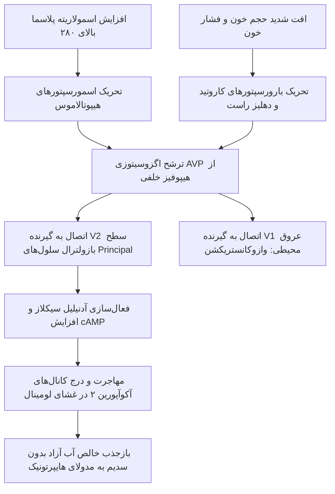
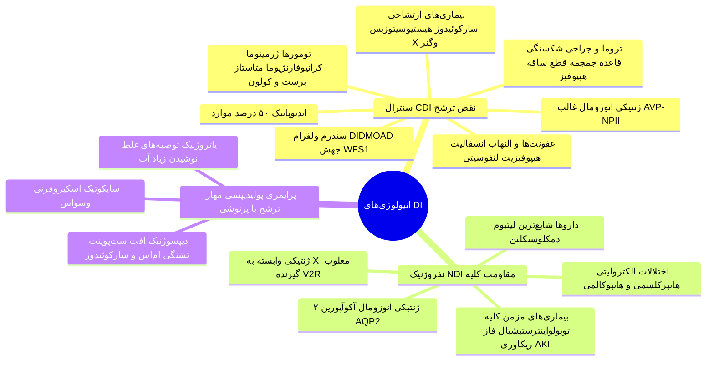
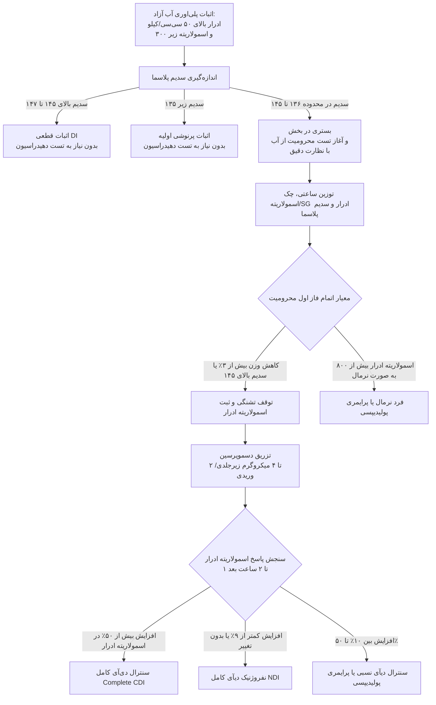
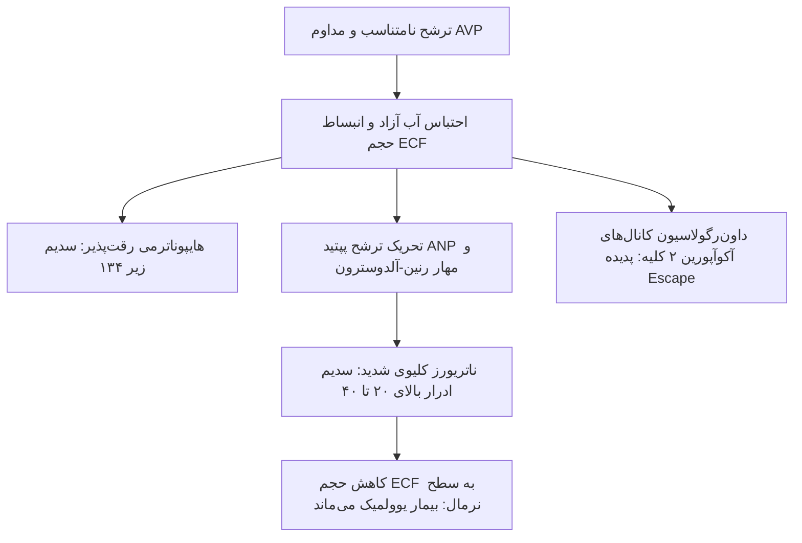
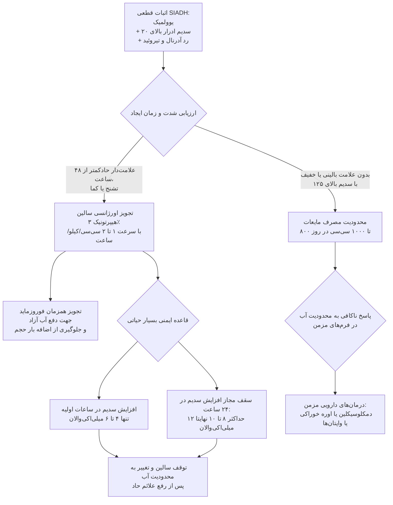

# اختلالات هیپوفیز خلفی (Posterior Pituitary)

## ۱. امبریولوژی، آناتومی و فیزیولوژی هورمون‌های هیپوفیز خلفی

> [!abstract] هیپوفیز خلفی (Neurohypophysis)
> ساختار نوروژنیک با منشأ جنینی از **کف بطن سوم مغز**؛ شامل آکسون‌ها و پایانه‌های عصبی نورون‌های درشت‌سلولی (Magnocellular) که جسم سلولی آن‌ها در هسته‌های **سوپرااپتیک (SON)** و **پاراونتریکولار (PVN)** هیپوتالاموس قرار دارد. هیپوفیز خلفی غده ترشحی حقیقی نیست، بلکه **محل ذخیره و رهایش اگزوسیتوزی** هورمون‌ها است.

### مقایسه هورمون‌های سنتزشده در هیپوتالاموس و ذخیره‌شده در هیپوفیز خلفی

| هورمون                           | هسته غالب سازنده              | ساختار شیمیایی                                         | رسپتورها و مکانیسم                                                       | عملکرد بیولوژیک اصلی                                                                             |
| :------------------------------- | :---------------------------- | :----------------------------------------------------- | :----------------------------------------------------------------------- | :----------------------------------------------------------------------------------------------- |
| **آرژنین وازوپرسین (AVP / ADH)** | هسته سوپرااپتیک (**SON**)     | پپتید حلقوی ۹ اسیدآمینه‌ای دارای پل دی‌سولفیدی         | نوع **V2** (در کلیه؛ Gs-cAMP) نوع **V1a** (در عروق؛ Gq-IP3/DAG) | بازجذب آب آزاد کلیوی عبر آکوآپورین ۲؛ انقباض عروق محیطی در شوک و افت شدید حجم                    |
| **اکسیتوسین (Oxytocin / OT)**    | هسته پاراونتریکولار (**PVN**) | پپتید ۹ اسیدآمینه‌ای (تفاوت در اسیدآمینه ۳ و ۸ با AVP) | گیرنده GPCR سطح میومتر و سلول‌های میواپیتلیال                            | انقباض میومتر رحم در زایمان؛ انقباض سلول‌های میواپیتلیال پستان و القای خروج شیر (*Milk Letdown*) |

> [!important] تله تستی فرآیند سنتز هورمونی
> وازوپرسین به صورت یک پلی‌پپتید پیش‌ساز مشترک (Precursor) بزرگ شامل سه جزء **AVP + Neurophysin II + Copeptin** سنتز شده، در وزیکول‌های نوروسکرتوری بسته‌بندی و حین انتقال آکسونی به فرم فعال بریده می‌شود. اندازه‌گیری **کوپپتین (Copeptin)** یک مارکر سرمی پایدار و معادل ترشح AVP است.

---

## ۲. مکانیسم ترشح، تنظیم اسمزی و گیرنده‌های هومئوستاز آب

```mermaid
flowchart TD
    HyperOsm[افزایش اسمولاریته پلاسما بالای ۲۸۰] --> OsmRec[تحریک اسمورسپتورهای هیپوتالاموس]
    HypoVol[افت شدید حجم خون و فشار خون] --> BaroRec[تحریک بارورسپتورهای کاروتید و دهلیز راست]
    
    OsmRec --> ReleaseAVP[ترشح اگزوسیتوزی AVP از هیپوفیز خلفی]
    BaroRec --> ReleaseAVP
    
    ReleaseAVP --> V2Action[اتصال به گیرنده V2 سطح بازولترال سلول‌های Principal]
    ReleaseAVP --> V1Action[اتصال به گیرنده V1 عروق محیطی: وازوکانستریکشن]
    
    V2Action --> AdenylCyc[فعال‌سازی آدنیلیل سیکلاز و افزایش cAMP]
    AdenylCyc --> Transloc[مهاجرت و درج کانال‌های آکوآپورین ۲ در غشای لومینال]
    Transloc --> WaterReabs[بازجذب خالص آب آزاد بدون سدیم به مدولای هایپرتونیک]
```

### فرمول محاسباتی اسمولاریته و آستانه‌های فیزیولوژیک

* **اسمولاریته توتال پلاسما:**

$$\text{Plasma Osmolality (mOsm/kg)} = 2 \times [\text{Na}^+] + \frac{\text{Glucose}}{18} + \frac{\text{BUN}}{2.8}$$

* **اسمولاریته مؤثر (Effective Osmolality / Tonicity):** حاصل $2 \times [\text{Na}^+]$؛ زیرا اوره آزادانه از غشاها عبور کرده و تونیسیته ایجاد نمی‌کند. گلوکز نیز فقط در غیاب انسولین یا هایپرگلیسمی شدید مؤثر است.
* **تنظیم اسمزی AVP:**
  * بسیار حساس به نوسانات غلظت سدیم و مانیتول؛ کاملاً **ناحساس به اوره و گلوکز نرمال**.
  * **آستانه ترشح AVP (Osmotic Threshold):** حدود **280 mOsm/kg** (معادل سدیم خون 135 mEq/L).
  * در غیاب AVP: دفع ادرار رقیق با اسمولاریته تا **50 mOsm/kg** (وزن مخصوص $\approx 1.000$) با حجم ادرار تا **20 L/day** ($0.2\text{ mL/kg/min}$).
  * در حداکثر ترشح AVP: ادرار کاملاً تغلیظ‌شده تا **1200 mOsm/kg** با حجم خروجی حداقل تا $0.35\text{ mL/min}$.
* **تنظیم اسمزی تشنگی (Thirst Osmostat):**
  * واقع در ناحیه قدامی-داخلی هیپوتالاموس (**Anteromedial Hypothalamus**).
  * آستانه تشنگی **۵٪ بالاتر** از آستانه ترشح وازوپرسین یعنی در حدود **285 تا 290 mOsm/kg** تنظیم شده است.
  * *علت فیزیولوژیک:* تشنگی زمانی فعال می‌شود که ترشح AVP به تنهایی برای مهار کم‌آبی کافی نبوده باشد؛ لذا تا زمان دسترسی فرد به آب و هوشیاری، دهیدراسیون بالینی رخ نمی‌دهد.

---

## ۳. دیابت بی‌مزه (Diabetes Insipidus - DI): طبقه‌بندی و اتیولوژی

> [!abstract] دیابت بی‌مزه (DI)
> سندرم دفع حجم بالای ادرار رقیق ناشی از فقدان ترشح AVP یا مقاومت کلیوی به عملکرد آن؛ وجه تسمیه *Insipidus* (بی‌مزه) به علت فقدان گلوکز و کمبود نمک در ادرار در مقایسه با *Mellitus* (شیرین) است.

### تعاریف کمی پلی‌اوری
* حجم ادرار ۲۴ ساعته **بیش از 50 mL/kg/day** (معادل بیش از ۳۵۰۰ سی‌سی در فرد ۷۰ کیلوگرمی).
* **افتراق ادرار:** اگر اسمولاریته ادرار $>300\text{ mOsm/kg}$ باشد ⇦ **دیورز اسموتیک/املاح (Solute Diuresis)** ناشی از گلوکزوری یا مانیتول. اگر $<300\text{ mOsm/kg}$ (اسپسیفیک گرویتی $<1.010$) باشد ⇦ **دیورز آب آزاد (Water Diuresis)** به نفع DI یا پرنوشی.

```mermaid
mindmap
  root((اتیولوژی‌های DI))
    سنترال CDI نقص ترشح
      ایدیوپاتیک ۵۰ درصد موارد
      تومورها ژرمینوما کرانیوفارنژیوما متاستاز برست و کولون
      تروما و جراحی شکستگی قاعده جمجمه قطع ساقه هیپوفیز
      عفونت‌ها و التهاب انسفالیت هیپوفیزیت لنفوسیتی
      بیماری‌های ارتشاحی سارکوئیدوز هیستیوسیتوزیس X وگنر
      ژنتیکی اتوزومال غالب AVP-NPII
      سندرم ولفرام DIDMOAD جهش WFS1
    نفروژنیک NDI مقاومت کلیه
      داروها شایع‌ترین لیتیوم دمکلوسیکلین
      اختلالات الکترولیتی هایپرکلسمی و هایپوکالمی
      بیماری‌های مزمن کلیه توبولواینترستیشیال فاز ریکاوری AKI
      ژنتیکی وابسته به X مغلوب گیرنده V2R
      ژنتیکی اتوزومال آکوآپورین ۲ AQP2
    پرایمری پولیدیپسی مهار ترشح با پرنوشی
      دیپسوژنیک افت ست‌پوینت تشنگی ام‌‌اس و سارکوئیدوز
      سایکوتیک اسکیزوفرنی وسواس
      یاتروژنیک توصیه‌های غلط نوشیدن زیاد آب
```

### علل اختصاصی و نکات آزمونی DI
1. **سندرم ولفرام (Wolfram Syndrome):** نقص ژنتیکی اتوزومال مغلوب ژن *WFS1* با تتراد بالینی **DIDMOAD**:
   * **DI:** دیابت بی‌مزه
   * **DM:** دیابت ملیتوس شیرین
   * **OA:** آتروفی عصب اپتیک (Optic Atrophy) و کوری تدریجی
   * **D:** کری حسی-عصبی (Neural Deafness)
2. **نفروژنیک DI ناشی از شستشوی گرادیان (Washout Effect):** در فاز ریکاوری نارسایی حاد کلیه (AKI) به علت از بین رفتن موقت هیپرتونیسیته مدولا رخ داده و ظرف ۲۴ تا ۴۸ ساعت خودبه‌خود برطرف می‌شود.
3. **دیابت بی‌مزه بارداری (Gestational DI):** ناشی از تولید آنزیم جفتی وازوپرسیناز (*Vasopressinase*) که AVP درون‌زاد را تخریب می‌کند؛ به داروی دسموپرسین مقاوم به تخریب آنزیمی پاسخ می‌دهد.

---

## ۴. مقایسه بالینی انواع پلی‌اوری و الگوریتم‌های تشخیصی

| ویژگی بالینی / پارامتر | دیابت بی‌مزه سنترال (CDI) | دیابت بی‌مزه نفروژنیک (NDI) | پرنوشی اولیه (Primary Polydipsia) |
| :--- | :--- | :--- | :--- |
| **نحوه شروع علائم** | **کاملاً ناگهانی و صاعقه‌آسا (Abrupt)** | تدریجی تا متوسط | تدریجی و متغیر، همبسته با استرس |
| **تمایل به مایعات** | **علاقه شدید به آب یخ و مایعات منجمد** | متغیر | متغیر |
| **ناکچوری و شب‌ادراری** | **شدید و مکرر؛ بیمار کنار دستشویی می‌خوابد** | شدید | **حداقل یا غایب (عدم بیداری در طول شب)** |
| **سطح سدیم پایه پلاسما** | تمایل به بالا (بیش از ۱۴۰ تا ۱۴۲) | تمایل به بالا | **تمایل به پایین (کمتر از ۱۳۵ تا ۱۳۷)** |
| **اسمولاریته ادرار پایه** | بسیار پایین ($<150\text{ mOsm/kg}$) | بسیار پایین ($<150\text{ mOsm/kg}$) | متغیر (معمولاً پایین) |
| **برایت اسپات در MRI** | **همواره غایب یا کوچک (Absent)** | معمولاً غایب | **همواره حاضر و طبیعی (Present)** |

### پروتکل تست محرومیت از آب (Water Deprivation Test)

```mermaid
flowchart TD
    StartPoly[اثبات پلی‌اوری آب آزاد:<br>ادرار بالای ۵۰ سی‌سی/کیلو<br>و اسمولاریته زیر ۳۰۰] --> PreCheck[اندازه‌گیری سدیم پلاسما]
    
    PreCheck -->|سدیم بالای ۱۴۵ تا ۱۴۷| DefiniteDI[اثبات قطعی DI<br>بدون نیاز به تست دهیدراسیون]
    PreCheck -->|سدیم زیر ۱۳۵| DefinitePP[اثبات پرنوشی اولیه<br>بدون نیاز به تست دهیدراسیون]
    PreCheck -->|سدیم در محدوده ۱۳۶ تا ۱۴۵| InHospTest[بستری در بخش<br>و آغاز تست محرومیت از آب<br>با نظارت دقیق]
    
    InHospTest --> HourlyMon[توزین ساعتی، چک اسمولاریته/SG ادرار و سدیم پلاسما]
    
    HourlyMon --> EndPoints{معیار اتمام فاز اول محرومیت}
    EndPoints -->|کاهش وزن بیش از ۳٪ یا سدیم بالای ۱۴۵| Stop1[توقف تشنگی و ثبت اسمولاریته ادرار]
    EndPoints -->|اسمولاریته ادرار بیش از ۸۰۰ به صورت نرمال| StopNorm[فرد نرمال یا پرایمری پولیدیپسی]
    
    Stop1 --> DesmoInject[تزریق دسموپرسین<br>۲ تا ۴ میکروگرم زیرجلدی/وریدی]
    
    DesmoInject --> PostDesmoEval{سنجش پاسخ اسمولاریته ادرار<br>۱ تا ۲ ساعت بعد}
    PostDesmoEval -->|افزایش بیش از ۵۰٪ در اسمولاریته ادرار| CentralDiag[سنترال دی‌آی کامل Complete CDI]
    PostDesmoEval -->|افزایش کمتر از ۹٪ یا بدون تغییر| NephroDiag[نفروژنیک دیآی کامل NDI]
    PostDesmoEval -->|افزایش بین ۱۰٪ تا ۵۰٪| PartialDiag[سنترال دیآی نسبی یا پرایمری پولیدیپسی]
```

> [!critical] تله طلایی در تفسیر تست دهیدراسیون
> * در فرد سالم، محرومیت از آب اسمولاریته ادرار را به حداکثر فیزیولوژیک ($>800\text{ to }1200\text{ mOsm/kg}$) می‌رساند؛ لذا پس از تزریق دسموپرسین، **اسمولاریته ادرار افزایش اضافه‌تری نشان نمی‌دهد ($<9\%$)**.
> * پاسخ دراماتیک ($>50\%$) پس از دسموپرسین **انحصاراً در سنترال دیآی کامل** رخ می‌دهد.

### ارزش تصویربرداری MRI هیپوفیز
* **Bright Spot طبیعی:** در تصاویر T1 ساجیتال هیپوفیز خلفی به صورت یک نقطه درخشان با سیگنال بالا (به علت فسفولیپیدها و وزیکول‌های پپتیدی) دیده می‌شود.
* **تفسیر تشخیصی:**
  * دیدن برایت اسپات ⇦ **سنترال دیآی را کاملاً رد می‌کند** و قویاً به نفع پرنوشی اولیه است.
  * عدم رویت برایت اسپات ⇦ تشخیصی نیست (در برخی افراد سالم و سندرم سلا خالی نیز دیده نمی‌شود).
  * وجود **ضخامت ساقه هیپوفیز (Infundibulum)** در نماهای کرونال نشان‌دهنده بیماری‌های ارگانیک نظیر ژرمینوما، لنفوسیتیک هیپوفیزیت یا سارکوئیدوز است.

---

## ۵. رویکرد جامع درمانی دیابت بی‌مزه

### ۱. درمان دیابت بی‌مزه سنترال (CDI)
* **داروی انتخابی:** **دسموپرسین (DDAVP)**، آنالوگ صناعی انتخابی گیرنده V2 (فاقد اثرات وازوکانستریکتور V1a و نیمه‌عمر طولانی).
* **اشکال دارویی:**
  * اسپری بینی (Nasal Spray): دوز معمول ۱۰ تا ۲۰ میکروگرم روزانه (۱ تا ۲ پاف منقسم).
  * قرص خوراکی یا پودر حل‌شونده زیرزبانی (**Melt**): مناسب برای موارد پس از جراحی‌های ترانس‌اسفنوئیدال بینی به دلیل تورم مخاط.
  * فرم تزریقی آمپول (IV / SC).
* **تله مهلک مصرف:** خطر **مسمومیت با آب و هایپوناترمی حاد** در صورت مصرف دوز مازاد همزمان با پرنوشی عادتی؛ بیمار باید یاد بگیرد دوز بعدی را تنها با بازگشت مختصر علائم پلی‌اوری مصرف کند.

### ۲. درمان دیابت بی‌مزه نفروژنیک (NDI)
* دسموپرسین در این بیماران بی‌اثر است.
* **رژیم غذایی:** رژیم کم‌نمک (Low Sodium) و کم‌پروتئین جهت کاهش بار اسمولار خروجی به دیستال نفرون.
* **دیورتیک‌های تیازیدی (هیدروکلروتیازید ۲۵ میلی‌گرم روزانه):**
  * *پارادوکس درمانی تیازید:* با مهار هم‌انتقال‌دهنده NaCl در توبول دیستال، اتلاف خفیف سدیم و انقباض حجم ایجاد می‌کند ⇦ تحریک بازجذب سدیم و آب در **توبول پروگزیمال** ⇦ تحویل حجم کمتری از مایع به توبول‌های انتهایی غیرعملکردی و افت چشمگیر پلی‌اوری.
* **آمیلوراید (Amiloride):** **داروی اختصاصی انتخابی در نفروژنیک DI ناشی از لیتیوم**؛ با مسدود کردن کانال‌های ENaC در غشای لومینال مانع از ورود لیتیوم به داخل سلول‌های Principal می‌شود.
* **ایندومتاسین و NSAIDs:** مهار سنتز پروستاگلاندین‌های کلیوی (پروستاگلاندین‌ها آنتاگونیست طبیعی عملکرد وازوپرسین در کلیه هستند؛ مهار آن‌ها قدرت تغلیظ ادرار را افزایش می‌دهد).

### ۳. درمان پرنوشی اولیه (Primary Polydipsia)
* تجویز دسموپرسین **اکیداً ممنوع** است (ایجاد هایپوناترمی شدید کشنده و کما ظرف ۲۴ تا ۴۸ ساعت).
* درمان صرفاً شناختی، محدودیت فیزیکی مصرف آب و ارجاع به روان‌پزشکی است.

---

## ۶. سندرم ترشح نامتناسب هورمون آنتی‌دیورتیک (SIADH / SIAD)

> [!abstract] سندرم SIADH (یا SIAD)
> رهایش غیرفیزیولوژیک و خودمختار AVP علیرغم هایپواسمولاریته و نرمال بودن حجم خون پلاسما؛ منجر به بازجذب آب، انبساط حجم، اتلاف ثانویه سدیم ادراری و هایپوناترمی رقت‌پذیر (Dilutional Hyponatremia).

### پاتوفیزیولوژی پدیده فرار از وازوپرسین (Vasopressin Escape)

```mermaid
flowchart TD
    AVPHigh[ترشح نامتناسب و مداوم AVP] --> WaterRet[احتباس آب آزاد و انبساط حجم ECF]
    WaterRet --> Dilution[هایپوناترمی رقت‌پذیر: سدیم زیر ۱۳۴]
    WaterRet --> Stretch[تحریک ترشح پپتید ANP و مهار رنین-آلدوسترون]
    Stretch --> Natriuresis[ناتریورز کلیوی شدید: سدیم ادرار بالای ۲۰ تا ۴۰]
    Natriuresis --> VolNorm[کاهش حجم ECF به سطح نرمال: بیمار یوولمیک می‌ماند]
    WaterRet --> DownReg[داون‌رگولاسیون کانال‌های آکوآپورین ۲ کلیه: پدیده Escape]
```

### اتولوژی‌های شایع SIADH
1. **بدخیمی‌ها (تولید اکتوپیک):** کارسینومای سلول کوچک ریه (**SCLC / Bronchogenic Carcinoma**)، مزوتلیوما، تیموما، کارسینوم دوئودنوم و پانکراس.
2. **بیماری‌های ریوی غیربدخیم:** پنومونی باکتریال و ویروسی، سل ریوی، آبسه ریه، ونتیلاسیون با فشار مثبت (PEEP)، COPD.
3. **اختلالات سیستم عصبی مرکزی:** مننژیت، انسفالیت، آبسه مغزی، تروما، خونریزی ساب‌آراکنوئید (SAH)، پسیکوز حاد.
4. **علل دارویی پرتکرار:**
   * تحریک ترشح مغزی: نیکوتین، فنوتیازین‌ها، ضدافسردگی‌های سه‌حلقه‌ای (TCA)، مهارکننده‌های انتخابی بازجذب سروتونین (**SSRI**).
   * تشدید اثر در کلیه: دسموپرسین، اکسیتوسین، NSAIDs.
   * اثرات مختلط: کاربامازپین، اگزکاربازپین، کلرپروپامید، سیکلوفسفامید، اکستازی (MDMA)، مهارکننده‌های پمپ پروتون (امپرازول).
5. **سایر علل:** ورزش سنگین استقامتی طولانی (دوی ماراتن)، ایدز (HIV).

### تظاهرات بالینی و خطرات مغزی هایپوناترمی
* **عامل تعیین‌کننده شدت علائم:** همبسته با **سرعت افت سدیم** و نه فقط عدد مطلق آن.
* **علائم خفیف (سدیم ۱۲۵ تا ۱۳۰):** سردرد، تهوع، بی‌اشتهایی، اختلالات شناختی خفیف.
* **علائم حاد و شدید (سدیم $<120$ یا افت سریع طی کمتر از ۴۸ ساعت):** ادم حاد سلول‌های مغزی (افزایش آب مغز بیش از ۵ تا ۱۰ درصد ناسازگار با حیات است) ⇦ استفراغ جهنده، گیجی، تحریک‌پذیری، تشنج گراند مال، کوما، هرنیاسیون تنکوس و ساقه مغز و مرگ.

---

## ۷. تشخیص افتراقی هایپوناترمی و معیارهای تشخیصی SIADH

### معیارهای استاندارد تشخیصی SIADH
1. هایپوناترمی واقعی همراه با هایپواسمولاریته پلاسما ($\text{Na} < 134\text{ mEq/L}$ و $\text{Osm} < 280\text{ mOsm/kg}$).
2. تغلیظ نامتناسب ادرار ($\text{Urine Osm} > 100\text{ mOsm/kg}$، معمولاً بالای ۳۰۰ و وزن مخصوص $>1.005$ یا $1.020$).
3. **وضعیت حجم کاملاً یُوولمیک (Euvolemic):** عدم وجود ادم محیطی، آسیت، دهیدراسیون یا افت فشار خون وضعیتی.
4. **دفع بالای سدیم ادراری:** غلظت سدیم ادرار $\text{U}_{\text{Na}} > 20\text{ to }40\text{ mEq/L}$ در حضور دریافت نرمال نمک و آب.
5. **رد اختلالات مداخله‌گر:** کارکرد طبیعی غده تیروئید (رد کم‌کاری شدید)، کارکرد طبیعی محور آدرنال (رد نارسایی آدرنال/کمبود کورتیزول)، و عملکرد نرمال کلیه (بی‌یو‌ان و کراتینین نرمال یا حتی کمتر از نرمال به علت همودایلوشن).

### جدول افتراق جامع انواع هایپوناترمی بر اساس وضعیت بالینی حجم (ECFV)

| پارامتر بالینی و آزمایشگاهی | تیپ ۱: هایپرولمیک (Hypervolemic) | تیپ ۲: هایپوولمیک (Hypovolemic) | تیپ ۳: یوولمیک اندوکرین (Endocrine Euvolemic) | سندروم SIADH (یوولمیک حقیقی) |
| :--- | :--- | :--- | :--- | :--- |
| **اتیولوژی‌های شاخص** | سیروز، نارسایی احتقانی قلب (CHF)، سندرم نفروتیک | اسهال، استفراغ شدید، تعریق فراوان، خونریزی | کمبود گلوکوکورتیکوئید (آدیسون)، هایپوتیروئیدی پیشرفته | بدخیمی ریه (SCLC)، عفونت ریه، ضایعات CNS، داروها |
| **ادم محیطی و آسیت** | **دارد (ادم گوده‌گذار و آسیت)** | ندارد | ندارد | **ندارد (کاملاً فاقد ادم)** |
| **فشار خون وضعیتی (Orthostasis)** | ممکن است داشته باشد | **شایع و مثبت است** | ممکن است داشته باشد | **منفی (همودینامیک نرمال)** |
| **BUN و کراتینین** | بالا یا در محدوده بالای نرمال | بالا (آزوتمی پره‌رنال) | نرمال یا متمایل به پایین | **پایین یا در حد پایین نرمال** |
| **اسید اوریک سرم** | تمایل به بالا | تمایل به بالا | تمایل به پایین | **پایین (هایپوریسمی به علت دایلوشن)** |
| **سطح کورتیزول سرم** | نرمال یا بالا | نرمال یا بالا | **پایین** | **کاملاً نرمال** |
| **غلظت سدیم ادرار ($\text{U}_{\text{Na}}$)** | **پایین ($<20\text{ mEq/L}$)** | **پایین ($<20$)** در علل غیرکلیوی | بالا ($>20\text{ mEq/L}$) | **بالا ($>20\text{ to }40\text{ mEq/L}$)** |

---

## ۸. پروتکل درمانی گام‌به‌گام SIADH و تله سندرم دمیلینیزاسیون پونز

```mermaid
flowchart TD
    DiagSIADH[اثبات قطعی SIADH:<br>یوولمیک<br>+ سدیم ادرار بالای ۲۰<br>+ رد آدرنال و تیروئید] --> SeverityCheck{ارزیابی شدت و زمان ایجاد}
    
    SeverityCheck -->|بدون علامت بالینی یا خفیف<br>با سدیم بالای ۱۲۵| AsymptoPlan[محدودیت مصرف مایعات<br>۸۰۰ تا ۱۰۰۰ سی‌سی در روز]
    SeverityCheck -->|علامت‌دار حادکمتر از ۴۸ ساعت،<br>تشنج یا کما| EmergentPlan[تجویز اورژانسی سالین هیپرتونیک ۳٪<br>با سرعت ۱ تا ۲ سی‌سی/کیلو/ساعت]
    
    EmergentPlan --> AddFuro[تجویز همزمان فوروزماید<br>جهت دفع آب آزاد<br>و جلوگیری از اضافه بار حجم]
    
    EmergentPlan --> SpeedLimit{قاعده ایمنی بسیار حیاتی}
    SpeedLimit --> Rule1[افزایش سدیم در ساعات اولیه<br>تنها ۴ تا ۶ میلی‌اکی‌والان]
    SpeedLimit --> Rule2[سقف مجاز افزایش سدیم در ۲۴ ساعت:<br>حداکثر ۸ تا ۱۰ نهایتا ۱۲ میلی‌اکی‌والان]
    
    Rule1 & Rule2 --> SwitchToRestr[توقف سالین و تغییر به محدودیت آب<br>پس از رفع علائم حاد]
    
    AsymptoPlan --> Refractory{پاسخ ناکافی به محدودیت آب<br>در فرم‌های مزمن}
    Refractory --> MedOption[درمان‌های دارویی مزمن:<br>دمکلوسیکلین یا اوره خوراکی یا واپتان‌ها]
```

### پروتکل تصحیح سدیم و پیشگیری از Central Pontine Myelinolysis (CPM)
* **پاتولوژی CPM (سندرم دمیلیناسیون اسموتیک):** در هایپوناترمی مزمن، سلول‌های مغز اسمولیت‌های داخل‌سلولی را خارج کرده‌اند. اگر سدیم پلاسما **خیلی سریع** بالا برده شود، آب به سرعت از نورون‌ها خارج شده و سلول‌های الیگودندروسیت دچار چروکیدگی و دمیلینیزاسیون در ناحیه پل مغزی (Pons) می‌شوند.
* **تظاهرات بالینی CPM:** کوادری‌پلژی فلج‌کننده، دیس‌آرتری، دیسفاژی، آتاکسی، اختلال حرکات خارج چشمی و زندگی نباتی غیرقابل بازگشت.
* **قانون طلایی اصلاح:**
  1. سرعت افزایش سدیم در ۲۴ ساعت اول **نباید از $8\text{ to }10\text{ mEq/L}$ (سقف مطلق: $12\text{ mEq/L/day}$)** فراتر رود.
  2. در ساعات ابتدایی افزایش تنها **۴ تا ۶ واحد** برای برطرف کردن تشنج و کما کاملاً کافی است.

### فارماکوتراپی در SIADH مزمن
* **دمکلوسیکلین (Demeclocycline):** دوز ۱۵۰ تا ۳۰۰ میلی‌گرم سه تا چهار بار در روز؛ القای مقاومت در توبول کلیوی نسبت به AVP (توسعه دیابت بی‌مزه نفروژنیک دارویی کنترل‌شده).
* **اوره خوراکی (Urea):** دوز ۱۵ تا ۶۰ گرم روزانه؛ القای دیورز اسموتیک املاح.
* **آنتاگونیست‌های گیرنده وازوپرسین (Vaptans):**
  * **کونیواپتان (Conivaptan):** آنتاگونیست دوگانه گیرنده‌های V1a/V2 به فرم وریدی کوتاه‌مدت بیمارستانی.
  * **تولواپتان (Tolvaptan):** آنتاگونیست انتخابی خوراکی گیرنده V2.
* **فلودروکورتیزون (Fludrocortisone):** دوز ۰.۰۵ تا ۰.۲ میلی‌گرم دو بار در روز در موارد مقاوم مزمن.

---

## ۹. تابلوی جامع مقایسه‌ای و مرور تله‌های آزمونی

| سناریوی بالینی | سدیم پلاسما | اسمولاریته ادرار | اسمولاریته پلاسما | اقدام بالینی و درمانی صحیح |
| :--- | :---: | :---: | :---: | :--- |
| **مرد جوان پس از تصادف با حجم ادرار ۱۰ لیتر در روز و سدیم ۱۴۵** | $>145\text{ mEq/L}$ | $<150\text{ mOsm/kg}$ | $>295\text{ mOsm/kg}$ | اثبات CDI ناشی از تروما؛ **تجویز دسموپرسین (DDAVP)** و هیدراسیون. |
| **بیمار دوتباری تحت درمان با لیتیوم با ادرار رقیق و بی‌اثر بودن دسموپرسین** | ۱۴۰ تا ۱۴۴ | $<200\text{ mOsm/kg}$ | $>290\text{ mOsm/kg}$ | نفروژنیک DI دارویی؛ **تجویز آمیلوراید** + رژیم کم‌نمک/کم‌پروتئین. |
| **زن مبتلا به اسکیزوفرنی با پرنوشی، سدیم ۱۲۸ و ادرار رقیق** | $<130\text{ mEq/L}$ | $<100\text{ mOsm/kg}$ | $<275\text{ mOsm/kg}$ | پرنوشی اولیه سایکوژنیک؛ **محدودیت آب (دسموپرسین اکیداً ممنوع)**. |
| **بیمار مبتلا به سرطان ریه SCLC با سدیم ۱۱۵، سردرد، تهوع و بدون ادم** | $<118\text{ mEq/L}$ | $>400\text{ mOsm/kg}$ | $<250\text{ mOsm/kg}$ | تشخیص SIADH حاد؛ **سالین هیپرتونیک ۳٪** با پایش سرعت زیر $10\text{ mEq/L/day}$. |
| **پلی‌اوری با سدیم نرمال و اسمولاریته ادرار بالای ۵۰۰** | نرمال | $>500\text{ mOsm/kg}$ | نرمال یا بالا | دیورز املاح (Solute Diuresis)؛ **بررسی گلوکزوری ناشی از دیابت قندی**. |
