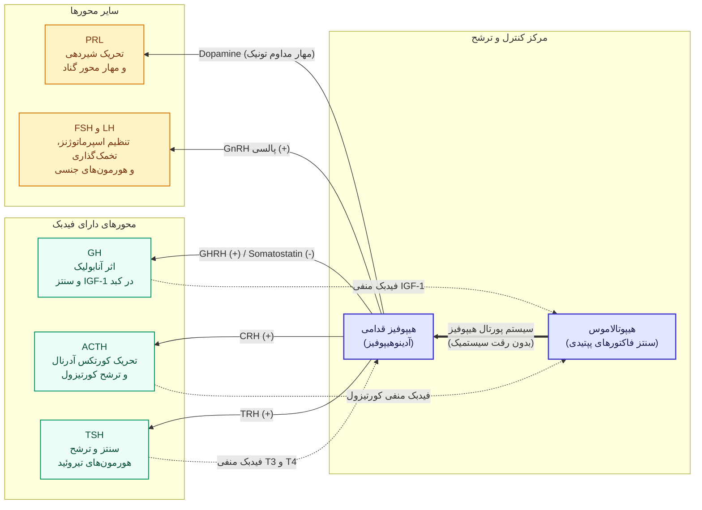
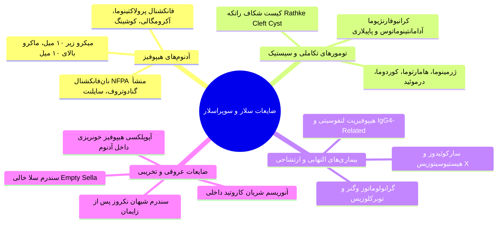
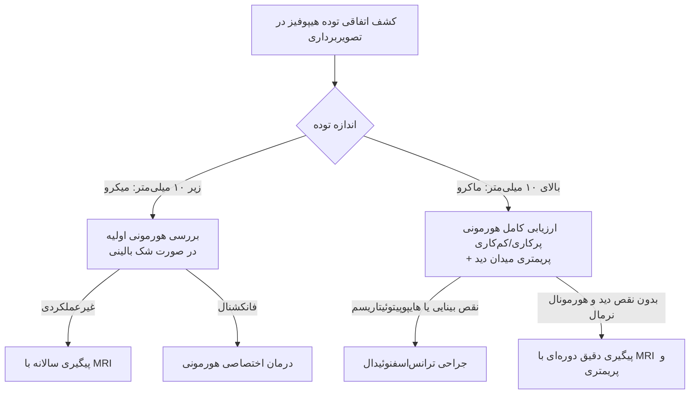
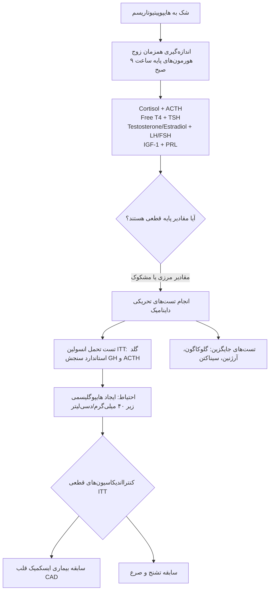
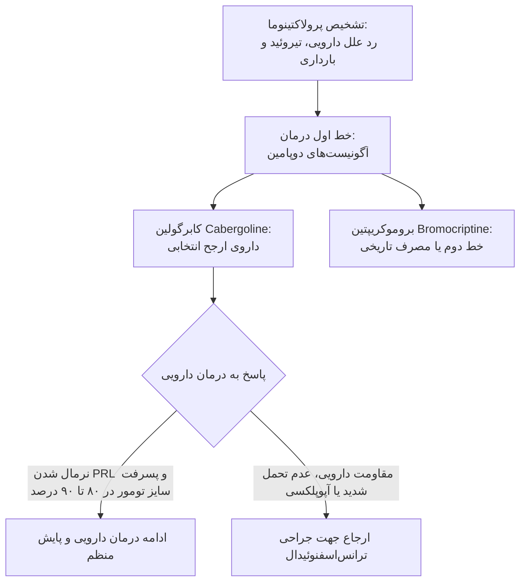
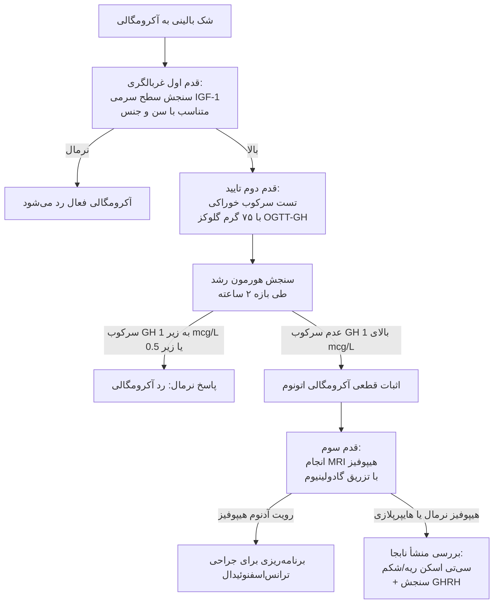

# اختلالات هیپوفیز قدامی و هیپوتالاموس

## ۱. آناتومی، امبریولوژی و فیزیولوژی محور هیپوتالاموس-هیپوفیز

> [!abstract] غده هیپوفیز (Master Gland)
> ساختار بیضی‌شکل با وزن حدود **600 mg** واقع در حفره استخوانی **Sella Turcica** در زیر دیافراگم سلا؛ ابعاد نرمال: قدامی-خلفی 10.3 mm، ارتفاع 6.1 mm، عرض 13.6 mm و حجم $466.8\text{ mm}^3$. مجاورت‌های حیاتی: بالا با **کییاسمای اپتیک**، طرفین با **سینوس کاورنوس** (شامل کاروتید داخلی و اعصاب مغزی III، IV، VI، V1 و V2) و پایین با **سینوس اسفنوئید**.

### تفکیک امبریولوژی و رده‌های سلولی هیپوفیز قدامی

| رده سلولی هیپوفیز قدامی | درصد سلول‌ها | رنگ‌پذیری بافتی | هورمون مترشحه | فاکتور محرک هیپوتالاموسی | فاکتور مهارکننده هیپوتالاموسی |
| :--- | :---: | :--- | :--- | :--- | :--- |
| **سوماتوتروف (Somatotroph)** | **50%** | اسیدوفیل | **GH** (هورمون رشد) | **GHRH** و گرلین | **سوماتوستاتین** |
| **لاکتوتروف (Lactotroph)** | **15 تا 20%** | اسیدوفیل | **PRL** (پرولاکتین) | TRH و VIP | **دوپامین (اثر مهاری تونیک غالب)** |
| **کورتیکوتروف (Corticotroph)** | **15 تا 20%** | بازوفیل (PAS+) | **ACTH** (از ژن POMC) | **CRH** و AVP | گلوکوکورتیکوئیدها (فیدبک منفی) |
| **گنادوتروف (Gonadotroph)** | **15%** | بازوفیل | **FSH و LH** | **GnRH** | استروئیدهای جنسی و اینهیبین |
| **تیروتروف (Thyrotroph)** | **5%** | بازوفیل | **TSH** | **TRH** (تری‌پپتید) | سوماتوستاتین و دوپامین |

### ویژگی‌های عملکردی شبکه پورتال هیپوتالاموس-هیپوفیز
1. **شبکه مویرگی پورتال (Hypophyseal Portal System):** خون وریدی مویرگ‌های هیپوتالاموس مستقیماً به سینوزوئیدهای هیپوفیز قدامی تخلیه شده و مانع از **رقیق شدن سیستمیک (Systemic Dilution)** پپتیدهای هیپوتالاموسی می‌شود.
2. **پدیده تقویت غلظت (Amplification):** غلظت‌های بسیار ناچیز فمتو و پیکومولار هیپوتالاموسی (نظیر CRH حدود 0.77 تا 2.5 pmol/L) به غلظت‌های نانومولار هیپوفیزی (نظیر ACTH حدود 2.2 تا 13.3 pmol/L) تبدیل می‌شوند.
3. **ریتم‌های بیولوژیک ترشح هورمونی:**
   * **اولترادین (Ultradian):** پالس‌های مکرر زیر ۲۴ ساعت (پالس‌های مکرر GnRH و GH).
   * **سیرکادین (Circadian):** ریتم شبانه‌روزی ۲۴ ساعته؛ قله ترشح صبحگاهی **ACTH و کورتیزول** و پیک شبانه **GH و ملاتونین**.
   * **اینفرادین (Infradian):** چرخه‌های طولانی‌تر از ۲۴ ساعت نظیر سیکل قاعدگی ماهانه زنان.



---

## ۲. ضایعات فضاگیر هیپوتالاموس و هیپوفیز (Mass Lesions)

> [!important] چهار سوال بنیادین در مواجهه با توده‌های سلار و سوپراسلار
> 1. ماهیت پاتولوژیک ضایعه چیست (آدنوم، کیست، بدخیمی یا ضایعه گرانولوماتوز)؟  
> 2. آیا هایپرفانکشن و ترشح مازاد هورمونی وجود دارد؟  
> 3. آیا نارسایی و کم‌کاری یک یا چند محور هیپوفیز (Hypopituitarism) ایجاد شده است؟  
> 4. آیا درگیری کییاسمای اپتیک (میدان بینایی) یا اعصاب جمجمه‌ای رخ داده است؟

### علائم اختصاصی توده‌های هیپوتالاموس
* **تریاد بالینی کلاسیک تومورهای هیپوتالاموس:**
  1. نارسایی هیپوفیز قدامی همراه با **هایپرپرولاکتینمی** (به علت قطع مسیر مهاری دوپامین ناشی از Stalk Effect).
  2. **دیابت بی‌مزه (Diabetes Insipidus):** به علت تخریب نورون‌های وازوپرسیناز هسته‌های SON و PVN.
  3. **اختلالات بینایی:** فشار به کییاسما یا باندهای اپتیک.
* **سندرم‌های متابولیک هیپوتالاموسی:** بی‌ثباتی حرارتی و **هایپرترمی بدخیم** (تخریب مرکز ترمورگولاسیون)، وازوکانستریکشن متناقض، **هایپرفاژی و چاقی شدید هیپوتالاموسی** یا برعکس لاغری مفرط و تحلیل شدید (**Diencephalic Syndrome** در کودکان)، خواب‌آلودگی مفرط و اختلال خواب، زخم‌های فشاری و فرسایشی گوارشی (Cushing Ulcers) و آریتمی قلبی.

### انواع ضایعات فضاگیر بر اساس منشأ بافتی



### ویژگی‌های اختصاصی آدنوم‌های هیپوفیز
* **اپیدمیولوژی:** ۱۰٪ کل نئوپلاسم‌های داخل جمجمه؛ شیوع اتوپسی تا ۲۵٪ موارد (میکروآدنوم‌های بی‌علامت).
* **سایز:** **میکروآدنوم (<10 mm)**، **مزوآدنوم (10-20 mm)** و **ماکروآدنوم (>10 mm یا >20 mm)**.
* **اثرات فشاری موضعی (Local Mass Effects):**
  * **سردرد:** بسیار شایع؛ **هیچ همبستگی خطی با اندازه تومور ندارد** (میکروآدنوم می‌تواند سردرد شدید بدهد و ماکروآدنوم بدون سردرد باشد).
  * **اختلال میدان بینایی:** شایع‌ترین فرم **Bitemporal Hemianopia** به دلیل فشار از پایین به مرکز کییاسما. فرم‌های نادرتر شامل **Junctional Scotoma** (فشار به محل اتصال عصب اپتیک و کییاسما) و **Central Hemianopic Scotoma**.
  * **تهاجم به سینوس کاورنوس:** فلج اعصاب کرانیال III، IV و VI (دوبینی و افتادگی پلک) و اختلال حس شاخه‌های V1 و V2 عصب تری‌ژمینال.
  * **فرسایش کف سلا:** تخریب استخوان به سمت سینوس اسفنوئید و بروز **رینوره مایع مغزی-نخاعی (CSF Rhinorrhea)**.
  * **نمای رادیولوژیک Snowman (آدم‌برفی):** در تصاویر کرونال MRI هنگام فشردگی تومور در محل دیافراگم سلا و گسترش سوپراسلار.

### الگوریتم رویکرد به اینسیدنتالومای هیپوفیز (Pituitary Incidentaloma)



---

## ۳. اتیولوژی‌های ساختاری و التهابی نارسایی هیپوفیز

### ۱. کرانیوفارنژیوما (Craniopharyngioma)
* تومور خوش‌خیم ناشی از بقایای جنینی **شکاف راتکه (Rathke's Pouch)** در ناحیه سوپراسلار/سلار.
* **بروز دو قله‌ای (Bimodal):** قله اول در **دهه اول زندگی (کودکان)** و قله دوم در **دهه ۵ و ۶ (۵۰ تا ۶۰ سالگی)**.
* **افتراق پاتولوژیک:**
  * **فرم آدامانتینوماتوس (Adamantinomatous):** شایع در **کودکان**؛ توده سیستیک و سالید، حاوی مایع غنی از کلسترول و کریستال‌های چربی شبیه **روغن سوخته موتور (Machinery Oil)**، همراه با **کلسیفیکاسیون شدید** در سی‌تی‌اسکن.
  * **فرم پاپیلاری (Squamous Papillary):** شایع در **بزرگسالان**؛ توده‌های عمدتاً توپر و سالید، فاقد مایع چربی، کلسیفیکاسیون بسیار نادر و پروگنوز بالینی بهتر.
* **تظاهرات در کودکان:** توقف رشد قدی، بلوغ دیررس، سردرد، استفراغ و کاهش میدان بینایی.

### ۲. آپوپلکسی هیپوفیز (Pituitary Apoplexy)

> [!danger] اورژانس فوق‌حاد غدد: آپوپلکسی هیپوفیز
> خونریزی حاد یا انفارکتوس در بستر یک آدنوم هیپوفیز از قبل موجود (شیوع 0.6 تا 9.1 درصد آدنوم‌ها)؛ سبب انبساط ناگهانی توده و فشار مرگبار بر هیپوتالاموس و اعصاب بینایی می‌شود.

* **عوامل مستعدکننده:** پرفشاری خون (۲۶٪ موارد)، دیابت قندی، بارداری، ترومای سر، تست‌های داینامیک هیپوفیز (تزریق TRH/GnRH)، مصرف آگونیست‌های دوپامین (بروموکریپتین و کابرگولین) و جراحی قلب باز.
* **تظاهرات بالینی:** **سردرد رعدآسا و فوق‌العاده شدید ناگهانی ("بدترین سردرد طول عمر")**، افت ناگهانی دید، افتالموپلژی (فلج اعصاب ۳، ۴ و ۶)، افت فشار خون، کلاپس قلبی-عروقی و افت سریع هوشیاری.
* **مکانیسم کما و مرگ:** ناشی از حجم خونریزی نیست، بلکه حاصل **نارسایی فوق‌حاد آدرنال ثانویه (افت بحرانی کورتیزول)** است.
* **اقدام حیاتی و اورژانسی:** **تزریق فوری هیدروکورتیزون وریدی با دوز استرس + هیدراسیون پیش از اعزام بیمار به MRI**؛ سپس دکامپرشن جراحی اورژانسی ترانس‌اسفنوئیدال در صورت افت پیشرونده بینایی یا هوشیاری.

### ۳. سندرم شیهان (Sheehan's Syndrome)
* **نکروز ایسکمیک هیپوفیز قدامی** به دنبال خونریزی شدید، شوک هایپوولمیک و افت فشار خون حین یا پس از زایمان.
* پاتوفیزیولوژی: غده هیپوفیز در بارداری تحت تحریک استروژن دچار هیپرپلازی سلول‌های لاکتوتروف شده و نیاز خونی آن دو برابر می‌شود، اما بستر عروقی ثابت می‌ماند؛ افت فشار سبب وازوپاسم و نکروز کامل شریانی می‌گردد.
* **اولین و شایع‌ترین علامت بالینی:** **عدم توانایی در شیردهی پس از زایمان (Agalactia)**.
* علائم بعدی: آمنوره ثانویه پایدار، ریزش موهای آگزیلاری و پوبیک، رنگ‌پریدگی، ضعف مفرط، کم‌کاری تیروئید و نارسایی آدرنال بدون پیگمانتاسیون.

### ۴. هیپوفیزیت لنفوسیتی و IgG4-Related Hypophysitis
* **هیپوفیزیت لنفوسیتی (Lymphocytic Hypophysitis):** بیماری اتوایمیون نادر، مشخص با ارتشاح لنفوسیت‌ها و پلاسماسل‌ها؛ شایع‌ترین پرزنتیشن در **ماه‌های آخر بارداری یا اوایل دوره پس از زایمان**.
  * تصویربرداری: توده متقارن هیپوفیز همراه با **ضخامت یکنواخت ساقه هیپوفیز (Infundibulum)** که آدنوم را تقلید می‌کند.
  * تله تستی ترتیبی: برعکس آدنوم‌ها، اولین محور آسیب‌دیده **ACTH (نارسایی آدرنال)** و سپس **TSH** است؛ **محور LH/FSH اغلب دست‌نخورده باقی می‌ماند**.
* **هیپوفیزیت وابسته به IgG4 (IgG4-Related Hypophysitis):** بیماری سیستمیک فیبرو-التهابی؛ همراه با سطوح بالای IgG4 سرم، بزرگی هیپوفیز و ساقه، همراهی با پان‌هیپوپیتوئیتاریسم، دیابت بی‌مزه و **فلج عصب ششم جمجمه‌ای (Abducens Palsy)**؛ پاسخ دراماتیک به کورتیکواستروئیدها.

### ۵. رادیوتراپی، سارکوئیدوز و سندرم سلا خالی (Empty Sella)
* **آسیب ناشی از رادیوتراپی جمجمه:** عارضه دیررس (حداقل ۳ تا ۵ سال پس از پرتودرمانی). **ترتیب قطعی نقص هورمونی بر اساس شیوع ۵ ساله:**
  1. هورمون رشد (**GH**): نقص در ۱۰۰٪ بیماران.
  2. گنادوتروپین‌ها (**LH/FSH**): نقص در ۹۱٪ موارد.
  3. هورمون **ACTH**: نقص در ۷۷٪ موارد.
  4. هورمون **TSH**: مقاوم‌ترین هورمون؛ نقص در ۴۲٪ موارد.
* **نوروسارکوئیدوز:** درگیری مننژ پایه مغز و ارتشاح هیپوتالاموس؛ نقص زودهنگام GH و LH/FSH همراه با حفظ نسبی ACTH و TSH.
* **هیستیوسیتوزیس سلول‌های لانگرهانس (Histiocytosis X):** همراهی بسیار شایع **نارسایی هیپوفیز قدامی با دیابت بی‌مزه (DI)** و ضایعات لیتیک استخوانی.
* **سندرم سلا خالی (Empty Sella):**
  * **اولیه:** فتق پرده عنکبوتیه و جریان CSF به داخل سلا به دلیل نقص مادرزادی دیافراگم سلا؛ شایع در خانم‌های میانسال چاق با هایپرتنشن؛ **کارکرد هیپوفیز در اکثریت موارد کاملاً طبیعی است** (گاهی هایپرپرولاکتینمی خفیف).
  * **ثانویه:** پس از آپوپلکسی، جراحی یا رادیوتراپی آدنوم هیپوفیز؛ همراه با درجات بالای هیپوپیتوئیتاریسم.

---

## ۴. نارسایی هیپوفیز قدامی (Hypopituitarism) و رویکرد تشخیصی-درمانی

### تظاهرات بالینی نارسایی محورهای هورمونی

| محور هورمونی | فرم بالینی حاد | فرم بالینی مزمن | تفاوت‌های اختصاصی با نارسایی اولیه اندام هدف |
| :--- | :--- | :--- | :--- |
| **کمبود ACTH** | سرگیجه، تهوع، استفراغ، کلاپس گردش خون و هایپوتنشن شدید | خستگی مزمن، ضعف، بی‌اشتهایی، کاهش وزن، هایپوگلیسمی | **فاقد هایپرپیگمانتاسیون** (ACTH پایین است)؛ **فاقد هایپرکالمی** (آلدوسترون وابسته به رنین نرمال است). |
| **کمبود LH / FSH** | در کودکان: فقدان جهش رشدی و بلوغ دیررس | در زنان: آمنوره، خشکی واژن، آتروفی پستان.<br>در مردان: کاهش لیبیدو، ED، تحلیل بیضه، چروک ریز پوستی. | افت دانسیته استخوان و استئوپروز در هر دو جنس؛ افت تولید گلبول قرمز و آنمی خفیف در مردان. |
| **کمبود TSH** | در کودکان: اختلال تکامل مغزی و رشد | خستگی، عدم تحمل سرما، یبوست، افزایش وزن ملایم، پوست خشک | گواتر معمولاً غایب است؛ TSH برخلاف اولیه بالا نیست بلکه نرمال نامتناسب یا پایین است. |
| **کمبود GH** | در کودکان: کوتولگی و کوتاهی قد شدید | چاقی شکمی، کاهش توده عضلانی، اضطراب، افسردگی، آترواسکلروز زودرس | افزایش مرگ‌ومیر قلبی-عروقی در بزرگسالان. |

### پروتکل ارزیابی آزمایشگاهی پایه و تست‌های داینامیک



> [!critical] قانون حیاتی و تله قطعی آزمون در درمان هایپوپیتوئیتاریسم
> در بیمار مبتلا به پان‌هیپوپیتوئیتاریسم یا نارسایی همزمان محور تیروئید و آدرنال، **همواره باید کورتیکواستروئید (هیدروکورتیزون) چند روز قبل از لووتیروکسین شروع شود**.  
> *علت پاتوفیزیولوژیک:* تجویز زودهنگام لووتیروکسین متابولیسم پایه و کلیرانس کبدی کورتیزول را به شدت تسریع کرده و بیمار را دچار **بحران کشنده آدرنال (Fatal Adrenal Crisis)** می‌کند. همچنین آموزش **افزایش دوز در شرایط استرس (Stress Dosing)** در بیماری حاد و تروما الزامی است.

---

## ۵. پرولاکتینوما و هایپرپرولاکتینمی (Prolactinoma)

> [!abstract] هورمون پرولاکتین (PRL)
> پلی‌پپتید تک‌زنجیره‌ای ۱۹۸ اسیدآمینه‌ای با وزن مولکولی 21.5 kDa؛ ترشح پالسی با پیک بین ۴ تا ۶ صبح؛ سنتز در سلول‌های لاکتوتروف (۲۰٪ سلول‌های هیپوفیز). تحت کنترل **مهاری مداوم و تونیک دوپامین هیپوتالاموس** از طریق گیرنده‌های D2.

### اتیولوژی‌های هایپرپرولاکتینمی
1. **علل فیزیولوژیک:** بارداری (افزایش تا ۱۰ برابر با هایپرپلازی لاکتوتروف‌ها)، مکیدن پستان، استرس، ورزش، خواب، مقاربت جنسی، بیهوشی، انفارکتوس میوکارد.
2. **علل دارویی (تله‌های تستی پرتکرار):**
   * آنتی‌سایکوتیک‌های تیپیک: فنوتیازین‌ها (کلرپرومازین)، هالوپریدول، پیموزاید.
   * آنتی‌سایکوتیک‌های آتیپیک: **ریسپریدون (بالاترین ریسک)**، اولانزاپین.
   * داروهای گوارشی: **متوکلوپرامید (آنتاگونیست قوی دوپامین)** و سایمتیدین.
   * داروهای ضدفشار خون: متیل‌دوپا، رزرپین، وراپامیل.
   * ضدافسردگی‌ها: کلومیپرامین، دزیپرامین، SSRIها (فلوکستین).
   * مخدرها: کدئین و مورفین.
3. **پدیده اثر فشاری بر ساقه (Stalk Effect):** هر توده غیرپرولاکتینی (نظیر کرانیوفارنژیوما یا آدنوم نان‌فانکشنال) با فشردن ساقه هیپوفیز مانع رسیدن دوپامین شده و پرولاکتین را بالا می‌برد (معمولاً در محدوده **زیر 100 ng/mL**).
4. **بیماری‌های سیستمیک:** کم‌کاری اولیه تیروئید (افزایش TRH محرک سنتز PRL است)، نارسایی مزمن کلیه (کاهش کلیرانس) و سیروز کبد.
5. **پرولاکتینوما:** شایع‌ترین آدنوم عملکردی هیپوفیز (نیمی از کل آدنوم‌ها). **سطوح بالای 100 تا 200 ng/mL اختصاصی پرولاکتینوما است**.

### طیف غلظت پرولاکتین سرم و تطابق با سایز تومور

```chart
{
  "title": "تفسیر بالینی سطوح سرمی پرولاکتین",
  "subtitle": "محدوده و علل هیپرپرولاکتینمی بر حسب ng/mL",
  "type": "bar",
  "data": [
    { "name": "نرمال (0-20)", "range": 20 },
    { "name": "استرس، دارو، Stalk Effect (20-100)", "range": 80 },
    { "name": "میکروپرولاکتینوما، بارداری (100-200)", "range": 100 },
    { "name": "ماکروپرولاکتینوما (>200)", "range": 800 }
  ],
  "metrics": [
    { "key": "range", "name": "دامنه غلظت پرولاکتین (ng/mL)", "color": "#f87171" }
  ]
}
```

### تله‌های تشخیصی در ارزیابی آزمایشگاهی
* **ماکروپرولاکتینمی (Macroprolactinemia):** اتصال منومرهای پرولاکتین به آنتی‌بادی‌های IgG (تشکیل Big-Big PRL با وزن مولکولی >100 kDa)؛ این کمپلکس در آزمایشگاه به صورت کاذب بالا گزارش می‌شود ولی در بدن فاقد فعالیت بیولوژیک است؛ تست تشخیصی: **رسوب‌دهی با پلی‌اتیلن گلیکول (PEG Precipitation)**.
* **پدیده هوک (Hook Effect):** در ماکروپرولاکتینوماهای غول‌پیکر با مقادیر پرولاکتین فوق‌العاده بالا، آنتی‌بادی‌های کیت الایزا با پرولاکتین مازاد اشباع شده و خوانش آزمایش به صورت **کاذب بسیار پایین یا نرمال** گزارش می‌شود. **راهکار:** رقیق‌سازی نمونه سرم به نسبت **1:100**.

### تظاهرات بالینی پرولاکتینوما
* **در زنان:** گالاکتوره (۸۰٪)، الیگومنوره یا آمنوره ثانویه، ناباروری، افت لیبیدو و استئوپروز (ناشی از سرکوب GnRH و افت استروژن).
* **در مردان:** کاهش لیبیدو، اختلال نعوظ (ED)، اولیگواسپرمی، ژنیکوماستی (نادر)؛ به علت عدم وجود علائم واضح قاعدگی، مردان دیرتر مراجعه کرده و اکثراً با **ماکروآدنوم و علائم فشاری (سردرد و نقایص میدان بینایی)** کشف می‌شوند.

### پروتکل جامع درمانی پرولاکتینوما



* **کابرگولین (Cabergoline):** آگونیست انتخابی گیرنده D2؛ نیمه‌عمر طولانی (مصرف ۱ تا ۲ بار در هفته)، اثربخشی بالاتر و عوارض گوارشی بسیار کمتر از بروموکریپتین.
* **پرولاکتینوما و بارداری:**
  * به محض تایید بارداری، **داروی آگونیست دوپامین قطع می‌شود** (خطر رشد در میکروآدنوم تنها ۵٪ و در ماکروآدنوم ۱۵ تا ۳۰ درصد است).
  * **سنجش دوره‌ای پرولاکتین در بارداری ارزش تشخیصی ندارد و ممنوع است** (پرولاکتین در بارداری نرمال تا ۱۰ برابر بالا می‌رود).
  * پایش صرفاً بر اساس **معاینه منظم میدان دید (Visual Field Testing)** و علائم بالینی سردرد انجام می‌شود؛ ام‌آر‌آی تنها در صورت بروز اختلالات حاد دید توصیه می‌گردد.

---

## ۶. آکرومگالی و ژیگانتیسم (Acromegaly & Gigantism)

> [!abstract] آکرومگالی (Acromegaly)
> ترشح خودکار و مزمن هورمون رشد (GH) پس از **بسته شدن صفحات رشد اپی‌فیزی (Epiphyseal Closure)** در بزرگسالان؛ در صورت شروع بیماری پیش از بلوغ و باز بودن اپی‌فیزها، منجر به رشد طولی اسکلت و **ژیگانتیسم (Gigantism)** می‌شود. بروز سالانه: ۳ تا ۴ مورد در میلیون نفر؛ بیش از **۹۹٪ موارد ناشی از آدنوم خوش‌خیم سوماتوتروف هیپوفیز** است.

### بیولوژی هورمون رشد (GH) و محور GH-IGF-1
* پروتئین تک‌زنجیره‌ای با ۱۹۱ اسیدآمینه و ۲ پیوند دی‌سولفیدی (70% ایزوفرم 22 kDa).
* اتصال به **GHBP** در گردش خون.
* **نیمه‌عمر:** هورمون رشد نیمه‌عمر بسیار کوتاه (۲۰ دقیقه) با ترشح کاملاً پالسی و نوسانی دارد (سنجش رندوم GH فاقد ارزش است!). در مقابل، **IGF-1 (سوماتومدین C)** مترشحه از کبد به پروتئین‌های **IGFBP-3** و زیرواحد اسیدی **ALS** متصل شده و نیمه‌عمر طولانی **۱۲ تا ۱۵ ساعت** دارد؛ لذا پایش آن بازتاب دقیق ترشح ۲۴ ساعته GH است.

### تظاهرات بالینی، سیستمیک و عوارض آکرومگالی
1. **تغییرات بافت نرم و اسکلت (۱۰۰٪ بیماران):** بزرگ شدن دست‌ها و پاها (تغییر سایز انگشتر، دستکش و کفش)، چهره خشن و پهن، برجستگی قوس ابرو (Frontal Bossing)، بزرگی بینی و زبان (Macroglossia)، **پروگناتیسم فک تحتانی (Prognathism)** و فاصله افتادن میان دندان‌ها (**Intradental Separation**).
2. **پوست و ضمائم:** تعریق شدید و بدبو (۸۳٪)، اسکین‌تگ‌های متعدد پوستی (Skin Tags)، پوست چرب و ضخیم.
3. **عوارض قلبی-عروقی (شایع‌ترین علت مرگ‌ومیر):** هیپرتروفی بطن چپ (LVH)، کاردیومیوپاتی آکرومگالیک، آریتمی، هایپرتنشن (۲۳٪) و نارسایی احتقانی قلب (CHF).
4. **عوارض تنفسی:** **آپنه انسدادی خواب (Sleep Apnea)** در بیش از ۶۰٪ بیماران (ناشی از انسداد راه‌های هوایی با ماکروگلوسی و بافت نرم).
5. **متابولیک:** دیابت قندی و اختلال تحمل گلوکز (IGT) در ۳۷٪ به دلیل اثر ضدانسولینی شدید GH، هایپرتری‌گلیسریدمی.
6. **نئوپلاستیک:** **افزایش ریسک پولیپ‌های آدنوماتوز و کارسینوم کولورکتال (Colorectal Cancer)** ⇦ **انجام کولونوسکوپی غربالگری در تمامی بیماران آکرومگالی الزامی است**.
7. **اسکلتی-عصبی:** سندرم تونل کارپال (CTS دوطرفه در ۶۸٪)، آرتروپاتی دژنراتیو ناتوان‌کننده ستون فقرات و مفاصل بزرگ، کیفوز.

### الگوریتم تشخیصی گام‌به‌گام آکرومگالی



### مقایسه روش‌های درمانی آکرومگالی

| مدالیته درمانی | مکانیسم اثر | درصد نرمال‌سازی IGF-1 | مزیت کلیدی | معایب و عوارض جانبی |
| :--- | :--- | :---: | :--- | :--- |
| **جراحی ترانس‌اسفنوئیدال (TSS)** | برداشت مستقیم تومور | **80-90%** در میکرو<br>**40-50%** در ماکرو | خط اول درمان؛ رفع فوری اثر فشاری توده | عود تومور (۵ تا ۱۰٪)، دیابت بی‌مزه، هایپوپیتوئیتاریسم. |
| **آنالوگ‌های سوماتوستاتین (Octreotide / Lanreotide)** | آگونیست گیرنده SSTR2 و مهار ترشح GH | **~50%** | خط اول درمان طبی؛ **کاهش سایز تومور در ۵۰٪** | تزریقی (ماهانه)، دردهای شکمی، سنگ کیسه صفرا. |
| **پگ‌ویزومانت (Pegvisomant)** | آنتاگونیست رقابتی گیرنده هورمون رشد | **>95%** | **قوی‌ترین در نرمال‌سازی IGF-1**؛ مستقل از تومور | **سایز تومور را کوچک نمی‌کند**؛ افزایش آنزیم‌های کبدی. |
| **کابرگولین (Cabergoline)** | آگونیست دوپامین | **~40%** | داروی خوراکی؛ مؤثر در تومورهای ترشح‌کننده همزمان PRL | اثربخشی کمتر در موارد شدید؛ عوارض گوارشی. |
| **رادیوتراپی (Stereotactic / Gamma Knife)** | تخریب اشعه‌ای سلول‌های تومورال | ۵۰٪ پس از ۱۰ سال | درمان کمکی در موارد غیرقابل جراحی و مقاوم | شروع اثر بسیار کند (سال‌ها)؛ **۵۰٪ هایپوپیتوئیتاریسم در ۱۰ سال**. |

---

## ۷. سایر آدنوم‌های عملکردی و تست‌های ارزیابی هیپوفیز قدامی

### ۱. آدنوم‌های گنادوتروف (Gonadotroph Adenomas)
* تومورهای با منشأ سلول‌های گنادوتروف؛ ترشح مازاد **FSH** یا زیرواحد‌های آلفا و بتا ($\alpha\text{-subunit}$ و $\text{LH-}\beta$)، به ندرت LH کامل.
* **پرزنتیشن غالب:** تظاهر بالینی به صورت **تومور غیرعملکردی (NFPA)** و علائم مس‌افکت موضعی (سردرد و کاهش میدان دید)؛ در بیوشیمی پاسخ متناقض به تزریق TRH دارند.
* عوارض نادر: سندرم تحریک بیش از حد تخمدان (OHSS) در زنان، بلوغ زودرس در پسران.

### ۲. آدنوم کورتیکوتروف (بیماری کوشینگ - Cushing's Disease)
* ترشح اتونوم ACTH از میکروآدنوم هیپوفیز؛ تحریک دوطرفه آدرنال و ترشح بیش از حد کورتیزول.
* ویژگی بیوشیمیایی: از دست رفتن ریتم سیرکادین کورتیزول، عدم سرکوب با دگزامتازون دوز پایین ($1\text{ mg}$ شبانه)، سرکوب نسبی در تست دگزامتازون دوز بالا ($8\text{ mg}$).

### ۳. کمبود هورمون رشد در کودکان و بزرگسالان (GHD)
* **در کودکان:** کوتاهی قد بارز (قد بیش از $3\text{ SD}$ زیر میانگین سن)، تأخیر بارز سن استخوانی (Bone Age در گرافی مچ دست).
  * تست‌های تحریکی: پاسخ پیک GH به کمتر از $7\text{ to }10\text{ mcg/L}$ در دو تست تحریکی مجزا (تحمل انسولین، آرژنین یا کلونیدین) تشخیصی است.
  * درمان: هورمون رشد نوترکیب انسانی (rhGH) با دوز $0.02\text{ to }0.05\text{ mg/kg/day}$ زیرجلدی.
* **در بزرگسالان:** ناشی از تخریب ساختاری هیپوفیز؛ تغییر ترکیب بدنی (افزایش چربی احشایی شکم، کاهش توده عضلانی و دانسیته استخوان)، افزایش LDL و خستگی مفرط.
  * دوز شروع درمان: دوز پایین $2\text{ to }5\text{ mcg/kg/day}$؛ نیاز به دوز کمتر در سالمندان و مردان، و دوز بالاتر در زنان مصرف‌کننده استروژن خوراکی.
  * **تله مهم بالینی:** پیری فیزیولوژیک طبیعی (Normal Aging) اندیکاسیون ارزیابی یا درمان با هورمون رشد **نیست** و مصرف آن در افراد سالم به دلیل عوارض ادم، آرترالژی، کارپال تونل و دیابت ممنوع است.

### ۴. پروتکل تست تحمل انسولین (Insulin Tolerance Test - ITT)
* **استاندارد طلایی (Gold Standard)** ارزیابی رزرو ترشحی محورهای **GH و ACTH**.
* **نحوه اجرا:** تزریق انسولین رگولار به میزان $0.1\text{ to }0.15\text{ U/kg}$ وریدی ⇦ افت قند خون به زیر $2.2\text{ mmol/L}$ ($<40\text{ mg/dL}$) به عنوان محرک استرس حاد.
* **پاسخ نرمال:** جهش کورتیزول به بالای $550\text{ nmol/L}$ ($>18\text{ mcg/dL}$) و جهش هورمون رشد به بالای $20\text{ mU/L}$ ($>7\text{ mcg/L}$).
* **کنترااندیکاسیون‌های مطلق:** **بیماری عروق کرونر قلب (CAD)** و **اختلالات تشنجی/صرع (Seizures)**.

---

## ۸. تابلوی جامع مقایسه‌ای و مرور تله‌های آزمونی

| سناریوی بالینی                                                    | تابلوی آزمایشگاهی و تصویربرداری                           | تشخیص پاتولوژیک قطعی                      | اقدام درمانی صحیح و فوری                                                        |
| :---------------------------------------------------------------- | :-------------------------------------------------------- | :---------------------------------------- | :------------------------------------------------------------------------------ |
| **سردرد رعدآسا، افتالموپلژی ناگهانی و شوک در بیمار با آدنوم**     | هایپوتنشن، هایپوگلیسمی، خونریزی در MRI                    | **آپوپلکسی هیپوفیز (Pituitary Apoplexy)** | **هیدروکورتیزون فوری وریدی** قبل از تصویربرداری؛ جراحی اورژانس در نقص دید.      |
| **خانم باردار بدون شیردهی پس از زایمان با خونریزی شدید**          | افت کورتیزول،<br>T4 پایین،<br>TSH نرمال/پایین             | **سندرم شیهان (Sheehan's Syndrome)**      | جایگزینی هیدروکورتیزون و سپس لووتیروکسین؛ پیگیری دائمی.                         |
| **خانم باردار با سردرد، توده متقارن سلا و ضخامت ساقه**            | افت ACTH و TSH،<br>سطح LH و FSH نرمال                     | **هیپوفیزیت لنفوسیتی (Lymphocytic)**      | کورتیکواستروئید با دوز بالا؛ پرهیز از جراحی زودهنگام.                           |
| **ماکروآدنوم بزرگ با پرولاکتین گزارش‌شده 40 ng/mL**               | تناقض بارز بین سایز بزرگ تومور و پرولاکتین پایین          | **پدیده هوک (Hook Effect)**               | درخواست **رقیق‌سازی ۱:۱۰۰ سرم**؛ عدم تعجیل برای جراحی.                          |
| **آمنوره، گالاکتوره و پرولاکتین 400 ng/mL با ماکروآدنوم**         | تست بارداری منفی،<br>کبد و کلیه نرمال                     | **ماکروپرولاکتینوما (Prolactinoma)**      | شروع **کابرگولین خوراکی** هفتگی (جراحی خط اول نیست!).                           |
| **بزرگی دست و پا، ناهنجاری فک، IGF-1 بالا، عدم سرکوب GH**         | هورمون رشد در OGTT بالای $1\text{ mcg/L}$،<br>توده در سلا | **آکرومگالی (Acromegaly)**                | **جراحی ترانس‌اسفنوئیدال**؛ غربالگری کولونوسکوپی؛ پایش اسلیپ‌آپنه.              |
| **توده سلار بالای ۱ سانت در فرد مسن بدون علائم و هورمونال نرمال** | میدان دید طبیعی،<br>محورهای هیپوفیز سالم                  | **اینسیدنتالوما / NFPA بدون علامت**       | پیگیری سالانه با MRI و پریمتری (عدم نیاز به جراحی فوری).                        |
| **نارسایی همزمان آدرنال و تیروئید در پان‌هیپوپیتوئیتاریسم**       | کورتیزول صبحگاهی پایین + Free T4 پایین                    | **نارسایی چندگانه هیپوفیز قدامی**         | **شروع هیدروکورتیزون چند روز قبل از لووتیروکسین** (جهت پیشگیری از کریز آدرنال). |
