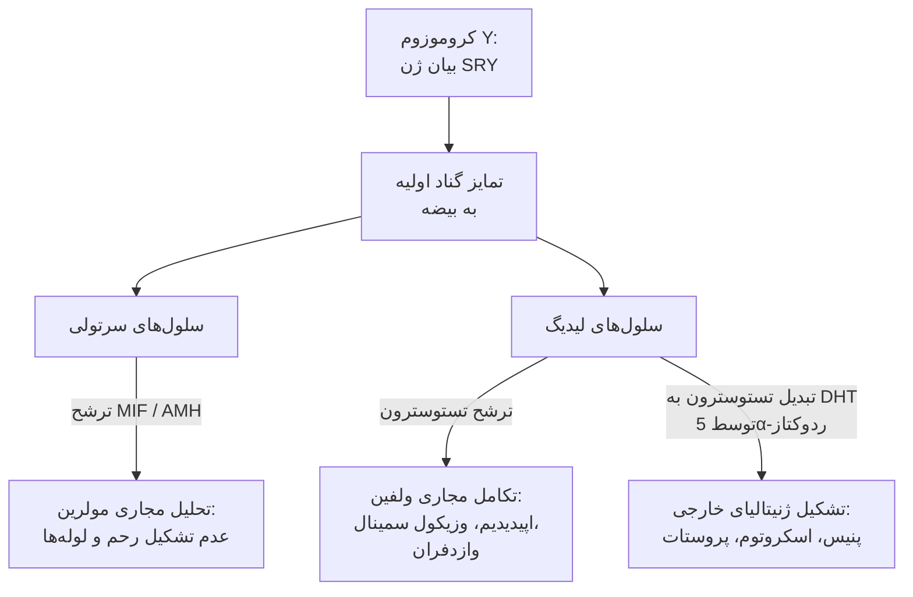
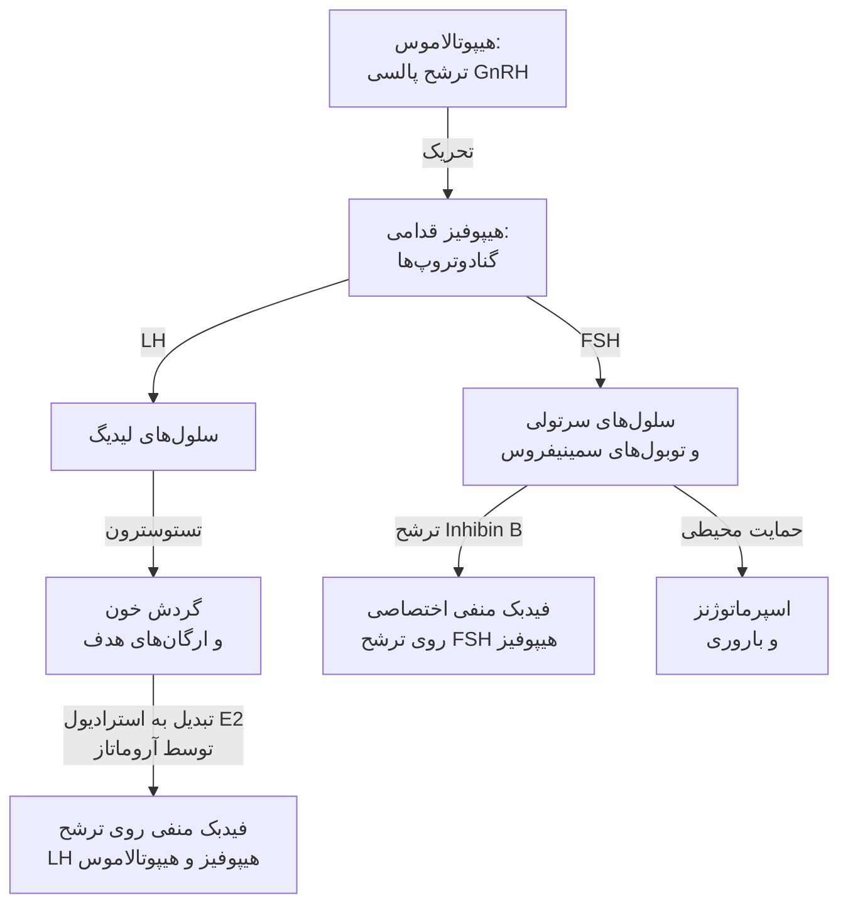
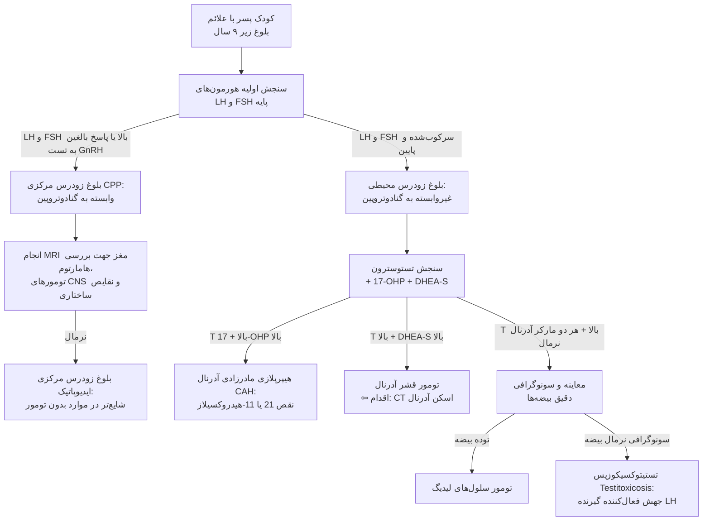
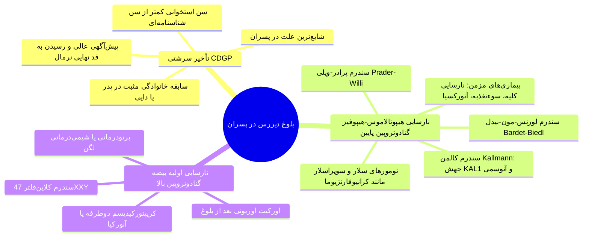
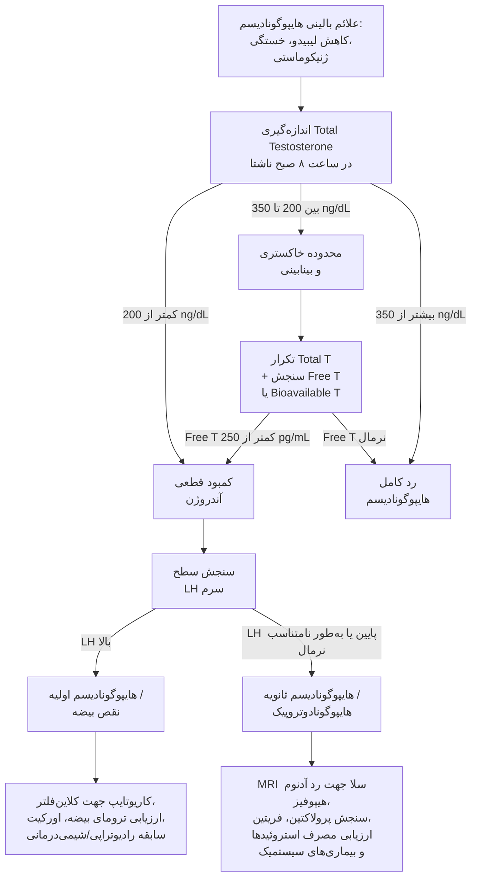
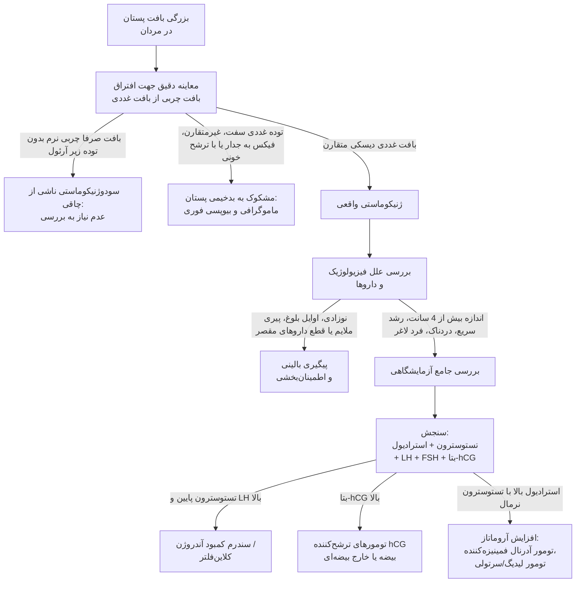

# اختلالات بیضه و سیستم تولیدمثل مردان

## ۱. تمایز جنسی در جنین و فیزیولوژی بلوغ

> [!abstract] تمایز جنسی جنینی (Embryonic Sex Differentiation)
> فرآیند هدایت بیولوژی جنین از حالت دوپتانسیلی به فنوتیپ مذکر؛ وابسته به فعال‌سازی کلیدی کروموزوم Y و مهار فعال مسیر زنانه.

### روند تکامل جنینی بیضه و مجاری
1. **ژن SRY:** روی بازوی کوتاه کروموزوم Y ⇦ تمایز گناد اولیه دوپتانسیل به **سلول‌های سرتولی** و تشکیل **Seminiferous Tubules**.
2. **سلول‌های سرتولی:** ترشح فاکتور مهارکننده مولرین (**MIF / AMH**) ⇦ تحلیل و آتروفی مجاری مولرین (**Müllerian Regression**) و ممانعت از تشکیل رحم، لوله‌های فالوپ و بخش فوقانی واژن.
3. **سلول‌های لیدیگ (Leydig Cells):** مهاجرت از کرست تناسلی به داخل گناد ⇦ ترشح **تستوسترون (T)**.
   * اثر مستقیم تستوسترون ⇦ تمایز مجاری ولفین (**Wolffian Ducts**) به اپیدیدیم، وزیکول سمینال و وازدفران.
   * تبدیل موضعی تستوسترون به **دی‌هیدروتستوسترون (DHT)** توسط آنزیم 5α-Reductase ⇦ تمایز و رشد **ژنیتالیای خارجی** (آلت تناسلی، اسکروتوم) و **پروستات**.

### هورمون‌شناسی و زمان‌بندی وقایع بلوغ
* **مینی‌پوبرتی (Mini-puberty):** افزایش گذرای LH، FSH و تستوسترون در ماه‌های اول پس از تولد ⇦ سپس خاموشی کامل محور هیپوتالاموس-هیپوفیز-گناد تا سن بلوغ.
* **آدرنارک (Adrenarche):** سن **6 تا 8 سالگی**؛ فعال‌سازی پیش‌رس ترشح آندروژن‌های آدرنال شامل **DHEA** ⇦ ایجاد بوی عرق بالغین و رشد موهای ناحیه آگزیلاری (**Axillary Hair**). این فرآیند به‌تنهایی به معنی شروع بلوغ جنسی واقعی نیست.
* **شروع بلوغ هیپوتالاموسی:** فعال شدن ژنراتور پالسی GnRH ⇦ سرج شبانه هورمون‌های **LH و FSH** (اولین علامت آزمایشگاهی بلوغ).
* **توالی علائم بالینی بلوغ در پسران:**
  1. **رشد و افزایش حجم بیضه‌ها:** **اولین نشانه بالینی بلوغ** (افزایش طول به $>2.5\text{ cm}$ یا حجم به $>4\text{ mL}$).
  2. رشد آلت و اسکروتوم + موهای ناحیه پوبیک (وابسته به DHT).
  3. کلفت شدن صدا و افزایش توده عضلانی (وابسته به تستوسترون).
  4. **جهش رشدی (Growth Spurt):** رخ‌‌داد دیررس در پسران (مراحل تانر **۳ به ۴**، سن **۱۴ تا ۱۵ سالگی**)؛ برعکس دختران که جهش رشدی همزمان با جوانه‌زدن پستان (Thelarche) آغاز شده و با منارک تقریباً پایان می‌یابد.
  5. رشد موهای صورت و **عقب‌رفت موی شقیقه‌ای (Temporal Hairline Recession):** از آخرین وقایع بلوغ تحت کنترل DHT.

---

## ۲. محور هیپوتالاموس-هیپوفیز-بیضه و متابولیسم آندروژن‌ها

### بیوسنتز و سرنوشت بیوشیمیایی تستوسترون
* **پیش‌ساز مشترک:** کلسترول (تبدیل به پرگننولون توسط CYP11A1 ⇦ پروژسترون ⇦ 17-OH پروژسترون توسط CYP17 ⇦ آندروستندیون ⇦ تستوسترون توسط 17β-HSD3).
* **سه فرم فعال هورمونی:**
  * **Testosterone (T):** اثر مستقیم بر تمایز مجاری ولفین، افزایش توده عضلانی، اسپرماتوژنز و تحریک استخوان‌سازی.
  * **Dihydrotestosterone (DHT):** حاصل فعالیت آنزیم **5α-Reductase** (حدود 6% تا 8% تستوسترون)؛ تمایز ژنیتالیای خارجی، بزرگی پروستات، آکنه، رویش موی ریش/بدن، آلوپسی آندروژنیک.
  * **Estradiol (E2):** حاصل فعالیت آنزیم **Aromatase (CYP19)** (حدود 0.3% تستوسترون)؛ فیدبک منفی LH، **بسته شدن صفحات رشد اپی‌فیزی (Epiphyseal Closure)**، افزایش دانسیته استخوانی و عامل بروز ژنیکوماستی.

### وضعیت تستوسترون در گردش خون و SHBG

> [!important] فرمول پول‌های تستوسترون پلاسما
> * **تستوسترون متصل به SHBG (50% تا 70%):** اتصال با میل ترکیبی بسیار بالا (*High Affinity*)، از نظر بیولوژیک کاملاً غیرفعال.
> * **تستوسترون متصل به آلبومین (30% تا 45%):** اتصال ضعیف (*Loose Bound*)، قابل جدا شدن در مویرگ‌های بافتی.
> * **تستوسترون آزاد / Free T (0.5% تا 3%):** فرم فعال بیولوژیک.
> * **Bioavailable T:** تستوسترون آزاد + تستوسترون متصل به آلبومین (جداسازی آزمایشگاهی با روش *Ammonium Sulfate Precipitation*).

| وضعیت بالینی | عوامل مؤثر بر سطح پروتئین | اثر بر Total Testosterone | اثر بر Free / Bioavailable T |
| :--- | :--- | :---: | :---: |
| **کاهش‌دهنده SHBG** | چاقی، هایپرانسولینمی و مقاومت به انسولین، سندرم نفروتیک، مصرف آندروژن‌های اگزوژن و استروئیدهای آنابولیک | $\downarrow$ (افت کاذب) | **نرمال یا اندکی $\uparrow$** |
| **افزایش‌دهنده SHBG** | افزایش سن، هایپرتیروئیدیسم، مواجهه با استروژن‌ها، بیماری‌های مزمن کبدی، بیماری‌های التهابی مزمن، HIV | $\uparrow$ (افزایش کاذب) | **نرمال یا $\downarrow$** |

> [!tip] تله تستی کلیدی در تفسیر تستوسترون
> در افراد چاق یا دیابتی، سطح Total Testosterone به دلیل افت شدید SHBG ممکن است زیر رنج نرمال گزارش شود، در حالی که بیمار از نظر بالینی یوگوناد است (Free T نرمال). بنابراین در چاقی و بیماری تیروئید سنجش **Free T** یا **Bioavailable T** الزامی است.

---

## ۳. ارزیابی بالینی و تست‌های پاراکلینیک اختصاصی

### شرح حال و معاینه فیزیکی
* **علائم کمبود آندروژن:** کاهش نعوظ صبحگاهی (**Early Morning Erection**)، کاهش افکار و میل جنسی (*Libido*)، خستگی مزمن، خلق تحریک‌پذیر (*Irritability*)، کاهش شیو کردن ریش.
* **نسبت‌های اونوکوئیدی (Eunuchoidal Proportions):**
  * فاصله دو دست باز (*Arm Span*) بیش از **2 سانتی‌متر بیشتر از قد فرد**.
  * نسبت بخش تحتانی به فوقانی بدن $>1$.
  * نشانه قطعی: **کمبود آندروژن قبل از بسته شدن صفحات رشد اپی‌فیز** (استروژن برای بسته شدن اپی‌فیز غایب بوده و رشد طولی استخوان‌های دراز ادامه یافته است).
* **معاینه بیضه:**
  * ابزار استاندارد: **ارکیدومتر پرادر (Prader Orchidometer)** حاوی مهره‌های بیضی شکل.
  * حجم نرمال بالغین: **12 تا 25 mL** (طول نرمال: **3.5 تا 5.5 cm**).
  * طول غیرطبیعی مشکوک به هایپوگونادیسم: **کوچک‌تر از 3 سانتی‌متر**.
  * تغییرات ناشی از پیری: سایز بیضه تغییر بارزی نمی‌کند اما **قوام آن نرم‌تر می‌شود**.
  * کلاین‌فلتر: بیضه‌های **بسیار کوچک (1 تا 2 mL) با قوام کاملاً سفت و فیبروزه**.

### پروتکل آزمایشگاهی هورمون‌ها
1. **Total Testosterone:** باید حتماً در **ساعت ۸ صبح** و در شرایط **ناشتا** سنجیده شود (پیک ترشح صبحگاهی است و در بعدازظهر افت فیزیولوژیک دارد؛ مصرف غذا سطح آن را سرکوب می‌کند). روش انتخابی مرجع: **LC-MS/MS** یا RIA.
2. **سنجش LH و FSH:** روش **IRMA**؛ به دلیل ترشح پالسی، در موارد مرزی سنجش در چند نمونه تجمیع‌شده یا تکرار آزمایش لازم است.
3. **تست تحریکی GnRH (GnRH Stimulation Test):**
   * تزریق آمپول GnRH به میزان 100 میکروگرم؛ سنجش LH و FSH در دقایق 0، 30 و 60.
   * پاسخ نرمال و نشانه آغاز بلوغ: **افزایش حداقل ۲ برابری LH** و **افزایش ۵۰ درصدی FSH**.
4. **تست تحریکی hCG (hCG Stimulation Test):**
   * جهت اثبات **وجود بافت بیضه فانکشنال** در موارد بیضه نزول‌نکرده غیرقابل لمس، کریپتورکیدیسم یا ابهام جنسی.
   * دوز: 1500 تا 4000 واحد عضلانی؛ سنجش تستوسترون در ساعات 24 تا 120.
   * پاسخ نرمال: **دو برابر شدن سطح تستوسترون پایه** (یا رسیدن تستوسترون به $>150\text{ ng/dL}$).
   * مارکر کمکی نوین غیرتهاجمی: سنجش **MIS / AMH** در کودکان پیش از بلوغ؛ در صورت مثبت بودن، نشان‌دهنده وجود قطعی سلول‌های سرتولی فعال است.
5. **آنالیز مایع منی (Semen Analysis):**
   * انجام پس از **2 تا 3 روز پرهیز جنسی (Abstinence)**.
   * پارامترهای نرمال WHO: حجم 2 تا 6 mL، غلظت اسپرم **$>20\text{ million/mL}$**، تحرک **$>50\%$**، مورفولوژی نرمال **$>15\%$**.
6. **بیوپسی بیضه (Testicular Biopsy):**
   * اندیکاسیون تشخیصی: مرد مبتلا به آزواسپرمی یا الیگواسپرمی شدید با **FSH کاملاً نرمال** ⇦ در صورت بیوپسی نرمال، تشخیص **انسداد وازدفران یا مجاری انزالی** قطعی است.
   * اندیکاسیون درمانی: استخراج اسپرم جهت روش‌های باروری آزمایشگاهی نظیر **ICSI / TESE**.

---

## ۴. اختلالات بلوغ (بلوغ زودرس و بلوغ دیررس)

> [!danger] تعاریف مرزی سنی بلوغ
> * **بلوغ زودرس (Precocious Puberty):** بروز هرگونه نشانه فنوتیپی بلوغ در پسران **قبل از سن ۹ سالگی**.
> * **بلوغ دیررس (Delayed Puberty):** عدم شروع کوچک‌ترین نشانه بلوغ (حجم بیضه $<4\text{ mL}$) تا سن **۱۴ سالگی**.

### بلوغ زودرس (Precocious Puberty)

### علل و نشانه‌های اختصاصی بلوغ زودرس محیطی
1. **تستیتوکسیکوزیس (Familial Male-Limited Precocious Puberty):**
   * جهش فعال‌کننده (*Gain of function*) در **گیرنده LH**.
   * ترشح اتونوم تستوسترون از سلول‌های لیدیگ بدون نیاز به LH ⇦ **تستوسترون بالا، LH کاملاً سرکوب‌شده**.
   * بلوغ زودرس جنسی، سن استخوانی بسیار پیشرفته (*Advanced Bone Age*)، بسته شدن زودرس اپی‌فیزها و کوتاهی قد نهایی.
2. **سندرم مک‌کون آلبرایت (McCune-Albright Syndrome):**
   * جهش سوماتیک پس از لقاح (*Postzygotic*) فعال‌کننده در **زیرواحد Gsα**.
   * تریاد کلاسیک: **لکه‌های شیرقهوه‌ای با حاشیه مضرس (Café-au-lait spots)** + **دیسپلازی فیبروز پلی‌استوتیک استخوان** + پرکاری خودکار اندوکرین (بلوغ زودرس، تیروتوکسیکوز، کوشینگ، آکرومگالی). درمان ضایعات استخوانی: بی‌فسفونات‌ها.
3. **هیپرپلازی مادرزادی آدرنال (CAH):**
   * کمبود آنزیم **21-هیدروکسیلاز** یا **11β-هیدروکسیلاز** ⇦ تجمع 17-OH پروژسترون و انحراف مسیر به تولید آندروژن ⇦ تستوسترون بالا، LH سرکوب‌شده، بیضه‌ها کوچک.
   * **Adrenal Rests:** تحریک مزمن با سطوح بالای ACTH می‌تواند بافت نابجای آدرنال را در درون بیضه‌ها بزرگ و ندولار کند.
4. **بلوغ زودرس دگرجنس‌گونه (Heterosexual Precocious Puberty):**
   * بروز علائم زنانگی (ژنیکوماستی) در پسر زیر ۹ سال.
   * علل: تومورهای سرتولی ترشح‌کننده آروماتاز، تومورهای آدرنال سازنده استروژن، سندرم افزایش ارثی آروماتاز، تومورهای ترشح‌کننده hCG (سلول‌های زایای بیضه/کبد)، مصرف ماری‌جوانا یا استروژن اگزوژن.

### درمان بلوغ زودرس
* **علل مرکزی (CPP):** تجویز **آنالوگ‌های طولانی‌‌اثر GnRH (Long-acting GnRH Agonists)**؛ ترشح مداوم باعث مهار و داون‌رگولاسیون گیرنده‌های GnRH هیپوفیز، سرکوب ترشح LH/FSH و افزایش قد نهایی (*Final Adult Height*) می‌شود (به‌ویژه اگر قبل از سن ۶ سالگی آغاز شود).
* **علل محیطی:** مهارکننده‌های سنتز استروئید نظیر **کتوکونازول**، مهارکننده‌های گیرنده آندروژن نظیر **اسپیرونولاکتون** و مهارکننده‌های آروماتاز.

---

### بلوغ دیررس (Delayed Puberty)

### پروتکل بالینی و درمان بلوغ دیررس
* **تشخیص افتراقی اصلی:** تمایز بین **تأخیر سرشتی رشد و بلوغ (CDGP)** و هایپوگونادوتروپیک هایپوگونادیسم مادرزادی. در CDGP ترشح شبانه هورمون‌ها با تأخیر آغاز می‌شود.
* **درمان جایگزین:** در صورت پریشانی روانی شدید یا سن بالای ۱۴ سال با CDGP:
  * دوز پایین تستوسترون: **25 تا 50 mg انانتات عضلانی ماهانه** یا پچ $2.5\text{ mg}$ / ژل $25\text{ mg}$ برای دوره کوتاه (۳ تا ۶ ماه).
  * **مهارکننده آروماتاز (Aromatase Inhibitors):** اضافه کردن مهارکننده آروماتاز در کنار تستوسترون از تبدیل آن به استرادیول جلوگیری کرده، مانع بسته شدن صفحات رشد شده و **قد نهایی را بلندتر می‌کند**.
  * پس از ۶ ماه درمان قطع شده و سطح درون‌زاد LH و FSH ارزیابی می‌گردد تا فعال شدن خودبه‌خودی محور تایید شود.

---

## ۵. هایپوگونادیسم در بزرگسالان (Hypogonadism)

### مقایسه تفصیلی سندرم‌های ژنتیکی و علل هایپوگونادیسم

| سندرم / اتیولوژی                    | نقص ژنتیکی و مکانیسم                                                                   |                                  مارکرهای هورمونی                                   | ویژگی‌های شاخص بالینی و فنوتیپی                                                                                                                          |
| :---------------------------------- | :------------------------------------------------------------------------------------- | :---------------------------------------------------------------------------------: | :------------------------------------------------------------------------------------------------------------------------------------------------------- |
| **سندرم کلاین‌فلتر (Klinefelter)**  | نقص **47,XXY** (عدم جدایی کروموزومی میوزی)؛ فیبروز و هیالینیزاسیون توبول‌های سمینیفروس | **$T \downarrow$ و LH/FSH $\uparrow\uparrow$** ، افزایش نسبت استرادیول به تستوسترون | قد بلند، اندام‌های تحتانی کشیده، عدم عقب‌رفت خط موی فرونتال، ریش تنک، ژنیکوماستی، **بیضه‌های بسیار کوچک ($<2\text{ mL}$) و کاملاً سفت**، آزواسپرمی قطعی. |
| **سندرم کالمن (Kallmann)**          | جهش در ژن **KAL1**؛ نقص پروتئین آنوسمین-۱، اختلال مهاجرت نورون‌های GnRH و بصل‌الشمامه  |              **$T \downarrow$ و LH/FSH $\downarrow$** یا غیرقابل سنجش               | هایپوگونادیسم هایپوگونادوتروپیک همراه با **آنوسمی یا هایپوسمی (فقدان بویایی)**، نقایص تکاملی کلیه، حرکات آینه‌ای دست‌ها (*Synkinesia*).                  |
| **سندرم پرادر-ویلی (Prader-Willi)** | حذف ریز ناحیه پدری 15q11-q13                                                           |                      **$T \downarrow$ و LH/FSH $\downarrow$**                       | هیپوتونی شدید نوزادی، پرخوری غیرقابل کنترل و چاقی مفرط شدید، عقب‌ماندگی ذهنی، دست‌ها و پاهای کوچک، کوتاهی قد.                                            |
| **سندرم باردت-بیدل (Bardet-Biedl)** | موتاسیون ژن‌های پروتئین‌های مژکی (*Ciliopathy*)                                        |                      **$T \downarrow$ و LH/FSH $\downarrow$**                       | هایپوگونادیسم، چاقی مفرط، **پلی‌داکتیلی (انگشتان اضافه)**، **رتینیت پیگمنتوزا (کوری تدریجی)**، اختلالات شناختی و نارسایی کلیه.                           |
| **کریپتورکیدیسم (Cryptorchidism)**  | عدم نزول بیضه به اسکروتوم (شیوع $<1\%$ در ۹ ماهگی)                                     |                             اسپرماتوژنز مختل؛ $T$ متغیر                             | افزایش ریسک **ناباروری و بدخیمی (سمینوما)**؛ حتی پس از جراحی پیش از بلوغ، خطر افت کیفیت اسپرم باقی می‌ماند.                                              |

> [!warning] اثر بیماری‌های مزمن و چاقی بر هایپوگونادیسم
> * نارسایی مزمن کلیه (CRF)، سیروز، سوءتغذیه شدید، بیماری سلیاک و هموکروماتوز کبد و هیپوفیز را تخریب کرده و معمولاً هایپوگونادیسم ترکیبی یا هایپوگونادوتروپیک می‌دهند.
> * مصرف استروئیدهای آنابولیک در بدنسازان: مهار شدید و پایدار ترشح LH و FSH؛ پس از قطع دارو، بیمار تا ماه‌ها دچار هایپوگونادیسم شدید، تحلیل بیضه‌ها و ژنیکوماستی باقی می‌ماند.

---

## ۶. ژنیکوماستی (Gynecomastia)

> [!abstract] تعریف ژنیکوماستی
> افزایش خوش‌خیم و قابل لمس **بافت غددی پستان در مردان** ناشی از **افزایش نسبت استروژن به آندروژن**.  
> معیار اهمیت پاتولوژیک بالینی: قطر بافت غددی **بیشتر از 4 سانتی‌متر**.

### افتراق بافت غددی از بافت چربی (Pseudogynecomastia)
* **معاینه بالینی استاندارد:** بیمار به پشت خوابیده و دست‌ها زیر سر قرار می‌گیرد. بافت پستان بین انگشت شست و اشاره از محیط به سمت آرئول لمس می‌شود.
* **بافت غددی واقعی:** متراکم، سفت، با قوام طنابی-رشته‌ای، متحرک و واقع در زیر نیپل.
* **سودوژنیکوماستی (تجمع چربی):** بافت کاملاً نرم، منتشر و بدون لبه دیسکی زیر نیپل (شایع در افراد چاق). در صورت شک تشخیصی، **سونوگرافی پستان** افتراق‌دهنده قطعی است.

### ژنیکوماستی فیزیولوژیک در طول عمر
1. **نوزادی:** به دلیل عبور استروژن‌های مادری و جفتی از جفت؛ خودبه‌خود طی چند هفته تا چند ماه رگرس می‌کند.
2. **اوایل بلوغ (سن ۱۰ تا ۱۴ سالگی):** نسبت استرادیول به تستوسترون در اوایل بلوغ گذرا بالا می‌رود؛ طی ۱ تا ۲ سال برطرف می‌شود.
3. **سالمندی:** کاهش تولید تستوسترون همزمان با افزایش توده چربی بدن و بالا رفتن فعالیت آنزیم **آروماتاز محیطی**.

### علل پاتولوژیک و دارویی ژنیکوماستی

> [!important] مکانیسم‌های دارویی ژنیکوماستی (تله‌های تستی پرتکرار)
> 1. **اثر مستقیم استروژنیک:** فیتواستروژن‌ها (مصرف بیش از حد دانه سویا)، OCP، دیژیتالیس (دیگوکسین به گیرنده استروژن متصل می‌شود).
> 2. **مهار سنتز آندروژن:** **کتوکونازول** (مهار آنزیم‌های CYP17 و سیتوکروم P450 بیضه).
> 3. **مهار گیرنده آندروژن:** **اسپیرونولاکتون**، فلوتامید، بی‌کالوتامید، سایمتیدین.
> 4. **مهار 5α-ردوکتاز:** فیناستراید و دوتاستراید (کاهش DHT و انحراف متابولیسم به استرادیول).
> 5. **افزایش سطح استروژن و پرولاکتین:** ماری‌جوانا (حشیش)، داروهای ضدجنون (آنتی‌سایکوتیک‌ها).

### ویژگی‌های ژنیکوماستی نیازمند ارزیابی فوری و اورژانسی
* **ایجاد اخیراً و شروع ناگهانی (Recent Onset)**
* **رشد فوق‌العاده سریع (Rapid Growth)**
* **همراهی با درد و تندرنس شدید بافتی**
* **بروز در فرد لاغر (Lean Person):** برعکس افراد چاق، بروز توده در فرد لاغر شدیداً دلالت بر پاتولوژی هورمونی دارد.

### راهکارهای درمانی
* **درمان بیماری زمینه‌ای:** قطع داروهای مسبب، درمان هایپوتیروئیدی یا هایپرتیروئیدی، جراحی تومورهای بیضه یا آدرنال.
* **درمان دارویی طبی:** تنها در صورتی مؤثر است که از شروع ژنیکوماستی **کمتر از ۱ سال** گذشته باشد (قبل از ایجاد فیبروز غیرقابل برگشت بافتی):
  * **تاموکسیفن (Tamoxifen):** دوز $20\text{ mg/day}$؛ تعدیل‌کننده انتخابی گیرنده استروژن (SERM)؛ سبب کاهش سریع درد و تندرنس و کاهش اندازه بافت غددی می‌شود.
  * **مهارکننده‌های آروماتاز (Anastrazole / Letrozole):** جهت بلوک ساخت استروژن.
* **جراحی (Mastectomy / Reduction):** اندیکاسیون در ژنیکوماستی با سابقه **بیش از ۱ سال**، بافت کاملاً فیبروزه و سفت، یا اندازه بزرگ مقاوم به درمان طبی.

---

## ۷. تابلوی جامع مقایسه‌ای مارکرهای بیوشیمیایی در اختلالات محور مذکر

| اختلال بالینی | تستوسترون (T) | LH | FSH | سایر مارکرهای اختصاصی | گام اقدام بعدی بالینی |
| :--- | :---: | :---: | :---: | :--- | :--- |
| **سندرم کلاین‌فلتر** | $\downarrow$ | $\uparrow\uparrow$ | $\uparrow\uparrow$ | کاریوتایپ: 47,XXY | شروع تستوسترون + جراحی ماستکتومی |
| **سندرم کالمن** | $\downarrow\downarrow$ | $\downarrow$ | $\downarrow$ | آنوسمی / اختلال بویایی | GnRH پالسی یا hCG/FSH برای باروری |
| **تستیتوکسیکوزیس** | $\uparrow\uparrow$ | $\downarrow\downarrow$ | $\downarrow\downarrow$ | جهش فعال‌کننده LH-R | کتوکونازول + اسپیرونولاکتون |
| **تومور سلول لیدیگ** | $\uparrow\uparrow$ | $\downarrow\downarrow$ | $\downarrow\downarrow$ | لمس توده در سونوگرافی بیضه | ارکیدکتومی |
| **CAH (نقص 21-هیدروکسیلاز)** | $\uparrow$ | $\downarrow\downarrow$ | $\downarrow\downarrow$ | **17-OHP $\uparrow\uparrow$** ، بیضه کوچک | تجویز هیدروکورتیزون و سرکوب ACTH |
| **تومور قشر آدرنال** | $\uparrow$ | $\downarrow\downarrow$ | $\downarrow\downarrow$ | **DHEA-S $\uparrow\uparrow$** | سی‌تی‌اسکن آدرنال و جراحی |
| **تومور ترشح‌کننده hCG** | $\uparrow$ یا متغیر | $\downarrow\downarrow$ | $\downarrow\downarrow$ | **$\beta\text{-hCG} \uparrow\uparrow$** | ارزیابی بیضه و سونوگرافی شکم |
| **آزواسپرمی انسدادی** | نرمال | نرمال | **نرمال** | اسپرماتوسیت در بیوپسی بیضه | بازسازی مجرا یا روش‌های ICSI |
| **آزواسپرمی غیرانسدادی** | نرمال یا $\downarrow$ | نرمال یا $\uparrow$ | **$\uparrow\uparrow$** | بیوپسی: Sertoli cell only | بررسی ژنتیکی و میکرودلیشن کروموزوم Y |
| **سوءمصرف استروئید آنابولیک** | سرمی پایین/متغیر | $\downarrow\downarrow$ | $\downarrow\downarrow$ | آتروفی بیضه، ژنیکوماستی | قطع مصرف دارو و پایش ریکاوری محور |
