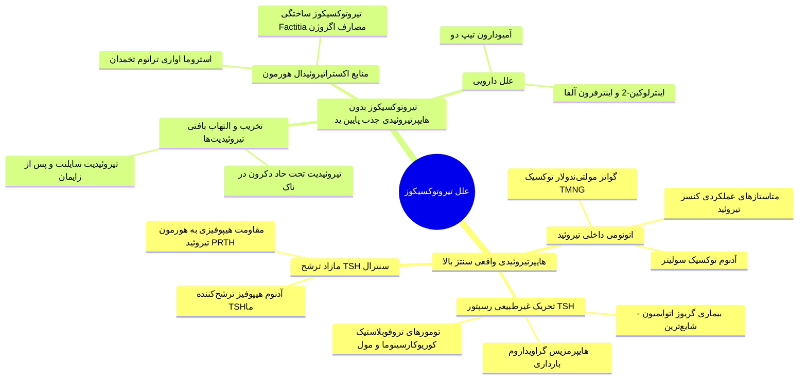
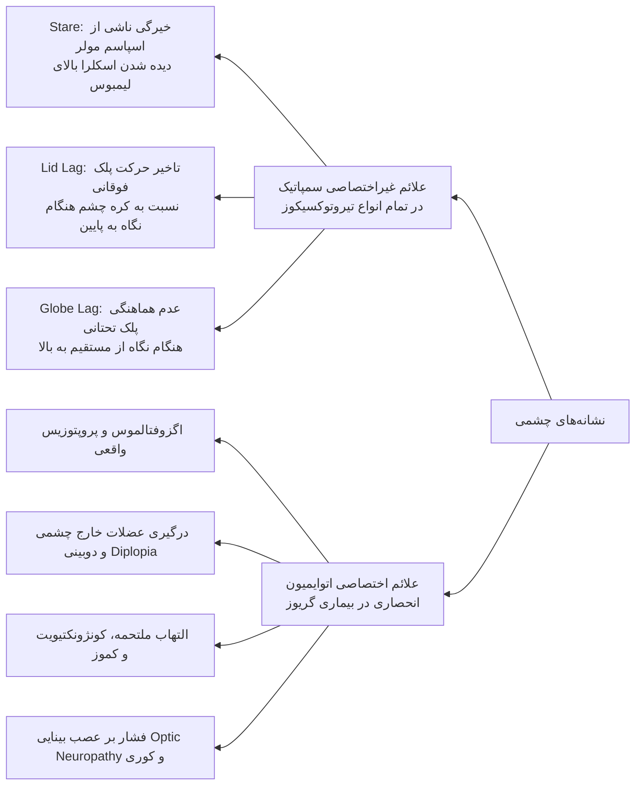
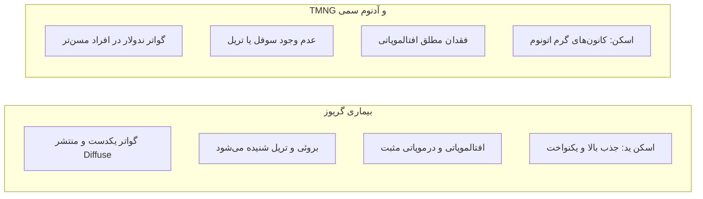
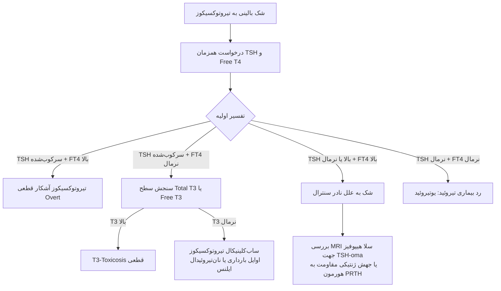
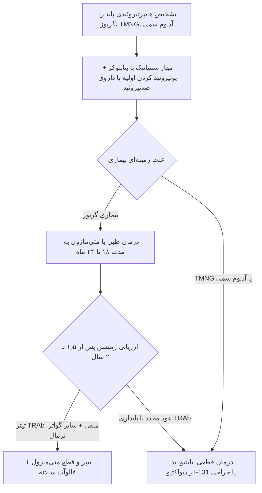

# تیروتوکسیکوز و هایپرتیروئیدی (Thyrotoxicosis & Hyperthyroidism)

## ۱. تعاریف پایه، مفاهیم کلیدی و کیس بالینی معرف

> [!abstract] تیروتوکسیکوز (Thyrotoxicosis)
> سندرم بالینی، بیوشیمیایی و فیزیولوژیک ناشی از مواجهه بافت‌های بدن با مقادیر مازاد هورمون‌های تیروئید آزاد در گردش خون؛ یک چتر واژگانی کلی که الزماً معادل پرکاری خود غده نیست.

> [!abstract] هایپرتیروئیدی (Hyperthyroidism)
> زیرمجموعه‌ای اختصاصی از تیروتوکسیکوز که در آن سنتز و ترشح هورمون‌ها مستقیماً از **خود غده تیروئید بیش‌فعال** ناشی می‌شود (نظیر گریوز، TMNG و آدنوم سمی).

### تحلیل کیس بالینی کلاسیک (معرفی‌شده در تدریس)
* **شرح‌حال:** خانم ۳۸ ساله با تپش قلب، عدم تحمل گرما، اولیگومنوره، بی‌خوابی و تحریک‌پذیری عصبی.
* **سابقه قبلی:** تب روماتیسمی دوران کودکی و تنگی دریچه آئورت (AS).
* **معاینه فیزیکی:** نبض 110 bpm منظم، ترمور انگشتان، بی‌قراری حرکتی، سوفل قلبی AS، تیروئید بزرگ، منتشر و غیرحساس با تخمین بالینی **۴۵ گرم** (وزن نرمال تیروئید بالغین: **۲۰ گرم**؛ در لمس ۲ برابر حد طبیعی، با حداکثر دیامتر نرمال سونوگرافی: **۴ سانتی‌متر / ۴۰ میلی‌متر**).
* **آزمایشگاه اولیه:** **TSH کاملاً سرکوب‌شده (<0.01)** همراه با **افزایش شدید Total T4 ،T3-Resin Uptake و Free T4 Index (FT4I)**.
* **تشخیص:** **بیماری گریوز (Graves' Disease)**.
* **روند درمان و پیامد:**
  1. شروع متی‌مازول (MMI) با دوز $20\text{ mg/day}$ به‌همراه پروپرانولول $10\text{ mg}$ روزانه ۳ بار (TID).
  2. پس از ۳ تا ۴ ماه: فروکش علائم سمپاتیک و نرمال شدن تیروئید ⇦ **قطع پروپرانولول**.
  3. تداوم متی‌مازول به مدت **کامل ۲ سال (۱۸ تا ۲۴ ماه)** جهت فرونشاندن تیتر TRAb و القای بهبودی ایمونولوژیک پایدار.
  4. پیگیری ۲۰ ساله (۱۹۹۲ تا ۲۰۱۲): **بهبودی کامل (Remission) بدون هیچ‌‌گونه عود (Relapse)**، تیروئید غیرقابل لمس و TSH نرمال سالانه (از جمله پیش از جراحی موفق تعویض دریچه آئورت در سال ۱۹۹۴).

---

## ۲. اتیولوژی و طبقه‌بندی جامع تیروتوکسیکوز

### مقایسه دسته‌های اتیولوژیک و سرنخ‌های بالینی

| گروه اتیولوژیک | بیماری شاخص | پاتوفیزیولوژی اختصاصی | وضعیت جذب ید رادیواکتیو (RAIU) | مشخصات بالینی و تشخیصی |
| :--- | :--- | :--- | :---: | :--- |
| **هایپرتیروئیدی اولیه** | **بیماری گریوز** | تولید آنتی‌بادی محرک گیرنده TSH بنام **TRAb / TSI** | **بالا (منتشر و هموژن)** | زنان جوان (دهه ۳ و ۴)، گواتر منتشر بدون ندول، تریل و برویی، **افتالموپاتی و درموپاتی**. |
| **اتونومی موضعی** | **TMNG و آدنوم سمی** | جهش‌های سوماتیک فعال‌کننده گیرنده TSH | **بالا (غیرهموژن / تک‌گره گرم)** | افراد مسن‌تر، سابقه طولانی گواتر ندولار، **فقدان علائم چشمی و پوستی**، عدم بهبودی با دارو. |
| **تحریک با hCG** | **کوریوکارسینوما، مول، هایپرمزیس** | اثر آگونیستی مقادیر بسیار بالای hCG روی گیرنده TSH | بالا | تهوع/استفراغ شدید اوایل بارداری، خونریزی رحمی، پروپتوز دیده نمی‌شود. |
| **تخریب فولیکول** | **تیروئیدیت‌ها (تحت‌حاد / سایلنت)** | تخلیه هورمون‌های از پیش ساخته‌شده به خون | **بسیار پایین (نزدیک به صفر)** | در تحت‌حاد درد شدید گردن و بالا بودن ESR؛ در سایلنت و پس از زایمان بدون درد. |
| **اگزوژن / کاذب** | **Thyrotoxicosis Factitia** | مصرف قرص لووتیروکسین با اهداف لاغری یا تمارض | **صفر** | **تیروگلوبولین (Tg) سرم کاملاً سرکوب‌شده**، تیروئید در معاینه کوچک و آتروفیک. |
| **بافت نابجا** | **استروما اواری (Struma Ovarii)** | وجود بافت تراتوماتوز تیروئیدی در تخمدان | **اسکن گردن صفر / اسکن لگن مثبت** | توده لگنی زنانه، آسیت، تیروتوکسیکوز بدون گواتر گردنی. |
| **سنترال** | **آدنوم هیپوفیز (TSH-oma)** | ترشح خودمختار TSH بدون فیدبک منفی هورمونی | بالا | **Free T4 بالا همراه با TSH بالا یا نامتناسب نرمال**، توده در MRI سلا. |

---

## ۳. تظاهرات بالینی، نشانه‌ها و درگیری‌های اختصاصی ارگان‌ها

### علائم عمومی، متابولیک و همودینامیک
* **متابولیسم پایه (BMR):** افزایش چشمگیر؛ **کاهش وزن علیرغم اشتهای بسیار زیاد**، عدم تحمل شدید گرما، تعریق فراوان، پوست گرم، مرطوب و نرم (Smooth).
* **سیستم قلبی-عروقی:**
  * تاکی‌کاردی استراحتی (معمولاً بالای 100 bpm) و تشدید صدای اول قلب (S1).
  * **فشار نبض پهن (Wide Pulse Pressure):** افزایش فشار خون سیستولیک ناشی از افزایش قدرت انقباضی و حجم ضربه‌ای همراه با **کاهش فشار دیاستولیک** ناشی از وازودیلاتاسیون محیطی (مثال تستی: BP = 150/60 mmHg).
  * آریتمی‌های قلبی: به‌ویژه **فیبریلاسیون دهلیزی (AF)** در افراد مسن (Apathetic Hyperthyroidism).
* **سیستم عصبی-عضلانی:**
  * تحریک‌پذیری، اضطراب شدید، بی‌قراری حرکتی (Agitation)، بی‌خوابی مقاوم.
  * **ترمور ظریف (Fine Tremor):** در انگشتان دست و زبان در حالت کشیده.
  * **هایپررفلکسی (Hyperreflexia):** کوتاهی فاز ریلکسیشن رفلکس‌های تاندونی عمقی.
  * ضعف عضلانی پروگزیمال (Myopathy): اشکال در بالا رفتن از پله یا برخاستن از صندلی.
* **گوارش و تولیدمثل:** افزایش حرکات دودی روده، دفع مکرر یا اسهال چرب، تهوع و استفراغ؛ در زنان **الیگومنوره یا آمنوره ثانویه** و در مردان افت لیبیدو و ژنیکوماستی.

### نشانه‌های چشمی در تیروتوکسیکوز

> [!important] قاعده تفکیک تستی نشانه‌های چشمی
> نشانه‌های **Stare** (خیرگی) و **Lid Lag** ناشی از تون بیش‌فعال سمپاتیک بر عضله مولر پلک بوده و در **همه فرم‌های تیروتوکسیکوز** پدیدار می‌شوند؛ اما **اگزوفتالموس واقعی (بیرون‌زدگی کره چشم)، پروپتوزیس، دوبینی (Diplopia) و کموز** انحصاراً در **بیماری گریوز** رخ می‌دهند (به علت رسوب گلیکوزآمینوگلیکان‌ها، ارتشاح لنفوسیت‌ها و تورم چربی و عضلات رترواوربیتال تحت تحریک TRAb).

### تظاهرات پوستی اختصاصی گریوز (Dermopathy & Acropachy)
* **درموپاتی گریوز (Pretibial Myxedema):**
  * رسوب اسید هیالورونیک در درم پوست ساق پا؛ بروز در کمتر از ۵٪ بیماران، همواره همراه با افتالموپاتی شدید.
  * پلاک‌های غیرگوده‌گذار (Non-pitting)، ضخیم، با ظاهر **پوست پرتقالی (Peau d'orange)** و در موارد نادر فرم گره‌ای یا الفانتیازیس (Elephantiasis).
* **آکروپاکی تیروئید (Thyroid Acropachy):** کلابینگ انگشتان دست و پا همراه با واکنش پریوستئال استخوان‌ها؛ نشانه نادر و همراه با درموپاتی پیشرفته.
* **اریتم کف دست (Palmar Erythema):** به علت پرخونی و اتساع عروقی محیطی.

---

## ۴. علل اختصاصی تیروتوکسیکوز و افتراق بالینی

### ۱. بیماری گریوز (Graves' Disease)
* شایع‌ترین علت تیروتوکسیکوز در جوانان؛ نسبت ابتلا در زنان به مردان **۷ به ۱** (در مناطق اندمیک گواتر این نسبت کمتر است).
* **طیف اتوایمیونیتی:** گریوز و تیروئیدیت هاشیموتو دو سر یک طیف پیوسته هستند؛ بیمار مبتلا به گریوز ممکن است در طول زمان به سمت هاشیموتو و کم‌کاری پیش برود و برعکس.
* تیروئید یکدست بزرگ، قوام الاستیک؛ در صورت پرخونی شدید دارای **Bruit شنیداری و Thrill لمسی**.

### ۲. گواتر مولتی‌ندولار توکسیک (TMNG) و آدنوم سمی (Plummer's Disease)
* بروز ندول‌های خودمختار که بدون وابستگی به TSH هورمون ترشح می‌کنند.
* آدنوم سمی بیشتر در جوانان و به شکل تک‌گره؛ TMNG بیشتر در کهنسالان پس از دهه‌ها گواتر طول‌کشیده.
* **نکته طلایی بالینی:** **بهبود خودبه‌خودی (Remission) در TMNG و آدنوم سمی هرگز رخ نمی‌دهد**. درمان دارویی صرفاً نقش آماده‌سازی قبل از ابلیشن را دارد.

### ۳. تیروئیدیت پس از زایمان (Postpartum Thyroiditis)
* بروز ۳ تا ۶ ماه پس از زایمان در زنان با اتوایمیونیتی تیروئید (Anti-TPO مثبت).
* فاز گذرا و خودمحدود شونده تیروتوکسیکوز (۱ تا ۳ ماه) ناشی از تخلیه فولیکولی ⇦ فاز هایپوتیروئیدی گذرا ⇦ بازگشت به یوتیروئید (با ریسک بالا برای هاشیموتو دائمی در آینده).
* **جذب ید رادیواکتیو در فاز تیروتوکسیک نزدیک به صفر است**. درمان انتخابی فقط بتابلوکر بوده و متی‌مازول اکیداً اندیکاسیون ندارد.

### ۴. هایپرمزیس گراویداروم (Hyperemesis Gravidarum)
* تهوع و استفراغ شدید سه‌ماهه اول بارداری همبسته با پیک هورمون جفتی hCG.
* ترشح بالای hCG سبب تحریک ملایم گیرنده TSH ⇦ **افت گذرا TSH و بالا رفتن FT4**.
* افتراق از گریوز: فقدان اگزوفتالموس، گواتر واضح و آنتی‌بادی TRAb؛ علائم با افت فیزیولوژیک hCG در هفته‌های ۱۲ تا ۱۵ خودبه‌خود فروکش می‌کنند.

---

## ۵. رویکرد آزمایشگاهی، الگوریتم تشخیصی و اسکن تیروئید

> [!important] غربالگری بیوشیمیایی
> غربالگری همگانی (Universal Screening) تیروتوکسیکوز در جمعیت سالم جامعه به دلیل شیوع پایین توصیه نمی‌شود؛ درخواست تست‌های آزمایشگاهی **صرفاً در بیماران علامت‌دار بالینی** مجاز است.

### ارزیابی گام‌به‌گام عملکرد تیروئید (TFT)

### تست‌های تکمیلی جهت تعیین علت اتیولوژیک

1. **نسبت سرمی T3 به T4 (معیار کمکی بسیار مهم):**
   * هورمون‌ها با واحدهای استاندارد سنجیده می‌شوند:

$$\text{Ratio} = \frac{T_3\text{ (ng/dL)}}{T_4\text{ (µg/dL)}}$$

   * **اگر نسبت $> 20$ باشد:** ناشی از **هایپرتیروئیدی اولیه حقیقی** (گریوز، TMNG، آدنوم سمی)؛ غده بیش‌فعال ترجیحاً T3 بیشتری تولید و ترشح می‌کند.
   * **اگر نسبت $< 15$ باشد:** ناشی از **تخریب تیروئید یا مصرف دارو** (تیروئیدیت تحت‌حاد، تیروئیدیت سایلنت، تیروتوکسیکوز ناشی از ید، مصرف اگزوژن لووتیروکسین)؛ ذخایر بافتی غنی از T4 بدون سنتز جدید آزاد شده‌اند.
2. **اسکن و بازجذب ید رادیواکتیو (RAIU - Radioactive Iodine Uptake):**
   * **جذب بالا (High Uptake):** گریوز (منتشر و هموژن)، TMNG (جذب پچ‌پچ و ناهمگن)، آدنوم سمی (یک گره داغ پرجذب با سرکوب کامل سایر بافت‌ها).
   * **جذب پایین یا نزدیک به صفر (Low Uptake):** انواع تیروئیدیت‌ها، تیروتوکسیکوز اگزوژن (Factitia)، استروما اواری، پرکاری ناشی از آمیودارون یا بار اضافی ید (Jod-Basedow).
3. **تیتر سرمی TRAb (TSH Receptor Antibody):** تاییدکننده قطعی گریوز و مارکر پایش پاسخ به درمان و پیش‌بینی عود.

> [!warning] تله‌های تشخیصی در اختلالات پروتئین ناقل (TBG Effect)
> در شرایط افزایش غلظت TBG (نظیر **بارداری، مصرف OCP، هپاتیت حاد، مصرف متادون**)، مقادیر Total T4 و Total T3 به صورت کاذب بالا گزارش می‌شوند، در حالی که **TSH و Free T4 کاملاً نرمال** هستند. در این موارد سنجش مستقیم **Free T4** یا استفاده از **T3-Resin Uptake و محاسبه FT4I** از تشخیص اشتباه جلوگیری می‌کند.

---

## ۶. اصول درمان، پروتکل‌های دارویی و ابلیشن

### ۱. داروهای ضدتیروئید (Thionamides)
* **متی‌مازول (MMI):** داروی خط اول درمان در اکثر بیماران؛ دوز شروع معمولاً $10\text{ to }30\text{ mg/day}$. نیمه‌عمر طولانی، تجویز **یک‌بار در روز**.
* **پروپیل‌تیواوراسیل (PTU):** مهار آنزیم تیروئید پراکسیداز (TPO) همراه با **مهار تبدیل محیطی T4 به T3**. نیمه‌عمر کوتاه (تجویز ۳ بار در روز).
  * *موارد مصرف اختصاصی PTU:* **سه‌ماهه اول بارداری** (به دلیل تراتوژنیسیتی متی‌مازول شامل آپلازیا کوتیس)، **توفان تیروئیدی (Thyroid Storm)** و موارد عدم تحمل یا حساسیت به متی‌مازول.
* **طول دوره درمان در گریوز:** حداقل **۱ تا ۲ سال (۱۸ تا ۲۴ ماه)**؛ قطع زودهنگام منجر به عود سریع بیماری می‌شود.

### پیش‌بینی‌کننده‌های بالینی رمیشن در برابر عود گریوز

| پیامد درمانی | ویژگی‌های پرزنتیشن اولیه | مارکرهای آزمایشگاهی و دارویی | وضعیت گواتر حین درمان |
| :--- | :--- | :--- | :--- |
| **شانس بالای رمیشن طولانی (Cure)** | پرکاری خفیف در شروع، سن بالاتر | تیتر پایین TRAb، نرمال شدن سریع TSH، نیاز به دوز کم دارو | **کاهش واضح سایز گواتر حین درمان** |
| **ریسک بالای عود (Relapse)** | پرکاری شدید، سنین جوانی، مردان، تیره بودن پوست | تیتر بالای TRAb در پایان ۲ سال، سرکوب ماندگار TSH، نیاز به دوزهای بالای دارو | **گواتر بزرگ پایدار بدون تغییر اندازه** |

### ۲. بتابلوکرها (پروپرانولول)
* کنترل سریع علائم آدرنرژیک: تاکی‌کاردی، لرزش، تعریق، بی‌قراری و حرکات سریع روده.
* در دوزهای بالا، پروپرانولول اثر مهاری بر تبدیل محیطی T4 به T3 نیز دارد.
* پس از رسیدن بیمار به حالت یوتیروئید با داروهای ضدتیروئید (طی ۲ تا ۳ ماه)، دوز بتابلوکر تیپر و قطع می‌شود.

### ۳. سایر درمان‌های دارویی کمکی
* **محلول لوگول و یدید پتاسیم (SSKI):** مهار حاد سنتز و رهایش هورمون تیروئید (**پدیده ولف-چایکوف**). اندیکاسیون در **توفان تیروئیدی** و **آماده‌سازی پیش از جراحی در گریوز** (جهت کاهش چشمگیر عروق‌زایی و خونریزی تیروئید).
* **کربنات لیتیوم:** مهار آزادسازی هورمون‌های تیروئید از کلویید؛ داروی جایگزین در شرایط حساسیت شدید به تیوآمیدها یا منع مصرف مطلق آنها.

### ۴. درمان‌های قطعی و ابلیتیو (جراحی و ید رادیواکتیو I-131)
* **ید رادیواکتیو (I-131):** خط اول در TMNG و آدنوم سمی؛ همچنین در گریوز راجعه یا عدم تحمل دارو. (تخریب تیروئید طی ۲ تا ۳ ماه؛ بروز هایپوتیروئیدی دائمی در اکثریت بیماران).
* **تیروئیدکتومی ساب‌توتال یا توتال:** اندیکاسیون در گواترهای بسیار بزرگ انسدادی، همراهی با ندول مشکوک بدخیمی، یا کنترااندیکاسیون ید رادیواکتیو (بارداری و افتالموپاتی فعال شدید گریوز).

---

## ۷. تابلوی جامع مقایسه‌ای و تله‌های تشخیصی آزمون

| سناریوی بالینی                                      |                                    آزمایشگاه (TFT)                                     |         وضعیت اسکن ید رادیواکتیو          | اقدام بالینی و درمانی صحیح                                                  |
| :-------------------------------------------------- | :------------------------------------------------------------------------------------: | :---------------------------------------: | :-------------------------------------------------------------------------- |
| **خانم جوان با گواتر منتشر، تاکی‌کاردی و پروپتوز**  |     $\text{TSH} < 0.01$، $\text{FT4} \uparrow\uparrow$، $\text{T3:T4} > 20$      | **افزایش منتشر و یکنواخت (Diffuse High)** | شروع **متی‌مازول + پروپرانولول** برای دوره ۱۸ تا ۲۴ ماه؛ پایش سالانه.    |
| **سالمند با کاهش وزن، بی‌حالی، AF و چند ندول**      |    $\text{TSH} \downarrow$، $\text{FT4}$ نرمال یا بالا، $\text{FT3} \uparrow$    |   **ناهمگن با کانون‌های گرم (Patchy)**    | آماده‌سازی با داروی ضدتیروئید ⇦ **درمان قطعی با I-131 یا جراحی**.           |
| **زن باردار هفته ۸ با تهوع مکرر و تاکی‌کاردی خفیف** |       $\text{TSH} \downarrow$ ، $\text{FT4}$ خفیف بالا، $\text{TRAb}$ منفی       |   **اسکن در بارداری اکیداً ممنوع است**    | اطمینان‌بخشی، هیدراسیون؛ رد گریوز با عدم وجود گواتر و TRAb منفی.         |
| **خانم ۴ ماه پس از زایمان با طپش قلب و لرزش**       |       $\text{TSH} \downarrow$، $\text{FT4} \uparrow$، $\text{T3:T4} < 15$        |        **بسیار پایین (Near Zero)**        | تشخیص تیروئیدیت پس از زایمان؛ **تجویز پروپرانولول موقت (نه متی‌مازول)**. |
| **خانم مصرف‌کننده OCP بدون علامت بالینی**           |        $\text{TSH}$ نرمال، $\text{Total T4} \uparrow$، $\text{FT4}$ نرمال        |            نیاز به اسکن ندارد             | اثر TBG؛ **بیمار یوتیروئید است و نیاز به هیچ درمانی ندارد**.             |
| **مصرف پنهانی لووتیروکسین جهت لاغری**               | $\text{TSH} \downarrow$، $\text{FT4} \uparrow$، $\text{Tg} \downarrow\downarrow$ |       **سرکوب کامل (Zero Uptake)**        | اندازه شواهد تیروگلوبولین پایین برای اثبات Factitia؛ قطع دارو.           |
