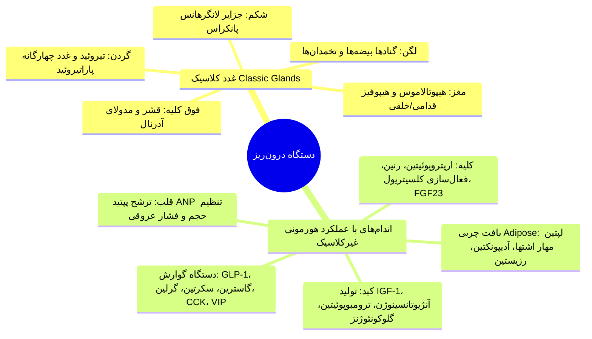
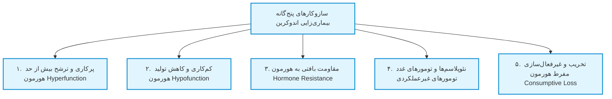
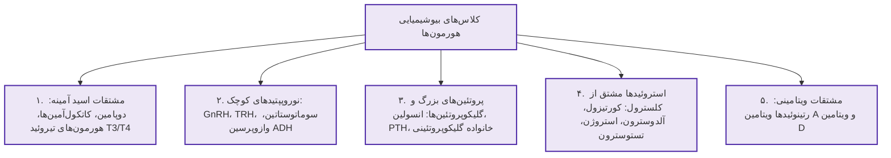
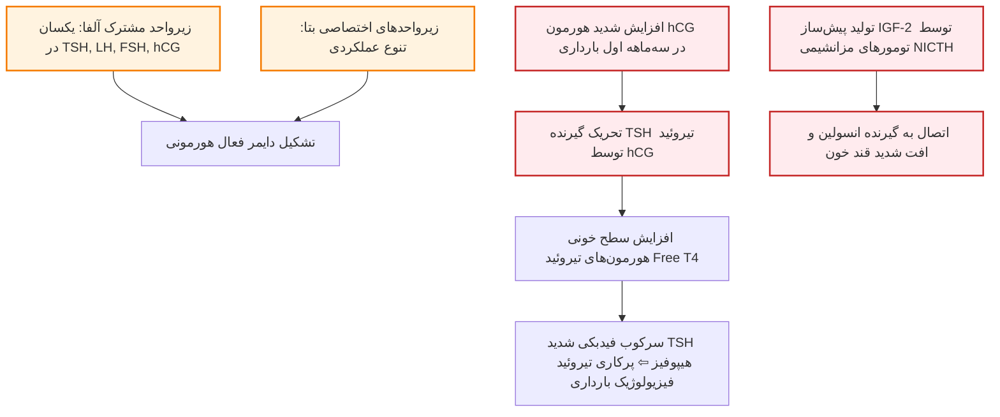
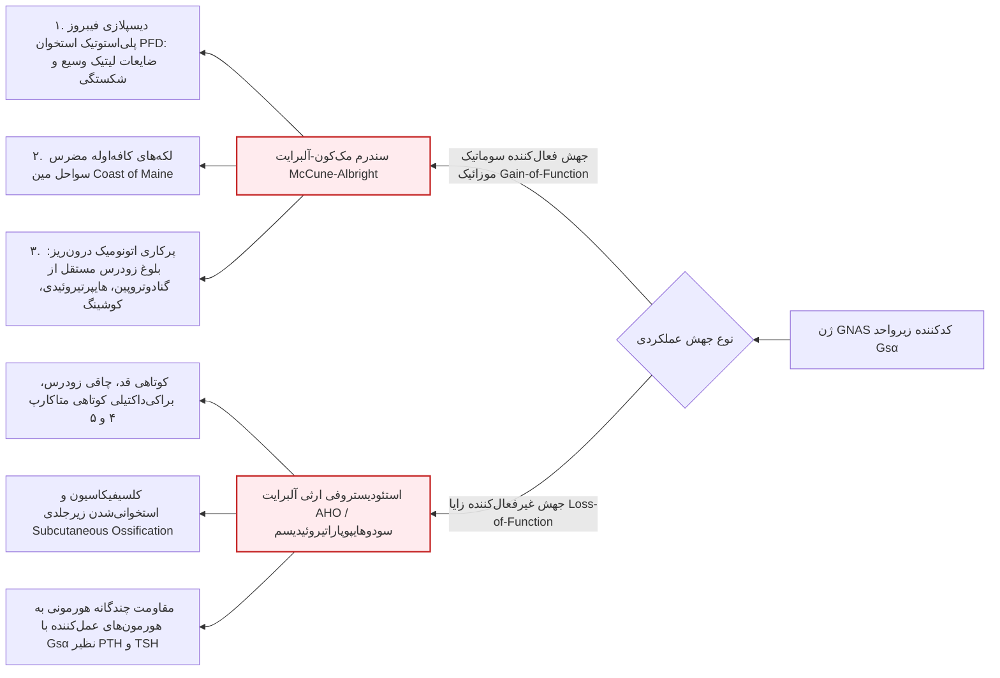
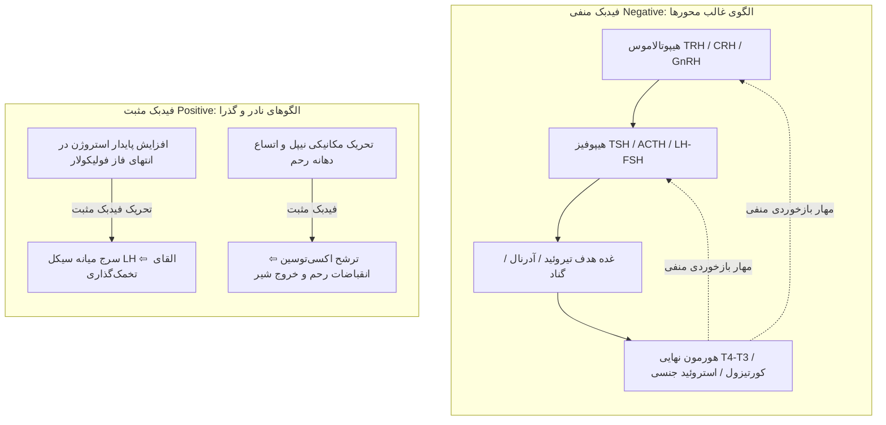
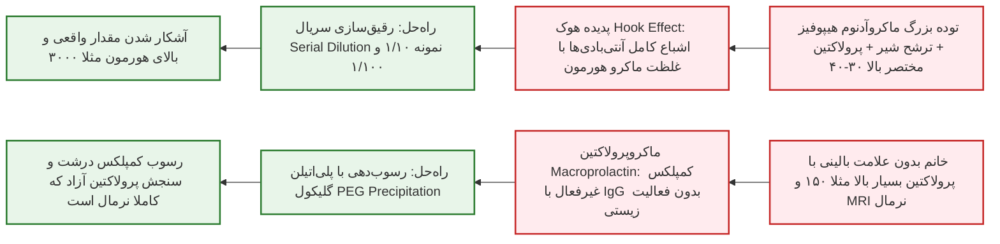
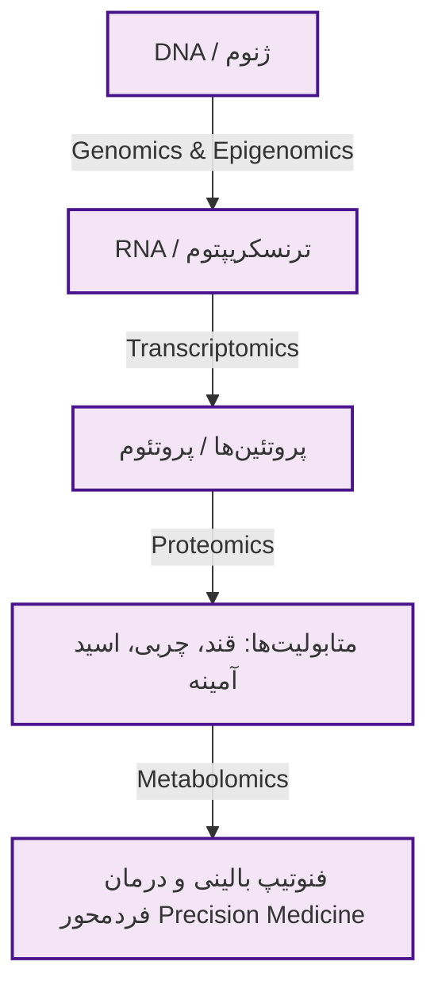

# کلیات و اصول پایه اندوکرینولوژی (General Principles of Endocrinology)

## ۱. تاریخچه، مفاهیم بنیادین و تفاوت اندوکرین و اگزوکرین

> [!definition] ترشحات درون‌ریز (Endocrine) در برابر برون‌ریز (Exocrine)
> * **دستگاه درون‌ریز (Endocrine):** ترشح مستقیم پیام‌رسان‌های شیمیایی (**هورمون‌ها**) به درون شبکه مویرگی خونی جهت انتقال به اندام‌های هدف دوردست (فاقد مجرای ترشحی).
> * **دستگاه برون‌ریز (Exocrine):** تخلیه ترشحات به داخل حفرات و لومن‌های بدن یا سطوح مخاطی و پوست از طریق مجاری اختصاصی (نظیر ترشحات گوارشی اسید معده، بزاق، آنزیم‌های برون‌ریز پانکراس، عرق و غدد سباسه).

* **گاه‌شمار پیشرفت تاریخی علم اندوکرینولوژی:**
  1. **1766:** نخستین شواهد ترشحات داخلی ارگان‌ها کشف و مطرح شد.
  2. **1904:** *موریس آدولف لیمون (Maurice Adolph Limon)* برای اولین بار اصطلاح تخصصی **Endocrine** را ابداع کرد.
  3. **1905:** *ارنست استارلینگ (Ernest H. Starling)* واژه **Hormone** را از ریشه یونانی به معنای *به حرکت درآوردن (To set in motion)* وضع کرد؛ دلالت بر **ماهیت پویا، دینامیک و فیدبک‌محور** هورمون‌ها.
  4. **1921 تا 1923:** کشف تاریخی هورمون **انسولین**؛ دگرگونی نجات‌بخش و بقای قطعی بیماران مبتلا به دیابت نوع ۱ از مرگ حتمی.

### تفاوت ساختاری دستگاه غدد با سایر دستگاه‌های پزشکی
* سیستم‌های تنفس، گوارش یا ادراری واجد **پیوستگی پیوسته آناتومیک (Anatomic Line)** هستند.
* **دستگاه غدد درون‌ریز فاقد مرز و محور کالبدی ممتد است؛** ارگان‌ها و سلول‌های ترشحی در سراسر بدن به صورت جزیره‌ای پراکنده‌اند و از طریق گردش خون و اتصالات پیام‌رسانی نورواندوکرین، شبکه‌ای واحد و یکپارچه را سازماندهی می‌کنند.

---

## ۲. طبقه‌بندی غدد کلاسیک، اندام‌های غیرکلاسیک و تداخلات بین‌رشته‌ای



### تداخلات حیاتی اندوکرینولوژی با سایر تخصص‌های بالینی
* **قلب و عروق (Cardiovascular):** تنظیم دقیق فشار، حجم و تون عروقی توسط کاتکول‌آمین‌ها، آنژیوتانسین II، اندوتلین-۱ و نیتریک اکساید (NO)؛ قلب خاستگاه اصلی ترشح هورمون **ANP** (تنظیم دفع سدیم و افت فشار خون) است.
* **خونسازی و مغز استخوان (Bone Marrow):** هورمون گلیکوپروتئینی **اریتروپوئیتین (EPO)** که در کلیه سنتز می‌شود، محرک اصلی تمایز رده اریتروئید در مغز استخوان است.
* **کلیه (Renal System):** تنظیم آب و املاح توسط محور رنین-آنژیوتانسین، مینرالوکورتیکوئیدها، PTH، وازوپرسین (ADH) و فاکتور اتلاف فسفات **FGF23**.
* **دستگاه گوارش و متابولیسم (GI & Nutrition):** ترشح هورمون‌های اینکرتینی (**GLP-1** از سلول‌های L ایلئوم)، **گرلین** (محرک اشتها از معده)، کوله‌سیستوکینین (CCK) و VIP.
* **بافت چربی به عنوان غده اندوکرین فعال:** ترشح **لپتین** (ارسال سیگنال سیری به نورون‌های هیپوتالاموس) و هورمون‌های تنظیم‌کننده حساسیت انسولین (**آدیپونکتین**).

---

## ۳. مکانیسم‌های بنیادین پاتوژنز و بیماری‌زایی در دستگاه غدد



### ۱. پرکاری هورمونی (Hormone Excess / Hyperfunction)
1. **نئوپلازی‌های خوش‌خیم:** آدنوم‌های هیپوفیز (پرولاکتینوما، کوشینگ، آکرومگالی)، آدنوم پاراتیروئید (هایپرپاراتیروئیدی اولیه)، ندول‌های توکسیک اتونوم تیروئید و آدرنال.
2. **نئوپلازی‌های بدخیم:** سرطان کورتکس آدرنال (ACC)، سرطان مدولاری تیروئید (MTC).
3. **ترشح نابجا (Ectopic):** ترشح Ectopic ACTH در کارسینوئید یا سرطان ریه، سندرم SIADH تومورال.
4. **سندرم‌های نئوپلازی چندگانه غدد:** MEN1 و MEN2.
5. **فرآیندهای خودایمن تحریکی:** بیماری گریوز ناشی از آنتی‌بادی‌های محرک گیرنده TSI/TRAb.
6. **عوامل یاتروژنیک (دارویی):** سندرم کوشینگ دارویی، هایپوگلایسمی دارویی با انسولین.
7. **جهش‌های فعال‌کننده گیرنده:** جهش در گیرنده‌های LH، TSH، کلسیم (CaSR)، هورمون PTH یا پروتئین Gsα.

### ۲. کم‌کاری هورمونی (Hormone Deficiency / Hypofunction)
1. **تخریب خودایمن:** تیروئیدیت هاشیموتو، دیابت نوع ۱ (تخریب سلول‌های بتای پانکراس)، بیماری آدیسون، سندرم‌های نارسایی پلی‌گلاندولار خودایمن (APS).
2. **یاتروژنیک:** هایپوپیتوئیتاریسم ناشی از رادیوتراپی سلا، کم‌کاری تیروئید پس از جراحی یا ید رادیواکتیو.
3. **عفونی و ارتشاحی:** سل آدرنال، سارکوئیدوز هیپوتالاموس، آمیلوئیدوز.
4. **جهش در ژن‌های ساخت هورمون:** جهش در ژن‌های کدکننده GH، زیرواحد بتای LH و FSH، وازوپرسین.
5. **نقایص آنزیمی مادرزادی:** نقص آنزیم ۲۱-هیدروکسیلاز در بیماری CAH.
6. **نقایص تکاملی و ژنتیکی:** سندرم کالمن (نقص مهاجرت نورونی)، سندرم ترنر (دیس‌ژنزی گناد).
7. **کمبودهای تغذیه‌ای:** کمبود ید (گواتر و کم‌کاری)، کمبود شدید ویتامین D (استئومالاسی).
8. **انفارکتوس و خونریزی بافتی:** سندرم شیهان (نکروز هیپوفیز پس از زایمان)، سندرم واترهاوس-فریدریکسن در سپسیس مننگوکوکی.

### ۳. مقاومت به هورمون (Hormone Resistance)
* عملکرد معیوب هورمونی علیرغم **غلظت‌های بسیار بالا و جهش‌یافته هورمون در گردش خون**.
* **مقاومت پس از گیرنده (Post-receptor):** مقاومت به انسولین در دیابت نوع ۲، مقاومت به لپتین در چاقی مفرط.
* **جهش گیرنده‌های غشایی یا هسته‌ای:** جهش گیرنده‌های غشایی (GH، وازوپرسین، LH، FSH، ACTH، PTH، CaSR) و گیرنده‌های هسته‌ای (AR, TR, VDR, ER, GR, PPARγ).
* **جهش در مسیرهای ترارسانی پیام:** استئودیستروفی ارثی آلبرایت (AHO).

### ۴. تخریب و غیرفعال‌سازی مصرفی هورمون (Consumptive Inactivation)
* نمونه تیپیک: **کم‌کاری تیروئید مصرفی (Consumptive Hypothyroidism)** در نوزادان مبتلا به همانژیوم‌های عروقی حجیم؛ بیان و فعالیت بسیار بالای آنزیم **دیودیناز نوع ۳ (D3)** در توده عروقی که مقادیر عظیم هورمون‌های تیروئید T4 و T3 را به متابولیت‌های غیرفعال rT3 و T2 تبدیل و غیرفعال می‌کند.

---

## ۴. بیماری‌های شایع در برابر بیماری‌های نادر اندوکرین

> [!important] قاعده طلایی تفکیک بیماری‌های شایع و نادر
> بیماری‌های اندوکرین به دو دسته تقسیم می‌شوند:
> 1. **بیماری‌های فوق‌العاده شایع:** مسئول بار بیماری‌های عمومی جامعه (دیابت، چاقی، دیس‌لیپیدمی، تیروئید، استئوپروز)؛ هر پزشک عمومی الزاما باید غربالگری، تشخیص و پروتکل‌های خط اول آن‌ها را بداند.
> 2. **بیماری‌های بسیار نادر:** با تظاهرات موذی و غیراختصاصی (کوشینگ، آدیسون، فئوکروموسیتوما، آکرومگالی)؛ نیازمند تفکر بالینی و مهارت ذهنی پزشک جهت پرهیز از خطای تشخیصی و ارجاع به‌موقع.

### جدول شیوع و توصیه‌های غربالگری اختلالات شایع اندوکرین در بالغان

| بیماری / اختلال | شیوع تقریبی در جمعیت بالغین | توصیه‌ها و معیارهای استاندارد غربالگری |
| :--- | :--- | :--- |
| **چاقی (Obesity)** | **40% چاق (BMI ≥ 30)** و **70% دارای اضافه‌وزن (BMI ≥ 25)** | سنجش دوره‌ای BMI، اندازه‌گیری دور کمر، رد علل ثانویه و بررسی کموربیدیتی‌ها |
| **دیابت قند نوع ۲ (T2DM)** | **بیش از 10 تا 15%** (همراه با پیش‌دیابت تا ۲۰٪ در ایران) | شروع غربالگری از سن ۴۵ سالگی هر ۳ سال یک‌بار (یا زودتر در افراد پرخطر) با FPG، A1c یا OGTT |
| **دیس‌لیپیدمی / هایپرلیپیدمی** | **20 تا 25%** | سنجش پروفایل چربی حداقل هر ۵ سال؛ فواصل کوتاه‌تر در CAD، دیابت و پرخطرها |
| **سندرم متابولیک** | **حدود 35%** | پایش دور کمر، قند ناشتا (FPG)، فشار خون و پروفایل لیپیدها |
| **کم‌کاری تیروئید (Hypothyroidism)** | **5 تا 10% در زنان** و ۰.۵ تا ۲٪ در مردان | سنجش پایه سرمی TSH و تأیید قطعی با سنجش سطح Free T4 |
| **بیماری گریوز (Graves' Disease)** | **1 تا 3% در زنان** و ۰.۱٪ در مردان | سنجش سرمی TSH، سطح هورمون Free T4 و تیتر آنتی‌بادی TRAb |
| **نودول‌های تیروئید (Thyroid Nodules)** | **2 تا 5% در لمس فیزیکی** و **بیش از 25 تا 50% در سونوگرافی** | معاینه بالینی دقیق گردن، اولتراسونوگرافی و بیوپسی سوزنی تحت گاید سونو (US-FNA) |
| **پوکی استخوان (Osteoporosis)** | **5 تا 10% در زنان** و ۲ تا ۵٪ در مردان | سنجش تراکم استخوان (BMD با DXA) در زنان ≥ ۶۵ سال و مردان ≥ ۷۰ سال یا افراد در معرض خطر |
| **ناباروری (Infertility)** | **حدود 10% زوج‌ها** | ارزیابی همزمان زوجین: آنالیز مایع منی مرد و پایش سیکل‌های تخمک‌گذاری زن |
| **سندرم تخمدان پلی‌کیستیک (PCOS)** | **5 تا 10% (تا 20% در مطالعات نوین زنان)** | سنجش تستوسترون آزاد، DHEA-S، رد هیپرپلازی آدرنال و سونوگرافی تخمدان‌ها |
| **هیرسوتیسم (Hirsutism)** | **5 تا 10% زنان** | نمره‌دهی بالینی Ferriman-Gallwey، سنجش تستوسترون آزاد و رد علل تومورال |
| **هایپرپرولاکتینمی** | **15% زنان مبتلا به آمنوره یا گالاکتوره** | سنجش سرمی پرولاکتین ناشتا و تصویربرداری MRI سلا در صورت نبود علت دارویی |
| **اختلال نعوظ (Erectile Dysfunction)** | **10 تا 25% مردان** | شرح حال دقیق، رد دیابت و آترواسکلروز عروقی، سنجش پرولاکتین و تستوسترون صبحگاهی |
| **هایپوگونادیسم مردانه** | **1 تا 2% مردان** | سنجش توتال و آزاد تستوسترون ساعت ۸ صبح ناشتا به همراه سطح LH و FSH |
| **ژنیکوماستی (Gynecomastia)** | **حدود 15% مردان** | رد سندرم کلاین‌فلتر (کاریوتایپ)، ارزیابی داروها، عملکرد کبد و تستوسترون |
| **کمبود ویتامین D** | **بیش از 10 تا 50% جامعه** | سنجش سطح سرمی 25-OH-D (هدف: حفظ بالای 30 ng/mL) |

### تله‌های بالینی در بیماری‌های نادر و تظاهرات غیراختصاصی
* **سندرم کوشینگ:** فردی با چاقی مقاوم که برای جراحی باریاتریک مراجعه کرده؛ در شرح حال منس نامنظم، فشار خون بالا و استریای ارغوانی بالای ۱ سانتی‌متر دارد.
* **فشار خون ثانویه مقاوم:** بیمار جوانی که با ۳ داروی ضد فشار خون کنترل نمی‌شود؛ شک به فئوکروموسیتوما، هایپرآلدوسترونیسم اولیه یا کوشینگ.
* **بیماری آدیسون (نارسایی اولیه آدرنال):** خانم جوانی با ۶ ماه درد شکم، تهوع، استفراغ مکرر و کاهش وزن شدید که بارها تحت آندوسکوپی و کولونوسکوپی نرمال قرار گرفته؛ سرنخ طلایی: **فشار خون پایین (BP = 80/50 mmHg)، تاکی‌کاردی، پیگمانتاسیون لثه و خطوط دست، و ولع شدید به نمک و پفک**.
* **اورژانس خط اول DKA:** کودک مراجعه‌کننده با درد شکم و استفراغ که نباید اشتباهاً با برچسب گاستروانتریت ساده و داروی ضدتهوع ترخیص شود؛ **سنجش فوری قند خون (BS) بر بالین جهت رد شروع دیابت نوع ۱ و کتواسیدوز دیابتی الزامی است**.

---

## ۵. ساختار بیوشیمیایی هورمون‌ها و پدیده همپوشانی (Cross-Talk)



### خانواده هورمون‌های گلیکوپروتئینی (Glycoprotein Family)
* **اعضای خانواده:** شامل **TSH**، **LH**، **FSH** و هورمون جفتی **hCG**.
* **معماری هترودایمر:**
  1. **زیرواحد آلفا (α-subunit):** در هر ۴ هورمون **کاملاً یکسان، مشترک و دارای توالی اسیدآمینه برابر** است.
  2. **زیرواحد بتا (β-subunit):** در هر هورمون اختصاصی و متمایز بوده و ویژگی اتصالی به گیرنده را تعیین می‌کند.



> [!important] تله‌های تشخیصی پدیده کراس‌تاک (Receptor Cross-Talk)
> * **بارداری و هورمون تیروئید:** غلظت بالای hCG در هفته‌های ۱۰ تا ۱۲ بارداری به علت شباهت با TSH، مستقیماً گیرنده TSH تیروئید را تحریک می‌کند ⇦ **افت گذرا و طبیعی TSH به همراه افزایش هورمون تیروئید**.
> * **سندرم هیپوگلیسمی تومورهای غیرجزیره‌ای (NICTH):** تولید مقادیر مازاد پیش‌ساز IGF-2 توسط سارکوم‌ها سبب اتصال به گیرنده‌های انسولین و IGF-1 و افت شدید قند خون می‌شود.
> * **اتصال متقابل انسولین به گیرنده IGF-1:** در هایپرانسولینمی شدید و چاقی، مقادیر بالای انسولین با اتصال به گیرنده‌های میتوژنیک IGF-1 پوست، پدیده **آکانتوزیس نیگریکانس (Acanthosis Nigricans)** را ایجاد می‌کند.

---

## ۶. گیرنده‌های هورمونی، مسیرهای پیام‌رسانی و سندرم‌های جهش Gsα

| نوع گیرنده | ساختار و کلاس لیگاندها | پروتئین‌های واسط و افکتورها | پیامبر ثانویه و مسیر پیام‌رسانی | مثال‌های شاخص هورمونی |
| :--- | :--- | :--- | :--- | :--- |
| **GPCR (Gsα)** | ۷ بار گذرنده از غشا (7-TM) | پروتئین هتروتریمر Gsα و آدنیلات سیکلاز | **افزایش cAMP** و فعال‌سازی **Protein Kinase A (PKA)** | **β-آدرنرژیک، LH، FSH، TSH، گلوکاگون، PTH، PTHrP، ACTH، MSH، GHRH، CRH** |
| **GPCR (Giα)** | ۷ بار گذرنده از غشا | پروتئین مهارکننده Giα | **کاهش cAMP** و باز شدن کانال‌های K+ و مهار Ca2+ | **α2-آدرنرژیک، سوماتوستاتین** |
| **GPCR (Gq/G11)** | ۷ بار گذرنده از غشا | فسفولیپاز C (PLC) | تولید **IP3 و DAG** ⇦ افزایش کلسیم سیتوزولی و **PKC** | **TRH، GnRH** |
| **تیروزین کیناز (RTK)** | گیرنده غشایی با فعالیت کینازی ذاتی | اتوفسفوریلاسیون تیروزین، IRS | مسیرهای متابولیک **PI3K/Akt** و میتوژنیک **Ras/Raf/MAPK** | **انسولین، IGF-1، فاکتور رشد EGF، NGF** |
| **متصل به کیناز سایتوکینی** | گیرنده فاقد دومین کینازی مستقل | کینازهای سیتوپلاسمی JAK | فسفوریلاسیون فاکتورهای رونویسی **STAT** | **هورمون رشد (GH)، پرولاکتین (PRL)** |
| **سرین کیناز** | دومین سرین/ترئونین کیناز | پروتئین‌های ترارسانی Smads | فعال‌سازی ترانسکریپشن هسته‌ای | **اکتیوین، TGF-β، هورمون مهارکننده مولرین (MIS/AMH)** |
| **گیرنده‌های هسته‌ای/داخل‌سلولی** | فاکتورهای رونویسی متصل‌شونده به DNA | انتقال به هسته و اتصال به عناصر HRE | تنظیم مستقیم رونویسی ژن‌ها | **استروئیدها (کورتیزول، آلدوسترون، استروژن، پروژسترون، تستوسترون)، ویتامین D، تیروئید (T3/T4)** |

> [!important] استثنای طلایی بیوشیمی هورمون تیروئید
> هورمون‌های تیروئید (T3 و T4) علیرغم اینکه ساختار مشتق از اسید آمینه تیروزین دارند، به دلیل حلالیت در چربی و انتقال غشایی، **دارای گیرنده داخل‌سلولی و هسته‌ای (TRα و TRβ)** هستند (نه گیرنده غشایی).

### سندرم‌های جهش زیرواحد Gsα (ژن GNAS)



---

## ۷. پروتئین‌های ناقل، توزیع سرمی و تنظیم فیدبکی هورمون‌ها

> [!definition] کسر آزاد (Free Fraction) در برابر باند (Bound)
> بخش عمده هورمون‌های استروئیدی و تیروئیدی به پروتئین‌های ناقل پلاسما باند هستند و به عنوان **مخزن هورمونی غیرفعال** عمل می‌کنند تا از تجزیه و کلیرانس کلیوی زودهنگام جلوگیری شود؛ **صرفاً کسر آزاد (Free Hormone) قادر به عبور از عروق، ورود به سلول و اعمال اثر بیولوژیک است**.

* **پروتئین‌های حامل اصلی:**
  1. **TBG، آلبومین و ترانس‌تیرتین (پرآلبومین):** حامل هورمون‌های T4 و T3.
  2. **CBG (ترانس‌کورتین):** حامل اختصاصی کورتیزول پلاسما.
  3. **SHBG:** حامل هورمون‌های جنسی تستوسترون و استرادیول.
* **تله بالینی تغییرات ناقل در بارداری (TBG Effect):** استروژن ساخت کبدی TBG را تحریک می‌کند ⇦ مقادیر **Total T4 و Total Cortisol به شدت بالا** می‌روند در حالی که **Free T4 و Free Cortisol کاملاً طبیعی** هستند و فرد بیولوژیک یوتیروئید و یورتیکوئید است.

### الگوهای تنظیم فیدبک هورمونی



---

## ۸. ریتم‌های شبانه‌روزی ترشح هورمونی (Circadian & Ultradian)

> [!definition] ریتم سیرکادین (Circadian Rhythm)
> نوسانات درون‌زاد ۲۴ ساعته ترشح هورمونی تحت فرمان ساعت بیولوژیک هسته سوپراکایاسماتیک (SCN) هیپوتالاموس؛ تطابق ریتم زندگی با این سیکل ریسک سرطان، دیابت و حوادث قلبی را کاهش می‌دهد (نوبل فیزیولوژی ۲۰۱۷ به هال، روزباش و یانگ).

```
        پیک ماکزیمم صبحگاهی (۸-۶ صبح)
             ▲
             │       /───────\
             │      /         \  غذا (ناهار)
             │     /           \     /\
             │    /             \___/  \   شام
             │   /                       \   /\
             │  /                         \_/  \
             │ /                                \______
             │/                                        \
          ───┴───────────────────────────────────────────► زمان (۲۴ ساعت)
          ۱۲ شب      ۸ صبح      ۱۲ ظهر     ۶ عصر     ۱۲ شب (Nadir کمترین حد)
```

* **دینامیک زمانی هورمون‌ها در طول شبانه‌روز:**
  * **کورتیزول:** کمترین مقدار (Nadir) در **نیمه‌شب (ساعت ۲۳ تا ۲۴)** ⇦ صعود ۵ برابری به سمت سحر ⇦ **پیک ماکزیمم در ساعت ۶ تا ۸ صبح**.
  * **ملاتونین:** شروع ترشح از تاریکی غروب (۸ شب)، اوج ترشح در خواب عمیق (۲ تا ۴ صبح).
  * **تستوسترون:** اوج ترشح در ساعات اولیه صبحگاهی در مردان جوان.
  * **ترشح ضربانی (Pulsatile / Ultradian):** ترشح پالس‌های کوتاه GnRH و هورمون رشد (GH) هر ۸۰ تا ۱۲۰ دقیقه؛ **اندازه‌گیری تک‌نمونه رندوم GH فاقد هرگونه ارزش تشخیصی است**.

---

## ۹. تداخلات آزمایشگاهی: اثر هوک و ماکروپرولاکتین



### مقایسه تفکیکی تداخل پدیده هوک و ماکروپرولاکتین

| شاخص بالینی | پدیده هوک (Hook Effect) | ماکروپرولاکتین (Macroprolactinemia) |
| :--- | :--- | :--- |
| **تظاهر بالینی بیمار** | **علائم شدید و واضح** (گالاکتوره، سردرد، آدنوم بزرگ در MRI) | **کاملاً بدون علامت** یا علائم غیراختصاصی با MRI کاملاً نرمال |
| **نتیجه گزارش اولیه آزمایشگاه** | **پایین یا مختصر بالا به صورت کاذب** (تداخل منفی) | **بسیار بالا به صورت کاذب** (تداخل مثبت) |
| **پاتوفیزیولوژی تداخل** | اشباع آنتی‌بادی‌های Capture و Tracer ایمونواسی دوطرفه ساندویچی | حضور اتوآنتی‌بادی IgG متصل به پرولاکتین بدون فعالیت بیولوژیک |
| **روش آزمایشگاهی رفع خطا** | **رقیق‌سازی متوالی نمونه خون (Serial Dilution)** | **رسوب‌دهی کمپلکس با پلی‌اتیلن گلیکول (PEG Precipitation)** |
| **اهمیت بالینی** | پرهیز از تشخیص نادرست آدنوم غیرعملکردی و جراحی اشتباه | پرهیز از تصویربرداری و درمان دارویی بی‌مورد با کابرگولین |

---

## ۱۰. اصول تست‌های دینامیک هورمونی (Dynamic Testing)

> [!important] قاعده طلایی در تست‌های دینامیک اندوکرین
> **مقادیر پایه هورمون‌ها به صورت منفرد قابل قضاوت قطعی نیستند:**
> * **شک به کم‌کاری (Hypofunction / Deficiency):** انجام **تست تحریکی (Stimulation Test)**؛ اگر غده پس از تحریک هورمون کافی تولید نکند، نارسایی اثبات می‌شود.
> * **شک به پرکاری (Hyperfunction / Excess):** انجام **تست مهاری (Suppression Test)**؛ اگر ترشح پس از مانور مهاری متوقف نشود، خودمختاری پاتولوژیک اثبات می‌شود.

### ۱. تست‌های تحریکی استاندارد (Stimulation Tests)
1. **تست تحریک با کوسینتروپین (ACTH Stimulation Test):**
   * کاربرد: اثبات **نارسایی آدرنال (بیماری آدیسون)**.
   * پروتکل: تزریق 250 µg کوسینتروپین؛ در فرد سالم سطح کورتیزول به **بالای 18-20 mcg/dL** می‌رسد. در آدیسون به علت تخریب غده، پاسخ به زیر ۱۸ محدود می‌ماند.
2. **تست تحمل انسولین (Insulin Tolerance Test - ITT):**
   * استاندارد طلایی بررسی **کمبود هورمون رشد (GH) و نارسایی محور آدرنال**.
   * مکانیسم: تزریق انسولین و افت قند به زیر ۴۰؛ استرس حاد ناشی از هایپوگلایسمی در فرد سالم محرک ترشح انفجاری هورمون رشد و کورتیزول است.

### ۲. تست‌های مهاری استاندارد (Suppression Tests)
1. **تست سرکوب دگزامتازون شبانه (Overnight 1mg-DST):**
   * کاربرد: غربالگری **سندرم کوشینگ**.
   * پروتکل: بلع ۱ میلی‌گرم دگزامتازون ساعت ۲۳؛ سنجش کورتیزول ساعت ۸ صبح فردا.
   * پاسخ طبیعی: کورتیزول به دلیل فیدبک منفی به **زیر 1.8 mcg/dL** سرکوب می‌شود. در کوشینگ سرکوب مهار شده و کورتیزول بالا می‌ماند.
2. **تست چالش تحمل گلوکز (OGTT برای GH):**
   * کاربرد: اثبات **آکرومگالی**.
   * مکانیسم: تجویز ۷۵ گرم گلوکز خوراکی؛ در فرد سالم بار قندی ترشح هورمون رشد را به زیر 1 mcg/L (یا زیر ۰.۴) سرکوب می‌کند. در آکرومگالی GH سرکوب نمی‌شود.
3. **تست چالش گرسنگی ۷۲ ساعته (72-Hour Fasting Test):**
   * کاربرد: اثبات **انسولینوما**.
   * پروتکل: بستری بیمار و قطع غذا؛ با افت قند به زیر ۵۵، انسولین درون‌زاد فرد سالم خاموش شده و به زیر 3 µU/mL می‌رسد. در انسولینوما سطح انسولین بالای ۳ و نامتناسب با هایپوگلایسمی باقی می‌ماند.

---

## ۱۱. فناوری‌های نوین، امیکس و افق‌های آینده اندوکرینولوژی



### ۱. فناوری‌های مانیتورینگ و دارورسانی دیابت
* **پایش مداوم قند (CGM / Continuous Glucose Monitoring):** سنسورهای زیرجلدی با طول عمر ۲ هفته‌ای؛ سنجش ۲۴ ساعته گلوکز مایع بین‌بافتی هر ۵ دقیقه یک‌بار، مجهز به آلارم افت قند به زیر ۷۰ mg/dL (پیشگیری قطعی از تشنج و کمای شبانه).
* **پمپ‌های انسولین و سیستم‌های حلقه بسته (Closed-Loop):** پانکراس مصنوعی با تنظیم خودکار تزریق انسولین بر مبنای گلوکز CGM.
* **انسولین‌های نسل نوین:** تولید فرمولاسیون‌های **انسولین هفتگی (Weekly Insulin)** و هوشمند.
* **سلول‌های بنیادی (Stem Cell Therapy):** بازسازی و تمایز سلول‌های بتای تولیدکننده انسولین جهت درمان قطعی دیابت نوع ۱.

### ۲. دارودرمانی نوین چاقی و متابولیسم
* **آگونیست‌های گیرنده GLP-1 و دوگانه GLP-1/GIP (سماگلوتاید، تیرزپاتاید):**
  * کشف اولیه مولکول در سال ۱۹۸۵ از پپتید اگزندین-۴ بزاق مارمولک هیلا (Gila Monster).
  * ایجاد **کاهش وزن چشمگیر بین ۲۰ تا ۳۰ درصد طی ۶ ماه** (هم‌تراز با جراحی‌های چاقی).
  * منافع ارگانیک: کاهش حوادث قلبی-عروقی ماژور، مهار پیشرفت دیابت و بهبود فیبروز کبدی در بیماری MASLD (کبد چرب).
* **رتاتروتاید (Retatrutide):** آگونیست سه‌گانه نسل جدید (GLP-1, GIP, Glucagon) با پتانسیل کاهش وزن تا ۳۵٪.

### ۳. پزشکی دقیق در سرطان‌های تیروئید (Personalized Thyroid Oncology)
* درمان هدفمند کینازی بر اساس جهش‌های تومور:
  * مهارکننده جهش اختصاصی **BRAF V600E** (داروی دبرافنیب و ومورافنیب).
  * مهارکننده‌های تیروزین کیناز مسیرهای **RET**، **RET/PTC**، **VEGFR** (کابوزانتینیب، واندتانیب، لنوانیب و سورافنیب).

---

## ۱۲. تابلوی جامع سناریوهای امتحانی و تله‌های بالینی

| سناریوی بالینی بیمار | یافته‌های پاراکلینیک | خطای تفسیری محتمل | تشخیص قطعی و اقدام صحیح |
| :--- | :--- | :--- | :--- |
| **دختر ۲۴ ساله بدون علامت با آزمایش چکاپ** | پرولاکتین $= 160\text{ ng/mL}$ و MRI سلا نرمال | تجویز اشتباه کابرگولین با تصور میکروپرولاکتینوما | **ماکروپرولاکتینمی کاذب**؛ درخواست تست رسوب با پلی‌اتیلن گلیکول (PEG). |
| **مرد ۴۰ ساله با سردرد، اختلال دید و توده ۳ سانتی‌متری هیپوفیز** | پرولاکتین $= 35\text{ ng/mL}$ (مختصر بالا) | تشخیص اشتباه آدنوم غیرعملکردی با اثر فشاری ساقه | **پدیده هوک (Hook Effect)**؛ درخواست رقیق‌سازی سریال (Dilution) نمونه. |
| **خانم باردار هفته ۱۰ با تهوع شدید و تپش قلب** | $\text{TSH} < 0.05$ و $\text{Free T4}$ مختصر بالا | تشخیص اشتباه بیماری گریوز و شروع متی‌مازول | **کروس‌تاک hCG با گیرنده TSH**؛ پرکاری گذرا، عدم نیاز به داروی ضدتیروئید. |
| **کودک با لکه‌های قهوه‌ای نامنظم و شکستگی مکرر استخوان** | بلوغ زودرس بدون افزایش LH/FSH | شک به تومور هیپوفیز و انجام گنادوتروپین | **سندرم مک‌کون-آلبرایت (جهش Gsα)**؛ درمان با مهارکننده‌های آروماتاز. |
| **کودک با کوتاهی قد، صورت گرد و کوتاهی انگشت ۴ و ۵** | کلسیم پایین، فسفر بالا و PTH بسیار بالا | اشتباه با کمبود تغذیه‌ای ویتامین D | **استئودیستروفی ارثی آلبرایت (AHO)** ناشی از جهش غیرفعال‌کننده Gsα. |
| **خانم جوان با درد شکم، تهوع، ضعف و افت فشار وضعیتی** | سدیم $= 128$ ، پتاسیم $= 5.8$ ، قند $= 65$ | درمان علامتی با سرم ضدتهوع برای گاستروانتریت | **بحران نارسایی آدرنال (Addison)**؛ چک کورتیزول/ACTH و تزریق فوری هیدروکورتیزون. |
| **بیمار با قند ۴۵، تپش قلب و سطح انسولین برابر با 8 µU/mL** | رنج آزمایشگاهی نرمال انسولین (3-20) | رد اشتباه هایپرانسولینیسم به دلیل نرمال بودن عدد | **انسولینوما قطعی**؛ در قند زیر ۵۵ انسولین باید به زیر ۳ سرکوب شود نه ۸. |
