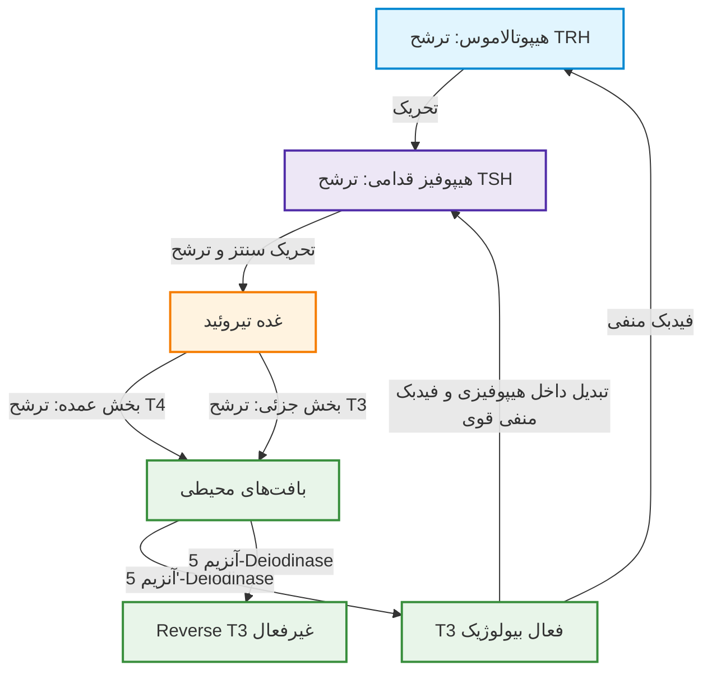
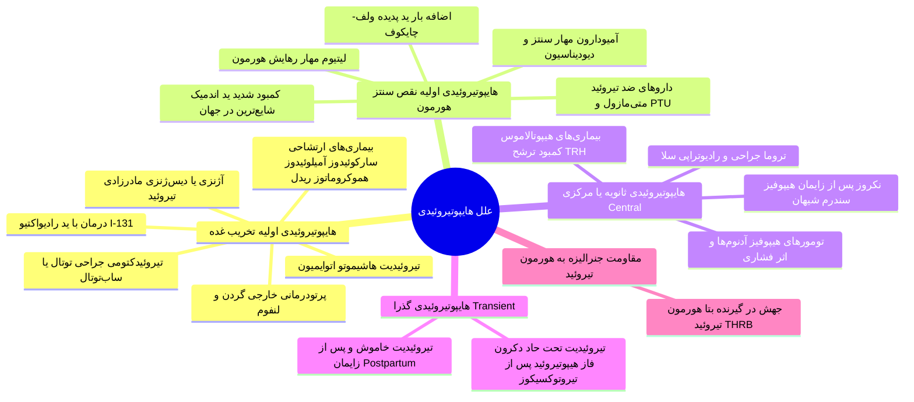
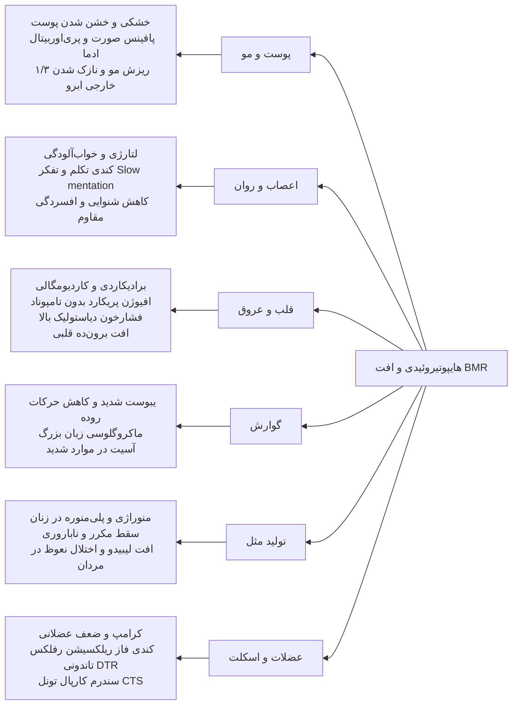
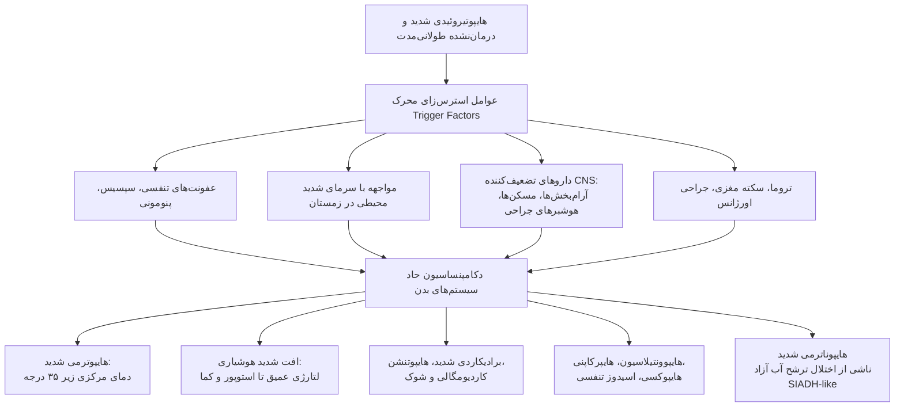
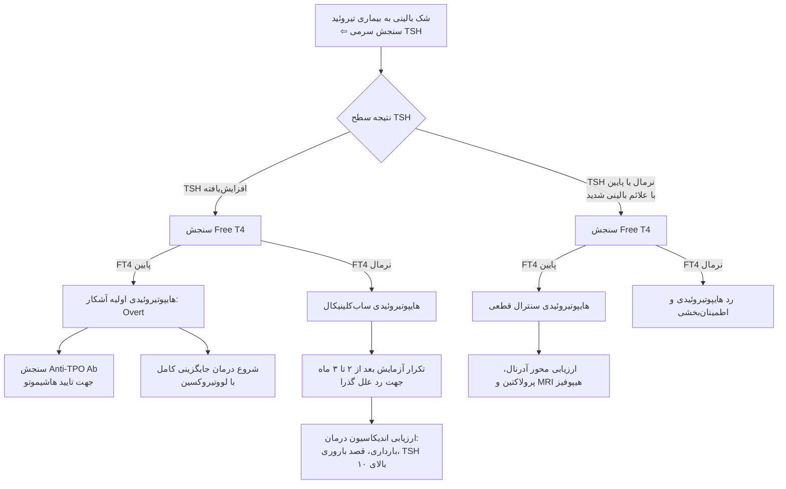
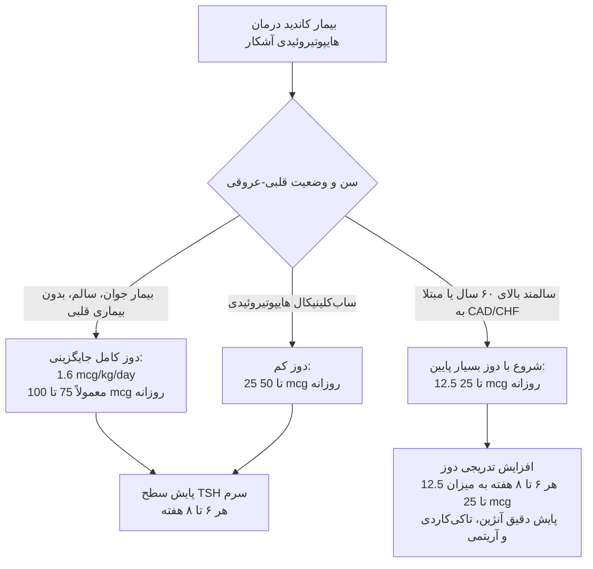

# اختلالات کم‌کاری تیروئید (Hypothyroidism)

## ۱. اپیدمیولوژی، تعاریف پایه و بیولوژی محور تیروئید

> [!abstract] کم‌کاری تیروئید (Hypothyroidism)
> سندرم بالینی ناشی از کمبود هورمون‌های تیروئید در سطح بافت‌ها که منجر به کاهش عمومی متابولیسم پایه (BMR) و تجمع گلیکوزآمینوگلیکان‌ها در بافت بینابینی می‌شود.

### آمار و شیوع (Whickham Survey)
* **بروز سالانه (Incidence):** در خانم‌ها **3.5 در 1000 نفر در سال**؛ در آقایان **0.6 در 1000 نفر در سال** (شیوع در زنان **۱۰ برابر** مردان).
* **بروز هایپرتیروئیدی در مقایسه:** در زنان **0.8 در 1000 نفر در سال** و در مردان بسیار ناچیز است (بروز هایپوتیروئیدی بسیار شایع‌تر از هایپرتیروئیدی است).
* **سن ابتلا:** افزایش شیوع با افزایش سن، به‌ویژه در زنان **بالای ۴۰ سال**؛ اما طیف بروز از بدو تولد تا کهنسالی گسترده است.

> [!abstract] کرتینیسم (Cretinism)
> فرم مادرزادی و شدید کم‌کاری تیروئید از بدو تولد؛ با نقایص شدید تکاملی اسکلتی، کوتاه قدی غیرمتناسب و عقب‌ماندگی ذهنی غیرقابل برگشت مشخص می‌شود.

> [!abstract] میکسدم (Myxedema)
> تظاهر بالینی فرم شدید و پیشرفته هایپوتیروئیدی؛ ناشی از انباشت موکوپلی‌ساکاریدهای هیدروفیل (به‌ویژه اسید هیالورونیک و کندروایتین سولفات) در ماتریکس درم و بافت‌های بینابینی که منجر به ادم غیرگوده‌گذار (Non-pitting) و خشونت چهره می‌شود.

### فیزیولوژی ترشح، فعال‌سازی و حامل‌های سرمی هورمون
1. **محور TRH-TSH:** هورمون تری‌پپتیدی TRH (پیروگلوتامیل-هیستیدیل-پرولین آمید) از هیپوتالاموس ترشح شده ⇦ تحریک سلول‌های تیروتروپ هیپوفیز قدامی ⇦ ترشح TSH (گلیکوپروتئین) ⇦ تحریک ساخت و رهایش T4 و T3 از غده تیروئید.
2. **فیدبک منفی:** تست اصلی بازدارنده محور، تبدیل موضعی T4 به T3 در خود سلول‌های هیپوفیز توسط دیودیناز تیپ ۲ است. **T3 بافتی مهارکننده نهایی ترشح TSH است**.
3. **تولید هورمونی:** عمده ترشح غده تیروئید **تترایدوتیرونین (T4)** است. T4 یک پرو-هورمون است.
4. **فعال‌سازی محیطی:** در بافت‌های محیطی (کبد، کلیه، عضلات) توسط آنزیم 5'-Deiodinase به **T3** (فرم فعال بیولوژیک با میل اتصالی چندصد برابر بیشتر به گیرنده هسته‌ای) تبدیل می‌شود.
5. **غیرفعال‌سازی:** متابولیسم T4 توسط آنزیم 5-Deiodinase به **Reverse T3 (rT3)** (فاقد هرگونه فعالیت بیولوژیک) و در ادامه به 3,3'-T2 ختم می‌شود. دفع کبدی و ترشح به صفرا مسیر اصلی پاکسازی است.
6. **پروتئین‌های ناقل:** بیش از **99.7%** هورمون‌های T4 و T3 در گردش خون به پروتئین‌ها متصل هستند:
   * **TBG (Thyroxine-Binding Globulin):** حامل اصلی با بالاترین افینیتی.
   * **ترانس‌تیرتین (Transthyretin / Prealbumin)** و **آلبومین**.
   * **تنها فرم آزاد (Free T4 / Free T3):** به میزان کمتر از 0.3% از نظر بیولوژیک فعال بوده و قابلیت ورود به سلول‌ها را دارد.

---

## ۲. اتیولوژی و طبقه‌بندی جامع انواع هایپوتیروئیدی

### علل شایع هایپوتیروئیدی به تفکیک جغرافیایی و بالینی

| طبقه‌بندی اتیولوژیک | مکانیسم اصلی آسیب | مشخصات و سرنخ‌های بالینی |
| :--- | :--- | :--- |
| **کمبود ید (Iodine Deficiency)** | عدم وجود سوبسترا برای ارگانیکاسیون تیروگلوبولین | **شایع‌ترین علت در کل جهان**؛ شایع در مناطق کوهستانی و اندمیک؛ همراه با **گواتر بزرگ اندمیک** و کرتینیسم. ایران وضعیت Borderline تا Sufficient دارد. |
| **تیروئیدیت هاشیموتو (Hashimoto's)** | تخریب اتوایمیون تیروئید با واسطه سایتوتوکسیک و آنتی‌بادی | **شایع‌ترین علت در مناطق با ید کافی (از جمله ایران)**؛ ارتباط با آنتی‌بادی‌های **Anti-TPO** و **Anti-Tg**؛ گواتر با قوام لاستیکی یا آتروفی نهایی. |
| **یاتروژنیک (درمانی)** | تخریب فیزیکی یا ایزوتوپی سلول‌های فولیکولی | متعاقب تجویز **I-131** جهت گریوز (افت عملکرد طی ۳ ماه)، یا **تیروئیدکتومی توتال/ساب‌توتال**. |
| **دارویی (Drug-Induced)** | بلوک ساخت هورمون، مهار رهایش یا ارگانیکاسیون | **متی‌مازول، PTU، لیتیوم** (مهار خروج هورمون)، **آمیودارون** (حاوی ید فراوان، اثر ولف-چایکوف و تیروئیدیت تخریبی). |
| **تیروئیدیت‌های گذرا** | تخریب فولیکول ⇦ تیروتوکسیکوز تخلیه‌ای (۱ تا ۳ ماه) ⇦ فاز هایپوتیروئید ناشی از تخلیه ذخایر | **تیروئیدیت تحت‌حاد (Subacute / De Quervain):** با درد شدید گردن و افزایش ESR. **تیروئیدیت سایلنت یا پست‌پارتوم:** تیروئیدیت بدون درد در زنان پس از زایمان؛ خودبه‌خود بهبود می‌یابد. |
| **سنترال (هیپوفیز / هیپوتالاموس)** | کمبود ترشح TSH یا TRH ناشی از تومور یا تروما | T4 آزاد پایین همراه با **TSH پایین، نرمال یا کمی بالا (غیرفعال بیولوژیک)**؛ همراهی با سایر نقایص هورمونی هیپوفیز. |
| **مقاومت محیطی جنرالیزه** | موتاسیون گیرنده هورمون تیروئید | T4 و T3 بالا، TSH بالا یا نرمال نامتناسب، بیمار دارای علائم بالینی کم‌کاری بافتی. |

---

## ۳. تظاهرات بالینی، نشانه‌ها و درگیری ارگان‌های بدن

> [!important] قاعده نیمه‌عمر و شروع علائم
> به دلیل نیمه‌عمر طولانی T4 در گردش خون (حدود **۷ روز**)، علائم بالینی به کندی و در طول هفته‌ها تا ماه‌ها استقرار می‌یابند.

### علائم و نشانه‌ها بر اساس دستگاه‌های بدن

### شرح تفصیلی تظاهرات بالینی سیستمیک
1. **پوست و ضمائم (شایع‌ترین تظاهر اولیه):**
   * پوست سرد، خشک، خشن و هایپرکراتوتیک (به‌ویژه روی سطوح اکستانسور مانند آرنج‌ها).
   * **رنگ‌پریدگی با ته‌رنگ زرد (Carotenemia):** به علت اختلال در تبدیل کاروتن به ویتامین A در کبد.
   * **ریزش موی سر و ریزش یک‌سوم خارجی ابروها (Madarosis):** تظاهر بسیار اختصاصی تیروئید.
   * **پافینس صورت و پریکارد/پری‌اوربیتال ادما:** تورم نان‌پیتینگ دور چشم و پشت دست و مچ پا ناشی از رسوب موکوپلی‌ساکاریدها.
2. **سیستم قلبی-عروقی:**
   * **برادیکاردی سینوسی** و کاهش قدرت انقباضی میوکارد ⇦ کاهش برون‌ده قلبی و عدم تحمل ورزش.
   * **پرزش اورژانسی تله تستی:** افزایش مقاومت عروق محیطی (SVR) سبب **افزایش فشار خون دیاستولیک** و کاهش فشار نبض (Narrow Pulse Pressure) می‌شود (برعکس هایپرتیروئیدی که فشار سیستولیک بالا و Wide Pulse Pressure دارد).
   * **افیوژن پریکارد:** مایع با غلظت بالای پروتئین و کلسترول در پریکارد جمع می‌شود؛ به ندرت به تامپوناد منجر می‌گردد.
   * در نوار قلب (ECG): **کاهش ولتاژ کمپلکس‌های QRS، برادیکاردی و تغییرات غیراختصاصی قطعه ST و موج T**.
   * افزایش آنزیم‌های قلبی و عضلانی (CK و LDH) به دلیل افزایش نفوذپذیری غشای میوسیت‌ها.
3. **سیستم اعصاب و روان:**
   * خواب‌آلودگی مفرط، لتارژی، کاهش تمرکز، افت حافظه، احساس رخوت و افسردگی شدید و مقاوم به درمان.
   * **گفتار و تفکر اسلوموشن (Slow Mentation & Speech):** بیمار مکث‌های طولانی پیش از پاسخ به سؤالات دارد.
   * در موارد بسیار شدید در سالمندان: پسیکوز حاد پارانوئید و هذیان (**Myxedema Madness**).
   * گیرافتادگی عصب مدین ناشی از رسوب مخاطی در مچ دست ⇦ **سندرم تونل کارپال (CTS)** دوطرفه.
   * کاهش شنوایی حسی-عصبی یا هدایتی به دلیل تجمع مایع موکوئیدی در گوش میانی و استاش.
4. **سیستم اسکلتی-عضلانی:**
   * ضعف پروگزیمال عضلانی، خستگی زودرس، کرامپ و میالژی.
   * پاتوفیزیولوژی علامت مهم معاینه: **تاخیر در فاز بازگشت (Relaxation Phase) رفلکس‌های تاندونی عمقی (Hung-up DTR)** به‌ویژه در رفلکس تاندون آشیل.
5. **متابولیسم و سیستم غدد:**
   * عدم تحمل شدید سرما (Cold Intolerance) و افت متابولیسم پایه.
   * **وزن:** افزایش وزن خفیف تا متوسط (عمدتاً بین **۵ تا ۱۰ پوند معادل ۳ تا ۵ کیلوگرم** ناشی از احتباس آب و نمک بافتی و نه توده چربی بزرگ). بیمار ۹۰ کیلویی چاقی خود را نباید به پای هایپوتیروئیدی بگذارد!
   * **پروفایل لیپید:** **هایپرکلسترولمی شدید** ناشی از کاهش تعداد و فعالیت گیرنده‌های LDL در کبد؛ افزایش سطح LDL و آپولیپوپروتئین B. هایپرتری‌گلیسریدمی نیز به دلیل افت فعالیت لیپوپروتئین لیپاز رخ می‌دهد.
6. **دستگاه گوارش:**
   * یبوست مزمن شدید ناشی از کاهش حرکات دودی؛ در موارد پیشرفته مگاکولون میکسدماتوز و ایلئوس پارالیتیک.
   * ماکروگلوسی (بزرگ شدن زبان) به علت ارتشاح موکوپلی‌ساکاریدها. آسیت بدون پرفشاری پورت.
7. **سیستم تولید مثل و زنان:**
   * الیگومنوره، منوراژی (خونریزی‌های شدید قاعدگی) و پلی‌منوره ناشی از عدم تخمک‌گذاری و نقایص فاز لوتئال.
   * **هایپرپرولاکتینمی و گالاکتوره:** سطوح بالای TRH سلول‌های لاکتوتروپ هیپوفیز را تحریک کرده و پرولاکتین را افزایش می‌دهد ⇦ مهار GnRH، ناباروری و سقط‌های مکرر.
   * در مردان: کاهش بارز میل جنسی (Libido)، اختلال نعوظ (Erectile Dysfunction) و الیگواسپرمی.

---

## ۴. کم‌کاری تیروئید مادرزادی (Congenital Hypothyroidism / Cretinism)

> [!danger] علائم هشدار اولیه در نوزادان (Red Flags)
> نوزاد با هایپوتیروئیدی مادرزادی در روزهای اول ممکن است به دلیل انتقال T4 مادری از جفت نرمال به نظر برسد؛ اما علائم زیر باید فوراً بررسی شوند:
> 1. **فتق نافی (Umbilical Hernia)**
> 2. **زردی فیزیولوژیک طول‌کشیده نوزادی (Prolonged Jaundice > 2 weeks)**
> 3. **خواب‌آلودگی غیرطبیعی و غیرعادی نوزاد (خوابیدن ممتد در طول شب و روز بدون بیدار شدن برای شیر)**
> 4. **یبوست شدید و اختلال تغذیه/شیرخوردن با زبان بزرگ (Macroglossia)**
> 5. هیپوتونی عضلانی (Floppy Infant)، فونتانل خلفی باز و پهن، پوست سرد و لکه‌دار (Mottled skin).

### ویژگی‌های تکاملی و عوارض عدم درمان
* گوش‌های پایین قرارگرفته (Low-set ears)، پل بینی فرورفته و پهن (Flat/Small nasal bridge)، صورت پف‌آلود، چشم‌های با فاصله زیاد و انگشتان دست و پای کوتاه و پهن (Stubby hands/feet).
* **پنجره طلایی تکامل مغزی (Time Window):**
  * **اگر ظرف ۲ تا ۳ ماه اول پس از تولد درمان نشود:** عقب‌ماندگی ذهنی دائم، شدید و غیرقابل برگشت رخ می‌دهد (افت شدید IQ).
  * **اگر تا سن ۲ سالگی درمان نشود:** علاوه بر نقص عقلانی، آسیب فیزیکی دائم و اختلال رشد قدی پایدار (کوتاهی قد شدید / Dwarfism) تثبیت می‌شود.
* **غربالگری بدو تولد (Newborn Screening):** با تست قطره خون پاشنه پا (سنجش TSH در روزهای ۳ تا ۵ تولد) در ایران و جهان، بروز کرتینیسم شدید به صفر نزدیک شده است.

> [!tip] چه زمانی در کودکان بزرگتر باید به هایپوتیروئیدی شک کرد؟
> در هر کودکی با **کوتاهی قد و افت سرعت رشد (Short Stature / Decreased Height Velocity)**، افت وزن ناشی از بی‌‌اشتهایی یا افزایش وزن نامتناسب، افسردگی و افت تحصیلی، و سابقه مادری تیروئیدیت پس از زایمان یا هایپرکلسترولمی.

---

## ۵. اورژانس غدد: کمای میکسدم (Myxedema Coma)

> [!critical] تعریف و اهمیت بالینی کمای میکسدم
> شکل نهایی، مرگبار و تثبیت‌نشده کم‌کاری تیروئید طول‌کشیده درمان‌نشده؛ اورژانس مطلق پزشکی با **مورتالیتی تا ۵۰٪** علی‌رغم اقدامات درمانی.

### پروتکل درمانی اورژانسی کمای میکسدم
1. **پایش در ICU:** مانیتورینگ قلبی-ریوی مداوم، انتوباسیون و تهویه مکانیکی در صورت هایپوونتیلاسیون و احتباس $CO_2$.
2. **پوشش کورتیکواستروئید (حیاتی):** **ابتدا هیدروکورتیزون وریدی** ($100\text{ mg}$ هر ۸ ساعت) پیش از تزریق هورمون تیروئید، جهت پیشگیری از بحران آدرنال ناشی از نارسایی همزمان یا تسریع کلیرانس کورتیزول.
3. **درمان با هورمون تیروئید:**
   * **لووتیروکسین وریدی (IV Levothyroxine / T4):** دوز بارگیری **300 تا 500 میکروگرم** بولوس وریدی، سپس روزانه 50 تا 100 میکروگرم IV (یا از طریق لوله NG/گواژ در صورت عدم دسترسی به فرم وریدی).
   * **اضافه کردن T3 وریدی یا از طریق NG Tube:** به میزان 10 تا 25 میکروگرم به دلیل اختلال شدید در تبدیل محیطی T4 به T3 در شرایط بحرانی.
4. **گرم کردن بیمار:** گرم کردن **غیرفعال (Passive Rewarming)** با پتو؛ گرم کردن سریع و فعال محیطی اکیداً ممنوع است (باعث وازودیلاتاسیون محیطی و کلاپس عروقی می‌شود).
5. **مایعات و الکترولیت‌ها:** سرم قندی و سالین هیپرتونیک با دقت جهت اصلاح هایپوناترمی و هایپوگلیسمی.

---

## ۶. ارزیابی آزمایشگاهی، پاراکلینیک و الگوریتم‌های تشخیصی

> [!important] استاندارد طلایی و حساس‌ترین مارکر
> سنجش **TSH سرم** حساس‌ترین، دقیق‌ترین و خط اول غربالگری و تشخیص کم‌کاری تیروئید اولیه است. به علت رابطه لگاریتمی-خطی معکوس میان TSH و هورمون‌های تیروئید، کوچک‌ترین افت T4 آزاد سبب جهش لگاریتمی TSH می‌شود.

### تفسیر تست‌های عملکرد تیروئید (TFT)

| وضعیت آزمایشگاهی | TSH | Free T4 | Free T3 | تشخیص بالینی و اقدام بعدی |
| :--- | :---: | :---: | :---: | :--- |
| **هایپوتیروئیدی اولیه آشکار (Overt)** | $\uparrow\uparrow$ ($>10$) | $\downarrow$ | نرمال یا $\downarrow$ | هایپوتیروئیدی اولیه قطعی؛ شروع درمان جایگزینی کامل با لووتیروکسین. |
| **هایپوتیروئیدی تحت‌بالینی (Subclinical)** | $\uparrow$ (5-10) | **نرمال** | نرمال | ارزیابی مجدد طی **۲ تا ۳ ماه**؛ درمان در بارداری یا شرایط خاص. |
| **هایپوتیروئیدی سنترال (مرکزی)** | $\downarrow$ یا **نرمال نامتناسب** | $\downarrow$ | $\downarrow$ یا نرمال | آسیب هیپوفیز/هیپوتالاموس؛ سنجش سایر تروپین‌ها، کورتیکوتروپین و **MRI سلا**. |
| **فاز ریکاوری بیماری شدید (Non-Thyroidal Illness)** | $\uparrow$ (گذرا) | نرمال یا $\downarrow$ | $\downarrow$ | بیمار بستری رو به بهبود؛ پیگیری بدون درمان تا ترخیص کامل. |
| **مقاومت به هورمون تیروئید (RTH)** | $\uparrow$ یا نرمال | $\uparrow\uparrow$ | $\uparrow\uparrow$ | نقص گیرنده $\text{TR}\beta$؛ علائم مختلط بالینی. |

> [!warning] تله امتحانی طلایی در هایپوتیروئیدی سنترال
> در هایپوتیروئیدی ناشی از نارسایی هیپوفیز، سطح TSH نباید لزوماً غیرقابل سنجش باشد؛ در بیشتر موارد **سطح TSH در محدوده نرمال آزمایشگاهی یا حتی اندکی بالا گزارش می‌شود** (مولکول‌های TSH مترشحه گلیکوزیلاسیون ناقص داشته و از نظر ایمونولوژیک سنجیده می‌شوند ولی فاقد فعالیت بیولوژیک هستند). بنابراین وجود **Free T4 پایین با TSH نرمال** علامت قطعی سنترال هایپوتیروئیدی است! مانیتورینگ درمان این افراد فقط با Free T4 انجام می‌شود و TSH کاربردی ندارد.

### آنتی‌بادی‌های تیروئید و سایر اختلالات آزمایشگاهی همراه
* **Anti-TPO (Anti-Thyroid Peroxidase):** حساس‌ترین مارکر اتوایمیونیتی هاشیموتو (در بیش از ۹۵٪ بیماران مثبت است).
* **Anti-Tg (Anti-Thyroglobulin):** در هاشیموتو کمک‌کننده است؛ ارزش تشخیصی برای افتراق اتوایمیون دارد اما اختصاصیت کمتری از Anti-TPO دارد. این آنتی‌بادی‌ها می‌توانند در آزمایش‌های روماتولوژی باعث **مثبت کاذب شدن ANA** شوند.
* **تغییرات بیوشیمیایی همراه:**
  * **افزایش آنزیم‌های عضلانی:** بالارفتن سطح سرمی **CPK** و آلدولاز.
  * **افزایش ترانس‌آمینازهای کبدی:** بالارفتن خفیف تا متوسط **AST و ALT** (با درمان کامل برطرف می‌شوند).
  * **آنمی:** در ۳۰ تا ۴۰ درصد بیماران؛ می‌تواند **نرموسیتیک-نرموکروم** (ناشی از افت تولید اریتروپویتین)، **میکروسیتیک-هایپوکروم** (ناشی از منوراژی و فقر آهن) یا **ماکروسیتیک** (ناشی از همراهی هاشیموتو با آنمی پرنیسیوز و کمبود ویتامین B12 در سندرم‌های پلی‌گلاندولار) باشد.
  * **پروفایل لیپید:** افزایش شدید **کلسترول توتال، LDL و تری‌گلیسرید**.

---

## ۷. اصول فارماکوتراپی و درمان جایگزینی (Levothyroxine)

> [!abstract] هدف درمانی
> برگرداندن وضعیت بالینی و آزمایشگاهی فرد به حالت یوتیروئید پایدار و نرمال‌سازی سطح TSH سرم (ترجیحاً در نیمه پایینی محدوده طبیعی: 0.5 تا 2.5 mIU/L).

### ویژگی‌های فارماکوکینتیک لووتیروکسین (LT4)
* **دوز روزانه:** به دلیل نیمه‌عمر طولانی (**حدود ۷ روز**)، مصرف **یک‌بار در روز** کاملاً کافی است.
* **شرایط مصرف:** دارو باید **صبح‌ها به صورت ناشتا با معده خالی**، حداقل **۳۰ تا ۶۰ دقیقه قبل از صبحانه** فقط با یک لیوان آب مصرف شود.
* **وابستگی به اسید معده:** جذب لووتیروکسین در دوازدهه و ژژونوم شدیداً **نیازمند محیط اسیدی معده** است.

### دوز استاندارد و نحوه شروع دارو

* **زمان لازم برای رسیدن به وضعیت پایدار:** حداقل **۶ تا ۸ هفته** (و تا ۱۶ هفته در موارد شدید) پس از شروع یا تغییر دوز، تا اثر هورمونی تثبیت شود. سنجش زودتر از ۶ هفته فاقد ارزش است.
* **فواصل مانیتورینگ:** هر **۶ تا ۸ هفته** تا زمان رسیدن به TSH هدف؛ سپس پایش سالانه **۱ تا ۲ بار در سال**.
* **نکته بالینی کلیدی:** در افراد مبتلا به هایپوتیروئیدی شدید طول‌کشیده، بافت‌ها به متابولیسم پایین عادت کرده‌اند؛ **افزایش ناگهانی دوز می‌تواند منجر به دکامپنساسیون قلبی، انفارکتوس میوکارد و مرگ شود**.

### تداخلات دارویی و عوامل کاهش‌‌دهنده اثربخشی لووتیروکسین

| دسته تداخل | داروها و عوامل مداخله‌‌گر | مکانیسم اثر و اقدام بالینی |
| :--- | :--- | :--- |
| **کاهش‌دهنده جذب گوارشی** | مهارکننده‌های پمپ پروتون (امپرازول، پنتوپرازول)، آنتی‌اسیدهای حاوی آلومینیوم و منیزیم | کاهش اسیدیته معده؛ مصرف لووتیروکسین قبل از داروهای مهارکننده اسید. |
| **شلاتورها و متصل‌شونده‌ها** | مکمل‌های آهن (سولفات فرو)، مکمل‌های کلسیم (کربنات کلسیم)، رزین‌های متصل به اسید صفراوی (کلستیرامین، کلستیپول)، سوکرالفات، فرمول‌های حاوی پروتئین سویا | اتصال فیزیکی به لووتیروکسین در روده؛ **رعایت فاصله زمانی حداقل ۴ ساعت** بین لووتیروکسین و این مکمل‌ها. |
| **تسریع متابولیسم کبدی** | ریفامپین، فنی‌توئین، کاربامازپین، فنوباربیتال | القای آنزیم‌های سیتوکروم P450 و تسریع کلیرانس کبدی هورمون؛ **نیاز به افزایش دوز لووتیروکسین**. |
| **سایر داروها** | آمیودارون، سرترالین | تغییر در متابولیسم و دیودیناسیون؛ نیاز به افزایش دوز لووتیروکسین. |
| **سوءجذب و جراحی‌های گوارشی** | بیماری سلیاک، سندروم روده کوتاه، بای‌پس معده (Jejunoileal bypass)، انسداد روده | اختلال شدید در جذب مخاطی؛ نیاز به دوزهای خوراکی بسیار بالا یا **تجویز فرم وریدی (IV)**. |
| **بارداری (Pregnancy)** | افزایش استروژن سرم ⇦ افزایش غلظت TBG و کلیرانس جفتی هورمون | جذب دارو افت کرده و نیاز بافتی بالا می‌رود؛ **نیاز به افزایش دوز لووتیروکسین به میزان ۳۰ تا ۵۰ درصد** به محض اثبات بارداری. |

### خطرات تنظیم نامناسب دوز هورمونی
* **درمان بیش از حد (Over-Replacement):** سرکوب شدید TSH؛ عوارض شامل **کاهش دانسیته استخوان (استئوپروز)** در زنان یائسه، **تاکی‌کاردی، فیبریلاسیون دهلیزی (AF)** و تشدید ایسکمی میوکارد و آنژین در سالمندان.
* **درمان ناکافی (Under-Replacement):** تداوم علائم بالینی خستگی و افسردگی، تداوم هایپرلیپیدمی و تسریع آترواسکلروز عروقی و پیامدهای طولانی‌مدت بر اندام‌های هدف.

---

## ۸. هایپوتیروئیدی ساب‌کلینیکال (Subclinical Hypothyroidism)

> [!abstract] تعریف هایپوتیروئیدی ساب‌کلینیکال
> وضعیت آزمایشگاهی با **افزایش سطح سرمی TSH** همراه با **سطح کاملاً نرمال Free T4**. بیمار معمولاً بدون علامت یا دارای علائم خفیف و غیراختصاصی است.

### رویکرد تشخیصی و اندیکاسیون‌های قطعی درمان
1. **تایید آزمایشگاهی:** پیش از هرگونه تصمیم‌گیری، باید پایداری افزایش TSH پس از **یک دوره ۲ تا ۳ ماهه** با تکرار آزمایش تایید شود (بسیاری از موارد گذرا هستند).
2. **اندیکاسیون‌های قطعی شروع لووتیروکسین:**
   * سطح **TSH بالای 10 mIU/L** (به دلیل ریسک بالای بیماری قلبی-عروقی و تبدیل به کم‌کاری آشکار).
   * **خانم‌های باردار** یا خانم‌هایی که **قصد باروری و اقدام به بارداری** دارند.
   * کودکان در سنین رشد و بلوغ.
   * وجود گواتر واضح یا تیتر بسیار بالای آنتی‌بادی **Anti-TPO**.
3. **موارد TSH بین ۵ تا ۱۰:** در صورت منفی بودن موارد فوق، بدون نیاز به درمان دارویی، صرفاً **پیگیری سالانه سطح TSH** توصیه می‌شود. دوز شروع در موارد نیازمند درمان: **25 تا 50 میکروگرم روزانه**.

---

## ۹. تابلوی جامع مقایسه‌ای و مرور تله‌های آزمونی

| سناریوی بالینی                                               |                                          آزمایشگاه TFT                                          | پاتوفیزیولوژی کلیدی                                                                           | اقدام مداخله‌ای تشخیصی/درمانی                                                                             |
| :----------------------------------------------------------- | :---------------------------------------------------------------------------------------------: | :-------------------------------------------------------------------------------------------- | :-------------------------------------------------------------------------------------------------------- |
| **بیمار با درمان دارویی گریوز که خودسرانه دارو را قطع کرده** |   $\text{TSH} \uparrow\uparrow$ ، $\text{FT4} \downarrow$ ، کلسترول $\uparrow\uparrow$    | هایپوتیروئیدی مادام‌العمر به دنبال ید رادیواکتیو؛ هایپرکلسترولمی ثانویه به افت گیرنده‌های LDL | شروع مجدد لووتیروکسین؛ **پرهیز از تجویز استاتین** (لیپیدها خودبه‌‌خود با درمان تیروئید نرمال می‌شوند). |
| **سالمند مبتلا به CAD با TSH بالای 40**                      |                    $\text{TSH} \uparrow\uparrow$، $\text{FT4} \downarrow$                    | میوکارد به سطح پایین BMR خو گرفته است                                                         | شروع با **12.5 تا 25 mcg** لووتیروکسین؛ افزایش دوز بسیار کند هر ۶ تا ۸ هفته.                           |
| **بیمار بستری در ICU پس از سپسیس با TSH=7**                  |          $\text{TSH} \uparrow$ (خفیف)، $\text{FT4}$ نرمال، $\text{rT3} \uparrow$          | فاز ریکاوری سندرم بیمار اوتیروئید (Sick Euthyroid)                                            | **عدم شروع لووتیروکسین**؛ تکرار آزمایش پس از ترخیص و بهبودی کامل.                                      |
| **کم‌کاری همراه با توده هیپوفیز**                            |            $\text{TSH}$ نرمال یا $\downarrow$، $\text{FT4} \downarrow\downarrow$             | Central Hypothyroidism ناشی از اثر فشاری آدنوم                                                | رد نارسایی آدرنال ⇦ **تجویز هیدروکورتیزون قبل از لووتیروکسین** ⇦ پایش با FT4.                             |
| **کمای میکسدم با دمای ۳۴ درجه**                              | $\text{TSH} \uparrow\uparrow$ ، $\text{FT4} \downarrow\downarrow$، $\text{Na} \downarrow$ | افت بحرانی متابولیسم با محرک عفونت/سرما                                                       | **هیدروکورتیزون IV اول** ⇦ سپس لووتیروکسین IV بولوس ⇦ گرم کردن غیرفعال با پتو.                            |
