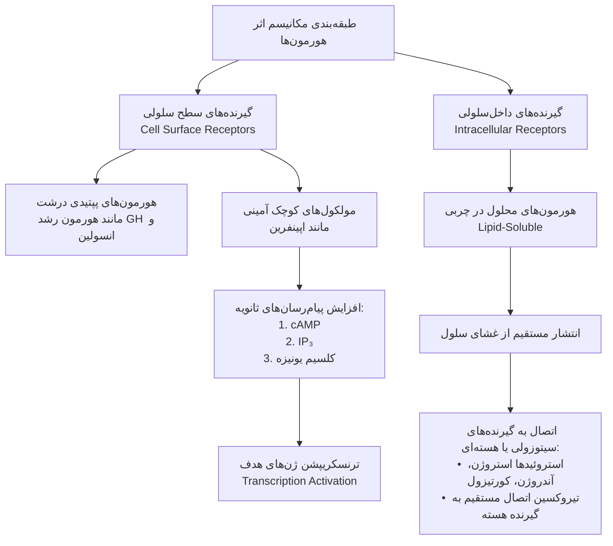
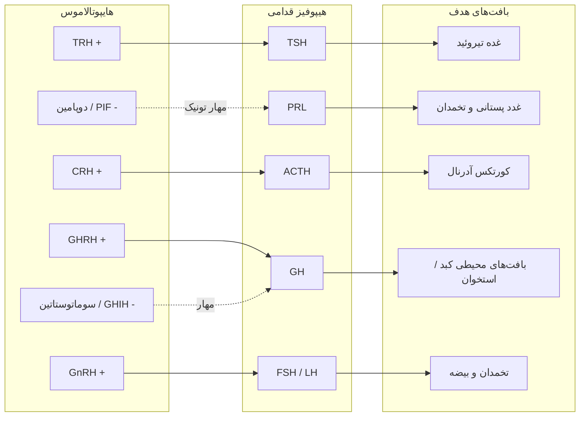
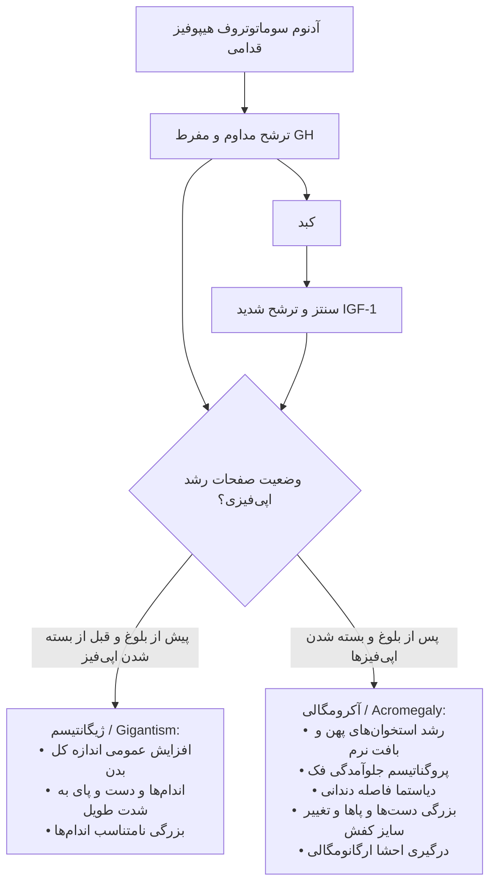
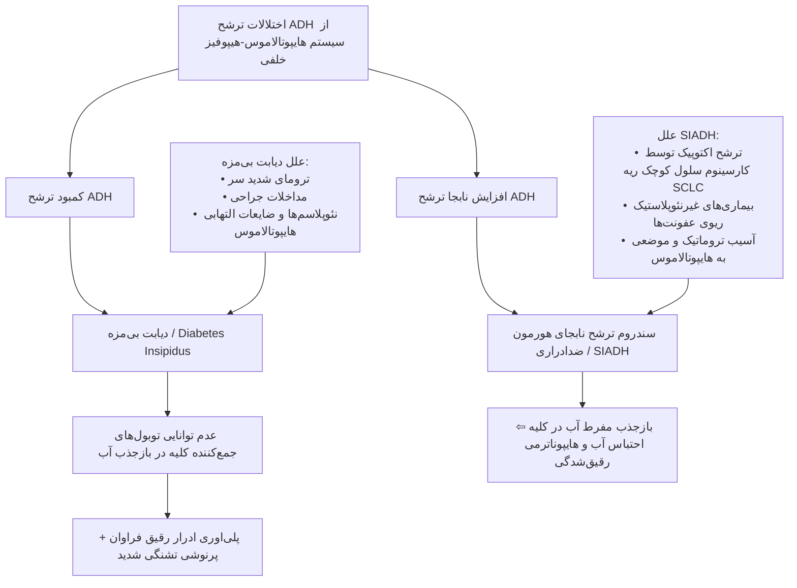
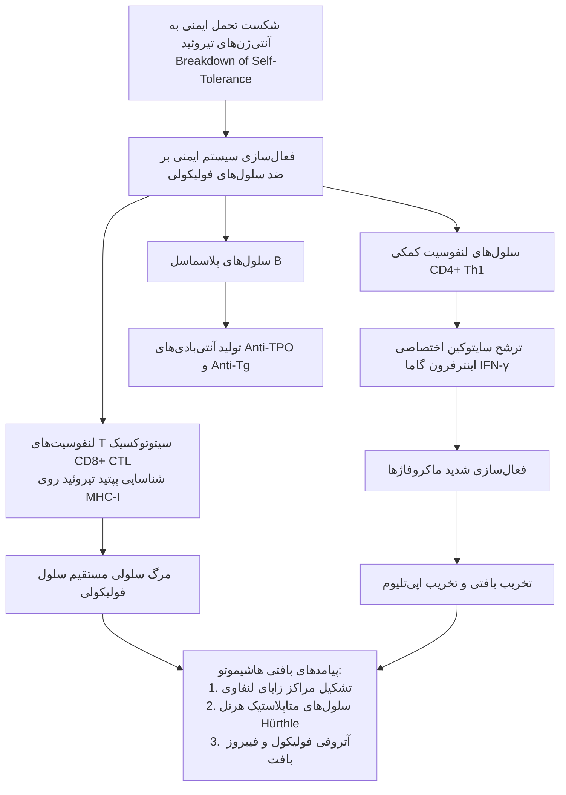
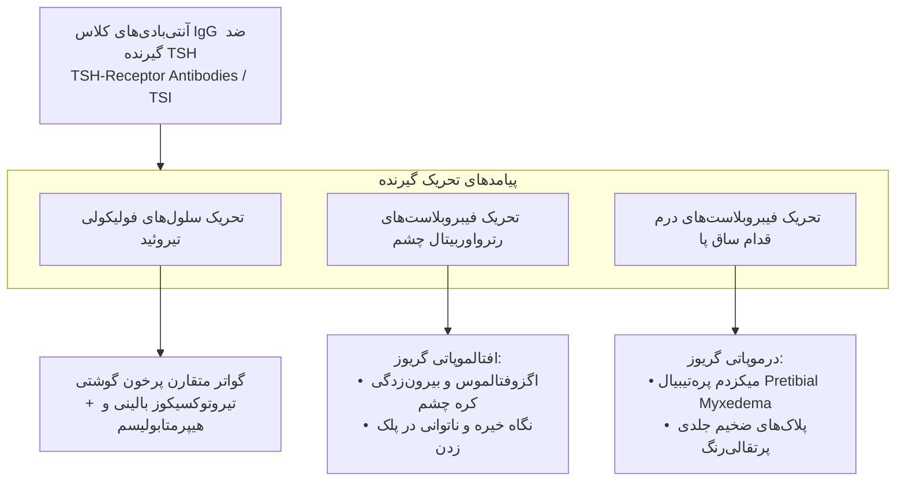
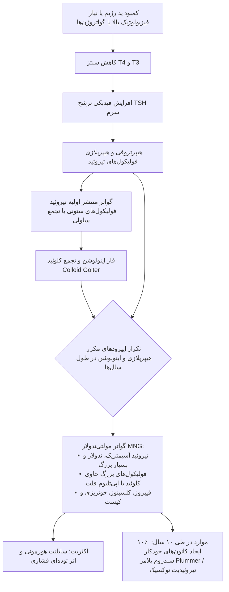

# پاتولوژی غدد درون‌ریز (Endocrine System)

## ۱. اصول بیوشیمی هورمون‌ها و اتیولوژی بیماری‌های اندوکرین

### ۱.۱. طبقه‌بندی مکانیسم اثر هورمون‌ها
* **گیرنده‌های سطح سلول (Cell-Surface Receptors):**
  * *هورمون‌های پپتیدی:* پروتئین‌های درشت نظیر **هورمون رشد (GH)** و **انسولین**. ناتوان از عبور مستقیم از دولایه فسفولیپیدی غشا.
  * *مولکول‌های کوچک کاتکول‌آمینی:* نظیر **اپینفرین**. اتصال به گیرنده غشایی ⇦ فعال‌سازی آبشار پیام‌رسان‌های ثانویه داخل‌سلولی (افزایش **cAMP**، افزایش **IP₃**، افزایش **کلسیم یونیزه داخل‌سلولی**) ⇦ فعال‌سازی فاکتورهای رونویسی ⇦ **ترنسکریپشن ژن‌های اختصاصی** واسطه‌گر اثر هورمون.
* **گیرنده‌های داخل‌سلولی (Intracellular Receptors):**
  * ماهیت: هورمون‌های **محلول در چربی (Lipid-soluble)** با توانایی انتشار غیرفعال از خلال غشای پلاسمایی.
  * اتصال به گیرنده‌های **سیتوزولی** یا **هسته‌ای**.
  * *مثال‌های بارز:* استروئیدها (**استروژن**، **آندروژن‌ها**، **گلوکوکورتیکوئیدها**) و **تیروکسین (T₄/T₃)**. هورمون‌های تیروئیدی مستقیماً به گیرنده‌های داخل هسته متصل می‌گردند.

### ۱.۲. مکانیسم سه‌گانه ایجاد بیماری‌های غدد درون‌ریز
1. **اختلالات کمی ترشح:** کاهش تولید (**Underproduction / Hypofunction**) یا افزایش تولید (**Overproduction / Hyperfunction**) هورمون.
2. **مقاومت بافت هدف (End-Organ Resistance):** ترشح و سطح هورمون طبیعی یا حتی بالاست، اما به دلیل نقص گیرنده یا مسیرهای پس‌گیرنده‌ای، بافت هدف پاسخ نمی‌دهد.
3. **نئوپلاسم‌ها (Neoplasms):** توده‌های خوش‌خیم (آدنوم) یا بدخیم (کارسینوما) مترشحه یا غیرمترشحه فشرده‌کننده بافت.

---

## ۲. آناتومی، فیزیولوژی و هیستوپاتولوژی غده هیپوفیز

### ۲.۱. مختصات آناتومیک و شبکه عروقی
* ابعاد: ساختار کوچک لوبیایی‌شکل (**Bean-shaped**) مستقر در زین ترکی (**Sella Turcica**).
* ارتباط آناتومیک: اتصال به پایه هایپوتالاموس توسط **ساقه هیپوفیز (Pituitary Stalk / Infundibulum)**.
* زیربخش‌ها:
  * **لوب قدامی (آدنوهیپوفیز - Adenohypophysis):** منشأ اپی‌تلیالی؛ ترشح هورمون‌های تروفیک تحریک‌کننده تیروئید، قشر آدرنال، گنادها و بافت پستان.
  * **لوب خلفی (نوروهیپوفیز - Neurohypophysis):** منشأ عصبی؛ امتداد آکسونی نورون‌های هسته‌های سوپرااوپتیک و پاراونتریکولار هایپوتالاموس.
* خون‌رسانی و عروق:
  * لوب قدامی: متکی بر **سیستم وریدی پورت هیپوفیزی با فشار پایین (Low-pressure Portal System)** از شریان‌های هیپوفیزیال فوقانی.
  * لوب خلفی: متکی بر **شریان‌های مستقیم هیپوفیزیال (Direct Arterial Branches)** از شریان کاروتید داخلی.
  * تخلیه وریدی: از طریق وریدهای هیپوفیزیال (**Hypophyseal Veins**).

### ۲.۲. سیتولوژی آدنوهیپوفیز نرمال در رنگ‌آمیزی H&E
* **سلول‌های بازوفیلیک (Basophilic - فلش آبی):** رنگ‌پذیری سیتوپلاسم با **رنگ آبی**. شامل سلول‌های **تایروتروف (ترشح TSH)**، **گنادوتروف (ترشح FSH و LH)**، و **کورتیکوتروف (ترشح ACTH، POMC، MSH)**.
* **سلول‌های اسیدوفیلیک / ائوزینوفیلیک (Acidophilic - فلش قرمز):** سیتوپلاسم **قرمز-صورتی**. شامل سلول‌های **سوماتوتروف (ترشح GH)** و **لاکتوتروف (ترشح PRL)**.
* **سلول‌های کروموفوب (Chromophobes - فلش زرد):** فاقد رنگ‌پذیری مشخص (**Non-staining**). نشان‌دهنده سلول‌های تخلیه‌شده از گرانول‌های هورمونی پس از ترشح، یا سلول‌های **نابالغ (Immature)** ناتوان از ساخت هورمون.

> [!info] تعریف هورمون‌های تولیدی هیپوفیز قدامی و سلول‌های منشأ
> * **سوماتوتروف:** تولیدکننده هورمون رشد (**GH**).
> * **ماموسوماتوتروف:** تولیدکننده همزمان هورمون رشد (**GH**) و پرولاکتین (**PRL**).
> * **لاکتوتروف:** تولیدکننده پرولاکتین (**PRL**).
> * **کورتیکوتروف:** تولیدکننده هورمون آدرنوکورتیکوتروپیک (**ACTH**)، پرواوپیوملانوکورتین (**POMC**) و هورمون محرک ملانوسیت (**MSH**).
> * **تایروتروف:** تولیدکننده هورمون محرک تیروئید (**TSH**).
> * **گنادوتروف:** تولیدکننده هورمون محرک فولیکول (**FSH**) و هورمون لوتئینه‌کننده (**LH**).

### ۲.۳. هورمون‌های هایپوتالاموس و تنظیم هیپوفیز خلفی
* **کنترل هایپوتالاموسی آدنوهیپوفیز:** غالباً **تحریکی (Stimulatory)** به جز دو فاکتور **مهاری (Inhibitory)** کلیدی:
  1. **دوپامین (PIF):** مهارکننده فیزیولوژیک تونیک ترشح **پرولاکتین**.
  2. **سوماتوستاتین (GHIH):** مهارکننده فیزیولوژیک ترشح **هورمون رشد (GH)** و TSH.
* **هورمون‌های هیپوفیز خلفی:**
  * شامل **اکسی‌توسین (Oxytocin)** و **هورمون ضدادراری (ADH / Vasopressin)**.
  * محل سنتز: اجسام سلولی نورون‌های هایپوتالاموس.
  * محل ذخیره و آزادسازی: پایانه‌های عصبی در هیپوفیز خلفی؛ آزادسازی سریع به جریان خون در پاسخ به محرک‌های فیزیولوژیک.

### ۲.۴. تظاهرات موضعی و اورژانس‌های بالینی ضایعات هیپوفیز
* **اثر توده‌ای موضعی (Local Mass Effects):**
  * انبساط سلار و فرسایش استخوان اسفنوئید.
  * فشار بر کیاسمای بینایی (**Optic Chiasm**) واقع در بالای زین ترکی ⇦ اختلال میدان بینایی طرفی به صورت کلاسیک: **همی‌آنوپسی بای‌تمپورال (Bitemporal Hemianopsia)**.
* **آپوپلکسی هیپوفیز (Pituitary Apoplexy):**
  * تعریف: **خونریزی حاد** به داخل یک نئوپلاسم از پیش‌موجود هیپوفیز.
  * تظاهر بالینی: بزرگ‌شدن برق‌آسای توده، سردرد شدید و ناگهانی، افت ناگهانی دید، دوبینی و **کاهش سطح هوشیاری (Loss of Consciousness)**.
  * اورژانس مطلق جراحی اعصاب (**Neurosurgical Emergency**) با خطر مرگ بالا در صورت عدم مداخله سریع دکامپرسیون.

---

## ۳. نئوپلاسم‌های نورواندوکرین هیپوفیز (آدنوم هیپوفیز / PitNET)

### ۳.۱. اپیدمیولوژی و کلیات
* شایع‌ترین علت **هایپرپیتویتاریسم (Hyperpituitarism)**: آدنوم مترشحه هورمون در لوب قدامی هیپوفیز.
* پیک سنی: سنین **۳۵ تا ۶۰ سال**.
* شیوع: در بیش از **۱۰٪ جمعیت عمومی** (بسیاری از موارد به صورت اتفاقی / اینسیدنتالوما یافت می‌شوند).

### ۳.۲. طبقه‌بندی بالینی و مورفولوژیک آدنوم‌ها
* **براساس اندازه:**
  1. **میکروآدنوم (Microadenoma):** قطر کمتر از **۱ سانتی‌متر** (< 1 cm). معمولاً به صورت آدنوم‌های عملکردی کشف می‌شوند.
  2. **ماکروآدنوم (Macroadenoma):** قطر بیشتر از **۱ سانتی‌متر** (> 1 cm). آدنوم‌های غیرعملکردی (Silent) فاقد علائم بیوشیمیایی اولیه هستند، دیرتر تشخیص داده شده و عمدتاً در فاز ماکروآدنوم با اثر فشاری توده‌ای تظاهر می‌کنند.
* **براساس فعالیت بیوشیمیایی:**
  1. *عملکردی (Functional):* بروز نشانه‌های بالینی بارز ناشی از افزایش هورمون سرم.
  2. *غیرعملکردی (Non-functioning / Silent):* عدم ترشح هورمون به خون؛ با این حال در رنگ‌آمیزی ایمونوهیستوشیمی (IHC) سلول‌ها ممکن است مارکرهای هورمونی را در سیتوپلاسم نشان دهند اما سندروم ترشحی ایجاد نکنند.

| نوع سلول هیپوفیز | هورمون تولیدی | نام آدنوم وابسته | سندروم بالینی اختصاصی (فرم عملکردی) |
| :--- | :--- | :--- | :--- |
| **لاکتوتروف (Lactotroph)** | پرولاکتین (PRL) | آدنوم لاکتوتروف | گالاکتوره، آمنوره در زنان؛ نقص عملکرد جنسی، ناباروری در مردان |
| **سوماتوتروف (Somatotroph)** | هورمون رشد (GH) | آدنوم سوماتوتروف | ژیگانتیسم در کودکان؛ آکرومگالی در بزرگسالان |
| **ماموسوماتوتروف (Mammosomatotroph)** | هورمون رشد (GH) + پرولاکتین (PRL) | آدنوم ماموسوماتوتروف | تظاهرات ترکیبی افزایش هورمون رشد و پرولاکتین |
| **کورتیکوتروف (Corticotroph)** | ACTH و مشتقات POMC | آدنوم کورتیکوتروف | بیماری کوشینگ (Cushing Disease)، هایپرپیگمانتاسیون پوستی |
| **تایروتروف (Thyrotroph)** | TSH | آدنوم تایروتروف | هایپرتیروئیدیسم ثانویه (بسیار نادر) |
| **گنادوتروف (Gonadotroph)** | FSH و LH | آدنوم گنادوتروف | هیپراستیمولاسیون تخمدان، اختلالات قاعدگی، بزرگی بیضه، بلوغ زودرس |

> [!note] نکات تکمیلی جدول طبقه‌بندی آدنوم‌ها
> * سندروم‌های جدول فوق منحصراً مربوط به **آدنوم‌های عملکردی (Functional)** هستند.
> * آدنوم‌های سایلنت هورمون مربوطه را در ارزیابی IHC نشان می‌دهند، اما سندروم بالینی ترشحی نداشته و با **اثر توده‌ای و هایپوپیتویتاریسم ناشی از تخریب پارانشیم نرمال** مراجعه می‌کنند.

### ۳.۳. پاتوژنز و نقشه ژنتیکی آدنوم‌های هیپوفیز
* جهش در پروتئین‌های G: شایع‌ترین اختلال ژنتیکی. جهش در ژن **GNAS** در **۴۰٪ آدنوم‌های سوماتوتروف** و اقلیتی از آدنوم‌های کورتیکوتروف.
* جهش فعال‌کننده **USP8 (Ubiquitin-Specific Protease 8):** در **۳۰٪ تا ۶۰٪ آدنوم‌های کورتیکوتروف**.
* استعداد ارثی ژنتیکی: در حدود **۵٪ موارد**؛ جهش در ژن‌های **MEN1** (سندروم نئوپلازی متعدد اندوکرین نوع ۱) و **CDKN1B**.
* مارکرهای تهاجم و رفتار بدخیم (Aggressive Behavior):
  * بیش‌بیانی انکوژن **Cyclin D1**.
  * موتاسیون در ژن سرکوب‌گر تومور **TP53**.
  * خاموشی اپی‌ژنتیک ژن رتینوبلاستوما (**Epigenetic Silencing of RB**).

### ۳.۴. ویژگی‌های ماکروسکوپی و میکروسکوپی آدنوم هیپوفیز
* نمای ماکروسکوپیک: ضایعه با قوام نرم، حدود مشخص و رنگ کرم متمایل به قهوه‌ای؛ تومورهای کوچک کاملاً محدود به حفره سلار هستند.
* تهاجم بافتی موضعی: در **۳۰٪ موارد** فاقد کپسول واقعی بوده و به استخوان اسفنوئید، دورا و بافت مغز مجاور تهاجم مستقیم دارند. کانون‌های **نکروز و خونریزی** در آدنوم‌های بزرگ بسیار شایع است.
* نمای سیتوپاتولوژیک: سلول‌های چندوجهی یکنواخت (**Uniform Polygonal Cells**) با آرایش صفحه‌ای (Sheets)، طنابی (Cords) یا پاپیلاری؛ فعالیت میتوزی معمولاً بسیار ناچیز (**Scanty**) است.

> [!danger] دو معیار طلایی تفرقه آدنوم از بافت نرمال هیپوفیز قدامی
> 1. **یکنواختی و مونومورفیسم سلولی (Cellular Monomorphism):** در بافت نرمال آمیزه‌ای از انواع سلول‌های اسیدوفیل، بازوفیل و کروموفوب در کنار هم دیده می‌شوند؛ در حالی که آدنوم یک جمعیت سلولی کاملاً مونوتون و هم‌شکل دارد.
> 2. **فقدان شبکه رتیکولین (Absence of Reticulin Network):** در هیپوفیز نرمال، رنگ‌آمیزی اختصاصی رتیکولین ساختار لانه‌ای (Acinar) سلول‌ها را حفظ می‌کند. **شکست و تخریب کامل شبکه فیبرهای رتیکولین (Loss of Reticulin)** قطعی‌ترین شاخص تشخیصی آدنوم در آزمایشگاه پاتولوژی است.

---

## ۴. سندروم‌های بالینی و پاتولوژیک آدنوم‌های عملکردی

### ۴.۱. آدنوم لاکتوتروف (Prolactinoma)
* **شایع‌ترین آدنوم عملکردی هیپوفیز**؛ حدود ۳۰٪ کل آدنوم‌ها.
* تظاهرات بالینی: **آمنوره (Amenorrhea)**، **گالاکتوره (Galactorrhea)**، کاهش شدید میل جنسی و ناباروری.
* علل غیراختصاصی هایپرپرولاکتینمی: حاملگی، دوز بالای استروژن، نارسایی کلیه، هایپوتیروئیدی اولیه، ضایعات هایپوتالاموس، داروهای مهارکننده بازجذب یا بلاک‌کننده دوپامین.

> [!warning] تله تستی اثر ساقه (Stalk Effect)
> هر ضایعه توده‌ای در ناحیه سوپراسلار (مانند کرانیوفارنژیوما یا ماکروآدنوم سایلنت) با فشار فیزیکی روی ساقه هیپوفیز مانع از رسیدن **دوپامین مهاری** به سلول‌های لاکتوتروف شده و سطح پرولاکتین را بالا می‌برد.
> * افزایش خفیف پرولاکتین سرم (**کمتر از 200ng/mL یا 200mg/L**) در حضور یک ماکروآدنوم، نشانه **اثر فشاری ساقه (Stalk Effect)** است، نه لزوماً پرولاکتینوما.
> * در تومور واقعی پرولاکتینوما، سطح سرمی پرولاکتین معمولاً فراتر از این مقادیر است.

### ۴.۲. آدنوم سوماتوتروف (GH-Producing Adenoma)
* **دومین آدنوم شایع عملکردی**؛ مسئول حدود **۱۰٪ موارد**.
* میکروسکوپی: متشکل از سلول‌های دنسلی گرانولیتد (**Densely Granulated**) یا اسپارسلی گرانولیتد (**Sparsely Granulated**)؛ افتراق با رنگ‌آمیزی اختصاصی IHC برای GH.
* مکانیسم سیستمیک: تحریک مداوم سنتز و ترشح **IGF-1 (فاکتور رشد شبه‌انسولین ۱)** توسط سلول‌های کبدی.

* **عوارض سیستمیک آکرومگالی:**
  1. *دیابت ملیتوس ثانویه:* به علت ایجاد **مقاومت محیطی به انسولین** ناشی از اثر ضدانسولینی هورمون رشد.
  2. *آرتروز شدید و ناتوان‌کننده.*
  3. *هیپرتانسیون و نارسایی احتقانی قلب (CHF).*
  4. *ضعف عمومی عضلانی و اختلالات گنادی.*
  5. *افزایش معنادار ریسک نئوپلاسم‌های بدخیم گوارشی (به ویژه سرطان کولورکتال).*
* **تست تشخیصی طلایی بیوشیمیایی آکرومگالی:** **تست بارگیری خوراکی گلوکز (Oral Glucose Tolerance Test - OGTT)**. در افراد سالم تجویز گلوکز سطح GH را سرکوب می‌کند؛ **عدم مهار ترشح هورمون رشد در پاسخ به بار گلوکز خوراکی** اختصاصی‌ترین تست تشخیصی است.

### ۴.۳. آدنوم کورتیکوتروف و سندروم نلسون
* تظاهر بالینی اولیه: تولید بیش از حد ACTH ⇦ هیپرپلازی قشر آدرنال ⇦ افزایش کورتیزول و بروز **بیماری کوشینگ (Cushing Disease)**.
* تمایز اصطلاحات: **سندروم کوشینگ** به مجموعه علائم ناشی از افزایش کورتیزول با هر علتی اطلاق می‌شود؛ در حالی که **بیماری کوشینگ** منحصراً ناشی از آدنوم مترشحه ACTH در هیپوفیز است.
* هیستوشیمی اختصاصی: سلول‌های نئوپلاستیک حاوی ACTH گلیکوزیله بوده و با رنگ‌آمیزی **PAS (Periodic Acid-Schiff) مثبت** ارزیابی می‌شوند.

> [!danger] سندروم نلسون (Nelson Syndrome) - نکته امتحانی کلیدی
> در بیماران مبتلا به میکروآدنوم کورتیکوتروف که تحت جراحی برداشتن دوطرفه آدرنال‌ها (Bilateral Adrenalectomy) قرار می‌گیرند:
> * با حذف آدرنال‌ها، **فیدبک منفی مهاری کورتیکواستروئیدها روی تومور هیپوفیز حذف می‌شود**.
> * نتیجه: رشد سریع، تهاجمی و کنترل‌نشده آدنوم اولیه هیپوفیز ⇦ **اثر توده‌ای شدید (Mass Effect)** روی مغز و کیاسما.
> * به علت ترشح مفرط پیش‌ساز POMC و شکسته شدن آن به **MSH**، بیماران دچار **هایپرپیگمانتاسیون شدید و تیرگی پوست** می‌شوند.

### ۴.۴. سایر آدنوم‌ها و کارسینوم هیپوفیز
* **آدنوم‌های گنادوتروف:** تولیدکننده FSH و LH (غلبه ترشح با **FSH**)؛ معمولاً **سایلنت بالینی** بوده و با اثر فشاری توده بزرگ (ماکروآدنوم) کشف می‌شوند.
* **آدنوم‌های تایروتروف:** مسئول تولید نابجای TSH؛ یکی از علل بسیار نادر پرکاری تیروئید.
* **کارسینوم هیپوفیز (Pituitary Carcinoma):** بسیار نادر؛ صرفاً تهاجم موضعی به مننژ یا استخوان ملاک کارسینوما نیست؛ **تشخیص قطعی تنها با اثبات متاستاز کرانیواسپاینال یا احشایی دوردست** داده می‌شود.

---

## ۵. هایپوپیتویتاریسم و اختلالات ایسکمیک

### ۵.۱. اتیولوژی نارسایی هیپوفیز
* کاهش عملکرد هیپوفیز زمانی رخ می‌دهد که بیش از **۷۵٪ پارانشیم** قدامی تخریب شود.
* علل آدنوهیپوفیزی اولیه: توده‌ها و ماکروآدنوم‌های غیرعملکردی با ایجاد فشار بر پارانشیم نرمال، فرآیندهای تخریبی جراحی و رادیوتراپی، تروما و شوک.
* علل هایپوتالاموسی: تومورهای مجاور ساقه و هایپوتالاموس که مانع ترشح یا انتقال Releasing Factorها می‌شوند.

> [!tip] اصل افتراق هایپوپیتویتاریسم هایپوتالاموسی از هیپوفیزی
> وجود هایپوپیتویتاریسم قدامی همزمان با **اختلال عملکرد هیپوفیز خلفی (به شکل دیابت بی‌مزه)** تقریباً **همیشه منشأ هایپوتالاموسی** دارد؛ زیرا ساخت هورمون‌های خلفی منحصراً در هسته‌های هایپوتالاموس است.

### ۵.۲. سندروم شیهان (Sheehan Syndrome) و نکروز ایسکمیک
* **پاتوفیزیولوژی کلاسیک سندروم شیهان:**
  1. در دوران بارداری، لوب قدامی هیپوفیز به دلیل هایپرپلازی و هایپرتروفی فیزیولوژیک سلول‌های پرولاکتین‌ساز تا **دو برابر بزرگ می‌شود**.
  2. خون‌رسانی لوب قدامی از شبکه سیاهرگی پورت با **فشار پایین** تامین شده و متناسب با رشد بافت افزایش نمی‌یابد (ایسکمی نسبی فیزیولوژیک).
  3. وقوع خونریزی شدید رحمی و کلاپس گردش خون (شوک هیپوولمیک) حین زایمان یا بلافاصله پس از آن ⇦ افت خون‌رسانی ⇦ **انفارکتوس و نکروز ایسکمیک لوب قدامی هیپوفیز**.
  4. **لوب خلفی آسیب نمی‌بیند**؛ زیرا خون‌رسانی شریانی مستقیم و پرفشار از شاخه‌های کاروتید دارد.
* سایر علل نکروز هیپوفیز: انعقاد داخل‌عروقی منتشر (**DIC**)، آنمی داسی‌شکل (**Sickle Cell Anemia**)، ترومای سر، فشار داخل جمجمه‌ای بالا (Increased ICP)، هر نوع شوک سیستمتیک شدید، عوارض درمان مهارکننده‌های ایمنی سرطان (**Checkpoint Blockade Therapy**)، و فرآیندهای التهابی گرانولوماتوز (نظیر **سل و سارکوئیدوز**).
* **تظاهرات بالینی نارسایی آدنوهیپوفیز:**
  * نقص GH: توقف رشد و کوتاهی قد در اطفال.
  * نقص GnRH/FSH/LH: آمنوره، آتروفی گنادها، ناباروری، از دست رفتن موهای زیربغل و زهار (Pubic hair).
  * نقص TSH و ACTH: هایپوتیروئیدی ثانویه و هایپوآدرنالیسم (نارسایی قشر آدرنال بدون پیگمانتاسیون).
  * نقص PRL: **ناتوانی در شیردهی پس از زایمان (Failure of Lactation)**؛ اولین علامت تشخیصی در سندروم شیهان.

---

## ۶. بیماری‌های هیپوفیز خلفی (Posterior Pituitary Disorders)

---

## ۷. آناتومی، فیزیولوژی و سنتز هورمون‌های غده تیروئید

### ۷.۱. سازمان‌بندی ساختاری و هیستولوژی فولیکول‌ها
* آناتومی: دو لوب قرینه در قدام و پایین حنجره، متصل به‌هم توسط **ایسموس (Isthmus)** باریک.
* بافت‌شناسی: هر لوب دارای لوبول‌هایی با **۲۰ تا ۴۰ فولیکول یکنواخت** است.
* پوشش فولیکولی: سلول‌های اپی‌تلیال مکعبی تا استوانه‌ای کوتاه؛ مسئول ساخت **تایروگلوبولین (Thyroglobulin)**.
* لومن فولیکولی: حاوی توده هموژن صورتی به نام **کلوئید (Colloid)** که ساختار انبار ذخیره تایروگلوبولین است.

### ۷.۲. کینتیک سنتز و اتصال هورمون‌ها
* ترشح TSH از هیپوفیز قدامی ⇦ اتصال به گیرنده سطح سلول فولیکولی تیروئید ⇦ اندوسیتوز کلوئید و تجزیه تایروگلوبولین به هورمون‌های:
  * **تیروکسین (T₄):** میزان ترشح بسیار بیشتر.
  * **تری‌یدوتیرونین (T₃):** میزان ترشح کمتر.
* آزادسازی به گردش خون: بخش اعظم T₄ و T₃ متصل به **پروتئین‌های ناقل پلاسما (TBG)** هستند؛ کسر غیرمتصل (**Free T₄ / Free T₃**) فعالیت بیولوژیک دارد.
* در بافت‌های محیطی: **T₄ از طریق دئودیناسیون به T₃ تبدیل می‌شود**.
* مقایسه بیولوژیک: **T₄ دارای فعالیت ترشحی و ساختاری بیشتر است، اما T₃ تمایل و افینیتی (Affinity) بسیار بالاتری برای اتصال به گیرنده‌های هسته‌ای دارد.**

---

## ۸. پرکاری تیروئید (Hyperthyroidism) و تیروتوکسیکوز

### ۸.۱. پاتوفیزیولوژی و علل سه‌گانه شایع
* تعریف: وضعیت هایپرمتابولیک حاصل از افزایش سطح خونی هورمون‌های آزاد تیروئیدی.
* سه اتیولوژی غالب:
  1. **بیماری گریوز (Graves Disease):** مسئول حدود **۸۵٪ کل موارد** پرکاری تیروئید (هایپرپلازی منتشر خودایمن).
  2. **گواتر مولتی‌ندولار توکسیک (Toxic Multinodular Goiter).**
  3. **آدنوم عملکردی و توکسیک تیروئید (Toxic Adenoma).**

### ۸.۲. نشانه‌های بالینی سیستمیک
* **تظاهرات عمومی (Constitutional):** پوست گرم، مرطوب و برافروخته (تسهیل اتلاف حرارت)، **عدم تحمل گرما (Heat Intolerance)**، تعریق بیش از حد، **کاهش وزن علیرغم افزایش اشتها** به دلیل وضعیت هایپرمتابولیک و تحریک سمپاتیک.
* **دستگاه گوارش:** تحریک حرکات دستگاه گوارش و هایپرموتیلیتی ⇦ سرعت بالای ترانزیت، اسهال شدید، سوء‌جذب و **استئاتوره (Steatorrhea)**.
* **دستگاه قلب و عروق:** تپش قلب (Palpitations)، تاکی‌کاردی، افزایش برون‌ده و قدرت انقباضی میوکارد در پاسخ به نیاز اکسیژن محیطی.
* **سیستم عصبی-عضلانی:** اضطراب شدید، تحریک‌پذیری، لرزش ریز دست‌ها (Tremor)، و ضعف عضلات پروگزیمال موسوم به **میوپاتی تیروئیدی (Thyroid Myopathy)**.
* **تغییرات چشمی عمومی:** نگاه خیره با چشمان گشاد (**Wide Staring Gaze**) و تاخیر در بسته شدن پلک فوقانی (**Lid Lag**) به علت تحریک مفرط سمپاتیک بر **عضله تارس فوقانی (Superior Tarsal Muscle)**.

### ۸.۳. طوفان تیروئیدی و فرم آپاتتیک
* **طوفان تیروئیدی (Thyroid Storm):**
  * بروز ناگهانی، بحرانی و برق‌آسای هایپرتیروئیدیسم شدید؛ شایع‌ترین بستر: بیماران **گریوز**.
  * پاتوژنز: افزایش انفجاری سطح کاتکول‌آمین‌ها به دنبال استرس جراحی، عفونت حاد، تروما یا قطع ناگهانی داروهای آنتی‌تیروئید.
  * عاقبت: اورژانس بالینی حیاتی؛ مرگ در صورت عدم درمان سریع بر اثر **آریتمی‌های کشنده قلبی**.
* **هایپرتیروئیدیسم آپاتتیک (Apathetic Hyperthyroidism):**
  * بروز در **سالمندان**؛ علائم پرکاری سمپاتیک کدر و مخفی است؛ بیمار با علائم غیراختصاصی نظیر لاغری بدون توجیه، بی‌تفاوتی، افسردگی یا نارسایی قلبی/فیبریلاسیون دهلیزی مراجعه می‌کند.

### ۸.۴. رویکرد تشخیصی بیوشیمیایی و آزمایشگاهی
* تست غربالگری استاندارد: **اندازه‌گیری TSH سرم به عنوان حساس‌ترین تست منفرد**؛ در فازهای اولیه و حتی فاز ساب‌کلینیکال سطح TSH به علت فیدبک منفی کاهش می‌یابد.
* آزمایش تاییدکننده: سطح **Free T₄** بالا همراه با **TSH سرکوب‌شده**.

> [!warning] دام تشخیصی تیروتوکسیکوز با غلبه T3 (T₃-Toxicosis)
> گاه در بیمار مبتلا به پرکاری تیروئید، سطح TSH به شدت کاهش یافته اما Free T₄ نرمال یا پایین است. در این شرایط نباید بیمار را به اشتباه سالم یا ساب‌کلینیکال تلقی کرد؛ بلکه باید مستقیماً **سنجش Free T₃** انجام شود؛ در **T₃-Toxicosis** ترشح انتخابی T₃ علت بالینی پرکاری تیروئید است.

---

## ۹. کم‌کاری تیروئید (Hypothyroidism)

### ۹.۱. اتیولوژی و طبقه‌بندی
* اختلال ناشی از کمبود هورمون‌های تیروئید؛ منشأ اولیه (درون غده تیروئید) یا ثانویه (نقص هیپوفیز در تولید TSH یا هایپوتالاموس در تولید TRH).

| طبقه‌بندی | علت زمینه‌ای | مکانیسم پاتولوژیک آسیب |
| :--- | :--- | :--- |
| **اولیه (Primary)** | جراحی تیروئید، پرتودرمانی | از دست رفتن فیزیکی پارانشیم ترشحی تیروئید |
| **اولیه (Primary)** | تیروئیدیت (هاشیموتو و...) | تخریب التهابی-ایمنی فولیکول‌های تیروئید |
| **اولیه (Primary)** | کمبود ید در رژیم غذایی (Endemic) | کاهش سنتز سوبسترایی هورمون تیروئید |
| **اولیه (Primary)** | داروها (لیتیم، یدیدها) | تداخل شیمیایی با مسیرهای آنزیمی سنتز هورمون |
| **اولیه (Primary)** | گواتر دیس‌هورمونوژنتیک (نادر) | نقایص مادرزادی آنزیم‌های سنتز هورمون تیروئید |
| **اولیه (Primary)** | نقایص تکامل ژنتیکی تیروئید (نادر) | دیس‌ژنزیس و نقص ساختاری تشکیل غده تیروئید |
| **اولیه (Primary)** | مقاومت به هورمون تیروئید (نادر) | جهش در ساختار گیرنده‌های هسته‌ای تیروئید |
| **ثانویه (Secondary)** | نارسایی هیپوفیز (نادر) | نقص در تولید و آزادسازی هورمون تروفیک TSH |
| **ثانویه (Secondary)** | نارسایی هایپوتالاموس (بسیار نادر) | نقص در سنتز فاکتور تحریک‌کننده TRH |

> [!info] شایع‌ترین علل هیپوتیروئیدی در جهان و مناطق توسعه‌یافته
> * **در سطح جهانی:** شایع‌ترین علت هیپوتیروئیدی، **کمبود ید رژیم غذایی (Endemic Dietary Iodine Deficiency)** است که قریب به **۲ میلیارد نفر** را متأثر ساخته است.
> * **در مناطق با ید کافی رژیم غذایی:** شایع‌ترین علت، **تیروئیدیت خودایمن هاشیموتو** است.

### ۹.۲. کرتینیسم (Congenital Hypothyroidism / Cretinism)
* بروز کمبود هورمون تیروئید در دوره نوزادی و اوایل کودکی ناشی از کمبود اندمیک ید یا دیس‌ژنزیس تیروئید.
* **انتقال جفتی هورمون مادر:** در اوایل بارداری پیش از تشکیل تیروئید جنین، جنین کاملاً متکی به T₄ و T₃ مادر است که از جفت عبور می‌کنند. **هایپوتیروئیدی کنترل‌نشده مادر در این دوره، آسیب مغزی جبران‌ناپذیر بر جنین وارد می‌سازد.**
* تظاهرات بالینی:
  * اختلال شدید در تکامل سیستم اسکلتی و سیستم عصبی مرکزی (CNS).
  * **ناتوانی ذهنی بسیار شدید (Severe Mental Disability)** و نقایص تکاملی مغز.
  * **کوتاهی قد شدید (Dwarfism / Short Stature)**.
  * چهره خشن (**Coarse Facial Features**)، پهن و پف‌آلود.
  * زبان بزرگ و بیرون‌زده (**Protruding Tongue / Macroglossia**).
  * **فتق نافی (Umbilical Hernia)**.

### ۹.۳. میکزدم (Myxedema) - کم‌کاری تیروئید بزرگسالان
* تظاهرات بالینی: خستگی عمومی، بی‌تفاوتی، کندی روانی و فکری که شبیه به **افسردگی (Depression)** تظاهر می‌کند، یبوست، عدم تحمل سرما، و کاهش تعریق.
* پوست: سرد و رنگ‌پریده ناشی از انقباض عروقی و کاهش جریان خون جلدی.
* پروفایل چربی: **افزایش کلسترول تام و افزایش سطح LDL**؛ در نتیجه تسریع فرآیند **آترواسکلروز (Atherosclerosis)** و بیماری‌های عروق کرونر.
* بافت‌شناسی و بیوپسی جلدی: تجمع وسیع ترکیبات گلیکوزآمینوگلیکان و اسید هیالورونیک در درم، بافت زیرجلدی و احشا ⇦ ایجاد **ادم گوده‌گذارنبوده (Non-pitting Edema)**، تورم و بزرگی زبان، و خشونت و بم شدن شدید صدا.
* پاراکلینیک غربالگری: سنجش **TSH سرم** (در فرم اولیه به شدت بالا، در فرم ثانویه نرمال یا پایین).

---

## ۱۰. تیروئیدیت‌ها و بیماری‌های خودایمن تیروئید

### ۱۰.۱. تیروئیدیت هاشیموتو (Hashimoto Thyroiditis)
* نام دیگر: تیروئیدیت لنفوسیتیک مزمن (**Chronic Lymphocytic Thyroiditis**).
* همه‌گیرشناسی: سن **۴۵ تا ۶۵ سال**؛ غلبه مطلق جنس مؤنث به نسبت **۱۰ به ۱ تا ۲۰ به ۱**.
* پاتوژنز و ایمونولوژی: تخریب اتوایمیون سلول‌های اپی‌تلیال فولیکولی تیروئید توسط:
  1. القای آپوپتوز و سمیت مستقیم سلولی از طریق لنفوسیت‌های T سیتوتوکسیک (**CD8+ CTLs**).
  2. سیتوکین‌های آزادشده از سلول‌های **CD4+ Th1** (به ویژه **IFN-γ**) که سبب فعال‌سازی ماکروفاژها و آسیب فولیکول می‌گردد.
  3. اتوآنتی‌بادی‌های سرمی ضد تیروئید (آنتی‌بادی ضد تیروگلوبولین و آنتی‌TPO) که در تقریباً **۱۰۰٪ بیماران** قابل شناسایی است.
* استعداد ژنتیکی: میزان تطابق حدود **۴۰٪ در دوقلوهای تک‌تخمکی (Monozygotic Twins)** و حضور آنتی‌بادی مثبت در ۵۰٪ خواهر و برادرهای بدون علامت.
* **مورفولوژی میکروسکوپی اختصاصی:**
  * ارتشاح وسیع سلول‌های التهابی تک‌هسته‌ای (لنفوسیت‌ها، پلاسماسل‌ها، ماکروفاژها) همراه با تشکیل **فولیکول‌های لنفاوی با مراکز زایا (Germinal Centers)**.
  * آتروفی شدید فولیکول‌های تیروئید.
  * **سلول‌های هرتل (Hürthle / Oxyphil / Oncocytes):** متاپلازی سلول‌های پوششی فولیکول در پاسخ به استرس مزمن؛ دارای سیتوپلاسم فراوان، گرانولار و به شدت ائوزینوفیلیک مملو از میتوکندری‌های متغیر.
* سیر بالینی و ریسک نئوپلازی:
  * بزرگی منتشر و بدون درد تیروئید همگام با هایپوتیروئیدی پیشرونده و تدریجی.
  * **هاشیتوکسیکوز (Hashitoxicosis):** فاز تیروتوکسیکوز گذرای ابتدایی ناشی از تخریب حاد فولیکول‌ها و ریزش ناگهانی هورمون‌های ذخیره‌شده به خون.
  * نئوپلازی: افزایش خطر قطعی لنفوم غیرهوچکین سلول B تیروئید (میکروآنژیوپاتی/MALT) و همراهی احتمالی و مورد بحث (**Controversial**) با کارسینوم پاپیلاری تیروئید (PTC).

### ۱۰.۲. تیروئیدیت گرانولوماتوز ساب‌اکیوت (de Quervain Thyroiditis)
* سبب‌شناسی: به دنبال **عفونت ویروسی** یا پاسخ التهابی میزبان پس از عفونت دستگاه تنفس فوقانی (URI).
* پاتولوژی و مورفولوژی:
  * غده سفت با کپسول دست‌نخورده؛ تخریب فولیکول‌ها و نشت کلوئید.
  * واکنش فاز حاد ارتشاح نوتروفیل‌ها ⇦ جایگزینی با لنفوسیت، پلاسماسل و ماکروفاژ.
  * کلوئید خارج‌شده از فولیکول تحریک‌کننده ایجاد **واکنش گرانولوماتوز با حضور سلول‌های ژانت چند‌هسته‌ای (Multinucleated Giant Cells)** حاوی قطعات کلوئید بلعیده‌شده است.
* مشخصه بالینی تشخیصی: **شروع حاد درد شدید گردن به خصوص حین بلع (Pain on Swallowing)** همراه با تب، تعریق، بیحالی و تندرنس شدید در لمس تیروئید.
* سیر آزمایشگاهی: لکوسیتوز، **افزایش شدید ESR**؛ فاز اولیه تیروتوکسیکوز گذرا، فاز بعدی هایپوتیروئیدی گذرا و نهایتاً بهبود کامل با مقادیری فیبروز پس از چند هفته.

### ۱۰.۳. تیروئیدیت بدون درد (Painless / Subacute Lymphocytic Thyroiditis)
* بیماری با ماهیت خودایمن؛ غالباً به صورت **تیروئیدیت پس از زایمان (Postpartum Thyroiditis)** در خانم‌ها دیده می‌شود.
* سرولوژی: اتوآنتی‌بادی‌های ضدتیروئید در سرم مثبت هستند.
* هیستولوژی: ارتشاح لنفوسیتی بین فولیکول‌ها بدون سلول‌های هرتل و بدون فیبروز وسیع.
* بالین: توده بدون درد در گردن، فاز اولیه پرکاری گذرا و بازگشت خودبه‌خودی به وضعیت **یوتیروئید (Euthyroid)** ظرف چند ماه.

### ۱۰.۴. تیروئیدیت ریدل (Riedel Thyroiditis)
* ماهیت: اختلال سیستمیک متعلق به طیف بیماری‌های وابسته به **IgG4 (IgG4-Related Disease)**.
* مورفولوژی: ارتشاح متراکم لنفوپلاسماسیتیک حاوی پلاسماسل‌های متعدد مثبت برای **IgG4** همراه با **فیبروز کلاژنی بسیار گسترده و متراکم**.
* رفتار بالینی: گسترش فرآیند فیبروز به خارج از کپسول تیروئید و درگیری ارگان‌های مجاور گردن نظیر **غدد پاراتیروئید** (خطر هایپوپاراتیروئیدی) و **اعصاب حنجره‌ای راجعه (Recurrent Laryngeal Nerve)**.
* لمس فیزیکی: توده تیروئیدی **سنگ‌مانند، به شدت سخت و کاملاً فیکس‌شده (Hard and Fixed Mass)** که در معاینه کاملاً نئوپلاسم‌های بدخیم آناپلاستیک را تقلید می‌کند.
* همراهی‌ها: همراهی با فیبروز ایدیوپاتیک در سایر نواحی نظیر **فیبروز رتروپریتوئن (Retroperitoneal Fibrosis)**. وضعیت هورمونی غالباً یوتیروئید است.

| نوع تیروئیدیت | پاتوژنز و مکانیسم آسیب | ویژگی‌های کلیدی هیستوپاتولوژی | علائم و تظاهرات مشخصه بالینی |
| :--- | :--- | :--- | :--- |
| **هاشیموتو (Hashimoto)** | خودایمن؛ تخریب تیروئید توسط CTLها، ماکروفاژها و سیتوکین‌ها | ارتشاح تک‌هسته‌ای وسیع، تشکیل مراکز زایا (Germinal Centers)، سلول‌های هرتل | بزرگی منتشر و بدون درد تیروئید، هایپوتیروئیدی پیشرونده، سن میانسالی |
| **دکورون / گرانولوماتوز (de Quervain)** | عفونت ویروسی یا پاسخ ایمنی پس از عفونت حاد تنفسی | فولیکول‌های تخریب‌شده، ارتشاح نوتروفیل و سپس ماکروفاژ، ژانت‌سل‌ها و گرانولوما | شروع ناگهانی درد شدید گردن با تشدید حین بلع، تب، تندرنس موضعی، بالا بودن ESR |
| **بدون درد (Painless)** | مکانیسم خودایمن؛ فرم شایع پس از زایمان (Postpartum) | ارتشاح لنفوسیتی پارانشیم تیروئید گاه همراه با مراکز زایا بدون سلول هرتل | توده گردنی بدون درد، پرکاری گذرای تیروئید و بازگشت خودبه‌خودی به وضعیت نرمال |
| **ریدل (Riedel)** | زیرگروه بیماری‌های مرتبط با سایتوکاین‌های IgG4 (IgG4-RD) | فیبروز کلاژنی متراکم و مهاجم، ارتشاح لنفوپلاسماسیتیک حاوی پلاسماسل‌های IgG4+ | توده سنگی سخت و فیکس، تقلید بدخیمی تیروئید، همراه با فیبروز رتروپریتوئن |

---

## ۱۱. بیماری گریوز (Graves Disease)

### ۱۱.۱. ایمونوپاتوژنز
* شایع‌ترین اتیولوژی هایپرتیروئیدیسم اندوژن.
* مکانیسم ایجاد: وجود **آنتی‌بادی محرک گیرنده TSH (TSI / TSH-Receptor Antibody - TRAb)** از کلاس **IgG**.
* اتصال آنتی‌بادی به رسپتور TSH ⇦ تقلید عملکرد TSH به شکل پایدار و طولانی‌مدت ⇦ تحریک مداوم و فاقد مهار آدنیلات سیکلاز و افزایش سنتز و ترشح هورمون‌های تیروئید، مستقل از فیدبک هورمون‌های هایپوتالاموس و هیپوفیز.

### ۱۱.۲. تظاهرات بالینی سه‌گانه گریوز
1. **هایپرپلازی منتشر تیروئید (Diffuse Hyperplasia):** همراه با پرکاری بالینی تیروئید.
2. **افتالموپاتی نفوذی (Infiltrative Ophthalmopathy):** بیرون‌زدگی کره چشم (**اگزوفتالموس - Exophthalmos**) به علت افزایش حجم چربی رترواوربیتال و ترشح موکوپلی‌ساکاریدها، همراه با نگاه خیره و لیدلگ.
3. **درموپاتی نفوذی اختصاصی (میکزدم پره‌تیبیال - Pretibial Myxedema):** ضخیم‌شدن فلس‌مانند، غیرگوده‌گذار، اریتماتو و قوام چرمی پوست در ناحیه قدام ساق پا.

### ۱۱.۳. ویژگی‌های مورفولوژی ماکروسکوپیک و میکروسکوپیک
* ماکروسکوپی: بزرگی متقارن و یکنواخت غده تیروئید؛ پارانشیم نرم، پرخون با نمایی به رنگ **قرمز گوشتی غلیظ (Beefy Deep Red)**.
* هیستولوژی:
  * سلول‌های اپی‌تلیال فولیکولی بسیار بلند، ستونی و پرجمعیت (**Tall, Columnar, Crowded Epithelium**).
  * ایجاد برجستگی‌های پاپیلاری کوچک داخل لومن فولیکول‌ها؛ **فاقد محور فیبروواسکولار حقیقی (Lacking Fibrovascular Core)** که وجه افتراق قطعی از کارسینوم پاپیلاری تیروئید (PTC) است.
  * **کلوئید:** بسیار کم‌رنگ و آبکی با حاشیه‌های دندانه‌دار و خورده‌شده (**Scalloped Margins** / نمای موسوم به **Moth-eaten** یا اثر قاشق بستنی) که ناشی از فعالیت شدید بازجذب سریع کلوئید توسط اپی‌تلیوم ستونی است.
  * ارتشاح لنفوئیدی بینابینی.
* پاراکلینیک اختصاصی: **Free T₄ و Free T₃ سرم به شدت بالا، TSH سرم کاملاً سرکوب‌شده**؛ جذب ید رادیواکتیو (**RAIU**) به صورت یکنواخت و منتشر در کل تیروئید به شدت بالا گزارش می‌شود.

---

## ۱۲. گواتر منتشر و مولتی‌ندولار (Diffuse and Multinodular Goiter)

### ۱۲.۱. مکانیسم پایه‌ای و سبب‌شناسی گواتر
* تعریف: بزرگی غیرنئوپلاستیک غده تیروئید ناشی از **کاهش اولیه سنتز هورمون تیروئید**.
* چرخه جبرانی: کاهش هورمون ⇦ **افزایش جبرانی TSH** از هیپوفیز ⇦ هیپرتروفی و هیپرپلازی سلول‌های فولیکولی ⇦ ایجاد **گواتر منتشر غیراسمی (Diffuse Nontoxic Goiter)**.
* فاز اینولوشن و کلوئید: با کاهش نیاز بدن یا کنترل فرآیند، فولیکول‌ها پر از کلوئید شده و اپی‌تلیوم صاف می‌شود (**Colloid Goiter**).
* ایجاد گواتر مولتی‌ندولار: تکرار مداوم چرخه‌های هیپرپلازی و اینولوشن در طول سال‌ها سبب تبدیل تمام گواترهای منتشر مزمن به **گواتر مولتی‌ندولار (Multinodular Goiter - MNG)** می‌شود.

### ۱۲.۲. انواع اپیدمیولوژیک گواتر
* **گواتر اندمیک (Endemic Goiter):** بروز در مناطقی که بیش از ۱۰٪ جمعیت از کمبود ید رژیم غذایی رنج می‌برند (مناطق کوهستانی و فاقد خاک یددار).
* **گواتر تک‌گیر (Sporadic Goiter):** شیوع کمتر، غلبه چشمگیر در جنس مؤنث؛ بیشترین بروز در **سنین بلوغ و اوایل جوانی** (به دلیل افزایش نیاز فیزیولوژیک بافت‌های محیطی بدن به هورمون تیروکسین).
* عوامل گواتروژن شیمیایی و غذایی: مصرف مقادیر بالای موادی که در سنتز تیروئید اختلال ایجاد می‌کنند؛ به عنوان مثال **کلسیم بالا** و سبزیجات خانواده کلم (**Cabbage, Cauliflower**).

### ۱۲.۳. مورفولوژی و هیستوپاتولوژی
* **گواتر منتشر:** فولیکول‌ها مفروش با سلول‌های ستونی متراکم، گاه با ایجاد برجستگی‌های پاپیلاری بدون محور (مشابه گریوز)؛ در فاز استراحت سلول‌ها فلت شده و تیروئید بزرگ و سرشار از کلوئید است.
* **گواتر مولتی‌ندولار:** بزرگی بسیار شدید، نامنظم و **نامتقارن (Asymmetrically Enlarged)** همراه با ایجاد لبول‌ها و ندول‌های متعدد؛ در فاز میکروسکوپی حاوی فولیکول‌های متسع از کلوئید با سلول‌های غیرفعال فلت، همراه با تغییرات دژنراتیو شامل خونریزی، کلسیفیکاسیون، فیبروز و تغییرات کیستیک.

### ۱۲.۴. تظاهرات بالینی، اثرات فشاری و سندروم پلامر
* **اثرات توده‌ای موضعی (Mass Effects):** تظاهر بالینی اصلی گواتر؛ شامل **انسداد راه هوایی (Airway Obstruction)**، تنگی نفس، **اختلال بلع (Dysphagia)** ناشی از فشار به مری، و انسداد عروق وریدی بزرگ گردن و توراکس فوقانی منجر به **سندروم ورید اجوف فوقانی (Superior Vena Cava Syndrome)**.
* **وضعیت ترشحی:** گواترهای مولتی‌ندولار در اکثر موارد از نظر هورمونی یوتیروئید و خنثی هستند.

> [!danger] سندروم پلامر (Plummer Syndrome / Toxic Multinodular Goiter)
> در حدود **۱۰٪ از بیماران مبتلا به گواتر مولتی‌ندولار در طول بازه زمانی ۱۰ ساله**، کلون‌هایی از سلول‌های فولیکولی درون ندول‌ها دچار عملکرد خودمختار (Autonomous) شده و هورمون ترشح می‌کنند.
> * نام بیماری: **گواتر مولتی‌ندولار توکسیک** یا **سندروم پلامر**.
> * تمایز تشخیصی با گریوز: این سندروم با هایپرتیروئیدیسم تظاهر می‌کند اما **فاقد اگزوفتالموس، افتالموپاتی و درموپاتی پره‌تیبیال گریوز است.**

---

## ۱۳. خلاصه تطبیقی افتراقی تیروئیدیت‌ها، گواتر و بیماری گریوز

| بیماری | پاتوژنز زمینه‌ای | شاخص تشخیصی هیستولوژی | وضعیت عملکردی هورمونی | تظاهرات متمایز بالینی |
| :--- | :--- | :--- | :--- | :--- |
| **هاشیموتو** | خودایمن (CTLs و سایتوکین) | فولیکول‌های لنفاوی با ژرمینال سنتر، سلول‌های هرتل | هایپوتیروئیدی پیشرونده (فاز گذرای هاشیتوکسیکوز) | گواتر منتشر بدون درد در زنان میانسال، آنتی‌بادی مثبت |
| **دکورون** | واکنش پس از عفونت ویروسی تنفسی | فولیکول متلاشی، گرانولوما با سلول‌های ژانت | پرکاری اولسون، کم‌کاری ثانویه و نهایتاً بهبود | **درد حاد و شدید گردن با تشدید در بلع**، تب، ESR بسیار بالا |
| **ریدل** | سیستمیک، بیماری مرتبط با IgG4 | فیبروز کلاژنی متراکم مهاجم، پلاسماسل IgG4 | معمولاً یوتیروئید (Euthyroid) | توده **سنگی بسیار سفت و فیکس**، فیبروز رتروپریتوئن |
| **گریوز** | آنتی‌بادی محرک رسپتور TSH (TSI) | پاپیلاهای فاقد هسته عروقی، کلوئید Scalloped | هایپرتیروئیدیسم بارز (TSH پایین، T4/T3 بالا) | **اگزوفتالموس چشمی**، **میکزدم پره‌تیبیال**، تیروئید گوشتی |
| **سندروم پلامر** | ندول‌های اتونوم در گواتر ندولار | فولیکول‌های متسع فلت در کنار ندول‌های هایپرپلاستیک | هایپرتیروئیدیسم توکسیک | **فاقد درموپاتی و افتالموپاتی گریوز**، علائم انسداد راه هوایی |
