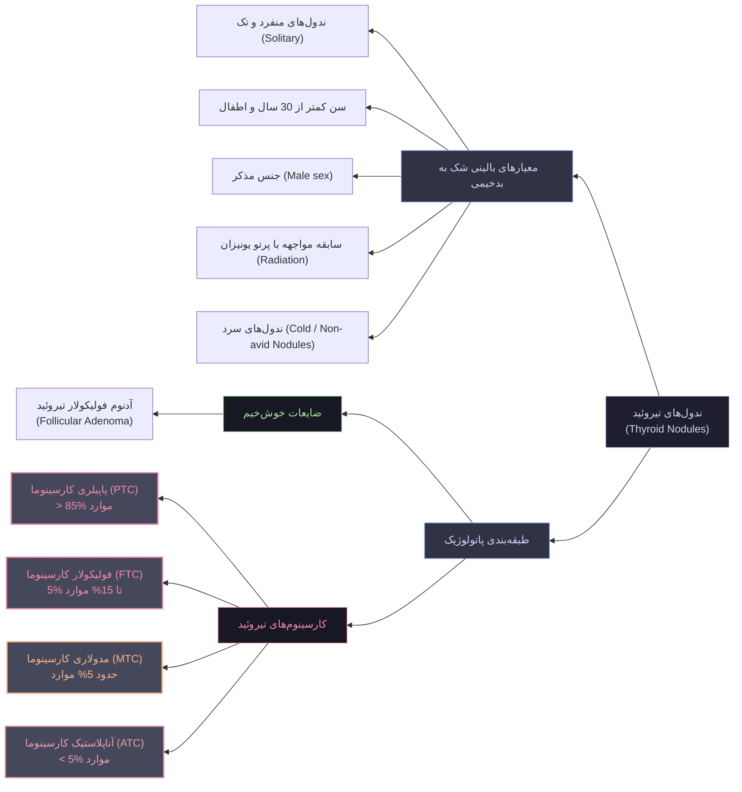
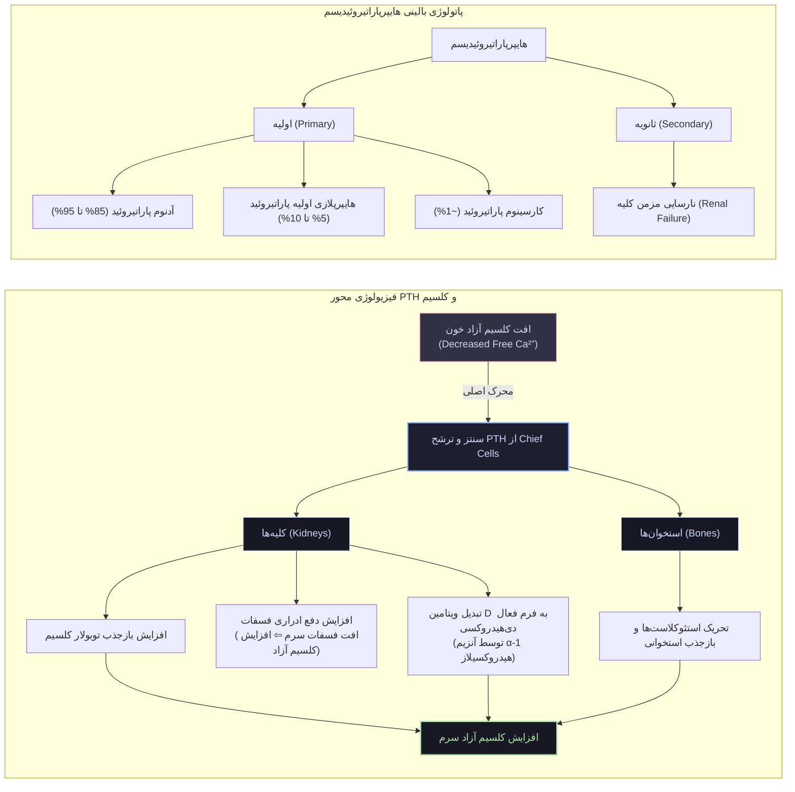
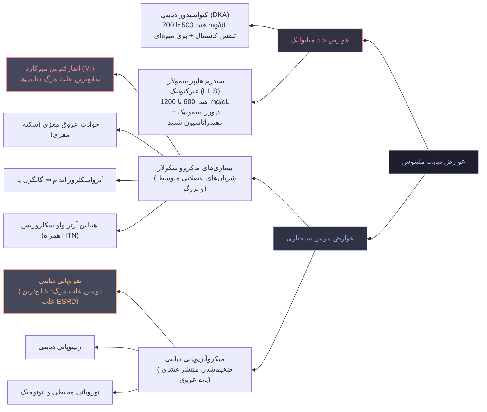
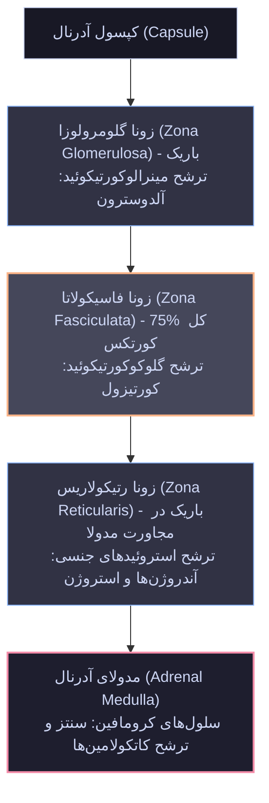
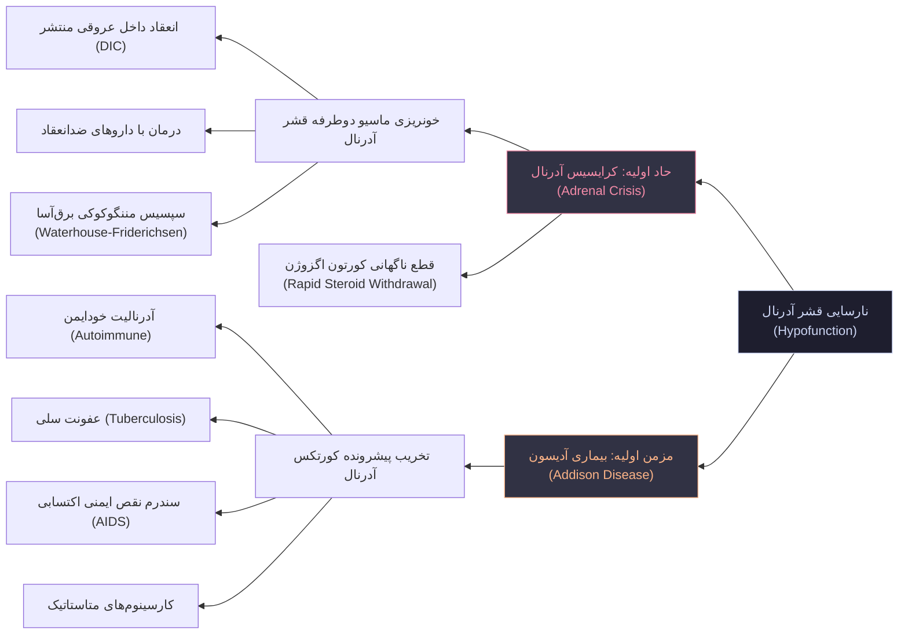
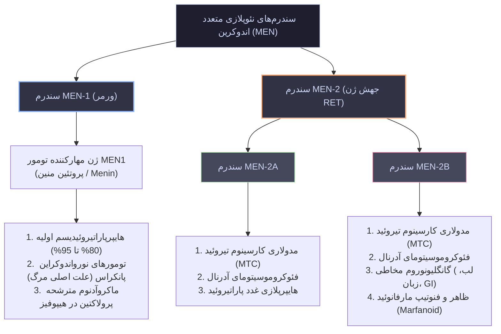

# پاتولوژی غدد درون‌ریز (Endocrine Pathology)

## ۱. نئوپلاسم‌های غده تیروئید (Thyroid Neoplasms)

> [!abstract] تعریف: آدنوم فولیکولار تیروئید (Follicular Adenoma)
> توده منفرد، کروی، کاملاً تمایزیافته با حدود مشخص (*discrete mass*) و منشأگرفته از اپیتلیوم فولیکولار غده تیروئید؛ دارای کپسول فیبروز اینتکت، فاقد هرگونه تهاجم کپسولی یا عروقی و عمدتاً نان‌فانکشنال.

### الف. مشخصات بالینی و بیولوژی آدنوم فولیکولار
* **وضعیت عملکردی:** اکثریت قاطع موارد از نظر هورمونی **غیرفعال (Nonfunctional)**؛ اقلیت تحت عنوان **توکسیک آدنوم (Toxic Adenoma)** با تظاهر هایپرتیروئیدی خودمختار بالینی (*thyroid autonomy*).
* **پاتوژنز مولکولی توکسیک آدنوم:**
  * جهش‌های سوماتیک فعال‌کننده (**Gain-of-function**) در ژن گیرنده TSH موسوم به **TSHR**.
  * جهش در زیرواحد α پروتئین Gs موسوم به **GNAS**.
  * پیامد ژنتیکی: فعال‌سازی پایدار پیام‌رسانی گیرنده TSH بدون نیاز به حضور هورمون محرک تیروئید ⇦ تحریک تکثیر سلولی و ترشح خودمختار تیروسیت‌ها.
* **پاتوژنز مولکولی آدنوم غیرفعال:**
  * ناهمگون از نظر ژنتیکی (*genetically heterogeneous*).
  * جهش‌های ژن **RAS** (در کمتر از 20% موارد).
  * جهش‌های ژن مهارکننده تومور **PTEN** (اشتراک ژنتیکی با فولیکولار کارسینوما).

### ب. مورفولوژی آدنوم فولیکولار
* **ماکروسکوپی (گروس):** ندول منفرد، کروی، کپسول‌دار و با حدود کاملاً مشخص؛ بافت غیرنئوپلاستیک مجاور را تحت فشار قرار می‌دهد (*compresses adjacent thyroid*). کپسول فیبروز کاملاً **سالم و دست‌نخورده (Intact Capsule)** است.
* **میکروسکوپی:** فولیکول‌های بافتی یکنواخت حاوی کلوئید با تنوع بسیار ناچیز در اندازه سلول، شکل یا مورفولوژی هسته؛ اشکال میتوزی **بسیار نادر یا غایب**.

> [!danger] چالش تشخیصی و تله امتحانی: افتراق آدنوم از کارسینوم فولیکولار
> سیتولوژی یا آسپیراسیون سوزنی (FNA) هرگز توانایی تفکیک آدنوم فولیکولار از کارسینوم فولیکولار را ندارد. تنها معیار قطعی، ارزیابی کامل بافت‌شناسی و نمونه‌برداری گسترده از تمام محیط کپسول و بستر تومور با بافت نرمال مجاور (*extensive histologic sampling of capsule/thyroid interface*) جهت اثبات یا رد **تهاجم به کپسول (Capsular invasion)** یا **تهاجم به عروق (Vascular invasion)** است.

---

### ج. انواع بدخیمی‌های تیروئید (Thyroid Carcinomas)

#### 1. پاپیلری کارسینوم تیروئید (PTC)
* **شیوع:** شایع‌ترین کارسینوم تیروئید (**بیش از 85% کل بدخیمی‌ها**).
* **سلول منشأ:** اپیتلیوم فولیکولار؛ نئوپلاسم کاملاً تمایزیافته (*well-differentiated*).
* **ریسک‌فاکتور اصلی:** سابقه تماس با **پرتوهای یونیزان (Ionizing Radiation)**؛ به‌ویژه در **دو دهه نخست زندگی**.
* **پاتوژنز ژنتیکی:** فعال‌سازی پایدار آبشار پیام‌رسانی کیناز موسوم به **مسیر MAP kinase**.
* **مظاهر کلینیکی:** توده گردنی بدون درد؛ پیش‌آگهی فوق‌العاده عالی با **بقای 10 ساله فراتر از 95%**.
* **عوامل پیش‌آگهی نامطلوب:** سن **بالاتر از 40 سال**، وجود **متاستاز دوردست**، و گسترش تومور به **خارج از کپسول غده تیروئید**.
* **نحوه گسترش:** تهاجم عروق خونی ناشایع؛ تهاجم عروق لنفاوی بسیار شایع؛ **درگیری گره‌های لنفاوی گردنی مجاور در بالغ بر 50% موارد (یک‌دوم بیماران)** حین تشخیص رویت می‌شود.
* **مورفولوژی گروس:** ضایعات منفرد یا **چندکانونی (Multifocal)**؛ در سطح مقطع برش‌خورده ضایعه، برجستگی‌های پاپیلاری ظریف و ریز گرانولار با چشم غیرمسلح قابل مشاهده است.
* **مورفولوژی میکروسکوپی:**
  * پاپیل‌های شاخه‌دار دارای محور و استوانه عروقی-همبندی (*fibrovascular stalk/core*) با پوشش تک یا چند لایه از سلول‌های مکعبی (*cuboidal epithelial cells*).
  * **اجسام ساموما (Psammoma bodies):** ساختارهای کلسیفیه با دوایر متحدالمرکز لایه‌لایه درون ضایعه. (نکته: در مننژیوم و کارسینوم سروزی تخمدان نیز دیده می‌شود، اما در تیروئید نشانگر اختصاصی PTC است).
  * **تغییرات ساختاری هسته (Nuclear features) – استاندارد طلایی تشخیص:**
    1. کروماتین ظریف و پخش‌شده به صورت یکدست شبیه شیشه ساییده‌شده یا **شیشه مات (Ground-glass nuclei)** یا هسته‌های چشم یتیم آنی (**Orphan Annie eye**).
    2. فرورفتگی‌های سیتوپلاسمی به درون هسته موسوم به شبه‌اینکلوژن یا **اینترانوکلار اینکلوژن (Intranuclear inclusions / Pseudo-inclusions)**.
    3. شیارهای طولی در مرکز هسته شبیه خط قرص یا دانه قهوه موسوم به **اینترانوکلار گروو (Intranuclear grooves)**.
* **شایع‌ترین واریانت پاتولوژیک PTC:** **واریانت فولیکولار دارای کپسول (Encapsulated follicular variant)**.

> [!tip] اصل تشخیصی FNA در پاپیلری کارسینوما
> مشاهده تغییرات اختصاصی هسته (*Nuclear features*) برای تشخیص قطعی پاپیلری کارسینوما **کاملاً کافی (Sufficient)** است، حتی اگر هیچ‌گونه ساختار پاپیلاری واضحی در بیوپسی سوزنی (FNA) یا مقطع بافتی رویت نشود.

#### 2. فولیکولار کارسینوم تیروئید (FTC)
* **شیوع:** رتبه دوم شیوع کارسینوم‌های تیروئید (**5% تا 15% موارد**).
* **اپیدمیولوژی:** بروز در سنین بالاتر نسبت به PTC؛ شیوع در زنان **3 برابر مردان (نسبت 3:1)**؛ فراوانی بسیار بالاتر در **مناطق دچار کمبود ید در رژیم غذایی**.
* **پاتوژنز مولکولی:** جهش‌های متداول در ژن **RAS** یا در اجزای مسیر پیام‌رسانی **PI3K/AKT**.
* **مورفولوژی:** ندول منفرد منفک یا دارای تهاجم ارتشاحی وسیع؛ بافت حاوی سلول‌های یکنواخت که فولیکول‌های کوچک (*small follicles*) حاوی کلوئید می‌سازند (مشابه فولیکول‌های نرمال تیروئید ولی با ابعاد به مراتب ریزتر).
* **الگوی متاستاز:** برعکس PTC، تهاجم لنفاوی و درگیری لنف‌نودهای گردنی ناحیه‌ای **بسیار ناشایع** است؛ در عوض تمایل شدید به **تهاجم عروق خونی (Hematogenous)** و انتشار به **ریه‌ها، استخوان و کبد** دارد.

#### 3. آناپلاستیک کارسینوم تیروئید (ATC)
* **شیوع و سن:** کمتر از 5% بدخیمی‌های تیروئید؛ نئوپلاسم کاملاً تمایزنیافته (*undifferentiated*) از اپیتلیوم فولیکولار؛ بروز در سنین بالا با **میانگین سنی 65 سال**.
* **رفتار بالینی:** فوق‌العاده اگرسیو؛ تهاجم تند به خارج کپسول و ساختارهای حیاتی گردن؛ رشد توده‌ای بسیار حجیم (*bulky masses*)؛ **میزان مورتالیتی نزدیک به 100%**.
* **پاتوژنز مولکولی:** بروز اولیه (*de novo*) یا ناشی از ددیفرانسیه‌شدن تومورهای تمایزیافته قبلی (PTC یا FTC) در **25% موارد (یک‌چهارم کل موارد)**. حامل جهش‌های پیش‌زمینه (نظیر *RAS* یا *PIK3CA*) به‌علاوه جهش‌های اختصاصی متاخر شامل جهش‌های غیرفعال‌کننده (**Loss-of-function**) در ژن سرکوب‌گر تومور **TP53**.
* **مورفولوژی میکروسکوپی:** سلول‌های شدیداً آناپلاستیک و بدخیم؛ سلول‌های غول‌آسای پلی‌مورفیک اپیتلیوئید، سلول‌های دوکی‌شکل (*spindle-shaped*)، دسموپلازی شدید، و ارتشاح وسیع به بافت عضلانی مخطط مجاور در گردن.

#### 4. مدولاری کارسینوم تیروئید (MTC)
* **شیوع و منشأ:** حدود 5% تومورها؛ تومور نئوپلاستیک نورواندوکراین مشتق از **سلول‌های پارافولیکولار (سلول‌های C یا C cells)**، نه اپیتلیوم فولیکولار.
* **مارکر هورمونی:** **ترشح کلسیتونین (Calcitonin)**؛ کلسیتونین هم در سلول‌های توموری و هم در استروما توسط ایمونوهیستوشیمی (IHC) قابل ردیابی است.
* **الگوی توارث و ژنتیک:**
  * **70% اسپورادیک (تک‌گیر)**.
  * **30% فامیلیال (ارثی):** در زمینه سندرم **MEN-2A**، سندرم **MEN-2B**، یا مدولاری کارسینوم فامیلیال بدون سندرم MEN.
  * همراه با جهش‌های زایا (**Germline mutations**) در ژن پروتوانکوژن **RET** که سبب فعال‌سازی دائمی گیرنده تیروزین‌کیناز RET می‌شود.
* **مورفولوژی:**
  * انواع فامیلیال: درگیری مشخص **دوطرفه و چندکانونی (Bilateral and multicentric)**.
  * سلول‌های چندوجهی (*polygonal*) تا دوکی‌شکل (*spindle*) چیده‌شده به صورت آشیانه‌ای (**Nesting pattern**)، ترابکولار، یا سازه‌های شبه‌گلندولار.
  * **رسوب آمیلوئید در استروما:** ماده بی‌شکل صورتی‌رنگ مشتق از مولکول‌های دگرگون‌شده کلسیتونین؛ رنگ‌پذیر با **رنگ‌آمیزی اختصاصی کنگو رد (Congo red)**.
  * **شاخص پاتولوژیک موارد ارثی:** حضور **هیپرپلازی چندکانونی سلول‌های C (Multicentric C-cell hyperplasia)** در پارانشیم دست‌نخورده تیروئید در مجاورت تومور.

---

### جدول مقایسه‌ای: ۴ کارسینوم اولیه غده تیروئید

| ویژگی کلینیکوپاتولوژیک | پاپیلری کارسینوما (PTC) | فولیکولار کارسینوما (FTC) | آناپلاستیک کارسینوما (ATC) | مدولاری کارسینوما (MTC) |
| :--- | :--- | :--- | :--- | :--- |
| **شیوع آماری** | > 85% | 5% تا 15% | < 5% | ~ 5% |
| **سلول منشأ** | اپیتلیوم فولیکولار | اپیتلیوم فولیکولار | اپیتلیوم فولیکولار | سلول C (پارافولیکولار) |
| **پاتوژنز ژنتیکی غالب** | فعال‌سازی مسیر *MAP kinase* | جهش *RAS* یا مسیر *PI3K/AKT* | جهش *TP53* روی بستر قبلی | جهش ژرم‌لاین پروتوانکوژن *RET* |
| **عامل محیطی / زمینه** | تماس با اشعه رادیواکتیو یونیزان | مناطق کمبود ید در رژیم | تحول و ددیفرانسیه‌شدن PTC/FTC | سندرم‌های MEN-2A و MEN-2B |
| **مسیر اختصاصی انتشار** | سیستم لنفاوی به لنف‌نود گردن | عروق خونی به استخوان/ریه/کبد | تهاجم مستقیم و ارتشاحی موضعی | لنفاتیک و هماتوژن توامان |
| **مشخصه پاتولوژیک کلیدی** | تغییرات هسته، اجسام ساموما | تهاجم به کپسول و دیواره عروق | پلئومورفیسم شدید و دوکی‌شکل | رسوب استرومایی آمیلوئید، نستینگ |
| **پیش‌آگهی و سیر بالینی** | بقای ۱۰ ساله فراتر از ۹۵% | متوسط؛ نامطلوب‌تر از PTC | مرگ‌ومیر نزدیک به ۱۰۰% | وابسته به همراهی با سندرم ارثی |

---

## ۲. غدد پاراتیروئید و اختلالات هموستاز کلسیم

### الف. جنین‌شناسی، بافت‌شناسی و فیزیولوژی نرمال
* **خاستگاه جنینی:** جوانه زدن از **کیسه‌های حلقی (Pharyngeal pouches) سوم و چهارم**.
* **موقعیت آناتومیک:** مجاورت قطب‌های فوقانی و تحتانی هر یک از لب‌های تیروئید.
* **رده‌های سلولی پاراتیروئید:**
  1. **Chief cells (سلول‌های اصلی):** فراوان‌ترین جزء بافتی؛ حاوی گرانول‌های ترشحی حاوی **PTH (پاراتورمون)**؛ تنظیم‌کننده مستقیم متابولیسم کلسیم.
  2. **Oxyphil cells (سلول‌های اکسی‌فیل):** سلول‌هایی با جثه کمی بزرگتر از چیف‌سل؛ دارای سیتوپلاسم اسیدوفیلیک (صورتی) متراکم؛ آکنده از **میتوکندری‌های متراکم و فشرده (Tightly packed with mitochondria)**.
* **مکانیسم‌های تنظیم هومئوستاز کلسیم توسط PTH:**
  1. تحریک بازجذب توبولار کلسیم در کلیه.
  2. افزایش ترشح و دفع فسفات در ادرار ⇦ افت سطح فسفات سرم ⇦ آزادسازی و افزایش سطح کلسیم آزاد پلاسما.
  3. فعال‌سازی ویتامین D از طریق افزایش سنتز فرم فعال دی‌هیدروکسی در کلیه‌ها به کمک آنزیم **α-1 هیدروکسیلاز**.
  4. افزایش فعالیت بازجذب استئوکلاستیک در بافت استخوان.

---

### ب. هایپرپاراتیروئیدیسم اولیه (Primary Hyperparathyroidism)
* علت بسیار مهم بالینی هایپرکلسمی.
* **اتیولوژی به تفکیک شیوع:**
  1. **آدنوم پاراتیروئید:** **85% تا 95% موارد**.
  2. **هایپرپلازی اولیه (منتشره یا ندولار):** **5% تا 10% موارد**.
  3. **کارسینوم پاراتیروئید:** بسیار نادر، فقط در **1% موارد**.
* **پاتوژنز مولکولی:** بازآرایی‌های ژنی در ژن **Cyclin D1**؛ جهش‌های غیرفعال‌کننده در ژن سرکوب‌گر تومور **MEN1**.

#### مورفولوژی آدنوم پاراتیروئید
* **گروس:** ضایعه منفرد، نرم، با حدود مشخص، به رنگ خرمایی (*tan*) با کپسول ظریف؛ **منحصر به درگیری تنها یکی از غدد چهارگانه پاراتیروئید**.
* **میکروسکوپی:** غالب ساختار از سلول‌های *Chief cell* تشکیل شده است؛ سلول‌ها بزرگتر از چیف‌سل‌های طبیعی بوده و تفاوت‌هایی در ابعاد هسته نشان می‌دهند.
* **بافت پاراتیروئید نرمال مجاور:** حضور یک حاشیه فشرده از بافت نرمال و غیرنئوپلاستیک غده پاراتیروئید (**Rim of compressed, nonneoplastic tissue**) که به واسطه یک کپسول فیبروز از بافت آدنوم جدا شده، ارزش تشخیصی دارد.
* **پدیده آتیپی اندوکراین (Endocrine atypia):** مشاهده هسته‌های عجیب، غول‌آسا و شدیداً پلی‌مورفیک درون بافت آدنوم پاراتیروئید؛ این پدیده یکی از ویژگی‌های خوش‌خیم تومورهای اندوکرین بوده و **به‌هیچ‌عنوان نشانه بدخیمی نیست**.

> [!danger] استاندارد طلایی تشخیص کارسینوم پاراتیروئید
> جزئیات سیتولوژیک سلول‌ها در پاراتیروئید برای قضاوت بدخیمی کاملاً غیرقابل اعتماد است (*unreliable*). **تنها معیارهای قطعی (Definitive criteria) برای اثبات کارسینوم پاراتیروئید، تهاجم تومور به بافت‌های مجاور (Invasion) و متاستاز دوردست است.**

#### پیامدهای سیستمیک و تغییرات مورفولوژیک در هایپرپاراتیروئیدیسم اولیه
1. **تغییرات اسکلتی (Skeletal changes):**
   * بازجذب شدید استخوان توسط استئوکلاست‌ها توأم با فعالیت استئوبلاست‌ها در ساخت ترابکول‌های استخوانی تازه.
   * در موارد شدید: نازک شدن شدید کورتکس استخوان همراه با جایگزینی مغز استخوان با مقادیر فراوان بافت فیبروز، کانون‌های خونریزی و حفره‌های کیستیک موسوم به **استئیت فیبروزا سیستیکا (Osteitis fibrosa cystica)**.
   * تجمع توده‌ای استئوکلاست‌ها، سلول‌های غول‌آسای واکنشی (*reactive giant cells*) و دبری‌های هموراژیک توده‌هایی موسوم به **تومور قهوه‌ای هایپرپاراتیروئیدیسم (Brown tumors)** می‌سازند که ممکن است با نئوپلاسم‌های اولیه استخوان اشتباه شوند.
2. **تغییرات کلیوی (Renal changes):**
   * ترسیب املاح کلسیم و تشکیل سنگ‌های کلسیمی مجاری ادراری به صورت **نفرولیتیازیس (Nephrolithiasis)**.
   * کلسیفیکاسیون اینترستیشیوم و توبول‌های کلیوی به صورت **نفرocalcinosis (Nephrocalcinosis)**.
3. **کلسیفیکاسیون متاستاتیک (Metastatic calcification):**
   * به دنبال اشباع کلسیم سرم در بافت‌های فاقد آسیب اولیه نظیر **مخاط معده، ریه‌ها، عضله قلب (میوکارد) و جدار رگ‌های خونی**.

---

### ج. هایپرپاراتیروئیدیسم ثانویه (Secondary Hyperparathyroidism)
* ناشی از **افت مزمن سطح کلسیم سرم** به عنوان مکانیسمی جبرانی جهت برقراری هومئوستاز.
* **اتیولوژی و مکانیسم شایع (نارسایی مزمن کلیه / Renal Failure):**
  1. رتانسیون و افزایش فسفات سرم ⇦ سرکوب مستقیم سطح کلسیم آزاد سرم.
  2. افت سنتز و فعالیت آنزیم **α-1 هیدروکسیلاز کلیوی** ⇦ مهار تولید فرم فعال دی‌هیدروکسی ویتامین D ⇦ کاهش شدید جذب روده‌ای کلسیم.
* **مورفولوژی غدد:** هر 4 غده پاراتیروئید دچار **هایپرپلازی (Hyperplastic)** می‌شوند؛ افزایش بارز تعداد چیف‌سل‌ها در بافت یا وفور سلول‌هایی با سیتوپلاسم روشن و فراوان موسوم به **سلول‌های شفاف آبکی (Water-clear cells)**.

---

### د. هایپوپاراتیروئیدیسم (Hypoparathyroidism)
1. **برداشت ناخواسته جراحی (Surgical ablation):** **شایع‌ترین علت بالینی**؛ ناشی از اکسیزیون تصادفی پاراتیروئیدها حین تیروئیدکتومی یا جراحی‌های رادیکال گردن.
2. **فقدان مادرزادی (Congenital absence):** همراه با آپلازی تیموس و نقایص تکاملی ساختار قلب در **سندرم دی‌جرج (DiGeorge syndrome)** به علت حذف شدگی (*deletion*) در بازوی بلند کروموزوم **22q11.2**.
3. **هایپوپاراتیروئیدیسم خودایمن (Autoimmune):** تخریب بافت پاراتیروئید در زمینه سندرم پلی‌گلاندولار اتوایمیون به علت بروز جهش در ژن تنظیم‌کننده خودایمنی **AIRE (Autoimmune Regulator)**.

---

## ۳. پانکراس غدد درون‌ریز و اختلالات متابولیک دیابت

### الف. بافت‌شناسی و رده‌های سلولی جزایر لانگرهانس
* **سلول‌های بتا (β cells):** سنتز و ترشح **انسولین**؛ تسهیل ورود، مهار سنتز درون‌زاد و ذخیره‌سازی گلوکز.
* **سلول‌های آلفا (α cells):** سنتز و ترشح **گلوکاگون**؛ بالا برنده گلوکز خون از طریق تحریک مسیرهای تجزیه گلیکوژن و ساخت قند.
* **سلول‌های دلتا (δ cells):** سنتز و ترشح **سوماتواستاتین**؛ مهارکننده پاراکراین ترشح هر دو هورمون انسولین و گلوکاگون.
* **سلول‌های PP:** ترشح **Pancreatic Polypeptide**؛ اثرات اختصاصی بر سیستم گوارش شامل تحریک ترشح آنزیم‌های معده و روده و **مهار حرکات دودی پیش‌برنده روده (Inhibition of intestinal motility)**.

---

### ب. کرایتریای تشخیصی دیابت ملیتوس و پره‌دیابت

> [!abstract] معیارهای آزمایشگاهی قطعی تشخیص دیابت ملیتوس (Diabetes Mellitus)
> احراز هر یک از چهار شرط زیر نشان‌دهنده ابتلای فرد به دیابت است:
> 1. قند پلاسما در حالت ناشتا (FPG) **بیشتر یا مساوی 126 mg/dL**.
> 2. قند تصادفی پلاسما (Random) **بیشتر یا مساوی 200 mg/dL** در همراهی با علائم بالینی کلاسیک هایپرگلیسمی.
> 3. قند پلاسمای ساعت دوم در تست تحمل گلوکز خوراکی (OGTT) با دوز بارگیری 75 گرم گلوکز **بیشتر یا مساوی 200 mg/dL**.
> 4. سطح هموگلوبین گلیکوزیله (HbA1c) **بیشتر یا مساوی 6.5%**.
> 
> *نکته اجرایی:* کلیه تست‌ها (به استثنای قند تصادفی در حضور علائم بارز هایپرگلیسمی) باید در روزی دیگر مجدداً تکرار و تایید شوند.

> [!info] کرایتریای وضعیت پره‌دیابت (Prediabetes)
> 1. اختلال در گلوکز ناشتا (IFG): قند ناشتای بین **100 تا 125 mg/dL**.
> 2. اختلال در تست تحمل گلوکز ساعت دوم (IGT): بین **140 تا 199 mg/dL**.
> 3. هموگلوبین گلیکوزیله (HbA1c): بین **5.7% تا 6.4%**.

---

### ج. فیزیولوژی متابولیک انسولین، گلوکز و اینکرتین‌ها
* **عملکرد انسولین در بافت‌های هدف:**
  * **عضله مخطط (Striated muscle):** افزایش ورود گلوکز، افزایش سنتز گلیکوژن و تحریک سنتز پروتئین‌ها.
  * **بافت چربی (Adipose tissue):** متابولیزه شدن گلوکز به لیپید و ذخیره چربی؛ تحریک لیپوژنز (*lipogenesis*) و **مهار تجزیه چربی (Lipolysis)** از طریق سرکوب آنزیم لیپاز حساس به هورمون (*hormone-sensitive lipase*).
  * **کبد (Liver):** **کاهش و مهار گلوکونئوژنز (Gluconeogenesis)**، ارتقای گلیکوژنز و تحریک لیپوژنز.
  * **شرایط ناشتا (Fasting state):** کاهش انسولین همگام با افزایش گلوکاگون ⇦ فعال‌سازی گلوکونئوژنز و گلیکوژنولیز (*glycogenolysis*) کبدی.
* **محرک اصلی ترشح انسولین:** بالا رفتن غلظت خود **گلوکز خون**، قوی‌ترین محرک اگزوسیتوز انسولین از سلول‌های بتا است.
* **هورمون‌های اینکرتین (Incretins):**
  * پپتیدهای مترشحه از روده باریک به دنبال مصرف و ورود مواد غذایی به لوله گوارش.
  * اثرات فیزیولوژیک: **تحریک آزادسازی انسولین** از سلول‌های بتا، **کاهش ترشح گلوکاگون**، و **کند کردن تخلیه معده (ایجاد حس سیری)**.
  * در بیماران مبتلا به T2D پاسخ اینکرتینی تضعیف شده است (*blunted*)؛ دسته دارویی جدید ضددیابت و کاهنده وزن با بازیافت این عملکرد عمل می‌کنند.

---

### د. پاتوژنز و مقاومت به انسولین
* **دیابت نوع ۱ (T1D):** بیماری خودایمن؛ تخریب ایمونولوژیک سلول‌های بتا به واسطه سلول‌های موثر ایمنی علیه آنتی‌ژن‌های اختصاصی جزایر؛ علائم کلینیکی دیررس بوده و پس از **تخریب بیش از 90% سلول‌های بتا** ظاهر می‌شوند.
* **دیابت نوع ۲ (T2D):** ترکیب دو نقص همزمان: 1) ناتوانی بافت‌های محیطی در پاسخ مناسب به انسولین (**مقاومت به انسولین**) 2) ترشح ناکافی انسولین توسط بتاسل‌ها در شرایط هایپرگلیسمی (**نقص نسبی انسولین**).
* **مقاومت به انسولین (Insulin Resistance):**
  * ناتوانی در مهار گلوکونئوژنز در کبد ⇦ تداوم رهایش قند.
  * کاهش شدید برداشت گلوکز و سنتز گلیکوژن در عضله مخطط ⇦ افزایش قند خون پس از غذا (**Postprandial hyperglycemia**).
  * ناتوانی در مهار لیپاز بافت چربی ⇦ ورود مقادیر بیش‌ازحد **اسیدهای چرب آزاد (FFAs)** به گردش خون.
  * مهم‌ترین و کلیدی‌ترین فاکتور ایجاد مقاومت به انسولین: **افزایش وزن و چاقی (Obesity)**.

---

### جدول مقایسه‌ای: دیابت نوع ۱ در برابر نوع ۲ بر مبنای تکست رابینز

| مولفه تشخیصی | دیابت نوع ۱ (T1D) | دیابت نوع ۲ (T2D) |
| :--- | :--- | :--- |
| **سن شروع بالینی** | سنین کودکی و نوجوانی (< 20 سال) | معمولاً بزرگسالی؛ بروز رو به افزایش در سنین پایین |
| **وضعیت جثه و وزن** | غیرچاق؛ همراه با کاهش وزن پیش از تشخیص | چاق (در **80% موارد**) |
| **سطح انسولین سرم** | کاهش پیشرونده تا کمبود مطلق و قطعی | در ابتدا افزایش انسولین؛ سپس نرمال یا افت خفیف |
| **اتوآنتی‌بادی جزایر** | مثبت در جریان خون (مارکر تخریب ایمنی) | فاقد اتوآنتی‌بادی‌های در گردش |
| **ارتباط ژنتیکی** | ارتباط قوی با ژن‌های **MHC کلاس I و II**؛ *CTLA4* و *PTPN22* | فاقد ارتباط با HLA؛ مرتبط با ژن‌های چاقی و دیابت‌زایی |
| **مورفولوژی جزایر لانگرهانس**| ارتشاح لوکوسیتی جزایر (**Insulitis**)، آتروفی شدید بتاسل‌ها | **رسوب آمیلوئید (Amyloid deposition)** در فازهای دیررس |
| **عارضه حاد متابولیک** | **کتواسیدوز دیابتی (DKA)** | **کومای هایپراسمولار غیرکتوتیک (HONK/HHS)** |

---

### ه‍. طبقه‌بندی جامع سایر انواع دیابت (بر اساس جدول 18.5 رابینز)
1. **دیابت نوع ۱:** الف) وابسته به ایمنی (*Immune-mediated*) ب) ایدیوپاتیک (فاقد اتوآنتی‌بادی).
2. **دیابت نوع ۲:** همراهی مقاومت به انسولین و دیس‌فانکشن سلول بتا.
3. **نقایص ژنتیکی عملکرد سلول بتا (فرم‌های مونوژنیک):**
   * **دیابت MODY (Maturity-Onset Diabetes of the Young):** نقص تکامل بتاسل‌ها با توارث تک‌ژنی در سنین جوانی.
   * **دیابت نوزادی (Neonatal diabetes):** موتاسیون ژن‌های تکاملی بتا و ساخت انسولین در بدو تولد.
   * جهش در ساختار خود ژن انسولین.
   * **دیابت MIDD (Maternally Inherited Diabetes and Deafness):** ناشی از جهش در DNA میتوکندریایی همراه با افت شنوایی و انتقال مادری.
4. **بیماری‌های بخش برون‌ریز پانکراس (Pancreatogenic Diabetes):** پانکراتیت مزمن، جراحی پانکراتکتومی، تروما، آدنوکارسینوم پانکراس، فیبروز سیستیک (CF)، هموکروماتوز، و پانکرئوپاتی فیبروکالکولوس.
5. **اختلالات اندوکرینوپاتی:** آکرومگالی، سندرم کوشینگ، فئوکروموسیتوما، هایپرتیروئیدی، گلوکاگونوما.
6. **عوارض دارویی:** گلوکوکورتیکوئیدها (کورتون)، هورمون‌های تیروئید، اینترفرون آلفا، مهارکننده‌های پروتئاز و آگونیست‌های بتای آدرنرژیک.
7. **سندرم‌های ژنتیکی همراه دیابت:** سندرم داون، سندرم کلاین‌فلتر و سندرم ترنر.
8. **دیابت بارداری (Gestational Diabetes Mellitus).**

---

### و. عوارض حاد و مزمن دیابت ملیتوس

#### ۱. عوارض حاد دیابت
* **ترایاد کلاسیک بالینی دیابت:** پرادراری (**Polyuria**)، پرنوشی (**Polydipsia**)، و پرخوری (**Polyphagia**).
* **کتواسیدوز دیابتی (DKA):** عارضه متابولیک حاد، معمولاً در T1D به علت کمبود مطلق انسولین؛ محدوده قند خون پلاسما بین **500 تا 700 mg/dL**.
  * تظاهرات: خستگی، تهوع، استفراغ شدید، دردهای حاد شکمی، بوی میوه‌ای تنفس (*fruity odor*) ناشی از اجسام کتونی، و تنفس‌های بسیار عمیق، صدادار و تند موسوم به **تنفس کاسمال (Kussmaul breathing)** منتهی به کما.
  * درمان اورژانس: تجویز وریدی انسولین و **اصلاح اسیدوز متابولیک**.
* **سندرم کومای هایپراسمولار هایپرگلیسمیک غیرکتوتیک (HHS / HONK):** اختصاصی T2D به‌ویژه در افراد مسن؛ قند خون فوق‌العاده بالا در محدوده **600 تا 1200 mg/dL**؛ دیورز شدید و مداوم اسموتیک منتهی به **دهیدراتاسیون بسیار بحرانی** بدون کتوز بارز.

#### ۲. عوارض مزمن دیابت
* **بیماری ماکروواسکولار دیابت (Diabetic Macrovascular Disease):**
  * آترواسکلروز تسریع‌شده و شدید در شریان‌های عضلانی متوسط و بزرگ.
  * **انفارکتوس میوکارد (MI):** ناشی از آترواسکلروز عروق کرونر قلب؛ **شایع‌ترین علت مرگ در بیماران مبتلا به دیابت**.
  * نارسایی عروقی کلیه، حوادث عروق مغزی (CVA)، و آترواسکلروز شریان‌های اندام تحتانی که سبب ایسکمی، **گانگرن و عفونت‌های شدید پا** می‌شود.
  * **هیالین آرتریولواسکلروزیس (Hyaline arteriolosclerosis):** ضایعه عروقی پاتولوژیک مرتبط با پرفشاری خون در افراد دیابتی؛ رسوب هموژن صورتی در جدار رگ که در رنگ‌آمیزی اختصاصی PAS به صورت دیواره شریانی ضخیم، مواج و تورتوئوس دیده می‌شود.
* **میکروآنژیوپاتی دیابتی (Diabetic Microangiopathy):**
  * مشخصه اصلی: **ضخیم‌شدن منتشر غشای پایه (Diffuse thickening of basement membranes)**.
  * بارزترین محل‌ها در مویرگ‌های پوست، عضله مخطط، شبکیه چشم، گلومرول‌ها و مدولای کلیه.
  * زمینه ساز ایجاد رتینوپاتی، انواع نوروپاتی‌های محیطی و اتونومیک (نظیر مثانه اتونوم دیابتی) و نفروپاتی است.
* **نفروپاتی دیابتی (Diabetic Nephropathy):**
  * **شایع‌ترین علت بروز نارسایی نهایی کلیه (ESRD) در ایالات متحده**؛ و **دومین علت شایع مرگ بیماران دیابتی** (پس از MI).
  * تابلوی سه‌گانه ضایعات کلیوی: 1) ضایعات گلومرولی 2) ضایعات عروقی کلیه (عمدتاً آرتریولواسکلروز) 3) پیلونفریت، به‌ویژه فرم‌های نکروزان شدید مانند **پاپیلایتیس نکروزان (Necrotizing papillitis)**.
  * **ضایعه کیمل‌استیل-ویلسون (Kimmelstiel-Wilson lesion):** اسکلروز گلومرولی ندولار اختصاصی (*Nodular glomerulosclerosis*) به شکل توده‌های توپی‌شکل صورتی‌رنگ لایه‌لایه از ماتریکس خارج سلولی در محیط گلومرول‌ها.
  * **اولین تظاهر بالینی نفروپاتی:** پیدایش مقادیر اندک پروتئین آلبومین در ادرار موسوم به **میکروآلبومینوری (Microalbuminuria)** که طبق تعریف عبارت است از: دفع آلبومین ادراری **بیشتر از 30 mg/day ولی کمتر از 3.5 g/day**.
  * نمای گروس کلیه در دیابت دیررس: سطح دندانه‌دار و دانه دانه گرانولار، کورتکس بسیار نازک، و نامنظمی‌های فرورفته در پارانشیم (*irregular depressions*).

---

### ز. تومورهای نورواندوکراین پانکراس (PanNETs)

#### 1. انسولینوما (Insulinoma)
* **شیوع و منشأ:** تومور سلول‌های بتا جزایر لانگرهانس؛ **شایع‌ترین نوع نئوپلاسم‌های نورواندوکراین پانکراس (PanNET)**.
* **تظاهر بالینی:** ترشح مازاد انسولین منتهی به حملات مکرر **هایپوگلیسمی شدید**.
* **مورفولوژی گروس:** معمولاً منفرد، کوچک با قطر **کمتر از 2 سانتی‌متر** و محصور در درون پارانشیم پانکراس.
* **پتانسیل بدخیمی:** فوق‌العاده پایین؛ **در کمتر از 10% موارد بدخیمی رخ می‌دهد**. ملاک بدخیمی صرفاً اثبات **تهاجم موضعی بافتی** یا **متاستاز دوردست** است.
* **میکروسکوپی:** ساختار خوش‌خیم و انکپسوله؛ پترن آشیانه‌ای (*nesting pattern*) مشابه ساختار جزایر با سلول‌های بسیار یکنواخت و مونوتون؛ حضور شاخص **رسوبات آمیلوئید (Amyloid deposition)** در استروما.

#### 2. گاسترینوما (Gastrinoma)
* **پاتوفیزیولوژی:** ترشح شدید هورمون گاسترین ⇦ ترشح کنترل‌نشده و مازاد اسید هیدروکلریک معده ⇦ بروز اولسرهای پپتیک مقاوم، متعدد و مکرر در لوله گوارش تحت عنوان **سندرم زولینگر-الیسون (Zollinger-Ellison syndrome)**.
* **محل‌های آناتومیک بروز:** در پارانشیم پانکراس، بافت نرم اطراف پانکراس، یا جدار دئودنوم.
* **رفتار بیولوژیک و تمایز با انسولینوما:** تومورهایی به‌مراتب تهاجمی‌تر؛ **بیش از نیمی از بیماران (فراتر از 50%) هنگام تشخیص دچار تهاجم موضعی یا متاستاز دوردست هستند**.
* **همراهی ژنتیکی:** همراهی با **سندرم MEN-1** (در فرم‌های چندکانونی).
* **میکروسکوپی تومور پانکراس:** سلول‌ها از نظر بافت‌شناسی کاملاً تمایزیافته و یکنواخت به نظر می‌رسند و شواهد آناپلازی در آن‌ها ناشایع است.

---

## ۴. قشر و مدولای غدد فوق‌کلیه (Adrenal Glands)

### الف. هیپرکورتیزولیسم: سندرم کوشینگ (Cushing Syndrome)
* **اتیولوژی:**
  1. **مصرف اگزوژن گلوکوکورتیکوئیدها (یاتروژنیک):** **شایع‌ترین علت کلی** در طبابت بالینی.
  2. علل اندوژن:
     * پرکاری و ترشح نامتناسب ACTH توسط هیپوفیز قدامی موسوم به **بیماری کوشینگ (Cushing Disease)**.
     * ترشح نابجا یا اکتوپیک ACTH توسط نئوپلاسم‌های خارج‌هیپوفیزی (به‌ویژه **اسمال‌سل کارسینوم ریه**).
     * نئوپلاسم‌های اولیه کورتکس آدرنال (آدنوم یا کارسینوم قشر).
* **مورفولوژی هیپوفیز – تغییر هیالین کرووک (Crooke hyaline change):**
  * شایع‌ترین تغییر پاتولوژیک سلولی در هیپوفیز به دنبال مقادیر بالای کورتیزول (اندوژن یا اگزوژن).
  * سیتوپلاسم دانه دار بازوفیلیک سلول‌های مترشحه ACTH در هیپوفیز قدامی جایگزین موادی هموژن و یکدست با خاصیت بازوفیلی ملایم می‌شود.
* **مورفولوژی کورتکس غده آدرنال:**
  * در تجویز اگزوژن کورتون یا نئوپلاسم مترشحه خودبه‌خودی کورتیزول در آدرنال: به علت سرکوب فیدبک منفی ACTH، پارانشیم کورتکس دچار **آتروفی شدید (Atrophy)** می‌شود و غده چروکیده به نظر می‌رسد.
  * در تحریک بالای هورمون ACTH (بیماری کوشینگ یا تومور اکتوپیک): کورتکس آدرنال دوطرفه دچار **هیپرپلازی ندولار یا منتشر** می‌شود.

---

### ب. هایپرآلدوسترونیسم اولیه (سندرم کان)
* ناشی از هایپرپلازی ایدیوپاتیک دوطرفه کورتکس (شایع‌تر) یا **آدنوم قشر آدرنال ترشح‌کننده آلدوسترون**.
* **مورفولوژی آدنوم:** منفرد، کوچک با قطر **کمتر از 2 سانتی‌متر**، با حدود مشخص؛ در سطح مقطع برش‌خورده دارای **رنگ زرد بسیار درخشان (Bright yellow)** به دلیل انباشتگی فراوان لیپید درون سلول‌ها (*lipid-laden cells*).
* **تله تشخیصی بافت‌شناسی:** سلول‌های آدنوم مترشحه آلدوسترون از نظر ساختار مورفولوژیک **به سلول‌های زونا فاسیکولاتا شباهت دارند نه زونا گلومرولوزا!**
* **فیدبک ACTH:** افزایش آلدوسترون منجر به مهار ترشح ACTH از هیپوفیز نمی‌شود؛ بنابراین کورتکس نرمال مجاور تومور و کورتکس غده آدرنال طرف مقابل **به‌هیچ‌عنوان آتروفیک نمی‌شوند**.
* **پیامد بالینی:** بازجذب سدیم و آب و دفع ادراری پتاسیم ⇦ افزایش حجم خون و بروز **پرفشاری خون (Hypertension)**.
* **اجسام اسپیورنولاکتون (Spironolactone bodies):** ساختارهای گرد ائوزینوفیلیک اختصاصی درون سیتوپلاسم سلول‌های کورتکس آدرنال در بیمارانی که با داروی مدر آنتاگونیست اسپیورنولاکتون درمان شده‌اند.

---

### ج. سندرم‌های آدرنوژنیتال و هیپرپلازی مادرزادی آدرنال (CAH)
* **کنترل هورمونی:** کورتکس آدرنال دو پیش‌ساز آندروژنی ترشح می‌کند: **دی‌هیدروامی‌اندرواسترون (DHEA)** و **آندروستندیون** که در بافت‌های محیطی به تستوسترون تبدیل می‌شوند. برعکس گنادها، تشکیل و ترشح آندروژن‌های کورتکس آدرنال **کاملاً تحت کنترل هورمون ACTH است**.
* **هیپرپلازی مادرزادی آدرنال (CAH):**
  * گروهی از بیماری‌های ارثی با توارث اتوزومال مغلوب (*autosomal recessive*).
  * ناشی از نقص در آنزیم‌های مسیر بیوسنتز استروئیدها به‌ویژه کورتیزول.
  * **نقص آنزیم ۲۱-هیدروکسیلاز (21-Hydroxylase deficiency):** **شایع‌ترین نقص آنزیمی در بیش از 90% موارد CAH**.
  * پاتوفیزیولوژی: این آنزیم برای ساخت کورتیزول و آلدوسترون ضروری است، اما در سنتز استروئیدهای جنسی نقشی ندارد ⇦ افت سنتز کورتیزول سبب ترشح واکنشی شدید ACTH ⇦ هایپرپلازی کورتکس و **شیفت اجباری پیش‌سازها به مسیر تولید آندروژن‌های جنسی**.
* **تظاهرات بالینی:**
  * در جنس مونث: علائم مردانه‌سازی؛ از هایپرتروفی کلیتوریس و **سودوهرمارفرودیسم در نوزادان** تا اولیگومنوره، هیرسوتیسم و آکنه شدید در سنین بلوغ.
  * در جنس مذکر: بزرگی اندام تناسلی خارجی، بلوغ زودرس در کودکی؛ اکثر مبتلایان بارور هستند اما در درصدی به دلیل اختلال تکامل سلول‌های لایدیگ بیضه، **اولیگواسپرمی** رخ می‌دهد.

---

### د. نارسایی قشر آدرنال (Adrenocortical Insufficiency)

* **نارسایی حاد قشر آدرنال (Adrenal Crisis):**
  * تخریب وسیع قشر آدرنال در اثر خونریزی حاد ماسیو دوطرفه.
  * ریسک‌فاکتورها: درمان‌های ضدانعقادی، DIC، و سپسیس شدید به دنبال باکتریمی با نایسریا مننژیتیدیس موسوم به **سندرم واترهاوس-فریدریشسن (Waterhouse-Friderichsen syndrome)**.
  * **تله مصرف‌کنندگان کورتیکواستروئید:** در بیمارانی که کورتون دریافت می‌کنند کورتکس آتروفیک است؛ در صورت **قطع ناگهانی دارو (Rapid steroid withdrawal)** یا عدم افزایش دوز در استرس حاد، آدرنال قادر به تولید هورمون نبوده و کرایسیس حاد مرگبار رخ می‌دهد.
* **نارسایی مزمن قشر آدرنال – بیماری آدیسون (Addison Disease):**
  * بیماری ناشایع ناشی از تخریب پیشرونده کورتکس آدرنال.
  * اتیولوژی: آدرنالیت اتوایمیون (*autoimmune adrenalitis*)، توبرکولوز (سل)، ایدز (AIDS) یا تهاجم کارسینوم متاستاتیک.

---

### ه‍. نئوپلاسم‌های قشر آدرنال (Adrenocortical Neoplasms)
* **آدنوم قشر آدرنال (Adrenocortical Adenoma):**
  * توده منفرد با حدود کاملاً مشخص (*well-circumscribed*) که کورتکس غیرنئوپلاستیک مجاور را فشرده می‌سازد؛ سلول‌ها مشابه سلول‌های زونا فاسیکولاتا هستند.
  * تفاوت با هایپرپلازی ندولار: آدنوم‌ها منفرد و محصور بوده در حالی که هایپرپلازی توده منفرد مشخص با کپسول ندارد.
  * وضعیت کارکردی: از روی نمای گروس و میکروسکوپی آدنوم، **نمی‌توان عملکرد هورمونی آن را پیش‌بینی کرد**.
* **کارسینوم قشر آدرنال (Adrenocortical Carcinoma):**
  * توده‌های حجیم و بسیار بزرگ، فاقد کپسول مشخص، با وزنی غالباً فراتر از **200 تا 300 گرم**.
  * میکروسکوپی: از سلول‌های تمایزیافته مشابه آدنوم تا سلول‌های آناپلاستیک و شدیداً پلی‌مورفیک با کانون‌های نکروز و میتوزهای غیرطبیعی.
  * ملاک تشخیصی تمایز آدنوم از کارسینوم: استفاده از سیستم نمره‌دهی چندعاملی **معیار ویس (Weiss criteria / Modified Weiss)** بر پایه تعداد میتوز، تهاجم عروقی/کپسولی و نکروز تومور.

> [!warning] نکته امتحانی کلینیکوپاتولوژی: بدخیمی‌های آدرنال
> کارسینوم اولیه کورتکس آدرنال فوق‌العاده نادر است. **شیوع کارسینوم‌های متاستاتیک به کورتکس آدرنال از سایر ارگان‌های بدن، به مراتب بیشتر از کارسینوم اولیه خود قشر آدرنال است.**

---

### و. تومورهای مدولای آدرنال: فئوکروموسیتوما (Pheochromocytoma)
* تومور منشأگرفته از **سلول‌های کرومافین (Chromaffin cells)** مدولای آدرنال؛ ترشح کاتکولامین‌ها و پپتیدها؛ ایجادکننده **فشار خون بالای قابل درمان با جراحی (Surgically correctable hypertension)**.

> [!danger] قانون ۱۰ درصد در فئوکروموسیتوما (The 10% Rule)
> 1. **10% خارج آدرنال (Extra-adrenal):** موسوم به **پاراگانگلیوما (Paraganglioma)**، واقع در ارگان زاکرکندل (*Organ of Zuckerkandl* در محل دوشاخه شدن آئورت یا خاستگاه شریان مزانتریک تحتانی) و در تنه اجسام کاروتید (*Carotid body*).
> 2. **10% دوطرفه (Bilateral):** در موارد فامیلیال و ارثی، این میزان به **50%** افزایش می‌یابد.
> 3. **10% بدخیم (Malignant):** بدخیمی در موارد اکستراآدرنال شایع‌تر بوده (تا 20%). تنها معیار قطعی برای اثبات بدخیمی **حضور متاستاز دوردست** است.

* **ارتباطات ژنتیکی:** جهش در پروتوانکوژن **RET** (در قالب MEN-2) و ژن **NF1** (در قالب نوروفیبروماتوز تیپ یک).
* **مورفولوژی گروس:** ضایعات کوچک به رنگ زرد-خرمایی (*yellow-tan*) با حدود مشخص و فشرده‌کننده آدرنال مجاور؛ توده‌های بزرگ همراه با نواحی خونریزی، نکروز، تغییرات کیستیک و محو کردن کامل غده.
* **مورفولوژی میکروسکوپی:**
  * سلول‌های چندوجهی تا دوکی‌شکل کرومافین سازمان‌یافته در آشیانه‌های گرد سلولی موسوم به **Zellballen / Nests**.
  * این آشیانه‌ها توسط سلول‌های پشتیبان موسوم به **سلول‌های ساستنتکولار (Sustentacular cells)** در بستری فوق‌العاده پرعروق (*rich vascular network*) احاطه شده‌اند.
  * سیتوپلاسم دانه دار ظریف به دلیل حضور گرانول‌های کاتکولامین که با **رنگ‌آمیزی نقره (Silver stains)** نمایان می‌شوند.

---

## ۵. سندرم‌های نئوپلازی متعدد اندوکرین (MEN)

### جدول مقایسه‌ای: انواع سندرم‌های MEN

| شاخص بالینی و ژنتیکی | سندرم MEN-1 (ورمر) | سندرم MEN-2A | سندرم MEN-2B |
| :--- | :--- | :--- | :--- |
| **ژن بیماری‌زا** | ژن سرکوب‌گر تومور *MEN1* | پروتوانکوژن *RET* (جهش فعال‌کننده) | پروتوانکوژن *RET* (جهش فعال‌کننده) |
| **محصول پروتئینی** | **منین (Menin)** | گیرنده تیروزین‌کیناز RET | گیرنده تیروزین‌کیناز RET |
| **درگیری تیروئید** | گزارش نشده است | **مدولاری کارسینوما (MTC)** | **مدولاری کارسینوما (MTC)** |
| **درگیری مدولای آدرنال**| منفی | **فئوکروموسیتوما** | **فئوکروموسیتوما** |
| **درگیری پاراتیروئید** | **هایپرپاراتیروئیدیسم اولیه** (80% تا 95%) | **هایپرپلازی غدد پاراتیروئید** | عدم گرفتاری پاراتیروئید |
| **ضایعات اختصاصی دیگر** | PanNETs (علت مرگ)؛ پرولاکتینوما | بدون تظاهر خارج اندوکرین تیپیک | **گانگلیونوروماهای مخاطی**؛ **فنوتیپ مارفانوئید** |

> [!danger] افتراق امتحانی MEN-2A از MEN-2B
> در سندرم **MEN-2B برخلاف MEN-2A هیچ‌گونه هایپرپلازی پاراتیروئید رخ نمی‌دهد**؛ در عوض بیماران دارای تظاهرات مشخص غیرایندوکرین شامل **گانگلیونوروم‌های متعدد مخاطی** (در لب، زبان و دستگاه گوارش) و فنوتیپ اسکلتی مارفانوئید (**Marfanoid habitus** شامل قد بلند و اندام‌های کشیده) هستند.
